# 01 MQTT 消息进入系统

> **源码基线**：ThingsBoard `3.6.4`，提交 `0cb411fc90`。  
> **本章边界**：以普通设备通过 MQTT 上报遥测并由 Save Timeseries 节点持久化为主线，同时追踪建立连接、认证和 Session Open。Gateway、Sparkplug、属性、RPC、OTA 只说明分流点，分别留给独立章节。

[知识库首页](../../README.md) | [全书目录](../../SUMMARY.md) | [HTML 版](index.html) | [PlantUML 源文件](sequence.puml) | [PlantUML 渲染图](sequence.svg) | [SVG 架构图](../../assets/architecture/01-mqtt-ingress.svg)

---

## 一、流程目标

这一流程解决四个连续问题：

1. 在 Netty TCP 连接上解码 MQTT 协议，限制来源 IP、TLS 和 payload 大小。
2. 将 MQTT `clientId`、`username/password` 或 X.509 证书映射为 ThingsBoard 的 `Device`、`DeviceProfile` 和 `SessionInfoProto`。
3. 将协议相关的 JSON/Protobuf payload 转换为协议无关的 `PostTelemetryMsg`，再转换成 Rule Engine 使用的 `TbMsg`。
4. 通过可插拔 Queue 隔离接入流量和规则执行，最后由规则节点选择是否写入 SQL、TimescaleDB 或 Cassandra 时序后端。

### 1.1 最重要的源码结论

> **普通 MQTT 遥测不经过 Device Actor。**

ThingsBoard 3.6.4 中，`org.thingsboard.server.common.transport.service.DefaultTransportService.process(SessionInfoProto, PostTelemetryMsg, TbMsgMetaData, TransportServiceCallback<Void>)` 直接调用私有的 `sendToRuleEngine(...)`。连接打开、关闭、属性订阅和 RPC 等会话消息才调用 `sendToDeviceActor(...)`，经过 Core Queue 到 Device Actor。

遥测在 Rule Engine Queue 被消费后，才进入以下 Actor 层次：

```text
AppActor -> TenantActor -> RuleChainActor -> RuleNodeActor -> TbNode.onMsg(...)
```

因此，“MQTT -> Device Actor -> Rule Engine -> DB”不是本版本普通遥测的真实调用链。

### 1.2 成功语义不能混为一谈

| 成功点 | 源码含义 | 不代表什么 |
|---|---|---|
| MQTT `CONNACK SUCCESS` | 凭据有效，Session Open 已成功投递 Core Queue，异步 Session 已注册 | Rule Engine 或数据库可用 |
| MQTT `PUBACK SUCCESS` | 此次 `PostTelemetryMsg` 对应的一个或多个 `TbMsg` 已由 Rule Engine Queue producer 接受 | Rule Engine 已消费、Save Timeseries 已执行、数据库已提交 |
| Rule Engine consumer `commit()` | 当前消息包按 Processing Strategy 得到了可提交决策 | 所有副作用具有跨系统事务一致性 |
| `TelemetryNodeCallback.onSuccess(Void)` | `TimeseriesService.save(...)` 聚合的 history/latest/partition Future 成功 | 后续 Rule Node 已完成，Entity View 异步投影已完成 |

这四个时间点属于不同异步边界。线上出现“设备收到 PUBACK，但查询不到数据”时，应从 Rule Engine consumer lag、Rule Chain 路由、Save Timeseries 节点和 DAO 写入依次排查，而不是只看 MQTT Transport 日志。

---

## 二、入口

### 2.1 本流程的直接入口

| 入口 | 调用者与时机 | 本章处理方式 |
|---|---|---|
| MQTT TCP/TLS | 设备连接 `transport.mqtt.bind_port` 或 SSL 端口 | `MqttTransportService` 建立 Netty Pipeline |
| MQTT `CONNECT` | TCP 建立后客户端发送连接报文 | 校验协议、Basic MQTT/X.509 凭据，创建 session |
| MQTT `PUBLISH v1/devices/me/telemetry` | 已认证的普通设备上报遥测 | JSON/Proto adaptor -> `PostTelemetryMsg` -> Rule Engine Queue |
| MQTT v2 短主题 | 已认证设备发布 `v2/t`、JSON/Proto 变体 | 在 `processDevicePublish(...)` 选择对应 adaptor，随后与标准主题汇合 |
| MQTT Gateway telemetry | Gateway 发布 `v1/gateway/telemetry` | 先进入 `GatewaySessionHandler`；不在本章展开虚拟设备循环 |
| MQTT Sparkplug | 已建立 Sparkplug session 后发布 NBIRTH/NDATA/DBIRTH/DDATA 等 | 分流到 `SparkplugSessionHandler`；不走普通设备分支 |

主题常量来自 `org.thingsboard.server.common.data.device.profile.MqttTopics`：

```text
标准遥测: v1/devices/me/telemetry
标准属性: v1/devices/me/attributes
网关遥测: v1/gateway/telemetry
```

### 2.2 不是本流程入口的组件

REST API、CoAP、LwM2M、Scheduler、RPC 和 Actor 都不是“MQTT 报文进入系统”的网络入口。它们可能在后续产生同类 `TbMsg`，但入口类、认证方式和协议响应不同，应在独立流程中分析。

### 2.3 启动入口

`org.thingsboard.server.transport.mqtt.MqttTransportService` 是 Spring `@Service("MqttTransportService")`。只有以下配置表达式成立时才创建：

```text
service.type == tb-transport
或
service.type == monolith && transport.api_enabled == true && transport.mqtt.enabled == true
```

其 `@PostConstruct public void init() throws Exception` 创建 boss/worker `NioEventLoopGroup`，绑定普通端口和可选 SSL 端口；`@PreDestroy public void shutdown() throws InterruptedException` 关闭 Channel 和 EventLoopGroup。

---

## 三、完整调用链

### 3.1 服务启动与 Netty Pipeline

| 步骤 | 类与方法（完整参数） | 源码位置 | 输入 -> 输出 | 职责与设计原因 |
|---|---|---|---|---|
| 1 | `org.thingsboard.server.transport.mqtt.MqttTransportService.init()` | [MqttTransportService.java:112](../../../common/transport/mqtt/src/main/java/org/thingsboard/server/transport/mqtt/MqttTransportService.java#L112) | Spring 配置 -> 监听 Channel | 把 Transport 生命周期交给 Spring；Netty boss 接受连接，worker 处理 Channel 事件 |
| 2 | `org.thingsboard.server.transport.mqtt.MqttTransportServerInitializer.initChannel(io.netty.channel.socket.SocketChannel ch)` | [MqttTransportServerInitializer.java:71](../../../common/transport/mqtt/src/main/java/org/thingsboard/server/transport/mqtt/MqttTransportServerInitializer.java#L71) | 新 SocketChannel -> ChannelPipeline | 顺序安装 Proxy/IP Filter、可选 `SslHandler`、`MqttDecoder`、`MqttEncoder` 和业务 Handler |
| 3 | `org.thingsboard.server.transport.mqtt.MqttTransportHandler.channelRead(io.netty.channel.ChannelHandlerContext ctx, Object msg)` | [MqttTransportHandler.java:252](../../../common/transport/mqtt/src/main/java/org/thingsboard/server/transport/mqtt/MqttTransportHandler.java#L252) | Netty message -> MQTT 分发 | 检查 decoder result；非 MQTT 或解码失败时关闭连接；finally 中释放引用计数对象 |
| 4 | `org.thingsboard.server.transport.mqtt.MqttTransportHandler.processMqttMsg(ChannelHandlerContext ctx, MqttMessage msg)` | [MqttTransportHandler.java:315](../../../common/transport/mqtt/src/main/java/org/thingsboard/server/transport/mqtt/MqttTransportHandler.java#L315) | MQTT frame -> CONNECT/Provision/Regular 分支 | 将连接建立和已认证会话消息分开，避免未认证消息进入业务路径 |

Pipeline 的顺序具有安全含义：IP 检查发生在 MQTT 解码前；SSL 模式中 TLS 处理发生在 MQTT decoder 前；`MqttDecoder(context.getMaxPayloadSize())` 在协议层限制单报文大小。

### 3.2 CONNECT、认证与 Session Open

| 步骤 | 类与方法（完整参数） | 源码位置 | 输入 -> 输出 | 职责与设计原因 |
|---|---|---|---|---|
| 1 | `org.thingsboard.server.transport.mqtt.MqttTransportHandler.processAuthTokenConnect(ChannelHandlerContext ctx, MqttConnectMessage connectMessage)` | [MqttTransportHandler.java:1258](../../../common/transport/mqtt/src/main/java/org/thingsboard/server/transport/mqtt/MqttTransportHandler.java#L1258) | clientId/user/password -> `ValidateBasicMqttCredRequestMsg` | MQTT Handler 只提取协议字段，不直接访问 DAO |
| 2 | `org.thingsboard.server.transport.mqtt.MqttTransportHandler.processX509CertConnect(ChannelHandlerContext ctx, X509Certificate cert, MqttConnectMessage connectMessage)` | [MqttTransportHandler.java:1295](../../../common/transport/mqtt/src/main/java/org/thingsboard/server/transport/mqtt/MqttTransportHandler.java#L1295) | 客户端证书 -> SHA3 hash 请求 | X.509 与 Basic MQTT 最终汇合到统一 Transport API 响应 |
| 3 | `org.thingsboard.server.common.transport.service.DefaultTransportService.process(DeviceTransportType transportType, ValidateBasicMqttCredRequestMsg msg, TransportServiceCallback<ValidateDeviceCredentialsResponse> callback)` | [DefaultTransportService.java:563](../../../common/transport/transport-api/src/main/java/org/thingsboard/server/common/transport/service/DefaultTransportService.java#L563) | auth proto -> request/reply Future | 使用 `transportApiRequestTemplate` 跨 monolith/微服务边界请求 Core，Transport 不持有设备 DAO |
| 4 | `org.thingsboard.server.service.transport.DefaultTransportApiService.handle(TbProtoQueueMsg<TransportApiRequestMsg> tbProtoQueueMsg)` | [DefaultTransportApiService.java:235](../../../application/src/main/java/org/thingsboard/server/service/transport/DefaultTransportApiService.java#L235) | Transport API request -> response Future | 在 handler executor 中识别凭据请求类型并执行查询，避免阻塞队列消费线程 |
| 5 | `org.thingsboard.server.service.transport.DefaultTransportApiService.validateCredentials(ValidateBasicMqttCredRequestMsg mqtt)` | [DefaultTransportApiService.java:312](../../../application/src/main/java/org/thingsboard/server/service/transport/DefaultTransportApiService.java#L312) | clientId/user/password -> `TransportApiResponseMsg` | 支持 ACCESS_TOKEN 兼容用法和 MQTT_BASIC 组合；通过 hash/credentialsId 定位凭据 |
| 6 | `org.thingsboard.server.service.transport.DefaultTransportApiService.getDeviceInfo(DeviceCredentials credentials)` | [DefaultTransportApiService.java:719](../../../application/src/main/java/org/thingsboard/server/service/transport/DefaultTransportApiService.java#L719) | 有效凭据 -> device/profile proto | 读取 `device`，从 `deviceProfileCache` 取得 Profile，并编码到响应 |
| 7 | `org.thingsboard.server.transport.mqtt.MqttTransportHandler.onValidateDeviceResponse(ValidateDeviceCredentialsResponse msg, ChannelHandlerContext ctx, MqttConnectMessage connectMessage)` | [MqttTransportHandler.java:1589](../../../common/transport/mqtt/src/main/java/org/thingsboard/server/transport/mqtt/MqttTransportHandler.java#L1589) | 验证结果 -> session 或拒绝 | 设置 `DeviceSessionCtx` 的 DeviceInfo/Profile/SessionInfo；无 DeviceInfo 时返回失败 CONNACK 并关闭 |
| 8 | `org.thingsboard.server.common.transport.auth.SessionInfoCreator.create(ValidateDeviceCredentialsResponse msg, TransportContext context, UUID sessionId)` | [SessionInfoCreator.java:45](../../../common/transport/transport-api/src/main/java/org/thingsboard/server/common/transport/auth/SessionInfoCreator.java#L45) | device/profile/node/session -> `SessionInfoProto` | 形成跨 Transport/Core/Rule Engine 使用的不可变 protobuf 会话上下文 |
| 9 | `org.thingsboard.server.common.transport.service.DefaultTransportService.process(SessionInfoProto sessionInfo, SessionEventMsg msg, TransportServiceCallback<Void> callback)` | [DefaultTransportService.java:783](../../../common/transport/transport-api/src/main/java/org/thingsboard/server/common/transport/service/DefaultTransportService.java#L783) | SESSION_EVENT_MSG_OPEN -> Core Queue | **会话事件**调用 `sendToDeviceActor(...)`，这与 telemetry 路径不同 |
| 10 | `org.thingsboard.server.common.transport.service.DefaultTransportService.sendToDeviceActor(SessionInfoProto sessionInfo, TransportToDeviceActorMsg toDeviceActorMsg, TransportServiceCallback<Void> callback)` | [DefaultTransportService.java:1601](../../../common/transport/transport-api/src/main/java/org/thingsboard/server/common/transport/service/DefaultTransportService.java#L1601) | Transport actor proto -> `ToCoreMsg` | 用 Core 分区保证同设备会话消息路由到负责该设备的 Core 实例 |
| 11 | `org.thingsboard.server.transport.mqtt.MqttTransportHandler.onValidateDeviceResponse(...)` 中成功回调 | [MqttTransportHandler.java:1611](../../../common/transport/mqtt/src/main/java/org/thingsboard/server/transport/mqtt/MqttTransportHandler.java#L1611) | Core producer success -> session register + CONNACK | 调用 `registerAsyncSession(...)`，返回成功 CONNACK，设置 connected，再处理连接前排队的消息 |

认证阶段读取 `device_credentials`、`device`，并读取或命中 Device Profile 缓存；它不写遥测表。Session Open 的 producer 成功是 CONNACK 的前置条件，但 Core consumer 和 Device Actor 对 Session Open 的最终处理仍是异步的。

### 3.3 Telemetry PUBLISH 到 Rule Engine Queue

| 步骤 | 类与方法（完整参数） | 源码位置 | 输入 -> 输出 | 职责与设计原因 |
|---|---|---|---|---|
| 1 | `org.thingsboard.server.transport.mqtt.MqttTransportHandler.enqueueRegularSessionMsg(ChannelHandlerContext ctx, MqttMessage msg)` | [MqttTransportHandler.java:388](../../../common/transport/mqtt/src/main/java/org/thingsboard/server/transport/mqtt/MqttTransportHandler.java#L388) | 已解码 MQTT -> session 内消息队列 | 对连接完成前到达的消息排队，并限制每设备队列长度 |
| 2 | `org.thingsboard.server.transport.mqtt.MqttTransportHandler.processRegularSessionMsg(ChannelHandlerContext ctx, MqttMessage msg)` | [MqttTransportHandler.java:422](../../../common/transport/mqtt/src/main/java/org/thingsboard/server/transport/mqtt/MqttTransportHandler.java#L422) | regular MQTT -> PUBLISH/SUBSCRIBE/PING 等 | 协议消息类型分派；PUBLISH 进入业务主题判断 |
| 3 | `org.thingsboard.server.transport.mqtt.MqttTransportHandler.processPublish(ChannelHandlerContext ctx, MqttPublishMessage mqttMsg)` | [MqttTransportHandler.java:461](../../../common/transport/mqtt/src/main/java/org/thingsboard/server/transport/mqtt/MqttTransportHandler.java#L461) | topic + payload -> gateway/sparkplug/device | 先检查连接状态，再把三种 MQTT 设备模型隔离 |
| 4 | `org.thingsboard.server.transport.mqtt.MqttTransportHandler.processDevicePublish(ChannelHandlerContext ctx, MqttPublishMessage mqttMsg, String topicName, int msgId)` | [MqttTransportHandler.java:585](../../../common/transport/mqtt/src/main/java/org/thingsboard/server/transport/mqtt/MqttTransportHandler.java#L585) | device topic -> 对应 proto | 识别 telemetry/attributes/RPC/claim/OTA 主题；不让下游理解 MQTT topic |
| 5 | `org.thingsboard.server.transport.mqtt.adaptors.MqttTransportAdaptor.convertToPostTelemetry(MqttDeviceAwareSessionContext ctx, MqttPublishMessage inbound)` | [MqttTransportAdaptor.java:67](../../../common/transport/mqtt/src/main/java/org/thingsboard/server/transport/mqtt/adaptors/MqttTransportAdaptor.java#L67) | MQTT payload -> `PostTelemetryMsg` | 统一 JSON、Protobuf 和兼容 payload 的策略接口 |
| 6 | `org.thingsboard.server.transport.mqtt.adaptors.JsonMqttAdaptor.convertToPostTelemetry(MqttDeviceAwareSessionContext ctx, MqttPublishMessage inbound)` | [JsonMqttAdaptor.java:79](../../../common/transport/mqtt/src/main/java/org/thingsboard/server/transport/mqtt/adaptors/JsonMqttAdaptor.java#L79) | UTF-8 JSON -> `TsKvListProto` 列表 | 校验 payload 后调用 `JsonConverter.convertToTelemetryProto(...)`；支持带时间戳批次和普通键值 JSON |
| 7 | `org.thingsboard.server.common.transport.service.DefaultTransportService.process(SessionInfoProto sessionInfo, PostTelemetryMsg msg, TbMsgMetaData md, TransportServiceCallback<Void> callback)` | [DefaultTransportService.java:840](../../../common/transport/transport-api/src/main/java/org/thingsboard/server/common/transport/service/DefaultTransportService.java#L840) | transport proto -> 每个时间批次一个 `TbMsg` | 检查 API/data point 限制、记录 activity、补齐 deviceName/deviceType/ts metadata，并转换 JSON data |
| 8 | `org.thingsboard.server.common.transport.service.DefaultTransportService.sendToRuleEngine(TenantId tenantId, DeviceId deviceId, CustomerId customerId, SessionInfoProto sessionInfo, JsonObject json, TbMsgMetaData metaData, TbMsgType tbMsgType, TbQueueCallback callback)` | [DefaultTransportService.java:1660](../../../common/transport/transport-api/src/main/java/org/thingsboard/server/common/transport/service/DefaultTransportService.java#L1660) | device/profile/data -> `TbMsg` | 从 `deviceProfileCache` 读取默认 Rule Chain 和 Queue；创建 `POST_TELEMETRY_REQUEST` |
| 9 | `org.thingsboard.server.common.transport.service.DefaultTransportService.sendToRuleEngine(TenantId tenantId, TbMsg tbMsg, TbQueueCallback callback)` | [DefaultTransportService.java:1637](../../../common/transport/transport-api/src/main/java/org/thingsboard/server/common/transport/service/DefaultTransportService.java#L1637) | `TbMsg` -> `ToRuleEngineMsg` | `partitionService.resolve(...)` 决定 topic/partition；序列化 `TbMsg` 并调用 producer |
| 10 | `org.thingsboard.server.queue.TbQueueProducer.send(TopicPartitionInfo tpi, T msg, TbQueueCallback callback)` | [TbQueueProducer.java](../../../common/cluster-api/src/main/java/org/thingsboard/server/queue/TbQueueProducer.java) | queue message -> backend ack/failure | 屏蔽 in-memory、Kafka、AWS SQS、Pub/Sub、RabbitMQ、Azure Service Bus 差异 |
| 11 | `org.thingsboard.server.transport.mqtt.MqttTransportHandler.getPubAckCallback(ChannelHandlerContext ctx, int msgId, T msg)` | [MqttTransportHandler.java:784](../../../common/transport/mqtt/src/main/java/org/thingsboard/server/transport/mqtt/MqttTransportHandler.java#L784) | producer callback -> PUBACK 或 close | producer 成功调用 `ack(...)`；失败关闭 channel。QoS 0 没有正 packet id，因此 `ack(...)` 不发送报文 |

`PostTelemetryMsg` 可能包含多个 `TsKvListProto`。`DefaultTransportService` 为每个时间批次创建一个 `TbMsg`，通过 `MsgPackCallback` 聚合多个 producer callback，全部 producer 成功后才触发 Transport success callback。

### 3.4 Rule Engine Queue、Actor 与持久化

| 步骤 | 类与方法（完整参数） | 源码位置 | 输入 -> 输出 | 职责与设计原因 |
|---|---|---|---|---|
| 1 | `org.thingsboard.server.service.queue.ruleengine.TbRuleEngineQueueConsumerManager.consumerLoop(TbQueueConsumer<TbProtoQueueMsg<ToRuleEngineMsg>> consumer)` | [TbRuleEngineQueueConsumerManager.java:361](../../../application/src/main/java/org/thingsboard/server/service/queue/ruleengine/TbRuleEngineQueueConsumerManager.java#L361) | queue poll -> message pack | 按 Queue poll interval 批量读取，隔离 broker I/O 与 Actor 执行 |
| 2 | `org.thingsboard.server.service.queue.ruleengine.TbRuleEngineQueueConsumerManager.processMsgs(List<TbProtoQueueMsg<ToRuleEngineMsg>> msgs, TbQueueConsumer<...> consumer, Queue queue)` | [TbRuleEngineQueueConsumerManager.java:394](../../../application/src/main/java/org/thingsboard/server/service/queue/ruleengine/TbRuleEngineQueueConsumerManager.java#L394) | pack -> commit 或 reprocess map | Submit Strategy 控制并发/顺序，Processing Strategy 分析成功、失败、超时并决定 commit/retry |
| 3 | `org.thingsboard.server.service.queue.ruleengine.TbRuleEngineQueueConsumerManager.submitMessage(TbMsgPackProcessingContext packCtx, UUID id, TbProtoQueueMsg<ToRuleEngineMsg> msg)` | [TbRuleEngineQueueConsumerManager.java:460](../../../application/src/main/java/org/thingsboard/server/service/queue/ruleengine/TbRuleEngineQueueConsumerManager.java#L460) | protobuf -> callback + actor envelope | 为每条消息创建 `TbMsgPackCallback`，捕获同步反序列化/路由异常 |
| 4 | `org.thingsboard.server.service.queue.ruleengine.TbRuleEngineQueueConsumerManager.forwardToRuleEngineActor(String queueName, TenantId tenantId, ToRuleEngineMsg toRuleEngineMsg, TbMsgCallback callback)` | [TbRuleEngineQueueConsumerManager.java:487](../../../application/src/main/java/org/thingsboard/server/service/queue/ruleengine/TbRuleEngineQueueConsumerManager.java#L487) | bytes -> `QueueToRuleEngineMsg` | 反序列化 `TbMsg` 并调用 `ActorSystemContext.tell(TbActorMsg)` |
| 5 | `org.thingsboard.server.actors.ActorSystemContext.tell(TbActorMsg tbActorMsg)` | [ActorSystemContext.java:1188](../../../application/src/main/java/org/thingsboard/server/actors/ActorSystemContext.java#L1188) | envelope -> AppActor mailbox | Rule Engine consumer 不直接引用 Tenant/Rule Actor，统一从根 Actor 路由 |
| 6 | `org.thingsboard.server.actors.app.AppActor.doProcess(TbActorMsg msg)` / `onQueueToRuleEngineMsg(QueueToRuleEngineMsg msg)` | [AppActor.java:110](../../../application/src/main/java/org/thingsboard/server/actors/app/AppActor.java#L110) | tenant-aware msg -> TenantActor | 创建/取得 tenant actor；系统租户消息失败 |
| 7 | `org.thingsboard.server.actors.tenant.TenantActor.doProcess(TbActorMsg msg)` / `onQueueToRuleEngineMsg(QueueToRuleEngineMsg msg)` | [TenantActor.java:171](../../../application/src/main/java/org/thingsboard/server/actors/tenant/TenantActor.java#L171) | `TbMsg.ruleChainId` -> RuleChainActor | 指定链则按 ID 路由；为空时走 Root Rule Chain；Rule Engine 禁用时直接确认 |
| 8 | `org.thingsboard.server.actors.ruleChain.RuleChainActor.doProcess(TbActorMsg msg)` | [RuleChainActor.java:81](../../../application/src/main/java/org/thingsboard/server/actors/ruleChain/RuleChainActor.java#L81) | queue envelope -> processor | Actor 只处理消息类型，复杂拓扑逻辑下沉 processor |
| 9 | `org.thingsboard.server.actors.ruleChain.RuleChainActorMessageProcessor.onQueueToRuleEngineMsg(QueueToRuleEngineMsg envelope)` | [RuleChainActorMessageProcessor.java:283](../../../application/src/main/java/org/thingsboard/server/actors/ruleChain/RuleChainActorMessageProcessor.java#L283) | Rule Chain 输入 -> first/指定 node | 检查消息有效性和组件状态，通过 `onTellNext(...)` 推向节点 |
| 10 | `org.thingsboard.server.actors.ruleChain.RuleNodeActor.doProcess(TbActorMsg msg)` | [RuleNodeActor.java:91](../../../application/src/main/java/org/thingsboard/server/actors/ruleChain/RuleNodeActor.java#L91) | node envelope -> node processor | Actor mailbox 保证单 Actor 的串行处理语义 |
| 11 | `org.thingsboard.server.actors.ruleChain.RuleNodeActorMessageProcessor.onRuleChainToRuleNodeMsg(RuleChainToRuleNodeMsg msg) throws Exception` | [RuleNodeActorMessageProcessor.java:198](../../../application/src/main/java/org/thingsboard/server/actors/ruleChain/RuleNodeActorMessageProcessor.java#L198) | node msg -> `TbNode.onMsg(...)` | 检查 partition、组件状态和每消息最大节点执行数；调用具体 Rule Node |
| 12 | `org.thingsboard.rule.engine.telemetry.TbMsgTimeseriesNode.onMsg(TbContext ctx, TbMsg msg)` | [TbMsgTimeseriesNode.java:121](../../../rule-engine/rule-engine-components/src/main/java/org/thingsboard/rule/engine/telemetry/TbMsgTimeseriesNode.java#L121) | telemetry JSON -> `List<TsKvEntry>` + TTL | 校验消息类型、解析时间戳和值、选择 server ts/default TTL、选择是否跳过 latest |
| 13 | `org.thingsboard.server.service.telemetry.DefaultTelemetrySubscriptionService.saveAndNotify(TenantId tenantId, CustomerId customerId, EntityId entityId, List<TsKvEntry> ts, long ttl, FutureCallback<Void> callback)` | [DefaultTelemetrySubscriptionService.java:206](../../../application/src/main/java/org/thingsboard/server/service/telemetry/DefaultTelemetrySubscriptionService.java#L206) | entries -> DB Future + notification callbacks | 校验实体、API Usage、XSS/值，再调用时序服务；成功后触发 WebSocket 和 Entity View 相关异步动作 |
| 14 | `org.thingsboard.server.service.telemetry.DefaultTelemetrySubscriptionService.saveAndNotifyInternal(TenantId tenantId, EntityId entityId, List<TsKvEntry> ts, long ttl, FutureCallback<Integer> callback)` | [DefaultTelemetrySubscriptionService.java:301](../../../application/src/main/java/org/thingsboard/server/service/telemetry/DefaultTelemetrySubscriptionService.java#L301) | entries -> `TimeseriesService.save(...)` | 主 callback、WebSocket callback、Entity View callback 分离，避免通知逻辑污染 DAO |
| 15 | `org.thingsboard.server.dao.timeseries.BaseTimeseriesService.save(TenantId tenantId, EntityId entityId, List<TsKvEntry> tsKvEntries, long ttl)` | [BaseTimeseriesService.java:291](../../../dao/src/main/java/org/thingsboard/server/dao/timeseries/BaseTimeseriesService.java#L291) | 每个 entry -> 2 或 3 个 Future | 对每个点调用 history partition、history save 和 latest save；`Futures.allAsList` 汇总 |
| 16 | `org.thingsboard.server.dao.timeseries.TimeseriesDao.save(TenantId tenantId, EntityId entityId, TsKvEntry tsKvEntry, long ttl)` | [TimeseriesDao.java](../../../dao/src/main/java/org/thingsboard/server/dao/timeseries/TimeseriesDao.java) | 单点 -> backend Future | Strategy 接口，由 SQL、TimescaleDB 或 Cassandra Bean 实现 |
| 17 | `org.thingsboard.server.dao.timeseries.TimeseriesLatestDao.saveLatest(TenantId tenantId, EntityId entityId, TsKvEntry tsKvEntry)` | [TimeseriesLatestDao.java](../../../dao/src/main/java/org/thingsboard/server/dao/timeseries/TimeseriesLatestDao.java) | 单点 -> latest upsert Future | latest 查询不扫描历史表，代价是上报时额外写一次 |

Rule Chain 是否真正执行 Save Timeseries 取决于 Device Profile 选择的默认 Rule Chain 及其拓扑。Transport 只设置 `POST_TELEMETRY_REQUEST` 和目标 Rule Chain；若链在 Save Timeseries 之前过滤、改路由或结束，遥测不会自动落库。

---

## 四、消息流

### 4.1 总体消息流

```mermaid
flowchart LR
    D[MQTT Device] -->|TCP or TLS| N[Netty ServerBootstrap]
    N --> P[IP Filter / SSL / MqttDecoder]
    P --> H[MqttTransportHandler]

    H -->|CONNECT| A[Transport API Request Template]
    A --> C[DefaultTransportApiService]
    C -->|read| AUTH[(device_credentials / device)]
    C --> DP[DeviceProfile Cache]
    C --> H
    H -->|SessionEvent OPEN| CQ[Core Queue]
    CQ --> DA[AppActor / TenantActor / DeviceActor]
    H -->|CONNACK| D

    H -->|PUBLISH telemetry| AD[MqttTransportAdaptor]
    AD --> PT[PostTelemetryMsg]
    PT --> TS[DefaultTransportService]
    TS -->|POST_TELEMETRY_REQUEST| RQ[Rule Engine Queue]
    RQ --> CM[TbRuleEngineQueueConsumerManager]
    CM --> AA[AppActor]
    AA --> TA[TenantActor]
    TA --> RCA[RuleChainActor]
    RCA --> RNA[RuleNodeActor]
    RNA --> ST[Save Timeseries Node]
    ST --> SUB[DefaultTelemetrySubscriptionService]
    SUB --> BTS[BaseTimeseriesService]
    BTS --> HIST[TimeseriesDao]
    BTS --> LATEST[TimeseriesLatestDao]
    HIST --> PG[(PostgreSQL ts_kv partitions)]
    HIST --> TDB[(TimescaleDB ts_kv hypertable)]
    HIST --> CAS[(Cassandra ts_kv_cf)]
    LATEST --> SQLL[(SQL ts_kv_latest)]
    LATEST --> CASL[(Cassandra ts_kv_latest_cf)]

    TS -. producer callback .-> H
    H -. PUBACK, not DB ACK .-> D
```

### 4.2 会话路径与遥测路径的分叉

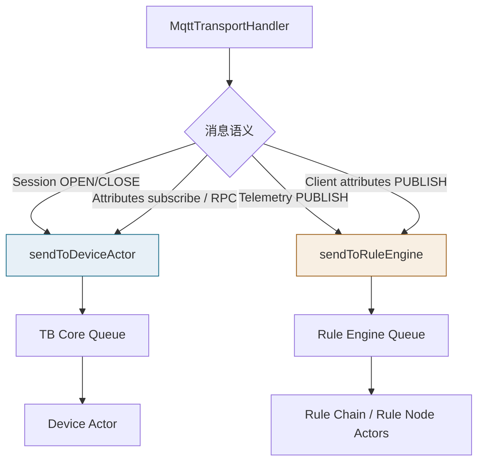

### 4.3 消息形态变化

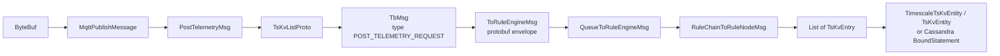

### 4.4 PUBACK 与数据库完成不是同一时序

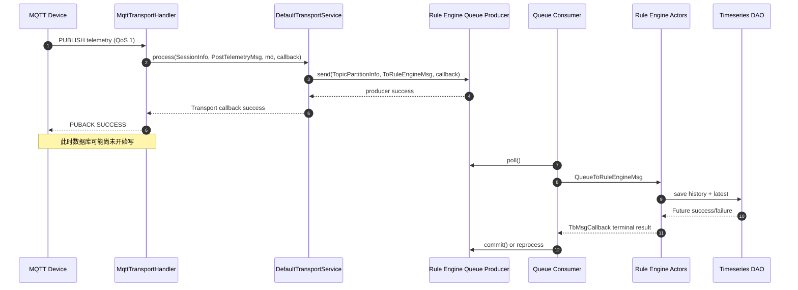

静态全景图见 [01-mqtt-ingress.svg](../../assets/architecture/01-mqtt-ingress.svg)。

---

## 五、时序图

完整 PlantUML 源文件：[sequence.puml](sequence.puml)；经 PlantUML CLI 验证生成的静态图：[sequence.svg](sequence.svg)。它同时画出认证、Session Open、Telemetry Queue 和三种数据库分支。核心源码如下，可直接交给 PlantUML CLI 或 JetBrains PlantUML 插件：

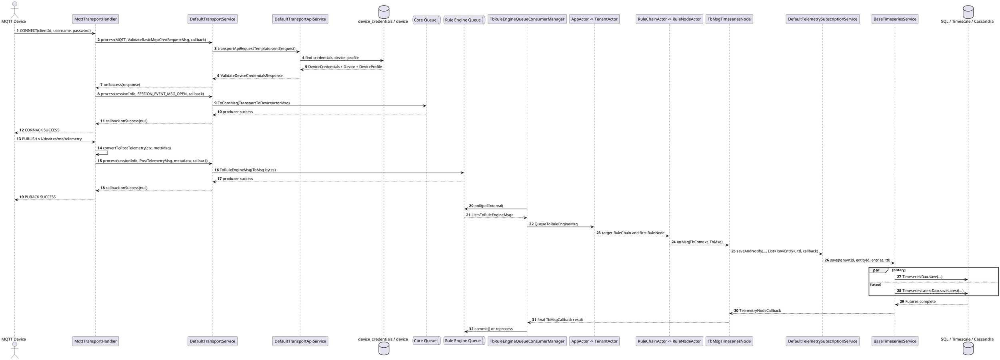

---

## 六、数据变化

### 6.1 对象、状态和持久化变化

| 类别 | 读取/创建/修改内容 | 发生位置 | 生命周期与注意点 |
|---|---|---|---|
| Netty Channel | Pipeline、远端地址、TLS session、channel close listener | `MqttTransportServerInitializer` / `MqttTransportHandler` | 每个 TCP 连接一个 Channel；异常或认证失败关闭 |
| MQTT Session Context | `DeviceInfo`、`DeviceProfile`、`SessionInfoProto`、connected、消息队列、topic type | `DeviceSessionCtx` | 每连接维护；连接前消息可暂存，超过每设备限制关闭连接 |
| Transport Session registry | `sessions` 中的 `SessionMetaData` | `DefaultTransportService.registerAsyncSession(...)` | JVM/Transport service 内会话注册；本路径没有 Redis session 写入证据 |
| 凭据与实体 | 读取 `device_credentials`、`device`、`device_profile` | `DefaultTransportApiService` | 认证路径只读；普通 telemetry 不更新 Device 行 |
| Device Profile cache | 认证时读取 Profile；发送 telemetry 时读取 default Rule Chain/Queue | `deviceProfileCache` | Profile 变更由独立生命周期/缓存失效流程传播 |
| Activity state | 记录 transport activity；Session Event 进入 Device Actor | `recordActivityInternal(...)`、Core Queue | active/inactive 最终状态属于 Device State 独立流程 |
| Rule Engine message | `TbMsg`、metadata、queueName、ruleChainId、callback | `DefaultTransportService` | 单次上报可能按 timestamp batch 拆成多个消息 |
| Actor mailbox | `QueueToRuleEngineMsg`、`RuleChainToRuleNodeMsg` | App/Tenant/Rule Actor | Actor message 是临时内存状态，不是数据库表 |
| 历史遥测 | `ts_kv` 或 `ts_kv_cf` | `TimeseriesDao` 实现 | 由 `DATABASE_TS_TYPE` 选择一个历史后端 |
| 最新遥测 | `ts_kv_latest` 或 `ts_kv_latest_cf` | `TimeseriesLatestDao` 实现 | `skipLatestPersistence=true` 时不写 |
| 键字典 | `ts_kv_dictionary(key, key_id)` | SQL/Timescale DAO | 把字符串 key 映射为 int，减小历史表索引和行宽 |
| WebSocket 通知 | time-series update callback | `DefaultTelemetrySubscriptionService` | 以 DB save Future 成功为触发条件，不写 Kafka topic |
| Entity View | 查找受影响 Entity View 并投影匹配 keys | `addEntityViewCallback(...)` | 独立异步 callback，不构成 MQTT PUBACK 边界 |

### 6.2 Queue/Topic 变化

| 消息 | Queue 抽象 | Kafka 配置下的典型 topic | key / 分区依据 |
|---|---|---|---|
| 凭据验证 request/response | Transport API request template | transport API request/response topics | request UUID，用于关联 Future |
| Session Open | Core producer | Core topic | routing key / device 分区 |
| Telemetry `TbMsg` | Rule Engine producer | 默认基础 topic `tb_rule_engine`，Queue 配置可形成具体 topic | `TbMsg.id` 为 Kafka key；`partitionService.resolve(... tenantId, originator)` 决定目标分区 |

### 6.3 事务边界

这一链路没有一个从 MQTT `PUBLISH` 覆盖到数据库的 Spring/JDBC 事务。Queue producer、Queue consumer、Rule Node、history DAO 和 latest DAO 都是异步边界。

`BaseTimeseriesService.doSave(...)` 对每个 `TsKvEntry` 组装多个 `ListenableFuture`：

```text
timeseriesDao.savePartition(...)
timeseriesDao.save(...)
timeseriesLatestDao.saveLatest(...)
```

然后用 `Futures.allAsList(...)` 汇总完成状态。这保证“主 Future 只有全部子 Future 成功才成功”，但不提供回滚：如果 history 已成功而 latest 失败，前一个独立写入不会被统一事务撤销。重复消费、补偿和查询容错必须考虑 latest/history 暂时不一致。

---

## 七、源码分析

### 7.1 直接参与主链路的类与接口

| 分层 | 类型 | 作用 |
|---|---|---|
| 启动/网络 | `org.thingsboard.server.transport.mqtt.MqttTransportService` | Spring 管理的 MQTT Netty server |
| 网络 | `org.thingsboard.server.transport.mqtt.MqttTransportServerInitializer` | 构造每连接 ChannelPipeline |
| 协议 | `org.thingsboard.server.transport.mqtt.MqttTransportHandler` | MQTT 状态机、主题分流、协议 ACK 和 session callback |
| 会话 | `org.thingsboard.server.transport.mqtt.session.DeviceSessionCtx` | 普通设备会话状态和连接前消息队列 |
| 适配接口 | `org.thingsboard.server.transport.mqtt.adaptors.MqttTransportAdaptor` | MQTT payload 与 Transport protobuf 的边界 |
| 适配实现 | `org.thingsboard.server.transport.mqtt.adaptors.JsonMqttAdaptor` | JSON telemetry/attributes/RPC 转换 |
| 适配实现 | `org.thingsboard.server.transport.mqtt.adaptors.ProtoMqttAdaptor` | Protobuf payload 转换 |
| 适配实现 | `org.thingsboard.server.transport.mqtt.adaptors.BackwardCompatibilityAdaptor` | 先尝试 Proto adaptor，失败后回退 JSON adaptor |
| Transport 接口 | `org.thingsboard.server.common.transport.TransportService` | 各协议共享的认证、会话、telemetry、attributes、RPC 契约 |
| Transport 实现 | `org.thingsboard.server.common.transport.service.DefaultTransportService` | 限流、activity、session、Core/Rule Queue producer 编排 |
| 认证 | `org.thingsboard.server.service.transport.DefaultTransportApiService` | 凭据、Device、Profile 查询和响应构造 |
| 消息 | `org.thingsboard.server.common.msg.TbMsg` | Rule Engine 的协议无关消息 |
| 消息 | `org.thingsboard.server.gen.transport.TransportProtos.ToRuleEngineMsg` | Queue 上的 protobuf envelope |
| Queue 接口 | `org.thingsboard.server.queue.TbQueueProducer<T>` | 可插拔 producer 契约 |
| Queue 接口 | `org.thingsboard.server.queue.TbQueueConsumer<T>` | subscribe/poll/commit/unsubscribe 契约 |
| Queue provider | `org.thingsboard.server.queue.provider.TbQueueProducerProvider` | 按部署角色提供 Core/Rule Engine producer |
| RE consumer | `org.thingsboard.server.service.queue.ruleengine.TbRuleEngineQueueConsumerManager` | 批量 poll、submit、等待、策略分析、commit/reprocess |
| RE callback | `org.thingsboard.server.service.queue.TbMsgPackCallback` | 将消息终态写回 pack processing context |
| Actor envelope | `org.thingsboard.server.common.msg.queue.QueueToRuleEngineMsg` | tenant + TbMsg + relation types + failure 信息 |
| Actor root | `org.thingsboard.server.actors.app.AppActor` | 按 tenant 路由 |
| Actor tenant | `org.thingsboard.server.actors.tenant.TenantActor` | 按 ruleChainId 路由 |
| Actor chain | `org.thingsboard.server.actors.ruleChain.RuleChainActor` | Rule Chain mailbox 与消息类型分派 |
| Chain processor | `org.thingsboard.server.actors.ruleChain.RuleChainActorMessageProcessor` | 拓扑、first node、relation 路由 |
| Actor node | `org.thingsboard.server.actors.ruleChain.RuleNodeActor` | 单 Rule Node mailbox |
| Node processor | `org.thingsboard.server.actors.ruleChain.RuleNodeActorMessageProcessor` | 实例化 `TbNode` 并调用 `onMsg` |
| Rule Node | `org.thingsboard.rule.engine.telemetry.TbMsgTimeseriesNode` | 将 `TbMsg.data` 还原为 `TsKvEntry` 并选择 TTL/latest 策略 |
| Node callback | `org.thingsboard.rule.engine.telemetry.TelemetryNodeCallback` | DB Future 成功走 Success relation，失败走 Failure relation |
| 服务 | `org.thingsboard.server.service.telemetry.DefaultTelemetrySubscriptionService` | 存储校验、API Usage、WebSocket/Entity View 通知 |
| DAO service | `org.thingsboard.server.dao.timeseries.BaseTimeseriesService` | history/partition/latest Future 编排 |
| DAO 接口 | `org.thingsboard.server.dao.timeseries.TimeseriesDao` | 历史遥测后端策略 |
| DAO 接口 | `org.thingsboard.server.dao.timeseries.TimeseriesLatestDao` | 最新值后端策略 |

### 7.2 关键实现继承关系

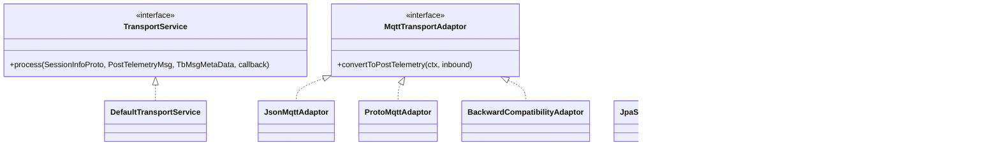

### 7.3 为什么有三次消息转换

1. `MqttPublishMessage -> PostTelemetryMsg`：删除 MQTT topic、ByteBuf、QoS 等协议细节，使 HTTP/CoAP/LwM2M 可复用 Transport Service。
2. `PostTelemetryMsg -> TbMsg`：补齐 tenant/device/customer/profile、metadata、Rule Chain 和 Queue，把接入事件变成规则引擎事件。
3. `TbMsg -> TsKvEntry`：只有 Save Timeseries Rule Node 决定持久化时才构造 DAO 模型，使 Rule Chain 可以在落库前过滤、变换或转发。

这不是无意义 DTO 堆叠，而是三个稳定边界：协议边界、队列/规则边界、持久化边界。

---

## 八、Actor 分析

### 8.1 本流程涉及哪些 Actor

Telemetry PUBLISH 涉及 `AppActor`、`TenantActor`、`RuleChainActor` 和 `RuleNodeActor`，但不涉及 `DeviceActor`。Session Open 是相反的对照路径：它通过 Core Queue 到 `AppActor -> TenantActor -> DeviceActor`。

### 8.2 Actor 创建与生命周期

1. `org.thingsboard.server.actors.service.DefaultActorService.initActorSystem()` 创建 APP、TENANT、DEVICE、RULE 四类 dispatcher，并创建根 `AppActor`。
2. `AppActor` 收到 `APP_INIT_MSG` 后执行 `initTenantActors()`；配置允许时为已有 tenant 建 Actor，也可在消息到达时 `getOrCreateTenantActor(...)`。
3. `TenantActor` 维护 Rule Chain Actor 和 Device Actor 子节点；telemetry 按 `TbMsg.ruleChainId` 找到 Rule Chain。
4. `RuleChainActorMessageProcessor` 根据 Rule Chain 配置创建 `RuleNodeActor`，并保存 first node 与 relation 拓扑。
5. `RuleNodeActorMessageProcessor.initComponent(RuleNode ruleNode)` 通过配置中的类名反射创建 `TbNode`，随后调用 `tbNode.init(...)`。
6. 组件生命周期消息可更新、暂停或删除 Rule Chain/Node Actor；停止时 Rule Node 的 `destroy()` 清理 listener 等资源。

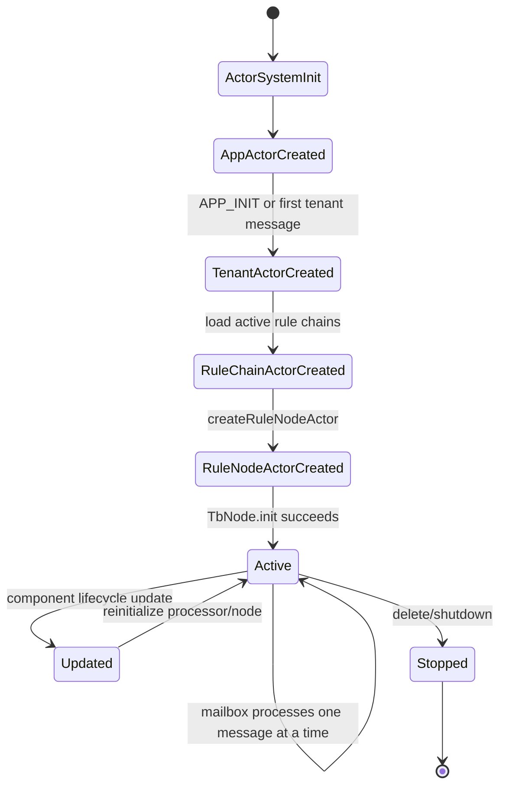

### 8.3 为什么不用普通 Java 对象直接调用

- **租户与规则链隔离**：消息先按 Tenant、Rule Chain、Rule Node 分层进入 mailbox，避免所有规则执行共享一把锁。
- **局部串行语义**：同一个 Actor 的消息按 mailbox 处理，Rule Node 的可变生命周期状态不需要暴露给 Queue consumer 线程。
- **背压位置明确**：Queue pack 等待 `TbMsgCallback`；Actor mailbox 与 dispatcher 吞吐成为可监控的异步边界。
- **动态生命周期**：Rule Chain/Node 配置变化可以通过生命周期消息在 Actor 树中传播，不要求重启 Transport。
- **集群路由**：singleton node 或分区不在本节点时，processor 可转发到目标分区，而调用者仍使用同一消息契约。

Actor 并不自动提供数据库事务、exactly-once 或无限 mailbox。Queue 重试可能让同一业务消息再次进入 Actor；Rule Node 的外部副作用仍需考虑幂等。

---

## 九、Kafka 分析

### 9.1 Kafka 是可选实现，不是硬编码依赖

`thingsboard.yml` 的 `queue.type` 默认值是 `in-memory`，可选 `kafka`、`aws-sqs`、`pubsub`、`service-bus`、`rabbitmq`。主链路只依赖 `TbQueueProducer`/`TbQueueConsumer`。因此，单体开发环境不能因为看见“Rule Engine Queue”就断言一定启动了 Kafka。

### 9.2 `queue.type=kafka` 时的 Producer

Transport 微服务由 `org.thingsboard.server.queue.provider.KafkaTbTransportQueueFactory.createRuleEngineMsgProducer()` 创建：

```text
client.id     = transport-node-rule-engine-<serviceId>
default topic = topicService.buildTopicName(ruleEngineSettings.getTopic())
base topic    = tb_rule_engine（默认配置）
```

`org.thingsboard.server.queue.kafka.TbKafkaProducerTemplate.send(TopicPartitionInfo tpi, T msg, TbQueueCallback callback)`：

1. 按 `tpi.getFullTopicName()` 确保 topic 存在。
2. 使用 `msg.getKey().toString()` 作为 Kafka record key；telemetry 这里是 `TbMsg.id`。
3. 使用 `msg.getData()` 作为 protobuf bytes。
4. `producer.send(...)` 成功回调 `TbQueueCallback.onSuccess(...)`，失败回调 `onFailure(...)`。

这个 producer callback 正是 MQTT `PUBACK` 的上游，不是 consumer commit 的回调。

### 9.3 Topic、Partition 与 Consumer Group

`DefaultTransportService` 调用：

```java
partitionService.resolve(
    ServiceType.TB_RULE_ENGINE,
    tbMsg.getQueueName(),
    tenantId,
    tbMsg.getOriginator()
)
```

目标 Queue 来自 Device Profile 的 `defaultQueueName`。默认基础 topic 配置为 `tb_rule_engine`，具体 Queue 可以使用自己的 topic。分区解析把 tenant、originator 和 Queue 纳入路由，目的是让同一实体在选定 Queue 策略下获得可预测的处理位置。

`org.thingsboard.server.queue.provider.KafkaTbRuleEngineQueueFactory.createToRuleEngineMsgConsumer(Queue configuration)` 构造：

```text
topic      = configuration.topic
client.id  = re-<queueName>-consumer-<serviceId>-<counter>
group.id   = re-<queueName>-consumer
isolated tenant group.id = re-<queueName>-isolated-<tenantId>-consumer
```

### 9.4 消费、提交与重试

Kafka 实现的 `TbKafkaConsumerTemplate.doPoll(long)` 调用 `KafkaConsumer.poll(Duration)`；`doCommit()` 使用 `consumer.commitSync()`。但是否立即 commit 由 ThingsBoard Processing Strategy 决定：

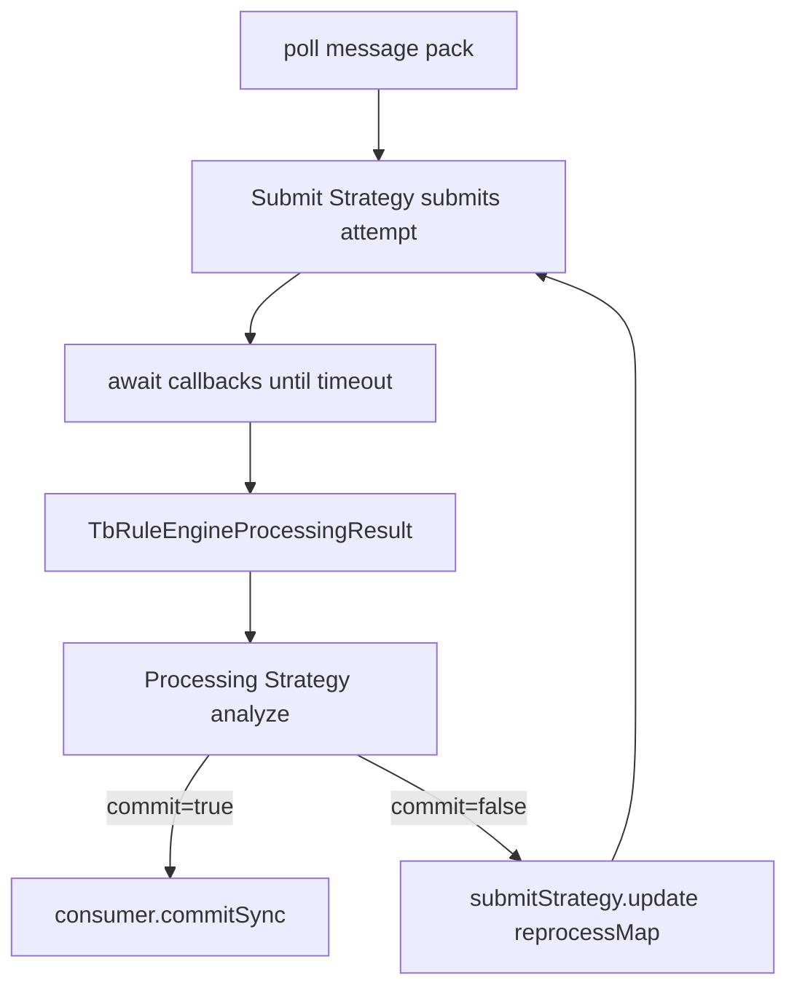

Submit Strategy 支持 burst、batch、sequential-by-originator 等行为；Processing Strategy 支持跳过失败或按成功/失败/超时集合重试。实际策略存放在 `Queue` 配置中，不能仅凭代码给所有部署指定一种固定语义。

### 9.5 为什么需要 Queue/Kafka

- Transport 可以快速完成协议响应，不被 JavaScript Rule Node、外部 REST 调用或数据库延迟直接占住 Netty worker。
- topic partition 和 consumer group 支持 Rule Engine 水平扩展。
- broker 保存未消费消息，允许 Rule Engine 短时不可用后恢复处理。
- Queue Profile 可为高优先级、批处理或租户隔离配置不同的吞吐/失败策略。

代价是端到端事务被拆开，ACK 提前、重复处理、consumer lag 和顺序策略都必须显式理解。

---

## 十、数据库分析

### 10.1 认证阶段：PostgreSQL 实体数据

MQTT 认证通过 `DeviceCredentialsService` 和 `DeviceService` 读取：

| 表/数据 | 读取目的 | 为什么在实体数据库 |
|---|---|---|
| `device_credentials` | 按 credentialsId/hash 找 ACCESS_TOKEN、MQTT_BASIC 或 X.509 凭据 | 强一致的设备身份配置，更新频率低，适合关系数据库和缓存 |
| `device` | 得到 tenant/customer/device/profile/name/type | 业务实体需要唯一约束、关系和事务 CRUD |
| `device_profile`（通常经 cache） | Transport 类型、默认 Rule Chain、默认 Queue 和配置 body | 配置型实体，不是高吞吐时序数据 |

普通 telemetry 上报不会更新这些行；activity/online 状态由 Session/Device State 独立流程处理。

### 10.2 SQL/Timescale 共同的最新值表

`ts_kv_latest` 主键为 `(entity_id, key)`，每个实体每个 telemetry key 只保留一行：

```sql
CREATE TABLE ts_kv_latest (
  entity_id uuid NOT NULL,
  key int NOT NULL,
  ts bigint NOT NULL,
  bool_v boolean,
  str_v varchar(10000000),
  long_v bigint,
  dbl_v double precision,
  json_v json,
  PRIMARY KEY (entity_id, key)
);
```

`org.thingsboard.server.dao.sqlts.SqlTimeseriesLatestDao.saveLatest(...)` 负责 upsert。`key` 是 `ts_kv_dictionary.key_id`，不是字符串本身。这个表用于“查询设备最新温度”等请求，避免从海量 history 中执行 `ORDER BY ts DESC LIMIT 1`。

### 10.3 PostgreSQL SQL 历史后端

当 `database.ts.type=sql`：

- 实现：`org.thingsboard.server.dao.sqlts.sql.JpaSqlTimeseriesDao`。
- 历史表：`ts_kv`，按 `sql.postgres.ts_key_value_partitioning` 创建 RANGE partition，默认配置是 `MONTHS`。
- `savePartitionIfNotExist(ts)` 负责在写入前确保目标分区存在。
- 单点先转成 `TsKvEntity`，再进入 SQL blocking/batch queue。
- TTL cleanup 可以按 system TTL 删除旧分区或旧记录。

适合希望只运维 PostgreSQL、数据规模可由分区和硬件承受的部署。

### 10.4 TimescaleDB 历史后端

当 `database.ts.type=timescale`：

- 实现：`org.thingsboard.server.dao.sqlts.timescale.TimescaleTimeseriesDao`。
- 安装：`TimescaleTsDatabaseSchemaService.createDatabaseSchema()` 执行 `create_hypertable('ts_kv', 'ts', chunk_time_interval => ...)`。
- 表主键：`(entity_id, key, ts)`；时间列 `ts` 是 bigint 毫秒值。
- 配置：`sql.timescale.chunk_time_interval`，3.6.4 的 yml 默认是 `604800000` ms，即 7 天。
- `TimescaleTimeseriesDao.savePartition(...)` 直接返回成功 Future，因为 chunk 由 TimescaleDB 根据 `ts` 自动创建/路由。
- `save(...)` 把 entry 转成 `TimescaleTsKvEntity`，通过 `TbSqlBlockingQueueWrapper` 批量调用 insert repository。

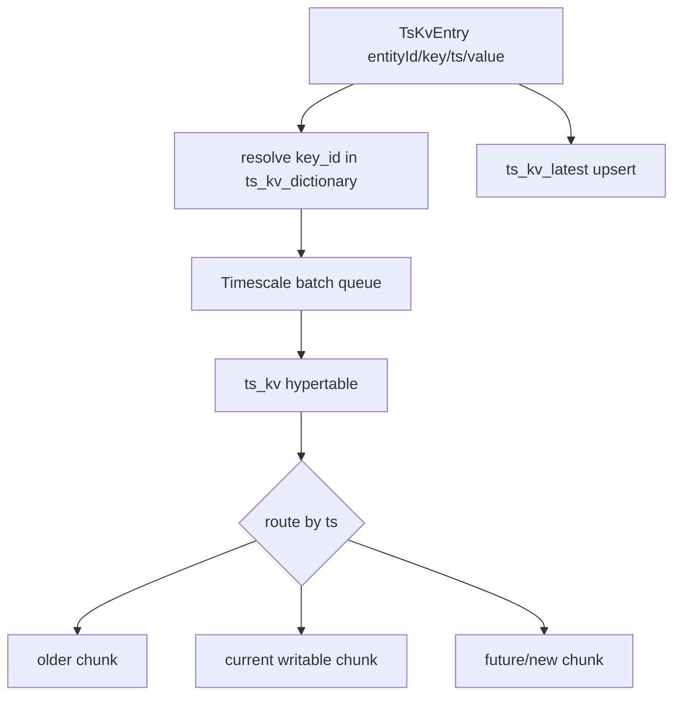

TimescaleDB 在这里不是独立于 PostgreSQL 的网络服务；它是 PostgreSQL extension。实体表、`ts_kv_latest` 和 Hypertable 可以位于同一个 PostgreSQL 实例中，但 history 的分片/查询由 TimescaleDB 扩展接管。

### 10.5 Cassandra 历史后端

当 `database.ts.type=cassandra`：

- 历史实现：`org.thingsboard.server.dao.timeseries.CassandraBaseTimeseriesDao`。
- 历史表：`ts_kv_cf`，partition key 是 `(entity_type, entity_id, key, partition)`，clustering key 是 `ts`。
- 分区登记表：`ts_kv_partitions_cf`，用于发现 entity/key 的时间分区。
- latest 实现：`org.thingsboard.server.dao.timeseries.CassandraBaseTimeseriesLatestDao`，写 `ts_kv_latest_cf`。
- 每条历史写可以使用 Cassandra 原生 TTL；`savePartition(...)` 对非固定分区写登记表并使用 cache 减少重复登记。

Cassandra 把分区建模放在应用层 schema 中，适合横向扩展写吞吐；代价是查询模式必须围绕 partition key 设计，实体事务和 ad hoc SQL 能力弱于 PostgreSQL/TimescaleDB。

### 10.6 Redis

本章 telemetry 持久化主链中没有 Redis 写调用。Device Profile 通过抽象 cache 读取，MQTT session 注册在 `DefaultTransportService` 的运行时结构中；不能把“ThingsBoard 支持 Redis”推导为“每次 telemetry 都写 Redis”。Redis 的本地/远程缓存和跨节点失效将在独立章节分析。

历史后端由 `database.ts.type` / `DATABASE_TS_TYPE` 选择；最新值后端由独立的 `database.ts_latest.type` / `DATABASE_TS_LATEST_TYPE` 选择。因此部署可以组合成 Cassandra history + SQL latest 等 hybrid 模式，而不要求 history 和 latest 使用同一种数据库。

### 10.7 后端选择图

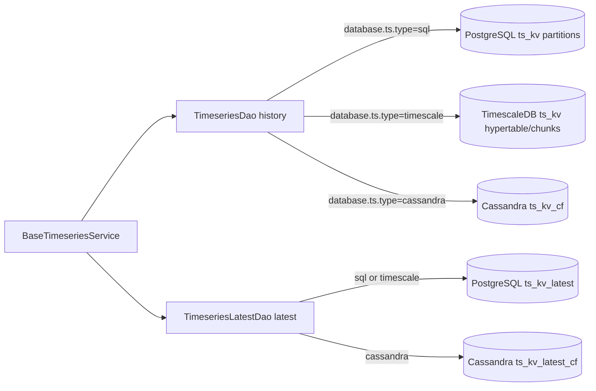

---

## 十一、异常处理

### 11.1 失败矩阵

| 失败点 | 源码行为 | MQTT 侧表现 | Queue/事务后果 |
|---|---|---|---|
| MQTT decoder 失败 | `channelRead(...)` 记录错误并 `closeCtx(ctx)` | 连接关闭 | 未创建业务消息 |
| 非 MQTT message | debug 后关闭连接 | 连接关闭 | 无 Queue 写 |
| 凭据查询异常 | callback `onError` 返回 `SERVER_UNAVAILABLE_5` 后关闭 | 失败 CONNACK | 无 Session Open |
| 凭据无匹配 DeviceInfo | 根据字段返回 NOT_AUTHORIZED/BAD_USERNAME 等并关闭 | 失败 CONNACK | 无 Session、无 telemetry |
| Session Open producer 失败 | 返回 server unavailable，关闭连接 | 无成功 CONNACK | Device Actor 未收到或未确认该 open producer |
| 每设备 session msg queue 超限 | 直接关闭当前 session | 连接断开 | 已排队消息不再继续接收 |
| telemetry JSON/Proto 无法转换 | `AdaptorException`；按 Profile/MQTT 版本发送 payload-invalid PUBACK 或关闭 | 错误 PUBACK 或断连 | 不写 Rule Queue |
| topic 不合法 | 记录 activity，MQTT 5 可返回 topic-invalid | 错误 ACK | 不写 Rule Queue |
| API/data point limit | `checkLimits(...)` 调用 callback error | handler 关闭连接 | 不写或未完整写 Rule Queue |
| Rule Queue producer 失败 | Transport callback error -> `closeCtx(ctx)` | 不返回成功 PUBACK，连接关闭 | broker 未确认该消息 |
| Actor 反序列化/同步路由异常 | `TbMsgPackCallback.onFailure(...)` | 设备此前可能已收到 PUBACK | Processing Strategy 决定 retry/skip/commit |
| Root Rule Chain 不存在 | callback failure | 设备此前可能已 ACK | 计入 pack failure并按策略处理 |
| 指定 Rule Chain Actor 不存在 | 当前源码记录 trace，并带有“TODO dead letters”后 callback success | 无额外反馈 | 可能被视为成功并提交，需特别监控配置一致性 |
| Save Timeseries 收到非 telemetry/空 body | `ctx.tellFailure(...)` | 无 MQTT 反馈 | 走 Rule Engine Failure relation；最终结果取决于链 |
| DB storage 因 API limits 关闭 | callback failure | 无 MQTT 反馈 | Rule Node Failure relation/pack strategy |
| history/latest 任一 Future 失败 | 聚合 Future 失败，`TelemetryNodeCallback.onFailure` | 无 MQTT 反馈 | 已完成的独立写不会自动回滚 |
| Queue pack 超时 | result 标记 timeout | 无 MQTT 反馈 | Processing Strategy 决定重试或跳过；可能导致重复副作用 |

### 11.2 失败状态流

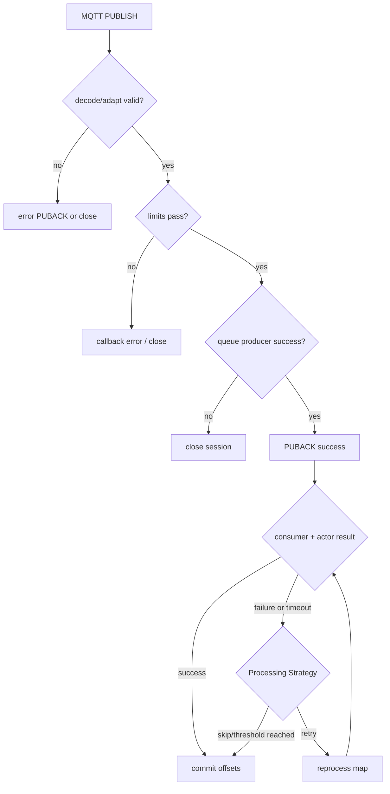

### 11.3 生产排障顺序

1. **Transport**：检查 decoder/adaptor/limit 日志以及连接是否被关闭。
2. **Producer**：确认目标 Queue、topic、partition 和 producer error；注意 PUBACK 只证明这一层。
3. **Broker/Queue**：检查 consumer group lag、partition assignment 和 topic 是否与 Queue Profile 一致。
4. **Rule Engine**：检查 tenant 是否启用 RE、目标 Rule Chain 是否存在、消息是否到达 Save Timeseries、Failure relation 是否吞掉异常。
5. **DAO**：分别检查 history 和 latest 批处理队列、SQL/Cassandra 错误和写入延迟。
6. **查询**：区分查询 `ts_kv_latest` 还是历史 `ts_kv`；检查 key dictionary、时间范围和设备 UUID。

---

## 十二、源码阅读路线

建议严格按下面顺序阅读，避免一开始陷入全部 Transport 或 Rule Engine 实现：

1. `org.thingsboard.server.transport.mqtt.MqttTransportHandler.processDevicePublish(...)`  
   先看 topic 如何决定消息类型，以及 telemetry 与 attributes/RPC 的分叉。
2. `org.thingsboard.server.transport.mqtt.adaptors.JsonMqttAdaptor.convertToPostTelemetry(...)`  
   看网络 payload 如何脱离 MQTT 变成 protobuf。
3. `org.thingsboard.server.common.transport.service.DefaultTransportService.process(...PostTelemetryMsg...)`  
   对比同文件中的 `process(...SessionEventMsg...)`，确认 telemetry 与 Device Actor 路径不同。
4. `org.thingsboard.server.common.transport.service.DefaultTransportService.sendToRuleEngine(...)`  
   看 Device Profile 如何决定 Rule Chain/Queue，以及 `TopicPartitionInfo` 如何产生。
5. `org.thingsboard.server.service.queue.ruleengine.TbRuleEngineQueueConsumerManager.processMsgs(...)`  
   重点看 callback、timeout、Processing Decision 和 commit 的关系。
6. `org.thingsboard.server.actors.app.AppActor` 与 `org.thingsboard.server.actors.tenant.TenantActor`  
   只跟踪 `QUEUE_TO_RULE_ENGINE_MSG` case，不要先阅读所有设备消息。
7. `org.thingsboard.server.actors.ruleChain.RuleChainActorMessageProcessor.onQueueToRuleEngineMsg(...)`  
   看 first node、指定 node 和 relation 的路由。
8. `org.thingsboard.server.actors.ruleChain.RuleNodeActorMessageProcessor.onRuleChainToRuleNodeMsg(...)`  
   找到真正调用 `tbNode.onMsg(...)` 的位置。
9. `org.thingsboard.rule.engine.telemetry.TbMsgTimeseriesNode.onMsg(...)`  
   看 timestamp、TTL、skipLatestPersistence 和 Success/Failure callback。
10. `org.thingsboard.server.dao.timeseries.BaseTimeseriesService.doSave(...)`  
    理解 history/latest 双写和非事务性 Future 聚合。
11. 根据部署后端选择一个实现：`JpaSqlTimeseriesDao`、`TimescaleTimeseriesDao` 或 `CassandraBaseTimeseriesDao`。
12. 最后回读 `MqttTransportHandler.onValidateDeviceResponse(...)` 和 `DefaultTransportApiService.validateCredentials(...)`，补齐认证与 Session Open。

下一章建议阅读 [02 Device 创建流程](../02-device-create/README.md)。Device 创建决定 `device`、`device_credentials`、`device_profile_id` 和默认 Rule Chain 等前置数据，是理解本章认证结果来源的最自然后续。

---

## 十三、常见面试题

### 13.1 高级开发问题

**问题 1：MQTT telemetry 在 ThingsBoard 3.6.4 中会先经过 Device Actor 吗？**

标准答案：不会。`MqttTransportHandler` 将 payload 转成 `PostTelemetryMsg`，`DefaultTransportService.process(...PostTelemetryMsg...)` 直接构造 `TbMsg` 并投递 Rule Engine Queue。Queue consumer 之后进入 App/Tenant/RuleChain/RuleNode Actor。Session Open、属性订阅和 RPC 等消息才走 Core Queue/Device Actor。

**问题 2：设备收到 QoS 1 PUBACK，能否断言 `ts_kv` 已写成功？**

标准答案：不能。`getPubAckCallback(...)` 连接的是 Rule Engine Queue producer callback。producer 接受消息后返回 PUBACK，Rule Engine consumer、Actor、Save Timeseries 和数据库发生在后面。

**问题 3：为什么同时有 `ts_kv` 和 `ts_kv_latest`？**

标准答案：`ts_kv` 保存时间序列历史，支持时间范围和聚合；`ts_kv_latest` 以 `(entity_id, key)` 为主键保存最新值，使最新状态查询不扫描历史。代价是每点双写以及短时不一致可能。

**问题 4：一个 MQTT JSON 中有多个时间戳批次会怎样？**

标准答案：Adaptor 生成多个 `TsKvListProto`；`DefaultTransportService` 为每个列表创建一个 `TbMsg`，`MsgPackCallback` 聚合 producer 回调。全部 Queue send 成功后 Transport callback 才成功。

**问题 5：Save Timeseries 节点如何确定时间戳和 TTL？**

标准答案：节点可按 `useServerTs` 选择当前服务器时间，否则使用 `TbMsg` metadata 的 `ts`。TTL 优先取 metadata `TTL`，否则节点 `defaultTTL`；为 0 时使用 Tenant Profile 默认存储 TTL。

**问题 6：`skipLatestPersistence` 有什么后果？**

标准答案：节点调用 `saveWithoutLatestAndNotify(...)`，只写历史，不更新 `ts_kv_latest`/`ts_kv_latest_cf`。最新值查询可能继续返回旧值，但历史曲线包含新点。

**问题 7：TimescaleDB 为什么不需要应用创建 `ts_kv` partition？**

标准答案：安装服务把 `ts_kv` 转成按 `ts` 的 Hypertable；TimescaleDB 自动选择/创建 chunk。因此 `TimescaleTimeseriesDao.savePartition(...)` 是立即成功的 no-op，而普通 PostgreSQL DAO 要确保 RANGE partition 存在。

**问题 8：这一链路有没有跨 history/latest 的事务？**

标准答案：没有。`BaseTimeseriesService` 并行收集 partition/history/latest 的 Future，再汇总成功状态；没有覆盖 Queue 和多 DAO 写入的统一事务，已成功的子写不会因另一子写失败而回滚。

### 13.2 架构师问题

**问题 9：Queue 为什么放在 Transport 与 Rule Engine 之间？**

标准答案：隔离 Netty I/O 与规则/数据库延迟，提供缓冲、分区、水平扩展和失败重试，并允许 Queue Profile 定义提交与处理策略。代价是端到端确认提前以及至少一次语义下的重复处理风险。

**问题 10：Kafka 是 ThingsBoard MQTT telemetry 的必需组件吗？**

标准答案：不是。业务代码依赖 `TbQueueProducer`/`TbQueueConsumer`，`queue.type` 可选择 in-memory、Kafka、SQS、Pub/Sub、Service Bus 或 RabbitMQ。Kafka 只是生产分布式部署中常用的实现。

**问题 11：Queue consumer 在什么时机提交 Kafka offset？**

标准答案：`TbRuleEngineQueueConsumerManager` 等待消息包 callback 或超时，构造 `TbRuleEngineProcessingResult`，交给 Queue 的 Processing Strategy 分析。只有 decision `isCommit()` 才调用 consumer `commit()`；否则更新 reprocess map 再提交尝试。

**问题 12：Rule Chain 配置错误可能如何造成“ACK 成功但数据消失”？**

标准答案：Transport producer 成功已经返回 PUBACK。后续如果默认 Rule Chain 没有 Save Timeseries、消息被过滤、Rule Chain 不存在或策略跳过失败，数据库不会出现数据。特别是当前 `TenantActor` 对不存在的指定 Rule Chain 有 trace 日志和 TODO dead letter，然后 callback success，需要通过配置审计和指标发现。

**问题 13：如何选择 PostgreSQL partition、TimescaleDB 和 Cassandra？**

标准答案：选择取决于写入规模、查询模型和运维能力。普通 SQL 后端最简单但依赖 PostgreSQL partition 管理；TimescaleDB 保留 SQL/PostgreSQL 生态并用 Hypertable/chunk 优化时序范围与聚合；Cassandra 更偏横向写扩展，但查询必须围绕 partition key，实体数据仍通常在 PostgreSQL。不能只按“数据量大”一个指标选择。

**问题 14：怎样设计端到端可靠性监控？**

标准答案：至少分四层记录同一消息的可关联标识和指标：Transport producer success/failure、Queue topic/partition/lag、Rule Engine processing success/failure/timeout、history/latest DAO 写入与延迟。只监控 MQTT 连接数或 PostgreSQL QPS 无法覆盖中间丢失与积压。

---

## 导航

[返回知识库首页](../../README.md) | [返回全书目录](../../SUMMARY.md) | [下一章：02 Device 创建流程](../02-device-create/README.md)
