# 02 Device 创建流程

> 源码基线：ThingsBoard `3.6.4`，提交 `0cb411fc90`。本章主线是服务端两个正式 REST 创建接口；Provision、Gateway、LwM2M 自动注册、Rule Engine、Edge 和导入入口单独列出，不把不同确认语义拼成一条调用链。

[上一篇：01 MQTT 消息进入系统](../01-mqtt-message-ingress/README.md) | [HTML 版](index.html) | [全书目录](../../SUMMARY.md) | [PlantUML 源文件](sequence.puml) | [时序图 SVG](sequence.svg) | [架构图 SVG](../../assets/architecture/02-device-create.svg) | [下一篇：03 Device 删除流程](../03-device-delete/README.md)

---

## 一、流程目标

Device 创建流程把一个来自租户管理端的 `Device` DTO 变成可被 Transport 认证、Device Profile 路由、Rule Engine 感知和 Device State 管理的设备实体。它至少解决五件事：

1. 确定租户、客户和 Device Profile 归属，防止跨租户引用。
2. 为设备生成 ThingsBoard 的 time-based UUID、`created_time` 和唯一身份。
3. 在同一 PostgreSQL 事务中保存 `device` 与一条 `device_credentials`。
4. 在事务提交后失效实体/凭据缓存，并向 Edge、Transport、Core、Rule Engine 传播变化。
5. 异步初始化 `active=false` 的设备状态、触发 `ENTITY_CREATED` 规则消息并记录审计。

### 1.1 四个必须分开的成功点

| 成功点 | 源码语义 | 尚未保证 |
|---|---|---|
| `saveAndFlush()` 返回 | Hibernate SQL 已发送，约束错误可提前暴露 | 外层 Spring 事务已经提交 |
| `DeviceServiceImpl.saveDeviceWithAccessToken(...)` 返回代理调用 | `device` 和 `device_credentials` 的事务已提交 | 集群通知、Rule Engine、审计已完成 |
| REST 返回 `200` | 同步编排没有抛出异常 | 所有异步 Queue 消息均已消费 |
| Rule Engine/Audit/Device State 完成 | 各自异步链路完成 | 与最初实体写入构成跨系统原子事务 |

`device` 与 `device_credentials` 的原子性来自 DAO Service 的 Spring `@Transactional`；数据库提交与 Queue、Actor、审计、Edge 传播之间没有 transactional outbox，也不是一个分布式事务。

### 1.2 本章的核心结论

> Device 创建不是“Controller -> Device Actor -> Database”。标准 REST 主链在进入 Actor 之前已经完成 PostgreSQL 事务；随后才通过 Queue 触发 Device State、生命周期通知和 `ENTITY_CREATED` Rule Engine 消息。`Device CREATED` 生命周期消息不会主动创建 Device Actor，Device Actor 仍按设备消息惰性创建。

---

## 二、入口

### 2.1 本章完整追踪的 REST 入口

| 入口 | 调用者与时机 | 方法 | 凭据行为 |
|---|---|---|---|
| `POST /api/device` | Tenant Admin 在 UI/REST Client 创建或更新设备 | `org.thingsboard.server.controller.DeviceController.saveDevice(Device device, String accessToken)` | 创建时固定生成 `ACCESS_TOKEN`；请求未给 token 时生成 20 位随机串 |
| `POST /api/device-with-credentials` | Tenant Admin 需要 ACCESS_TOKEN、X509、MQTT_BASIC 或 LwM2M 凭据 | `org.thingsboard.server.controller.DeviceController.saveDeviceWithCredentials(SaveDeviceWithCredentialsRequest deviceAndCredentials)` | 使用请求中的显式 `DeviceCredentials` |
| `POST /api/lwm2m/device-credentials` | LwM2M 管理页面调用已废弃的兼容接口 | `org.thingsboard.server.controller.Lwm2mController.saveDeviceWithCredentials(Map<Class<?>, Object>)` | 解包后委托 `DeviceController.saveDeviceWithCredentials(...)`，不是另一套持久化实现 |
| `POST /api/device/bulk_import` | Tenant Admin 导入 CSV | `org.thingsboard.server.controller.DeviceController.processDevicesBulkImport(BulkImportRequest request)` | 每行最终调用 `TbDeviceService.saveDeviceWithCredentials(...)` |

两个核心接口都声明 `hasAnyAuthority('TENANT_ADMIN', 'CUSTOMER_USER')`，但这不等于 Customer User 可以创建设备：创建分支还会调用 `BaseController.checkEntity(null, device, Resource.DEVICE)`，最终以 `Operation.CREATE` 查询 `CustomerUserPermissions.customerEntityPermissionChecker`；该 checker 的允许集合没有 `CREATE`，因此 Customer User 会被拒绝。方法级注解只是第一道门。

### 2.2 其他真实创建入口

| 入口类型 | 源码入口 | 创建场景 | 与 REST 主链的差异 |
|---|---|---|---|
| MQTT / CoAP / HTTP Provision | `org.thingsboard.server.service.device.DeviceProvisionServiceImpl.processCreateDevice(ProvisionRequest, DeviceProfile)` | Device Profile 允许自动 Provision | 直接使用 DAO `DeviceService`，自行发送 created 事件和 Provision 响应；见第 27 章规划 |
| MQTT Gateway | `org.thingsboard.server.service.transport.DefaultTransportApiService.handle(GetOrCreateDeviceFromGatewayRequestMsg)` | Gateway 上报未知子设备且允许创建 | 创建设备后建立 Gateway `Created` 关系并自行推送 `ENTITY_CREATED` |
| LwM2M 自动注册 | `org.thingsboard.server.service.transport.DefaultTransportApiService.handleRegistration(LwM2MRegistrationRequestMsg msg)` | endpoint 未找到且允许注册 | 用锁串行 find-or-create，默认 type 为 `LwM2M` |
| Rule Engine | `org.thingsboard.rule.engine.action.TbAbstractRelationActionNode` 的 create entity 分支 | Relation Action Node 配置为创建不存在的 Device | DAO 写入后由 `TbContext.deviceCreatedMsg(...)` 继续规则链 |
| Edge RPC Consumer | `org.thingsboard.server.service.edge.rpc.processor.device.BaseDeviceProcessor.processDeviceUpdateMsg(...)` | Edge 同步中心端 Device | 保留 Edge 提供的 ID，调用 `saveDevice(device, false)`，不走 REST 权限 |
| Version Control / Import | `org.thingsboard.server.service.sync.ie.importing.impl.DeviceImportService.saveOrUpdate(...)` | 导入实体包或恢复版本 | 按导入选项决定是否连同凭据保存 |
| 安装 / Demo 数据 | `org.thingsboard.server.service.install.DefaultSystemDataLoaderService` | 初始化演示租户 | 启动安装流程内部调用 DAO Service |

Scheduler、普通 RPC 和 Device Actor 不是标准 Device 创建入口。Kafka Consumer 只在 Edge/集群同步等专门链路中间接触发创建，不能把“使用 Kafka”写成所有创建请求的前置条件。

### 2.3 REST 权限入口图

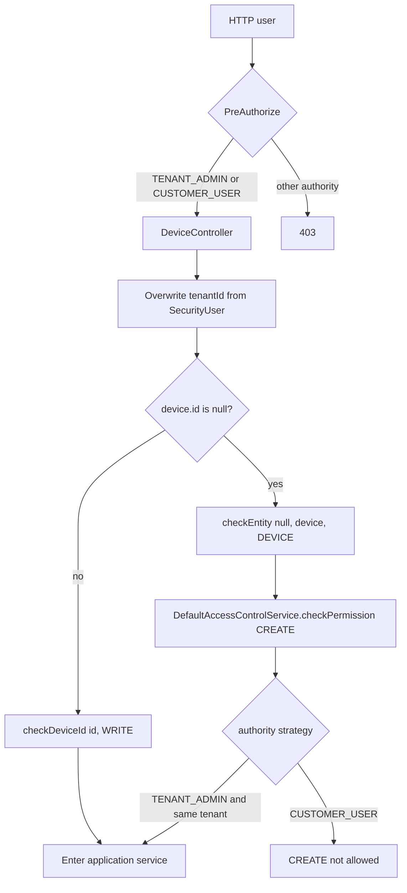

---

## 三、完整调用链

### 3.1 `POST /api/device`：Controller 与应用编排

| 步骤 | 类与方法（完整参数） | 源码位置 | 输入 -> 输出 | 职责与设计原因 |
|---|---|---|---|---|
| 1 | `org.thingsboard.server.controller.DeviceController.saveDevice(Device device, String accessToken)` | [DeviceController.java:219](../../../application/src/main/java/org/thingsboard/server/controller/DeviceController.java#L219) | HTTP JSON + optional token -> `Device` | 强制覆盖 `tenantId`，避免信任请求体租户；区分 create/update |
| 2 | `org.thingsboard.server.controller.BaseController.checkEntity(I entityId, T entity, Resource resource)` | [BaseController.java:840](../../../application/src/main/java/org/thingsboard/server/controller/BaseController.java#L840) | `null, device, DEVICE` -> permission or exception | 创建时用实体内容做权限判断；更新时改走 ID 检查 |
| 3 | `org.thingsboard.server.service.security.permission.DefaultAccessControlService.checkPermission(SecurityUser user, Resource resource, Operation operation, I entityId, T entity)` | [DefaultAccessControlService.java:99](../../../application/src/main/java/org/thingsboard/server/service/security/permission/DefaultAccessControlService.java#L99) | authority/resource/CREATE -> allow/deny | 用 Authority 对应的 Strategy，而不是 Controller 内硬编码权限矩阵 |
| 4 | `org.thingsboard.server.service.entitiy.device.DefaultTbDeviceService.save(Device device, Device oldDevice, String accessToken, User user)` | [DefaultTbDeviceService.java:85](../../../application/src/main/java/org/thingsboard/server/service/entitiy/device/DefaultTbDeviceService.java#L85) | validated request -> saved `Device` | 编排 DAO、版本控制、集群通知、Rule Engine 和审计；它本身不是核心 DB 事务边界 |
| 5 | `org.thingsboard.server.dao.device.DeviceServiceImpl.saveDeviceWithAccessToken(Device device, String accessToken)` | [DeviceServiceImpl.java:235](../../../dao/src/main/java/org/thingsboard/server/dao/device/DeviceServiceImpl.java#L235) | `Device` + token -> committed Device | `@Transactional` 包住 Device 与 Credentials 两次写入 |
| 6 | `org.thingsboard.server.dao.device.DeviceServiceImpl.doSaveDevice(Device device, String accessToken, boolean doValidate)` | [DeviceServiceImpl.java:297](../../../dao/src/main/java/org/thingsboard/server/dao/device/DeviceServiceImpl.java#L297) | device -> device + generated credentials | 将“保存实体”和“默认 ACCESS_TOKEN”组合在同一事务方法内部 |

`DefaultTbDeviceService.save(...)` 在 DAO 事务返回后调用 `autoCommit(user, savedDevice.getId())`，但没有等待其 `ListenableFuture<UUID>`；随后调用 `notifyCreateOrUpdateDevice(...)`。显式凭据入口不调用这里的 `autoCommit(...)`，这是 3.6.4 两条 REST 链的真实差异。

### 3.2 Device 校验、Profile 解析与 ORM 写入

| 步骤 | 类与方法（完整参数） | 源码位置 | 输入 -> 输出 | 职责与设计原因 |
|---|---|---|---|---|
| 1 | `org.thingsboard.server.dao.device.DeviceServiceImpl.saveDeviceWithoutCredentials(Device device, boolean doValidate)` | [DeviceServiceImpl.java:316](../../../dao/src/main/java/org/thingsboard/server/dao/device/DeviceServiceImpl.java#L316) | request DTO -> persisted Device | 主实体保存的模板流程：validate、Profile、normalize、flush、event |
| 2 | `org.thingsboard.server.dao.service.DataValidator.validate(T data, Function<I, TenantId> tenantIdProvider)` 的 `DeviceDataValidator` 实现 | [DeviceDataValidator.java:75](../../../dao/src/main/java/org/thingsboard/server/dao/service/validator/DeviceDataValidator.java#L75) | Device -> old Device or null | 检查租户实体数量限制、name、tenant、customer、transport config、OTA 兼容性 |
| 3 | `org.thingsboard.server.dao.device.DeviceProfileService.findOrCreateDeviceProfile(TenantId tenantId, String name)` | [DeviceProfileServiceImpl.java:414](../../../dao/src/main/java/org/thingsboard/server/dao/device/DeviceProfileServiceImpl.java#L414) | tenant + legacy `type` -> DeviceProfile | 兼容只传 type 的旧调用；源码在 name 唯一冲突后尝试重查 |
| 4 | `org.thingsboard.server.dao.device.DeviceProfileService.findDefaultDeviceProfile(TenantId tenantId)` | [DeviceProfileServiceImpl.java:479](../../../dao/src/main/java/org/thingsboard/server/dao/device/DeviceProfileServiceImpl.java#L479) | tenant -> default profile | 未给 profile 和 type 时使用租户默认 Profile |
| 5 | `org.thingsboard.server.dao.device.DeviceServiceImpl.syncDeviceData(DeviceProfile deviceProfile, DeviceData deviceData)` | [DeviceServiceImpl.java:390](../../../dao/src/main/java/org/thingsboard/server/dao/device/DeviceServiceImpl.java#L390) | Profile + JSON config -> normalized `DeviceData` | 保证 Device 的 transport config 类型与 Profile 的 DEFAULT/MQTT/COAP/LWM2M/SNMP 一致 |
| 6 | `org.thingsboard.server.dao.sql.device.JpaDeviceDao.saveAndFlush(TenantId tenantId, Device device)` | [JpaDeviceDao.java:130](../../../dao/src/main/java/org/thingsboard/server/dao/sql/device/JpaDeviceDao.java#L130) | domain DTO -> managed entity -> domain DTO | 委托通用 JPA DAO 后立即 flush，使唯一键/FK 错误在方法内暴露 |
| 7 | `org.thingsboard.server.dao.sql.JpaAbstractDao.save(TenantId tenantId, D domain)` | [JpaAbstractDao.java:80](../../../dao/src/main/java/org/thingsboard/server/dao/sql/JpaAbstractDao.java#L80) | DTO -> JPA Entity | 新实体使用 `Uuids.timeBased()`，并从 UUID 计算 `created_time` |
| 8 | `org.springframework.data.jpa.repository.JpaRepository.save(...)` / `flush()` | [DeviceRepository.java:42](../../../dao/src/main/java/org/thingsboard/server/dao/sql/device/DeviceRepository.java#L42) | `DeviceEntity` -> SQL INSERT | Repository 只负责 ORM；业务校验与事件留在 Service |

Profile 解析会修改调用中的 DTO：`device_profile_id` 被补齐，`type` 被强制设置为 Profile 的 `name`，`device_data` 被同步。`type` 在 3.6 仍保留为查询/兼容字段，但 Profile 才是 Transport、默认 Rule Chain 和默认 Queue 的配置中心。

如果请求只给一个不存在的 `type`，`findOrCreateDeviceProfile(...)` 会创建一条默认配置的 `device_profile`。因为调用发生在外层 `saveDeviceWithAccessToken(...)` 事务内，Profile 的 JPA 保存加入同一事务；后续 Device/Credentials 失败会回滚该次 Profile 写入。

源码对并发创建同名 Profile 的意图是：捕获 `device_profile_name_unq_key`，然后按 name 重查。但在本 REST 外层事务中，PostgreSQL 的唯一约束异常可能已经使当前物理事务进入 abort/rollback-only 状态，所以不能把这段 catch 当成可靠的事务内重试器。生产调用仍应允许本次创建失败后由上层重新查询/重试；Bulk Import 为此还使用了进程内 `findOrCreateDeviceProfileLock`，但该锁也不覆盖多节点。

### 3.3 凭据写入与事务提交

#### 默认 ACCESS_TOKEN 分支

```java
DeviceCredentials deviceCredentials = new DeviceCredentials();
deviceCredentials.setDeviceId(new DeviceId(savedDevice.getUuidId()));
deviceCredentials.setCredentialsType(DeviceCredentialsType.ACCESS_TOKEN);
deviceCredentials.setCredentialsId(
        !StringUtils.isEmpty(accessToken) ? accessToken : StringUtils.randomAlphanumeric(20));
deviceCredentialsService.createDeviceCredentials(savedDevice.getTenantId(), deviceCredentials);
```

#### 显式凭据分支

| 步骤 | 类与方法（完整参数） | 源码位置 | 行为 |
|---|---|---|---|
| 1 | `org.thingsboard.server.controller.DeviceController.saveDeviceWithCredentials(SaveDeviceWithCredentialsRequest deviceAndCredentials)` | [DeviceController.java:258](../../../application/src/main/java/org/thingsboard/server/controller/DeviceController.java#L258) | 从一个校验过的 request 中取出 Device 和 Credentials |
| 2 | `org.thingsboard.server.service.entitiy.device.DefaultTbDeviceService.saveDeviceWithCredentials(Device device, DeviceCredentials credentials, User user)` | [DefaultTbDeviceService.java:110](../../../application/src/main/java/org/thingsboard/server/service/entitiy/device/DefaultTbDeviceService.java#L110) | 查旧 Device（更新时），调用 DAO Service，之后通知集群 |
| 3 | `org.thingsboard.server.dao.device.DeviceServiceImpl.saveDeviceWithCredentials(Device device, DeviceCredentials deviceCredentials)` | [DeviceServiceImpl.java:272](../../../dao/src/main/java/org/thingsboard/server/dao/device/DeviceServiceImpl.java#L272) | `@Transactional` 保存 Device 后设置 `credentials.deviceId` |
| 4 | `org.thingsboard.server.dao.device.DeviceCredentialsServiceImpl.createDeviceCredentials(TenantId tenantId, DeviceCredentials deviceCredentials)` | [DeviceCredentialsServiceImpl.java:144](../../../dao/src/main/java/org/thingsboard/server/dao/device/DeviceCredentialsServiceImpl.java#L144) | 转入统一 save-or-update |
| 5 | `org.thingsboard.server.dao.device.DeviceCredentialsServiceImpl.saveOrUpdate(TenantId tenantId, DeviceCredentials deviceCredentials)` | [DeviceCredentialsServiceImpl.java:155](../../../dao/src/main/java/org/thingsboard/server/dao/device/DeviceCredentialsServiceImpl.java#L155) | 格式化 X509/MQTT_BASIC/LwM2M，校验，保存，发布缓存失效事件 |
| 6 | `org.thingsboard.server.dao.sql.device.JpaDeviceCredentialsDao.saveAndFlush(TenantId tenantId, DeviceCredentials deviceCredentials)` | [JpaDeviceCredentialsDao.java:88](../../../dao/src/main/java/org/thingsboard/server/dao/sql/device/JpaDeviceCredentialsDao.java#L88) | INSERT + flush，提前暴露凭据唯一冲突 |

创建场景下，显式凭据方法不会走更新逻辑。更新 Device 时，如果已有 credentials 则复用其主键；如果不存在则创建。`credentials_id` 和 `device_id` 都有唯一约束，因此一个凭据标识不能绑定两台设备，一台设备也只能有一条 credentials 行。

### 3.4 事务内事件与提交后监听器

`saveDeviceWithoutCredentials(...)` 在 flush 后发布三类事件：

1. `DeviceCacheEvictEvent`：清除按 name、deviceId、tenant+deviceId 的缓存键。
2. `CountEntityEvictEvent`：创建时清除租户 Device 数量缓存。
3. `SaveEntityEvent`：事务提交后通知 Edge event sourcing。

Credentials 保存发布 `DeviceCredentialsEvictEvent`，清除新旧 `credentialsId` 的认证缓存。`AbstractCachedEntityService.publishEvictEvent(...)` 检查 `TransactionSynchronizationManager.isActualTransactionActive()`：事务中使用 Spring event，非事务调用则立即清缓存。对应 listener 使用默认 phase 的 `@TransactionalEventListener`，即成功提交后执行；回滚时不执行。

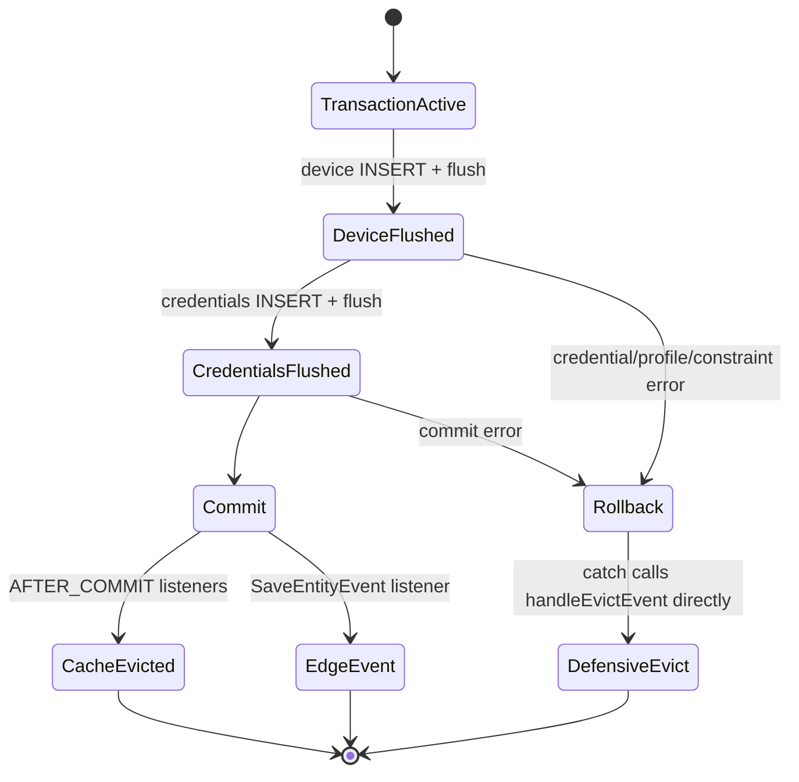

### 3.5 提交后的 Cluster、Rule Engine、State 与 Audit 分支

DAO 代理返回后，`DefaultTbNotificationEntityService.notifyCreateOrUpdateDevice(...)` 先调用 `tbClusterService.onDeviceUpdated(device, null)`，再调用 `logEntityAction(...)`。

| 顺序 | 类与方法 | 源码位置 | 输出 |
|---|---|---|---|
| 1 | `org.thingsboard.server.service.entitiy.DefaultTbNotificationEntityService.notifyCreateOrUpdateDevice(TenantId, DeviceId, CustomerId, Device, Device, ActionType, User, Object...)` | [DefaultTbNotificationEntityService.java:192](../../../application/src/main/java/org/thingsboard/server/service/entitiy/DefaultTbNotificationEntityService.java#L192) | Cluster 分支 + entity action 分支 |
| 2 | `org.thingsboard.server.service.queue.DefaultTbClusterService.onDeviceUpdated(Device device, Device old)` | [DefaultTbClusterService.java:781](../../../application/src/main/java/org/thingsboard/server/service/queue/DefaultTbClusterService.java#L781) | Transport update、CREATED lifecycle、Core state msg、OTA update |
| 3 | `org.thingsboard.server.service.queue.DefaultTbClusterService.broadcastEntityChangeToTransport(TenantId, EntityId, T, TbQueueCallback)` | [DefaultTbClusterService.java:584](../../../application/src/main/java/org/thingsboard/server/service/queue/DefaultTbClusterService.java#L584) | `ToTransportMsg.EntityUpdateMsg` 广播到每个 Transport service |
| 4 | `org.thingsboard.server.service.queue.DefaultTbClusterService.broadcastEntityStateChangeEvent(TenantId, EntityId, ComponentLifecycleEvent)` | [DefaultTbClusterService.java:415](../../../application/src/main/java/org/thingsboard/server/service/queue/DefaultTbClusterService.java#L415) | `ComponentLifecycleMsgProto(CREATED)` 到 Rule Engine notification services |
| 5 | `org.thingsboard.server.service.queue.DefaultTbClusterService.sendDeviceStateServiceEvent(TenantId, DeviceId, boolean, boolean, boolean)` | [DefaultTbClusterService.java:760](../../../application/src/main/java/org/thingsboard/server/service/queue/DefaultTbClusterService.java#L760) | `DeviceStateServiceMsgProto(added=true)` 到 Core Queue |
| 6 | `org.thingsboard.server.service.action.EntityActionService.logEntityAction(User, I, E, CustomerId, ActionType, Exception, Object...)` | [EntityActionService.java:276](../../../application/src/main/java/org/thingsboard/server/service/action/EntityActionService.java#L276) | 成功时 Rule Engine `ENTITY_CREATED`，始终尝试 audit log |
| 7 | `org.thingsboard.server.service.action.EntityActionService.pushEntityActionToRuleEngine(EntityId, HasName, TenantId, CustomerId, ActionType, User, Object...)` | [EntityActionService.java:91](../../../application/src/main/java/org/thingsboard/server/service/action/EntityActionService.java#L91) | Device JSON + user/customer metadata -> `TbMsg` |
| 8 | `org.thingsboard.server.dao.audit.AuditLogServiceImpl.logEntityAction(...)` | [AuditLogServiceImpl.java:184](../../../dao/src/main/java/org/thingsboard/server/dao/audit/AuditLogServiceImpl.java#L184) | `AuditLogLevelFilter` 允许时构造 SUCCESS/FAILURE 审计记录 |
| 9 | `org.thingsboard.server.dao.audit.AuditLogServiceImpl.logAction(...)` | [AuditLogServiceImpl.java:510](../../../dao/src/main/java/org/thingsboard/server/dao/audit/AuditLogServiceImpl.java#L510) | executor 异步保存 `audit_log`，可选下沉 AuditLogSink |

上表这些创建通知的 Queue send 都传 `null` callback，REST 不等待 broker ACK。审计方法返回的 Future 也没有被 Controller 链等待。因此它们提供异步传播，不提供“HTTP 返回前完成”的承诺。

### 3.6 Queue 消费后的状态与 Actor 路径

| 消息 | 消费链 | 结果 |
|---|---|---|
| `DeviceStateServiceMsgProto(added=true)` | `DefaultTbCoreConsumerService` -> `DefaultDeviceStateService.onQueueMsg(...)` | 读取 Device 与已有 state，按 Core partition 注册，异步保存 `active=false` |
| `ComponentLifecycleMsg(CREATED)` | `DefaultTbRuleEngineConsumerService` -> `AbstractConsumerService.handleComponentLifecycleMsg(...)` -> `AppActor` -> `TenantActor` | 失效 Device Profile cache；已有 Device Actor 可收到消息，但不会因 CREATED 主动创建 Device Actor |
| `TbMsgType.ENTITY_CREATED` | Rule Engine Queue consumer -> `AppActor` -> `TenantActor` -> `RuleChainActor` -> `RuleNodeActor` | 按 Device Profile 默认 Queue/Rule Chain 执行实体创建规则流 |
| `EntityUpdateMsg(DEVICE)` | 每个 Transport notification consumer -> `DefaultTransportService.process(...)` -> `onDeviceUpdate(Device)` | 解码 Device，遍历匹配的现有 session，更新 SessionInfo 的 profile/name/type 并回调 listener；最后发布 `DeviceUpdatedEvent`。标准新设备通常尚无 session，但广播并未被忽略 |

---

## 四、消息流

### 4.1 REST 创建主流程

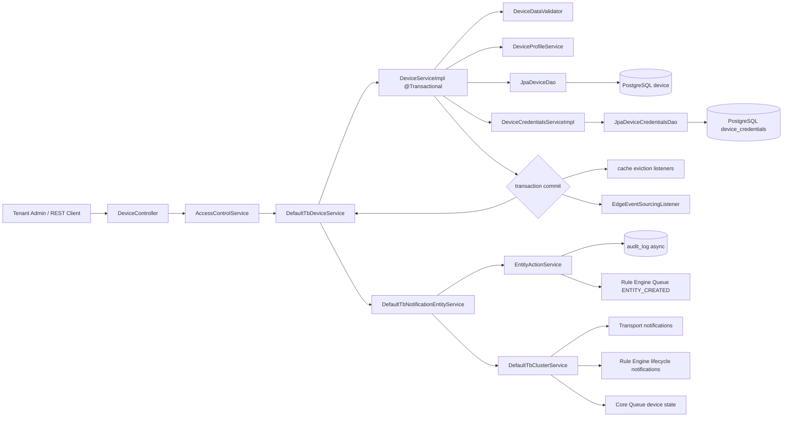

### 4.2 提交后的四条异步分支

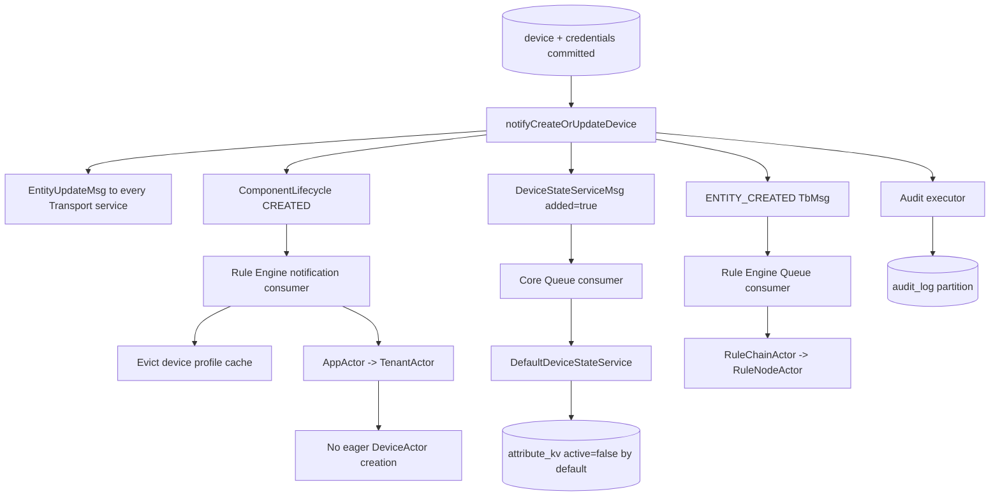

### 4.3 架构图

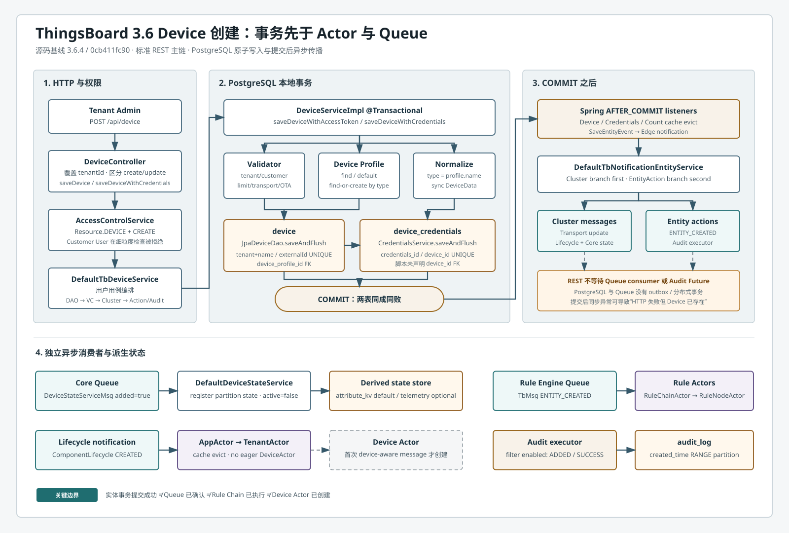

独立 SVG 不依赖 Mermaid 或 JavaScript，可直接用于离线阅读和演示。

---

## 五、时序图

完整 PlantUML 源文件见 [sequence.puml](sequence.puml)，经 PlantUML CLI 渲染的结果见 [sequence.svg](sequence.svg)。时序图包含：

- REST 权限拒绝分支；
- Device Profile 查找/自动创建；
- Device 与 Credentials 同一事务；
- flush、commit、rollback 和 AFTER_COMMIT listener；
- Transport、Core、Rule Engine、Audit 的异步分叉；
- `active=false` 默认写 `attribute_kv`、可选写 telemetry；
- 数据库已提交但通知阶段失败导致 HTTP 错误的窗口。

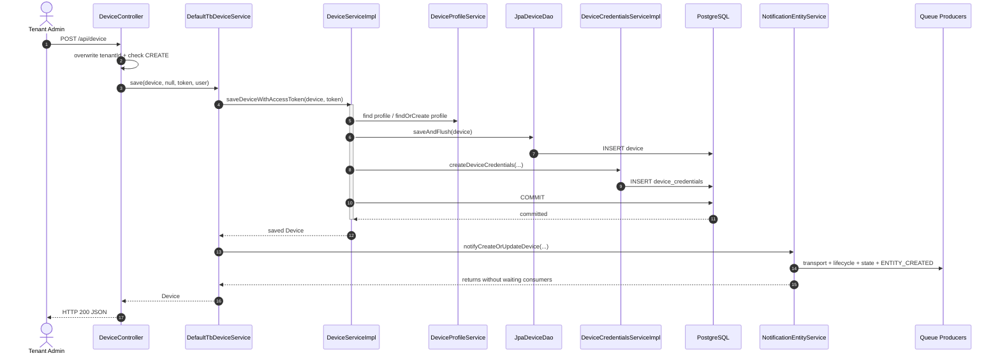

---

## 六、数据变化

### 6.1 同步事务内变化

| 状态 | 是否必然 | 字段/键 | 事务关系 |
|---|---|---|---|
| PostgreSQL `device` | 是 | `id`, `created_time`, `tenant_id`, `customer_id`, `device_profile_id`, `name`, `label`, `type`, `device_data`, OTA IDs, `additional_info`, `external_id` | 核心事务 |
| PostgreSQL `device_credentials` | 是 | `id`, `created_time`, `device_id`, `credentials_type`, `credentials_id`, `credentials_value` | 与 `device` 同一事务 |
| PostgreSQL `device_profile` | 条件式 | 请求未给 profile、给了不存在的 legacy type 时创建 | 加入同一外层事务 |

创建 Device 不会自动创建 `relation`。即使设置 `customer_id`，这是 Device 行上的归属字段，不是一条 `entity_relation`。Gateway 自动创建设备是另一条入口，它会额外保存 Gateway -> Device 的 `Created` 关系。

### 6.2 提交后变化

| 对象 | 变化 | 同步性 |
|---|---|---|
| Device cache | evict `(tenantId,name)`；创建事件在 save 前构造且 `deviceId` 为 null，因此该事件不会生成按 ID 的 cache key | `AFTER_COMMIT` listener |
| Credentials cache | evict 新 credentials ID；认证 cache 可缓存 null，因此创建后失效尤其重要 | `AFTER_COMMIT` listener |
| Entity count cache | 清除租户 Device count | 事务事件/缓存机制 |
| Device Profile cache | lifecycle consumer 按 `(tenantId,deviceId)` 失效 Device -> Profile 映射 | Queue 异步 |
| Device State | Core 分区内注册一条内存 `DeviceStateData`；持久化 `active=false` | Queue +异步 telemetry callback |
| Rule Engine | 收到 `ENTITY_CREATED`，消息正文是 Device JSON，metadata 包含 user/customer/entity 信息 | Rule Engine Queue 异步 |
| Audit | `AuditLogLevelFilter` 允许时保存 `ActionType.ADDED`, `ActionStatus.SUCCESS`；失败分支保存 FAILURE 和 stack | executor 异步 |
| Edge | `SaveEntityEvent` 在提交后转成 Edge notification；只有启用 Edge 且后续有适用目标时产生实际同步效果 | Spring event + Core Queue |
| Session | 无。创建 Device 不建立 MQTT/CoAP/LwM2M session | 不适用 |
| Device Actor | 无立即创建；首次设备感知消息到达时惰性创建 | 不适用 |

### 6.3 生命周期图

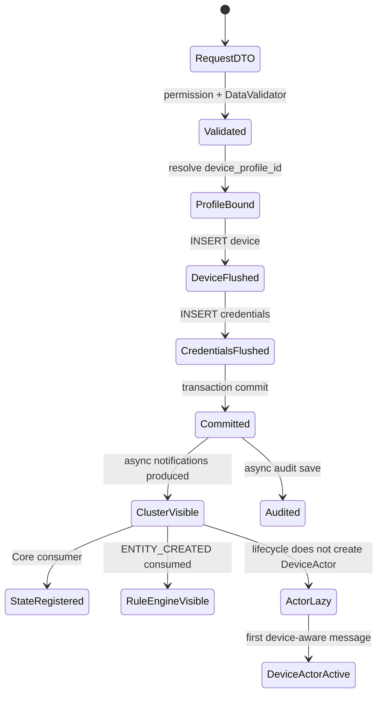

---

## 七、源码分析

### 7.1 入口与权限层

| 类型 | 包路径 | 继承/实现 | 本流程职责 |
|---|---|---|---|
| Controller | `org.thingsboard.server.controller.DeviceController` | `extends BaseController` | 两个 REST 保存入口、覆盖 tenantId、权限前置检查 |
| Controller 基类 | `org.thingsboard.server.controller.BaseController` | abstract | 统一 SecurityUser、ID 解析、access control 调用 |
| 权限接口 | `org.thingsboard.server.service.security.permission.AccessControlService` | interface | 定义 resource/operation/entity 权限契约 |
| 权限实现 | `org.thingsboard.server.service.security.permission.DefaultAccessControlService` | implements `AccessControlService` | 根据 Authority 选择 PermissionChecker |
| Tenant 策略 | `org.thingsboard.server.service.security.permission.TenantAdminPermissions` | extends `AbstractPermissions` | 同租户 Device 允许 CREATE/WRITE |
| Customer 策略 | `org.thingsboard.server.service.security.permission.CustomerUserPermissions` | extends `AbstractPermissions` | Device checker 不允许 CREATE |

### 7.2 应用服务与 DAO Service

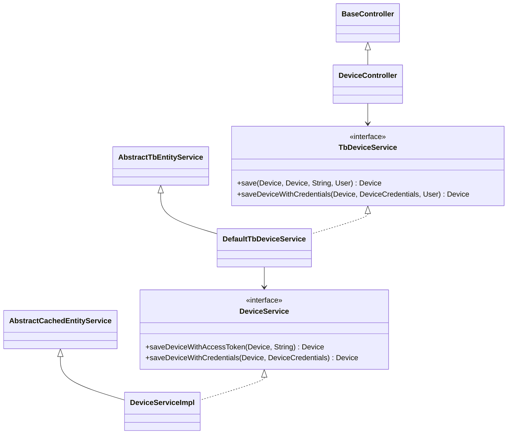

| 类型 | 包路径 | 设计职责 |
|---|---|---|
| 应用接口 | `org.thingsboard.server.service.entitiy.device.TbDeviceService` | 面向 Controller 的用例 API，包含 User、审计和通知语义 |
| 应用实现 | `org.thingsboard.server.service.entitiy.device.DefaultTbDeviceService` | 编排 DAO、可选 VC auto-commit、Cluster、Rule Engine、Audit |
| DAO API | `org.thingsboard.server.dao.device.DeviceService` | 面向所有内部模块的 Device 持久化领域服务 |
| DAO 实现 | `org.thingsboard.server.dao.device.DeviceServiceImpl` | 事务、校验、Profile、凭据、缓存事件和约束转换 |
| Validator | `org.thingsboard.server.dao.service.validator.DeviceDataValidator` | 创建配额、租户/客户/Transport/OTA 一致性 |
| Profile API/实现 | `org.thingsboard.server.dao.device.DeviceProfileService` / `DeviceProfileServiceImpl` | 查找默认 Profile、按 legacy type 查找或创建 |
| Credentials API/实现 | `org.thingsboard.server.dao.device.DeviceCredentialsService` / `DeviceCredentialsServiceImpl` | 凭据格式化、验证、唯一性与认证 cache |

### 7.3 ORM 与 Repository 层

| 类型 | 包路径 | 继承/实现 | 说明 |
|---|---|---|---|
| Device DAO | `org.thingsboard.server.dao.sql.device.JpaDeviceDao` | `extends JpaAbstractDao<DeviceEntity, Device> implements DeviceDao` | SQL/JPA adapter；saveAndFlush |
| Device DAO 接口 | `org.thingsboard.server.dao.device.DeviceDao` | `extends Dao<Device>` 等 DAO 契约 | 隔离 SQL 实现 |
| Device Entity | `org.thingsboard.server.dao.model.sql.DeviceEntity` | `extends AbstractDeviceEntity<Device>` | `device` 表 ORM 映射 |
| Device Repository | `org.thingsboard.server.dao.sql.device.DeviceRepository` | `extends JpaRepository<DeviceEntity, UUID>` | Spring Data CRUD 与查询 |
| Credentials DAO | `org.thingsboard.server.dao.sql.device.JpaDeviceCredentialsDao` | `extends JpaAbstractDao<DeviceCredentialsEntity, DeviceCredentials> implements DeviceCredentialsDao` | credentials SQL adapter |
| Credentials Entity | `org.thingsboard.server.dao.model.sql.DeviceCredentialsEntity` | `extends BaseSqlEntity<DeviceCredentials>` | `device_credentials` ORM 映射 |
| Credentials Repository | `org.thingsboard.server.dao.sql.device.DeviceCredentialsRepository` | `extends JpaRepository<DeviceCredentialsEntity, UUID>` | 保存、flush、按 device/credentials 查询 |

`JpaAbstractDao` 用反射调用 Entity 的 DTO 构造器，这解释了 Common DTO 与 JPA Entity 分离的代价：上层模块不依赖 Hibernate annotation，但每个 Entity 必须保持 DTO 构造器和 `toData()` 映射一致。

### 7.4 缓存、事件、集群与审计

| 类型 | 包路径 | 职责 |
|---|---|---|
| `AbstractCachedEntityService<K,V,E>` | `org.thingsboard.server.dao.entity` | 按事务状态选择发布 event 或立即 evict |
| `DeviceCacheEvictEvent` | `org.thingsboard.server.dao.device` | 携带 tenant/device/newName/oldName |
| `DeviceCredentialsEvictEvent` | `org.thingsboard.server.dao.device` | 携带新旧 credentials ID |
| `DeviceCaffeineCache` / `DeviceRedisCache` | `org.thingsboard.server.cache.device` | 本地或 Redis 的 Device cache 实现 |
| `DeviceCredentialsCaffeineCache` / `DeviceCredentialsRedisCache` | `org.thingsboard.server.dao.device` | 凭据认证 cache 实现 |
| `SaveEntityEvent<T>` | `org.thingsboard.server.dao.eventsourcing` | 事务提交后 Edge event sourcing 信号 |
| `EdgeEventSourcingListener` | `org.thingsboard.server.service.edge` | `@TransactionalEventListener` 转 Edge notification |
| `TbNotificationEntityService` / `DefaultTbNotificationEntityService` | `org.thingsboard.server.service.entitiy` | 聚合 Cluster 和 entity action 通知 |
| `TbClusterService` / `DefaultTbClusterService` | `org.thingsboard.server.cluster` / `org.thingsboard.server.service.queue` | 将领域变化编码为 Queue 消息 |
| `EntityActionService` | `org.thingsboard.server.service.action` | 生成 Rule Engine entity action、通知规则和审计上下文 |
| `AuditLogService` / `AuditLogServiceImpl` | `org.thingsboard.server.dao.audit` | 异步保存审计并调用可选 sink |

### 7.5 为什么分成两层 Service

`DefaultTbDeviceService` 是“用户用例层”：它知道当前 User、ActionType、审计、版本控制和通知。`DeviceServiceImpl` 是“持久化领域层”：Provision、Gateway、Edge、Rule Node、安装脚本也能复用它，并选择自己的通知/确认语义。两者不能随意合并，否则非 REST 入口会被迫伪造 User，或者绕过关键事务。

---

## 八、Actor 分析

### 8.1 创建过程是否使用 Device Actor

核心数据库事务不使用 Actor。REST servlet 线程通过 Spring Service/JPA 同步完成 `device` 与 `device_credentials` 写入。

事务后有两种 Actor 相关消息：

1. `ComponentLifecycleMsg(CREATED)` 进入 `AppActor -> TenantActor`。
2. `TbMsgType.ENTITY_CREATED` 经 Rule Engine Queue 进入 `AppActor -> TenantActor -> RuleChainActor -> RuleNodeActor`。

第一种消息不会创建 Device Actor。`TenantActor.onComponentLifecycleMsg(...)` 只有 Device `DELETED` 且属于本分区时调用 `onToDeviceActorMsg(new DeviceDeleteMsg(...), true)`；CREATED 只尝试 `getEntityActorRef(deviceId)`，目标不存在就记录 debug。真正调用 `getOrCreateDeviceActor(DeviceId)` 的是 device-aware message 路径。

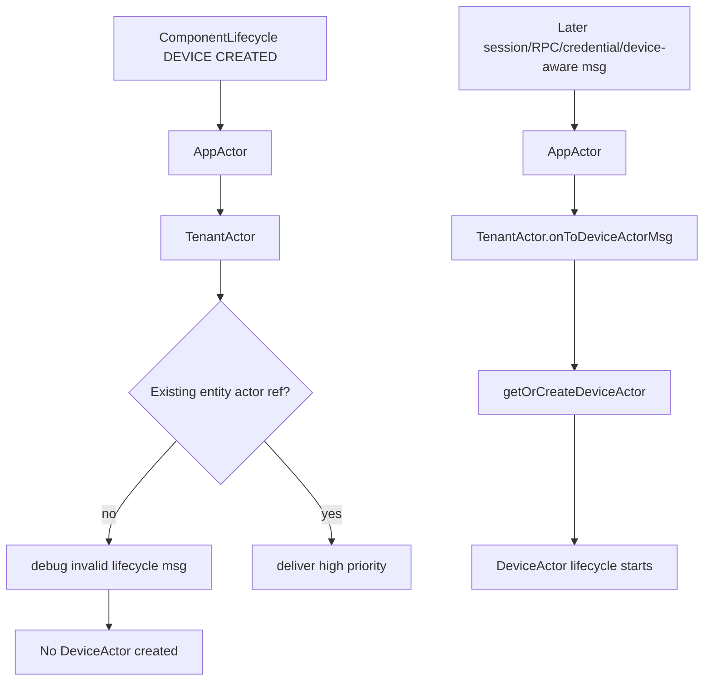

### 8.2 为什么不在创建时预建 Actor

- 多租户平台可能有大量长期离线 Device；为每条数据库记录常驻 Actor 会浪费 mailbox 和运行时状态。
- Device Actor 服务会话、RPC、凭据变更等设备感知消息，单纯“数据库中存在一行”不需要它。
- TenantActor 以 partition 判断和 child actor factory 统一管理创建、迁移与停止，避免 Controller 持有 Actor 引用。

### 8.3 Rule Engine Actor 与 Device Actor 不同

`ENTITY_CREATED` 的 originator 是 Device，但它被路由到 Rule Chain Actor，而不是 Device Actor。Device Profile 的 `default_rule_chain_id` 和 `default_queue_name` 可能重写目标；如果未配置，使用租户 Root Rule Chain/主队列。不要因为消息 originator 是 Device 就推断它经过 Device Actor。

---

## 九、Kafka 分析

### 9.1 Kafka 是否必需

不是。`queue.type` 默认值是 `in-memory`；还支持 Kafka、AWS SQS、Pub/Sub、Azure Service Bus、RabbitMQ。以下只描述 `TB_QUEUE_TYPE=kafka` 时同一 Queue SPI 的物理实现。

### 9.2 创建后涉及的逻辑 Topic

| 目的 | Producer | Topic/分区 | Consumer / Group（Kafka factory） | 消息格式 |
|---|---|---|---|---|
| Device State 初始化 | Core message producer | `tb_core`，默认 10 partitions；tenant/device 决定 partition | `DefaultTbCoreConsumerService`; monolith `monolith-core-consumer`，微服务 `tb-core-node` | `ToCoreMsg.DeviceStateServiceMsgProto` |
| Rule Engine created action | Rule Engine producer | Device Profile queue topic；默认 Main 通常为 `tb_rule_engine.main` | `TbRuleEngineQueueConsumerManager`; `re-<queueName>-consumer` | `ToRuleEngineMsg` 包装 `TbMsg(ENTITY_CREATED)` |
| 生命周期广播 | Rule Engine notification producer | `tb_rule_engine.notifications.<serviceId>`，服务实例专属 | `DefaultTbRuleEngineConsumerService`; `...notifications...<serviceId>` group | `ToRuleEngineNotificationMsg.ComponentLifecycleMsgProto` |
| Transport 实体广播 | Transport notification producer | `tb_transport.notifications.<serviceId>` | `DefaultTransportService`; `transport-node-<serviceId>` | `ToTransportMsg.EntityUpdateMsg` |
| Edge notification | Core message producer | `tb_core` | `DefaultTbCoreConsumerService` -> Edge service | `ToCoreMsg.EdgeNotificationMsgProto` |

Topic 前面还可以由 `queue.prefix` 添加部署前缀。通知 topic 由 `TopicService.getNotificationsTopic(ServiceType, serviceId)` 生成，设计为单服务实例消费；Core/Rule Engine 数据 topic 则通过 `PartitionService.resolve(...)` 保证同一 originator 的路由稳定性。

### 9.3 Producer 确认与 HTTP 的关系

创建通知调用均传 `null` callback：

```java
producer.send(tpi, new TbProtoQueueMsg<>(messageId, message), null);
```

因此 REST 线程不等待 Kafka broker ACK，也不等待 consumer commit。即使 Kafka producer 内部有重试，Controller 也没有一个 Future 把最终状态纳入 HTTP 结果。PostgreSQL 与 Kafka 之间没有共同事务和 outbox，存在两个窗口：

1. DB 已提交，进程在 send 前崩溃：Device 存在，但某些通知缺失。
2. send 已成功，消费者重试：Rule Engine 节点必须面对重复 `ENTITY_CREATED` 的可能性。

### 9.4 Kafka 拓扑图

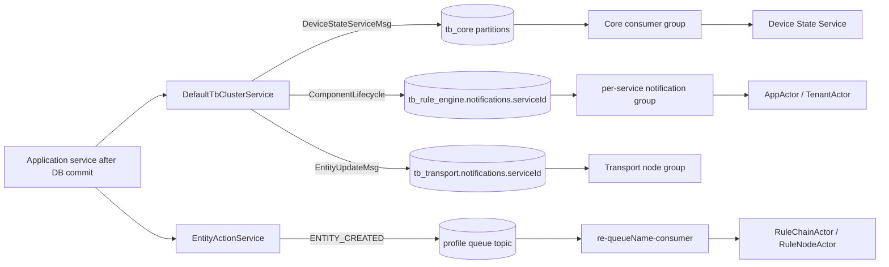

---

## 十、数据库分析

### 10.1 PostgreSQL：为什么实体写这里

Device、Profile、Customer、OTA 与 Credentials 都需要唯一约束、引用完整性、事务更新和复杂管理查询，属于关系型元数据。即使遥测后端配置为 Cassandra，`device` 和 `device_credentials` 仍写 SQL 数据库；TimescaleDB 也是 PostgreSQL extension，不改变实体表的 JPA 路径。

### 10.2 核心表与关系

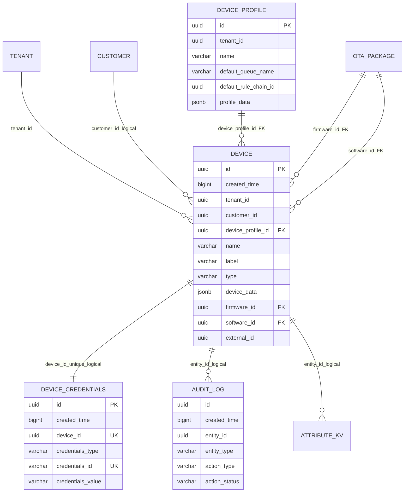

建表证据见 [schema-entities.sql:328](../../../dao/src/main/resources/sql/schema-entities.sql#L328)。需要特别注意：

- `device` 有 `(tenant_id,name)` 和 `(tenant_id,external_id)` 唯一约束。
- `device.device_profile_id` 有真实 FK；firmware/software 也有 FK。
- `device_credentials.credentials_id` 和 `device_id` 各自唯一。
- 3.6.4 该建表脚本没有声明 `device_credentials.device_id -> device.id` 外键。Java 服务维护其一对一生命周期，不能在架构图中伪造物理 FK。
- `customer_id`、`tenant_id` 在该表定义中也不是 FK；一致性由 Validator 和服务层保证。

### 10.3 Device 字段的阅读重点

| 字段 | 作用 | 容易误读的点 |
|---|---|---|
| `id` | time-based UUID；同时承载创建时间排序特征 | `created_time` 仍单独保存，不能把 UUID 当业务时间 API |
| `tenant_id` | 数据隔离与唯一键范围 | Controller 强制取当前用户 tenant，不信任请求体 |
| `customer_id` | 当前客户归属；未分配时写 `NULL_UUID` 语义值 | 不是 SQL NULL 才代表未分配的唯一形式，需按 ThingsBoard DTO 语义理解 |
| `device_profile_id` | Transport、Alarm、Provision、默认 Queue/Rule Chain 配置来源 | `type` 不再是完整配置 |
| `type` | 同步为 Device Profile name | legacy 查询/兼容字段，不应独立修改为另一个值 |
| `device_data` | 每设备 configuration 与 transport configuration JSONB | Profile 类型不匹配时会被重建对应配置对象 |
| `firmware_id` / `software_id` | 当前 OTA 包 | Validator 检查包类型、Profile 与 tenant 兼容性 |
| `external_id` | Edge/外部系统映射 | 只在同一 tenant 内唯一 |

### 10.4 Audit 与设备状态的后续写

`audit_log` 是按 `created_time` RANGE 分区的 PostgreSQL 表。只有 `AuditLogLevelFilter.logEnabled(entityType, actionType)` 为 true 才创建记录；`AuditLogServiceImpl` 使用独立 executor 保存，所以它不加入 Device 事务。

Core Queue 消费创建消息后，`DefaultDeviceStateService` 保存 `active=false`：

- 默认 `state.persistToTelemetry=false`：写 `attribute_kv` 的 `SERVER_SCOPE`。
- 配置为 `true`：调用 Timeseries service，写 history/latest；SQL、TimescaleDB 或 Cassandra 由 timeseries backend 决定。

因此“创建设备完全不写时序库”只对默认配置和同步主事务成立。启用 state telemetry 后，异步 Device State 初始化可以产生一条遥测写入，但这不是 Device Entity 的持久化位置。

### 10.5 TimescaleDB、Cassandra 与 Redis

| 后端 | 标准创建主事务 | 条件式后续作用 |
|---|---|---|
| PostgreSQL | `device`, `device_credentials`，可选 `device_profile` | `audit_log`、默认 `attribute_kv active=false` |
| TimescaleDB | 不保存 Device/Credentials | `persistToTelemetry=true` 且 timeseries backend=timescale 时保存 state telemetry |
| Cassandra | 不保存 Device/Credentials | `persistToTelemetry=true` 且 timeseries backend=cassandra 时保存 state telemetry |
| Redis | 不作为权威 Device 表 | `cache.type=redis` 时承载 Device/Profile/Credentials cache；提交后 evict |

---

## 十一、异常处理

### 11.1 失败矩阵

| 失败位置 | 事务/消息行为 | 对调用者的结果 | 生产注意事项 |
|---|---|---|---|
| `@PreAuthorize` / CREATE permission | 尚未进入 DAO | 401/403 | Customer User 创建会在细粒度 permission 被拒绝 |
| Device Validator | 事务回滚，无 SQL commit | 400 类 ThingsBoard 错误 | 检查 tenant/customer/profile/OTA，而不只看 JSON 校验 |
| 重复 `(tenant_id,name)` | device flush 抛约束异常，映射为 `Device with such name already exists!` | 创建失败 | REST 重试必须先按 name 查询，不能盲目重复 POST |
| 重复 `(tenant_id,external_id)` | 同上 | 创建失败 | Edge/import 场景尤需稳定 external_id |
| 凭据 ID 或 device ID 重复 | credentials flush 抛错；外层事务回滚 Device | `Specified credentials are already registered!` | 这是 Device 与 Credentials 原子的关键证据 |
| Device Profile 不存在/跨租户 | 事务回滚 | validation error | 不允许引用其他 tenant 的 Profile |
| Profile 自动创建并发 | 源码捕获唯一冲突后尝试按 name 重查 | 可能继续，也可能因外层 PostgreSQL 事务已 rollback-only 而失败 | 不要把 catch 当跨节点事务重试；上层按 name 查询后重试 |
| transaction commit 失败 | AFTER_COMMIT cache/Edge listener 不执行 | REST 失败 | catch 会防御性清除可能污染的 cache key |
| `autoCommit` 或同步 Cluster 编排抛错 | Device 事务已经提交 | REST 可能返回错误 | 客户端重试前必须查询；可能出现“报错但设备已存在” |
| Queue send 后异步失败 | DB 不回滚，调用处无 callback | REST 通常已成功 | 监控 Queue producer/consumer；没有 DB outbox 自动补发 |
| Rule Engine `ENTITY_CREATED` 处理失败 | Device 保留；由 queue processing strategy 决定 retry/skip | REST 不感知 | Rule Node 副作用需幂等 |
| Audit executor/DAO/sink 失败 | Device 保留 | REST 不感知 | 审计不是创建事务的一部分；监控 executor 与 sink 日志 |
| Device State 初始化失败 | Device 保留；Core pack callback 决定消息处理 | REST 不感知 | `active` 可能暂缺，后续 session/activity 可重建状态 |

### 11.2 最危险的一致性窗口

`DefaultTbDeviceService.save(...)` 的 try/catch 同时包住 DAO 调用、`autoCommit(...)` 和 `notifyCreateOrUpdateDevice(...)`。DAO 代理返回时事务已提交。如果之后的同步 Java 调用抛异常，catch 会记录一个失败审计并把异常返回给 Controller，但不会撤销已经提交的 Device。客户端如果把所有非 2xx 都当作“未创建”并直接重试，会收到 name/credentials 唯一冲突。

推荐客户端幂等策略：

1. 使用租户内稳定且唯一的 `name` 或 `external_id`。
2. 网络超时/5xx 后先按 name/external ID 查询。
3. 找到 Device 后再读取 `/api/device/{deviceId}/credentials`，不要假设自动生成 token 可由客户端重算。
4. 对 Rule Engine 的 `ENTITY_CREATED` 节点按 originator ID 实现幂等副作用。

### 11.3 失败生命周期图

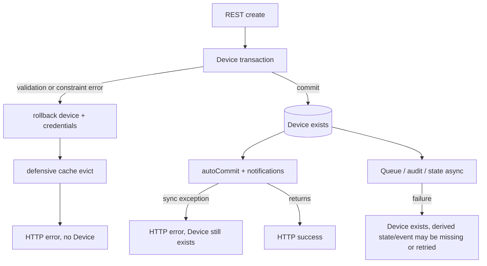

---

## 十二、源码阅读路线

1. 先读 [DeviceController.java:219](../../../application/src/main/java/org/thingsboard/server/controller/DeviceController.java#L219)，只跟 create 分支，确认 tenantId 被覆盖。
2. 跳到 [BaseController.java:840](../../../application/src/main/java/org/thingsboard/server/controller/BaseController.java#L840) 和 `CustomerUserPermissions`，理解方法注解与实体权限是两层检查。
3. 读 [DefaultTbDeviceService.java:85](../../../application/src/main/java/org/thingsboard/server/service/entitiy/device/DefaultTbDeviceService.java#L85)，先圈出 DAO 事务结束后的动作。
4. 读 [DeviceServiceImpl.java:235](../../../dao/src/main/java/org/thingsboard/server/dao/device/DeviceServiceImpl.java#L235)、`:297`、`:316`，画出 `@Transactional -> device -> credentials` 的嵌套调用。
5. 读 [DeviceDataValidator.java:103](../../../dao/src/main/java/org/thingsboard/server/dao/service/validator/DeviceDataValidator.java#L103)，核对 tenant/customer/transport/OTA 规则。
6. 读 [DeviceProfileServiceImpl.java:414](../../../dao/src/main/java/org/thingsboard/server/dao/device/DeviceProfileServiceImpl.java#L414) 和 `syncDeviceData(...)`，理解 `type` 与 Profile 的关系。
7. 读 `JpaAbstractDao.save(...)`、`DeviceEntity`、`DeviceCredentialsEntity` 和建表脚本，把 DTO/JPA/SQL 字段逐一对上。
8. 读 [AbstractCachedEntityService.java:49](../../../dao/src/main/java/org/thingsboard/server/dao/entity/AbstractCachedEntityService.java#L49) 与两个 `@TransactionalEventListener`，理解为什么 commit 后才 evict。
9. 读 [DefaultTbClusterService.java:781](../../../application/src/main/java/org/thingsboard/server/service/queue/DefaultTbClusterService.java#L781)，分别追 Transport、lifecycle、Core state、OTA 四个分支。
10. 读 [EntityActionService.java:91](../../../application/src/main/java/org/thingsboard/server/service/action/EntityActionService.java#L91)，确认 `ADDED -> ENTITY_CREATED` 和 Profile queue transform。
11. 读 `AbstractConsumerService.handleComponentLifecycleMsg(...)`、`AppActor.onComponentLifecycleMsg(...)`、`TenantActor.onComponentLifecycleMsg(...)`，验证 CREATED 不创建 Device Actor。
12. 最后读 [DefaultDeviceStateService.java:487](../../../application/src/main/java/org/thingsboard/server/service/state/DefaultDeviceStateService.java#L487) 与 `save(DeviceId,String,boolean)`，确认 `active=false` 的后续数据库位置。

下一步建议阅读 [03 Device 删除流程](../03-device-delete/README.md)。创建链能建立“核心事务 + 提交后派生状态”的基线；删除链则揭示 Queue 先于 COMMIT、遥测不自动清理，以及 Device Actor 删除生命周期的差异。

---

## 十三、常见面试题

### 13.1 Device 和 DeviceCredentials 是否在同一事务？

是。`saveDeviceWithAccessToken(...)` 和 `saveDeviceWithCredentials(...)` 都在 `DeviceServiceImpl` 上声明 `@Transactional`；Device flush 后的 credentials 保存加入外层事务。凭据唯一冲突会回滚 Device INSERT。

### 13.2 `saveAndFlush()` 是否等于事务提交？

不等于。flush 只是把 SQL 同步到数据库并提前检查约束，外层事务仍可能回滚。Spring 代理在事务方法正常返回时才 commit。

### 13.3 为什么 `device_credentials.device_id` 没有 FK？

3.6.4 建表脚本只给它唯一约束，没有物理 FK。生命周期由 Java Service 维护。这降低某些删除/迁移操作的数据库耦合，但也意味着绕过 Service 直接写 SQL 更容易制造孤儿行。

### 13.4 Customer User 为什么通过 `@PreAuthorize` 仍不能创建？

`@PreAuthorize` 只允许请求进入方法。create 分支还执行 `Operation.CREATE` 的 Resource permission；Customer Device checker 的允许操作中没有 CREATE，因此细粒度检查拒绝。

### 13.5 Device 创建会立即创建 Device Actor 吗？

不会。CREATED lifecycle 到 TenantActor 时只查已有 entity actor；Device Actor 在后续 session、RPC、credentials update 等 device-aware 消息到达时通过 `getOrCreateDeviceActor(...)` 惰性创建。

### 13.6 `ENTITY_CREATED` 经过 Device Actor 吗？

不经过。它被包装为 Rule Engine Queue 消息，消费后进入 RuleChainActor/RuleNodeActor。Device 只是 originator。

### 13.7 为什么同时有 lifecycle CREATED 和 Rule Engine ENTITY_CREATED？

生命周期通知服务于配置/cache/Actor 运行时传播；`ENTITY_CREATED` 是可进入用户 Rule Chain 的业务消息。它们的消费者和失败语义不同，不能合并成一个事件概念。

### 13.8 REST 成功是否保证 Kafka 消息已消费？

不保证。创建后的 Queue sends 使用 null callback，REST 不等待 broker ACK 或 consumer commit。默认部署甚至使用 in-memory queue，不一定有 Kafka。

### 13.9 REST 返回失败是否一定没有创建设备？

不一定。DAO 事务提交后，`autoCommit` 或同步通知编排仍在同一个 try/catch 内；后续异常可能导致 HTTP 错误，但 Device 已存在。必须查询后再重试。

### 13.10 Device 的 `type` 与 Device Profile 是什么关系？

保存时 `type` 被强制设置为 Device Profile 的 `name`。Profile ID 才关联实际 transport/profile data/default queue/rule chain；`type` 主要承担兼容和查询用途。

### 13.11 为什么凭据查询会缓存 null？

无效 token 可能被高频尝试。`findDeviceCredentialsByCredentialsId(...)` 显式允许缓存 null，避免每次恶意/错误认证都查询数据库。因此新 credentials 提交后必须及时 evict 对应 key。

### 13.12 Device 创建会写 TimescaleDB 或 Cassandra 吗？

核心实体事务不会。默认状态配置会在稍后的 Core 消费链写 PostgreSQL `attribute_kv(active=false)`；只有 `state.persistToTelemetry=true` 时，这条派生状态才通过所选 timeseries backend 写 SQL/TimescaleDB/Cassandra。

### 13.13 为什么不用数据库事务直接包含 Audit 和 Kafka？

Audit 使用独立 executor，Queue 由可替换 SPI 实现，二者不共享 PostgreSQL 本地事务。这样降低请求延迟和模块耦合，但引入一致性窗口。3.6.4 这条链没有 transactional outbox，生产系统必须依赖监控、幂等和补偿。

### 13.14 Profile 自动创建如何处理并发？

先按 `(tenant_id,name)` 查询；不存在则尝试创建。源码命中 `device_profile_name_unq_key` 后会捕获特定 DataValidationException 并重查，数据库唯一约束负责最终仲裁。但标准 REST 外面已有 Device 事务，PostgreSQL 约束异常可能让该事务 rollback-only，因此这不是可靠的事务内 retry；调用方应按 name 重查并允许重试。

---

[上一篇：01 MQTT 消息进入系统](../01-mqtt-message-ingress/README.md) | [返回首页](../../README.md) | [下一篇：03 Device 删除流程](../03-device-delete/README.md)
