# 03 Device 删除流程

> 源码基线：ThingsBoard `3.6.4`，提交 `0cb411fc90`。本章主线是 Tenant Admin 通过 `DELETE /api/device/{deviceId}` 删除单个 Device。租户删除、导入/版本控制回滚和 Edge 同步入口单独列出，因为它们没有相同的事务、告警清理与通知语义。

[上一篇：02 Device 创建流程](../02-device-create/README.md) | [HTML 版](index.html) | [全书目录](../../SUMMARY.md) | [PlantUML 源文件](sequence.puml) | [时序图 SVG](sequence.svg) | [架构图 SVG](../../assets/architecture/03-device-delete.svg) | [下一篇：04 Device Profile 流程](../04-device-profile/README.md)

---

## 一、流程目标

Device 删除流程终止一个设备实体在 ThingsBoard 控制面的身份，并把与该身份直接绑定的运行时状态传播给 Transport、Device State、Actor 和 Rule Engine。标准 REST 主链解决六件事：

1. 校验当前用户是否有权删除目标 Device，并阻止删除仍被 Entity View 引用的设备。
2. 删除以 Device 为 originator 的 Alarm，以及 Alarm 的传播关系、评论和类型索引。
3. 删除 `device_credentials`、Device 两个方向的 `relation`、`entity_alarm` 引用和 `device` 行。
4. 在数据库事务成功提交后失效 Device、Credentials、Entity Count、Relation 和 Alarm Type 缓存。
5. 通知所有 Transport 节点关闭会话，通知 Device State 删除内存状态，并让 Device Actor 停止。
6. 向 Rule Engine 发送 `ENTITY_DELETED`，按配置记录通知中心事件与审计日志。

### 1.1 本章最重要的事务事实

`org.thingsboard.server.service.entitiy.device.DefaultTbDeviceService.delete(Device, User)` 自身带有 `@Transactional`。因此它调用的告警删除、DAO 删除和 `notifyDeleteDevice(...)` 都发生在同一个外层 Spring 事务内。

| 时点 | 已发生 | 尚未保证 |
|---|---|---|
| `deviceDao.removeById(...)` 返回 | Hibernate/DAO 已执行 Device DELETE | 外层事务提交 |
| `notifyDeleteDevice(...)` 开始 | 所有本地 DB 删除语句已经执行 | Queue 消息与 DB 具有共同原子性 |
| Queue producer `send(...)` 返回 | 消息已交给所选 Queue 实现 | Consumer 已处理；数据库最终会提交 |
| `DefaultTbDeviceService.delete(...)` 返回 | Spring 准备提交并最终成功返回 | Audit/Rule Engine/Transport 异步动作完成 |
| HTTP `200 OK` | 同步调用与事务提交完成 | 所有设备连接已关闭；历史遥测已删除 |

> 与 Device 创建流程相反，标准 REST 删除的集群通知不是“提交后编排”。Transport、Core、Rule Engine lifecycle、Gateway RPC 和 `ENTITY_DELETED` 都在外层数据库事务提交前发出。只有事务事件监听器负责的缓存与 Edge event sourcing 采用默认 `AFTER_COMMIT` 阶段。

### 1.2 删除到底删除什么

| 数据/状态 | 标准 REST 删除 | 源码依据 |
|---|---:|---|
| `device` | 删除 | `DeviceServiceImpl.deleteDevice(...)` |
| `device_credentials` | 删除 | `deleteDeviceCredentialsByDeviceId(...)` |
| 入站/出站 `relation` | 尝试删除 | `BaseRelationService.deleteEntityRelations(...)` |
| 以 Device 为 originator 的 `alarm` | 删除 | `removeAlarmsByOriginatorId(...)` |
| `alarm_comment` / `entity_alarm` | 删除或级联删除 | Alarm FK `ON DELETE CASCADE`；显式 entity-alarm 清理 |
| Device 本地/Redis 缓存 | 提交后失效 | `@TransactionalEventListener` |
| Transport Session | 异步关闭或注销 | `EntityDeleteMsg` 消费链 |
| Device State 内存 | 异步删除 | `deviceStates.remove(deviceId)` |
| Device Actor | 异步停止 | `DeviceDeleteMsg` -> `ctx.stop(self)` |
| `attribute_kv` | **不删除** | 删除调用链没有 AttributeService |
| `ts_kv` / `ts_kv_latest` | **不删除** | 删除调用链没有 TimeseriesService |
| TimescaleDB chunk 中的遥测 | **不删除** | 无 hypertable DELETE/retention 调用 |
| Cassandra history/latest | **不删除** | 无 Cassandra DAO 调用 |
| `rpc` | **不删除** | 仅租户删除会 `deleteAllRpcByTenantId(...)` |
| 通用 Event/Debug Event | **不按 Device 清理** | 无对应删除调用 |

这不是数据库级级联删除模型。`attribute_kv.entity_id`、`ts_kv.entity_id`、`ts_kv_latest.entity_id`、`rpc.device_id` 和 Cassandra 分区键都没有指向 `device.id` 的物理外键。

---

## 二、入口

### 2.1 标准 REST 入口

| 入口 | 调用者与时机 | 方法 | 权限与语义 |
|---|---|---|---|
| `DELETE /api/device/{deviceId}` | Tenant Admin 在 UI 或 REST Client 删除单个设备 | `org.thingsboard.server.controller.DeviceController.deleteDevice(String strDeviceId)` | `@PreAuthorize("hasAuthority('TENANT_ADMIN')")`，再执行 `Operation.DELETE` 细粒度校验；成功返回空 `200 OK` |

`DeviceController` 先把路径参数转换为 `DeviceId`，再通过 `BaseController.checkDeviceId(DeviceId, Operation)` 查询实体并检查租户权限。不存在的 Device 在进入应用服务前失败，标准入口不会把空对象交给 DAO。

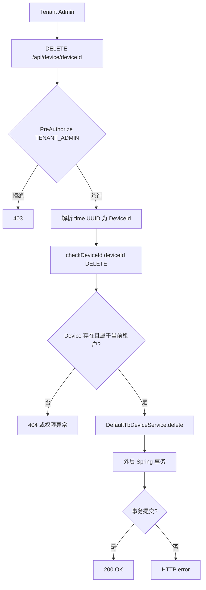

### 2.2 其他真实入口不能等同于 REST 主链

| 入口 | 源码入口 | 实际行为 | 与 REST 主链的差异 |
|---|---|---|---|
| 导入/版本控制移除 | `org.thingsboard.server.service.sync.ie.exporting.DefaultExportableEntitiesService.removeById(TenantId, I)` | 从 `EntityDaoServiceRegistry` 找到 `DeviceServiceImpl.deleteEntity(...)` | 直接进入 DAO Service；不先删除 originator Alarm，也不调用 Gateway/Cluster/Rule Engine/Audit 应用编排 |
| 删除 Tenant | `org.thingsboard.server.dao.tenant.TenantServiceImpl.deleteTenant(TenantId)` | 调用 `DeviceServiceImpl.deleteDevicesByTenantId(...)` 分页删除租户设备 | Tenant 删除整体故意不是单事务；Device 分页删除只走 DAO 语义，之后租户级清理 RPC 等表 |
| Edge 上行 `ENTITY_DELETED_RPC_MESSAGE` | `org.thingsboard.server.service.edge.rpc.processor.device.DeviceEdgeProcessor.processDeviceMsgFromEdge(TenantId, Edge, DeviceUpdateMsg)` | 查到 Device 后调用 `unassignDeviceFromEdge(...)` | **只解除 Device 与该 Edge 的分配，不删除云端 Device** |
| Edge 下行 Device DELETE | `DeviceEdgeProcessor.convertDeviceEventToDownlink(EdgeEvent, EdgeId, EdgeVersion)` | 把云端 `DELETED`/`UNASSIGNED_FROM_EDGE` 转成 `DeviceUpdateMsg` | 是删除事件的消费者/同步输出，不是本地删除入口 |

MQTT、CoAP、HTTP Device API、LwM2M、普通 RPC、Scheduler 和 Device Actor 都不是标准 Device 删除入口。协议层在收到集群删除通知后处理已有连接，而不是发起数据库删除。

---

## 三、完整调用链

### 3.1 Controller 与应用事务

| 步骤 | 类与方法（完整参数） | 源码位置 | 输入 -> 输出 | 职责与设计原因 |
|---|---|---|---|---|
| 1 | `org.thingsboard.server.controller.DeviceController.deleteDevice(String strDeviceId)` | [DeviceController.java:267](../../../application/src/main/java/org/thingsboard/server/controller/DeviceController.java#L266) | path UUID -> void/HTTP status | 固定 REST 权限、解析 ID，保持 Controller 不直接操作 DAO |
| 2 | `org.thingsboard.server.controller.BaseController.checkDeviceId(DeviceId deviceId, Operation operation)` | [BaseController.java:952](../../../application/src/main/java/org/thingsboard/server/controller/BaseController.java#L951) | `DeviceId + DELETE` -> `Device` | 查询目标并委托 `AccessControlService` 做实体级权限；后续链持有删除前 Device 快照 |
| 3 | `org.thingsboard.server.service.entitiy.device.DefaultTbDeviceService.delete(Device device, User user)` | [DefaultTbDeviceService.java:134](../../../application/src/main/java/org/thingsboard/server/service/entitiy/device/DefaultTbDeviceService.java#L133) | Device + responsible User -> void | `@Transactional` 的应用用例边界；把 Alarm、DAO 删除、集群通知和成功/失败审计组织在一起 |
| 4 | `org.thingsboard.server.service.entitiy.AbstractTbEntityService.removeAlarmsByOriginatorId(TenantId tenantId, EntityId entityId)` | [AbstractTbEntityService.java:118](../../../application/src/main/java/org/thingsboard/server/service/entitiy/AbstractTbEntityService.java#L117) | tenant + device -> void | 删除以设备为源的告警，避免设备消失后保留无法解释的活动告警 |
| 5 | `org.thingsboard.server.dao.device.DeviceServiceImpl.deleteDevice(TenantId tenantId, DeviceId deviceId)` | [DeviceServiceImpl.java:459](../../../dao/src/main/java/org/thingsboard/server/dao/device/DeviceServiceImpl.java#L457) | tenant + deviceId -> void | DAO Service 删除聚合的核心入口；复用外层事务 |
| 6 | `org.thingsboard.server.service.entitiy.DefaultTbNotificationEntityService.notifyDeleteDevice(TenantId tenantId, DeviceId deviceId, CustomerId customerId, Device device, User user, Object... additionalInfo)` | [DefaultTbNotificationEntityService.java:209](../../../application/src/main/java/org/thingsboard/server/service/entitiy/DefaultTbNotificationEntityService.java#L208) | 删除前 Device 快照 -> 多路异步消息 | 在实体仍可序列化时构造 Gateway、Cluster、Rule Engine 和 Audit 上下文 |

`DefaultTbDeviceService.delete(...)` 的 `catch` 会用 `emptyId(EntityType.DEVICE)` 记录 `DELETED/FAILURE`，然后原样抛出异常触发事务回滚。成功审计则使用真实 `deviceId` 和删除前 Device。

### 3.2 Alarm 删除链

| 步骤 | 类与方法（完整参数） | 源码位置 | 输入 -> 输出 | 职责与设计原因 |
|---|---|---|---|---|
| 1 | `org.thingsboard.server.dao.alarm.AlarmService.findAlarmIdsByOriginatorId(TenantId tenantId, EntityId originatorId, TimePageLink pageLink)` | [AbstractTbEntityService.java:118](../../../application/src/main/java/org/thingsboard/server/service/entitiy/AbstractTbEntityService.java#L117) | Device + `TimePageLink(Integer.MAX_VALUE)` -> all Alarm IDs | 一次取出全部 originator Alarm，保证随后逐条执行完整 Alarm 删除语义 |
| 2 | `org.thingsboard.server.dao.alarm.BaseAlarmService.delAlarm(TenantId tenantId, AlarmId alarmId)` | [BaseAlarmService.java:262](../../../dao/src/main/java/org/thingsboard/server/dao/alarm/BaseAlarmService.java#L260) | AlarmId -> `AlarmApiCallResult` | 事务参与者；委托三参数重载并启用 Alarm Type 清理 |
| 3 | `org.thingsboard.server.dao.alarm.BaseAlarmService.delAlarm(TenantId tenantId, AlarmId alarmId, boolean checkAndDeleteAlarmType)` | [BaseAlarmService.java:276](../../../dao/src/main/java/org/thingsboard/server/dao/alarm/BaseAlarmService.java#L274) | AlarmId -> deleted Alarm + propagation IDs | 读取 AlarmInfo、删除 Alarm 的 entity relations、删除 Alarm 行、发布 `DeleteEntityEvent<AlarmInfo>` |
| 4 | `org.thingsboard.server.dao.alarm.BaseAlarmService.delAlarmTypes(TenantId tenantId, Set<String> types)` | [BaseAlarmService.java:303](../../../dao/src/main/java/org/thingsboard/server/dao/alarm/BaseAlarmService.java#L301) | alarm type set -> void | 没有同类型 Alarm 时删除 `alarm_types`，提交后失效类型缓存 |

`alarm_comment.alarm_id` 和 `entity_alarm.alarm_id` 对 `alarm.id` 声明了 `ON DELETE CASCADE`。这两条 FK 只保护 Alarm 聚合，不会把 Device 与 Alarm 通过物理 FK 绑定。

### 3.3 Device DAO 删除链

| 步骤 | 类与方法（完整参数） | 源码位置 | 输入 -> 输出 | 职责与设计原因 |
|---|---|---|---|---|
| 1 | `org.thingsboard.server.dao.entityview.EntityViewService.existsByTenantIdAndEntityId(TenantId tenantId, EntityId entityId)` | [DeviceServiceImpl.java:463](../../../dao/src/main/java/org/thingsboard/server/dao/device/DeviceServiceImpl.java#L461) | tenant + device -> boolean | 业务引用保护；存在 Entity View 时抛出 `Can't delete device that has entity views!` |
| 2 | `org.thingsboard.server.dao.device.DeviceDao.findById(TenantId tenantId, UUID id)` | [DeviceServiceImpl.java:467](../../../dao/src/main/java/org/thingsboard/server/dao/device/DeviceServiceImpl.java#L465) | DeviceId -> Device | 获取 DAO 删除和缓存事件需要的 name/tenant 快照 |
| 3 | `org.thingsboard.server.dao.alarm.BaseAlarmService.deleteEntityAlarmRelations(TenantId tenantId, EntityId entityId)` | [BaseAlarmService.java:544](../../../dao/src/main/java/org/thingsboard/server/dao/alarm/BaseAlarmService.java#L542) | device -> void | 清理由 Alarm 传播产生、但并非 originator Alarm 的 `entity_alarm` 记录 |
| 4 | `org.thingsboard.server.dao.device.DeviceCredentialsServiceImpl.deleteDeviceCredentialsByDeviceId(TenantId tenantId, DeviceId deviceId)` | [DeviceCredentialsServiceImpl.java:523](../../../dao/src/main/java/org/thingsboard/server/dao/device/DeviceCredentialsServiceImpl.java#L521) | device -> removed credentials | `DELETE ... RETURNING` 取回 credentialsId，发布凭据缓存失效事件 |
| 5 | `org.thingsboard.server.dao.relation.BaseRelationService.deleteEntityRelations(TenantId tenantId, EntityId entityId)` | [BaseRelationService.java:395](../../../dao/src/main/java/org/thingsboard/server/dao/relation/BaseRelationService.java#L393) | device -> void | 查询并删除所有 inbound/outbound relations，为每条旧关系发布缓存事件 |
| 6 | `org.thingsboard.server.dao.sql.device.JpaDeviceDao.removeById(TenantId tenantId, UUID id)` | [DeviceServiceImpl.java:484](../../../dao/src/main/java/org/thingsboard/server/dao/device/DeviceServiceImpl.java#L482) | UUID -> void | 最终删除 `device` 行；通用 JPA DAO 负责 SQL |
| 7 | `org.thingsboard.server.dao.entity.AbstractCachedEntityService.publishEvictEvent(E event)` | [AbstractCachedEntityService.java:49](../../../dao/src/main/java/org/thingsboard/server/dao/entity/AbstractCachedEntityService.java#L47) | cache event -> Spring event | 事务活动时发布事件，由 `@TransactionalEventListener` 默认在提交后执行 |
| 8 | `org.springframework.context.ApplicationEventPublisher.publishEvent(DeleteEntityEvent<?> event)` | [DeviceServiceImpl.java:489](../../../dao/src/main/java/org/thingsboard/server/dao/device/DeviceServiceImpl.java#L487) | tenant + DeviceId, entity=null -> event | 给 Edge event sourcing 等通用监听器提供提交后删除信号 |

删除顺序刻意把 `device` 放在 Credentials、Relations 和 entity-alarm 之后，因为这些表没有统一的 Device 外键级联。`device_credentials.device_id` 只有 UNIQUE 约束，没有 FK。

### 3.4 提交前通知链

| 分支 | 类与方法（完整参数） | 源码位置 | 输出 | 等待语义 |
|---|---|---|---|---|
| Gateway 子设备 | `org.thingsboard.server.service.gateway_device.DefaultGatewayNotificationsService.onDeviceDeleted(Device device)` | [DefaultGatewayNotificationsService.java:95](../../../application/src/main/java/org/thingsboard/server/service/gateway_device/DefaultGatewayNotificationsService.java#L94) | 对 `additionalInfo.lastConnectedGateway` 发送持久化 RPC `gateway_device_deleted`，参数是设备名 | 不等待网关响应；注册异步 response consumer 和超时 |
| Transport | `org.thingsboard.server.service.queue.DefaultTbClusterService.onDeviceDeleted(TenantId tenantId, Device device, TbQueueCallback callback)` | [DefaultTbClusterService.java:513](../../../application/src/main/java/org/thingsboard/server/service/queue/DefaultTbClusterService.java#L512) | 每个 Transport service 一条 `EntityDeleteMsg(DEVICE, id)` | `callback=null`，不等待消费 |
| Device State | `DefaultTbClusterService.sendDeviceStateServiceEvent(TenantId, DeviceId, boolean, boolean, boolean)` | [DefaultTbClusterService.java:760](../../../application/src/main/java/org/thingsboard/server/service/queue/DefaultTbClusterService.java#L759) | Core Queue `DeviceStateServiceMsgProto(deleted=true)` | `callback=null` |
| Lifecycle | `DefaultTbClusterService.broadcastEntityStateChangeEvent(TenantId, EntityId, ComponentLifecycleEvent)` | [DefaultTbClusterService.java:415](../../../application/src/main/java/org/thingsboard/server/service/queue/DefaultTbClusterService.java#L414) | Rule Engine notification `ComponentLifecycleMsg(DELETED)` | 节点通知，无业务回调 |
| Rule Engine | `org.thingsboard.server.service.action.EntityActionService.pushEntityActionToRuleEngine(EntityId, HasName, TenantId, CustomerId, ActionType, User, Object...)` | [EntityActionService.java:91](../../../application/src/main/java/org/thingsboard/server/service/action/EntityActionService.java#L90) | `TbMsgType.ENTITY_DELETED`，body 是删除前 Device JSON | 内部捕获并记录 push 异常；不让 Queue 失败直接中断删除 |
| Notification rules | `EntityActionService.processNotificationRules(TenantId, EntityId, HasName, ActionType, User, Object...)` | [EntityActionService.java:218](../../../application/src/main/java/org/thingsboard/server/service/action/EntityActionService.java#L217) | `EntityActionTrigger(DELETED)` | 同步调用 processor，具体动作可异步 |
| Audit | `org.thingsboard.server.dao.audit.AuditLogServiceImpl.logEntityAction(...)` | [AuditLogServiceImpl.java:183](../../../dao/src/main/java/org/thingsboard/server/dao/audit/AuditLogServiceImpl.java#L181) | 可选 `audit_log` DELETE/SUCCESS | 返回 `ListenableFuture<Void>`，调用方不等待 |

`ActionType.DELETED` 在 [ActionType.java:36](../../../common/data/src/main/java/org/thingsboard/server/common/data/audit/ActionType.java#L35) 固定映射到 `TbMsgType.ENTITY_DELETED`。Rule Engine 消息和审计虽然共用 `EntityActionService.logEntityAction(...)` 入口，但前者总是尝试发送，后者受 `AuditLogLevelFilter` 的 Device/write mask 控制。

### 3.5 异步消费者链

| 消费方向 | 类与方法（完整参数） | 源码位置 | 最终效果 |
|---|---|---|---|
| Transport notification | `org.thingsboard.server.common.transport.service.DefaultTransportService.processToTransportMsg(ToTransportMsg toSessionMsg)` 的 `EntityDeleteMsg` 分支 | [DefaultTransportService.java:1401](../../../common/transport/transport-api/src/main/java/org/thingsboard/server/common/transport/service/DefaultTransportService.java#L1400) | 删除 Device rate-limit 状态，遍历本节点 Session，回调 `SessionMsgListener.onDeviceDeleted(DeviceId)` |
| MQTT Session | `org.thingsboard.server.transport.mqtt.MqttTransportHandler.onDeviceDeleted(DeviceId deviceId)` | [MqttTransportHandler.java:1875](../../../common/transport/mqtt/src/main/java/org/thingsboard/server/transport/mqtt/MqttTransportHandler.java#L1872) | 标记认证失败并关闭 Netty Channel |
| CoAP | `org.thingsboard.server.transport.coap.client.DefaultCoapClientContext.CoapSessionListener.onDeviceDeleted(DeviceId)` | [DefaultCoapClientContext.java:769](../../../common/transport/coap/src/main/java/org/thingsboard/server/transport/coap/client/DefaultCoapClientContext.java#L767) | 取消 RPC 与 Attribute observation；应用事件移除 client state |
| LwM2M | `org.thingsboard.server.transport.lwm2m.server.LwM2mSessionMsgListener.onDeviceDeleted(DeviceId)` | [LwM2mSessionMsgListener.java:209](../../../common/transport/lwm2m/src/main/java/org/thingsboard/server/transport/lwm2m/server/LwM2mSessionMsgListener.java#L208) | 委托 LwM2M handler 删除注册/会话状态 |
| Core state | `org.thingsboard.server.service.state.DefaultDeviceStateService.onQueueMsg(DeviceStateServiceMsgProto proto, TbCallback callback)` | [DefaultDeviceStateService.java:487](../../../application/src/main/java/org/thingsboard/server/service/state/DefaultDeviceStateService.java#L486) | `cleanupEntity(deviceId)`，即 `deviceStates.remove(deviceId)`，并从 partition set 移除 |
| Lifecycle | `org.thingsboard.server.service.queue.DefaultTbRuleEngineConsumerService.handleNotification(UUID, TbProtoQueueMsg<ToRuleEngineNotificationMsg>, TbCallback)` | [DefaultTbRuleEngineConsumerService.java:249](../../../application/src/main/java/org/thingsboard/server/service/queue/DefaultTbRuleEngineConsumerService.java#L248) | 失效 Device -> Profile 映射缓存，然后把 lifecycle 投给 Actor system |
| Device Actor | `org.thingsboard.server.actors.tenant.TenantActor.onComponentLifecycleMsg(ComponentLifecycleMsg msg)` -> `org.thingsboard.server.actors.device.DeviceActor.doProcess(TbActorMsg msg)` | [TenantActor.java:346](../../../application/src/main/java/org/thingsboard/server/actors/tenant/TenantActor.java#L345) / [DeviceActor.java:83](../../../application/src/main/java/org/thingsboard/server/actors/device/DeviceActor.java#L82) | 创建或取得 Device Actor，高优先级投递 `DeviceDeleteMsg`，Actor 调用 `ctx.stop(self)` |
| Rule Engine data | `org.thingsboard.server.service.queue.ruleengine.TbRuleEngineQueueConsumerManager.forwardToRuleEngineActor(String, TenantId, ToRuleEngineMsg, TbMsgCallback)` | [TbRuleEngineQueueConsumerManager.java:487](../../../application/src/main/java/org/thingsboard/server/service/queue/ruleengine/TbRuleEngineQueueConsumerManager.java#L486) | 反序列化 `ENTITY_DELETED` 并进入 `AppActor -> TenantActor -> RuleChainActor -> RuleNodeActor` |

---

## 四、消息流

### 4.1 标准删除主链

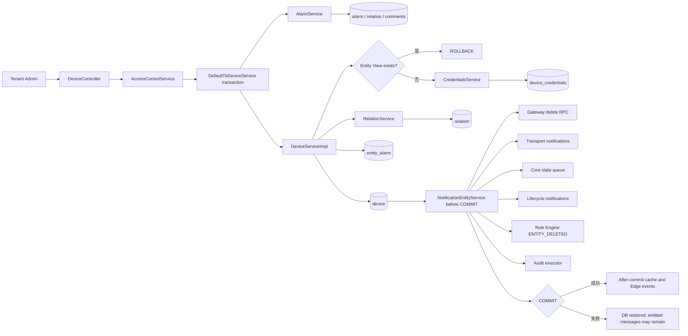

### 4.2 提交前与提交后事件边界

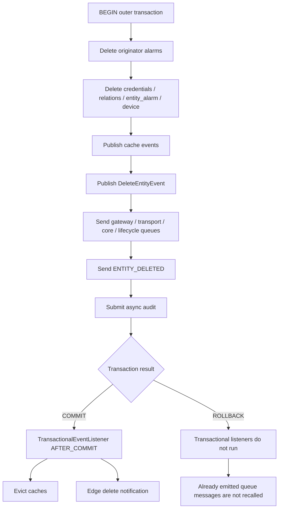

### 4.3 Transport 与 Actor 收敛

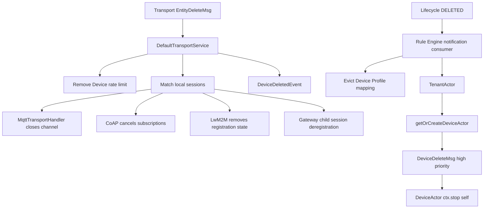

### 4.4 实体状态与遥测状态分离

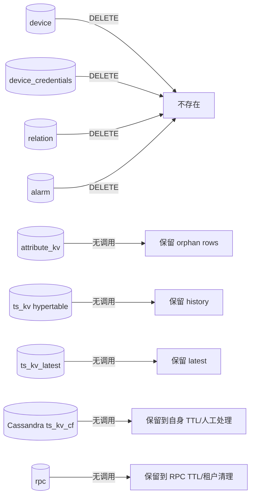

静态总览图见 [03-device-delete.svg](../../assets/architecture/03-device-delete.svg)。

---

## 五、时序图

[sequence.puml](sequence.puml) 是本章可编辑的 PlantUML 源文件，[sequence.svg](sequence.svg) 是渲染结果。时序图包含：权限与 Entity View 拒绝、告警和 Device 聚合删除、提交前五类消息、提交/回滚分叉、Transport/State/Actor/Rule Engine 消费，以及“无遥测清理”边界。

[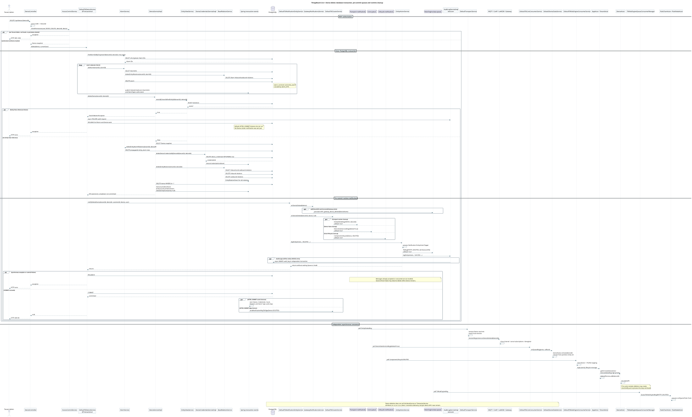](sequence.svg)

下面的 Mermaid 时序图用于在纯 Markdown 阅读器中快速查看核心竞争窗口：

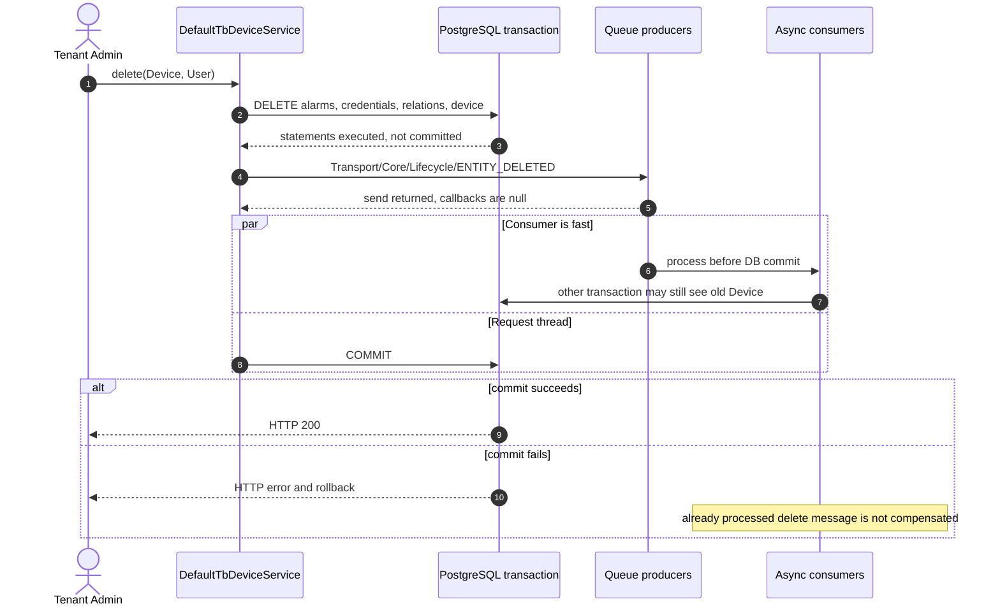

---

## 六、数据变化

### 6.1 数据库、缓存、Session、Actor 与 Topic

| 范围 | 变化 | 执行边界 |
|---|---|---|
| `alarm` | 删除目标 Device 作为 originator 的所有 Alarm | 外层 PostgreSQL 事务 |
| `alarm_comment` / `entity_alarm` | Alarm 删除时 FK 级联；Device 引用记录另行显式删除 | 外层事务 |
| `alarm_types` | 同类型无剩余 Alarm 时删除 | 外层事务；缓存提交后失效 |
| `device_credentials` | 按 `device_id` 删除并取得 credentialsId | 外层事务 |
| `relation` | 删除 Device 作为 from/to 的记录 | 外层事务；并发异常处理存在风险 |
| `device` | 按 UUID 删除 | 外层事务 |
| Device/credentials/count/relation cache | 对旧 key 执行 evict | 默认 `AFTER_COMMIT` |
| Device -> Profile runtime cache | lifecycle consumer 按 DeviceId evict | Queue 异步 |
| `audit_log` | mask 允许时异步写 DELETE/SUCCESS 或 DELETE/FAILURE | 独立 executor/独立 DB 事务 |
| Edge event | `DELETED`，entityId 是 DeviceId，body 可为 `null` | `DeleteEntityEvent` 的 `AFTER_COMMIT` listener |
| Transport sessions | MQTT 关闭 Channel；Gateway/LwM2M/CoAP 清会话或订阅 | Transport notification consumer |
| Device State | `deviceStates` 与 partition entity set 移除 | Core queue consumer |
| Device Actor | `DeviceDeleteMsg` 后停止；DeviceId 加入 `TenantActor.deletedDevices` | lifecycle notification consumer |
| Rule Engine | 发送删除前 Device JSON 的 `ENTITY_DELETED` | 提交前 producer，异步消费 |
| Notification center | 处理 `EntityActionTrigger(DELETED)` | EntityActionService 调用链 |

### 6.2 Tuple/对象生命周期

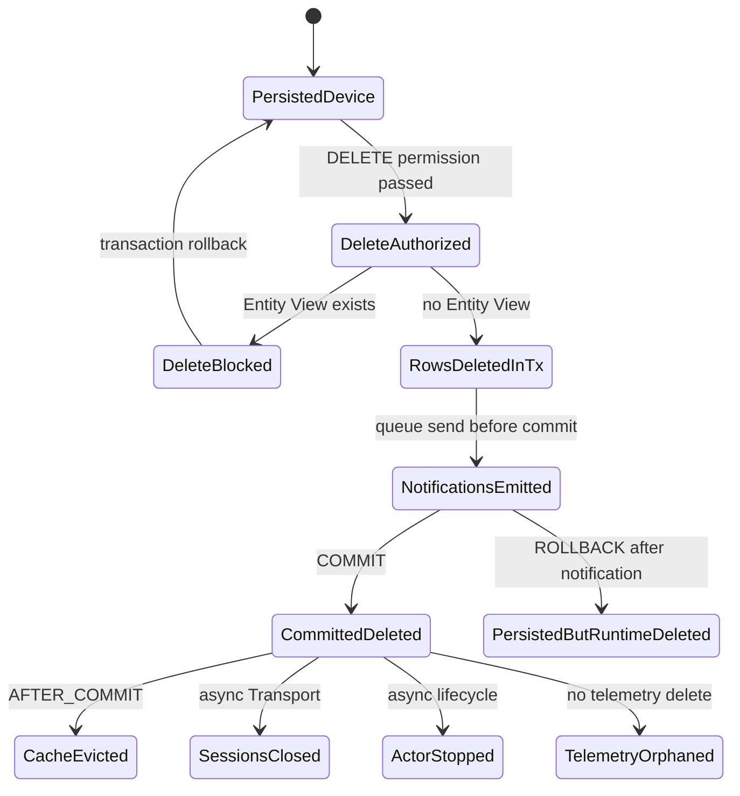

### 6.3 SQL/Timescale TTL 的孤儿数据问题

3.6.4 的 `schema-timescale.sql` 和 `schema-ts-psql.sql` 提供 `cleanup_timeseries_by_ttl(...)`。其 Device 清理函数使用如下条件：

```sql
DELETE FROM ts_kv
WHERE entity_id IN (
  SELECT device.id
  FROM device
  WHERE tenant_id = ... AND customer_id = ...
)
AND ts < ...;
```

标准 Device 删除先移除了 `device` 行。之后基于当前 `device` 表反查租户/客户归属的 TTL 过程可能再也选不到该 Device 的历史 `ts_kv`。因此：

1. 不能把 Device 删除后的 SQL/Timescale history 描述成“自然由 ThingsBoard TTL 清掉”。
2. `ts_kv_latest` 不在该历史 TTL DELETE 中，本链也不删除它。
3. Cassandra history 是否过期取决于写入时 TTL；删除 Device 本身不会触发 Cassandra delete。
4. 生产系统若要求 GDPR/租户数据擦除或 Device ID 重用前清场，需要在删除前按 EntityId 显式清理属性、latest、history、RPC/Event，或设计独立 tombstone/housekeeping 流程。

---

## 七、源码分析

### 7.1 分层与依赖关系

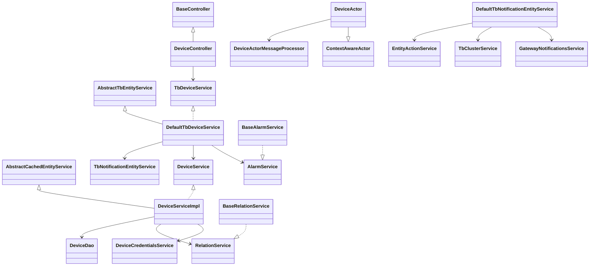

应用层 `DefaultTbDeviceService` 持有 User、ActionType、Alarm 和集群通知语义；DAO 层 `DeviceServiceImpl` 持有引用校验、Credentials、Relations、缓存事件和 `device` 持久化语义。这个边界解释了为什么直接调用 `DeviceService.deleteEntity(...)` 不等价于 REST 删除。

### 7.2 关键接口与实现

| 职责 | 接口/抽象 | release-3.6 实现 |
|---|---|---|
| REST 用例 | `org.thingsboard.server.service.entitiy.device.TbDeviceService` | `org.thingsboard.server.service.entitiy.device.DefaultTbDeviceService` |
| Device 领域持久化 | `org.thingsboard.server.dao.device.DeviceService` | `org.thingsboard.server.dao.device.DeviceServiceImpl` |
| Device DAO | `org.thingsboard.server.dao.device.DeviceDao` | `org.thingsboard.server.dao.sql.device.JpaDeviceDao` |
| Credentials | `DeviceCredentialsService` / `DeviceCredentialsDao` | `DeviceCredentialsServiceImpl` / `JpaDeviceCredentialsDao` |
| Alarm | `org.thingsboard.server.dao.alarm.AlarmService` | `org.thingsboard.server.dao.alarm.BaseAlarmService` |
| Relation | `org.thingsboard.server.dao.relation.RelationService` | `org.thingsboard.server.dao.relation.BaseRelationService` + `JpaRelationDao` |
| 集群传播 | `org.thingsboard.server.cluster.TbClusterService` | `org.thingsboard.server.service.queue.DefaultTbClusterService` |
| Gateway 通知 | `GatewayNotificationsService` | `DefaultGatewayNotificationsService` |
| 实体动作 | 无单独接口 | `org.thingsboard.server.service.action.EntityActionService` |
| 审计 | `org.thingsboard.server.dao.audit.AuditLogService` | `AuditLogServiceImpl` 或禁用场景的 Dummy 实现 |
| Device State | `org.thingsboard.server.service.state.DeviceStateService` | `DefaultDeviceStateService` |
| Actor | `TbActor` / `ContextAwareActor` | `TenantActor`、`DeviceActor`、`DeviceActorMessageProcessor` |

### 7.3 为什么使用应用事务而不是数据库级 Cascade

Device 关系是多态关系：`relation`、`attribute_kv`、`entity_alarm`、Telemetry 都使用 `entity_type + entity_id` 或裸 `entity_id`，无法对每种实体建立普通 FK。应用服务必须先知道“Device 删除”这一业务含义，再选择哪些记录删除、哪些消息传播。

代价是删除正确性依赖入口：只有 `DefaultTbDeviceService.delete(...)` 才包含 originator Alarm 与通知编排；通用 DAO 删除只能保证 DAO 自己声明的部分。

---

## 八、Actor 分析

### 8.1 Actor 创建与停止

Device 删除的数据库主链不经过 Actor。Actor 是提交前发出的 lifecycle 消息的异步消费者：

1. `DefaultTbRuleEngineConsumerService` 收到 `ComponentLifecycleMsg(Device, DELETED)`。
2. `AbstractConsumerService.handleComponentLifecycleMsg(...)` 先失效 Device -> Profile 映射缓存，再发布给 Actor context。
3. `AppActor` 将消息路由到对应 `TenantActor`。
4. `TenantActor.onComponentLifecycleMsg(...)` 检查 Device 属于本节点分区。
5. 它调用 `onToDeviceActorMsg(new DeviceDeleteMsg(tenantId, deviceId), true)`。
6. `onToDeviceActorMsg(...)` 会调用 `getOrCreateDeviceActor(deviceId)`，然后高优先级投递。
7. `DeviceActor.doProcess(...)` 在 `DEVICE_DELETE_TO_DEVICE_ACTOR_MSG` 分支执行 `ctx.stop(ctx.getSelf())`。
8. `TenantActor` 把 DeviceId 加入 `deletedDevices`，以后到达的 device-aware 消息直接丢弃。

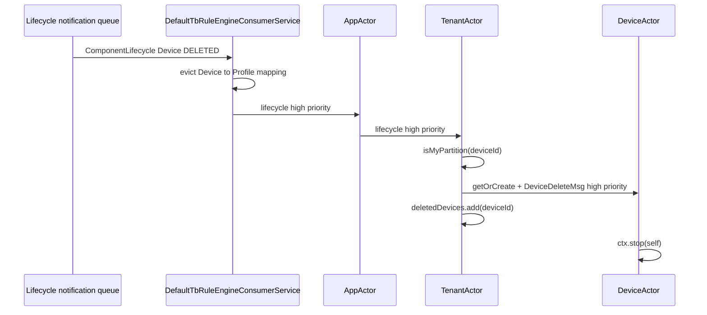

### 8.2 删除可能临时创建一个 Actor

创建章节中 `DEVICE/CREATED` 不会主动创建 Device Actor；删除恰好相反。`TenantActor` 为保证“无论 Actor 当前是否存在，删除命令都有一个确定接收者”，会调用 `getOrCreateDeviceActor(...)`。

若 Actor 此前不存在，`DeviceActorMessageProcessor` 构造时会调用 `initAttributes()`：

- Consumer 在 DB commit 前运行时，另一个事务可能仍读到旧 Device，Actor 会短暂加载 name/type/profile 后停止。
- Consumer 在 commit 后运行时，查询返回 null，Actor 仍可启动并立即处理高优先级 `DeviceDeleteMsg`。

Actor 的价值是串行化设备会话、RPC、订阅和删除命令，避免多个普通 Java 对象各自加锁。但它不是数据库事务参与者，Actor 停止不能回滚或补偿数据库。

---

## 九、Kafka 分析

### 9.1 先区分 Queue 抽象与 Kafka

`thingsboard.yml` 的默认 `queue.type` 是 `in-memory`。只有配置 `TB_QUEUE_TYPE=kafka` 时，下表逻辑 Queue 才由 Kafka factory 实现；还可以选择 AWS SQS、Pub/Sub、Service Bus 或 RabbitMQ。因此不能把 Device 删除写成“必经 Kafka”。

| 逻辑消息 | Producer 获取方式 | Topic/分区解析 | Consumer | 消息内容 |
|---|---|---|---|---|
| Transport 删除通知 | `getTransportNotificationsMsgProducer()` | `getNotificationsTopic(TB_TRANSPORT, transportServiceId)`，每个 Transport 实例一份 | Transport notification consumer -> `DefaultTransportService` | protobuf `EntityDeleteMsg(DEVICE, UUID)` |
| Device State 删除 | Core producer | `partitionService.resolve(TB_CORE, tenantId, deviceId)` | `DefaultTbCoreConsumerService` -> `DefaultDeviceStateService` | `DeviceStateServiceMsgProto(deleted=true)` |
| Component lifecycle | `getRuleEngineNotificationsMsgProducer()` | 每个 TB_RULE_ENGINE service 的 notification topic | `DefaultTbRuleEngineConsumerService` | `ComponentLifecycleMsgProto(DELETED)` |
| Rule Engine entity action | `getRuleEngineMsgProducer()` | queueName + tenantId + entityId 解析 `TopicPartitionInfo` | `TbRuleEngineQueueConsumerManager` | `ToRuleEngineMsg(TbMsg ENTITY_DELETED)` |
| Gateway delete RPC | Rule Engine data producer | 由 gateway Device 与 Profile/Queue 决定 | Rule Engine -> RPC Node/Device Actor | `TO_DEVICE_RPC_REQUEST`，method=`gateway_device_deleted` |
| Edge AFTER_COMMIT | Core/Edge notification producer | Edge notification routing | Edge service | Device `DELETED` event |

### 9.2 Kafka 分区与消费组语义

1. Rule Engine data queue 使用 Tenant/Entity 参与分区解析，目的是让同一实体消息在选定 Queue 内获得稳定路由；不能推导出跨 topic 的全序。
2. Transport 与 lifecycle notification 是节点定向 topic，每个服务实例需要收到自己的副本，不是业务竞争消费。
3. Core State 消息按 Device 路由到负责该 Device 的 Core 分区。
4. Kafka factory 为 Core/Rule Engine notification consumer 构造带 serviceId 的 group/client id；具体物理 topic 还受 `topic_prefix` 等部署配置影响。
5. 本删除链传给 producer 的 callback 基本都是 `null`。请求线程不等待 broker ack 的业务结果，也没有把失败写入 outbox。

### 9.3 跨 Topic 无顺序保证

Transport delete、Core state、lifecycle 和 `ENTITY_DELETED` 分属不同 topic/producer。即使它们由同一个请求线程依次调用，消费者仍可按任意顺序观察：

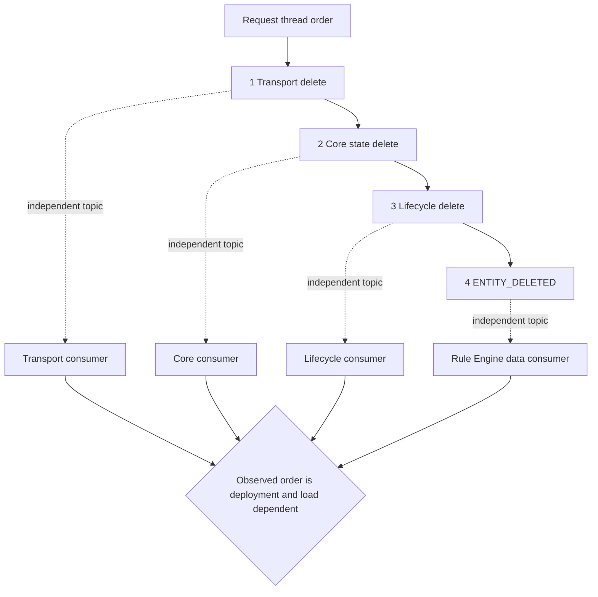

Rule Node 处理 `ENTITY_DELETED` 时不能假设 MQTT Session 已关闭，也不能假设 Device Actor 已停止。

---

## 十、数据库分析

### 10.1 PostgreSQL 表与约束

| 表 | 删除动作 | 关键约束与影响 |
|---|---|---|
| `device` | `DELETE WHERE id=?` | PK；name/externalId 按 tenant UNIQUE；Profile/OTA 是 FK，但没有其他表统一反向级联 |
| `device_credentials` | 按 device_id 删除 | `credentials_id` 与 `device_id` 均 UNIQUE；建表脚本未声明 device FK |
| `relation` | 按 from/to type+id 两次删除 | 多态关系，无 Device FK；必须显式双向清理 |
| `alarm` | 按 originator 查询后逐条删除 | `originator_id/type` 无 Device FK |
| `alarm_comment` | 随 Alarm 级联 | `alarm_id -> alarm.id ON DELETE CASCADE` |
| `entity_alarm` | 随 Alarm 级联，且按 Device 显式删除传播引用 | 只有 `alarm_id` FK；`entity_id` 没有 Device FK |
| `alarm_types` | 没有同类型 Alarm 时删除 | 通过 Service 维护，不由 DB 自动推导 |
| `entity_view` | 不删除 | 存在引用时在 DAO Service 主动阻止 Device 删除；没有物理 Device FK |
| `audit_log` | 可选新增一条 | 分区表；异步独立写入，不在 Device 事务中 |
| `edge_event` | 可选新增删除事件 | Edge 开启且 AFTER_COMMIT listener 执行时写入/发送 |

### 10.2 TimescaleDB

TimescaleDB 只承载 `ts_kv` history hypertable；`ts_kv_latest` 仍是普通 latest 表。Device 删除链没有调用 `TimeseriesService.remove(...)`、没有按 EntityId DELETE，也没有调用 TimescaleDB retention policy。

Timescale chunk 以时间维度组织，单个 Device 的数据分散在多个 chunk。按 Device 删除会变成跨 chunk DELETE，成本与历史跨度相关，这可能是 ThingsBoard 不在实体删除主事务内清遥测的工程原因。但源码只证明“没有清理”，不能把该设计推导成合规的数据保留保证。

### 10.3 Cassandra

`ts_kv_cf` 的分区键包含 `entity_type, entity_id, key, partition`，`ts_kv_latest_cf` 的分区键包含 `entity_type, entity_id`。删除 PostgreSQL `device` 不会触发 Cassandra 级联。History 写入时 TTL 可能最终过期，但 latest 与没有 TTL 的历史仍需单独策略。

### 10.4 Redis/Caffeine

Device、Credentials、Count、Relation 和 Alarm Type 缓存可以由本地 Caffeine 或 Redis 实现。`publishEvictEvent(...)` 检测到活动事务时只发布 Spring event，真正 `cache.evict(...)` 由默认 `AFTER_COMMIT` listener 执行。因此数据库回滚不会正常执行这些提交后 evict。

Transport 节点和 Rule Engine 的运行时缓存不靠这个 Spring 事务事件跨进程传播，而靠 Cluster notification queue。

### 10.5 为什么不写另一个数据库

- Device 元数据、凭据、关系和告警需要事务一致性与唯一约束，放在 PostgreSQL。
- 历史遥测规模大、写入模式不同，可放 PostgreSQL partition、TimescaleDB 或 Cassandra；Device 删除事务不跨这些后端。
- Redis 只保存可重建缓存，不作为 Device 删除事实来源。
- Queue 负责传播运行时状态，不承担数据库原子提交日志。

---

## 十一、异常处理

### 11.1 失败矩阵

| 失败点 | 数据库 | Queue/Actor/Session | HTTP/调用方 | 风险与处理建议 |
|---|---|---|---|---|
| Device 不存在/无权限 | 未开启删除事务 | 无消息 | 404/403 | 标准入口安全拒绝 |
| 存在 Entity View | Alarm 删除语句已加入事务，但整体回滚 | 通知尚未开始 | `DataValidationException` | 先删除/改绑 Entity View 再重试 |
| Alarm/credentials/device SQL 失败 | 外层事务回滚 | 通知尚未开始 | HTTP error | 查约束、锁等待和数据库日志 |
| Relation 删除遇到 `ConcurrencyFailureException` | DAO 与 Service 存在 catch；PostgreSQL 事务可能已 abort，或关系未可靠清完 | 后续行为取决于事务状态 | 可能继续到 commit 再失败 | 不应把 debug 日志当成功；检查 orphan relations 和 transaction rollback-only |
| Gateway RPC producer 同步抛错 | 外层事务回滚 | RPC 可能未发或部分副作用已注册 | HTTP error | Gateway 通知在最前，失败会阻止后续 cluster 调用 |
| Transport send 成功，后续 Core/lifecycle send 同步抛错 | 外层事务回滚 | 已发送的 Transport delete 不会撤销，Session 可能关闭 | HTTP error | 典型“DB 存在但运行时已按删除处理”窗口 |
| producer 异步失败且 callback=null | DB 仍可提交 | 某些节点收不到删除 | 仍可能 200 | 没有 transactional outbox；依赖 Queue 可靠性、监控和人工重放 |
| `ENTITY_DELETED` push 抛错 | `EntityActionService` 捕获并记录 warning，DB 可提交 | Rule Chain 不感知删除 | 仍可能 200 | 监控 `Failed to push entity action` 日志 |
| Audit 写失败 | Device 事务不受影响 | 无 Actor 影响 | 仍可能 200 | Future 未等待；审计必须单独监控 executor/DAO |
| DB commit 失败但预提交消息已消费 | DB 恢复 Device/Alarm/Credentials | Session/Actor/State 可能已删除 | HTTP error | 无自动补偿；需要重新发送 update/create lifecycle 或重试管理操作 |
| DB commit 成功但客户端超时 | Device 已删除 | 消息可能继续消费 | 客户端认为未知 | 重试会因 Device 不存在返回错误；先 GET/查 DB 确认 |

### 11.2 关系删除的异常吞并

`JpaRelationDao.deleteInboundRelations(...)` 和 `deleteOutboundRelations(...)` 捕获 `ConcurrencyFailureException` 只写 debug 日志；`BaseRelationService` 的 inbound 分支又有一层同类 catch。由于 relation 没有 Device FK：

- 如果数据库事务被异常标记为 rollback-only，最终 commit 会失败并回滚全部删除。
- 如果底层异常没有使整个事务不可用，Device 可能删除而 relation 残留。
- Service 仍会按删除前查询到的 relations 发布缓存事件，事件不等价于数据库行一定删除。

生产排障需要同时检查事务最终结果和 relation 表，而不是只看应用方法是否走到后面。

### 11.3 大量 Alarm 与长事务

`removeAlarmsByOriginatorId(...)` 使用 `TimePageLink(Integer.MAX_VALUE)` 一次加载全部 AlarmId，再逐条删除、逐条清类型和发布事件。对异常高告警量设备，这会造成：

1. 大结果集占用 JVM heap。
2. 长事务持有更多行锁和 dead tuples。
3. 每条 Alarm 都有关系查询和事件开销。
4. 事务后段才发送 Device 删除通知，整体延迟增大。

上线前应统计单 Device Alarm 数量；极端场景需要先分批归档/删除 Alarm，而不是直接依赖这个 REST 调用。

### 11.4 可观测性检查点

| 目标 | 检查项 |
|---|---|
| DB 事务 | PostgreSQL deadlock/lock timeout、Spring `UnexpectedRollbackException`、Device/credentials/relation/alarm 行 |
| Queue | producer error、notification/data topic lag、consumer failure/retry 指标 |
| Transport | `DefaultTransportService` delete event、MQTT channel close、活跃 session 数 |
| Actor | `TenantActor` deleted device 日志、Device Actor stop、删除后消息丢弃日志 |
| Rule Engine | `ENTITY_DELETED` debug event、规则链失败关系、queueName/partition |
| 数据残留 | `attribute_kv`、`ts_kv_latest`、跨 chunk `ts_kv`、Cassandra partitions、`rpc` |

---

## 十二、源码阅读路线

按下面顺序阅读可以最快建立“事务删除”和“异步运行时删除”两套模型：

1. [DeviceController.java:267](../../../application/src/main/java/org/thingsboard/server/controller/DeviceController.java#L266)：确认 REST 权限与入口对象。
2. [DefaultTbDeviceService.java:134](../../../application/src/main/java/org/thingsboard/server/service/entitiy/device/DefaultTbDeviceService.java#L133)：先看外层 `@Transactional`，这是全章最关键边界。
3. [AbstractTbEntityService.java:118](../../../application/src/main/java/org/thingsboard/server/service/entitiy/AbstractTbEntityService.java#L117)：理解 originator Alarm 是应用层额外清理。
4. [DeviceServiceImpl.java:459](../../../dao/src/main/java/org/thingsboard/server/dao/device/DeviceServiceImpl.java#L457)：逐行确认 Entity View、entity-alarm、credentials、relations、device 和事件顺序。
5. [BaseAlarmService.java:276](../../../dao/src/main/java/org/thingsboard/server/dao/alarm/BaseAlarmService.java#L274)：理解 Alarm 自身聚合删除与 FK cascade。
6. [BaseRelationService.java:407](../../../dao/src/main/java/org/thingsboard/server/dao/relation/BaseRelationService.java#L405) 和 [JpaRelationDao.java:372](../../../dao/src/main/java/org/thingsboard/server/dao/sql/relation/JpaRelationDao.java#L370)：检查双向关系和并发异常处理。
7. [DefaultTbNotificationEntityService.java:209](../../../application/src/main/java/org/thingsboard/server/service/entitiy/DefaultTbNotificationEntityService.java#L208)：确认所有通知仍在事务方法内。
8. [DefaultTbClusterService.java:513](../../../application/src/main/java/org/thingsboard/server/service/queue/DefaultTbClusterService.java#L512)：拆开 Transport、State、Lifecycle 三条 queue。
9. [EntityActionService.java:91](../../../application/src/main/java/org/thingsboard/server/service/action/EntityActionService.java#L90)：跟踪 `ENTITY_DELETED`、Notification Rule 和 Audit。
10. [DefaultTransportService.java:1401](../../../common/transport/transport-api/src/main/java/org/thingsboard/server/common/transport/service/DefaultTransportService.java#L1400)：看协议 Session 如何收敛。
11. [TenantActor.java:346](../../../application/src/main/java/org/thingsboard/server/actors/tenant/TenantActor.java#L345) 与 [DeviceActor.java:83](../../../application/src/main/java/org/thingsboard/server/actors/device/DeviceActor.java#L82)：验证“删除会创建后立即停止 Actor”。
12. [schema-entities.sql:43](../../../dao/src/main/resources/sql/schema-entities.sql#L43)、[schema-timescale.sql:19](../../../dao/src/main/resources/sql/schema-timescale.sql#L19) 与 [schema-ts.cql:17](../../../dao/src/main/resources/cassandra/schema-ts.cql#L17)：最后用建表脚本校验哪些 FK 和清理根本不存在。

建议下一章阅读 Device Profile，因为删除时 Rule Engine queue/rule chain 的解析和 lifecycle cache eviction 都依赖 `DefaultTbDeviceProfileCache`。

---

## 十三、常见面试题

### 13.1 Device 删除为什么不直接依赖数据库 ON DELETE CASCADE？

**标准答案：** ThingsBoard 的 relation、attribute、alarm propagation 和 telemetry 是多态实体模型，很多表只存 `entity_type + entity_id` 或裸 UUID，无法全部建立到 `device` 的静态 FK。删除还要关闭协议 Session、清 Device State、停 Actor、触发 Rule Engine，这些也不是数据库 cascade 能完成的。因此由应用服务编排。代价是不同入口可能具有不同删除语义。

### 13.2 标准 REST 删除的事务边界在哪里？

**标准答案：** 在 `DefaultTbDeviceService.delete(Device, User)` 的 `@Transactional`。Alarm 删除、Device DAO 删除和 `notifyDeleteDevice(...)` 都在该外层事务中。DAO 内部的 `@Transactional` 默认加入现有事务，不会提前独立提交。

### 13.3 Cluster 通知是在 commit 后发送吗？

**标准答案：** 不是。3.6.4 标准删除在 `notifyDeleteDevice(...)` 中先发送 Gateway、Transport、Core state、lifecycle 和 Rule Engine entity action，方法返回后外层事务才提交。缓存事件和 `DeleteEntityEvent` 的事务监听器才默认在 `AFTER_COMMIT` 执行。

### 13.4 Queue 消息已成功是否代表 Device 一定删除？

**标准答案：** 不代表。消息先于 DB commit，且没有 transactional outbox。后续同步异常或 commit 失败会回滚数据库，但已发送/已消费消息不会自动撤回。

### 13.5 Device 删除会清理 TimescaleDB 遥测吗？

**标准答案：** 不会。调用链没有 TimeseriesService，也没有对 `ts_kv` hypertable 或 `ts_kv_latest` 的 DELETE。Timescale history 可能成为 orphan rows；3.6.4 的 SQL TTL 过程还依赖当前 `device` 表反查归属，Device 行删除后不一定能命中这些孤儿。

### 13.6 Cassandra 遥测会怎样？

**标准答案：** Device 删除不调用 Cassandra DAO。History 是否过期由写入 TTL 决定，latest/无 TTL 数据需要独立清理策略。PostgreSQL 删除不会跨数据库级联。

### 13.7 为什么删除可能创建一个新的 Device Actor？

**标准答案：** `TenantActor` 对 Device DELETED 调用 `getOrCreateDeviceActor(...)`，再高优先级投递 `DeviceDeleteMsg`。这样删除命令总有确定的 Actor 接收者；`DeviceActor` 收到后立即 `ctx.stop(self)`。这与 CREATED lifecycle 只通知已有 actor 的惰性策略不同。

### 13.8 `ENTITY_DELETED` Rule Engine 消息里还有 Device 数据吗？

**标准答案：** 有。应用服务在删除前持有 Device 快照，`EntityActionService` 把它序列化为 JSON body，并附加 user/customer metadata。Consumer 不需要重新查询已经删除的 Device 才能获得基本内容。

### 13.9 Entity View 为什么能阻止删除，数据库却没有 FK？

**标准答案：** `DeviceServiceImpl.deleteDevice(...)` 在删除前调用 `entityViewService.existsByTenantIdAndEntityId(...)`，这是应用级引用校验。`entity_view.entity_id` 是多态 ID，没有到 `device.id` 的物理 FK。

### 13.10 如何让 Device 删除达到严格的一致性？

**标准答案：** 至少需要把数据库变更和待发布事件写入同一数据库事务的 outbox，再由可靠 publisher 发送并幂等消费；为每个副作用定义重试/补偿；用 deletion tombstone 保留租户/Profile/TTL 上下文；遥测、属性、latest、RPC 等采用可审计的异步清理任务。当前 3.6.4 主链没有提供这些完整保证。

### 13.11 删除后 HTTP 超时，客户端应直接重试吗？

**标准答案：** 不能把 DELETE 当成返回语义完全幂等。数据库可能已经 commit，重试会在 `checkDeviceId(...)` 返回 not found；也可能 commit 失败但 Session 已被预提交消息关闭。客户端或运维流程应先查询 Device 与关键残留，再决定补偿或重发运行时通知。

### 13.12 为什么不把遥测删除放进同一个事务？

**标准答案：** PostgreSQL 元数据事务无法覆盖 Cassandra；Timescale history 可能横跨大量 chunk，按 Device 大范围 DELETE 会放大锁、WAL、dead tuples 和 Vacuum 压力。把它放进交互式 REST 事务会显著增加超时和回滚成本。但正确做法应是显式异步清理协议，而不是默认假设数据已清除。

---

[上一篇：02 Device 创建流程](../02-device-create/README.md) | [HTML 版](index.html) | [全书目录](../../SUMMARY.md) | [下一篇：04 Device Profile 流程](../04-device-profile/README.md)
