# 04 Device Profile 流程

> 源码基线：ThingsBoard `3.6.4`，提交 `0cb411fc90`。本章同时覆盖 Device Profile 的创建、更新、重命名、默认切换、删除，以及它对 Device、Transport、Rule Engine、Alarm、Provision、OTA、Edge 和缓存的传播。四条写路径具有不同的事务与通知语义，不能合并理解。

[上一篇：03 Device 删除流程](../03-device-delete/README.md) | [HTML 版](index.html) | [全书目录](../../SUMMARY.md) | [PlantUML 源文件](sequence.puml) | [时序图 SVG](sequence.svg) | [架构图 SVG](../../assets/architecture/04-device-profile.svg) | [下一篇：05 Rule Chain 执行流程（待分析）](../../SUMMARY.md#chapter-05)

---

## 一、流程目标

Device Profile 不是 Device 的普通分类标签。它是同一类设备共享的运行策略，集中定义以下六组行为：

1. Device 创建时未显式指定 Profile，使用哪个租户默认 Profile。
2. 设备使用 DEFAULT、MQTT、CoAP、LwM2M 还是 SNMP Transport，以及自定义 topic、payload、Protobuf schema 等协议参数。
3. 设备是否允许自动 Provision，以及 `provisionDeviceKey`、secret 或 X.509 certificate chain 如何校验。
4. 设备消息默认进入哪个 Rule Chain、哪个 Rule Engine Queue；Edge 上使用哪个 Rule Chain。
5. Profile Alarm Rules 如何被 `TbDeviceProfileNode` 加载，并作用到引用该 Profile 的每台 Device。
6. 设备没有显式 OTA package 时，继承哪个 firmware/software package。

### 1.1 持久化模型不是“每个配置一张表”

`device_profile` 把常用、需要约束或需要关联的字段放成普通列，把协议和告警规则的多态结构放进 `profile_data jsonb`：

| 区域 | 主要内容 | 设计作用 |
|---|---|---|
| 标识与租户 | `id`、`tenant_id`、`name`、`external_id` | 主键、租户内唯一名称、导入导出映射 |
| 类型选择器 | `type`、`transport_type`、`provision_type` | 让查询、校验和协议分支不必解析 JSONB |
| Rule Engine | `default_rule_chain_id`、`default_edge_rule_chain_id`、`default_queue_name` | 消息入队前决定 Rule Chain 和 Queue |
| UI | `default_dashboard_id`、`image`、`description` | 默认 Dashboard 与展示信息 |
| OTA | `firmware_id`、`software_id` | Device 未覆盖时的默认包 |
| Provision | `provision_device_key` | 全局唯一查找键；secret 和策略细节位于 JSONB |
| 多态配置 | `profile_data jsonb` | configuration、transportConfiguration、provisionConfiguration、alarms |

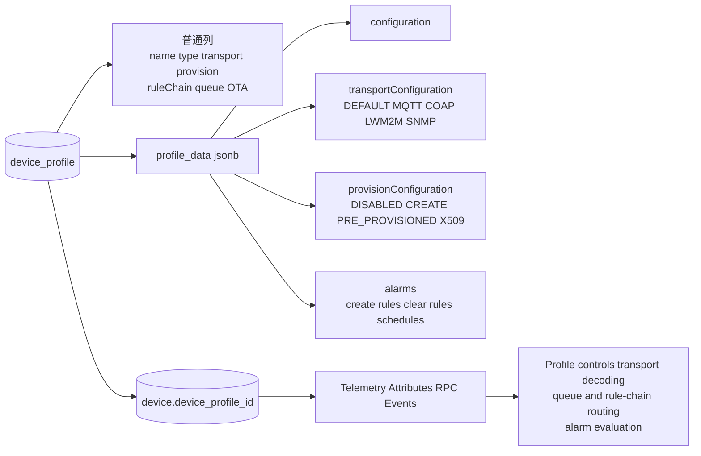

### 1.2 本章最重要的事务事实

标准 REST 保存不是一个覆盖所有副作用的事务。`DefaultTbDeviceProfileService.save(DeviceProfile, User)` 没有 `@Transactional`，`DeviceProfileServiceImpl.doSaveDeviceProfile(...)` 也没有。真正的 Profile 行事务位于 `JpaDeviceProfileDao.saveAndFlush(...)`；该 DAO 方法返回时，Profile 行已经提交。

| 操作 | 数据库事务 | 事务之后的同步编排 | 原子性结论 |
|---|---|---|---|
| 创建/普通更新 | `deviceProfileDao.saveAndFlush(...)` 单独提交 | cache event、Edge event、VC auto-commit、Transport、lifecycle、OTA、Rule Engine action、Audit | Profile 与这些副作用不原子 |
| Profile 重命名 | Profile 先提交；每台 Device 的 `saveDevice(Device)` 各自单独提交 | 全部 Device 更新完后才发 Profile Cluster 通知 | Profile 与 `device.type` 批量兼容字段不原子 |
| 切换默认 Profile | 旧默认和新默认分别调用事务 DAO `save(...)` | 两个 Profile 的 `ENTITY_UPDATED` 和 Audit | 两行切换不原子，也无数据库唯一约束 |
| 删除 | `deleteDeviceProfile(...)` 内 relations、entity-alarm、Profile、级联 OTA 同事务 | 提交后 cache/Edge；随后 Transport delete、lifecycle、Rule Engine action、Audit | 删除聚合原子，但分布式通知不在事务内 |

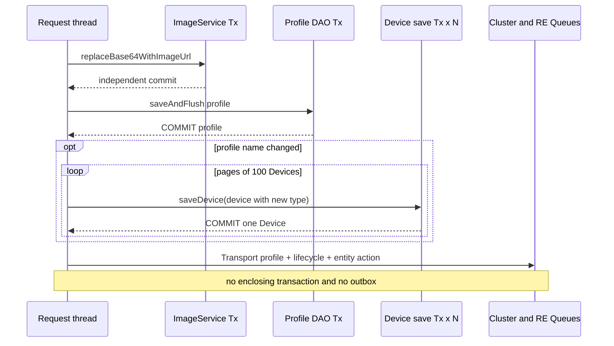

### 1.3 `name` 与 `device.type` 的兼容关系

Device 的真正引用是 `device.device_profile_id -> device_profile.id`。`device.type` 仍保留 Profile name，主要用于兼容查询、展示和既有接口。Profile 重命名后，DAO Service 以 100 条分页读取所有关联 Device，把 `device.type` 改为新 Profile name 并逐台保存。

这说明 `device.type` 不是独立的强一致分类字段。重命名中途失败时，Profile 名称已提交，可能只有部分 Device 的 `type` 已同步。业务判断应优先使用 `device_profile_id`，不要假设 `device.type == device_profile.name` 永远成立。

---

## 二、入口

### 2.1 REST API

所有写 API 都位于 `org.thingsboard.server.controller.DeviceProfileController`；标准写入口只允许 Tenant Admin。

| HTTP 入口 | 完整方法 | 调用者与时机 | 权限/结果 |
|---|---|---|---|
| `POST /api/deviceProfile` | `saveDeviceProfile(DeviceProfile deviceProfile)` | UI 或 REST Client 创建/更新 | `TENANT_ADMIN`；返回保存后的 Profile |
| `DELETE /api/deviceProfile/{deviceProfileId}` | `deleteDeviceProfile(String strDeviceProfileId)` | Tenant Admin 删除非默认、未被 Device 引用的 Profile | `TENANT_ADMIN`；成功为空 `200 OK` |
| `POST /api/deviceProfile/{deviceProfileId}/default` | `setDefaultDeviceProfile(String strDeviceProfileId)` | 切换租户默认 Profile | `TENANT_ADMIN`；返回新默认 Profile |
| `GET /api/deviceProfile/{deviceProfileId}` | `getDeviceProfileById(String, boolean)` | 读取完整 Profile，可内联 image | `TENANT_ADMIN` |
| `GET /api/deviceProfileInfo/{deviceProfileId}` | `getDeviceProfileInfoById(String)` | 读取轻量 ProfileInfo | Tenant Admin / Customer User |
| `GET /api/deviceProfileInfo/default` | `getDefaultDeviceProfileInfo()` | Device 创建 UI 等读取默认 Profile | Tenant Admin / Customer User |
| `GET /api/deviceProfiles` | `getDeviceProfiles(int, int, String, String, String)` | 完整 Profile 分页 | `TENANT_ADMIN` |
| `GET /api/deviceProfileInfos` | `getDeviceProfileInfos(int, int, String, String, String, String)` | 按 transportType 获取轻量分页 | Tenant Admin / Customer User |
| `GET /api/deviceProfile/names` | `getDeviceProfileNames(boolean activeOnly)` | 名称选择器；可只看已被 Device 使用的 Profile | Tenant Admin / Customer User |
| `GET .../keys/timeseries` | `getTimeseriesKeys(String deviceProfileIdStr)` | Alarm Rule UI 自动完成 | 最多采样 100 台相关 Device |
| `GET .../keys/attributes` | `getAttributesKeys(String deviceProfileIdStr)` | Alarm Rule UI 自动完成 | 最多采样 100 台相关 Device |

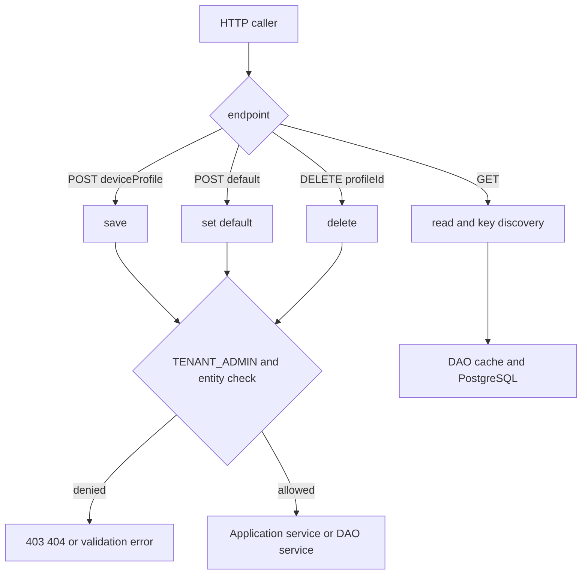

### 2.2 其他真实入口

| 入口 | 源码入口 | 行为差异 |
|---|---|---|
| Tenant 创建 | `TenantServiceImpl.saveTenant(Tenant)` -> `createDefaultDeviceProfile(TenantId)` | 外层 Tenant `@Transactional` 存在；默认 Profile 与 Tenant 创建加入同一事务 |
| Version Control / Import | `DeviceProfileImportService.saveOrUpdate(...)` | 直接保存 DAO 模型，随后自行发 Cluster/lifecycle/OTA/Audit；保留旧 OTA 字段 |
| Edge 上行 create/update | `DeviceProfileEdgeProcessor.processDeviceProfileMsgFromEdge(...)` | 支持 CREATED/UPDATED；冲突名称自动追加随机后缀；不把 Edge Profile 设为默认 |
| Edge 上行 delete | 同上，`ENTITY_DELETED_RPC_MESSAGE` | **不支持**，返回 unsupported message type |
| Edge 下行 | `convertDeviceProfileEventToDownlink(...)` | Cloud 的 ADDED/UPDATED/DELETED 均可转换为 DeviceProfileUpdateMsg |
| Device bulk import | `DeviceBulkImportService.setUpLwM2mDeviceProfile(...)` | 查找或创建 LwM2M Profile，直接调用 DAO Service 保存 |
| Installer/demo | `DefaultSystemDataLoaderService` 等 | 创建预置 Profile 和 Alarm Rules，不经过 REST Controller |

MQTT、CoAP、LwM2M 和 SNMP 不是 Profile 数据库写入口。它们是 Profile 变更的消费者：Transport notification 到达后更新协议解析器、当前 Session 和协议客户端状态。

---

## 三、完整调用链

### 3.1 标准 REST 创建/更新

| 步骤 | 类与方法（完整参数） | 源码位置 | 输入 -> 输出 | 职责与设计原因 |
|---|---|---|---|---|
| 1 | `org.thingsboard.server.controller.DeviceProfileController.saveDeviceProfile(DeviceProfile deviceProfile)` | [DeviceProfileController.java:249](../../../application/src/main/java/org/thingsboard/server/controller/DeviceProfileController.java#L249) | HTTP JSON -> `DeviceProfile` | 强制覆盖 tenantId，执行实体级检查，把用户上下文交给应用服务 |
| 2 | `org.thingsboard.server.service.entitiy.device.profile.DefaultTbDeviceProfileService.save(DeviceProfile deviceProfile, User user)` | [DefaultTbDeviceProfileService.java:66](../../../application/src/main/java/org/thingsboard/server/service/entitiy/device/profile/DefaultTbDeviceProfileService.java#L66) | Profile + User -> saved Profile | 计算 ADDED/UPDATED，比较 OTA 字段，组织 VC、Cluster、OTA、Rule Engine 和 Audit；没有外层事务 |
| 3 | `org.thingsboard.server.dao.device.DeviceProfileServiceImpl.saveDeviceProfile(DeviceProfile deviceProfile)` | [DeviceProfileServiceImpl.java:268](../../../dao/src/main/java/org/thingsboard/server/dao/device/DeviceProfileServiceImpl.java#L268) | Profile -> saved Profile | DAO Service 公共入口，启用完整校验 |
| 4 | `org.thingsboard.server.dao.service.validator.DeviceProfileDataValidator.validateDataImpl(TenantId tenantId, DeviceProfile deviceProfile)` | [DeviceProfileDataValidator.java:159](../../../dao/src/main/java/org/thingsboard/server/dao/service/validator/DeviceProfileDataValidator.java#L159) | Profile -> valid or exception | 校验 tenant、default、queue、transport、schema、alarm、Rule Chain、Dashboard、OTA |
| 5 | `org.thingsboard.server.dao.resource.BaseImageService.replaceBase64WithImageUrl(HasImage entity, String type)` | [BaseImageService.java:423](../../../dao/src/main/java/org/thingsboard/server/dao/resource/BaseImageService.java#L423) | Base64 image -> URL | `@Transactional(noRollbackFor=Exception.class)`；image resource 可先于 Profile 独立提交 |
| 6 | `org.thingsboard.server.dao.sql.device.JpaDeviceProfileDao.saveAndFlush(TenantId tenantId, DeviceProfile deviceProfile)` | [JpaDeviceProfileDao.java:105](../../../dao/src/main/java/org/thingsboard/server/dao/sql/device/JpaDeviceProfileDao.java#L105) | domain -> persisted domain | 独立 `@Transactional`，JPA save 后 flush 约束；返回时事务提交 |
| 7 | `DeviceProfileServiceImpl.handleEvictEvent(DeviceProfileEvictEvent event)` | [DeviceProfileServiceImpl.java:147](../../../dao/src/main/java/org/thingsboard/server/dao/device/DeviceProfileServiceImpl.java#L147) | cache keys -> evict | REST 保存此时已无活动事务，因此 `publishEvictEvent` 直接同步清 DAO cache |
| 8 | `ApplicationEventPublisher.publishEvent(SaveEntityEvent<?> event)` | [DeviceProfileServiceImpl.java:300](../../../dao/src/main/java/org/thingsboard/server/dao/device/DeviceProfileServiceImpl.java#L300) | tenant + id + created -> listeners | 无外层事务时 `fallbackExecution=true` 的 Edge listener 立即执行；event 不携带 Profile body |
| 9 | `AbstractTbEntityService.autoCommit(User user, EntityId entityId)` | [AbstractTbEntityService.java:191](../../../application/src/main/java/org/thingsboard/server/service/entitiy/AbstractTbEntityService.java#L191) | user + profileId -> Future UUID | 可选 Version Control auto-commit；返回 Future 不被等待 |
| 10 | `DefaultTbClusterService.onDeviceProfileChange(DeviceProfile, TbQueueCallback)` | [DefaultTbClusterService.java:428](../../../application/src/main/java/org/thingsboard/server/service/queue/DefaultTbClusterService.java#L428) | serialized Profile -> Transport notifications | 把完整 Profile 广播到每个 Transport serviceId，callback 为 null |
| 11 | `DefaultTbClusterService.broadcastEntityStateChangeEvent(TenantId, EntityId, ComponentLifecycleEvent)` | [DefaultTbClusterService.java:415](../../../application/src/main/java/org/thingsboard/server/service/queue/DefaultTbClusterService.java#L415) | CREATED/UPDATED -> lifecycle notifications | 通知所有 Core/Rule Engine 节点清运行时缓存 |
| 12 | `DefaultOtaPackageStateService.update(DeviceProfile, boolean, boolean)` | [DefaultOtaPackageStateService.java:226](../../../application/src/main/java/org/thingsboard/server/service/ota/DefaultOtaPackageStateService.java#L226) | Profile OTA diff -> per-device async work | 分页 100 台，更新未显式覆盖 OTA 的 Device 状态遥测/属性 |
| 13 | `DefaultTbNotificationEntityService.logEntityAction(...)` -> `EntityActionService.logEntityAction(...)` | [DefaultTbNotificationEntityService.java:146](../../../application/src/main/java/org/thingsboard/server/service/entitiy/DefaultTbNotificationEntityService.java#L146) | action -> Rule Engine + Audit | 发送 `ENTITY_CREATED/ENTITY_UPDATED`，处理 Notification Rule，并异步记录 audit_log |

`autoCommit(...)`、Cluster producer、OTA producer 和 Audit 不组成一次确认协议。HTTP 返回前只完成这些方法的同步调用，不等待所有 Future、broker consumer、Session callback 或 Rule Node 执行完成。

### 3.2 Profile 重命名

Profile DAO 事务提交后，`DeviceProfileServiceImpl.doSaveDeviceProfile(...)` 才检查名称变化。每页 100 条 Device，每台执行 `DeviceServiceImpl.saveDevice(Device)`：

| 步骤 | 方法 | 结果 |
|---|---|---|
| 1 | `deviceDao.findDevicesByTenantIdAndProfileId(UUID tenantId, UUID profileId, PageLink pageLink)` | 按 Profile 分页读取 Device |
| 2 | `device.setType(deviceProfile.getName())` | 更新兼容字段，不修改真正 FK |
| 3 | `DeviceServiceImpl.saveDevice(Device device)` | 每台 Device 各自一个 Spring 事务 |
| 4 | `SaveEntityEvent` / Device cache event | 每台 Device 的 DAO cache 与 Edge 事件按各自事务处理 |
| 5 | 返回应用服务后发 Profile Cluster 通知 | 只有全部分页处理成功才执行 |

该路径没有调用 `DefaultTbNotificationEntityService.notifyCreateOrUpdateDevice(...)`，因此不会为每台兼容字段更新执行标准 Device Transport/Core/lifecycle/OTA/Audit 编排。它只保存 Device 行并发布 DAO 层事件。

### 3.3 切换默认 Profile

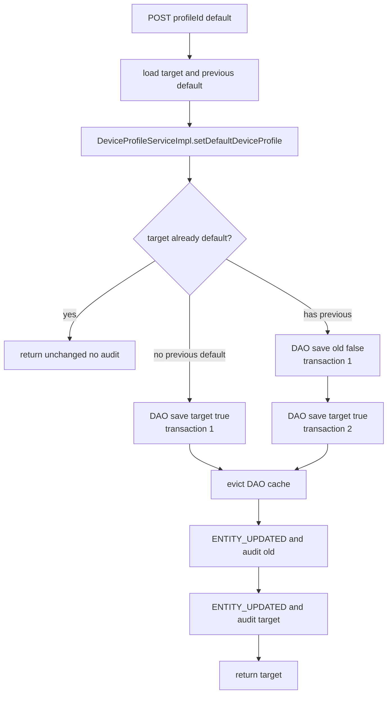

| 步骤 | 类与方法 | 源码位置 | 关键事实 |
|---|---|---|---|
| 1 | `DeviceProfileController.setDefaultDeviceProfile(String)` | [DeviceProfileController.java:291](../../../application/src/main/java/org/thingsboard/server/controller/DeviceProfileController.java#L291) | Controller 在调用前分别读取 target 和 previous default |
| 2 | `DefaultTbDeviceProfileService.setDefaultDeviceProfile(DeviceProfile, DeviceProfile, User)` | [DefaultTbDeviceProfileService.java:134](../../../application/src/main/java/org/thingsboard/server/service/entitiy/device/profile/DefaultTbDeviceProfileService.java#L134) | 无 `@Transactional`；只在 changed=true 时记录两次 UPDATED action |
| 3 | `DeviceProfileServiceImpl.setDefaultDeviceProfile(TenantId, DeviceProfileId)` | [DeviceProfileServiceImpl.java:507](../../../dao/src/main/java/org/thingsboard/server/dao/device/DeviceProfileServiceImpl.java#L507) | 旧默认 false 与目标 true 分别调用事务 DAO save |
| 4 | `JpaAbstractDao.save(TenantId, D)` | [JpaAbstractDao.java:80](../../../dao/src/main/java/org/thingsboard/server/dao/sql/JpaAbstractDao.java#L80) | 每次代理调用单独事务提交 |

建表脚本没有 `UNIQUE (tenant_id) WHERE is_default = true` 一类约束。应用校验只能降低普通请求的冲突，不能防止两个并发默认切换产生多默认，也不能防止第一次 save 成功、第二次 save 失败后出现“无默认”。

此外，[DeviceProfileServiceImpl.java:523](../../../dao/src/main/java/org/thingsboard/server/dao/device/DeviceProfileServiceImpl.java#L523) 为旧默认 Profile 构造 evict event 时传入的是**目标 Profile** 的 `provisionDeviceKey`。如果两个 key 不同，旧 Profile 的 provision-key cache key 不会被该事件淘汰，按 provision key 读取时可能短期得到 `isDefault=true` 的旧缓存对象。这不改变数据库结果，但属于 3.6.4 源码级缓存风险。

默认切换不会调用 `onDeviceProfileChange(...)`，也不会广播 Profile lifecycle。Transport Session 和 Rule Engine Profile cache 不会因 `is_default` 改变而热更新；标准 Device 创建通过 DAO 的 default-profile cache 读取新默认值。

### 3.4 删除 Profile

| 步骤 | 类与方法 | 源码位置 | 输入 -> 输出 | 职责 |
|---|---|---|---|---|
| 1 | `DeviceProfileController.deleteDeviceProfile(String)` | [DeviceProfileController.java:270](../../../application/src/main/java/org/thingsboard/server/controller/DeviceProfileController.java#L270) | path UUID -> void | `Operation.DELETE` 检查并保留删除前 Profile 快照 |
| 2 | `DefaultTbDeviceProfileService.delete(DeviceProfile, User)` | [DefaultTbDeviceProfileService.java:107](../../../application/src/main/java/org/thingsboard/server/service/entitiy/device/profile/DefaultTbDeviceProfileService.java#L107) | Profile snapshot -> void | 调 DAO 删除，成功后发 Transport delete、lifecycle、Rule Engine action 和 Audit |
| 3 | `DeviceProfileServiceImpl.deleteDeviceProfile(TenantId, DeviceProfileId)` | [DeviceProfileServiceImpl.java:339](../../../dao/src/main/java/org/thingsboard/server/dao/device/DeviceProfileServiceImpl.java#L339) | tenant + id -> void | `@Transactional`；禁止删除默认 Profile |
| 4 | `AbstractEntityService.deleteEntityRelations(TenantId, EntityId)` | [AbstractEntityService.java:126](../../../dao/src/main/java/org/thingsboard/server/dao/entity/AbstractEntityService.java#L126) | Profile -> void | 清双向 relation 和 Profile 的 entity-alarm 引用 |
| 5 | `JpaAbstractDao.removeById(TenantId, UUID)` | [JpaAbstractDao.java:187](../../../dao/src/main/java/org/thingsboard/server/dao/sql/JpaAbstractDao.java#L187) | UUID -> boolean | 删除 Profile；Device FK 可阻止；关联 OTA 由 FK cascade |
| 6 | `DeviceProfileEvictEvent` / `DeleteEntityEvent` | [DeviceProfileServiceImpl.java:361](../../../dao/src/main/java/org/thingsboard/server/dao/device/DeviceProfileServiceImpl.java#L361) | old keys + id -> after-commit listeners | DB commit 后清 DAO cache，并产生 Edge DELETED event |
| 7 | `DefaultTbClusterService.onDeviceProfileDelete(DeviceProfile, TbQueueCallback)` | [DefaultTbClusterService.java:477](../../../application/src/main/java/org/thingsboard/server/service/queue/DefaultTbClusterService.java#L477) | id -> every Transport service | Transport 只 evict Profile cache；正常路径下没有引用 Device |
| 8 | lifecycle + entity action | [DefaultTbDeviceProfileService.java:114](../../../application/src/main/java/org/thingsboard/server/service/entitiy/device/profile/DefaultTbDeviceProfileService.java#L114) | DELETED -> runtime consumers | 清 Rule Engine cache、发 `ENTITY_DELETED`、记 Audit |

删除保护分两层：应用层明确禁止删除 default；数据库 `device.device_profile_id` 外键阻止删除仍被 Device 引用的 Profile。捕获到 `fk_device_profile` 后转换为 `The device profile referenced by the devices cannot be deleted!`。

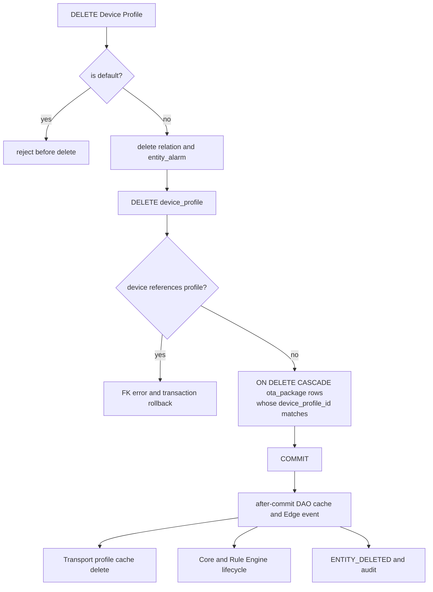

### 3.5 下游传播链

Transport 广播携带完整序列化 Profile，不要求 Transport 节点回查数据库：

1. `DefaultTbClusterService.broadcastEntityChangeToTransport(...)` 编码 Profile 为 `EntityUpdateMsg`。
2. 每个 `TB_TRANSPORT serviceId` 有一条 notification message。
3. `DefaultTransportService` 解码并调用 `DefaultTransportDeviceProfileCache.put(ByteString)`。
4. `onProfileUpdate(DeviceProfile)` 扫描本节点 `sessions`，按 Profile UUID 匹配。
5. 更新 SessionInfo 中的 `deviceType`，异步回调 `SessionMsgListener.onDeviceProfileUpdate(...)`。
6. MQTT 重建 topic filters、payload type、Protobuf descriptors 和 adaptor；CoAP、LwM2M、SNMP 更新各自协议状态。

Lifecycle 广播不携带完整 Profile：

1. Core/Rule Engine notification consumer 调用 `AbstractConsumerService.handleComponentLifecycleMsg(...)`。
2. `DefaultTbDeviceProfileCache.evict(tenantId, profileId)` 删除本地 Profile，立即从 DAO 重载。
3. 重载成功后通知已注册的 Rule Node listener。
4. `TbDeviceProfileNode.onProfileUpdate(...)` 给自己发送 `DEVICE_PROFILE_UPDATE_SELF_MSG`。
5. `updateProfile(...)` 更新匹配 DeviceState 的 Alarm Rule 状态。

---

## 四、消息流

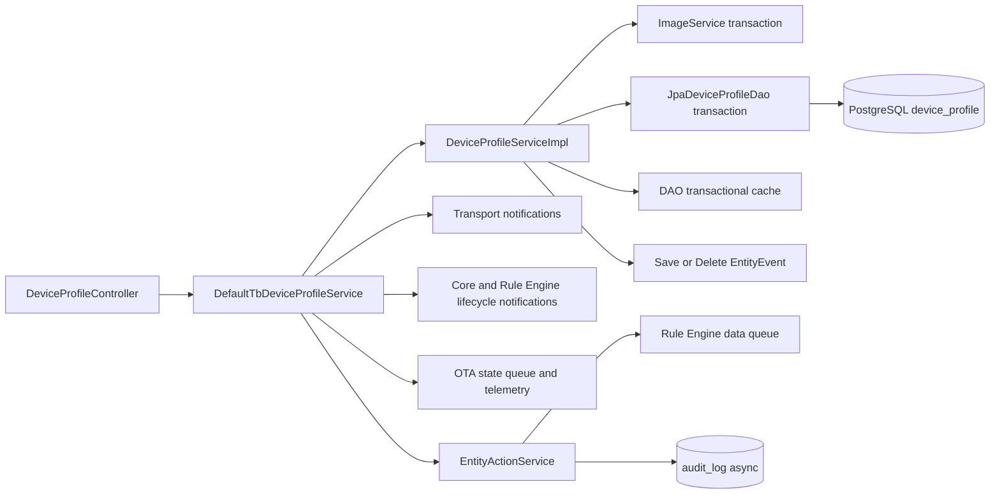

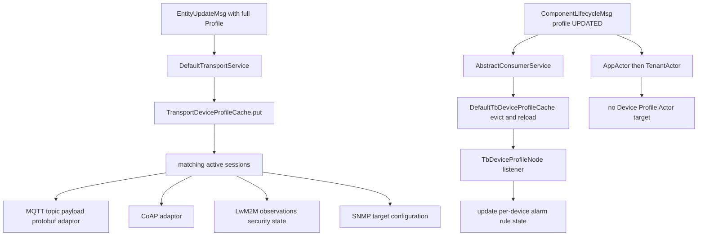

[查看静态 SVG 架构图](../../assets/architecture/04-device-profile.svg)。

### 4.1 Profile 如何改变遥测的 Rule Engine 路由

`DefaultTbClusterService.pushMsgToRuleEngine(...)` 在 producer 发送前调用 `getRuleEngineProfileForEntityOrElseNull(...)`。当 originator 是 Device 时，按 DeviceId 从 `DefaultTbDeviceProfileCache` 解析 Profile；然后 `transformMsg(...)` 用 Profile 的 `defaultRuleChainId` 和 `defaultQueueName` 覆盖原消息路由。

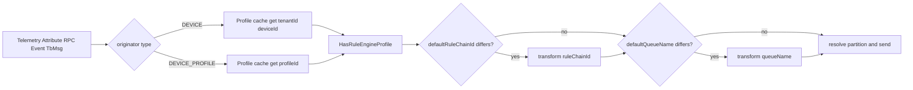

因此 Profile 更新与某条遥测入队并没有全局顺序。某个 Rule Engine/Core 节点尚未消费 lifecycle 时，仍可能按旧 Profile cache 路由；后续消息才使用新配置。

---

## 五、时序图

[PlantUML 源文件](sequence.puml)同时覆盖 REST save、重命名、默认切换、删除保护、Transport/lifecycle/OTA/Rule Engine 传播和异常窗口。[时序图 SVG](sequence.svg)可直接浏览和放大。

[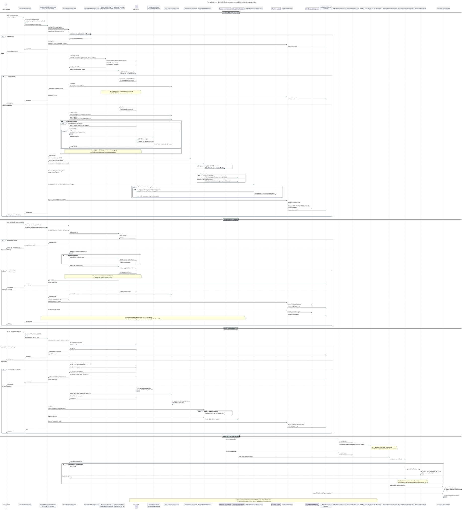](sequence.svg)

PlantUML 中刻意把四种边界画开：

1. Image 事务可先提交。
2. Profile 行事务在重命名传播和 Cluster 通知之前提交。
3. 每台 Device 重命名更新各自提交。
4. 删除的数据库聚合先提交，随后应用服务才发 Cluster 通知。

---

## 六、数据变化

### 6.1 按操作划分

| 对象 | 创建/更新 | 默认切换 | 删除 |
|---|---|---|---|
| `device_profile` | INSERT/UPDATE；`profile_data` 整体 JSONB 更新 | 旧行 `is_default=false`，目标行 `true` | DELETE |
| `device` | 仅重命名时逐台 UPDATE `type` | 不变 | 引用存在时阻止删除 |
| `ota_package` | 不直接改包元数据；Profile OTA 变化触发设备状态 | 不变 | `device_profile_id` 匹配的包由 FK cascade 删除 |
| `relation` / `entity_alarm` | 不变 | 不变 | 显式删除 Profile 两个方向的关系和 entity-alarm |
| `tb_resource` / image | Base64 转 URL 时可能新增/复用 image resource | 不变 | Profile 删除不显式删除图片资源 |
| DAO cache | id/name/default/provision key evict | 相关 key 同步 evict；旧 provision key 存在风险 | DB commit 后 evict |
| Transport cache | 完整 Profile put | **无通知** | 按 ID evict |
| active Session | 更新 deviceType 与协议配置 | 不变 | 不主动遍历关闭；正常删除前不应有引用 Device |
| Rule Engine cache | lifecycle 后 evict/reload | **无 lifecycle** | evict 后重载为空，不通知 Profile listener |
| Alarm Rule state | `TbDeviceProfileNode` 更新匹配 DeviceState | 不变 | 正常无引用 Device |
| Rule Engine data | `ENTITY_CREATED/UPDATED` | 旧/新 Profile 各一条 `ENTITY_UPDATED` | `ENTITY_DELETED` |
| OTA telemetry/attribute | firmware/software 变化时分页更新继承该包的 Device | 不变 | 不执行 Device OTA 状态清理 |
| Audit | ADDED/UPDATED success/failure | changed 时旧/新两条 UPDATED | DELETED success/failure |

### 6.2 生命周期

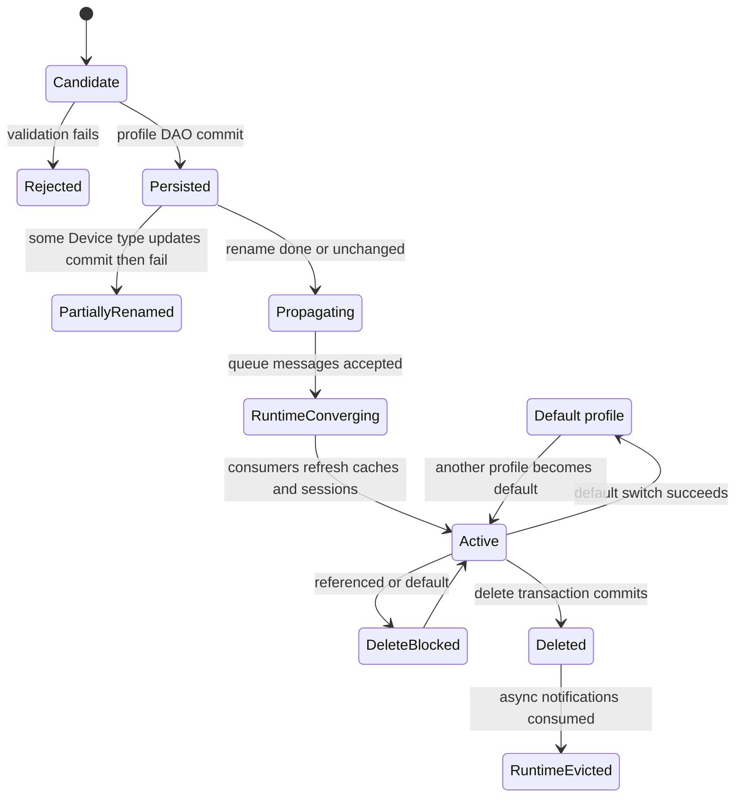

### 6.3 事务与缓存顺序

DAO 的 `TbTransactionalCache` 事件有两种执行方式：存在外层事务时发布 Spring event，由默认 `@TransactionalEventListener` 在 commit 后执行；不存在活动事务时直接调用 `handleEvictEvent(...)`。因此 REST Profile 保存和 default switch 的 DAO cache evict 是同步的，Tenant 创建内的默认 Profile 和 Profile 删除则是 after-commit。

---

## 七、源码分析

### 7.1 继承与协作

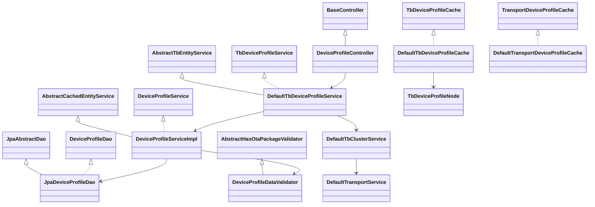

### 7.2 核心接口与实现

| 职责 | 接口/抽象类 | 实现 |
|---|---|---|
| REST 用例 | `TbDeviceProfileService` / `SimpleTbEntityService<DeviceProfile>` | `DefaultTbDeviceProfileService` |
| Profile DAO Service | `DeviceProfileService` | `DeviceProfileServiceImpl` |
| SQL DAO | `DeviceProfileDao` | `JpaDeviceProfileDao` |
| JPA Repository | `DeviceProfileRepository` | Spring Data 代理 |
| 校验 | `AbstractHasOtaPackageValidator<DeviceProfile>` | `DeviceProfileDataValidator` |
| Rule Engine Profile cache | `TbDeviceProfileCache` / `RuleEngineDeviceProfileCache` | `DefaultTbDeviceProfileCache` |
| Transport Profile cache | `TransportDeviceProfileCache` | `DefaultTransportDeviceProfileCache` |
| Cluster | `TbClusterService` | `DefaultTbClusterService` |
| 应用通知 | `TbNotificationEntityService` | `DefaultTbNotificationEntityService` |
| OTA | `OtaPackageStateService` | `DefaultOtaPackageStateService` |
| Edge | `DeviceProfileProcessor` | `DeviceProfileEdgeProcessorV1/V2` -> `DeviceProfileEdgeProcessor` |

### 7.3 校验为什么放在 DAO Service

`DeviceProfileDataValidator` 同时访问 Tenant、Queue、Rule Chain、Dashboard、OTA、Device count 和协议配置。这些是持久化前必须成立的领域约束，REST、Import、Edge、Installer 都要复用，所以它位于 DAO Service，而不是只放在 Controller。

关键校验包括：

- tenant 和必填字段存在；名称由数据库租户内 UNIQUE 最终兜底。
- `isDefault=true` 时应用层检查当前默认 Profile。
- `defaultQueueName` 必须能查到 Queue。
- Transport configuration 自校验；MQTT/CoAP Protobuf schema 和动态字段结构进一步校验。
- LwM2M bootstrap server、credential、host/port 和 shortServerId 校验。
- 一个 Profile 内 Alarm type 不得重复。
- Rule Chain、Dashboard 必须存在且属于同租户。
- firmware/software package 与 Profile 兼容。
- Profile type 或 transportType 变化时，只要有 Device 引用就拒绝，避免在线设备协议语义突然跨类型切换。

### 7.4 JSONB 多态

`DeviceProfileTransportConfiguration`、`DeviceProfileProvisionConfiguration` 和 `DeviceProfileConfiguration` 使用 Jackson `@JsonTypeInfo` / `@JsonSubTypes`。数据库只保存一列 JSONB，Java 反序列化时由 `type` 字段恢复具体实现。这样新增协议参数不需要为每个字段做 DDL，但代价是：

1. 深层字段缺少数据库级类型约束，正确性依赖 Java validator。
2. 更新通常替换整段 JSONB，不具备字段级乐观并发合并。
3. 想用 SQL 检索深层配置需要 JSONB path/GiN 设计，而 3.6.4 主链主要按普通列和 ID 读取。

---

## 八、Actor 分析

Profile 保存和删除不通过 Actor 执行数据库操作，也不存在 `DeviceProfileActor`。Lifecycle notification 仍会被 Core/Rule Engine consumer 转给 Actor 层：

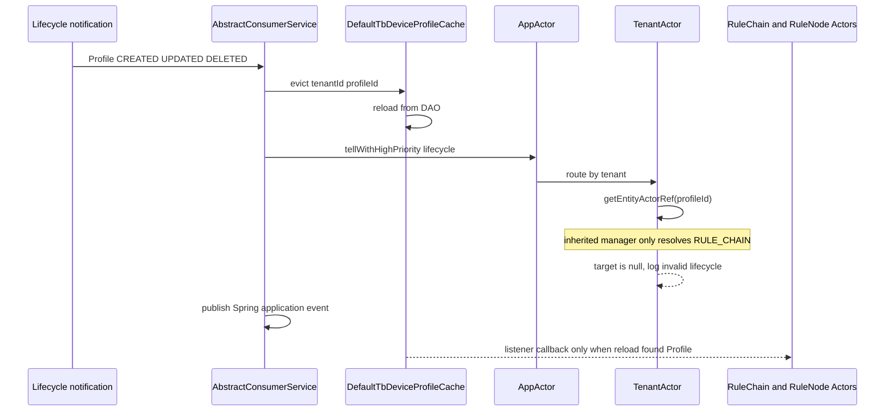

真正让 Rule Node 感知 Profile 更新的是 `DefaultTbDeviceProfileCache` 的 listener，不是 Profile Actor：

1. `TbDeviceProfileNode.init(...)` 调用 `ctx.addDeviceProfileListeners(this::onProfileUpdate, this::onDeviceUpdate)`。
2. cache evict 后重新读取 Profile；非空时 `notifyProfileListeners(...)`。
3. Node listener 发送 self message，保证 Alarm Rule 状态更新仍串行进入 Rule Node Actor mailbox。
4. 删除时重载结果为空，cache 不调用 Profile listener；但删除又被 Device FK 保护，正常情况下没有 DeviceState 需要继续使用该 Profile。

为什么这里仍用 Actor self message：Profile cache listener 运行在线程/Queue consumer 上，不能直接并发修改 Rule Node 的 `deviceStates`。self message 把状态变更重新串行化到 Node Actor 上。

---

## 九、Kafka 分析

Kafka 是 Queue SPI 的可选物理实现；默认 `queue.type=in-memory` 时没有 Kafka broker。启用 Kafka 后，Profile 变更涉及以下逻辑消息：

| 逻辑通道 | Producer | 消息 | Partition / Consumer |
|---|---|---|---|
| Transport notification | `getTransportNotificationsMsgProducer()` | `ToTransportMsg.EntityUpdateMsg` 或 `EntityDeleteMsg` | 每个 Transport serviceId 的 notification topic；每个节点收到副本 |
| Core lifecycle notification | `getTbCoreNotificationsMsgProducer()` | `ToCoreNotificationMsg.ComponentLifecycle` | 每个 Core serviceId |
| Rule Engine lifecycle notification | `getRuleEngineNotificationsMsgProducer()` | `ToRuleEngineNotificationMsg.ComponentLifecycle` | 每个 Rule Engine serviceId；与共址 Core 去重 |
| Rule Engine data | `getRuleEngineMsgProducer()` | `ToRuleEngineMsg`，body 为 Profile JSON | `queueName + tenantId + profileId` 解析 partition |
| OTA state | `otaPackageStateMsgProducer` | `ToOtaPackageStateServiceMsg` | producer 默认 topic；按设备继续处理 OTA |
| Edge | Edge event / notification pipeline | Profile ADDED/UPDATED/DELETED | Edge gRPC 同步链，不等同于普通 Kafka data topic |

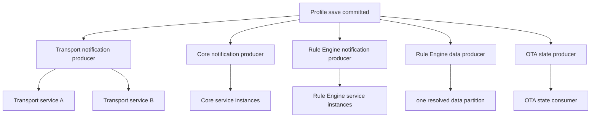

这些 producer 使用不同 topic/producer，没有跨 topic 全序，也没有与 `device_profile` 事务绑定的 outbox。调用方多数传 `callback=null`，因此请求线程不会等所有 broker ack 或 consumer 完成。

同一 Profile 的 lifecycle message 使用 Profile UUID 作为 notification message key，但这只能帮助单 topic/partition 的局部顺序；Transport、lifecycle、`ENTITY_UPDATED` 和 OTA 仍可能被不同消费者以不同顺序观察。

---

## 十、数据库分析

### 10.1 PostgreSQL

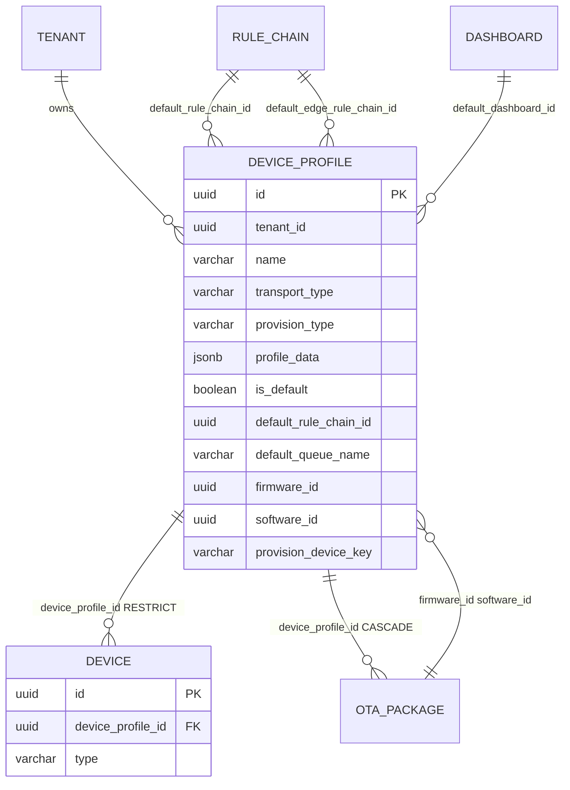

建表脚本中的约束：

- `UNIQUE (tenant_id, name)`：租户内 Profile 名称唯一。
- `UNIQUE (provision_device_key)`：Provision key 是全局唯一，不按 tenant 分区。
- `UNIQUE (tenant_id, external_id)`：导入导出 external ID 租户内唯一。
- Rule Chain、Dashboard、firmware、software 均有 FK。
- `device.device_profile_id` 是无 cascade 的 FK，形成删除 RESTRICT。
- `ota_package.device_profile_id` 对 Profile 是 `ON DELETE CASCADE`。
- **没有**“每租户只能一个 `is_default=true`”的唯一约束。
- `tenant_id` 本身在该建表段没有到 tenant 的 FK；租户有效性由 validator 保证。

### 10.2 TimescaleDB 与 Cassandra

Device Profile 自身只存 PostgreSQL，不写 TimescaleDB 或 Cassandra。它们与 Profile 的关系是运行时数据路径：

- Profile 的 Alarm Rules 消费 Device telemetry，但规则配置不写进 `ts_kv`。
- OTA Profile 变化可能通过 `RuleEngineTelemetryService.saveAndNotify(...)` 为每台 Device 写 OTA 状态 telemetry；实际 history 后端由部署选择 PostgreSQL partition、TimescaleDB 或 Cassandra。
- Profile 的 timeseries/attribute key discovery 只为 UI 采样关联 Device 的数据，不把 key 反写 Profile。
- 删除 Profile 不扫描或删除任何 telemetry backend；因为数据库 FK 已保证正常删除时没有 Device 仍引用它。

### 10.3 Redis/Caffeine

需要区分三套缓存：

1. DAO `TbTransactionalCache<DeviceProfileCacheKey, DeviceProfile>`：按 id、tenant+name、tenant default、provision key 缓存，可用 Caffeine 或 Redis。
2. Rule Engine `DefaultTbDeviceProfileCache`：本进程 `ConcurrentHashMap`，建立 DeviceId -> ProfileId 与 ProfileId -> Profile 映射，靠 lifecycle notification 跨节点失效。
3. Transport `DefaultTransportDeviceProfileCache`：Transport 进程缓存完整 Profile，靠 `EntityUpdateMsg/EntityDeleteMsg` 直接 put/evict。

三套缓存没有共同事务。生产排障时必须明确“哪个进程、哪一套 key、由哪类消息刷新”，不能只执行一次 Redis DEL 就假设所有 Session 和 Rule Node 都已更新。

### 10.4 为什么不是 TimescaleDB/Cassandra

Profile 需要名称、Provision key 唯一约束，需要 Rule Chain/Dashboard/OTA FK，需要与 Device 元数据关联，并且读多写少。PostgreSQL 适合承载这种控制面配置。TimescaleDB/Cassandra 适合高吞吐追加型 Device telemetry，不适合把 JSON 配置引用完整性和默认切换建模为时序分区。

---

## 十一、异常处理

### 11.1 保存失败矩阵

| 失败点 | 已提交数据 | 尚未发生/可能缺失 | 调用方结果与风险 |
|---|---|---|---|
| validator 拒绝 | 无 Profile 写入 | image、Device、Queue 均未执行 | HTTP validation error |
| image conversion 部分成功后抛错 | image resource 事务因 `noRollbackFor` 可能已提交 | Profile 未写 | HTTP error；可能留下未引用 image |
| Profile SQL/唯一约束失败 | image 可能已提交；Profile 回滚 | rename、Cluster、OTA、Audit success 未执行 | 转换为名称/provision/externalId 冲突消息 |
| Profile commit 后，重命名第 N 台 Device 失败 | Profile 与前 N-1 台 Device 已提交 | 后续 Device、Profile Cluster/lifecycle/OTA/success audit | HTTP error；`device.type` 部分同步 |
| VC auto-commit 同步抛错 | Profile/rename 已提交 | Cluster、OTA、success audit 未执行 | HTTP error；数据库已成功 |
| Transport 广播循环中途抛错 | Profile 已提交 | 部分 Transport 或后续 lifecycle/OTA/audit | 节点间 Profile cache 分裂 |
| lifecycle producer 失败 | Profile 与可能的 Transport message 已完成 | 部分 Rule Engine cache 不刷新 | 旧 routing/alarm rules 可继续生效 |
| OTA 分页/producer 中途失败 | Profile、Cluster 消息已发生；部分 Device OTA 已排队 | 余下 Device OTA 状态 | HTTP error 或日志告警；需补偿扫描 |
| Rule Engine entity action push 失败 | Profile 已提交 | `ENTITY_CREATED/UPDATED` 缺失 | `EntityActionService` 内部 catch，HTTP 仍可能成功 |
| Audit executor/DAO 失败 | Profile 不受影响 | audit_log 缺失 | 必须独立监控 |

### 11.2 默认切换失败矩阵

| 场景 | 数据库结果 | 通知结果 |
|---|---|---|
| target 已是默认 | 不写 | 不发 action/audit |
| 旧默认 save 成功、target save 失败 | 可能没有默认 Profile | 方法抛错；无成功 action |
| 两个请求并发切换 | 可能多个默认 Profile | 各请求按自身读取快照记录 action |
| 两行都成功，第一次 action 失败 | 默认结果已提交 | 后续 action/audit 可能部分缺失 |
| 旧 Profile provision key cache 未淘汰 | DB 正确 | provision-key 读取可能看到旧 `isDefault` |

### 11.3 删除失败矩阵

| 失败点 | 数据库 | Queue/Session/Actor | 调用方 |
|---|---|---|---|
| Profile 是默认 | 未删除 | 无消息 | validation error |
| Device FK 引用 | relations/entity-alarm 删除随事务回滚，Profile 保留 | 无应用 Cluster delete | reference validation error |
| SQL/commit 失败 | 整个删除事务回滚；after-commit cache/Edge 不执行 | 应用服务尚未发 Cluster，因为 DAO commit 未返回 | HTTP error |
| DB commit 后 Transport producer 失败 | Profile 已删除 | 部分 Transport cache 仍保留 | HTTP error；重试 DELETE 会 not found |
| lifecycle producer 异步失败 | Profile 已删除 | Rule Engine cache 可能保留旧 Profile | HTTP 仍可能 200 |
| `ENTITY_DELETED` push 失败 | Profile 已删除 | Rule Chain 不感知 entity action | 内部 warning；HTTP 可成功 |
| Edge listener 失败 | Profile 已删除 | Edge 可能保留 Profile | listener catch/log；需重同步 Edge |

### 11.4 生产处理建议

1. Profile 更新后同时检查数据库行、Transport notification lag、Rule Engine notification lag 和活跃 Session 的协议行为。
2. 大规模 Profile 重命名前统计引用 Device 数；它是逐台事务，不是单 SQL 批量原子更新。
3. 切换默认值后查询 `select tenant_id, count(*) from device_profile where is_default group by tenant_id having count(*) <> 1`，把无默认和多默认纳入巡检。
4. 对 Profile 变更使用读取确认和可重试的运维操作，不要把 HTTP error 直接等同于数据库未提交。
5. 需要严格分布式一致性时，引入数据库 outbox、幂等 notification、版本号/epoch 和消费者收敛指标；3.6.4 当前链路没有这些保证。

---

## 十二、源码阅读路线

1. [DeviceProfile.java:54](../../../common/data/src/main/java/org/thingsboard/server/common/data/DeviceProfile.java#L54)：先看顶层列对应字段，区分普通列与 `profileData`。
2. [DeviceProfileData.java:38](../../../common/data/src/main/java/org/thingsboard/server/common/data/device/profile/DeviceProfileData.java#L38)：看 transport/provision/alarm 的聚合边界。
3. [schema-entities.sql:277](../../../dao/src/main/resources/sql/schema-entities.sql#L277)：用真实 DDL 确认 UNIQUE、FK、cascade 和 default 唯一约束缺口。
4. [DeviceProfileController.java:249](../../../application/src/main/java/org/thingsboard/server/controller/DeviceProfileController.java#L249)：确认三条写 REST 入口和权限。
5. [DefaultTbDeviceProfileService.java:66](../../../application/src/main/java/org/thingsboard/server/service/entitiy/device/profile/DefaultTbDeviceProfileService.java#L66)：按源代码顺序标记保存后的所有副作用，并注意没有 `@Transactional`。
6. [DeviceProfileServiceImpl.java:279](../../../dao/src/main/java/org/thingsboard/server/dao/device/DeviceProfileServiceImpl.java#L279)：重点阅读 image、saveAndFlush、cache event、SaveEntityEvent 和 rename loop。
7. [DeviceProfileDataValidator.java:159](../../../dao/src/main/java/org/thingsboard/server/dao/service/validator/DeviceProfileDataValidator.java#L159)：把每个配置字段与下游模块对上。
8. [DeviceProfileServiceImpl.java:507](../../../dao/src/main/java/org/thingsboard/server/dao/device/DeviceProfileServiceImpl.java#L507)：单独审查默认切换的两个 DAO transaction 和 cache key。
9. [DeviceProfileServiceImpl.java:339](../../../dao/src/main/java/org/thingsboard/server/dao/device/DeviceProfileServiceImpl.java#L339)：确认删除事务、default 保护和 Device FK。
10. [DefaultTbClusterService.java:584](../../../application/src/main/java/org/thingsboard/server/service/queue/DefaultTbClusterService.java#L584)：看 Profile 如何编码后广播到每个 Transport 节点。
11. [DefaultTransportService.java:1369](../../../common/transport/transport-api/src/main/java/org/thingsboard/server/common/transport/service/DefaultTransportService.java#L1369)：看 Transport cache 与 active Session 热更新。
12. [DeviceSessionCtx.java:293](../../../common/transport/mqtt/src/main/java/org/thingsboard/server/transport/mqtt/session/DeviceSessionCtx.java#L293)：用 MQTT 具体实现理解 topic/payload/Protobuf 如何立即变化。
13. [AbstractConsumerService.java:267](../../../application/src/main/java/org/thingsboard/server/service/queue/processing/AbstractConsumerService.java#L267)：看 lifecycle consumer 的 Rule Engine cache eviction。
14. [DefaultTbDeviceProfileCache.java:133](../../../application/src/main/java/org/thingsboard/server/service/profile/DefaultTbDeviceProfileCache.java#L133)：看 evict、reload 和 listener 回调条件。
15. [TbDeviceProfileNode.java:266](../../../rule-engine/rule-engine-components/src/main/java/org/thingsboard/rule/engine/profile/TbDeviceProfileNode.java#L266)：把 cache listener 接到 Alarm Rule DeviceState。
16. [DefaultTbClusterService.java:322](../../../application/src/main/java/org/thingsboard/server/service/queue/DefaultTbClusterService.java#L322)：最后看 Device Profile 如何决定 Rule Engine queue/rule chain。
17. [DefaultOtaPackageStateService.java:226](../../../application/src/main/java/org/thingsboard/server/service/ota/DefaultOtaPackageStateService.java#L226)：理解 Profile OTA 更新为何会扇出到大量 Device telemetry/attribute。

下一章建议阅读 Rule Chain 执行流程。Device Profile 已经解释了消息“进入哪个 Queue 和 Rule Chain”，下一步应沿 `TbRuleEngineQueueConsumerManager -> AppActor -> TenantActor -> RuleChainActor -> RuleNodeActor` 解释消息如何完成、失败和确认。

---

## 十三、常见面试题

### 13.1 Device Profile 为什么既有 `device_profile_id`，又把名称复制到 `device.type`？

**标准答案：** `device_profile_id` 是真实 FK，负责身份和引用完整性；`device.type` 是兼容字段，保存 Profile name 以支持既有查询和接口。Profile 重命名后 ThingsBoard 分页逐台同步 `device.type`，但该过程不是原子事务，所以业务关联必须以 ProfileId 为准。

### 13.2 Profile 保存的事务边界在哪里？

**标准答案：** 标准 REST 路径没有应用层外事务。Profile 行在 `JpaDeviceProfileDao.saveAndFlush(...)` 的 DAO 事务中提交；重命名 Device、Cluster、OTA、Rule Engine action 和 Audit 都发生在提交之后。Image conversion 甚至有自己的独立事务。

### 13.3 为什么 Profile 重命名会返回失败，但 Profile 名称已经变了？

**标准答案：** Profile 先提交，然后每台 Device 的兼容 `type` 字段各自保存。任意一台失败会向上抛异常，但无法回滚已提交的 Profile 和前面 Device。Cluster Profile 通知还可能因为循环未完成而根本没发。

### 13.4 每个租户只允许一个默认 Profile，数据库保证了吗？

**标准答案：** 没有。3.6.4 DDL 没有 partial unique index；`setDefaultDeviceProfile(...)` 也没有外层事务，而是先保存旧默认 false，再保存目标 true。并发可产生多个默认，中途失败可产生无默认。

### 13.5 Profile 更新后，在线 MQTT 设备需要重连吗？

**标准答案：** 通常不需要。Transport 收到完整 Profile 后更新本地 cache，扫描匹配 Session，回调 `MqttTransportHandler -> DeviceSessionCtx`，重建 topic filters、payload type、Protobuf descriptors 和 adaptor。但源码 TODO 明确指出 transport type 改变时应关闭 Session，而当前只在有 Device 引用时由 validator 禁止改变 transport type。

### 13.6 Profile 的 Alarm Rules 如何热更新？

**标准答案：** lifecycle consumer 淘汰 `DefaultTbDeviceProfileCache` 并从 DAO 重载；cache 通知 `TbDeviceProfileNode` listener；listener 给 Rule Node 自己发送 `DEVICE_PROFILE_UPDATE_SELF_MSG`，由 Actor mailbox 串行更新匹配 DeviceState 的 Profile/Alarm Rules。不是通过 DeviceProfileActor。

### 13.7 Device Profile 有自己的 Actor 吗？

**标准答案：** 没有。Profile lifecycle 会到达 AppActor/TenantActor，但 `RuleChainManagerActor.getEntityActorRef(...)` 只解析 RULE_CHAIN，Profile 找不到目标 Actor。实际运行时更新由 cache listener 和 Rule Node self message 完成。

### 13.8 Profile 如何决定遥测进入哪个 Rule Chain？

**标准答案：** `DefaultTbClusterService.pushMsgToRuleEngine(...)` 在 producer 发送前按 DeviceId/ProfileId 读取 `HasRuleEngineProfile`，`transformMsg(...)` 用 `defaultRuleChainId` 和 `defaultQueueName` 改写 TbMsg，再按 queueName、tenantId、entityId 解析 partition。

### 13.9 删除 Profile 会删除 Device 吗？

**标准答案：** 不会。相反，`device.device_profile_id` FK 会阻止删除。必须先迁移或删除所有引用 Device，而且 default Profile 永远不能通过该 API 删除。

### 13.10 删除 Profile 会删除 OTA package 吗？

**标准答案：** `ota_package.device_profile_id -> device_profile.id ON DELETE CASCADE`，因此归属于该 Profile 的 OTA package 行会级联删除。Profile 自身的 `firmware_id/software_id` 又引用 OTA package；数据库负责维护这个关联删除，应用删除方法没有逐包循环。

### 13.11 默认切换为什么不广播 Transport/lifecycle？

**标准答案：** 源码只调用 DAO `setDefaultDeviceProfile(...)`，然后为旧/新 Profile 记录 UPDATED entity action/audit，没有 `onDeviceProfileChange(...)` 或 lifecycle broadcast。`is_default` 主要用于后续 Device 创建时的 DAO default lookup，不直接改变已关联 Device 的协议和 Rule Engine 路由。

### 13.12 Kafka 能保证 Profile 更新顺序吗？

**标准答案：** 只能在具体 topic/partition 范围内讨论顺序。Transport update、Core lifecycle、Rule Engine lifecycle、entity action 和 OTA 使用不同 producer/topic，没有跨 topic 全序；而且无 transactional outbox，Profile DB commit 与消息投递也不原子。

### 13.13 为什么复杂配置放 JSONB，而不是全拆列？

**标准答案：** Transport、Provision 和 Alarm Rule 是多态且演进快；JSONB 让协议实现增加字段时减少 DDL，并可由 Jackson 恢复具体类型。需要 FK、唯一约束、常用筛选和路由的字段仍单独成列。代价是深层约束主要由 Java validator 保证，SQL 分析和局部并发更新更复杂。

### 13.14 如何把默认切换提升为数据库级正确性？

**标准答案：** 使用单个外层事务锁定租户/Profile 集合，在同一事务更新旧/新行，并建立 partial unique index，例如租户非空条件下 `UNIQUE (tenant_id) WHERE is_default`。还需定义无默认是否允许、并发重试和缓存事件只在 commit 后发布。仅增加 Java `synchronized` 不能覆盖多节点。

### 13.15 Profile 更新 HTTP 200 是否表示所有设备已经使用新配置？

**标准答案：** 不表示。它只表示同步方法没有抛错；Transport、lifecycle、OTA、Rule Engine 和 Audit 都有异步部分。不同节点可能在短时间内使用不同 Profile 版本，源码也没有 Profile version/epoch 让消费者拒绝旧消息。

---

[上一篇：03 Device 删除流程](../03-device-delete/README.md) | [HTML 版](index.html) | [全书目录](../../SUMMARY.md) | [下一篇：05 Rule Chain 执行流程（待分析）](../../SUMMARY.md#chapter-05)
