# 05 Rule Chain 执行流程

> 源码基线：ThingsBoard `3.6.4`，行为提交 `0cb411fc90`；源码链接已按当前 `release-3.6` 工作树行号校准。本章分析的是 Rule Engine Queue 消费、RuleChain/RuleNode Actor 执行、关系路由、嵌套规则链、确认与重试，以及规则链图的 PostgreSQL 持久化。具体业务节点只作为执行边界举例，Alarm、Telemetry、RPC 等副作用在各自章节展开。

[上一篇：04 Device Profile 流程](../04-device-profile/README.md) | [HTML 版](index.html) | [全书目录](../../SUMMARY.md) | [PlantUML 源文件](sequence.puml) | [时序图 SVG](sequence.svg) | [架构图 SVG](../../assets/architecture/05-rule-chain-execution.svg) | [下一篇：06 Alarm 创建流程](../06-alarm-create/README.md)

---

## 一、流程目标

Rule Chain 解决的不是“按顺序调用一组 Java 方法”，而是把不同来源的 `TbMsg` 交给一个可热更新、可分支、可跨队列和可嵌套的有向处理图。每个 Rule Node 只实现一个局部动作，RuleChainActor 负责图路由，Rule Engine Queue 负责服务隔离、分区、超时与提交。

### 1.1 必须先分开控制面和数据面

| 平面 | 入口 | 核心对象 | 持久化/运行状态 | 成功含义 |
|---|---|---|---|---|
| 控制面 | Rule Chain REST API | `RuleChain`、`RuleNode`、`EntityRelation` | PostgreSQL `rule_chain`、`rule_node`、`relation` | 图结构事务提交；不表示所有 Rule Engine 节点已刷新 |
| 数据面 | Rule Engine Queue Consumer | `ToRuleEngineMsg`、`TbMsg`、Actor message | Queue offset、Actor 内存图、各 Rule Node 的下游状态 | 由 `TbMsgCallback` 和 Processing Strategy 决定；不等价于全链路数据库事务 |

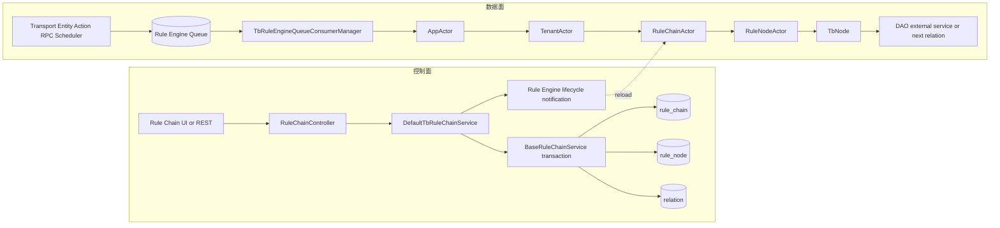

### 1.2 本章最重要的确认语义

| 路由形态 | 父消息何时完成 | 子消息是否独立 | 风险 |
|---|---|---|---|
| 单目标、本地分区 | 最终节点 `ack`、无后继 Success，或无 Failure 路由时失败 | 否，共用原 `TbMsgCallback` | 长节点直接占用当前 pack 的处理时间 |
| 单目标、远程分区 | 子消息成功写入 Rule Engine Queue 时 | 是，新消息从 Queue 重新获得 callback | 父 offset 可先提交，子分支尚未执行 |
| 多目标扇出 | 所有子消息成功写入 Queue 时；任一 producer 失败则父消息失败 | 是，每个目标生成新 UUID | 已入队分支不会因另一分支失败回滚 |
| Singleton Node 位于其他服务 | 调用 `pushMsgToRuleEngine(...)` 后立即 `ack(source)` | 是，且 producer callback 为 `null` | 源消息完成不等待新消息入队确认 |
| `SKIP_ALL_FAILURES` | pack 的成功、失败或超时结果分析后直接 commit | 取决于上述路由 | 默认 Main Queue 不因 Rule Node failure 自动 broker retry |
| `RETRY_ALL` | 重试条件结束后 commit | 会重新投递成功、失败和超时消息 | 已成功副作用也可能重复 |

这解释了为什么不能把 Rule Chain 描述成“Kafka 消息只在整条业务链和数据库事务都成功后才提交”。源码的真实模型是多个 callback/Queue 边界串联的至少一次或跳过式处理，具体语义由路由形态和 Queue Processing Strategy 共同决定。

### 1.3 与普通 Spring Service 调用的思维差异

1. `RuleNodeActor` 调用 `TbNode.onMsg(...)` 后可能立即返回，异步 DAO callback 以后才执行 `tellSuccess/tellFailure`。
2. Actor mailbox 串行化的是消息处理入口，不会自动等待异步数据库或 HTTP Future。
3. `tellSuccess` 不是最终成功，它只是产生 `Success` relation；只有无匹配后继时才完成 callback。
4. Rule Node failure 也可沿 `Failure` relation 被业务处理；只有没有 Failure 后继时才落到 pack failure。
5. Queue commit、PostgreSQL/TimescaleDB/Cassandra commit 和外部系统成功之间没有统一事务。

---

## 二、入口

### 2.1 运行时入口

| 入口 | 谁调用、何时调用 | 进入 Rule Chain 的方式 |
|---|---|---|
| MQTT / CoAP / LwM2M / HTTP Transport | 设备上报 telemetry、attributes、RPC response、claim 等 | Transport 转为 `TbMsg`，`DefaultTbClusterService.pushMsgToRuleEngine(...)` 投递 Queue |
| REST Entity 操作 | Device、Asset、Customer、Alarm、Attribute 等创建/更新/删除 | 应用服务构造 entity-action `TbMsg` 后投递 Queue |
| Scheduler / 状态服务 | 定时器、Session timeout、设备状态和平台内部任务 | 由对应服务构造消息；没有通用“Scheduler 直接调用 RuleNode”入口 |
| Kafka/In-memory Queue Consumer | `poll()` 得到 `ToRuleEngineMsg` pack | 反序列化并调用 `ActorSystemContext.tell(QueueToRuleEngineMsg)` |
| Actor 内部 | Rule Node 选择关系、嵌套 Rule Chain input/output、跨分区重入 | `RuleNodeToRuleChainTellNextMsg`、`RuleChainInputMsg`、`RuleChainOutputMsg` 或重新入 Queue |

设备协议不是 RuleChainActor 的直接调用者。它们先经过 Transport 和 Queue；因此协议 ACK 与 Rule Chain 最终结果属于不同确认点。

### 2.2 配置入口

| HTTP API | Controller 方法 | 作用 |
|---|---|---|
| `POST /api/ruleChain` | `saveRuleChain(RuleChain ruleChain)` | 创建或更新 Rule Chain 顶层信息 |
| `POST /api/ruleChain/device/default` | `saveRuleChain(DefaultRuleChainCreateRequest request)` | 从默认模板创建 Rule Chain |
| `POST /api/ruleChain/{ruleChainId}/root` | `setRootRuleChain(String strRuleChainId)` | 原子切换租户 Root Rule Chain |
| `POST /api/ruleChain/metadata` | `saveRuleChainMetaData(RuleChainMetaData, boolean updateRelated)` | 保存 Nodes、first node、connections 和 nested chain nodes |
| `DELETE /api/ruleChain/{ruleChainId}` | `deleteRuleChain(String strRuleChainId)` | 删除非 Root、未被 Profile FK 引用的 Rule Chain |
| `GET /api/ruleChain/{id}` / `metadata` / `ruleChains` | 多个读取方法 | UI 加载图结构、分页与输出标签 |

REST API 只修改控制面。它不会通过 HTTP 线程“执行一次规则链”。保存成功后，应用层向所有 Rule Engine 服务发送 lifecycle notification，由 Actor 在各节点重新读取数据库图结构。

---

## 三、完整调用链

### 3.1 消息入 Queue 前的 Profile 路由

| 步骤 | 类与方法（完整参数） | 源码位置 | 输入 -> 输出 | 职责与设计原因 |
|---|---|---|---|---|
| 1 | `org.thingsboard.server.service.queue.DefaultTbClusterService.pushMsgToRuleEngine(TenantId tenantId, EntityId entityId, TbMsg tbMsg, TbQueueCallback callback)` | [DefaultTbClusterService.java:292](../../../application/src/main/java/org/thingsboard/server/service/queue/DefaultTbClusterService.java#L292) | 业务 `TbMsg` -> profiled `TbMsg` | 对 Device/Asset 读取 Profile，覆盖默认 RuleChainId 和 queueName |
| 2 | `DefaultTbClusterService.transformMsg(TbMsg tbMsg, HasRuleEngineProfile ruleEngineProfile)` | [DefaultTbClusterService.java:341](../../../application/src/main/java/org/thingsboard/server/service/queue/DefaultTbClusterService.java#L341) | 原路由 -> Profile 路由 | 显式保存目标链和 Queue，避免 consumer 再查 Profile |
| 3 | `PartitionService.resolve(ServiceType.TB_RULE_ENGINE, String queueName, TenantId tenantId, EntityId entityId)` | [DefaultTbClusterService.java:304](../../../application/src/main/java/org/thingsboard/server/service/queue/DefaultTbClusterService.java#L304) | queue/tenant/entity -> `TopicPartitionInfo` | 让同一分区键稳定落到负责的 Rule Engine service |
| 4 | `TbQueueProducer.send(TopicPartitionInfo, TbProtoQueueMsg, TbQueueCallback)` | [DefaultTbClusterService.java:306](../../../application/src/main/java/org/thingsboard/server/service/queue/DefaultTbClusterService.java#L306) | serialized `TbMsg` -> broker record | Queue SPI 屏蔽 Kafka、in-memory 等实现 |

### 3.2 Consumer pack、callback 与提交

| 步骤 | 类与方法 | 源码位置 | 关键行为 |
|---|---|---|---|
| 1 | `TbRuleEngineQueueConsumerManager.consumerLoop(TbQueueConsumer)` | [TbRuleEngineQueueConsumerManager.java:360](../../../application/src/main/java/org/thingsboard/server/service/queue/ruleengine/TbRuleEngineQueueConsumerManager.java#L360) | 按 `pollInterval` 拉取一包记录 |
| 2 | `processMsgs(List, TbQueueConsumer, Queue)` | [TbRuleEngineQueueConsumerManager.java:393](../../../application/src/main/java/org/thingsboard/server/service/queue/ruleengine/TbRuleEngineQueueConsumerManager.java#L393) | 初始化 Submit Strategy，创建 pack context，提交本轮消息 |
| 3 | `submitMessage(TbMsgPackProcessingContext, UUID, TbProtoQueueMsg)` | [TbRuleEngineQueueConsumerManager.java:459](../../../application/src/main/java/org/thingsboard/server/service/queue/ruleengine/TbRuleEngineQueueConsumerManager.java#L459) | 每条记录创建 `TbMsgPackCallback` |
| 4 | `forwardToRuleEngineActor(String, TenantId, ToRuleEngineMsg, TbMsgCallback)` | [TbRuleEngineQueueConsumerManager.java:486](../../../application/src/main/java/org/thingsboard/server/service/queue/ruleengine/TbRuleEngineQueueConsumerManager.java#L486) | protobuf -> `TbMsg` -> `QueueToRuleEngineMsg` |
| 5 | `TbMsgPackProcessingContext.await(long, TimeUnit)` | [TbMsgPackProcessingContext.java:108](../../../application/src/main/java/org/thingsboard/server/service/queue/TbMsgPackProcessingContext.java#L108) | 等所有 pending callback，或等待 pack timeout |
| 6 | `TbRuleEngineProcessingStrategy.analyze(TbRuleEngineProcessingResult)` | [TbRuleEngineProcessingStrategyFactory.java:150](../../../application/src/main/java/org/thingsboard/server/service/queue/processing/TbRuleEngineProcessingStrategyFactory.java#L150) | success/failed/pending -> commit 或 reprocess map |
| 7 | `consumer.commit()` / `submitStrategy.update(...)` | [TbRuleEngineQueueConsumerManager.java:419](../../../application/src/main/java/org/thingsboard/server/service/queue/ruleengine/TbRuleEngineQueueConsumerManager.java#L419) | 清理 context 后提交 offset，或在内存中重处理选定记录 |

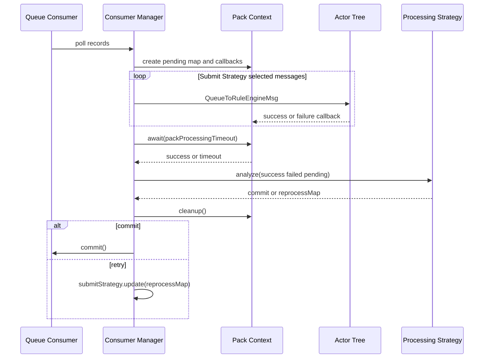

### 3.3 Actor 树路由

| 步骤 | 类与方法 | 源码位置 | 输入 -> 输出 | 特殊终态 |
|---|---|---|---|---|
| 1 | `org.thingsboard.server.actors.app.AppActor.onQueueToRuleEngineMsg(QueueToRuleEngineMsg msg)` | [AppActor.java:191](../../../application/src/main/java/org/thingsboard/server/actors/app/AppActor.java#L191) | tenant message -> TenantActor | SYS tenant failure；当前服务不管理 tenant 时 callback success |
| 2 | `org.thingsboard.server.actors.tenant.TenantActor.onQueueToRuleEngineMsg(QueueToRuleEngineMsg msg)` | [TenantActor.java:240](../../../application/src/main/java/org/thingsboard/server/actors/tenant/TenantActor.java#L240) | RuleChainId -> Root 或显式 RuleChainActor | RE disabled 时 success；无 Root 时 failure；显式 Actor 不存在时 success + dead-letter TODO |
| 3 | `RuleChainManagerActor.getOrCreateActor(RuleChainId)` | [RuleChainManagerActor.java:139](../../../application/src/main/java/org/thingsboard/server/actors/ruleChain/RuleChainManagerActor.java#L139) | id -> RuleChainActor/ErrorActor | nested 调用缺失目标时创建 `RuleChainErrorActor` 并 callback failure |
| 4 | `RuleChainActor.doProcess(TbActorMsg)` | [RuleChainActor.java:80](../../../application/src/main/java/org/thingsboard/server/actors/ruleChain/RuleChainActor.java#L80) | envelope -> processor 方法 | mailbox 内串行分派生命周期、Queue、next、input/output |
| 5 | `RuleChainActorMessageProcessor.onQueueToRuleEngineMsg(QueueToRuleEngineMsg)` | [RuleChainActorMessageProcessor.java:282](../../../application/src/main/java/org/thingsboard/server/actors/ruleChain/RuleChainActorMessageProcessor.java#L282) | Queue entry -> first/resume RuleNode | resume node 已删除时 callback success |

### 3.4 Rule Node 执行

1. `RuleChainActorMessageProcessor.start(...)` 从 DAO 读取 Rule Chain、Rule Nodes 和 relations，为每个 Node 创建 child Actor，并把 `first_rule_node_id` 解析成 `firstNode`。[源码](../../../application/src/main/java/org/thingsboard/server/actors/ruleChain/RuleChainActorMessageProcessor.java#L142)
2. `RuleNodeActorMessageProcessor.initComponent(...)` 用 `Class.forName(ruleNode.getType())` 反射创建 `TbNode`，再用 JSON configuration 调用 `TbNode.init(...)`。[源码](../../../application/src/main/java/org/thingsboard/server/actors/ruleChain/RuleNodeActorMessageProcessor.java#L238)
3. `onRuleChainToRuleNodeMsg(...)` 先调用 `callback.onProcessingStart`，检查组件状态和每消息最大 Rule Node 执行次数，再调用 `tbNode.onMsg(ctx, msg)`。[源码](../../../application/src/main/java/org/thingsboard/server/actors/ruleChain/RuleNodeActorMessageProcessor.java#L197)
4. 节点必须显式调用 `ctx.tellSuccess`、`ctx.tellNext`、`ctx.tellFailure`、`ctx.ack`，或在异步 callback 中调用它们。只从 `onMsg` 返回不会自动完成消息。
5. `DefaultTbContext.tellNext(...)` 记录 debug output、结束当前 node profiler，并向 RuleChainActor 发送 `RuleNodeToRuleChainTellNextMsg`。[源码](../../../application/src/main/java/org/thingsboard/server/actors/ruleChain/DefaultTbContext.java#L209)

### 3.5 Relation 匹配、终点与扇出

`RuleChainActorMessageProcessor.onTellNext(TbMsg, RuleNodeId, Set<String>, String)` 是图执行的核心：[源码](../../../application/src/main/java/org/thingsboard/server/actors/ruleChain/RuleChainActorMessageProcessor.java#L413)

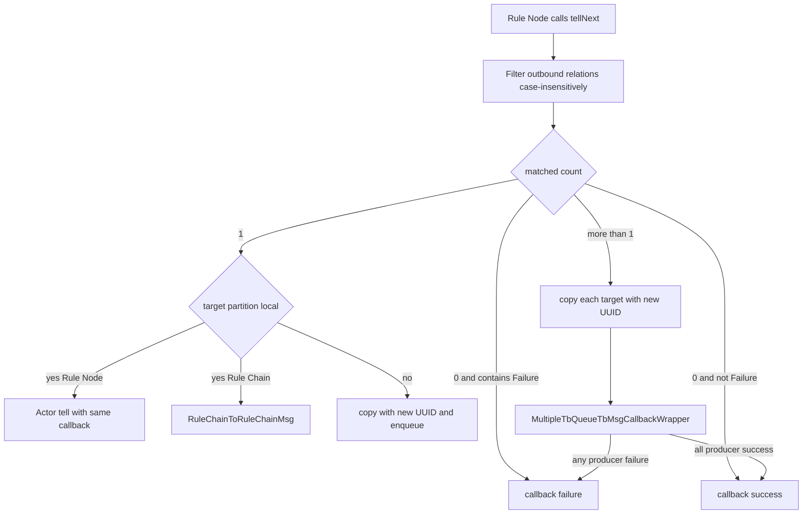

关键源码行为：

- 无匹配 `Failure` relation 时，父 callback 失败；无匹配其他 relation 时，父 callback 成功。
- 单目标且本地时不复制消息，后继继续使用原 callback。
- 单目标跨分区时，producer callback 被 `TbQueueTbMsgCallbackWrapper` 转换成父 `TbMsgCallback`。
- 多目标始终通过 Queue 拆分，即使 `TopicPartitionInfo.isMyPartition()` 为 true；每个分支生成新 UUID。
- 多分支任一 producer 失败会立即令父消息失败，但已经成功入队的其他分支仍会继续，没有撤销协议。

### 3.6 嵌套 Rule Chain

标准 UI 保存的 nested Rule Chain 不是简单创建 `RULE_NODE -> RULE_CHAIN` relation。`saveRuleChainMetaData(...)` 会在调用方 Rule Chain 中创建一个类型为 `org.thingsboard.rule.engine.flow.TbRuleChainInputNode` 的合成 Rule Node，并把目标 RuleChainId 放入 configuration。[源码](../../../dao/src/main/java/org/thingsboard/server/dao/rule/BaseRuleChainService.java#L283)

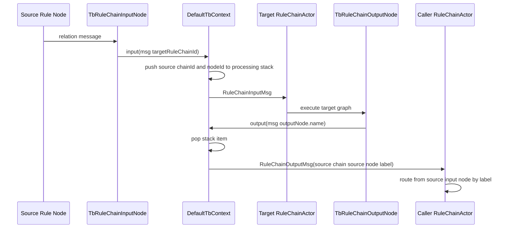

如果 output 时 stack 为空，`DefaultTbContext.output(...)` 直接 `ack(msg)`。目标链的输出 relation type 等于 `TbRuleChainOutputNode` 的节点名称，因此重命名 output node 时应用服务可选择更新引用它的调用链。

运行时还兼容 relation target 直接为 `RULE_CHAIN` 的路径，`pushToTarget(...)` 会发送 `RuleChainToRuleChainMsg`。该路径不会压入 caller stack，所以只把消息交给目标链，不建立 output 返回点；标准 UI metadata 保存使用的是上面的合成 Input Node 模型。

### 3.7 Rule Chain 图保存与热更新

| 步骤 | 类与方法 | 事务/异步边界 |
|---|---|---|
| 1 | `RuleChainController.saveRuleChainMetaData(RuleChainMetaData, boolean)` | HTTP 权限、清理 debug rate-limit context；无应用层大事务 |
| 2 | `DefaultTbRuleChainService.saveRuleChainMetaData(...)` | 调用 DAO transaction；返回后处理 related chains、VC、通知和审计 |
| 3 | `BaseRuleChainService.saveRuleChainMetaData(...)` | `@Transactional`：校验、删除旧 relations、保存/删除 Nodes、更新 first node、批量保存 relations |
| 4 | `DefaultTbClusterService.broadcastEntityStateChangeEvent(...)` | 数据库提交后向所有 Rule Engine service 的 notification topic 发送 UPDATED |
| 5 | `AbstractConsumerService.handleComponentLifecycleMsg(...)` | consumer 发布 Spring event，并 high-priority 告知 AppActor |
| 6 | `TenantActor.onComponentLifecycleMsg(...)` | 找到 RuleChainActor，high-priority 发送 lifecycle message |
| 7 | `RuleChainActorMessageProcessor.onUpdate(...)` | 重新查 DB；创建新 NodeActor、更新存量 NodeActor、停止已删除 NodeActor、重建 routes 和 firstNode |

`saveRuleChainMetaData(...)` 的 PostgreSQL 图更新是一个事务，但 DB commit 与 lifecycle producer 不是一个事务。HTTP 保存失败不能简单推断数据库未提交；反过来，HTTP 200 也不表示每个 Rule Engine service 已完成 Actor reload。

---

## 四、消息流

### 4.1 主流程

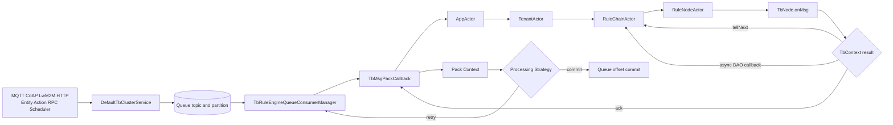

### 4.2 本地和 Queue 边界

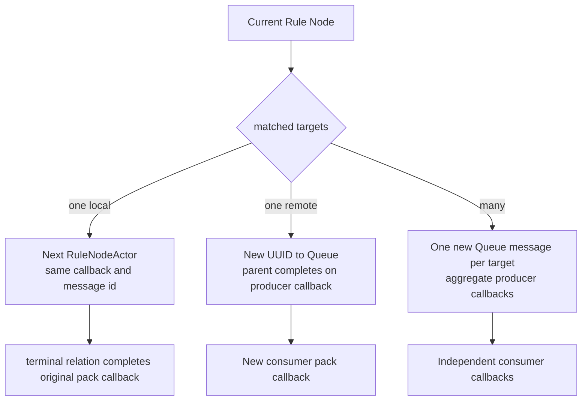

### 4.3 配置刷新

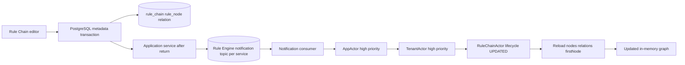

---

## 五、时序图

[打开 PlantUML 源文件](sequence.puml) | [打开渲染后的 SVG](sequence.svg)

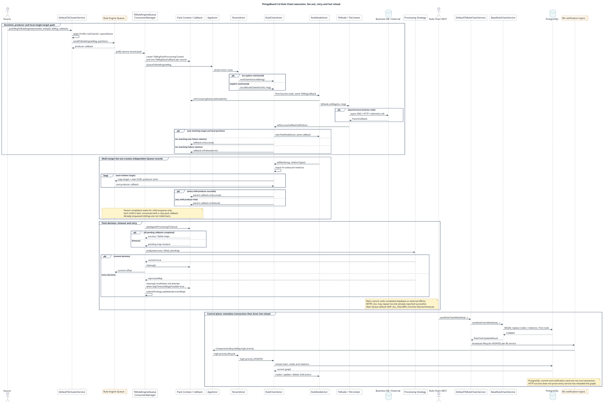

时序图覆盖四条路径：正常本地单分支、多分支 Queue 扇出、pack timeout/retry/commit，以及 metadata transaction 后的 Actor 热更新。阅读时应分别跟踪“原始 Queue record callback”和“扇出后新 Queue record callback”，它们不是同一个生命周期。

---

## 六、数据变化

### 6.1 一次普通 Rule Chain 执行可能修改什么

| 状态类别 | 是否必然修改 | 说明 |
|---|---|---|
| `rule_chain` / `rule_node` / `relation` | 否 | 数据面只读取 Actor 内存图；只有配置 API 修改这些表 |
| PostgreSQL 业务表 | 取决于 Node | Alarm、Attribute、Entity、RPC、Event 等 Node 可调用各自 Service/DAO |
| TimescaleDB / SQL timeseries | 取决于 Node | Save Timeseries Node 可写 history/latest；不与 Queue offset 同事务 |
| Cassandra | 取决于部署与 Node | 时序后端为 Cassandra 时写对应 CF；Rule Chain 本身不感知具体实现 |
| 外部系统 | 取决于 Node | REST API、Kafka、MQTT、Mail 等 Node 可产生不可回滚副作用 |
| `rule_node_debug_event` / profiler | debug/日志开启时 | debug input/output 与执行统计独立于业务副作用 |
| Actor 内存 | 是 | callback pending、processing stack、node counter、Node 自有状态变化 |
| Queue offset | 最终由策略决定 | commit 或在当前 poll pack 内 reprocess |
| Relation cache | 配置保存时失效 | `findByFrom/findByTo` 使用事务缓存；关系事件在事务完成后精确 evict，底层可选 Caffeine/Redis |

### 6.2 图配置保存的数据变化

| 对象 | 操作 |
|---|---|
| `rule_chain` | 更新 `first_rule_node_id`；顶层保存还更新 name/type/root/debug/configuration |
| `rule_node` | 插入新节点、更新存量节点、删除移除节点；configuration 为 JSON 文本映射 |
| `relation` | 先删除存量 Node relations，再按 metadata connections 重建 `RULE_CHAIN`/`RULE_NODE` group relations |
| Version Control | DAO commit 后可 auto-commit 当前 Rule Chain/相关 Rule Chains |
| Actor | 每个 Rule Engine 服务重新读取图；新增/更新/删除 child RuleNodeActor |
| Notification Topic | 每个 Rule Engine service 一条 component lifecycle message；producer callback 为 `null` |
| Session | 不直接修改 | Rule Chain 图更新不扫描 MQTT/CoAP Session |

### 6.3 没有统一事务的边界

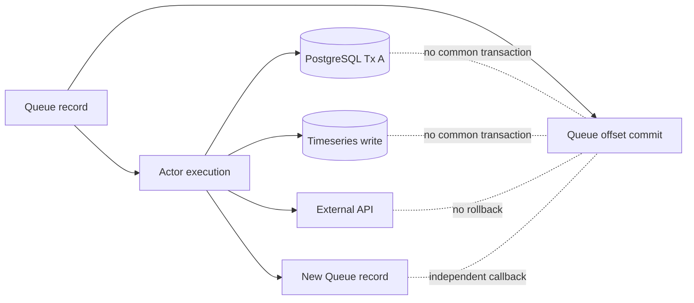

---

## 七、源码分析

### 7.1 核心类与职责

| 层 | 类型 | 职责 |
|---|---|---|
| Queue | `org.thingsboard.server.service.queue.ruleengine.TbRuleEngineQueueConsumerManager` | poll、Submit Strategy、pack timeout、Processing Strategy、commit/reprocess |
| Callback | `TbMsgPackProcessingContext` / `TbMsgPackCallback` | 维护 pending/success/failed、最后访问节点、消息有效性 |
| Actor root | `org.thingsboard.server.actors.app.AppActor` | tenant 路由和 SYS tenant 拒绝 |
| Tenant | `org.thingsboard.server.actors.tenant.TenantActor` | Root/显式 Rule Chain 路由、API Usage 开关、partition 生命周期 |
| Chain manager | `org.thingsboard.server.actors.ruleChain.RuleChainManagerActor` | 初始化所有 CORE chains、维护 rootChainActor、创建 ErrorActor |
| Chain | `RuleChainActor` / `RuleChainActorMessageProcessor` | 加载图、路由 relation、nested chain、fan-out |
| Node | `RuleNodeActor` / `RuleNodeActorMessageProcessor` | 实例化 `TbNode`、串行分派、执行上限、singleton partition |
| Node API | `org.thingsboard.rule.engine.api.TbNode` / `TbContext` | Node 生命周期与 `tellNext/ack/input/output/enqueue` 契约 |
| Context | `org.thingsboard.server.actors.ruleChain.DefaultTbContext` | 把 Node API 转成 Actor/Queue/DAO/executor 操作 |
| Persistence | `BaseRuleChainService` | Rule Chain/Node/relation 的事务保存、加载和删除 |
| App orchestration | `DefaultTbRuleChainService` | VC、lifecycle broadcast、related chain、audit |

### 7.2 继承与组合关系

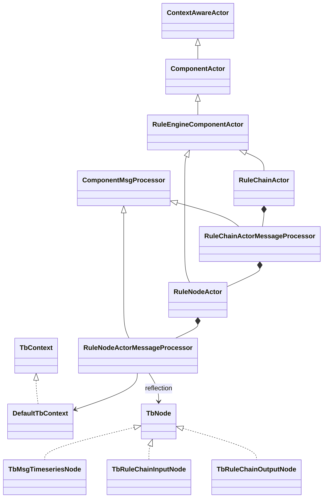

### 7.3 `TbMsg` 中影响执行的字段

| 字段 | 作用 | Queue 边界行为 |
|---|---|---|
| `id` | 当前消息身份、pack map key | fan-out/re-enqueue 常生成新 UUID |
| `queueName` | 下一次入 Queue 使用的逻辑 Queue | protobuf 本体不单独保存 queueName；consumer 用当前 Queue 名恢复 |
| `ruleChainId` | Root 之外的显式目标链，或 resume chain | 序列化 |
| `ruleNodeId` | resume 到指定节点/从指定节点 relation 继续 | 序列化 |
| `ctx` | node execution counter、nested stack | 序列化，跨 Queue 仍保留循环保护和 stack |
| `callback` | 当前 poll record 的完成契约 | `transient`，不序列化；consumer 反序列化时注入新 `TbMsgPackCallback` |

源码证据：`TbMsg.toByteArray(...)` 只写业务字段和 processing ctx；`TbMsg.fromBytes(...)` 从 consumer 参数注入 callback。[TbMsg.java:734](../../../common/message/src/main/java/org/thingsboard/server/common/msg/TbMsg.java#L734) [TbMsg.java:777](../../../common/message/src/main/java/org/thingsboard/server/common/msg/TbMsg.java#L777)

### 7.4 callback wrapper 的真实作用

- `TbQueueTbMsgCallbackWrapper`：单次 Queue producer success/failure 转换成父 `TbMsgCallback` success/failure。[源码](../../../common/queue/src/main/java/org/thingsboard/server/queue/common/TbQueueTbMsgCallbackWrapper.java#L56)
- `MultipleTbQueueTbMsgCallbackWrapper`：所有 producer success 后父 success；任一 failure 立即父 failure。它聚合的是“入队结果”，不是子 Rule Chain 执行结果。[源码](../../../common/queue/src/main/java/org/thingsboard/server/queue/common/MultipleTbQueueTbMsgCallbackWrapper.java#L61)
- `TbMsgPackCallback`：第一次把 id 从 pending 移入 success/failed 后有效；后续重复 callback 因 pending 已删除而不再改变 pack map。

---

## 八、Actor 分析

### 8.1 Actor 创建与生命周期

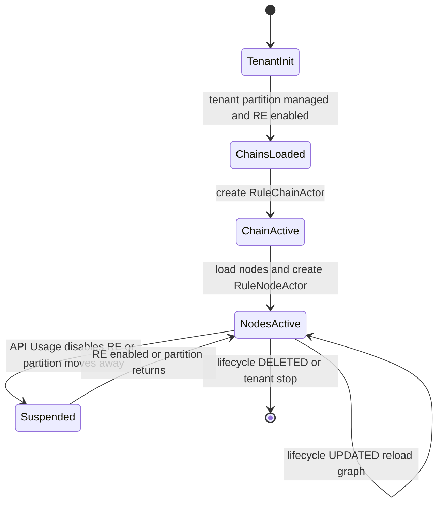

1. TenantActor 启动时，仅在当前服务管理该 tenant 的 Rule Engine partition 且 `isReExecEnabled()` 时初始化 Rule Chains。
2. `RuleChainManagerActor.initRuleChains()` 分页加载 tenant 的全部 `CORE` Rule Chain，并预创建 RuleChainActor；Root 引用保存在 TenantActor 内存。
3. RuleChainActor 启动时加载全部 Rule Nodes；每个 Node 是一个 child RuleNodeActor，使用 Rule dispatcher。
4. lifecycle UPDATED 以 high-priority message 到达 RuleChainActor。现有 NodeActor 收到高优先级 `RuleNodeUpdatedMsg`，新增节点创建，删除节点收到 DELETED 并停止。
5. partition 移出当前服务时 TenantActor 停止 Rule Chain Actors；Singleton Node 的 ownership 变化还会单独 destroy/re-init `TbNode`。
6. high-priority mailbox 会越过已经排队的普通消息，所以“同一 Actor 串行”不等于所有消息按到达时间全局 FIFO。

删除 Node 的通用 lifecycle 路径先调用 processor `onStop(...)`，Actor 真正销毁时 `ComponentActor.destroy(...)` 又调用 processor `stop(...)`；当前 `RuleNodeActorMessageProcessor.stop(...)` 不清空 `tbNode`。自定义 `TbNode.destroy()` 必须能够安全重复执行。

### 8.2 Actor 保证与非保证

| 能保证 | 不能保证 |
|---|---|
| 同一个 Actor mailbox 中消息入口串行执行 | 不保证不同 RuleNodeActor 之间串行 |
| 图更新和该 RuleChainActor 的 relation 路由按 mailbox 顺序处理 | 不保证已经发出的异步 DAO/HTTP callback 在更新前完成 |
| Node 对象的 `init/destroy/onMsg` 调用由其 Actor 协调 | 不自动把 Node 内部 Future 变成 Actor 事务 |
| Actor fault isolation 和 lifecycle 管理 | 不提供跨 Actor、Queue、数据库 exactly-once |

例如 Save Timeseries Node 调用异步 `saveAndNotify(...)` 后 `onMsg` 立即返回，随后由 `TelemetryNodeCallback` 调用 `tellSuccess/tellFailure`。[TbMsgTimeseriesNode.java:122](../../../rule-engine/rule-engine-components/src/main/java/org/thingsboard/rule/engine/telemetry/TbMsgTimeseriesNode.java#L122)

### 8.3 为什么不是普通 Java 对象链

Rule Chain 图可在运行中增删节点、改变关系、迁移分区，并且同一租户有大量并发设备消息。Actor 把每个 Chain/Node 的运行实例、生命周期和 mailbox 绑定，避免 Controller/Consumer 直接持有易失的 Java 对象引用。代价是必须通过 callback 表达完成，调试时也要区分 Actor send 与业务完成。

### 8.4 Singleton Rule Node

`RuleNodeActorMessageProcessor.isMyNodePartition(...)` 对普通节点总是本地；对 singleton 节点按 RuleNodeId 解析 owner。非 owner 收到消息时：

1. `TbMsg.newMsg(source, queueName, ruleChainId, ruleNodeId)` 创建独立消息和空 callback。
2. 按 RuleNodeId 解析 Rule Engine partition。
3. `pushMsgToRuleEngine(..., null)` 发送到 owner。
4. 立即 `defaultCtx.ack(source)` 完成源消息。

因此 singleton 提供“集群内单实例 Node”的执行位置约束，不提供源消息与新消息之间的事务性交接。[源码](../../../application/src/main/java/org/thingsboard/server/actors/ruleChain/RuleNodeActorMessageProcessor.java#L273)

---

## 九、Kafka 分析

Kafka 是 Rule Engine Queue 的常见生产实现，但不是源码唯一实现。以下 topic/group 是 Kafka factory 在默认 Main Queue 下的结果。

### 9.1 Producer、Topic、Partition、Consumer Group

| 项目 | 源码规则 | Main Queue 默认结果 |
|---|---|---|
| Queue name | `Queue.name` | `Main` |
| Topic | `topicService.buildTopicName(configuration.topic)` | 基础 topic `tb_rule_engine.main`，可再加部署前缀 |
| Logical partitions | Queue 配置 | 安装默认 `10` |
| Partition key | `queueName + tenantId + entityId` 经 PartitionService | 同一实体通常稳定路由；自定义 submit/isolated queue 可改变边界 |
| Client ID | `re-{queue}-consumer-{serviceId}-{counter}` | 每个 consumer 实例唯一 |
| System queue group | `re-{queue}-consumer` | `re-Main-consumer`，可加 topic prefix |
| Isolated tenant group | `re-{queue}-isolated-{tenantId}-consumer` | 每租户独立 group |

Kafka consumer factory 见 [KafkaTbRuleEngineQueueFactory.java:239](../../../common/queue/src/main/java/org/thingsboard/server/queue/provider/KafkaTbRuleEngineQueueFactory.java#L239)。实际 topic 仍受 `topicService.buildTopicName(...)` 前缀影响，不应只凭默认字符串排查生产集群。

ThingsBoard logical partition 在 Kafka provider 中表现为独立物理 topic，例如 `tb_rule_engine.main.0` 到 `.9`，不是一个 Kafka topic 内的 10 个原生 partition；isolated tenant topic 还包含 tenant UUID。每个物理 topic 的 Kafka 原生 partition 数由 `queue.kafka.other.partitions` 控制，3.6.4 默认是 `1`。Consumer 使用 `subscribe(topicNames)`；Main Queue 默认 `consumerPerPartition=true` 时，一个 manager task 处理分配给当前 service 的 logical topic 子集。系统安装默认 `queue.type` 是 `in-memory`，只有部署显式选择 Kafka 时才存在这里的 group/`commitSync()` 语义。

### 9.2 Main Queue 安装默认值

| 参数 | 默认值 |
|---|---|
| `pollInterval` | 25 ms |
| `partitions` | 10 |
| `consumerPerPartition` | true |
| `packProcessingTimeout` | 2000 ms |
| Submit Strategy | `BURST`，batchSize 字段 1000 但 BURST 不按该值分批 |
| Processing Strategy | `SKIP_ALL_FAILURES` |

来源：[DefaultSystemDataLoaderService.java:789](../../../application/src/main/java/org/thingsboard/server/service/install/DefaultSystemDataLoaderService.java#L789)。这只是首次安装创建 Queue 行时的默认值，租户 Queue/Profile 和后续配置可覆盖，不能当成所有生产环境固定值。

### 9.3 Submit Strategy

| 类型 | 行为 |
|---|---|
| `BURST` | 当前 poll pack 全部并发提交给 Actor |
| `BATCH` | 最多提交 batchSize；当前 batch 全部 success 后提交下一批；任一 failure 会阻断该批推进直到 timeout |
| `SEQUENTIAL` | 当前 pack 严格一条 success 后再提交下一条；failure 会让剩余消息等到 timeout |
| `SEQUENTIAL_BY_ORIGINATOR` | 每个 originator 同时只处理一条，不同 originator 并发 |
| `SEQUENTIAL_BY_TENANT` | 每个 tenant 同时只处理一条，不同 tenant 并发 |

这里的“顺序”只覆盖当前 consumer poll pack 和 callback success，不是跨 logical topic、跨 consumer、跨重新入 Queue 的全局顺序。`TbMsgPackProcessingContext.pendingMap` 初始包含本轮全部候选消息，所以 BATCH/SEQUENTIAL 中尚未真正提交给 Actor 的尾部消息也会在 pack timeout 时被归为 pending/timed out。

### 9.4 Processing Strategy 与 late callback

| 类型 | failed | timed out | successful | cleanup 后旧消息有效性 |
|---|---|---|---|---|
| `SKIP_ALL_FAILURES` | 跳过并 commit | 跳过并 commit | commit | `isCanceled=false`，late Actor callback 仍可继续 |
| `SKIP_ALL_FAILURES_AND_TIMED_OUT` | 跳过并 commit | 跳过并 commit | commit | timeout 后 `isCanceled=true`，尚未进入的 Actor stage 会跳过 |
| `RETRY_FAILED` | retry | skip | skip | canceled，重试新消息 |
| `RETRY_TIMED_OUT` | skip | retry | skip | canceled，重试新消息 |
| `RETRY_FAILED_AND_TIMED_OUT` | retry | retry | skip | canceled，重试新消息 |
| `RETRY_ALL` | retry | retry | retry | canceled，成功副作用也可能重复 |

`cleanup()` 总会清空 maps 并设置 `canceled=true`，但 `isCanceled()` 返回 `skipTimeoutMsgsPossible && canceled`。[TbMsgPackProcessingContext.java:244](../../../application/src/main/java/org/thingsboard/server/service/queue/TbMsgPackProcessingContext.java#L244) 默认 `SKIP_ALL_FAILURES` 把该开关设为 false，所以 offset 已 commit 后，超时消息仍可能在 Actor/DAO 中继续运行。

Retry Strategy 在 `analyze()` 中先复制 reprocess map，可能再 sleep，之后 manager 才 cleanup。这段窗口内旧 callback 仍可完成，但已经复制到 retry map 的记录不会被移除，因而仍可能重复执行。`maxRetries=3` 表示原始 attempt 之后最多再处理 3 次；failure percentage 使用 `(failed + pending) / initialTotalCount` 的 0..1 比率并按 `>` 判断。

### 9.5 为什么 Kafka retry 不等于事务回滚

Processing Strategy 只持有原 broker record 的内存映射。它无法回滚已经成功的 PostgreSQL transaction、Timescale write、Cassandra mutation、邮件、HTTP 请求或子 Queue 消息。`RETRY_ALL` 明确把 successMap 也加入 reprocess map，因此所有有副作用的 Rule Node 都必须从业务键、请求 ID、upsert 约束或下游幂等接口考虑重复执行。

---

## 十、数据库分析

### 10.1 PostgreSQL 表结构

```mermaid
erDiagram
    RULE_CHAIN {
      uuid id PK
      uuid tenant_id
      varchar name
      varchar type
      uuid first_rule_node_id
      boolean root
      boolean debug_mode
      varchar configuration
      varchar additional_info
      uuid external_id
    }
    RULE_NODE {
      uuid id PK
      uuid rule_chain_id
      varchar type
      varchar name
      int configuration_version
      varchar configuration
      boolean debug_mode
      boolean singleton_mode
      varchar queue_name
    }
    RELATION {
      uuid from_id PK
      varchar from_type PK
      varchar relation_type_group PK
      varchar relation_type PK
      uuid to_id PK
      varchar to_type PK
      varchar additional_info
    }
    RULE_CHAIN ||--o{ RULE_NODE : logical_owner
    RULE_NODE ||--o{ RELATION : from
    RULE_NODE ||--o{ RELATION : to
```

建表脚本见 [schema-entities.sql:165](../../../dao/src/main/resources/sql/schema-entities.sql#L165)、[schema-entities.sql:180](../../../dao/src/main/resources/sql/schema-entities.sql#L180)、[schema-entities.sql:419](../../../dao/src/main/resources/sql/schema-entities.sql#L419)。需要注意：

1. `rule_chain.configuration/additional_info` 和 `rule_node.configuration/additional_info` 在 DDL 中是 `varchar`，JPA 通过 `JsonStringType` 映射 `JsonNode`，不是 PostgreSQL `jsonb`。
2. `rule_node.rule_chain_id`、`rule_chain.first_rule_node_id` 没有数据库 FK；图完整性主要由 Java validator、事务保存顺序和 relation 清理保证。
3. `relation` 是多态复合主键，没有指向 Rule Node/Chain 的 FK，因此删除必须显式清理 relation。
4. `rule_chain` 只有 `(tenant_id, external_id)` 唯一约束；name/root 没有数据库唯一约束。Root 切换由 `setRootRuleChain(...)` 的单个 Spring transaction 更新旧/新两行。
5. Relation 查询存在按 from/to 方向的事务缓存，保存/删除 relation 发布事件，在 transaction 完成后 evict 精确 cache keys；provider 由部署选择 Caffeine 或 Redis。

### 10.2 Metadata 保存事务

`BaseRuleChainService.saveRuleChainMetaData(...)` 使用 `@Transactional`，按以下顺序执行：

1. 校验 RuleChainId、metadata 字段和 connections。
2. 加载旧 Nodes；删除每个旧 Node 的 EntityRelations。
3. 对新/存量 Node 设置 singleton mode、执行 configuration updater 和 validator，再 save。
4. 删除 metadata 中已移除的 Nodes。
5. 更新 `first_rule_node_id`。
6. 将普通 connection 转成 `RelationTypeGroup.RULE_NODE` relation。
7. 将 nested Rule Chain connection 转成合成 `TbRuleChainInputNode` 和普通 Node relation。
8. 以每批 1024 条保存新 relations，发布 `SaveEntityEvent`，提交 transaction。

在该方法抛出异常时，本次图结构修改回滚；但 `updateRelated=true` 对其他调用链 output label relation 的重命名，以及 VC、notification 和 audit，都在主 metadata transaction 返回后执行，没有一个总事务覆盖这些更新。

一个源码缺口必须单独记录：`RuleChainDataValidator.validateRuleNode(...)` 会捕获节点类反射/配置解析异常并返回错误字符串，但 `saveRuleChainMetaData(...)` 调用处没有检查返回值。因此不能声称所有无效插件类型或 configuration 都会阻止保存；部分错误可能在 Actor reload/init 时才暴露。

### 10.3 删除事务

`BaseRuleChainService.deleteRuleChainById(...)` 使用 `@Transactional`：[源码](../../../dao/src/main/java/org/thingsboard/server/dao/rule/BaseRuleChainService.java#L553)

- Root Rule Chain 禁止删除。
- Edge Root Rule Chain 禁止删除。
- Device Profile/Asset Profile FK 引用会由 constraint violation 转成 DataValidationException。
- 删除 Rule Chain、其 Nodes 和 relations 处于同一 transaction。
- commit 后才向引用该链的 Rule Chains 发 UPDATED，并向被删链发 DELETED lifecycle；通知失败不会恢复数据库。

### 10.4 为什么 Rule Chain 配置在 PostgreSQL

Rule Chain 是低频更新、高关联、需要事务重建图的控制面数据。PostgreSQL 适合保存 Chain/Node/Relation 和 Profile FK。TimescaleDB、Cassandra 负责追加型 telemetry，不适合承担图配置事务。Redis 在这条通用链路中不是 Rule Chain 图的权威存储；运行时图由 Actor 从 PostgreSQL 加载到本地内存。

### 10.5 Rule Node 业务写入为什么不共用 Metadata transaction

Rule Node 运行发生在 Queue consumer/Actor 线程和异步 executor 中，metadata 保存发生在 REST/Spring transaction 中，两者生命周期完全不同。业务 Node 通过各自 Service 开启独立事务或异步 mutation；不存在把整条 Rule Chain 包进一个 `@Transactional` 的调用栈。

---

## 十一、异常处理

### 11.1 运行时失败矩阵

| 失败位置 | callback/Queue 行为 | 已发生副作用 | 生产风险 |
|---|---|---|---|
| SYS tenant 进入 AppActor | callback failure | 无 Node 副作用 | Processing Strategy 可能 skip/commit |
| 当前服务不管理 tenant | AppActor callback success | 无 | 消息被提交但未执行业务链；正常分区不应出现 |
| 消息误投到非 Rule Engine TenantActor | 只记录 invalid message，没有 callback | 无 | 当前 pack 等到 timeout |
| 无 Root Rule Chain | callback failure | 无 | 默认 Main Queue 会跳过并 commit |
| 显式 RuleChainId Actor 不存在 | callback success，源码有 dead-letter TODO | 无 | 静默丢业务处理 |
| nested target 不存在 | `RuleChainErrorActor` callback failure | 调用链前序可能已成功 | 无跨 Node 回滚 |
| RE API Usage 在 nested chain-aware 消息期间被禁用 | `onRuleChainMsg(...)` 不转发也不 callback | 前序可能已完成 | 原 pack 等到 timeout |
| 直接 `RULE_CHAIN` relation 的目标链 inactive | `onRuleChainToRuleChainMsg(...)` catch 后只记日志 | 前序可能已完成 | 没有 callback，原 pack 等到 timeout |
| Rule Chain/Node 初始化失败 | inactive exception -> callback failure | 前序可能已发生 | Actor 保存 lifecycle error event |
| Node `onMsg` 同步抛异常 | `DefaultTbContext.tellFailure` 走 Failure relation | Node 抛出前可能已有副作用 | 无 Failure relation才成为 pack failure |
| 无匹配 Success/custom relation | callback success | 当前 Node 副作用保留 | 图配置错误可能表现为“成功结束” |
| 无匹配 Failure relation | callback failure | 当前/前序副作用保留 | 默认 Main Queue仍 commit |
| 多分支部分 producer 失败 | 父 callback failure | 已成功入队分支继续 | 重试可能再产生一组分支 |
| Singleton handoff producer 异步失败 | 源消息已 ack | owner 可能未收到 | callback 为 null，无源消息重试依据 |
| pack timeout + SKIP_ALL_FAILURES | commit；旧 callback 仍 valid | 异步操作可在 commit 后完成 | offset 状态与业务完成时间脱钩 |
| retry 策略 | 选定 record 重新进入 Actor | 旧 attempt 已完成部分不可回滚 | 重复写、重复告警、重复外部调用 |
| rate-limit exception | `TbMsgPackCallback.onRateLimit` 转成 success | 视失败点而定 | Queue 不重试，需依赖配额监控 |

### 11.2 配置保存失败矩阵

| 失败点 | PostgreSQL | Actor/通知 | HTTP 结果 |
|---|---|---|---|
| metadata validator | 无修改 | 无通知 | 4xx validation error |
| configuration updater/显式抛出的 validator | transaction rollback | 无通知 | error |
| `validateRuleNode(...)` 只返回错误字符串且调用方忽略 | 可能提交无效 Node | lifecycle reload 后 Node inactive | REST 可能成功 |
| relation/node SQL 失败 | metadata transaction rollback | 无通知 | error |
| metadata commit 后 VC auto-commit 失败 | 图已提交 | lifecycle 可能尚未发送 | HTTP error，但 DB 已更新 |
| lifecycle producer 失败 | 图已提交 | 部分 Rule Engine service 保留旧 Actor 图 | HTTP 可能仍成功或抛错，取决于 producer 实现 |
| 某服务 notification lag | 图已提交 | 集群短时运行不同版本图 | 无图版本号参与执行 |
| RuleChainActor reload/init 新 Node 失败 | DB 是新图 | 该 Actor/Node inactive，记录 lifecycle error | 保存 API 已结束 |

### 11.3 生产防护

1. 不要只监控 Kafka consumer lag；同时监控 pack timeout、Rule Node failure/debug event、DB/外部调用延迟和 lifecycle notification lag。
2. 对外部副作用 Node 设计幂等键。消息 UUID 在 fan-out/re-enqueue 时会变化，业务幂等键不能只依赖 `TbMsg.id`。
3. 默认 `SKIP_ALL_FAILURES` 适合保持吞吐，但会把节点失败转为提交。关键流程应配置专用 Queue 和明确 retry/dead-letter 补偿策略。
4. retry 不是越多越安全。没有幂等约束时，`RETRY_ALL` 会主动重做已成功分支。
5. Rule Chain 更新后应读取确认所有 Rule Engine 节点已收到 lifecycle 并完成 Actor reload；3.6.4 没有数据库 outbox 和图 version handshake。
6. 避免把长时间外部调用放在默认 2 秒 pack timeout 下；拆专用 Queue、调整 timeout，并配置 Node 自身 timeout/circuit breaker。

---

## 十二、源码阅读路线

1. [TbMsg.java:688](../../../common/message/src/main/java/org/thingsboard/server/common/msg/TbMsg.java#L688)：先看 `queueName/ruleChainId/ruleNodeId/ctx/callback`，确认 callback 不序列化。
2. [DefaultTbClusterService.java:292](../../../application/src/main/java/org/thingsboard/server/service/queue/DefaultTbClusterService.java#L292)：看 Profile 怎样在 producer 前选择 Queue 和 Rule Chain。
3. [TbRuleEngineQueueConsumerManager.java:393](../../../application/src/main/java/org/thingsboard/server/service/queue/ruleengine/TbRuleEngineQueueConsumerManager.java#L393)：逐行画出 pack、await、analyze、cleanup、commit/retry。
4. [TbMsgPackProcessingContext.java:122](../../../application/src/main/java/org/thingsboard/server/service/queue/TbMsgPackProcessingContext.java#L122)：理解 pending id 只完成一次。
5. [TbRuleEngineProcessingStrategyFactory.java:52](../../../application/src/main/java/org/thingsboard/server/service/queue/processing/TbRuleEngineProcessingStrategyFactory.java#L52)：对照六种策略的 failed/pending/success map。
6. [AppActor.java:191](../../../application/src/main/java/org/thingsboard/server/actors/app/AppActor.java#L191) 和 [TenantActor.java:240](../../../application/src/main/java/org/thingsboard/server/actors/tenant/TenantActor.java#L240)：记录每个“不存在/禁用”分支到底 success、failure 还是 return。
7. [RuleChainManagerActor.java:94](../../../application/src/main/java/org/thingsboard/server/actors/ruleChain/RuleChainManagerActor.java#L94)：看 tenant partition 上所有 CORE Rule Chain Actor 如何初始化。
8. [RuleChainActorMessageProcessor.java:142](../../../application/src/main/java/org/thingsboard/server/actors/ruleChain/RuleChainActorMessageProcessor.java#L142)：看 Nodes、relations、first node 如何变成内存图。
9. [RuleNodeActorMessageProcessor.java:197](../../../application/src/main/java/org/thingsboard/server/actors/ruleChain/RuleNodeActorMessageProcessor.java#L197)：看 node counter、debug、singleton 与 `TbNode.onMsg`。
10. [DefaultTbContext.java:173](../../../application/src/main/java/org/thingsboard/server/actors/ruleChain/DefaultTbContext.java#L173)：逐个区分 `tellSuccess/tellFailure/ack/input/output/enqueueForTellNext`。
11. [RuleChainActorMessageProcessor.java:413](../../../application/src/main/java/org/thingsboard/server/actors/ruleChain/RuleChainActorMessageProcessor.java#L413)：重点看 0/1/N relations 和 callback wrappers。
12. [TbRuleChainInputNode.java:89](../../../rule-engine/rule-engine-components/src/main/java/org/thingsboard/rule/engine/flow/TbRuleChainInputNode.java#L89) 与 [TbRuleChainOutputNode.java:71](../../../rule-engine/rule-engine-components/src/main/java/org/thingsboard/rule/engine/flow/TbRuleChainOutputNode.java#L71)：跟踪 processing stack。
13. [BaseRuleChainService.java:208](../../../dao/src/main/java/org/thingsboard/server/dao/rule/BaseRuleChainService.java#L208)：最后看 UI metadata 如何原子转换成 Node 和 Relation。
14. [DefaultTbRuleChainService.java:344](../../../application/src/main/java/org/thingsboard/server/service/rule/DefaultTbRuleChainService.java#L344)：把 transaction 之后的 VC、notification、audit 边界补齐。
15. 选择一个真实业务节点，例如 [TbMsgTimeseriesNode.java:122](../../../rule-engine/rule-engine-components/src/main/java/org/thingsboard/rule/engine/telemetry/TbMsgTimeseriesNode.java#L122)，验证同步返回与异步 callback 的差异。

下一章建议阅读 Alarm 创建流程。Rule Chain 本章已经解释 `Failure/Success`、callback 和 Queue commit；Alarm 章节可以在此基础上追踪 Alarm Rule/Node 怎样去重、更新状态并向后续 relation 返回结果。

---

## 十三、常见面试题

### 13.1 Rule Node 调用 `tellSuccess` 是否表示整条 Rule Chain 成功？

**标准答案：** 不是。`tellSuccess` 等价于选择 `Success` relation。存在匹配后继时消息继续执行；只有没有匹配后继时 RuleChainActor 才调用当前 callback `onSuccess()`。

### 13.2 Rule Node 抛异常后 Kafka 一定重试吗？

**标准答案：** 不一定。异常先转为 `Failure` relation；有 Failure 后继就继续图执行。没有后继才 callback failure，而默认 Main Queue 的 `SKIP_ALL_FAILURES` 会跳过失败并 commit。

### 13.3 多分支是否等待全部分支执行成功才提交父消息？

**标准答案：** 不等待。3.6.4 对多目标 relation 生成多个新 Queue 消息，`MultipleTbQueueTbMsgCallbackWrapper` 只聚合 producer 入队结果。全部子消息入队成功后父消息可完成，子分支各自拥有新的 consumer callback。

### 13.4 单分支和多分支为什么语义不同？

**标准答案：** 单目标且本地时直接 Actor tell，共用原 `TbMsgCallback`；跨分区才复制并入 Queue。多目标为隔离并行分支和 callback，源码无条件把每个目标拆成 Queue 消息。

### 13.5 Actor 是否保证同一设备消息严格顺序？

**标准答案：** Actor 只保证同一 mailbox 的入口串行。不同 RuleNodeActor 并发，异步 Node 在 Future 完成前已经返回 mailbox；Queue 还有多 partition/consumer 和重新入队。需要顺序时应结合 partition key 与 `SEQUENTIAL_BY_ORIGINATOR`，但这也不是跨 Queue 的全局顺序。

### 13.6 Rule Chain 的 Root 切换是原子的吗？

**标准答案：** DAO `BaseRuleChainService.setRootRuleChain(...)` 使用单个 `@Transactional` 方法，把旧 root=false 和新 root=true 放在同一事务。数据库没有每租户 root 唯一约束，代码也没有显式租户级锁，因此不能从源码证明并发切换永远只有一个 root；之后的 Actor notification 也不在该事务内。

### 13.7 Rule Chain metadata 保存是一个事务吗？

**标准答案：** Nodes、first node 和 relations 的 DAO 修改处于一个 PostgreSQL transaction。Version Control、lifecycle broadcast、related chain 的额外处理和 audit 发生在该 transaction 返回之后，不是一个跨集群事务。

### 13.8 Rule Node configuration 是 PostgreSQL JSONB 吗？

**标准答案：** 不是。3.6.4 建表脚本把 Rule Chain/Node configuration 定义为大 `varchar`，JPA `JsonStringType` 将其映射成 `JsonNode`。Device Profile 的 `profile_data` 才是明确的 `jsonb`。

### 13.9 为什么 `relation` 表没有 FK？

**标准答案：** 它是面向所有 EntityType 的多态 relation 表，主键包含 from/to type 和 id，不能简单引用单一实体表。代价是数据库不自动保证目标存在，Rule Chain 保存/删除必须由 Java validator 和 relation cleanup 维护完整性。

### 13.10 `TbMsg.callback` 为什么不序列化？

**标准答案：** callback 是当前 consumer pack 的进程内完成契约，不能跨 broker 传输。进入 Queue 后只序列化消息字段和 processing ctx；目标 consumer 反序列化时注入新的 `TbMsgPackCallback`。

### 13.11 嵌套 Rule Chain 如何返回调用方？

**标准答案：** `TbRuleChainInputNode` 把调用方 chainId/nodeId 压入 `TbMsgProcessingCtx` stack，再发送 `RuleChainInputMsg`。目标链 `TbRuleChainOutputNode` 以自身 name 作为输出 label，pop stack 后发送 `RuleChainOutputMsg` 回调用方，并从原 input node 按该 label 继续路由。

### 13.12 `SKIP_ALL_FAILURES` 超时后会取消正在运行的 Node 吗？

**标准答案：** 不会。该策略的 `isSkipTimeoutMsgs()` 为 false，所以 pack cleanup 后 `TbMsgCallback.isMsgValid()` 仍为 true；offset 可已提交，而 late Actor/DAO callback 继续执行。即使使用会标记 invalid 的策略，也只能阻止后续检查点，不能撤销已发出的数据库或外部请求。

### 13.13 Rate limit 为什么可能显示成 Queue success？

**标准答案：** `TbMsgPackCallback.onFailure(...)` 检测到 `AbstractRateLimitException` 后调用 `onRateLimit(...)`，而后者执行 `ctx.onSuccess(id)`。这是避免 broker retry 加剧过载的策略，必须用配额指标和通知另行发现。

### 13.14 Singleton Rule Node 是否 exactly-once？

**标准答案：** 不是。它只让该 Node 类型实例按 RuleNodeId 固定到一个 Rule Engine partition。非 owner 把新消息发到 owner 后立即 ack 源消息，而且 producer callback 为 null；它没有分布式事务或 exactly-once handoff。

### 13.15 Rule Chain 更新后旧消息会怎样？

**标准答案：** Actor lifecycle UPDATED 重建节点和 routes。Queue 中带 `ruleNodeId` 的 resume 消息若目标节点已不存在，源码 callback success；正在执行的异步 Node 仍可能用旧实例完成 callback。没有图 version 写入 `TbMsg` 来强制同版本执行。

### 13.16 如何为关键 Rule Chain 设计可靠性？

**标准答案：** 使用专用 Queue、明确 submit/processing strategy、足够的 pack/node timeout、业务幂等键、下游唯一约束或 upsert、外部调用 request id、失败事件/补偿队列和 lifecycle 收敛监控。不能仅把 Processing Strategy 改成 RETRY_ALL，因为它会重复成功副作用。

---

[上一篇：04 Device Profile 流程](../04-device-profile/README.md) | [HTML 版](index.html) | [全书目录](../../SUMMARY.md) | [PlantUML 源文件](sequence.puml) | [时序图 SVG](sequence.svg) | [架构图 SVG](../../assets/architecture/05-rule-chain-execution.svg) | [下一篇：06 Alarm 创建流程](../06-alarm-create/README.md)
