# 06 Alarm 创建流程

> 源码基线：ThingsBoard `3.6.4`，行为提交 `0cb411fc90`；源码链接已按当前 `release-3.6` 工作树行号校准。本章只讨论告警创建与活动告警更新，清除、确认、指派和删除分别在后续章节展开。

[上一篇：05 Rule Chain 执行流程](../05-rule-chain-execution/README.md) | [HTML 版](index.html) | [全书目录](../../SUMMARY.md) | [PlantUML 源文件](sequence.puml) | [时序图 SVG](sequence.svg) | [架构图 SVG](../../assets/architecture/06-alarm-create.svg) | [下一篇：07 Alarm 清除流程](../07-alarm-clear/README.md)

---

## 一、流程目标

Alarm 创建流程把“某个实体发生了需要关注的状态”固化为一个有状态、可查询、可传播、可订阅的 `Alarm`。它不是遥测表上的一条特殊记录，也不写 TimescaleDB/Cassandra；告警主体写 PostgreSQL `alarm`，可见范围写 `entity_alarm`，类型集合写 `alarm_types`。

### 1.1 三条创建路径

| 路径 | 触发语义 | 创建入口 | 后续规则消息 |
|---|---|---|---|
| REST | 用户显式创建或更新 Alarm | `AlarmController.saveAlarm(Alarm)` | 修改成功后产生 `ENTITY_CREATED/ENTITY_UPDATED`，并提交 EntityAction 类通知触发器 |
| Create Alarm Rule Node | 每条进入节点的 `TbMsg` 直接创建或更新 | `TbCreateAlarmNode.processAlarm(TbContext, TbMsg)` | 先入队 Alarm entity-action，再走本节点 `Created/Updated` |
| Device Profile Alarm Rule | telemetry/attribute/activity 驱动条件状态机 | `TbDeviceProfileNode.onMsg(TbContext, TbMsg)` | 正常处理后原消息走 `Success`，额外产生 `Alarm Created/Updated/Severity Updated/Cleared` |

三条路径最终都进入 `DefaultAlarmSubscriptionService -> BaseAlarmService -> JpaAlarmDao -> PostgreSQL function`，但 REST 权限、审计、EntityAction 以及 Rule Node callback 语义并不相同。

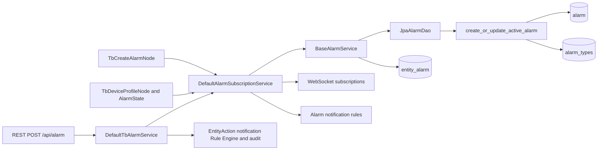

[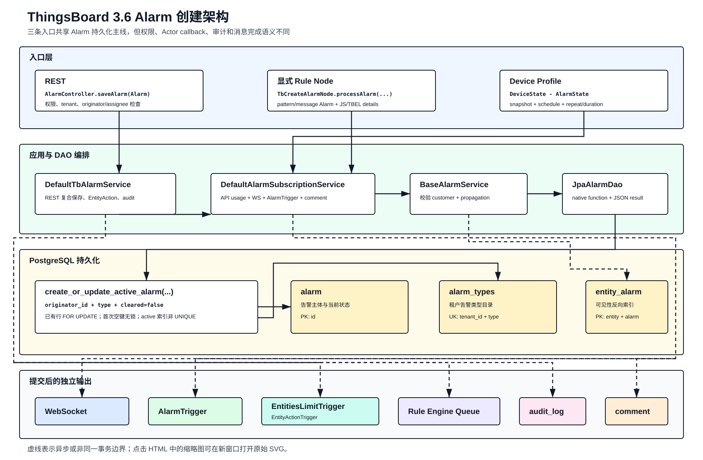](../../assets/architecture/06-alarm-create.svg)

### 1.2 必须先建立的语义

1. `createAlarm(...)` 实际是 **create-or-update active alarm**，不是纯 INSERT。
2. 设计去重键是 `originator_id + type + cleared=false`；`tenant_id`、`originator_type` 不在 SQL 查重条件中。
3. `active` 不是表字段，源码定义就是 `cleared=false`；`status` 由 `cleared/acknowledged` 两个布尔值计算。
4. `entity_alarm` 不是实体关系表，而是“哪些实体能看到这条告警”的反向索引。
5. Alarm 主行、传播行、WebSocket、通知、规则消息、审计和评论没有一个覆盖全链路的事务。
6. 已存在 active alarm 的并发更新有行锁；并发首次创建没有唯一约束，数据库不能强保证只生成一条 active alarm。

### 1.3 状态矩阵

| `cleared` | `acknowledged` | `AlarmStatus` | 是否 active |
|---|---|---|---|
| `false` | `false` | `ACTIVE_UNACK` | 是 |
| `false` | `true` | `ACTIVE_ACK` | 是 |
| `true` | `false` | `CLEARED_UNACK` | 否 |
| `true` | `true` | `CLEARED_ACK` | 否 |

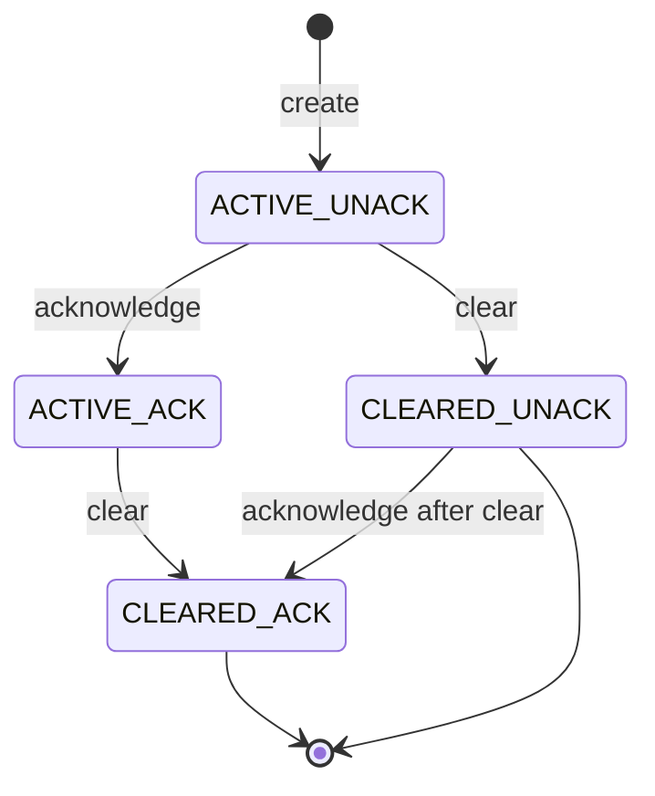

---

## 二、入口

### 2.1 REST 入口

`POST /api/alarm` 对应 [`org.thingsboard.server.controller.AlarmController.saveAlarm(Alarm)`](../../../application/src/main/java/org/thingsboard/server/controller/AlarmController.java#L202)。

| 项目 | 源码行为 |
|---|---|
| 权限 | `TENANT_ADMIN` 或 `CUSTOMER_USER` |
| tenant | 强制覆盖为当前登录用户 tenant |
| 创建/更新判断 | request body 无 `id` 是创建入口，有 `id` 是显式更新入口 |
| 安全检查 | Alarm CREATE/WRITE、originator READ、可选 assignee READ |
| 应用服务 | `DefaultTbAlarmService.save(Alarm, User)` |

Customer User 还受 tenant/customer 归属和 originator 可读性约束。REST 入口的 `ActionType` 只根据“请求是否带 id”决定；无 id 请求若被数据库去重为旧 active alarm 的更新，DAO 返回 updated，但 EntityAction 与 audit 仍使用 `ADDED`。

### 2.2 显式 Create Alarm Rule Node

[`org.thingsboard.rule.engine.action.TbCreateAlarmNode.processAlarm(TbContext, TbMsg)`](../../../rule-engine/rule-engine-components/src/main/java/org/thingsboard/rule/engine/action/TbCreateAlarmNode.java#L118) 支持两种输入：

| 模式 | type/severity/details 来源 |
|---|---|
| 节点配置 | type 和 severity 可用 pattern；details 由 JS/TBEL 异步脚本构造 |
| `useMessageAlarmData` | 从 `msg.data` 反序列化完整 `Alarm`；可选择覆盖 details |

节点先调用 `findLatestActiveByOriginatorAndType(...)`，不存在则 `createNewAlarm(...)`，存在则 `updateAlarm(...)`。这次前置查询用于决定脚本和更新方式，真正的 create-or-update 仍由数据库函数决定。

### 2.3 Device Profile Alarm Rule

[`org.thingsboard.rule.engine.profile.TbDeviceProfileNode.onMsg(TbContext, TbMsg)`](../../../rule-engine/rule-engine-components/src/main/java/org/thingsboard/rule/engine/profile/TbDeviceProfileNode.java#L147) 只为 `DEVICE` originator 建立 `DeviceState`，处理：

| 消息 | 用途 |
|---|---|
| `POST_TELEMETRY_REQUEST` | 合并时序快照，评估 create/clear rules |
| `POST_ATTRIBUTES_REQUEST`、`ATTRIBUTES_UPDATED/DELETED` | 合并属性快照并评估相关规则 |
| `ACTIVITY_EVENT/INACTIVITY_EVENT` | 作为 telemetry 或 attribute 更新处理 |
| `ALARM_CLEAR/ACK/DELETE` | 修正节点内存中的当前告警状态 |
| `DEVICE_PROFILE_PERIODIC_SELF_MSG` | 每分钟 harvest duration 规则 |

设备首次进入节点时，`DeviceState.fetchLatestValues(...)` 会读取规则引用的 latest telemetry、三个 attribute scope 和 device fields。只有快照、规则评估和同步 Alarm service 调用都正常完成后，原业务消息才执行 `tellSuccess`；告警是额外输出，不替代原消息。

### 2.4 Edge 入口

Edge 上行 Alarm 由 [`org.thingsboard.server.service.edge.rpc.processor.alarm.BaseAlarmProcessor.processAlarmMsg(TenantId, AlarmUpdateMsg)`](../../../application/src/main/java/org/thingsboard/server/service/edge/rpc/processor/alarm/BaseAlarmProcessor.java#L73) 处理。`ENTITY_CREATED_RPC_MESSAGE` 使用 Edge 提供的 AlarmId 调用 `createAlarm(...)`，更新、ACK、CLEAR、DELETE 分别走对应服务。

普通 Server 侧 Alarm create/update 的 `SaveEntityEvent` 被 `EdgeEventSourcingListener` 明确过滤，因此它们不会自动下发 Edge；ACK/CLEAR 等 `ActionEntityEvent` 和 AlarmComment 有独立同步路径。

### 2.5 不存在的入口

- MQTT、CoAP、LwM2M 不直接创建 Alarm；它们先生成 telemetry/attribute `TbMsg`，再由 Rule Chain 或 Device Profile 规则创建。
- 平台通用 Scheduler 没有独立 Alarm 创建入口；Device Profile 的每分钟 self-message 会重新评估 duration，并在跨阈值时调用同一 Alarm service 创建或清除。
- Kafka Consumer 不是业务创建者；启用 Kafka Queue 时，它负责把包含 telemetry 或 Alarm action 的消息投给 Actor。

---

## 三、完整调用链

### 3.1 REST 创建主链

| 步骤 | 类与方法 | 输入 | 输出/职责 | 设计原因 |
|---|---|---|---|---|
| 1 | `org.thingsboard.server.controller.AlarmController.saveAlarm(Alarm)` | HTTP JSON、SecurityUser | 校验权限并固定 tenant | HTTP 安全边界不下沉到 DAO |
| 2 | `org.thingsboard.server.service.entitiy.alarm.DefaultTbAlarmService.save(Alarm, User)` | Alarm、User | 根据 id 选择 create/update，编排 ack/clear/assign | REST 的复合保存语义集中在应用层 |
| 3 | `org.thingsboard.server.service.telemetry.DefaultAlarmSubscriptionService.createAlarm(AlarmCreateOrUpdateActiveRequest)` | 创建请求 | 检查租户 Alarm API usage，调用 DAO 服务 | 把持久化与实时订阅编排集中到一个服务 |
| 4 | `org.thingsboard.server.dao.alarm.BaseAlarmService.createAlarm(request, boolean)` | request、creationEnabled | 校验 tenant/time，重算 customer，补传播 | DAO Service 固定领域不变量 |
| 5 | `org.thingsboard.server.dao.sql.alarm.JpaAlarmDao.createOrUpdateActiveAlarm(request, boolean)` | 领域请求 | 参数转 SQL，生成 UUID，解析 JSON 结果 | 隔离 JPA/native SQL 与领域模型 |
| 6 | `org.thingsboard.server.dao.sql.alarm.AlarmRepository.createOrUpdateActiveAlarm(...)` | 扁平参数 | 执行 PostgreSQL function | 把查找、加锁、写入和返回旧值放在一次数据库调用中 |
| 7 | `create_or_update_active_alarm(...)` | tenant/customer/originator/type/状态 | INSERT 或 UPDATE `alarm`，维护 `alarm_types` | 让已有 active 行的并发更新串行 |
| 8 | `BaseAlarmService.withPropagated(AlarmApiCallResult)` | 数据库结果 | 计算并保存 `entity_alarm` | 把告警主体和可见性索引分离 |
| 9 | `DefaultAlarmSubscriptionService.withWsCallback(...)` | 完整结果 | 异步 WS、AlarmTrigger、severity comment | 持久化返回不等待实时推送 |
| 10 | `DefaultTbAlarmService.save(...)` | result | EntitiesLimit/EntityAction Trigger、Rule Engine、audit | 用户动作通知与底层 AlarmTrigger 分开 |

### 3.2 PostgreSQL function 分支

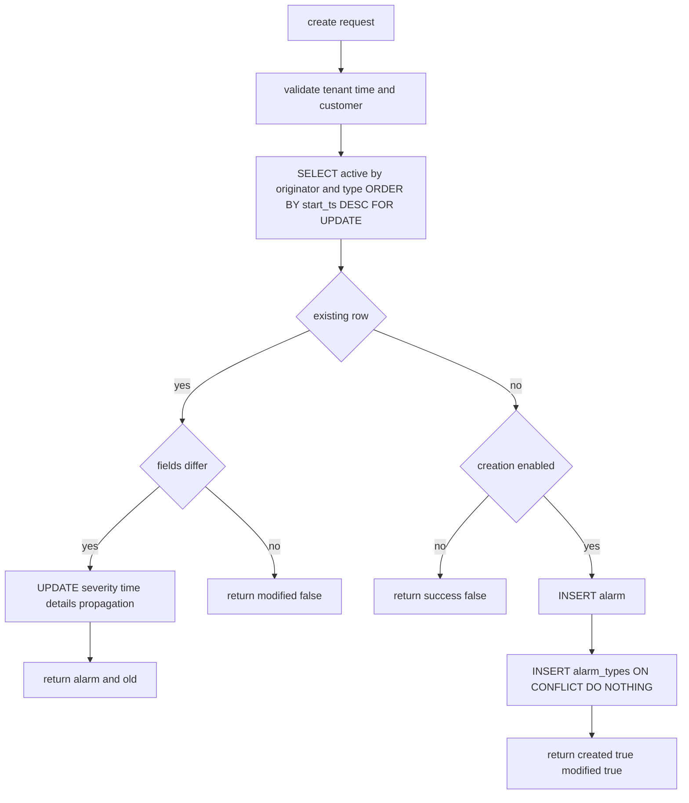

已有 active alarm 的 UPDATE 不修改 `acknowledged/ack_ts`、`cleared/clear_ts`、customer、assignee、originator、type。独立 `update_alarm(...)` 以 `(tenant_id, alarm_id)` 加锁，允许修改 active 或 cleared Alarm 的 severity、时间、details 和传播配置。

### 3.3 显式 Rule Node 主链

```text
TbCreateAlarmNode.onMsg
  -> processAlarm
     -> findLatestActiveByOriginatorAndType
     -> buildAlarmDetails / buildAlarm / update existing Alarm
     -> RuleEngineAlarmService.createAlarm or updateAlarm
        -> DefaultAlarmSubscriptionService
        -> BaseAlarmService -> PostgreSQL
  -> TbAbstractAlarmNode.tellNext
     -> ctx.alarmActionMsg(... ENTITY_CREATED/ENTITY_UPDATED)
     -> ctx.enqueue(...)
     -> producer success: ALARM msg -> Created/Updated
     -> producer failure: Failure
```

Alarm 已写数据库后，节点才尝试入队 entity-action。入队失败不会回滚 Alarm，只会让当前 Rule Node 走 `Failure`。入队成功也只表示 action message 已进入 Rule Engine Queue，不表示它已经执行完成。

### 3.4 Device Profile 状态机主链

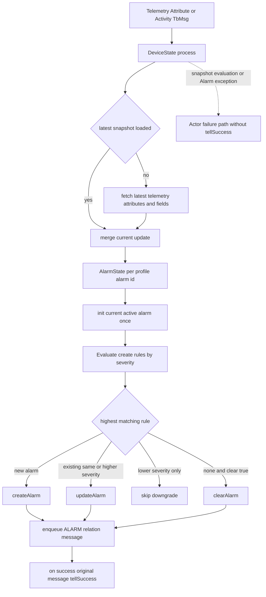

Create rules 按 `AlarmSeverity.ordinal()` 升序，即 `CRITICAL -> MAJOR -> MINOR -> WARNING -> INDETERMINATE`，第一个 TRUE 胜出。已有 Alarm 允许同级更新和升级，不允许降级。只有全部 create rule 都不为 TRUE，才可能评估 clear rule。

### 3.5 Device Profile condition 状态

| Spec | 触发条件 | 关键边界 |
|---|---|---|
| `SIMPLE` | 当前 condition 立即为 true | 当次消息决定 |
| `REPEATING` | `eventCount >= requiredRepeats` | false/schedule inactive 会清零 |
| `DURATION` | 累计持续时间 `> requiredDuration` | 等于阈值仍不触发；每分钟 harvest 可推进 |

如果规则引用任意 time-series，单独 attribute 更新不会触发该规则，要等待相关 telemetry 更新。属性 scope 在 `DataSnapshot` 中折叠为同一个 `ATTRIBUTE` key；快照不以 key 维度拒绝乱序旧值。

---

## 四、消息流

### 4.1 全链路消息与副作用

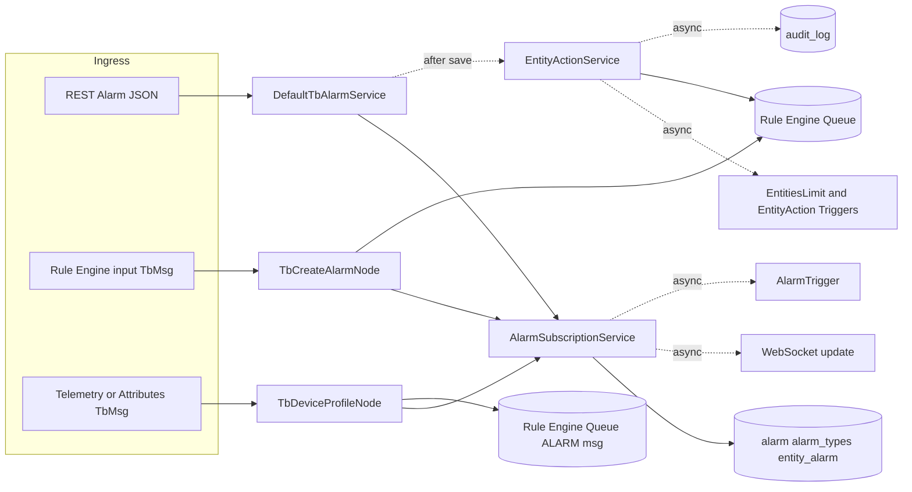

### 4.2 `AlarmApiCallResult` 决策

| 数据库结果 | created | modified | old | Subscription | 显式 Node relation |
|---|---:|---:|---|---|---|
| 新建 | true | true | null | WS + AlarmTrigger | `Created` |
| 活动告警字段更新 | false | true | 旧 Alarm | WS + AlarmTrigger；severity 变化加 comment | `Updated` |
| 完全相同 | false | false | null | 不推送 | `Success` |
| creation disabled 且无 active | false | false | null | 抛 usage exception | `Failure` |

Device Profile 对极端的“成功但未 modified”结果没有 `Success` 分支；`pushMsg(...)` 的最后 else 会把所有 false 标志映射成 `Alarm Cleared`。正常 create/update 计算通常会改变时间或 details，但阅读源码时必须知道这个边界。

### 4.3 传播可见性

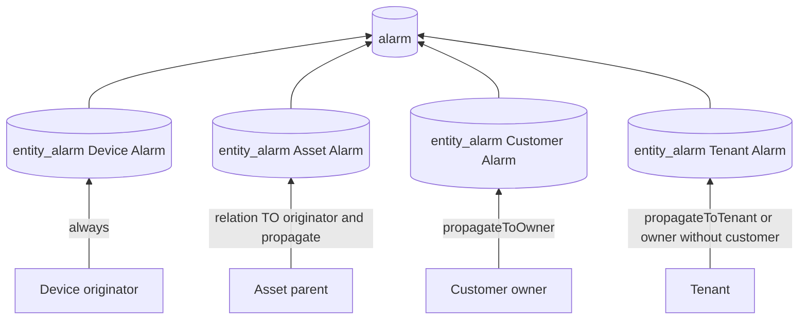

`propagate=true` 使用以 originator 为起点、方向 `TO`、最大深度 `Integer.MAX_VALUE` 的关系查询，取每条关系的 `from` 作为父实体。relation type 过滤在关系查询结果返回后执行。创建或传播配置变化只补写当前集合，不删除旧 `entity_alarm`，因此关闭传播或缩窄 relation types 不会自动收缩已有可见性行。

---

## 五、时序图

完整时序图见 [sequence.puml](sequence.puml) 和 [sequence.svg](sequence.svg)。

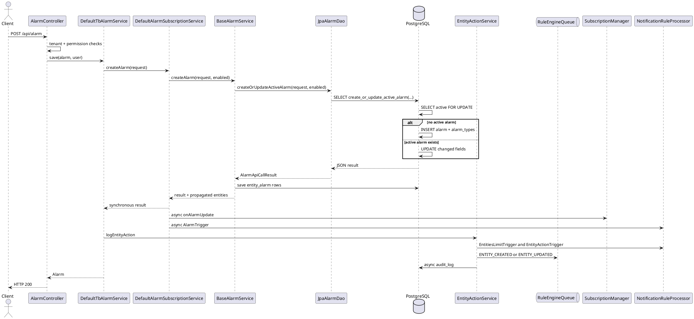

[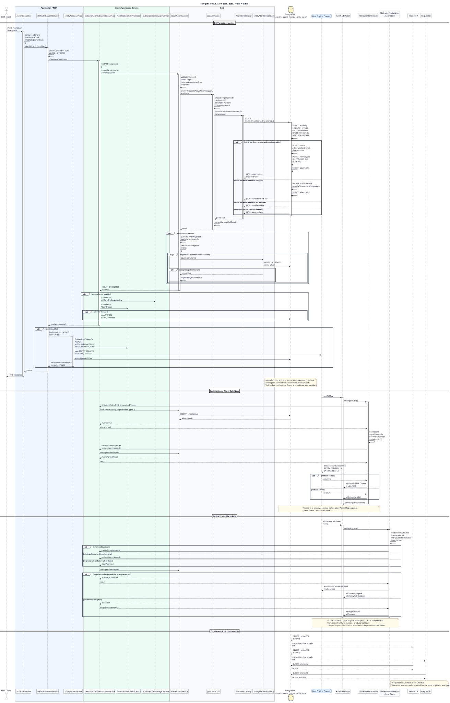](sequence.svg)

### 5.1 时序边界

1. HTTP 返回等待 Alarm 主操作和同步 `entity_alarm` 循环结束，但不等待 WS、notification、Rule Engine action 或 audit 的最终执行。
2. `DefaultAlarmSubscriptionService` 的 WS callback 在 Alarm DAO 返回后提交，不是 transaction after-commit hook。
3. severity comment 在提交 WS task 后由当前线程保存；实际 WS 与 comment 的完成顺序存在竞争。
4. `TbCreateAlarmNode` 等待的是 entity-action message 的 producer callback，不是其 Rule Chain 执行结果。

---

## 六、数据变化

| 对象/系统 | 创建时变化 | 更新 active 时变化 | 事务关系 |
|---|---|---|---|
| `alarm` | 新 UUID、初始 unack/uncleared | 原 ID 上覆盖 severity/time/details/propagation | PostgreSQL function 内 |
| `alarm_types` | `(tenant_id,type)` upsert | 再次 `ON CONFLICT DO NOTHING` | 同 function 调用 |
| `entity_alarm` | originator + propagation targets | propagation changed 时补写；不删除旧记录 | 逐条 Repository save，非 Alarm function 原子事务 |
| Alarm type cache | 租户默认类型页失效 | 即使 `modified=false` 也可能失效 | 有事务则 after commit，无事务立即 |
| WebSocket | propagated entities 收到 alarm update | `modified=true` 才发送 | 异步 executor |
| Alarm notification | modified 后提交 `AlarmTrigger`，create 可匹配 CREATED | 按 Alarm trigger processor 支持的状态变化匹配 | 异步 |
| REST EntityAction notification | `ADDED` 提交 `EntitiesLimitTrigger` 并继续提交 `EntityActionTrigger` | `UPDATED` 提交 `EntityActionTrigger` | 与 AlarmTrigger 独立的异步路径 |
| Rule Engine Queue | REST/显式 Node 可产生 entity action；Profile 产生 ALARM relation | 同左 | 与 DB 无统一事务 |
| `audit_log` | REST 用户动作异步保存 | REST 用户动作异步保存 | 不阻塞 REST 主返回 |
| `alarm_comment` | 通常无 | severity 变化时尝试写 SYSTEM comment | 失败只记录日志 |
| Actor | Device Profile 持有 `DeviceState/AlarmState/currentAlarm` | 更新内存快照和规则状态 | Actor mailbox + 同步 DAO 调用 |
| `rule_node_state` | 可保存 duration/repeat 计数 | `(rule_node_id,entity_id)` upsert | 独立 DAO 保存 |
| Session | 不修改 MQTT/HTTP Session | 不修改 | 无关 |

### 6.1 `rule_node_state` 生命周期

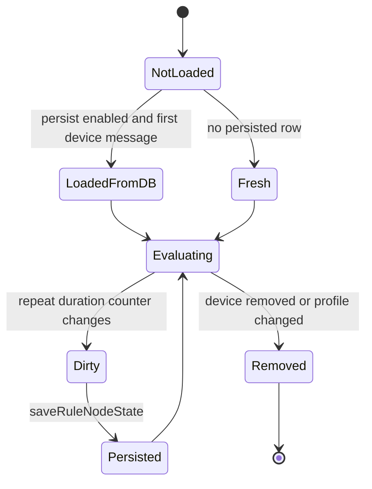

持久化 JSON 以 alarm definition id 和 severity 保存 `lastEventTs/duration/eventCount`。当前 3.6 源码只把 create-rule state 放回 persisted map；`clearRuleState` 被读取但没有对应 setter，因此新产生的 clear repeating/duration 状态不会可靠持久化。

---

## 七、源码分析

### 7.1 核心类型与继承/实现

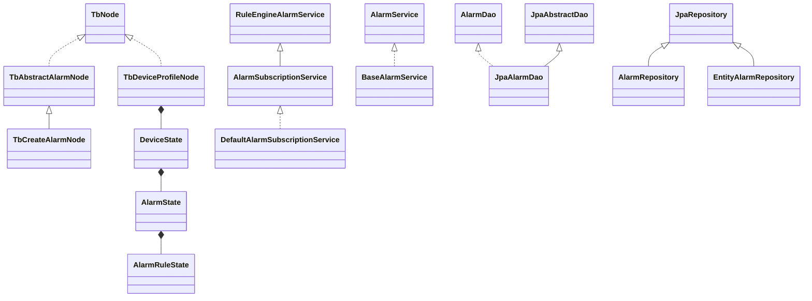

### 7.2 核心文件清单

| 层 | 类型 | 阅读重点 |
|---|---|---|
| REST | `org.thingsboard.server.controller.AlarmController` | `saveAlarm(Alarm)` 权限与参数边界 |
| Application | `org.thingsboard.server.service.entitiy.alarm.DefaultTbAlarmService` | REST 复合保存、EntityAction、audit |
| Subscription | `org.thingsboard.server.service.telemetry.DefaultAlarmSubscriptionService` | quota、WS、AlarmTrigger、comment |
| Rule API | `org.thingsboard.rule.engine.api.RuleEngineAlarmService` | Rule Node 看到的同步服务契约 |
| Rule Node | `org.thingsboard.rule.engine.action.TbAbstractAlarmNode` | async callback 与 action message 入队 |
| Rule Node | `org.thingsboard.rule.engine.action.TbCreateAlarmNode` | pattern/message alarm、脚本、前置查询 |
| Profile | `org.thingsboard.rule.engine.profile.TbDeviceProfileNode` | 设备状态缓存、self-message、热更新 |
| Profile | `org.thingsboard.rule.engine.profile.DeviceState` | 快照加载、消息分派、state persistence |
| Profile | `org.thingsboard.rule.engine.profile.AlarmState` | severity 选择、create/update/clear |
| Profile | `org.thingsboard.rule.engine.profile.AlarmRuleState` | schedule、simple/repeating/duration |
| DAO Service | `org.thingsboard.server.dao.alarm.BaseAlarmService` | customer 校验、传播、缓存事件 |
| DAO | `org.thingsboard.server.dao.sql.alarm.JpaAlarmDao` | native function 参数与 JSON 映射 |
| Repository | `org.thingsboard.server.dao.sql.alarm.AlarmRepository` | PostgreSQL function query |
| PostgreSQL | `schema-views-and-functions.sql` | `alarm_info` 和锁定函数 |

### 7.3 `TbCreateAlarmNode` 的两个重要边界

1. `useMessageAlarmData` 解析失败时先 `ctx.tellFailure(msg,e)` 再返回 `null`；调用方 `TbAbstractAlarmNode.onMsg` 随即把这个 null 传给 `DonAsynchron.withCallback(...)`。`Futures.addCallback` 不接受 null，Actor 外层还会看到同步异常。这是源码真实边界，不要把它理解成普通 failed future。
2. 前置 `findLatestActiveByOriginatorAndType` 没有 tenant 条件进入最终 repository query；真正 function 查重也不包含 tenant。系统依赖 UUID 实体标识跨租户不冲突这一外部前提，DDL 本身没有通过 tenant 约束该查询。

### 7.4 Device Profile 热更新边界

- 同一 alarm definition id + severity 会复用旧累计状态，即使 condition 已改变。
- 删除 alarm definition 不会自动 clear 数据库中已存在的 Alarm。
- 删除 clear rule 时 `AlarmState.updateState(...)` 没有显式把旧 `clearState` 置空。
- 同 id 修改 alarm type 不会主动丢弃内存 `currentAlarm` 并重新查询。
- Profile 热更新只补取新增 key 并重建规则，不立即重新评估。

---

## 八、Actor 分析

### 8.1 显式 Create Alarm Node

`RuleNodeActor` 调用 `TbCreateAlarmNode.onMsg(...)`。节点立即组装 Guava Future；数据库和脚本完成后，通过 `dbCallbackExecutor` 回调 `tellNext/tellFailure`。Actor mailbox 只串行进入 `onMsg` 的同步片段，不等待 Future，因此同一个 RuleNode 可同时存在多个 Alarm DAO 调用。

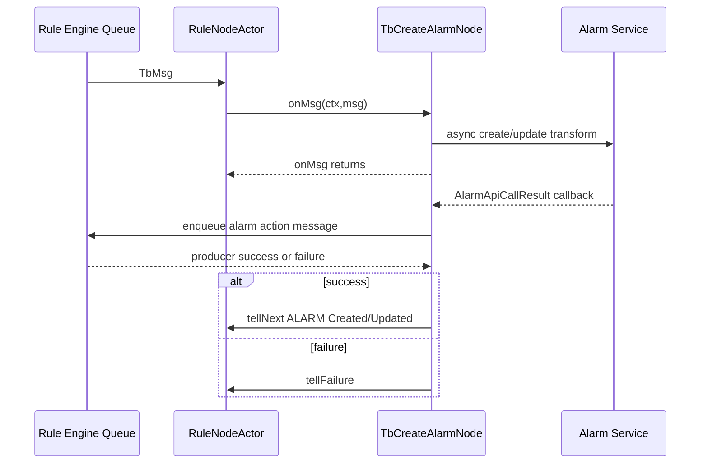

### 8.2 Device Profile Node

`TbDeviceProfileNode` 需要 Actor 的原因不是 Alarm DAO 本身，而是它持有长期可变状态：

- `Map<DeviceId, DeviceState>`；
- 每个 profile alarm 的 `AlarmState`；
- latest value snapshot；
- repeat/duration 累计值；
- 当前 active Alarm；
- profile/device listener 产生的 self-message。

Actor mailbox 让 profile update、device update 和业务消息进入同一节点入口，但 `deviceStates` 仍使用 `ConcurrentHashMap`，且 DAO/Timeseries Future 可能在其他 executor 完成。分区变化时节点移除不再属于本服务的 device state，并可从 `rule_node_state` 重新预热。

### 8.3 callback 差异

| 路径 | 原消息完成 | 新告警消息可靠性 |
|---|---|---|
| 显式 Node | action message producer 成功后才继续 `Created/Updated` | producer 失败可让原消息走 Failure |
| Device Profile | 同步评估与 Alarm 调用成功后才 `tellSuccess`；异常上抛时不会调用 | `enqueueForTellNext` 无业务 callback，异步 producer 失败只记录日志 |

---

## 九、Kafka 分析

Alarm 创建不要求 Kafka；ThingsBoard 默认 Queue provider 可以是 in-memory。启用 Kafka 时，下面两类消息可能进入 Rule Engine Queue：

| Producer | 消息 | key/partition 依据 | Consumer |
|---|---|---|---|
| `EntityActionService` | REST `ENTITY_CREATED/ENTITY_UPDATED` | Alarm originator entity | `TbRuleEngineQueueConsumerManager` |
| `TbAbstractAlarmNode.tellNext` | Alarm action message | originator + target profile | Rule Engine consumer |
| `AlarmState.pushMsg` | `TbMsgType.ALARM` relation message | originator/queue name | Rule Engine consumer |

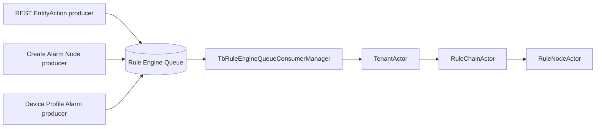

### 9.1 不是 exactly-once

1. Alarm 数据库提交先于 Rule Engine action 入队；producer 失败可留下“有 Alarm、无事件”。
2. Queue retry 可重放 Rule Node；数据库 create-or-update 会降低重复 INSERT 概率，但首次并发窗口和非幂等外部副作用仍存在。
3. Main Queue 默认 `SKIP_ALL_FAILURES` 时，Rule Node failure 可能被 commit，不会自动 Kafka retry。
4. Device Profile 的原 telemetry callback 与额外 Alarm 消息 callback 不绑定，原消息成功不代表 Alarm 消息已消费。

### 9.2 Topic 与 group

具体 topic、logical partitions、consumer group 和 retry 策略继承消息所在 Queue 配置，详见 [05 Rule Chain 执行流程](../05-rule-chain-execution/README.md)。Alarm 模块没有单独定义一个固定的“Alarm Kafka Topic”。

---

## 十、数据库分析

### 10.1 PostgreSQL 表关系

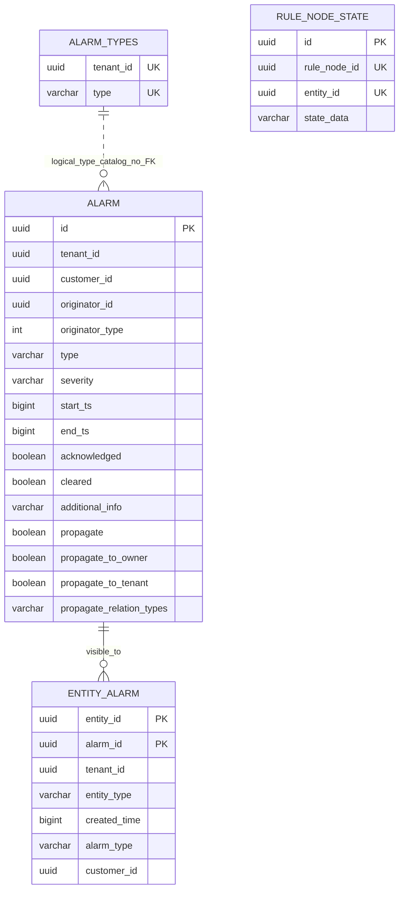

`alarm` 只有 `id` 主键，没有 tenant/customer/originator/assignee 外键。`entity_alarm` 的 `(entity_id,alarm_id)` 是主键，只有 `alarm_id -> alarm(id) ON DELETE CASCADE` 外键。`alarm_types` 以 `(tenant_id,type)` 唯一。

### 10.2 索引与查询目的

| 索引 | 用途 | 关键事实 |
|---|---|---|
| `(originator_id,type,start_ts DESC)` | 查最新同类型 Alarm | 普通索引 |
| `(originator_id,type) WHERE cleared=false` | 查 active Alarm | **非唯一** partial index |
| `(tenant_id,type) WHERE cleared=false` | tenant active type 查询 | 非唯一 |
| `(tenant_id,entity_id,created_time DESC)` | 某实体告警分页 | `entity_alarm` |
| `(tenant_id,entity_id,alarm_type,created_time DESC) INCLUDE(alarm_id)` | 类型过滤并覆盖 alarm_id | PostgreSQL INCLUDE index |
| `(alarm_id)` | 从 Alarm 找传播记录 | `entity_alarm` |

### 10.3 并发首次创建窗口

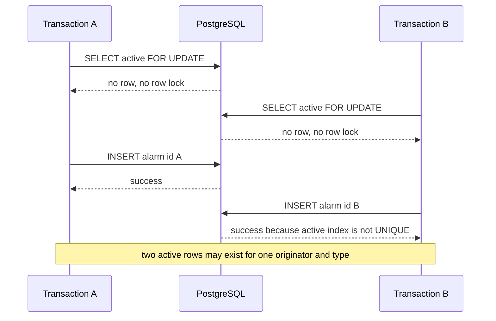

PostgreSQL 没有 InnoDB next-key gap lock 语义来自动保护“尚不存在的查重键”。要把设计意图升级成数据库保证，需要 unique partial index 或显式 advisory/key lock，再配合冲突处理；这属于架构修改，本章只陈述 3.6 源码现状。

### 10.4 为什么不写 TimescaleDB/Cassandra

Alarm 是低频、有明确当前状态、需要关系过滤、分页、指派和事务更新的实体；不是只追加时序点。TimescaleDB/Cassandra 仍可能保存触发它的 telemetry，但 Alarm 自身写 PostgreSQL entity schema。

### 10.5 Redis

Alarm 主体没有在本流程中使用 Redis 缓存。Alarm type 默认页使用 `TbTransactionalCache`，具体 provider 可由部署配置决定；关系查询也可能使用关系缓存。Redis 故障不会把 Alarm 主行切换为 Redis 存储。

---

## 十一、异常处理

| 失败点 | 当前行为 | 已完成副作用 | 生产风险 |
|---|---|---|---|
| REST 权限/校验失败 | 4xx | 无 Alarm | 客户端修正请求 |
| creation quota disabled 且无 active | `ApiUsageLimitsExceededException` | 无新 Alarm | REST 通用映射可能表现为 GENERAL/500 |
| PostgreSQL function 失败 | 异常上抛 | 取决于数据库事务 | Rule Node 走 Failure；REST 失败 audit |
| 并发首次创建 | 可能两次成功 | 两条 active Alarm | 查询/通知重复 |
| `entity_alarm` 单条 save 失败 | 仅 warning，继续 | Alarm 已成功 | 部分实体看不到告警 |
| relation query 失败 | `RuntimeException` | Alarm 已成功 | API/Rule Node 报失败但主行存在 |
| WS callback 失败 | 异步日志 | Alarm 已成功 | Dashboard 短时不刷新 |
| Alarm notification 失败 | 异步处理失败 | Alarm 已成功 | 通知缺失 |
| severity comment 失败 | 捕获并记录 | Alarm 已更新 | 审计式评论缺失 |
| REST EntityAction 入队失败 | 捕获 warning | Alarm 已成功 | Root Rule Chain 不知道此动作 |
| audit save 失败 | Future 不被等待 | Alarm 和 action 可能成功 | 审计缺口 |
| 显式 Node action message 入队失败 | 当前 msg `tellFailure` | Alarm 已成功 | Queue retry 可能再次更新 Alarm |
| Device Profile ALARM 入队失败 | 只记录 producer 失败 | Alarm 与原消息 success | 下游 Alarm relation 丢失 |

### 11.1 生产检查项

1. 监控同一 `originator_id,type` 存在多条 `cleared=false` 的数据。
2. 监控 `alarm` 无 originator `entity_alarm` 的孤立可见性情况。
3. 对关键通知建立补偿查询，不把 WebSocket/notification 当作数据库提交的一部分。
4. Rule Queue retry 前确认 Alarm 节点及下游外部动作是否幂等。
5. Profile 改 alarm id/type/clear rule 时，制定旧 active Alarm 清理策略。
6. 不要依赖关闭 propagation 自动删除旧 `entity_alarm`。

### 11.2 核查 SQL

```sql
-- 查找违反“每个 originator + type 只有一条 active alarm”设计意图的数据
SELECT originator_id, type, count(*)
FROM alarm
WHERE cleared = false
GROUP BY originator_id, type
HAVING count(*) > 1;

-- 查找缺少 originator 可见性记录的 alarm
SELECT a.id, a.originator_id, a.type
FROM alarm a
LEFT JOIN entity_alarm ea
  ON ea.alarm_id = a.id AND ea.entity_id = a.originator_id
WHERE ea.alarm_id IS NULL;
```

---

## 十二、源码阅读路线

1. [`AlarmController.saveAlarm(Alarm)`](../../../application/src/main/java/org/thingsboard/server/controller/AlarmController.java#L202)：先确认 REST 权限和 id 分支。
2. [`DefaultTbAlarmService.save(Alarm,User)`](../../../application/src/main/java/org/thingsboard/server/service/entitiy/alarm/DefaultTbAlarmService.java#L76)：看 REST 如何串联 create、ack、clear、assign 和 EntityAction。
3. [`DefaultAlarmSubscriptionService.createAlarm(...)`](../../../application/src/main/java/org/thingsboard/server/service/telemetry/DefaultAlarmSubscriptionService.java#L112)：区分同步持久化与异步订阅。
4. [`BaseAlarmService.createAlarm(...)`](../../../dao/src/main/java/org/thingsboard/server/dao/alarm/BaseAlarmService.java#L166)：看 customer 不变量和传播入口。
5. [`JpaAlarmDao.createOrUpdateActiveAlarm(...)`](../../../dao/src/main/java/org/thingsboard/server/dao/sql/alarm/JpaAlarmDao.java#L505)：看 Java 参数如何进入 native function。
6. [`create_or_update_active_alarm(...)`](../../../dao/src/main/resources/sql/schema-views-and-functions.sql#L75)：精读锁、INSERT、UPDATE 和 JSON 返回。
7. [`alarm/entity_alarm DDL`](../../../dao/src/main/resources/sql/schema-entities.sql#L43) 与 [`索引`](../../../dao/src/main/resources/sql/schema-entities-idx.sql#L17)：验证约束到底在哪里。
8. [`BaseAlarmService.createEntityAlarmRecords(...)`](../../../dao/src/main/java/org/thingsboard/server/dao/alarm/BaseAlarmService.java#L315)：理解 propagation 不是 EntityRelation。
9. [`DefaultAlarmSubscriptionService.withWsCallback(...)`](../../../application/src/main/java/org/thingsboard/server/service/telemetry/DefaultAlarmSubscriptionService.java#L449)：确认 WS/notification/comment 边界。
10. [`TbAbstractAlarmNode.onMsg(...)`](../../../rule-engine/rule-engine-components/src/main/java/org/thingsboard/rule/engine/action/TbAbstractAlarmNode.java#L94)：看 callback 和 relation。
11. [`TbCreateAlarmNode.processAlarm(...)`](../../../rule-engine/rule-engine-components/src/main/java/org/thingsboard/rule/engine/action/TbCreateAlarmNode.java#L118)：看显式 Rule Node 的前置查询和脚本。
12. [`TbDeviceProfileNode.onMsg(...)`](../../../rule-engine/rule-engine-components/src/main/java/org/thingsboard/rule/engine/profile/TbDeviceProfileNode.java#L147)：建立 Device Profile 总入口。
13. [`DeviceState.process(...)`](../../../rule-engine/rule-engine-components/src/main/java/org/thingsboard/rule/engine/profile/DeviceState.java#L206)：看快照、消息分派和 state save。
14. [`AlarmState.createOrClearAlarms(...)`](../../../rule-engine/rule-engine-components/src/main/java/org/thingsboard/rule/engine/profile/AlarmState.java#L175)：读 severity 与 clear 顺序。
15. [`AlarmRuleState.eval(...)`](../../../rule-engine/rule-engine-components/src/main/java/org/thingsboard/rule/engine/profile/AlarmRuleState.java#L191)：最后读 schedule/repeat/duration 细节。

下一章进入 Alarm 清除流程，重点连接 `clear_alarm(...)`、状态变换、Profile 内存状态修正、Rule Engine `ALARM_CLEAR` 和 Edge action。

---

## 十三、常见面试题

### 1. ThingsBoard 的 `createAlarm` 是纯 INSERT 吗？

不是。它按 `originator_id + type + cleared=false` 查 active Alarm；存在则更新原行，不存在才创建。

### 2. 去重由唯一索引保证吗？

不是。3.6 DDL 的 active partial index 是非唯一索引。已有行更新受 `FOR UPDATE` 保护，首次并发创建仍可能插入两条 active Alarm。

### 3. 为什么 PostgreSQL `FOR UPDATE` 没像 MySQL RR next-key lock 一样挡住首次并发创建？

它锁的是查到的 tuple，不锁不存在的业务键范围。当前 SQL/索引没有 unique conflict 或 advisory lock 来封锁空键。

### 4. `entity_alarm` 是什么？

它是 Alarm 到受影响实体的可见性反向索引。查询某 Device/Asset/Customer/Tenant 的告警时先按 affected entity 找 `entity_alarm`，再关联 Alarm；它不是 `relation` 表记录。

### 5. 关闭 propagation 会删除旧 `entity_alarm` 吗？

不会。源码在创建或传播变化时只补写当前集合，没有删除旧集合的差集。

### 6. Alarm 为什么不写 TimescaleDB？

Alarm 是可变状态实体，需要 ACK/CLEAR/ASSIGN、关系可见性、事务更新和分页；触发它的 telemetry 才是时序数据。

### 7. REST 创建和 Rule Node 创建完全等价吗？

持久化主线相同，但 REST 有权限、用户审计和 EntityAction；Rule Node 依赖 `TbContext`，没有 REST audit，并自行决定下游 relation/callback。

### 8. Create Alarm Node 的 `Created` 是否表示所有通知都完成？

不是。它表示 Alarm 已持久化且 entity-action message producer 成功，随后才向本节点下游发送 `ALARM` message；WS、notification 和新 action message 的消费不在这个完成条件内。

### 9. Device Profile 为什么需要 `rule_node_state`？

Repeating 和 duration 规则跨消息累计。节点重启或分区迁移时，需要按 `(rule_node_id,device_id)` 恢复累计状态。

### 10. Device Profile 告警会阻塞原 telemetry 消息吗？

它同步执行 Alarm service，因此快照、规则评估或 create/update/clear 异常会跳过原消息 `tellSuccess`。正常完成时，原消息成功与额外 ALARM message 使用不同入队路径，二者的 Queue 完成语义不绑定。

### 11. `AlarmStatus` 存在 `alarm.status` 列吗？

不存在。数据库 `alarm_info` 视图和 Java 都根据 `acknowledged/cleared` 计算状态。

### 12. Alarm 主行成功后，`entity_alarm` 一定完整吗？

不一定。创建主链没有覆盖两者的显式外层事务，传播逐条 save，单条异常还会被捕获为 warning。

### 13. 创建额度关闭后，已有 active Alarm 还能更新吗？

能。数据库函数只在“没有 active 行、准备 INSERT”时检查 `a_creation_enabled`。

### 14. 多严重级 Device Profile rule 如何选择？

按 CRITICAL 到 INDETERMINATE 顺序取第一个 TRUE。已有告警允许升级和同级更新，不允许降级。

### 15. REST 无 id 请求命中旧 active Alarm 时会发生什么？

数据库把它当更新，WS/AlarmTrigger依据结果处理；但 `DefaultTbAlarmService` 的 ActionType 在调用前已按无 id 选成 `ADDED`，EntityAction/audit 语义可能仍是 ADDED。

---

[上一篇：05 Rule Chain 执行流程](../05-rule-chain-execution/README.md) | [返回目录](../../SUMMARY.md) | [下一篇：07 Alarm 清除流程](../07-alarm-clear/README.md)
