# 07 Alarm 清除流程

> 源码基线：ThingsBoard `3.6.4`，行为提交 `0cb411fc90`；源码链接已按当前 `release-3.6` 工作树行号校准。本章讨论 CLEAR，并用 ACK 对照状态机；Alarm 删除、指派和查询另章展开。

[上一篇：06 Alarm 创建流程](../06-alarm-create/README.md) | [HTML 版](index.html) | [全书目录](../../SUMMARY.md) | [PlantUML 源文件](sequence.puml) | [时序图 SVG](sequence.svg) | [架构图 SVG](../../assets/architecture/07-alarm-clear.svg) | [下一篇：08 Attributes 保存流程（待分析）](../../SUMMARY.md#chapter-08)

---

## 一、流程目标

Alarm 清除流程把一条活动告警从 `cleared=false` 转换成 `cleared=true`，记录 `clear_ts`，并把新的状态传播给订阅、通知、Rule Engine 和 Edge。CLEAR 是状态转换，不是 DELETE：`alarm` 主行、`entity_alarm` 可见性索引和历史评论仍然保留，因此仪表盘可以继续查询已清除告警。

### 1.1 四条清除路径并不等价

| 路径 | 直接入口 | Root `ALARM_CLEAR` | 当前节点清除关系 | WS / `AlarmTrigger` | 用户评论 / Audit | Edge |
|---|---|---|---|---|---|---|
| REST | `POST /api/alarm/{alarmId}/clear` | 有，由 `EntityActionService` 入队 | 无 | 首次清除有 | 首次清除有 SYSTEM comment、comment action 和 clear action | 有 |
| 显式 Clear Alarm Node | `TbClearAlarmNode.onMsg(...)` | 有，先等待 producer handoff | 有，`Cleared` | 首次清除有 | 无 REST 用户审计；无自动 CLEAR comment | 有 |
| Device Profile 自动清除 | telemetry/attribute/activity/周期检查 | **无** | 有，`Alarm Cleared` | 首次清除有 | 无 | 有 |
| Edge 上行清除 | gRPC `ALARM_CLEAR_RPC_MESSAGE` | **无** | 无 | **绕过 Subscription，无** | 无 | 转发其他相关 Edge，排除来源 Edge |

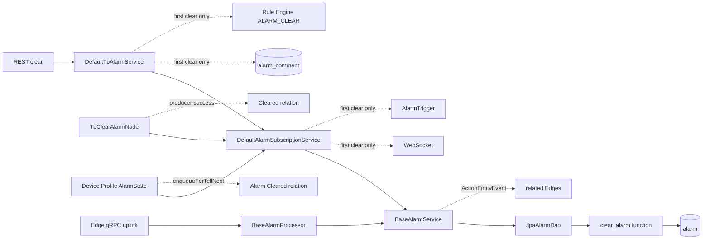

### 1.2 CLEAR、ACK 与 DELETE 的区别

| 操作 | 数据库字段 | 主行是否存在 | `entity_alarm` | 可否继续查询历史 | 新同类型 active Alarm |
|---|---|---|---|---|---|
| CLEAR | `cleared=true, clear_ts=...` | 保留 | 保留 | 可以 | `create_or_update_active_alarm(...)` 可创建新 id |
| ACK | `acknowledged=true, ack_ts=...` | 保留 | 保留 | 可以 | 不影响 active 判定 |
| DELETE | 删除 `alarm` | 删除 | 外键级联删除 | 不可按原 Alarm 查询 | 不受旧行影响 |

`AlarmStatus` 不是独立数据库列。Java [`Alarm.toStatus(boolean,boolean)`](../../../common/data/src/main/java/org/thingsboard/server/common/data/alarm/Alarm.java#L266) 和 PostgreSQL [`alarm_info` view](../../../dao/src/main/resources/sql/schema-views-and-functions.sql#L42) 都根据 `acknowledged/cleared` 计算四种状态。

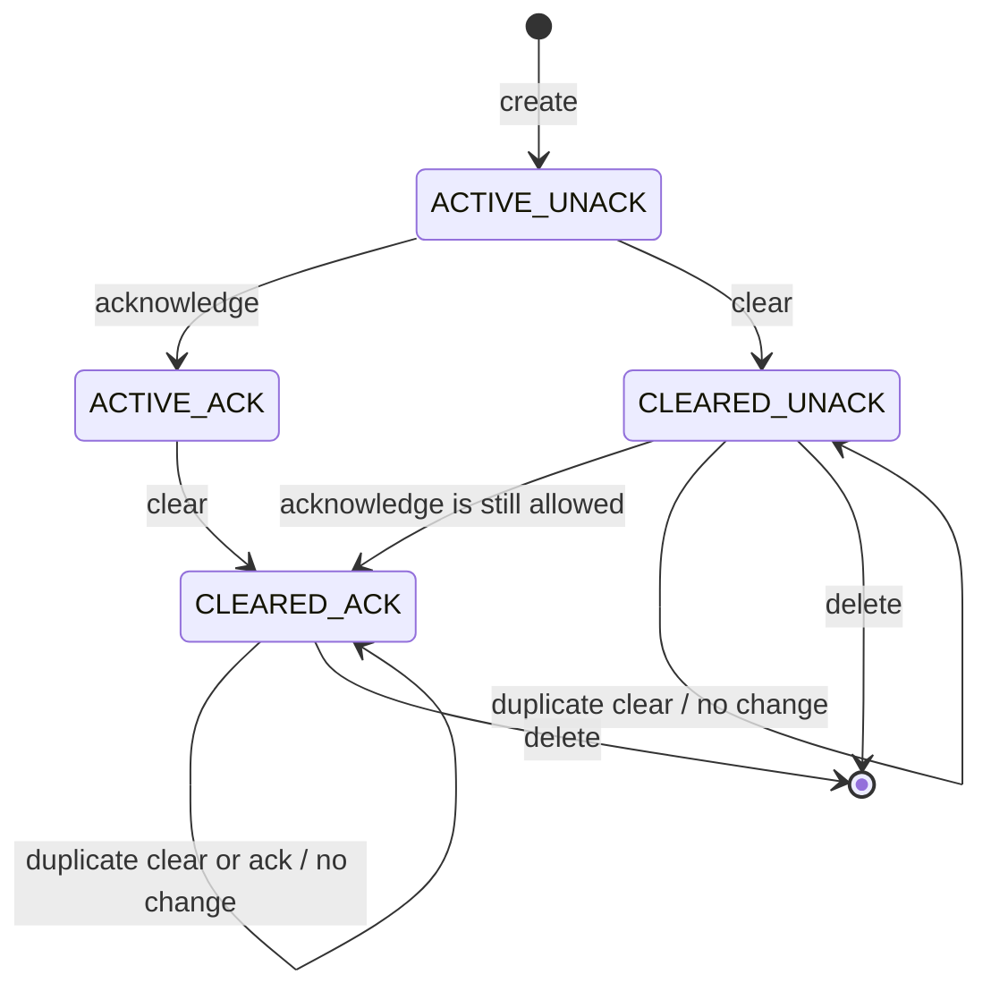

### 1.3 本章核心结论

1. `clear_alarm(...)` 用 `(tenant_id,id) FOR UPDATE` 串行化同一 Alarm 的 CLEAR/ACK 操作，首次清除更新，重复清除返回成功但 `cleared=false`。
2. `JpaAlarmDao` 把 SQL 的 `cleared=true` 同时映射为 `modified=true`；因此 WebSocket 和 `AlarmTrigger` 只在首次清除触发。
3. `BaseAlarmService` 只要查到 Alarm 就发布 `ActionEntityEvent(ALARM_CLEAR)`，包括重复清除；REST 随后才把重复清除转换成 400。
4. Alarm 行更新、WebSocket、通知、评论、Rule Engine Queue、audit 和 Edge 没有一个共同事务，也没有 transactional outbox。
5. Clear Alarm Node 的 `Cleared` 表示数据库已清除且 root action message producer 成功，不表示该 action 已消费，也不表示通知或 Edge 已完成。

---

## 二、入口

### 2.1 REST

[`org.thingsboard.server.controller.AlarmController.clearAlarm(String)`](../../../application/src/main/java/org/thingsboard/server/controller/AlarmController.java#L265) 对应：

```text
POST /api/alarm/{alarmId}/clear
Authority: TENANT_ADMIN or CUSTOMER_USER
```

Controller 先通过 `checkAlarmId(alarmId, Operation.WRITE)` 做租户/客户可见性和写权限检查，再交给应用服务。普通 UI 清除操作走这条路径。

### 2.2 显式 Rule Node

[`org.thingsboard.rule.engine.action.TbClearAlarmNode.processAlarm(TbContext,TbMsg)`](../../../rule-engine/rule-engine-components/src/main/java/org/thingsboard/rule/engine/action/TbClearAlarmNode.java#L80) 可由任意进入该节点的 `TbMsg` 触发：

- 消息 originator 是 `ALARM`：按 AlarmId 查询；
- 其他 originator：解析配置中的 alarm type pattern，查询该实体最新 active Alarm；
- 找不到或已经 cleared：走 `False`；
- 找到 active Alarm：执行 JS/TBEL details 脚本后清除。

MQTT、HTTP、CoAP 或 LwM2M 并不直接调用 Alarm DAO；它们产生的业务消息只有被规则链路由到 Clear Alarm Node 时才进入此路径。

### 2.3 Device Profile Alarm Rule 与 Scheduler

[`org.thingsboard.rule.engine.profile.AlarmState.createOrClearAlarms(...)`](../../../rule-engine/rule-engine-components/src/main/java/org/thingsboard/rule/engine/profile/AlarmState.java#L175) 在以下消息更新设备快照后评估 clear condition：

- `POST_TELEMETRY_REQUEST`；
- `POST_ATTRIBUTES_REQUEST`、`ATTRIBUTES_UPDATED/DELETED`；
- `ACTIVITY_EVENT/INACTIVITY_EVENT`；
- `DEVICE_PROFILE_PERIODIC_SELF_MSG`，由 [`TbDeviceProfileNode.scheduleAlarmHarvesting(...)`](../../../rule-engine/rule-engine-components/src/main/java/org/thingsboard/rule/engine/profile/TbDeviceProfileNode.java#L242) 每分钟调度。

只有所有 create rules 都没有得到 TRUE、`currentAlarm != null` 且配置了 clear rule，才会评估清除条件。

### 2.4 Edge gRPC

Edge 的 `AlarmUpdateMsg` 由 [`EdgeGrpcSession.processUplinkMsg(UplinkMsg)`](../../../application/src/main/java/org/thingsboard/server/service/edge/rpc/EdgeGrpcSession.java#L897) 收集 Future，再调用 [`AlarmEdgeProcessor.processAlarmMsgFromEdge(TenantId,EdgeId,AlarmUpdateMsg)`](../../../application/src/main/java/org/thingsboard/server/service/edge/rpc/processor/alarm/AlarmEdgeProcessor.java#L67)。`ALARM_CLEAR_RPC_MESSAGE` 最终直接使用 DAO `AlarmService`，不经过 `DefaultTbAlarmService` 或 `DefaultAlarmSubscriptionService`。

### 2.5 不是直接入口的组件

| 组件 | 与 CLEAR 的关系 |
|---|---|
| MQTT/CoAP/LwM2M Transport | 只提供上游 telemetry/attribute，是否清除由规则链决定 |
| Cassandra/TimescaleDB | 不保存 Alarm 状态，不参与 CLEAR |
| Redis | 本流程不把 Alarm 主状态写入 Redis |
| WebSocket | 是首次状态变化后的消费者，不是清除入口 |
| Kafka Consumer | 消费 Rule Engine/Core Queue 消息；数据库状态转换不依赖 Kafka provider |

---

## 三、完整调用链

### 3.1 REST 首次清除

| 步骤 | 类与方法 | 源码 | 输入 -> 输出 | 职责与设计原因 |
|---|---|---|---|---|
| 1 | `org.thingsboard.server.controller.AlarmController.clearAlarm(String)` | [L265](../../../application/src/main/java/org/thingsboard/server/controller/AlarmController.java#L265) | path AlarmId -> `AlarmInfo` | HTTP 权限和参数边界 |
| 2 | `org.thingsboard.server.controller.BaseController.checkAlarmId(AlarmId,Operation)` | [L1039](../../../application/src/main/java/org/thingsboard/server/controller/BaseController.java#L1039) | AlarmId + WRITE -> `Alarm` | 统一实体查询与授权 |
| 3 | `org.thingsboard.server.service.entitiy.alarm.DefaultTbAlarmService.clear(Alarm,User)` | [L160](../../../application/src/main/java/org/thingsboard/server/service/entitiy/alarm/DefaultTbAlarmService.java#L160) | Alarm + current user -> overload | 使用服务器时间 |
| 4 | `DefaultTbAlarmService.clear(Alarm,long,User)` | [L173](../../../application/src/main/java/org/thingsboard/server/service/entitiy/alarm/DefaultTbAlarmService.java#L173) | clear timestamp -> `AlarmInfo` | 编排持久化、comment、EntityAction |
| 5 | `org.thingsboard.server.service.telemetry.DefaultAlarmSubscriptionService.clearAlarm(TenantId,AlarmId,long,JsonNode)` | [L155](../../../application/src/main/java/org/thingsboard/server/service/telemetry/DefaultAlarmSubscriptionService.java#L155) | id/time/details -> `AlarmApiCallResult` | 复用 Rule Engine 与 REST 的订阅编排 |
| 6 | `org.thingsboard.server.dao.alarm.BaseAlarmService.clearAlarm(TenantId,AlarmId,long,JsonNode)` | [L215](../../../dao/src/main/java/org/thingsboard/server/dao/alarm/BaseAlarmService.java#L215) | DAO request -> result + propagated ids | DAO service 边界并发布 Edge action event |
| 7 | `org.thingsboard.server.dao.sql.alarm.JpaAlarmDao.clearAlarm(TenantId,AlarmId,long,JsonNode)` | [L571](../../../dao/src/main/java/org/thingsboard/server/dao/sql/alarm/JpaAlarmDao.java#L571) | JsonNode -> JSON string parameter | 适配 Java 与 native function |
| 8 | `org.thingsboard.server.dao.sql.alarm.AlarmRepository.clearAlarm(UUID,UUID,long,String)` | [L512](../../../dao/src/main/java/org/thingsboard/server/dao/sql/alarm/AlarmRepository.java#L512) | scalar params -> JSON text | Spring Data native query |
| 9 | PostgreSQL `clear_alarm(uuid,uuid,bigint,varchar)` | [L214](../../../dao/src/main/resources/sql/schema-views-and-functions.sql#L214) | tenant/id/time/details -> JSON | 单 SQL statement 内锁行并完成条件更新 |
| 10 | `JpaAlarmDao.toAlarmApiResult(String)` | [L691](../../../dao/src/main/java/org/thingsboard/server/dao/sql/alarm/JpaAlarmDao.java#L691) | JSON -> typed result | `cleared` 同时形成 `modified` |
| 11 | `BaseAlarmService.withPropagated(AlarmApiCallResult)` | [L723](../../../dao/src/main/java/org/thingsboard/server/dao/alarm/BaseAlarmService.java#L723) | result -> propagation list | 清除不重建可见性记录，读取既有集合 |
| 12 | `BaseAlarmService.clearAlarm(...)` | [L217](../../../dao/src/main/java/org/thingsboard/server/dao/alarm/BaseAlarmService.java#L217) | result Alarm -> `ActionEntityEvent` | 让 Edge 同步与应用编排解耦 |
| 13 | `DefaultAlarmSubscriptionService.withWsCallback(AlarmApiCallResult)` | [L438](../../../application/src/main/java/org/thingsboard/server/service/telemetry/DefaultAlarmSubscriptionService.java#L438) | result -> same result | 仅 `successful && modified` 时异步回调 |
| 14 | `DefaultAlarmSubscriptionService.onAlarmUpdated(AlarmApiCallResult)` | [L358](../../../application/src/main/java/org/thingsboard/server/service/telemetry/DefaultAlarmSubscriptionService.java#L358) | first-clear result -> WS/Core + trigger | 向每个 propagated entity 推送并处理 `AlarmTrigger` |
| 15 | `org.thingsboard.server.service.notification.rule.trigger.AlarmTriggerProcessor.matchesFilter(...)` | [L54](../../../application/src/main/java/org/thingsboard/server/service/notification/rule/trigger/AlarmTriggerProcessor.java#L54) | clear result + rule config -> boolean | 只匹配配置了 `CLEARED` 的告警通知规则 |
| 16 | `DefaultTbAlarmService.addSystemAlarmComment(...)` | [L342](../../../application/src/main/java/org/thingsboard/server/service/entitiy/alarm/DefaultTbAlarmService.java#L342) | CLEAR text -> `AlarmComment` | 留下用户操作历史，失败不回滚 Alarm |
| 17 | `org.thingsboard.server.service.entitiy.alarm.DefaultTbAlarmCommentService.saveAlarmComment(Alarm,AlarmComment,User)` | [L61](../../../application/src/main/java/org/thingsboard/server/service/entitiy/alarm/DefaultTbAlarmCommentService.java#L61) | SYSTEM comment -> saved row | 触发 comment Rule Engine、notification、audit、Edge |
| 18 | `org.thingsboard.server.service.entitiy.DefaultTbNotificationEntityService.logEntityAction(...)` | [L145](../../../application/src/main/java/org/thingsboard/server/service/entitiy/DefaultTbNotificationEntityService.java#L145) | `ALARM_CLEAR` + user -> action service | 统一用户动作入口 |
| 19 | `org.thingsboard.server.service.action.EntityActionService.logEntityAction(...)` | [L275](../../../application/src/main/java/org/thingsboard/server/service/action/EntityActionService.java#L275) | entity action -> Queue + audit Future | Queue 和 audit 均不参与 Alarm transaction |
| 20 | `EntityActionService.pushEntityActionToRuleEngine(...)` | [L90](../../../application/src/main/java/org/thingsboard/server/service/action/EntityActionService.java#L90) | `ActionType.ALARM_CLEAR` -> `TbMsgType.ALARM_CLEAR` | 把清除作为 originator 的 root Rule Engine 消息 |

注意真实顺序：数据库成功后，`BaseAlarmService` 先发布 Edge `ActionEntityEvent`；Subscription 再调度 WS/AlarmTrigger；REST 应用服务随后保存 comment，最后提交 `ALARM_CLEAR` EntityAction。后几项都是独立调用，实际完成先后不确定。

### 3.2 PostgreSQL `clear_alarm(...)`

```sql
SELECT * INTO existing
FROM alarm a
WHERE a.id = a_id AND a.tenant_id = t_id
FOR UPDATE;

IF existing IS NULL THEN
  return success=false;
END IF;

IF NOT existing.cleared THEN
  cleared = TRUE;
  UPDATE alarm
  SET cleared=true,
      clear_ts=a_ts,
      additional_info=CASE WHEN a_details IS NULL
                           THEN additional_info ELSE a_details END
  WHERE id=a_id AND tenant_id=t_id;
END IF;

return success=true, cleared=cleared, alarm=current_alarm_info;
```

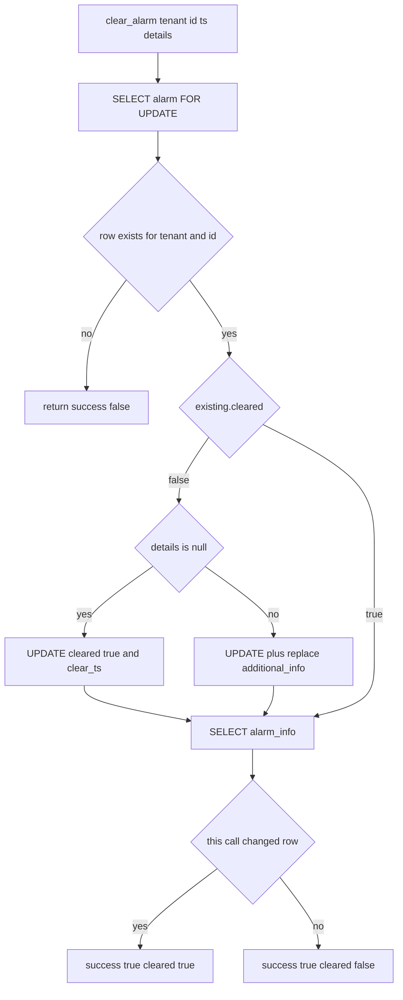

REST 总是传 `details=null`，因此保留已有 details。Clear Alarm Node 和 Device Profile 可传新 details，但只有抢到首次 CLEAR 的调用会覆盖；重复调用不会改 `clear_ts` 或 details。DAO 测试 [`JpaAlarmDaoTest.testClearAlarmProcedure()`](../../../dao/src/test/java/org/thingsboard/server/dao/sql/alarm/JpaAlarmDaoTest.java#L261) 和 [`testClearAlarmWithoutDetailsProcedure()`](../../../dao/src/test/java/org/thingsboard/server/dao/sql/alarm/JpaAlarmDaoTest.java#L294) 明确覆盖这个幂等边界。

### 3.3 显式 Clear Alarm Node

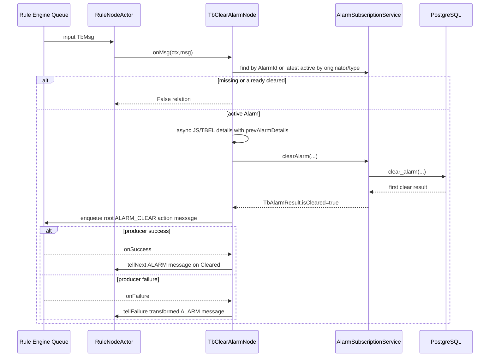

[`TbAbstractAlarmNode.tellNext(...)`](../../../rule-engine/rule-engine-components/src/main/java/org/thingsboard/rule/engine/action/TbAbstractAlarmNode.java#L186) 在数据库成功后才入队 root action。producer 成功后，它通过 [`toAlarmMsg(...)`](../../../rule-engine/rule-engine-components/src/main/java/org/thingsboard/rule/engine/action/TbAbstractAlarmNode.java#L150) 生成 `TbMsgType.ALARM`，保留原 originator，并写入 metadata `isClearedAlarm=true`。

若前置查询看到 active、但另一线程先清除，数据库返回 `cleared=false`。节点此时不会走 `False` 或 `Cleared`，而是落入 `ctx.tellSuccess(msg)`；这是查询与条件更新之间竞争后的正常分支。

### 3.4 Device Profile 自动清除

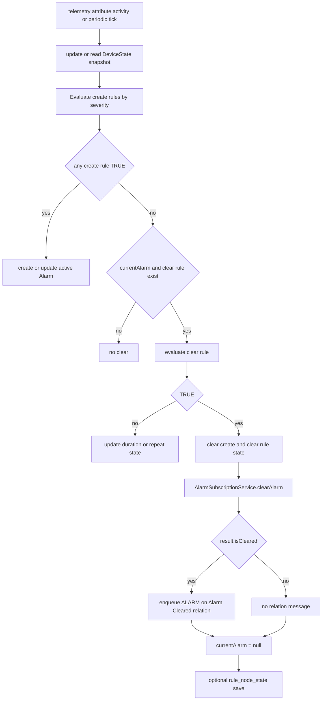

[`AlarmState.pushMsg(...)`](../../../rule-engine/rule-engine-components/src/main/java/org/thingsboard/rule/engine/profile/AlarmState.java#L283) 只产生 `TbMsgType.ALARM` 的 `Alarm Cleared` relation message，不产生独立 root `ALARM_CLEAR` action。它在服务调用返回后无条件把 `currentAlarm=null`。普通 telemetry 路径只有完成同步快照、规则评估和 Alarm service 后，才在 [`DeviceState.processTelemetry(...)`](../../../rule-engine/rule-engine-components/src/main/java/org/thingsboard/rule/engine/profile/DeviceState.java#L393) 调用 `ctx.tellSuccess(msg)`。

外部 root `ALARM_CLEAR` 到达 Device Profile Node 时，[`DeviceState.processAlarmClearNotification(...)`](../../../rule-engine/rule-engine-components/src/main/java/org/thingsboard/rule/engine/profile/DeviceState.java#L262) 会把匹配 AlarmState 的 `currentAlarm` 置空、清理 create-rule 累计状态，并可保存 `rule_node_state`。

### 3.5 Edge 上行清除

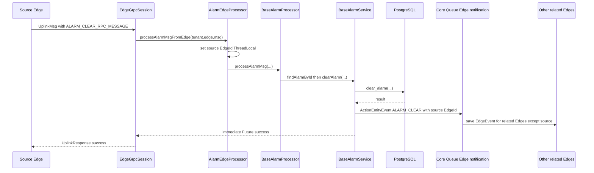

[`BaseAlarmProcessor.processAlarmMsg(...)`](../../../application/src/main/java/org/thingsboard/server/service/edge/rpc/processor/alarm/BaseAlarmProcessor.java#L73) 对 missing Alarm 和重复 CLEAR 都按成功 no-op 返回。DAO 异常则返回 failed Future；[`EdgeGrpcSession.onUplinkMsg(...)`](../../../application/src/main/java/org/thingsboard/server/service/edge/rpc/EdgeGrpcSession.java#L345) 聚合全部 Future 并发送失败响应。

---

## 四、消息流

### 4.1 清除后的分叉

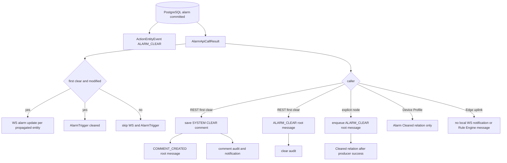

### 4.2 Root action 与 relation message

| 消息 | type | originator | data | 进入位置 | 含义 |
|---|---|---|---|---|---|
| REST/entity action | `ALARM_CLEAR` | Alarm originator | serialized `AlarmInfo` | originator profile 的 root Rule Chain | 对全局清除事件做业务处理，并同步 Device Profile state |
| Clear Alarm Node action | `ALARM_CLEAR` | Alarm originator | serialized Alarm | originator profile | 与 REST root event 同类，但由当前节点等待 producer |
| Clear Alarm Node relation | `ALARM` | 原输入消息 originator | cleared Alarm | 当前节点 `Cleared` relation | 当前规则链分支结果 |
| Device Profile relation | `ALARM` | Device | cleared Alarm | Device Profile Node `Alarm Cleared` relation | profile 条件状态机输出 |

`ALARM_CLEAR` 和 `ALARM` 不能互换。前者是实体动作事件，后者是规则节点局部结果；同时产生两者会形成两条独立 Queue 消息。

### 4.3 重复 REST 清除的反直觉顺序

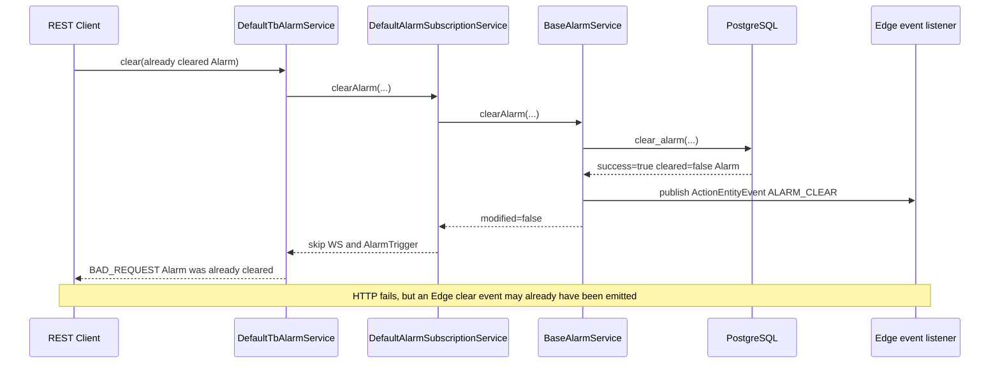

---

## 五、时序图

完整时序图覆盖 REST、显式 Rule Node、Device Profile、Edge 和并发重复清除：

- [PlantUML 源文件](sequence.puml)
- [渲染后的 SVG](sequence.svg)

[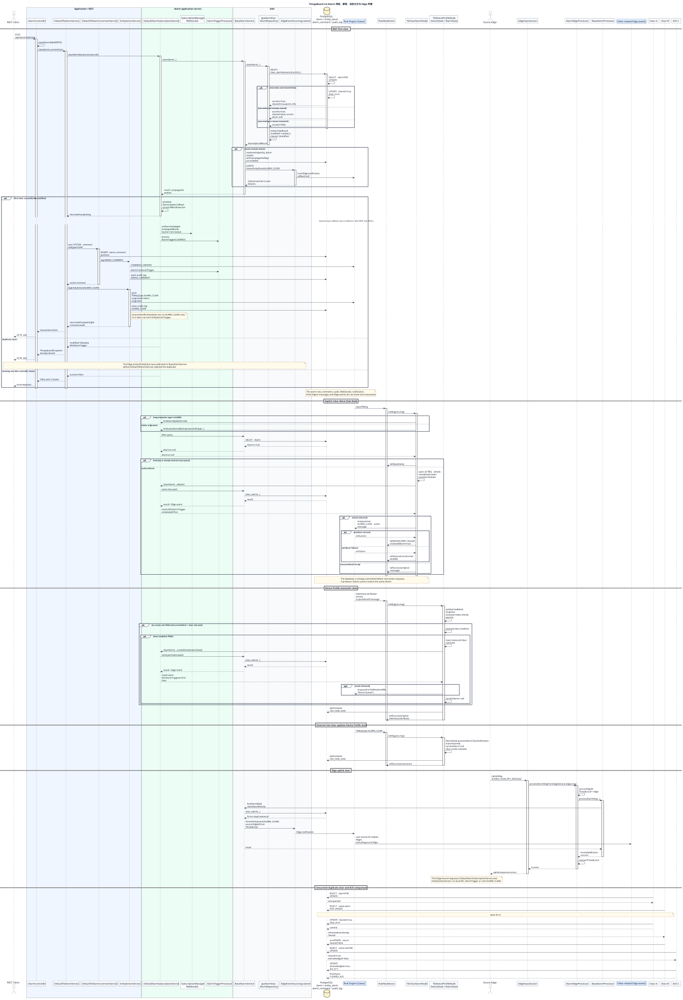](sequence.svg)

PlantUML 中虚线返回表示异步完成或 Future callback；它们不代表同一数据库事务。浏览 HTML 时点击缩略图会在新窗口打开原始 SVG。

---

## 六、数据变化

### 6.1 PostgreSQL

| 表 | 首次 REST CLEAR | Rule Node/Profile CLEAR | Edge CLEAR | 重复 CLEAR |
|---|---|---|---|---|
| `alarm` | `cleared=true, clear_ts=now`，details 保留 | 同样更新；可替换 details | 使用 Edge 时间/details | 不再更新 |
| `entity_alarm` | 不删除、不更新 | 不删除、不更新 | 不删除、不更新 | 不变 |
| `alarm_comment` | 新增 SYSTEM/CLEAR comment | 不自动新增 | 不新增 | REST 不新增 |
| `audit_log` | 可异步新增 comment action 与 `ALARM_CLEAR` 两类记录 | 不由该路径新增用户 audit | 不新增 | REST 不新增 clear audit |
| `edge_event` | 对相关 Edge 异步保存 clear；comment 还可能单独同步 | clear event | 除来源外的相关 Edge | 仍可能产生 clear event |
| `rule_node_state` | root action 到 Device Profile 后可能更新 | 显式 root action后可能更新；Profile 自身可直接更新 | 本地不会因该路径更新 | 取决于是否有 root action |

### 6.2 运行时状态

| 对象 | 变化 |
|---|---|
| `AlarmState.currentAlarm` | Device Profile 自清除直接置 null；收到 root `ALARM_CLEAR` 时按 id 置 null |
| create/clear `AlarmRuleState` | clear condition TRUE 时清空累计；外部 clear notification 清理 create states |
| WebSocket subscription | 首次清除推送 `AlarmSubscriptionUpdate(deleted=false)` |
| Actor | 不创建 Alarm Actor；可能经过 RuleNodeActor/Device Profile Node |
| Session | MQTT/HTTP/CoAP session 不因 CLEAR 改变 |
| Cache | Alarm type cache 不失效；Alarm 主体没有本流程专用 Redis cache |

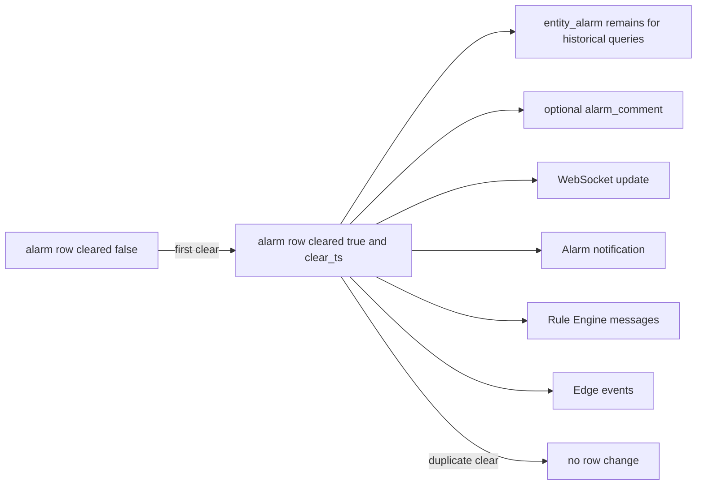

### 6.3 不会变化的数据

- 不删除触发 Alarm 的 telemetry；
- 不写或清理 TimescaleDB/Cassandra；
- 不删除 `alarm_types`；
- 不解除 assignee；
- 不自动删除 Alarm comments；
- 不把 `end_ts` 改成 `clear_ts`。

---

## 七、源码分析

### 7.1 接口与实现关系

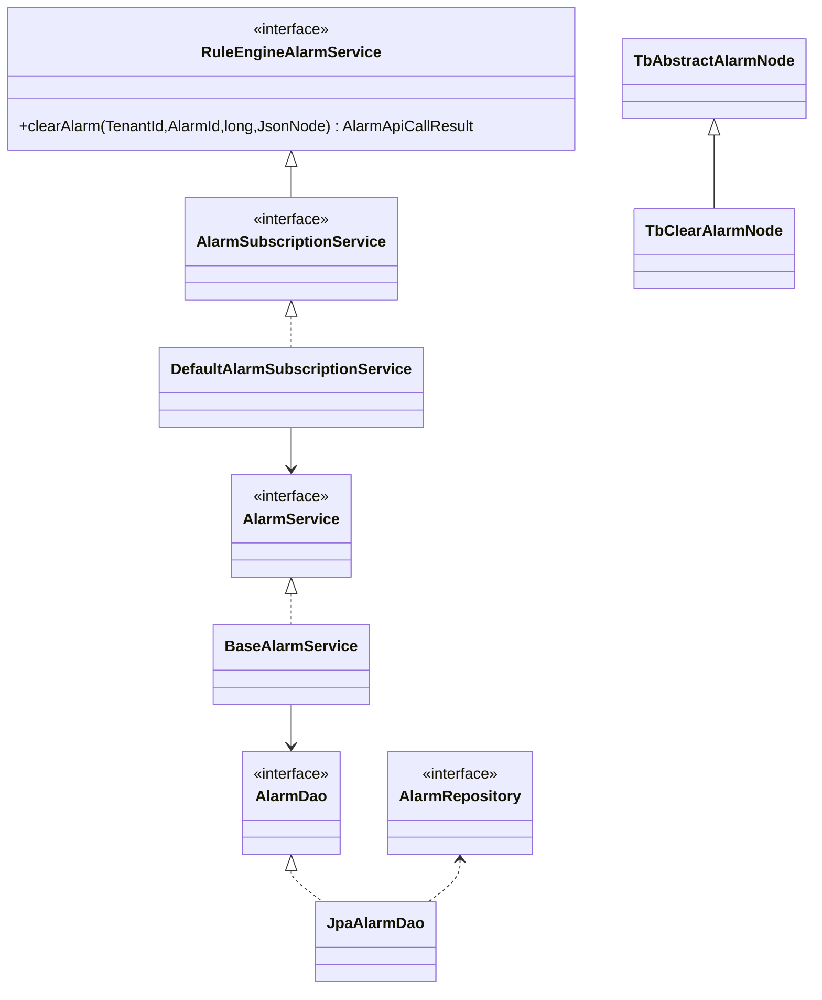

规则节点依赖 [`org.thingsboard.rule.engine.api.RuleEngineAlarmService`](../../../rule-engine/rule-engine-api/src/main/java/org/thingsboard/rule/engine/api/RuleEngineAlarmService.java#L43)，Application 的 [`AlarmSubscriptionService`](../../../application/src/main/java/org/thingsboard/server/service/telemetry/AlarmSubscriptionService.java#L34) 同时实现这层契约和分区事件监听。这样 Rule Engine 不依赖 Application 包，却仍复用订阅编排。

### 7.2 `AlarmApiCallResult` 的三种布尔值

| 场景 | `successful` | `cleared` | `modified` | `alarm` |
|---|---:|---:|---:|---|
| Alarm 不存在/tenant 不匹配 | false | false | false | null |
| 首次 clear | true | true | true | cleared AlarmInfo |
| 重复 clear | true | false | false | 当前 cleared AlarmInfo |

SQL 只返回 `cleared`，而 [`JpaAlarmDao.toAlarmApiResult(...)`](../../../dao/src/main/java/org/thingsboard/server/dao/sql/alarm/JpaAlarmDao.java#L708) 执行 `modified = created || cleared || modified`。上层不能用 `alarm.isCleared()` 判断“本次是否修改”，因为重复调用返回的 Alarm 本身仍是 `cleared=true`；必须看 `result.isCleared()` 或 `result.isModified()`。

### 7.3 行锁、幂等与 CLEAR/ACK 并发

`clear_alarm(...)` 和 [`acknowledge_alarm(...)`](../../../dao/src/main/resources/sql/schema-views-and-functions.sql#L189) 都先锁相同 `(tenant_id,id)` 行。因此同一 Alarm 的两个操作不会丢失彼此字段：

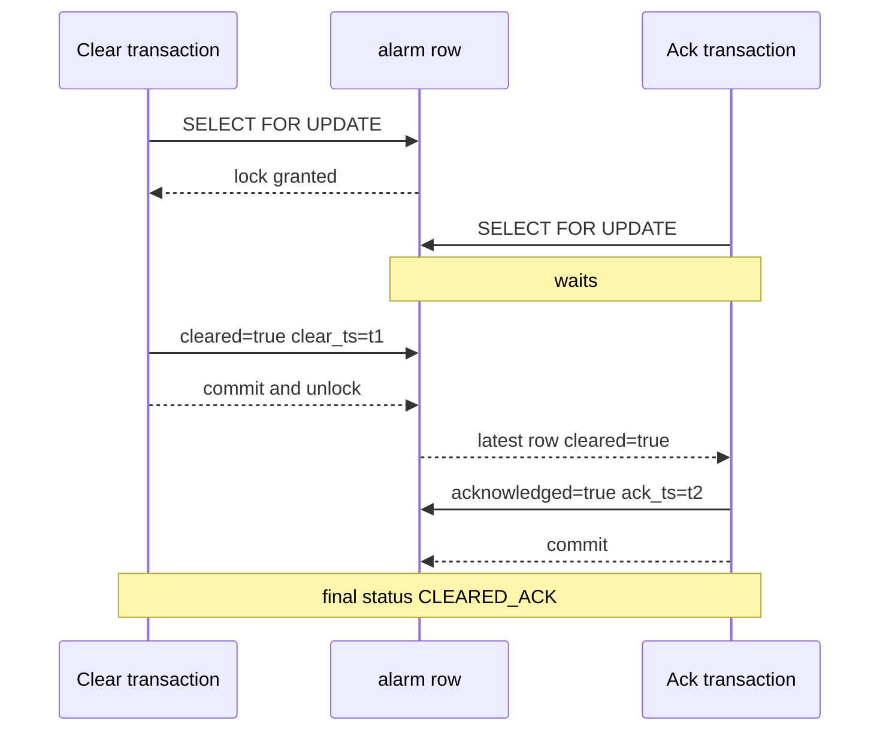

ACK 允许发生在已清除 Alarm 上，所以 `CLEARED_UNACK -> CLEARED_ACK` 合法。两个并发 CLEAR 中，先获得锁者返回 `cleared=true`；后者读取更新后的行并返回 `cleared=false`，且不会覆盖首次 `clear_ts/details`。

### 7.4 CLEAR 与新一代 active Alarm

`create_or_update_active_alarm(...)` 只查 `cleared=false`。如果 CLEAR 先提交，随后同 originator/type 的 create 会插入新 AlarmId；如果 create-or-update 先锁住旧 active 行，它先更新旧行，CLEAR 再清除该行。该顺序是“告警代际”边界，不是数据库异常。

按 id 的 `update_alarm(...)` 不会把 `cleared` 重置为 false；更新已清除 Alarm 只改变 severity/time/details/propagation，不能重新激活它。

### 7.5 传播集合不会在 CLEAR 时重算

[`BaseAlarmService.withPropagated(...)`](../../../dao/src/main/java/org/thingsboard/server/dao/alarm/BaseAlarmService.java#L723) 发现 CLEAR 结果没有 `old`，所以 `isPropagationChanged()` 为 false。若 Alarm 设置任一 propagation flag，它从既有 `entity_alarm` 读取目标；否则直接使用 originator。

这意味着创建阶段漏写或遗留的 `entity_alarm` 会直接影响 CLEAR 的 WS 目标。CLEAR 不修复传播索引，也不删除旧传播记录。

### 7.6 评论不是主事务的一部分

REST 首次清除后构造：

```json
{
  "text": "Alarm was cleared by user <title>",
  "subtype": "CLEAR",
  "userId": "<uuid>"
}
```

comment 类型是 `SYSTEM`。保存失败由 `addSystemAlarmComment(...)` 记录日志，已经提交的 `alarm.cleared` 不回滚；成功保存还会独立产生 `COMMENT_CREATED` Rule Engine message、`AlarmCommentTrigger`、audit 和 Edge comment event。

### 7.7 WebSocket 与 notification 是 fire-and-forget

`withWsCallback(...)` 把一个 immediate Future 的 callback 放入 `wsCallBackExecutor`，callback 又调用 `onAlarmUpdated(...)` 提交任务。调用者不等待：

1. 每个 propagated entity 通过 `AbstractSubscriptionService.forwardToSubscriptionManagerService(...)` 本地调用或发 Core Queue；
2. [`DefaultSubscriptionManagerService.onAlarmUpdate(...)`](../../../application/src/main/java/org/thingsboard/server/service/subscription/DefaultSubscriptionManagerService.java#L455) 再定位拥有 WebSocket session 的服务；
3. [`DefaultTbLocalSubscriptionService.onAlarmUpdate(...)`](../../../application/src/main/java/org/thingsboard/server/service/subscription/DefaultTbLocalSubscriptionService.java#L473) 形成 subscription update；
4. 同一异步任务调用 `NotificationRuleProcessor.process(AlarmTrigger)`。

路径使用 `TbCallback.EMPTY` 或 null callback；清除 API 不感知最终推送失败。

### 7.8 Edge 事件为何重复清除也会发出

[`BaseAlarmService.clearAlarm(...)`](../../../dao/src/main/java/org/thingsboard/server/dao/alarm/BaseAlarmService.java#L215) 判断的是 `result.getAlarm() != null`，不是 `result.isCleared()`。因此重复 CLEAR 仍发布 `ActionEntityEvent(ALARM_CLEAR)`。`EdgeEventSourcingListener` 使用 `@TransactionalEventListener(fallbackExecution=true)`；本方法没有外层 `@Transactional`，事件在 DAO 调用返回后通过 fallback 执行。

Edge 上行时 [`AlarmEdgeProcessor.processAlarmMsgFromEdge(...)`](../../../application/src/main/java/org/thingsboard/server/service/edge/rpc/processor/alarm/AlarmEdgeProcessor.java#L67) 把来源 EdgeId 放入 ThreadLocal。后续 [`pushEventToAllRelatedEdges(...)`](../../../application/src/main/java/org/thingsboard/server/service/edge/rpc/processor/alarm/AlarmEdgeProcessor.java#L209) 明确排除来源 Edge，避免回环。

---

## 八、Actor 分析

### 8.1 哪些步骤经过 Actor

| 路径 | Actor 参与点 | Actor 是否负责数据库事务 |
|---|---|---|
| REST | `ALARM_CLEAR` EntityAction 被 Queue consumer 送入 `AppActor -> TenantActor -> RuleChainActor -> RuleNodeActor` | 否，数据库已先提交 |
| Clear Alarm Node | 当前 `RuleNodeActor` 调用节点；Future 在 DB callback executor 完成 | 否 |
| Device Profile | `TbDeviceProfileNode` 运行在 `RuleNodeActor`，持有 `Map<DeviceId,DeviceState>` | 否 |
| Edge 上行 | gRPC/DAO 路径本身不经过 Rule Engine Actor | 否 |

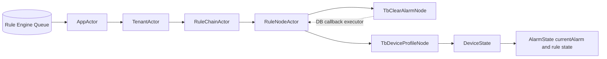

### 8.2 为什么 Device Profile 需要状态

Device Profile Node 需要跨消息保存 latest snapshot、duration/repeat 累计和 `currentAlarm`。Actor mailbox 让 profile update、external `ALARM_CLEAR` 与 telemetry 在节点入口串行路由；可选 `rule_node_state` 让节点迁移或重启后恢复累计状态。

### 8.3 Edge 上行的状态同步缺口

Edge 上行 CLEAR 绕过 `DefaultAlarmSubscriptionService` 和 `EntityActionService`，因此当前服务不会产生 root `ALARM_CLEAR` Rule Engine message。若本服务内已有 Device Profile `currentAlarm`，这条路径本身不会立即调用 `DeviceState.processAlarmClearNotification(...)`；后续 profile 评估可能通过重复 clear 结果或其他消息重新收敛。源码中没有在该 Edge 分支补发本地 Rule Engine 通知。

---

## 九、Kafka 分析

Alarm 清除不要求 Kafka；Queue provider 可为 in-memory、Kafka 等。启用 Kafka 时涉及的是通用 Rule Engine/Core/Edge Queue，而不是固定的“Alarm Clear Topic”。

| Producer | 消息 | key/partition 依据 | Consumer | 完成语义 |
|---|---|---|---|---|
| `EntityActionService` | REST `TbMsgType.ALARM_CLEAR` | Alarm originator | `TbRuleEngineQueueConsumerManager` | callback 为 null，不等待消费 |
| `TbAbstractAlarmNode.tellNext` | root `ALARM_CLEAR` | Alarm originator + profile | Rule Engine consumer | 等 producer 成功才发当前节点 `Cleared` |
| `AlarmState.pushMsg` | relation `TbMsgType.ALARM` | Device/queue name | Rule Engine consumer | `enqueueForTellNext` 与原消息 callback 分离 |
| `AbstractSubscriptionService` | cross-partition Alarm update | tenant + propagated entity | Core consumer / subscription service | `TbCallback.EMPTY` |
| `DefaultTbClusterService` | Edge notification | tenant + AlarmId | Core/Edge consumer | 与 HTTP/Rule Node callback 不绑定 |

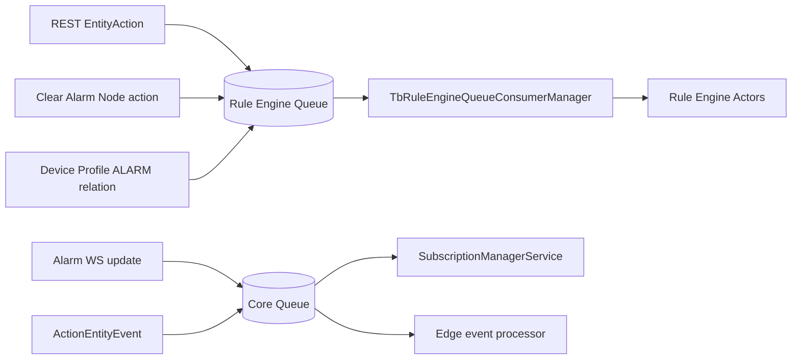

### 9.1 不是 exactly-once

1. PostgreSQL CLEAR 在任何 Rule Engine producer 之前提交；producer 失败不能回滚。
2. Clear Alarm Node producer 失败会让原消息走 Failure；若 Queue 重放，第二次数据库 CLEAR 是 no-op，重放不再走 `Cleared` relation。
3. REST queue push 异常在 `EntityActionService` 内只记录 warning，HTTP 仍可能成功。
4. Edge/WebSocket/notification 都没有与 Alarm 行共用 outbox，服务崩溃窗口可造成状态已改但事件缺失。
5. Topic、consumer group、logical partition 和 retry 策略继承 Queue 配置，详见 [05 Rule Chain 执行流程](../05-rule-chain-execution/README.md)。

---

## 十、数据库分析

### 10.1 表关系

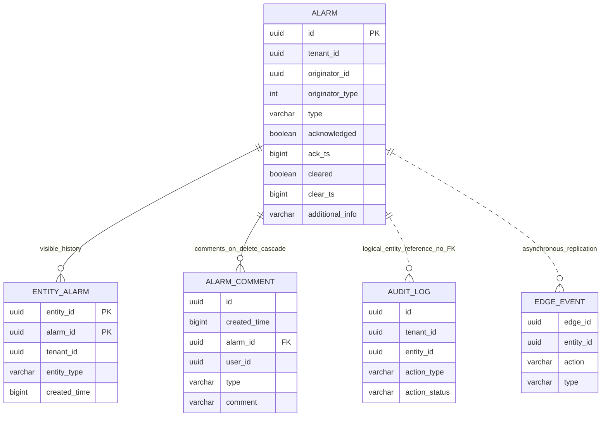

`alarm_comment` 按 `created_time` RANGE 分区，并通过 `alarm_id -> alarm(id) ON DELETE CASCADE` 关联；CLEAR 不触发级联。`entity_alarm` 同样保留，历史告警查询通过 join 读取主行的 `cleared/status`。

### 10.2 事务边界

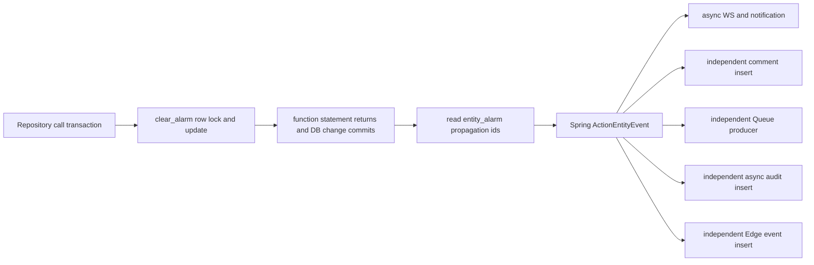

`DefaultTbAlarmService.clear(...)`、`DefaultAlarmSubscriptionService.clearAlarm(...)` 和 `BaseAlarmService.clearAlarm(...)` 都没有包住整条链路的 `@Transactional`。原子性来自 PostgreSQL function 自身，而不是 Spring 把所有副作用合成事务。

### 10.3 MySQL 工程师应如何理解

`SELECT ... FOR UPDATE` 锁的是已经存在的 Alarm heap tuple，对应 InnoDB 的记录锁用途；这里按主键定位，不依赖 gap lock。与“先查再由 Java UPDATE”相比，PL/pgSQL function 把条件判断、锁和更新放在同一数据库 statement 中，避免应用层读改写窗口。

但这不等于整个业务 exactly-once：数据库锁只能保证同一行状态转换，无法保护 Kafka producer、WebSocket、评论、audit 或 Edge。

### 10.4 为什么不写 TimescaleDB/Cassandra/Redis

Alarm 是可变实体状态，需要按 id 行锁、ACK/CLEAR 状态机、权限过滤和历史分页。触发它的 telemetry 可以在 TimescaleDB/Cassandra；Alarm 自身留在 PostgreSQL。Redis 不承担清除主状态，也不能作为数据库失败时的替代持久层。

---

## 十一、异常处理

| 失败点 | 调用方观察 | 已完成副作用 | 当前恢复语义 |
|---|---|---|---|
| REST 参数/权限失败 | 4xx | 无 | 修正权限或 id |
| Alarm 不存在 | REST 4xx；Edge success no-op | 无状态变化 | Edge 将 missing 当幂等成功 |
| PostgreSQL function 异常 | REST/Rule Node/Edge 失败 | 取决于数据库 statement 是否回滚 | function statement 原子回滚 |
| `entity_alarm` propagation 查询失败 | 上层异常 | Alarm 可能已清除 | 没有统一回滚或补偿 |
| 重复 REST clear | 400 `already cleared` | Edge action event 可能已发 | WS/comment/root action 不再发 |
| WS executor/推送失败 | 主请求通常不感知 | Alarm 已清除 | 无与本操作绑定的 retry/rollback |
| `AlarmTrigger` 处理失败 | 主请求不感知 | Alarm、部分 WS 可能已完成 | 异步任务失败 |
| SYSTEM comment 保存失败 | 记录 error，REST 继续 | Alarm 已清除 | 无回滚；可缺少操作历史 |
| REST Rule Engine producer 失败 | 内部 warning，HTTP 可成功 | Alarm/comment/audit 可能已完成 | 无 transactional outbox |
| Clear Alarm Node action producer 失败 | 当前消息 `Failure` | Alarm 已清除，WS/notification/Edge 已可能启动 | Queue retry 再 clear 会成为 no-op |
| Device Profile relation enqueue 失败 | 原 telemetry 仍可能成功 | Alarm 已清除、`currentAlarm=null` | 原消息与额外 relation callback 不绑定 |
| Edge DAO 失败 | gRPC uplink failure response | statement 回滚；其他同包 Future 可能已有副作用 | `Futures.allAsList` 整包失败响应 |
| Edge forwarding 失败 | 来源 Edge 仍可能收到 success | Central Alarm 已清除 | listener 捕获异常，不反向回滚 |
| 服务在 DB commit 后崩溃 | 客户端可能超时 | Alarm 已清除，后续事件不完整 | 客户端重试是数据库幂等，但事件不会全部补发 |

### 11.1 生产监控建议

1. 同时监控 `alarm.clear_ts` 状态、Rule Engine Queue producer failures、alarm WS executor、notification failures 和 Edge event backlog。
2. 对“数据库已清除但下游未收到事件”建立定期对账，而不是只依赖 HTTP 200。
3. 自定义外部副作用节点应按 AlarmId + action + clearTs 做幂等，避免 Queue 重放重复调用。
4. 若业务要求不可丢清除事件，需要引入数据库 outbox/CDC 或可重建事件源；3.6 当前链路没有这一保证。

---

## 十二、源码阅读路线

1. [`AlarmController.clearAlarm(String)`](../../../application/src/main/java/org/thingsboard/server/controller/AlarmController.java#L265)：建立 REST 权限入口。
2. [`DefaultTbAlarmService.clear(Alarm,long,User)`](../../../application/src/main/java/org/thingsboard/server/service/entitiy/alarm/DefaultTbAlarmService.java#L173)：先看 REST 编排和重复清除错误。
3. [`DefaultAlarmSubscriptionService.clearAlarm(...)`](../../../application/src/main/java/org/thingsboard/server/service/telemetry/DefaultAlarmSubscriptionService.java#L155)：区分同步 DAO 与异步回调。
4. [`BaseAlarmService.clearAlarm(...)`](../../../dao/src/main/java/org/thingsboard/server/dao/alarm/BaseAlarmService.java#L215)：观察 propagation 和 Edge event。
5. [`JpaAlarmDao.clearAlarm(...)`](../../../dao/src/main/java/org/thingsboard/server/dao/sql/alarm/JpaAlarmDao.java#L571) 与 [`toAlarmApiResult(...)`](../../../dao/src/main/java/org/thingsboard/server/dao/sql/alarm/JpaAlarmDao.java#L691)：理解 result flags。
6. [`clear_alarm(...)`](../../../dao/src/main/resources/sql/schema-views-and-functions.sql#L214)：精读锁、details 和幂等。
7. [`acknowledge_alarm(...)`](../../../dao/src/main/resources/sql/schema-views-and-functions.sql#L189)：对比 ACK/CLEAR 状态转换。
8. [`DefaultAlarmSubscriptionService.onAlarmUpdated(...)`](../../../application/src/main/java/org/thingsboard/server/service/telemetry/DefaultAlarmSubscriptionService.java#L358)：追踪 WS/Core 和 `AlarmTrigger`。
9. [`AlarmTriggerProcessor.matchesFilter(...)`](../../../application/src/main/java/org/thingsboard/server/service/notification/rule/trigger/AlarmTriggerProcessor.java#L54)：理解 CLEARED notification filter。
10. [`DefaultTbAlarmCommentService.saveAlarmComment(...)`](../../../application/src/main/java/org/thingsboard/server/service/entitiy/alarm/DefaultTbAlarmCommentService.java#L61)：看 comment 自己又产生哪些副作用。
11. [`EntityActionService.pushEntityActionToRuleEngine(...)`](../../../application/src/main/java/org/thingsboard/server/service/action/EntityActionService.java#L90)：建立 root `ALARM_CLEAR` 消息。
12. [`TbClearAlarmNode.processAlarm(...)`](../../../rule-engine/rule-engine-components/src/main/java/org/thingsboard/rule/engine/action/TbClearAlarmNode.java#L80)：看显式节点查询与 details 脚本。
13. [`TbAbstractAlarmNode.tellNext(...)`](../../../rule-engine/rule-engine-components/src/main/java/org/thingsboard/rule/engine/action/TbAbstractAlarmNode.java#L186)：确认 producer handoff 后才走 `Cleared`。
14. [`AlarmState.createOrClearAlarms(...)`](../../../rule-engine/rule-engine-components/src/main/java/org/thingsboard/rule/engine/profile/AlarmState.java#L175)：理解 profile create/clear 优先级。
15. [`DeviceState.processAlarmClearNotification(...)`](../../../rule-engine/rule-engine-components/src/main/java/org/thingsboard/rule/engine/profile/DeviceState.java#L262)：看 external root event 如何同步内存状态。
16. [`BaseAlarmProcessor.processAlarmMsg(...)`](../../../application/src/main/java/org/thingsboard/server/service/edge/rpc/processor/alarm/BaseAlarmProcessor.java#L73)：最后看 Edge 为什么绕过 Subscription。
17. [`EdgeEventSourcingListener.handleEvent(ActionEntityEvent)`](../../../application/src/main/java/org/thingsboard/server/service/edge/EdgeEventSourcingListener.java#L158) 与 [`AlarmEdgeProcessor.processAlarmNotification(...)`](../../../application/src/main/java/org/thingsboard/server/service/edge/rpc/processor/alarm/AlarmEdgeProcessor.java#L150)：闭合多 Edge 传播。

---

## 十三、常见面试题

### 1. CLEAR 和 DELETE 的核心区别是什么？

CLEAR 只更新 `cleared/clear_ts` 并保留 Alarm、可见性索引和评论；DELETE 删除主行并级联可见性与评论。CLEAR 用于状态生命周期，DELETE 用于移除历史实体。

### 2. 为什么 PostgreSQL function 要 `FOR UPDATE`？

它把同一 Alarm 的并发 CLEAR/ACK 串行化，保证只有第一个 CLEAR 写 `clear_ts/details`，后续调用看到最新行并返回 no-op。

### 3. 重复 CLEAR 是数据库错误吗？

不是。数据库返回 `success=true, cleared=false`。REST 把它转换为 400；Edge 当成功 no-op；Rule Node 在竞争窗口下可能走普通 `Success`。

### 4. `alarm.isCleared()` 与 `result.isCleared()` 有何不同？

前者表示返回对象当前状态，重复调用仍为 true；后者表示本次调用是否完成首次 CLEAR，只在状态真正改变时为 true。

### 5. CLEAR 会删除 `entity_alarm` 吗？

不会。`entity_alarm` 是历史可见性索引，查询 join `alarm` 后得到 cleared 状态。只有 Alarm DELETE 才通过外键级联清理。

### 6. ACK 可以发生在 CLEAR 之后吗？

可以。`CLEARED_UNACK -> CLEARED_ACK` 是合法状态，两个函数锁同一行，最终不会丢字段。

### 7. REST 清除成功是否意味着 Rule Engine 已处理？

不意味着。Alarm 已提交后才 push `ALARM_CLEAR`，callback 为 null，HTTP 不等待 producer 的最终消费，更不等待规则节点执行。

### 8. Clear Alarm Node 的 `Cleared` relation 表示什么？

表示数据库首次清除成功，且 root `ALARM_CLEAR` action message 已被 Queue producer 接收。它不证明 action consumer、WebSocket、notification 或 Edge 已完成。

### 9. 为什么 Clear Alarm Node 同时产生两条消息？

root `ALARM_CLEAR` 用于 originator profile 的全局动作处理；局部 `ALARM` message 用于当前节点 `Cleared` relation。两者受众和 callback 不同。

### 10. Device Profile 自动清除为什么没有 root `ALARM_CLEAR`？

它已经在自身 `AlarmState` 中把 `currentAlarm` 置空，只通过 `Alarm Cleared` relation 输出局部结果。源码没有调用 `alarmActionMsg(...)`。

### 11. Edge 上行 CLEAR 为什么没有本地 WebSocket 更新？

`BaseAlarmProcessor` 直接调用 DAO `AlarmService`，绕过负责 WS/AlarmTrigger 的 `DefaultAlarmSubscriptionService`。当前分支没有补偿调用。

### 12. 重复 REST CLEAR 为什么可能仍向 Edge 发事件？

`BaseAlarmService` 只判断结果中是否有 Alarm，不判断 `result.isCleared()`，所以先发布 `ActionEntityEvent`；应用服务之后才抛 already-cleared 错误。

### 13. CLEAR comment 与 Alarm 状态是否同事务？

不是。comment 在 Alarm 清除返回后单独保存；失败只记录日志，Alarm 不回滚。comment 成功还会产生自己的 Rule Engine、notification、audit 和 Edge 副作用。

### 14. 服务在 CLEAR commit 后、Queue producer 前崩溃会怎样？

Alarm 已清除但 root event 可能丢失。重试能得到数据库 no-op，却不会自动重建所有缺失副作用；3.6 没有 outbox 保证。

### 15. CLEAR details 谁能修改？

REST 传 null，保留原 details；Clear Alarm Node/Device Profile/Edge 可传 details，但只有首次 CLEAR 会覆盖，重复调用不改。

### 16. 清除旧 Alarm 后，同类型告警还能再次创建吗？

能。active 查询只匹配 `cleared=false`，下一次 create-or-update 会创建新的 AlarmId，旧行作为历史保留。

### 17. `AlarmTrigger` 与 `EntityActionTrigger` 在 CLEAR 时有什么区别？

Subscription 首次清除产生 `AlarmTrigger`，可匹配 `CLEARED`；`EntityActionService.processNotificationRules(...)` 没有 `ALARM_CLEAR` case，因此 clear EntityAction 不额外产生 `EntityActionTrigger`。SYSTEM comment 可能独立产生 `AlarmCommentTrigger`。

### 18. 如何让外部副作用具备幂等性？

使用 `(alarmId, action=clear, clearTs)` 作为业务幂等键。不要只按消息 UUID，因为 Queue 重建或不同入口可为同一 CLEAR 生成不同消息。

---

[上一篇：06 Alarm 创建流程](../06-alarm-create/README.md) | [返回目录](../../SUMMARY.md) | [下一篇：08 Attributes 保存流程（待分析）](../../SUMMARY.md#chapter-08)
