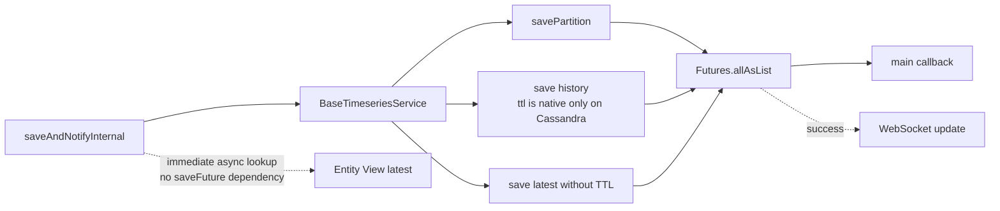
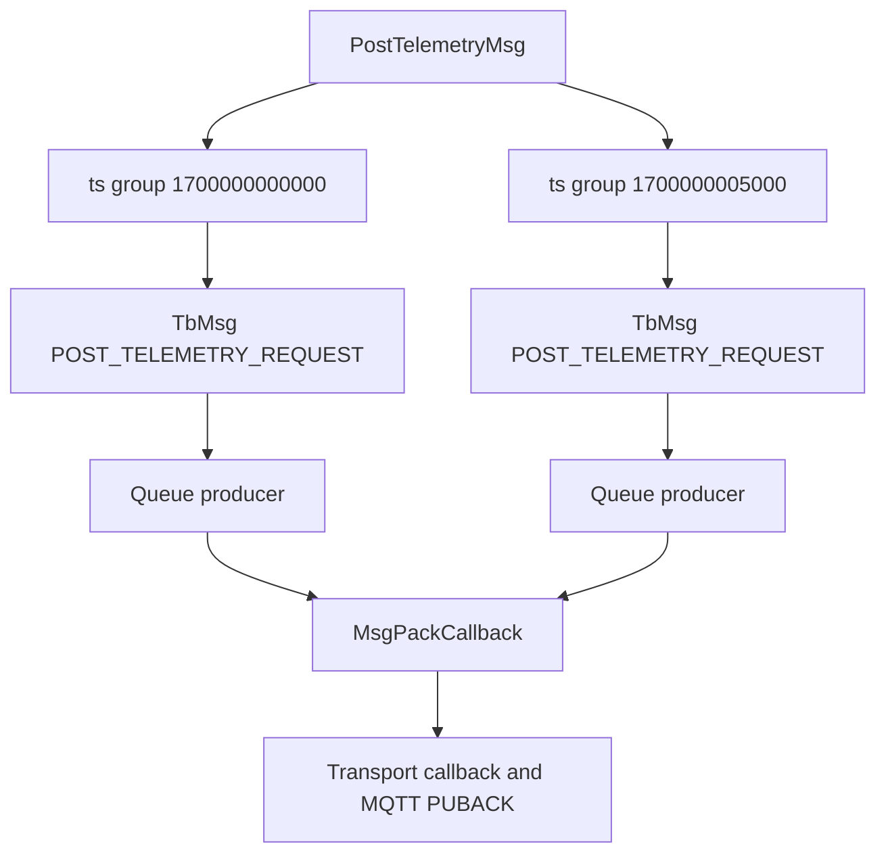
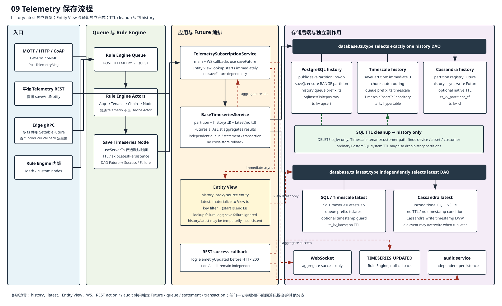
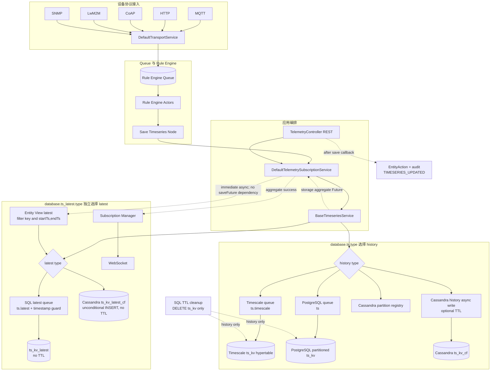
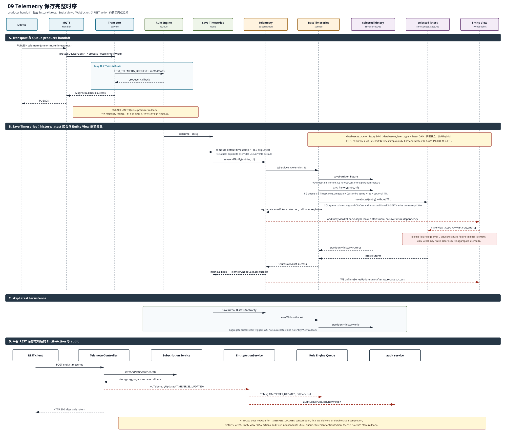
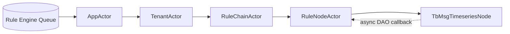
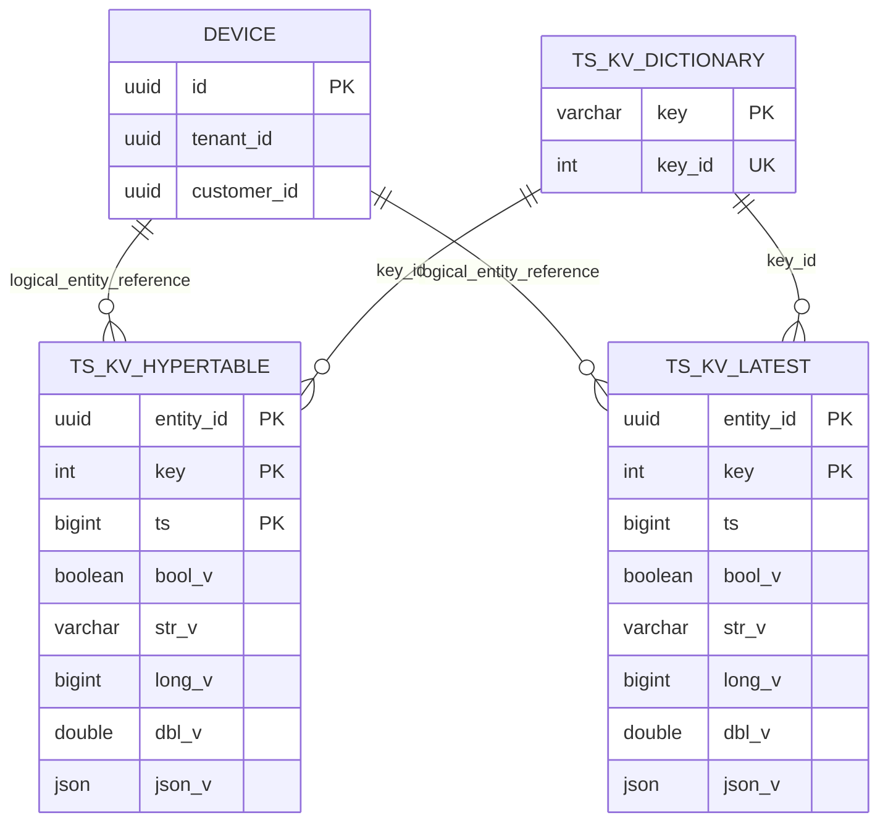
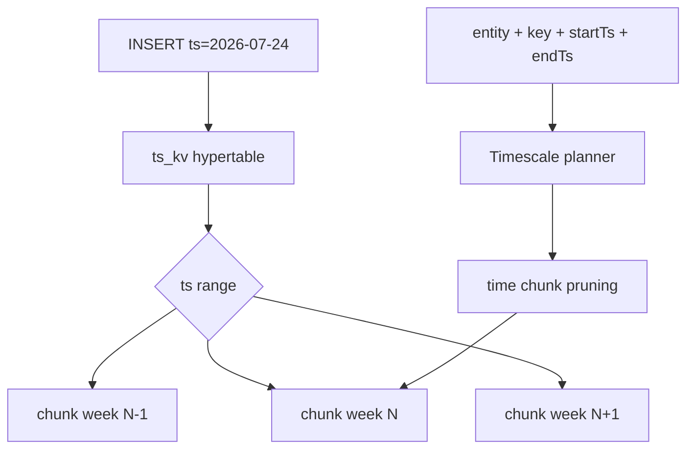

# 09 Telemetry 保存流程

> 源码基线：ThingsBoard `3.6.4`，行为提交 `0cb411fc90`；源码链接按当前 `release-3.6` 工作树行号校准。本章追踪 telemetry 从协议入口到 history/latest 双写，并比较 PostgreSQL、TimescaleDB 与 Cassandra 后端。

[上一篇：08 Attributes 保存流程](../08-attributes-save/README.md) | [HTML 版](index.html) | [全书目录](../../SUMMARY.md) | [时序图 SVG](sequence.svg) | [架构图 SVG](../../assets/architecture/09-telemetry-save.svg) | [下一篇：10 RPC 流程](../10-rpc/README.md)

---

## 一、流程目标

Telemetry 保存流程把设备或平台产生的带时间戳 key/value 数据保存为可按时间范围查询的历史序列，同时维护每个实体、每个 key 的最新值。ThingsBoard 3.6 把这两种读模型明确拆开：

- history：`ts_kv`、Cassandra `ts_kv_cf`，服务曲线、聚合和历史回放。
- latest：`ts_kv_latest`、Cassandra `ts_kv_latest_cf`，服务仪表盘当前值、实体查询和状态判断。

### 1.1 一条遥测实际触发多条异步写



SQL 公共 `savePartition(...)` Future 对普通 PostgreSQL 和 TimescaleDB 都是立即完成的 no-op。普通 PostgreSQL 改在 `JpaSqlTimeseriesDao.save(...)` 内按 datapoint 的 `ts` 同步调用 `savePartitionIfNotExist(...)`；TimescaleDB 由 hypertable 自动路由 chunk；只有 Cassandra 的该 Future 在非固定分区模式下维护 `ts_kv_partitions_cf` registry。

### 1.2 三种“成功”必须区分

| 成功点 | 表示什么 | 不表示什么 |
|---|---|---|
| MQTT `PUBACK` | Rule Engine Queue producer 已接受 telemetry message | Save Timeseries Node、history/latest 已完成 |
| Save Timeseries Node `Success` | `BaseTimeseriesService` 聚合的 history/latest/partition Futures 成功 | WebSocket、后续 Rule Node 已完成；Entity View 甚至可能已先启动或完成 |
| REST HTTP 200 | 直接 DAO Future 成功，`logTelemetryUpdated(...)` 已调用 | `TIMESERIES_UPDATED` 已消费、audit 已持久化、WS 客户端已收到 |

### 1.3 本章核心结论

1. Transport 不直接写数据库；它将每个 `TsKvListProto` 转成独立 `POST_TELEMETRY_REQUEST` 并交给 Rule Engine Queue。
2. Save Timeseries Node 决定时间戳、TTL 和是否跳过 latest；缺少该节点时设备仍可收到 PUBACK，但不会持久化。
3. `BaseTimeseriesService.save(...)` 对每个 datapoint 分别注册 partition、history、latest Future，没有覆盖整批的数据库事务；SQL/Timescale 的公共 partition Future 是 no-op，Cassandra 才用它维护 registry。
4. `database.ts.type` 选择 history DAO，`database.ts_latest.type` 独立选择 latest DAO，因此支持 SQL/Cassandra 等 hybrid 组合；latest 不从 history DAO 继续分派。
5. TimescaleDB 只把 `ts_kv` 建成按 `ts` 的一维 hypertable；SQL latest 的 `ts_kv_latest` 和 dictionary 仍是普通 PostgreSQL 表。
6. timestamp guard 仅属于 SQL latest。Cassandra `ts_kv_latest_cf` 是无条件 CQL INSERT，按实际执行生成的 Cassandra write timestamp 做 last-write-wins，旧事件后执行可能覆盖新事件。
7. TTL 参数只传给 history。SQL/Timescale 请求 TTL 仅参与 storage datapoint-days 计量，不落库、也不驱动后续删除；后台 cleanup 独立读取 system TTL 与 tenant/customer `TTL` 属性。Cassandra history INSERT 才使用请求 TTL 作为原生 TTL，Cassandra latest INSERT 仍不带 TTL。
8. SQL cleanup 只删除 `ts_kv`；`ts_kv_latest`/`ts_kv_latest_cf` 可在 history 过期后继续保留。
9. Entity View history 不复制，查询时代理源实体并应用 key/time 窗口；latest 则异步物化到 View，两种读模型可短暂不一致。
10. history、latest、WebSocket、Entity View、REST action/audit 和 Edge producer 使用独立 Future、queue 或 transaction，没有跨存储回滚。

---

## 二、入口

### 2.1 MQTT、HTTP、CoAP、LwM2M、SNMP

MQTT [`MqttTransportHandler.processDevicePublish(...)`](../../../common/transport/mqtt/src/main/java/org/thingsboard/server/transport/mqtt/MqttTransportHandler.java#L593) 把 telemetry topic 转成 `PostTelemetryMsg`。HTTP 设备 API 在 [`DeviceApiController.postTelemetry(...)`](../../../common/transport/http/src/main/java/org/thingsboard/server/transport/http/DeviceApiController.java#L254) 做 JSON 到 proto 的转换；CoAP、LwM2M、SNMP 最终也调用相同 `TransportService.process(...)`。

统一入口 [`DefaultTransportService.process(SessionInfoProto,PostTelemetryMsg,TbMsgMetaData,TransportServiceCallback)`](../../../common/transport/transport-api/src/main/java/org/thingsboard/server/common/transport/service/DefaultTransportService.java#L839) 完成 datapoint 限流、设备 activity、metadata 和 Queue 投递。

### 2.2 平台 REST 直写

| API | 方法 | 特点 |
|---|---|---|
| `POST /api/plugins/telemetry/{entityType}/{entityId}/timeseries/{scope}` | [`TelemetryController.saveEntityTelemetry(...)`](../../../application/src/main/java/org/thingsboard/server/controller/TelemetryController.java#L576) | TTL 使用 tenant profile 默认值 |
| `POST /api/plugins/telemetry/{entityType}/{entityId}/timeseries/{scope}/{ttl}` | [`TelemetryController.saveEntityTelemetryWithTTL(...)`](../../../application/src/main/java/org/thingsboard/server/controller/TelemetryController.java#L611) | 请求显式提供 TTL 秒数 |

两者都进入 [`TelemetryController.saveTelemetry(...)`](../../../application/src/main/java/org/thingsboard/server/controller/TelemetryController.java#L887)，验证 JSON、`WRITE_TELEMETRY` 权限后直接调用 `tsSubService.saveAndNotify(...)`。这条路径不先经过用户规则链；保存成功后才通过 `ActionType.TIMESERIES_UPDATED` 产生新的 Rule Engine action 和 audit。

### 2.3 Save Timeseries Rule Node

[`TbMsgTimeseriesNode.onMsg(TbContext,TbMsg)`](../../../rule-engine/rule-engine-components/src/main/java/org/thingsboard/rule/engine/telemetry/TbMsgTimeseriesNode.java#L122) 只接受 `POST_TELEMETRY_REQUEST`，并负责：

1. `useServerTs` 只决定不含显式时间戳 payload 的默认时间：启用时用当前服务器时间，否则用 metadata `ts`。若 payload 本身是 `{ts,values}`，[`JsonConverter.parseObject(...)`](../../../common/proto/src/main/java/org/thingsboard/server/common/adaptor/JsonConverter.java#L836) 会进入 `parseWithTs(...)`，显式 `ts` 仍覆盖这个默认值。
2. 解析单 timestamp object 或多 timestamp array。
3. TTL 优先取 metadata `TTL`，否则节点 `defaultTTL`，0 再回退 tenant profile 默认天数。
4. 根据 `skipLatestPersistence` 调用 `saveAndNotify` 或 `saveWithoutLatestAndNotify`。
5. DAO Future 成功后原消息走 `Success`，失败走 `Failure`。

### 2.4 Rule Engine 内部产生的遥测

Math Node、Message Count Node、自定义脚本或其他节点可创建 `POST_TELEMETRY_REQUEST`，再路由到 Save Timeseries Node。也可直接使用 `RuleEngineTelemetryService.saveAndNotify(...)`，但直接调用会绕过消息类型和节点 TTL 配置。

### 2.5 Edge 上行

[`BaseTelemetryProcessor.processPostTelemetry(...)`](../../../application/src/main/java/org/thingsboard/server/service/edge/rpc/processor/telemetry/BaseTelemetryProcessor.java#L225) 将 Edge 的 `PostTelemetryMsg` 逐 timestamp 重新构造为 `POST_TELEMETRY_REQUEST`，指定实体默认 queue/rule chain 后投递规则引擎。所有 timestamp 共用一个 `SettableFuture`；首个 producer `onSuccess` 或 `onFailure` 就尝试确定结果，后续 callback 的 `set`/`setException` 不再改变它。它既不聚合全部 timestamp producer，也不等待数据库 Future。

---

## 三、完整调用链

### 3.1 MQTT 到公共 DAO 编排

| 步骤 | 类与方法 | 源码 | 输入 -> 输出 | 职责与设计原因 |
|---|---|---|---|---|
| 1 | `org.thingsboard.server.transport.mqtt.MqttTransportHandler.processDevicePublish(...)` | [L593](../../../common/transport/mqtt/src/main/java/org/thingsboard/server/transport/mqtt/MqttTransportHandler.java#L593) | MQTT payload -> `PostTelemetryMsg` | 协议 topic/payload 适配 |
| 2 | `org.thingsboard.server.common.transport.service.DefaultTransportService.process(...)` | [L839](../../../common/transport/transport-api/src/main/java/org/thingsboard/server/common/transport/service/DefaultTransportService.java#L839) | proto list -> one `TbMsg` per timestamp group | 限流、activity、metadata |
| 3 | `DefaultTransportService.sendToRuleEngine(...)` | [L856](../../../common/transport/transport-api/src/main/java/org/thingsboard/server/common/transport/service/DefaultTransportService.java#L856) | `POST_TELEMETRY_REQUEST` -> Queue producer | 按 profile queue/partition 解耦接入与规则执行 |
| 4 | `org.thingsboard.server.service.queue.ruleengine.TbRuleEngineQueueConsumerManager.consumerLoop(...)` | [L360](../../../application/src/main/java/org/thingsboard/server/service/queue/ruleengine/TbRuleEngineQueueConsumerManager.java#L360) | Queue record -> Actor | poll pack、ack/retry 策略 |
| 5 | `AppActor -> TenantActor -> RuleChainActor -> RuleNodeActor` | [05 章](../05-rule-chain-execution/README.md) | `TbMsg` -> node invocation | 按租户/规则链串联业务处理 |
| 6 | `org.thingsboard.rule.engine.telemetry.TbMsgTimeseriesNode.onMsg(...)` | [L122](../../../rule-engine/rule-engine-components/src/main/java/org/thingsboard/rule/engine/telemetry/TbMsgTimeseriesNode.java#L122) | JSON + metadata -> `List<TsKvEntry>` | timestamp/TTL/latest 策略 |
| 7 | `org.thingsboard.server.service.telemetry.DefaultTelemetrySubscriptionService.saveAndNotify(...)` | [L205](../../../application/src/main/java/org/thingsboard/server/service/telemetry/DefaultTelemetrySubscriptionService.java#L205) | entries + ttl -> callback | 配额校验与持久化编排 |
| 8 | `DefaultTelemetrySubscriptionService.saveAndNotifyInternal(...)` | [L300](../../../application/src/main/java/org/thingsboard/server/service/telemetry/DefaultTelemetrySubscriptionService.java#L300) | entries -> aggregate Future + independent lookup | main/WS 依赖 saveFuture；Entity View lookup 立即单独启动 |
| 9 | `org.thingsboard.server.dao.timeseries.BaseTimeseriesService.save(...)` | [L289](../../../dao/src/main/java/org/thingsboard/server/dao/timeseries/BaseTimeseriesService.java#L289) | entries -> integer Future | 对每个 datapoint 拆 partition/history/latest |
| 10 | `BaseTimeseriesService.doSaveAndRegisterFuturesFor(...)` | [L386](../../../dao/src/main/java/org/thingsboard/server/dao/timeseries/BaseTimeseriesService.java#L386) | one entry -> DAO Futures | 后端无关写入编排 |
| 11 | selected `TimeseriesDao.savePartition(...)` + `save(...,ttl)` | [L386](../../../dao/src/main/java/org/thingsboard/server/dao/timeseries/BaseTimeseriesService.java#L386) | one entry -> partition/history Futures | `database.ts.type` 决定 history 后端；TTL 只进入 history |
| 12 | selected `TimeseriesLatestDao.saveLatest(...)` | [L357](../../../dao/src/main/java/org/thingsboard/server/dao/timeseries/BaseTimeseriesService.java#L357) | one entry -> latest Future | `database.ts_latest.type` 独立决定 latest 后端，无 TTL 参数 |
| 13 | `DefaultTelemetrySubscriptionService.onTimeSeriesUpdate(...)` | [L755](../../../application/src/main/java/org/thingsboard/server/service/telemetry/DefaultTelemetrySubscriptionService.java#L755) | aggregate success -> subscription manager | 本地或跨 Core WS 通知 |
| 14 | `TelemetryNodeCallback.onSuccess(...)` | [L55](../../../rule-engine/rule-engine-components/src/main/java/org/thingsboard/rule/engine/telemetry/TelemetryNodeCallback.java#L55) | aggregate success -> `tellSuccess` | 将数据库结果反馈 Rule Node Actor |

### 3.2 history 与 latest 的完整存储分支

`BaseTimeseriesService` 直接持有一个 `TimeseriesDao` 和一个 `TimeseriesLatestDao`。它们由两套独立配置装配，允许 Cassandra history + SQL latest、Timescale history + Cassandra latest 等 hybrid 组合：

| 分支 | 完整落点 | Future/queue 与实际写入 |
|---|---|---|
| PostgreSQL history | [`AbstractChunkedAggregationTimeseriesDao.savePartition(...)`](../../../dao/src/main/java/org/thingsboard/server/dao/sqlts/AbstractChunkedAggregationTimeseriesDao.java#L162) -> [`JpaSqlTimeseriesDao.save(...)`](../../../dao/src/main/java/org/thingsboard/server/dao/sqlts/sql/JpaSqlTimeseriesDao.java#L114) -> [`AbstractChunkedAggregationTimeseriesDao.init()`](../../../dao/src/main/java/org/thingsboard/server/dao/sqlts/AbstractChunkedAggregationTimeseriesDao.java#L101) -> [`SqlInsertTsRepository.saveOrUpdate(...)`](../../../dao/src/main/java/org/thingsboard/server/dao/sqlts/insert/sql/SqlInsertTsRepository.java#L55) | 公共 partition Future 立即完成；`save()` 内按 datapoint `ts` 调 `savePartitionIfNotExist`，再进入 stats prefix `ts` 的 SQL history queue，batch transaction 对 `ts_kv` upsert |
| Timescale history | [`TimescaleTimeseriesDao.savePartition(...)`](../../../dao/src/main/java/org/thingsboard/server/dao/sqlts/timescale/TimescaleTimeseriesDao.java#L190) -> [`save(...)`](../../../dao/src/main/java/org/thingsboard/server/dao/sqlts/timescale/TimescaleTimeseriesDao.java#L163) -> [`init()`](../../../dao/src/main/java/org/thingsboard/server/dao/sqlts/timescale/TimescaleTimeseriesDao.java#L107) -> [`TimescaleInsertTsRepository.saveOrUpdate(...)`](../../../dao/src/main/java/org/thingsboard/server/dao/sqlts/insert/timescale/TimescaleInsertTsRepository.java#L56) | partition Future 返回 0，chunk 不由该 Future 创建；history 进入 stats prefix `ts.timescale` 的 queue，在单 batch JDBC transaction 中写 hypertable |
| Cassandra history | [`CassandraBaseTimeseriesDao.savePartition(...)`](../../../dao/src/main/java/org/thingsboard/server/dao/timeseries/CassandraBaseTimeseriesDao.java#L306) + [`save(...)`](../../../dao/src/main/java/org/thingsboard/server/dao/timeseries/CassandraBaseTimeseriesDao.java#L255) | 非固定模式异步维护 `ts_kv_partitions_cf`；另一个独立 Future 执行带可选 `USING TTL` 的 `ts_kv_cf` async write，无 SQL batch queue |
| SQL/Timescale latest | [`@SqlTsLatestAnyDao`](../../../common/dao-api/src/main/java/org/thingsboard/server/dao/util/SqlTsLatestAnyDao.java#L24) -> [`SqlTimeseriesLatestDao.saveLatest(...)`](../../../dao/src/main/java/org/thingsboard/server/dao/sqlts/SqlTimeseriesLatestDao.java#L209) -> [`SqlLatestInsertTsRepository.saveOrUpdate(...)`](../../../dao/src/main/java/org/thingsboard/server/dao/sqlts/insert/latest/sql/SqlLatestInsertTsRepository.java#L82) | 条件仅为 `database.ts_latest.type in {sql,timescale}`，与 history 无关；stats prefix `ts.latest`，batch 内取最大 ts，数据库 upsert 可启用 timestamp guard |
| Cassandra latest | [`@NoSqlTsLatestDao`](../../../common/dao-api/src/main/java/org/thingsboard/server/dao/util/NoSqlTsLatestDao.java#L24) -> [`CassandraBaseTimeseriesLatestDao.saveLatest(...)`](../../../dao/src/main/java/org/thingsboard/server/dao/timeseries/CassandraBaseTimeseriesLatestDao.java#L194) | `BaseTimeseriesService` 直接调用无条件 CQL INSERT；没有 TTL、timestamp 条件或 history Future 依赖 |

### 3.3 Transport 如何拆消息

一个 `PostTelemetryMsg` 可以含多个 `TsKvListProto`，每组有自己的 timestamp。Transport 为每组创建独立 JSON 和 metadata `ts`，并用 `MsgPackCallback` 聚合 Queue producer callback：



这只聚合两个 producer handoff，不聚合两个消息未来的规则链执行和数据库结果。

### 3.4 REST 直写后的 action

REST [`saveTelemetry(...)`](../../../application/src/main/java/org/thingsboard/server/controller/TelemetryController.java#L887) 把请求所有 timestamp/key 展平为 `List<TsKvEntry>`，按 tenant profile 计算 TTL，直接调用 Subscription Service。成功 callback 先调用 [`logTelemetryUpdated(...)`](../../../application/src/main/java/org/thingsboard/server/controller/TelemetryController.java#L1147)；`EntityActionService` 把完整 timeseries JSON 编码为 `TIMESERIES_UPDATED` root message，以 null callback 投递 Rule Engine，并调用 audit service，然后 Controller 返回 200。HTTP 不等待 action 被消费，也不能把 audit、action 与 telemetry 存储纳入同一事务。

### 3.5 latest、history、Entity View 与通知的并发关系

`BaseTimeseriesService` 先创建 partition/history/latest Futures，但 history 与 latest 是独立 worker、statement 或 transaction。`Futures.allAsList` 只在全部成功时完成；任一失败时聚合 Future 失败，却不会撤销另一侧已经提交的写。WebSocket callback 注册在该聚合 Future 上，只在成功后调度。

Entity View 不属于这个聚合分支。[`addEntityViewCallback(...)`](../../../application/src/main/java/org/thingsboard/server/service/telemetry/DefaultTelemetrySubscriptionService.java#L331) 在注册 main/WS callbacks 后立即发起异步 lookup，不依赖 `saveFuture`；因此 View latest 可能早于源实体保存完成，甚至源实体聚合最终失败。lookup 失败会记录 error 日志，而每个 View 的 latest save failure callback 为空，不会反向失败源实体 callback。

---

## 四、消息流

[点击打开独立架构 SVG](../../assets/architecture/09-telemetry-save.svg)





---

## 五、时序图

本章按要求只保留渲染后的矢量图，不在章节目录生成 `sequence.puml`。

[新窗口打开完整时序图 SVG](sequence.svg)



图中以 Save Timeseries 主链为中心，并补齐 MQTT PUBACK、独立可选 history/latest DAO、Entity View 提前异步分叉、Rule Node/WS 完成点，以及 REST 成功后的 EntityAction、audit 与 `TIMESERIES_UPDATED` 投递。各分支没有跨 queue/statement/transaction 回滚。

---

## 六、数据变化

| 对象/系统 | 变化 | 原子性/完成语义 |
|---|---|---|
| `ts_kv_dictionary` | 首次出现的 string key 分配 integer `key_id` | 独立 repository 事务；进程内 map 缓存 |
| Timescale `ts_kv` | `(entity_id,key,ts)` INSERT；冲突时覆盖 typed value | 单 history SQL batch 事务 |
| PostgreSQL `ts_kv` | `save()` 内按 datapoint ts 建必要分区，再 upsert history | 公共 `savePartition` Future 是 no-op；分区 DDL/registry 与 history batch 不是请求级事务 |
| Cassandra `ts_kv_cf` | 按 entity/type/key/partition 写 clustering ts，原生 TTL | 每条 async statement，无跨表事务 |
| SQL `ts_kv_latest` | `(entity_id,key)` upsert；默认仅接受不旧于现值的 ts | 单 latest SQL batch 事务；不接收 TTL |
| Cassandra `ts_kv_latest_cf` | 无条件 INSERT 每个 key latest，不带 TTL | 与 history 独立 Future；按 Cassandra write timestamp LWW，旧事件后执行可覆盖新事件 |
| WebSocket | 发布本批 `TsKvEntry`，可跨 Core service | 只在 aggregate save Future 成功后调度 |
| Entity View history | View id 下不写 history；读取时代理源实体并应用 key/time 过滤 | 与 View latest 不是同一读模型 |
| Entity View latest | 立即异步 lookup，并把 `(startTs,endTs]` 内每 key 最大 ts 物化到 View id | 不依赖源 `saveFuture`；lookup 失败记日志，latest save failure callback 为空 |
| API usage | 用返回 integer 上报 `STORAGE_DP_COUNT` | 成功后上报，不是 DB transaction |
| Rule Engine | 原 telemetry 消息走 Success；REST 另建 `TIMESERIES_UPDATED` | Queue/Actor transaction 外 |
| `audit_log` | REST 记录 `TIMESERIES_UPDATED` | 异步且独立 |

### 6.1 SQL latest batch 内去重

[`SqlTimeseriesLatestDao.init()`](../../../dao/src/main/java/org/thingsboard/server/dao/sqlts/SqlTimeseriesLatestDao.java#L159) 在一个 batch 内用 `(entityId,key)` 合并，只保留最大 timestamp 的实体。之后 [`SqlLatestInsertTsRepository`](../../../dao/src/main/java/org/thingsboard/server/dao/sqlts/insert/latest/sql/SqlLatestInsertTsRepository.java#L68) 默认再在数据库层要求 `existing.ts <= incoming.ts`。这两层保护仅适用于 SQL latest；Cassandra latest 没有对应 guard。

### 6.2 skipLatestPersistence

开启后 Save Node 调 `saveWithoutLatestAndNotify(...)`：只注册 partition + history Future，仍在成功后推送 WebSocket 本次 update，但不修改 `ts_kv_latest`，也不执行 Entity View latest callback。于是实时订阅可看到该点，后续 latest 查询却仍返回旧值，这是有意的独立策略。

### 6.3 Entity View 的 history 代理与 latest 物化

[`BaseTimeseriesService.findAllByQueries(...)`](../../../dao/src/main/java/org/thingsboard/server/dao/timeseries/BaseTimeseriesService.java#L128) 遇到 `ENTITY_VIEW` 时不会查询 View id 的 history，而是取 `entityView.getEntityId()` 指向的源实体，并把允许的 timeseries keys 及 View 时间窗应用到查询。写入侧只异步物化 latest：对每个 key 选择 `entry.ts > startTs && entry.ts <= endTs` 的最大时间点后，以 View id 调 `saveLatestAndNotify(...)`。

因此 View history 与 View latest 可以短暂不一致：history 查询立即反映源实体已成功保存的数据，latest 可能因异步 lookup/save 落后；反过来，View latest 也可能先写入，而源实体 aggregate Future 随后因另一存储分支失败。两者都没有事务性快照或回滚关系。

---

## 七、源码分析

### 7.1 核心接口与实现选择

| 抽象 | SQL/Timescale 实现 | Cassandra 实现 | 职责 |
|---|---|---|---|
| `TimeseriesService` | `BaseTimeseriesService` | 同一 service | 聚合 history/latest/partition Future |
| `TimeseriesDao` | `JpaSqlTimeseriesDao` 或 `TimescaleTimeseriesDao` | `CassandraBaseTimeseriesDao` | 历史写入与范围查询 |
| `TimeseriesLatestDao` | `SqlTimeseriesLatestDao` | `CassandraBaseTimeseriesLatestDao` | latest 写入/查询 |
| `AggregationTimeseriesDao` | SQL/Timescale aggregation repository | Cassandra 分区聚合 | AVG/MIN/MAX/SUM/COUNT |

Spring 条件注解明确拆开两套选择：`@SqlTsDao`/`@TimescaleDBTsDao`/`@NoSqlTsDao` 只读取 `database.ts.type`；[`@SqlTsLatestAnyDao`](../../../common/dao-api/src/main/java/org/thingsboard/server/dao/util/SqlTsLatestAnyDao.java#L24) 只在 `database.ts_latest.type` 为 `sql` 或 `timescale` 时装配 `SqlTimeseriesLatestDao`，[`@NoSqlTsLatestDao`](../../../common/dao-api/src/main/java/org/thingsboard/server/dao/util/NoSqlTsLatestDao.java#L24) 则选择 Cassandra latest。两者独立，支持 hybrid；业务层不应从 history DAO 推断或强转 latest 实现。

### 7.2 dictionary 的并发创建

[`BaseAbstractSqlTimeseriesDao.getOrSaveKeyId(String)`](../../../dao/src/main/java/org/thingsboard/server/dao/sqlts/BaseAbstractSqlTimeseriesDao.java#L69) 先查进程内 `ConcurrentMap`，miss 后查 `ts_kv_dictionary`，进程内加锁后再查一次并插入。多服务实例仍可能竞争唯一 key；捕获 `DataIntegrityViolationException` 后回查数据库取得赢家生成的 id。

字典把每条 `temperature` 字符串压缩为 int，降低大表索引和行宽；代价是查询前需要解析 key id，且超高动态 key 会让 dictionary 和 JVM map 无界增长。

### 7.3 Timescale history batch

[`TimescaleTimeseriesDao.init()`](../../../dao/src/main/java/org/thingsboard/server/dao/sqlts/timescale/TimescaleTimeseriesDao.java#L107) 使用：

- `sql.ts.batch_size`，默认 1000。
- `sql.ts.batch_max_delay`，默认 100 ms。
- `sql.timescale.batch_threads`，YAML 默认 3。
- hash key 为 entity UUID，排序为 entity/key/ts。

三种 SQL queue 的 stats prefix 不同：普通 PostgreSQL history 为 `ts`，Timescale history 为 `ts.timescale`，SQL latest 为 `ts.latest`。这些是 [`AbstractChunkedAggregationTimeseriesDao.init()`](../../../dao/src/main/java/org/thingsboard/server/dao/sqlts/AbstractChunkedAggregationTimeseriesDao.java#L101)、Timescale `init()` 和 [`SqlTimeseriesLatestDao.init()`](../../../dao/src/main/java/org/thingsboard/server/dao/sqlts/SqlTimeseriesLatestDao.java#L159) 的 `statsNamePrefix`；普通 PostgreSQL 没有额外的专用后缀。

[`TimescaleInsertTsRepository`](../../../dao/src/main/java/org/thingsboard/server/dao/sqlts/insert/timescale/TimescaleInsertTsRepository.java#L45) 执行 `INSERT ... ON CONFLICT (entity_id,key,ts) DO UPDATE`。相同时间点重放不会新增行，但不同 payload 会覆盖原值，属于 last executed write wins。

### 7.4 Timescale schema 的真实范围

安装服务 [`TimescaleTsDatabaseSchemaService.createDatabaseSchema()`](../../../application/src/main/java/org/thingsboard/server/service/install/TimescaleTsDatabaseSchemaService.java#L60) 只执行：

```sql
SELECT create_hypertable(
  'ts_kv', 'ts',
  chunk_time_interval => 604800000,
  if_not_exists => true
);
```

默认 YAML 是 7 天 chunk。3.6 schema 没有创建 Continuous Aggregate、compression policy 或 Timescale retention policy；聚合查询仍直接运行 `time_bucket(...)` 类 SQL。SQL history 的后台保留期由 ThingsBoard cleanup procedure 执行 DELETE，但其策略来自 system TTL 与 tenant/customer `TTL` 属性，不是单次 Save Node/REST 请求传入的 TTL。

### 7.5 TTL 的后端差异

TTL 参数只传入 `TimeseriesDao.save(...,ttl)` 的 history 分支，`TimeseriesLatestDao.saveLatest(...)` 没有 TTL 参数。SQL/Timescale `computeTtl(ttl)` 和 `getDataPointDays(...)` 只计算 API usage 返回值，history INSERT SQL 没有 TTL 列，因此单次请求 TTL 不能标记或定位将来要删除的行。定时 [`TimeseriesCleanUpService.cleanUp()`](../../../application/src/main/java/org/thingsboard/server/service/ttl/TimeseriesCleanUpService.java#L74) 调 `cleanup_timeseries_by_ttl(...)`，依据 system TTL 与 tenant/customer `TTL` 属性只从 `ts_kv` DELETE；它与写入请求 TTL 无关联，也不会清理 `ts_kv_latest`。

Timescale procedure [`schema-timescale.sql`](../../../dao/src/main/resources/sql/schema-timescale.sql#L57) 只通过 `device`、`asset`、`customer` 表定位 entity id；其他实体类型不在这条 tenant/customer TTL 路径中。普通 PostgreSQL 除同类逐实体 DELETE 外，[`JpaSqlTimeseriesDao.cleanup(...)`](../../../dao/src/main/java/org/thingsboard/server/dao/sqlts/sql/JpaSqlTimeseriesDao.java#L139) 还可按 system TTL 调 `drop_partitions_by_system_ttl(...)`。

Cassandra [`CassandraBaseTimeseriesDao.save(...)`](../../../dao/src/main/java/org/thingsboard/server/dao/timeseries/CassandraBaseTimeseriesDao.java#L255) 的 history statement 可使用 `USING TTL ?`，每条数据按写入 TTL 自动过期；[`CassandraBaseTimeseriesLatestDao.saveLatest(...)`](../../../dao/src/main/java/org/thingsboard/server/dao/timeseries/CassandraBaseTimeseriesLatestDao.java#L194) 的 latest INSERT 不带 TTL。由此 SQL/Cassandra latest 都可能在 history 过期后继续保留，不要把 Save Node `TTL` 理解为 history/latest 同时到期。

---

## 八、Actor 分析

Telemetry 数据平面经过 Rule Engine Actor，不经过 Device Actor：



Device Actor 处理 session、RPC、attributes subscription 和 activity 等设备状态，但普通 `PostTelemetryMsg` 在 Transport 层直接变成 Rule Engine `TbMsg`。这样避免所有高吞吐 datapoint 都穿过 per-device actor mailbox。

`RuleNodeActor` 在 Save Node 发起异步 DAO 后保持消息 callback；Future 成功才 `tellSuccess`。但默认 Rule Engine Queue 的 ack/processing strategy 可能在超时或失败时 commit，详见 05 章。Actor 串行处理不等于数据库写串行：SQL queue 另有 worker，多个消息的 Futures 可并发完成。

---

## 九、Kafka 分析

Telemetry 路径依赖 ThingsBoard Queue 抽象；Kafka 只是常见 provider。

| Producer | Record | Partition 依据 | Consumer | 确认边界 |
|---|---|---|---|---|
| Transport | `POST_TELEMETRY_REQUEST` | tenant、originator、profile queue | Rule Engine consumer | producer callback 可触发设备 PUBACK |
| Edge telemetry processor | `POST_TELEMETRY_REQUEST` | entity default queue/rule chain | Rule Engine consumer | 多 timestamp 共用 Future，首个 producer callback 定结果，不等其余 producer 或 DB |
| REST EntityAction | `TIMESERIES_UPDATED` | entity originator | Rule Engine consumer | callback null，不等消费 |
| Subscription service | timeseries update proto | 订阅 owner service | Core notification consumer | DB callback 不等最终 WS |

### 9.1 至少一次与数据库幂等

Kafka record 重放可能再次到 Save Node。Timescale/PostgreSQL history 主键 `(entity_id,key,ts)` 使同时间点 upsert；SQL latest timestamp guard 阻止旧点倒退。但 Cassandra latest 无条件 INSERT，旧事件若后执行并获得更新的 Cassandra write timestamp，可以覆盖新事件。WebSocket、Rule Engine 后续外部调用、API usage 和 Entity View side effect 也仍可能重复。

### 9.2 背压链路

高峰时需要同时观察：Transport producer latency、Rule Engine consumer lag、Rule Node pending callbacks、普通 PostgreSQL history `ts` queue、Timescale history `ts.timescale` queue、latest `ts.latest` queue、JDBC pool、WAL/checkpoint。只看 Kafka lag 无法判断瓶颈是在规则执行还是 SQL batch。

---

## 十、数据库分析

### 10.1 Timescale 表关系



这三张表均没有 tenant id 外键。删除 Device 也不会由 FK 级联 telemetry；实体删除后的 orphan history 需要额外清理策略。

### 10.2 Chunk 路由



Hypertable 仅按 `ts` 分块，不按 device hash 建第二维。查询必须携带时间范围才能有效 chunk pruning；`entity_id,key,ts` 主键负责 chunk 内实体/key 定位。大量设备同时写当前时间会进入当前 chunk，这是正常设计，但索引/WAL/IO 容量必须按总吞吐配置。

### 10.3 Timescale 与普通 PostgreSQL

| 项目 | TimescaleDB | PostgreSQL SQL TS |
|---|---|---|
| history 表 | hypertable 自动 chunk | ThingsBoard RANGE partition |
| partition 创建 | 公共 `savePartition()` no-op，hypertable 自动路由 chunk | 公共 Future 同样 no-op；`JpaSqlTimeseriesDao.save()` 内按 datapoint ts 创建 RANGE partition |
| 聚合 | Timescale repository/time bucket | SQL partition aggregation |
| latest | 普通 `ts_kv_latest` | 同一普通表 |
| 后台保留期 | procedure 读取 system/tenant/customer TTL，仅按 device/asset/customer 定位并 DELETE `ts_kv`；与请求 TTL 无关 | 同类逐实体 DELETE；system TTL 另可 drop history partition |
| 写入 | `TimescaleInsertTsRepository` | `SqlInsertTsRepository` |

### 10.4 Cassandra 模型

Cassandra history 主键为 `((entity_type,entity_id,key,partition),ts)`，天然按实体/key/时间分区；非固定分区模式由独立 `savePartition` Future 维护 `ts_kv_partitions_cf`，history 则通过另一个 async write 保存。latest 单独按 `((entity_type,entity_id),key)` 无条件 INSERT，且不带 TTL。history 支持原生 per-write TTL，但跨 partition registry/history/latest 没有事务；latest 依赖 Cassandra write timestamp 的 last-write-wins，事件时间戳本身不是写入条件。

### 10.5 MySQL 工程师应关注的差异

Timescale chunk 不是 MySQL 应用层分表。对应用仍是一张 `ts_kv`，扩展在 PostgreSQL planner/executor 中做 chunk routing/pruning。`ON CONFLICT`、WAL、checkpoint、autovacuum 仍是 PostgreSQL 机制；Timescale 没有绕开这些成本。

history 的更新冲突会产生 PostgreSQL tuple version 和 WAL；latest 是高频 UPDATE 热点。生产调优要同时处理追加写吞吐、latest 更新膨胀、dictionary 冷 key、JDBC batch 和 checkpoint 抖动。

---

## 十一、异常处理

| 失败点 | 上游结果 | 已可能完成 | 恢复/风险 |
|---|---|---|---|
| JSON/proto 校验失败 | 4xx 或 Transport error | 无 DB 写 | 修正 payload |
| Transport datapoint limit | callback 失败 | activity 取决于代码路径 | 降采样/配额调整 |
| Rule Engine producer 失败 | MQTT QoS1 不完成正常 PUBACK | 无 Save Node | provider 重试 |
| 规则链没有 Save Node | Queue 可成功并 PUBACK | 无 DB 写 | 配置审计 |
| Save Node TTL 非数字 | Node Failure | 无该节点写入 | 修正 metadata |
| dictionary insert 竞争 | 捕获唯一冲突并回查 | 赢家已插入 | 正常并发恢复；异常回查失败才报错 |
| history batch 失败 | aggregate Future 失败 | latest 可能已提交 | 无跨 queue rollback |
| latest batch 失败 | aggregate Future 失败 | history 可能已提交 | latest 可通过 history 重建，但 3.6 不自动对账 |
| SQL latest 收到旧 timestamp | Future 可成功，UPDATE 0 行 | history 已保存旧点 | 这是 SQL timestamp guard 的预期行为 |
| Cassandra latest 的旧事件后执行 | Future 可成功 | `ts_kv_latest_cf` 可能倒退 | 无 timestamp 条件；按 Cassandra write timestamp LWW |
| WS callback/executor 失败 | 原保存通常成功 | DB 已提交 | 客户端重查 |
| Entity View lookup 失败 | 原 callback 不失败 | 源实体存储仍独立进行 | 记录 error 日志，View latest 不更新 |
| Entity View latest save 失败 | 原 callback 不失败 | 源实体可成功，也可能最终失败 | failure callback 为空，只能通过不一致监测发现 |
| 源实体 aggregate 失败 | Rule Node/REST 失败 | history/latest 一侧或 View latest 可能已提交 | 无跨存储回滚；View 不等待源 `saveFuture` |
| REST action producer 失败 | HTTP 仍可能 200 | telemetry 已提交 | 无 outbox，action 缺失 |
| Timescale cleanup 超时 | 写入不受直接影响 | 旧数据保留 | 表/索引膨胀，下一周期重试 |
| Cassandra history 成功、latest 失败 | aggregate Future 失败 | history 已存在 | 重试可能修复 latest |
| 服务在部分 batch 后崩溃 | 设备可能已 PUBACK | history/latest 部分状态 | 依赖 upsert 重放和对账 |

### 11.1 生产排障顺序

1. 从 Rule Engine Queue lag 和 Save Timeseries Node Failure 开始，确认消息是否到达持久化节点。
2. 按部署分别查看 PostgreSQL history `ts`、Timescale history `ts.timescale` 与 SQL latest `ts.latest` queue 指标，不能只看一个。
3. 检查 JDBC pool、慢 SQL、WAL 生成、checkpoint duration、autovacuum 和当前 chunk 索引。
4. 对比 history 最大 ts 与 `ts_kv_latest.ts`，定位 latest 部分失败或乱序。
5. 检查 WebSocket subscription lag 时，不要把数据库成功当作推送成功证据。

---

## 十二、源码阅读路线

1. [`MqttTransportHandler.processDevicePublish(...)`](../../../common/transport/mqtt/src/main/java/org/thingsboard/server/transport/mqtt/MqttTransportHandler.java#L593)：看 MQTT payload 适配。
2. [`DefaultTransportService.process(...PostTelemetryMsg...)`](../../../common/transport/transport-api/src/main/java/org/thingsboard/server/common/transport/service/DefaultTransportService.java#L839)：确认拆 timestamp 和 PUBACK 边界。
3. [05 Rule Chain 执行流程](../05-rule-chain-execution/README.md)：补齐 Queue consumer 到 RuleNodeActor。
4. [`TbMsgTimeseriesNode.onMsg(...)`](../../../rule-engine/rule-engine-components/src/main/java/org/thingsboard/rule/engine/telemetry/TbMsgTimeseriesNode.java#L122)：理解 timestamp/TTL/latest 配置。
5. [`JsonConverter.parseObject(...)`](../../../common/proto/src/main/java/org/thingsboard/server/common/adaptor/JsonConverter.java#L836)：确认 `{ts,values}` 显式 ts 覆盖默认时间。
6. [`BaseTelemetryProcessor.processPostTelemetry(...)`](../../../application/src/main/java/org/thingsboard/server/service/edge/rpc/processor/telemetry/BaseTelemetryProcessor.java#L225)：看 Edge 多 timestamp 共用 `SettableFuture`。
7. [`DefaultTelemetrySubscriptionService.doSaveAndNotify(...)`](../../../application/src/main/java/org/thingsboard/server/service/telemetry/DefaultTelemetrySubscriptionService.java#L234)：看配额与校验。
8. [`DefaultTelemetrySubscriptionService.saveAndNotifyInternal(...)`](../../../application/src/main/java/org/thingsboard/server/service/telemetry/DefaultTelemetrySubscriptionService.java#L300)：看 main/WS callback 与独立 Entity View 分叉。
9. [`BaseTimeseriesService.doSave(...)`](../../../dao/src/main/java/org/thingsboard/server/dao/timeseries/BaseTimeseriesService.java#L317)：确认 history/latest 的直接 DAO 调用与聚合边界。
10. [`JpaSqlTimeseriesDao.save(...)`](../../../dao/src/main/java/org/thingsboard/server/dao/sqlts/sql/JpaSqlTimeseriesDao.java#L114) 和 [`SqlInsertTsRepository.saveOrUpdate(...)`](../../../dao/src/main/java/org/thingsboard/server/dao/sqlts/insert/sql/SqlInsertTsRepository.java#L55)：看 PG 内部分区创建、history queue 与 upsert。
11. [`TimescaleTimeseriesDao.init()`](../../../dao/src/main/java/org/thingsboard/server/dao/sqlts/timescale/TimescaleTimeseriesDao.java#L107) 和 [`TimescaleInsertTsRepository.saveOrUpdate(...)`](../../../dao/src/main/java/org/thingsboard/server/dao/sqlts/insert/timescale/TimescaleInsertTsRepository.java#L56)：看 Timescale history batch。
12. [`CassandraBaseTimeseriesDao.savePartition(...)`](../../../dao/src/main/java/org/thingsboard/server/dao/timeseries/CassandraBaseTimeseriesDao.java#L306) 与 [`save(...)`](../../../dao/src/main/java/org/thingsboard/server/dao/timeseries/CassandraBaseTimeseriesDao.java#L255)：对照 partition registry、history async write 和原生 TTL。
13. [`SqlTimeseriesLatestDao.init()`](../../../dao/src/main/java/org/thingsboard/server/dao/sqlts/SqlTimeseriesLatestDao.java#L159) 和 [`SqlLatestInsertTsRepository.saveOrUpdate(...)`](../../../dao/src/main/java/org/thingsboard/server/dao/sqlts/insert/latest/sql/SqlLatestInsertTsRepository.java#L82)：看 SQL latest queue、batch 去重与 timestamp guard。
14. [`CassandraBaseTimeseriesLatestDao.saveLatest(...)`](../../../dao/src/main/java/org/thingsboard/server/dao/timeseries/CassandraBaseTimeseriesLatestDao.java#L194)：确认 latest 无 TTL、无条件 INSERT。
15. [`BaseTimeseriesService.findAllByQueries(...)`](../../../dao/src/main/java/org/thingsboard/server/dao/timeseries/BaseTimeseriesService.java#L128) 与 [`addEntityViewCallback(...)`](../../../application/src/main/java/org/thingsboard/server/service/telemetry/DefaultTelemetrySubscriptionService.java#L331)：对照 View history 代理和 latest 物化。
16. [`TimescaleTsDatabaseSchemaService.createDatabaseSchema()`](../../../application/src/main/java/org/thingsboard/server/service/install/TimescaleTsDatabaseSchemaService.java#L60)：确认 hypertable 只有 time dimension。
17. [`schema-timescale.sql`](../../../dao/src/main/resources/sql/schema-timescale.sql#L57) 与 [`TimeseriesCleanUpService.cleanUp()`](../../../application/src/main/java/org/thingsboard/server/service/ttl/TimeseriesCleanUpService.java#L74)：最后核对 cleanup 的实体范围和 `ts_kv` 边界。

---

## 十三、常见面试题

### 1. ThingsBoard 为什么同时有 `ts_kv` 和 `ts_kv_latest`？

前者优化时间范围历史查询，后者优化实体/key 当前值查询。用历史表每次 `ORDER BY ts DESC LIMIT 1` 会把高频 latest 读取成本转移到大表和 chunk。

### 2. MQTT PUBACK 是否代表 TimescaleDB 已写入？

不代表。它只等待 Rule Engine Queue producer；数据库写在后续 Save Timeseries Node 的异步 callback 中。

### 3. 一条 telemetry 的 history/latest 是否同事务？

不是。`database.ts.type` 与 `database.ts_latest.type` 可独立选后端；两者进入独立 DAO/queue/statement/transaction，`Futures.allAsList` 只聚合结果，无法回滚已经提交的一侧。

### 4. `skipLatestPersistence=true` 后 WebSocket 会收到吗？

会。history Future 成功后仍调用 timeseries update subscription；但 `ts_kv_latest` 和 Entity View latest 不更新。

### 5. 乱序 telemetry 会污染 latest 吗？

SQL latest 默认在 batch 内取最大 ts，并在 upsert 时要求现有 ts 小于等于 incoming ts，因此旧点通常不会倒退 latest。Cassandra latest 没有该 guard，旧事件后执行可能凭更新的 Cassandra write timestamp 覆盖新事件；history 仍按各自时间点保存。

### 6. 相同 entity/key/ts 重放会发生什么？

Timescale/PostgreSQL 对 history 主键冲突执行 UPDATE，行数不增加，后执行 payload 覆盖原值；这不是不可变事件日志。

### 7. TimescaleDB 的 chunk 按什么分片？

3.6 安装脚本只按 `ts` 创建 hypertable，默认 chunk interval 7 天，没有 device hash space dimension。

### 8. `ts_kv_latest` 也是 hypertable 吗？

不是。它是普通 PostgreSQL 表，主键 `(entity_id,key)`；dictionary 也是普通表。

### 9. Save Node 的 TTL 在 TimescaleDB 中如何实现？

不会写成每行 TTL。SQL INSERT 没有过期列，请求 TTL 只作为 history 调用参数参与 datapoint-days 计量，不会驱动该批数据将来删除。后台 procedure 与请求 TTL 无关，它依据 system TTL 和 tenant/customer `TTL` 属性 DELETE `ts_kv`；Timescale 的 tenant/customer 路径只通过 device/asset/customer 定位实体，latest 也不随 history 一起清理。

### 10. Cassandra TTL 有何不同？

Cassandra history INSERT 使用 `USING TTL`，可逐写入原生过期。其 partition registry 不使用短 custom TTL，避免 registry 早于数据消失；Cassandra latest INSERT 同样不带 TTL，因此 history 过期后 latest 仍可存在。

### 11. 为什么需要 `ts_kv_dictionary`？

把重复 telemetry key 字符串映射成 int，缩小巨量 history/latest 行和索引。动态 key 高基数会让 dictionary/JVM map 膨胀。

### 12. TimescaleDB 是否自动使用 Continuous Aggregate？

本版本 ThingsBoard schema 没有创建 Continuous Aggregate。聚合 DAO 直接查询原始 hypertable；需要自行设计时必须考虑与平台升级和 TTL 的兼容。

### 13. TimescaleDB 是否自动启用 compression/retention policy？

3.6 安装代码没有配置这些 policy。SQL history 的后台保留由 ThingsBoard cleanup procedure 按 system/tenant/customer TTL 策略实现，与单次写入请求 TTL 无关；不能因为用了 Timescale 就假设 chunk 会自动压缩或删除。

### 14. 为什么普通 telemetry 不经过 Device Actor？

高吞吐数据在 Transport 直接投递 Rule Engine Queue，避免 per-device actor mailbox 成为数据平面瓶颈。Device Actor主要维护 session/RPC/订阅状态。

### 15. Rule Node Success 表示什么？

表示 `BaseTimeseriesService` 聚合的必要 DAO Futures 成功，并准备推进下一关系；不表示 WS 或后续节点已完成。Entity View 更特殊：它不依赖该聚合 Future，可能已经先启动、先完成或独立失败。

### 16. 如何检测 history/latest 不一致？

按实体/key 对比 history 的最大 ts 与 latest ts，并统计缺失/倒退；修复时从 history 重建 latest，同时避免与在线写并发覆盖。

### 17. 百万设备写入时先调哪些参数？

先以真实 payload 压测 Queue partitions、Rule Engine consumers、`sql.ts`/`sql.ts_latest` batch size/delay/threads、JDBC pool、WAL/checkpoint 和 chunk interval。参数必须联合调，单纯增大 batch 可能放大延迟和事务 WAL 峰值。

### 18. Telemetry 流程是 exactly-once 吗？

不是。Queue 重放、history/latest 独立事务和事务外通知决定了它是可重试、部分幂等的 at-least-once 风格，需要下游幂等与对账。

### 19. Entity View 是否保存独立 history？

不保存。View history 查询代理源实体并应用配置的 key/time 范围；只有 latest 被异步筛选后物化到 View id，范围是 `(startTs,endTs]`。因此 history 与 latest 可短暂不一致，且 View latest 不参与源实体保存的成功/失败聚合。

---

[上一篇：08 Attributes 保存流程](../08-attributes-save/README.md) | [返回目录](../../SUMMARY.md) | [下一篇：10 RPC 流程](../10-rpc/README.md)
