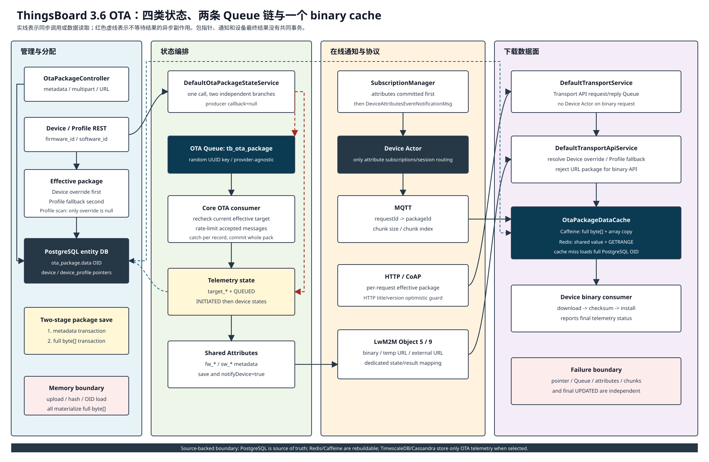
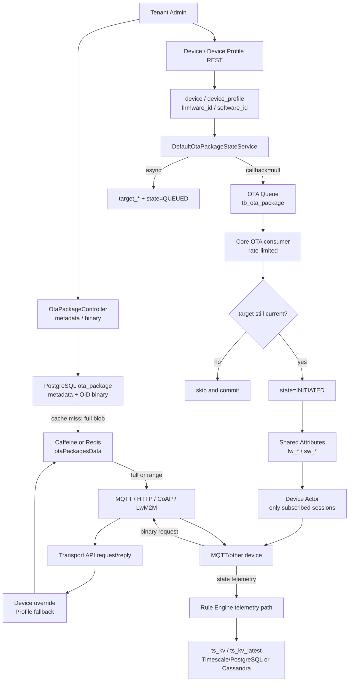
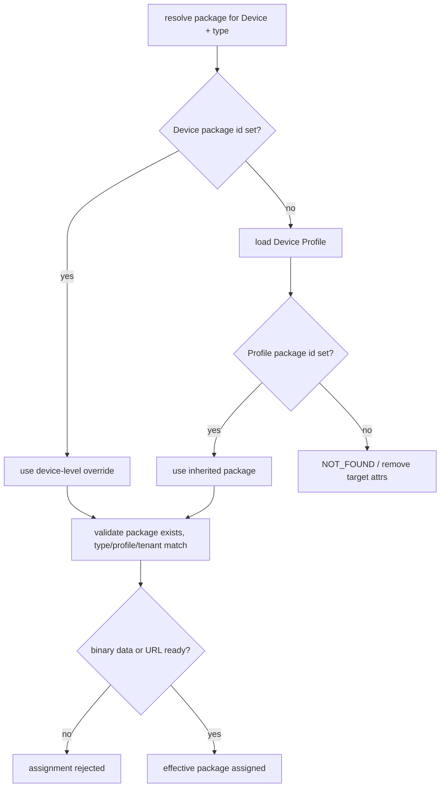
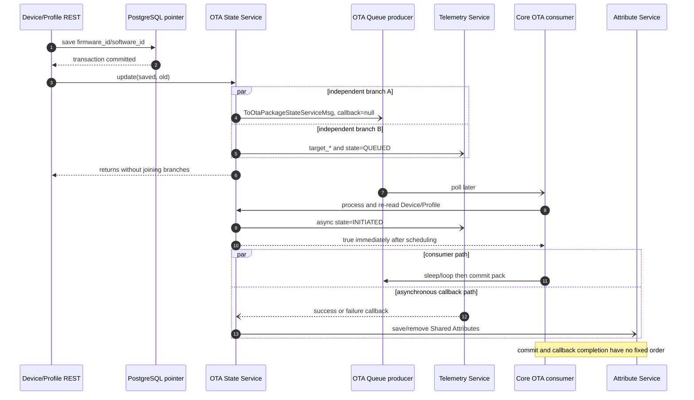
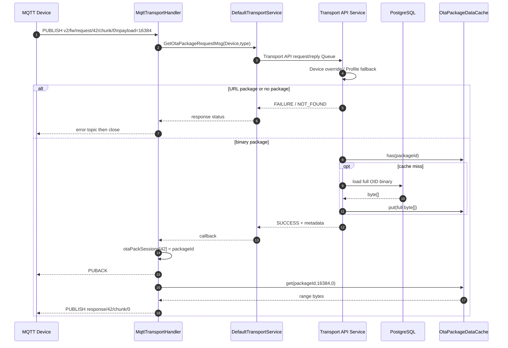
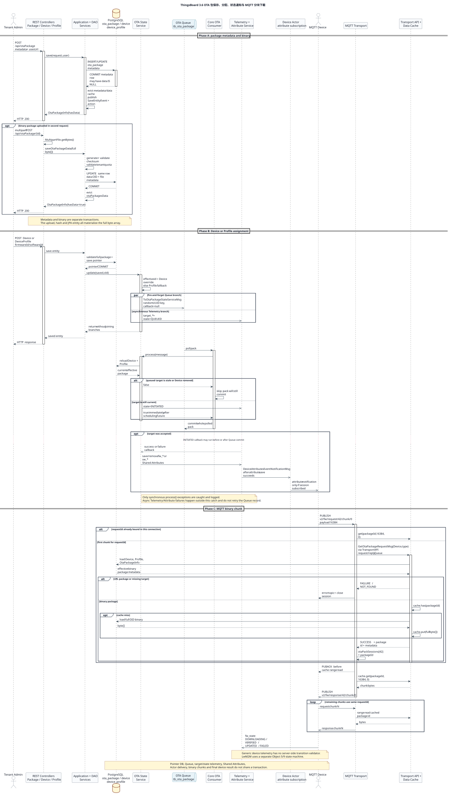
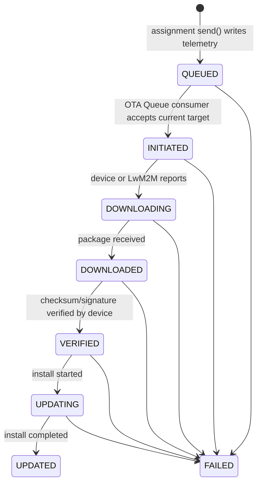
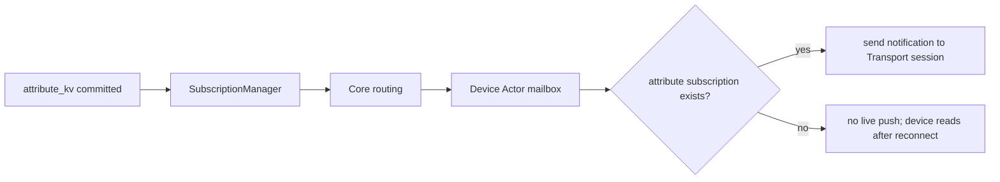
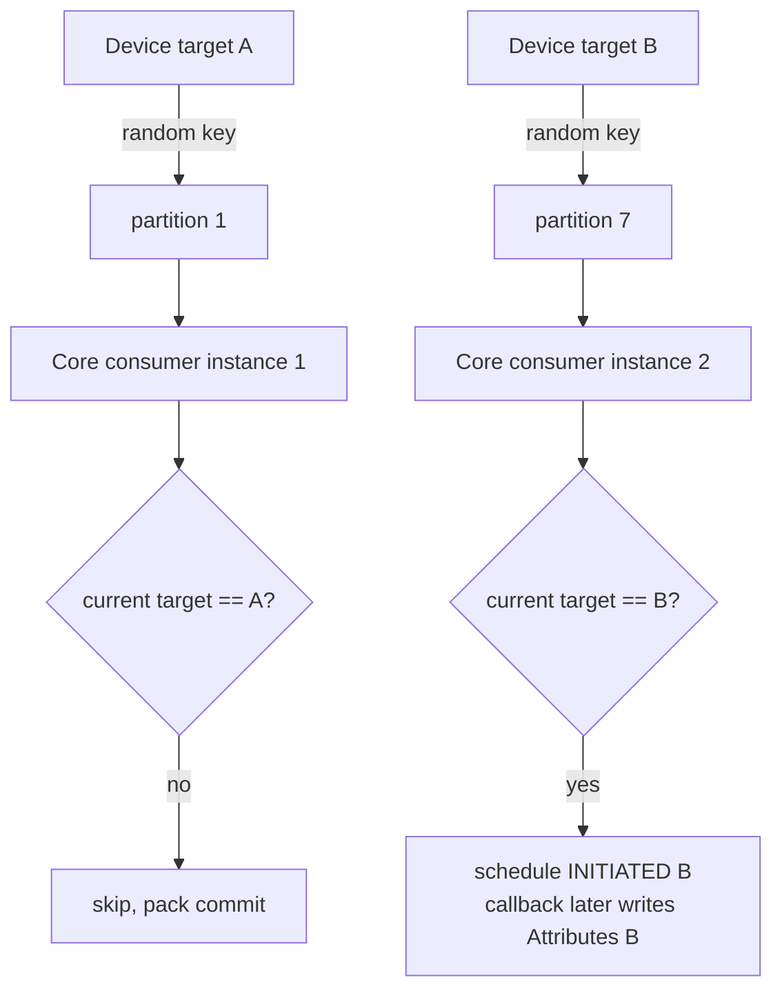
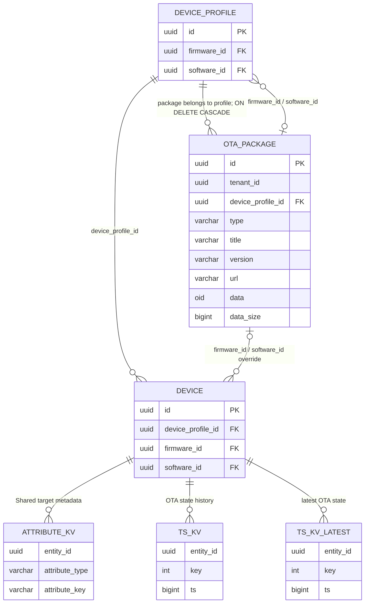

# 11 OTA 流程

> 源码基线：ThingsBoard `3.6.4`，行为提交 `0cb411fc90`；源码链接按当前 `release-3.6` 工作树行号校准。本章分析 OTA 包管理、Device/Device Profile 分配、状态遥测、Shared Attributes、MQTT/HTTP/CoAP/LwM2M 下载、缓存、Queue 和 Edge 边界。

[上一篇：10 RPC 流程](../10-rpc/README.md) | [HTML 版](index.html) | [全书目录](../../SUMMARY.md) | [PlantUML 源文件](sequence.puml) | [时序图 SVG](sequence.svg) | [架构图 SVG](../../assets/architecture/11-ota.svg) | [下一篇：12 Dashboard 流程](../12-dashboard/README.md)

---

## 一、流程目标

OTA 解决的是“把某个固件或软件版本可靠地指定给设备，并让设备取得包、执行升级、持续上报状态”。ThingsBoard 3.6 没有把它实现成一条同步事务，而是拆成四类状态：

1. `device.firmware_id/software_id` 或 `device_profile.firmware_id/software_id` 保存目标包指针。
2. `attribute_kv` 的 Shared Scope 保存设备下载所需的目标元数据，例如 `fw_title`、`fw_version`、`fw_size` 和 checksum。
3. Telemetry 保存 `target_fw_*`、`fw_state` 等升级状态，可落 PostgreSQL/TimescaleDB 或 Cassandra。
4. `ota_package.data` 保存二进制源数据，Caffeine/Redis `otaPackagesData` 为设备下载提供内存或共享缓存。

因此，“设备已分配包”“设备已收到元数据”“设备已下载”“设备已升级”是四个不同事实。管理端保存 Device 成功，只能证明目标指针已提交；不能证明 Queue、Telemetry、Actor 通知和设备升级都成功。

### 1.1 两级分配模型

有效包按以下优先级解析：

```text
Device.firmwareId/softwareId 非空
        -> 使用设备级覆盖
否则
        -> 使用 DeviceProfile.firmwareId/softwareId
```

设备级字段不是“复制 Profile 当前值”，而是 override。Profile 更新只扫描对应字段为空的设备，避免覆盖设备级定制。这个规则同时出现在状态服务和设备下载服务中，见 [`DefaultOtaPackageStateService.updateFirmware(Device, Device)`](../../../application/src/main/java/org/thingsboard/server/service/ota/DefaultOtaPackageStateService.java#L155) 与 [`DefaultTransportApiService.handle(GetOtaPackageRequestMsg)`](../../../application/src/main/java/org/thingsboard/server/service/transport/DefaultTransportApiService.java#L825)。

### 1.2 本章核心结论

- 包元数据和二进制是两个 REST 请求、同一张 `ota_package` 表中的两次保存；中间允许存在 `hasData=false` 的未完成包。
- Device/Profile 保存后，`DefaultOtaPackageStateService.send(...)` 不等待 Queue producer，也不把 Queue 与 `QUEUED` Telemetry 放入同一事务。
- `tb_ota_package` 消费者只节流“接受消息并提交 `INITIATED` 异步任务”的阶段；callback 中的 Shared Attributes 可能在 Queue commit 之后才完成。Profile 大批量分配时，扫描、producer send 和 `QUEUED` Telemetry 仍由请求线程快速发出。
- MQTT/HTTP/CoAP 二进制下载不进入 Device Actor。它们通过 Transport API request/reply 解析有效包，再从 `OtaPackageDataCache` 读取完整包或 range。
- Device Actor 只负责把 Shared Attributes 更新推给已经订阅属性的在线 session；离线设备重连后需要重新读取 Shared Attributes。
- MQTT/HTTP/CoAP 普通设备自己上报 `DOWNLOADING`、`VERIFIED`、`UPDATED`、`FAILED` 等状态，服务器不校验通用 Telemetry 的状态迁移；LwM2M 才由专用状态机映射 Object 5/9 状态。
- PostgreSQL 是包与分配指针的事实源；TimescaleDB/Cassandra 只可能承载 OTA 状态 Telemetry，Redis 只是可丢弃的数据缓存。

---

## 二、入口

### 2.1 管理端 OTA Package REST

| HTTP 入口 | 源码方法 | 用途 |
|---|---|---|
| `POST /api/otaPackage` | [`OtaPackageController.saveOtaPackageInfo(SaveOtaPackageInfoRequest)`](../../../application/src/main/java/org/thingsboard/server/controller/OtaPackageController.java#L184) | 创建/更新元数据，支持 binary 模式或 URL 模式 |
| `POST /api/otaPackage/{id}` multipart | [`saveOtaPackageData(String, String, String, MultipartFile)`](../../../application/src/main/java/org/thingsboard/server/controller/OtaPackageController.java#L209) | 把完整文件读成 `byte[]`，生成/校验 checksum 后写同一行 |
| `GET /api/otaPackage/{id}/download` | [`downloadOtaPackage(String)`](../../../application/src/main/java/org/thingsboard/server/controller/OtaPackageController.java#L108) | 管理端下载 binary 包；URL 包返回 HTTP 400 |
| `GET /api/otaPackage/info/{id}` | [`getOtaPackageInfoById(String)`](../../../application/src/main/java/org/thingsboard/server/controller/OtaPackageController.java#L140) | 读取不含二进制的 metadata projection |
| `DELETE /api/otaPackage/{id}` | [`deleteOtaPackage(String)`](../../../application/src/main/java/org/thingsboard/server/controller/OtaPackageController.java#L309) | 删除未被 Device/Profile 引用的包 |

这些入口由 Tenant Admin 调用。`OtaPackageInfo` 和 `OtaPackage` 是两个 Java 视图：前者避免列表与校验查询加载大字段，后者包含 `ByteBuffer data`。

### 2.2 Device 与 Device Profile 分配入口

- `POST /api/device`：[`DeviceController.saveDevice(Device, String)`](../../../application/src/main/java/org/thingsboard/server/controller/DeviceController.java#L218) 保存设备级 `firmwareId/softwareId`。
- `POST /api/deviceProfile`：[`DeviceProfileController.saveDeviceProfile(DeviceProfile)`](../../../application/src/main/java/org/thingsboard/server/controller/DeviceProfileController.java#L248) 保存 Profile 默认包。
- Device 创建、导入、Provision、Claim 和 Edge Device 更新最终也可能调用 [`TbClusterService.onDeviceUpdated(Device, Device)`](../../../application/src/main/java/org/thingsboard/server/service/queue/DefaultTbClusterService.java#L780)，从而触发同一 OTA 状态编排。

分配前 [`AbstractHasOtaPackageValidator.validateOtaPackage(...)`](../../../dao/src/main/java/org/thingsboard/server/dao/service/validator/AbstractHasOtaPackageValidator.java#L56) 校验包存在、tenant/type/profile 匹配，并且 binary data 或 URL 已就绪。该校验读取完整 `OtaPackage`，binary 包会进入 JVM。

### 2.3 MQTT 设备下载入口

设备向以下 topic 发布 chunk 请求：

```text
v2/fw/request/{requestId}/chunk/{chunkIndex}
v2/sw/request/{requestId}/chunk/{chunkIndex}
```

payload 是 chunk size；首次请求记录 size，后续同一 `requestId` 可发送空 payload。响应 topic 是 `v2/{fw|sw}/response/{requestId}/chunk/{chunkIndex}`。topic 正则定义在 [`MqttTopics`](../../../common/data/src/main/java/org/thingsboard/server/common/data/device/profile/MqttTopics.java#L175)，入口分派在 [`MqttTransportHandler.onPublish(...)`](../../../common/transport/mqtt/src/main/java/org/thingsboard/server/transport/mqtt/MqttTransportHandler.java#L610)。

### 2.4 HTTP 与 CoAP 设备下载入口

- HTTP：`GET /api/v1/{deviceToken}/firmware|software?title=...&version=...&size=...&chunk=...`，见 [`DeviceApiController.getFirmware(...)`](../../../common/transport/http/src/main/java/org/thingsboard/server/transport/http/DeviceApiController.java#L465)。
- CoAP：`/{fw|sw}/{accessToken}` 加可选 query 参数 `title/version/size/chunk`，见 [`OtaPackageTransportResource.processHandleGet(CoapExchange)`](../../../common/transport/coap/src/main/java/org/thingsboard/server/transport/coap/OtaPackageTransportResource.java#L83)。

HTTP 每次请求都必须带 title/version，并用它们防止管理员在下载中途改包；CoAP 的 title/version 是可选校验。

### 2.5 LwM2M 入口

LwM2M 不使用 MQTT chunk topic。设备注册后 [`DefaultLwM2MOtaUpdateService.init(LwM2mClient)`](../../../common/transport/lwm2m/src/main/java/org/thingsboard/server/transport/lwm2m/server/ota/DefaultLwM2MOtaUpdateService.java#L250) 读取 Shared Attributes，根据 Client Profile 选择：

- 写 Object 5 Firmware Package/URI 并 execute update；
- 写 Object 9 Software Package/URI 并 execute install；
- binary push、临时 CoAP URL或外部 URL。

Object state/result observation再映射为 `fw_state/sw_state` Telemetry。这是独立的 LwM2M 状态机，不能用 MQTT chunk 时序解释。

### 2.6 Rule Engine、Scheduler 与 Edge

- release-3.6 没有通用“OTA Rule Node”作为分配入口。普通设备上报 OTA 状态时，它只是普通 Telemetry，沿第 09 章的 Rule Engine/Save Timeseries 链路保存。
- `DefaultTbCoreConsumerService` 的单线程 OTA consumer 是内部异步入口，不是 Scheduler；它按配置节流 Queue 中的设备通知。
- Central 的包 Save/Delete entity event 可转换为 Edge downlink；[`OtaPackageEdgeProcessor.convertOtaPackageEventToDownlink(...)`](../../../application/src/main/java/org/thingsboard/server/service/edge/rpc/processor/ota/OtaPackageEdgeProcessor.java#L53) 会读取完整包并构造 V1/V2 `OtaPackageUpdateMsg`。

---

## 三、完整调用链

### 3.1 创建元数据与上传二进制

#### 元数据请求

| 步骤 | 类与方法 | 输入 | 输出/职责 | 设计原因 |
|---|---|---|---|---|
| 1 | [`org.thingsboard.server.controller.OtaPackageController.saveOtaPackageInfo(SaveOtaPackageInfoRequest)`](../../../application/src/main/java/org/thingsboard/server/controller/OtaPackageController.java#L184) | JSON metadata、`usesUrl` | 注入 tenant、做权限/实体检查 | REST 不接触 JPA entity |
| 2 | [`org.thingsboard.server.service.entitiy.ota.DefaultTbOtaPackageService.save(SaveOtaPackageInfoRequest, User)`](../../../application/src/main/java/org/thingsboard/server/service/entitiy/ota/DefaultTbOtaPackageService.java#L66) | request、当前用户 | 判断 ADDED/UPDATED，调用 DAO service，记录 entity action | 用户审计与 DAO 校验分层 |
| 3 | [`org.thingsboard.server.dao.ota.BaseOtaPackageService.saveOtaPackageInfo(OtaPackageInfo, boolean)`](../../../dao/src/main/java/org/thingsboard/server/dao/ota/BaseOtaPackageService.java#L108) | metadata、URL 模式 | URL/tenant/profile/type/immutable 字段校验，保存后失效缓存并发布 `SaveEntityEvent` | 统一所有调用方的领域约束 |
| 4 | [`org.thingsboard.server.dao.sql.ota.JpaOtaPackageInfoDao.save(TenantId, OtaPackageInfo)`](../../../dao/src/main/java/org/thingsboard/server/dao/sql/ota/JpaOtaPackageInfoDao.java#L98) | 不含 `data` 的 projection | Spring transaction 中写 `ota_package`，更新时再查 `hasData` | 列表和 metadata 更新不读取大对象 |
| 5 | PostgreSQL | `INSERT/UPDATE ota_package` | 提交 metadata row | `(tenant_id,title,version)` 唯一 |

metadata DAO transaction 返回后，application service 才调用 `logEntityAction(...)`。数据库 row、Edge entity event、审计/通知没有统一事务。

#### binary 请求

1. [`OtaPackageController.saveOtaPackageData(...)`](../../../application/src/main/java/org/thingsboard/server/controller/OtaPackageController.java#L209) 调用 `MultipartFile.getBytes()`，一次性把整个文件放入 heap。
2. [`DefaultTbOtaPackageService.saveOtaPackageData(...)`](../../../application/src/main/java/org/thingsboard/server/service/entitiy/ota/DefaultTbOtaPackageService.java#L94) 在 checksum 缺省时用所选算法计算 hash，构造含 `ByteBuffer data` 的完整 `OtaPackage`。
3. [`OtaPackageDataValidator.validateDataImpl(...)`](../../../dao/src/main/java/org/thingsboard/server/dao/service/validator/OtaPackageDataValidator.java#L87) 要求 file name/content type/checksum 完整，并重新计算 checksum；URL 模式禁止同时保存文件。
4. [`BaseOtaPackageService.saveOtaPackage(OtaPackage)`](../../../dao/src/main/java/org/thingsboard/server/dao/ota/BaseOtaPackageService.java#L143) 通过 [`JpaOtaPackageDao`](../../../dao/src/main/java/org/thingsboard/server/dao/sql/ota/JpaOtaPackageDao.java#L44) 写同一行，并失效 metadata 与 data cache。
5. [`OtaPackageEntity.data`](../../../dao/src/main/java/org/thingsboard/server/dao/model/sql/OtaPackageEntity.java#L145) 是 `@Lob byte[]`；PostgreSQL DDL 实际列类型是 `oid`。

### 3.2 Device 级分配

完整链路：

```text
DeviceController.saveDevice(Device, accessToken)
  -> DefaultTbDeviceService.save(Device, oldDevice, accessToken, User)
  -> DeviceService.saveDeviceWithAccessToken(...)
  -> PostgreSQL device.firmware_id/software_id COMMIT
  -> DefaultTbNotificationEntityService.notifyCreateOrUpdateDevice(...)
  -> DefaultTbClusterService.onDeviceUpdated(Device, oldDevice)
  -> DefaultOtaPackageStateService.update(Device, oldDevice)
  -> send(...) for changed effective package
```

[`DefaultTbDeviceService.save(...)`](../../../application/src/main/java/org/thingsboard/server/service/entitiy/device/DefaultTbDeviceService.java#L84) 先完成 DAO 保存，随后 [`DefaultTbNotificationEntityService.notifyCreateOrUpdateDevice(...)`](../../../application/src/main/java/org/thingsboard/server/service/entitiy/DefaultTbNotificationEntityService.java#L191) 才进入 Cluster/OTA。OTA 失败不会自动回滚已经提交的 Device 指针。

`updateFirmware/updateSoftware` 分别计算新旧 effective package：Device 字段为空时读取 Profile。只有 effective id 变化才调用 `send(...)`；新值为空则删除对应 Shared Attributes。

### 3.3 Device Profile 级分配

[`DefaultTbDeviceProfileService.save(DeviceProfile, User)`](../../../application/src/main/java/org/thingsboard/server/service/entitiy/device/profile/DefaultTbDeviceProfileService.java#L65) 在保存前比较旧 Profile 的 firmware/software id，Profile row 提交后调用 [`DefaultOtaPackageStateService.update(DeviceProfile, boolean, boolean)`](../../../application/src/main/java/org/thingsboard/server/service/ota/DefaultOtaPackageStateService.java#L225)。

状态服务以 100 条分页同步扫描：

```text
device.tenant_id = tenant
AND device.device_profile_id = profile
AND device.firmware_id IS NULL   // firmware 分支
或 device.software_id IS NULL    // software 分支
```

查询分支位于 [`JpaDeviceDao.findDevicesByTenantIdAndTypeAndEmptyOtaPackage(...)`](../../../dao/src/main/java/org/thingsboard/server/dao/sql/device/JpaDeviceDao.java#L316)。每个设备单独执行 `send(...)`；Profile REST 请求要完成整次扫描后才能返回。Queue 的 pack interval 不会限制这段扫描和初始 `QUEUED` Telemetry。

### 3.4 `send` 的两个独立副作用

[`DefaultOtaPackageStateService.send(...)`](../../../application/src/main/java/org/thingsboard/server/service/ota/DefaultOtaPackageStateService.java#L312) 依次做两件事：

1. 构造 `ToOtaPackageStateServiceMsg`，以随机 UUID 为 key，调用 producer `send(..., callback=null)`。
2. 保存 `target_{fw|sw}_title/version/tag/ts` 和 `{fw|sw}_state=QUEUED` Telemetry。

它不等待 producer callback，也不把 producer 与 Telemetry future 组合。可能出现：

- Queue 成功、`QUEUED` Telemetry 失败；
- Queue 失败、`QUEUED` Telemetry 成功；
- 调用方已经返回，但两条异步链仍在运行。

### 3.5 OTA Queue 消费与 Shared Attributes

[`DefaultTbCoreConsumerService.launchOtaPackageUpdateNotificationConsumer()`](../../../application/src/main/java/org/thingsboard/server/service/queue/DefaultTbCoreConsumerService.java#L612) poll 一个 pack，逐条调用 [`handleOtaPackageUpdates(...)`](../../../application/src/main/java/org/thingsboard/server/service/queue/DefaultTbCoreConsumerService.java#L674)。处理过程：

1. [`DefaultOtaPackageStateService.process(ToOtaPackageStateServiceMsg)`](../../../application/src/main/java/org/thingsboard/server/service/ota/DefaultOtaPackageStateService.java#L274) 重新读取 Device。
2. 再次按 Device override/Profile fallback 计算 current package。
3. 只有消息中的 target id 仍等于 current id，才异步提交 `INITIATED` Telemetry 保存；`process(...)` 随即返回 `true`，过时消息返回 `false`。
4. `INITIATED` Telemetry 无论成功或失败，其异步 callback 都继续调用 `updateAttributes(...)`；callback 与 consumer 后续 sleep/commit 没有固定先后。
5. Shared Attributes 保存成功后，经 SubscriptionManager -> Core -> Device Actor 推在线订阅 session；这一步也不被 Queue consumer 等待。

重新校验是随机 Queue key 和重复/乱序投递下的关键保护。消费者最终对整个 poll pack 执行 `commit()`；单条返回 `false` 或同步抛异常都不会触发自动重试。Telemetry/Attributes 的异步失败发生在 `process()` 返回之后，不在 consumer 的逐条 `catch` 内，也不会驱动 Queue retry。

### 3.6 MQTT binary chunk

1. [`MqttTransportHandler.getOtaPackageCallback(...)`](../../../common/transport/mqtt/src/main/java/org/thingsboard/server/transport/mqtt/MqttTransportHandler.java#L726) 解析 requestId/chunk/chunkSize，并检查 `maxPayloadSize`。
2. 同一连接第一次看到 requestId 时，构造 `GetOtaPackageRequestMsg`；后续 chunk 直接使用 `otaPackSessions[requestId]`，保持整次下载绑定同一 package id。
3. [`DefaultTransportService.process(SessionInfoProto, GetOtaPackageRequestMsg, callback)`](../../../common/transport/transport-api/src/main/java/org/thingsboard/server/common/transport/service/DefaultTransportService.java#L1124) 通过 Transport API request/reply Queue 发送 metadata 请求；它不调用 Device Actor。
4. [`DefaultTransportApiService.handle(GetOtaPackageRequestMsg)`](../../../application/src/main/java/org/thingsboard/server/service/transport/DefaultTransportApiService.java#L825) 解析 effective package，拒绝 URL 包，并在 cache miss 时从 PostgreSQL 加载完整 `OtaPackage.data`。
5. callback 把 package id 放入连接内 `otaPackSessions`，随后 [`sendOtaPackage(...)`](../../../common/transport/mqtt/src/main/java/org/thingsboard/server/transport/mqtt/MqttTransportHandler.java#L936) 从本地/共享 data cache 切片并 publish response。

`GetOtaPackageRequestMsg/ResponseMsg` 只携带 id、type、title、version、fileName 和 contentType，见 [`queue.proto`](../../../common/proto/src/main/proto/queue.proto#L535)；binary 不在 Transport API response 中传输，而是通过共享的 `OtaPackageDataCache` 交接。

### 3.7 HTTP、CoAP 与 LwM2M 分支

- HTTP/CoAP 都先验证 access token，再调用相同 `TransportService.process(...GetOtaPackageRequestMsg...)`。
- HTTP callback 在每个 chunk 上比较请求 title/version 与当前 effective package，匹配才从 cache 读取，见 [`DeviceApiController.GetOtaPackageCallback.onSuccess(...)`](../../../common/transport/http/src/main/java/org/thingsboard/server/transport/http/DeviceApiController.java#L715)。
- CoAP callback 的 title/version 可省略，range 读取后构造 CoAP CONTENT，见 [`OtaPackageTransportResource.OtaPackageCallback.onSuccess(...)`](../../../common/transport/coap/src/main/java/org/thingsboard/server/transport/coap/OtaPackageTransportResource.java#L193)。
- LwM2M binary 同样先走 Transport API 解析 package id，但随后把完整 binary 写入 Object 5/9，或把临时/外部 URI 写入对应 resource，见 [`DefaultLwM2MOtaUpdateService.doUpdateFirmwareUsingBinary(...)`](../../../common/transport/lwm2m/src/main/java/org/thingsboard/server/transport/lwm2m/server/ota/DefaultLwM2MOtaUpdateService.java#L771)。

---

## 四、消息流

[点击打开独立架构 SVG](../../assets/architecture/11-ota.svg)



### 4.1 端到端分层



### 4.2 Effective package 决策



### 4.3 分配消息的非原子分叉



### 4.4 MQTT chunk 请求



---

## 五、时序图

PlantUML 源文件：[sequence.puml](sequence.puml)

[新窗口打开完整时序图 SVG](sequence.svg)



图中刻意分开三个完成点：

1. Device/Profile row 已提交。
2. `INITIATED` callback 已把 Shared Attributes 写入并通知在线 session；Queue consumer 不等待这个完成点。
3. 设备已完成下载/校验/安装并上报最终 Telemetry。

任何前一阶段成功都不能代替后一阶段的确认。

---

## 六、数据变化

### 6.1 持久化与运行时对象

| 对象 | 写入内容 | 触发点 | 事务/一致性边界 |
|---|---|---|---|
| `ota_package` | metadata、URL 或 OID binary、checksum、size | 管理端 package REST | metadata 与 binary 是两次独立事务 |
| `device` | `firmware_id/software_id` override | Device 保存 | 指针提交早于 OTA Queue/Telemetry |
| `device_profile` | 默认 package id | Profile 保存 | Profile 提交早于 fleet scan |
| `attribute_kv` | Shared `fw_*`/`sw_*` 下载元数据 | OTA consumer | 与 `INITIATED` Telemetry 不同事务 |
| `ts_kv`/history backend | `target_*`、状态历史 | assignment、consumer、设备/LwM2M | history/latest 仍遵循第 09 章独立 backend 语义 |
| `ts_kv_latest`/latest backend | 最新 OTA 状态 | 同上 | 不随 history TTL 自动删除 |
| `otaPackages` cache | `OtaPackageInfo` metadata | DAO query | 更新/删除时失效，可重建 |
| `otaPackagesData` cache | 完整 binary `byte[]` | 第一次设备下载 | Caffeine 本地或 Redis 共享；非事实源 |
| `tb_ota_package` | tenant/device/package/type/ts | effective assignment 变化 | producer 与 Telemetry 不原子 |
| MQTT handler maps | `requestId -> packageId/chunkSize` | 第一个 chunk | 仅当前 TCP connection 生命周期 |
| LwM2M OTA store | client firmware/software state | LwM2M init/observe | 独立于 Device Actor |

### 6.2 Shared Attributes 与 Telemetry key

[`OtaPackageKey`](../../../common/data/src/main/java/org/thingsboard/server/common/data/ota/OtaPackageKey.java#L29) 和 [`OtaPackageUtil`](../../../common/data/src/main/java/org/thingsboard/server/common/data/ota/OtaPackageUtil.java#L86) 统一拼接 `fw_`/`sw_` 前缀。

| 类型 | 典型 key | 生产者 | 消费者 |
|---|---|---|---|
| Shared Attributes | `fw_title`, `fw_version`, `fw_tag` | OTA consumer | 普通设备、LwM2M service |
| Shared Attributes | `fw_size`, `fw_checksum_algorithm`, `fw_checksum` | OTA consumer | binary 下载/校验逻辑 |
| Shared Attributes | `fw_url` | OTA consumer | URL 模式设备/LwM2M |
| Target Telemetry | `target_fw_title/version/tag/ts` | `send(...)` | Dashboard、运维查询 |
| State Telemetry | `fw_state` | 平台先写 QUEUED/INITIATED；设备继续写 | Dashboard、规则链、告警 |
| Current Telemetry | `current_fw_title/version` | 设备约定上报 | Dashboard；通用平台流程不自动推导 |

software 使用同构的 `sw_*` key。

### 6.3 状态生命周期



[`OtaPackageUpdateStatus`](../../../common/data/src/main/java/org/thingsboard/server/common/data/ota/OtaPackageUpdateStatus.java#L27) 只是枚举集合，没有通用 transition validator。MQTT/HTTP/CoAP 设备可以直接上报任意 `fw_state` 字符串；LwM2M service 才根据 Firmware/Software Update State/Result 做映射。

### 6.4 删除与重分配

- 清空 Device override 后，状态服务重新回退到 Profile；若 Profile 也为空，删除该类型的全部 Shared Attributes。
- Profile 改包只影响 override 为空的设备。
- 删除 package 前 PostgreSQL FK 阻止仍被 Device/Profile 引用的行；[`BaseOtaPackageService.deleteOtaPackage(...)`](../../../dao/src/main/java/org/thingsboard/server/dao/ota/BaseOtaPackageService.java#L295) 把四个 FK constraint 映射为业务错误。
- package 删除/更新会失效 metadata 与 data cache，但已经在 MQTT `otaPackSessions` 中绑定的 requestId 仍指向旧 id；删除通常又被 FK 和 active assignment 约束阻止。

---

## 七、源码分析

### 7.1 核心接口与实现关系

| 接口/基类 | release-3.6 实现 | 职责 |
|---|---|---|
| `TbOtaPackageService` | `DefaultTbOtaPackageService` | Application action/audit 边界 |
| `OtaPackageService` | `BaseOtaPackageService` | 校验、缓存、DAO 与 entity event |
| `OtaPackageInfoDao` | `JpaOtaPackageInfoDao` | metadata projection |
| `OtaPackageDao` | `JpaOtaPackageDao` | 包含 binary 的完整 entity |
| `OtaPackageStateService` | `DefaultOtaPackageStateService` | effective assignment、Queue、Telemetry、Attributes |
| `TransportService` | `DefaultTransportService` | Transport API request/reply 客户端 |
| `TransportApiService` | `DefaultTransportApiService` | 在 Application 侧解析 Device/Profile/package |
| `OtaPackageDataCache` | `CaffeineOtaPackageCache` / `RedisOtaPackageDataCache` | 完整 binary 与 range read |
| `LwM2MOtaUpdateService` | `DefaultLwM2MOtaUpdateService` | Object 5/9 OTA 状态机 |

`BaseOtaPackageService` 继承 `AbstractCachedEntityService`。[`publishEvictEvent(...)`](../../../dao/src/main/java/org/thingsboard/server/dao/entity/AbstractCachedEntityService.java#L47) 在存在外层 transaction 时发布 transactional event，否则立即调用 evict handler；不能一概写成“总是在提交后异步失效”。

### 7.2 `OtaPackageInfo` 为什么不是 DTO 冗余

`ota_package.data` 可很大。[`OtaPackageInfoRepository`](../../../dao/src/main/java/org/thingsboard/server/dao/sql/ota/OtaPackageInfoRepository.java#L46) 用 constructor projection 只选 metadata，并用 `data IS NOT NULL OR url IS NOT NULL` 计算 `hasData`。这样列表、分配选择器和状态编排不需要反复加载 OID binary。

需要注意：[`findOtaPackageInfoById(UUID)`](../../../dao/src/main/java/org/thingsboard/server/dao/sql/ota/OtaPackageInfoRepository.java#L81) 的 JPQL 只按 `id`，虽然 service 方法接收 `TenantId`，该 query 本身没有 tenant predicate。阅读权限链时不能把 service 参数误当成数据库租户过滤条件。

### 7.3 PostgreSQL OID 与 JVM 内存路径

DDL 明确使用 [`data oid`](../../../dao/src/main/resources/sql/schema-entities.sql#L206)，JPA entity 使用 `@Lob byte[]`。但业务代码没有 streaming：

- upload：`MultipartFile.getBytes()`；
- validation：对完整 `byte[]` 重新 hash；
- first download miss：`findOtaPackageById(...)` 读取完整 blob；
- Caffeine cache：保存完整 `byte[]`；
- 每个 Caffeine chunk：`System.arraycopy(...)` 再复制一个数组。

因此数据库能保存某个大文件，不表示应用 heap 能安全处理它。Tenant Profile 的 `maxOtaPackagesInBytes` 是总量限制，不是单请求 streaming 保护。

### 7.4 Caffeine 与 Redis 的根本差别

[`CaffeineOtaPackageCache.get(key, chunkSize, chunk)`](../../../common/cache/src/main/java/org/thingsboard/server/cache/ota/CaffeineOtaPackageCache.java#L64) 先取完整数组再切片；[`RedisOtaPackageDataCache.get(...)`](../../../common/cache/src/main/java/org/thingsboard/server/cache/ota/RedisOtaPackageDataCache.java#L65) 使用 Redis `GETRANGE`。

默认配置为 60 分钟、最多 10 个 entry，见 [`thingsboard.yml`](../../../application/src/main/resources/thingsboard.yml#L546)。`maxSize=10` 按 entry 数而不是字节数限制。十个大包可能占用大量 heap。

在 monolith 中，Transport API service 与 MQTT/HTTP/CoAP handler 共享同一 Caffeine bean。微服务分离时，Application 进程负责 cache miss 回源，而 Transport 进程负责 range read；本地 Caffeine 不能跨进程交接 binary，因此应使用 Redis 这类共享 cache。

### 7.5 MQTT requestId 的一致性语义

第一次 requestId 解析 current package 并缓存 id，后续 chunk 不再查询 Device/Profile。优点是管理员中途重分配时，当前连接仍下载同一 binary，不会把两个版本拼在一起；缺点是 requestId 复用会继续命中旧 package，直到连接销毁。

HTTP 不保存该 session map，而是每个 chunk 重新解析 current package并比较 title/version；重分配后旧 title/version 请求返回 HTTP 400。

### 7.6 release-3.6 源码阅读警告

以下不是架构推断，而是当前分支的直接代码行为：

1. URL 包属性分支在 [`DefaultOtaPackageStateService.updateAttributes(...)`](../../../application/src/main/java/org/thingsboard/server/service/ota/DefaultOtaPackageStateService.java#L417) 中看起来条件反转：algorithm 非空时删除 `*_checksum_algorithm`；为空时进入 `else` 并调用 `.name()`，可能 NPE。生产使用 URL 包前应验证并修复该分支。
2. [`MqttTransportHandler.sendOtaPackageError(...)`](../../../common/transport/mqtt/src/main/java/org/thingsboard/server/transport/mqtt/MqttTransportHandler.java#L956) 固定发送 `DEVICE_FIRMWARE_ERROR_TOPIC`，software 请求错误也走 firmware error topic。
3. [`sendOtaPackage(...)`](../../../common/transport/mqtt/src/main/java/org/thingsboard/server/transport/mqtt/MqttTransportHandler.java#L936) 先发 PUBACK，再读取 cache；cache 异常只记录 trace，不撤销 ACK，也不保证给设备发送错误响应。
4. LwM2M software TEMP_URL 分支在 [`doUpdateSoftwareUsingBinary(...)`](../../../common/transport/lwm2m/src/main/java/org/thingsboard/server/transport/lwm2m/server/ota/DefaultLwM2MOtaUpdateService.java#L806) 拼接的是 `FIRMWARE_UPDATE_COAP_RESOURCE`。升级该版本或定制 LwM2M 前应把这类路径纳入回归测试。

---

## 八、Actor 分析

### 8.1 Actor 参与什么

Shared Attributes 保存成功后：

```text
DefaultTelemetrySubscriptionService.saveAndNotify(..., SHARED_SCOPE)
  -> DefaultSubscriptionManagerService.onAttributesUpdate(..., notifyDevice=true)
  -> TbClusterService.pushMsgToCore(DeviceAttributesEventNotificationMsg)
  -> DeviceActor.doProcess(DEVICE_ATTRIBUTES_UPDATE_TO_DEVICE_ACTOR_MSG)
  -> DeviceActorMessageProcessor.processAttributesUpdate(...)
  -> sendToTransport(AttributeUpdateNotificationMsg)
```

源码分别位于 [`DefaultTelemetrySubscriptionService.saveAndNotify(...)`](../../../application/src/main/java/org/thingsboard/server/service/telemetry/DefaultTelemetrySubscriptionService.java#L391)、[`DefaultSubscriptionManagerService.onAttributesUpdate(...)`](../../../application/src/main/java/org/thingsboard/server/service/subscription/DefaultSubscriptionManagerService.java#L327)、[`DeviceActor.doProcess(...)`](../../../application/src/main/java/org/thingsboard/server/actors/device/DeviceActor.java#L83) 和 [`DeviceActorMessageProcessor.processAttributesUpdate(...)`](../../../application/src/main/java/org/thingsboard/server/actors/device/DeviceActorMessageProcessor.java#L785)。

Actor 为每个 Device 串行处理 session/subscription，并只向 `attributeSubscriptions` 中的在线 session 发送。它不会保存 OTA binary，也不会维护 MQTT chunk offset。

### 8.2 Actor 不参与什么

- `tb_ota_package` 的 fleet rate limit 由 Core consumer executor 完成，不由 Device Actor mailbox 完成。
- MQTT/HTTP/CoAP `GetOtaPackageRequestMsg` 走 Transport API Queue，不是 `TransportToDeviceActorMsg`。
- LwM2M OTA state 存在 `fwStates/swStates` 与 `TbLwM2MClientOtaInfoStore`，由专用 executor 驱动。
- Device Actor 不保证 Shared Attribute 已被设备消费；它只能尝试发送给当前订阅。

### 8.3 为什么仍需要 Actor

Shared Attributes 是通用设备配置下行机制。复用 Device Actor 可以把“哪台 Transport 节点持有 session、设备订阅了什么协议 topic”从 OTA service 中剥离；OTA service 只写状态并发送实体级通知。代价是 DB 成功与设备投递之间多了 Core routing、Actor mailbox 和 session 生命周期三个失败窗口。



---

## 九、Kafka 分析

### 9.1 Queue 抽象与 Kafka 实现

OTA 状态 Queue 是 `TbQueueProducer/Consumer` 抽象；部署可以选择 Kafka、RabbitMQ、AWS SQS、Pub/Sub、Service Bus 或 in-memory。只有 `queue.type=kafka` 时，下列 Kafka 细节成立。

[`KafkaTbCoreQueueFactory.createToOtaPackageStateServiceMsgProducer()`](../../../common/queue/src/main/java/org/thingsboard/server/queue/provider/KafkaTbCoreQueueFactory.java#L391) 与 consumer 方法使用：

| 项目 | 默认值/行为 |
|---|---|
| Topic | `tb_ota_package`，配置 `queue.core.ota.topic` |
| Producer client id | `tb-core-ota-producer-{serviceId}` |
| Consumer group | `tb-core-ota-consumer` |
| Consumer client id | `tb-core-ota-consumer-{serviceId}` |
| Topic partitions | 默认 10 |
| `max.poll.records` | 默认 10 |
| record key | `UUID.randomUUID()`，不是 DeviceId |
| payload | `ToOtaPackageStateServiceMsg` protobuf |

配置来源见 [`thingsboard.yml` OTA topic properties](../../../application/src/main/resources/thingsboard.yml#L1387) 与 [`queue.core.ota`](../../../application/src/main/resources/thingsboard.yml#L1565)。

### 9.2 节流算法

consumer 计算：

```text
maxProcessingTimeoutPerRecord = packInterval / packSize
默认 = 60000 / 100 = 600 ms
```

每条 `process(...) == true` 的消息会补 sleep，使约 100 个“已接受并已调度异步状态保存”的通知分散在 60 秒。它不是对 Shared Attributes 完成速率的严格控制。`process(...)` 返回 `false` 时不增加成功配额；消息仍会在 pack 末尾 commit。

### 9.3 分区、顺序与 stale protection

随机 UUID key 意味着同一 Device 的连续重分配不保证进入同一 partition。多个 Core 实例可并行消费不同 partition，所以不能依赖 Kafka 顺序。`process(...)` 在消费时重新读取 effective package，只允许仍然 current 的 target 继续，这是业务层版本检查。



### 9.4 提交与重试

consumer 对同步的单条 `process(...)` 调用包裹 `try/catch(Throwable)`，记录 warning 后继续；循环结束执行 `firmwareStatesConsumer.commit()`。因此：

- `process(...)` 内同步读取 Device/Profile/package 的异常会被 catch，但 pack 仍会 commit；
- `INITIATED` Future 和后续 attribute 编排在 `process()` 返回后执行，相关异常不进入 consumer catch，Queue 同样不会因此 retry；
- Queue 至少一次投递并不等于业务至少一次应用；
- stale message 是有意跳过，也被正常提交；
- 需要通过目标指针、Telemetry 与 Shared Attributes 对账，而不能只看 consumer lag。

Transport API request/reply Queue 是另一条队列链，用于让 Transport 节点查询 Application 数据；它不使用 `tb_ota_package`。Edge 包同步是 gRPC downlink，也不是这个 Kafka topic。

---

## 十、数据库分析

### 10.1 `ota_package` 表

[`schema-entities.sql`](../../../dao/src/main/resources/sql/schema-entities.sql#L206) 定义：

| 字段 | 类型 | 作用 |
|---|---|---|
| `id` | UUID PK | package identity |
| `tenant_id` | UUID | tenant ownership |
| `device_profile_id` | UUID nullable | 限定可分配的 Profile，删除 Profile 时 cascade package |
| `type` | varchar(32) | `FIRMWARE` / `SOFTWARE` |
| `title`, `version`, `tag` | varchar | 设备识别版本；tenant 内 title+version 唯一 |
| `url` | varchar nullable | 外部 URL 模式 |
| `file_name`, `content_type` | varchar nullable | binary HTTP/MQTT response metadata |
| `checksum_algorithm`, `checksum` | varchar | 设备校验信息 |
| `data` | PostgreSQL `oid` | binary Large Object |
| `data_size` | bigint | quota、设备 metadata |
| `additional_info` | varchar | JSON-like extension data |

### 10.2 外键关系



`device_profile.firmware_id/software_id` 与 `device.firmware_id/software_id` 没有 `ON DELETE CASCADE`，所以引用中的 package 不能直接删除。反向 `ota_package.device_profile_id -> device_profile ON DELETE CASCADE` 表示删 Profile 时清其包。

### 10.3 哪些数据写 PostgreSQL、TimescaleDB、Cassandra、Redis

| 存储 | OTA 数据 | 原因 |
|---|---|---|
| PostgreSQL entity schema | package metadata/binary、Device/Profile 指针、Shared Attributes | 强关系、FK、唯一约束和 CRUD |
| PostgreSQL/Timescale telemetry | target/state history 与 latest（当 SQL backend） | 状态是时序事件，不是 package 内容 |
| Cassandra | target/state history/latest（当 Cassandra backend） | 高吞吐时序后端选择 |
| Redis | `otaPackagesData` binary cache、可选 metadata cache | 跨 Transport/Application 进程共享，失效后可从 PG 重建 |

不要把“使用 TimescaleDB”理解为 binary 存到 hypertable。即使 telemetry 使用 Timescale，`ota_package.data` 仍在普通 PostgreSQL entity database。

### 10.4 查询与索引关注点

`ota_package_tenant_title_version_unq_key` 同时支持 tenant+title+version 唯一性和以 tenant 为前缀的列表过滤。按 tenant+device_profile+type+hasData 的选择器还要过滤 `device_profile_id/type/data/url`；3.6 DDL 没有专用复合索引，单租户包量非常大时应基于 `EXPLAIN (ANALYZE, BUFFERS)` 决定是否增加索引。

MySQL 工程师可以把 `OtaPackageInfo` projection 理解为“覆盖索引/窄列查询的目的”，但 PostgreSQL `oid` Large Object 不是 InnoDB overflow page 的透明等价物。这里真正的性能边界在 JDBC/JPA 是否把 blob materialize 成 `byte[]`。

### 10.5 生产对账查询思路

有效 firmware 指针可用 `COALESCE` 检查：

```sql
SELECT d.id,
       d.name,
       d.firmware_id AS device_override,
       dp.firmware_id AS profile_default,
       COALESCE(d.firmware_id, dp.firmware_id) AS effective_firmware
FROM device d
JOIN device_profile dp ON dp.id = d.device_profile_id
WHERE d.tenant_id = :tenant_id;
```

然后分别检查 `attribute_kv` 中的 `fw_title/fw_version` 与 latest telemetry `fw_state/target_fw_version`。这三处不在同一事务，差异本身就是故障定位信号。

---

## 十一、异常处理

| 失败位置 | 已经发生的副作用 | 默认行为 | 工程含义 |
|---|---|---|---|
| metadata 成功、binary upload 失败 | `ota_package` row 已存在，`hasData=false` | 保留未完成包 | 可重试 upload；分配校验会拒绝空包 |
| Device/Profile DB 成功、OTA service 异常 | 指针已提交 | REST 可能报错但不回滚指针 | 重试前先读 current state，避免盲目重复 |
| OTA producer 失败 | 可能已写 `QUEUED` Telemetry | callback 为 null，无调用方补偿 | 监控 producer error 与 target/state 对账 |
| `QUEUED` Telemetry 失败 | Queue 可能已成功 | 只记录 callback error | consumer 仍可能推进 INITIATED/Attributes |
| stale Queue message | 无 Attributes 更新 | `process=false`，pack 仍 commit | 这是正常保护，不是 retry 条件 |
| consumer 同步 `process()` 抛异常 | 前序消息可能已处理 | catch 后 pack commit | 默认没有自动重试/DLQ 语义 |
| `INITIATED` Telemetry 失败 | `process()` 已返回，Queue 可能已 commit | failure callback 仍更新 Attributes | 设备可能收到目标但看不到 INITIATED |
| Shared Attributes 保存失败 | 指针/Telemetry 已存在 | 不推 Device Actor | 设备重连读取也拿不到目标 metadata |
| cache miss 并发 | 多个请求可同时回源完整 OID | `has` 与 load/put 非原子 | 大包易产生 DB/heap 峰值 |
| MQTT cache read 失败 | PUBACK 已发送 | trace log，通常无 chunk/error response | 设备必须有 chunk timeout/retry |
| HTTP title/version 不匹配 | 无下载数据 | HTTP 400 | 表示下载期间 target 已变化或参数错误 |
| URL 属性 algorithm 分支 | 可能删错 key或在异步 callback 中 NPE | 不受 consumer catch 覆盖，Queue 可能早已 commit | release-3.6 必须回归/修复 |
| Edge 同步大 binary | Central 已保存 package | full binary 进入 protobuf/JSON downlink | 检查 gRPC message size 与内存 |

### 11.1 大规模 fleet 风险

Profile 更新会在 REST 请求线程中分页扫描所有 inherited devices，并为每台设备执行 package metadata lookup、producer send 和 Telemetry save。默认 `pack-size=100/pack-interval=60s` 只延迟 consumer 后半段，不抑制前半段 burst。

生产建议：

1. 分批 Device override 或在维护窗口变更 Profile，不要把 Queue pack 参数当成全链路限流。
2. 监控 `tb_ota_package` producer rate、consumer lag、Telemetry write queue、attribute write queue 和 PostgreSQL connection pool。
3. 微服务部署使用 Redis data cache，预估 Redis memory 与网络；monolith 使用 Caffeine 时按包字节估算 heap，而不是只看 entry 数。
4. 设备实现 requestId、chunk timeout、checksum、断点续传与幂等安装；平台没有 exactly-once OTA。
5. 用 canary Device/Profile 验证 Shared Attributes 与最终 `UPDATED`，再扩大批次。
6. 为 URL 包、software MQTT error topic 和 LwM2M TEMP_URL 建 release-3.6 专项回归测试。

### 11.2 可观测性顺序

遇到“已分配但设备未升级”，按以下顺序定位：

1. `device/device_profile` effective package 是否正确。
2. `target_fw_version` 与 `fw_state=QUEUED` 是否出现。
3. `tb_ota_package` producer error、lag 和 consumer warning。
4. `fw_state=INITIATED` 与 `attribute_kv` 的 `fw_*` 是否一致。
5. Device Actor 是否有 attribute subscription，Transport session 是否在线。
6. Transport API request/reply 是否 SUCCESS，data cache 是否命中/回源。
7. chunk response、checksum、设备 `DOWNLOADING/FAILED/UPDATED` Telemetry。

---

## 十二、源码阅读路线

建议按数据形态而不是包名阅读：

1. [`OtaPackageInfo`](../../../common/data/src/main/java/org/thingsboard/server/common/data/OtaPackageInfo.java#L46)：先理解 metadata、`hasData` 与 URL/binary 二态。
2. [`OtaPackage`](../../../common/data/src/main/java/org/thingsboard/server/common/data/OtaPackage.java#L34)：确认完整对象何时携带 `ByteBuffer`。
3. [`OtaPackageController`](../../../application/src/main/java/org/thingsboard/server/controller/OtaPackageController.java#L108)：看两阶段 REST 与管理端下载。
4. [`DefaultTbOtaPackageService`](../../../application/src/main/java/org/thingsboard/server/service/entitiy/ota/DefaultTbOtaPackageService.java#L66)：看 action/audit 边界。
5. [`BaseOtaPackageService`](../../../dao/src/main/java/org/thingsboard/server/dao/ota/BaseOtaPackageService.java#L95)：看 validator、cache eviction、entity event 与 FK error。
6. [`OtaPackageInfoRepository`](../../../dao/src/main/java/org/thingsboard/server/dao/sql/ota/OtaPackageInfoRepository.java#L46)：看 projection 和 `hasData`。
7. [`AbstractHasOtaPackageValidator`](../../../dao/src/main/java/org/thingsboard/server/dao/service/validator/AbstractHasOtaPackageValidator.java#L56)：看分配约束。
8. [`DefaultOtaPackageStateService`](../../../application/src/main/java/org/thingsboard/server/service/ota/DefaultOtaPackageStateService.java#L143)：重点看 override、Queue/Telemetry 分叉和 Shared Attributes。
9. [`DefaultTbCoreConsumerService`](../../../application/src/main/java/org/thingsboard/server/service/queue/DefaultTbCoreConsumerService.java#L612)：看节流、异常吞吐与 commit。
10. [`DefaultTransportService`](../../../common/transport/transport-api/src/main/java/org/thingsboard/server/common/transport/service/DefaultTransportService.java#L1124)：确认下载没有 Device Actor。
11. [`DefaultTransportApiService`](../../../application/src/main/java/org/thingsboard/server/service/transport/DefaultTransportApiService.java#L825)：看 effective id、URL 拒绝和 cache warm-up。
12. [`MqttTransportHandler`](../../../common/transport/mqtt/src/main/java/org/thingsboard/server/transport/mqtt/MqttTransportHandler.java#L726)：看 requestId/chunk/session map。
13. [`OtaPackageDataCache`](../../../common/cache/src/main/java/org/thingsboard/server/cache/ota/OtaPackageDataCache.java#L35)：比较 Caffeine 与 Redis range。
14. [`DefaultLwM2MOtaUpdateService`](../../../common/transport/lwm2m/src/main/java/org/thingsboard/server/transport/lwm2m/server/ota/DefaultLwM2MOtaUpdateService.java#L647)：最后阅读协议状态机。
15. [`OtaPackageEdgeProcessor`](../../../application/src/main/java/org/thingsboard/server/service/edge/rpc/processor/ota/OtaPackageEdgeProcessor.java#L53)：补齐 Central -> Edge full package downlink。

下一章从 [`DashboardController`](../../../application/src/main/java/org/thingsboard/server/controller/DashboardController.java#L100) 开始，分析 Dashboard CRUD、分配关系、Widget 配置和 WebSocket 数据订阅。

---

## 十三、常见面试题

### 1. Device 与 Device Profile 都配置 firmware 时用哪个？

Device 非空字段优先；为空才回退 Profile。Profile 更新只扫描 override 为空的设备。

### 2. 保存 Device HTTP 200 是否代表设备开始升级？

不代表。它最多说明 Device row 和后续同步调用完成；Queue、Telemetry、Shared Attributes、Actor 下发与设备执行均是独立阶段。

### 3. 为什么需要 `target_fw_*` Telemetry，又需要 `fw_*` Shared Attributes？

Telemetry 用于历史、latest、Dashboard 和规则；Shared Attributes 是设备配置下发通道。两者服务不同消费者，也不在同一事务。

### 4. `QUEUED` 和 `INITIATED` 谁写？

assignment `send(...)` 立即异步写 `QUEUED`；OTA Queue consumer确认 target 仍 current 后写 `INITIATED`。

### 5. `DOWNLOADING` 到 `UPDATED` 谁推进？

普通 MQTT/HTTP/CoAP 设备自己上报；LwM2M service 从 Object 5/9 state/result 映射。平台通用 Telemetry 不校验状态机。

### 6. OTA Queue 为什么还要消费时重新查 Device/Profile？

消息可能延迟、重复或乱序，且随机 UUID key 不保证同设备顺序。重新计算 effective id 可丢弃旧分配消息。

### 7. `pack-size/pack-interval` 能保护 Profile 百万设备分配吗？

只能节流 consumer 接受消息和调度 `INITIATED` Future 的节奏，不能严格等待/限制 callback 中 Attributes 的完成速率。Profile 请求线程仍同步扫描并快速执行 producer send 与 `QUEUED` Telemetry，前半段仍可能形成突发负载。

### 8. MQTT chunk 下载为什么不经过 Device Actor？

它是无状态 binary range 请求，Transport 通过 Transport API request/reply 查询 metadata并读 cache。Actor 只用于 session 属性通知。

### 9. MQTT 如何避免重分配时混合两个版本的 chunk？

首次 requestId 绑定 package id，后续 chunk 复用该 id。连接内稳定，但 requestId 复用也会继续命中旧包。

### 10. HTTP 为什么要求 title/version？

每个 chunk 都重新解析 current package，title/version 是 optimistic guard；管理员重分配后，旧下载请求得到 HTTP 400。

### 11. URL package 能否通过 MQTT chunk 下载？

不能。Transport API 对 `hasUrl()` 返回 FAILURE；设备应从 Shared Attribute 的 URL 外部下载，LwM2M 可写 Package URI。

### 12. `OtaPackageInfo` 和 `OtaPackage` 为什么分开？

前者是窄 projection，不加载 OID binary；后者用于 upload、checksum、cache warm-up 与 Edge full package。

### 13. PostgreSQL 的 `data oid` 与 MySQL BLOB 有什么工程差异？

OID 是 PostgreSQL Large Object 引用，但本项目 JPA/业务层仍把它 materialize 为 `byte[]`。调优重点是 heap、完整 hash、cache 和并发回源，不只是数据库字段容量。

### 14. Caffeine 与 Redis data cache 如何选择？

monolith 可用 Caffeine，但它按完整包占 heap且按 entry 限制。Transport/Application 分离部署需要共享 Redis，否则回源发生在一个进程、range read 发生在另一个进程。

### 15. OTA binary 会进入 TimescaleDB 吗？

不会。binary 在普通 PostgreSQL `ota_package`；TimescaleDB/Cassandra 只可能保存 OTA Telemetry。

### 16. OTA Queue 是 exactly-once 吗？

不是。producer 与 DB/Telemetry 无事务；同步 `process()` 异常后 pack 仍可能 commit，异步 Telemetry/Attributes 失败又发生在 consumer catch 之外。业务依靠 current-target recheck 抑制 stale message，而不是 exactly-once。

### 17. `INITIATED` 保存失败后还会下发包吗？

会继续尝试。success 与 failure callback 都调用 `updateAttributes(...)`，所以设备可能收到 Shared Attributes 而缺少 INITIATED Telemetry。

### 18. 在线设备一定能收到 Shared Attributes 吗？

只有对应 Device Actor 存在有效 attribute subscription 并且 Transport session 可用时才 live push。否则设备应在重连后主动读取 Shared Attributes。

### 19. 为什么 package 删除主要依赖数据库 FK？

Device/Profile 是真实引用源。FK 在并发删除/分配时比应用层“先 count 再 delete”可靠，service 再把 constraint 名转换成可读业务错误。

### 20. 如何判定一次 OTA 真正成功？

以设备上报并与目标版本匹配的最终 `UPDATED`/current version 为准，而不是 package save、Device save、Queue lag=0、Shared Attributes 已写或 binary 已下载中的任一中间状态。

### 21. Edge OTA 的主要容量风险是什么？

Central processor读取完整 `OtaPackage`，V1 把 binary 放进 `ByteString`，V2 把完整 entity 序列化。大包会放大 JVM、gRPC message size 和重试成本。

### 22. release-3.6 URL 包需要特别检查什么？

`updateAttributes` 中 checksum algorithm 分支存在可直接从源码看到的条件反转/null dereference 风险；必须用目标部署的 URL metadata组合做集成测试。

---

[上一篇：10 RPC 流程](../10-rpc/README.md) | [返回目录](../../SUMMARY.md) | [下一篇：12 Dashboard 流程](../12-dashboard/README.md)
