# 15 Actor 模型

> 源码基线：ThingsBoard `3.6.4`，行为提交 `0cb411fc90`；源码链接按当前 `release-3.6` 工作树行号校准。本章分析 ThingsBoard 自研 Actor 运行时、业务 Actor 层次、Mailbox 串行化、Dispatcher 线程池和分区变更。这里的 Actor 不是 Akka Actor，也不是跨节点消息总线。

[上一篇：14 JWT 认证流程](../14-jwt-authentication/README.md) | [HTML 版](index.html) | [全书目录](../../SUMMARY.md) | [PlantUML 源文件](sequence.puml) | [时序图 SVG](sequence.svg) | [架构图 SVG](../../assets/architecture/15-actor-model.svg) | [下一篇：16 Kafka 发送流程](../16-kafka-producer/README.md)

---

## 一、流程目标

Actor 模型解决的是同一租户、设备、规则链或规则节点的可变运行时状态如何在异步系统中顺序更新。MQTT session、RPC pending map、规则节点实例和规则链路由都不适合由任意 Netty、Kafka consumer 或调度线程并发修改；ThingsBoard 因而把业务对象映射为 `TbActorId`，把消息压入对象自己的 Mailbox，再由共享 Dispatcher 串行调用 Actor。

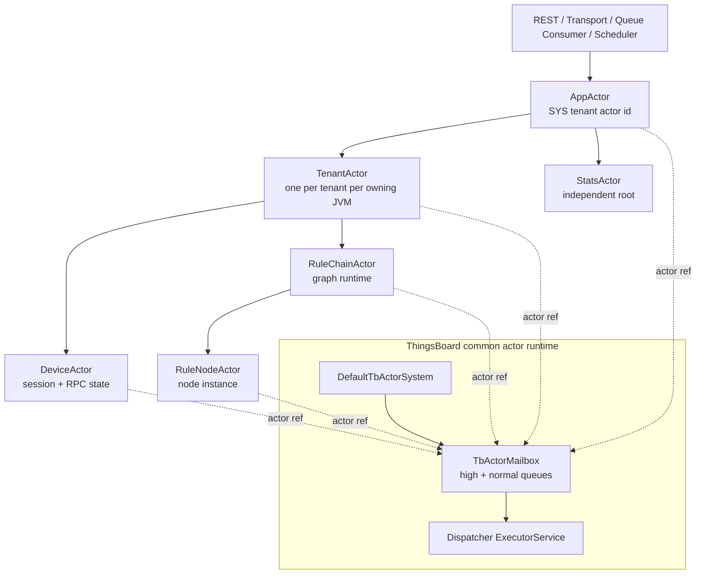
```mermaid
flowchart TB
  IN[REST / Transport / Queue Consumer / Scheduler] --> APP[AppActor<br/>SYS tenant actor id]
  APP --> TENANT[TenantActor<br/>one per tenant per owning JVM]
  TENANT --> DEVICE[DeviceActor<br/>session + RPC state]
  TENANT --> CHAIN[RuleChainActor<br/>graph runtime]
  CHAIN --> NODE[RuleNodeActor<br/>node instance]
  APP --> STATS[StatsActor<br/>independent root]
  subgraph Runtime[ThingsBoard common actor runtime]
    SYS[DefaultTbActorSystem]
    MB[TbActorMailbox<br/>high + normal queues]
    DISP[Dispatcher ExecutorService]
  end
  APP -. actor ref .-> MB
  TENANT -. actor ref .-> MB
  DEVICE -. actor ref .-> MB
  CHAIN -. actor ref .-> MB
  NODE -. actor ref .-> MB
  SYS --> MB --> DISP
```

### 1.1 需要先建立的边界

| 边界 | release-3.6 的实际含义 | 不应外推成 |
|---|---|---|
| Actor identity | 当前 JVM `ConcurrentMap<TbActorId,TbActorMailbox>` 中的唯一键 | 集群全局注册中心 |
| Mailbox | 两个 JVM 内 `ConcurrentLinkedQueue` | Kafka topic、持久化队列 |
| 串行性 | 同一 Mailbox 同时最多一个 `processMailbox()` 获得 `busy` | 整个租户或整个集群单线程 |
| Dispatcher | App/Tenant/Device/Rule 四组共享 `ExecutorService` | 一个 Actor 独占一个线程 |
| parent/child | 本地创建、广播和递归停止关系 | 远程监督树或自动重启树 |
| partition | Cluster/Queue 层先决定 owner，Actor 收到变更后创建或停止本地对象 | Actor 自己跨节点迁移 |
| success | `tell()` 只表示本地入队 | Kafka 已提交、数据库已提交或设备已处理 |

### 1.2 为什么不是普通 Spring 单例

普通 Spring Service 适合无状态协调和数据库事务，不适合保存每台在线设备的 session、RPC requestId、超时和订阅。若把这些状态放在 `ConcurrentHashMap<DeviceId,State>` 中，每个调用点仍要正确组合多把锁；Actor 把锁的粒度收敛为“一个业务对象的一条消息序列”，业务处理器可以按顺序读改状态。

[`org.thingsboard.server.actors.TbActorMailbox.processMailbox()`](../../../common/actor/src/main/java/org/thingsboard/server/actors/TbActorMailbox.java#L212) 是串行性的真正来源，而不是 `DeviceActor` 类上的注解或 synchronized。每批最多处理 `actors.system.throughput` 条，然后重新提交自身，让同一 Dispatcher 上的其他 Mailbox 获得执行机会。

### 1.3 核心结论

1. [`org.thingsboard.server.actors.service.DefaultActorService.startActorSystem()`](../../../application/src/main/java/org/thingsboard/server/actors/service/DefaultActorService.java#L132) 在 Spring `@PostConstruct` 中创建自研 `DefaultTbActorSystem`、四个 Dispatcher、`AppActor` 和 `StatsActor`。
2. [`org.thingsboard.server.actors.DefaultTbActorSystem.createActor(String,TbActorCreator,TbActorId)`](../../../common/actor/src/main/java/org/thingsboard/server/actors/DefaultTbActorSystem.java#L153) 用 actorId 级锁完成本 JVM 幂等创建，并在 Actor 注册后异步调用 `initActor()`。
3. [`org.thingsboard.server.actors.TbActorMailbox`](../../../common/actor/src/main/java/org/thingsboard/server/actors/TbActorMailbox.java#L46) 同时实现 `TbActorRef` 与 `TbActorCtx`：对外是可 `tell` 的引用，对内是 Actor 可路由、创建子 Actor、广播和停止的上下文。
4. Mailbox 使用高、普通两个无界 `ConcurrentLinkedQueue`。高优先级总是先 poll，但不能中断已经执行的消息；持续高优先级流量可以让普通队列长期等待。
5. `ready=false` 时消息仍可入队，初始化成功后统一开始处理。默认初始化失败按 `5000ms * attempt` 延迟重试，达到 `max_actor_init_attempts` 或不可恢复错误后停止。
6. 同一 Actor 串行并不代表固定线程。不同 batch 可由 work-stealing pool 的不同 worker 执行，因此跨消息状态依赖 Mailbox happens-before 和线程安全发布，不能依赖 `ThreadLocal`。
7. 默认普通 `Exception` 的 process failure 策略是 resume：当前失败消息不会自动重放，Mailbox 继续下一条；`Error` 才默认 stop。
8. App/Tenant/Device 与 RuleChain/RuleNode 是两条不同业务树。普通 telemetry 通常不经过 Device Actor，而 Queue consumer 的 Rule Engine 消息进入 App/Tenant/RuleChain/RuleNode。
9. Device Actor 按需创建；Tenant Actor 和 Rule Chain Actor可在应用初始化或分区接管时批量创建。分区移出时只停止不再归本节点的本地 Actor，不序列化其内存状态到远端。
10. Actor 本身不提供持久化、exactly-once、backpressure 或跨节点投递。Kafka callback、DAO Future、transport callback 的完成语义必须逐条从调用链判断。

---

## 二、入口

Actor System 的入口不是一个 HTTP URL，而是一组把 `TbActorMsg` 送到根 Actor 或特定 Actor 的 Java API。

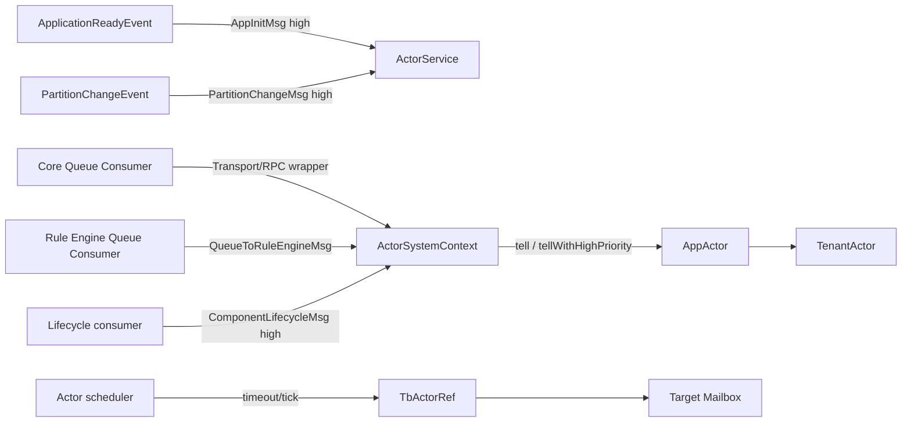
```mermaid
flowchart LR
  READY[ApplicationReadyEvent] -->|AppInitMsg high| AS[ActorService]
  PART[PartitionChangeEvent] -->|PartitionChangeMsg high| AS
  CORE[Core Queue Consumer] -->|Transport/RPC wrapper| CTX[ActorSystemContext]
  RE[Rule Engine Queue Consumer] -->|QueueToRuleEngineMsg| CTX
  LIFE[Lifecycle consumer] -->|ComponentLifecycleMsg high| CTX
  TIMER[Actor scheduler] -->|timeout/tick| REF[TbActorRef]
  CTX -->|tell / tellWithHighPriority| APP[AppActor]
  REF --> MB[Target Mailbox]
  APP --> TENANT[TenantActor]
```

### 2.1 Spring 启动入口

| 调用者 | 完整方法 | 输入 | 输出/副作用 |
|---|---|---|---|
| Spring Bean lifecycle | [`org.thingsboard.server.actors.service.DefaultActorService.startActorSystem()`](../../../application/src/main/java/org/thingsboard/server/actors/service/DefaultActorService.java#L132) | YAML 注入的 pool/throughput/retry 参数 | 本地 Actor runtime、四个 Dispatcher、两个 root Actor |
| Spring ready event | [`org.thingsboard.server.actors.service.DefaultActorService.onApplicationEvent(ApplicationReadyEvent)`](../../../application/src/main/java/org/thingsboard/server/actors/service/DefaultActorService.java#L180) | `ApplicationReadyEvent` | 高优先级 `AppInitMsg` |
| Cluster partition listener | [`org.thingsboard.server.actors.service.DefaultActorService.onTbApplicationEvent(PartitionChangeEvent)`](../../../application/src/main/java/org/thingsboard/server/actors/service/DefaultActorService.java#L192) | Core/Rule Engine partition change | 高优先级 `PartitionChangeMsg` |
| Spring shutdown | [`org.thingsboard.server.actors.service.DefaultActorService.stopActorSystem()`](../../../application/src/main/java/org/thingsboard/server/actors/service/DefaultActorService.java#L214) | `@PreDestroy` | 关闭 Dispatcher/scheduler，清空 actor map |

### 2.2 消息入口

[`org.thingsboard.server.actors.ActorSystemContext.tell(TbActorMsg)`](../../../application/src/main/java/org/thingsboard/server/actors/ActorSystemContext.java#L1187) 和 `tellWithHighPriority(TbActorMsg)` 把消息送入 `appActor`。Queue consumer、Core RPC、transport 和 lifecycle service 持有的是 `ActorSystemContext`，不直接访问 Mailbox map。

| 消息 | 常见调用者 | AppActor 分支 | 后续对象 |
|---|---|---|---|
| `QueueToRuleEngineMsg` | Rule Engine queue consumer | `onQueueToRuleEngineMsg(...)` | Tenant -> RuleChain -> RuleNode |
| `TransportToDeviceActorMsgWrapper` | Core queue/transport routing | `onToDeviceActorMsg(...,false)` | Tenant -> Device |
| credentials/attributes/RPC update | service notification consumer | `onToDeviceActorMsg(...,true)` | Tenant -> Device，高优先级 |
| `ComponentLifecycleMsg` | lifecycle notification consumer | `onComponentLifecycleMsg(...)` | Tenant/RuleChain/Device stop或reload |
| `PartitionChangeMsg` | local application event | broadcast high | Tenant，随后 RuleChain/Device cleanup |
| `SessionTimeoutCheckMsg` | Actor scheduler | App broadcast | Tenant -> Device |

### 2.3 直接 ActorRef 入口

内部组件也可以持有 [`org.thingsboard.server.actors.TbActorRef`](../../../common/actor/src/main/java/org/thingsboard/server/actors/TbActorRef.java#L29)，调用 `tell(TbActorMsg)` 或 `tellWithHighPriority(TbActorMsg)`。这两个方法都是 `void`；API 没有返回 Future，也没有内建 ask/reply。需要响应的流程把 callback 或 request metadata 放进消息体，由业务 Actor 显式回调。

---

## 三、完整调用链

下面以一条 Rule Engine queue 消息为主线，并把创建路径和设备路径并列说明。

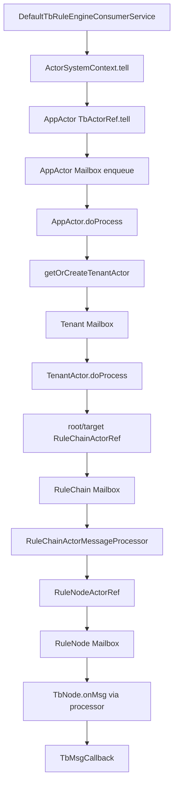
```mermaid
flowchart TD
  CONSUMER[DefaultTbRuleEngineConsumerService] --> ACTX[ActorSystemContext.tell]
  ACTX --> APPREF[AppActor TbActorRef.tell]
  APPREF --> APPMB[AppActor Mailbox enqueue]
  APPMB --> APPPROC[AppActor.doProcess]
  APPPROC --> TREF[getOrCreateTenantActor]
  TREF --> TMB[Tenant Mailbox]
  TMB --> TPROC[TenantActor.doProcess]
  TPROC --> RCREF[root/target RuleChainActorRef]
  RCREF --> RCMB[RuleChain Mailbox]
  RCMB --> RCP[RuleChainActorMessageProcessor]
  RCP --> RNREF[RuleNodeActorRef]
  RNREF --> RNMB[RuleNode Mailbox]
  RNMB --> NODE[TbNode.onMsg via processor]
  NODE --> CB[TbMsgCallback]
```

### 3.1 Actor runtime 创建链

| 步骤 | 类与方法 | 职责 | 输入 | 输出 | 设计原因 |
|---:|---|---|---|---|---|
| 1 | [`org.thingsboard.server.actors.service.DefaultActorService.startActorSystem()`](../../../application/src/main/java/org/thingsboard/server/actors/service/DefaultActorService.java#L132) | 创建 settings/runtime | Spring 配置 | `DefaultTbActorSystem` | 把 runtime 生命周期绑定到应用 |
| 2 | [`org.thingsboard.server.actors.DefaultTbActorSystem.createDispatcher(String,ExecutorService)`](../../../common/actor/src/main/java/org/thingsboard/server/actors/DefaultTbActorSystem.java#L86) | 注册命名线程池 | dispatcher name/executor | map entry | 隔离 App、Tenant、Device、Rule 的阻塞影响 |
| 3 | [`org.thingsboard.server.actors.DefaultTbActorSystem.createRootActor(String,TbActorCreator)`](../../../common/actor/src/main/java/org/thingsboard/server/actors/DefaultTbActorSystem.java#L128) | 创建 App/Stats root | creator | `TbActorRef` | 根 Actor 没有 parent |
| 4 | [`org.thingsboard.server.actors.DefaultTbActorSystem.createActor(String,TbActorCreator,TbActorId)`](../../../common/actor/src/main/java/org/thingsboard/server/actors/DefaultTbActorSystem.java#L153) | actorId 幂等检查、构造 Mailbox、登记 parent-child | dispatcher/creator/parent | Mailbox-as-ref | 原子发布后再异步初始化 |
| 5 | [`org.thingsboard.server.actors.TbActorMailbox.initActor()`](../../../common/actor/src/main/java/org/thingsboard/server/actors/TbActorMailbox.java#L95) | 把 init 提交到 Dispatcher | Actor/Mailbox | async task | 创建调用者不执行耗时 init |
| 6 | [`org.thingsboard.server.actors.TbActorMailbox.tryInit(int)`](../../../common/actor/src/main/java/org/thingsboard/server/actors/TbActorMailbox.java#L105) | 调 `actor.init(ctx)`、设置 ready、触发排队消息 | attempt | ready或retry/stop | 消息可在 init期间积压 |

### 3.2 一次 tell 的源码级链路

1. `org.thingsboard.server.actors.ActorSystemContext.tell(TbActorMsg)` 调本地 `appActor.tell(msg)`。
2. `org.thingsboard.server.actors.TbActorMailbox.tell(TbActorMsg)` 调 `enqueue(msg,false)`；高优先级版本传 `true`。
3. [`org.thingsboard.server.actors.TbActorMailbox.enqueue(TbActorMsg,boolean)`](../../../common/actor/src/main/java/org/thingsboard/server/actors/TbActorMailbox.java#L160) 把消息加入对应 `ConcurrentLinkedQueue`，再调用 `tryProcessQueue(true)`。
4. [`org.thingsboard.server.actors.TbActorMailbox.tryProcessQueue(boolean)`](../../../common/actor/src/main/java/org/thingsboard/server/actors/TbActorMailbox.java#L191) 只有在 `ready=true` 且 `busy.compareAndSet(false,true)` 成功时提交 runner。
5. `processMailbox()` 每轮优先 poll high queue，再 poll normal queue，并同步调用 `actor.process(msg)`。
6. 一轮达到 throughput 后直接再次提交 `processMailbox`；发现两队列为空时先释放 busy，再异步复查，封闭“空检查与新消息并发”窗口。

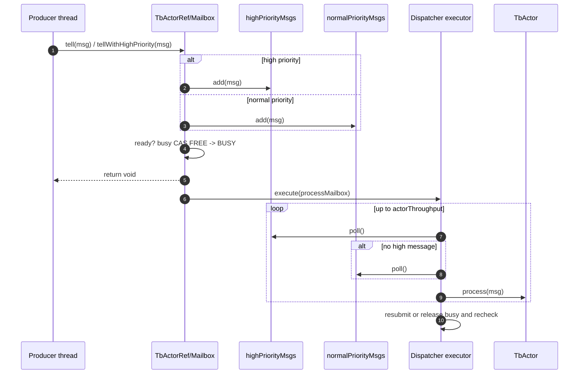
```mermaid
sequenceDiagram
  autonumber
  participant P as Producer thread
  participant R as TbActorRef/Mailbox
  participant H as highPriorityMsgs
  participant N as normalPriorityMsgs
  participant E as Dispatcher executor
  participant A as TbActor
  P->>R: tell(msg) / tellWithHighPriority(msg)
  alt high priority
    R->>H: add(msg)
  else normal priority
    R->>N: add(msg)
  end
  R->>R: ready? busy CAS FREE -> BUSY
  R-->>P: return void
  R->>E: execute(processMailbox)
  loop up to actorThroughput
    E->>H: poll()
    alt no high message
      E->>N: poll()
    end
    E->>A: process(msg)
  end
  E->>E: resubmit or release busy and recheck
```

### 3.3 App -> Tenant 路由

[`org.thingsboard.server.actors.app.AppActor.doProcess(TbActorMsg)`](../../../application/src/main/java/org/thingsboard/server/actors/app/AppActor.java#L109) 按 `MsgType` 分派。Rule Engine 消息调用 `onQueueToRuleEngineMsg(QueueToRuleEngineMsg)`；设备消息调用 `onToDeviceActorMsg(TenantAwareMsg,boolean)`。

[`org.thingsboard.server.actors.app.AppActor.getOrCreateTenantActor(TenantId)`](../../../application/src/main/java/org/thingsboard/server/actors/app/AppActor.java#L262) 以 `TbEntityActorId(tenantId)` 为键，在 Tenant Dispatcher 创建 `TenantActor.ActorCreator`。删除过的 tenant 保存在本地 `deletedTenants`，该 JVM 后续不再重建其 Actor。

### 3.4 Tenant -> Device 路由

[`org.thingsboard.server.actors.tenant.TenantActor.onToDeviceActorMsg(DeviceAwareMsg,boolean)`](../../../application/src/main/java/org/thingsboard/server/actors/tenant/TenantActor.java#L288) 过滤 `deletedDevices`，随后调用 [`getOrCreateDeviceActor(DeviceId)`](../../../application/src/main/java/org/thingsboard/server/actors/tenant/TenantActor.java#L395)，以 Device Dispatcher 按需创建 `DeviceActor`。

[`org.thingsboard.server.actors.device.DeviceActor.doProcess(TbActorMsg)`](../../../application/src/main/java/org/thingsboard/server/actors/device/DeviceActor.java#L83) 把 session、attributes、credentials、RPC、edge update 与 timeout 消息交给 `DeviceActorMessageProcessor`。`DEVICE_DELETE` 则直接 `ctx.stop(ctx.getSelf())`。

### 3.5 Tenant -> RuleChain -> RuleNode 路由

1. [`org.thingsboard.server.actors.tenant.TenantActor.onQueueToRuleEngineMsg(QueueToRuleEngineMsg)`](../../../application/src/main/java/org/thingsboard/server/actors/tenant/TenantActor.java#L240) 检查本服务是否运行 Rule Engine及 API usage；无显式 chainId 时投 root chain，有 chainId 时直接 tell 对应 Actor。
2. [`org.thingsboard.server.actors.ruleChain.RuleChainManagerActor.getOrCreateActor(RuleChainId,Function)`](../../../application/src/main/java/org/thingsboard/server/actors/ruleChain/RuleChainManagerActor.java#L150) 在 Rule Dispatcher 创建 RuleChainActor；找不到配置时创建 `RuleChainErrorActor`。
3. RuleChain 初始化时，[`org.thingsboard.server.actors.ruleChain.RuleChainActorMessageProcessor.createRuleNodeActor(TbActorCtx,RuleNode)`](../../../application/src/main/java/org/thingsboard/server/actors/ruleChain/RuleChainActorMessageProcessor.java#L234) 为每个 node 创建子 Actor，并从 relation表建立内存 route map。
4. [`org.thingsboard.server.actors.ruleChain.RuleChainActorMessageProcessor.onQueueToRuleEngineMsg(QueueToRuleEngineMsg)`](../../../application/src/main/java/org/thingsboard/server/actors/ruleChain/RuleChainActorMessageProcessor.java#L282) 选择 first node或续跑 node，并调用 `pushMsgToNode(...)`。
5. Node Actor调用实际 `TbNode.onMsg(TbContext,TbMsg)`；节点通过 tell-next、relation 或 callback把结果回到 RuleChain。

---

## 四、消息流

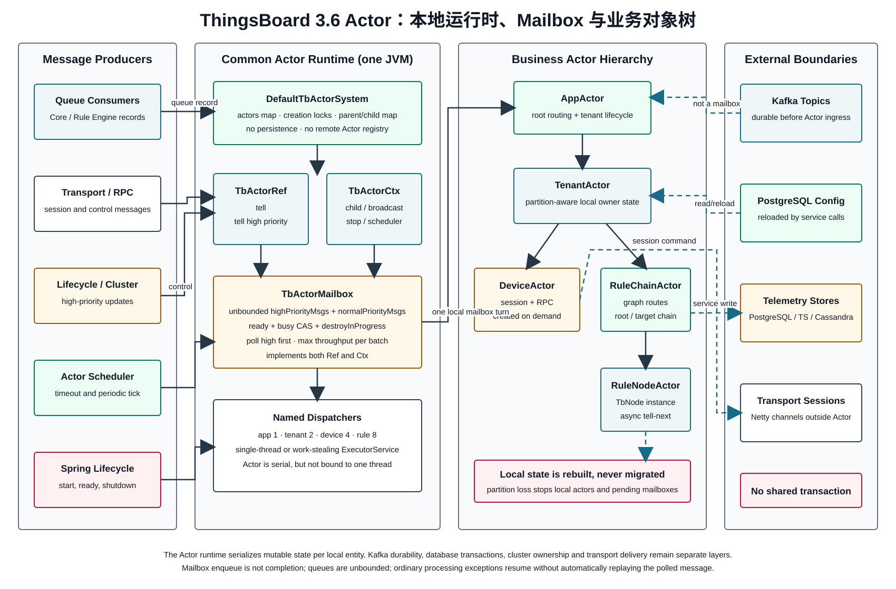

### 4.1 Mailbox 调度原理

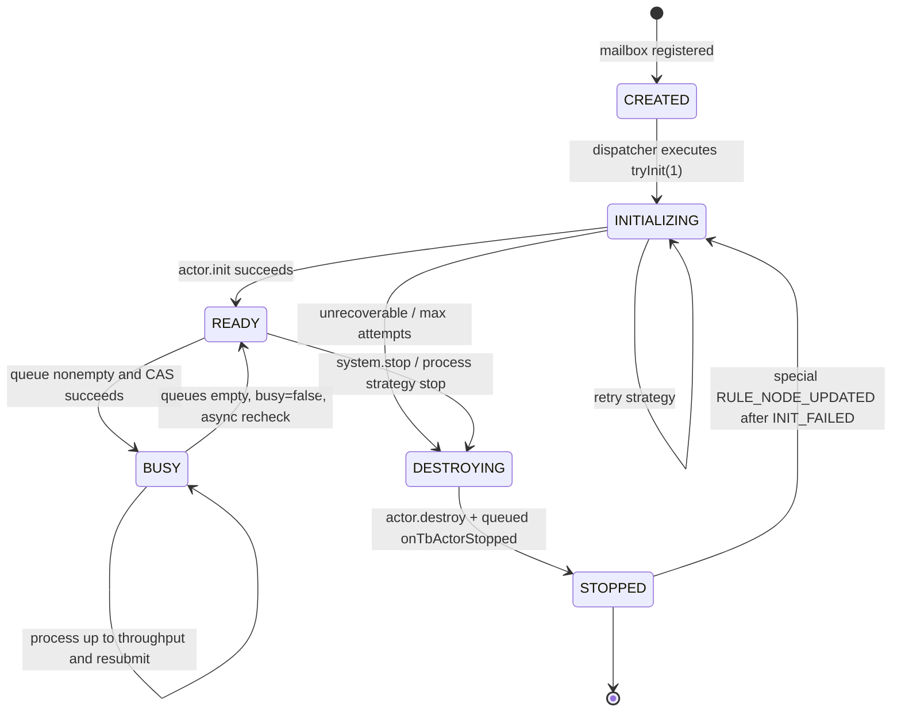
```mermaid
stateDiagram-v2
  [*] --> CREATED: mailbox registered
  CREATED --> INITIALIZING: dispatcher executes tryInit(1)
  INITIALIZING --> INITIALIZING: retry strategy
  INITIALIZING --> READY: actor.init succeeds
  INITIALIZING --> DESTROYING: unrecoverable / max attempts
  READY --> BUSY: queue nonempty and CAS succeeds
  BUSY --> BUSY: process up to throughput and resubmit
  BUSY --> READY: queues empty, busy=false, async recheck
  READY --> DESTROYING: system.stop / process strategy stop
  DESTROYING --> STOPPED: actor.destroy + queued onTbActorStopped
  STOPPED --> INITIALIZING: special RULE_NODE_UPDATED after INIT_FAILED
  STOPPED --> [*]
```

`busy` 是 Mailbox 级原子门闩。多个 producer 可以同时 enqueue，但只有一个 runner 能从队列 poll；因此同一 Actor 的 `process` 不并发。不同 Actor 的 Mailbox 互不共享 busy，可以在 Dispatcher 多线程池上并发。

### 4.2 优先级与公平性

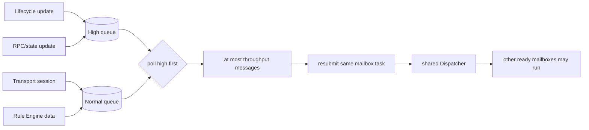
```mermaid
flowchart LR
  HP1[Lifecycle update] --> HQ[(High queue)]
  HP2[RPC/state update] --> HQ
  NP1[Transport session] --> NQ[(Normal queue)]
  NP2[Rule Engine data] --> NQ
  HQ --> POLL{poll high first}
  NQ --> POLL
  POLL --> BATCH[at most throughput messages]
  BATCH --> RESUBMIT[resubmit same mailbox task]
  RESUBMIT --> DISP[shared Dispatcher]
  DISP --> OTHER[other ready mailboxes may run]
```

throughput 只改善“Actor之间”的调度机会，不保证同一 Actor 的 high/normal 公平。只要每次 high poll 都有值，normal queue 就不会被取出。高优先级应该用于配置/删除/RPC状态等少量控制消息，不能把连续遥测误标为 high。

### 4.3 业务树与线程池

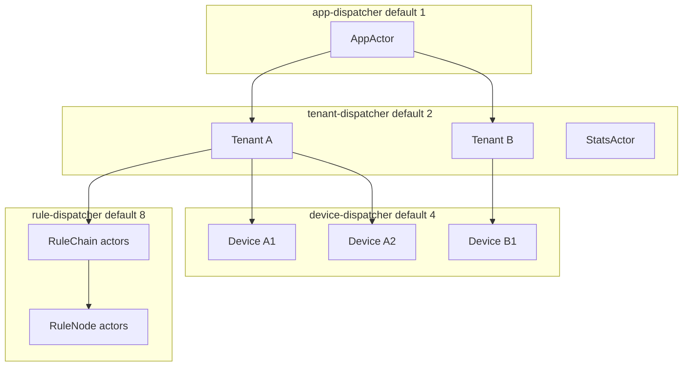
```mermaid
flowchart TB
  subgraph APPD[app-dispatcher default 1]
    APP[AppActor]
  end
  subgraph TD[tenant-dispatcher default 2]
    T1[Tenant A]
    T2[Tenant B]
    ST[StatsActor]
  end
  subgraph DD[device-dispatcher default 4]
    D1[Device A1]
    D2[Device A2]
    D3[Device B1]
  end
  subgraph RD[rule-dispatcher default 8]
    RC[RuleChain actors]
    RN[RuleNode actors]
  end
  APP --> T1 & T2
  T1 --> D1 & D2 & RC
  T2 --> D3
  RC --> RN
```

当配置值为 `1` 时，[`org.thingsboard.server.actors.service.DefaultActorService.initDispatcherExecutor(String,int)`](../../../application/src/main/java/org/thingsboard/server/actors/service/DefaultActorService.java#L161) 创建 single-thread executor；大于 `1` 时创建 ThingsBoard work-stealing pool；值为 `0` 时取 `max(1,CPU/2)`。默认值来自 [`application/src/main/resources/thingsboard.yml`](../../../application/src/main/resources/thingsboard.yml#L419)：throughput 5，App/Tenant/Device/Rule pool分别1/2/4/8。

### 4.4 分区变更流

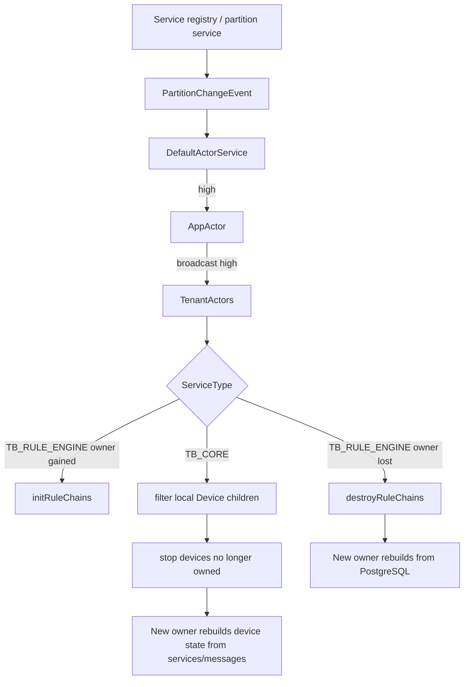
```mermaid
flowchart TD
  REG[Service registry / partition service] --> EVT[PartitionChangeEvent]
  EVT --> DAS[DefaultActorService]
  DAS -->|high| APP[AppActor]
  APP -->|broadcast high| TENANTS[TenantActors]
  TENANTS --> TYPE{ServiceType}
  TYPE -->|TB_RULE_ENGINE owner gained| INIT[initRuleChains]
  TYPE -->|TB_RULE_ENGINE owner lost| STOPRC[destroyRuleChains]
  TYPE -->|TB_CORE| FILTER[filter local Device children]
  FILTER --> STOPD[stop devices no longer owned]
  STOPRC --> REMOTE[New owner rebuilds from PostgreSQL]
  STOPD --> REMOTE2[New owner rebuilds device state from services/messages]
```

[`org.thingsboard.server.actors.tenant.TenantActor.onPartitionChangeMsg(PartitionChangeMsg)`](../../../application/src/main/java/org/thingsboard/server/actors/tenant/TenantActor.java#L310) 对 Rule Engine owner变化初始化或销毁所有 rule chain actors；Core变化则过滤 child Device Actor并停止不再属于本节点的对象。内存 mailbox和 session map不会被复制，新 owner依赖后续消息与数据库重新构造。

---

## 五、时序图

完整 PlantUML 时序图覆盖启动、初始化期间排队、Queue消息逐层路由、throughput让出、分区移出和关闭：

[打开 PlantUML 源文件](sequence.puml) | [新窗口打开原始 SVG](sequence.svg)

[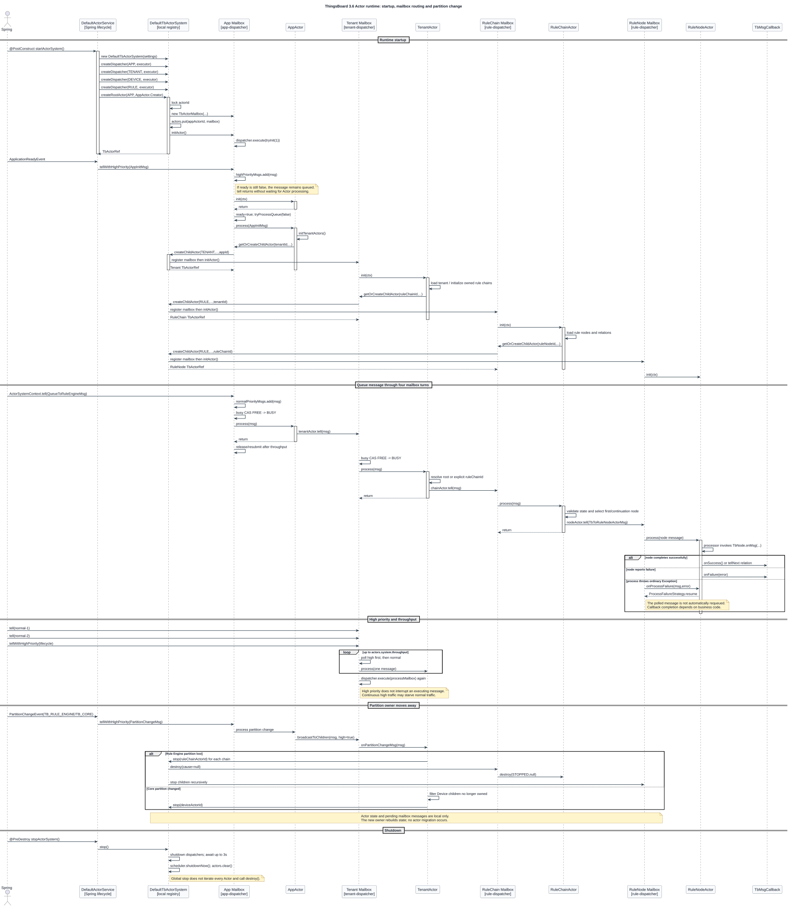](sequence.svg)

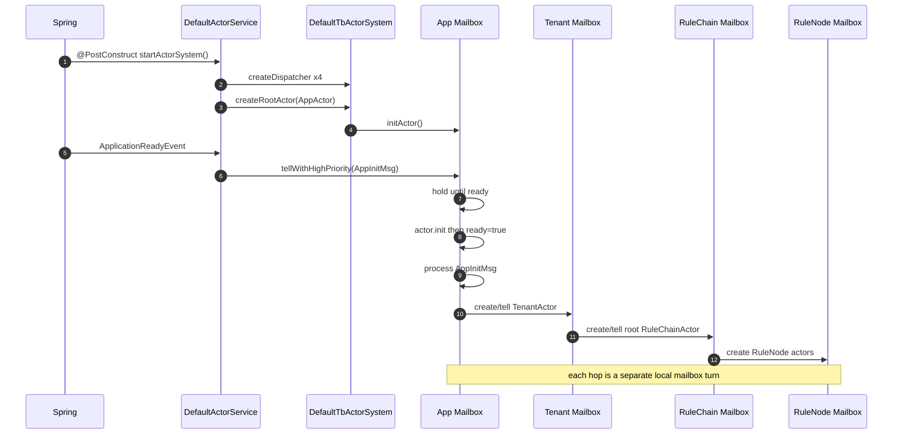
```mermaid
sequenceDiagram
  autonumber
  participant S as Spring
  participant AS as DefaultActorService
  participant SYS as DefaultTbActorSystem
  participant AM as App Mailbox
  participant TM as Tenant Mailbox
  participant RM as RuleChain Mailbox
  participant NM as RuleNode Mailbox
  S->>AS: @PostConstruct startActorSystem()
  AS->>SYS: createDispatcher x4
  AS->>SYS: createRootActor(AppActor)
  SYS->>AM: initActor()
  S->>AS: ApplicationReadyEvent
  AS->>AM: tellWithHighPriority(AppInitMsg)
  AM->>AM: hold until ready
  AM->>AM: actor.init then ready=true
  AM->>AM: process AppInitMsg
  AM->>TM: create/tell TenantActor
  TM->>RM: create/tell root RuleChainActor
  RM->>NM: create RuleNode actors
  Note over AM,NM: each hop is a separate local mailbox turn
```

时序图中的箭头不代表一个数据库事务。每个 `tell` 都是独立内存入队点；上游调用返回时，下游 Actor可能尚未开始执行。

---

## 六、数据变化

### 6.1 JVM 内 Actor runtime 状态

| 状态 | 所在类 | 写入时机 | 清理时机 |
|---|---|---|---|
| dispatcher map | `org.thingsboard.server.actors.DefaultTbActorSystem` | start注册四个 pool | service shutdown |
| actor map | 同上 | createActor在 init前登记 Mailbox | `stop(actorId)`；全局 stop直接 clear |
| actor creation locks | 同上 | 同 actorId并发创建 | create finally中移除 |
| parent-child map | 同上 | child actor创建完成 | parent/child stop |
| high/normal queues | `org.thingsboard.server.actors.TbActorMailbox` | producer tell | process poll；destroy只通知剩余消息 |
| ready/busy/destroy flags | Mailbox | init、调度、destroy | Mailbox生命周期结束 |
| deleted tenant/device sets | AppActor/TenantActor | lifecycle delete | Actor/JVM销毁 |
| Rule Chain graph/routes | RuleChain processor | Actor init/reload | destroy或partition移出 |
| Device session/RPC maps | Device processor | transport/RPC消息 | timeout、delete、partition移出、JVM停止 |

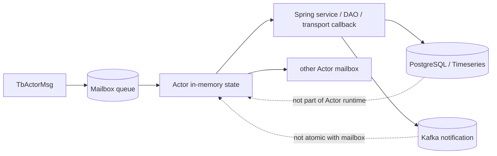
```mermaid
flowchart LR
  MSG[TbActorMsg] --> Q[(Mailbox queue)]
  Q --> STATE[Actor in-memory state]
  STATE --> SERVICE[Spring service / DAO / transport callback]
  SERVICE --> DB[(PostgreSQL / Timeseries)]
  SERVICE --> KAFKA[(Kafka notification)]
  STATE --> Q2[other Actor mailbox]
  DB -. not part of Actor runtime .-> STATE
  KAFKA -. not atomic with mailbox .-> STATE
```

### 6.2 数据库、缓存、Session、Kafka

- **数据库**：创建 Actor不写数据库。RuleChain init会读 chain、node、relation；Device Actor init会读取设备/profile等运行数据。实际写库由处理器调用 DAO/service，事务边界属于被调用服务。
- **缓存**：Actor System没有统一 snapshot cache。`ActorSystemContext` 注入的 profile、attributes、relation等服务可能各自使用 Caffeine/Redis；Actor还会长期持有已加载对象。
- **Session**：Device Actor processor维护当前设备连接、订阅和RPC状态；连接的 Netty channel仍在 Transport进程，不存入 Mailbox。
- **Kafka topic**：Mailbox不对应 topic。Kafka consumer把 record包装为 Actor消息，Actor callback最终影响 record ack/commit；具体语义在第17章分析。
- **Cluster**：本地 parent-child map不会发布到注册中心。分区服务只告诉本地 Actor哪些对象应存在，远端节点各自维护独立 map。

### 6.3 生命周期图

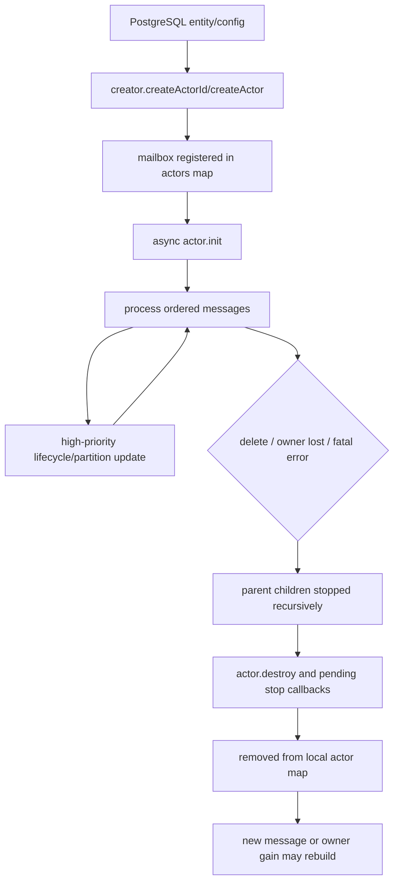
```mermaid
flowchart TD
  CONFIG[PostgreSQL entity/config] --> CREATE[creator.createActorId/createActor]
  CREATE --> REGISTER[mailbox registered in actors map]
  REGISTER --> INIT[async actor.init]
  INIT --> LIVE[process ordered messages]
  LIVE --> RELOAD[high-priority lifecycle/partition update]
  RELOAD --> LIVE
  LIVE --> STOP{delete / owner lost / fatal error}
  STOP --> CHILD[parent children stopped recursively]
  CHILD --> DESTROY[actor.destroy and pending stop callbacks]
  DESTROY --> GONE[removed from local actor map]
  GONE --> RECREATE[new message or owner gain may rebuild]
```

---

## 七、源码分析

### 7.1 运行时接口与实现

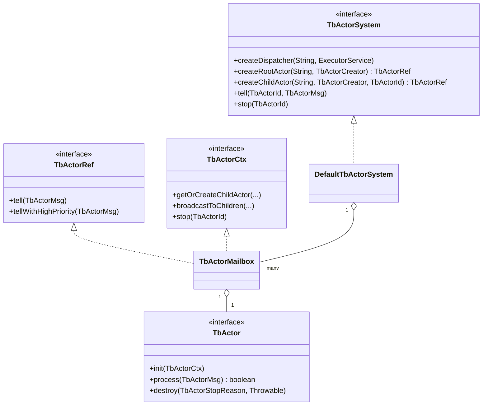
```mermaid
classDiagram
  class TbActorSystem {
    <<interface>>
    +createDispatcher(String, ExecutorService)
    +createRootActor(String, TbActorCreator) TbActorRef
    +createChildActor(String, TbActorCreator, TbActorId) TbActorRef
    +tell(TbActorId, TbActorMsg)
    +stop(TbActorId)
  }
  class DefaultTbActorSystem
  class TbActorRef {
    <<interface>>
    +tell(TbActorMsg)
    +tellWithHighPriority(TbActorMsg)
  }
  class TbActorCtx {
    <<interface>>
    +getOrCreateChildActor(...)
    +broadcastToChildren(...)
    +stop(TbActorId)
  }
  class TbActorMailbox
  class TbActor {
    <<interface>>
    +init(TbActorCtx)
    +process(TbActorMsg) boolean
    +destroy(TbActorStopReason, Throwable)
  }
  TbActorSystem <|.. DefaultTbActorSystem
  TbActorRef <|.. TbActorMailbox
  TbActorCtx <|.. TbActorMailbox
  DefaultTbActorSystem "1" o-- "many" TbActorMailbox
  TbActorMailbox "1" o-- "1" TbActor
```

| 类型 | 包路径 | 关键职责 |
|---|---|---|
| `TbActorSystem` | `org.thingsboard.server.actors.TbActorSystem` | runtime契约、创建、投递、广播、停止 |
| `DefaultTbActorSystem` | `org.thingsboard.server.actors.DefaultTbActorSystem` | JVM内 registry、creation lock、parent-child、scheduler |
| `TbActorMailbox` | `org.thingsboard.server.actors.TbActorMailbox` | queue、ready/busy状态、Dispatcher调度、Actor Context/Ref |
| `TbActor` | `org.thingsboard.server.actors.TbActor` | init/process/destroy与失败策略契约 |
| `AbstractTbActor` | `org.thingsboard.server.actors.AbstractTbActor` | 保存 ctx并返回 actor ref |
| `TbActorCreator` | `org.thingsboard.server.actors.TbActorCreator` | 延迟生成 actorId和实例 |
| `TbEntityActorId` | `org.thingsboard.server.actors.TbEntityActorId` | 用 `EntityId` 的 type+UUID作为本地唯一键 |
| `Dispatcher` | `org.thingsboard.server.actors.Dispatcher` | dispatcherId与ExecutorService值对象 |
| `ActorSystemContext` | `org.thingsboard.server.actors.ActorSystemContext` | 汇集 Spring services、配置、appActor和scheduler helper |

### 7.2 业务 Actor 继承关系

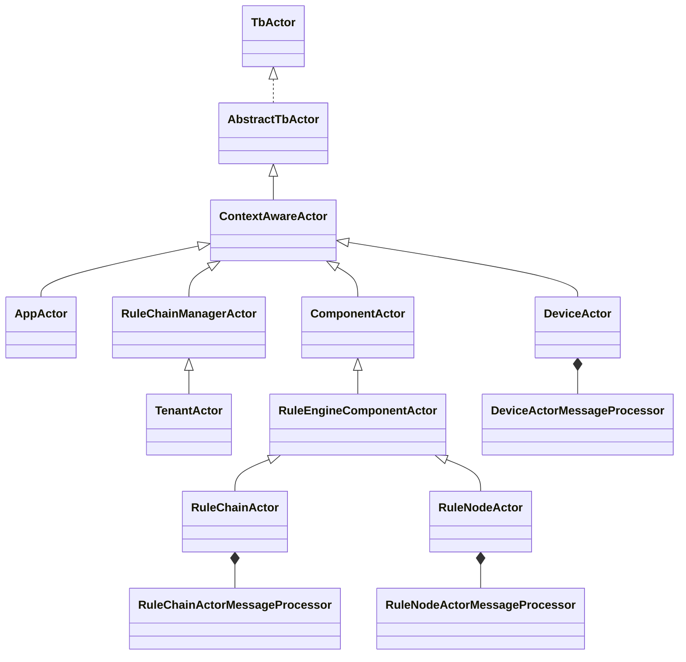
```mermaid
classDiagram
  TbActor <|.. AbstractTbActor
  AbstractTbActor <|-- ContextAwareActor
  ContextAwareActor <|-- AppActor
  ContextAwareActor <|-- RuleChainManagerActor
  RuleChainManagerActor <|-- TenantActor
  ContextAwareActor <|-- DeviceActor
  ContextAwareActor <|-- ComponentActor
  ComponentActor <|-- RuleEngineComponentActor
  RuleEngineComponentActor <|-- RuleChainActor
  RuleEngineComponentActor <|-- RuleNodeActor
  DeviceActor *-- DeviceActorMessageProcessor
  RuleChainActor *-- RuleChainActorMessageProcessor
  RuleNodeActor *-- RuleNodeActorMessageProcessor
```

`ContextAwareActor.process(TbActorMsg)` 统一日志并调用 `doProcess`；它无论是否处理都返回 `false`，而 Mailbox根本不读取返回值。`doProcess` 的 boolean只用于在类内决定是否打印 “Unprocessed message”。

`ComponentActor` 负责 rule component通用 init/destroy/lifecycle/stats；`RuleEngineComponentActor` 增加 Rule Engine notification。业务状态大量下沉到 `DeviceActorMessageProcessor`、`RuleChainActorMessageProcessor` 和 `RuleNodeActorMessageProcessor`，Actor类本身主要做 MsgType dispatch。

### 7.3 Actor ID 与唯一性

[`org.thingsboard.server.actors.TbEntityActorId.equals(Object)`](../../../common/actor/src/main/java/org/thingsboard/server/actors/TbEntityActorId.java#L68) 委托 `EntityId.equals`，hashCode同样来自 entityId。Actor map是本 JVM全类型共享 map，因此 UUID和EntityType共同决定唯一性；同一 Device不会在同 JVM的两个 Tenant Actor下创建两个 Device Actor。

### 7.4 创建并发

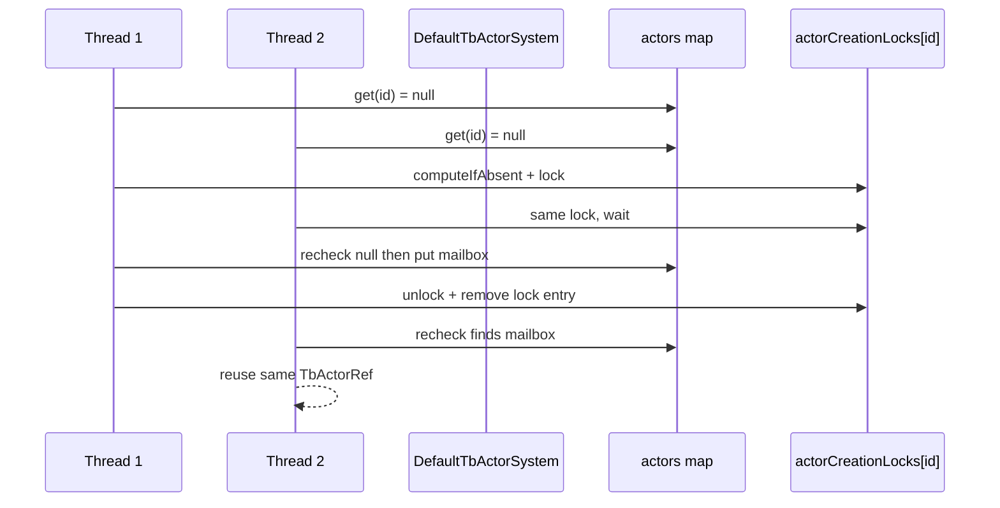
```mermaid
sequenceDiagram
  participant T1 as Thread 1
  participant T2 as Thread 2
  participant SYS as DefaultTbActorSystem
  participant MAP as actors map
  participant LOCK as actorCreationLocks[id]
  T1->>MAP: get(id) = null
  T2->>MAP: get(id) = null
  T1->>LOCK: computeIfAbsent + lock
  T2->>LOCK: same lock, wait
  T1->>MAP: recheck null then put mailbox
  T1->>LOCK: unlock + remove lock entry
  T2->>MAP: recheck finds mailbox
  T2-->>T2: reuse same TbActorRef
```

创建锁只保护构造和注册，不保护 Actor业务状态。Actor注册发生在 `initActor()` 之前，所以并发发送者可以马上得到 ref并入队；`ready` 门闩保证 init成功前不调用 `process`。

### 7.5 stop 与 shutdown 的不同

[`org.thingsboard.server.actors.DefaultTbActorSystem.stop(TbActorId)`](../../../common/actor/src/main/java/org/thingsboard/server/actors/DefaultTbActorSystem.java#L337) 先递归 stop children、从所有 parent集合移除、再从 actor map移除并异步 `mailbox.destroy`。pending消息会收到 `onTbActorStopped(reason)`。

全局 [`org.thingsboard.server.actors.DefaultTbActorSystem.stop()`](../../../common/actor/src/main/java/org/thingsboard/server/actors/DefaultTbActorSystem.java#L358) 关闭 dispatcher并最多等待3秒，然后关闭 scheduler并直接 `actors.clear()`；它没有逐个调用所有 Actor的 `destroy`。因此正常停机时需要依赖各服务/资源自己的 Spring lifecycle，不能假设每个 Actor都收到 destroy callback。

---

## 八、Actor 分析

### 8.1 Actor 为什么有效

以 Device Actor为例，MQTT reconnect、disconnect、RPC timeout、credentials update可能来自不同线程和不同队列。全部落到相同 `TbEntityActorId(DeviceId)` 后，`DeviceActorMessageProcessor` 看到的是确定的单条执行序列，不需要为 session map的组合操作加粗粒度锁。

### 8.2 Actor 不会自动解决的问题

- 跨 Actor顺序：App先 tell Tenant A再 tell Tenant B，只保证各自队列顺序，不保证两者完成先后。
- 跨优先级顺序：后到的 high消息会越过先到但尚未处理的 normal消息。
- 外部副作用顺序：Actor发起异步 DAO Future后继续处理下一条，除非业务代码把 continuation重新投回自身。
- producer背压：两条队列没有容量，`tell` 不阻塞也不拒绝，过载会转化为堆内存增长和延迟。
- 崩溃恢复：Mailbox不落盘，JVM退出后未完成消息消失；可靠性依赖上游 Kafka offset策略。
- 集群单例：一个 entity在短暂 partition收敛期间可能在不同 JVM各有本地 Actor，owner和queue路由才是最终约束。

### 8.3 阻塞风险

Actor代码运行在共享 Dispatcher。若一个 Rule Node在 `process` 中同步等待 HTTP或数据库，它不仅阻塞自己，也占住 rule-dispatcher worker；线程池耗尽后所有 RuleChain/RuleNode Mailbox积压。正确模式是发起异步调用，在 callback中通过 `ctx.tell(...)` 或节点 callback恢复状态机。

### 8.4 内存估算思路

生产排查不能只数设备表行数，应分别看：当前 owner上的 Tenant Actor数、活跃 Device Actor数、RuleChain/RuleNode Actor数、每个 Mailbox两队列长度、Device session/RPC map和 Rule Node内部缓存。release-3.6 Mailbox没有公开 queue-depth metric，通常需要结合 heap histogram、actor日志、queue lag和线程 dump判断。

---

## 九、Kafka 分析

Actor runtime不依赖 Kafka客户端，但 Application通常通过 Kafka队列把跨线程、跨进程消息送到 owning JVM。

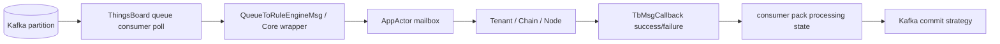
```mermaid
flowchart LR
  K[(Kafka partition)] --> POLL[ThingsBoard queue consumer poll]
  POLL --> WRAP[QueueToRuleEngineMsg / Core wrapper]
  WRAP --> APP[AppActor mailbox]
  APP --> TREE[Tenant / Chain / Node]
  TREE --> CALLBACK[TbMsgCallback success/failure]
  CALLBACK --> PACK[consumer pack processing state]
  PACK --> COMMIT[Kafka commit strategy]
```

### 9.1 Producer

Actor `tell` 不是 Kafka producer。Transport或Cluster service决定目标 service/partition并写 topic；记录到达本服务后，consumer才调用 `ActorSystemContext`。本地 Actor到Actor hop通常不再经过Kafka。

### 9.2 Topic、Partition 与 Consumer Group

- Topic和partition用于把 tenant/entity消息路由到 owner service；ActorId map只在 owner JVM中查找。
- Consumer group决定一个partition由哪个服务实例poll；Actor不能修复重复消费或rebalance并发。
- `PartitionChangeEvent` 是分配结果进入Actor树的控制面消息，促使本地停止旧 owner状态或初始化新 owner状态。

### 9.3 Ack 边界

`QueueToRuleEngineMsg` 携带的 `TbMsgCallback` 才把 Rule Engine结果带回consumer pack。App/Tenant发现系统tenant、无root chain、Rule Engine禁用或对象不存在时会主动 success/failure；普通 `tell()` 返回不触发 Kafka commit。第17章会逐项分析 poll pack、timeout、retry strategy与commit。

### 9.4 为什么仍需要 Actor

Kafka只保证partition内 record顺序，不管理 Device session、Rule Chain graph或一次消息在多个节点间的fan-out。Actor把 consumer并发交付进一步映射到业务对象级状态机，并允许 control消息走高优先级。

---

## 十、数据库分析

### 10.1 Actor创建不等于数据库写入

Actor registry、Mailbox和parent-child map完全位于堆内。PostgreSQL、TimescaleDB、Cassandra和Redis中都没有 Actor表，也没有 Mailbox表。重启后 Actor由配置表、分区归属和新消息重新创建。

### 10.2 各 Actor 与持久化的关系

| Actor | 初始化/处理时可能读取 | 处理时可能写入 | 事务边界 |
|---|---|---|---|
| AppActor | tenant分页 | 无固定业务表 | `TenantService`各方法 |
| TenantActor | tenant、API usage、rule chains | 无固定表；主要路由 | 被调用service |
| DeviceActor | device/profile/credentials、persistent RPC | attributes、RPC状态、activity telemetry等 | 各DAO/service Future，非Mailbox事务 |
| RuleChainActor | rule_chain、rule_node、relation | debug event、统计、节点副作用 | 各节点调用service |
| RuleNodeActor | node config与组件实现 | 取决于具体TbNode | 每个节点自行定义 |
| StatsActor | 运行指标 | stats存储 | stats service |

### 10.3 PostgreSQL 与 Actor 状态一致性

数据库事务提交不会自动向 Actor reload。Service通常在提交后发布 `ComponentLifecycleMsg`，再由 App/Tenant把高优先级消息转发到目标 Actor。两者不是一个事务：数据库已提交但通知失败会留下旧内存配置；通知先被消费但外层事务随后回滚也可能让Actor观察到不存在的变更，具体取决于调用流程是否使用 after-commit。

### 10.4 TimescaleDB/Cassandra

遥测历史写入通常由 Save Timeseries Node调用 timeseries service，不因使用 Actor而改变后端。Device telemetry `PUBLISH` 常直接投 Rule Engine Queue，不先进入 Device Actor；因此“每台设备一个Actor串行写ts_kv”不是 release-3.6 的架构。

### 10.5 Redis

Redis可承担缓存和服务间状态，但不承载 Actor Mailbox。使用Redis cache也不会让两个 JVM共享同一个 Device Actor实例。

---

## 十一、异常处理

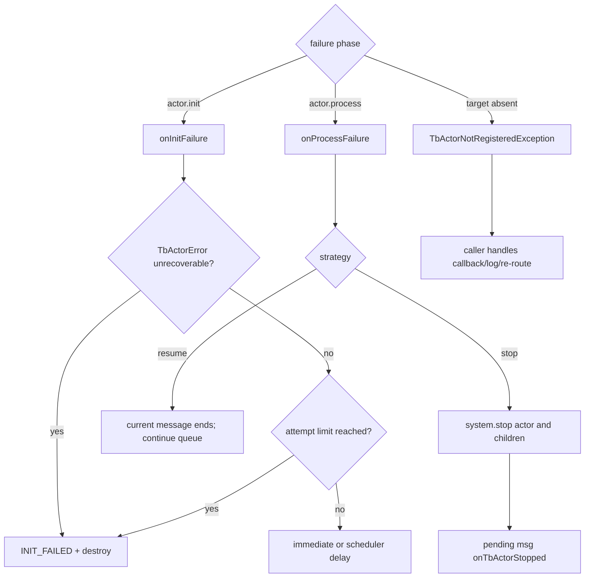
```mermaid
flowchart TD
  PHASE{failure phase} -->|actor.init| INIT[onInitFailure]
  INIT --> UNREC{TbActorError unrecoverable?}
  UNREC -->|yes| STOPI[INIT_FAILED + destroy]
  UNREC -->|no| LIMIT{attempt limit reached?}
  LIMIT -->|no| RETRY[immediate or scheduler delay]
  LIMIT -->|yes| STOPI
  PHASE -->|actor.process| PROC[onProcessFailure]
  PROC --> KIND{strategy}
  KIND -->|resume| DROP[current message ends; continue queue]
  KIND -->|stop| STOPS[system.stop actor and children]
  PHASE -->|target absent| ABS[TbActorNotRegisteredException]
  ABS --> OWNER[caller handles callback/log/re-route]
  STOPS --> PENDING[pending msg onTbActorStopped]
```

### 11.1 初始化失败

`TbActor.onInitFailure(int,Throwable)` 默认返回 `retryWithDelay(5000L * attempt)`。Mailbox的 `attemptIdx` 从2开始与 `max_actor_init_attempts` 比较；配置10意味着第10次失败后下一 attempt超过上限并停止。不可恢复 `TbActorError` 直接 stop。

init期间 producer仍可入队。若持续失败，队列会增长；最终 `destroy` 遍历pending消息并调用 `onTbActorStopped(INIT_FAILED)`。特殊的高优先级 `RULE_NODE_UPDATED_MSG` 可在 INIT_FAILED后清除destroy标志并重新init，支持修复节点配置后恢复。

### 11.2 处理失败

默认 `Exception -> resume` 不等于重试：失败消息已从queue poll，不会重新放回。业务callback是否收到failure取决于 Actor/processor抛出前是否正确处理；仅靠 Mailbox捕获异常不能自动完成 Kafka callback。

`Error -> stop` 会递归停止children。该JVM之后若再通过 parent `getOrCreateChildActor` 路由，可能重新创建 Actor；若parent本身停止，则发送到旧 ref只会进入处于destroy状态的 Mailbox并触发 stopped callback。

### 11.3 队列过载

Mailbox没有容量、拒绝策略或超时。可观测症状通常是：Kafka lag持续上涨、Dispatcher线程长时间RUNNABLE/BLOCKED、heap中 `ConcurrentLinkedQueue$Node` 与消息对象增长、业务callback timeout。调优只增大 Dispatcher可能把压力推向数据库；应先定位同步阻塞节点、外部服务延迟和单entity热点。

### 11.4 停机

全局 stop等待每个 Dispatcher最多3秒后清空 map，未提供 Mailbox drain完成保证。生产升级依赖 Queue consumer先停止拉取/提交、服务摘除和容器termination grace period；不能把 `@PreDestroy` 当成所有业务消息处理完成的屏障。

---

## 十二、源码阅读路线

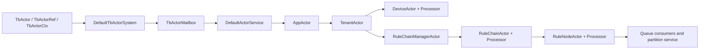
```mermaid
flowchart LR
  A[TbActor / TbActorRef / TbActorCtx] --> B[DefaultTbActorSystem]
  B --> C[TbActorMailbox]
  C --> D[DefaultActorService]
  D --> E[AppActor]
  E --> F[TenantActor]
  F --> G[DeviceActor + Processor]
  F --> H[RuleChainManagerActor]
  H --> I[RuleChainActor + Processor]
  I --> J[RuleNodeActor + Processor]
  J --> K[Queue consumers and partition service]
```

1. 先读 [`org.thingsboard.server.actors.TbActor`](../../../common/actor/src/main/java/org/thingsboard/server/actors/TbActor.java#L30)、[`TbActorRef`](../../../common/actor/src/main/java/org/thingsboard/server/actors/TbActorRef.java#L29) 和 [`TbActorCtx`](../../../common/actor/src/main/java/org/thingsboard/server/actors/TbActorCtx.java#L32)，区分行为、引用和上下文。
2. 再读 `DefaultTbActorSystem.createActor/tell/stop`，确认registry、创建锁和parent-child只在本地。
3. 精读 `TbActorMailbox.tryInit/enqueue/tryProcessQueue/processMailbox/destroy`，这是顺序、优先级、失败和公平性的根。
4. 读 `DefaultActorService.startActorSystem` 与 `thingsboard.yml actors.system`，把线程池配置映射到运行时。
5. 从 `AppActor.doProcess` 画出 MsgType分支，再跟到 `TenantActor.doProcess`。
6. 设备线读 `DeviceActor` 后直接进入 `DeviceActorMessageProcessor`，关注 session/RPC map何时更新。
7. 规则线先读 `RuleChainManagerActor`，再读 `RuleChainActorMessageProcessor.start/initRoutes/onQueueToRuleEngineMsg`，最后读 `RuleNodeActorMessageProcessor`。
8. 最后回到 `DefaultTbCoreConsumerService`、`DefaultTbRuleEngineConsumerService` 和 partition service，理解 Actor前后的可靠性边界。

推荐断点链：`ActorSystemContext.tell` -> `TbActorMailbox.enqueue` -> `tryProcessQueue` -> `processMailbox` -> `AppActor.doProcess` -> `AppActor.getOrCreateTenantActor` -> `TenantActor.doProcess` -> `RuleChainActorMessageProcessor.onQueueToRuleEngineMsg` -> `RuleNodeActor.doProcess`。

---

## 十三、常见面试题

### 1. ThingsBoard 3.6 的 Actor 基于 Akka 吗？

不是。它是 `common/actor` 模块中的自研实现，核心是 `DefaultTbActorSystem + TbActorMailbox + ExecutorService`，没有 Akka remote、persistence或supervision语义。

### 2. 一个 Actor 是否独占一个线程？

不独占。多个 Actor共享命名 Dispatcher；同一 Actor靠 Mailbox busy CAS串行，不同批次甚至可能在不同worker线程执行。

### 3. 同一 Actor为什么不会并发执行两条消息？

只有把 `busy` 从FREE CAS为BUSY的线程会提交 `processMailbox`。runner释放busy前，其他enqueue只追加queue，不会启动第二个runner。

### 4. `actors.system.throughput` 是什么？

一次 `processMailbox` 最多处理的消息数，默认5。达到上限后重新提交任务，为同Dispatcher其他Mailbox提供调度机会。

### 5. 高优先级消息能否打断正在执行的普通消息？

不能。它只能在下一次poll时优先；当前 `actor.process` 不可抢占。

### 6. 高优先级队列会饿死普通队列吗？

会。每次先poll high，只要high持续非空，normal就不会被消费；实现没有配额或aging。

### 7. Mailbox有背压吗？

没有。两条 `ConcurrentLinkedQueue` 无界，tell立即返回。过载以堆增长和处理延迟表现。

### 8. Actor初始化时收到消息会怎样？

消息照常入队，但ready=false阻止runner。init成功设ready后调用 `tryProcessQueue(false)` 消费积压。

### 9. 初始化失败如何重试？

默认按 `5000ms * attempt` 延迟，scheduler到期后再投Dispatcher；达到配置上限或不可恢复错误则INIT_FAILED并destroy。

### 10. process抛普通异常会自动重试消息吗？

不会。默认策略resume，只继续下一条；当前消息已经poll，除非业务代码自己重投或上游callback让Kafka策略重试。

### 11. `tell()` 返回代表处理完成吗？

不代表，只代表本地enqueue调用结束。API是void，处理、数据库和callback都可能尚未发生。

### 12. Actor之间的tell是否保持全局顺序？

不保持。单一queue内保持poll顺序，但不同Actor、不同Dispatcher和high/normal之间没有全局顺序。

### 13. 为什么 `TbActorMailbox` 同时实现 Ref 和 Ctx？

同一对象对外提供投递入口，对内提供self、parent、child创建、broadcast、stop和scheduler访问；Actor不需要看到system registry实现。

### 14. AppActor的actorId是什么？

`TbEntityActorId(TenantId.SYS_TENANT_ID)`。它是本地根路由，不代表系统tenant的普通TenantActor。

### 15. Tenant Actor何时创建？

启用tenant component初始化时AppInit分页创建；也可在第一条租户消息到达时按需创建。已记录为deleted的tenant不会在同一AppActor中重建。

### 16. Device Actor何时创建？

TenantActor收到需要设备状态的session、RPC、配置更新等消息时按需创建。普通telemetry进入Rule Engine不必先创建设备Actor。

### 17. Rule Chain Actor何时创建？

Rule Engine owner初始化tenant rule chains时批量创建，也可按显式ruleChainId按需创建。其子RuleNode Actor在chain processor初始化时建立。

### 18. 分区迁移会复制 Actor内存吗？

不会。旧owner停止本地Actor，新owner从数据库配置和后续消息重建；pending mailbox不会迁移。

### 19. parent-child关系有什么作用？

支持本地broadcast/filter和递归stop。它不是远程监督树，不自动把child异常通知parent或重启child。

### 20. 为什么 Actor方法不能同步阻塞？

它占用共享Dispatcher worker。少量阻塞Actor即可耗尽pool，让所有同类Mailbox积压；应使用异步API并把continuation投回Actor。

### 21. Actor和数据库事务是什么关系？

没有隐含事务。每条消息可调用多个service/DAO，它们各有事务；Mailbox顺序不能回滚数据库，也不把多条消息组成事务。

### 22. Actor和Kafka exactly-once是什么关系？

Actor不提供exactly-once。可靠性取决于consumer callback、processing strategy和offset commit；Actor崩溃会丢失未持久化Mailbox。

### 23. 全局 `system.stop()` 会逐个destroy Actor吗？

不会。它关闭Dispatcher、等待最多3秒、关闭scheduler并clear actor map；逐actor destroy只在 `stop(actorId)` 路径执行。

### 24. 如何定位 Actor积压？

结合Kafka lag、Dispatcher线程dump、heap histogram中的queue node/消息对象、慢Rule Node/DAO延迟和热点entity。3.6没有统一Mailbox depth指标。

### 25. Actor线程池应该直接按设备数扩大吗？

不应该。Actor数不等于并行需求；pool大小应由可运行任务、CPU和外部等待决定。先消除同步阻塞和热点，再结合queue lag、CPU、GC与数据库容量调整。

---

[上一篇：14 JWT 认证流程](../14-jwt-authentication/README.md) | [返回全书目录](../../SUMMARY.md) | [下一篇：16 Kafka 发送流程](../16-kafka-producer/README.md)
