# 16 Kafka 发送流程

> 源码基线：ThingsBoard `3.6.4`，行为提交 `0cb411fc90`；源码链接按当前 `release-3.6` 工作树行号校准。本章限定在 `queue.type=kafka` 的生产端：producer选择、逻辑分区、物理topic、Protobuf序列化、Kafka ack和callback。消费、offset commit与retry strategy在第17章分析。

[上一篇：15 Actor 模型](../15-actor-model/README.md) | [HTML 版](index.html) | [全书目录](../../SUMMARY.md) | [PlantUML 源文件](sequence.puml) | [时序图 SVG](sequence.svg) | [架构图 SVG](../../assets/architecture/16-kafka-producer.svg) | [下一篇：17 Kafka 消费流程](../17-kafka-consumer/README.md)

---

## 一、流程目标

Kafka发送流程把 JVM 内的业务消息转换为可由目标 Core、Rule Engine、Transport或专用服务消费的持久化queue record。它要解决四件事：选择哪类producer；把tenant/entity稳定映射到逻辑partition；把业务对象固定为跨服务Protobuf contract；在broker确认后通过 `TbQueueCallback` 把producer结果返给上游。

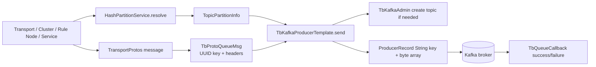

### 1.1 首先区分三种“分区”

| 名称 | release-3.6 含义 | 代码位置 |
|---|---|---|
| ThingsBoard逻辑partition | entity UUID经hash后得到的0..N-1，决定owner和topic后缀 | `HashPartitionService.resolve(...)` |
| 物理topic后缀 | `base[.isolated.tenant].logicalPartition` | `TopicPartitionInfo` constructor |
| Kafka原生partition | 一个Kafka topic内部的partition；发送时未显式指定，由Kafka partitioner按key处理 | `new ProducerRecord<>(topic,null,key,...)` |

默认 Core/Rule Engine topic properties的 `partitions:1` 表示每个带逻辑后缀的物理topic通常只有一个Kafka原生partition。不要把 `TopicPartitionInfo.partition=42` 理解为 `ProducerRecord.partition=42`；源码明确传的是 `null`。

### 1.2 成功语义

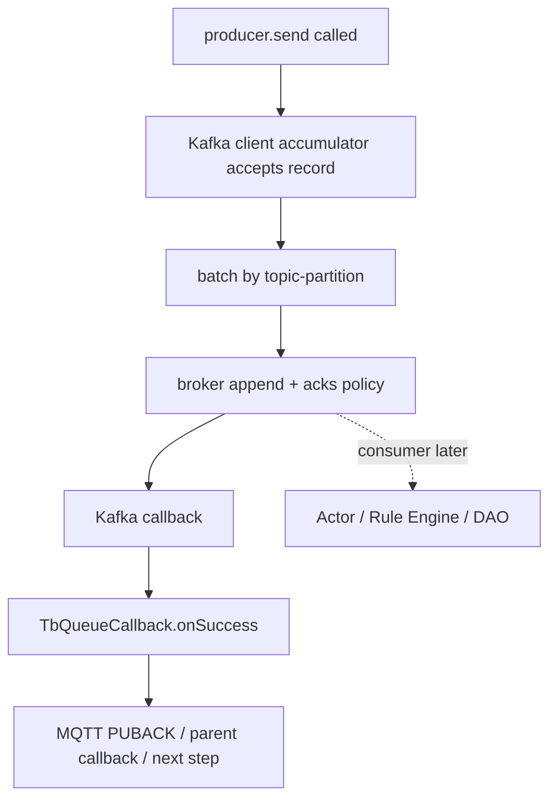

`TbQueueCallback.onSuccess` 只证明 Kafka producer按 `acks` 配置完成发送。它不证明consumer已poll、Actor已处理、Rule Node已完成或数据库已提交。`acks=all` 也只覆盖当前topic的ISR复制；默认 `replication_factor=1` 时没有跨broker副本。

### 1.3 核心结论

1. 默认 [`queue.type`](../../../application/src/main/resources/thingsboard.yml#L1325) 是 `in-memory`；只有显式配置Kafka时才创建 `Kafka*QueueFactory` 和 `TbKafkaProducerTemplate`。
2. Spring按 `queue.type + service.type` 选择 Monolith、Core、Rule Engine、Transport或Version Control factory，不存在一个全局静态producer。
3. Producer Provider在 `@PostConstruct` 创建多条用途固定的producer：toCore、toRuleEngine、notifications、transport、usage stats等；每个Kafka模板内部持有独立 `KafkaProducer<String,byte[]>`。
4. [`org.thingsboard.server.queue.discovery.HashPartitionService.resolve(ServiceType,String,TenantId,EntityId)`](../../../common/queue/src/main/java/org/thingsboard/server/queue/discovery/HashPartitionService.java#L376) 先选择main/custom/isolated queue，再对entity UUID做配置的hash，稳定映射逻辑partition。
5. [`org.thingsboard.server.common.msg.queue.TopicPartitionInfo`](../../../common/message/src/main/java/org/thingsboard/server/common/msg/queue/TopicPartitionInfo.java#L36) 通过字符串拼接产生full topic name；isolated tenant和partition都是topic名的一部分。
6. `TbProtoQueueMsg.getData()` 每次调用 `GeneratedMessageV3.toByteArray()`，producer发送的value不是Java序列化，而是Protobuf bytes。
7. Kafka record key是消息UUID的字符串；ThingsBoard逻辑partition已经体现在topic后缀，Kafka原生partition仍由Kafka客户端选择。
8. 第一次向一个 `TopicPartitionInfo` 发送时先同步调用AdminClient创建topic并等待future完成；topic元数据/ACL故障可能让业务发送线程阻塞或抛异常。
9. `send` 的异步失败只调用callback或记录warning；同步异常会先调用callback failure，再把同一个异常重新抛给调用者。
10. `callback=null` 的异步失败只能写日志，调用方得不到失败信号；notification broadcast大量使用这种fire-and-log模式。
11. debug日志打开时producer添加 `_producerId`、`_threadName` headers；trace还加入最多18层stack trace，增加网络与broker存储开销。
12. Producer callback运行在Kafka客户端I/O线程，callback中阻塞或执行重业务会拖慢同一producer后续确认。
13. 代码没有transactional producer流程，没有 `beginTransaction/sendOffsetsToTransaction/commitTransaction`；Kafka写入与PostgreSQL、Actor或另一个topic不原子。
14. Provider类创建共享producer但未显示调用各producer的 `stop()`；Kafka模板虽实现close，release-3.6这组Provider的普通shutdown路径没有对应 `@PreDestroy` 关闭代码，应在升级/停机测试中观察flush与线程退出。

---

## 二、入口

### 2.1 业务入口

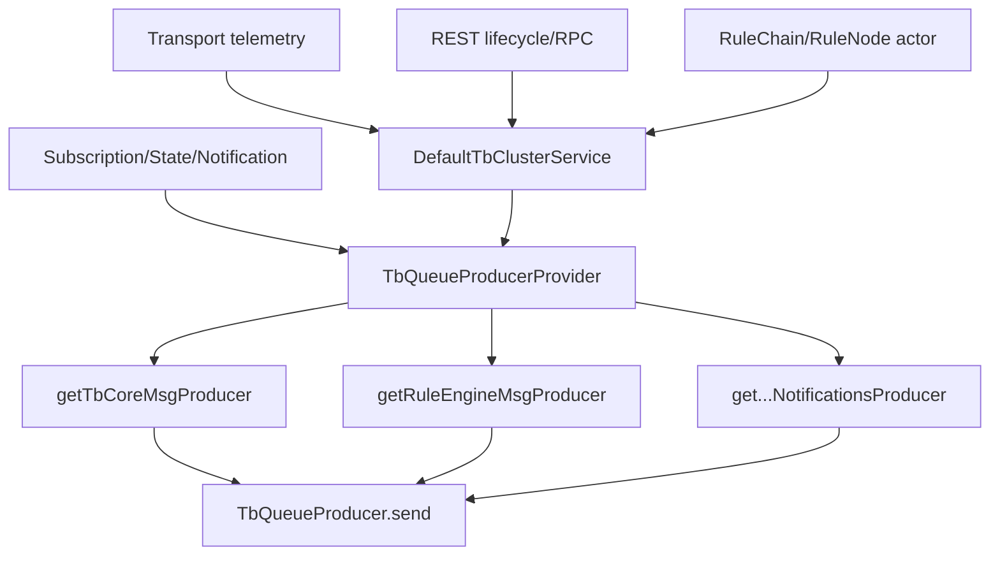

| 入口 | 完整方法 | 典型输入 | 目标 |
|---|---|---|---|
| Core routing | [`org.thingsboard.server.service.queue.DefaultTbClusterService.pushMsgToCore(TenantId,EntityId,ToCoreMsg,TbQueueCallback)`](../../../application/src/main/java/org/thingsboard/server/service/queue/DefaultTbClusterService.java#L172) | session/RPC/state | Core logical partition topic |
| Rule Engine routing | [`org.thingsboard.server.service.queue.DefaultTbClusterService.pushMsgToRuleEngine(TenantId,EntityId,TbMsg,TbQueueCallback)`](../../../application/src/main/java/org/thingsboard/server/service/queue/DefaultTbClusterService.java#L292) | `TbMsg` | main/custom/isolated Rule Engine topic |
| Direct resolved send | [`pushMsgToRuleEngine(TopicPartitionInfo,UUID,ToRuleEngineMsg,TbQueueCallback)`](../../../application/src/main/java/org/thingsboard/server/service/queue/DefaultTbClusterService.java#L276) | caller已解析TPI | 指定full topic |
| Per-service notification | [`pushNotificationToCore(String,FromDeviceRpcResponse,TbQueueCallback)`](../../../application/src/main/java/org/thingsboard/server/service/queue/DefaultTbClusterService.java#L253) | RPC response | `tb_core.notifications.<serviceId>` |
| Broadcast | [`broadcastToCore(ToCoreNotificationMsg)`](../../../application/src/main/java/org/thingsboard/server/service/queue/DefaultTbClusterService.java#L216) | lifecycle/config | 每个已发现Core服务一个topic |
| Queue config notification | [`doSendQueueNotifications(...)`](../../../application/src/main/java/org/thingsboard/server/service/queue/DefaultTbClusterService.java#L946) | queue create/update/delete | Rule/Core/Transport per-service topics |

### 2.2 Producer Provider入口

[`org.thingsboard.server.queue.provider.TbQueueProducerProvider`](../../../common/queue/src/main/java/org/thingsboard/server/queue/provider/TbQueueProducerProvider.java#L40) 是调用方依赖的稳定接口。Core进程注入 `TbCoreQueueProducerProvider`，Rule Engine进程注入 `TbRuleEngineProducerProvider`，Transport进程注入 `TbTransportQueueProducerProvider`；Monolith中的factory同时实现多个queue factory接口。

[`org.thingsboard.server.queue.provider.TbCoreQueueProducerProvider.init()`](../../../common/queue/src/main/java/org/thingsboard/server/queue/provider/TbCoreQueueProducerProvider.java#L82) 创建所有producer引用。它不调用 `producer.init()`；Kafka模板的 `init()` 本身为空，真正KafkaProducer已在模板构造器中创建。

### 2.3 不是本章入口的操作

- Kafka Consumer `poll/commit` 属于第17章。
- Queue配置CRUD和动态隔离队列属于第18章。
- Zookeeper/服务发现和partition owner重算属于第19章。
- Actor `tell()` 只在consumer之后出现，不是producer ack的一部分。

---

## 三、完整调用链

### 3.1 Telemetry投递Rule Engine的主链

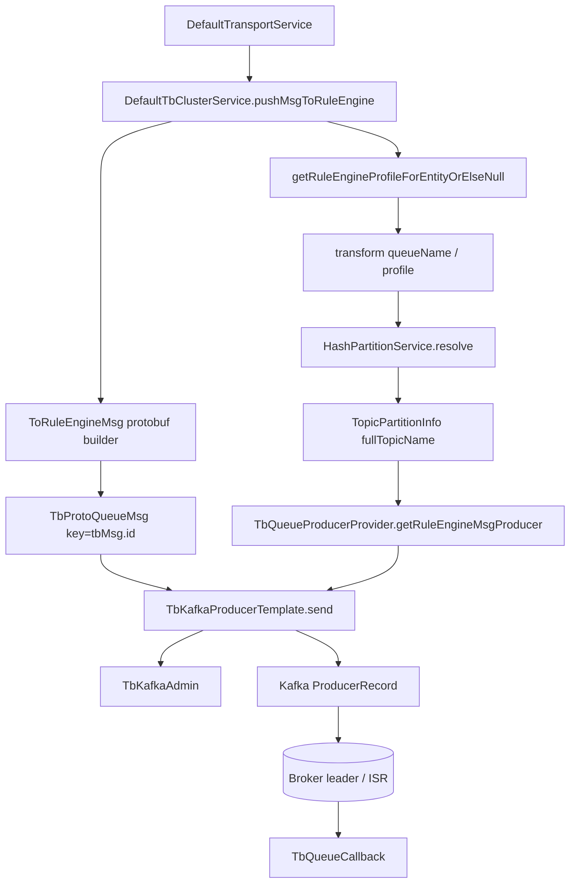

| 步骤 | 类与完整方法 | 输入 | 输出 | 为什么这样设计 |
|---:|---|---|---|---|
| 1 | `org.thingsboard.server.service.queue.DefaultTbClusterService.pushMsgToRuleEngine(TenantId,EntityId,TbMsg,TbQueueCallback)` | domain `TbMsg` | proto envelope | Cluster service隐藏queue实现 |
| 2 | `org.thingsboard.server.queue.discovery.HashPartitionService.resolve(ServiceType,String,TenantId,EntityId)` | target type/queue/tenant/entity | `TopicPartitionInfo` | 同entity稳定落同逻辑partition |
| 3 | `org.thingsboard.server.common.msg.queue.TopicPartitionInfo.TopicPartitionInfo(String,TenantId,Integer,boolean)` | base topic/isolation/partition | `fullTopicName` | 多queue与isolated tenant用物理topic隔离 |
| 4 | `org.thingsboard.server.queue.common.TbProtoQueueMsg.TbProtoQueueMsg(UUID,T,Headers)` | UUID/protobuf/headers | `TbQueueMsg` | 统一queue provider contract |
| 5 | `org.thingsboard.server.queue.provider.TbQueueProducerProvider.getRuleEngineMsgProducer()` | 无 | 用途固定producer | 调用方不判断Kafka/SQS/PubSub |
| 6 | [`org.thingsboard.server.queue.kafka.TbKafkaProducerTemplate.send(TopicPartitionInfo,T,TbQueueCallback)`](../../../common/queue/src/main/java/org/thingsboard/server/queue/kafka/TbKafkaProducerTemplate.java#L154) | TPI/queue msg/callback | async Kafka send | 统一topic ensure、header与callback映射 |
| 7 | [`org.thingsboard.server.queue.kafka.TbKafkaAdmin.createTopicIfNotExists(String,String)`](../../../common/queue/src/main/java/org/thingsboard/server/queue/kafka/TbKafkaAdmin.java#L98) | full topic/config | topic存在 | 自动建立动态partition/isolated topic |
| 8 | `org.apache.kafka.clients.producer.KafkaProducer.send(ProducerRecord,Callback)` | String/byte[] record | async metadata/exception | 利用Kafka accumulator/batch/I/O线程 |

### 3.2 Rule Engine消息封装

`DefaultTbClusterService` 先处理tenant缺失和Rule Engine profile，随后用tenant MSB/LSB与 `TbMsg.toByteString(tbMsg)` 构造 `TransportProtos.ToRuleEngineMsg`。外层 `TbProtoQueueMsg` 的key沿用 `tbMsg.id`，便于Kafka key稳定和链路关联。

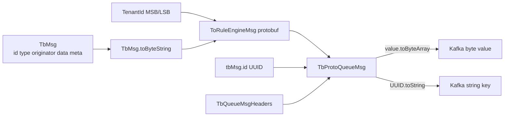

### 3.3 Producer构造链

以monolith Rule Engine producer为例：

1. Spring条件 [`KafkaMonolithQueueFactory`](../../../common/queue/src/main/java/org/thingsboard/server/queue/provider/KafkaMonolithQueueFactory.java#L71) 要求 `queue.type=kafka && service.type=monolith`。
2. [`createRuleEngineMsgProducer()`](../../../common/queue/src/main/java/org/thingsboard/server/queue/provider/KafkaMonolithQueueFactory.java#L190) 设置 `TbKafkaSettings`、clientId、defaultTopic和Rule Engine admin。
3. [`TbKafkaProducerTemplate` constructor](../../../common/queue/src/main/java/org/thingsboard/server/queue/kafka/TbKafkaProducerTemplate.java#L99) 调 `settings.toProducerProps()`，写client.id并立即 `new KafkaProducer<>(props)`。
4. Producer Provider在 `@PostConstruct` 保存该对象；后续所有Rule Engine send共享同一线程安全KafkaProducer实例。

### 3.4 topic命名链

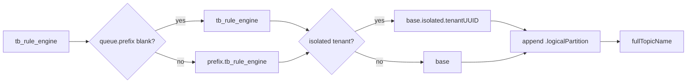

[`org.thingsboard.server.queue.discovery.TopicService.buildTopicName(String)`](../../../common/queue/src/main/java/org/thingsboard/server/queue/discovery/TopicService.java#L105) 先加全局prefix；`TopicPartitionInfo` 再加isolated tenant和partition。Per-service notification topic由 [`getNotificationsTopic(ServiceType,String)`](../../../common/queue/src/main/java/org/thingsboard/server/queue/discovery/TopicService.java#L62) 构造，通常没有逻辑partition后缀。

### 3.5 ProducerRecord构造

```java
new ProducerRecord<>(
    tpi.getFullTopicName(), // physical Kafka topic
    null,                   // no explicit Kafka partition
    msg.getKey().toString(),
    msg.getData(),          // protobuf bytes
    headers
);
```

这段代码来自 [`TbKafkaProducerTemplate.send(...)`](../../../common/queue/src/main/java/org/thingsboard/server/queue/kafka/TbKafkaProducerTemplate.java#L154)。同一个UUID key只在“同一物理topic的Kafka原生partition数不变”时保持Kafka partition稳定；ThingsBoard的entity稳定路由主要由此前的fullTopicName保证。

---

## 四、消息流

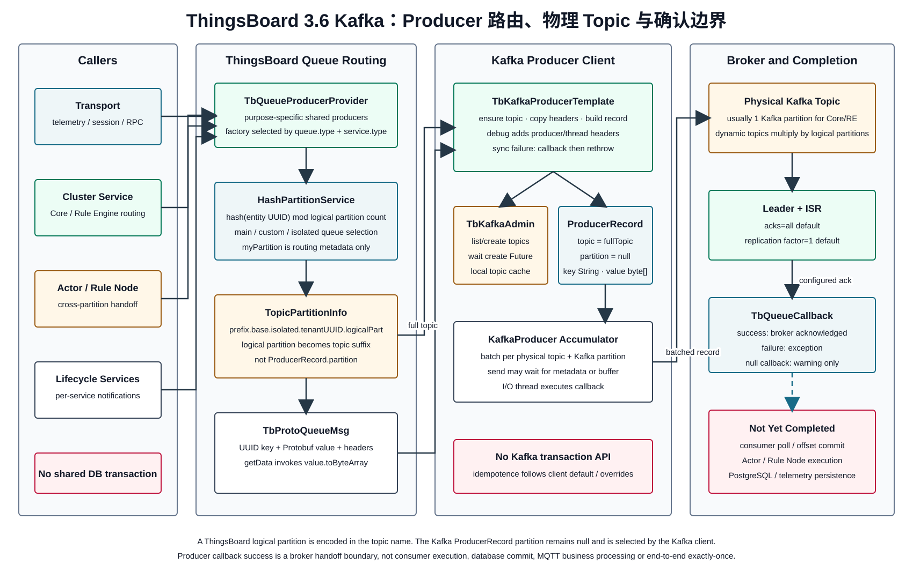

### 4.1 同步与异步边界

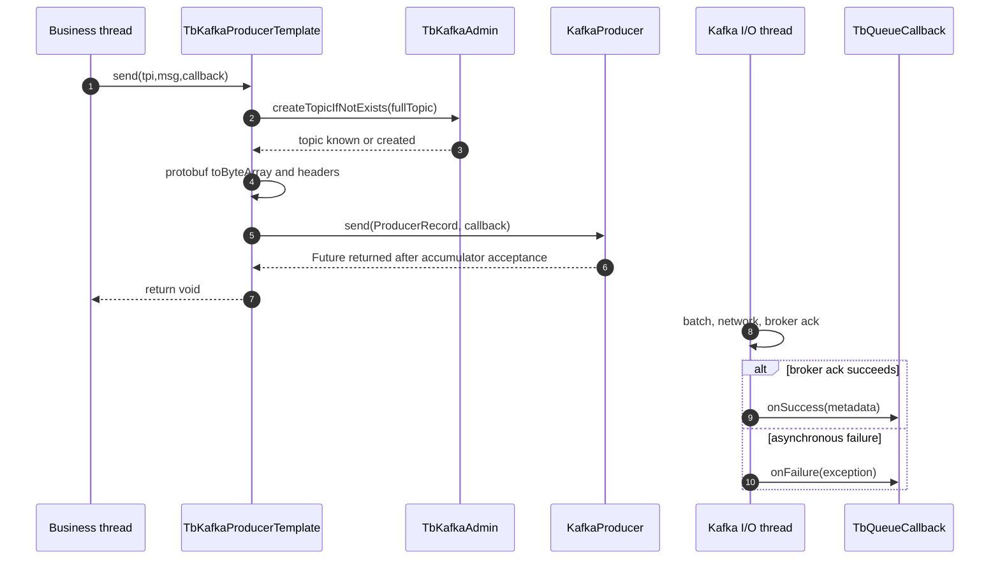

topic首次创建、Protobuf复制、header构造、Kafka `send`等待metadata/buffer的部分发生在业务线程；broker响应后的callback发生在Kafka I/O线程。`send`虽然API是异步的，但metadata不可用或buffer满时Kafka客户端仍可能按 `max.block.ms` 阻塞，而ThingsBoard没有一级显式字段，需通过 `other-inline` 配置。

### 4.2 ThingsBoard logical partition

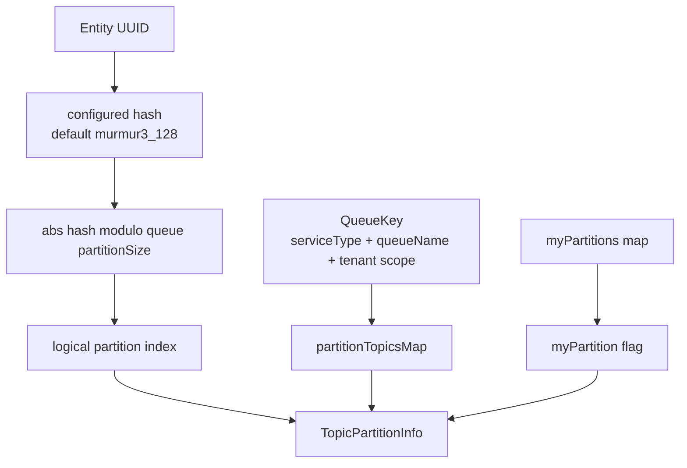

[`HashPartitionService.resolve(QueueKey,EntityId)`](../../../common/queue/src/main/java/org/thingsboard/server/queue/discovery/HashPartitionService.java#L434) 使用UUID两段long计算hash。`myPartition` 只是本节点owner标记；producer仍可向非本节点topic发送，broker并不读取该flag。

### 4.3 动态topic创建

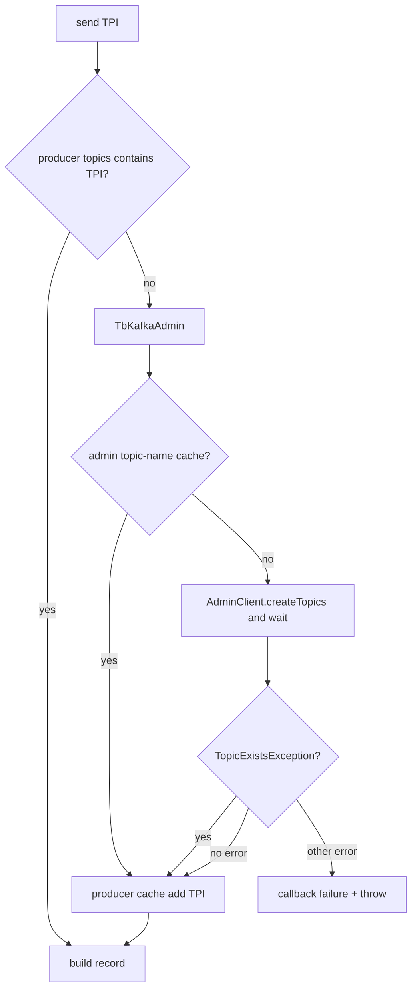

`TbKafkaAdmin` 构造时同步 `listTopics().names().get()`。ACL不允许list/create、broker不可达或replication factor超过broker数，都会影响启动或首次发送。生产环境不应把动态建topic权限当作理所当然；可以预建并授予最小权限，但必须与fullTopicName规则一致。

### 4.4 callback语义

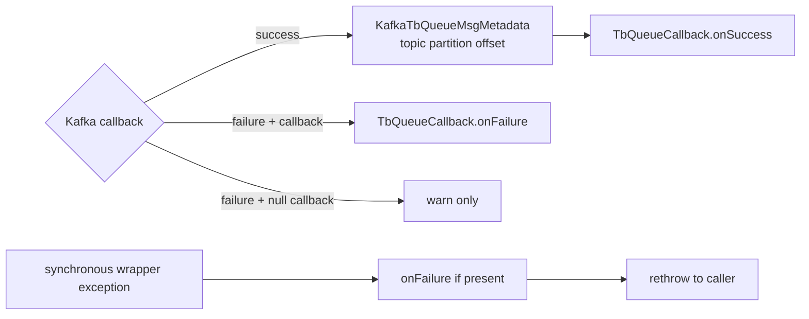

成功metadata包装Kafka `RecordMetadata`，可用于日志或上游状态，但多数业务callback只关心成功/失败。同步异常双通道传播意味着调用方若既在callback中处理失败又catch异常，必须做幂等，避免重复完成promise。

---

## 五、时序图

完整时序图包含Provider启动、partition解析、topic首次创建、正常ack、异步失败、同步失败、broadcast和shutdown缺口：

[打开 PlantUML 源文件](sequence.puml) | [新窗口打开原始 SVG](sequence.svg)

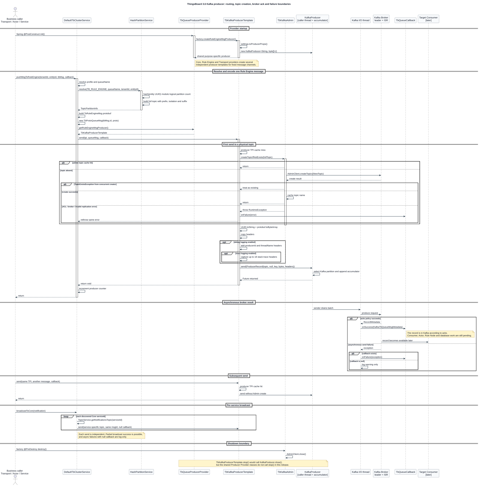

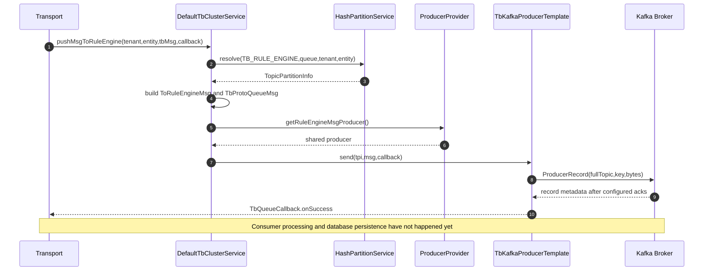

---

## 六、数据变化

### 6.1 发送端对象变化

| 对象 | 创建/变化 | 生命周期 |
|---|---|---|
| `TbKafkaProducerTemplate` | factory创建，一种用途一个实例 | Provider/JVM生命周期 |
| `KafkaProducer` | 模板constructor立即创建 | `stop()`可close，但共享Provider未显式调用 |
| producer TPI cache | 首次成功ensure后加入 | producer生命周期 |
| `TbKafkaAdmin.topics` | 构造时list + create成功时加入 | factory/admin生命周期 |
| `TopicPartitionInfo` | 每次resolve或notification lookup | 短对象，部分notification被TopicService缓存 |
| `TbProtoQueueMsg` | 每次业务发送创建 | send完成后由Kafka accumulator持有bytes |
| Kafka topic/log | 首次ensure创建；每次ack后追加record | retention/compaction由topic config决定 |

### 6.2 消息字段映射

| Queue字段 | Kafka字段 | 说明 |
|---|---|---|
| `TopicPartitionInfo.fullTopicName` | `ProducerRecord.topic` | 已含prefix/isolation/logical partition |
| `TopicPartitionInfo.partition` | 不直接写 `ProducerRecord.partition` | 只是topic后缀来源 |
| `TbQueueMsg.key UUID` | String key | Kafka partitioner与链路关联 |
| `TbQueueMsg.data` | byte[] value | Protobuf `toByteArray` |
| `TbQueueMsgHeaders` | Kafka record headers | 原样复制byte[] |
| debug analytic fields | `_producerId/_threadName/_stackTraceN` | 仅debug/trace日志级别打开时添加 |

### 6.3 数据库、Actor、Session

- Producer发送不写PostgreSQL、TimescaleDB或Cassandra。
- Producer callback与任何数据库事务不共享commit；“先写DB再发Kafka”和“先发Kafka再写DB”都存在单边成功窗口，除非具体业务实现outbox，而此公共模板没有。
- Actor只可能是producer调用者；Broker ack不会自动向Actor发送完成消息，callback代码决定后续行为。
- MQTT session可在producer success后收到PUBACK，但Rule Engine consumer/数据库仍未执行。
- Redis不参与Kafka producer ack或topic创建。

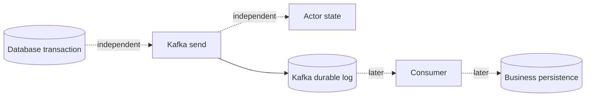

### 6.4 生命周期

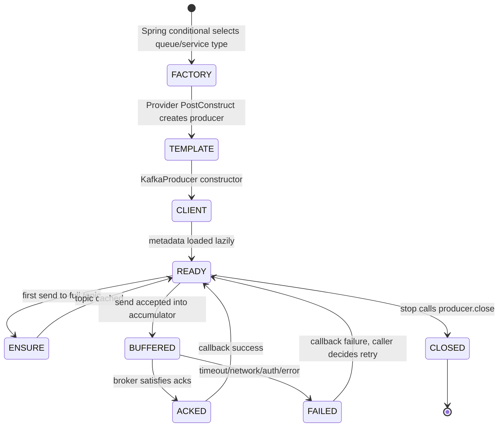

---

## 七、源码分析

### 7.1 抽象层次

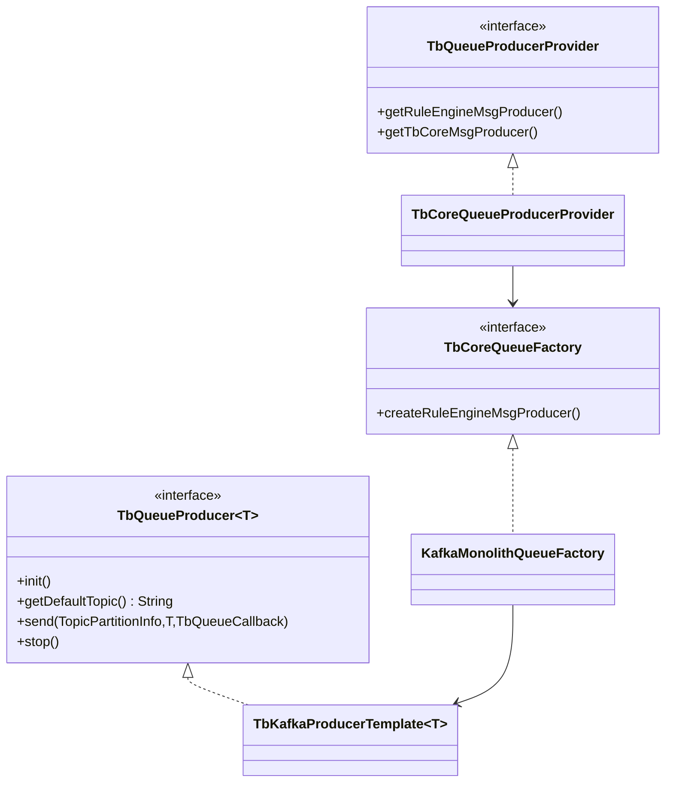

`TbQueueProducer` 是跨Kafka、in-memory、SQS、PubSub、RabbitMQ和Service Bus的最小契约。`TbKafkaProducerTemplate` 不知道 `ToCoreMsg` 或 `ToRuleEngineMsg` 业务结构，只依赖 `TbQueueMsg.getKey/getData/getHeaders`。

### 7.2 Kafka settings

[`org.thingsboard.server.queue.kafka.TbKafkaSettings.toProducerProps()`](../../../common/queue/src/main/java/org/thingsboard/server/queue/kafka/TbKafkaSettings.java#L288) 明确设置：bootstrap servers、retries、acks、batch.size、linger.ms、buffer.memory、String/ByteArray serializer、compression、max.request.size和max.in.flight。SSL/SASL、request timeout与 `other-inline/other` 在共享 `toProps()` 追加。

| 参数 | 3.6默认 | 发送端影响 | 生产注意 |
|---|---:|---|---|
| `acks` | all | ISR确认后success | 与min.insync.replicas、replication factor一起看 |
| `retries` | 1 | 可重试错误仅重试一次 | 不能替代业务幂等 |
| `batch.size` | 16384 | 单Kafka partition batch上限 | 小消息高吞吐可增大 |
| `linger.ms` | 1 | 最多等待合批 | 延迟与吞吐折中 |
| `compression.type` | none | broker/network bytes | telemetry通常可评估lz4/zstd，YAML注释只列none/gzip但Kafka属性可扩展 |
| `max.request.size` | 1 MiB | 单请求/record上限 | OTA/大payload需与broker/consumer共同校准 |
| `max.in.flight` | 5 | 每连接未确认请求 | 与幂等/重试/顺序一起评估 |
| `buffer.memory` | 32 MiB | client accumulator总内存 | 满时send可能阻塞 |
| `replication_factor` | 1 | 自动建topic副本数 | acks=all仍只有一个副本 |

### 7.3 topic admin

`TbKafkaAdmin` 构造时从topic properties取 `partitions` 并从config map移除，再用全局replication factor创建 `NewTopic`。现有topic不会在此路径自动校正partition、replication或retention；`createTopicIfNotExists` 只保证存在。

### 7.4 headers与日志级别副作用

[`TbKafkaProducerTemplate.addAnalyticHeaders(List)`](../../../common/queue/src/main/java/org/thingsboard/server/queue/kafka/TbKafkaProducerTemplate.java#L129) 只在send看到debug enabled时调用。debug至少每条增加producerId/threadName；trace下每条抓取当前线程stack，CPU和消息体都会增加。生产排障临时开启后应及时恢复，尤其高QPS telemetry producer。

### 7.5 callback线程模型

Kafka callback由producer I/O线程调用。`TbKafkaProducerTemplate` 没有切换到ThingsBoard executor；因此上层callback如果执行同步数据库、日志大对象或阻塞等待，会降低该producer处理所有topic的ack速度。

---

## 八、Actor 分析

Producer不要求Actor上下文。Transport Netty线程、REST线程、scheduler、service callback和Actor Dispatcher都可调用同一个producer。

当Actor调用producer时需要注意：

1. `send()` 可能因首次Admin创建、Kafka metadata或buffer压力同步阻塞Actor Dispatcher。
2. async callback不在Actor线程；直接从callback修改Actor内部map会破坏串行假设。
3. 正确做法是callback构造一个Actor消息并 `tell(self,...)`，或只完成线程安全的 `TbMsgCallback`。
4. Actor stop不会取消Kafka accumulator中的record；callback可能在Actor已销毁后到达。
5. Rule Chain跨partition发送时，父callback常在producer handoff成功后完成，并不等待远端Actor执行。

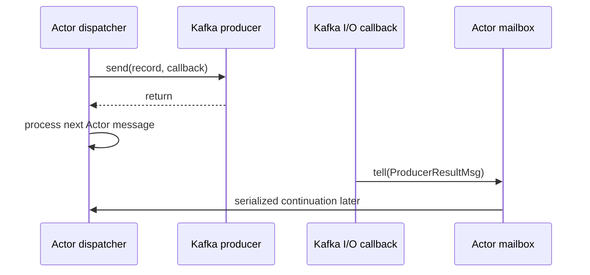

---

## 九、Kafka 分析

### 9.1 Producer

每个用途固定模板包含一个线程安全 `KafkaProducer<String,byte[]>`。Provider避免每条消息new producer，但不同用途会各有metadata、accumulator和I/O线程，生产端连接数应按服务实例乘producer数量估算。

### 9.2 Topic

ThingsBoard通过多个物理topic表达Core、Rule Engine、notification、Transport API、OTA、JS executor和VC；main queue逻辑partition又常映射为topic后缀。Tenant隔离queue再加 `.isolated.<tenantUUID>`，可能显著增加topic数量和controller metadata压力。

### 9.3 Partition与顺序

同entity UUID在queue partition count/hash算法不变时映射到同full topic。Kafka key又可保证在该物理topic内部进入同一Kafka partition。顺序仍受以下变化影响：queueName改变、partition count改变、hash函数改变、isolation切换、topic Kafka partition扩容、producer重试与非幂等配置。

### 9.4 Ack与副本

`acks=all` 等待当前ISR集合满足broker规则；真正容错需 `replication_factor>=3`、`min.insync.replicas>=2` 与broker `unclean.leader.election`等共同设计。默认topic properties的min ISR为1且replication factor为1，只能提供单broker本地持久化。

### 9.5 Batch与压缩

Kafka按“物理topic + Kafka原生partition”合批。ThingsBoard把逻辑partition拆为多个topic会分散batch，过多partition/topic在低流量租户下难以填满 `batch.size`；可通过linger和compression平衡，但不要只看总QPS。

### 9.6 幂等与事务

release-3.6代码没有设置transactional.id，也没有事务API。是否启用Kafka producer idempotence取决于Kafka客户端默认值或 `other-inline` 覆盖，文档不能假设；即使producer幂等，也只消除某些broker重试重复，不等于Rule Node或数据库exactly-once。

---

## 十、数据库分析

Kafka producer公共层不访问数据库。它与ThingsBoard持久化的关系来自调用顺序：

| 模式 | 失败窗口 | release-3.6常见场景 |
|---|---|---|
| Kafka first, DB later | producer成功后consumer/DB失败，record可重试 | telemetry -> Rule Engine -> Save Timeseries |
| DB first, Kafka after | DB提交后producer失败，其他节点不知变更 | lifecycle/config传播 |
| DB与多个topic fan-out | 部分topic成功、部分失败 | cluster broadcast/notifications |
| Kafka callback触发HTTP/PUBACK | 客户端认为接收成功但业务DB尚未写 | MQTT telemetry |

没有outbox时，生产工程要让consumer幂等、保留可重放record，并监控callback failure。对配置类强一致传播，必要时通过周期reload/版本校验修复单边成功，而不是把Kafka ack描述为数据库事务提交。

PostgreSQL中不保存Kafka offset或producer sequence；offset在Kafka consumer group。TimescaleDB/Cassandra也只在下游Node处理时写入。

---

## 十一、异常处理

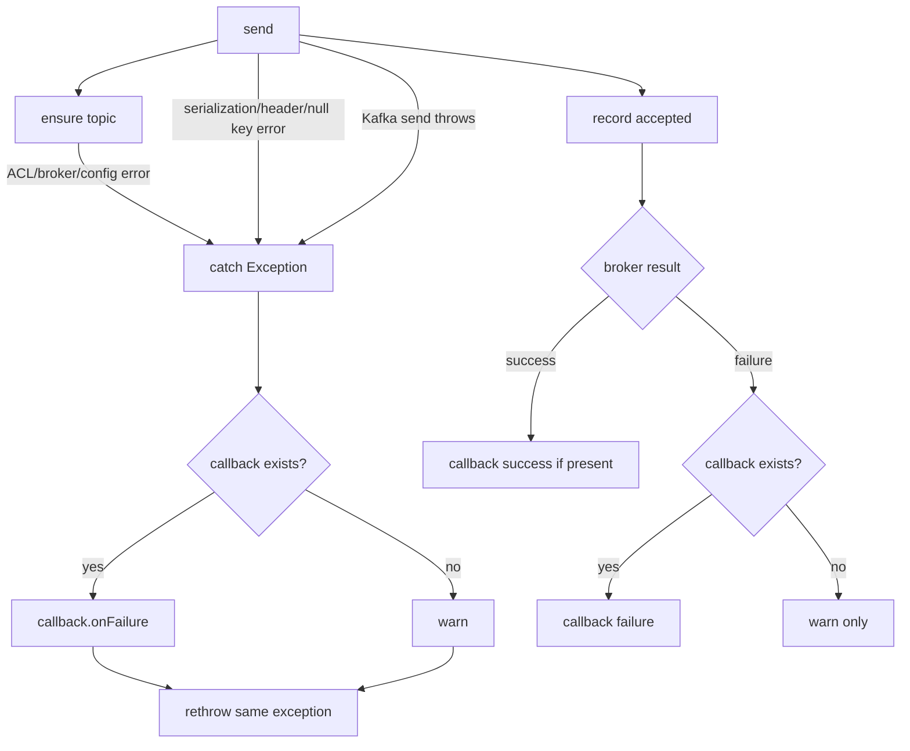

### 11.1 同步失败

空key会在 `msg.getKey().toString()` 抛NPE；Protobuf过大、header构造、Admin topic创建或Kafka `send` 都可能同步失败。模板先通知callback，再rethrow。上层无catch时错误会穿透当前REST/Netty/Actor流程。

### 11.2 异步失败

认证失效、delivery timeout、broker断开、not enough replicas等可在I/O callback中返回。此时调用栈早已返回，只有callback能把失败交还业务。传null callback的notification只能依赖warning和外部Kafka监控。

### 11.3 Topic创建竞态

多个producer同时首次发送同topic时可能都调用Admin。`TopicExistsException` 被视为成功，不会中断send。其他ExecutionException包装为RuntimeException。

### 11.4 Buffer与阻塞

`buffer.memory` 耗尽后Kafka `send` 不是立即失败，而可等待 `max.block.ms`。若调用线程是Netty event loop或Actor Dispatcher，会放大系统拥塞。应监控producer buffer available bytes、record queue time、request latency、error rate和业务callback latency。

### 11.5 Shutdown

`TbKafkaProducerTemplate.stop()` 调 `KafkaProducer.close()`，会按客户端语义flush并关闭资源；但共享Producer Provider没有对应的 `@PreDestroy`。工厂只destroy AdminClient。生产升级要通过实测确认容器停止顺序，并在上游先停止接收/拉取，留出Kafka发送完成时间。

---

## 十二、源码阅读路线

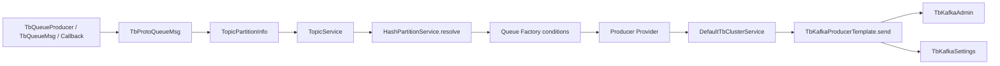

1. 先读queue抽象 `TbQueueProducer<T>`、`TbQueueMsg`、`TbQueueCallback`，不要一开始绑定Kafka。
2. 读 `TbProtoQueueMsg`，确认key、headers和Protobuf bytes如何产生。
3. 读 `TopicPartitionInfo` 与 `TopicService`，手工推导prefix/isolated/partition full topic。
4. 精读 `HashPartitionService.resolve`、`buildTopicPartitionInfo` 和 `hash`，区分逻辑partition与owner。
5. 对照部署类型读一个factory，例如 `KafkaMonolithQueueFactory.createRuleEngineMsgProducer`。
6. 读对应Producer Provider的 `@PostConstruct`，统计实际KafkaProducer数量。
7. 从 `DefaultTbClusterService.pushMsgToRuleEngine` 跟业务proto构造和key选择。
8. 最后精读 `TbKafkaProducerTemplate.send/createTopicIfNotExist/addAnalyticHeaders/stop` 与 `TbKafkaAdmin`。
9. 对照 `thingsboard.yml queue.kafka` 和 `TbKafkaSettings.toProducerProps`，确认哪些参数真正进入producer。

推荐断点：`DefaultTbClusterService.pushMsgToRuleEngine` -> `HashPartitionService.resolve` -> `TopicPartitionInfo` constructor -> `TbKafkaProducerTemplate.send` -> `TbKafkaAdmin.createTopicIfNotExists` -> Kafka callback。

---

## 十三、常见面试题

### 1. ThingsBoard默认使用Kafka吗？

不使用。3.6默认 `queue.type=in-memory`；配置Kafka后才激活Kafka factory。

### 2. ThingsBoard逻辑partition等于Kafka partition吗？

不等于。逻辑partition追加到物理topic名；ProducerRecord的partition参数是null，Kafka原生partition由client选择。

### 3. 同一设备消息为什么通常有序？

entity UUID稳定映射同逻辑topic，UUID key在该topic内稳定映射同Kafka partition。queue配置或partition count变化会改变边界。

### 4. `TopicPartitionInfo.myPartition` 会阻止远程发送吗？

不会。它是本节点owner标记，producer只使用fullTopicName。

### 5. isolated queue如何体现在Kafka？

topic名加入 `.isolated.<tenantUUID>`，随后再加逻辑partition后缀，形成独立物理topic集合。

### 6. queue.prefix做什么？

在所有base topic前加 `prefix.`，也影响Kafka consumer group命名约定，用于环境隔离。

### 7. 队列消息使用Java序列化吗？

不用。业务contract是Protobuf，`TbProtoQueueMsg.getData()` 调 `toByteArray()`。

### 8. Kafka record key是什么？

`TbQueueMsg.getKey()` 的UUID字符串，常为TbMsg id、entity id或request id，取决于调用点。

### 9. producer callback success表示Rule Engine完成了吗？

不表示，只表示broker按acks确认record。consumer、Actor、Node和DB都在后面。

### 10. `acks=all` 加默认配置能容忍一个broker宕机吗？

默认replication factor为1、min ISR为1，不能。acks=all没有凭空产生副本。

### 11. 首次发送为什么可能很慢？

模板会同步ensure topic，AdminClient可能list/create并等待brokerfuture；KafkaProducer还可能等待metadata。

### 12. TopicExistsException算失败吗？

不算。并发创建时被忽略，发送继续；其他Admin错误会抛RuntimeException。

### 13. 同步send异常如何传播？

先调用callback.onFailure（若有），然后重新抛给调用者，存在双通道。

### 14. 异步send失败且callback为null会怎样？

只记录warning，没有业务重试或补偿信号。

### 15. callback运行在哪个线程？

Kafka producer I/O线程。重callback会拖慢同producer所有确认。

### 16. debug日志为什么会改变消息？

模板在debug加入producer/thread headers，trace还加入stack trace；每条record变大并增加CPU。

### 17. Producer是否线程安全共享？

KafkaProducer是线程安全的，Provider按用途共享模板；不同用途仍各有producer实例。

### 18. ThingsBoard producer是否使用Kafka事务？

没有。源码没有transactional.id和transaction API，DB与多个topic都不原子。

### 19. Producer幂等是否启用？

ThingsBoard代码未显式设置；取决于Kafka client默认或other-inline。即使启用也不等于业务exactly-once。

### 20. `batch.size` 是单条最大消息吗？

不是，是每Kafka topic-partition batch目标上限；单record还受max.request.size等限制。

### 21. `linger.ms` 增大会怎样？

提高低流量partition合批和压缩机会，但增加排队延迟。ThingsBoard多物理topic会降低每topic流量，需要结合指标调。

### 22. producer.send为什么仍可能阻塞？

等待metadata、首次topic创建或buffer满时可阻塞到相关timeout/max.block.ms；异步API不等于调用线程永不等待。

### 23. 动态isolated queue的风险是什么？

topic数、Kafka controller metadata、ACL和文件句柄增长；每tenant乘逻辑partition会快速膨胀。

### 24. 如何监控发送端？

看record send/error rate、request/record queue latency、buffer available、batch/compression、metadata age、callback耗时、topic创建失败和业务producer failure日志。

### 25. 为什么不能用producer ack替代业务回执？

ack只覆盖Kafka log写入。需要业务回执时必须由consumer完成处理后通过RPC/notification或状态存储返回。

---

[上一篇：15 Actor 模型](../15-actor-model/README.md) | [返回全书目录](../../SUMMARY.md) | [下一篇：17 Kafka 消费流程](../17-kafka-consumer/README.md)
