# 17 Kafka 消费流程

> 源码基线：ThingsBoard `3.6.4`，行为提交 `0cb411fc90`；源码链接按当前 `release-3.6` 工作树行号校准。本章分析 `queue.type=kafka` 下的subscribe、poll、decode、Rule Engine pack、Actor callback、processing decision、commitSync和rebalance风险。Queue配置CRUD与动态管理在第18章。

[上一篇：16 Kafka 发送流程](../16-kafka-producer/README.md) | [HTML 版](index.html) | [全书目录](../../SUMMARY.md) | [PlantUML 源文件](sequence.puml) | [时序图 SVG](sequence.svg) | [架构图 SVG](../../assets/architecture/17-kafka-consumer.svg) | [下一篇：18 Queue 管理](../18-queue-management/README.md)

---

## 一、流程目标

Kafka消费流程把broker record恢复成ThingsBoard queue message，并把offset推进条件绑定到业务callback。对Rule Engine而言，一次 `poll()` 返回一个pack；Submit Strategy决定pack内并发顺序，Processing Strategy决定失败/超时后重跑哪些消息，最终 `consumer.commitSync()` 提交当前consumer position。

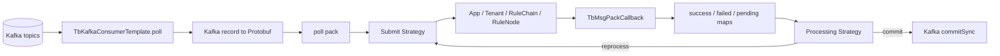

### 1.1 两组策略不能混淆

| 策略 | 回答的问题 | release-3.6实现 |
|---|---|---|
| Submit Strategy | 本次attempt把哪些消息同时送入Actor | BURST、BATCH、SEQUENTIAL、按originator/tenant串行 |
| Processing Strategy | attempt结束后提交还是重跑哪些结果 | SKIP、RETRY_ALL/FAILED/TIMED_OUT组合 |

Submit Strategy不决定offset，Processing Strategy也不撤销已发生的Rule Node、HTTP、Kafka或数据库副作用。retry是在同一poll结果的内存message map上再次调用业务链，不是Kafka seek/re-poll。

### 1.2 offset边界

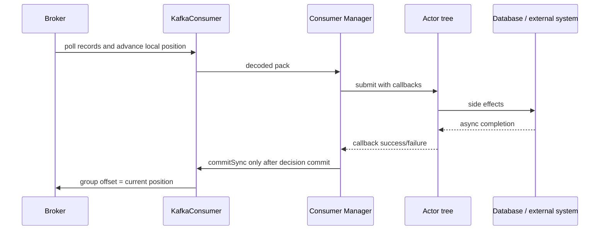

Kafka local position在poll时已前进，group committed offset直到 `commitSync()` 才前进。正常单线程loop在处理pack期间不再次poll，所以commit对应本pack之后的位置；但decode或处理异常若逃到外层catch，代码没有seek回旧offset，后续poll和未来commit可能越过该pack。

### 1.3 核心结论

1. [`org.thingsboard.server.queue.kafka.TbKafkaConsumerTemplate`](../../../common/queue/src/main/java/org/thingsboard/server/queue/kafka/TbKafkaConsumerTemplate.java#L49) 使用KafkaConsumer的 `subscribe(topicNames)`，关闭auto commit，最终同步 `commitSync()`。
2. [`org.thingsboard.server.queue.common.AbstractTbQueueConsumerTemplate`](../../../common/queue/src/main/java/org/thingsboard/server/queue/common/AbstractTbQueueConsumerTemplate.java#L48) 用非公平 `ReentrantLock` 串行subscribe/poll/commit/unsubscribe；调用线程不应并发操作同一consumer。
3. partition变更先写入 `subscribeQueue`，真正 `consumer.subscribe(...)` 在下一个poll持锁时执行；更新不是调用subscribe方法时立即生效。
4. Kafka factory按queueName/tenant isolation构造group id。Main queue不同服务实例共享group，per-service notification把serviceId放入group，确保每节点独立消费。
5. Rule Engine `consumerLoop` poll到非空pack后，在当前consumer线程等待整个pack decision；处理期间不继续poll。
6. Protobuf decode发生在poll返回后、业务pack建立前。decode IOException被包装RuntimeException，外层catch只sleep，没有seek或commit；Kafka position已前进，后续成功commit可能跳过poison record。
7. Main queue安装默认是 `BURST + SKIP_ALL_FAILURES`：并发投Actor，失败和超时最终commit，不从Kafka重投。
8. High Priority queue默认 `BURST + RETRY_FAILED_AND_TIMED_OUT` 且retries=0；工厂判断只在 `maxRetries>0` 时限制，因此0表示不限次数，consumer可长期不poll。
9. Sequential By Originator queue默认失败/超时最多retry 3次；成功消息不重跑。
10. Processing retry只重放选中的内存消息。前一次attempt已完成的数据库、外部API或跨queue发送不会回滚，Node必须幂等。
11. Pack timeout后 `cleanup()` 清空maps。对允许skip timeout的策略，旧callback的 `isMsgValid()` 变false；Main `SKIP_ALL_FAILURES` 的skipTimeout flag为false，旧链仍可能继续执行但不能再影响已清空pack。
12. Rate limit异常在 `TbMsgPackCallback.onFailure` 中被转成 `ctx.onSuccess(id)`，因此offset层把它视为成功，不进入retry map。
13. KafkaConsumer没有注册自定义rebalance listener。长时间await/retry超过 `max.poll.interval.ms` 时group可rebalance，之后commitSync可能失败。
14. Core queue与Rule Engine不同：Core等待callback或2秒timeout后无条件commit；pending/failed只记录日志，不应用Rule Engine Processing Strategy。
15. Core timeout时只尝试cancel提交任务Future，已经投给Actor或异步service的操作可能继续；commit仍发生。
16. consumer-per-partition模式为每个ThingsBoard逻辑partition创建一个consumer task并订阅一个物理topic；非per-partition模式由一个consumer订阅一组topic。
17. `commitSync()` 提交KafkaConsumer当前assignment的position，不是按每个UUID逐条ack；一个pack最终是整体commit边界。
18. 该链路是at-least-once与at-most-once窗口并存的工程实现，不具备端到端exactly-once。

---

## 二、入口

### 2.1 Consumer创建入口

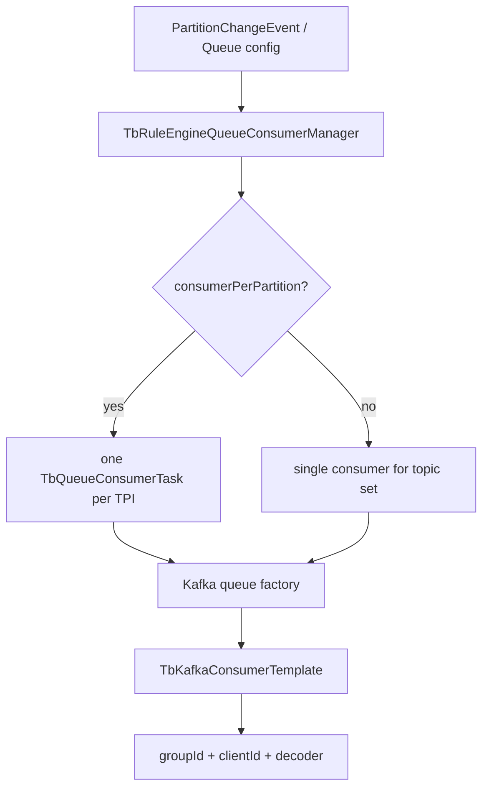

[`org.thingsboard.server.queue.provider.KafkaMonolithQueueFactory.createToRuleEngineMsgConsumer(Queue)`](../../../common/queue/src/main/java/org/thingsboard/server/queue/provider/KafkaMonolithQueueFactory.java#L269) 用queue配置创建consumer，group id为 `re-<queueName>[-isolated-tenant]-consumer`，client id再包含serviceId和计数器。

微服务Rule Engine对应 [`KafkaTbRuleEngineQueueFactory.createToRuleEngineMsgConsumer(Queue)`](../../../common/queue/src/main/java/org/thingsboard/server/queue/provider/KafkaTbRuleEngineQueueFactory.java#L239)，group规则相同，consumer实现相同。

### 2.2 poll入口

[`org.thingsboard.server.service.queue.ruleengine.TbRuleEngineQueueConsumerManager.consumerLoop(TbQueueConsumer)`](../../../application/src/main/java/org/thingsboard/server/service/queue/ruleengine/TbRuleEngineQueueConsumerManager.java#L360) 是Rule Engine主循环：

1. `consumer.poll(queue.getPollInterval())`。
2. 空pack立即下一轮。
3. 非空pack进入 `processMsgs(msgs,consumer,queue)`。
4. 任意异常记录warning并sleep `ctx.pollDuration`，随后继续。
5. stop后unsubscribe并close KafkaConsumer。

### 2.3 Core入口

`org.thingsboard.server.service.queue.DefaultTbCoreConsumerService` 轮询Core topic，把 `ToCoreMsg` 分派到Subscription、Device Actor、State、Edge、RPC、Scheduler和Event service。它使用通用 `TbPackProcessingContext` 跟踪callback，但timeout后仍在 [`mainConsumer.commit()`](../../../application/src/main/java/org/thingsboard/server/service/queue/DefaultTbCoreConsumerService.java#L430) 提交。

### 2.4 其他消费者

Transport API、notification、OTA、Usage Stats、Version Control与Remote JS也基于 `TbQueueConsumer`，但各自处理/commit边界不同。本章不能把Rule Engine的processing strategy推广为所有consumer的统一行为。

---

## 三、完整调用链

### 3.1 Kafka抽象层

| 步骤 | 完整类与方法 | 输入 | 输出/状态 |
|---:|---|---|---|
| 1 | `org.thingsboard.server.queue.common.AbstractTbQueueConsumerTemplate.subscribe(Set<TopicPartitionInfo>)` | owner分配的TPI set | enqueue订阅变更 |
| 2 | [`AbstractTbQueueConsumerTemplate.poll(long)`](../../../common/queue/src/main/java/org/thingsboard/server/queue/common/AbstractTbQueueConsumerTemplate.java#L117) | poll timeout | 持锁应用最新订阅并poll/decode |
| 3 | [`TbKafkaConsumerTemplate.doSubscribe(List<String>)`](../../../common/queue/src/main/java/org/thingsboard/server/queue/kafka/TbKafkaConsumerTemplate.java#L107) | full topic names | ensure topic + Kafka subscribe |
| 4 | [`TbKafkaConsumerTemplate.doPoll(long)`](../../../common/queue/src/main/java/org/thingsboard/server/queue/kafka/TbKafkaConsumerTemplate.java#L124) | duration | ConsumerRecord list |
| 5 | [`TbKafkaConsumerTemplate.decode(ConsumerRecord)`](../../../common/queue/src/main/java/org/thingsboard/server/queue/kafka/TbKafkaConsumerTemplate.java#L151) | String/byte[]/headers | `TbProtoQueueMsg<ToRuleEngineMsg>` |
| 6 | [`AbstractTbQueueConsumerTemplate.commit()`](../../../common/queue/src/main/java/org/thingsboard/server/queue/common/AbstractTbQueueConsumerTemplate.java#L209) | 无 | 持锁调用doCommit |
| 7 | [`TbKafkaConsumerTemplate.doCommit()`](../../../common/queue/src/main/java/org/thingsboard/server/queue/kafka/TbKafkaConsumerTemplate.java#L161) | 当前position | `KafkaConsumer.commitSync()` |

### 3.2 Rule Engine pack链

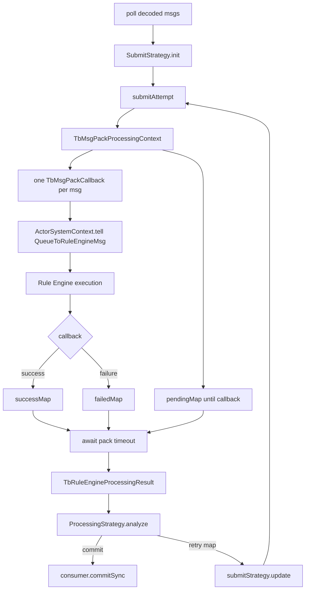

[`processMsgs(...)`](../../../application/src/main/java/org/thingsboard/server/service/queue/ruleengine/TbRuleEngineQueueConsumerManager.java#L393) 每次poll只创建一次Submit Strategy和Processing Strategy；每次retry attempt创建新的Pack Context和callback。`submitStrategy.update(reprocessMap)`把下一attempt限制到策略选中的消息。

### 3.3 callback链

1. [`submitMessage(TbMsgPackProcessingContext,UUID,TbProtoQueueMsg)`](../../../application/src/main/java/org/thingsboard/server/service/queue/ruleengine/TbRuleEngineQueueConsumerManager.java#L459) 解析tenant并创建 `TbMsgPackCallback`。
2. [`forwardToRuleEngineActor(...)`](../../../application/src/main/java/org/thingsboard/server/service/queue/ruleengine/TbRuleEngineQueueConsumerManager.java#L486) 把bytes恢复为带callback的 `TbMsg`。
3. `ActorSystemContext.tell(QueueToRuleEngineMsg)` 经过App/Tenant/Chain/Node。
4. 最终Node调用 `TbMsgCallback.onSuccess/onFailure`。
5. [`TbMsgPackCallback.onSuccess()`](../../../application/src/main/java/org/thingsboard/server/service/queue/TbMsgPackCallback.java#L95) 调 `packCtx.onSuccess(id)`。
6. [`TbMsgPackProcessingContext.onSuccess(UUID)`](../../../application/src/main/java/org/thingsboard/server/service/queue/TbMsgPackProcessingContext.java#L122) 从pending移到success、通知Submit Strategy，并在pendingCount归零时countDown latch。

### 3.4 Processing Decision

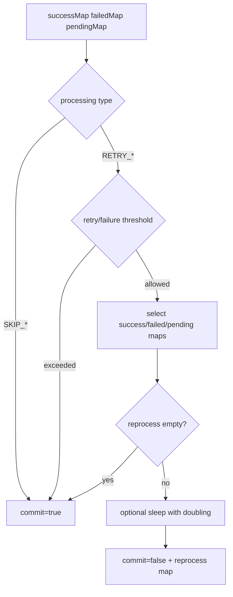

[`TbRuleEngineProcessingStrategyFactory.RetryStrategy.analyze(...)`](../../../application/src/main/java/org/thingsboard/server/service/queue/processing/TbRuleEngineProcessingStrategyFactory.java#L150) 在consumer线程中执行pause sleep。`RETRY_ALL` 连已经success的消息也重跑，最容易重复外部副作用。

### 3.5 默认queue差异

默认queue由 [`DefaultSystemDataLoaderService.createQueues()`](../../../application/src/main/java/org/thingsboard/server/service/install/DefaultSystemDataLoaderService.java#L788) 安装：

| Queue | Submit | Processing | retries | 结果 |
|---|---|---|---:|---|
| Main | BURST | SKIP_ALL_FAILURES | 3字段不生效 | 一次attempt后commit |
| High Priority | BURST | RETRY_FAILED_AND_TIMED_OUT | 0 | 失败/超时无限retry |
| Sequential By Originator | SEQUENTIAL_BY_ORIGINATOR | RETRY_FAILED_AND_TIMED_OUT | 3 | 同originator顺序，最多3次retry后commit |

---

## 四、消息流

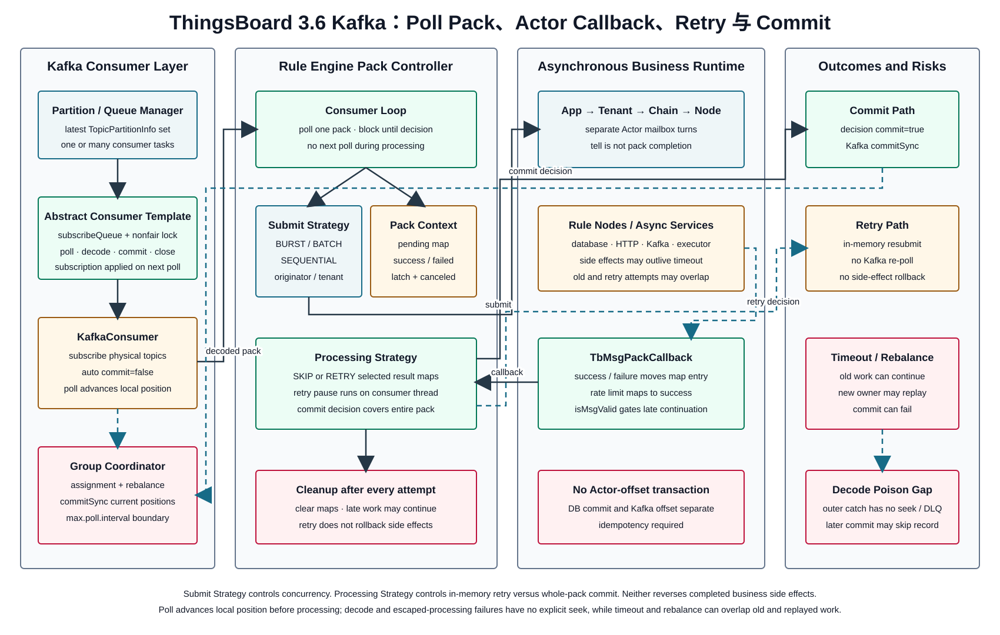

### 4.1 Consumer线程与Actor线程

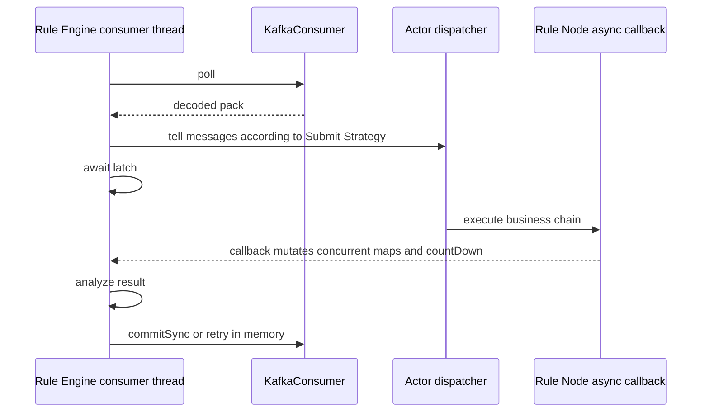

Consumer线程不会执行Rule Node本体，但会同步等待callback。Pack maps必须是ConcurrentMap，latch负责等待可见性。Callback可能来自Actor、DB future、HTTP client或其他executor。

### 4.2 Submit Strategy

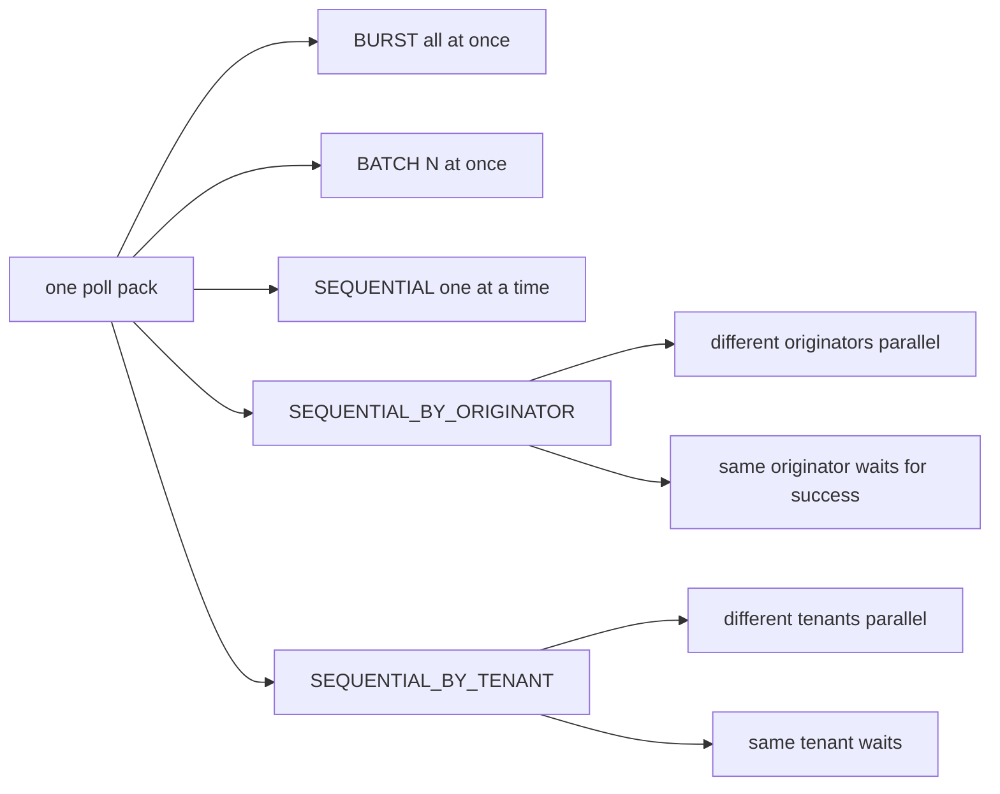

Sequential family的“下一条”推进依赖 `submitStrategy.onSuccess(id)`；失败处理与retry map仍由Processing Strategy决定。它不是Kafka partition ordering的替代，而是poll pack内部额外约束。

### 4.3 Timeout与late callback

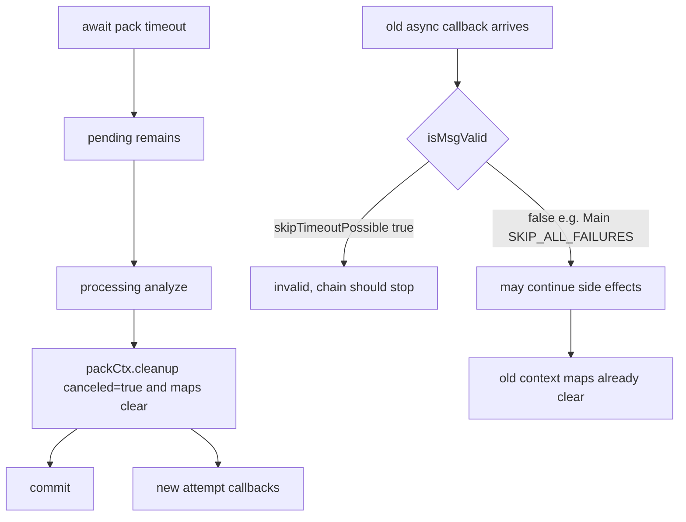

cleanup不是线程中断，也不取消HTTP/DB Future。它只影响callback有效性与内存map；已在执行的代码必须主动检查 `isMsgValid()` 才能停止。

### 4.4 Rebalance

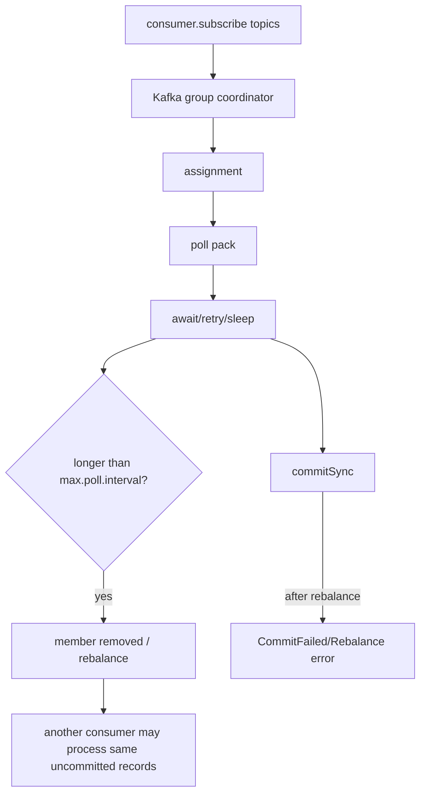

没有自定义ConsumerRebalanceListener来在revocation时协调当前pack。通常2秒timeout小于300秒max poll interval，但无限retry、慢外部节点或人为增大timeout会改变结论。

---

## 五、时序图

完整时序图覆盖subscribe延迟应用、poll/decode、BURST、callback、retry、timeout late callback、commitSync、decode poison和rebalance：

[打开 PlantUML 源文件](sequence.puml) | [新窗口打开原始 SVG](sequence.svg)

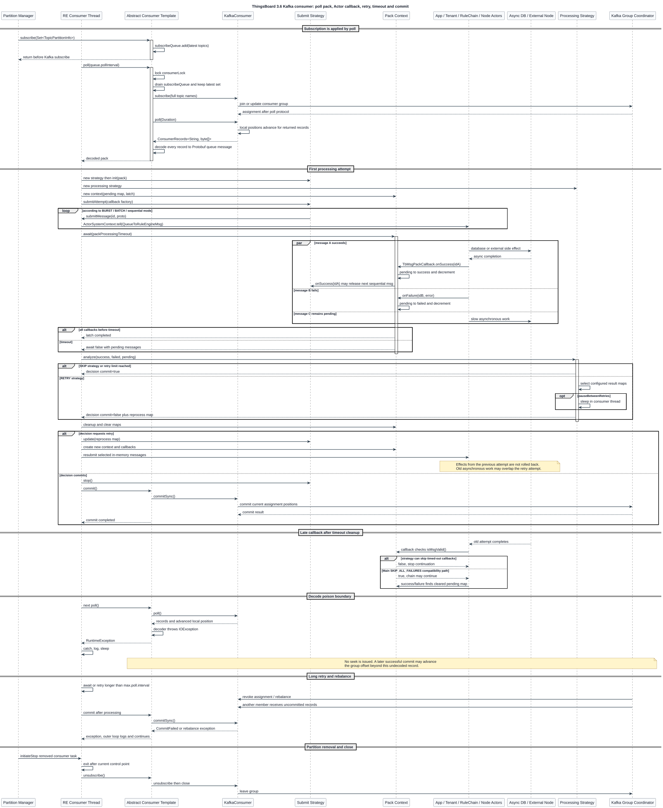

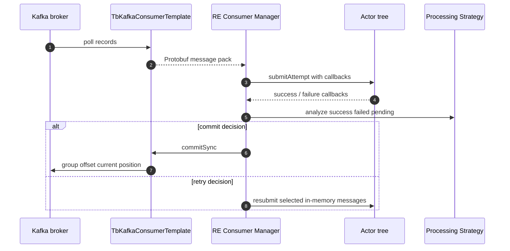

---

## 六、数据变化

### 6.1 Kafka状态

| 状态 | 变化点 | 说明 |
|---|---|---|
| consumer group membership | subscribe/poll/close | group coordinator管理 |
| local position | poll | record返回时已前进 |
| committed group offset | commitSync | 整个assignment当前位置 |
| assignment | group rebalance | 无自定义listener |
| lag | producer写入 vs committed offset | callback慢、retry、阻塞会增长 |

### 6.2 JVM pack状态

| Map/计数 | 初始 | callback变化 | cleanup |
|---|---|---|---|
| pendingMap | Submit Strategy pending集合 | success/failure remove | clear |
| successMap | empty | success put | clear |
| failedMap | empty | failure put | clear |
| pendingCount | pending size | callback decrement | 不重置；context废弃 |
| exceptionsMap | empty | 每tenant首个异常 | cleanup未清；context随后失去引用 |
| canceled | false | 不变 | true |

### 6.3 数据库、缓存、Actor与Session

- Consumer公共层不直接写DB；Rule Nodes和Core services在callback前后执行具体副作用。
- Processing retry不会回滚PostgreSQL/Timescale/Cassandra写入，也不回滚Redis cache、外部HTTP或Kafka producer。
- Actor mailbox与Kafka offset无事务。Actor收到消息后JVM崩溃但commit前，会从Kafka重放；commit后Actor异步仍未完成则可能丢业务完成。
- Core queue把设备session/RPC消息投Actor后某些分支立即callback success，commit只证明handoff而不是设备响应。
- Rate limit failure被pack callback转换为success，会推进offset。

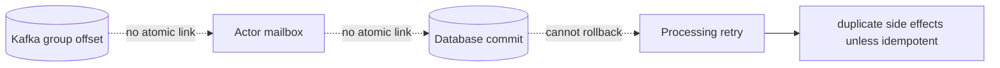

### 6.4 Pack生命周期

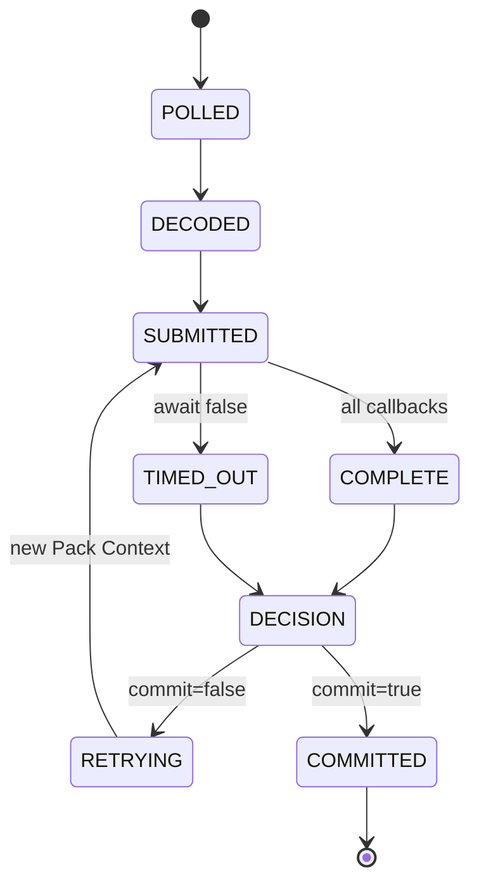

---

## 七、源码分析

### 7.1 Consumer抽象

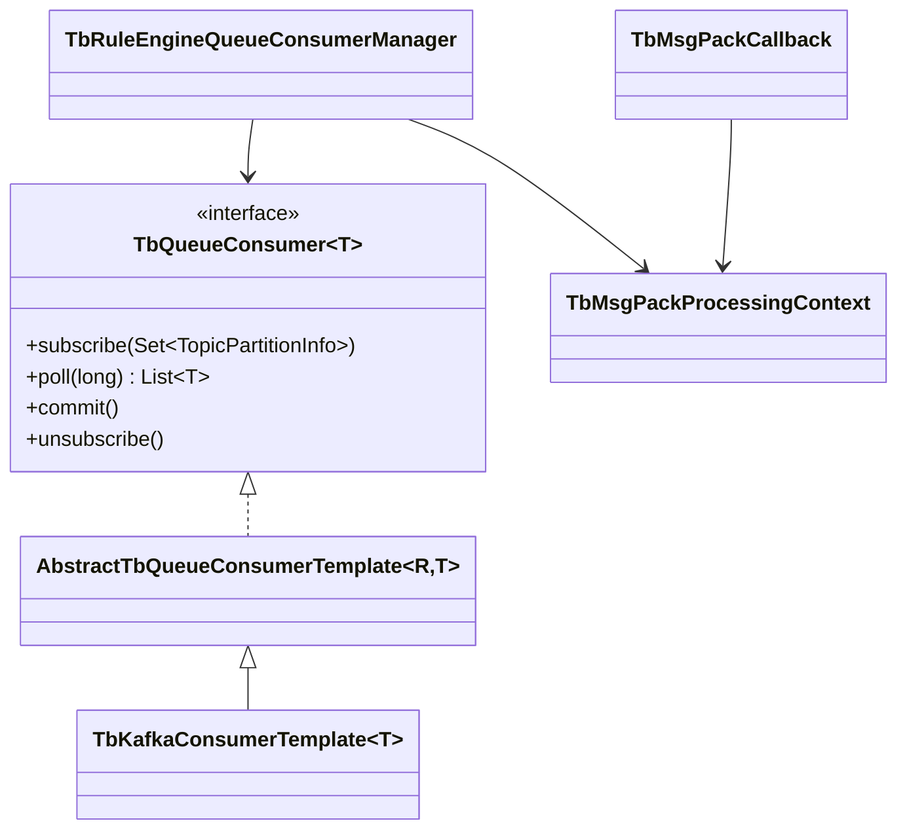

Abstract template把不同broker的subscribe/poll/commit包装为统一锁和decode流程。Kafka实现只负责KafkaConsumer和Protobuf decoder，不知道Actor或processing strategy。

### 7.2 subscribeQueue

`subscribe(Set)` 只把set追加到无界ConcurrentLinkedQueue。下次poll持锁时while drain，只保留最后一个set，然后调用doSubscribe。快速连续partition event会被折叠为最新状态。

### 7.3 Decode poison风险

[`AbstractTbQueueConsumerTemplate.decodeRecords(List)`](../../../common/queue/src/main/java/org/thingsboard/server/queue/common/AbstractTbQueueConsumerTemplate.java#L163) 对每条record decode；任一IOException立刻抛RuntimeException，已decode列表不返回。KafkaConsumer position已由poll前进，外层consumerLoop catch没有seek。若该consumer继续poll并之后commit，poison record可能被永久越过，而不是稳定阻塞分区。

### 7.4 Retry计算

`RetryStrategy` 第一次失败时记录initialTotalCount，retryCount每次analyze失败递增。`maxRetries>0 && retryCount>maxRetries` 才停止，因此retries=3允许3个retry decision，retries=0不限制。pause单位是秒并按2倍增长至max。

`failurePercentage` 使用 `(failed + pending) / initialTotalCount` 与配置值比较；达到停止条件后decision直接commit，不发送DLQ。

### 7.5 Cleanup语义

[`TbMsgPackProcessingContext.cleanup()`](../../../application/src/main/java/org/thingsboard/server/service/queue/TbMsgPackProcessingContext.java#L244) 设置canceled并清pending/success/failed。`isCanceled()` 只有在strategy表示可skip timeout时才返回true，这是为了让某些旧callback继续链路，但意味着commit后业务仍可能运行。

### 7.6 Core差异

Core的 `TbPackProcessingContext` 只跟踪ackMap和failedMap。`DefaultTbCoreConsumerService` timeout后cancel提交Future、打印pending/failed，然后不分析结果直接commit。Actor或service callback迟到时只修改已脱离consumer决策的context。

---

## 八、Actor 分析

Rule Engine consumer把每个record转换为 `QueueToRuleEngineMsg`，调用 `ActorSystemContext.tell`。Consumer线程只等待callback，不进入Actor Dispatcher。

Actor与consumer的关键边界：

1. Actor `tell` 成功入队不触发pack success，最终 `TbMsgCallback` 才触发。
2. 一条TbMsg在多个Rule Node fan-out时callback内部引用计数决定何时完成。
3. Actor processing普通异常若未完成callback，会变成pack timeout。
4. timeout cleanup后Actor message可能仍在Mailbox或外部Future中。
5. retry会创建新TbMsg和callback投Actor；旧attempt可能同时继续，形成并发重复链。
6. Partition change停止Actor不会自动seek Kafka或修改processing decision，消息的 `onTbActorStopped` 必须正确完成callback。

---

## 九、Kafka 分析

### 9.1 Consumer Group

Main queue各Rule Engine实例使用同group，只有owner管理器订阅对应full topics。Notification consumer的group含serviceId，每个节点都消费自己的topic。queue.prefix同时用于topic/group环境隔离。

### 9.2 Poll参数

Kafka consumer auto commit明确为false。默认max.poll.records=8192、max.poll.interval=300s、auto.offset.reset=earliest、每partition fetch 16MiB、总fetch 128MiB。一次8192条BURST可能远超2秒pack timeout，参数必须与Rule Node延迟和Dispatcher容量联合设置。

### 9.3 commitSync

commitSync阻塞consumer线程并提交当前positions。它不是“只提交successMap”；Processing Strategy必须先把整个pack决定为commit。Broker或rebalance错误会抛出并进入outer catch。

### 9.4 Rebalance与重复

处理时间超过max.poll.interval时，另一consumer可接管未committed record并执行；旧consumer的Actor链仍可能运行。此时相同业务消息在两个节点并发，幂等键应使用TbMsg id或业务唯一键。

### 9.5 Dead Letter缺口

TenantActor对不存在Rule Chain的注释仍写TODO dead letters；Processing Strategy达到上限或skip时直接commit。release-3.6公共链没有自动DLQ保存失败payload与stack，生产需依赖日志/debug event或自定义节点补偿。

---

## 十、数据库分析

Consumer offset在Kafka，不在PostgreSQL。数据库事务由具体Rule Node/Service管理，存在以下窗口：

| 时序 | 崩溃结果 |
|---|---|
| DB提交前JVM崩溃，offset未提交 | Kafka重放，通常无DB副作用 |
| DB提交后、callback前崩溃 | Kafka重放，DB写重复 |
| callback success后、commitSync前崩溃 | Kafka重放，所有成功副作用可能重复 |
| commitSync后，异步旧链仍运行 | Kafka不会重放，但副作用可能晚到或失败 |
| retry attempt重复写DB | Kafka仍同一poll pack，DB需幂等 |

Timeseries insert通常允许同entity/key/ts upsert或冲突处理，但外部HTTP、消息发布、alarm comment等不一定天然幂等。不能用Kafka key自动保证数据库exactly-once。

---

## 十一、异常处理

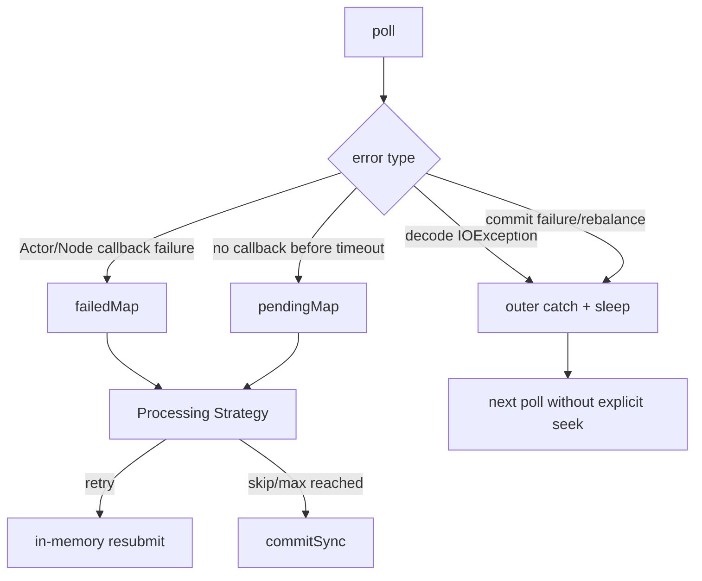

### 11.1 Poll/Decode失败

Kafka poll异常或decode RuntimeException被consumerLoop捕获并sleep。没有单record quarantine、seek或DLQ。Poison message不一定反复出现，反而可能随未来commit被跳过。

### 11.2 Rule Engine失败

Callback failure进入failedMap并保存每tenant首个RuleEngineException。Processing Strategy可能retry或skip。Rate limit是特例，pack callback把它当success，避免queue重试放大限流。

### 11.3 Timeout

await超时不取消Actor、Rule Node、HTTP或DB Future。cleanup只让支持skip timeout的callback invalid，并清统计map。Core even更直接：timeout后commit。

### 11.4 无限retry

High Priority默认retries=0表示无限。持续毒消息会阻塞该consumer不再poll，引起lag并可能触发max.poll.interval rebalance。pause固定5秒但每次业务attempt仍会产生副作用。

### 11.5 Stop/Partition removal

ConsumerPerPartitionWrapper先 `initiateStop()` 所有removed task，再逐个 `awaitCompletion()`，之后remove并为新增partition启动task。Consumer loop退出后unsubscribe/close。正在等待pack时停止条件只在外层/attempt循环检查，回收延迟受pack timeout或callback影响。

---

## 十二、源码阅读路线

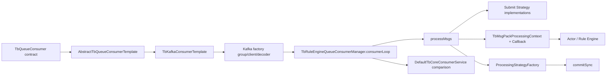

1. 先读 `TbQueueConsumer<T>` 与Abstract template，理解subscribe延迟、锁、decode和commit抽象。
2. 读 `TbKafkaConsumerTemplate`，确认subscribe而非assign、auto commit=false、commitSync和close。
3. 读Kafka factory的clientId/groupId/decoder，区分main与per-service consumer。
4. 从 `TbRuleEngineQueueConsumerManager.consumerLoop` 进入 `processMsgs`。
5. 并排读五种Submit Strategy，画出每种pending map推进条件。
6. 精读 `TbMsgPackProcessingContext` 与 `TbMsgPackCallback`，尤其rate limit、isMsgValid和cleanup。
7. 读ProcessingStrategyFactory的Retry/Skip两个内部类。
8. 回看Actor callback何时完成，验证Node异步边界。
9. 对比 `DefaultTbCoreConsumerService` timeout后无条件commit。
10. 最后结合Kafka consumer metrics、max.poll参数和partition manager分析rebalance。

推荐断点：`AbstractTbQueueConsumerTemplate.poll` -> `TbKafkaConsumerTemplate.doPoll` -> `decodeRecords` -> `TbRuleEngineQueueConsumerManager.processMsgs` -> `submitMessage` -> `TbMsgPackCallback` -> `RetryStrategy.analyze` -> `TbKafkaConsumerTemplate.doCommit`。

---

## 十三、常见面试题

### 1. ThingsBoard Kafka consumer开启auto commit吗？

不开启。`TbKafkaSettings.toConsumerProps` 明确设false，业务decision后调用commitSync。

### 2. poll返回是否等于offset已提交？

不等于。local position已前进，group committed offset仍保持旧值。

### 3. Rule Engine一次commit是逐条还是整pack？

整pack。Processing Strategy最终给出commit decision，commitSync提交当前assignment positions。

### 4. Submit Strategy和Processing Strategy区别是什么？

前者控制pack内投递并发/顺序，后者控制结果是commit还是选择消息重跑。

### 5. BURST会等待Rule Engine完成吗？

会把全部消息快速投Actor，然后consumer线程通过pack latch等待callback或timeout。

### 6. Main queue失败会Kafka重试吗？

默认不会。SKIP_ALL_FAILURES直接commit；Broker不会再次交付已提交offset前的record。

### 7. High Priority retries=0是什么意思？

不是零次，而是不限次数，因为代码只在maxRetries>0时检查上限。

### 8. Retry是否重新poll Kafka？

不重新poll。它把当前pack选中的 `TbProtoQueueMsg` 内存对象再次提交Actor。

### 9. RETRY_ALL有什么风险？

连已成功消息也重跑，任何非幂等DB、HTTP、notification副作用都会重复。

### 10. Pack timeout会取消Rule Node吗？

不会。只结束等待、分析策略并cleanup；旧异步链可能继续。

### 11. `isMsgValid()` 如何处理late callback？

当strategy允许skip timeout且context已cleanup时返回false；Main SKIP_ALL_FAILURES返回false条件不成立，旧链可能继续。

### 12. Rate limit为什么不retry？

Pack callback识别AbstractRateLimitException后调用ctx.onSuccess，避免queue重试继续压垮租户配额。

### 13. Decode失败会形成稳定poison pill吗？

不一定。代码无seek，Kafka position已前进；后续成功commit可能越过坏record。

### 14. consumer使用assign还是subscribe？

使用subscribe(topicNames)，参与consumer group rebalance；ThingsBoard partition manager决定订阅哪些物理topic。

### 15. consumerPerPartition是什么意思？

每个ThingsBoard逻辑partition/TPI创建独立consumer task订阅对应物理topic，而不是一个consumer订阅所有topic。

### 16. 为什么长retry会触发rebalance？

consumer线程在retry/await/sleep期间不poll，超过max.poll.interval会被group移除。

### 17. rebalance后commitSync会怎样？

可能抛CommitFailed或rebalance相关异常；旧业务链也可能与新owner重复执行。

### 18. Core queue有Processing Strategy吗？

主处理链没有。它等callback或timeout，然后无条件commit并记录pending/failed。

### 19. Core timeout cancel Future能停止Actor吗？

不能保证。Future只包提交任务，已经交给Actor或异步service的工作可继续。

### 20. commitSync为何可能阻塞？

需要与group coordinator通信并等待结果；网络、rebalance或broker故障会延迟/失败。

### 21. 是否有自动Dead Letter Queue？

这条公共Rule Engine链没有。Skip或达到retry上限后直接commit，主要留下日志/统计。

### 22. Kafka key能保证数据库幂等吗？

不能。key只影响partition；DB和外部系统需要显式唯一键、upsert或幂等接口。

### 23. 如何估算合理max.poll.records？

用单消息P95/P99、Submit并发、pack timeout、Actor/DB容量和max.poll.interval联合估算，不能只追求broker吞吐。

### 24. 如何排查consumer lag？

同时看poll rate、processing/callback latency、pending/failed/timeout、retry pause、Dispatcher/DB、commit latency与rebalance，不只增加consumer数。

### 25. 该实现是at-least-once还是at-most-once？

正常commit前崩溃会重放，属于at-least-once；timeout skip、decode无seek和commit后late失败又产生at-most-once窗口，所以端到端不能用单一标签概括，更不是exactly-once。

---

[上一篇：16 Kafka 发送流程](../16-kafka-producer/README.md) | [返回全书目录](../../SUMMARY.md) | [下一篇：18 Queue 管理](../18-queue-management/README.md)
