# 20 Cassandra 写入流程

> 源码基线：ThingsBoard `3.6.4`，提交 `0cb411fc90`。本章只分析 `database.ts.type=cassandra` / `database.ts_latest.type=cassandra` 的 telemetry history/latest 实现，不把 Cassandra 当作 ThingsBoard 全部实体数据库。

[上一篇：19 Cluster 通信](../19-cluster-communication/README.md) | [HTML 版](index.html) | [全书目录](../../SUMMARY.md) | [PlantUML 源文件](sequence.puml) | [时序图 SVG](sequence.svg) | [架构图 SVG](../../assets/architecture/20-cassandra-write.svg) | [下一篇：21 TimescaleDB 写入流程](../21-timescale-write/README.md)

---

## 一、流程目标

ThingsBoard 使用 Cassandra 的目标不是把 PostgreSQL Entity 表搬进宽表，而是为高写入量 telemetry 提供按实体、key、时间分桶的可水平扩展 history，以及按实体快速读取的 latest 镜像。

一次普通 telemetry datapoint 在 Cassandra 模式下最多对应三类独立写入：

1. `ts_kv_partitions_cf`：登记该实体/key有哪些时间 partition，供查询避免扫描不存在的月份。
2. `ts_kv_cf`：保存历史值，partition key中包含实体、key和时间分区，`ts`作为 clustering key。
3. `ts_kv_latest_cf`：保存实体/key的最新镜像；主键不含遥测ts，后写覆盖前写。

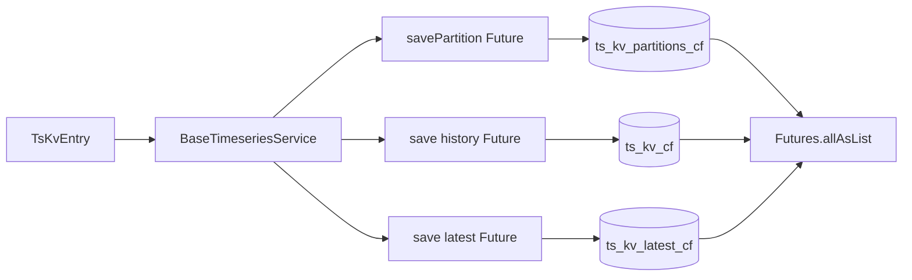

这不是 Cassandra batch 或轻量事务。三个 Future 并行提交，`allAsList`只聚合最终结果；其中一个失败不会撤销另外两个已经完成的 mutation。因此“Save Timeseries Node失败”可能对应 history已写但latest失败、latest已写但registry失败等不同状态。

### 1.1 与 MySQL 写入思维的根本差异

| MySQL 常见模型 | Cassandra telemetry模型 |
|---|---|
| 单表二级索引支持多查询 | query-first设计三张反规范化表 |
| 跨行事务/回滚 | 单partition mutation，三张表无共同事务 |
| B+Tree范围扫描 | partition key定位后按clustering ts扫描 |
| 行锁防并发覆盖 | last-write-wins cell timestamp |
| 定时DELETE清历史 | history写入时`USING TTL`原生过期 |

---

## 二、入口

### 2.1 设备遥测和Rule Engine

主入口仍是第9章的`TbMsgTimeseriesNode.onMsg(TbContext, TbMsg)`：解析`POST_TELEMETRY_REQUEST`后调用`RuleEngineTelemetryService.saveAndNotify(...)`。配置`saveLatest=false`时走`saveWithoutLatestAndNotify(...)`，只写registry/history。

源码：[TbMsgTimeseriesNode.java](../../../rule-engine/rule-engine-components/src/main/java/org/thingsboard/rule/engine/telemetry/TbMsgTimeseriesNode.java#L146)。

### 2.2 REST、Edge与内部服务

- `TelemetryController` REST telemetry save。
- Edge上行telemetry processor。
- Device State、OTA、API Usage、Rule Engine statistics等内部telemetry。
- Bulk import与Entity View衍生写入。

这些入口最终汇入`DefaultTelemetrySubscriptionService.saveAndNotifyInternal(...)`，持久化Future成功后再发WebSocket/Entity View等通知。Cassandra backend不改变上层消息类型，只由Spring条件Bean选择DAO。

### 2.3 后端选择

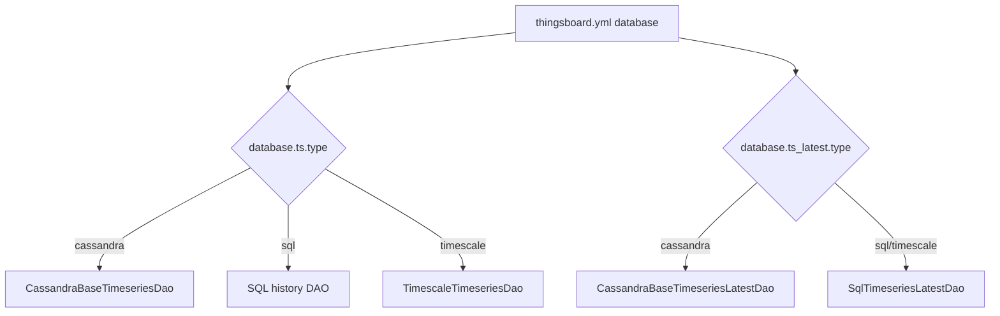

`@NoSqlTsDao`和`@NoSqlTsLatestDao`分别绑定history/latest，因此hybrid部署可让history与latest落在不同后端。默认3.6配置二者都是Cassandra。

源码：[NoSqlTsDao.java](../../../common/dao-api/src/main/java/org/thingsboard/server/dao/util/NoSqlTsDao.java#L20)、[NoSqlTsLatestDao.java](../../../common/dao-api/src/main/java/org/thingsboard/server/dao/util/NoSqlTsLatestDao.java#L20)、[thingsboard.yml](../../../application/src/main/resources/thingsboard.yml#L198)。

---

## 三、完整调用链

### 3.1 上层持久化编排

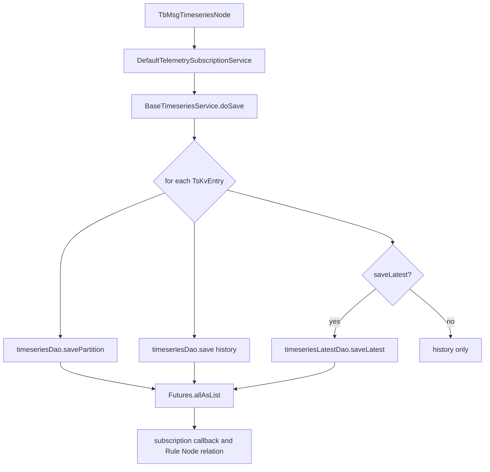

1. `TbMsgTimeseriesNode.onMsg(...)`：把TbMsg data转为`List<TsKvEntry>`，确定TTL与saveLatest开关。
2. `DefaultTelemetrySubscriptionService.saveAndNotifyInternal(...)`：调用`TimeseriesService`，成功后组织通知。
3. `BaseTimeseriesService.doSave(...)`：逐datapoint注册2或3个Future。
4. `savePartition(...)`：维护partition registry。
5. `save(...)`：写history row/cell，并按effective TTL返回`dataPointDays`统计值。
6. `saveLatest(...)`：无TTL、无遥测ts比较的普通INSERT。
7. `Futures.allAsList`：任一Future失败使组合Future失败，但已完成mutation不回滚。

关键源码：[BaseTimeseriesService.java](../../../dao/src/main/java/org/thingsboard/server/dao/timeseries/BaseTimeseriesService.java#L317)、同文件 [doSaveAndRegisterFuturesFor](../../../dao/src/main/java/org/thingsboard/server/dao/timeseries/BaseTimeseriesService.java#L386)。

### 3.2 时间partition计算

默认`cassandra.query.ts_key_value_partitioning=MONTHS`。`toPartitionTs(ts)`把毫秒时间转UTC `LocalDateTime`，按配置单位截断，再转回epoch毫秒。

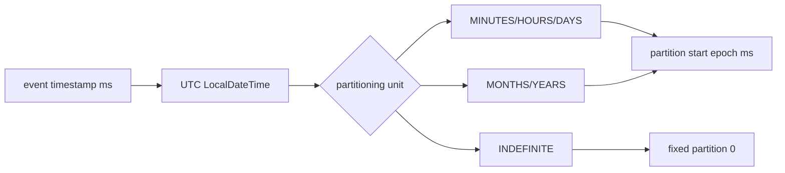

history partition key为`(entity_type, entity_id, key, partitionStart)`。这意味着同一设备不同telemetry key分属不同Cassandra partition；高key基数会增加partition与registry行数，但单个热key仍可能形成写热点。

源码：[CassandraBaseTimeseriesDao.java](../../../dao/src/main/java/org/thingsboard/server/dao/timeseries/CassandraBaseTimeseriesDao.java#L471)。

### 3.3 partition registry写入

`savePartition(...)`在非INDEFINITE模式下构造`CassandraPartitionCacheKey(entityId,key,partition)`：

- 本地cache未命中：写`ts_kv_partitions_cf`，成功callback后加入cache。
- cache命中：直接返回immediate Future，减少重复registry mutation。
- cache禁用：每个datapoint都做幂等registry INSERT。

custom TTL不会直接用于registry；registry使用system TTL，避免某个短TTL点过早删掉仍有长TTL数据的partition索引。system TTL为0时registry永久存在，即便history因custom TTL已空。

### 3.4 history写入

`CassandraBaseTimeseriesDao.save(...)`先执行`computeTtl(requestTtl)`：

```text
systemTtl == 0: effective = requestTtl
systemTtl > 0 and requestTtl == 0: effective = systemTtl
systemTtl > 0 and requestTtl > 0: effective = min(systemTtl, requestTtl)
```

随后按`DataType`选择prepared statement。`set_null_values_enabled=true`时一次INSERT显式写五种value列，非目标列设null；false时只写目标列。默认true是为了处理同一个`(entity,key,partition,ts)`从一种数据类型改成另一种类型时清除旧cell。

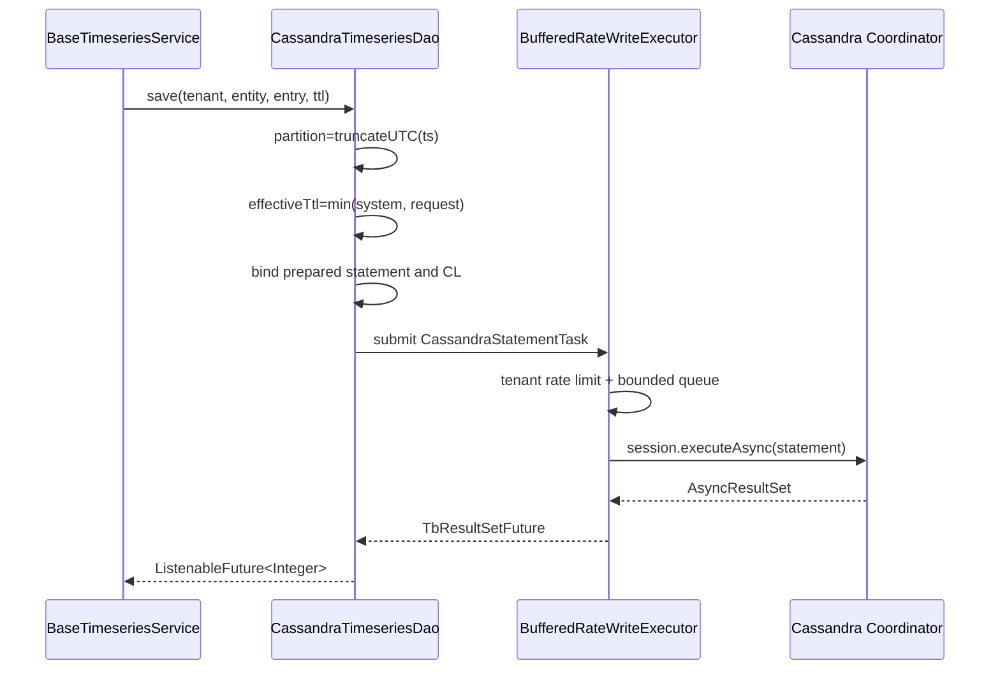

### 3.5 latest写入

`CassandraBaseTimeseriesLatestDao.saveLatest(...)`绑定entityType、entityId、key、业务ts与value，执行普通INSERT。CQL没有`IF`、没有LWT、没有`USING TTL`、也没有`WHERE old.ts <= new.ts`。

因此latest的胜者由Cassandra cell write timestamp决定，不由payload中的`ts`列决定。旧telemetry如果稍后被提交，可能覆盖较新的latest；SQL latest可用`update_by_latest_ts` guard，而Cassandra实现没有对应开关。

源码：[CassandraBaseTimeseriesLatestDao.java](../../../dao/src/main/java/org/thingsboard/server/dao/timeseries/CassandraBaseTimeseriesLatestDao.java#L194)、prepared CQL [同文件](../../../dao/src/main/java/org/thingsboard/server/dao/timeseries/CassandraBaseTimeseriesLatestDao.java#L312)。

### 3.6 IO调度与限流

DAO不直接在Rule Engine线程调用driver。`executeAsyncWrite`把`CassandraStatementTask`放入`CassandraBufferedRateWriteExecutor`：

1. 先检查tenant Cassandra query rate limit。
2. 放入有界`LinkedBlockingDeque(buffer_size)`；满时Future失败。
3. dispatcher线程在近似concurrency limit下取任务。
4. 任务等待+执行总时间受`permit_max_wait_time`限制。
5. DataStax async future在callback pool完成，再映射为Guava Future。

源码：[CassandraAbstractDao.java](../../../dao/src/main/java/org/thingsboard/server/dao/nosql/CassandraAbstractDao.java#L172)、[AbstractBufferedRateExecutor.java](../../../dao/src/main/java/org/thingsboard/server/dao/util/AbstractBufferedRateExecutor.java#L159)。

---

## 四、消息流

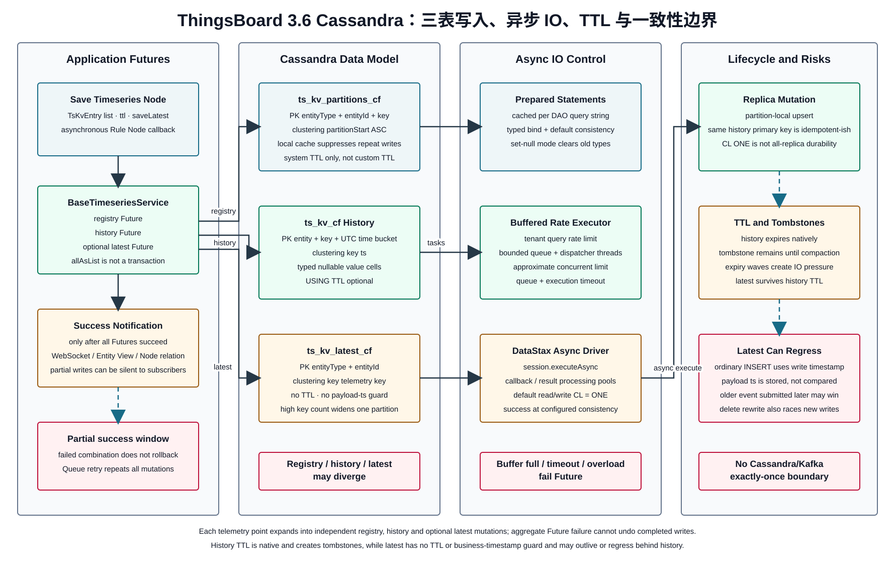

### 4.1 三表结构

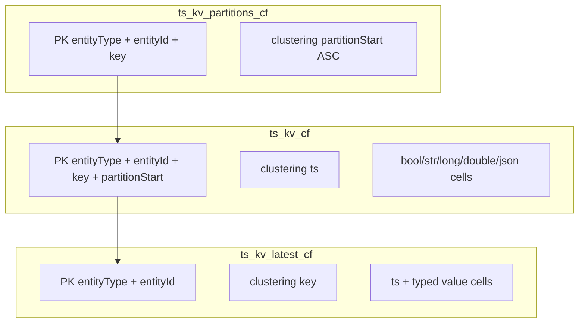

CQL schema：[schema-ts.cql](../../../dao/src/main/resources/cassandra/schema-ts.cql#L17)、[schema-ts-latest.cql](../../../dao/src/main/resources/cassandra/schema-ts-latest.cql#L17)。

### 4.2 一个设备两个key跨两个月

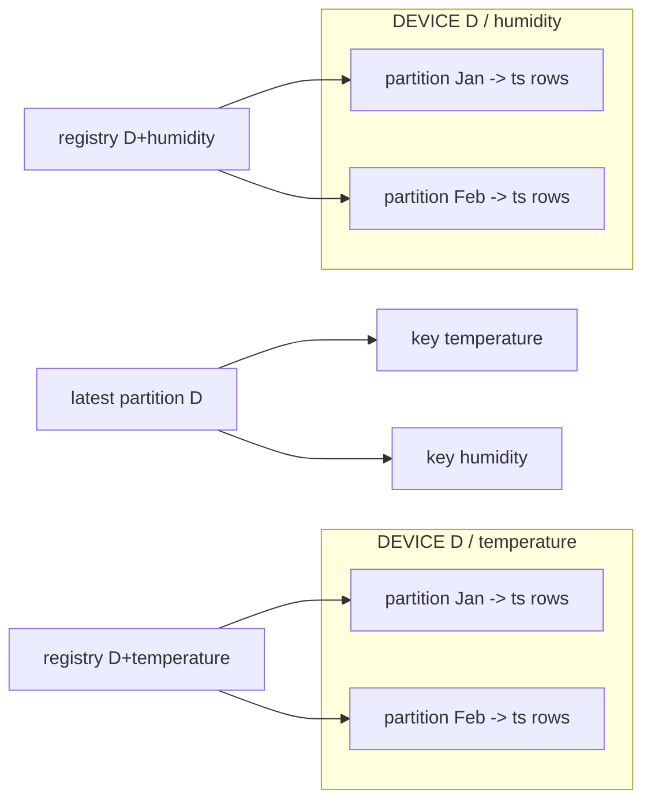

### 4.3 写入确认链

MQTT PUBACK仍只到Rule Engine Queue producer；Cassandra写完成由Save Timeseries Node的callback反映，Queue consumer随后才可能commit。三张表任一失败会使Node callback失败，但可能已有部分表成功。

---

## 五、时序图

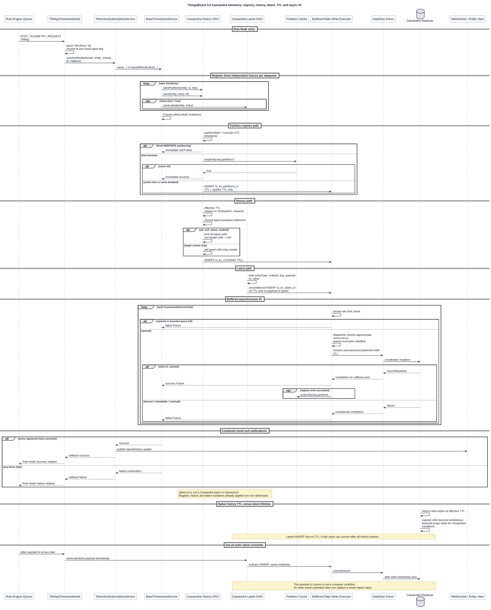

时序图包含Rule Node入口、三个并行Future、buffered rate executor、Cassandra replica确认、部分失败、TTL过期与late out-of-order latest覆盖。独立SVG可缩放查看。

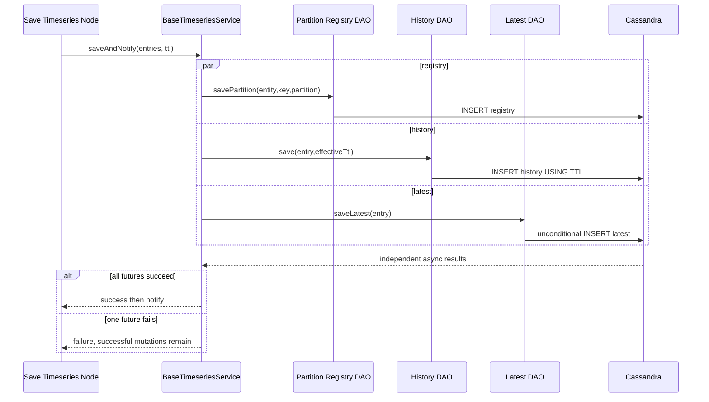

---

## 六、数据变化

### 6.1 `ts_kv_cf`

Primary key：`((entity_type, entity_id, key, partition), ts)`。同一完整主键再次写入是upsert；Cassandra不会追加一条“重复行”。不同value类型共享同一row的多个nullable cell。

### 6.2 `ts_kv_partitions_cf`

Primary key：`((entity_type, entity_id, key), partition)`，partition按ASC聚簇。它是查询索引，不是history事实表；registry row可能因history TTL过期而指向空partition，也可能因registry写失败而漏掉实际history。

### 6.3 `ts_kv_latest_cf`

Primary key：`((entity_type, entity_id), key)`。一个高key基数实体的全部latest keys位于同一个Cassandra partition；对普通Device很高效，但把成千上万动态key写到同一实体会形成宽partition与热点。

### 6.4 TTL生命周期

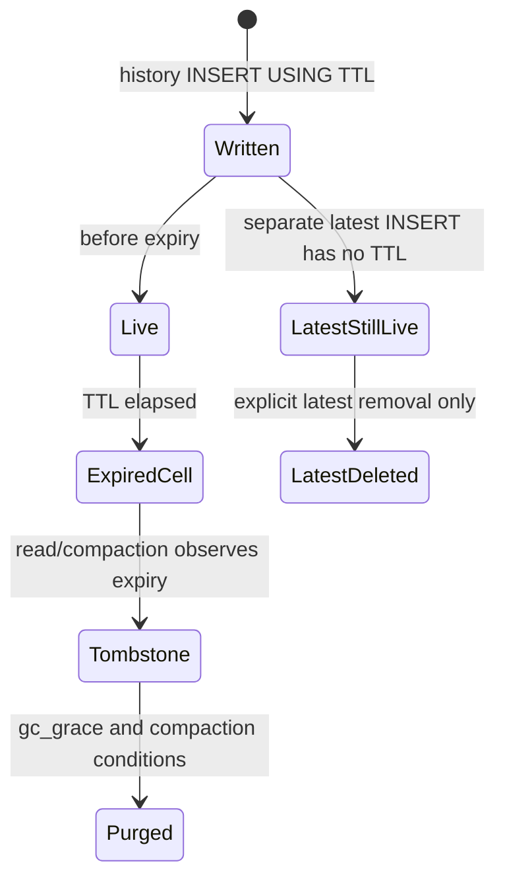

`cleanup(long)`在Cassandra DAO中为空实现，因为history依赖原生TTL；这不意味着latest自动清理，也不意味着tombstone立即释放磁盘。

### 6.5 缓存与通知

- `CassandraTsPartitionsCache`仅缓存registry写成功的key，JVM重启后重新填充，不是权威数据。
- history/latest写不使用Caffeine/Redis缓存。
- WebSocket/Entity View通知发生在组合save Future成功之后；部分写成功但组合失败时通知被抑制。
- Actor/Session/Kafka offset不由Cassandra事务管理。

---

## 七、源码分析

### 7.1 核心类型

| 完整包路径 | 职责 |
|---|---|
| `org.thingsboard.server.dao.timeseries.BaseTimeseriesService` | 组合registry/history/latest Futures |
| `org.thingsboard.server.dao.timeseries.CassandraBaseTimeseriesDao` | history/registry CQL、partition query、TTL |
| `org.thingsboard.server.dao.timeseries.CassandraBaseTimeseriesLatestDao` | latest CRUD与delete rewrite |
| `org.thingsboard.server.dao.timeseries.AbstractCassandraBaseTimeseriesDao` | Row到typed KvEntry映射 |
| `org.thingsboard.server.dao.nosql.CassandraAbstractDao` | prepared statement cache、CL、rate executor |
| `org.thingsboard.server.dao.nosql.CassandraBufferedRateWriteExecutor` | write buffer与driver async执行 |
| `org.thingsboard.server.dao.util.AbstractBufferedRateExecutor` | bounded queue、tenant limit、timeout、metrics |

### 7.2 typed value读取优先级

`toKvEntry`按`str -> long -> double -> bool -> json`找第一个非null cell。若`set_null_values_enabled=false`且同一主键从LONG改成STRING，旧LONG cell可能残留；STRING优先所以该方向尚能读新值，但反向STRING改LONG时旧STRING仍优先，可能读到旧类型。默认true通过显式null清理避免这一问题，代价是每次写更多cell/tombstone活动。

### 7.3 consistency level

默认read/write consistency都是`ONE`。`CassandraAbstractDao`只在statement未显式设置CL时应用cluster默认。CL=ONE追求可用性与低延迟，不保证写返回后任意副本立即可读；读写一致性、replication factor、hinted handoff和repair共同决定陈旧窗口。

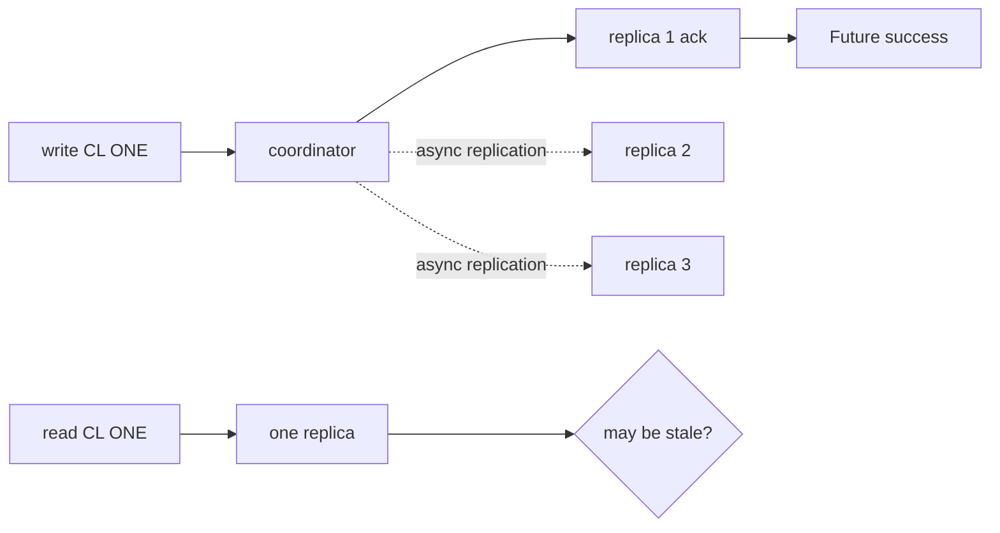

### 7.4 concurrency limit不是精确信号量

dispatcher检查`curLvl <= concurrencyLimit`后再increment，且可有多个dispatcher线程，因此瞬时并发可能超过配置值；它是buffered rate控制而非严格Semaphore。queue满、tenant limit、等待超时和driver失败都通过Future异常返回。

### 7.5 查询为什么需要registry

范围查询先取`minPartition/maxPartition`。`use_ts_key_value_partitioning_on_read=true`时读registry获得实际partition列表；false时在Java按日期枚举全部可能partition。NONE+limit查询逐partition顺序执行，直到满足limit；聚合则按interval拆子查询并跨partition合并。

### 7.6 删除latest rewrite

删除范围覆盖当前latest时，可根据`rewriteLatestIfDeleted`查询删除区间之前最后一点，再普通INSERT为新latest。读取旧latest、删除、查询history、重写latest不是LWT事务；并发新写可被该重写覆盖。

---

## 八、Actor 分析

Cassandra DAO不在Actor线程中同步阻塞。Rule Node发起异步Future并返回，完成callback再进入Rule Engine continuation。Actor mailbox串行只覆盖Node调用入口，不把多个Cassandra Future变成数据库事务。

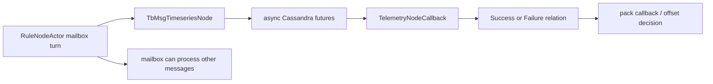

同一Device消息通常按Queue/Actor顺序进入Rule Chain，但不同Queue partition、retry、旧异步callback或其他REST入口仍可并发写同一latest key。不能用Actor串行假设替代Cassandra compare-and-set。

Actor owner迁移也不会搬Cassandra connection或Future；旧node已提交的driver请求可能在新owner开始处理后完成。

---

## 九、Kafka 分析

### 9.1 Queue与Cassandra背压是两层

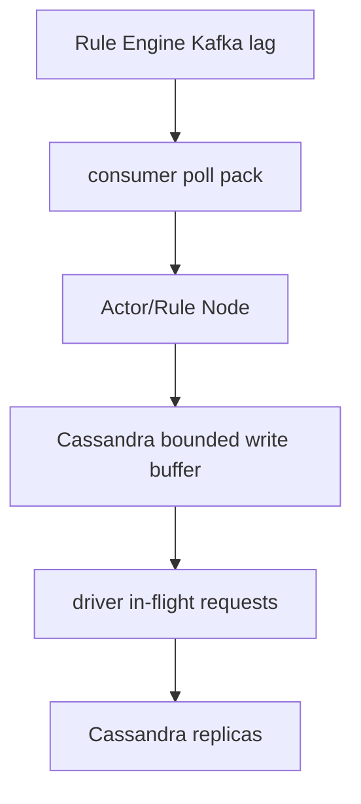

增大Kafka consumer并发可能把压力推入Cassandra buffer；当buffer满或Future timeout，Rule Node失败，再由Queue Processing Strategy决定skip/内存retry。默认Main Queue skip failures，可能commit offset而只留下部分Cassandra mutation。

### 9.2 确认边界

1. MQTT PUBACK：Rule Engine Queue producer成功。
2. Kafka consumer pack callback：Rule Node异步链结果或timeout。
3. Cassandra Future成功：达到write CL，不代表所有副本同步。
4. Kafka commit：pack策略提交当前positions。

这些阶段没有exactly-once事务。Cassandra相同history主键upsert有一定幂等性，但latest、通知、Rule Node其他副作用仍需独立分析。

### 9.3 retry影响

内存retry会重新执行registry/history/latest三个写；history相同主键通常upsert，registry同主键upsert，latest再次覆盖。若消息中还有告警、HTTP等Node副作用，它们不因Cassandra写幂等而自动幂等。

---

## 十、数据库分析

### 10.1 为什么这样设计partition key

`entity+key+timeBucket`把一个无限增长时间序列切成有界Cassandra partition，避免单partition无限变宽；`ts`聚簇支持有界时间范围和顺序limit。把key放进partition key意味着一次多key曲线查询必须并行/逐key发多个CQL，符合ThingsBoard API按keys拆query的方式。

### 10.2 热点与容量

| 风险 | 原因 | 工程措施 |
|---|---|---|
| 单热key partition | 设备同一key高频写，bucket过大 | 缩短partition unit，评估partition数量开销 |
| latest宽partition | 一个entity产生大量动态keys | 限制key基数、拆业务实体 |
| tombstone放大 | 大量TTL过期/类型null/delete | compaction/repair/读延迟监控 |
| registry膨胀 | system TTL=0且history custom TTL短 | 接受空registry读或制定清理工具 |
| coordinator过载 | CL/并发/buffer过高 | 看driver in-flight、timeout、节点负载 |

### 10.3 TTL不是立即删除

到期cell对查询不可见，但物理清理依赖tombstone、`gc_grace_seconds`和compaction。大批同刻TTL会形成过期波峰；IoT固定保留期会让写入波峰在TTL后重现为compaction压力。TTL调优必须同时看磁盘、tombstone scan、compaction pending与repair策略。

### 10.4 latest不会随history过期

`ts_kv_latest_cf` INSERT无TTL。即使history全部过期，Dashboard latest仍可显示旧值；如果业务需要“设备数据过期后latest消失”，必须通过显式逻辑删除/状态判断实现，不能只设置`TS_KV_TTL`。

### 10.5 数据一致性矩阵

| registry | history | latest | 结果 |
|---|---|---|---|
| 成功 | 成功 | 成功 | 正常 |
| 失败 | 成功 | 成功 | 范围查询可能漏partition，latest可见 |
| 成功 | 失败 | 成功 | latest存在但曲线缺点 |
| 成功 | 成功 | 失败 | 曲线有点但latest旧/缺失 |
| 成功 | TTL过期 | 仍存在 | latest长期显示最后状态 |

---

## 十一、异常处理

### 11.1 buffer与rate limit

- tenant超限：Future立即`TenantRateLimitException`。
- buffer满：`queue.add`抛`IllegalStateException`并设置Future失败。
- 排队太久或执行超时：`TimeoutException`。
- driver异常：透传到组合Future。
- shutdown：executor `shutdownNow`，队列中未完成任务的收尾没有数据库事务兜底。

### 11.2 部分成功

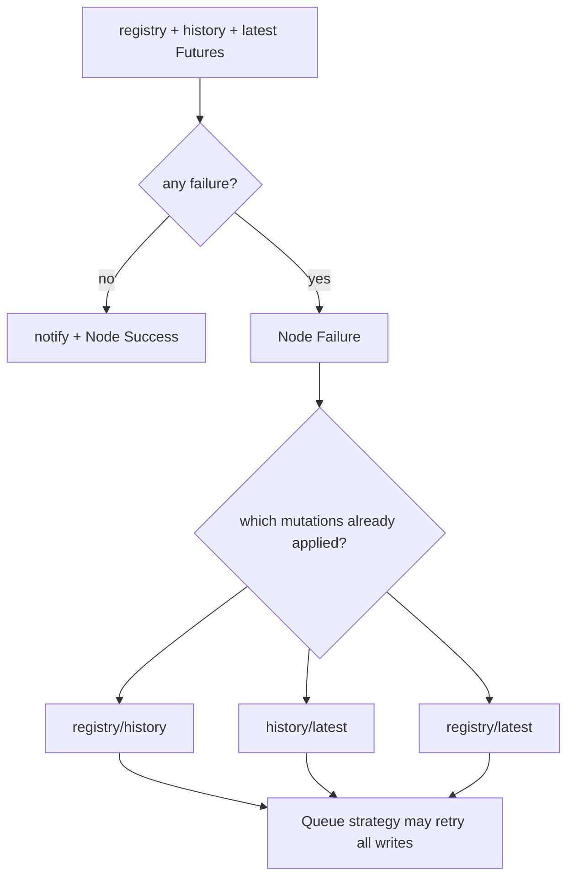

应用无法根据组合异常自动判断哪些mutation已成功，除非回读三表。生产补偿应按幂等upsert重试，而不是试图回滚Cassandra。

### 11.3 latest倒退

旧业务ts事件晚提交会普通INSERT同一latest key。没有LWT guard；读取到的`ts`可能小于之前看到的值。可在上游保证单key顺序、把latest放SQL并启用timestamp guard，或在业务读取时拒绝倒退，但当前Cassandra DAO自身不做。

### 11.4 Future悬挂风险

当前history查询/删除若partition fetch或逐partition read失败，部分callback分支只记录日志而没有对`SimpleListenableFuture`调用`setException`。调用方可能等到外层timeout而不是立即收到根因。排障时需同时检查Cassandra DAO error日志和上层请求timeout。

### 11.5 生产检查清单

1. 核对RF、read/write CL与容忍故障数，不机械保留ONE。
2. 按每entity/key写率和保留期估算bucket partition大小。
3. 监控write/read buffer added/rejected/expired/failed、当前并发和tenant限流。
4. 监控driver pool、coordinator timeout、dropped mutations、compaction pending与tombstone warnings。
5. 验证history TTL与latest业务语义，不把两者当同一生命周期。
6. 对同timestamp数据类型变更保留`set_null_values_enabled=true`，除非已证明key类型永不变化。
7. 压测必须包含TTL到期后的compaction阶段，而不只测写入首小时。

---

## 十二、源码阅读路线

1. 先读 [schema-ts.cql](../../../dao/src/main/resources/cassandra/schema-ts.cql#L17)，手写三组partition key例子。
2. 读 [BaseTimeseriesService.doSave](../../../dao/src/main/java/org/thingsboard/server/dao/timeseries/BaseTimeseriesService.java#L317)，确认每点2/3个Future。
3. 读 [CassandraBaseTimeseriesDao.save](../../../dao/src/main/java/org/thingsboard/server/dao/timeseries/CassandraBaseTimeseriesDao.java#L255)，跟踪TTL、partition和typed CQL。
4. 读同类 [savePartition](../../../dao/src/main/java/org/thingsboard/server/dao/timeseries/CassandraBaseTimeseriesDao.java#L306)，理解registry cache。
5. 读 [CassandraBaseTimeseriesLatestDao.saveLatest](../../../dao/src/main/java/org/thingsboard/server/dao/timeseries/CassandraBaseTimeseriesLatestDao.java#L194)，确认无TTL/无ts guard。
6. 读 [CassandraAbstractDao.executeAsync](../../../dao/src/main/java/org/thingsboard/server/dao/nosql/CassandraAbstractDao.java#L172)，看CL与rate executor。
7. 读 [AbstractBufferedRateExecutor.submit/dispatch](../../../dao/src/main/java/org/thingsboard/server/dao/util/AbstractBufferedRateExecutor.java#L159)，画出buffer、timeout与callback线程。
8. 回到history范围查询，跟踪registry -> partition cursor -> CQL limit。
9. 阅读latest delete rewrite，验证并发窗口。
10. 结合第9、17章，把MQTT ack、Queue commit和Cassandra CL成功放在同一时间线。

推荐断点：`TbMsgTimeseriesNode.onMsg` -> `BaseTimeseriesService.doSave` -> `CassandraBaseTimeseriesDao.savePartition` -> `CassandraBaseTimeseriesDao.save` -> `CassandraBaseTimeseriesLatestDao.saveLatest` -> `AbstractBufferedRateExecutor.submit` -> `CassandraStatementTask.executeAsync`。

---

## 十三、常见面试题

### 1. ThingsBoard用Cassandra保存哪些核心telemetry表？

history `ts_kv_cf`、partition registry `ts_kv_partitions_cf`和latest `ts_kv_latest_cf`。

### 2. history的partition key是什么？

`entity_type + entity_id + key + time partition`，`ts`是clustering key。

### 3. 默认时间partition多大？

配置默认`MONTHS`，按UTC月份起点计算。

### 4. 为什么还需要partition registry？

范围查询先知道实际存在的bucket，避免枚举大量没有数据的时间分区。

### 5. registry和history在同一个Cassandra batch吗？

不在；它们是独立异步mutation与Future。

### 6. 一点telemetry通常产生几次写？

保存latest时三次：registry、history、latest；关闭latest时两次。

### 7. allAsList失败会回滚已成功写吗？

不会，只让组合Future失败。

### 8. custom TTL和system TTL如何组合？

system TTL大于0时取system与custom的较小值；custom为0则使用system。system为0时直接使用custom。

### 9. registry为什么不使用custom TTL？

短TTL点不能过早删除仍服务于长TTL点的partition索引；registry只使用system TTL或永久保留。

### 10. latest是否带TTL？

不带，history过期不会自动删除latest。

### 11. Cassandra latest如何防旧时间戳覆盖新值？

当前实现不防；普通INSERT没有按业务ts比较或LWT。

### 12. 同一history主键重试是否会重复行？

不会追加重复主键，而是Cassandra upsert；cell值按write timestamp解决冲突。

### 13. set_null_values_enabled解决什么问题？

同一主键数据类型变化时显式清除其他typed value cells，避免读取旧类型值。

### 14. 默认read/write consistency是什么？

配置默认都是ONE。

### 15. CL ONE成功表示所有副本都持久化了吗？

不表示，只达到一个副本确认；其余复制、repair和读取一致性另行决定。

### 16. Cassandra写是否直接运行在Actor线程？

不直接运行；先进入bounded buffered rate executor，再调用driver async API。

### 17. buffer满时会阻塞还是失败？

`queue.add`失败并把异常设置到Future，不无限阻塞调用线程。

### 18. concurrent_limit是严格信号量吗？

不是；实现先检查`<=`再increment且可有多个dispatcher，属于近似并发控制。

### 19. 高基数key对latest有什么影响？

同一entity全部key在一个latest partition，可能形成超宽partition和热点。

### 20. TTL到期为什么磁盘不立即下降？

过期先形成tombstone，物理清理由gc_grace与compaction决定。

### 21. registry成功、history失败会怎样？

查询会命中一个空partition；组合save失败但registry mutation保留。

### 22. history成功、registry失败会怎样？

启用registry读取时范围查询可能漏掉实际history bucket。

### 23. 删除当前latest后如何重写？

查询删除区间之前的最后history点并普通INSERT为latest，不是并发安全事务。

### 24. Cassandra模式下Kafka retry能保证exactly-once吗？

不能。相同history主键较幂等，但三表、offset、通知和其他Node副作用无共同事务。

### 25. 排查Cassandra telemetry慢写先看什么？

先区分Kafka lag、Actor callback与Cassandra buffer，再看tenant limit、rejected/expired、driver in-flight、CL延迟、节点负载和compaction。

---

[上一篇：19 Cluster 通信](../19-cluster-communication/README.md) | [返回全书目录](../../SUMMARY.md) | [下一篇：21 TimescaleDB 写入流程](../21-timescale-write/README.md)
