# 24 CoAP 消息流程

> 源码基线：ThingsBoard `3.6.4`，提交 `0cb411fc90`。本章分析 ThingsBoard 原生 CoAP Device API，不把 LwM2M 或 Efento 私有资源混入主流程。

[上一篇：23 HTTP 设备 API 流程](../23-http-device-api/README.md) | [HTML 版](index.html) | [全书目录](../../SUMMARY.md) | [PlantUML 源文件](sequence.puml) | [时序图 SVG](sequence.svg) | [架构图 SVG](../../assets/architecture/24-coap-message-flow.svg) | [下一篇：25 LwM2M 注册与观测流程](../25-lwm2m-registration-observe/README.md)

---

## 一、流程目标

CoAP Transport 让低功耗、受限网络设备用 UDP 完成 Telemetry、Client Attributes、Claim、RPC、Shared Attributes Observe 和 Provision。它不是一条独立持久化链：协议层负责资源匹配、认证、payload 适配、会话与 CoAP response，平台业务仍复用 `TransportService -> Queue -> Actor/Rule Engine -> DAO`。

核心入口是 [org.thingsboard.server.transport.coap.CoapTransportResource](../../../common/transport/coap/src/main/java/org/thingsboard/server/transport/coap/CoapTransportResource.java#L71)，服务端由 [org.thingsboard.server.coapserver.DefaultCoapServerService](../../../common/coap-server/src/main/java/org/thingsboard/server/coapserver/DefaultCoapServerService.java#L55) 构造。

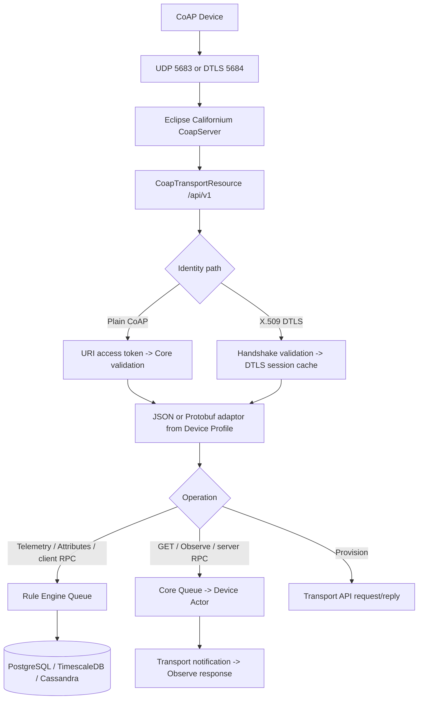
```mermaid
flowchart TB
    D["CoAP Device"] --> UDP["UDP 5683 or DTLS 5684"]
    UDP --> CF["Eclipse Californium CoapServer"]
    CF --> R["CoapTransportResource /api/v1"]
    R --> AUTH{"Identity path"}
    AUTH -->|"Plain CoAP"| TOKEN["URI access token -> Core validation"]
    AUTH -->|"X.509 DTLS"| DTLS["Handshake validation -> DTLS session cache"]
    TOKEN --> ADAPTOR["JSON or Protobuf adaptor from Device Profile"]
    DTLS --> ADAPTOR
    ADAPTOR --> OP{"Operation"}
    OP -->|"Telemetry / Attributes / client RPC"| RE["Rule Engine Queue"]
    OP -->|"GET / Observe / server RPC"| CORE["Core Queue -> Device Actor"]
    OP -->|"Provision"| API["Transport API request/reply"]
    RE --> DB[("PostgreSQL / TimescaleDB / Cassandra")]
    CORE --> NOTIFY["Transport notification -> Observe response"]
```

对 Java/Spring Boot 开发者最重要的四个边界：

1. `CoapTransportResource` 类似协议 Controller，但它运行在 Californium resource tree，不是 Spring MVC。
2. Telemetry/Attributes 的 `2.01 CREATED` 对应 Queue producer callback，不等于数据库事务提交。
3. GET Attributes 和 client-side RPC 是临时 `SYNC` session；Observe 是长期 `ASYNC` session。
4. CoAP Observe、peer/token 索引、PSM 睡眠状态都在 Transport 进程内存，集群只通过 Queue 转发下行通知。

---

## 二、入口

### 2.1 资源路径与方法

`CoapTransportService.init()` 把 `CoapTransportResource("v1")` 挂到根资源 `api` 下；`getChild(String)` 始终返回自身，因此 `/api/v1/{token}/{feature}/{requestId}` 的动态段不会创建独立 Resource 节点。测试客户端给出的标准基址是 `coap://localhost:5683/api/v1/`。

| CoAP 请求 | 入口分支 | 平台消息 | 主要去向 |
|---|---|---|---|
| `POST /api/v1/{token}/telemetry` | `processHandlePost(...)` | `PostTelemetryMsg` | Rule Engine Queue |
| `POST /api/v1/{token}/attributes` | 同上 | `PostAttributeMsg` | Rule Engine Queue |
| `GET /api/v1/{token}/attributes?...` | `processHandleGet(...)` | `GetAttributeRequestMsg` | Core Queue / Device Actor |
| `GET Observe=0 .../attributes` | Observe subscribe | `SubscribeToAttributeUpdatesMsg` + shared GET | Device Actor |
| `GET Observe=0 .../rpc` | Observe subscribe | `SubscribeToRPCMsg` | Device Actor |
| `GET Observe=1 .../attributes|rpc` | Observe unsubscribe | unsubscribe message | Device Actor |
| `POST .../{token}/rpc` | no request id | `ToServerRpcRequestMsg` | Rule Engine Queue |
| `POST .../{token}/rpc/{requestId}` | request id present | `ToDeviceRpcResponseMsg` | Device Actor |
| `POST .../{token}/claim` | claim | `ClaimDeviceMsg` | Device Actor |
| `POST /api/v1/provision` | token-less provision | `ProvisionDeviceRequestMsg` | Transport API request/reply |

`GET telemetry` 在 [CoapTransportResource.processHandleGet(CoapExchange)](../../../common/transport/coap/src/main/java/org/thingsboard/server/transport/coap/CoapTransportResource.java#L157) 被明确拒绝为 `4.00 BAD_REQUEST`；Telemetry 历史查询是平台 REST/WebSocket 能力，不是设备侧 CoAP API。

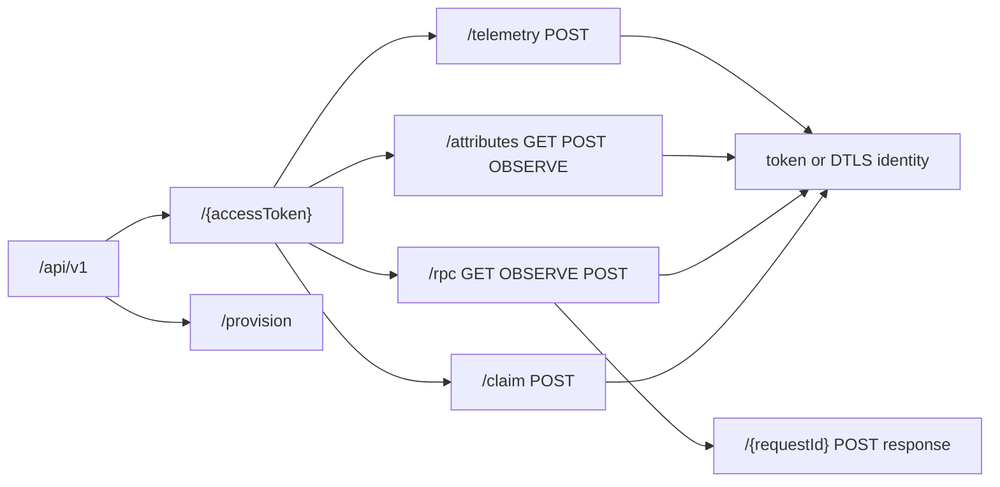
```mermaid
flowchart LR
    ROOT["/api/v1"] --> T["/{accessToken}"]
    ROOT --> P["/provision"]
    T --> TEL["/telemetry POST"]
    T --> ATTR["/attributes GET POST OBSERVE"]
    T --> RPC["/rpc GET OBSERVE POST"]
    T --> CLAIM["/claim POST"]
    RPC --> RID["/{requestId} POST response"]
    TEL --> AUTH["token or DTLS identity"]
    ATTR --> AUTH
    RPC --> AUTH
    CLAIM --> AUTH
```

### 2.2 网络入口和默认参数

[DefaultCoapServerService.createCoapServer()](../../../common/coap-server/src/main/java/org/thingsboard/server/coapserver/DefaultCoapServerService.java#L152) 创建一个 `CoapServer`，添加普通 UDP endpoint，并在 `transport.coap.dtls.enabled=true` 时添加 Scandium `DTLSConnector` endpoint。

| 配置 | release-3.6 默认值 | 作用 |
|---|---:|---|
| `transport.coap.bind_port` | `5683` | 明文 CoAP UDP 端口 |
| `transport.coap.timeout` | `10000 ms` | GET Attributes / client RPC 的 SYNC session timeout |
| `transport.coap.piggyback_timeout` | `500 ms` | 超过该时间先发 empty ACK，再发 separate response |
| `transport.coap.dtls.enabled` | `false` | 是否开启 DTLS 1.2 endpoint |
| `transport.coap.dtls.bind_port` | `5684` | secure CoAP 端口 |
| `transport.coap.psm_activity_timer` | `10000 ms` | 默认 PSM uplink 后下行窗口 |
| `transport.coap.paging_transmission_window` | `10000 ms` | 默认 eDRX paging window |
| `transport.sessions.report_timeout` | `3000 ms` | 长期 CoAP session activity 上报周期 |
| `transport.sessions.inactivity_timeout` | `600000 ms` | Core 侧 session inactivity 基线 |
| DTLS session inactivity | `86400000 ms` | X.509 DTLS peer cache 失效阈值 |
| DTLS cleanup interval | `1800000 ms` | peer cache 扫描周期 |

源码：[thingsboard.yml](../../../application/src/main/resources/thingsboard.yml#L995)、[CoapServerContext](../../../common/coap-server/src/main/java/org/thingsboard/server/coapserver/CoapServerContext.java#L36)。

### 2.3 Californium 网络配置

服务端将 `MAX_MESSAGE_SIZE` 与首选 block size 设为 1024，允许 blockwise body 最大 256 MiB，最多重传 4 次，并使用 `RELAXED` response matching。大 payload 仍会产生 blockwise 状态、UDP 分片风险和 Transport 堆内存压力，不能把 256 MiB 当作设备上报建议值。

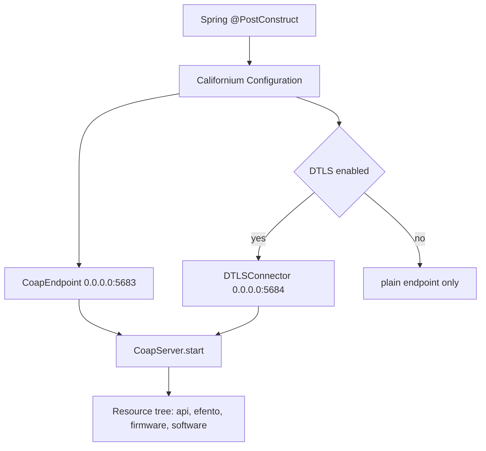
```mermaid
flowchart TB
    SPRING["Spring @PostConstruct"] --> CFG["Californium Configuration"]
    CFG --> UDP["CoapEndpoint 0.0.0.0:5683"]
    CFG --> CHECK{"DTLS enabled"}
    CHECK -->|"yes"| SEC["DTLSConnector 0.0.0.0:5684"]
    CHECK -->|"no"| ONLY["plain endpoint only"]
    UDP --> SERVER["CoapServer.start"]
    SEC --> SERVER
    SERVER --> TREE["Resource tree: api, efento, firmware, software"]
```

---

## 三、完整调用链

### 3.1 服务启动与 Resource 路由

| 步骤 | 类与方法 | 输入 | 输出 / 职责 |
|---|---|---|---|
| 1 | `org.thingsboard.server.coapserver.DefaultCoapServerService.init()` | Spring lifecycle | 创建、绑定并启动 Californium server |
| 2 | `DefaultCoapServerService.createCoapServer()` | `CoapServerContext` | UDP endpoint，可选 DTLS endpoint |
| 3 | `org.thingsboard.server.transport.coap.CoapTransportService.init()` | shared `CoapServer` | 注册 `api/v1` 等 Resource |
| 4 | `org.thingsboard.server.coapserver.TbCoapServerMessageDeliverer.findResource(Exchange)` | URI path options | 修正单段且带 `/` 的 path 后查 Resource |
| 5 | `org.thingsboard.server.transport.coap.AbstractCoapTransportResource.handleGET/handlePOST(CoapExchange)` | Californium exchange | 分派到具体 GET/POST 处理 |
| 6 | `CoapTransportResource.getChild(String)` | 动态 path segment | 返回当前 Resource，继续由 path position 解码 |

源码：[CoapTransportService.java](../../../common/transport/coap/src/main/java/org/thingsboard/server/transport/coap/CoapTransportService.java#L90)、[TbCoapServerMessageDeliverer.java](../../../common/coap-server/src/main/java/org/thingsboard/server/coapserver/TbCoapServerMessageDeliverer.java#L56)、[AbstractCoapTransportResource.java](../../../common/transport/coap/src/main/java/org/thingsboard/server/transport/coap/AbstractCoapTransportResource.java#L62)。

### 3.2 普通 CoAP access token 认证

1. `processRequest(CoapExchange, CoapSessionMsgType)` 先调用 `deferAccept()` 安排 empty ACK。
2. 没有可复用 DTLS identity 时，`decodeCredentials(Request)` 从 URI path 第 3 段取 token。
3. `TransportService.process(DeviceTransportType.COAP, ValidateDeviceTokenRequestMsg, callback)` 发 Transport API request/reply。
4. Core 的 `DefaultTransportApiService` 查询 credentials cache / PostgreSQL 并返回 device、profile、credentials 快照。
5. `CoapDeviceAuthCallback.onSuccess(...)` 要求同时存在 `deviceInfo` 和 `DeviceProfile`，否则响应 `4.01 UNAUTHORIZED`。
6. `DefaultCoapClientContext.getOrCreateClient(...)` 按 `DeviceId` 初始化 profile adaptor 和 credentials。

这与 HTTP Device API 类似：token 在 URL/path，不在 Authorization header。生产日志必须对 `/api/v1/{token}/...` 脱敏。

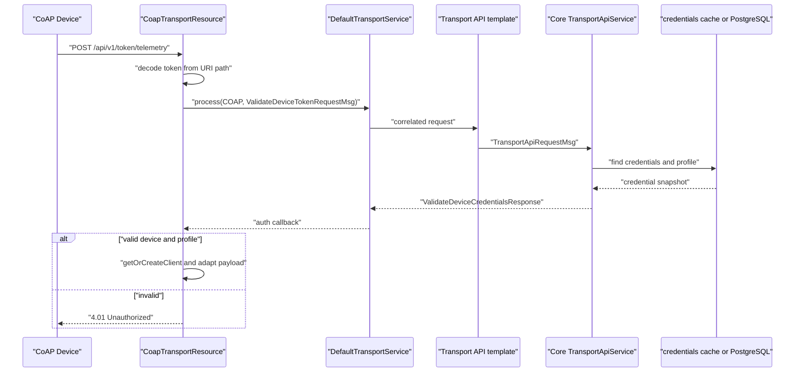
```mermaid
sequenceDiagram
    participant D as "CoAP Device"
    participant R as "CoapTransportResource"
    participant T as "DefaultTransportService"
    participant Q as "Transport API template"
    participant C as "Core TransportApiService"
    participant DB as "credentials cache or PostgreSQL"
    D->>R: "POST /api/v1/token/telemetry"
    R->>R: "decode token from URI path"
    R->>T: "process(COAP, ValidateDeviceTokenRequestMsg)"
    T->>Q: "correlated request"
    Q->>C: "TransportApiRequestMsg"
    C->>DB: "find credentials and profile"
    DB-->>C: "credential snapshot"
    C-->>T: "ValidateDeviceCredentialsResponse"
    T-->>R: "auth callback"
    alt "valid device and profile"
        R->>R: "getOrCreateClient and adapt payload"
    else "invalid"
        R-->>D: "4.01 Unauthorized"
    end
```

### 3.3 X.509 DTLS 认证与会话复用

[TbCoapDtlsCertificateVerifier.verifyCertificate(...)](../../../common/coap-server/src/main/java/org/thingsboard/server/coapserver/TbCoapDtlsCertificateVerifier.java#L120) 在握手期间对证书链逐张处理：可选有效期检查、规范化证书字符串、计算 SHA3 hash、调用 `ValidateDeviceX509CertRequestMsg`，并用 `CountDownLatch.await(10s)` 同步等待 Core。只有返回 credentials 字符串与当前证书完全相等，才把 `ValidateDeviceCredentialsResponse + DeviceProfile` 写入以 remote peer 为 key 的内存 map。

业务请求到来时，[CoapTransportResource.processRequest(CoapExchange, CoapSessionMsgType)](../../../common/transport/coap/src/main/java/org/thingsboard/server/transport/coap/CoapTransportResource.java#L269) 检查 `KEY_SESSION_ID` 和 peer address；命中 map 后直接复用 identity/profile 并更新时间。未命中时仍退回 URI token 流程，而不是无条件相信 DTLS 连接。

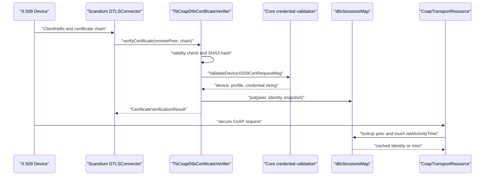
```mermaid
sequenceDiagram
    participant D as "X.509 Device"
    participant DTLS as "Scandium DTLSConnector"
    participant V as "TbCoapDtlsCertificateVerifier"
    participant Core as "Core credential validation"
    participant M as "dtlsSessionsMap"
    participant R as "CoapTransportResource"
    D->>DTLS: "ClientHello and certificate chain"
    DTLS->>V: "verifyCertificate(remotePeer, chain)"
    V->>V: "validity check and SHA3 hash"
    V->>Core: "ValidateDeviceX509CertRequestMsg"
    Core-->>V: "device, profile, credential string"
    V->>M: "put(peer, identity snapshot)"
    V-->>DTLS: "CertificateVerificationResult"
    D->>R: "secure CoAP request"
    R->>M: "lookup peer and touch lastActivityTime"
    M-->>R: "cached identity or miss"
```

工程边界：握手线程最多阻塞 10 秒；DTLS peer cache 是本机内存，不是 Redis；设备凭据/profile 更新存在直到 session 过期或其他更新事件生效的一致性窗口。

### 3.4 Telemetry 与 Client Attributes 写入

`handlePostTelemetryRequest(...)` 和 `handlePostAttributesRequest(...)` 都创建新的随机 `SYNC` `SessionInfoProto`，再用 Device Profile 选定的 JSON/Protobuf adaptor 生成平台 proto。`DefaultTransportService` 做限流、activity、metadata 和 Queue 路由。

| 步骤 | Telemetry | Attributes |
|---|---|---|
| payload 转换 | `convertToPostTelemetry(...)` | `convertToPostAttributes(...)` |
| Transport 消息 | `PostTelemetryMsg` | `PostAttributeMsg` |
| Rule Engine `TbMsgType` | `POST_TELEMETRY_REQUEST` | `POST_ATTRIBUTES_REQUEST` |
| 成功响应 | `2.01 CREATED` | `2.01 CREATED` |
| 响应时点 | producer callback | producer callback |
| 默认最终表 | `ts_kv` / `ts_kv_latest` 或 Cassandra | `attribute_kv` 的 `CLIENT_SCOPE` |

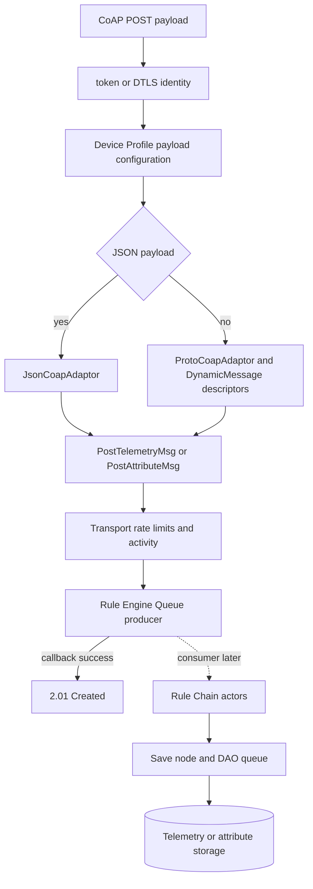
```mermaid
flowchart TB
    POST["CoAP POST payload"] --> AUTH["token or DTLS identity"]
    AUTH --> PROFILE["Device Profile payload configuration"]
    PROFILE --> KIND{"JSON payload"}
    KIND -->|"yes"| JSON["JsonCoapAdaptor"]
    KIND -->|"no"| PB["ProtoCoapAdaptor and DynamicMessage descriptors"]
    JSON --> MSG["PostTelemetryMsg or PostAttributeMsg"]
    PB --> MSG
    MSG --> LIMIT["Transport rate limits and activity"]
    LIMIT --> PRODUCER["Rule Engine Queue producer"]
    PRODUCER -->|"callback success"| CREATED["2.01 Created"]
    PRODUCER -. "consumer later" .-> RULE["Rule Chain actors"]
    RULE --> DAO["Save node and DAO queue"]
    DAO --> DB[("Telemetry or attribute storage")]
```

**`CREATED` 不是数据库提交确认。** Queue consumer、Rule Chain、Save Node、SQL/Cassandra batch 都在 response 之后；设备超时重试可能造成 Rule Engine 副作用重复。

### 3.5 GET Attributes 临时会话

`GET` 且没有 Observe option 时只允许 `ATTRIBUTES`：

1. `getNewSyncSession(state)` 创建随机 session。
2. `registerSyncSession(..., GetAttributesSyncSessionCallback, timeout)` 写 Transport 本地 session map 并安排 10 秒超时。
3. adaptor 解析 `clientKeys/sharedKeys` query，生成 `GetAttributeRequestMsg`。
4. Core Queue 把消息路由到 Device Actor，后者读取 Attribute Service。
5. transport notification 回到原 CoAP service/session。
6. `GetAttributesSyncSessionCallback.onGetAttributesResponse(...)` 将 proto 转为 JSON/Protobuf response。
7. `SYNC` listener 被一次性注销。

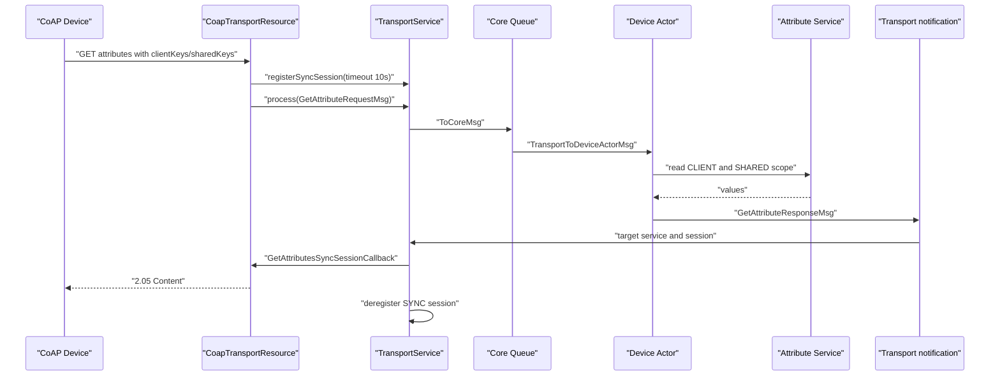
```mermaid
sequenceDiagram
    participant D as "CoAP Device"
    participant R as "CoapTransportResource"
    participant T as "TransportService"
    participant CQ as "Core Queue"
    participant A as "Device Actor"
    participant AS as "Attribute Service"
    participant N as "Transport notification"
    D->>R: "GET attributes with clientKeys/sharedKeys"
    R->>T: "registerSyncSession(timeout 10s)"
    R->>T: "process(GetAttributeRequestMsg)"
    T->>CQ: "ToCoreMsg"
    CQ->>A: "TransportToDeviceActorMsg"
    A->>AS: "read CLIENT and SHARED scope"
    AS-->>A: "values"
    A->>N: "GetAttributeResponseMsg"
    N->>T: "target service and session"
    T->>R: "GetAttributesSyncSessionCallback"
    R-->>D: "2.05 Content"
    T->>T: "deregister SYNC session"
```

### 3.6 Observe：Attributes 和 server-side RPC

Observe=0 建立订阅，Observe=1 取消订阅。身份 key 不是 access token，而是 `peerIp:peerPort:CoAP-token`，用于区分不同 endpoint 和 Californium token。每台设备最多维护一个 Attributes observation 和一个 RPC observation；新 token 会向旧 exchange 响应 `DELETED` 并替换。

`registerFeatureObservation(...)` 首次订阅时创建长期 `ASYNC` session、注册 `CoapSessionListener`、发送 `SessionEvent.OPEN`：

- Attributes：发送 `SubscribeToAttributeUpdatesMsg`，并额外发 `GetAttributeRequestMsg(onlyShared=true)` 取得当前 shared state。
- RPC：发送 `SubscribeToRPCMsg`，producer callback 成功后响应 `2.03 VALID`。
- 两类订阅都取消后：发送 `SessionEvent.CLOSED`，注销 Transport session，并清空 adaptor/credentials/session；`clients` map 本身仍留有 TODO 清理缺口。

```mermaid
stateDiagram-v2
    [*] --> "NoObservation"
    "NoObservation" --> "AsyncSessionOpen": "Observe=0 attributes or rpc"
    "AsyncSessionOpen" --> "AttrsOnly": "subscribe attributes"
    "AsyncSessionOpen" --> "RpcOnly": "subscribe rpc"
    "AttrsOnly" --> "AttrsAndRpc": "subscribe rpc"
    "RpcOnly" --> "AttrsAndRpc": "subscribe attributes"
    "AttrsAndRpc" --> "AttrsOnly": "cancel rpc"
    "AttrsAndRpc" --> "RpcOnly": "cancel attributes"
    "AttrsOnly" --> "Closed": "cancel attributes"
    "RpcOnly" --> "Closed": "cancel rpc"
    "Closed" --> [*]
```

`CoapTransportResource.checkObserveRelation(...)` 覆盖 Californium 默认计数，从 `TbCoapObservationState.observeCounter` 生成 Observe sequence；找不到本地 state 时移除 Observe option，避免继续伪装成有效关系。

### 3.7 RPC 上下行与 CON/NON 语义

Client-side RPC 使用 `POST .../rpc`：创建临时 SYNC session，投递 `TO_SERVER_RPC_REQUEST` 到 Rule Engine；规则链回复 `ToServerRpcResponseMsg` 后才返回 CoAP payload，超过 10 秒由 session timeout 结束。超时不会撤回已进入 Queue 的规则消息。

Server-side RPC 依赖 `GET Observe .../rpc` 的长期 session。`CoapSessionListener.onToDeviceRpcRequest(...)` 把 proto 转成 Observe notification：

- NON response 写出后立即报告 `DELIVERED`。
- CON response 先对 persisted RPC 报 `SENT`；收到 ACK 后报 `DELIVERED`，Californium timeout 后报 `TIMEOUT`。
- pending ACK 以随机 CoAP MID 为 key 存入 `CoapTransportContext.rpcAwaitingAck`。
- timeout 为 `min(PSM/eDRX window, RPC expiration - now)`。

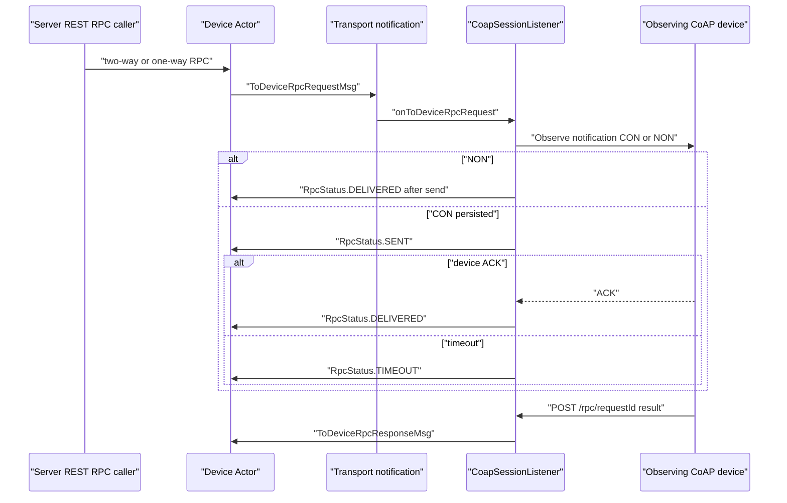
```mermaid
sequenceDiagram
    participant API as "Server REST RPC caller"
    participant A as "Device Actor"
    participant N as "Transport notification"
    participant L as "CoapSessionListener"
    participant D as "Observing CoAP device"
    API->>A: "two-way or one-way RPC"
    A->>N: "ToDeviceRpcRequestMsg"
    N->>L: "onToDeviceRpcRequest"
    L->>D: "Observe notification CON or NON"
    alt "NON"
        L->>A: "RpcStatus.DELIVERED after send"
    else "CON persisted"
        L->>A: "RpcStatus.SENT"
        alt "device ACK"
            D-->>L: "ACK"
            L->>A: "RpcStatus.DELIVERED"
        else "timeout"
            L->>A: "RpcStatus.TIMEOUT"
        end
    end
    D->>L: "POST /rpc/requestId result"
    L->>A: "ToDeviceRpcResponseMsg"
```

### 3.8 PSM/eDRX 下行窗口

每次认证后的 uplink 都调用 `clients.awake(state)`。PSM/eDRX profile 会安排延时 sleep task；多 CoAP Transport 实例时还发送 `UplinkNotificationMsg`，让持有 Observe session 的其他实例同步唤醒窗口。睡眠期间 Shared Attribute 更新合并到 `missedAttributeUpdates`；醒来后发送合并结果并请求 Device Actor 重发 pending persistent RPC。

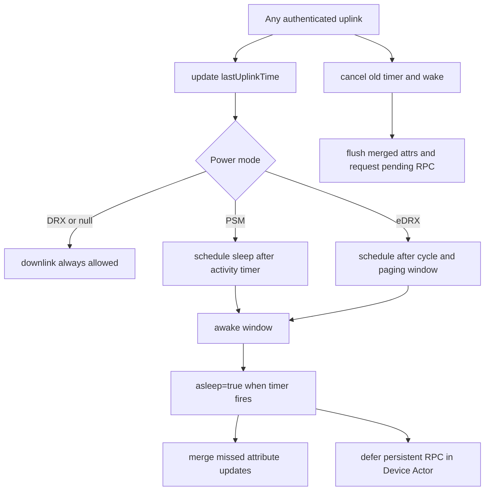
```mermaid
flowchart TB
    U["Any authenticated uplink"] --> TS["update lastUplinkTime"]
    TS --> MODE{"Power mode"}
    MODE -->|"DRX or null"| OPEN["downlink always allowed"]
    MODE -->|"PSM"| PSM["schedule sleep after activity timer"]
    MODE -->|"eDRX"| EDRX["schedule after cycle and paging window"]
    PSM --> WAKE["awake window"]
    EDRX --> WAKE
    WAKE --> SLEEP["asleep=true when timer fires"]
    SLEEP --> ATTR["merge missed attribute updates"]
    SLEEP --> RPC["defer persistent RPC in Device Actor"]
    U --> AGAIN["cancel old timer and wake"]
    AGAIN --> FLUSH["flush merged attrs and request pending RPC"]
```

注意 [compareAndSetSleepFlag(...)](../../../common/transport/coap/src/main/java/org/thingsboard/server/transport/coap/client/DefaultCoapClientContext.java#L982) 明确留有 `TODO: persist changes`，sleeping 状态不会写数据库；Transport 重启后从默认状态重建。

---

## 四、消息流

### 4.1 四类 Queue 流量

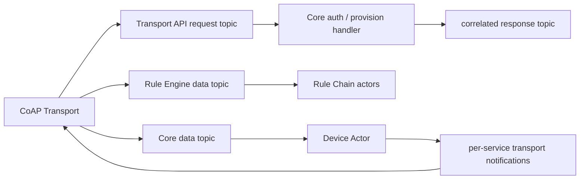
```mermaid
flowchart LR
    COAP["CoAP Transport"] --> TA["Transport API request topic"]
    TA --> AUTH["Core auth / provision handler"]
    AUTH --> TAR["correlated response topic"]
    COAP --> RE["Rule Engine data topic"]
    RE --> RN["Rule Chain actors"]
    COAP --> CQ["Core data topic"]
    CQ --> DA["Device Actor"]
    DA --> TN["per-service transport notifications"]
    TN --> COAP
```

| 流量 | 典型消息 | 何时使用 |
|---|---|---|
| Transport API request/reply | token/X.509 validation、Provision | Transport 无权直接查业务 DAO |
| Rule Engine Queue | telemetry、client attributes、client RPC | 需要规则链编排和 Save Node |
| Core Queue | session、subscription、GET attributes、claim、RPC response | 需要 Device Actor 串行状态 |
| Transport notification | shared attributes、server RPC、session close、profile/device update | 把下行送到持有 Observe state 的实例 |

### 4.2 响应确认层级

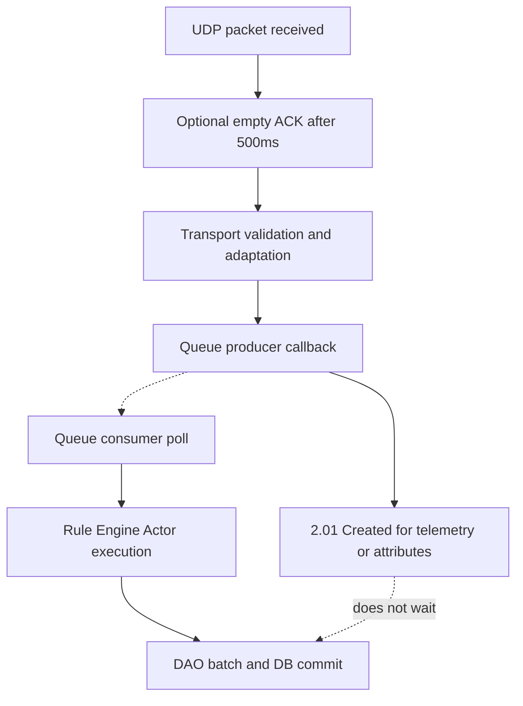
```mermaid
flowchart TB
    A["UDP packet received"] --> B["Optional empty ACK after 500ms"]
    B --> C["Transport validation and adaptation"]
    C --> D["Queue producer callback"]
    D --> E["2.01 Created for telemetry or attributes"]
    D -.-> F["Queue consumer poll"]
    F --> G["Rule Engine Actor execution"]
    G --> H["DAO batch and DB commit"]
    E -. "does not wait" .-> H
```

`deferAccept()` 不是业务成功：若完整 piggyback response 在 500 ms 内产生，scheduled `exchange.accept()` 不再额外生效；否则先发 empty ACK，最终 response 变为 separate CON/NON message。它只解决 CoAP request retransmission 与异步处理时延之间的协议问题。

---

## 五、时序图

完整 PlantUML 覆盖服务启动、plain token、X.509 DTLS、Telemetry、GET Attributes、Observe 和 RPC：

[点击新窗口打开原始 SVG](sequence.svg)

<a class="static-svg-thumbnail" href="sequence.svg" target="_blank" rel="noopener noreferrer">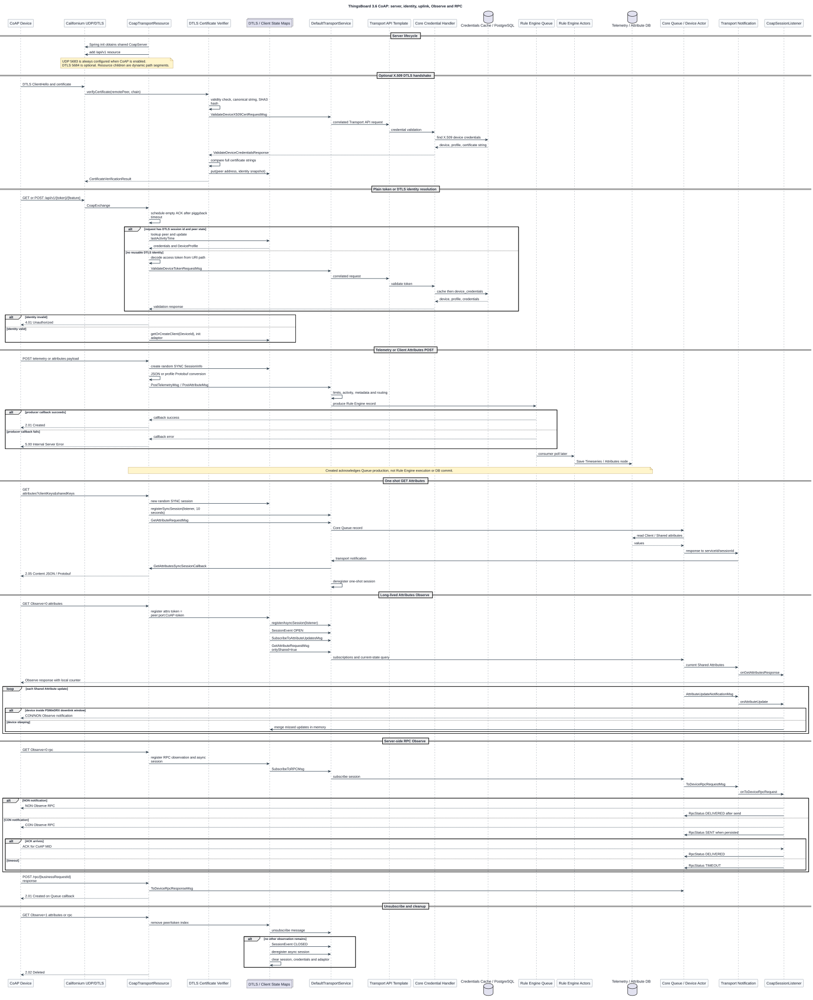</a>

可直接查看 [PlantUML 源文件](sequence.puml)。

```mermaid
stateDiagram-v2
    [*] --> "PacketReceived"
    "PacketReceived" --> "EmptyAckScheduled"
    "EmptyAckScheduled" --> "IdentityResolving"
    "IdentityResolving" --> "Unauthorized": "missing or invalid identity"
    "IdentityResolving" --> "AdaptPayload": "valid token or DTLS state"
    "AdaptPayload" --> "BadRequest": "decode failure"
    "AdaptPayload" --> "QueuePending": "uplink"
    "AdaptPayload" --> "SyncSession": "GET or client RPC"
    "AdaptPayload" --> "AsyncObserve": "Observe=0"
    "QueuePending" --> "Created": "producer callback"
    "SyncSession" --> "Content": "notification response"
    "SyncSession" --> "Timeout": "10 seconds"
    "AsyncObserve" --> "AsyncObserve": "attribute or RPC notification"
    "AsyncObserve" --> "Closed": "Observe=1 or relation removal"
    "Created" --> [*]
    "Content" --> [*]
    "Timeout" --> [*]
    "Unauthorized" --> [*]
    "BadRequest" --> [*]
    "Closed" --> [*]
```

---

## 六、数据变化

### 6.1 内存、Actor、Queue 与数据库

| 层 | 写入或变化 | 生命周期 |
|---|---|---|
| Californium | `Exchange`、`ObserveRelation`、blockwise state、retransmission | 单请求或 Observe relation |
| DTLS Transport | `dtlsSessionsMap<InetSocketAddress,TbCoapDtlsSessionInfo>` | inactivity 清理；仅本机 |
| CoAP client context | `clients<DeviceId,TbCoapClientState>` | Transport 进程；源码存在残留 state TODO |
| Observe 索引 | `clientsByToken<peer:port:token,state>` | relation 创建到取消/移除 |
| RPC ACK | `rpcAwaitingAck<MID,ToDeviceRpcRequestMsg>` | ACK 或 timeout |
| Transport sessions | 临时 SYNC / 长期 ASYNC listener | response/timeout 或所有 Observe 取消 |
| Device Actor | session、subscription、RPC status、pending persistent RPC | Actor 生命周期 |
| Kafka/Queue | Transport API、RE、Core、notification records | provider 的 retention/commit 语义 |
| PostgreSQL/Timescale/Cassandra | credentials/profile 读取；attributes/telemetry/RPC 等最终数据 | 数据库事务与 TTL |

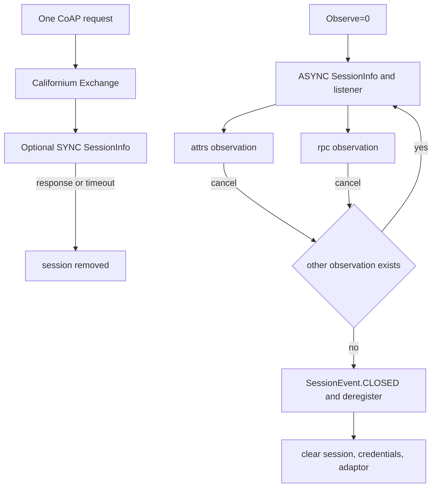
```mermaid
flowchart TB
    REQ["One CoAP request"] --> EX["Californium Exchange"]
    EX --> SYNC["Optional SYNC SessionInfo"]
    SYNC -->|"response or timeout"| SYNCDEL["session removed"]
    OBS["Observe=0"] --> ASYNC["ASYNC SessionInfo and listener"]
    ASYNC --> O1["attrs observation"]
    ASYNC --> O2["rpc observation"]
    O1 -->|"cancel"| CHECK{"other observation exists"}
    O2 -->|"cancel"| CHECK
    CHECK -->|"yes"| ASYNC
    CHECK -->|"no"| CLOSE["SessionEvent.CLOSED and deregister"]
    CLOSE --> CLEAR["clear session, credentials, adaptor"]
```

### 6.2 主要对象变化

- Telemetry：创建 `TbMsg`，最终可能 UPSERT `ts_kv_latest` 并写 history；请求携带 TTL 是否生效取决于 Save Timeseries Node 和后端。
- Client Attributes：最终写 `attribute_kv` 的 `CLIENT_SCOPE`；Shared Attributes Observe 只读取并推送 `SHARED_SCOPE`。
- Claim：先由 Transport 投递 Device Actor，后续 claim data 和 customer ownership 见第 28 章。
- RPC：`rpcAwaitingAck` 只跟踪 CoAP CON transport delivery；业务 response 仍是 `POST /rpc/{requestId}`。
- Session activity：长期 Observe session 每 3 秒调用 `recordActivity`；PSM sleeping 标志不持久化。

---

## 七、源码分析

### 7.1 核心类与职责

| 类型 | 包路径 | 源码职责 |
|---|---|---|
| `DefaultCoapServerService` | `org.thingsboard.server.coapserver` | 配置 Californium、UDP/DTLS endpoint、启动/销毁 server |
| `TbCoapServerMessageDeliverer` | 同上 | URI path 规范化和 Resource 查找 |
| `TbCoapDtlsCertificateVerifier` | 同上 | X.509 -> ThingsBoard credentials validation -> peer session cache |
| `CoapTransportService` | `org.thingsboard.server.transport.coap` | 把 `api/v1`、Efento、OTA resources 挂到 server |
| `AbstractCoapTransportResource` | 同上 | GET/POST resource 模板与 subscription report |
| `CoapTransportResource` | 同上 | 标准 Device API 的路由、认证、适配、response |
| `CoapTransportContext` | 同上 | Transport 共用依赖、adaptors、RPC ACK map |
| `DefaultCoapClientContext` | `.client` | device/Observe/session/PSM/eDRX state machine |
| `TbCoapClientState` | `.client` | 每 DeviceId 的 credentials、profile、session、observations、power state |
| `TbCoapObservationState` | `.client` | exchange、identity token、Observe relation/counter |
| `JsonCoapAdaptor` | `.adaptors` | JSON 与 Transport proto 互转 |
| `ProtoCoapAdaptor` | `.adaptors` | profile protobuf schema 与 DynamicMessage 互转 |
| `CoapOkCallback` | `.callback` | producer success/failure -> CoAP response |
| `GetAttributesSyncSessionCallback` | `.callback` | 一次性 Attribute response |
| `ToServerRpcSyncSessionCallback` | `.callback` | 一次性 client RPC response |

### 7.2 JSON / Protobuf 选择

`DefaultCoapClientContext.getTransportConfigurationContainer(DeviceProfile)` 接受默认 profile 或 CoAP profile。JSON profile 使用固定 converter；Protobuf profile 编译 telemetry、attributes、RPC request/response schema descriptor，并存入 `TransportConfigurationContainer`。同一 `TbCoapClientState` 缓存 adaptor，profile update 事件会重建配置。

Provision 是例外：[processProvision(CoapExchange)](../../../common/transport/coap/src/main/java/org/thingsboard/server/transport/coap/CoapTransportResource.java#L237) 总是先按 JSON 解码，只有异常是 `JsonParseException`（直接或 cause）才回退 Protobuf；其他 adaptor exception 直接 `4.00`。

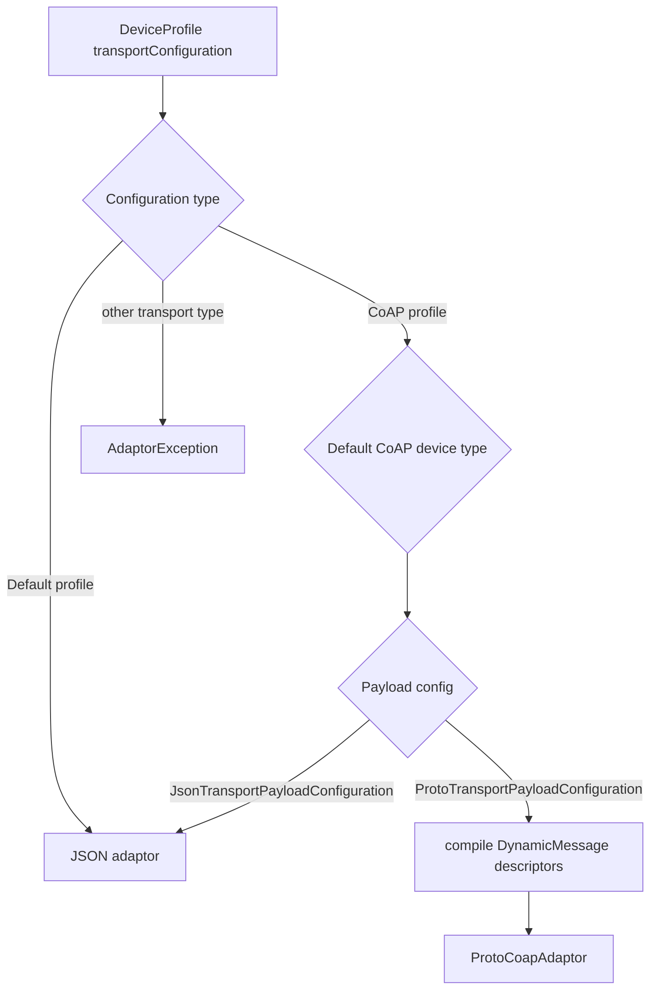
```mermaid
flowchart TB
    DP["DeviceProfile transportConfiguration"] --> TYPE{"Configuration type"}
    TYPE -->|"Default profile"| J["JSON adaptor"]
    TYPE -->|"CoAP profile"| DEVTYPE{"Default CoAP device type"}
    DEVTYPE --> PAYLOAD{"Payload config"}
    PAYLOAD -->|"JsonTransportPayloadConfiguration"| J
    PAYLOAD -->|"ProtoTransportPayloadConfiguration"| DESC["compile DynamicMessage descriptors"]
    DESC --> P["ProtoCoapAdaptor"]
    TYPE -->|"other transport type"| ERR["AdaptorException"]
```

### 7.3 并发模型

网络 IO 与 Californium exchange callback 不经过 Servlet 线程。跨请求状态使用 `ConcurrentHashMap`，每个 `TbCoapClientState` 再用 `ReentrantLock` 原子替换 observations、session 和 power state。这个锁不是数据库锁，也不能跨 Transport 实例；跨实例状态依赖 partition ownership、notification topic 和 `UplinkNotificationMsg`。

Observe relation 的两个回调顺序值得注意：业务 subscribe 先把 `clientsByToken` 和 `TbCoapObservationState` 建好，Californium 在 success response 上建立 relation 后，`CoapResourceObserver.addedObserveRelation(...)` 才把 `ObserveRelation` 引用补回 state。

### 7.4 安全审查要点

1. Plain CoAP 没有机密性，access token 和 payload 会在 UDP 网络明文出现。
2. token 位于 URI path，必须脱敏 access、packet capture、trace 和异常日志。
3. X.509 校验器不是传统 CA trust-only 模式，它把证书字符串 hash 映射到 ThingsBoard X.509 device credentials，并比较完整证书字符串。
4. `skip_validity_check_for_client_cert=true` 会跳过 `checkValidity()`，仅在明确接受过期/未生效证书风险时使用。
5. DTLS session cache 以 peer address 查找；NAT rebinding、地址复用和集群切换需要专项测试。

---

## 八、Actor 分析

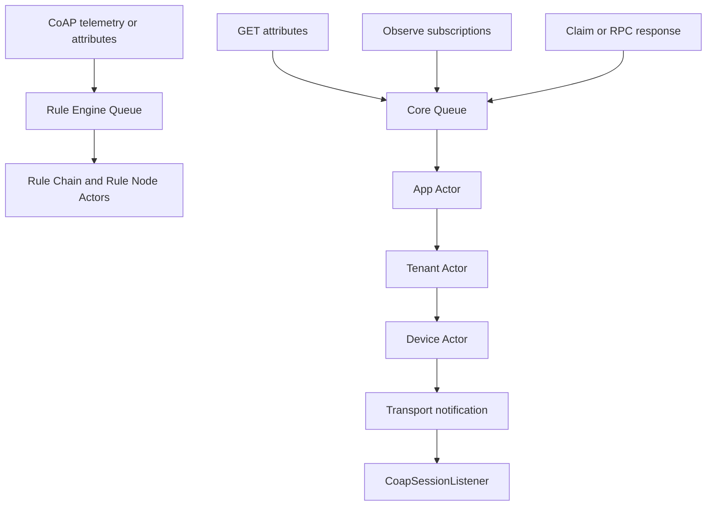
```mermaid
flowchart TB
    UP["CoAP telemetry or attributes"] --> REQ["Rule Engine Queue"]
    REQ --> RCA["Rule Chain and Rule Node Actors"]
    GET["GET attributes"] --> CQ["Core Queue"]
    OBS["Observe subscriptions"] --> CQ
    CLAIM["Claim or RPC response"] --> CQ
    CQ --> APP["App Actor"]
    APP --> TENANT["Tenant Actor"]
    TENANT --> DEVICE["Device Actor"]
    DEVICE --> N["Transport notification"]
    N --> SESSION["CoapSessionListener"]
```

Telemetry 和 Client Attributes 与 MQTT/HTTP 一样，不先经过 Device Actor，而是直接成为 Rule Engine 消息。Device Actor 用于必须按设备串行管理的内容：session OPEN/CLOSE、Attribute/RPC subscription、GET Attributes、Claim、server RPC 状态和 response。

Observe 不能只用普通 Java callback 的原因是下行请求可能由任意 Core/API 节点产生，且需要在集群内定位持有具体 Transport session 的服务实例。Device Actor 维护设备级逻辑状态，`TbClusterService`/Queue 完成跨节点路由，Transport 本地 listener 才持有不可序列化的 Californium `Exchange`。

Actor 与 CoAP power state 是两层状态：Actor 维护 pending persistent RPC；Transport 判断当前 PSM/eDRX 窗口是否允许发包。设备再次 uplink 时 Transport 请求 Actor 重发 pending RPC。

---

## 九、Kafka 分析

### 9.1 Topic、partition 和 consumer

CoAP 模块不直接依赖 Kafka client API，它调用统一 `TransportService`。Kafka 部署下实际经过：

- Transport API request/reply：credentials、Provision，使用 correlation id 返回原 service。
- Rule Engine queue：按 profile queue name、tenant/routing key 选择 topic/partition。
- Core queue：按 tenant/device partition 路由 Device Actor。
- Transport notifications：按目标 `serviceId` 送到持有 Observe session 的 CoAP Transport。

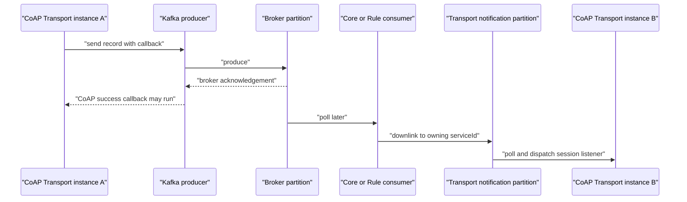
```mermaid
sequenceDiagram
    participant C as "CoAP Transport instance A"
    participant P as "Kafka producer"
    participant B as "Broker partition"
    participant Core as "Core or Rule consumer"
    participant N as "Transport notification partition"
    participant C2 as "CoAP Transport instance B"
    C->>P: "send record with callback"
    P->>B: "produce"
    B-->>P: "broker acknowledgement"
    P-->>C: "CoAP success callback may run"
    B->>Core: "poll later"
    Core->>N: "downlink to owning serviceId"
    N->>C2: "poll and dispatch session listener"
```

### 9.2 提交与重复

`2.01 CREATED` 只等 producer callback。若 response 丢包或客户端 timeout 后重试，而第一条 record 已写 broker，会出现重复消息。相同原始 `ts` 的 SQL/Cassandra telemetry 主键通常覆盖，但 Rule Chain 外部调用、告警计算、无 `ts` 上报的新 server timestamp 都可能重复。

Transport notification consumer 把 callback 交给本地 executor 后即可继续批处理/commit；进程在 listener 真正写出 UDP response 前崩溃时，Actor 不一定自动重发非持久化下行。重要 RPC 应使用 persisted RPC、合理 expiration 和应用级幂等。

---

## 十、数据库分析

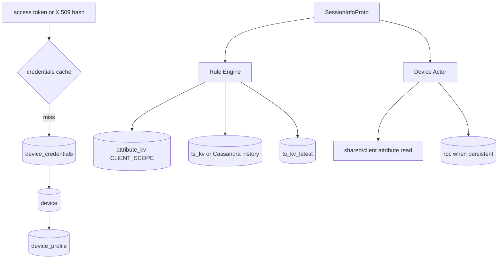
```mermaid
flowchart TB
    ID["access token or X.509 hash"] --> CACHE{"credentials cache"}
    CACHE -->|"miss"| CRED[("device_credentials")]
    CRED --> DEV[("device")]
    DEV --> PROF[("device_profile")]
    AUTH["SessionInfoProto"] --> RE["Rule Engine"]
    RE --> ATTR[("attribute_kv CLIENT_SCOPE")]
    RE --> HIST[("ts_kv or Cassandra history")]
    RE --> LATEST[("ts_kv_latest")]
    AUTH --> ACTOR["Device Actor"]
    ACTOR --> READ["shared/client attribute read"]
    ACTOR --> RPC[("rpc when persistent")]
```

CoAP Resource 不持有 Repository 或 JDBC connection。数据库边界如下：

| 数据 | 为什么访问 | 存储 |
|---|---|---|
| device credentials/profile | token 或 X.509 认证、payload schema、power mode | PostgreSQL + cache |
| Telemetry history/latest | Save Timeseries Node 执行后 | PostgreSQL RANGE / Timescale hypertable / Cassandra；latest 通常 PostgreSQL |
| Client Attributes | Save Attributes Node | PostgreSQL `attribute_kv` |
| Shared Attributes | Observe 初始读和后续更新 | PostgreSQL `attribute_kv` + notification |
| persistent RPC | server-side RPC 生命周期 | PostgreSQL `rpc` |
| Observe/Exchange/PSM | 协议瞬时状态 | Transport 内存，不入数据库 |

事务边界与 CoAP response 分离。Rule Engine 的 telemetry history/latest 也可能分成两个 DAO queue 和两个事务；因此不能用一条 `CREATED` response 推断 history/latest 同时可见。数据库写入细节见 [第 21 章](../21-timescale-write/README.md) 和 [第 22 章](../22-postgresql-write/README.md)。

---

## 十一、异常处理

### 11.1 错误映射

| 失败点 | CoAP 表现 | 下游是否可能继续 |
|---|---|---|
| feature/path 缺失、GET telemetry | `4.00 BAD_REQUEST` | 否 |
| URI token 缺失、Core 返回无 device/profile | `4.01 UNAUTHORIZED` | 否 |
| JSON/Protobuf 解码失败 | `4.00 BAD_REQUEST` | 否 |
| Transport API/Queue producer error | `5.00 INTERNAL_SERVER_ERROR` | 取决于 producer 是否已部分成功 |
| piggyback 超时 | empty ACK，稍后 separate response | 是，正常异步路径 |
| GET/client RPC SYNC timeout | session close/timeout response | 已入 Queue/Actor 的工作不取消 |
| Observe conversion failure | cancel relation + unsubscribe | Actor/DB 已发生的更新不回滚 |
| CON RPC 没有 ACK | `RpcStatus.TIMEOUT` | persisted RPC 可由 Actor 后续重试 |
| Transport 崩溃 | 本地 Observe、DTLS cache、PSM state 丢失 | broker/DB 状态保留；设备需重订阅 |

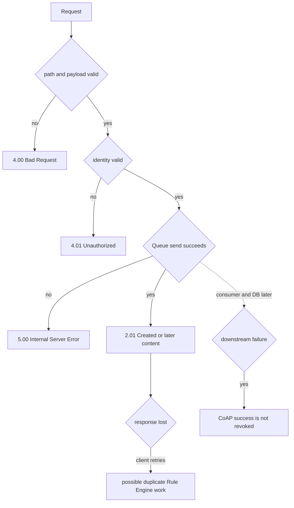
```mermaid
flowchart TB
    R["Request"] --> PARSE{"path and payload valid"}
    PARSE -->|"no"| C400["4.00 Bad Request"]
    PARSE -->|"yes"| AUTH{"identity valid"}
    AUTH -->|"no"| C401["4.01 Unauthorized"]
    AUTH -->|"yes"| SEND{"Queue send succeeds"}
    SEND -->|"no"| C500["5.00 Internal Server Error"]
    SEND -->|"yes"| C201["2.01 Created or later content"]
    C201 --> LOST{"response lost"}
    LOST -->|"client retries"| DUP["possible duplicate Rule Engine work"]
    SEND -. "consumer and DB later" .-> DBFAIL{"downstream failure"}
    DBFAIL -->|"yes"| NOCHANGE["CoAP success is not revoked"]
```

### 11.2 崩溃与恢复

CoAP/UDP 本身无 broker consumer offset。已成功进入 Kafka 的 uplink 由 RE/Core consumer 继续处理；尚在 Californium exchange、未完成 producer、SYNC listener 或 Observe 内存中的请求会丢失。重启后 DTLS 需重新握手或 token 重新认证，设备需重建 Observe relation。持久化 RPC 可从数据库/Actor pending state 恢复，普通 Observe notification 不具备通用重放日志。

排障顺序：packet capture/endpoint -> Resource path -> auth request/reply -> adaptor -> producer callback -> Queue lag -> Actor/Rule Engine -> DAO queue -> DB。不要因看到 CoAP `2.xx` 就跳过中间层。

---

## 十二、源码阅读路线

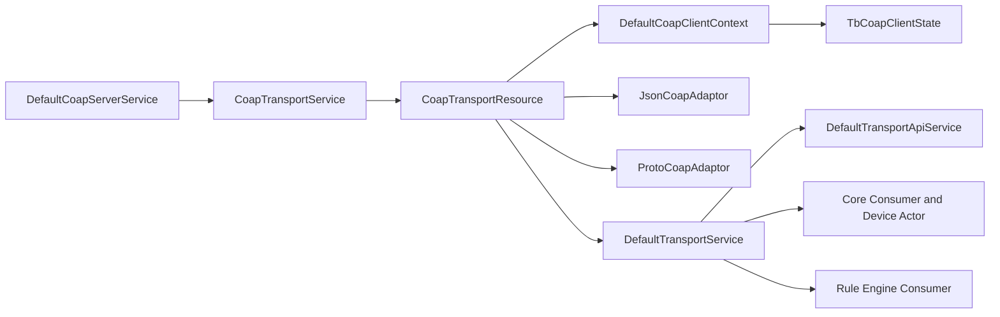
```mermaid
flowchart LR
    A["DefaultCoapServerService"] --> B["CoapTransportService"]
    B --> C["CoapTransportResource"]
    C --> D["DefaultCoapClientContext"]
    D --> E["TbCoapClientState"]
    C --> F["JsonCoapAdaptor"]
    C --> G["ProtoCoapAdaptor"]
    C --> H["DefaultTransportService"]
    H --> I["DefaultTransportApiService"]
    H --> J["Core Consumer and Device Actor"]
    H --> K["Rule Engine Consumer"]
```

建议按以下顺序阅读：

1. `DefaultCoapServerService.createCoapServer()`：先理解 UDP、DTLS、blockwise 和线程边界。
2. `CoapTransportService.init()`：确认 resource tree，不要把 Efento/OTA 路径混入标准 API。
3. `CoapTransportResource.processHandleGet/processHandlePost/processRequest`：掌握 path position 和认证分支。
4. `DefaultCoapClientContext.registerFeatureObservation()`：理解为什么 Observe 必须建立 ASYNC session。
5. `CoapSessionListener.onAttributeUpdate/onToDeviceRpcRequest`：跟踪 Actor 下行到 Californium response。
6. `JsonCoapAdaptor`、`ProtoCoapAdaptor`：核对 payload 与 Device Profile schema。
7. `DefaultTransportService`：继续追 Queue、限流、activity 和 callback 边界。
8. 第 25 章再阅读 LwM2M；它也基于 CoAP/DTLS，但使用 Leshan registration/object model，不能套用本章 Resource API。

---

## 十三、常见面试题

### 1. ThingsBoard CoAP Transport 是 Spring MVC Controller 吗？

不是。它是 Eclipse Californium `CoapResource`，在 UDP/DTLS endpoint 上处理 `CoapExchange`；Spring 只负责 Bean 生命周期和依赖注入。

### 2. 标准 CoAP Device API 的根路径是什么？

`/api/v1`。普通设备路径通常是 `/api/v1/{accessToken}/{feature}`，RPC response 再追加 `{requestId}`。

### 3. 为什么 `getChild(String)` 返回 `this`？

为了接受 token、feature、requestId 等动态 URI segment，再由 `getFeatureType()`、`decodeCredentials()` 按位置解码，而不为每个 token 建 Resource 节点。

### 4. Plain CoAP access token 在哪里？

URI path 第 3 段。它会出现在网络明文和路径日志中，所以生产环境应使用 DTLS并对日志脱敏。

### 5. CoAP Telemetry 返回 `2.01 CREATED` 代表什么？

代表 `DefaultTransportService` 的 Queue producer callback 成功，不代表 Rule Engine 已消费，更不代表 TimescaleDB/Cassandra/PostgreSQL 已提交。

### 6. CoAP 是否支持 GET Telemetry？

不支持。`processHandleGet()` 对 `FeatureType.TELEMETRY` 直接返回 `BAD_REQUEST`。

### 7. GET Attributes 为什么注册 SYNC session？

请求要跨 Core Queue 到 Device Actor，再由 transport notification 回到原 Transport；sessionId 是关联异步 request/response 的地址，response 或 timeout 后注销。

### 8. Observe 使用什么作为本地 identity token？

`peerIp:peerPort:CoAP-token`，不是设备 access token。它区分 endpoint 和 Californium Observe token。

### 9. 一台设备可以同时建立多少类 Observe？

本地 state 允许一个 Attributes observation 和一个 RPC observation。相同类型的新 token 会替换旧 exchange。

### 10. Observe 为什么使用 ASYNC session？

它要长期接收 Shared Attribute 和 server RPC 下行；SYNC session 在一次 response 后会自动销毁，无法承担订阅。

### 11. Attributes Observe 建立时为什么还发一次 GET？

订阅只覆盖之后的更新。额外的 `GetAttributeRequestMsg(onlyShared=true)` 用于立即返回当前 Shared Attributes 快照。

### 12. `piggyback_timeout=500ms` 的含义是什么？

500 ms 内若完整 response 可用就 piggyback；否则先发 empty ACK，最终结果作为 separate response。empty ACK 不表示业务成功。

### 13. JSON 与 Protobuf 怎么选择？

由 Device Profile 的 CoAP transport payload configuration 决定；Protobuf profile 提供 telemetry、attributes、RPC 的 dynamic descriptors。

### 14. Provision 怎么判断 JSON 还是 Protobuf？

先尝试 JSON，只有 JSON parse exception 才回退 Protobuf；其他 adaptor error 不触发回退。

### 15. X.509 DTLS 认证只验证 CA 链吗？

不是。校验器计算证书字符串 SHA3 hash，向 Core 查 ThingsBoard X.509 credentials，并要求返回的完整 credentials 字符串等于当前证书。

### 16. DTLS 认证为什么可能阻塞 10 秒？

`verifyCertificate()` 用 `CountDownLatch` 等待异步 Transport API credential response，最大 `await(10, SECONDS)`；Core/Queue 延迟会占用握手处理时间。

### 17. DTLS identity cache 存在哪里？

存在当前 CoAP Transport 实例内存，以 remote peer address 为 key；不是 PostgreSQL 或 Redis。

### 18. CoAP CON 和 NON 对 RPC status 有什么差异？

NON 写出后直接报 `DELIVERED`；CON 等 ACK 才报 `DELIVERED`，持久化 RPC 发出时先报 `SENT`，超时报 `TIMEOUT`。

### 19. `rpcAwaitingAck` 的 key 是业务 requestId 吗？

不是，是随机 CoAP Message ID（MID）；value 才保存 `ToDeviceRpcRequestMsg`，ACK/timeout 后删除。

### 20. 设备睡眠时 Shared Attributes 怎么处理？

Transport 在 `TbCoapClientState` 中合并 missed updates；下次 uplink 唤醒后发送合并结果。该缓存随进程丢失。

### 21. 设备睡眠时 persistent RPC 怎么处理？

Transport 不发送超出窗口的下行；设备唤醒后构造 `SendPendingRPCMsg` 请求 Device Actor 重发待处理持久化 RPC。

### 22. PSM sleeping 状态会写数据库吗？

不会。源码在状态切换处保留了 `TODO: persist changes`，当前仅为 Transport 本地内存状态。

### 23. CoAP Transport 崩溃后 Observe 会自动恢复吗？

不会。`Exchange`、relation、token map 都是本机内存，设备需要重建 Observe；已入 broker 的 uplink 和数据库中的 persistent RPC 可独立恢复。

### 24. 为什么 CoAP telemetry 重试不一定幂等？

无原始时间戳时每次会形成新 server timestamp；即使同一 `(entity,key,ts)` 被存储层覆盖，Rule Chain 的 HTTP/Kafka/告警等副作用仍可能重复。

### 25. 排查“设备收到 CREATED 但平台无数据”应看哪些层？

依次核对 CoAP path/identity、adaptor、Transport producer callback、RE topic lag、Rule Chain 绑定和 Save Timeseries Node、SQL/Cassandra queue、数据库错误与最新/历史表，不能只看 UDP response。

---

[上一篇：23 HTTP 设备 API 流程](../23-http-device-api/README.md) | [返回全书目录](../../SUMMARY.md) | [下一篇：25 LwM2M 注册与观测流程](../25-lwm2m-registration-observe/README.md)
