# 32 Redis 与本地缓存流程

> 源码基线：ThingsBoard `release-3.6`，业务源码提交 `69124284c2`。本章分析平台 DAO 和应用服务如何在 Caffeine 与 Redis 之间切换，重点追踪 Cache-Aside、负缓存、并发 miss 的 CAS 防护、数据库事务后的失效以及多节点一致性窗口。Device、Relation 和 Attributes 用作代表流程；Transport/Actor 自有运行时 map 只用于说明边界，不把所有名为 cache 的对象误认为同一套缓存。

[上一篇：31 Timeseries TTL 清理流程](../31-timeseries-ttl-cleanup/README.md) | [HTML 版](index.html) | [全书目录](../../SUMMARY.md) | [PlantUML 源文件](sequence.puml) | [时序图 SVG](sequence.svg) | [架构图 SVG](../../assets/architecture/32-redis-local-cache.svg) | [下一篇：33 WebSocket 订阅流程](../33-websocket-subscription/README.md)

---

## 一、流程目标

ThingsBoard 的缓存层要同时解决三个问题：减少 PostgreSQL 热点查询、缓存“数据库中不存在”以阻止重复穿透、避免一个并发旧查询在更新之后把旧值重新写回缓存。release-3.6 为此提供了自定义 `TbTransactionalCache<K,V>`，并按 `cache.type` 条件装配 Caffeine 或 Redis；少数配置服务另走标准 Spring `@Cacheable/@CacheEvict`。

[架构图 SVG：Caffeine、Redis、数据库事务与一致性窗口](../../assets/architecture/32-redis-local-cache.svg)

[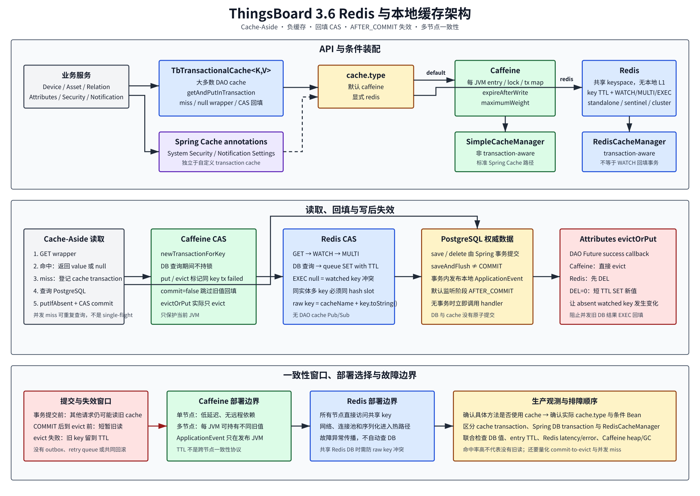](../../assets/architecture/32-redis-local-cache.svg)

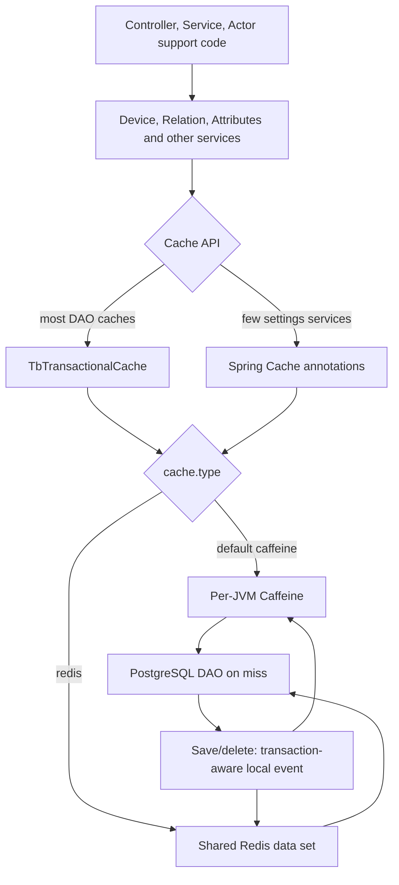

必须先固定十条源码事实：

1. 默认 `cache.type=caffeine`；Redis 必须显式配置。
2. 自定义 `TbCacheTransaction` 是缓存回填 CAS，不是 Spring 数据库事务，也不是 Redis 与 PostgreSQL 的分布式事务。
3. Cache miss 后数据库调用在缓存锁之外执行；并发 miss 仍可能同时查数据库，它不是 single-flight。
4. CAS 不比较数据版本或时间戳，只阻止与 cache mutation 或另一成功回填发生冲突的 load 再写缓存；即使 commit 失败，当前调用者仍返回自己查询到的数据库值。
5. 缓存 miss 用 `null` wrapper 表示；负缓存命中则是“wrapper 非 null，但 wrapper 中的值为 null”。
6. Caffeine 的 cache、锁和事务登记表都在当前 JVM，DAO `ApplicationEvent` 也只在当前 JVM；没有自动跨节点失效。
7. Redis 模式没有 Caffeine L1，也没有 DAO cache Pub/Sub；所有节点直接读写同一 Redis key。
8. DAO save/delete 通常通过默认 `AFTER_COMMIT` 的 `@TransactionalEventListener` 失效缓存，而不是依赖 Caffeine `CacheManager` 的事务装饰。
9. Caffeine `maxSize` 实际映射为 `maximumWeight`；Redis 自定义缓存只读取 TTL，不读取 `maxSize`。
10. Redis 不可用时自定义缓存没有“忽略缓存、直接查库”的降级，异常会沿调用链传播。

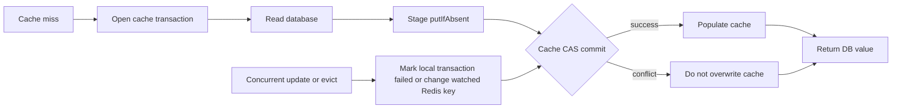

---

## 二、入口

### 2.1 条件装配入口

缓存类型在 [thingsboard.yml](../../../application/src/main/resources/thingsboard.yml#L484) 中配置。Caffeine 的入口是 [org.thingsboard.server.cache.TbCaffeineCacheConfiguration](../../../common/cache/src/main/java/org/thingsboard/server/cache/TbCaffeineCacheConfiguration.java#L46)，Redis 的入口是 [org.thingsboard.server.cache.TBRedisCacheConfiguration](../../../common/cache/src/main/java/org/thingsboard/server/cache/TBRedisCacheConfiguration.java#L52)。

| 配置 | 默认值 | Caffeine 作用 | Redis 作用 |
|---|---:|---|---|
| `cache.type` | `caffeine` | 装配本地实现和 `SimpleCacheManager` | `redis` 时装配 Redis 实现 |
| `cache.maximumPoolSize` | `16` | Attributes 使用 direct executor，不占此池 | Attributes remote cache IO 使用该池 |
| `cache.specs.<name>.timeToLiveInMinutes` | 按 cache 不同 | `expireAfterWrite` | 自定义 Redis key 的 SET TTL |
| `cache.specs.<name>.maxSize` | 按 cache 不同 | `maximumWeight` | 自定义 Redis 实现不读取 |
| `redis.evictTtlInMs` | `60000` | 不使用 | `evictOrPut` 的短期占位值 TTL |
| `redis.connection.type` | `standalone` | 不使用 | `standalone/cluster/sentinel` |

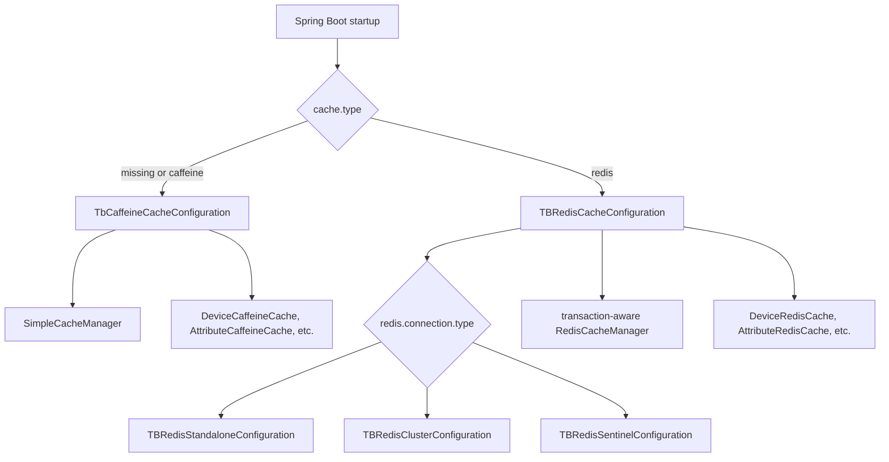

### 2.2 业务读取入口

代表性入口包括：

| 业务入口 | 精确方法 | Cache key | 是否负缓存 |
|---|---|---|---|
| Device 按 ID | [DeviceServiceImpl.findDeviceById(TenantId, DeviceId)](../../../dao/src/main/java/org/thingsboard/server/dao/device/DeviceServiceImpl.java#L179) | SYS 时 `deviceId`；普通租户 `tenantId+deviceId` | 是 |
| Device 按名称 | [DeviceServiceImpl.findDeviceByTenantIdAndName(TenantId, String)](../../../dao/src/main/java/org/thingsboard/server/dao/device/DeviceServiceImpl.java#L217) | `tenantId+"_n_"+name` | 是 |
| Asset 按名称 | [BaseAssetService.findAssetByTenantIdAndName(TenantId, String)](../../../dao/src/main/java/org/thingsboard/server/dao/asset/BaseAssetService.java#L189) | tenant + name | 是 |
| 精确 Relation | [BaseRelationService.getRelation(...)](../../../dao/src/main/java/org/thingsboard/server/dao/relation/BaseRelationService.java#L221) | from/to/type/group | 否 |
| 单 Attribute | [CachedAttributesService.find(...)](../../../dao/src/main/java/org/thingsboard/server/dao/attributes/CachedAttributesService.java#L173) | `{entityId}+scope+key` | 是 |

不是所有同领域查询都缓存。Device async 查询在 [findDeviceByIdAsync(...)](../../../dao/src/main/java/org/thingsboard/server/dao/device/DeviceServiceImpl.java#L199) 直接进 DAO；Asset 按 ID 查询在 [findAssetById(...)](../../../dao/src/main/java/org/thingsboard/server/dao/asset/BaseAssetService.java#L161) 直接进 DAO；Attributes `findAll` 因 key 集合未知，也在 [findAll(...)](../../../dao/src/main/java/org/thingsboard/server/dao/attributes/CachedAttributesService.java#L294) 绕过 cache。

### 2.3 写入与失效入口

Device 保存、删除等同步事务流程调用 `publishEvictEvent`；Attributes 是异步 DAO Future，成功 callback 直接执行 `evictOrPut` 或 `evict`；少数服务使用 Spring 注解：

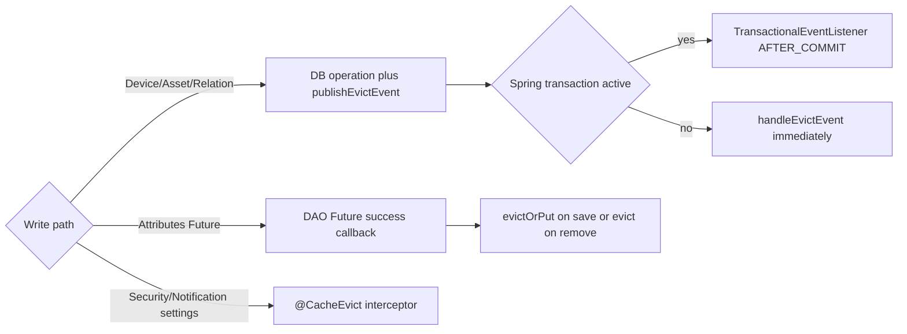

标准 Spring Cache 注解在主源码中只用于 [DefaultSystemSecurityService](../../../application/src/main/java/org/thingsboard/server/service/security/system/DefaultSystemSecurityService.java#L128) 与 [DefaultNotificationSettingsService](../../../dao/src/main/java/org/thingsboard/server/dao/notification/DefaultNotificationSettingsService.java#L101)。不能用这两处注解行为推断所有 DAO cache。

---

## 三、完整调用链

### 3.1 通用 Cache-Aside

[org.thingsboard.server.cache.TbTransactionalCache.getAndPutInTransaction(K, Supplier, boolean)](../../../common/cache/src/main/java/org/thingsboard/server/cache/TbTransactionalCache.java#L144) 是核心模板：

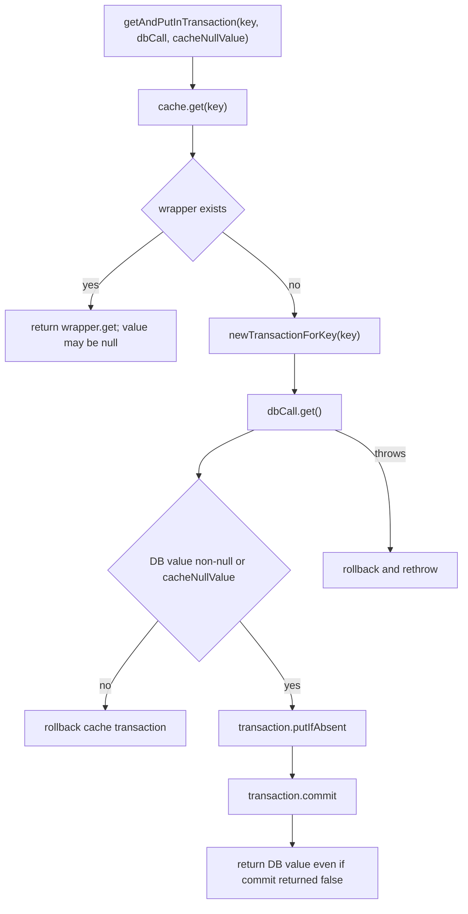

| 顺序 | 类与方法 | 职责 | 关键边界 |
|---:|---|---|---|
| 1 | `TbTransactionalCache.get(K)` | 区分 miss、value hit、null hit | wrapper 本身承载“key 是否存在” |
| 2 | `TbTransactionalCache.newTransactionForKey(K)` | 为后续回填登记 CAS | 不持有 DB transaction |
| 3 | `Supplier<V>.get()` | 调 DAO | 多个 miss 可并发执行 |
| 4 | `TbCacheTransaction.putIfAbsent(K,V)` | 暂存或排队回填 | Redis 实际排队 UPSERT，CAS 靠 WATCH |
| 5 | `TbCacheTransaction.commit()` | 仅在 key 未发生冲突时回填 | boolean 被模板忽略 |
| 6 | `rollback()` | 取消尚未提交的 cache put | 不能撤销已执行的其他 cache 操作 |

### 3.2 Caffeine miss 的源码链

[CaffeineTbTransactionalCache](../../../common/cache/src/main/java/org/thingsboard/server/cache/CaffeineTbTransactionalCache.java#L44) 维护一个 `ReentrantLock`、`key -> transactionIds` 与 `transactionId -> transaction`。创建事务时只登记 key；DB 查询期间不持锁。提交时在锁内判断 `failed`，使同 key 的其他事务失败，再执行底层 `putIfAbsent`。

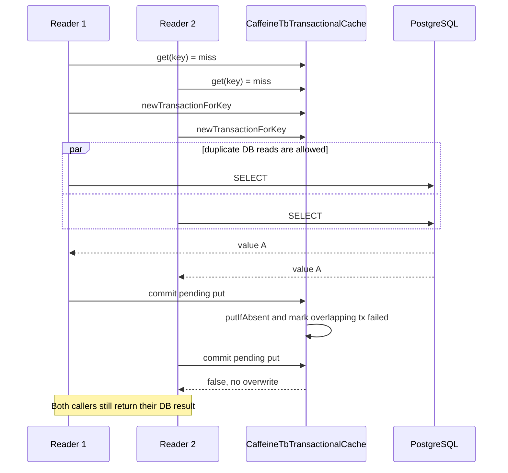

直接 `put`、`putIfAbsent` 或 `evict` 会先调用 [failAllTransactionsByKey(K)](../../../common/cache/src/main/java/org/thingsboard/server/cache/CaffeineTbTransactionalCache.java#L294)，因此更新发生时，正在进行的旧 DB load 不能再污染本地 cache。`evictOrPut` 在 [L151](../../../common/cache/src/main/java/org/thingsboard/server/cache/CaffeineTbTransactionalCache.java#L151) 只做 evict，不保存传入的新值。

### 3.3 Redis miss 的源码链

[RedisTbTransactionalCache.newTransactionForKey(K)](../../../common/cache/src/main/java/org/thingsboard/server/cache/RedisTbTransactionalCache.java#L218) 在选定 key 所属 Redis 节点连接上执行 `WATCH` 和 `MULTI`。DB 查询后，[RedisTbCacheTransaction.putIfAbsent(...)](../../../common/cache/src/main/java/org/thingsboard/server/cache/RedisTbCacheTransaction.java#L52) 将一个带 cache TTL 的 SET UPSERT 排入事务，`commit()` 执行 `EXEC`。

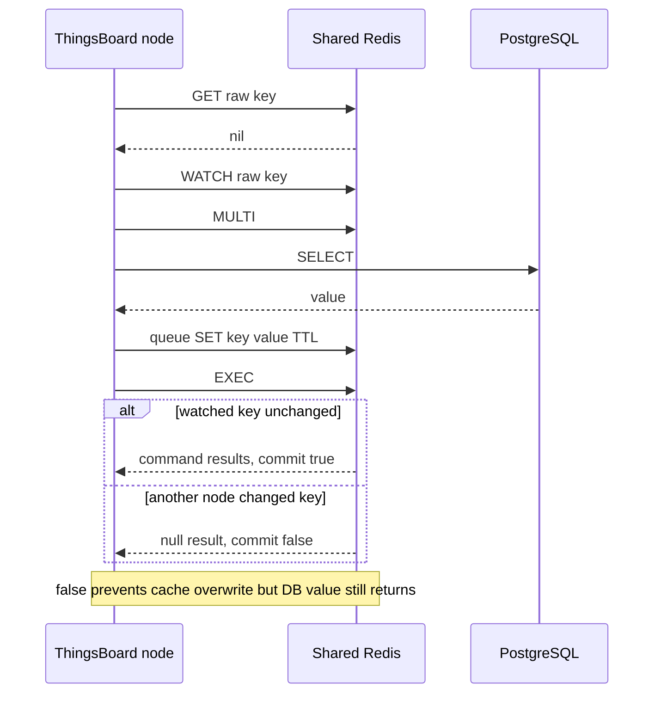

Redis Cluster 中，[getConnection(byte[])](../../../common/cache/src/main/java/org/thingsboard/server/cache/RedisTbTransactionalCache.java#L243) 根据第一个 raw key 的 slot 取得原生 Jedis connection。多 key transaction 必须在同一 slot；[AttributeCacheKey.toString()](../../../dao/src/main/java/org/thingsboard/server/dao/attributes/AttributeCacheKey.java#L59) 使用 `{entityId}` hash tag，使同一实体的多属性 key 共槽。

### 3.4 Device 保存与失效

Device 保存链在 [DeviceServiceImpl.saveDeviceWithoutCredentials(Device, boolean)](../../../dao/src/main/java/org/thingsboard/server/dao/device/DeviceServiceImpl.java#L314) 中构造包含新名、旧名和保存前 ID 的事件；创建场景的 ID 仍可能为 null。`deviceDao.saveAndFlush` 后调用 `publishEvictEvent`。监听器 [handleEvictEvent(DeviceCacheEvictEvent)](../../../dao/src/main/java/org/thingsboard/server/dao/device/DeviceServiceImpl.java#L366) 只在 ID 非 null 时删除两种 ID key，并清理新旧名称 key。

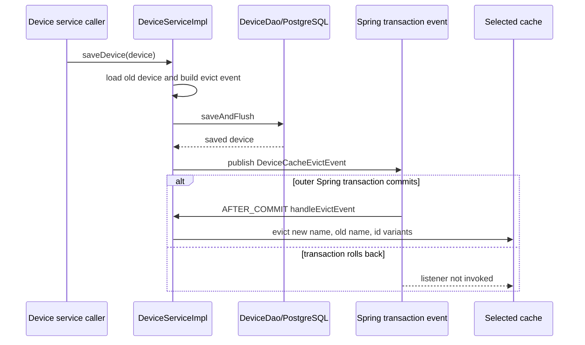

如果保存代码不在实际 Spring transaction 中，[AbstractCachedEntityService.publishEvictEvent(E)](../../../dao/src/main/java/org/thingsboard/server/dao/entity/AbstractCachedEntityService.java#L47) 会立即调用 handler。保存异常路径还会直接保守失效，见 [DeviceServiceImpl L351](../../../dao/src/main/java/org/thingsboard/server/dao/device/DeviceServiceImpl.java#L351)。

---

## 四、消息流

### 4.1 负缓存

[SimpleTbCacheValueWrapper](../../../common/cache/src/main/java/org/thingsboard/server/cache/SimpleTbCacheValueWrapper.java#L34) 允许 wrapper 包含 null。Redis 另使用序列化后的 `NullValue.INSTANCE` 标记，见 [RedisTbTransactionalCache L55](../../../common/cache/src/main/java/org/thingsboard/server/cache/RedisTbTransactionalCache.java#L55)。

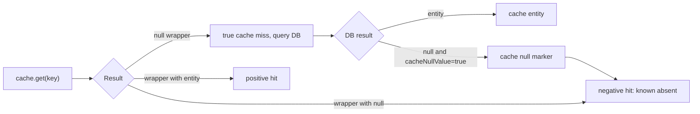

Device、Asset 名称查询和 Attributes 会负缓存；精确 Relation 查询传 `cacheNullValue=false`，不存在时不回填 null。负缓存减少穿透，也延长多节点 Caffeine 的“不存在”视图，直到显式失效或 TTL 到期。

### 4.2 Redis `evictOrPut`

Attributes 保存成功后调用 [CachedAttributesService.evict(...)](../../../dao/src/main/java/org/thingsboard/server/dao/attributes/CachedAttributesService.java#L392)。Caffeine 只需本地 evict 并标记加载事务失败；Redis 必须处理 watched key 原本不存在时 `DEL` 不改变 key version 的问题。

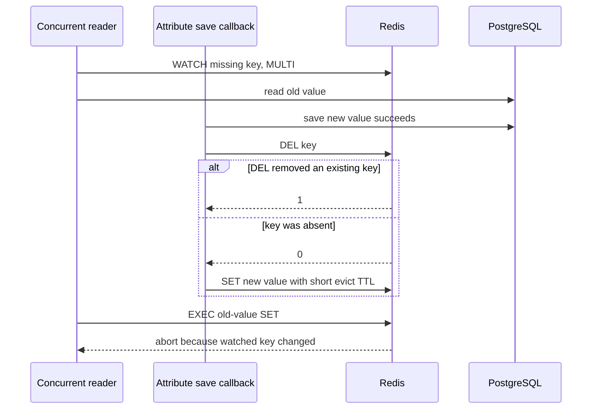

普通 Device/Asset/Relation 失效只执行 `DEL`，没有 absent-key 短值写入。如果 reader 已 WATCH 一个不存在的 key、读到更新前 DB 值，而 writer 对不存在 key 的 DEL 没有形成变化，旧回填存在成功窗口。Attributes save 专门使用 `evictOrPut` 缩小了这一窗口；Attributes remove 仍使用普通 evict。

### 4.3 Attributes 线程切换

[CachedAttributesService.getExecutor(String, CacheExecutorService)](../../../dao/src/main/java/org/thingsboard/server/dao/attributes/CachedAttributesService.java#L153) 对 Caffeine 使用 direct executor，对 Redis 使用 [CacheExecutorService](../../../dao/src/main/java/org/thingsboard/server/dao/cache/CacheExecutorService.java#L31) 的独立线程池。单 key `find` 的 cache GET、事务登记和 `attributesDao.find` 全在这个 executor 的同一个任务中；只有多 key `find` 在分析 miss 集合后再切到 `JpaExecutorService`。

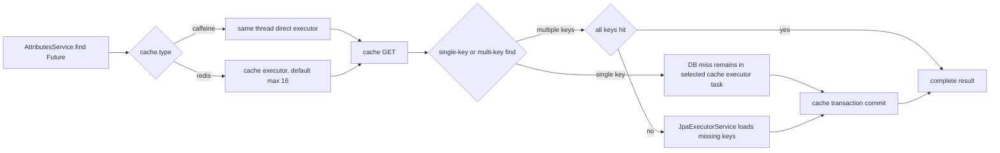

---

## 五、时序图

[PlantUML 源文件](sequence.puml) | [新窗口查看时序图 SVG](sequence.svg)

[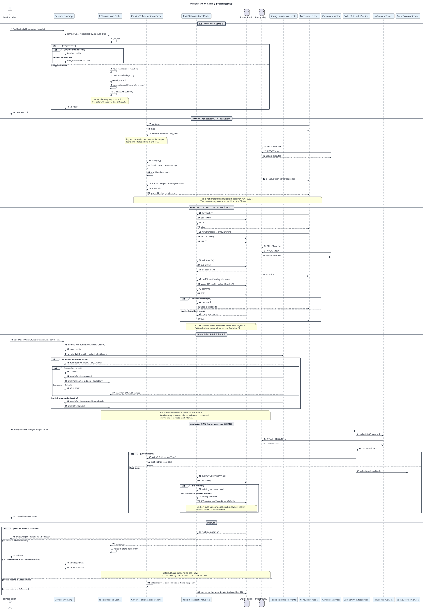](sequence.svg)

完整时序图组合了 Device read miss、Caffeine 本地 CAS、Redis WATCH/MULTI、Device 事务后失效、Attributes `evictOrPut` 与故障窗口。HTML 默认显示缩略图，点击后以原始 SVG 打开。

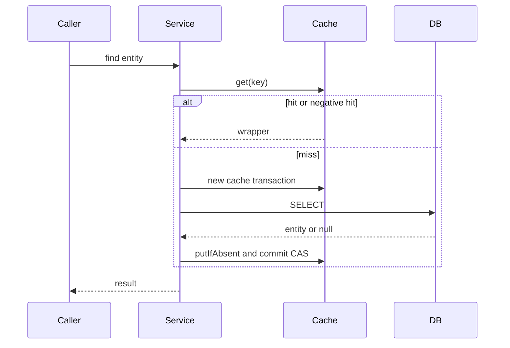

---

## 六、数据变化

### 6.1 缓存、数据库与消息状态

| 对象 | 读取 miss | 保存/删除 | 过期 | 跨节点 |
|---|---|---|---|---|
| Caffeine entry | 当前 JVM DB 回填 | 当前 JVM evict | expire-after-write / weight eviction | 无自动 DAO cache 传播 |
| Redis custom entry | WATCH/MULTI 后 DB 回填 | DEL 或短 TTL SET | Redis key TTL | 所有节点共享同一 key |
| Spring Cache Caffeine entry | interceptor 回填 | 本地 annotation evict | Caffeine spec | 每 JVM 独立 |
| Spring Cache Redis entry | RedisCacheManager 回填 | 活跃 Spring transaction 中延迟 annotation evict | 默认配置未接入 per-cache specs | 共享 Redis |
| PostgreSQL row | cache 不修改 DB | 由原 Service/DAO 修改 | 不受 cache TTL 影响 | 数据库权威源 |
| Actor/session state | 本章流程不修改 | 生命周期消息可能另行更新 | 独立生命周期 | 由 Queue/Cluster 流程决定 |
| Kafka offset/topic | 不参与 DAO cache read | 不承担这些 evict event | 无 | 无 |

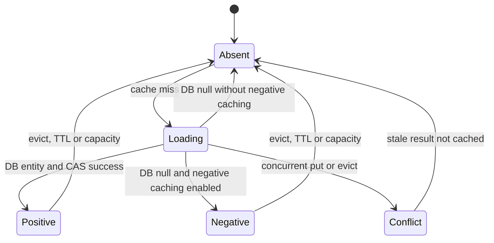

### 6.2 TTL 与容量语义

[TbCaffeineCacheConfiguration.buildCache(...)](../../../common/cache/src/main/java/org/thingsboard/server/cache/TbCaffeineCacheConfiguration.java#L102) 使用 `expireAfterWrite`，读取不会刷新 TTL。它把 `maxSize` 传给 `maximumWeight`，Collection 的 weight 是集合元素数，其余值为 1。

[RedisTbTransactionalCache 构造器](../../../common/cache/src/main/java/org/thingsboard/server/cache/RedisTbTransactionalCache.java#L91) 只从 `CacheSpecsMap` 读取 TTL；找不到 spec 时创建 persistent expiration。Redis 路径不读取 `maxSize`，容量取决于 Redis 服务端 `maxmemory` 与 eviction policy。

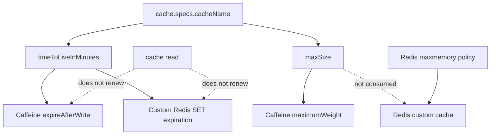

`userSessionsInvalidation` 是特例：[CacheSpecsMap.replaceTheJWTTokenRefreshExpTime()](../../../common/cache/src/main/java/org/thingsboard/server/cache/CacheSpecsMap.java#L59) 用 refresh token 有效期覆盖 YAML 中的 TTL。

### 6.3 Key 与序列化

自定义 Redis key 是 `cacheName + key.toString()`，没有统一分隔符或部署 namespace，见 [getRawKey(K)](../../../common/cache/src/main/java/org/thingsboard/server/cache/RedisTbTransactionalCache.java#L282)。大部分 value 使用 [TbFSTRedisSerializer](../../../common/cache/src/main/java/org/thingsboard/server/cache/TbFSTRedisSerializer.java#L30)；Attributes 使用 [AttributeRedisCache](../../../dao/src/main/java/org/thingsboard/server/dao/attributes/AttributeRedisCache.java#L48) 的 protobuf serializer，Session 也使用专用 protobuf。

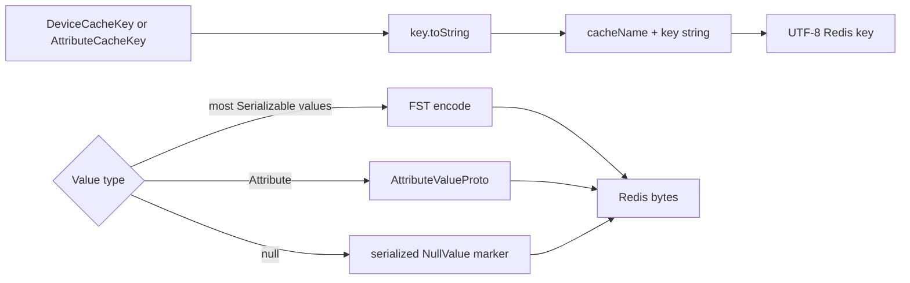

多个 ThingsBoard 部署不能随意共用同一 Redis DB：源码 key 没有 cluster name/deployment prefix，值格式还要求所有节点版本兼容。[DefaultCacheCleanupService](../../../application/src/main/java/org/thingsboard/server/service/install/update/DefaultCacheCleanupService.java#L46) 只在特定升级版本通过 Spring `CacheManager` 清理两个指定 cache；它不是清理全部自定义 Redis raw key 的通用工具，而且 Spring Redis 默认 `cacheName::key` 与自定义 `cacheName + key.toString()` 也不是同一 key 空间。

---

## 七、源码分析

### 7.1 类型关系

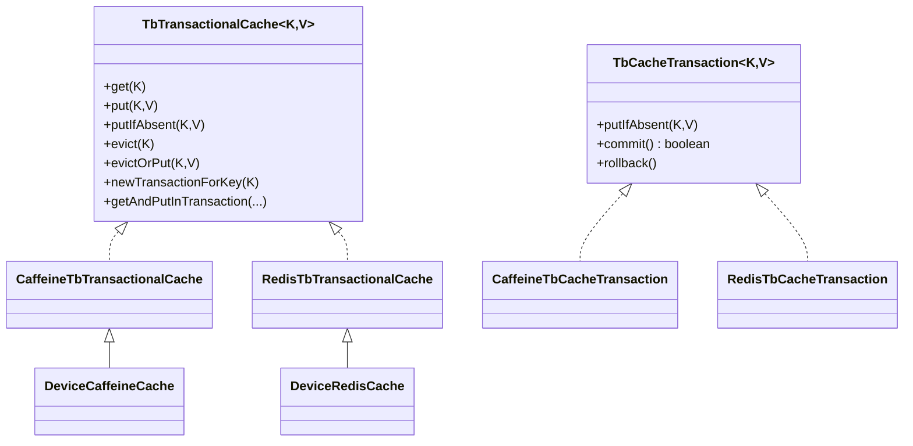

条件实现以同一个 Spring service name 装配。例如 [DeviceCaffeineCache](../../../common/cache/src/main/java/org/thingsboard/server/cache/device/DeviceCaffeineCache.java#L34) 与 [DeviceRedisCache](../../../common/cache/src/main/java/org/thingsboard/server/cache/device/DeviceRedisCache.java#L37) 都是 `"DeviceCache"`，业务层只依赖接口。

### 7.2 两种 transaction 不应混淆

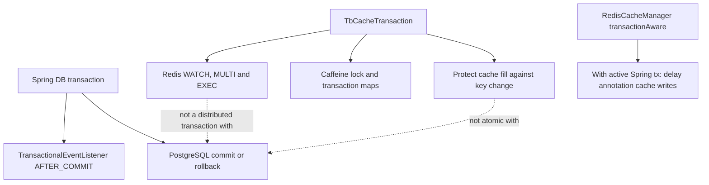

`TbCacheTransaction.commit()` 在 DB supplier 返回后立即发生，并不等待外层 Spring transaction。它的 rollback 只丢弃待回填缓存操作，不能回滚数据库，也不能恢复其他线程已经执行的 cache put/evict。

### 7.3 Caffeine CacheManager 的真实事务语义

[TbCaffeineCacheConfiguration.cacheManager()](../../../common/cache/src/main/java/org/thingsboard/server/cache/TbCaffeineCacheConfiguration.java#L76) 直接返回 `SimpleCacheManager`。虽然前面的注释提到 transaction-aware wrapper，测试 [CacheSpecsMapTest.verifyNotTransactionAwareCacheManagerProxy()](../../../common/cache/src/test/java/org/thingsboard/server/cache/CacheSpecsMapTest.java#L64) 明确断言它不是事务代理。这是注释与可执行源码不一致，应以 bean 构造与测试为准。

因此 DAO 的提交后失效来自 `publishEvictEvent + @TransactionalEventListener`；标准 `@CacheEvict` 在 Caffeine 模式下不具备 Redis `RedisCacheManager.transactionAware()` 的同等延迟行为。后者也只有存在活跃 Spring transaction 时才把标准 Cache 操作延迟到提交，无事务时仍立即执行。

### 7.4 缓存击穿与旧值覆盖是两个问题

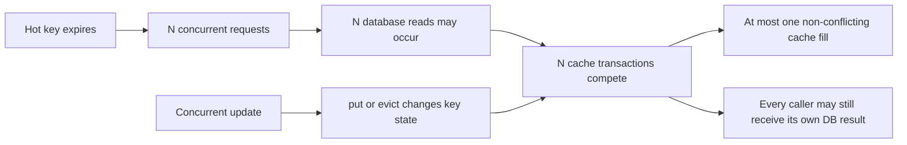

ThingsBoard 的 CAS 解决“与 cache 变更发生冲突的 query 继续回填”，不解决“同一时刻只有一个 DB load”。实现不读取业务版本或值时间戳：Caffeine 标记重叠 cache transaction failed，Redis 依赖 watched key 是否改变。高并发热点过期仍可能形成数据库放大；负缓存只能减少持续查询不存在 key，不能合并首批 miss。

### 7.5 多 key Redis Cluster

[TbTransactionalCache.newTransactionForKeys(List<K>)](../../../common/cache/src/main/java/org/thingsboard/server/cache/TbTransactionalCache.java#L101) 注释要求所有 key 同 slot。Redis 实现直接使用 `rawKeysList[0]` 选节点，没有空列表保护；调用方必须保证非空且 hash tag 一致。Attributes 用 `{entityId}` 达成同槽，而任意新增复合 key 缓存不能忽略这一约束。

### 7.6 Spring Cache 与自定义 Cache 的不同 key 空间

| 维度 | Spring Cache annotations | `TbTransactionalCache` |
|---|---|---|
| 代表使用 | Security/Notification settings | Device/Relation/Attributes |
| Caffeine | `SimpleCacheManager` | 同 manager 的显式操作 |
| Redis | 活跃 Spring transaction 中生效的 transaction-aware `RedisCacheManager` | 直接 `RedisConnection` |
| Redis key 形状 | Spring 默认 `cacheName::convertedKey` | `cacheName + key.toString()` |
| Redis value | Spring 默认 serializer | FST/专用 protobuf/Null marker |
| per-cache TTL | Caffeine specs 生效 | Redis custom cache specs 生效 |
| Redis annotation TTL | default configuration，未接入 specs | 不适用 |
| CAS | Spring interceptor 自身不提供本章自定义 CAS | Caffeine maps 或 Redis WATCH |

这两条路径即使 cache name 相同，也不能假定共享相同 Redis key/value 编码。

---

## 八、Actor 分析

DAO Cache-Aside 本身不经过 Actor。Controller、Rule Node 或 Actor 内部调用 Service 时，缓存只是同步方法或 Future 的一个下游依赖；它不会创建 mailbox 消息，也没有 Actor 专门负责 cache owner。

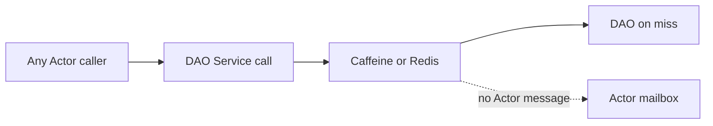

平台还有 `DefaultTbDeviceProfileCache`、Transport profile map、session listener map 等运行时缓存。例如 [DefaultTbDeviceProfileCache](../../../application/src/main/java/org/thingsboard/server/service/profile/DefaultTbDeviceProfileCache.java#L47) 用 `ConcurrentHashMap`，由 lifecycle/queue consumer 调用 `evict`；这与 `cache.type` 选择的 DAO cache 不是同一层。阅读源码时必须按“谁拥有、谁失效、是否共享”分别追踪。

---

## 九、Kafka 分析

### 9.1 DAO cache 失效不经过 Kafka

`DeviceCacheEvictEvent` 等是 Spring `ApplicationEvent`，只在发布它的 ApplicationContext/JVM 中调度。源码引用没有 Producer、Topic、Consumer Group 或 Redis Pub/Sub。

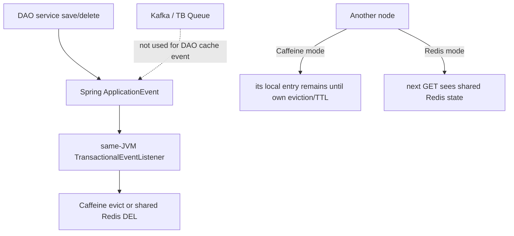

### 9.2 生命周期消息是另一条链

Device Profile、Device 等保存还可能发布平台 lifecycle notification，经 Queue 让 Actor、Transport、Rule Engine 的运行时 cache 更新。这些消息不等于 DAO Caffeine entry 的跨节点失效。第 04、15、19 章描述了相应链路；本章不把它们合并成一个不存在的全局缓存协议。

### 9.3 微服务部署选择

[docker/README.md](../../../docker/README.md#L20) 的微服务配置只提供 Redis standalone、cluster、sentinel 三种 cache 选项，没有 Caffeine 选项。这是部署脚本约束，与 Java 默认 `cache.type=caffeine` 不矛盾：单体默认可本地缓存，多服务容器模板显式选择共享 Redis。

---

## 十、数据库分析

### 10.1 PostgreSQL 是权威源

Cache-Aside 中 PostgreSQL 仍是权威数据。缓存没有 redo/binlog，也不参与 JPA transaction；cache TTL 到期不会删除数据库，数据库 rollback 也不会自动撤销已执行的直接 cache 操作。

```mermaid
flowchart TB
    READ["Read"] --> CACHE{"Cache state"}
    CACHE -->|"hit"| VALUE["Return cached snapshot"]
    CACHE -->|"miss"| PG["Read PostgreSQL"]
    PG --> FILL["CAS fill cache"]
    WRITE["Write"] --> PGTX["PostgreSQL transaction"]
    PGTX -->|"commit"| EVICT["Evict cache"]
    PGTX -->|"rollback"| KEEP["AFTER_COMMIT listener does not run"]
```

### 10.2 提交与失效窗口

默认 transaction event phase 是 `AFTER_COMMIT`：

```mermaid
sequenceDiagram
    participant Writer
    participant DB as PostgreSQL
    participant Event as Transaction event
    participant Reader
    participant Cache
    Writer->>DB: UPDATE and flush
    Writer->>Event: publish evict event
    Reader->>Cache: GET old entry before commit
    Cache-->>Reader: old value
    DB-->>Writer: COMMIT
    Reader->>Cache: possible GET in commit-to-evict window
    Cache-->>Reader: old value
    Event->>Cache: AFTER_COMMIT evict
    Reader->>Cache: miss
    Reader->>DB: SELECT new value
```

这样避免 DB rollback 时无意义地丢缓存，但不能提供线性一致读。外层事务内 save 后立即按 cache key 查询，也可能读到旧 snapshot，不能把 cache read 当作 read-your-own-write 保证。

### 10.3 Caffeine 多节点一致性

节点 A 更新 DB 并失效 A 的本地 entry，不会删除节点 B 的 Caffeine entry。B 可能持续返回旧值直到 `expireAfterWrite`、容量淘汰或 B 自己收到另一条业务失效。Device/Asset/Relation 默认 TTL 是 1440 分钟，因此多节点单体若仍选择 Caffeine，一致性窗口可远大于数据库事务窗口。

```mermaid
sequenceDiagram
    participant A as Node A
    participant DB
    participant CA as Caffeine A
    participant B as Node B
    participant CB as Caffeine B
    A->>DB: save and commit new entity
    A->>CA: local evict
    Note over A,CB: no DAO cache invalidation message to B
    B->>CB: get key
    CB-->>B: stale local value
    Note over B,CB: local TTL or capacity eviction occurs later
    B->>CB: miss
    B->>DB: load new entity
```

### 10.4 Redis 共享一致性

Redis 没有 per-node L1，节点 A 的 DEL/SET 直接改变所有节点随后读取的共享 key。但共享 Redis 仍不是强一致数据库 cache：

- PostgreSQL commit 与 Redis DEL 不原子，存在 commit-to-evict window。
- Redis 故障可让失效失败，而 DB 已提交。
- replication/failover durability 取决于 Redis 部署，不由 ThingsBoard Java transaction 保证。
- absent-key DEL 与并发 WATCH 可能不冲突，除非使用 `evictOrPut`。
- Redis key TTL 和服务端 eviction 可造成 miss，但 miss 会回源，而不是数据丢失。

### 10.5 Standalone、Sentinel、Cluster

| 模式 | 配置实现 | 数据形态 | 主要边界 |
|---|---|---|---|
| Standalone | [TBRedisStandaloneConfiguration.loadFactory()](../../../common/cache/src/main/java/org/thingsboard/server/cache/TBRedisStandaloneConfiguration.java#L101) | 单 Redis 节点/DB | 单点；自定义 timeout 仅在关闭 default client config 时生效 |
| Sentinel | [TBRedisSentinelConfiguration.loadFactory()](../../../common/cache/src/main/java/org/thingsboard/server/cache/TBRedisSentinelConfiguration.java#L80) | 一个主数据集的发现和故障转移 | 不分片；依赖 master/sentinel 配置 |
| Cluster | [TBRedisClusterConfiguration.loadFactory()](../../../common/cache/src/main/java/org/thingsboard/server/cache/TBRedisClusterConfiguration.java#L68) | 多 slot 分片 | multi-key transaction 必须同 slot；DB 0 |

实现把 `RedisConnectionFactory` 强制转换为 `JedisConnectionFactory`，见 [RedisTbTransactionalCache L97](../../../common/cache/src/main/java/org/thingsboard/server/cache/RedisTbTransactionalCache.java#L97)，不能只替换 Spring bean 为 Lettuce 而期望自定义事务缓存继续工作。

### 10.6 生产观测与调优

建议观测：

1. PostgreSQL 同一热点 query 的调用速率，判断是否发生并发 miss 放大。
2. Attributes `attributes.cache` hit/miss counter；其他自定义 cache 没有统一 hit/miss 计数。
3. Redis command latency、连接池等待、timeouts、evictions、used memory、keyspace hits/misses。
4. Redis Cluster `CROSSSLOT`、redirect、failover 与 serializer exception。
5. Caffeine 本地内存和 GC；`maximumWeight` 不是字节数。
6. transaction commit 到 cache evict 的旧读比例，而不只看 hit ratio。

Redis 自定义缓存异常不会自动降级，生产必须把 Redis 视作同步依赖。过大的 cache TTL 只提高 hit ratio，不解决跨节点 Caffeine 一致性；过小 TTL 会增加 DB load 和热点击穿。

---

## 十一、异常处理

### 11.1 失败矩阵

| 失败点 | 当前源码行为 | DB 状态 | Cache 状态 |
|---|---|---|---|
| Cache GET 失败 | 异常传播，不自动查 DB | 未访问 | 未知 |
| DB supplier 失败 | cache transaction rollback，异常传播 | 由 DAO 决定 | 不回填 |
| Caffeine CAS 冲突 | commit=false | DB read 已完成 | 保留并发更新后的 cache |
| Redis WATCH 冲突 | EXEC 返回 null，commit=false | DB read 已完成 | 不写旧值 |
| Redis serializer 失败 | 包装或传播运行时异常 | 可能已完成 DB read/write | put/evict 未完成 |
| DB rollback | AFTER_COMMIT listener不执行；业务 catch 可能直接 evict | 回滚 | 取决于异常路径：保留旧值或被保守失效 |
| DB commit 后 Redis DEL 失败 | 无共同回滚 | 已提交 | 旧 key 可能保留到 TTL |
| Attributes cache callback 失败 | 返回 Future 失败 | DAO Future 可能已成功 | 未完成失效 |
| Redis key TTL 到期 | 下次 miss 回源 | 不变 | key 消失 |

```mermaid
flowchart TB
    OP["Cache-assisted operation"] --> GET{"GET succeeds"}
    GET -->|"no"| FAIL["propagate cache exception"]
    GET -->|"yes, miss"| DB{"DB call succeeds"}
    DB -->|"no"| RB["rollback cache tx and rethrow"]
    DB -->|"yes"| COMMIT{"cache CAS commit"}
    COMMIT -->|"conflict false"| RETURN["return DB result, skip cache fill"]
    COMMIT -->|"exception"| ERR["propagate; DB read already happened"]
    COMMIT -->|"success"| RETURN
```

### 11.2 Redis 失败不是透明旁路

[RedisTbTransactionalCache.get(K)](../../../common/cache/src/main/java/org/thingsboard/server/cache/RedisTbTransactionalCache.java#L115) 在 DB call 之前获取 connection 并 GET；失败时没有 catch 后 fallback。Attributes 把 Redis IO 放到专用 executor 只是不阻塞调用线程，并不把失败转换为数据库读取。

### 11.3 提交后失效失败

`@TransactionalEventListener` 在 DB commit 后执行，Redis DEL 抛错不能再回滚数据库。具体异常如何呈现取决于调用是否仍在同步线程和上层异常处理，但数据与 cache 已经分叉。TTL 是最后兜底，不是可靠失效确认；源码没有 retry queue 或 dead-letter。

### 11.4 异步 Relation 边界

[BaseRelationService.saveRelationAsync(...)](../../../dao/src/main/java/org/thingsboard/server/dao/relation/BaseRelationService.java#L281) 和 [deleteRelationAsync(...)](../../../dao/src/main/java/org/thingsboard/server/dao/relation/BaseRelationService.java#L318) 使用 `future.addListener`，listener 不检查 Future 成功状态就失效并发布 action event。失败时多做一次 evict 通常保证安全读取，但 action event 可能与 DB 结果不一致。

### 11.5 排障顺序

1. 确认调用方法是否真的使用 cache，很多 async/findAll 方法绕过它。
2. 确认实际 `cache.type` 和条件 Bean，不以 YAML 默认猜测容器环境。
3. 区分 `TbCacheTransaction`、Spring DB transaction 与 RedisCacheManager transaction-aware。
4. Redis 查 raw key 形状和 TTL；Caffeine 查当前节点，不把 A 节点状态代表整个集群。
5. 对比 PostgreSQL 当前值、cache 当前值、最后一次保存/失效日志。
6. 检查并发 miss、absent-key DEL 和 commit-to-evict 时间窗口。

---

## 十二、源码阅读路线

1. [thingsboard.yml cache 配置](../../../application/src/main/resources/thingsboard.yml#L484)：先建立 cache name、TTL、容量和类型选择。
2. [TbTransactionalCache](../../../common/cache/src/main/java/org/thingsboard/server/cache/TbTransactionalCache.java#L33)：理解 wrapper、Cache-Aside 与自定义 cache transaction。
3. [SimpleTbCacheValueWrapper](../../../common/cache/src/main/java/org/thingsboard/server/cache/SimpleTbCacheValueWrapper.java#L34)：区分 miss 与负缓存 hit。
4. [CaffeineTbTransactionalCache](../../../common/cache/src/main/java/org/thingsboard/server/cache/CaffeineTbTransactionalCache.java#L44)：读本地锁、事务登记、冲突失败与 evict。
5. [CaffeineTbCacheTransaction](../../../common/cache/src/main/java/org/thingsboard/server/cache/CaffeineTbCacheTransaction.java#L40)：看 pending puts 何时真正提交。
6. [RedisTbTransactionalCache](../../../common/cache/src/main/java/org/thingsboard/server/cache/RedisTbTransactionalCache.java#L53)：看 GET/SET/DEL、raw key、TTL 与 WATCH。
7. [RedisTbCacheTransaction](../../../common/cache/src/main/java/org/thingsboard/server/cache/RedisTbCacheTransaction.java#L37)：看 MULTI 中排队和 EXEC 返回语义。
8. [TbCaffeineCacheConfiguration](../../../common/cache/src/main/java/org/thingsboard/server/cache/TbCaffeineCacheConfiguration.java#L46)：确认 `SimpleCacheManager` 和 weight/TTL。
9. [TBRedisCacheConfiguration](../../../common/cache/src/main/java/org/thingsboard/server/cache/TBRedisCacheConfiguration.java#L52)：确认 Redis Spring Cache Manager 和连接池。
10. [DeviceServiceImpl.findDeviceById(...)](../../../dao/src/main/java/org/thingsboard/server/dao/device/DeviceServiceImpl.java#L179)：跟一次典型正/负缓存读取。
11. [DeviceServiceImpl.saveDeviceWithoutCredentials(...)](../../../dao/src/main/java/org/thingsboard/server/dao/device/DeviceServiceImpl.java#L314)：跟 DB commit 后失效。
12. [CachedAttributesService.find(...)](../../../dao/src/main/java/org/thingsboard/server/dao/attributes/CachedAttributesService.java#L173)：理解 remote cache executor 和多 key miss。
13. [CachedAttributesService.save(...)](../../../dao/src/main/java/org/thingsboard/server/dao/attributes/CachedAttributesService.java#L353)：理解 `evictOrPut`。
14. [BaseAttributesServiceTest.testConcurrentTransaction()](../../../dao/src/test/java/org/thingsboard/server/dao/service/attributes/BaseAttributesServiceTest.java#L180)：用测试固定 CAS 冲突行为。
15. 下一章阅读 WebSocket subscription，观察初始 DB/cache 查询与实时推送如何衔接。

---

## 十三、常见面试题

### 1. ThingsBoard 3.6 默认使用 Redis 还是 Caffeine？

默认是 Caffeine，`cache.type` 缺失时也匹配 Caffeine 条件。微服务 Docker 模板则明确要求选择 Redis standalone、cluster 或 sentinel。

### 2. `TbCacheTransaction` 是数据库事务吗？

不是。它只保护 cache miss 回填，Caffeine 用本地事务登记，Redis 用 WATCH/MULTI/EXEC；它不能提交或回滚 PostgreSQL。

### 3. ThingsBoard 的 Cache-Aside 读取顺序是什么？

先 GET；wrapper 存在则直接返回；miss 时创建 cache transaction、读 DB、暂存 `putIfAbsent`、CAS commit。异常则 rollback 待回填。

### 4. 如何区分真正 miss 和缓存的 null？

真正 miss 返回 null wrapper；负缓存命中返回非 null `TbCacheValueWrapper`，但其 `get()` 为 null。

### 5. 为什么要缓存 null？

它记录“已经查过且不存在”，减少不存在 ID/name/key 对数据库的持续穿透。代价是失效遗漏时“不存在”也会陈旧。

### 6. 这套事务缓存能防止缓存击穿吗？

不能完全防止。多个 miss 可以同时查 DB；CAS 只保证冲突的旧结果不写回 cache，不合并 DB load。

### 7. CAS commit 返回 false 时调用会失败吗？

通用 helper 忽略 boolean，仍返回本次 DB 查询结果，只是不把它写入 cache。

### 8. Caffeine 如何阻止旧查询覆盖并发更新？

put/evict 会在本地锁内把该 key 的进行中事务标记 failed；旧查询随后 commit=false，不执行 pending put。

### 9. Redis 如何实现同一语义？

miss 后 WATCH key，再 MULTI；DB 查询后排队 SET，EXEC 时若 watched key 已被其他节点修改则 abort。

### 10. Redis cache transaction 中的 `putIfAbsent` 真的是 SET NX 吗？

事务对象内部排队的是 UPSERT。它的“if absent/未冲突”语义依赖 WATCH；普通非事务 `putIfAbsent` 才使用 SET_IF_ABSENT。

### 11. 为什么 Redis `evictOrPut` 在 DEL=0 时还要 SET 新值？

对不存在 key 的 DEL 不一定让 WATCH 冲突。短 TTL SET 改变 key，阻止并发旧 DB 查询成功 EXEC 回填旧值。

### 12. Caffeine 的 `evictOrPut` 为什么只 evict？

本地实现能直接把同 key 的进行中 transaction 标记失败，无需写短期占位值。

### 13. Caffeine 模式能跨 ThingsBoard 节点失效吗？

这些 DAO cache 不能。Spring ApplicationEvent 和 Caffeine 都在本 JVM，源码没有为它们发布 Kafka 或 Redis Pub/Sub 失效消息。

### 14. Redis 模式的跨节点失效依赖 Pub/Sub 吗？

不依赖。所有节点直接使用同一 Redis key；一个节点 DEL 后，其他节点下一次 GET 读取共享状态。

### 15. Device 保存为什么在 AFTER_COMMIT 后 evict？

避免 DB rollback 时清掉仍对应有效旧数据的 cache。代价是提交前和 commit-to-evict 之间仍可能旧读。

### 16. Caffeine CacheManager 是 transaction-aware proxy 吗？

不是。源码直接返回 `SimpleCacheManager`，测试也明确断言这一点；源码中的 transaction-aware 注释已经过时。

### 17. Redis CacheManager 的 transaction-aware 与 WATCH 事务是什么关系？

前者服务标准 Spring Cache annotations，在存在活跃 Spring transaction 时把写/删延迟到提交；后者是自定义 `TbTransactionalCache` 的并发回填 CAS，两者是不同路径。

### 18. Caffeine 的 `maxSize` 是条目数吗？

源码使用 `maximumWeight`。普通值 weight=1，Collection weight=集合 size，所以它不是统一的对象数或字节数。

### 19. Redis 是否使用 `cache.specs.*.maxSize`？

自定义 Redis cache 不读取它，Spring RedisCacheManager 也未接入 specs。Redis 容量由服务端内存和 eviction policy 控制。

### 20. Cache TTL 是 expire-after-access 吗？

不是。Caffeine 使用 expire-after-write，Redis 在 SET 时写 TTL；读取都不会续期。

### 21. Redis key 如何构造，有什么部署风险？

自定义 key 是 `cacheName + key.toString()`，没有部署 namespace。两个 ThingsBoard 环境共用 Redis DB 会冲突，还可能发生 serializer 版本不兼容。

### 22. Redis Cluster 多 key transaction 有什么要求？

所有 key 必须在同一 hash slot。Attributes key 用 `{entityId}` hash tag；新增多 key cache 也必须自行保证共槽且列表非空。

### 23. Redis 故障时会自动绕过 cache 查 PostgreSQL 吗？

不会。GET 在 DB call 前执行，连接/序列化异常直接传播。专用 executor 只改变线程，不提供降级。

### 24. 为什么 Attributes `findAll` 不使用 cache？

源码说明无法预先知道所有 key，因而无法 WATCH/枚举完整 cache key 集，直接提交到 JPA executor 查 DAO。

### 25. 排查“数据库已更新但仍读旧值”应从哪里开始？

先确认具体查询是否缓存及实际 cache type；再比较 DB 与当前节点/Redis key，检查 transaction event 是否执行、Redis DEL 是否失败、Caffeine 是否为另一节点旧 entry，以及是否落入 commit-to-evict、负缓存或 absent-key DEL 竞态。

---

[上一篇：31 Timeseries TTL 清理流程](../31-timeseries-ttl-cleanup/README.md) | [HTML 版](index.html) | [全书目录](../../SUMMARY.md) | [PlantUML 源文件](sequence.puml) | [时序图 SVG](sequence.svg) | [架构图 SVG](../../assets/architecture/32-redis-local-cache.svg) | [下一篇：33 WebSocket 订阅流程](../33-websocket-subscription/README.md)
