# 35 Relation 流程

> 源码基线：ThingsBoard `release-3.6`，业务源码提交 `69124284c2`。本章只分析关系有向边的 REST 创建、删除、读取、递归查询、缓存、PostgreSQL 持久化、实体删除联动与 Edge 事件旁路；Entity Query 中的 `RelationsQueryFilter` 作为另一条递归实现单独对照。

[上一篇：34 Entity Query 流程](../34-entity-query/README.md) | [HTML 版](index.html) | [全书目录](../../SUMMARY.md) | [PlantUML 源文件](sequence.puml) | [时序图 SVG](sequence.svg) | [架构图 SVG](../../assets/architecture/35-relation-flow.svg) | [下一篇：36 Event 与 Audit Log 流程](../36-event-audit-log/README.md)

---

## 一、流程目标

`EntityRelation` 不是无向标签，而是一条由 `from` 指向 `to` 的有向边。边的业务类型 `type`（例如 `Contains`、`Manages`）和平台隔离类型 `typeGroup`（例如 `COMMON`、`EDGE`）都参与唯一性；反转端点、改变 `type` 或改变 `typeGroup` 都会得到另一条边。

[架构图 SVG：REST、RelationService、缓存、PostgreSQL、Edge 与查询旁路](../../assets/architecture/35-relation-flow.svg)

[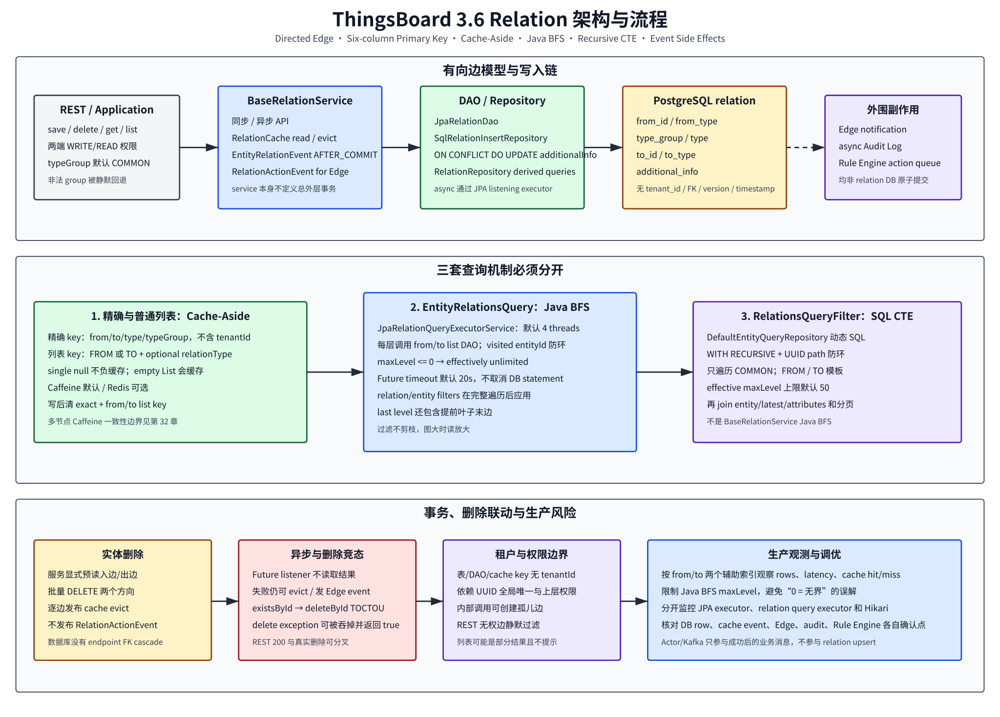](../../assets/architecture/35-relation-flow.svg)

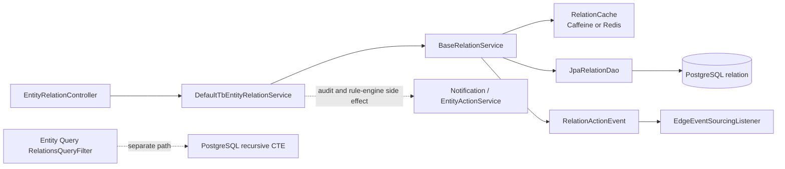
```mermaid
flowchart LR
    REST["EntityRelationController"] --> APP["DefaultTbEntityRelationService"]
    APP --> SERVICE["BaseRelationService"]
    SERVICE --> CACHE["RelationCache<br/>Caffeine or Redis"]
    SERVICE --> DAO["JpaRelationDao"]
    DAO --> PG[("PostgreSQL relation")]
    SERVICE --> EVENT["RelationActionEvent"]
    EVENT --> EDGE["EdgeEventSourcingListener"]
    APP -. audit and rule-engine side effect .-> SIDE["Notification / EntityActionService"]
    EQ["Entity Query RelationsQueryFilter"] -. separate path .-> CTE["PostgreSQL recursive CTE"]
```

本章先固定十二条事实：

1. REST 创建和精确删除会检查两个端点的写权限；读取列表先检查根实体，再对结果中两个端点做逐边读权限过滤。
2. `POST /api/relation` 在 `typeGroup == null` 时补 `COMMON`；查询参数中的空值或非法 group 也会静默回退到默认值。
3. `relation` 表没有 `tenant_id`，没有指向实体表的外键；租户参数不会进入 Relation SQL 条件。
4. 六列复合主键是 `from_id, from_type, relation_type_group, relation_type, to_id, to_type`。
5. 单条保存使用 PostgreSQL `ON CONFLICT ... DO UPDATE`，同一复合键只更新 `additional_info`。
6. 同步和异步保存/删除都存在；异步 listener 不调用 `future.get()`，完成回调不会区分 Future 成功、失败或布尔结果；同步精确删除也会在 DAO 返回 `false` 时照常失效缓存并发布删除 action event。
7. 单条精确查询的 `null` 不负缓存；方向列表查询的空 `List` 是非空对象，会被缓存。
8. 缓存失效事件在事务中走默认 `AFTER_COMMIT`；没有活动事务时由 `publishEvictEvent` 直接调用失效方法。
9. Relation REST 的递归查询是 Java 队列式 BFS，使用独立线程池并由 20 秒默认超时包装；过滤在完整遍历之后执行。
10. Asset/Device search 先转成 `EntityRelationsQuery`，实体 subtype 在关系查询和实体加载之后过滤。
11. Entity Query 的 `RelationsQueryFilter` 不调用 Java BFS，而是走 PostgreSQL `WITH RECURSIVE` CTE。
12. Actor、Kafka、Audit 和 Rule Engine 都不是 REST Relation 落库主链；Audit/Rule Engine 与 Edge 是保存后的旁路，Rule Engine 节点也可以成为另一种调用入口。

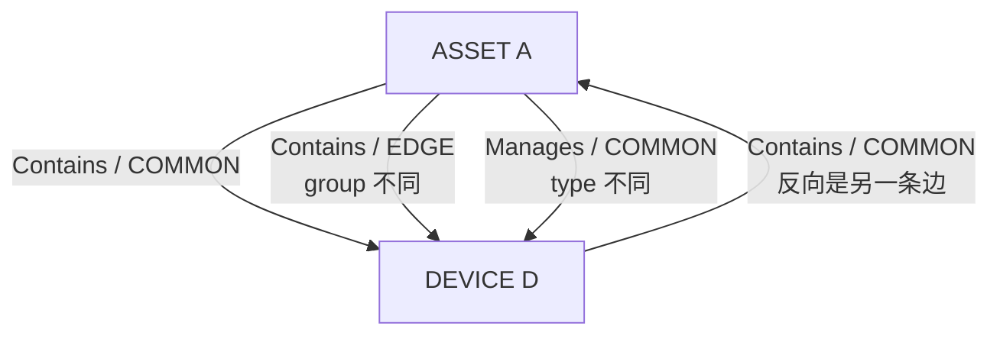
```mermaid
flowchart TB
    A["ASSET A"] -->|"Contains / COMMON"| D["DEVICE D"]
    D -->|"Contains / COMMON<br/>反向是另一条边"| A
    A -->|"Contains / EDGE<br/>group 不同"| D
    A -->|"Manages / COMMON<br/>type 不同"| D
```

关系域模型见 [org.thingsboard.server.common.data.relation.EntityRelation](../../../common/data/src/main/java/org/thingsboard/server/common/data/relation/EntityRelation.java#L40)，字段在 [EntityRelation.java#L60](../../../common/data/src/main/java/org/thingsboard/server/common/data/relation/EntityRelation.java#L60)；group 枚举见 [org.thingsboard.server.common.data.relation.RelationTypeGroup](../../../common/data/src/main/java/org/thingsboard/server/common/data/relation/RelationTypeGroup.java#L27)。`additionalInfo` 不参与唯一性，所以重复创建是 upsert，不是第二条边。

---

## 二、入口

### 2.1 REST 路由全景

入口类是 [org.thingsboard.server.controller.EntityRelationController](../../../application/src/main/java/org/thingsboard/server/controller/EntityRelationController.java#L66)，类级路径为 `/api`。以下签名均按基线源码完整列出；注解中的 `params` 决定同一路径如何分派重载方法。

| HTTP | 完整方法签名与源码 | 作用 |
|---|---|---|
| `POST /api/relation` | [`org.thingsboard.server.controller.EntityRelationController.saveRelation(EntityRelation relation) throws ThingsboardException`](../../../application/src/main/java/org/thingsboard/server/controller/EntityRelationController.java#L110) | 创建或更新边 |
| `DELETE /api/relation` | [`org.thingsboard.server.controller.EntityRelationController.deleteRelation(String strFromId, String strFromType, String strRelationType, String strRelationTypeGroup, String strToId, String strToType) throws ThingsboardException`](../../../application/src/main/java/org/thingsboard/server/controller/EntityRelationController.java#L137) | 按完整键删除一条边 |
| `DELETE /api/relations` | [`org.thingsboard.server.controller.EntityRelationController.deleteRelations(String strId, String strType) throws ThingsboardException`](../../../application/src/main/java/org/thingsboard/server/controller/EntityRelationController.java#L173) | 删除实体两方向的 `COMMON` 边 |
| `GET /api/relation` | [`org.thingsboard.server.controller.EntityRelationController.getRelation(String strFromId, String strFromType, String strRelationType, String strRelationTypeGroup, String strToId, String strToType) throws ThingsboardException`](../../../application/src/main/java/org/thingsboard/server/controller/EntityRelationController.java#L198) | 精确读取一条边 |
| `GET /api/relations?fromId&fromType` | [`org.thingsboard.server.controller.EntityRelationController.findByFrom(String strFromId, String strFromType, String strRelationTypeGroup) throws ThingsboardException`](../../../application/src/main/java/org/thingsboard/server/controller/EntityRelationController.java#L234) | 查出边 |
| `GET /api/relations?fromId&fromType&relationType` | [`org.thingsboard.server.controller.EntityRelationController.findByFrom(String strFromId, String strFromType, String strRelationType, String strRelationTypeGroup) throws ThingsboardException`](../../../application/src/main/java/org/thingsboard/server/controller/EntityRelationController.java#L292) | 按 type 查出边 |
| `GET /api/relations?toId&toType` | [`org.thingsboard.server.controller.EntityRelationController.findByTo(String strToId, String strToType, String strRelationTypeGroup) throws ThingsboardException`](../../../application/src/main/java/org/thingsboard/server/controller/EntityRelationController.java#L323) | 查入边 |
| `GET /api/relations?toId&toType&relationType` | [`org.thingsboard.server.controller.EntityRelationController.findByTo(String strToId, String strToType, String strRelationType, String strRelationTypeGroup) throws ThingsboardException`](../../../application/src/main/java/org/thingsboard/server/controller/EntityRelationController.java#L381) | 按 type 查入边 |
| `GET /api/relations/info` | [`org.thingsboard.server.controller.EntityRelationController.findInfoByFrom(String strFromId, String strFromType, String strRelationTypeGroup) throws ThingsboardException, ExecutionException, InterruptedException`](../../../application/src/main/java/org/thingsboard/server/controller/EntityRelationController.java#L263) / [`org.thingsboard.server.controller.EntityRelationController.findInfoByTo(String strToId, String strToType, String strRelationTypeGroup) throws ThingsboardException, ExecutionException, InterruptedException`](../../../application/src/main/java/org/thingsboard/server/controller/EntityRelationController.java#L352) | 单层边加对端名称 |
| `POST /api/relations` | [`org.thingsboard.server.controller.EntityRelationController.findByQuery(EntityRelationsQuery query) throws ThingsboardException, ExecutionException, InterruptedException`](../../../application/src/main/java/org/thingsboard/server/controller/EntityRelationController.java#L409) | Java BFS 递归查边 |
| `POST /api/relations/info` | [`org.thingsboard.server.controller.EntityRelationController.findInfoByQuery(EntityRelationsQuery query) throws ThingsboardException, ExecutionException, InterruptedException`](../../../application/src/main/java/org/thingsboard/server/controller/EntityRelationController.java#L432) | Java BFS 后补名称 |

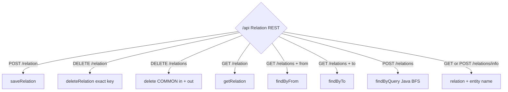
```mermaid
flowchart TB
    R{"/api Relation REST"}
    R -->|"POST /relation"| CREATE["saveRelation"]
    R -->|"DELETE /relation"| DELETE["deleteRelation exact key"]
    R -->|"DELETE /relations"| DELETEALL["delete COMMON in + out"]
    R -->|"GET /relation"| GET["getRelation"]
    R -->|"GET /relations + from"| FROM["findByFrom"]
    R -->|"GET /relations + to"| TO["findByTo"]
    R -->|"POST /relations"| BFS["findByQuery Java BFS"]
    R -->|"GET or POST /relations/info"| INFO["relation + entity name"]
```

### 2.2 参数、group 回退与权限

写入时，[`org.thingsboard.server.controller.EntityRelationController.checkCanCreateRelation(EntityId entityId) throws ThingsboardException`](../../../application/src/main/java/org/thingsboard/server/controller/EntityRelationController.java#L447) 对两个端点执行写权限检查，Tenant Admin 与自身 TenantId 建边是特例。查询参数由 [`org.thingsboard.server.controller.EntityRelationController.parseRelationTypeGroup(String strRelationTypeGroup, RelationTypeGroup defaultValue)`](../../../application/src/main/java/org/thingsboard/server/controller/EntityRelationController.java#L484) 解析；`IllegalArgumentException` 的 catch 为空，因此 `foo` 不会返回 400，而会按 `COMMON` 继续。

列表和递归结果由 [`org.thingsboard.server.controller.EntityRelationController.filterRelationsByReadPermission(List<T> relationsByQuery)`](../../../application/src/main/java/org/thingsboard/server/controller/EntityRelationController.java#L461) 检查每条边的 `to` 与 `from`。任一端无读权限时该边被静默丢弃，不向客户端解释缺失原因；这与精确 `GET /relation` 对两个端点直接 `checkEntityId` 的行为不同。

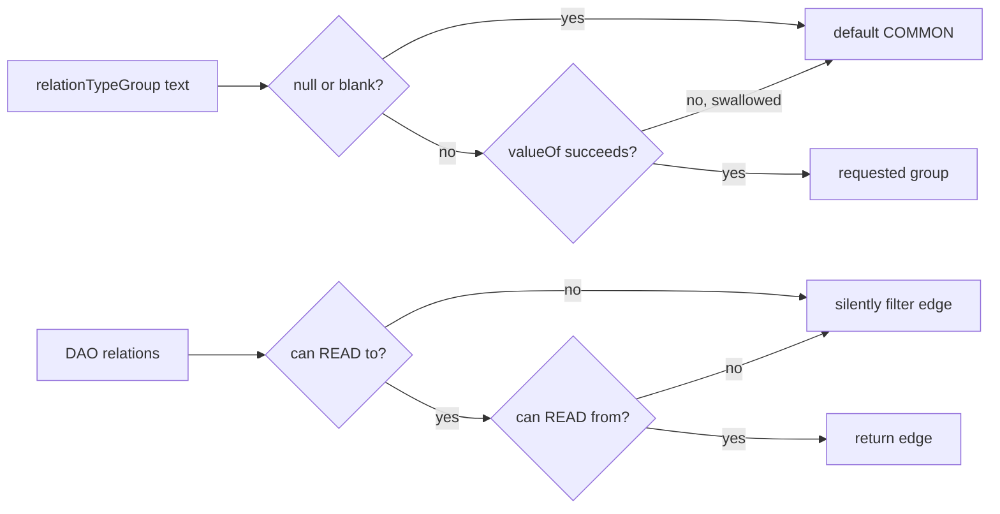
```mermaid
flowchart LR
    PARAM["relationTypeGroup text"] --> EMPTY{"null or blank?"}
    EMPTY -->|yes| COMMON["default COMMON"]
    EMPTY -->|no| ENUM{"valueOf succeeds?"}
    ENUM -->|yes| VALUE["requested group"]
    ENUM -->|no, swallowed| COMMON
    QUERY["DAO relations"] --> P1{"can READ to?"}
    P1 -->|no| DROP["silently filter edge"]
    P1 -->|yes| P2{"can READ from?"}
    P2 -->|no| DROP
    P2 -->|yes| KEEP["return edge"]
```

### 2.3 查询对象

[`org.thingsboard.server.common.data.relation.EntityRelationsQuery`](../../../common/data/src/main/java/org/thingsboard/server/common/data/relation/EntityRelationsQuery.java#L38) 只有 `parameters` 与 `filters`。[`org.thingsboard.server.common.data.relation.RelationsSearchParameters.RelationsSearchParameters(EntityId entityId, EntitySearchDirection direction, int maxLevel, RelationTypeGroup relationTypeGroup, boolean fetchLastLevelOnly)`](../../../common/data/src/main/java/org/thingsboard/server/common/data/relation/RelationsSearchParameters.java#L100) 定义根、方向、group、层数和末层模式；[`org.thingsboard.server.common.data.relation.RelationEntityTypeFilter`](../../../common/data/src/main/java/org/thingsboard/server/common/data/relation/RelationEntityTypeFilter.java#L41) 由 Lombok `@AllArgsConstructor` 生成 `(String relationType, List<EntityType> entityTypes)` 构造器，是 OR 组合的结果过滤器。

---

## 三、完整调用链

### 3.1 创建与 upsert

REST 写入口调用返回 `void` 的应用包装层 [`org.thingsboard.server.service.entitiy.entity.relation.DefaultTbEntityRelationService.save(TenantId tenantId, CustomerId customerId, EntityRelation relation, User user) throws ThingsboardException`](../../../application/src/main/java/org/thingsboard/server/service/entitiy/entity/relation/DefaultTbEntityRelationService.java#L63)。包装层调用 RelationService 后记录关系 action；真正落库由 [`org.thingsboard.server.dao.relation.BaseRelationService.saveRelation(TenantId tenantId, EntityRelation relation)`](../../../dao/src/main/java/org/thingsboard/server/dao/relation/BaseRelationService.java#L242) 编排，再进入 [`org.thingsboard.server.dao.sql.relation.JpaRelationDao.saveRelation(TenantId tenantId, EntityRelation relation)`](../../../dao/src/main/java/org/thingsboard/server/dao/sql/relation/JpaRelationDao.java#L256)。DAO/RelationService 的 boolean 最终被应用包装层忽略，Controller 返回 HTTP 200 空响应。

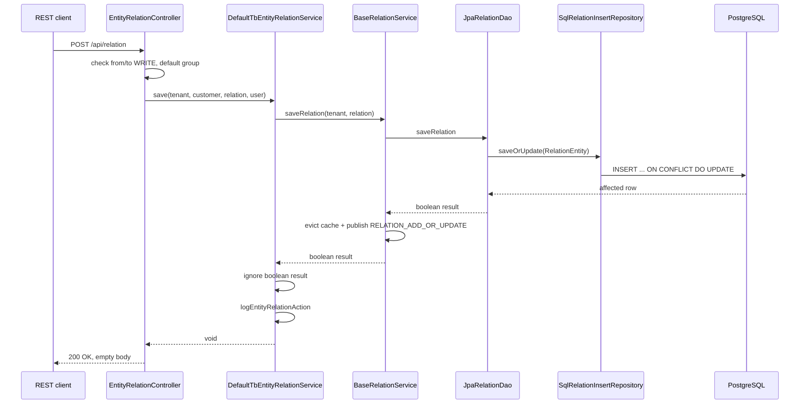
```mermaid
sequenceDiagram
    participant C as REST client
    participant RC as EntityRelationController
    participant TS as DefaultTbEntityRelationService
    participant RS as BaseRelationService
    participant DAO as JpaRelationDao
    participant SQL as SqlRelationInsertRepository
    participant PG as PostgreSQL
    C->>RC: POST /api/relation
    RC->>RC: check from/to WRITE, default group
    RC->>TS: save(tenant, customer, relation, user)
    TS->>RS: saveRelation(tenant, relation)
    RS->>DAO: saveRelation
    DAO->>SQL: saveOrUpdate(RelationEntity)
    SQL->>PG: INSERT ... ON CONFLICT DO UPDATE
    PG-->>DAO: affected row
    DAO-->>RS: boolean result
    RS->>RS: evict cache + publish RELATION_ADD_OR_UPDATE
    RS-->>TS: boolean result
    TS->>TS: ignore boolean result
    TS->>TS: logEntityRelationAction
    TS-->>RC: void
    RC-->>C: 200 OK, empty body
```

[`org.thingsboard.server.dao.sql.relation.SqlRelationInsertRepository.saveOrUpdate(RelationEntity entity)`](../../../dao/src/main/java/org/thingsboard/server/dao/sql/relation/SqlRelationInsertRepository.java#L97) 使用的 SQL 常量位于 [SqlRelationInsertRepository.java#L46](../../../dao/src/main/java/org/thingsboard/server/dao/sql/relation/SqlRelationInsertRepository.java#L46)。冲突列与主键一致，更新列只有 `additional_info`。成功保存发布 `RELATION_ADD_OR_UPDATE`，精确删除发布 `RELATION_DELETED`。Controller 的 save 方法返回 `void`，所以 HTTP 200 是空响应，也不能区分 insert 与 update。

### 3.2 精确删除、整实体删除与 TOCTOU

REST 精确删除进入 [`org.thingsboard.server.service.entitiy.entity.relation.DefaultTbEntityRelationService.delete(TenantId tenantId, CustomerId customerId, EntityRelation relation, User user) throws ThingsboardException`](../../../application/src/main/java/org/thingsboard/server/service/entitiy/entity/relation/DefaultTbEntityRelationService.java#L86)。服务根据 RelationService 的布尔值把“不存在”转换成 `ITEM_NOT_FOUND`。

DAO 的 [`org.thingsboard.server.dao.sql.relation.JpaRelationDao.deleteRelation(TenantId tenantId, EntityRelation relation)`](../../../dao/src/main/java/org/thingsboard/server/dao/sql/relation/JpaRelationDao.java#L293) 最终进入 [`org.thingsboard.server.dao.sql.relation.JpaRelationDao.deleteRelationIfExists(RelationCompositeKey key)`](../../../dao/src/main/java/org/thingsboard/server/dao/sql/relation/JpaRelationDao.java#L351)：先 `existsById`，再 `deleteById`。这是典型 TOCTOU 窗口；并发删除者可能在两步之间改变记录，catch 后返回的仍是删除前的 `relationExistsBeforeDelete`。

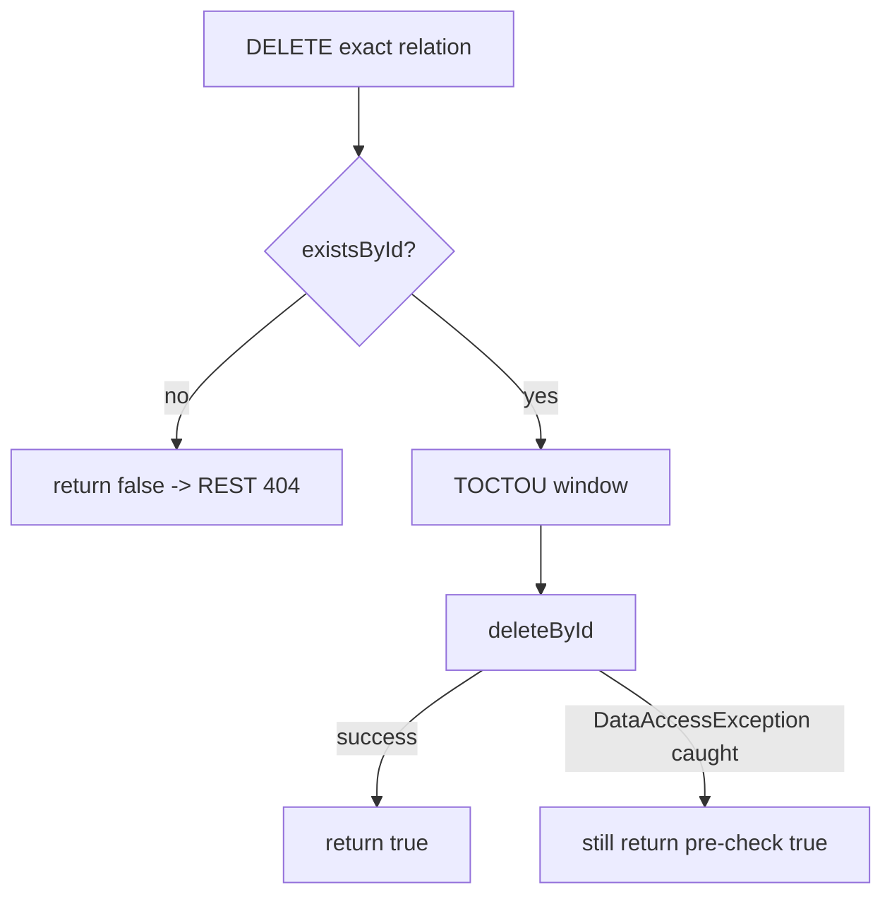
```mermaid
flowchart TB
    DEL["DELETE exact relation"] --> EXISTS{"existsById?"}
    EXISTS -->|no| FALSE["return false -> REST 404"]
    EXISTS -->|yes| GAP["TOCTOU window"]
    GAP --> DBDEL["deleteById"]
    DBDEL -->|success| TRUE["return true"]
    DBDEL -->|DataAccessException caught| ALSO["still return pre-check true"]
```

`DELETE /api/relations` 只删除 `COMMON`。实体服务内部删除则调用 [`org.thingsboard.server.dao.relation.BaseRelationService.deleteEntityRelations(TenantId tenantId, EntityId entityId)`](../../../dao/src/main/java/org/thingsboard/server/dao/relation/BaseRelationService.java#L393)，先查入边和出边，再分方向批量删除并逐边发缓存失效事件；这些路径不逐边发布 `RelationActionEvent`。它是源码显式联动，不是数据库 FK cascade。

### 3.3 读取、方向与 info

精确读取 [`org.thingsboard.server.dao.relation.BaseRelationService.getRelation(TenantId tenantId, EntityId from, EntityId to, String relationType, RelationTypeGroup typeGroup)`](../../../dao/src/main/java/org/thingsboard/server/dao/relation/BaseRelationService.java#L221) 走单值缓存。Controller 在查询前已分别检查 from/to 的 READ 权限，取得精确结果后直接返回，不再调用列表用的逐边权限后过滤。方向读取分别是 [`org.thingsboard.server.dao.relation.BaseRelationService.findByFrom(TenantId tenantId, EntityId from, RelationTypeGroup typeGroup)`](../../../dao/src/main/java/org/thingsboard/server/dao/relation/BaseRelationService.java#L491) 和 [`org.thingsboard.server.dao.relation.BaseRelationService.findByTo(TenantId tenantId, EntityId to, RelationTypeGroup typeGroup)`](../../../dao/src/main/java/org/thingsboard/server/dao/relation/BaseRelationService.java#L596)，不能互换。

`info` 不是另一张表，而且 FROM/TO 路径不对称。出边 [`org.thingsboard.server.dao.relation.BaseRelationService.findInfoByFrom(TenantId tenantId, EntityId from, RelationTypeGroup typeGroup)`](../../../dao/src/main/java/org/thingsboard/server/dao/relation/BaseRelationService.java#L534) 直接把 `relationDao.findAllByFrom` 提交给 executor，绕过 relation cache，再给 `toName` 赋值；入边 [`org.thingsboard.server.dao.relation.BaseRelationService.findInfoByTo(TenantId tenantId, EntityId to, RelationTypeGroup typeGroup)`](../../../dao/src/main/java/org/thingsboard/server/dao/relation/BaseRelationService.java#L632) 先调用 `findByToAsync`，后者进入 `findByTo` 的缓存路径，再给 `fromName` 赋值。名称通过 [`org.thingsboard.server.dao.relation.BaseRelationService.fetchRelationInfoAsync(TenantId tenantId, EntityRelation relation, Function<EntityRelation, EntityId> entityIdGetter, BiConsumer<EntityRelationInfo, String> entityNameSetter)`](../../../dao/src/main/java/org/thingsboard/server/dao/relation/BaseRelationService.java#L658) 调 `EntityService.fetchEntityName`，缺失名称写成 `N/A`；Controller 随后对 info 列表逐边做端点 READ 后过滤。

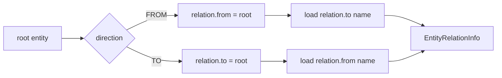
```mermaid
flowchart LR
    ROOT["root entity"] --> DIR{"direction"}
    DIR -->|FROM| OUT["relation.from = root"]
    OUT --> TONAME["load relation.to name"]
    DIR -->|TO| IN["relation.to = root"]
    IN --> FROMNAME["load relation.from name"]
    TONAME --> INFO["EntityRelationInfo"]
    FROMNAME --> INFO
```

---

## 四、消息流

### 4.1 同步与异步 save/delete

公开契约同时提供同步与 Guava Future 版本：[`org.thingsboard.server.dao.relation.RelationService.saveRelation(TenantId tenantId, EntityRelation relation)`](../../../common/dao-api/src/main/java/org/thingsboard/server/dao/relation/RelationService.java#L86)、[`org.thingsboard.server.dao.relation.RelationService.saveRelationAsync(TenantId tenantId, EntityRelation relation)`](../../../common/dao-api/src/main/java/org/thingsboard/server/dao/relation/RelationService.java#L104)、[`org.thingsboard.server.dao.relation.RelationService.deleteRelation(TenantId tenantId, EntityRelation relation)`](../../../common/dao-api/src/main/java/org/thingsboard/server/dao/relation/RelationService.java#L113) 与 [`org.thingsboard.server.dao.relation.RelationService.deleteRelationAsync(TenantId tenantId, EntityRelation relation)`](../../../common/dao-api/src/main/java/org/thingsboard/server/dao/relation/RelationService.java#L122)。

同步保存路径在 DAO 成功返回后失效缓存并发布 action event。两个同步精确删除重载则不检查 DAO 布尔结果：即使 `result == false`，仍失效缓存并发布 `RELATION_DELETED`；REST 包装层在事件发布之后才把 `false` 转成 `ITEM_NOT_FOUND`。异步路径在 [`org.thingsboard.server.dao.relation.BaseRelationService.saveRelationAsync(TenantId tenantId, EntityRelation relation)`](../../../dao/src/main/java/org/thingsboard/server/dao/relation/BaseRelationService.java#L281) 与 [`org.thingsboard.server.dao.relation.BaseRelationService.deleteRelationAsync(TenantId tenantId, EntityRelation relation)`](../../../dao/src/main/java/org/thingsboard/server/dao/relation/BaseRelationService.java#L318) 上调用 `future.addListener`，但 listener 内没有 `get()` 或 `Futures.getDone()`。

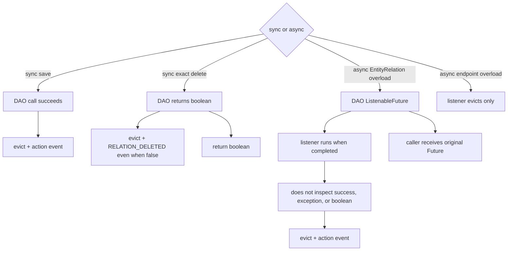
```mermaid
flowchart TB
    CALL{"sync or async"}
    CALL -->|sync save| DAO1["DAO call succeeds"]
    DAO1 --> EVENT1["evict + action event"]
    CALL -->|sync exact delete| DELBOOL["DAO returns boolean"]
    DELBOOL --> ALWAYS["evict + RELATION_DELETED even when false"]
    DELBOOL --> RESULT1["return boolean"]
    CALL -->|async EntityRelation overload| FUTURE["DAO ListenableFuture"]
    FUTURE --> DONE["listener runs when completed"]
    DONE --> NOCHECK["does not inspect success, exception, or boolean"]
    NOCHECK --> EVENT2["evict + action event"]
    FUTURE --> RESULT2["caller receives original Future"]
    CALL -->|async endpoint overload| NARROW["listener evicts only"]
```

因此异步 action event 表示“Future 已完成回调”，不严格表示“数据库成功修改”；同步精确删除的 action event 同样不证明实际删到了记录。`deleteRelationAsync(TenantId, EntityId, EntityId, String, RelationTypeGroup)` 在 [BaseRelationService.java#L362](../../../dao/src/main/java/org/thingsboard/server/dao/relation/BaseRelationService.java#L362) 更窄：listener 只失效缓存，不发布 `RelationActionEvent`，与 `EntityRelation` 重载也不对称。`TbDeleteRelationNode` 的单关系删除正是调用这个端点参数重载；整实体删除与 `DELETE /api/relations` 的批量关系删除也只逐边发布 `EntityRelationEvent` 做缓存失效，不发布逐边 `RelationActionEvent`。

### 4.2 缓存读写与失效键

[`org.thingsboard.server.dao.relation.RelationCaffeineCache`](../../../dao/src/main/java/org/thingsboard/server/dao/relation/RelationCaffeineCache.java#L35) 在 `cache.type=caffeine` 或缺省时生效；[`org.thingsboard.server.dao.relation.RelationRedisCache`](../../../dao/src/main/java/org/thingsboard/server/dao/relation/RelationRedisCache.java#L38) 在 `cache.type=redis` 时生效。两者都注册为 `RelationCache` 并使用 `CacheConstants.RELATIONS_CACHE`。

[`org.thingsboard.server.cache.TbTransactionalCache.getAndPutInTransaction(K key, Supplier<R> dbCall, Function<V,R> cacheValueToResult, Function<R,V> dbValueToCacheValue, boolean cacheNullValue)`](../../../common/cache/src/main/java/org/thingsboard/server/cache/TbTransactionalCache.java#L199) 在 `cacheNullValue=false` 且 DB 返回 `null` 时 rollback，所以精确关系不存在不会负缓存。列表 DAO 返回空 `List` 而不是 `null`，会包装为 `RelationCacheValue.relations=[]` 并提交缓存。

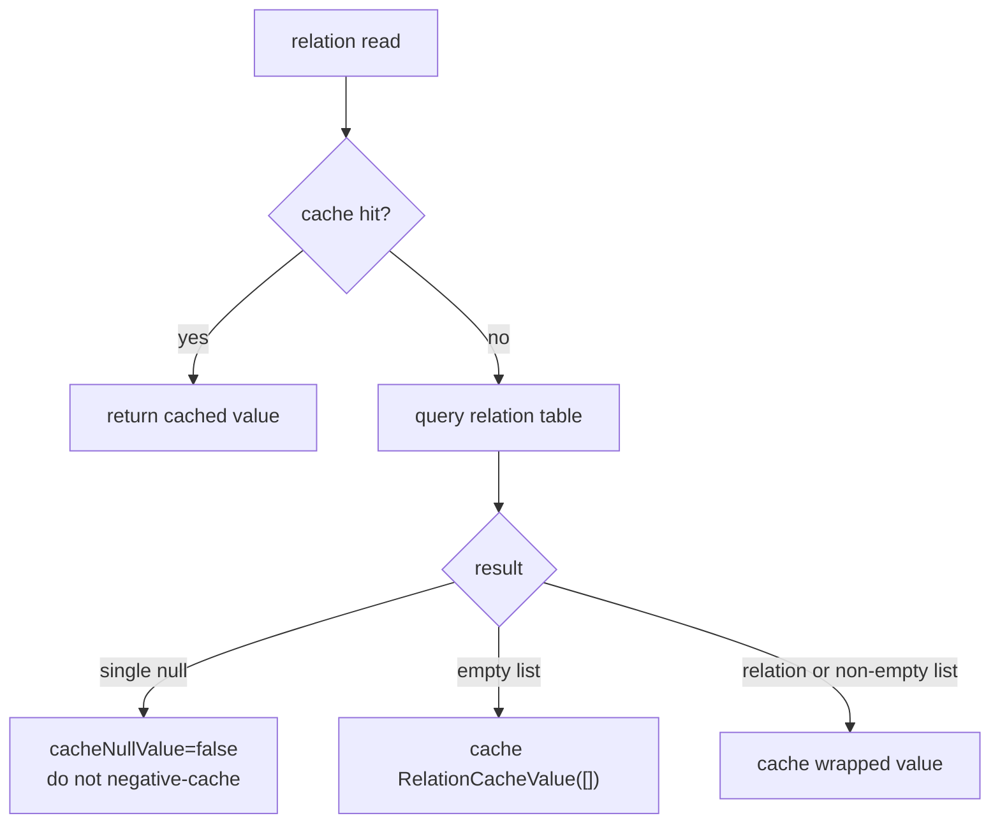
```mermaid
flowchart TB
    READ["relation read"] --> HIT{"cache hit?"}
    HIT -->|yes| RETURN["return cached value"]
    HIT -->|no| DB["query relation table"]
    DB --> KIND{"result"}
    KIND -->|"single null"| ROLLBACK["cacheNullValue=false<br/>do not negative-cache"]
    KIND -->|"empty list"| PUTEMPTY["cache RelationCacheValue([])"]
    KIND -->|"relation or non-empty list"| PUT["cache wrapped value"]
```

[`org.thingsboard.server.dao.relation.BaseRelationService.handleEvictEvent(EntityRelationEvent event)`](../../../dao/src/main/java/org/thingsboard/server/dao/relation/BaseRelationService.java#L166) 一次删除五类键：精确键、FROM typed、FROM all、TO typed、TO all。这样 upsert 的 `additionalInfo` 和方向列表不会继续读旧值。

### 4.3 事务边界：AFTER_COMMIT 与无事务

`handleEvictEvent` 上的 `@TransactionalEventListener` 未指定 phase，默认 `AFTER_COMMIT` 且默认不 fallback。为兼容无外层事务，[`org.thingsboard.server.dao.relation.BaseRelationService.publishEvictEvent(EntityRelationEvent event)`](../../../dao/src/main/java/org/thingsboard/server/dao/relation/BaseRelationService.java#L1074) 先检查 `TransactionSynchronizationManager.isActualTransactionActive()`：有事务才发布 Spring event，无事务直接调用 handler。

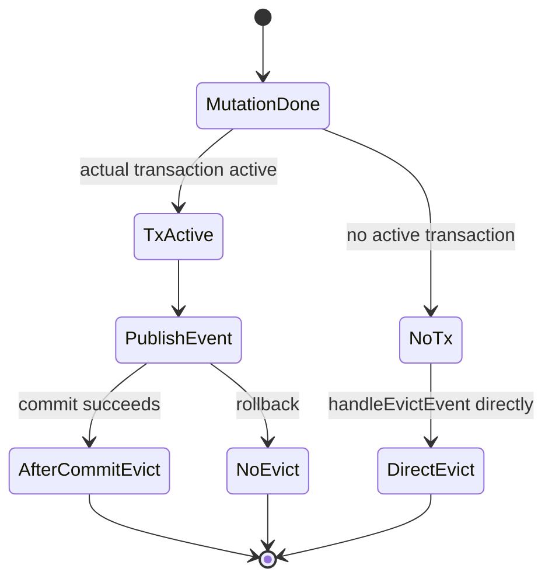
```mermaid
stateDiagram-v2
    [*] --> MutationDone
    MutationDone --> TxActive: actual transaction active
    MutationDone --> NoTx: no active transaction
    TxActive --> PublishEvent
    PublishEvent --> AfterCommitEvict: commit succeeds
    PublishEvent --> NoEvict: rollback
    NoTx --> DirectEvict: handleEvictEvent directly
    AfterCommitEvict --> [*]
    DirectEvict --> [*]
    NoEvict --> [*]
```

这套逻辑只保证本次 JVM 的缓存失效时机。Redis 是共享缓存；Caffeine 是节点本地缓存。源码中的 `EntityRelationEvent` 不是 Kafka 广播，因此多节点 Caffeine 的跨节点一致性不能由这段代码单独推出。

---

## 五、时序图

[PlantUML 源文件](sequence.puml) 与 [时序图 SVG](sequence.svg) 描述 REST 创建、事务感知缓存失效和 Edge 旁路；下面的 Mermaid 可在 Markdown 中直接渲染。

[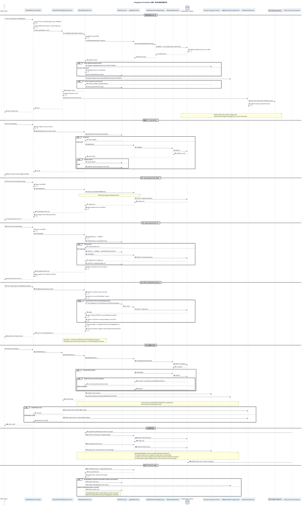](sequence.svg)

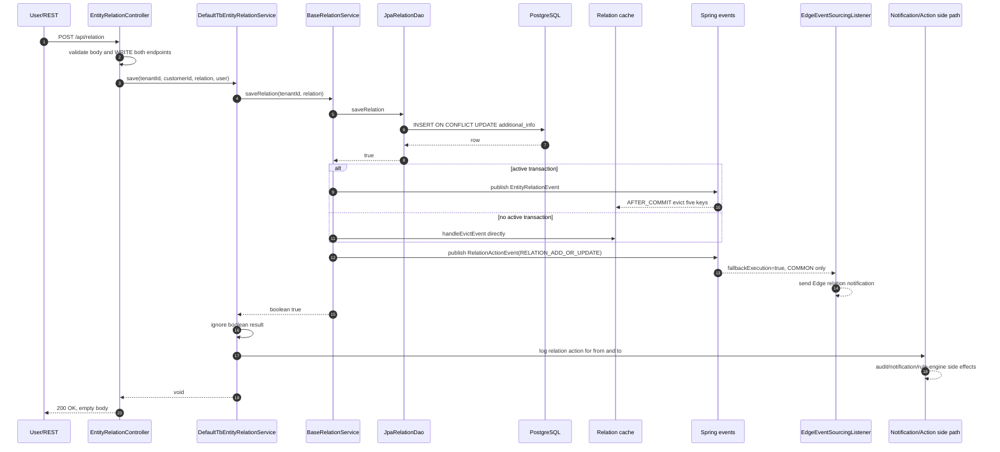
```mermaid
sequenceDiagram
    autonumber
    participant U as User/REST
    participant C as EntityRelationController
    participant A as DefaultTbEntityRelationService
    participant S as BaseRelationService
    participant D as JpaRelationDao
    participant P as PostgreSQL
    participant X as Relation cache
    participant E as Spring events
    participant G as EdgeEventSourcingListener
    participant N as Notification/Action side path
    U->>C: POST /api/relation
    C->>C: validate body and WRITE both endpoints
    C->>A: save(tenantId, customerId, relation, user)
    A->>S: saveRelation(tenantId, relation)
    S->>D: saveRelation
    D->>P: INSERT ON CONFLICT UPDATE additional_info
    P-->>D: row
    D-->>S: true
    alt active transaction
        S->>E: publish EntityRelationEvent
        E-->>X: AFTER_COMMIT evict five keys
    else no active transaction
        S->>X: handleEvictEvent directly
    end
    S->>E: publish RelationActionEvent(RELATION_ADD_OR_UPDATE)
    E-->>G: fallbackExecution=true, COMMON only
    G-->>G: send Edge relation notification
    S-->>A: boolean true
    A->>A: ignore boolean result
    A->>N: log relation action for from and to
    N-->>N: audit/notification/rule-engine side effects
    A-->>C: void
    C-->>U: 200 OK, empty body
```

注意两个事件用途不同：`EntityRelationEvent` 只携带失效缓存需要的键字段；[`org.thingsboard.server.dao.eventsourcing.RelationActionEvent`](../../../dao/src/main/java/org/thingsboard/server/dao/eventsourcing/RelationActionEvent.java#L33) 还携带 `tenantId` 和 `ActionType`，供 Edge 旁路判断操作类型。

---

## 六、数据变化

### 6.1 领域对象、复合键与 upsert

[`org.thingsboard.server.dao.model.sql.RelationEntity`](../../../dao/src/main/java/org/thingsboard/server/dao/model/sql/RelationEntity.java#L58) 使用 `@IdClass(RelationCompositeKey.class)`，六个 `@Id` 字段见 [RelationEntity.java#L63](../../../dao/src/main/java/org/thingsboard/server/dao/model/sql/RelationEntity.java#L63)。[`org.thingsboard.server.dao.model.sql.RelationCompositeKey.RelationCompositeKey(EntityRelation relation)`](../../../dao/src/main/java/org/thingsboard/server/dao/model/sql/RelationCompositeKey.java#L69) 把两个 UUID、两个实体类型、`relationType` 和 `relationTypeGroup` 固化为键。

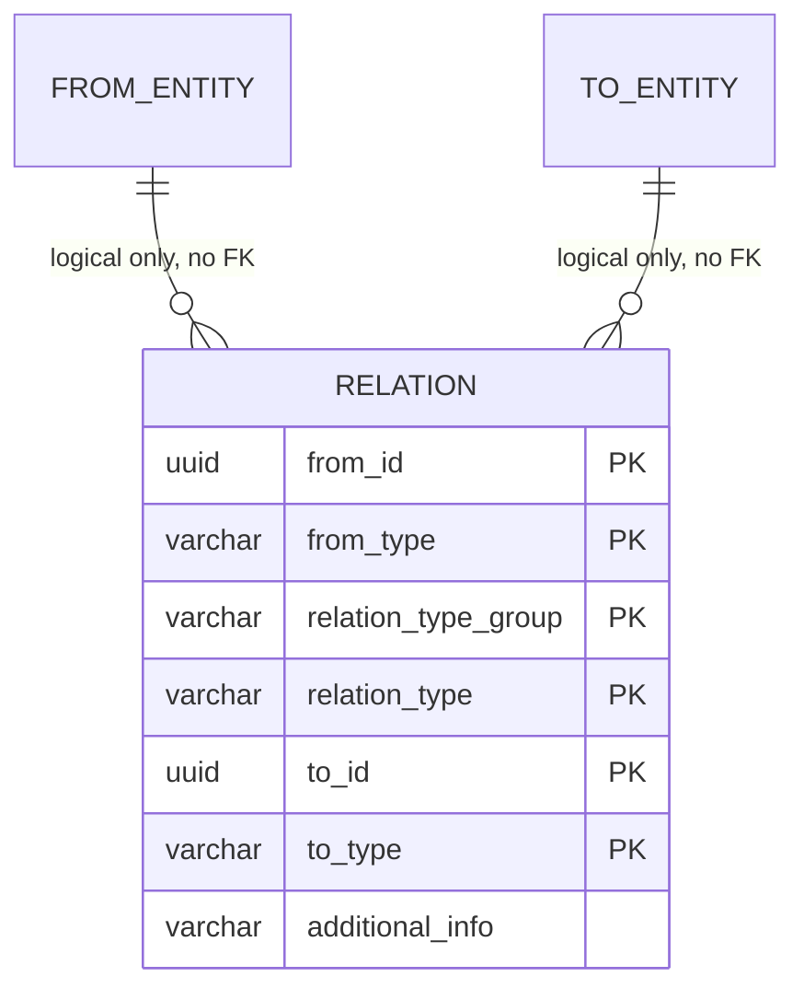
```mermaid
erDiagram
    RELATION {
        uuid from_id PK
        varchar from_type PK
        varchar relation_type_group PK
        varchar relation_type PK
        uuid to_id PK
        varchar to_type PK
        varchar additional_info
    }
    FROM_ENTITY ||--o{ RELATION : "logical only, no FK"
    TO_ENTITY ||--o{ RELATION : "logical only, no FK"
```

`tenantId` 既不在表中，也不在 [`org.thingsboard.server.dao.relation.RelationCacheKey`](../../../dao/src/main/java/org/thingsboard/server/dao/relation/RelationCacheKey.java#L41) 中。DAO 方法虽然接收 tenant，方向查询实际只使用端点 UUID/type/group。平台依赖全局 UUID 与上层权限维持隔离；任何跨租户 ID 复用或绕过上层校验的内部调用都会扩大风险。

### 6.2 Java BFS 的队列状态

[`org.thingsboard.server.dao.relation.BaseRelationService.findByQuery(TenantId tenantId, EntityRelationsQuery query)`](../../../dao/src/main/java/org/thingsboard/server/dao/relation/BaseRelationService.java#L716) 把 `maxLevel <= 0` 变成 `Integer.MAX_VALUE`，然后调用私有 [`org.thingsboard.server.dao.relation.BaseRelationService.findRelationsRecursively(TenantId tenantId, EntityId rootId, EntitySearchDirection direction, RelationTypeGroup relationTypeGroup, int lvl, boolean fetchLastLevelOnly, ConcurrentHashMap<EntityId, Boolean> uniqueMap)`](../../../dao/src/main/java/org/thingsboard/server/dao/relation/BaseRelationService.java#L1033)。队列上下文维护 `tasks`、并发 `result Set`、`uniqueMap` 和完成 Future。

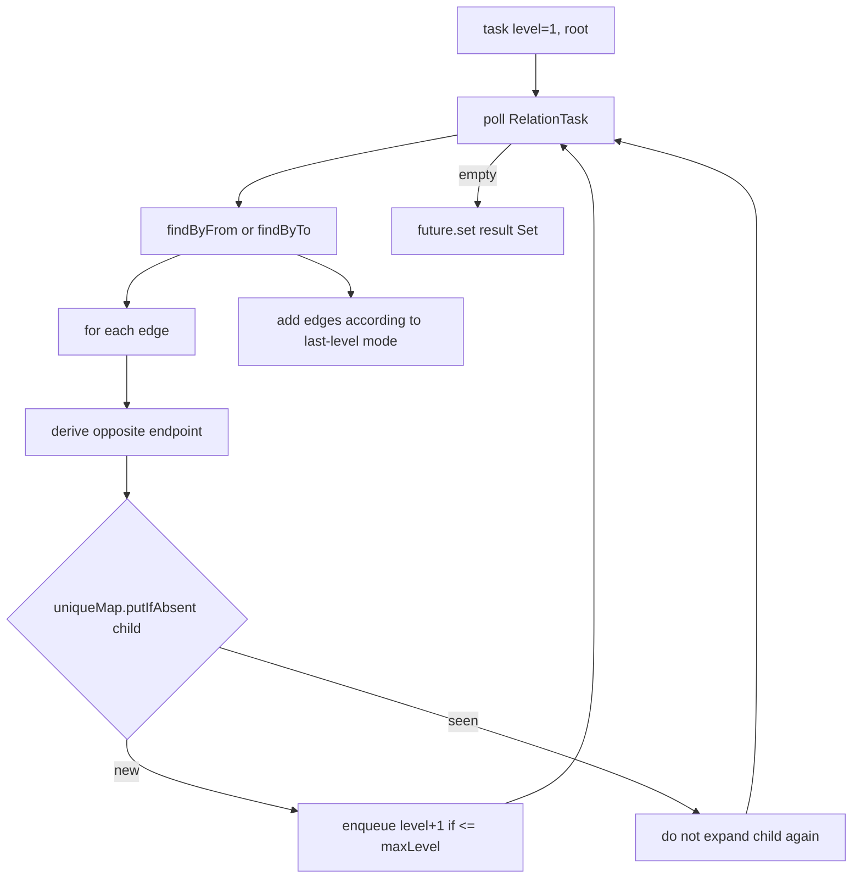
```mermaid
flowchart TB
    START["task level=1, root"] --> POLL["poll RelationTask"]
    POLL --> FETCH["findByFrom or findByTo"]
    FETCH --> EACH["for each edge"]
    EACH --> CHILD["derive opposite endpoint"]
    CHILD --> UNIQUE{"uniqueMap.putIfAbsent child"}
    UNIQUE -->|new| ENQUEUE["enqueue level+1 if <= maxLevel"]
    UNIQUE -->|seen| SKIP["do not expand child again"]
    FETCH --> RESULT["add edges according to last-level mode"]
    ENQUEUE --> POLL
    SKIP --> POLL
    POLL -->|empty| COMPLETE["future.set result Set"]
```

循环控制以“对端实体 ID”去重，不是以路径或边去重；根实体没有预先放入 `uniqueMap`，所以闭环边本身可能进入结果，根在首次回边时还可能被扩展一次，但后续对端去重与 `maxLevel` 会阻止无限排队。结果是 `Set<EntityRelation>`，不承诺 BFS 发现顺序。

### 6.3 `fetchLastLevelOnly` 与后置过滤

[`org.thingsboard.server.dao.relation.BaseRelationService.processQueue(RelationQueueCtx ctx)`](../../../dao/src/main/java/org/thingsboard/server/dao/relation/BaseRelationService.java#L984) 的末层语义不是简单的 `level == maxLevel`：达到 `maxLevel` 时加入本层边；若提前遇到叶子，则把到达该叶子的 `prevRelations` 加入结果。因此它更接近“最大深度边或提前终止的叶边”。

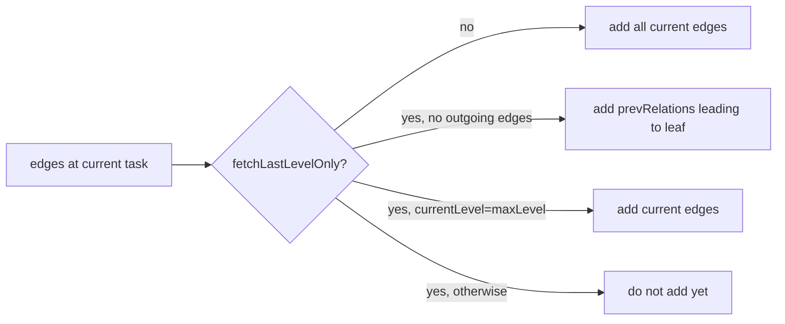
```mermaid
flowchart LR
    EDGE["edges at current task"] --> LAST{"fetchLastLevelOnly?"}
    LAST -->|no| ALL["add all current edges"]
    LAST -->|yes, no outgoing edges| LEAF["add prevRelations leading to leaf"]
    LAST -->|yes, currentLevel=maxLevel| MAX["add current edges"]
    LAST -->|yes, otherwise| NONE["do not add yet"]
```

`fetchLastLevelOnly` 的结果选取在 `processQueue` 遍历期间完成：它先把全量边、达到 maxLevel 的边或提前叶子的 `prevRelations` 放进 result Set，队列耗尽后才完成 Future。随后 `Futures.transform` 才按 relation type/entity type 做后置过滤，源码见 [BaseRelationService.java#L729](../../../dao/src/main/java/org/thingsboard/server/dao/relation/BaseRelationService.java#L729)；[`org.thingsboard.server.dao.relation.BaseRelationService.matchFilters(List<RelationEntityTypeFilter> filters, EntityRelation relation, EntitySearchDirection direction)`](../../../dao/src/main/java/org/thingsboard/server/dao/relation/BaseRelationService.java#L893) 只决定最终返回，不剪枝遍历，也不参与末层选取。于是“只返回 Device”仍会经过 Asset 中间节点；代价按完整可达子图计算，而不是按最终命中边计算。

---

## 七、源码分析

### 7.1 类型关系与职责边界

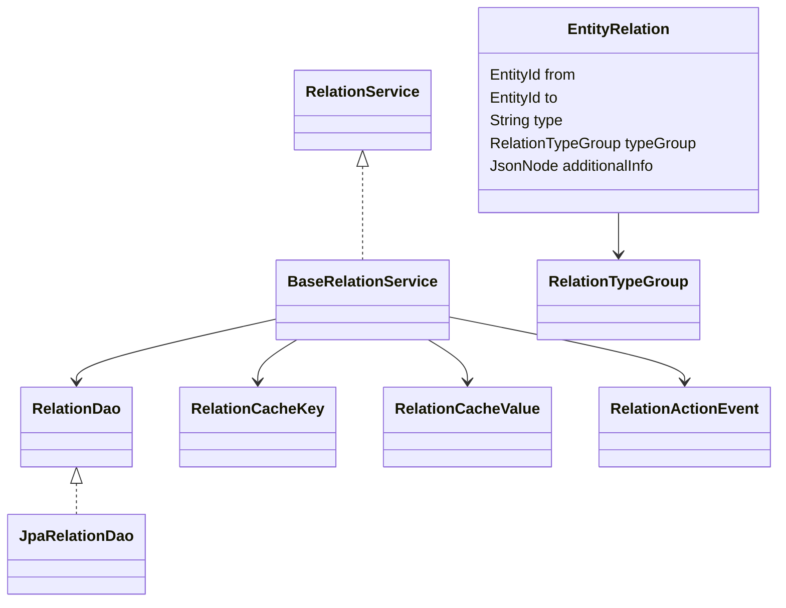
```mermaid
classDiagram
    class EntityRelation {
      EntityId from
      EntityId to
      String type
      RelationTypeGroup typeGroup
      JsonNode additionalInfo
    }
    class RelationService
    class BaseRelationService
    class RelationDao
    class JpaRelationDao
    class RelationCacheKey
    class RelationCacheValue
    class RelationActionEvent
    RelationService <|.. BaseRelationService
    RelationDao <|.. JpaRelationDao
    BaseRelationService --> RelationDao
    BaseRelationService --> RelationCacheKey
    BaseRelationService --> RelationCacheValue
    BaseRelationService --> RelationActionEvent
    EntityRelation --> RelationTypeGroup
```

Controller 负责 HTTP 参数与权限；`DefaultTbEntityRelationService` 负责 REST action 记录；`BaseRelationService` 负责校验、缓存、递归和事件；`JpaRelationDao` 负责 SQL 访问；`SqlRelationInsertRepository` 负责 PostgreSQL upsert。把 Audit、Rule Engine 或 Edge 写进 DAO 主链都会误读职责边界。

### 7.2 Caffeine/Redis、空值与无 tenant key

缓存 key 的 `equals/hashCode` 覆盖 `from, to, type, typeGroup, direction`，但没有 tenant。字符串化也只是拼这些非空字段，见 [`org.thingsboard.server.dao.relation.RelationCacheKey.toString()`](../../../dao/src/main/java/org/thingsboard/server/dao/relation/RelationCacheKey.java#L82)。精确 key 没有 direction；列表 key 只有一个端点并带 direction。

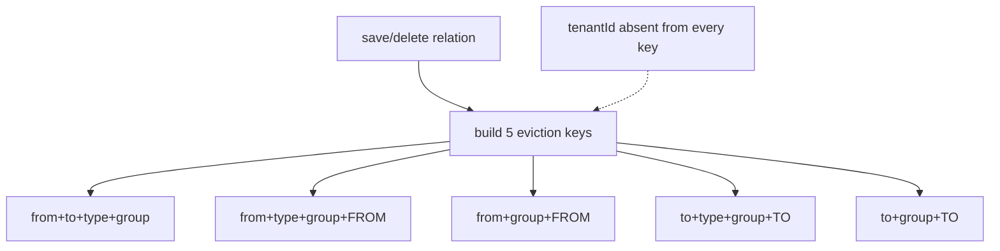
```mermaid
flowchart TB
    MUTATE["save/delete relation"] --> KEYS["build 5 eviction keys"]
    KEYS --> K1["from+to+type+group"]
    KEYS --> K2["from+type+group+FROM"]
    KEYS --> K3["from+group+FROM"]
    KEYS --> K4["to+type+group+TO"]
    KEYS --> K5["to+group+TO"]
    NOTE["tenantId absent from every key"] -.-> KEYS
```

`findInfoByFrom` 直接把 `relationDao.findAllByFrom` 提交到通用 JPA executor，绕开方向 relation cache；`findInfoByTo` 则调用 `findByToAsync`，后者再进入缓存读取路径。这种不对称会导致 info from/to 的缓存命中率和数据库压力不同。

### 7.3 BFS 线程池、超时、深度与 cycle

递归工作提交给 [`org.thingsboard.server.dao.sql.relation.JpaRelationQueryExecutorService`](../../../dao/src/main/java/org/thingsboard/server/dao/sql/relation/JpaRelationQueryExecutorService.java#L32)，`sql.relations.pool_size` 默认 4，见 [JpaRelationQueryExecutorService.java#L37](../../../dao/src/main/java/org/thingsboard/server/dao/sql/relation/JpaRelationQueryExecutorService.java#L37)。超时调度器由 [`org.thingsboard.server.dao.relation.BaseRelationService.init()`](../../../dao/src/main/java/org/thingsboard/server/dao/relation/BaseRelationService.java#L143) 创建为单线程；`sql.relations.query_timeout` 默认 20 秒，见 [BaseRelationService.java#L112](../../../dao/src/main/java/org/thingsboard/server/dao/relation/BaseRelationService.java#L112)。

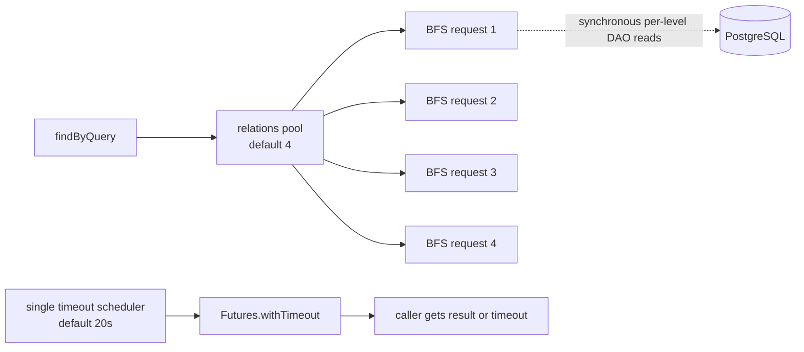
```mermaid
flowchart LR
    API["findByQuery"] --> POOL["relations pool<br/>default 4"]
    POOL --> BFS1["BFS request 1"]
    POOL --> BFS2["BFS request 2"]
    POOL --> BFS3["BFS request 3"]
    POOL --> BFS4["BFS request 4"]
    TIMER["single timeout scheduler<br/>default 20s"] --> WRAP["Futures.withTimeout"]
    WRAP --> CALLER["caller gets result or timeout"]
    BFS1 -. "synchronous per-level DAO reads" .-> PG[(PostgreSQL)]
```

超时包装的是 `relationQueueCtx.future`，不是数据库 statement timeout。请求超时后，不能仅凭这段代码断言已在执行的同步 DAO 调用立即停止。`maxLevel <= 0` 在 Java BFS 中近似“无限深”，因此稠密图会先受到 cycle 去重、线程池和超时限制，而不是合理的深度上限。

### 7.4 Asset/Device search 的转换与后过滤

[`org.thingsboard.server.common.data.asset.AssetSearchQuery.toEntitySearchQuery()`](../../../common/data/src/main/java/org/thingsboard/server/common/data/asset/AssetSearchQuery.java#L65) 只在 `relationType == null` 时补成 `Contains`，并固定 `entityTypes=[ASSET]`；[`org.thingsboard.server.common.data.device.DeviceSearchQuery.toEntitySearchQuery()`](../../../common/data/src/main/java/org/thingsboard/server/common/data/device/DeviceSearchQuery.java#L64) 同理固定 `DEVICE`。空字符串不会在转换时改写，但 [`org.thingsboard.server.dao.relation.BaseRelationService.match(RelationEntityTypeFilter filter, EntityRelation relation, EntitySearchDirection direction)`](../../../dao/src/main/java/org/thingsboard/server/dao/relation/BaseRelationService.java#L910) 用 `StringUtils.isEmpty` 判断，最终把空字符串解释为“不限制 relation type”。

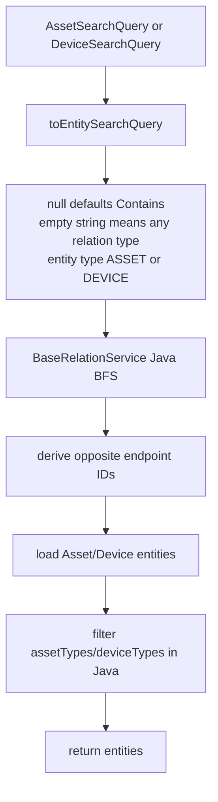
```mermaid
flowchart TB
    SEARCH["AssetSearchQuery or DeviceSearchQuery"] --> CONVERT["toEntitySearchQuery"]
    CONVERT --> FILTER["null defaults Contains<br/>empty string means any relation type<br/>entity type ASSET or DEVICE"]
    FILTER --> BFS["BaseRelationService Java BFS"]
    BFS --> IDS["derive opposite endpoint IDs"]
    IDS --> LOAD["load Asset/Device entities"]
    LOAD --> SUBTYPE["filter assetTypes/deviceTypes in Java"]
    SUBTYPE --> RESULT["return entities"]
```

[`org.thingsboard.server.dao.asset.BaseAssetService.findAssetsByQuery(TenantId tenantId, AssetSearchQuery query)`](../../../dao/src/main/java/org/thingsboard/server/dao/asset/BaseAssetService.java#L580) 用异步实体加载与 `successfulAsList`，然后按 `assetTypes` 过滤；[`org.thingsboard.server.dao.device.DeviceServiceImpl.findDevicesByQuery(TenantId tenantId, DeviceSearchQuery query)`](../../../dao/src/main/java/org/thingsboard/server/dao/device/DeviceServiceImpl.java#L725) 在 transform 中逐个同步 `findDeviceById`，再按 `deviceTypes` 过滤。两者都不是把 subtype 条件下推到 relation SQL。

### 7.5 Entity Query 的 PostgreSQL CTE 是另一条路

Entity Query 使用 [`org.thingsboard.server.common.data.query.RelationsQueryFilter`](../../../common/data/src/main/java/org/thingsboard/server/common/data/query/RelationsQueryFilter.java#L37)，支持 single root 与 multi-root。它由 [`org.thingsboard.server.dao.sql.query.DefaultEntityQueryRepository.relationQuery(QueryContext ctx, RelationsQueryFilter entityFilter)`](../../../dao/src/main/java/org/thingsboard/server/dao/sql/query/DefaultEntityQueryRepository.java#L789) 拼接 PostgreSQL CTE，不调用 `BaseRelationService.findByQuery`。

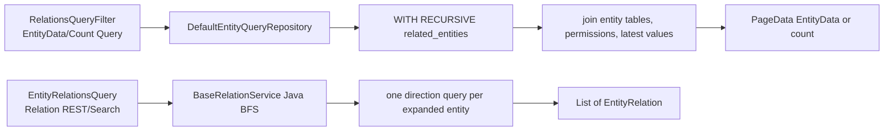
```mermaid
flowchart LR
    ERQ["EntityRelationsQuery<br/>Relation REST/Search"] --> JAVA["BaseRelationService Java BFS"]
    JAVA --> MANY["one direction query per expanded entity"]
    RQF["RelationsQueryFilter<br/>EntityData/Count Query"] --> REPO["DefaultEntityQueryRepository"]
    REPO --> CTE["WITH RECURSIVE related_entities"]
    CTE --> JOIN["join entity tables, permissions, latest values"]
    MANY --> RELS["List of EntityRelation"]
    JOIN --> DATA["PageData EntityData or count"]
```

CTE 模板见 [DefaultEntityQueryRepository.java#L282](../../../dao/src/main/java/org/thingsboard/server/dao/sql/query/DefaultEntityQueryRepository.java#L282)：递归 path 只保存 UUID，并在扩展下一条边前检查该边的 `$in_id` 是否已出现。它用于抑制无限递归，不保证结果节点不重复；闭环的 `$out_id` 仍可能进入一次结果，相同 UUID、不同实体类型也会共享同一个 path 判重空间。group 硬编码为 `COMMON`，`sql.relations.max_level` 默认 50。Java BFS 的 group 来自查询参数，默认 20 秒超时且非正深度变成 `Integer.MAX_VALUE`；两路限制和返回模型都不同，不能互相套用结论。

`fetchLastLevelOnly` 在 CTE 路径通过 `r_int.lvl = 原始请求 maxLevel OR NOT EXISTS(...)` 实现，见 [DefaultEntityQueryRepository.java#L846](../../../dao/src/main/java/org/thingsboard/server/dao/sql/query/DefaultEntityQueryRepository.java#L846)；递归深度则由 [`org.thingsboard.server.dao.sql.query.DefaultEntityQueryRepository.getMaxLevel(int maxLevel)`](../../../dao/src/main/java/org/thingsboard/server/dao/sql/query/DefaultEntityQueryRepository.java#L919) 截断到配置上限。两处不是同一个有效值：请求深度大于配置上限或非正时，截断层上仍有后继的实体不会因“到达配置上限”进入结果，只能命中 `NOT EXISTS` 分支。

---

## 八、Actor 分析

Relation REST 主链没有 actor mailbox：Controller 直接调用应用服务、RelationService、JPA/JDBC。Actor 不是事务协调者，也不负责关系表写入顺序。

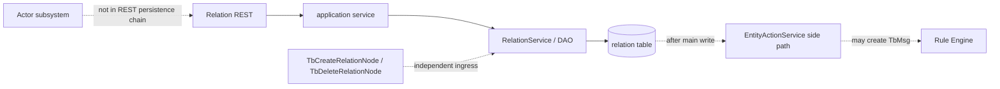
```mermaid
flowchart LR
    REST["Relation REST"] --> APP["application service"]
    APP --> DAO["RelationService / DAO"]
    DAO --> PG[(relation table)]
    PG -. "after main write" .-> AUDIT["EntityActionService side path"]
    AUDIT -. "may create TbMsg" .-> RE["Rule Engine"]
    RN["TbCreateRelationNode / TbDeleteRelationNode"] -. "independent ingress" .-> DAO
    ACTOR["Actor subsystem"] -. "not in REST persistence chain" .-> REST
```

REST 应用包装层在成功或失败后调用 [`org.thingsboard.server.service.entitiy.DefaultTbNotificationEntityService.logEntityRelationAction(TenantId tenantId, CustomerId customerId, EntityRelation relation, User user, ActionType actionType, Exception e, Object... additionalInfo)`](../../../application/src/main/java/org/thingsboard/server/service/entitiy/DefaultTbNotificationEntityService.java#L293)，分别对 from/to 记录 action。后续 [`org.thingsboard.server.service.action.EntityActionService`](../../../application/src/main/java/org/thingsboard/server/service/action/EntityActionService.java#L186) 可构造 TbMsg 并推给 Rule Engine，但这是 action 旁路；数据库 relation 写入在它之前已经发生。

反方向上，规则节点 [`org.thingsboard.rule.engine.action.TbCreateRelationNode.doProcessEntityRelationAction(TbContext ctx, TbMsg msg, EntityContainer entity, String relationType)`](../../../rule-engine/rule-engine-components/src/main/java/org/thingsboard/rule/engine/action/TbCreateRelationNode.java#L103) 可以异步检查并创建关系，`TbDeleteRelationNode` 也可删除关系。这说明 Rule Engine 是可选生产者，不说明 REST 请求必须经过 Rule Engine。

---

## 九、Kafka 分析

### 9.1 落库主链不依赖 Kafka

从 `EntityRelationController` 到 `SqlRelationInsertRepository` 没有 `TbQueue`、Kafka producer 或 consumer。单体部署与 `queue.type=in-memory` 都能完成 Relation CRUD；因此 Kafka 故障不应被当作 REST upsert SQL 失败的首要解释。

```mermaid
flowchart TB
    HTTP["HTTP request"] --> JAVA["direct Java calls"]
    JAVA --> JDBC["JPA/JDBC"]
    JDBC --> PG[(PostgreSQL)]
    PG --> RESP["HTTP response"]
    KAFKA["Kafka / TbQueue"] -. "not required here" .-> JAVA
    PG -. "later side effects may use cluster transport" .-> SIDE["Rule Engine / Edge notifications"]
```

### 9.2 Edge 的 RelationActionEvent 旁路

[`org.thingsboard.server.service.edge.EdgeEventSourcingListener.handleEvent(RelationActionEvent event)`](../../../application/src/main/java/org/thingsboard/server/service/edge/EdgeEventSourcingListener.java#L176) 使用 `@TransactionalEventListener(fallbackExecution=true)`。只有调用路径实际发布了 `RelationActionEvent`，它才可能收到关系变化；收到后会跳过空 relation 和所有非 `COMMON` group，再调用 cluster service 发送 `EdgeEventType.RELATION`。fallback 允许无事务发布时也执行；有事务时仍按提交后语义处理。

```mermaid
sequenceDiagram
    participant S as BaseRelationService
    participant E as Spring EventPublisher
    participant L as EdgeEventSourcingListener
    participant C as TbClusterService
    participant R as Edge RelationProcessor
    S->>E: RelationActionEvent(tenant, relation, action)
    E->>L: after commit or fallback without tx
    L->>L: require relation != null and group == COMMON
    L->>C: send relation edge notification
    C-->>R: RelationUpdateMsg
    R->>R: verify both endpoints on create/update
    R->>R: saveRelation or deleteRelation
```

Edge 入站由 [`org.thingsboard.server.service.edge.rpc.processor.relation.BaseRelationProcessor.processRelationMsg(TenantId tenantId, RelationUpdateMsg relationUpdateMsg)`](../../../application/src/main/java/org/thingsboard/server/service/edge/rpc/processor/relation/BaseRelationProcessor.java#L45) 处理。创建/更新要求 Edge 本地两个端点都存在，否则跳过；删除直接调用 RelationService。集群传输底层可以使用队列/Kafka，但那是 Edge 分发实现，不是中央 relation 表落库主链。

事件覆盖必须按重载区分：同步保存、批量保存完成后的逐边循环、同步精确删除，以及接收完整 `EntityRelation` 的异步 save/delete 会发布 `RelationActionEvent`；同步精确删除即使 DAO 返回 `false` 也会发布。`deleteEntityRelations`、`deleteEntityCommonRelations` 和按端点参数的 `deleteRelationAsync` 只发布或直接执行缓存失效。规则节点批量删除使用完整 `EntityRelation` 重载，而单关系删除使用按端点参数重载，因此后者不会产生 Relation Edge event。

---

## 十、数据库分析

### 10.1 表、主键、索引与无 FK

表定义在 [dao/src/main/resources/sql/schema-entities.sql#L419](../../../dao/src/main/resources/sql/schema-entities.sql#L419)。除六列主键外只有 `additional_info`，没有 `tenant_id`、创建时间、版本列和 FK。方向索引在 [schema-entities-idx.sql#L42](../../../dao/src/main/resources/sql/schema-entities-idx.sql#L42)：

```sql
CREATE INDEX IF NOT EXISTS idx_relation_to_id
ON relation(relation_type_group, to_type, to_id);

CREATE INDEX IF NOT EXISTS idx_relation_from_id
ON relation(relation_type_group, from_type, from_id);
```

```mermaid
flowchart LR
    EXACT["exact six-column key"] --> PK["relation_pkey"]
    FROM["group + from_type + from_id"] --> IFROM["idx_relation_from_id"]
    TO["group + to_type + to_id"] --> ITO["idx_relation_to_id"]
    FROMTYPE["FROM + relation_type"] --> PKFROM["use PK prefix through relation_type"]
    TOTYPE["TO + relation_type"] --> ITOCAND["use idx_relation_to_id candidates"]
    ITOCAND --> SCAN["filter relation_type"]
    TENANT["tenant predicate"] --> NONE["no tenant column/index"]
```

主键从 `from` 开始，适合精确边与出边访问；`findByFromAndType` 同时约束 `from_id, from_type, relation_type_group, relation_type`，可利用六列主键的前四列。入边依靠独立 to 索引；该索引不含 `relation_type`，所以 `findByToAndType` 才需要先按 group/to 取得候选边，再过滤 type。两个独立方向索引都把 group 放在首列，符合常见 group 查询。

### 10.2 ON CONFLICT、批次与部分成功

单条 upsert 是原子 SQL。批量入口 [`org.thingsboard.server.dao.relation.BaseRelationService.saveRelations(TenantId tenantId, List<EntityRelation> relations)`](../../../dao/src/main/java/org/thingsboard/server/dao/relation/BaseRelationService.java#L259) 先校验全部输入，再按 1024 分片调用 DAO；[`org.thingsboard.server.dao.sql.relation.JpaRelationDao.saveRelations(TenantId tenantId, Collection<EntityRelation> relations)`](../../../dao/src/main/java/org/thingsboard/server/dao/sql/relation/JpaRelationDao.java#L268) 使用 JDBC batch upsert。

```mermaid
flowchart TB
    LIST["relations list"] --> VALIDATE["validate all objects"]
    VALIDATE --> PART["partition size 1024"]
    PART --> OUTER{"outer transaction active?"}
    OUTER -->|yes| ONE["all REQUIRED batch calls join outer transaction"]
    OUTER -->|no| B1["batch 1 transaction"]
    B1 --> B2["batch 2 transaction"]
    B2 --> BN["batch N transaction"]
    ONE --> EVENTS["publish evict/action per relation"]
    BN --> EVENTS
    B2 -->|"failure without outer tx"| PARTIAL["earlier batches may already be committed<br/>later batches and events not reached"]
```

`BaseRelationService.saveRelations` 本身没有覆盖所有分片的事务注解。没有外层事务时，每次调用带默认 `REQUIRED` 的 `SqlRelationInsertRepository.saveOrUpdate` 才各自形成事务；后续分片失败时，前序 JDBC batch 可能已经提交，且逐 relation 的缓存与 action event 循环尚未开始，形成“数据库部分写入、缓存/Edge 事件未完整发出”的风险窗口。若调用方已有事务，所有分片会加入该外层事务，例如 `BaseRuleChainService.saveRuleChainMetaData` 的调用路径可统一提交或回滚。

### 10.3 实体删除显式联动

例如 [`org.thingsboard.server.dao.asset.BaseAssetService.deleteAsset(TenantId tenantId, Asset asset)`](../../../dao/src/main/java/org/thingsboard/server/dao/asset/BaseAssetService.java#L329) 在删 asset 行前调用 `relationService.deleteEntityRelations`；[`org.thingsboard.server.dao.device.DeviceServiceImpl.deleteDevice(TenantId tenantId, Device device)`](../../../dao/src/main/java/org/thingsboard/server/dao/device/DeviceServiceImpl.java#L477) 也先删 credentials 和 relations，再删 device 行。

```mermaid
sequenceDiagram
    participant ES as Asset/Device service
    participant RS as BaseRelationService
    participant RD as RelationDao
    participant ED as EntityDao
    ES->>RS: deleteEntityRelations(tenantId, entityId)
    RS->>RD: find inbound and outbound edges
    RS->>RD: delete inbound edges
    RS->>RD: delete outbound edges
    RS->>RS: publish cache evictions per captured edge
    ES->>ED: remove entity row
```

没有 FK 意味着任何未调用这段显式联动的删除路径、内部错误调用或数据库手工操作都可能留下孤儿边。`deleteEntityRelations` 的入边删除捕获 `ConcurrencyFailureException` 后，Java 控制流会继续按删除前快照调用事件发布并处理出边；但该方法及底层 repository 删除都处于 Spring 事务中，异常经过事务代理后可能把事务标记为 rollback-only，并在提交时整体失败。源码不能据此断言“实体行已经提交删除而入边残留”；必须结合最终事务结果和数据库事实判断。

---

## 十一、异常处理

### 11.1 失败与风险矩阵

| 风险 | 源码行为 | 可见后果 |
|---|---|---|
| 非法 group | `valueOf` 异常被空 catch 吞掉并回退 `COMMON` | 客户端以为查/删指定 group，实际操作 COMMON |
| 权限静默过滤 | 逐边读检查失败返回 `false` | 列表 200 但少边，无法区分不存在与无权限 |
| 单值不负缓存 | `cacheNullValue=false` | 高频查询不存在关系持续打 DB |
| 空列表缓存 | 空 `List` 被正常缓存 | 降低空查 DB 压力，但依赖每次写正确失效 |
| cache key 无 tenant | key 只含端点/type/group/direction | 隔离依赖 UUID 与上层校验 |
| EntityRelation 异步重载 listener 不查结果 | listener 仅等待完成，不读取 Future | 失败 Future 也可能失效缓存/发布 Edge action |
| sync delete 不查布尔结果再发事件 | DAO 返回 `false` 后仍失效并发布 `RELATION_DELETED` | REST 可能最终 404，但 Edge 删除事件已发布 |
| 删除入口的事件覆盖不同 | 整实体/批量/端点异步删除只发缓存事件 | 不能把所有 RelationService 删除都视为 Edge relation event 来源 |
| 删除 TOCTOU | `existsById` 后 `deleteById` | 返回值可能与最终删除事实不一致 |
| 批次部分成功 | 1024 分片且没有外层事务 | 前批已写、后批失败、事件循环未执行；有外层事务时分片加入同一事务 |
| BFS 后置过滤 | 完整遍历后才 filter | 返回很少也可能产生大规模 DB fan-out |
| maxLevel 非正 | Java BFS 使用 `Integer.MAX_VALUE` | 稠密图依赖超时兜底 |
| cycle | child ID 去重，root 未预置 | 有界但闭环边可能返回，root 可能再展开一次 |
| 无 FK | 删除靠每个实体服务显式调用 | 漏调或手工删实体产生孤儿边 |
| 入边并发删除异常 | catch 后继续执行 Java 语句 | 事务可能已 rollback-only，不能仅凭 catch 推断最终提交状态 |

```mermaid
flowchart TB
    SYMPTOM{"observed symptom"}
    SYMPTOM -->|"missing edge in REST list"| PERM["check root and both endpoint READ permissions"]
    SYMPTOM -->|"wrong group affected"| GROUP["inspect invalid/blank group fallback"]
    SYMPTOM -->|"stale edge"| CACHE["inspect five cache keys and transaction timing"]
    SYMPTOM -->|"timeout"| BFS["inspect maxLevel, fan-out, cycles, pool=4"]
    SYMPTOM -->|"orphan edge"| DELETE["inspect explicit entity deletion linkage"]
    SYMPTOM -->|"Edge mismatch"| FUTURE["inspect overload, Future/boolean result and COMMON-only event filter"]
```

### 11.2 BFS 超时与资源边界

Controller 对 `findByQuery(...).get()` 阻塞等待；BFS 的 `Futures.withTimeout` 默认 20 秒失败。每扩展一个实体都会执行一次方向 DAO 查询，Caffeine/Redis 命中可以减少 SQL，但首次遍历的复杂度仍取决于可达节点与出/入度。四线程池是全局共享资源，多个大图请求会互相排队。

```mermaid
flowchart LR
    R1["large query A"] --> P["relations pool size 4"]
    R2["large query B"] --> P
    R3["large query C"] --> P
    R4["large query D"] --> P
    R5["query E waits"] --> P
    P --> DB[("many directional selects")]
    T["20s Future timeout"] --> CLIENT["REST exception"]
    DB -. "work cancellation not guaranteed by wrapper alone" .-> T
```

### 11.3 一致性边界

upsert SQL 自身原子，但“数据库写入、缓存失效、Edge event、Audit/Rule Engine action”不是一个可证明的 exactly-once 分布式事务。异步 listener 不检查 Future 状态；同步精确删除也不根据布尔结果决定是否发删除事件；没有外层事务时，批量分片又可能部分提交。排障时必须分别确认数据库事实、缓存事实、事务最终状态和旁路投递，不能用某一侧日志替代另一侧证据。

### 11.4 建议的排障顺序

1. 用六列复合键直接确认 `relation` 行和 `additional_info`。
2. 确认方向、`type`、`typeGroup`，尤其检查非法 group 是否回退 `COMMON`。
3. 确认根实体和每条边两个端点的读权限，解释 REST 静默过滤。
4. 检查 Caffeine/Redis 的精确键及四个方向键是否已失效。
5. 递归问题检查 `maxLevel`、`fetchLastLevelOnly`、cycle、可达图规模、线程池和 20 秒超时。
6. Asset/Device search 再检查实体是否存在及 subtype 后过滤。
7. Entity Query 问题转到 CTE SQL，不要继续追 Java BFS。
8. Edge 不一致检查 group 是否 `COMMON`、调用重载是否会发布 `RelationActionEvent`、Future/布尔结果、listener 是否执行和端点是否已同步到 Edge。
9. 删除后孤儿边检查对应实体服务是否显式调用 `deleteEntityRelations`、入边删除是否发生并发异常，以及包含实体删除在内的外层事务最终是提交还是回滚。

---

## 十二、源码阅读路线

```mermaid
flowchart LR
    S1["1 Controller routes and permissions"] --> S2["2 EntityRelation and query DTOs"]
    S2 --> S3["3 BaseRelationService CRUD/cache"]
    S3 --> S4["4 JpaRelationDao and upsert SQL"]
    S4 --> S5["5 Java BFS queue"]
    S5 --> S6["6 Asset/Device conversion"]
    S6 --> S7["7 Entity Query recursive CTE"]
    S7 --> S8["8 explicit entity deletion"]
    S8 --> S9["9 Edge and audit side paths"]
```

建议按下面顺序阅读，每一步都先核对签名，再进入调用者：

1. [`org.thingsboard.server.controller.EntityRelationController.saveRelation(EntityRelation relation)`](../../../application/src/main/java/org/thingsboard/server/controller/EntityRelationController.java#L110)：看写权限与默认 group。
2. [`org.thingsboard.server.controller.EntityRelationController.findByQuery(EntityRelationsQuery query)`](../../../application/src/main/java/org/thingsboard/server/controller/EntityRelationController.java#L409)：看 root 权限、阻塞 Future 与结果过滤。
3. [`org.thingsboard.server.controller.EntityRelationController.filterRelationsByReadPermission(List<T> relationsByQuery)`](../../../application/src/main/java/org/thingsboard/server/controller/EntityRelationController.java#L461)：确认权限静默过滤。
4. [`org.thingsboard.server.common.data.relation.EntityRelation.EntityRelation(EntityId from, EntityId to, String type, RelationTypeGroup typeGroup, JsonNode additionalInfo)`](../../../common/data/src/main/java/org/thingsboard/server/common/data/relation/EntityRelation.java#L122)：固定有向边字段。
5. [`org.thingsboard.server.dao.relation.BaseRelationService.saveRelation(TenantId tenantId, EntityRelation relation)`](../../../dao/src/main/java/org/thingsboard/server/dao/relation/BaseRelationService.java#L242)：看同步保存、失效和 action event。
6. [`org.thingsboard.server.dao.relation.BaseRelationService.saveRelationAsync(TenantId tenantId, EntityRelation relation)`](../../../dao/src/main/java/org/thingsboard/server/dao/relation/BaseRelationService.java#L281)：确认 listener 未检查 Future 结果。
7. [`org.thingsboard.server.dao.relation.BaseRelationService.handleEvictEvent(EntityRelationEvent event)`](../../../dao/src/main/java/org/thingsboard/server/dao/relation/BaseRelationService.java#L166)：列出五个缓存键。
8. [`org.thingsboard.server.dao.relation.BaseRelationService.getRelation(TenantId tenantId, EntityId from, EntityId to, String relationType, RelationTypeGroup typeGroup)`](../../../dao/src/main/java/org/thingsboard/server/dao/relation/BaseRelationService.java#L221)：核对 single null 不负缓存。
9. [`org.thingsboard.server.dao.relation.BaseRelationService.findByFrom(TenantId tenantId, EntityId from, RelationTypeGroup typeGroup)`](../../../dao/src/main/java/org/thingsboard/server/dao/relation/BaseRelationService.java#L491)：核对空列表缓存。
10. [`org.thingsboard.server.dao.sql.relation.JpaRelationDao.saveRelation(TenantId tenantId, EntityRelation relation)`](../../../dao/src/main/java/org/thingsboard/server/dao/sql/relation/JpaRelationDao.java#L256)：进入 JDBC upsert。
11. [`org.thingsboard.server.dao.sql.relation.SqlRelationInsertRepository.saveOrUpdate(RelationEntity entity)`](../../../dao/src/main/java/org/thingsboard/server/dao/sql/relation/SqlRelationInsertRepository.java#L97)：核对冲突列与更新列。
12. [`org.thingsboard.server.dao.sql.relation.JpaRelationDao.deleteRelationIfExists(RelationCompositeKey key)`](../../../dao/src/main/java/org/thingsboard/server/dao/sql/relation/JpaRelationDao.java#L351)：观察 TOCTOU。
13. [`org.thingsboard.server.dao.relation.BaseRelationService.findByQuery(TenantId tenantId, EntityRelationsQuery query)`](../../../dao/src/main/java/org/thingsboard/server/dao/relation/BaseRelationService.java#L716)：看 maxLevel 与后置过滤。
14. [`org.thingsboard.server.dao.relation.BaseRelationService.processQueue(RelationQueueCtx ctx)`](../../../dao/src/main/java/org/thingsboard/server/dao/relation/BaseRelationService.java#L984)：逐行模拟 BFS、cycle 与末层模式。
15. [`org.thingsboard.server.dao.asset.BaseAssetService.findAssetsByQuery(TenantId tenantId, AssetSearchQuery query)`](../../../dao/src/main/java/org/thingsboard/server/dao/asset/BaseAssetService.java#L580)：看 subtype 后过滤。
16. [`org.thingsboard.server.dao.device.DeviceServiceImpl.findDevicesByQuery(TenantId tenantId, DeviceSearchQuery query)`](../../../dao/src/main/java/org/thingsboard/server/dao/device/DeviceServiceImpl.java#L725)：对照同步逐设备加载。
17. [`org.thingsboard.server.dao.sql.query.DefaultEntityQueryRepository.relationQuery(QueryContext ctx, RelationsQueryFilter entityFilter)`](../../../dao/src/main/java/org/thingsboard/server/dao/sql/query/DefaultEntityQueryRepository.java#L789)：确认 CTE 是另一条路。
18. [`org.thingsboard.server.dao.relation.BaseRelationService.deleteEntityRelations(TenantId tenantId, EntityId entityId, RelationTypeGroup relationTypeGroup)`](../../../dao/src/main/java/org/thingsboard/server/dao/relation/BaseRelationService.java#L406)：看显式入/出边联动。
19. [`org.thingsboard.server.service.edge.EdgeEventSourcingListener.handleEvent(RelationActionEvent event)`](../../../application/src/main/java/org/thingsboard/server/service/edge/EdgeEventSourcingListener.java#L176)：看 `COMMON` 与 fallbackExecution。
20. [`org.thingsboard.server.service.entitiy.DefaultTbNotificationEntityService.logEntityRelationAction(TenantId tenantId, CustomerId customerId, EntityRelation relation, User user, ActionType actionType, Exception e, Object... additionalInfo)`](../../../application/src/main/java/org/thingsboard/server/service/entitiy/DefaultTbNotificationEntityService.java#L293)：结束于 Audit/Rule Engine 旁路。

---

## 十三、常见面试题

### 1. `EntityRelation` 为什么必须按有向边理解？

因为存储和查询都分别使用 `from` 与 `to`。`A -> B` 不会让 `findByFrom(B)` 命中；反向关系必须另存 `B -> A`。方向还决定递归时取 `to` 还是 `from` 作为下一个 child。

### 2. 哪些字段共同决定一条 Relation 的唯一性？

六列复合主键：`from_id, from_type, relation_type_group, relation_type, to_id, to_type`。`additional_info` 不参与唯一性，重复键通过 upsert 更新它。

### 3. `type` 与 `typeGroup` 有什么区别？

`type` 是业务关系名，如 `Contains`；`typeGroup` 是平台用途隔离枚举，如 `COMMON`、`EDGE`、`RULE_NODE`。二者都参与主键和查询，不能只按 type 判断同一条边。

### 4. REST create 如何处理空 `typeGroup`？

`saveRelation` 把对象中的 null group 补成 `COMMON`。DELETE/GET 参数通过 `parseRelationTypeGroup` 解析，null、空串和非法枚举值也回退默认 `COMMON`，其中非法值不会报错。

### 5. `POST /api/relation` 是 insert 还是 update？

两者都是。PostgreSQL `INSERT ... ON CONFLICT` 按六列复合键判断；无冲突插入，有冲突只更新 `additional_info`。

### 6. 同步 `saveRelation` 成功后发生什么？

DAO upsert 返回 boolean 后，RelationService 失效五类缓存键并发布 action 为 `RELATION_ADD_OR_UPDATE` 的 `RelationActionEvent`。返回值被 `void` 应用包装层忽略，包装层记录 from/to 两端 action；Controller 同样返回 `void`，最终是 200 空响应。删除使用 `RELATION_DELETED`。

### 7. 为什么异步 save/delete 的事件不能严格证明 DB 成功？

因为接收完整 `EntityRelation` 的异步重载中，`future.addListener` 的 listener 没有读取 Future 结果或异常。Future 只要完成，listener 就可能失效缓存并发布 action event；真正成功与否仍要检查原 Future 或数据库。同步精确删除也有对应风险：它不根据 DAO 布尔结果决定是否发事件，`false` 仍会触发缓存失效和 `RELATION_DELETED`。

### 8. 精确查询不存在的 Relation 会负缓存吗？

不会。`getRelation` 调 `getAndPutInTransaction(..., cacheNullValue=false)`，DB 返回 null 时 rollback，不写 null 条目。

### 9. 为什么空方向列表却会被缓存？

DAO 返回的是非 null 空 `List`。缓存判断只把 null 视为不可缓存，空列表会被包装为 `RelationCacheValue` 并提交，从而避免重复空查。

### 10. Relation cache key 为什么是一个风险点？

key 没有 tenant，relation 表也没有 `tenant_id`。正常系统依赖全局 UUID 与上层权限；内部绕过校验、ID 复用或数据污染时，缓存和 SQL 都没有租户谓词提供第二层隔离。

### 11. 缓存失效何时执行？

有活动事务时发布 `EntityRelationEvent`，默认 `@TransactionalEventListener` 在 `AFTER_COMMIT` 执行；无活动事务时 `publishEvictEvent` 直接调用 handler。回滚事务不应执行提交后失效。

### 12. Java Relation BFS 如何防止 cycle？

它用 `ConcurrentHashMap<EntityId, Boolean>` 对发现的 child ID 去重，已见 child 不再入队。根没有预置，因此闭环边可能返回且根可能被再扩展一次，但对端去重与 maxLevel 会终止循环。

### 13. `maxLevel <= 0` 在 Java BFS 中表示什么？

会被转换为 `Integer.MAX_VALUE`，不是 0 层。实际边界由可达图、cycle 去重、四线程查询池和默认 20 秒 Future timeout 共同形成。

### 14. `fetchLastLevelOnly` 是否只返回恰好第 N 层？

不完全是。达到 maxLevel 时返回该层边；路径提前遇到叶子时还会返回通向叶子的上一批边，所以语义包含“提前终止的最后一层”。

### 15. Relation filter 会剪枝 BFS 吗？

不会。BFS 先按方向和 group 遍历完整可达子图，Future 完成后才按 relation type/entity type 过滤结果。中间节点即使不匹配，也仍用于继续遍历。

### 16. Asset/Device search 如何复用 Relation 查询？

各自的 `toEntitySearchQuery()` 构造 `EntityRelationsQuery`：仅 `relationType == null` 时补 `Contains`，空字符串保留并在 `match` 中表示不限制 type；目标实体类型固定为 ASSET 或 DEVICE。BFS 后再加载实体，并在 Java 中按 assetTypes/deviceTypes 过滤。

### 17. `RelationsQueryFilter` 是否也走 `BaseRelationService.findByQuery`？

不走。它属于 Entity Query，由 `DefaultEntityQueryRepository` 生成 PostgreSQL `WITH RECURSIVE` CTE，并继续拼权限、实体字段、latest values、分页和排序 SQL。

### 18. Java BFS 与 PostgreSQL CTE 的深度限制相同吗？

不同。Java BFS 的非正 maxLevel 变成 `Integer.MAX_VALUE`，默认另有 20 秒超时。CTE 的递归深度被 `sql.relations.max_level` 截断，默认 50，但 `fetchLastLevelOnly` 的末层比较仍使用原始请求 maxLevel；请求值超上限或非正时，配置上限层不自动视为请求末层。CTE path 只保存 UUID 并检查下一边的 `$in_id`，只能抑制无限递归，不保证结果节点去重。

### 19. 实体删除为什么必须显式删 Relation？

relation 表没有到各实体表的 FK，也没有 cascade。Asset、Device、Customer 等服务必须在删除实体行前调用 `deleteEntityRelations`；漏掉这一步会留下孤儿边。

### 20. 精确删除有什么 TOCTOU 风险？

DAO 先 `existsById` 再 `deleteById`。并发修改可能发生在两步之间；即使 delete 抛出并被捕获，方法仍返回删除前的 exists 布尔值，上层可能误判删除成功。RelationService 还会无条件发布缓存失效和 `RELATION_DELETED`，所以事件也不能证明数据库实际删除成功。

### 21. 批量保存为何可能部分成功？

Service 把列表按 1024 分片，每片调用一次 JDBC batch。没有外层事务时，各次默认 `REQUIRED` repository 调用分别提交，后片失败时前片可能已提交，而统一的缓存失效和 action event 循环还没执行；存在外层事务时，各分片加入同一事务，可统一提交或回滚。

### 22. 为什么 REST 列表可能 200 但少了若干边？

Controller 对结果逐边检查 from/to 读权限，任何一端检查失败就静默过滤，不抛 403。应同时核对根权限和每个端点权限。

### 23. Edge 如何收到 Relation 变化？

发布了 `RelationActionEvent` 的 RelationService 路径会由 `EdgeEventSourcingListener` 在提交后或无事务 fallback 下处理；listener 只接受 `COMMON` group，再通过 cluster service 发送 relation Edge event。同步精确删除即使返回 `false` 也发布该事件；整实体/COMMON 批量删除和按端点参数的异步删除只做缓存失效。`TbDeleteRelationNode` 的单关系删除调用按端点参数的异步重载，因此不产生 Relation Edge event。该链路是旁路，不参与中央 SQL 提交。

### 24. Actor、Kafka、Audit、Rule Engine 各自在主链什么位置？

Actor 和 Kafka 不在 REST Relation 落库主链。Audit/notification 与可能的 Rule Engine TbMsg 是应用包装层保存后的 action 旁路；Rule Engine create/delete relation 节点也可作为独立入口调用 RelationService。

### 25. 排查“数据库有边但 REST/Edge 看不到”应先看什么？

先核对六列键、方向、type/group 与非法 group 回退；再查端点权限静默过滤和五类缓存键。递归再查 maxLevel/超时/后置过滤，CTE 还要区分原始请求深度与截断深度；Edge 再查调用重载是否发布 `RelationActionEvent`、`COMMON` 限制、Future/布尔结果、事件 listener 和 Edge 两端实体是否存在。

---

[上一篇：34 Entity Query 流程](../34-entity-query/README.md) | [HTML 版](index.html) | [全书目录](../../SUMMARY.md) | [PlantUML 源文件](sequence.puml) | [时序图 SVG](sequence.svg) | [架构图 SVG](../../assets/architecture/35-relation-flow.svg) | [下一篇：36 Event 与 Audit Log 流程](../36-event-audit-log/README.md)
