# 37 Rule Node 外部集成流程

> 源码基线：ThingsBoard `release-3.6`，业务源码提交 `69124284c2`。本章分析四个彼此独立的外部节点：REST、MQTT、Kafka、邮件。它们共享 Rule Node Actor、`TbAbstractExternalNode` 与 relation 路由语义，但不构成一条串行协议链，也不共享连接、线程、重试或外部提交事务。

[上一篇：36 Event 与 Audit Log 流程](../36-event-audit-log/) | [HTML 版](index.html) | [全书目录](../../SUMMARY.md) | [PlantUML 源文件](sequence.puml) | [时序图 SVG](sequence.svg) | [架构图 SVG](../../assets/architecture/37-rule-node-external-integration.svg) | [下一篇：38 Notification 流程](../38-notification-flow/)

[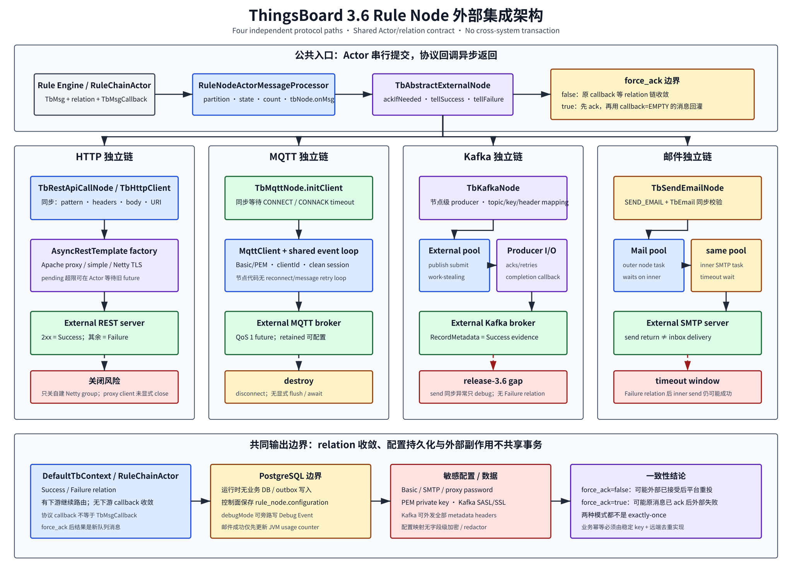](../../assets/architecture/37-rule-node-external-integration.svg)

[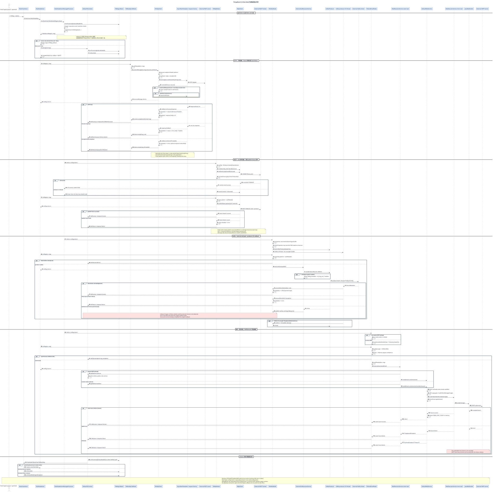](sequence.svg)

---

## 一、流程目标

本章回答的不是“外部节点如何统一发送”，而是同一个 `TbMsg` 到达四类节点后，分别在哪个线程准备请求、何时算外部提交成功、怎样产生 `Success`/`Failure` relation、原消息 callback 何时完成，以及关闭时哪些资源真正被释放。四类节点的核心入口分别是 [org.thingsboard.rule.engine.rest.TbRestApiCallNode](../../../rule-engine/rule-engine-components/src/main/java/org/thingsboard/rule/engine/rest/TbRestApiCallNode.java#L53)、[org.thingsboard.rule.engine.mqtt.TbMqttNode](../../../rule-engine/rule-engine-components/src/main/java/org/thingsboard/rule/engine/mqtt/TbMqttNode.java#L62)、[org.thingsboard.rule.engine.kafka.TbKafkaNode](../../../rule-engine/rule-engine-components/src/main/java/org/thingsboard/rule/engine/kafka/TbKafkaNode.java#L62) 与 [org.thingsboard.rule.engine.mail.TbSendEmailNode](../../../rule-engine/rule-engine-components/src/main/java/org/thingsboard/rule/engine/mail/TbSendEmailNode.java#L54)。

release-3.6 必须先固定以下边界：

1. Actor 只同步调用节点的 `onMsg`；网络完成发生在 HTTP future、MQTT Netty future、Kafka producer callback 或 MailExecutor future 上。
2. HTTP 不在初始化时建连接；MQTT 初始化会同步等待 broker connect；Kafka 初始化构造长生命周期 producer；邮件自定义 SMTP 只构造 `JavaMailSenderImpl`，发送时才进行 SMTP I/O。
3. `Success` 表示客户端 API 已按各协议定义完成：HTTP 为 2xx，MQTT 为 publish future 成功，Kafka 为 broker 返回 `RecordMetadata`，邮件为 `JavaMailSender.send` 返回；都不等于远端业务消费完成。
4. 四个节点都继承 [org.thingsboard.rule.engine.external.TbAbstractExternalNode](../../../rule-engine/rule-engine-components/src/main/java/org/thingsboard/rule/engine/external/TbAbstractExternalNode.java#L26)，因此都受 `actors.rule.external.force_ack` 影响。
5. 默认 `force_ack=false` 时，外部结果先变成 relation，原始消息包 callback 最终由 Rule Chain 路由收敛；`force_ack=true` 时先 ack 原消息，再用 `TbMsgCallback.EMPTY` 的新上下文消息异步回灌结果。
6. release-3.6 没有 `TbNodeCallback` 类型。真实消息级接口是 [org.thingsboard.server.common.msg.queue.TbMsgCallback](../../../common/message/src/main/java/org/thingsboard/server/common/msg/queue/TbMsgCallback.java#L32)；HTTP 的 `ListenableFutureCallback`、Kafka callback、MQTT listener 和邮件 Guava callback 是协议级回调，不是它的别名。
7. HTTP、MQTT、邮件节点本身没有消息级自动重试；Kafka 的 `retries` 仅交给 Kafka producer。MQTT QoS 1 是协议重传语义，不能等价成 Rule Engine retry。
8. Actor 初始化失败可按 Actor mailbox 策略重试，但这是“重建节点资源”，不是重放某条已处理消息。
9. 四类正常运行路径都不调用 DAO，不写业务数据库；HTTP/MQTT/Kafka/SMTP 只产生外部副作用。邮件成功后另有内存 API usage 计数旁路。
10. 例外是 Rule Node 配置本身保存在 `rule_node.configuration`，以及打开 debugMode 后 Actor/Context 可能旁路写 Debug Event；它们都不是外部节点的业务提交。
11. 配置 JSON 可直接包含 Basic password、PEM private key、Kafka SASL JAAS、SMTP/proxy password；本组配置类和 `RuleNodeEntity` 映射中没有字段级加密或脱敏步骤。
12. 外部副作用与 Rule Engine callback 没有共同事务，因而存在“外部已接受、平台随后重投”和“force ack 已完成、外部随后失败”两种相反窗口。

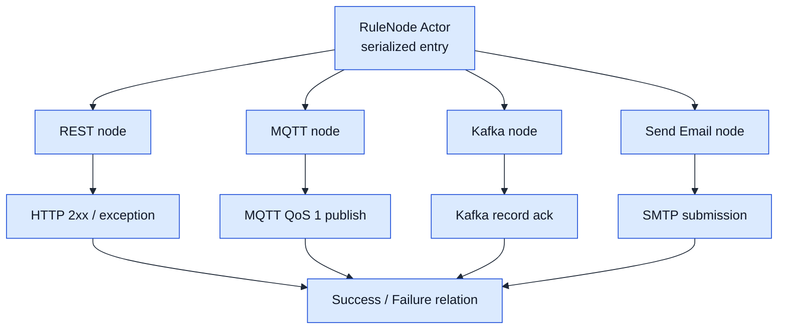
```mermaid
%%{init: {'theme':'base','themeVariables':{'primaryColor':'#DBEAFE','primaryTextColor':'#111827','primaryBorderColor':'#1D4ED8','lineColor':'#1F2937','secondaryColor':'#DCFCE7','tertiaryColor':'#FEF3C7','fontFamily':'Arial'}}}%%
flowchart TB
    A["RuleNode Actor\nserialized entry"] --> R["REST node"]
    A --> M["MQTT node"]
    A --> K["Kafka node"]
    A --> E["Send Email node"]
    R --> RH["HTTP 2xx / exception"]
    M --> MB["MQTT QoS 1 publish"]
    K --> KB["Kafka record ack"]
    E --> ES["SMTP submission"]
    RH --> C["Success / Failure relation"]
    MB --> C
    KB --> C
    ES --> C
```

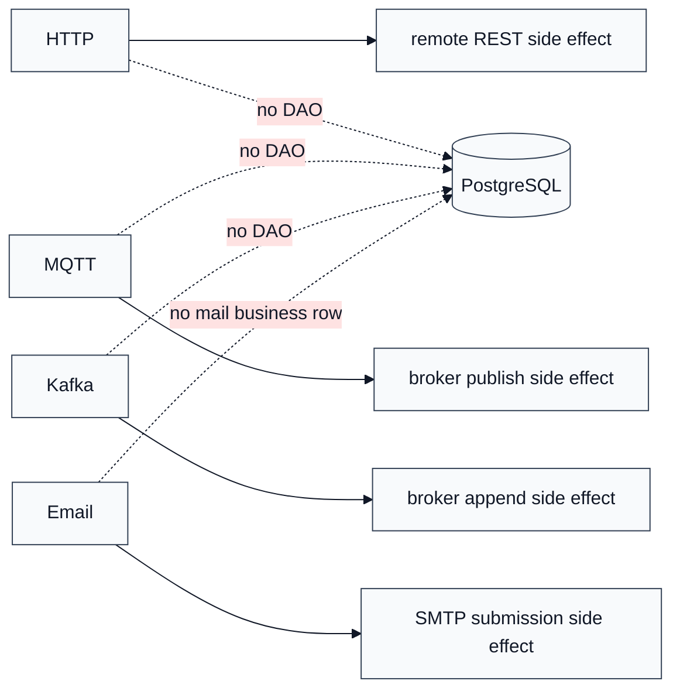
```mermaid
%%{init: {'theme':'base','themeVariables':{'primaryColor':'#F8FAFC','primaryTextColor':'#111827','primaryBorderColor':'#334155','lineColor':'#111827','secondaryColor':'#FEE2E2','tertiaryColor':'#DCFCE7'}}}%%
flowchart LR
    DB[("PostgreSQL")]
    H["HTTP"] --> HX["remote REST side effect"]
    M["MQTT"] --> MX["broker publish side effect"]
    K["Kafka"] --> KX["broker append side effect"]
    E["Email"] --> EX["SMTP submission side effect"]
    H -. "no DAO" .-> DB
    M -. "no DAO" .-> DB
    K -. "no DAO" .-> DB
    E -. "no mail business row" .-> DB
```

---

## 二、入口

### 2.1 Actor 创建与消息分派

[org.thingsboard.server.actors.ruleChain.RuleNodeActor.doProcess(TbActorMsg)](../../../application/src/main/java/org/thingsboard/server/actors/ruleChain/RuleNodeActor.java#L90) 把 `RULE_CHAIN_TO_RULE_MSG` 与 `RULE_TO_SELF_MSG` 分别交给 processor。节点启动走 [org.thingsboard.server.actors.ruleChain.RuleNodeActorMessageProcessor.start(TbActorCtx)](../../../application/src/main/java/org/thingsboard/server/actors/ruleChain/RuleNodeActorMessageProcessor.java#L88)，它只在本服务拥有该节点分区时通过反射创建节点并调用 `init`。普通消息走 [org.thingsboard.server.actors.ruleChain.RuleNodeActorMessageProcessor.onRuleChainToRuleNodeMsg(RuleChainToRuleNodeMsg)](../../../application/src/main/java/org/thingsboard/server/actors/ruleChain/RuleNodeActorMessageProcessor.java#L197)：先调用 `TbMsgCallback.onProcessingStart(RuleNodeInfo)`，检查状态与单消息最大节点执行次数，再直接调用实际 `TbNode.onMsg(TbContext, TbMsg)`。

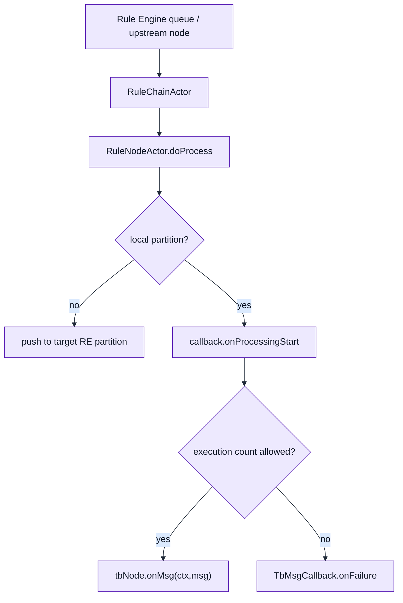
```mermaid
%%{init: {'theme':'base','themeVariables':{'primaryColor':'#EDE9FE','primaryTextColor':'#111827','primaryBorderColor':'#5B21B6','lineColor':'#1F2937','secondaryColor':'#DBEAFE','tertiaryColor':'#FEF3C7'}}}%%
flowchart TB
    Q["Rule Engine queue / upstream node"] --> RCA["RuleChainActor"]
    RCA --> RNA["RuleNodeActor.doProcess"]
    RNA --> OWN{"local partition?"}
    OWN -->|"no"| RQ["push to target RE partition"]
    OWN -->|"yes"| START["callback.onProcessingStart"]
    START --> LIMIT{"execution count allowed?"}
    LIMIT -->|"yes"| ON["tbNode.onMsg(ctx,msg)"]
    LIMIT -->|"no"| CF["TbMsgCallback.onFailure"]
```

### 2.2 生命周期入口

[org.thingsboard.server.actors.ruleChain.RuleNodeActorMessageProcessor.initComponent(RuleNode)](../../../application/src/main/java/org/thingsboard/server/actors/ruleChain/RuleNodeActorMessageProcessor.java#L238) 用配置中的完整类名反射实例化，并传入 `new TbNodeConfiguration(ruleNode.getConfiguration())`。更新时，[org.thingsboard.server.actors.ruleChain.RuleNodeActorMessageProcessor.onUpdate(TbActorCtx)](../../../application/src/main/java/org/thingsboard/server/actors/ruleChain/RuleNodeActorMessageProcessor.java#L105) 仅当类型或配置变化、或组件不是 ACTIVE 时先 `destroy()` 再 `start()`；停止和分区迁移走 [stop(TbActorCtx)](../../../application/src/main/java/org/thingsboard/server/actors/ruleChain/RuleNodeActorMessageProcessor.java#L136)。

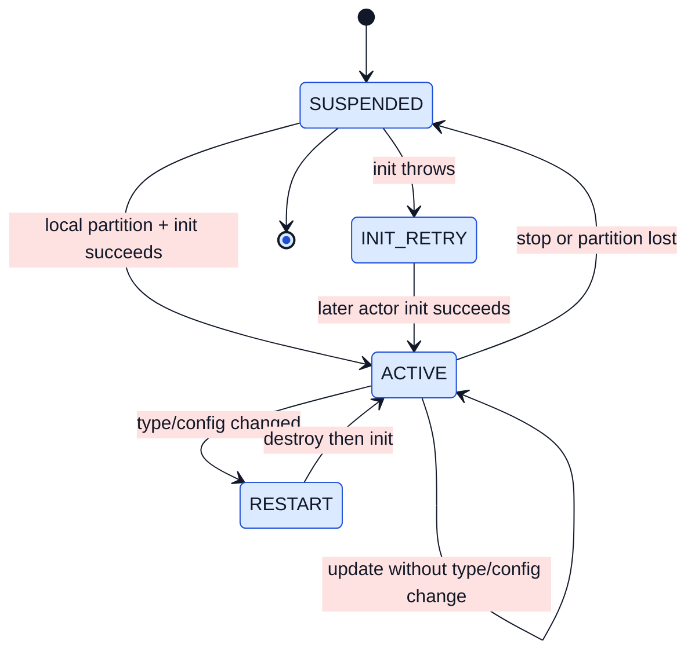
```mermaid
%%{init: {'theme':'base','themeVariables':{'primaryColor':'#DBEAFE','primaryTextColor':'#111827','primaryBorderColor':'#1D4ED8','lineColor':'#111827','secondaryColor':'#FEE2E2','tertiaryColor':'#DCFCE7'}}}%%
stateDiagram-v2
    [*] --> SUSPENDED
    SUSPENDED --> ACTIVE: local partition + init succeeds
    SUSPENDED --> INIT_RETRY: init throws
    INIT_RETRY --> ACTIVE: later actor init succeeds
    ACTIVE --> ACTIVE: update without type/config change
    ACTIVE --> RESTART: type/config changed
    RESTART --> ACTIVE: destroy then init
    ACTIVE --> SUSPENDED: stop or partition lost
    SUSPENDED --> [*]
```

### 2.3 `force_ack` 入口

[org.thingsboard.rule.engine.external.TbAbstractExternalNode.init(TbContext)](../../../rule-engine/rule-engine-components/src/main/java/org/thingsboard/rule/engine/external/TbAbstractExternalNode.java#L39) 在节点初始化时缓存 `ctx.isExternalNodeForceAck()`。四个节点都会在真正提交异步 I/O 前调用 [ackIfNeeded(TbContext, TbMsg)](../../../rule-engine/rule-engine-components/src/main/java/org/thingsboard/rule/engine/external/TbAbstractExternalNode.java#L89)。默认配置位于 [thingsboard.yml](../../../application/src/main/resources/thingsboard.yml#L465)，默认值为 `false`。

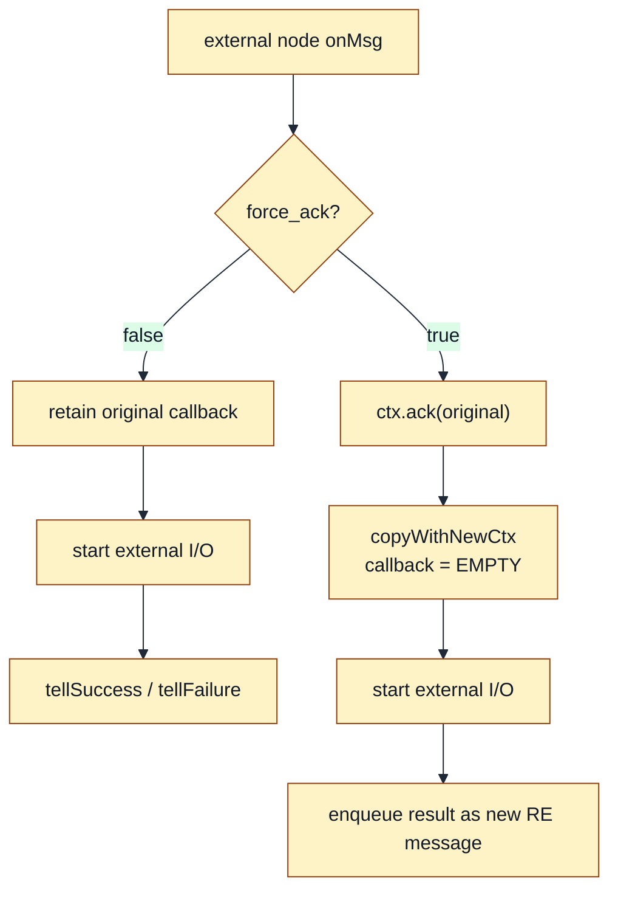
```mermaid
%%{init: {'theme':'base','themeVariables':{'primaryColor':'#FEF3C7','primaryTextColor':'#111827','primaryBorderColor':'#92400E','lineColor':'#1F2937','secondaryColor':'#DCFCE7','tertiaryColor':'#FEE2E2'}}}%%
flowchart TB
    IN["external node onMsg"] --> F{"force_ack?"}
    F -->|"false"| KEEP["retain original callback"]
    KEEP --> IO["start external I/O"]
    IO --> REL["tellSuccess / tellFailure"]
    F -->|"true"| ACK["ctx.ack(original)"]
    ACK --> COPY["copyWithNewCtx\ncallback = EMPTY"]
    COPY --> IO2["start external I/O"]
    IO2 --> ENQ["enqueue result as new RE message"]
```

---

## 三、完整调用链

### 3.1 HTTP 独立链

[org.thingsboard.rule.engine.rest.TbRestApiCallNode.init(TbContext, TbNodeConfiguration)](../../../rule-engine/rule-engine-components/src/main/java/org/thingsboard/rule/engine/rest/TbRestApiCallNode.java#L76) 创建 `org.thingsboard.rule.engine.rest.TbHttpClient`。消息入口 [onMsg(TbContext, TbMsg)](../../../rule-engine/rule-engine-components/src/main/java/org/thingsboard/rule/engine/rest/TbRestApiCallNode.java#L93) 调用 [org.thingsboard.rule.engine.rest.TbHttpClient.processMessage(TbContext, TbMsg, Consumer&lt;TbMsg&gt;, BiConsumer&lt;TbMsg,Throwable&gt;)](../../../rule-engine/rule-engine-components/src/main/java/org/thingsboard/rule/engine/rest/TbHttpClient.java#L262)。endpoint pattern、headers、method、body 和 URI 都在 Actor 调用线程同步构造；`AsyncRestTemplate.exchange` 返回后才跨入客户端异步边界。2xx 走 `Success`，非 2xx 或异常走 `Failure`。

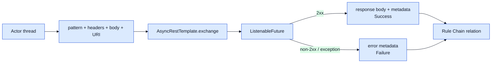
```mermaid
%%{init: {'theme':'base','themeVariables':{'primaryColor':'#DBEAFE','primaryTextColor':'#111827','primaryBorderColor':'#1D4ED8','lineColor':'#111827','secondaryColor':'#DCFCE7','tertiaryColor':'#FEE2E2'}}}%%
flowchart LR
    A["Actor thread"] --> P["pattern + headers + body + URI"]
    P --> X["AsyncRestTemplate.exchange"]
    X --> F["ListenableFuture"]
    F -->|"2xx"| S["response body + metadata\nSuccess"]
    F -->|"non-2xx / exception"| E["error metadata\nFailure"]
    S --> RC["Rule Chain relation"]
    E --> RC
```

[org.thingsboard.rule.engine.rest.TbHttpClient](../../../rule-engine/rule-engine-components/src/main/java/org/thingsboard/rule/engine/rest/TbHttpClient.java#L75) 有三种 request factory。proxy 分支使用 Apache `CloseableHttpAsyncClient`；simple 分支使用默认 `AsyncRestTemplate` 且拒绝 PEM credentials；默认分支使用共享或自建 Netty event loop，并初始化 TLS context。只有客户端自己创建的 `NioEventLoopGroup` 才由 [destroy()](../../../rule-engine/rule-engine-components/src/main/java/org/thingsboard/rule/engine/rest/TbHttpClient.java#L247) 关闭，共享 event loop 由应用级 `SharedEventLoopGroupService` 管理。

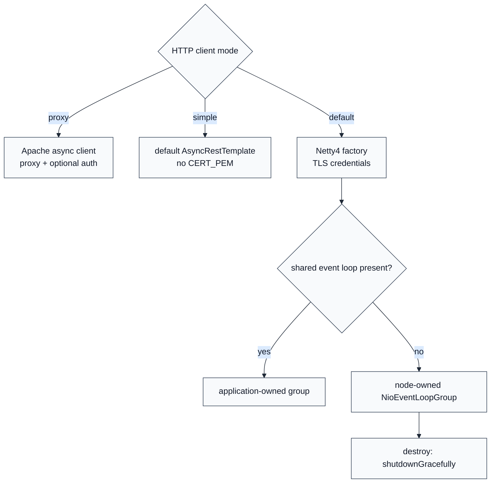
```mermaid
%%{init: {'theme':'base','themeVariables':{'primaryColor':'#F8FAFC','primaryTextColor':'#111827','primaryBorderColor':'#334155','lineColor':'#1F2937','secondaryColor':'#DBEAFE','tertiaryColor':'#FEF3C7'}}}%%
flowchart TB
    C{"HTTP client mode"}
    C -->|"proxy"| AP["Apache async client\nproxy + optional auth"]
    C -->|"simple"| SP["default AsyncRestTemplate\nno CERT_PEM"]
    C -->|"default"| NP["Netty4 factory\nTLS credentials"]
    NP --> SH{"shared event loop present?"}
    SH -->|"yes"| SG["application-owned group"]
    SH -->|"no"| NG["node-owned NioEventLoopGroup"]
    NG --> D["destroy: shutdownGracefully"]
```

### 3.2 MQTT 独立链

[org.thingsboard.rule.engine.mqtt.TbMqttNode.init(TbContext, TbNodeConfiguration)](../../../rule-engine/rule-engine-components/src/main/java/org/thingsboard/rule/engine/mqtt/TbMqttNode.java#L92) 调用 [initClient(TbContext)](../../../rule-engine/rule-engine-components/src/main/java/org/thingsboard/rule/engine/mqtt/TbMqttNode.java#L165)，把 external-call executor 和共享 event loop 交给 MQTT client，然后在初始化线程上用 `Promise.get(connectTimeoutSec, SECONDS)` 同步等待连接。连接超时或 CONNACK 失败会 disconnect 并让节点初始化失败。消息入口 [onMsg(TbContext, TbMsg)](../../../rule-engine/rule-engine-components/src/main/java/org/thingsboard/rule/engine/mqtt/TbMqttNode.java#L110) 固定使用 `MqttQoS.AT_LEAST_ONCE`，publish future listener 决定 relation。

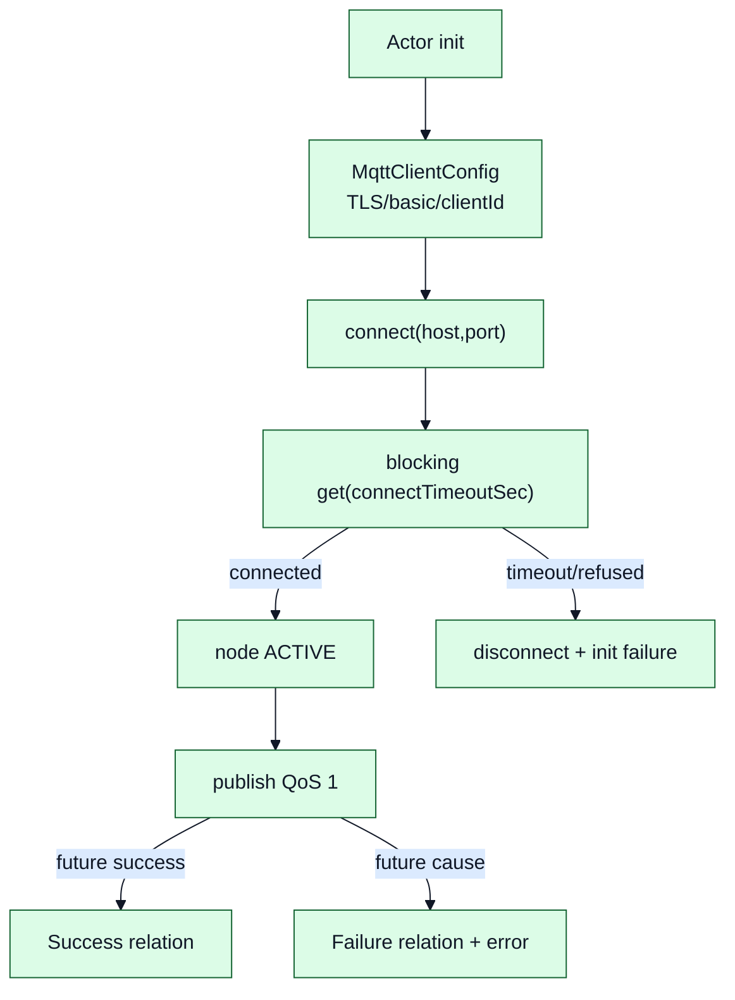
```mermaid
%%{init: {'theme':'base','themeVariables':{'primaryColor':'#DCFCE7','primaryTextColor':'#111827','primaryBorderColor':'#166534','lineColor':'#111827','secondaryColor':'#DBEAFE','tertiaryColor':'#FEE2E2'}}}%%
flowchart TB
    INIT["Actor init"] --> CFG["MqttClientConfig\nTLS/basic/clientId"]
    CFG --> CON["connect(host,port)"]
    CON --> WAIT["blocking get(connectTimeoutSec)"]
    WAIT -->|"connected"| READY["node ACTIVE"]
    WAIT -->|"timeout/refused"| DOWN["disconnect + init failure"]
    READY --> PUB["publish QoS 1"]
    PUB -->|"future success"| SUC["Success relation"]
    PUB -->|"future cause"| FAIL["Failure relation + error"]
```

`clientId` 可选择追加 `ctx.getServiceId()`，用于多服务实例避免冲突；`cleanSession`、retained、SSL 和 Basic credentials 来自 [org.thingsboard.rule.engine.mqtt.TbMqttNodeConfiguration](../../../rule-engine/rule-engine-components/src/main/java/org/thingsboard/rule/engine/mqtt/TbMqttNodeConfiguration.java#L27)。[destroy()](../../../rule-engine/rule-engine-components/src/main/java/org/thingsboard/rule/engine/mqtt/TbMqttNode.java#L143) 只调用 `mqttClient.disconnect()`，节点代码没有 flush、等待离线完成或重连调度器。

### 3.3 Kafka 独立链

[org.thingsboard.rule.engine.kafka.TbKafkaNode.init(TbContext, TbNodeConfiguration)](../../../rule-engine/rule-engine-components/src/main/java/org/thingsboard/rule/engine/kafka/TbKafkaNode.java#L123) 将节点配置映射为 producer properties，创建一个节点级 `KafkaProducer<String,String>`。每条消息在 [onMsg(TbContext, TbMsg)](../../../rule-engine/rule-engine-components/src/main/java/org/thingsboard/rule/engine/kafka/TbKafkaNode.java#L171) 中先处理 topic/key pattern，再把 [publish(TbContext, TbMsg, String, String)](../../../rule-engine/rule-engine-components/src/main/java/org/thingsboard/rule/engine/kafka/TbKafkaNode.java#L205) 提交给 external-call executor；`producer.send` 的 callback 再由 Kafka producer I/O 线程调用 `processRecord`。

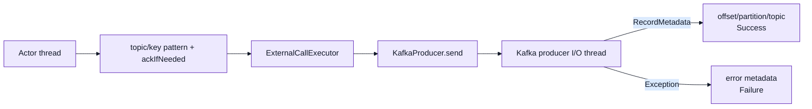
```mermaid
%%{init: {'theme':'base','themeVariables':{'primaryColor':'#EDE9FE','primaryTextColor':'#111827','primaryBorderColor':'#5B21B6','lineColor':'#111827','secondaryColor':'#DBEAFE','tertiaryColor':'#DCFCE7'}}}%%
flowchart LR
    AT["Actor thread"] --> TK["topic/key pattern + ackIfNeeded"]
    TK --> EX["ExternalCallExecutor"]
    EX --> PS["KafkaProducer.send"]
    PS --> IO["Kafka producer I/O thread"]
    IO -->|"RecordMetadata"| OK["offset/partition/topic\nSuccess"]
    IO -->|"Exception"| ER["error metadata\nFailure"]
```

Kafka 是四类中唯一显式配置客户端重试的节点。[org.thingsboard.rule.engine.kafka.TbKafkaNodeConfiguration.defaultConfiguration()](../../../rule-engine/rule-engine-components/src/main/java/org/thingsboard/rule/engine/kafka/TbKafkaNodeConfiguration.java#L91) 默认 `retries=0`、`acks=-1`、`batchSize=16384`、`linger=0`、`bufferMemory=33554432`。这些都是 Kafka producer 语义，不会重新执行 Rule Node、不会重新计算 pattern，也不会创建 Failure 后再由平台自动重试。

### 3.4 邮件独立链

[org.thingsboard.rule.engine.mail.TbSendEmailNode.onMsg(TbContext, TbMsg)](../../../rule-engine/rule-engine-components/src/main/java/org/thingsboard/rule/engine/mail/TbSendEmailNode.java#L97) 先在 Actor 线程同步校验 `SEND_EMAIL` 类型并把 payload 反序列化为 `TbEmail`；校验成功后才 `ackIfNeeded`，再提交到 `ctx.getMailExecutor()`。worker 调用 [sendEmail(TbContext, TbMsg, TbEmail)](../../../rule-engine/rule-engine-components/src/main/java/org/thingsboard/rule/engine/mail/TbSendEmailNode.java#L121)：系统 SMTP 调用三参数 `DefaultMailService.send`，节点自定义 SMTP 调用带 `JavaMailSender` 和 timeout 的五参数重载；两条公开入口最终都进入私有 `sendMail(..., JavaMailSender, timeout)`。

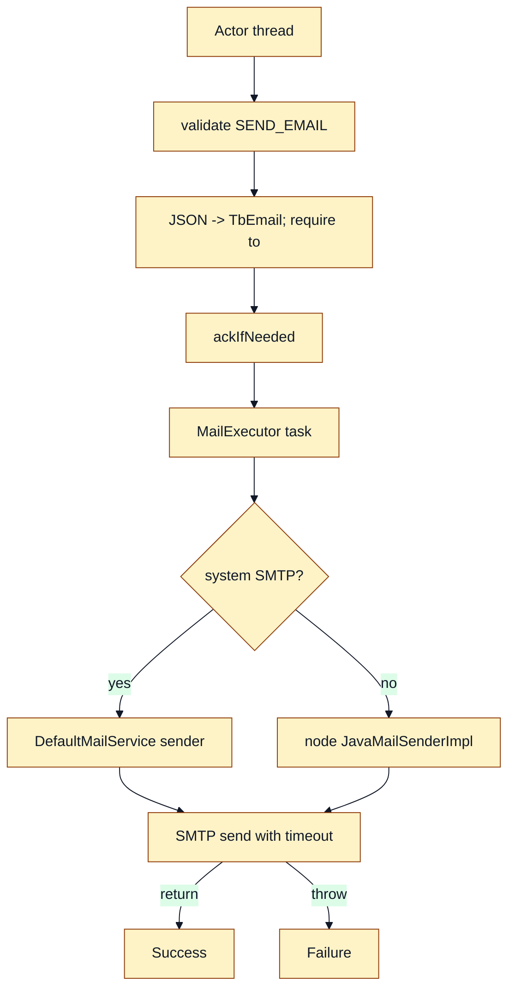
```mermaid
%%{init: {'theme':'base','themeVariables':{'primaryColor':'#FEF3C7','primaryTextColor':'#111827','primaryBorderColor':'#92400E','lineColor':'#111827','secondaryColor':'#DCFCE7','tertiaryColor':'#FEE2E2'}}}%%
flowchart TB
    A["Actor thread"] --> V["validate SEND_EMAIL"]
    V --> J["JSON -> TbEmail; require to"]
    J --> ACK["ackIfNeeded"]
    ACK --> MP["MailExecutor task"]
    MP --> SEL{"system SMTP?"}
    SEL -->|"yes"| SYS["DefaultMailService sender"]
    SEL -->|"no"| OWN["node JavaMailSenderImpl"]
    SYS --> SMTP["SMTP send with timeout"]
    OWN --> SMTP
    SMTP -->|"return"| S["Success"]
    SMTP -->|"throw"| F["Failure"]
```

release-3.6 的邮件线程模型有一层容易漏读：节点任务已经运行在 `MailExecutorService`，但 [org.thingsboard.server.service.mail.DefaultMailService.sendMailWithTimeout(JavaMailSender, MimeMessage, long)](../../../application/src/main/java/org/thingsboard/server/service/mail/DefaultMailService.java#L635) 又把 `mailSender.send(msg)` 提交到同一个 `MailExecutorService`，随后当前 worker 阻塞 `get(timeout)`。底层是 work-stealing `ForkJoinPool`，并行度来自 `actors.rule.mail_thread_pool_size`，默认 40；高并发慢 SMTP 会同时占用“外层等待任务”和“内层实际发送任务”。

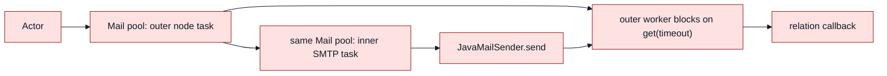
```mermaid
%%{init: {'theme':'base','themeVariables':{'primaryColor':'#FEE2E2','primaryTextColor':'#111827','primaryBorderColor':'#991B1B','lineColor':'#111827','secondaryColor':'#FEF3C7','tertiaryColor':'#DCFCE7'}}}%%
flowchart LR
    A["Actor"] --> O["Mail pool: outer node task"]
    O --> I["same Mail pool: inner SMTP task"]
    O --> W["outer worker blocks on get(timeout)"]
    I --> S["JavaMailSender.send"]
    S --> W
    W --> R["relation callback"]
```

---

## 四、消息流

### 4.1 relation 与消息 callback 不是同一层

[org.thingsboard.rule.engine.external.TbAbstractExternalNode.tellSuccess(TbContext, TbMsg)](../../../rule-engine/rule-engine-components/src/main/java/org/thingsboard/rule/engine/external/TbAbstractExternalNode.java#L50) 与 [tellFailure(TbContext, TbMsg, Throwable)](../../../rule-engine/rule-engine-components/src/main/java/org/thingsboard/rule/engine/external/TbAbstractExternalNode.java#L66) 只决定“直接 tell relation”还是“重新入队 relation”。真正的消息完成由 [org.thingsboard.server.actors.ruleChain.RuleChainActorMessageProcessor.onTellNext(RuleNodeToRuleChainTellNextMsg)](../../../application/src/main/java/org/thingsboard/server/actors/ruleChain/RuleChainActorMessageProcessor.java#L397) 收敛：没有匹配下游时，非 Failure relation 调 `TbMsgCallback.onSuccess()`，Failure relation 调 `TbMsgCallback.onFailure(RuleEngineException)`；存在下游时继续路由。

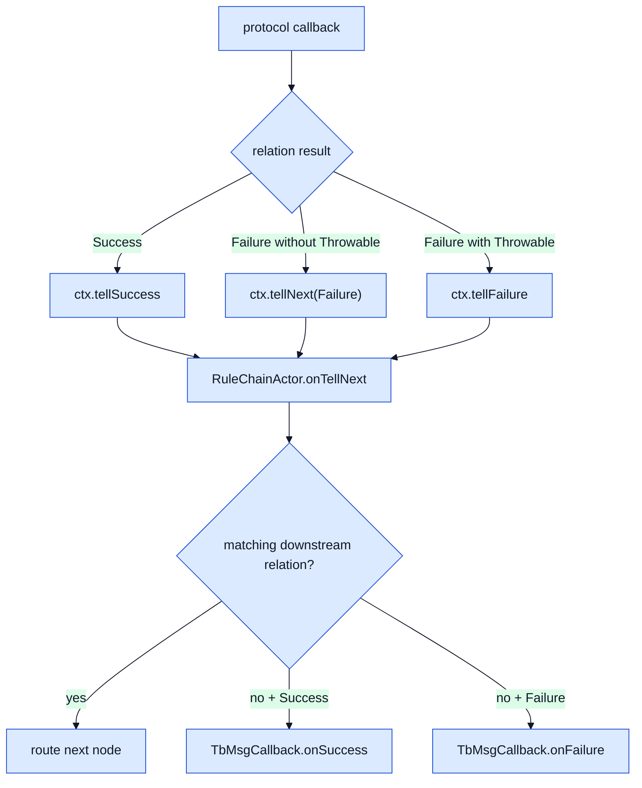
```mermaid
%%{init: {'theme':'base','themeVariables':{'primaryColor':'#DBEAFE','primaryTextColor':'#111827','primaryBorderColor':'#1D4ED8','lineColor':'#111827','secondaryColor':'#DCFCE7','tertiaryColor':'#FEE2E2'}}}%%
flowchart TB
    PC["protocol callback"] --> REL{"relation result"}
    REL -->|"Success"| TS["ctx.tellSuccess"]
    REL -->|"Failure without Throwable"| TN["ctx.tellNext(Failure)"]
    REL -->|"Failure with Throwable"| TF["ctx.tellFailure"]
    TS --> RCA["RuleChainActor.onTellNext"]
    TN --> RCA
    TF --> RCA
    RCA --> OUT{"matching downstream relation?"}
    OUT -->|"yes"| NEXT["route next node"]
    OUT -->|"no + Success"| CBOK["TbMsgCallback.onSuccess"]
    OUT -->|"no + Failure"| CBF["TbMsgCallback.onFailure"]
```

### 4.2 强制 ack 改变故障语义

[org.thingsboard.server.actors.ruleChain.DefaultTbContext.ack(TbMsg)](../../../application/src/main/java/org/thingsboard/server/actors/ruleChain/DefaultTbContext.java#L535) 立即调用 `onProcessingEnd` 和 `onSuccess`。随后 [org.thingsboard.server.common.msg.TbMsg.copyWithNewCtx()](../../../common/message/src/main/java/org/thingsboard/server/common/msg/TbMsg.java#L851) 复制 processing context 并把 callback 固定为 `TbMsgCallback.EMPTY`。外部结果经 `enqueueForTellNext` 回灌为新的队列消息，因此原消息不会因外部失败而失败；代价是进程在 ack 与外部提交之间退出时，原消息也不会由原 callback 触发重投。

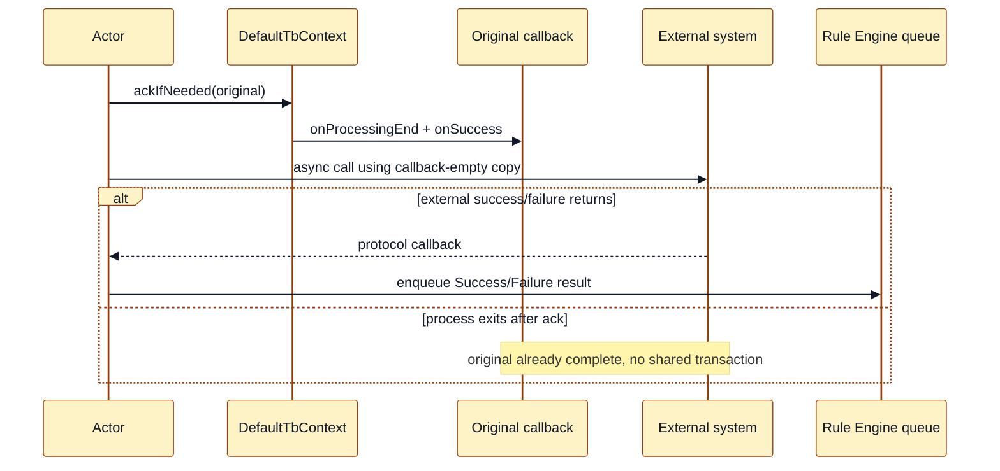
```mermaid
%%{init: {'theme':'base','themeVariables':{'primaryColor':'#FEF3C7','primaryTextColor':'#111827','primaryBorderColor':'#92400E','lineColor':'#111827','secondaryColor':'#FEE2E2','tertiaryColor':'#DCFCE7'}}}%%
sequenceDiagram
    participant A as Actor
    participant C as DefaultTbContext
    participant O as Original callback
    participant X as External system
    participant Q as Rule Engine queue
    A->>C: ackIfNeeded(original)
    C->>O: onProcessingEnd + onSuccess
    A->>X: async call using callback-empty copy
    alt external success/failure returns
        X-->>A: protocol callback
        A->>Q: enqueue Success/Failure result
    else process exits after ack
        Note over O,X: original already complete, no shared transaction
    end
```

### 4.3 四类消息投影

HTTP 的 endpoint/header、MQTT topic、Kafka topic/key 都调用 `TbNodeUtils.processPattern`，因此可以读取 payload/metadata；Kafka 还可把全部 metadata 转成带 `tb_msg_md_` 前缀的 record headers。邮件不做 pattern 替换，它要求上游已经把完整 `TbEmail` JSON 放入 payload。敏感数据既可能来自节点配置，也可能来自当前消息。

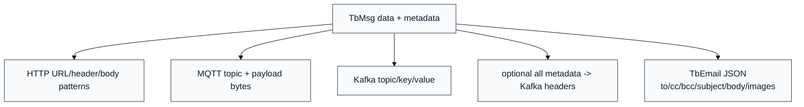
```mermaid
%%{init: {'theme':'base','themeVariables':{'primaryColor':'#F8FAFC','primaryTextColor':'#111827','primaryBorderColor':'#334155','lineColor':'#111827','secondaryColor':'#DBEAFE','tertiaryColor':'#EDE9FE'}}}%%
flowchart TB
    MSG["TbMsg data + metadata"] --> HP["HTTP URL/header/body patterns"]
    MSG --> MT["MQTT topic + payload bytes"]
    MSG --> KT["Kafka topic/key/value"]
    MSG --> KH["optional all metadata -> Kafka headers"]
    MSG --> EM["TbEmail JSON\nto/cc/bcc/subject/body/images"]
```

---

## 五、时序图

详细、可生成的高对比 PlantUML 源文件见 [sequence.puml](sequence.puml)。本节分别给出四条时序，禁止把 HTTP 响应、MQTT PUBACK、Kafka record ack 和 SMTP submission 画成同一个远端响应。

### 5.1 HTTP 时序

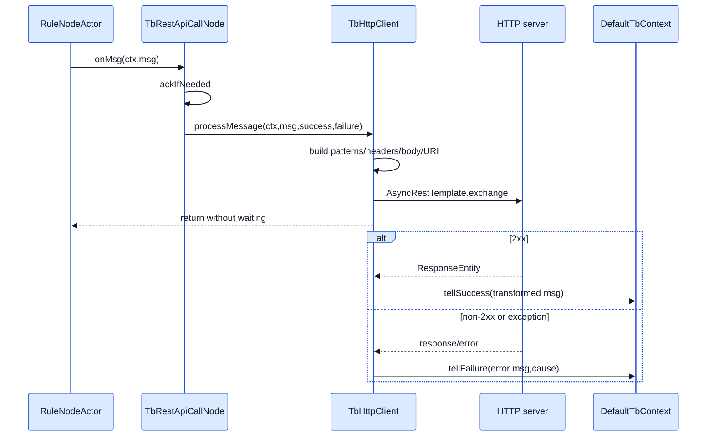
```mermaid
%%{init: {'theme':'base','themeVariables':{'primaryColor':'#DBEAFE','primaryTextColor':'#111827','primaryBorderColor':'#1D4ED8','lineColor':'#111827','secondaryColor':'#DCFCE7','tertiaryColor':'#FEE2E2'}}}%%
sequenceDiagram
    participant A as RuleNodeActor
    participant N as TbRestApiCallNode
    participant H as TbHttpClient
    participant X as HTTP server
    participant C as DefaultTbContext
    A->>N: onMsg(ctx,msg)
    N->>N: ackIfNeeded
    N->>H: processMessage(ctx,msg,success,failure)
    H->>H: build patterns/headers/body/URI
    H->>X: AsyncRestTemplate.exchange
    H-->>A: return without waiting
    alt 2xx
        X-->>H: ResponseEntity
        H->>C: tellSuccess(transformed msg)
    else non-2xx or exception
        X-->>H: response/error
        H->>C: tellFailure(error msg,cause)
    end
```

### 5.2 MQTT 时序

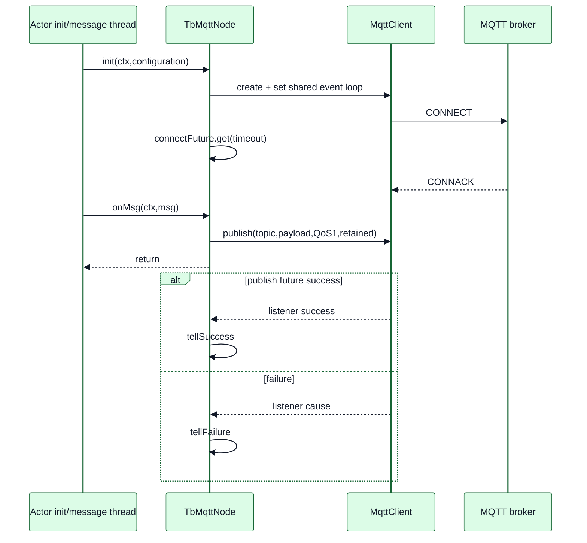
```mermaid
%%{init: {'theme':'base','themeVariables':{'primaryColor':'#DCFCE7','primaryTextColor':'#111827','primaryBorderColor':'#166534','lineColor':'#111827','secondaryColor':'#DBEAFE','tertiaryColor':'#FEE2E2'}}}%%
sequenceDiagram
    participant A as Actor init/message thread
    participant N as TbMqttNode
    participant M as MqttClient
    participant B as MQTT broker
    A->>N: init(ctx,configuration)
    N->>M: create + set shared event loop
    M->>B: CONNECT
    N->>N: connectFuture.get(timeout)
    B-->>M: CONNACK
    A->>N: onMsg(ctx,msg)
    N->>M: publish(topic,payload,QoS1,retained)
    N-->>A: return
    alt publish future success
        M-->>N: listener success
        N->>N: tellSuccess
    else failure
        M-->>N: listener cause
        N->>N: tellFailure
    end
```

### 5.3 Kafka 时序

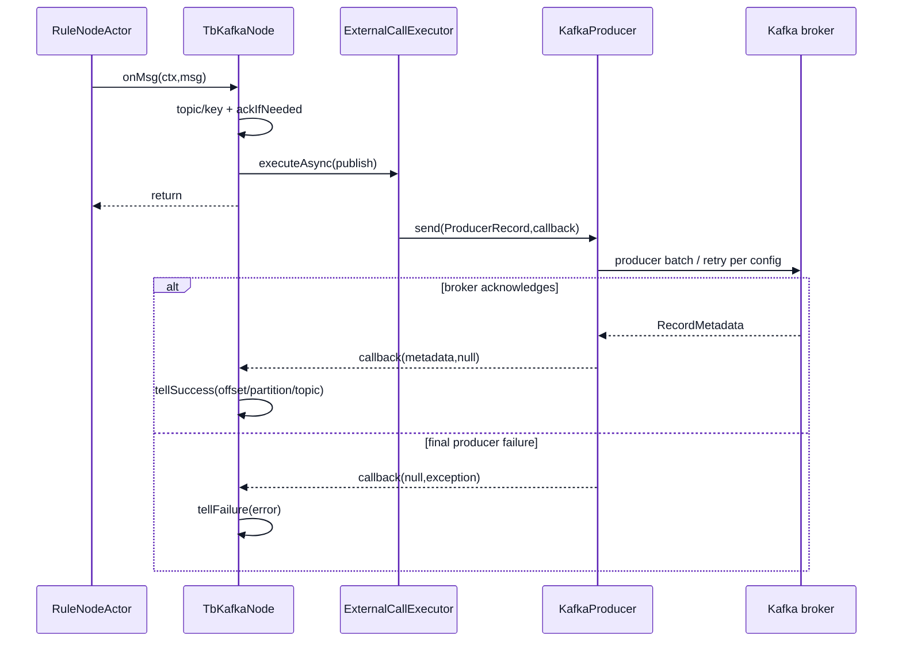
```mermaid
%%{init: {'theme':'base','themeVariables':{'primaryColor':'#EDE9FE','primaryTextColor':'#111827','primaryBorderColor':'#5B21B6','lineColor':'#111827','secondaryColor':'#DBEAFE','tertiaryColor':'#FEE2E2'}}}%%
sequenceDiagram
    participant A as RuleNodeActor
    participant N as TbKafkaNode
    participant E as ExternalCallExecutor
    participant P as KafkaProducer
    participant B as Kafka broker
    A->>N: onMsg(ctx,msg)
    N->>N: topic/key + ackIfNeeded
    N->>E: executeAsync(publish)
    N-->>A: return
    E->>P: send(ProducerRecord,callback)
    P->>B: producer batch / retry per config
    alt broker acknowledges
        B-->>P: RecordMetadata
        P-->>N: callback(metadata,null)
        N->>N: tellSuccess(offset/partition/topic)
    else final producer failure
        P-->>N: callback(null,exception)
        N->>N: tellFailure(error)
    end
```

### 5.4 邮件时序

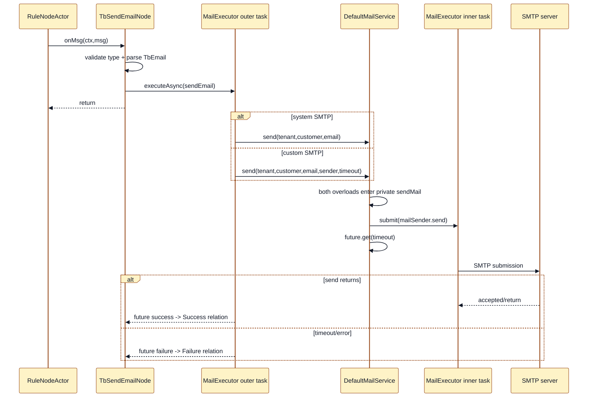
```mermaid
%%{init: {'theme':'base','themeVariables':{'primaryColor':'#FEF3C7','primaryTextColor':'#111827','primaryBorderColor':'#92400E','lineColor':'#111827','secondaryColor':'#DCFCE7','tertiaryColor':'#FEE2E2'}}}%%
sequenceDiagram
    participant A as RuleNodeActor
    participant N as TbSendEmailNode
    participant O as MailExecutor outer task
    participant S as DefaultMailService
    participant I as MailExecutor inner task
    participant M as SMTP server
    A->>N: onMsg(ctx,msg)
    N->>N: validate type + parse TbEmail
    N->>O: executeAsync(sendEmail)
    N-->>A: return
    alt system SMTP
        O->>S: send(tenant,customer,email)
    else custom SMTP
        O->>S: send(tenant,customer,email,sender,timeout)
    end
    S->>S: both overloads enter private sendMail
    S->>I: submit(mailSender.send)
    S->>S: future.get(timeout)
    I->>M: SMTP submission
    alt send returns
        M-->>I: accepted/return
        O-->>N: future success -> Success relation
    else timeout/error
        O-->>N: future failure -> Failure relation
    end
```

---

## 六、数据变化

### 6.1 成功与失败时的 `TbMsg`

HTTP 成功直接取得原 metadata 对象，写入 `status/statusCode/statusReason` 和响应 headers，再用 response body 生成转换消息；HTTP 非 2xx 写入同样状态字段与 `error_body`，保留原 payload。MQTT 成功不修改消息，失败复制 metadata 并增加 `error`。Kafka 成功复制 metadata 并增加 `offset/partition/topic`，失败增加 `error`。邮件成功或异步失败均不修改消息；同步类型/JSON/收件人校验失败直接用原消息 `ctx.tellFailure`。

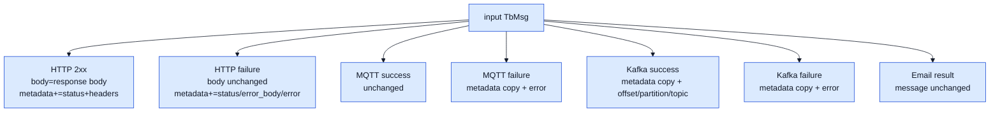
```mermaid
%%{init: {'theme':'base','themeVariables':{'primaryColor':'#DBEAFE','primaryTextColor':'#111827','primaryBorderColor':'#1D4ED8','lineColor':'#111827','secondaryColor':'#DCFCE7','tertiaryColor':'#FEE2E2'}}}%%
flowchart TB
    IN["input TbMsg"] --> HS["HTTP 2xx\nbody=response body\nmetadata+=status+headers"]
    IN --> HF["HTTP failure\nbody unchanged\nmetadata+=status/error_body/error"]
    IN --> MS["MQTT success\nunchanged"]
    IN --> MF["MQTT failure\nmetadata copy + error"]
    IN --> KS["Kafka success\nmetadata copy + offset/partition/topic"]
    IN --> KF["Kafka failure\nmetadata copy + error"]
    IN --> EM["Email result\nmessage unchanged"]
```

### 6.2 外部数据与敏感字段

HTTP Basic auth 在 [org.thingsboard.rule.engine.rest.TbHttpClient.prepareHeaders(TbMsg)](../../../rule-engine/rule-engine-components/src/main/java/org/thingsboard/rule/engine/rest/TbHttpClient.java#L455) 中拼成 Base64 `Authorization`，不是加密；proxy password 可来自节点 JSON 或 JVM system property。MQTT Basic username/password 进入 `MqttClientConfig`，PEM credentials 可包含 private key。Kafka `otherProperties` 可放 `sasl.jaas.config`、SSL key/certificate；启用 metadata headers 后，全部消息 metadata 会发送给 broker。邮件 payload 可含收件人、正文和 base64 inline images，SMTP 与 proxy password 存在节点配置。四条路径都没有统一 redactor。

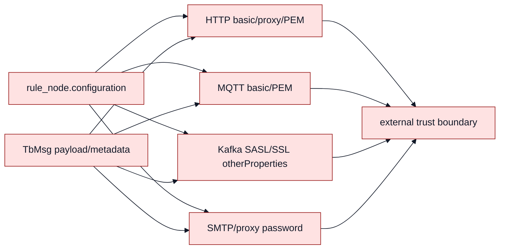
```mermaid
%%{init: {'theme':'base','themeVariables':{'primaryColor':'#FEE2E2','primaryTextColor':'#111827','primaryBorderColor':'#991B1B','lineColor':'#111827','secondaryColor':'#FEF3C7','tertiaryColor':'#DBEAFE'}}}%%
flowchart LR
    CFG["rule_node.configuration"] --> H["HTTP basic/proxy/PEM"]
    CFG --> M["MQTT basic/PEM"]
    CFG --> K["Kafka SASL/SSL otherProperties"]
    CFG --> E["SMTP/proxy password"]
    MSG["TbMsg payload/metadata"] --> H
    MSG --> M
    MSG --> K
    MSG --> E
    H --> EXT["external trust boundary"]
    M --> EXT
    K --> EXT
    E --> EXT
```

### 6.3 完成语义对照

| 节点 | `Success` 的直接证据 | 不能证明 | 失败消息变化 |
|---|---|---|---|
| HTTP | 客户端拿到 2xx `ResponseEntity` | 远端事务不会随后回滚、业务幂等 | `status/statusCode/error_body/error` |
| MQTT | QoS 1 publish future 成功 | 订阅者已处理、恰好一次 | metadata `error` |
| Kafka | producer callback 返回 `RecordMetadata` | 消费者已处理、跨系统恰好一次 | metadata `error` |
| 邮件 | `JavaMailSender.send` 在 timeout 内返回 | 邮件已投递到收件箱、未退信 | 不修改消息 |

---

## 七、源码分析

### 7.1 HTTP：异步请求里仍有 Actor 线程阻塞点

[org.thingsboard.rule.engine.rest.TbHttpClient.processParallelRequests(ListenableFuture&lt;ResponseEntity&lt;String&gt;&gt;)](../../../rule-engine/rule-engine-components/src/main/java/org/thingsboard/rule/engine/rest/TbHttpClient.java#L474) 不是队列持久化或真正的并发信号量。启用 `maxParallelRequestsCount>0` 后，请求已先 `exchange`，future 随后加入 `ConcurrentLinkedDeque`；当 deque size 超限时，当前 `onMsg` 调用线程循环取最多 N 个旧 future 并 `get(readTimeoutMs)`。所以“HTTP 是异步的”不代表 Actor 路径永不等待；`readTimeoutMs=0` 表示不等待，已完成的旧 future 可立即返回，尚未完成的旧 future 才会立即 timeout 并进入 cancel 分支。

```mermaid
%%{init: {'theme':'base','themeVariables':{'primaryColor':'#FEE2E2','primaryTextColor':'#111827','primaryBorderColor':'#991B1B','lineColor':'#111827','secondaryColor':'#DBEAFE','tertiaryColor':'#FEF3C7'}}}%%
flowchart TB
    EX["exchange starts request"] --> ADD["pending deque.add"]
    ADD --> OVER{"deque size > max?"}
    OVER -->|"no"| RET["return from onMsg"]
    OVER -->|"yes"| GET["Actor thread get(old future, readTimeout)"]
    GET -->|"done"| MORE["repeat up to max count"]
    GET -->|"timeout/error"| CAN["cancel old future + warn"]
    CAN --> MORE
```

HTTP client 的关闭也不对称：默认 Netty 分支如果获得应用共享 event loop，节点 `destroy` 什么都不关；自建 event loop 才 shutdown。proxy 分支创建的 `CloseableHttpAsyncClient` 只被放进 request factory，`TbHttpClient` 没保存引用并显式 `close()`。因此文档不能声称每次节点销毁都会关闭所有 HTTP connection resources。

### 7.2 MQTT：连接是初始化门槛，发送无节点级重试

MQTT 的 `initClient` 把 owner id 设为 `Tenant[tenantId]RuleNode[ruleNodeId]`，可选 client id suffix 使用 service id；它在节点 ACTIVE 前必须连接成功。连接断开后的行为由外部 `org.thingsboard.mqtt.MqttClient` 库决定，本仓库节点代码没有注册 connection listener、重连 scheduler 或失败消息缓存。能从本源码确认的是：每条消息只调用一次 `publish`，listener 只选择一次 Success/Failure；节点关闭只调用一次 disconnect。

```mermaid
%%{init: {'theme':'base','themeVariables':{'primaryColor':'#DCFCE7','primaryTextColor':'#111827','primaryBorderColor':'#166534','lineColor':'#111827','secondaryColor':'#FEE2E2','tertiaryColor':'#FEF3C7'}}}%%
flowchart LR
    MSG["one TbMsg"] --> P["one node publish call"]
    P --> Q1["QoS AT_LEAST_ONCE"]
    Q1 --> L["one future listener"]
    L --> S["Success"]
    L --> F["Failure"]
    LIB["library reconnect/retransmit details"] -. "not defined in node source" .-> Q1
```

### 7.3 Kafka：反射、线程与遗漏回调

Kafka 初始化通过 `ReflectionUtils.findField(KafkaProducer.class, "ioThread")` 获取私有字段并在 static block 直接 `setAccessible(true)`，随后给 producer I/O thread 安装 uncaught exception handler。只有 `ThingsboardKafkaClientError` 会写入普通 `Throwable initError` 字段并 `destroy()`；后续消息在 `onMsg` 看到 `initError` 后直接 `ctx.tellFailure`。该字段没有 `volatile` 或其他显式可见性保护，这也是 release-3.6 的线程可见性风险。此设计对特定 Kafka client fatal error 和内部线程字段存在版本耦合，不应当解释为通用 producer 健康检查。

更关键的 release-3.6 陷阱在 [org.thingsboard.rule.engine.kafka.TbKafkaNode.publish(TbContext, TbMsg, String, String)](../../../rule-engine/rule-engine-components/src/main/java/org/thingsboard/rule/engine/kafka/TbKafkaNode.java#L205)：若 `producer.send(...)` 同步抛出异常，catch 只 `log.debug`，既不调用 `tellFailure`，也不重新抛给 external-call future 的观察者；而 `onMsg` 又没有给 `executeAsync` 返回的 future 挂 callback。该消息可能悬而不决（`force_ack=false`），或原消息已成功 ack 且结果丢失（`force_ack=true`）。只有 send 成功注册 callback 后的最终异常才进入 Failure relation。

```mermaid
%%{init: {'theme':'base','themeVariables':{'primaryColor':'#FEE2E2','primaryTextColor':'#111827','primaryBorderColor':'#991B1B','lineColor':'#111827','secondaryColor':'#EDE9FE','tertiaryColor':'#DCFCE7'}}}%%
flowchart TB
    P["publish"] --> SEND["producer.send"]
    SEND -->|"callback registered"| CB["Kafka completion callback"]
    CB -->|"metadata"| S["Success"]
    CB -->|"exception"| F["Failure"]
    SEND -->|"throws synchronously"| LOG["debug log only"]
    LOG --> LOST["no relation / no observed executor future"]
```

### 7.4 邮件：timeout 与“可能仍发送”

[org.thingsboard.server.service.mail.DefaultMailService.sendMailWithTimeout(JavaMailSender, MimeMessage, long)](../../../application/src/main/java/org/thingsboard/server/service/mail/DefaultMailService.java#L635) 在 timeout 时抛 `RuntimeException("Timeout!")`，但没有保存或 cancel `mailExecutorService.submit(...)` 返回的 future。于是 Rule Node 可以先走 Failure relation，而内层 SMTP task 仍在运行并最终发出邮件。没有幂等 key、outbox 状态或撤销协议；对告警邮件做上层 retry 时必须接受重复发送风险。

```mermaid
%%{init: {'theme':'base','themeVariables':{'primaryColor':'#FEF3C7','primaryTextColor':'#111827','primaryBorderColor':'#92400E','lineColor':'#111827','secondaryColor':'#FEE2E2','tertiaryColor':'#DCFCE7'}}}%%
sequenceDiagram
    participant O as Outer mail task
    participant I as Inner SMTP future
    participant R as Rule Chain
    participant S as SMTP server
    O->>I: submit(send)
    O->>O: get(timeout)
    O-->>R: timeout -> Failure relation
    Note over O,I: submitted future is not canceled
    I->>S: send may continue
    S-->>I: accepted later
```

### 7.5 配置与关闭矩阵

| 节点 | 初始化资源 | 消息异步边界 | 节点级 retry | `destroy()` |
|---|---|---|---|---|
| HTTP | AsyncRestTemplate + factory；通常不预连接 | HTTP future callback；限流分支可阻塞 Actor | 无 | 仅关闭自建 Netty event loop |
| MQTT | MqttClient；同步 connect | Netty/MQTT publish future listener | 无；QoS 1 不等于 RE retry | `disconnect()` |
| Kafka | 节点级 KafkaProducer + I/O thread | external-call pool，再 Kafka callback | producer `retries` | `producer.close()`，默认可阻塞 flush |
| 邮件 | 系统 sender 或节点级 JavaMailSenderImpl | MailExecutor 外层 + 同池内层 | 无 | 未覆盖；无长连接字段显式关闭 |

---

## 八、Actor 分析

### 8.1 串行入口不等于串行完成

RuleNodeActor mailbox 串行调用 `onMsg`，因此 pattern 处理、同步校验和异步任务提交按 Actor 调度执行；但四种外部回调可能并发完成，并从网络线程或 work-stealing pool 调用同一个 `DefaultTbContext`。外部响应顺序不保证等于输入顺序。HTTP、MQTT 和 Kafka producer 都可有多个 in-flight；邮件 pool 也并行执行。

```mermaid
%%{init: {'theme':'base','themeVariables':{'primaryColor':'#DBEAFE','primaryTextColor':'#111827','primaryBorderColor':'#1D4ED8','lineColor':'#111827','secondaryColor':'#EDE9FE','tertiaryColor':'#FEF3C7'}}}%%
flowchart LR
    A["Actor mailbox\nmsg1 then msg2 then msg3"] --> I1["in-flight 1"]
    A --> I2["in-flight 2"]
    A --> I3["in-flight 3"]
    I2 --> C2["callback 2 first"]
    I3 --> C3["callback 3 second"]
    I1 --> C1["callback 1 last"]
    C2 --> RC["RuleChainActor mailbox"]
    C3 --> RC
    C1 --> RC
```

### 8.2 callback 生命周期

`TbMsgCallback` 除了 `onSuccess/onFailure`，还有 `isMsgValid()`、`onProcessingStart(RuleNodeInfo)` 与 `onProcessingEnd(RuleNodeId)`。processor 在进入本地节点时调用 start；`DefaultTbContext.tellNext` 在把 relation 发回 RuleChainActor 前调用 end；`ack` 同时调用 end 和 success。`tellFailure` 本身不调用 end，而是携带 Failure relation 回 RuleChainActor，最终由路由和 callback wrapper 收敛。不要用协议 callback 的线程来推断原消息已成功 ack。

```mermaid
%%{init: {'theme':'base','themeVariables':{'primaryColor':'#F8FAFC','primaryTextColor':'#111827','primaryBorderColor':'#334155','lineColor':'#111827','secondaryColor':'#DCFCE7','tertiaryColor':'#FEE2E2'}}}%%
sequenceDiagram
    participant P as RuleNodeProcessor
    participant B as TbMsgCallback
    participant N as External node
    participant C as DefaultTbContext
    participant R as RuleChainActor
    P->>B: onProcessingStart(nodeInfo)
    P->>N: onMsg(ctx,msg)
    N-->>C: protocol completion
    C->>B: onProcessingEnd(nodeId) for tellNext/ack path
    C->>R: relation message
    R->>B: final onSuccess/onFailure when route terminates
```

### 8.3 初始化重试、更新与分区

节点 init 抛错经 [org.thingsboard.server.actors.service.ComponentActor.initProcessor(TbActorCtx)](../../../application/src/main/java/org/thingsboard/server/actors/service/ComponentActor.java#L104) 包装为 Actor 初始化失败；[org.thingsboard.server.actors.TbActor.onInitFailure(int, Throwable)](../../../common/actor/src/main/java/org/thingsboard/server/actors/TbActor.java#L73) 默认按 `5000ms * attempt` 延迟重试，[org.thingsboard.server.actors.TbActorMailbox.initActor()](../../../common/actor/src/main/java/org/thingsboard/server/actors/TbActorMailbox.java#L95) 受 `actors.system.max_actor_init_attempts` 限制。MQTT broker 不可达、HTTP 无效 proxy/TLS、Kafka producer 构造失败都可能触发该资源初始化重试；邮件自定义 sender 构造通常不连 SMTP，所以错误更多在每条消息发送时出现。

`TbMqttNode` 的 `@RuleNode` 声明 `USER_PREFERENCE` clustering mode；processor 的 `isMyNodePartition(RuleNode)` 根据 `singletonMode`、monolith 与本地分区决定资源在哪个服务实例创建。分区丢失会 `destroy`，重新获得会 `start`。REST/Kafka/邮件虽然未在注解显式声明该 mode，processor 仍统一尊重持久化的 `ruleNode.isSingletonMode()`。

### 8.4 外部副作用与至少一次处理

默认 `force_ack=false` 把原 callback 的成功推迟到 relation 链终点，有利于失败传播，但不能形成外部系统和 Rule Engine queue 的原子提交：外部已经接受后、relation 尚未入队或 callback 尚未 ack 时进程失败，上游可能重新投递并造成重复副作用。`force_ack=true` 缩短原消息处理时延和 pack 占用，却把可靠性转为“先确认、后尽力回灌结果”。两种模式都不是 exactly-once。

```mermaid
%%{init: {'theme':'base','themeVariables':{'primaryColor':'#FEE2E2','primaryTextColor':'#111827','primaryBorderColor':'#991B1B','lineColor':'#111827','secondaryColor':'#FEF3C7','tertiaryColor':'#DCFCE7'}}}%%
flowchart TB
    D{"force_ack mode"}
    D -->|"false"| EXT1["external accepted"]
    EXT1 --> CRASH1["crash before final callback"]
    CRASH1 --> DUP["possible upstream redelivery\nand duplicate side effect"]
    D -->|"true"| ACK["original callback success"]
    ACK --> CRASH2["crash before external call/result enqueue"]
    CRASH2 --> MISS["possible lost side effect or lost result"]
```

---

## 九、Kafka 分析

这里的 Kafka 是“外部 Kafka Rule Node producer”，不是 ThingsBoard 内部 `TB_QUEUE_TYPE=kafka`。前者由每个活动节点创建 `KafkaProducer` 并把 TbMsg payload 发到用户配置 topic；后者是 Rule Engine/Core 服务间队列实现。两者配置、topic、callback、重试和运维指标完全不同。

```mermaid
%%{init: {'theme':'base','themeVariables':{'primaryColor':'#EDE9FE','primaryTextColor':'#111827','primaryBorderColor':'#5B21B6','lineColor':'#111827','secondaryColor':'#DBEAFE','tertiaryColor':'#FEF3C7'}}}%%
flowchart LR
    RN["TbKafkaNode"] --> UP["user Kafka topic\nexternal side effect"]
    RE["Rule Engine service"] --> IQ["TB_QUEUE Kafka topics\ninternal transport"]
    UP -. "not the same producer/config" .- IQ
```

### 9.1 record 构造

`addMetadataKeyValuesAsKafkaHeaders=false` 时 record 使用解析后的 topic、key 和原始 `msg.getData()`；启用后创建 `RecordHeaders`，每个 metadata key 加 `tb_msg_md_` 前缀，value 按 `kafkaHeadersCharset` 编码。两条分支都保留 key，但没有 header allowlist、大小检查或敏感字段过滤。Kafka record value serializer 与 key serializer 的类名均可配置，节点字段类型仍是 `Producer<String,String>`。

### 9.2 producer 重试与确认

`acks`、`retries`、`batch.size`、`linger.ms`、`buffer.memory` 直接写入 Kafka `Properties`；`otherProperties` 后写入，因此同名 key 可以覆盖前面设置。PEM 三个特定属性会把字符串中的字面量 `\n` 替换成真实换行。最终 callback 成功才添加 broker 返回的 offset/partition/topic；producer 内部一次或多次尝试对 Rule Engine 只表现为一个最终 callback。

```mermaid
%%{init: {'theme':'base','themeVariables':{'primaryColor':'#EDE9FE','primaryTextColor':'#111827','primaryBorderColor':'#5B21B6','lineColor':'#111827','secondaryColor':'#DCFCE7','tertiaryColor':'#FEE2E2'}}}%%
flowchart TB
    CFG["node properties"] --> BASE["acks/retries/batch/linger/buffer"]
    BASE --> OTHER["otherProperties may override"]
    OTHER --> SEND["producer.send"]
    SEND --> TRY["Kafka internal attempts"]
    TRY -->|"final success"| META["one RecordMetadata callback"]
    TRY -->|"final failure"| ERR["one Exception callback"]
```

### 9.3 关闭与 fatal error

[org.thingsboard.rule.engine.kafka.TbKafkaNode.destroy()](../../../rule-engine/rule-engine-components/src/main/java/org/thingsboard/rule/engine/kafka/TbKafkaNode.java#L228) 调用无 timeout 的 `producer.close()`；Kafka producer 通常会等待 pending records，因而节点更新、分区迁移和 Actor stop 可能阻塞所在生命周期线程。I/O thread 的 `ThingsboardKafkaClientError` 会在该 I/O thread 上调用 `destroy()`，这也引入在 producer 内部线程关闭 producer 的特殊路径。源码只捕获并记录 close 异常，没有将 pending record 逐条转成 Failure relation。

---

## 十、数据库分析

### 10.1 运行时不写业务表

HTTP、MQTT、Kafka 的 `onMsg` 到协议 callback 路径没有 DAO/Repository/EntityManager 调用。邮件也不保存“邮件任务”或 outbox；`DefaultMailService` 只构造 MIME、执行 SMTP，并在成功后调用 `TbApiUsageReportClient.report(...)`。该 report 在 [org.thingsboard.server.queue.usagestats.DefaultTbApiUsageReportClient.report(TenantId, CustomerId, ApiUsageRecordKey, long)](../../../common/queue/src/main/java/org/thingsboard/server/queue/usagestats/DefaultTbApiUsageReportClient.java#L185) 中先更新 JVM `AtomicLong` 统计，后续 API usage 上报属于平台计量旁路，不是本条邮件的事务记录。

```mermaid
%%{init: {'theme':'base','themeVariables':{'primaryColor':'#DCFCE7','primaryTextColor':'#111827','primaryBorderColor':'#166534','lineColor':'#111827','secondaryColor':'#FEF3C7','tertiaryColor':'#F8FAFC'}}}%%
flowchart TB
    H["HTTP onMsg"] --> HE["remote HTTP only"]
    M["MQTT onMsg"] --> ME["broker only"]
    K["Kafka onMsg"] --> KE["broker only"]
    E["Email onMsg"] --> SE["SMTP only"]
    SE --> U["in-memory EMAIL_EXEC_COUNT"]
    DB[("business DB tables")]
    HE -. "no write" .-> DB
    ME -. "no write" .-> DB
    KE -. "no write" .-> DB
    SE -. "no outbox row" .-> DB
```

### 10.2 配置会写 `rule_node`

节点创建/更新是另一条控制面路径。[org.thingsboard.server.dao.model.sql.RuleNodeEntity](../../../dao/src/main/java/org/thingsboard/server/dao/model/sql/RuleNodeEntity.java#L50) 把完整 `JsonNode configuration` 映射到 `rule_node.configuration`；DDL 在 [schema-entities.sql](../../../dao/src/main/resources/sql/schema-entities.sql#L180) 将其定义为 `varchar(10000000)`。`BasicCredentials.password`、`CertPemCredentials.privateKey`、Kafka `otherProperties` 与 SMTP password 都只是普通 JSON 字段；本章所读映射没有字段级加密注解、secret reference 或写入前 redaction。

因此应区分：

1. **控制面写库**：保存 Rule Chain/Rule Node 时写 `rule_node.configuration`，敏感值随配置持久化。
2. **数据面外部副作用**：每条 `TbMsg` 执行时不写业务数据库，只调用外部协议。
3. **可选旁路**：debugMode 会由 Actor/Context 记录 Rule Node Debug Event；邮件成功会增加 API usage 统计。
4. **没有的能力**：无 outbox、无 external-call history 表、无统一 retry 表、无 Kafka offset/HTTP response/SMTP message-id 持久状态。

```mermaid
%%{init: {'theme':'base','themeVariables':{'primaryColor':'#FEF3C7','primaryTextColor':'#111827','primaryBorderColor':'#92400E','lineColor':'#111827','secondaryColor':'#DBEAFE','tertiaryColor':'#FEE2E2'}}}%%
flowchart LR
    UI["save Rule Node"] --> RN[("rule_node.configuration")]
    RN --> INIT["Actor reads config at init"]
    MSG["runtime TbMsg"] --> EXT["external side effect"]
    MSG -. "debugMode only" .-> DE[("rule_node_debug_event")]
    EXT -. "no external-call status row" .-> RN
```

### 10.3 数据一致性结论

没有数据库事务能同时覆盖 Rule Engine queue 与 HTTP server、MQTT broker、Kafka broker 或 SMTP server。Kafka broker 自身可按 `acks/retries/idempotence` 属性提供 producer 范围保证，但节点没有把该保证扩展到 ThingsBoard 消息 callback。要实现业务幂等，必须由 endpoint/topic payload 携带稳定业务键，并让远端去重；不能用本地 `TbMsg` callback 当作跨系统事务提交标志。

---

## 十一、异常处理

### 11.1 失败矩阵

| 阶段 | HTTP | MQTT | Kafka | 邮件 |
|---|---|---|---|---|
| init | proxy/TLS/factory 异常使节点 init 失败 | connect timeout/CONNACK 失败使 init 失败 | producer/reflection 异常使 init 失败 | 自定义 sender 属性构造异常；不测试 SMTP 连接 |
| 同步 `onMsg` | pattern/method/URI/body 异常被 Actor 外层捕获并 `tellFailure` | topic/publish 调用同步异常会冒出，由 Actor 外层 `tellFailure` | topic/key/executeAsync 异常 `ctx.tellFailure` | 类型/JSON/to 校验异常 `ctx.tellFailure` |
| 异步完成 | 2xx Success；非 2xx/异常 Failure | future success/failure | callback metadata/exception | outer future success/failure |
| 特殊遗漏 | pending limit 可阻塞/cancel | 节点无重连或消息缓存代码 | `producer.send` 同步抛错只 debug，无 relation | timeout 不 cancel inner SMTP task |
| retry | 无 | 无节点级 retry | Kafka producer `retries` | 无 |
| shutdown | 只关自建 Netty group | disconnect，不等待 | close，可能阻塞 | 节点无 destroy override |

### 11.2 同步异常和异步异常的 relation 差异

`RuleNodeActorMessageProcessor` 包住 `tbNode.onMsg`，同步抛错统一调用传入 context 的 `tellFailure`。但节点一旦把工作交给异步库，必须由它自己挂 callback；未观察 future 或 callback 注册前吞错会绕开 Actor catch。Kafka `publish` 正是这种例子。HTTP `buildEncodedUri` 在创建 future 前抛错则仍被 Actor catch；邮件 JSON 校验也同理。

```mermaid
%%{init: {'theme':'base','themeVariables':{'primaryColor':'#FEE2E2','primaryTextColor':'#111827','primaryBorderColor':'#991B1B','lineColor':'#111827','secondaryColor':'#DBEAFE','tertiaryColor':'#FEF3C7'}}}%%
flowchart TB
    ON["processor -> tbNode.onMsg"] --> SYNC{"throws before return?"}
    SYNC -->|"yes"| AC["processor catch -> ctx.tellFailure"]
    SYNC -->|"no"| AS["async library owns completion"]
    AS --> OBS{"future/callback observed?"}
    OBS -->|"yes"| REL["Success/Failure relation"]
    OBS -->|"no"| HANG["no relation; callback may remain open"]
```

### 11.3 重试、重复与幂等

Actor init retry只重建组件；Kafka retries 只重发 producer record；MQTT QoS 1 可在协议层重复；Rule Engine 消息本身也可能因 callback 未完成而重新投递。这些层次不能相互抵消。尤其邮件 timeout 后 retry、HTTP 远端已提交后连接断开、Kafka callback 前进程退出，都可能产生“Failure/未 ack，但外部副作用已发生”。

```mermaid
%%{init: {'theme':'base','themeVariables':{'primaryColor':'#FEF3C7','primaryTextColor':'#111827','primaryBorderColor':'#92400E','lineColor':'#111827','secondaryColor':'#EDE9FE','tertiaryColor':'#FEE2E2'}}}%%
flowchart LR
    AI["Actor init retry"] --> RES["resource recreation"]
    KR["Kafka retries"] --> REC["same producer record attempts"]
    MQ["MQTT QoS1"] --> DUP1["protocol may duplicate"]
    RR["RE redelivery"] --> DUP2["whole node executes again"]
    RES -. "not message retry" .- RR
    REC -. "not RE retry" .- RR
```

### 11.4 敏感信息与日志

HTTP exception metadata 会把异常类和 message 写进 `TbMsg.metadata.error`，并可能把远端 `error_body` 与 response headers 回灌；若后续 debugMode 开启，这些值可进入 Debug Event。Kafka/MQTT 失败也写异常 message。`CertPemCredentials.initSslContext()` 创建失败时的日志参数包含 `caCert` 与 `cert` 内容，虽然不直接打印 private key，也可能泄露证书材料。Kafka `sasl.jaas.config`、SMTP password 和 HTTP Authorization 不应进入节点 debug 日志或导出的 Rule Chain JSON。

### 11.5 排障顺序

1. 先确认是哪个节点和哪个协议完成证据，不要拿内部 TB Queue Kafka 指标排查外部 Kafka producer。
2. 查看 Rule Node 是否 ACTIVE、是否 singleton、当前服务是否拥有分区，以及 init retry/生命周期日志。
3. 核对 `force_ack`；它决定原消息 callback 是否已在外部 I/O 前成功。
4. HTTP 检查同步 pattern/URI/method、factory 分支、proxy/TLS、pending deque 与 read timeout。
5. MQTT 检查 init connect、clientId 冲突、TLS/basic、QoS 1 publish future 与断线状态。
6. Kafka 检查 external-call pool、producer buffer/acks/retries、callback；特别搜索同步 send 的 debug 日志与 fatal `initError`。
7. 邮件检查 `SEND_EMAIL` JSON、system mail 权限、API usage limit、MailExecutor 饱和、SMTP timeout；确认 timeout 后是否实际投递。
8. 最后检查 relation 是否有匹配下游、消息 callback 是否终止，以及 debug event；不要查询不存在的 external-call/outbox 表。

---

## 十二、源码阅读路线

1. [org.thingsboard.server.actors.ruleChain.RuleNodeActor.doProcess(TbActorMsg)](../../../application/src/main/java/org/thingsboard/server/actors/ruleChain/RuleNodeActor.java#L90)：先看 Actor 消息分派。
2. [org.thingsboard.server.actors.ruleChain.RuleNodeActorMessageProcessor.start(TbActorCtx)](../../../application/src/main/java/org/thingsboard/server/actors/ruleChain/RuleNodeActorMessageProcessor.java#L88)：看分区所有权与节点启动。
3. [org.thingsboard.server.actors.ruleChain.RuleNodeActorMessageProcessor.onRuleChainToRuleNodeMsg(RuleChainToRuleNodeMsg)](../../../application/src/main/java/org/thingsboard/server/actors/ruleChain/RuleNodeActorMessageProcessor.java#L197)：看 callback start、限制与 `onMsg`。
4. [org.thingsboard.server.actors.ruleChain.RuleNodeActorMessageProcessor.initComponent(RuleNode)](../../../application/src/main/java/org/thingsboard/server/actors/ruleChain/RuleNodeActorMessageProcessor.java#L238)：看反射与配置入口。
5. [org.thingsboard.rule.engine.external.TbAbstractExternalNode.ackIfNeeded(TbContext, TbMsg)](../../../rule-engine/rule-engine-components/src/main/java/org/thingsboard/rule/engine/external/TbAbstractExternalNode.java#L89)：理解 `force_ack`。
6. [org.thingsboard.rule.engine.external.TbAbstractExternalNode.tellFailure(TbContext, TbMsg, Throwable)](../../../rule-engine/rule-engine-components/src/main/java/org/thingsboard/rule/engine/external/TbAbstractExternalNode.java#L66)：看 Throwable 与 Failure relation 的差别。
7. [org.thingsboard.server.actors.ruleChain.DefaultTbContext.tellSuccess(TbMsg)](../../../application/src/main/java/org/thingsboard/server/actors/ruleChain/DefaultTbContext.java#L173)：跟到 relation 消息。
8. [org.thingsboard.server.actors.ruleChain.DefaultTbContext.ack(TbMsg)](../../../application/src/main/java/org/thingsboard/server/actors/ruleChain/DefaultTbContext.java#L535)：确认 callback 立即成功点。
9. [org.thingsboard.server.common.msg.queue.TbMsgCallback](../../../common/message/src/main/java/org/thingsboard/server/common/msg/queue/TbMsgCallback.java#L32)：确认 release-3.6 真实 callback 契约。
10. [org.thingsboard.server.actors.ruleChain.RuleChainActorMessageProcessor.onTellNext(RuleNodeToRuleChainTellNextMsg)](../../../application/src/main/java/org/thingsboard/server/actors/ruleChain/RuleChainActorMessageProcessor.java#L397)：看 relation 终止和下游路由。
11. [org.thingsboard.rule.engine.rest.TbRestApiCallNode.onMsg(TbContext, TbMsg)](../../../rule-engine/rule-engine-components/src/main/java/org/thingsboard/rule/engine/rest/TbRestApiCallNode.java#L93)：看 HTTP 节点薄封装。
12. [org.thingsboard.rule.engine.rest.TbHttpClient.processMessage(TbContext, TbMsg, Consumer&lt;TbMsg&gt;, BiConsumer&lt;TbMsg,Throwable&gt;)](../../../rule-engine/rule-engine-components/src/main/java/org/thingsboard/rule/engine/rest/TbHttpClient.java#L262)：看请求和 2xx 分支。
13. [org.thingsboard.rule.engine.rest.TbHttpClient.processParallelRequests(ListenableFuture&lt;ResponseEntity&lt;String&gt;&gt;)](../../../rule-engine/rule-engine-components/src/main/java/org/thingsboard/rule/engine/rest/TbHttpClient.java#L474)：看 Actor 阻塞陷阱。
14. [org.thingsboard.rule.engine.mqtt.TbMqttNode.initClient(TbContext)](../../../rule-engine/rule-engine-components/src/main/java/org/thingsboard/rule/engine/mqtt/TbMqttNode.java#L165)：看同步连接与共享资源。
15. [org.thingsboard.rule.engine.mqtt.TbMqttNode.onMsg(TbContext, TbMsg)](../../../rule-engine/rule-engine-components/src/main/java/org/thingsboard/rule/engine/mqtt/TbMqttNode.java#L110)：看 QoS 1 publish listener。
16. [org.thingsboard.rule.engine.kafka.TbKafkaNode.init(TbContext, TbNodeConfiguration)](../../../rule-engine/rule-engine-components/src/main/java/org/thingsboard/rule/engine/kafka/TbKafkaNode.java#L123)：看 producer 属性和 I/O thread 反射。
17. [org.thingsboard.rule.engine.kafka.TbKafkaNode.onMsg(TbContext, TbMsg)](../../../rule-engine/rule-engine-components/src/main/java/org/thingsboard/rule/engine/kafka/TbKafkaNode.java#L171)：看 external-call executor 边界。
18. [org.thingsboard.rule.engine.kafka.TbKafkaNode.publish(TbContext, TbMsg, String, String)](../../../rule-engine/rule-engine-components/src/main/java/org/thingsboard/rule/engine/kafka/TbKafkaNode.java#L205)：定位同步 send 异常遗漏。
19. [org.thingsboard.rule.engine.kafka.TbKafkaNode.processRecord(TbContext, TbMsg, RecordMetadata, Exception)](../../../rule-engine/rule-engine-components/src/main/java/org/thingsboard/rule/engine/kafka/TbKafkaNode.java#L247)：看最终 Kafka relation。
20. [org.thingsboard.rule.engine.mail.TbSendEmailNode.onMsg(TbContext, TbMsg)](../../../rule-engine/rule-engine-components/src/main/java/org/thingsboard/rule/engine/mail/TbSendEmailNode.java#L97)：看同步校验与 mail executor。
21. [org.thingsboard.rule.engine.mail.TbSendEmailNode.sendEmail(TbContext, TbMsg, TbEmail)](../../../rule-engine/rule-engine-components/src/main/java/org/thingsboard/rule/engine/mail/TbSendEmailNode.java#L121)：看 system/custom sender 分支。
22. [org.thingsboard.server.service.mail.DefaultMailService.send(TenantId, CustomerId, TbEmail, JavaMailSender, long)](../../../application/src/main/java/org/thingsboard/server/service/mail/DefaultMailService.java#L340)：看 MIME、限额和 usage report。
23. [org.thingsboard.server.service.mail.DefaultMailService.sendMailWithTimeout(JavaMailSender, MimeMessage, long)](../../../application/src/main/java/org/thingsboard/server/service/mail/DefaultMailService.java#L635)：看同池嵌套与 timeout 未 cancel。
24. [org.thingsboard.common.util.AbstractListeningExecutor.init()](../../../common/util/src/main/java/org/thingsboard/common/util/AbstractListeningExecutor.java#L50)：确认 Mail/ExternalCall 都是 work-stealing pool。
25. [org.thingsboard.server.dao.model.sql.RuleNodeEntity](../../../dao/src/main/java/org/thingsboard/server/dao/model/sql/RuleNodeEntity.java#L50)：最后确认配置 JSON 的持久化与敏感信息边界。

---

## 十三、常见面试题

### 1. 为什么不能把 HTTP、MQTT、Kafka、邮件画成一条统一运行链？

它们只共享 Actor 入口、`TbAbstractExternalNode` 和 relation 路由。HTTP 使用 `AsyncRestTemplate` future，MQTT 使用长连接 publish future，Kafka 使用 external-call pool 加 producer I/O callback，邮件使用 MailExecutor 加 SMTP；初始化、资源所有权、成功证据、重试与关闭都不同，不存在“HTTP 后接 MQTT 再接 Kafka 再发邮件”的源码链。

### 2. release-3.6 中 `TbNodeCallback` 在哪里？

不存在该类型。真实消息级完成接口是 `org.thingsboard.server.common.msg.queue.TbMsgCallback`，含 `onSuccess/onFailure/onProcessingStart/onProcessingEnd/isMsgValid`。协议节点内部另用 Guava、Netty 或 Kafka callback，不能把它们命名成 `TbNodeCallback`。

### 3. Rule Node Actor 在外部调用时会一直阻塞吗？

通常只同步完成校验、pattern 和异步提交就返回，但有例外：MQTT 节点初始化同步等待 connect；HTTP 启用 maxParallelRequestsCount 后可在 Actor `onMsg` 中等待旧 future；外部完成本身不在 Actor 线程等待。

### 4. `force_ack=false` 时外部 Success 是否立即调用原始 `TbMsgCallback.onSuccess()`？

不一定。节点先 `tellSuccess` 产生 Success relation；RuleChainActor 若有匹配下游会继续路由，只有 relation 链最终无下游或后续处理收敛时，原 callback 才成功。

### 5. `force_ack=true` 改变了什么？

节点在外部 I/O 前 `ctx.ack(original)`，原 callback 立即成功；之后使用 callback 为 EMPTY 的 copy，外部结果通过 Rule Engine queue 作为新消息回灌。它降低原 pack 占用，但引入 ack 后外部调用或结果丢失窗口。

### 6. HTTP 节点怎样判定 Success？

只有 `ResponseEntity.getStatusCode().is2xxSuccessful()` 为 Success。非 2xx 即便正常收到响应也走 Failure，并把 status、statusCode、statusReason、error_body 和 response headers 放入 metadata。

### 7. HTTP `maxParallelRequestsCount` 是严格信号量吗？

不是。请求先发出再入 deque；超限后当前调用线程等待并移除最多 N 个旧 future。瞬时 in-flight 可以超过配置值，而且等待发生在调用 `onMsg` 的 Actor 线程。

### 8. HTTP 节点销毁会关闭所有 HTTP 资源吗？

不会。`TbHttpClient.destroy` 只关闭它自己创建的 Netty event loop；共享 group 由应用关闭。proxy 分支创建的 Apache async client 没有以字段保存并由该 destroy 显式 close。

### 9. MQTT 节点何时连接 broker？

在节点 `init` 阶段创建 client 并同步等待 `connectFuture.get(connectTimeoutSec)`。连接超时或结果失败会 disconnect 并使节点初始化失败，Actor 层可按 init failure 策略重试初始化。

### 10. MQTT 的 QoS 1 是否等于 Rule Engine 自动重试？

不等于。QoS 1 是 MQTT client/broker 的至少一次协议语义；节点源码每条消息只调用一次 `publish`，没有 Rule Engine retry loop、持久消息缓存或重连后主动重放代码。

### 11. Kafka 为什么先切到 ExternalCallExecutor？

`onMsg` 把 `publish` 提交到 `ctx.getExternalCallExecutor()`，避免 `producer.send` 可能的序列化、metadata 等同步工作占用 Actor 线程。之后 broker 完成又由 Kafka producer I/O callback 进入 relation。

### 12. Kafka `retries` 会重跑整个 Rule Node 吗？

不会。它是 `ProducerConfig.RETRIES_CONFIG`，只由 Kafka producer 对同一 record 执行内部重试；topic/key pattern、ackIfNeeded 和 Rule Engine 节点逻辑不会随每次 producer attempt 重跑。

### 13. Kafka `producer.send` 同步抛异常会怎样？

release-3.6 的 `publish` catch 只写 debug 日志，不 `tellFailure` 也不重抛；`executeAsync` future 又无人观察。因此可能没有任何 relation，这是本版本明确的悬挂/丢结果风险。

### 14. Kafka 成功 metadata 包含什么？

`processResponse` 在原 metadata 的 copy 上写入 broker 返回的 `offset`、`partition` 和 `topic`，然后走 Success。它证明 producer 得到 RecordMetadata，不证明消费者已处理。

### 15. Kafka metadata headers 有什么安全风险？

启用后节点把所有 TbMsg metadata 逐项发成 `tb_msg_md_<key>` headers，没有 allowlist 和脱敏。token、设备标识或 PII 若在 metadata 中会越过外部信任边界。

### 16. 邮件节点为什么要求 `SEND_EMAIL` 类型？

`validateType` 明确拒绝其他类型；payload 还必须能反序列化为 `TbEmail` 且 `to` 非空。三项校验都在 ackIfNeeded 前完成，失败直接走原消息 Failure。

### 17. 系统 SMTP 与自定义 SMTP 有什么差别？

系统分支从 `DefaultTbContext.getMailService(true)` 获取平台 sender，并受 `actors.rule.allow_system_mail_service` 控制；自定义分支在节点 init 构造自己的 `JavaMailSenderImpl`，使用节点 host/port/user/password/TLS/proxy，但仍调用同一个 MailService 的 MIME、限额和 timeout 逻辑。

### 18. 邮件 timeout 后是否保证没有发出邮件？

不保证。`sendMailWithTimeout` timeout 后抛错，但未 cancel 已提交的内层 SMTP future；Rule Engine 可先走 Failure，而内层任务随后成功提交邮件。

### 19. 为什么邮件线程池可能出现放大占用？

节点先在 MailExecutor 运行外层任务，DefaultMailService 又向同一个 MailExecutor 提交实际 send，外层 worker 阻塞等待内层 future。慢 SMTP 下，一封邮件可同时占一个等待 worker 和一个发送 worker。

### 20. 四种节点的运行时路径会写数据库吗？

HTTP/MQTT/Kafka 不调用 DAO；邮件也不写 outbox 或邮件记录，只在成功后更新 JVM API usage 计数。debugMode 的 Event 与节点配置保存是独立旁路/控制面，不属于协议业务提交。

### 21. 敏感配置保存在哪里，是否字段级加密？

Rule Node configuration 作为 JSON 映射到 `rule_node.configuration varchar(10000000)`。本章涉及的 config/entity/credential 类没有字段级加密或 secret reference；Basic/SMTP/proxy password、PEM private key、Kafka SASL property 都可能作为普通 JSON 持久化。

### 22. 外部 Success 是否意味着 exactly-once？

不意味着。HTTP 2xx、MQTT publish、Kafka RecordMetadata、SMTP send return 都只表示各自客户端完成点。它们与 Rule Engine callback/queue 没有共同事务，崩溃和重投可造成重复或丢失。

### 23. 节点配置更新时连接资源怎样处理？

processor 比较 type 和 configuration；变化时先调用旧节点 `destroy()` 再 `start()` 新节点。HTTP 关闭自建 group，MQTT disconnect，Kafka producer close，邮件没有 destroy override。分区迁移也走 stop/start。

### 24. 外部节点初始化失败与消息重试有什么区别？

Actor mailbox 的 init retry 重新创建节点和连接资源，直到达到最大尝试次数；它发生在节点 ACTIVE 前，不代表重新执行某条业务 TbMsg。消息重投由 Rule Engine queue/callback 语义决定，是另一层机制。

### 25. 如何设计可控的外部集成幂等？

在 TbMsg/payload 中携带稳定业务 id，让 HTTP endpoint、MQTT/Kafka 消费者或邮件业务层按该 id 去重；明确选择 force_ack 的延迟与丢失权衡，观测协议 callback 和 relation 终点。不能依赖本章不存在的 outbox 表、统一重试器或跨系统事务。

---

[上一篇：36 Event 与 Audit Log 流程](../36-event-audit-log/) | [HTML 版](index.html) | [全书目录](../../SUMMARY.md) | [PlantUML 源文件](sequence.puml) | [时序图 SVG](sequence.svg) | [架构图 SVG](../../assets/architecture/37-rule-node-external-integration.svg) | [下一篇：38 Notification 流程](../38-notification-flow/)
