# 38 Notification 流程

> 源码基线：ThingsBoard `release-3.6`，业务源码提交 `69124284c2`。本章只陈述该版本实际实现；接口或模型中可表达但运行链未实现的能力，会明确标为“未实现/无自动保证”。

[上一篇：37 Rule Node 外部集成流程](../37-rule-node-external-integration/README.md) | [全书目录](../../SUMMARY.md) | [PlantUML 源文件](sequence.puml) | [时序图 SVG](sequence.svg) | [架构图 SVG](../../assets/architecture/38-notification-flow.svg) | [下一篇：39 Edge Sync](../39-edge-sync/README.md)

[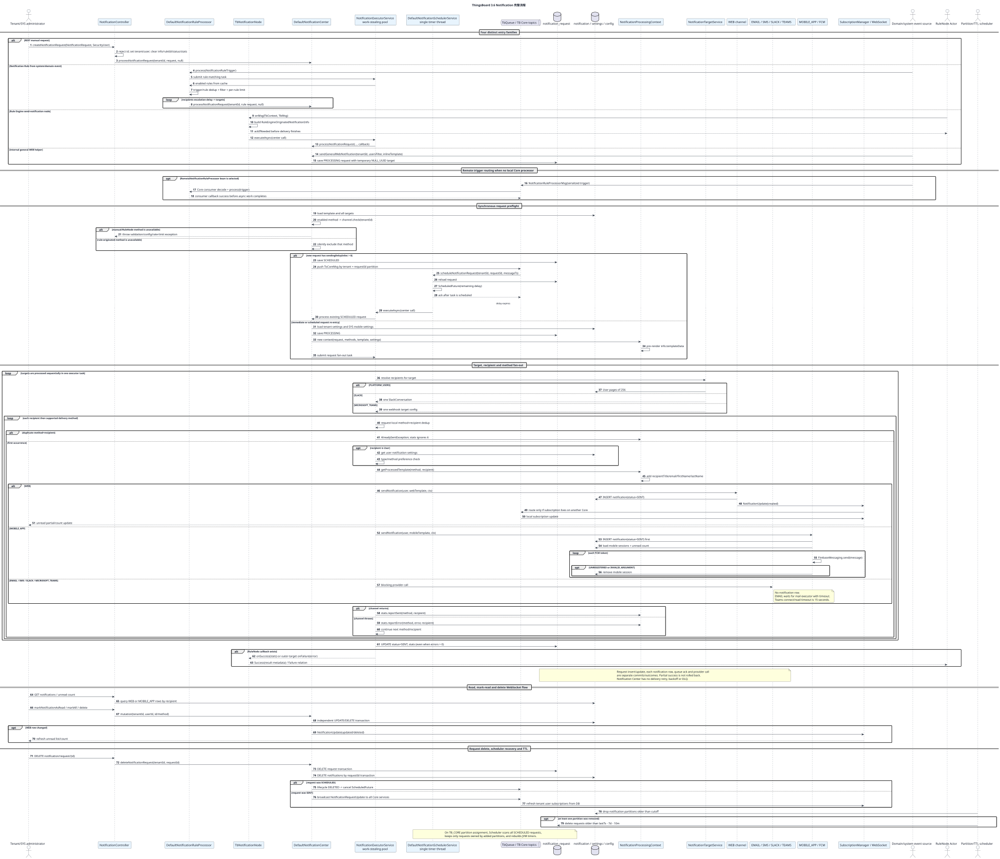](sequence.svg)

[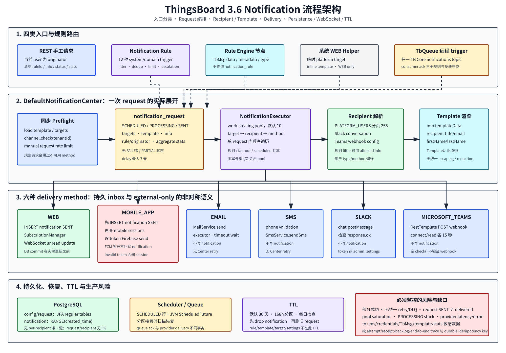](../../assets/architecture/38-notification-flow.svg)

---

## 一、流程目标

Notification Center 把“为什么发、发给谁、用什么内容、走什么通道、如何展示状态”拆成六类持久对象：`notification_rule` 定义事件匹配与升级延迟，`notification_template` 定义各 delivery method 内容，`notification_target` 定义收件人集合，`notification_request` 记录一次提交及聚合统计，`notification` 只记录 WEB/MOBILE_APP 的逐用户结果，settings 则分别落在 `admin_settings(key='notifications')` 和 `user_settings(type='NOTIFICATIONS')`。

最重要的边界是：**request 不是最终通知**。一个 request 可展开为多个 target、recipient 和 delivery method；反过来，EMAIL/SMS/SLACK/TEAMS 即使发送成功也没有 `notification` 行。

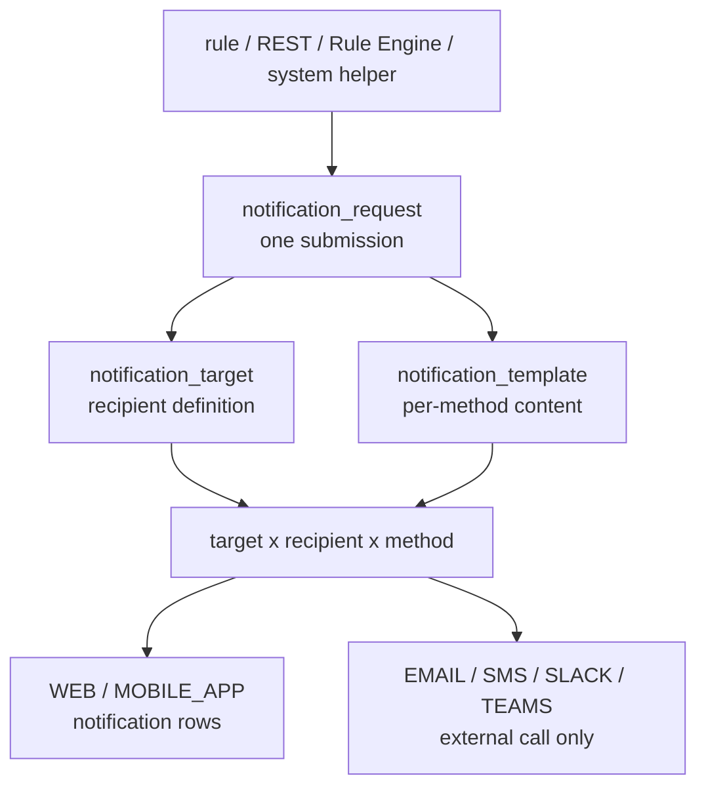
```mermaid
flowchart TB
    WHY["rule / REST / Rule Engine / system helper"] --> REQ["notification_request<br/>one submission"]
    REQ --> TARGET["notification_target<br/>recipient definition"]
    REQ --> TEMPLATE["notification_template<br/>per-method content"]
    TARGET --> EXPAND["target x recipient x method"]
    TEMPLATE --> EXPAND
    EXPAND --> WEB["WEB / MOBILE_APP<br/>notification rows"]
    EXPAND --> EXT["EMAIL / SMS / SLACK / TEAMS<br/>external call only"]
```

必须先固定以下 release-3.6 事实：

1. [org.thingsboard.server.service.notification.DefaultNotificationCenter.processNotificationRequest(TenantId, NotificationRequest, FutureCallback&lt;NotificationRequestStats&gt;)](../../../application/src/main/java/org/thingsboard/server/service/notification/DefaultNotificationCenter.java#L141) 是三类正式提交入口的汇合点，不是 REST Controller 本身。
2. 手工 REST 会清空客户端提供的 `info/ruleId/status/stats`，把当前用户写入 `originatorEntityId`；规则请求带 `ruleId` 和 `RuleOriginatedNotificationInfo`；Rule Engine 节点不带 `ruleId`，但带 `RuleEngineOriginatedNotificationInfo`。
3. [org.thingsboard.server.service.notification.DefaultNotificationCenter.processNotificationRequestAsync(NotificationProcessingContext, List&lt;NotificationTarget&gt;, FutureCallback&lt;NotificationRequestStats&gt;)](../../../application/src/main/java/org/thingsboard/server/service/notification/DefaultNotificationCenter.java#L258) 在共享 Notification work-stealing pool 上顺序遍历 target、recipient、method；不是“每个收件人并发”。
4. request 状态只有 `SCHEDULED/PROCESSING/SENT`，没有 `FAILED/PARTIAL`；最终即使 `stats.errors > 0` 也更新为 `SENT`。
5. 同一 request 内通过 `NotificationRequestStats.processedRecipients` 对 `(deliveryMethod, recipientId)` 做内存去重；它不是数据库唯一约束，也不能跨重启或重复 request 幂等。
6. WEB 先写 `notification`，再推送 WebSocket 更新；MOBILE_APP 也先写 `notification(status=SENT)`，再检查 mobile session 并调用 FCM。后续 FCM 失败不会把行改成失败。
7. EMAIL、SMS、SLACK、MICROSOFT_TEAMS 不写 `notification` 表，也没有统一 delivery receipt。
8. 规则触发与远程组件触发不是一回事：TB Core 内可直接使用 `DefaultNotificationRuleProcessor`；缺少本地实现的组件使用 `RemoteNotificationRuleProcessor` 把序列化 trigger 发到任意 TB Core notifications topic。
9. 规则去重发生在提交 request 之前，基于本地软引用 map 与可选外部 cache；它不是事务性 inbox，也不证明 notification 已送达。
10. 延迟 request 先以 `SCHEDULED` 落库，再按 request 的 TB_CORE 分区路由给 scheduler；scheduler 是 JVM 内 `ScheduledFuture`，但节点获得分区时会扫描数据库恢复。
11. 所有 delivery 调用都没有 Notification Center 级自动重试、指数退避或 DLQ；队列 provider 自身可能有传输语义，但源码没有把一次外部投递失败重建为 request。
12. 默认通知 TTL 为 30 天，只对分区表 `notification` 生效；清理成功后再删除足够老的 `notification_request`。rule/template/target/settings 不受该 TTL 清理器影响。

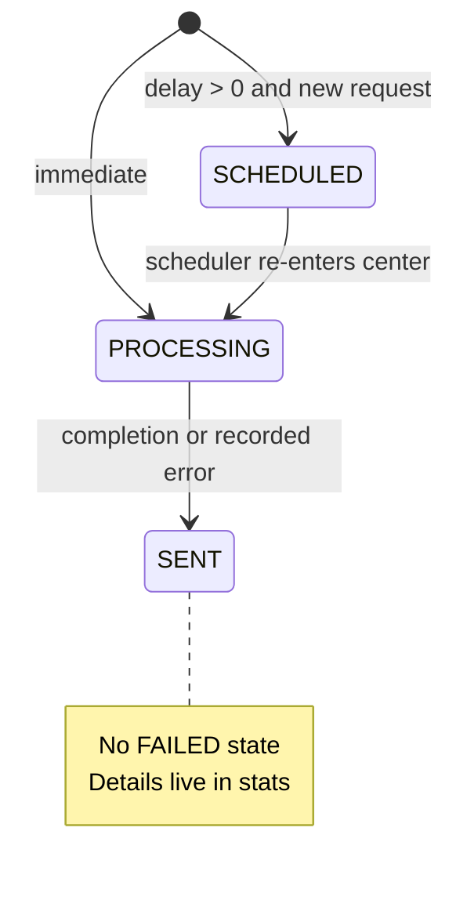
```mermaid
stateDiagram-v2
    [*] --> SCHEDULED: delay > 0 and new request
    [*] --> PROCESSING: immediate
    SCHEDULED --> PROCESSING: scheduler re-enters center
    PROCESSING --> SENT: completion or recorded error
    note right of SENT
      No FAILED state
      Details live in stats
    end note
```

## 二、入口

### 2.1 REST 手工请求

[org.thingsboard.server.controller.NotificationController.createNotificationRequest(NotificationRequest, SecurityUser)](../../../application/src/main/java/org/thingsboard/server/controller/NotificationController.java#L331) 只允许 SYS_ADMIN/TENANT_ADMIN。它拒绝更新已有 request，设置 tenant 与当前 user，强制清空 `info/ruleId/status/stats`，再经 `doSaveAndLog` 调用 Notification Center。这里受 tenant 级 `LimitedApi.NOTIFICATION_REQUESTS` 限流；无可用 channel 或某个启用 channel 未配置时会同步返回 4xx。

`POST /api/notification/request/preview` 是另一条只读路径：[getNotificationRequestPreview(NotificationRequest, int, SecurityUser)](../../../application/src/main/java/org/thingsboard/server/controller/NotificationController.java#L363) 解析 target、取预览 recipient 并渲染模板，但不创建 request、不发送、不写 notification。

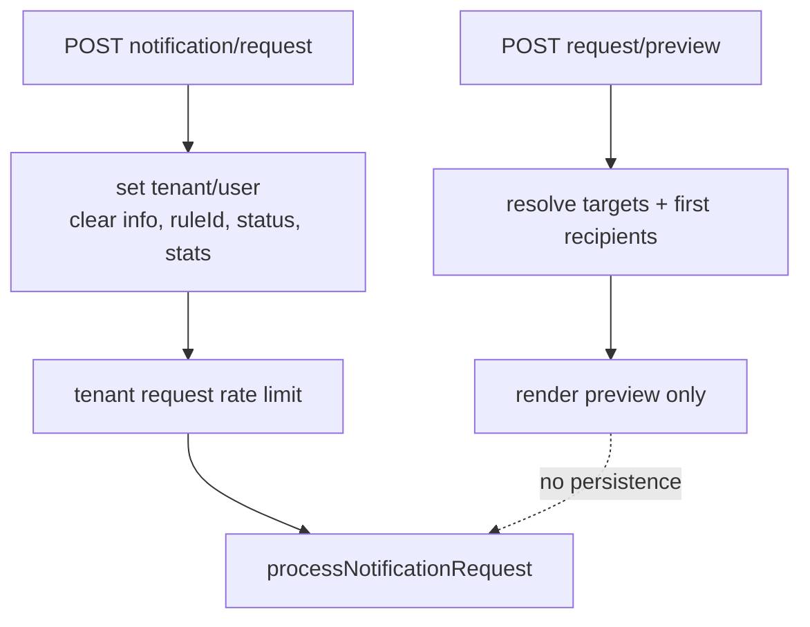
```mermaid
flowchart TB
    REST["POST notification/request"] --> RESET["set tenant/user<br/>clear info, ruleId, status, stats"]
    RESET --> RATE["tenant request rate limit"]
    RATE --> CENTER["processNotificationRequest"]
    PREVIEW["POST request/preview"] --> RESOLVE["resolve targets + first recipients"]
    RESOLVE --> RENDER["render preview only"]
    RENDER -. "no persistence" .-> CENTER
```

### 2.2 Notification Rule 与系统事件入口

系统事件生产者创建 12 种 `NotificationRuleTrigger`。典型入口包括 [EntityActionService](../../../application/src/main/java/org/thingsboard/server/service/action/EntityActionService.java#L221) 的实体数量、实体动作、告警分配与评论，[DefaultAlarmSubscriptionService](../../../application/src/main/java/org/thingsboard/server/service/telemetry/DefaultAlarmSubscriptionService.java#L368) 的告警变化，[DefaultDeviceStateService](../../../application/src/main/java/org/thingsboard/server/service/state/DefaultDeviceStateService.java#L821) 的设备活动，[RuleEngineComponentActor](../../../application/src/main/java/org/thingsboard/server/actors/ruleChain/RuleEngineComponentActor.java#L91) 的 Rule Chain/Node 生命周期，以及 Edge、API usage、rate limit、平台版本服务。

[org.thingsboard.server.service.notification.rule.DefaultNotificationRuleProcessor.process(NotificationRuleTrigger)](../../../application/src/main/java/org/thingsboard/server/service/notification/rule/DefaultNotificationRuleProcessor.java#L104) 异步读取按 tenant/trigger type 缓存的 enabled rules，做 trigger 去重、processor filter、每规则限流，然后按 recipients escalation table 的 `delay -> targets` 为每一档创建独立 request。

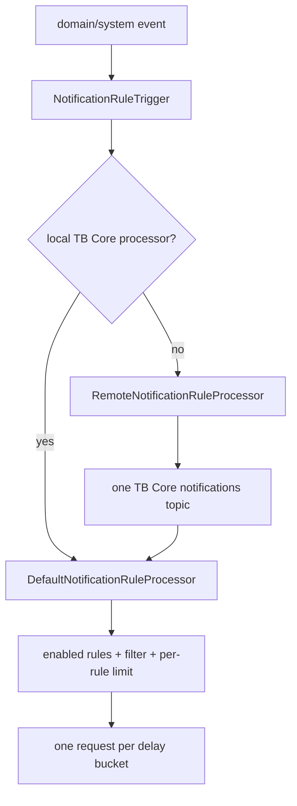
```mermaid
flowchart TB
    EVENT["domain/system event"] --> TRIGGER["NotificationRuleTrigger"]
    TRIGGER --> LOCAL{"local TB Core processor?"}
    LOCAL -->|yes| RP["DefaultNotificationRuleProcessor"]
    LOCAL -->|no| REMOTE["RemoteNotificationRuleProcessor"]
    REMOTE --> NFQ["one TB Core notifications topic"]
    NFQ --> RP
    RP --> RULES["enabled rules + filter + per-rule limit"]
    RULES --> ESC["one request per delay bucket"]
```

### 2.3 Rule Engine “send notification” 节点

[org.thingsboard.rule.engine.notification.TbNotificationNode.onMsg(TbContext, TbMsg)](../../../rule-engine/rule-engine-components/src/main/java/org/thingsboard/rule/engine/notification/TbNotificationNode.java#L79) 把 TbMsg originator、customer、metadata、扁平化 data 与 type 放进 `RuleEngineOriginatedNotificationInfo`，目标和模板来自节点配置，`originatorEntityId` 则是当前 Rule Chain。它先 `ackIfNeeded`，再通过 `ctx.getNotificationExecutor().executeAsync` 提交 center；成功关系消息的 metadata 增加 `notificationRequestResult`，失败走 failure relation。

这条路径是**显式动作节点**，不查询 `notification_rule`，也不设置 `ruleId`，所以走手工 request 限流分支。不要把它与“Rule Engine 组件生命周期触发 Notification Rule”混为一谈。

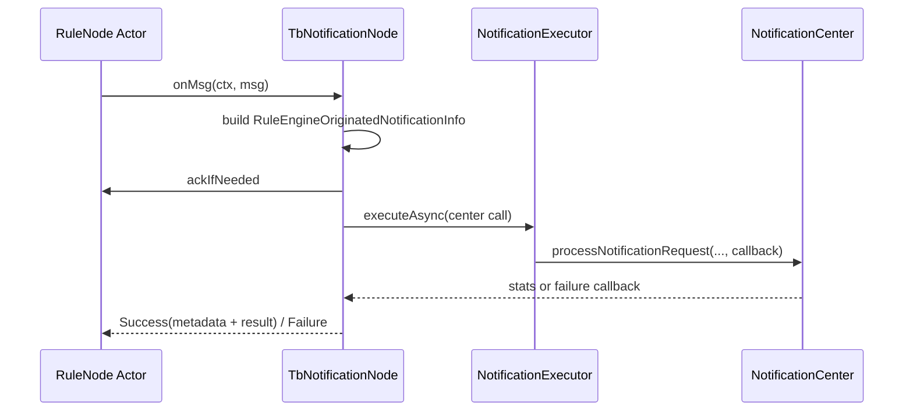
```mermaid
sequenceDiagram
    participant A as RuleNode Actor
    participant N as TbNotificationNode
    participant E as NotificationExecutor
    participant C as NotificationCenter
    A->>N: onMsg(ctx, msg)
    N->>N: build RuleEngineOriginatedNotificationInfo
    N->>A: ackIfNeeded
    N->>E: executeAsync(center call)
    E->>C: processNotificationRequest(..., callback)
    C-->>N: stats or failure callback
    N-->>A: Success(metadata + result) / Failure
```

### 2.4 系统直接 WEB 入口

[org.thingsboard.server.service.notification.DefaultNotificationCenter.sendGeneralWebNotification(TenantId, UsersFilter, NotificationTemplate)](../../../application/src/main/java/org/thingsboard/server/service/notification/DefaultNotificationCenter.java#L222) 为平台内部构造临时 PLATFORM_USERS target 和内联 template，只启用 WEB，并用 `EntityId.NULL_UUID` 占位 targets。它直接保存 `PROCESSING` request 后异步处理，异常只记日志；这是专用 helper，不经过规则筛选与 REST 限流。

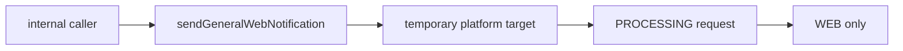
```mermaid
flowchart LR
    SYS["internal caller"] --> GEN["sendGeneralWebNotification"]
    GEN --> TMP["temporary platform target"]
    TMP --> REQ["PROCESSING request"]
    REQ --> WEB["WEB only"]
```

## 三、完整调用链

### 3.1 request 校验与上下文建立

Center 先按 `templateId` 查询或使用内联 template，再逐个加载 target。对 template 中启用的 method 调 `NotificationChannel.check(TenantId)`：手工/Rule Engine 请求遇到失败直接拒绝；带 `ruleId` 的规则请求会忽略该 method。随后 delayed 新请求保存为 `SCHEDULED` 并投递 scheduler 消息；立即请求读取 tenant settings 与 SYS settings、保存为 `PROCESSING`，建立 `NotificationProcessingContext`。

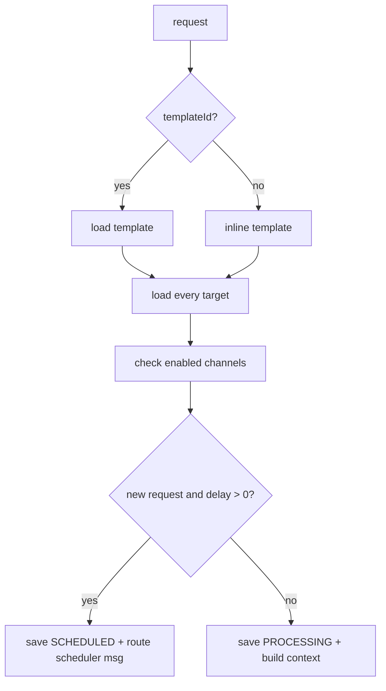
```mermaid
flowchart TB
    IN["request"] --> TEMPLATE{"templateId?"}
    TEMPLATE -->|yes| LOADT["load template"]
    TEMPLATE -->|no| INLINE["inline template"]
    LOADT --> TARGETS["load every target"]
    INLINE --> TARGETS
    TARGETS --> CHECK["check enabled channels"]
    CHECK --> DELAY{"new request and delay > 0?"}
    DELAY -->|yes| SCHED["save SCHEDULED + route scheduler msg"]
    DELAY -->|no| CTX["save PROCESSING + build context"]
```

### 3.2 target 与 recipient 展开

[org.thingsboard.server.service.notification.DefaultNotificationCenter.processForTarget(NotificationTarget, NotificationProcessingContext)](../../../application/src/main/java/org/thingsboard/server/service/notification/DefaultNotificationCenter.java#L316) 对 PLATFORM_USERS 使用 256 条分页惰性遍历；规则专用 filter 会调用 `findRecipientsForRuleNotificationTargetConfig`，普通 filter 调 `findRecipientsForNotificationTargetConfig`。SLACK target 直接产生一个 conversation；MICROSOFT_TEAMS target 直接把 target config 当 recipient。每个 target 只保留其类型支持的 method。

[org.thingsboard.server.dao.notification.DefaultNotificationTargetService.findRecipientsForNotificationTargetConfig(TenantId, PlatformUsersNotificationTargetConfig, PageLink)](../../../dao/src/main/java/org/thingsboard/server/dao/notification/DefaultNotificationTargetService.java#L186) 实现 USER_LIST、TENANT_ADMINISTRATORS、CUSTOMER_USERS、ALL_USERS、SYSTEM_ADMINISTRATORS；规则动态 filter 则在 [findRecipientsForRuleNotificationTargetConfig(TenantId, PlatformUsersNotificationTargetConfig, RuleOriginatedNotificationInfo, PageLink)](../../../dao/src/main/java/org/thingsboard/server/dao/notification/DefaultNotificationTargetService.java#L243) 根据 affected customer/user/originator owner 解析。

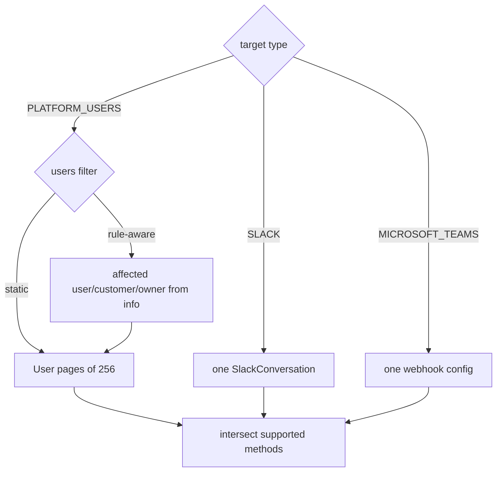
```mermaid
flowchart TB
    TARGET{"target type"}
    TARGET -->|PLATFORM_USERS| UF{"users filter"}
    UF -->|static| PAGE["User pages of 256"]
    UF -->|rule-aware| INFO["affected user/customer/owner from info"]
    INFO --> PAGE
    TARGET -->|SLACK| CONV["one SlackConversation"]
    TARGET -->|MICROSOFT_TEAMS| HOOK["one webhook config"]
    PAGE --> METHODS["intersect supported methods"]
    CONV --> METHODS
    HOOK --> METHODS
```

### 3.3 recipient、偏好与模板

[org.thingsboard.server.service.notification.DefaultNotificationCenter.processForRecipient(NotificationDeliveryMethod, NotificationRecipient, NotificationProcessingContext)](../../../application/src/main/java/org/thingsboard/server/service/notification/DefaultNotificationCenter.java#L374) 先在本次 stats 中标记 processed；若 recipient 是 User，再读取 user settings 并检查 notification type + method 偏好。之后 [NotificationProcessingContext.getProcessedTemplate(NotificationDeliveryMethod, NotificationRecipient)](../../../application/src/main/java/org/thingsboard/server/service/notification/NotificationProcessingContext.java#L156) 在已处理不可变参数的模板副本上按需加入 `recipientTitle/email/firstName/lastName`。

[processTemplate(DeliveryMethodNotificationTemplate, Map&lt;String,String&gt;)](../../../application/src/main/java/org/thingsboard/server/service/notification/NotificationProcessingContext.java#L174) 使用 `TemplateUtils.processTemplate` 替换 `request.info.templateData` 与 recipient context；它不是 HTML escaping、secret redaction 或模板沙箱。

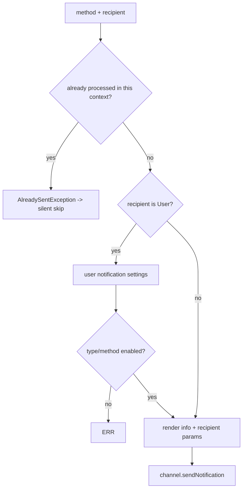
```mermaid
flowchart TB
    PAIR["method + recipient"] --> DUP{"already processed in this context?"}
    DUP -->|yes| SKIP["AlreadySentException -> silent skip"]
    DUP -->|no| PREF{"recipient is User?"}
    PREF -->|yes| SET["user notification settings"]
    SET --> ENABLED{"type/method enabled?"}
    ENABLED -->|no| ERR
    ENABLED -->|yes| RENDER["render info + recipient params"]
    PREF -->|no| RENDER
    RENDER --> CHANNEL["channel.sendNotification"]
```

### 3.4 投递与统计完成

每次 channel 返回即 `reportSent`；抛异常则 `reportError` 并继续下一个 recipient/method。只有 target 解析或外层迭代异常会提前停止整个 request 并触发 callback failure。正常遍历结束后，无论 error 数量多少，[updateRequestStats(...)](../../../application/src/main/java/org/thingsboard/server/service/notification/DefaultNotificationCenter.java#L301) 都将 request 更新为 `SENT`。

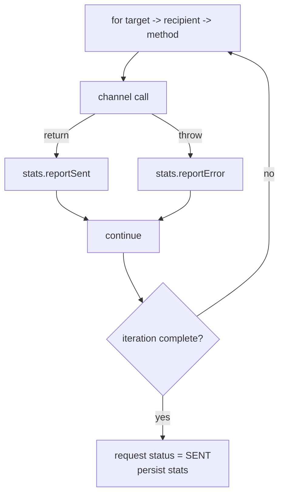
```mermaid
flowchart TB
    LOOP["for target -> recipient -> method"] --> SEND["channel call"]
    SEND -->|return| OK["stats.reportSent"]
    SEND -->|throw| E["stats.reportError"]
    OK --> NEXT["continue"]
    E --> NEXT
    NEXT --> DONE{"iteration complete?"}
    DONE -->|no| LOOP
    DONE -->|yes| SENT["request status = SENT<br/>persist stats"]
```

## 四、消息流

Notification 有三种不同队列用途，不能统称为“Kafka 通知队列”：

- 非 TB Core 组件把 rule trigger 发到 `ToCoreNotificationMsg.notificationRuleProcessorMsg`；TB Core consumer 解码后调用本地 processor。
- delayed request 通过普通 `ToCoreMsg.notificationSchedulerServiceMsg` 按 request id 分区路由到拥有者。
- WEB 创建/读/删更新经 subscription manager 路由；request 删除更新则广播到所有 TB Core notifications topics，使各节点本地 notification subscriptions 刷新。

[org.thingsboard.server.queue.notification.RemoteNotificationRuleProcessor.process(NotificationRuleTrigger)](../../../common/queue/src/main/java/org/thingsboard/server/queue/notification/RemoteNotificationRuleProcessor.java#L73) 的 producer callback 为 `null` 且异常被日志吞掉；[DefaultTbCoreConsumerService](../../../application/src/main/java/org/thingsboard/server/service/queue/DefaultTbCoreConsumerService.java#L546) 解码后调用 processor，并立即 ack queue callback，不等待异步规则处理与最终 delivery。

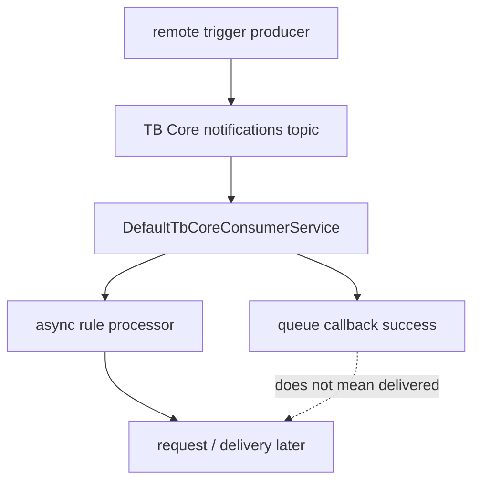
```mermaid
flowchart TB
    REMOTE["remote trigger producer"] --> NFQ["TB Core notifications topic"]
    NFQ --> CORE["DefaultTbCoreConsumerService"]
    CORE --> ACK["queue callback success"]
    CORE --> RP["async rule processor"]
    RP --> REQ["request / delivery later"]
    ACK -. "does not mean delivered" .-> REQ
```

延迟消息链见 [DefaultNotificationCenter.forwardToNotificationSchedulerService(TenantId, NotificationRequestId)](../../../application/src/main/java/org/thingsboard/server/service/notification/DefaultNotificationCenter.java#L562) 与 [DefaultTbCoreConsumerService.forwardToNotificationSchedulerService(NotificationSchedulerServiceMsg, TbCallback)](../../../application/src/main/java/org/thingsboard/server/service/queue/DefaultTbCoreConsumerService.java#L957)。scheduler 以消息时间 `ts` 计算剩余 delay，负数归零；分区接管时 [DefaultNotificationSchedulerService.onAddedPartitions(Set&lt;TopicPartitionInfo&gt;)](../../../application/src/main/java/org/thingsboard/server/service/notification/DefaultNotificationSchedulerService.java#L103) 扫描全部 SCHEDULED request 并只恢复属于新增分区的项。

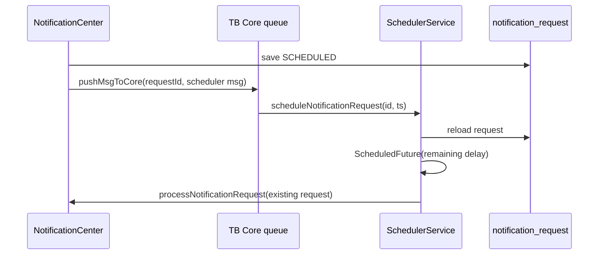
```mermaid
sequenceDiagram
    participant C as NotificationCenter
    participant Q as TB Core queue
    participant S as SchedulerService
    participant DB as notification_request
    C->>DB: save SCHEDULED
    C->>Q: pushMsgToCore(requestId, scheduler msg)
    Q->>S: scheduleNotificationRequest(id, ts)
    S->>DB: reload request
    S->>S: ScheduledFuture(remaining delay)
    S->>C: processNotificationRequest(existing request)
```

## 五、时序图

详细可点击版本见 [sequence.puml](sequence.puml) 和 [sequence.svg](sequence.svg)。下图压缩主干，特别强调数据库提交与外部调用没有共同事务。

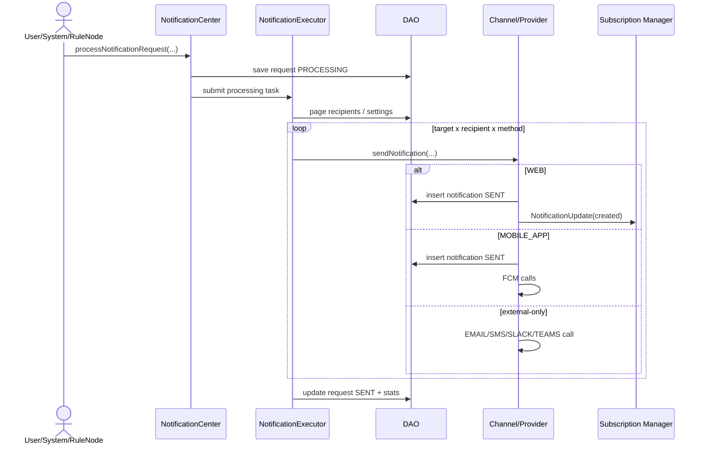
```mermaid
sequenceDiagram
    actor U as User/System/RuleNode
    participant C as NotificationCenter
    participant X as NotificationExecutor
    participant D as DAO
    participant P as Channel/Provider
    participant W as Subscription Manager
    U->>C: processNotificationRequest(...)
    C->>D: save request PROCESSING
    C->>X: submit processing task
    X->>D: page recipients / settings
    loop target x recipient x method
        X->>P: sendNotification(...)
        alt WEB
            P->>D: insert notification SENT
            P->>W: NotificationUpdate(created)
        else MOBILE_APP
            P->>D: insert notification SENT
            P->>P: FCM calls
        else external-only
            P->>P: EMAIL/SMS/SLACK/TEAMS call
        end
    end
    X->>D: update request SENT + stats
```

六个 channel 的真实行为如下：

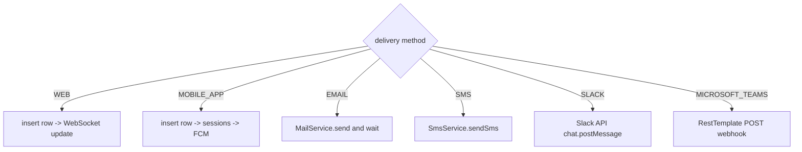
```mermaid
flowchart TB
    M{"delivery method"}
    M -->|WEB| W["insert row -> WebSocket update"]
    M -->|MOBILE_APP| F["insert row -> sessions -> FCM"]
    M -->|EMAIL| E["MailService.send and wait"]
    M -->|SMS| S["SmsService.sendSms"]
    M -->|SLACK| L["Slack API chat.postMessage"]
    M -->|MICROSOFT_TEAMS| T["RestTemplate POST webhook"]
```

## 六、数据变化

### 6.1 request 与 notification

`notification_request` 在同步入口写一次 `SCHEDULED` 或 `PROCESSING`，异步结束再用单条 update 改为 `SENT` 并保存 `NotificationRequestStats`。`notification` 则是分区表，WEB/MOBILE_APP 每个 User 各写一行；其 `info` 不是表列，而是 [NotificationEntity](../../../dao/src/main/java/org/thingsboard/server/dao/model/sql/NotificationEntity.java#L108) 通过 `@Formula` 按 `request_id` 读取 request.info。

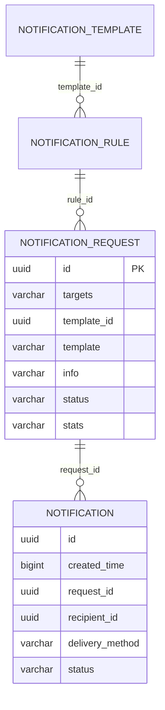
```mermaid
erDiagram
    NOTIFICATION_REQUEST ||--o{ NOTIFICATION : request_id
    NOTIFICATION_TEMPLATE ||--o{ NOTIFICATION_RULE : template_id
    NOTIFICATION_RULE ||--o{ NOTIFICATION_REQUEST : rule_id
    NOTIFICATION_REQUEST {
      uuid id PK
      varchar targets
      uuid template_id
      varchar template
      varchar info
      varchar status
      varchar stats
    }
    NOTIFICATION {
      uuid id
      bigint created_time
      uuid request_id
      uuid recipient_id
      varchar delivery_method
      varchar status
    }
```

### 6.2 settings

[org.thingsboard.server.dao.notification.DefaultNotificationSettingsService.saveNotificationSettings(TenantId, NotificationSettings)](../../../dao/src/main/java/org/thingsboard/server/dao/notification/DefaultNotificationSettingsService.java#L103) 把 provider 配置序列化到 `admin_settings`，key 为 `notifications` 并走 cache eviction；只有 SYS tenant 可保存 MOBILE_APP service account。用户偏好由 [saveUserNotificationSettings(TenantId, UserId, UserNotificationSettings)](../../../dao/src/main/java/org/thingsboard/server/dao/notification/DefaultNotificationSettingsService.java#L157) 写 `user_settings`。

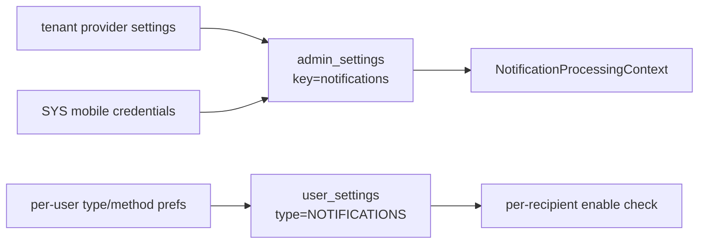
```mermaid
flowchart LR
    TENANT["tenant provider settings"] --> ADMIN["admin_settings<br/>key=notifications"]
    SYS["SYS mobile credentials"] --> ADMIN
    USER["per-user type/method prefs"] --> US["user_settings<br/>type=NOTIFICATIONS"]
    ADMIN --> CTX["NotificationProcessingContext"]
    US --> FILTER["per-recipient enable check"]
```

### 6.3 删除与 TTL

[DefaultNotificationRequestService.deleteNotificationRequest(TenantId, NotificationRequestId)](../../../dao/src/main/java/org/thingsboard/server/dao/notification/DefaultNotificationRequestService.java#L158) 先删除 request，再按 request id 删除 notification；service 无外层事务，两个 repository 操作可部分成功。删除 SENT request 后广播 request update；删除 SCHEDULED request 后广播 lifecycle event 取消 JVM future。

[org.thingsboard.server.service.ttl.NotificationsCleanUpService.cleanUp()](../../../application/src/main/java/org/thingsboard/server/service/ttl/NotificationsCleanUpService.java#L85) 默认每日运行，只由 SYS tenant TB_CORE owner drop `notification` 整分区。随后以最后删除 notification 时间减去最大一周 sending delay 和 10 分钟 gap，删除更老 request。精度受 168 小时分区与调度周期影响。

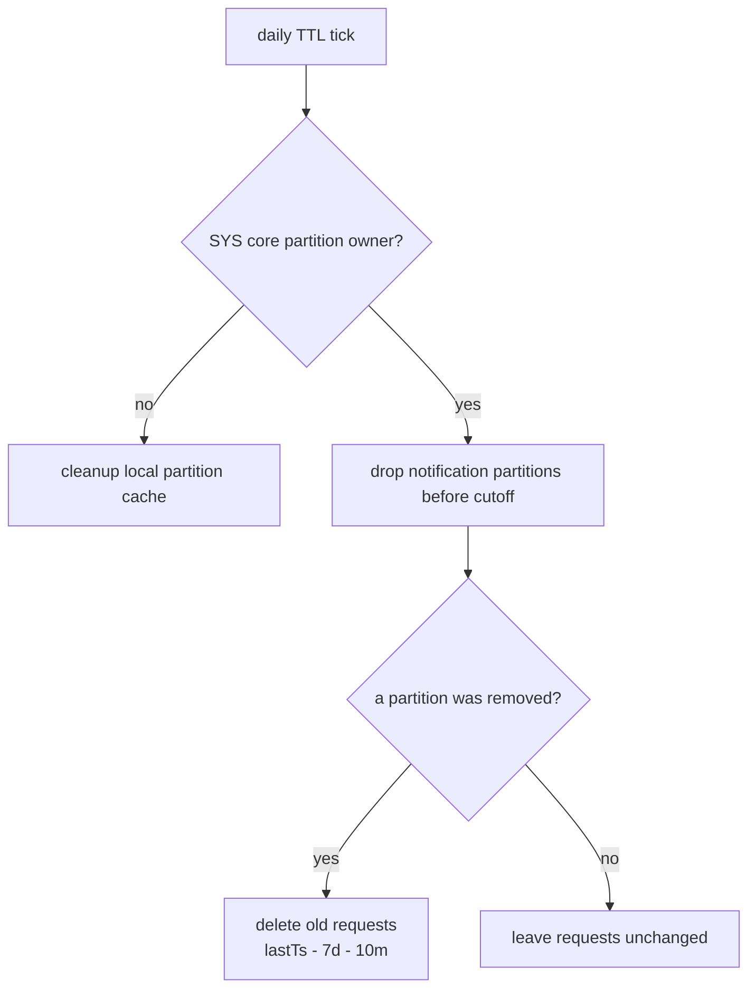
```mermaid
flowchart TB
    TICK["daily TTL tick"] --> OWNER{"SYS core partition owner?"}
    OWNER -->|no| CACHE["cleanup local partition cache"]
    OWNER -->|yes| DROP["drop notification partitions before cutoff"]
    DROP --> LAST{"a partition was removed?"}
    LAST -->|yes| RQ["delete old requests<br/>lastTs - 7d - 10m"]
    LAST -->|no| END["leave requests unchanged"]
```

## 七、源码分析

### 7.1 核心 application service / processor

- [org.thingsboard.server.service.notification.DefaultNotificationCenter](../../../application/src/main/java/org/thingsboard/server/service/notification/DefaultNotificationCenter.java#L100)：同步校验、request 状态、异步 fan-out、WEB 持久化、subscription 更新、scheduler 路由。
- [org.thingsboard.server.service.notification.rule.DefaultNotificationRuleProcessor](../../../application/src/main/java/org/thingsboard/server/service/notification/rule/DefaultNotificationRuleProcessor.java#L72)：规则缓存、trigger 去重、filter/clear、升级 request、规则删除时取消 scheduled request。
- [org.thingsboard.server.service.notification.NotificationProcessingContext](../../../application/src/main/java/org/thingsboard/server/service/notification/NotificationProcessingContext.java#L50)：tenant/SYS settings 选择、模板两阶段处理、request-local stats。
- [org.thingsboard.server.service.notification.DefaultNotificationSchedulerService](../../../application/src/main/java/org/thingsboard/server/service/notification/DefaultNotificationSchedulerService.java#L70)：分区拥有权、数据库恢复、单线程 timer、到期后重新进入 center。
- [org.thingsboard.server.service.executors.NotificationExecutorService](../../../application/src/main/java/org/thingsboard/server/service/executors/NotificationExecutorService.java#L32)：默认大小 10 的 work-stealing pool。底层 [AbstractListeningExecutor.init()](../../../common/util/src/main/java/org/thingsboard/common/util/AbstractListeningExecutor.java#L51) 创建 pool，shutdown 只调用 `service.shutdown()`。

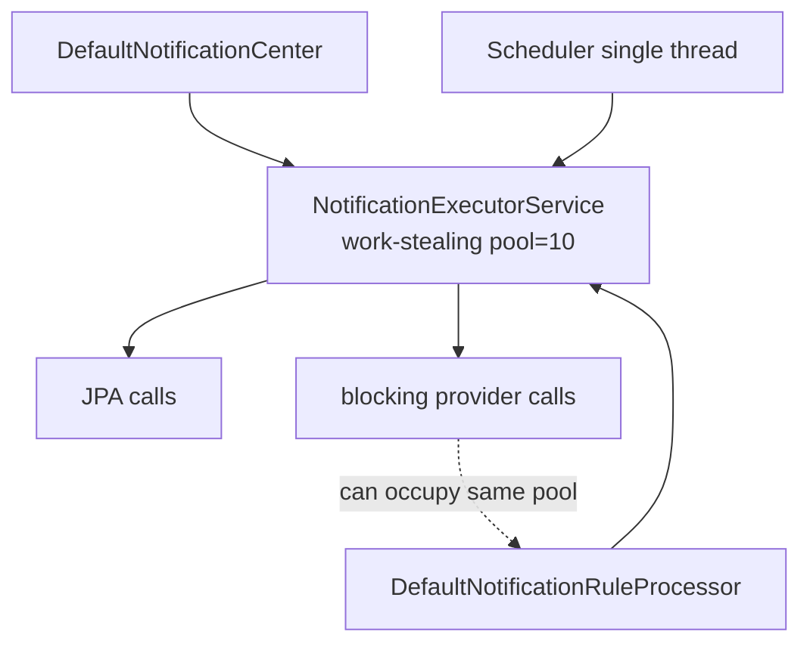
```mermaid
flowchart TB
    CENTER["DefaultNotificationCenter"] --> EXEC["NotificationExecutorService<br/>work-stealing pool=10"]
    RULE["DefaultNotificationRuleProcessor"] --> EXEC
    SCHED["Scheduler single thread"] --> EXEC
    EXEC --> DB["JPA calls"]
    EXEC --> IO["blocking provider calls"]
    IO -. "can occupy same pool" .-> RULE
```

### 7.2 规则 trigger processors

[NotificationRuleTriggerProcessor](../../../application/src/main/java/org/thingsboard/server/service/notification/rule/trigger/NotificationRuleTriggerProcessor.java#L32) 的真实契约是 `matchesFilter(T,C)`、默认 false 的 `matchesClearRule(T,C)`、`constructNotificationInfo(T)` 与 `getTriggerType()`。release-3.6 注册 12 个实现：

| Trigger type | Processor 与 filter 重点 |
|---|---|
| ENTITY_ACTION | [EntityActionTriggerProcessor.matchesFilter(EntityActionTrigger, EntityActionNotificationRuleTriggerConfig)](../../../application/src/main/java/org/thingsboard/server/service/notification/rule/trigger/EntityActionTriggerProcessor.java#L49)：created/updated/deleted 与 entity types |
| ALARM | [AlarmTriggerProcessor.matchesFilter(AlarmTrigger, AlarmNotificationRuleTriggerConfig)](../../../application/src/main/java/org/thingsboard/server/service/notification/rule/trigger/AlarmTriggerProcessor.java#L54)：type、severity、created/severity/ack/clear；唯一覆盖 `matchesClearRule` 的实现位于 [L92](../../../application/src/main/java/org/thingsboard/server/service/notification/rule/trigger/AlarmTriggerProcessor.java#L92) |
| ALARM_COMMENT | [AlarmCommentTriggerProcessor.matchesFilter(AlarmCommentTrigger, AlarmCommentNotificationRuleTriggerConfig)](../../../application/src/main/java/org/thingsboard/server/service/notification/rule/trigger/AlarmCommentTriggerProcessor.java#L61)：comment action 与 alarm type |
| ALARM_ASSIGNMENT | [AlarmAssignmentTriggerProcessor.matchesFilter(AlarmAssignmentTrigger, AlarmAssignmentNotificationRuleTriggerConfig)](../../../application/src/main/java/org/thingsboard/server/service/notification/rule/trigger/AlarmAssignmentTriggerProcessor.java#L53)：assigned/unassigned |
| DEVICE_ACTIVITY | [DeviceActivityTriggerProcessor.matchesFilter(DeviceActivityTrigger, DeviceActivityNotificationRuleTriggerConfig)](../../../application/src/main/java/org/thingsboard/server/service/notification/rule/trigger/DeviceActivityTriggerProcessor.java#L58)：active/inactive 与 inactivity duration |
| RULE_ENGINE_COMPONENT_LIFECYCLE_EVENT | [RuleEngineComponentLifecycleEventTriggerProcessor.matchesFilter(...)](../../../application/src/main/java/org/thingsboard/server/service/notification/rule/trigger/RuleEngineComponentLifecycleEventTriggerProcessor.java#L63)：chain 白名单、RE partition owner、node/chain event、only failure |
| EDGE_CONNECTION | [EdgeConnectionTriggerProcessor.matchesFilter(EdgeConnectionTrigger, EdgeConnectionNotificationRuleTriggerConfig)](../../../application/src/main/java/org/thingsboard/server/service/notification/rule/trigger/EdgeConnectionTriggerProcessor.java#L49)：edge 与 connected/disconnected |
| EDGE_COMMUNICATION_FAILURE | [EdgeCommunicationFailureTriggerProcessor.matchesFilter(...)](../../../application/src/main/java/org/thingsboard/server/service/notification/rule/trigger/EdgeCommunicationFailureTriggerProcessor.java#L48)：**配置 edges 非空时源码返回 `!contains(edgeId)`**，即排除所列 edge；不要按 UI 名称反向猜测 |
| NEW_PLATFORM_VERSION | [NewPlatformVersionTriggerProcessor.matchesFilter(...)](../../../application/src/main/java/org/thingsboard/server/service/notification/rule/trigger/NewPlatformVersionTriggerProcessor.java#L48)：只判断 update available |
| ENTITIES_LIMIT | [EntitiesLimitTriggerProcessor.matchesFilter(...)](../../../application/src/main/java/org/thingsboard/server/service/notification/rule/trigger/EntitiesLimitTriggerProcessor.java#L63)：entity type 与严格 `currentCount == (int)(limit*threshold)` |
| API_USAGE_LIMIT | [ApiUsageLimitTriggerProcessor.matchesFilter(...)](../../../application/src/main/java/org/thingsboard/server/service/notification/rule/trigger/ApiUsageLimitTriggerProcessor.java#L55)：API feature 与 threshold |
| RATE_LIMITS | [RateLimitsTriggerProcessor.matchesFilter(...)](../../../application/src/main/java/org/thingsboard/server/service/notification/rule/trigger/RateLimitsTriggerProcessor.java#L60)：limit level、API label 与 API 白名单 |

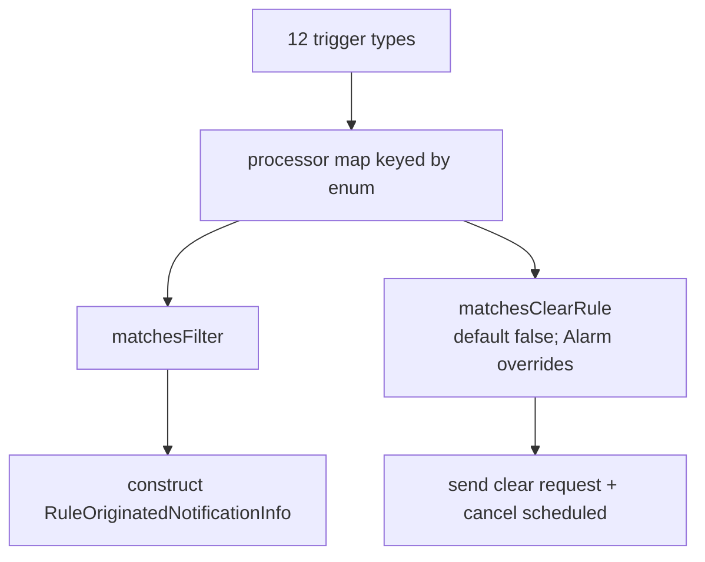
```mermaid
flowchart TB
    T["12 trigger types"] --> P["processor map keyed by enum"]
    P --> F["matchesFilter"]
    P --> C["matchesClearRule<br/>default false; Alarm overrides"]
    F --> INFO["construct RuleOriginatedNotificationInfo"]
    C --> CLEAR["send clear request + cancel scheduled"]
```

### 7.3 DAO services 与配置对象

`DefaultNotificationTemplateService` 禁止修改已有 template 的 notification type，并阻止删除被 scheduled request 引用的 template；`DefaultNotificationTargetService` 阻止删除被 scheduled request 或 rule 引用的 target；`DefaultNotificationRuleService` 禁止修改 trigger type。名称唯一性来自 `(tenant_id,name)` 约束，不是 service 内先查后写。

[DefaultNotificationSettingsService.findNotificationSettings(TenantId)](../../../dao/src/main/java/org/thingsboard/server/dao/notification/DefaultNotificationSettingsService.java#L126) 未配置时返回空 method map；[UserNotificationSettings.isEnabled(NotificationType, NotificationDeliveryMethod)](../../../common/data/src/main/java/org/thingsboard/server/common/data/notification/settings/UserNotificationSettings.java#L75) 对缺失 type/method 默认 true。

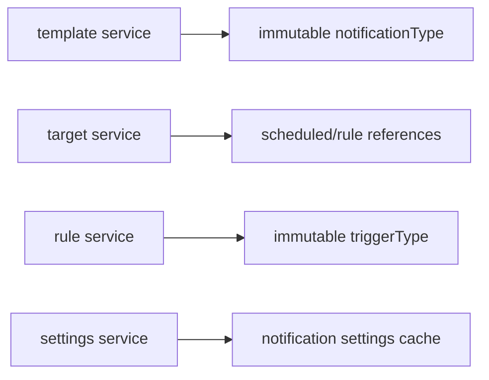
```mermaid
flowchart LR
    TEMPLATE["template service"] --> TC["immutable notificationType"]
    TARGET["target service"] --> RC["scheduled/rule references"]
    RULE["rule service"] --> TR["immutable triggerType"]
    SETTINGS["settings service"] --> CACHE["notification settings cache"]
```

### 7.4 delivery providers

| Method | 实际调用 | 是否写 `notification` | 关键语义 |
|---|---|---:|---|
| WEB | [DefaultNotificationCenter.sendNotification(User, WebDeliveryMethodNotificationTemplate, NotificationProcessingContext)](../../../application/src/main/java/org/thingsboard/server/service/notification/DefaultNotificationCenter.java#L404) | 是 | 保存 `SENT` 后发 subscription update |
| EMAIL | [EmailNotificationChannel.sendNotification(User, EmailDeliveryMethodNotificationTemplate, NotificationProcessingContext)](../../../application/src/main/java/org/thingsboard/server/service/notification/channels/EmailNotificationChannel.java#L55) | 否 | `MailService.send`，内部 executor submit 后按 timeout 等待 |
| SMS | [SmsNotificationChannel.sendNotification(User, SmsDeliveryMethodNotificationTemplate, NotificationProcessingContext)](../../../application/src/main/java/org/thingsboard/server/service/notification/channels/SmsNotificationChannel.java#L55) | 否 | 校验 phone，再同步 `SmsService.sendSms` |
| SLACK | [SlackNotificationChannel.sendNotification(SlackConversation, SlackDeliveryMethodNotificationTemplate, NotificationProcessingContext)](../../../application/src/main/java/org/thingsboard/server/service/notification/channels/SlackNotificationChannel.java#L58) | 否 | [DefaultSlackService.sendMessage(TenantId,String,String,String)](../../../application/src/main/java/org/thingsboard/server/service/notification/provider/DefaultSlackService.java#L84) 同步 Slack SDK 请求并检查 `response.ok` |
| MICROSOFT_TEAMS | [MicrosoftTeamsNotificationChannel.sendNotification(MicrosoftTeamsNotificationTargetConfig, MicrosoftTeamsDeliveryMethodNotificationTemplate, NotificationProcessingContext)](../../../application/src/main/java/org/thingsboard/server/service/notification/channels/MicrosoftTeamsNotificationChannel.java#L78) | 否 | `RestTemplate.postForEntity`，connect/read timeout 各 15 秒 |
| MOBILE_APP | [MobileAppNotificationChannel.sendNotification(User, MobileAppDeliveryMethodNotificationTemplate, NotificationProcessingContext)](../../../application/src/main/java/org/thingsboard/server/service/notification/channels/MobileAppNotificationChannel.java#L85) | 是 | 先写行，后查 session、逐 token 调 [DefaultFirebaseService.sendMessage(...)](../../../application/src/main/java/org/thingsboard/server/service/notification/provider/DefaultFirebaseService.java#L76)；无效 token 会移除 session |

```mermaid
flowchart TB
    PERSIST["persistent inbox methods"] --> WEB["WEB"]
    PERSIST --> MOBILE["MOBILE_APP"]
    EXTERNAL["external-only methods"] --> EMAIL["EMAIL"]
    EXTERNAL --> SMS["SMS"]
    EXTERNAL --> SLACK["SLACK"]
    EXTERNAL --> TEAMS["MICROSOFT_TEAMS"]
```

## 八、Actor 分析

Notification Center 本身不是 Actor，也没有 per-tenant/per-request mailbox。Actor 参与点只有上游：Rule Node 的 `onMsg` 在 RuleNode Actor 调用栈中构造 request，但随后借 `ctx.getNotificationExecutor()` 脱离 Actor；RuleEngineComponentActor 产生 lifecycle trigger，也立即进入 processor/queue 链。真正 fan-out 在共享 Java executor 中执行。

因此 Actor 的单线程顺序性不覆盖 request 状态、provider 调用或 WebSocket 更新。`ackIfNeeded` 也发生在实际 delivery 完成之前；Rule Node 的 Success/Failure relation 依赖 center callback，但原消息 queue ack 与外部通知不是一个事务。

```mermaid
flowchart TB
    ACTOR["RuleNode Actor mailbox"] --> ONMSG["TbNotificationNode.onMsg"]
    ONMSG --> ACK["ackIfNeeded"]
    ONMSG --> NEXEC["NotificationExecutor"]
    NEXEC --> CENTER["request + delivery"]
    CENTER --> CALLBACK["Success/Failure relation callback"]
    ACK -. "earlier boundary" .-> CALLBACK
```

Actor 风险集中在语义错觉而非 mailbox 堵塞：如果节点配置了 ack，消息可先 ack，之后通知失败；如果 callback 永远未到，Rule Node relation 会悬而未决，但 request 可能已经部分投递。Notification executor 又同时承载规则匹配、request fan-out 与 scheduled request，慢 SMTP/HTTP/FCM 会与规则处理争用同一 pool。

```mermaid
flowchart LR
    RULES["rule matching"] --> POOL["shared notification pool"]
    FAN["recipient fan-out"] --> POOL
    SCHEDULED["scheduled execution"] --> POOL
    POOL --> BLOCK["DB + blocking external I/O"]
```

## 九、Kafka 分析

代码依赖的是 ThingsBoard `TbQueue` 抽象，部署可选择 Kafka、RabbitMQ、Pub/Sub 等实现。只有当 queue provider 配成 Kafka 时，下述逻辑才落到 Kafka；文档不能把抽象 topic 直接写成 release-3.6 固定 Kafka 实现。

通知相关队列消息的 ack 边界都早于业务完成：remote trigger consumer 调用异步 `process` 后 ack；scheduler consumer 只要成功创建 ScheduledFuture 就 ack；subscription route 只保证更新进入对应本地服务。没有 notification 专属消费事务把 queue offset、request 行和外部 provider 统一提交。

```mermaid
flowchart TB
    TBQ["TbQueue abstraction"] --> K["Kafka when configured"]
    TBQ --> O["other queue providers"]
    K --> A["trigger route"]
    K --> B["scheduler route"]
    K --> C["subscription route"]
    A -. "no atomic DB/provider commit" .-> DB["PostgreSQL / external APIs"]
```

幂等上，queue message UUID 不是业务幂等键。remote trigger 在发送前只做本 JVM 的 trigger-level 去重，TB Core 还会做 rule-level cache 去重；request 保存和外部投递没有唯一业务键。重复消费、缓存失效或 failover 竞态仍可能生成多个 request。相反，request 内 targets 重叠只由内存 stats 去重。

```mermaid
flowchart LR
    DUP["duplicate trigger/message"] --> CACHE{"dedup cache hit?"}
    CACHE -->|yes| DROP["drop"]
    CACHE -->|no / expired| R1["new request"]
    R1 --> SEND["external delivery"]
    SEND -. "no provider idempotency key" .-> AGAIN["possible duplicate"]
```

## 十、数据库分析

[schema-entities.sql](../../../dao/src/main/resources/sql/schema-entities.sql#L806) 定义五张 notification domain 表。`notification_rule.template_id` 有外键；target UUID 列表、recipient config、template config、request info/stats 都是 VARCHAR JSON；`notification` 是按 `created_time` RANGE 分区且基础定义无 PK/UNIQUE，只有普通 `id` 索引。`request_id/recipient_id` 也没有外键，因此删除与 TTL 靠应用维护。

```mermaid
flowchart TB
    META["configuration tables"] --> T1["notification_target"]
    META --> T2["notification_template"]
    META --> T3["notification_rule"]
    RUN["runtime tables"] --> R["notification_request<br/>regular JPA table"]
    RUN --> N["notification<br/>RANGE partition"]
    N -. "no FK" .-> R
```

索引面向列表与 unread 查询：[schema-entities-idx.sql](../../../dao/src/main/resources/sql/schema-entities-idx.sql#L100) 为配置表建 tenant/time 索引，为 request 建 tenant、rule+originator、status 索引，为 notification 建 id、request_id、`delivery_method+recipient_id+created_time` 以及 `status <> 'READ'` 部分索引。缺少 `(request_id,recipient_id,delivery_method)` 唯一约束意味着数据库不阻止重复 per-user 行。

JPA 操作也不是一个大事务。每次 WEB/MOBILE save、request stats update、mark read、删除 request、按 request 删除 notification 都是独立 DAO/repository transaction；外部 provider 不在其中。尤其 request 删除的两步可留下孤立 notification 或先删 notification 后保留 request，具体取决于失败位置。

```mermaid
sequenceDiagram
    participant S as RequestService
    participant RR as RequestRepository
    participant NR as NotificationRepository
    S->>RR: delete request TX
    RR-->>S: commit
    S->>NR: delete rows by requestId TX
    alt second TX fails
      NR-->>S: exception
      Note over RR,NR: request already gone, no outer rollback
    end
```

敏感数据面：notification template configuration 可达 10 MB，request inline template 同样可达 10 MB，request info 可达 1 MB；Rule Engine 节点把 TbMsg metadata/data 复制到 info，settings 保存 Slack bot token 与 Firebase service-account credentials。模板渲染、日志中的 trigger/request 与数据库字段都没有统一脱敏器，数据库备份、管理员 API、debug 日志和错误 stats 都需要按敏感资产治理。

```mermaid
flowchart TB
    SECRET["tokens / service account"] --> ADMIN["admin_settings JSON"]
    MSG["TbMsg data + metadata"] --> INFO["notification_request.info"]
    TEMPLATE["template body/config"] --> REQ["template or template_id"]
    ERROR["provider exception message"] --> STATS["notification_request.stats"]
```

## 十一、异常处理

### 11.1 同步拒绝与部分成功

模板缺失、无可用 method、手工请求缺少相应 target、限流失败与 channel `check` 失败发生在异步 fan-out 之前，调用方同步看到异常。进入 fan-out 后，recipient/method 失败只记 stats 并继续；target 解析异常会中止后续 target。已成功的外部发送和已提交的 notification 行不会回滚。

```mermaid
flowchart TB
    PRE["preflight validation"] -->|fail| SYNC["caller gets exception; no fan-out"]
    PRE -->|pass| LOOP["fan-out"]
    LOOP -->|one channel fails| STAT["record error and continue"]
    LOOP -->|target iteration fails| STOP["stop remaining targets"]
    STAT --> PARTIAL["partial success remains committed"]
    STOP --> PARTIAL
```

### 11.2 retry、状态与观察缺口

release-3.6 没有 Notification Center delivery retry。scheduled delay 是业务升级/延迟，不是失败重试；规则 escalation 会创建多份 request，也不是对上一份失败的补偿。`SENT` 表示处理循环结束或 scheduler 捕获了错误后写入 stats，不表示 provider receipt。MOBILE_APP 的行甚至可在“用户无 mobile session”或 FCM 报错前已经是 `SENT`。

观察上可见 request stats、日志、TB Core notification message counters 和 WEB unread 状态；不可见统一的 executor backlog、provider latency/retry count、逐次 attempt、delivery receipt、dead letter 与端到端 trace。生产监控至少应补：pool saturation、request PROCESSING 停留、stats error ratio、各 provider latency/error、scheduled 恢复数量、WebSocket 推送失败、TTL 最老分区和孤立行。

```mermaid
flowchart LR
    OBS["currently observable"] --> A["request stats"]
    OBS --> B["logs / queue counters"]
    OBS --> C["WEB unread state"]
    GAP["gaps"] --> D["attempt/receipt/retry"]
    GAP --> E["executor backlog"]
    GAP --> F["end-to-end trace"]
```

### 11.3 典型故障矩阵

| 故障点 | 已提交数据 | 后续行为 | 自动重试 |
|---|---|---|---|
| request preflight 失败 | 通常无新 request；scheduled 重新处理时旧行仍在 | 同步抛错，scheduler 分支会把旧 request 改 `SENT`+error | 无 |
| 某 recipient EMAIL/SMS/Slack/Teams 失败 | request 为 PROCESSING，其他成功外部投递不可撤销 | stats error，继续 | 无 |
| WEB insert 失败 | 无该 notification 行 | stats error，继续，无 WebSocket create | 无 |
| WEB insert 成功但 subscription route 失败 | notification 行已存在 | channel 可能抛错并计为 error；客户端重连可从 DB 拉取 | 无 |
| MOBILE insert 成功但无 session/FCM 失败 | `SENT` notification 行已存在 | stats error；无状态回写 | 无 |
| stats update 失败 | request 可能长期 PROCESSING | 只记 error 日志，callback 仍可 success | 无 |
| scheduler 节点关闭 | SCHEDULED 行存在，内存 future 丢失 | 分区重新分配时扫描恢复 | 不是失败 retry |

## 十二、源码阅读路线

1. 从 [NotificationController.createNotificationRequest(...)](../../../application/src/main/java/org/thingsboard/server/controller/NotificationController.java#L331) 对照手工字段重写与权限。
2. 阅读 [DefaultNotificationCenter.processNotificationRequest(...)](../../../application/src/main/java/org/thingsboard/server/service/notification/DefaultNotificationCenter.java#L141)，标记同步校验、SCHEDULED 与 PROCESSING 分叉。
3. 沿 [processForTarget(...)](../../../application/src/main/java/org/thingsboard/server/service/notification/DefaultNotificationCenter.java#L316) 和 [processForRecipient(...)](../../../application/src/main/java/org/thingsboard/server/service/notification/DefaultNotificationCenter.java#L374) 看展开、偏好、去重与 stats。
4. 逐个阅读六个 channel，重点比较 WEB/MOBILE_APP 与四个 external-only method 的数据库语义。
5. 从 [DefaultNotificationRuleProcessor.process(...)](../../../application/src/main/java/org/thingsboard/server/service/notification/rule/DefaultNotificationRuleProcessor.java#L104) 进入 12 个 trigger processor，再反查各 system event producer。
6. 对照 [TbNotificationNode.onMsg(...)](../../../rule-engine/rule-engine-components/src/main/java/org/thingsboard/rule/engine/notification/TbNotificationNode.java#L79)，确认它绕过 rule 表。
7. 沿 remote trigger、scheduler、subscription 三种 queue 消息读 [DefaultTbCoreConsumerService](../../../application/src/main/java/org/thingsboard/server/service/queue/DefaultTbCoreConsumerService.java#L406)。
8. 最后读 schema、repository transaction 与 TTL，核对状态、索引、无唯一约束和删除边界。

```mermaid
flowchart LR
    A["Controller / producers"] --> B["Center / RuleProcessor"]
    B --> C["Target + Context"]
    C --> D["Channels/providers"]
    D --> E["DAO/schema"]
    E --> F["Queue/WS/TTL"]
```

排查线上“通知没到”时按边界取证：先确认入口是否创建 request，再看 request 状态与 stats；对 WEB/MOBILE 查 notification 行和 subscription 路由；对 EMAIL/SMS/SLACK/TEAMS 只能查 provider 调用日志/外部平台；延迟场景再查 SCHEDULED 行、分区 owner 和 scheduler 恢复。不要用“request=SENT”替代端到端送达证据。

## 十三、常见面试题

### 1. `notification_request` 与 `notification` 有什么区别？

标准答案：request 是一次提交/规则升级档的聚合记录，保存 targets、template、info、状态和 stats；notification 是 WEB/MOBILE_APP 的逐用户 inbox 行。一个 request 可对应零到多行 notification，EMAIL/SMS/SLACK/TEAMS 成功也可以是零行。

### 2. REST 手工请求、Notification Rule 和 Rule Engine 节点怎样区分？

标准答案：REST 强制 originator 为当前 user 并清空 rule/info；Rule 请求带 `ruleId` 和 RuleOriginated info，按 trigger/filter/escalation 创建；Rule Engine 节点带 TbMsg 派生 info、目标/模板来自节点配置，不查询 rule 表。

### 3. 系统事件触发为什么有时经过 queue、有时直接处理？

标准答案：TB Core 中存在本地 `DefaultNotificationRuleProcessor` 时直接异步处理；其他组件由条件 bean `RemoteNotificationRuleProcessor` 把 trigger 发到任一 TB Core notifications topic，再由 Core consumer 解码。

### 4. queue ack 是否代表通知已发送？

标准答案：不代表。remote trigger consumer 在调用异步 processor 后即 ack；scheduler consumer 在建立定时任务后 ack。request fan-out、数据库更新和 provider 调用都发生在该边界之后。

### 5. request 有哪些状态，失败怎样表示？

标准答案：只有 `SCHEDULED/PROCESSING/SENT`。没有 FAILED/PARTIAL；失败详情在 stats.error 或 stats.errors 中，且有错误的 request 最终仍通常是 SENT。

### 6. Notification fan-out 是否并行到每个 recipient？

标准答案：不是。整个 request 在 NotificationExecutor 的一个任务中，按 target、recipient、method 嵌套顺序执行；不同 request/规则任务可由 work-stealing pool 并发。

### 7. 哪些 delivery method 会写 `notification` 表？

标准答案：只有 WEB 和 MOBILE_APP。EMAIL、SMS、SLACK、MICROSOFT_TEAMS 只调用外部 provider。

### 8. MOBILE_APP 为什么可能“表里 SENT 但设备没收到”？

标准答案：channel 先保存 SENT notification，再查询 mobile sessions 并逐 token 调 FCM。无 session、全部 token 无效或 FCM 异常都不会回写该行状态。

### 9. WEB 通知的实时更新链是什么？

标准答案：保存 notification 后构造 `NotificationUpdate(created)`，经 SubscriptionManager 按 user subscription 所在 service 路由到 LocalSubscriptionService，再由 WebSocket command handler 更新 unread 列表/计数并发给 session。

### 10. 用户关闭某类通知时在哪里生效？

标准答案：`processForRecipient` 对 User 读取 `user_settings(type=NOTIFICATIONS)`，按 NotificationType 和 method 检查；缺失 type/method 默认 enabled。Slack/Teams 非 User recipient 不走个人偏好。

### 11. 模板渲染分几步？

标准答案：Context 初始化时先用 request.info.templateData 处理不可变参数；每个 recipient 前若模板引用 recipient keys，再复制模板并加入 title/email/firstName/lastName 处理。它不做统一 escaping 或脱敏。

### 12. target 重叠如何去重？

标准答案：同一 ProcessingContext 的 stats 按 deliveryMethod + recipientId 记录 processed；重复时抛 `AlreadySentException`，但 stats 对该异常直接返回，因此既不计 sent，也不计 error。该状态只在内存中，不能跨 request、重启或节点幂等。

### 13. Notification Rule 的 escalation 是失败重试吗？

标准答案：不是。每个 delay bucket 都预先创建独立 request，用于按时间扩大/改变 recipients；它不检查前一档 provider 是否失败或送达。

### 14. Alarm clear rule 做什么？

标准答案：Alarm processor 是唯一实现 `matchesClearRule` 的 trigger processor。匹配时找到同 rule+originator 的旧 requests，汇总已 SENT request targets 发 clear request，并删除仍 SCHEDULED 的升级 requests。

### 15. 规则去重能提供 exactly-once 吗？

标准答案：不能。它是本地软引用 cache 加可选外部 cache 的时间窗判断，不与 request insert 或 provider delivery 同事务，也没有数据库业务唯一键。

### 16. 延迟 request 如何跨节点故障恢复？

标准答案：SCHEDULED request 先持久化；scheduler 在获得 TB_CORE 分区时分页扫描所有 SCHEDULED records，按 request 分区筛选并重建 ScheduledFuture。它仍有扫描/调度竞态，不是 durable timer broker。

### 17. NotificationExecutor 的线程模型是什么？

标准答案：默认 10 线程的 work-stealing pool，规则处理、request fan-out 与 scheduled 执行共享；provider 调用多为阻塞式，慢外部服务会占住该共享容量。

### 18. 删除 request 是否原子删除其 notifications？

标准答案：不是。service 先删 request，再调用另一个 repository transaction 按 requestId 删 notification，没有包裹两步的外层事务；第二步失败可留下孤立行。

### 19. notification 表为什么没有强外键和唯一约束？风险是什么？

标准答案：schema 中 request_id/recipient_id 无 FK，分区表也无 PK/UNIQUE，依靠应用索引与维护。风险是重复 per-user 行、孤立行和部分删除，尤其在重放与失败场景。

### 20. TTL 会清理哪些对象？

标准答案：先 drop `notification` 整分区；只有实际删除过分区时，才再删除早于 `lastRemovedTs - 最大延迟一周 - 10分钟` 的 requests。rule/template/target/settings 不由该服务清理。

### 21. 默认 TTL 为什么不是精确30天？

标准答案：默认 TTL 是30天，但按168小时分区整块删除且检查周期默认一天，还受 SYS partition owner 与严格 cutoff 影响，所以实际保留期会更长。

### 22. 外部 provider 失败后系统如何重试？

标准答案：Notification Center 没有统一重试、退避或 DLQ。单次异常只写 request stats；队列实现自己的传输重试不等价于重新执行已 ack 的业务 delivery。

### 23. 哪些敏感数据值得重点保护？

标准答案：Slack bot token、Firebase service-account credentials、Rule Engine TbMsg data/metadata、模板正文与 request info、provider exception message。它们分别进入 settings、request/template/stats 或日志，且没有统一脱敏。

### 24. `EdgeCommunicationFailureTriggerProcessor` 的 edges 配置实际语义是什么？

标准答案：release-3.6 源码在列表非空时返回 `!edges.contains(trigger.edgeId)`，即所列 edge 被排除。文档与排障必须按该实现陈述，不能按字段名称猜成白名单。

### 25. 如何证明一次通知真正送达？

标准答案：request=SENT 只能证明处理循环结束。WEB 可证明 inbox 行提交并结合 WebSocket/客户端读取；MOBILE_APP 还需 FCM/设备侧证据；EMAIL/SMS/SLACK/TEAMS 需 provider receipt 或外部平台日志。release-3.6 没有统一端到端 delivery receipt。

---

[上一篇：37 Rule Node 外部集成流程](../37-rule-node-external-integration/README.md) | [全书目录](../../SUMMARY.md) | [PlantUML 源文件](sequence.puml) | [时序图 SVG](sequence.svg) | [架构图 SVG](../../assets/architecture/38-notification-flow.svg) | [下一篇：39 Edge Sync](../39-edge-sync/README.md)
