# 40 服务启动与关闭流程

> 源码基线：ThingsBoard `release-3.6`，业务源码提交 `69124284c2`。本章讨论 Java 主服务、安装/升级进程与 Node.js JS Executor 的真实生命周期。

[上一篇：39 Edge 同步流程](../39-edge-sync/README.md) | [全书目录](../../SUMMARY.md) | [详细 PlantUML 时序源文件](sequence.puml) | [时序图 SVG](sequence.svg) | [架构图 SVG](../../assets/architecture/40-service-lifecycle.svg) | [下一篇：41 限流与 API Usage](../41-rate-limit-api-usage/README.md)

[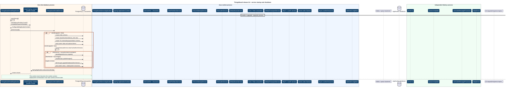](sequence.svg)

[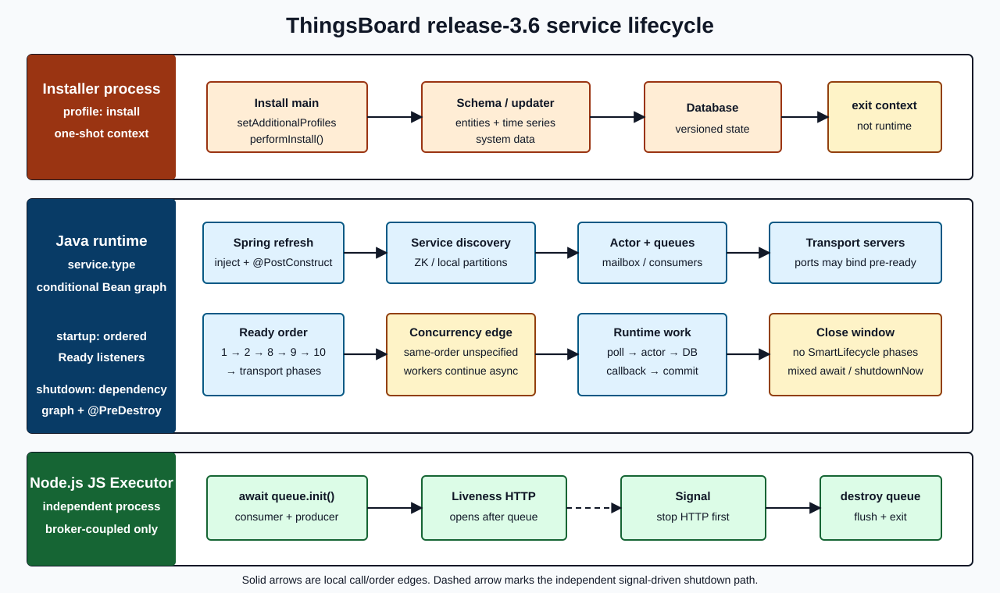](../../assets/architecture/40-service-lifecycle.svg)

---

## 一、流程目标

本章回答的不是“Spring Boot 会调用哪些注解”这么简单，而是四个容易混淆的问题：哪个进程负责建库，哪个配置决定 Bean 是否存在，何时才启动队列消费，关闭时哪些工作真的被等待。结论先固定：安装器与业务服务是不同入口；`service.type` 是条件装配属性，不是 Spring profile；`@AfterStartUp` 只给 `ApplicationReadyEvent` 监听器建立偏序；`@PostConstruct` 和 `@PreDestroy` 没有跨 Bean 的全局源码顺序。

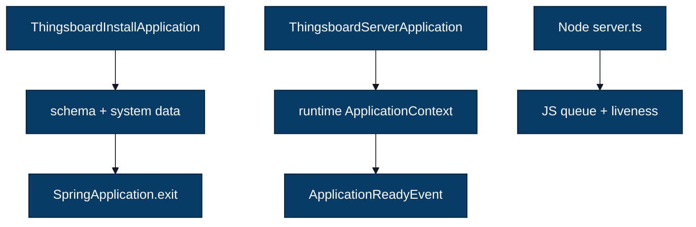
```mermaid
%%{init: {"theme":"base","themeVariables":{"primaryColor":"#083B66","primaryTextColor":"#FFFFFF","primaryBorderColor":"#001F33","lineColor":"#111827","secondaryColor":"#9A3412","tertiaryColor":"#166534"}}}%%
flowchart TB
    I["ThingsboardInstallApplication"] --> DB["schema + system data"]
    DB --> X["SpringApplication.exit"]
    S["ThingsboardServerApplication"] --> C["runtime ApplicationContext"]
    C --> R["ApplicationReadyEvent"]
    J["Node server.ts"] --> Q["JS queue + liveness"]
```

必须先记住十六条源码事实：

1. [org.thingsboard.server.ThingsboardServerApplication.main(String[])](../../../application/src/main/java/org/thingsboard/server/ThingsboardServerApplication.java#L53) 调用 `SpringApplication.run`，并补入 `--spring.config.name=thingsboard`；它不执行 schema installer/updater。
2. [org.thingsboard.server.ThingsboardInstallApplication.main(String[])](../../../application/src/main/java/org/thingsboard/server/ThingsboardInstallApplication.java#L62) 是独立入口，显式添加 `install` profile，取出 `ThingsboardInstallService` 后同步执行安装或升级。
3. [org.thingsboard.server.install.ThingsboardInstallService.performInstall()](../../../application/src/main/java/org/thingsboard/server/install/ThingsboardInstallService.java#L154) 无论成功失败都在 `finally` 调用 `SpringApplication.exit(context)`；安装上下文不是随后转成业务上下文。
4. [`thingsboard.yml` 的 `service.type`](../../../application/src/main/resources/thingsboard.yml#L1639) 默认 `monolith`。`monolith` 在 `DefaultTbServiceInfoProvider` 中映射到全部 `ServiceType`，而独立值只映射一个类型。
5. `TbCoreComponent`、`TbRuleEngineComponent`、`TbTransportComponent` 是 `@ConditionalOnExpression` 元注解；Bean 是否存在由属性和传输开关决定，不由 `@Profile("tb-core")` 决定。
6. [org.thingsboard.server.queue.util.AfterStartUp](../../../common/queue/src/main/java/org/thingsboard/server/queue/util/AfterStartUp.java#L28) 是 `ApplicationReadyEvent + @Order` 组合注解，明确顺序为 queue info 1、discovery 2、startup 8、actor 9、regular 10、transport 前/中/后。
7. 默认 Spring event multicaster 逐个调用 listener；同一 order 的多个监听器没有彼此顺序合同。只有 listener 提交到 executor 后，工作线程才可与后续 listener 或其他异步工作并发。
8. `@PostConstruct` 在单个 Bean 注入完成后执行；只有依赖图、`@DependsOn` 和构造依赖能形成跨 Bean 先后关系，不能把源码扫描顺序当成保证。
9. `ActorSystemContext.init()` 只计算本地 cache 类型；真正创建 ActorSystem、dispatcher、AppActor、StatsActor 的是 `DefaultActorService.initActorSystem()`。
10. MQTT/CoAP 等协议服务器在各自 `@PostConstruct` 中 bind，因此端口可能早于 `ApplicationReadyEvent` 打开；底层 transport queue consumer 则在最高位次的 `@AfterStartUp` 才开始循环。
11. `@Scheduled` 由 `ThreadPoolTaskScheduler` 注册，执行线程独立于 `@AfterStartUp` 偏序；初始延迟、固定延迟和 Bean 条件共同决定首次执行时间。
12. Zookeeper 开启时，服务节点在 ready order 2 发布并重算分区；正常关闭先显式删除 `nodePath`，再关闭 cache/client。只有显式删除失败、会话丢失等情形才依赖 ephemeral session 清理节点。关闭前没有一个全局“先摘流量再停所有消费者”的协调器。
13. 本仓库 Java 业务源码没有 `ContextClosedEvent` 监听器，也没有 `SmartLifecycle` 实现；上下文关闭主要落到 Spring 的 Bean 销毁依赖图、`@PreDestroy` 和 bean `destroyMethod`。
14. 多数 executor 使用 `shutdownNow()` 且不 `awaitTermination`；Rule Engine consumer 是明显例外，会逐 consumer 最多等待 30 秒，Actor dispatcher 每个最多等待 3 秒。
15. JS Executor 是 `msa/js-executor/server.ts` 的 Node.js 进程，不是 Java `JS_EXECUTOR` Spring Bean。Java `RemoteJsInvokeService` 只是远程请求客户端。
16. Kafka offset、ZK 临时节点、数据库事务和内存 mailbox 的关闭语义不同；“JVM 已退出”不等于四类状态都完成 drain。

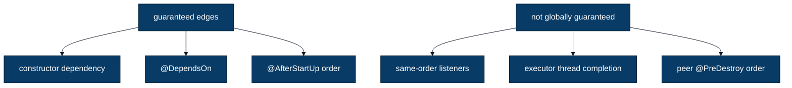
```mermaid
%%{init: {"theme":"base","themeVariables":{"primaryColor":"#083B66","primaryTextColor":"#FFFFFF","primaryBorderColor":"#001F33","lineColor":"#111827","secondaryColor":"#9A3412","tertiaryColor":"#166534"}}}%%
flowchart TB
    G["guaranteed edges"] --> D["constructor dependency"]
    G --> P["@DependsOn"]
    G --> O["@AfterStartUp order"]
    N["not globally guaranteed"] --> S["same-order listeners"]
    N --> T["executor thread completion"]
    N --> Z["peer @PreDestroy order"]
```

---

## 二、入口

### 2.1 Java 业务主进程

[org.thingsboard.server.ThingsboardServerApplication](../../../application/src/main/java/org/thingsboard/server/ThingsboardServerApplication.java#L35) 同时启用 async、scheduling，并扫描 `org.thingsboard.server` 与 `org.thingsboard.script`。私有 [org.thingsboard.server.ThingsboardServerApplication.updateArguments(String[])](../../../application/src/main/java/org/thingsboard/server/ThingsboardServerApplication.java#L63) 只在没有同名前缀参数时追加配置名；命令行传入其他 `spring.config.name` 会保留。

`service.type` 不改变 main class。`monolith`、`tb-core`、`tb-rule-engine` 和 `tb-transport` 都可由同一个 Java 入口启动，只是条件 Bean 图不同。[org.thingsboard.server.queue.discovery.DefaultTbServiceInfoProvider.init()](../../../common/queue/src/main/java/org/thingsboard/server/queue/discovery/DefaultTbServiceInfoProvider.java#L102) 将 `monolith` 展开为 `ServiceType.values()`；否则调用 [org.thingsboard.server.common.msg.queue.ServiceType.of(String)](../../../common/message/src/main/java/org/thingsboard/server/common/msg/queue/ServiceType.java#L40)。枚举还含 `JS_EXECUTOR` 和 `TB_VC_EXECUTOR`，但这不表示主应用会创建 Node.js 进程。

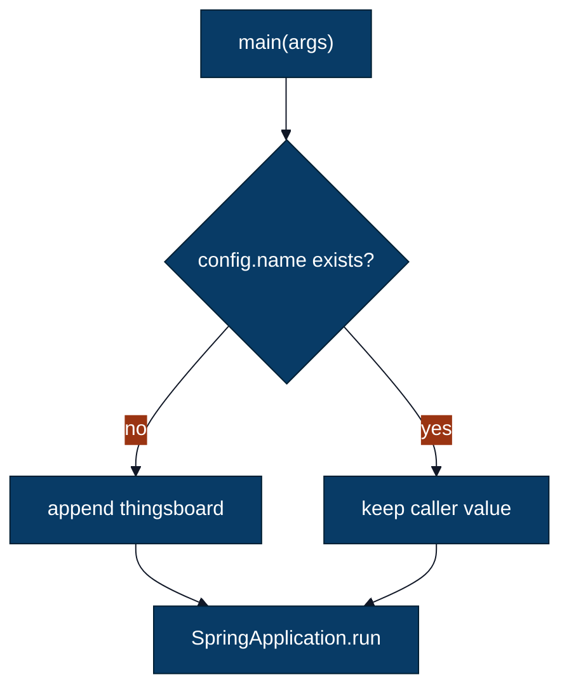
```mermaid
%%{init: {"theme":"base","themeVariables":{"primaryColor":"#083B66","primaryTextColor":"#FFFFFF","primaryBorderColor":"#001F33","lineColor":"#111827","secondaryColor":"#9A3412","tertiaryColor":"#166534"}}}%%
flowchart TB
    MAIN["main(args)"] --> ARG{"config.name exists?"}
    ARG -->|no| ADD["append thingsboard"]
    ARG -->|yes| KEEP["keep caller value"]
    ADD --> RUN["SpringApplication.run"]
    KEEP --> RUN
```

### 2.2 条件组件而非 profile

[org.thingsboard.server.queue.util.TbCoreComponent](../../../common/queue/src/main/java/org/thingsboard/server/queue/util/TbCoreComponent.java#L23) 接受 `monolith|tb-core`；[org.thingsboard.server.queue.util.TbRuleEngineComponent](../../../common/queue/src/main/java/org/thingsboard/server/queue/util/TbRuleEngineComponent.java#L23) 接受 `monolith|tb-rule-engine`；[org.thingsboard.server.queue.util.TbTransportComponent](../../../common/queue/src/main/java/org/thingsboard/server/queue/util/TbTransportComponent.java#L23) 接受独立 `tb-transport`，或启用 transport API 的 monolith。协议 Bean 还叠加 `transport.<protocol>.enabled` 条件。因此服务类型只定义候选图，协议开关继续裁剪。

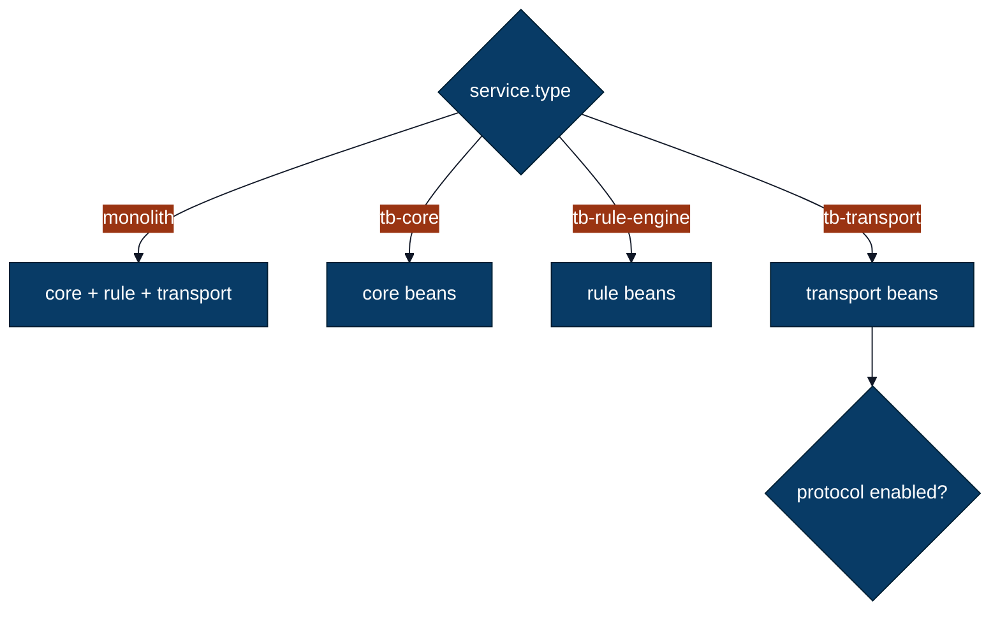
```mermaid
%%{init: {"theme":"base","themeVariables":{"primaryColor":"#083B66","primaryTextColor":"#FFFFFF","primaryBorderColor":"#001F33","lineColor":"#111827","secondaryColor":"#9A3412","tertiaryColor":"#166534"}}}%%
flowchart TB
    ST{"service.type"}
    ST -->|monolith| ALL["core + rule + transport"]
    ST -->|tb-core| CORE["core beans"]
    ST -->|tb-rule-engine| RE["rule beans"]
    ST -->|tb-transport| TR["transport beans"]
    TR --> EN{"protocol enabled?"}
```

### 2.3 安装/升级入口

[org.thingsboard.server.ThingsboardInstallApplication.main(String[])](../../../application/src/main/java/org/thingsboard/server/ThingsboardInstallApplication.java#L62) 使用更窄的 component scan，`setAdditionalProfiles("install")` 后创建上下文。全新安装依次建 entity schema、views/functions、timeseries schema，再发现组件和写系统数据。升级先共同执行 `cacheCleanupService.clearCache(upgradeFromVersion)`，随后有三路：`cassandra-latest-to-postgres` 分支体仅调用 `latestMigrateService.migrate()`；`3.6.2-images` 分支体仅调用 `installScripts.updateImages()`；只有其余版本进入逐级 fall-through 的常规 switch，并执行 switch 后的 view/function、Rule Node、widget、LwM2M 与 image 数据更新。两个特殊值均绕过常规 switch 及其后续数据更新。入口完成后关闭安装上下文，运维脚本再单独启动业务进程。

常规配置把 [`spring.jpa.hibernate.ddl-auto`](../../../application/src/main/resources/thingsboard.yml#L723) 设为 `none`，所以业务进程不会靠 Hibernate 自动修补 schema。数据库可连接不代表版本正确，安装/升级必须在发布编排中先完成。

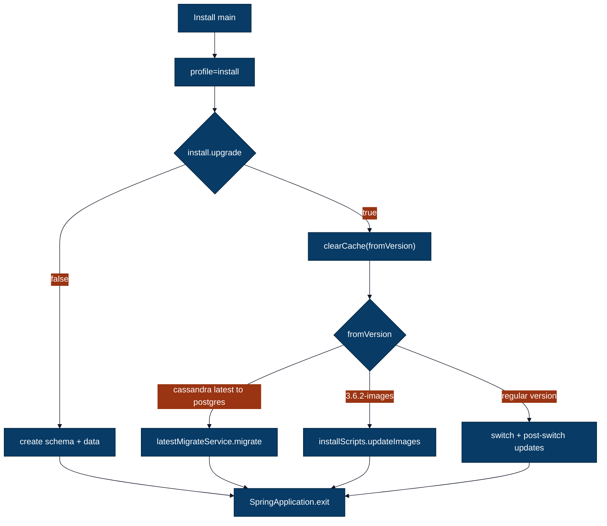
```mermaid
%%{init: {"theme":"base","themeVariables":{"primaryColor":"#083B66","primaryTextColor":"#FFFFFF","primaryBorderColor":"#001F33","lineColor":"#111827","secondaryColor":"#9A3412","tertiaryColor":"#166534"}}}%%
flowchart TB
    IA["Install main"] --> IP["profile=install"]
    IP --> MODE{"install.upgrade"}
    MODE -->|false| SCHEMA["create schema + data"]
    MODE -->|true| CLEAR["clearCache(fromVersion)"]
    CLEAR --> BRANCH{"fromVersion"}
    BRANCH -->|cassandra latest to postgres| MIG["latestMigrateService.migrate"]
    BRANCH -->|3.6.2-images| IMG["installScripts.updateImages"]
    BRANCH -->|regular version| UPG["switch + post-switch updates"]
    SCHEMA --> EXIT["SpringApplication.exit"]
    MIG --> EXIT
    IMG --> EXIT
    UPG --> EXIT
```

### 2.4 JS Executor 入口

[`msa/js-executor/server.ts`](../../../msa/js-executor/server.ts#L38) 的 async IIFE 先按 `queue_type` 创建 Kafka/PubSub/SQS/RabbitMQ/Service Bus 模板，`await queues.init()` 成功后才构造 `HttpServer`。收到 `SIGINT/SIGTERM/uncaughtException` 等事件时，[`exit(status)`](../../../msa/js-executor/server.ts#L82) 先 await HTTP stop，再 await queue destroy。它没有 Spring profile、`ApplicationReadyEvent` 或 `@PreDestroy`。

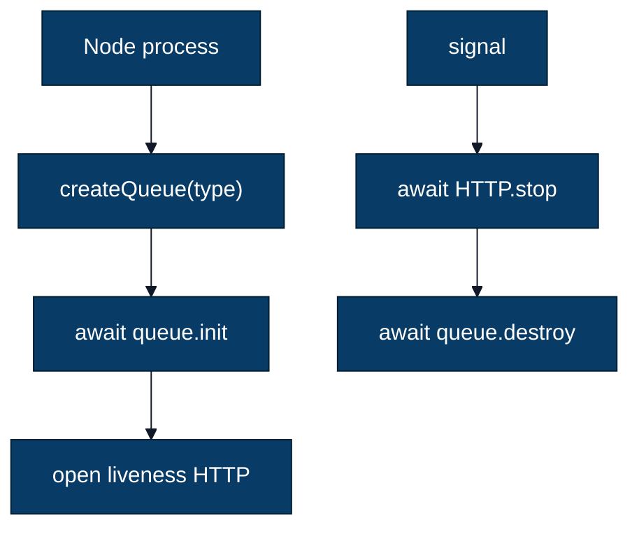
```mermaid
%%{init: {"theme":"base","themeVariables":{"primaryColor":"#083B66","primaryTextColor":"#FFFFFF","primaryBorderColor":"#001F33","lineColor":"#111827","secondaryColor":"#9A3412","tertiaryColor":"#166534"}}}%%
flowchart TB
    NODE["Node process"] --> CQ["createQueue(type)"]
    CQ --> INIT["await queue.init"]
    INIT --> HTTP["open liveness HTTP"]
    SIG["signal"] --> STOP["await HTTP.stop"]
    STOP --> DEST["await queue.destroy"]
```

---

## 三、完整调用链

### 3.1 refresh 期间

`SpringApplication.run` 创建并 refresh context。条件评估先决定 Bean 定义；实例化时构造依赖、字段注入与 `@PostConstruct` 只形成每个 Bean 自己的局部链。默认 singleton 创建由容器逐个推进，但无依赖 Bean 的彼此先后没有合同，不能从示意图排版推导全序。例子：[org.thingsboard.server.queue.discovery.DefaultTbServiceInfoProvider.init()](../../../common/queue/src/main/java/org/thingsboard/server/queue/discovery/DefaultTbServiceInfoProvider.java#L102) 生成 service id/types；其 [setTransports()](../../../common/queue/src/main/java/org/thingsboard/server/queue/discovery/DefaultTbServiceInfoProvider.java#L129) 在 `ContextRefreshedEvent` 才汇总 `TbTransportService` Bean 名称。

[org.thingsboard.server.actors.service.DefaultActorService.initActorSystem()](../../../application/src/main/java/org/thingsboard/server/actors/service/DefaultActorService.java#L131) 创建四类 dispatcher、根 AppActor 和 StatsActor。与此同时，[org.thingsboard.server.service.queue.DefaultTbCoreConsumerService.init()](../../../application/src/main/java/org/thingsboard/server/service/queue/DefaultTbCoreConsumerService.java#L265) 只建 executor；[org.thingsboard.server.service.queue.processing.AbstractConsumerService.onApplicationEvent(ApplicationReadyEvent)](../../../application/src/main/java/org/thingsboard/server/service/queue/processing/AbstractConsumerService.java#L153) 才 subscribe 并提交 polling loop。

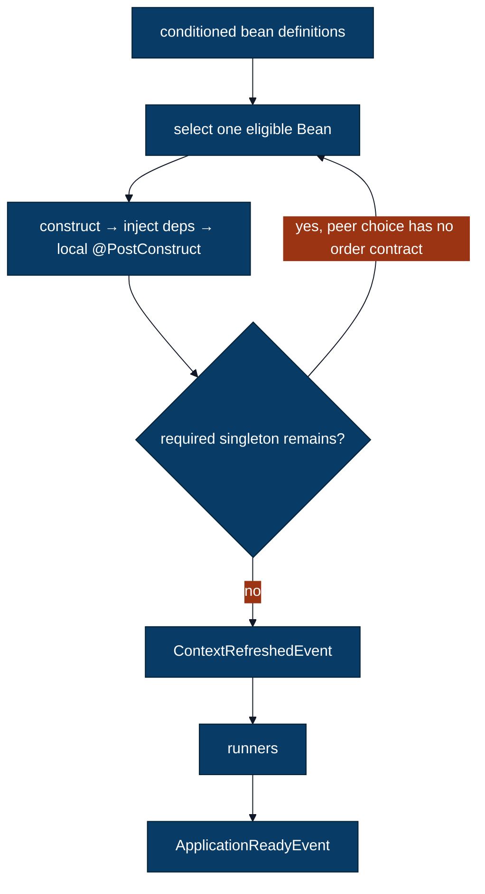
```mermaid
%%{init: {"theme":"base","themeVariables":{"primaryColor":"#083B66","primaryTextColor":"#FFFFFF","primaryBorderColor":"#001F33","lineColor":"#111827","secondaryColor":"#9A3412","tertiaryColor":"#166534"}}}%%
flowchart TB
    DEF["conditioned bean definitions"]
    DEF --> PICK["select one eligible Bean"]
    PICK --> LOCAL["construct → inject deps → local @PostConstruct"]
    LOCAL --> MORE{"required singleton remains?"}
    MORE -->|yes, peer choice has no order contract| PICK
    MORE -->|no| RF["ContextRefreshedEvent"]
    RF --> RUN["runners"]
    RUN --> READY["ApplicationReadyEvent"]
```

### 3.2 ApplicationReadyEvent 偏序

[org.thingsboard.server.queue.util.AfterStartUp.order()](../../../common/queue/src/main/java/org/thingsboard/server/queue/util/AfterStartUp.java#L45) 把 `@Order` 暴露为 annotation 属性。源码可证明的顺序是：

1. [org.thingsboard.server.queue.discovery.HashPartitionService.partitionsInit()](../../../common/queue/src/main/java/org/thingsboard/server/queue/discovery/HashPartitionService.java#L176)，order 1。
2. ZK 的 [org.thingsboard.server.queue.discovery.ZkDiscoveryService.onApplicationEvent(ApplicationReadyEvent)](../../../common/queue/src/main/java/org/thingsboard/server/queue/discovery/ZkDiscoveryService.java#L213) 或 dummy 的同签名方法，order 2；发布节点并同步重算分区。
3. [org.thingsboard.server.service.partition.TbCoreStartupService.onApplicationEvent(ApplicationReadyEvent)](../../../application/src/main/java/org/thingsboard/server/service/partition/TbCoreStartupService.java#L62)，order 8；它通过 `PartitionService.getMyPartitions(new QueueKey(ServiceType.TB_CORE))` 读取本节点 core 分区，构造 `CoreStartupMsg` 后调用 `TbClusterService.broadcastToCore(...)`。它不是 DiscoveryService 回调。
4. [org.thingsboard.server.actors.service.DefaultActorService.onApplicationEvent(ApplicationReadyEvent)](../../../application/src/main/java/org/thingsboard/server/actors/service/DefaultActorService.java#L179)，order 9；只把 `AppInitMsg` 高优先级投递给 mailbox，不等待 actor 树全部初始化。
5. core/rule consumer、transport API、update check 等 order 10。它们彼此同阶，不应声称固定先后。
6. transport 前置、transport、transport 后置监听器位于 `Integer.MAX_VALUE` 附近；[org.thingsboard.server.common.transport.service.DefaultTransportService.start()](../../../common/transport/transport-api/src/main/java/org/thingsboard/server/common/transport/service/DefaultTransportService.java#L337) 此时启动 transport notification poll loop。

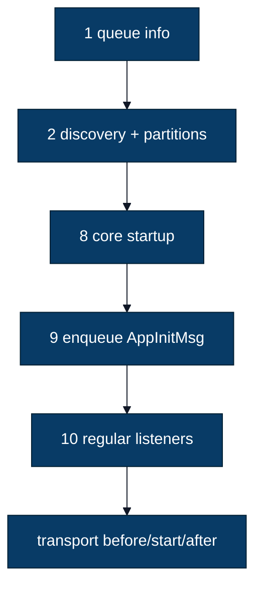
```mermaid
%%{init: {"theme":"base","themeVariables":{"primaryColor":"#083B66","primaryTextColor":"#FFFFFF","primaryBorderColor":"#001F33","lineColor":"#111827","secondaryColor":"#9A3412","tertiaryColor":"#166534"}}}%%
flowchart TB
    O1["1 queue info"] --> O2["2 discovery + partitions"]
    O2 --> O8["8 core startup"]
    O8 --> O9["9 enqueue AppInitMsg"]
    O9 --> O10["10 regular listeners"]
    O10 --> OT["transport before/start/after"]
```

### 3.3 关闭调用链

常规 SIGTERM 由 JVM/Spring Boot shutdown hook 关闭 context。仓库没有自己的 `ContextClosedEvent` 处理器，因此不要虚构一条项目级事件总线关闭链。默认 singleton 销毁回调由容器逐个调用；依赖 Bean 通常先于其依赖销毁，而互不依赖 Bean 的相互顺序没有合同。只有回调提交、唤醒或遗留在 executor/Netty/broker client 中的异步工作才可能彼此并发。

`@PreDestroy` 的局部行为差异很大：MQTT 同步 close channel 后触发 Netty graceful shutdown；transport service unsubscribe 后立即 `shutdownNow` executor；Rule Engine consumer 先 stop 再等待；ActorSystem 对每个 dispatcher 调 `shutdown()` 并最多等待 3 秒。没有统一 drain deadline，也没有 `SmartLifecycle.getPhase()` 可用来表达 ingress/consumer/producer 的关闭 phase。

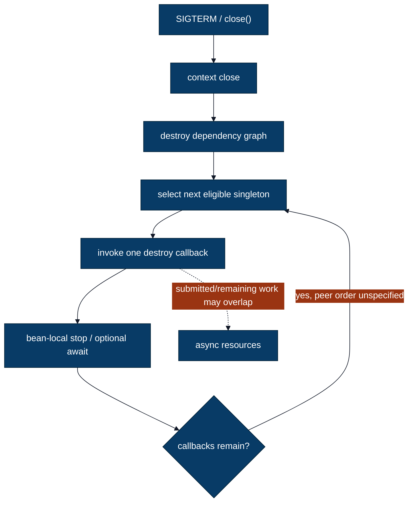
```mermaid
%%{init: {"theme":"base","themeVariables":{"primaryColor":"#083B66","primaryTextColor":"#FFFFFF","primaryBorderColor":"#001F33","lineColor":"#111827","secondaryColor":"#9A3412","tertiaryColor":"#166534"}}}%%
flowchart TB
    TERM["SIGTERM / close()"] --> CTX["context close"]
    CTX --> GRAPH["destroy dependency graph"]
    GRAPH --> NEXT["select next eligible singleton"]
    NEXT --> CALL["invoke one destroy callback"]
    CALL --> LOCAL["bean-local stop / optional await"]
    LOCAL --> MORE{"callbacks remain?"}
    MORE -->|yes, peer order unspecified| NEXT
    CALL -. "submitted/remaining work may overlap" .-> ASYNC["async resources"]
```

---

## 四、消息流

### 4.1 发现事件到消费者

ZK 或 dummy discovery 调用 [org.thingsboard.server.queue.discovery.HashPartitionService.recalculatePartitions(ServiceInfo,List&lt;ServiceInfo&gt;)](../../../common/queue/src/main/java/org/thingsboard/server/queue/discovery/HashPartitionService.java#L454)。它按 service id 排序节点、计算新分区，发布 `PartitionChangeEvent`。`TbApplicationEventListener` 用 sequence number 丢弃旧事件，并捕获业务 listener 异常；这保证单 listener 不倒退，但不等价于所有 listener 同时完成。

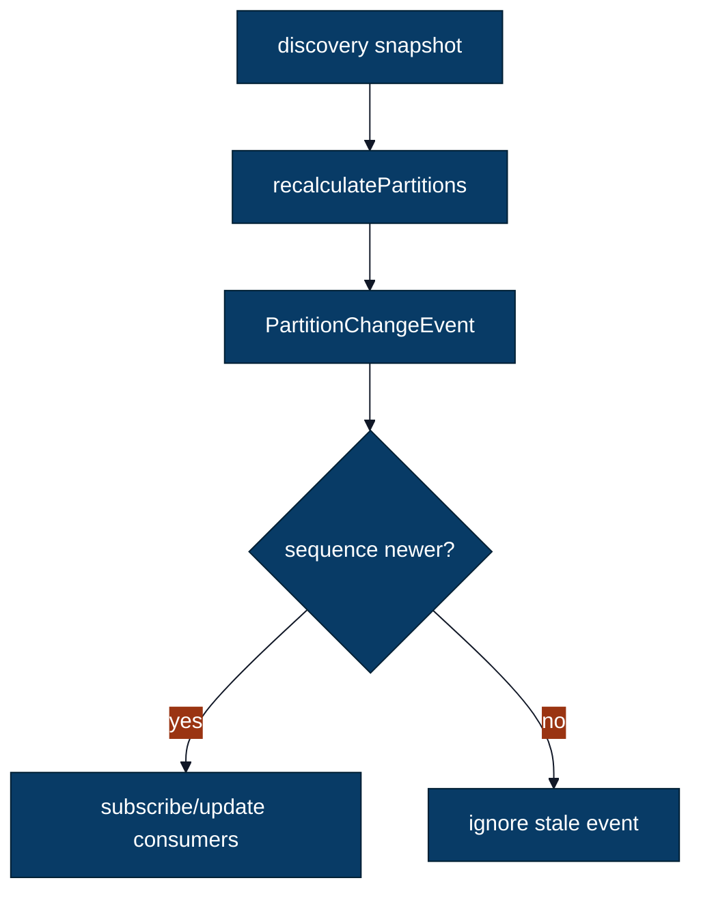
```mermaid
%%{init: {"theme":"base","themeVariables":{"primaryColor":"#083B66","primaryTextColor":"#FFFFFF","primaryBorderColor":"#001F33","lineColor":"#111827","secondaryColor":"#9A3412","tertiaryColor":"#166534"}}}%%
flowchart TB
    DISC["discovery snapshot"] --> HASH["recalculatePartitions"]
    HASH --> EVT["PartitionChangeEvent"]
    EVT --> SEQ{"sequence newer?"}
    SEQ -->|yes| SUB["subscribe/update consumers"]
    SEQ -->|no| DROP["ignore stale event"]
```

### 4.2 producer、poll、commit

队列 factory 在 Bean 创建阶段构造 producer/consumer 对象。例如 [org.thingsboard.server.queue.provider.KafkaMonolithQueueFactory.createToCoreMsgConsumer()](../../../common/queue/src/main/java/org/thingsboard/server/queue/provider/KafkaMonolithQueueFactory.java#L306) 返回 core consumer；实际 poll loop 到 ready 后才启动。消息通常是 poll pack、异步处理、等待 callback/latch，再 commit。关闭发生在 poll、callback 或 commit 任一窗口时，最终语义取决于具体 broker；Kafka 未提交消息可重投，因此业务必须承受至少一次边界。

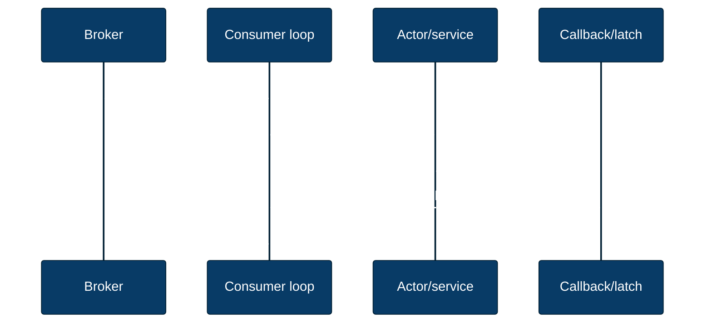
```mermaid
%%{init: {"theme":"base","themeVariables":{"primaryColor":"#083B66","primaryTextColor":"#FFFFFF","primaryBorderColor":"#001F33","lineColor":"#111827","secondaryColor":"#9A3412","tertiaryColor":"#166534"}}}%%
sequenceDiagram
    participant B as Broker
    participant C as Consumer loop
    participant A as Actor/service
    participant K as Callback/latch
    C->>B: poll(pack)
    C->>A: handle(msg)
    A-->>K: success/failure
    K-->>C: pack complete/timeout
    C->>B: commit
```

### 4.3 Remote JS 跨进程流

[org.thingsboard.server.service.script.RemoteJsInvokeService.init()](../../../common/script/remote-js-client/src/main/java/org/thingsboard/server/service/script/RemoteJsInvokeService.java#L167) 初始化 Java request template。Node 的 Kafka 实现先连接 admin 并检查/创建 topic，再创建 consumer/producer 对象，随后构造 `JsInvokeMessageProcessor`，最后依次 connect consumer、connect producer、启动 send loop、subscribe、`consumer.run`。PubSub、AWS SQS、RabbitMQ 与 Service Bus 有各自的 `init()/destroy()`，不能套用 Kafka admin/consumer/producer 顺序。双方没有共同 ready barrier：Java 应用 ready 不证明 Node executor ready，Node 探活成功也不证明每个 Java request template 正常。

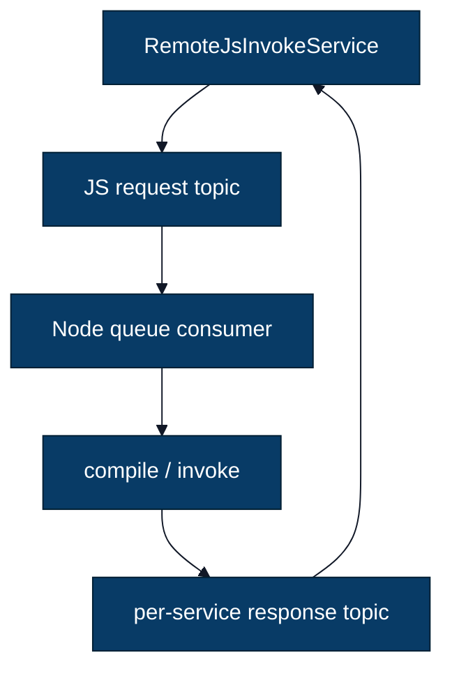
```mermaid
%%{init: {"theme":"base","themeVariables":{"primaryColor":"#083B66","primaryTextColor":"#FFFFFF","primaryBorderColor":"#001F33","lineColor":"#111827","secondaryColor":"#9A3412","tertiaryColor":"#166534"}}}%%
flowchart TB
    J["RemoteJsInvokeService"] --> RQ["JS request topic"]
    RQ --> N["Node queue consumer"]
    N --> VM["compile / invoke"]
    VM --> RP["per-service response topic"]
    RP --> J
```

---

## 五、时序图

更完整的跨进程图见 [sequence.puml](sequence.puml)。下面两张 Mermaid 只保留主干，避免横向过宽。

### 5.1 正常启动

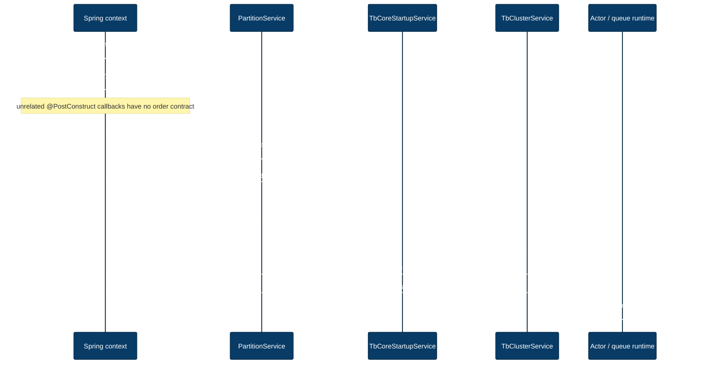
```mermaid
%%{init: {"theme":"base","themeVariables":{"primaryColor":"#083B66","primaryTextColor":"#FFFFFF","primaryBorderColor":"#001F33","lineColor":"#111827","secondaryColor":"#9A3412","tertiaryColor":"#166534"}}}%%
sequenceDiagram
    participant S as Spring context
    participant P as PartitionService
    participant C as TbCoreStartupService
    participant K as TbClusterService
    participant R as Actor / queue runtime
    S->>S: main → run(thingsboard config)
    S->>S: refresh each bean by dependency graph
    Note over S: unrelated @PostConstruct callbacks have no order contract
    S->>P: Ready order 1/2: queue info + discovery recalc
    P->>P: publish service + recalculate partitions
    S->>C: Ready order 8
    C->>P: getMyPartitions(QueueKey(TB_CORE))
    P-->>C: local core partition ids
    C->>K: broadcastToCore(CoreStartupMsg)
    K-->>R: publish core notification
    S->>R: Ready order 9: enqueue AppInitMsg
    S->>R: Ready order 10+: invoke callbacks serially
    R-->>R: submitted polling workers run asynchronously
```

### 5.2 正常关闭与窗口

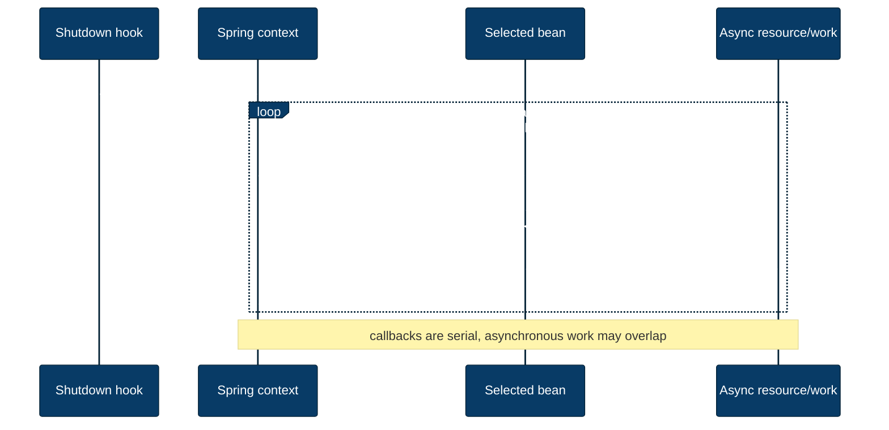
```mermaid
%%{init: {"theme":"base","themeVariables":{"primaryColor":"#083B66","primaryTextColor":"#FFFFFF","primaryBorderColor":"#001F33","lineColor":"#111827","secondaryColor":"#9A3412","tertiaryColor":"#166534"}}}%%
sequenceDiagram
    participant H as Shutdown hook
    participant S as Spring context
    participant B as Selected bean
    participant W as Async resource/work
    H->>S: close()
    loop one callback at a time, peer order unspecified
        S->>B: invoke next @PreDestroy/destroyMethod
        B->>B: bean-local stop / optional await
        B-->>W: interrupt, close, or leave async cleanup
        B-->>S: callback returns
    end
    Note over S,W: callbacks are serial, asynchronous work may overlap
```

---

## 六、数据变化

### 6.1 启动期状态

启动会改变多种状态，但并非都持久化：`DefaultTbServiceInfoProvider` 生成 service id/types；ZK 模式创建节点数据并每分钟刷新；`HashPartitionService` 替换 JVM 内的 `myPartitions`；Kafka subscribe 建立 group membership；ActorSystem 创建 mailbox/dispatcher；定时器注册 future。只有安装器明确改变 schema 与系统数据。

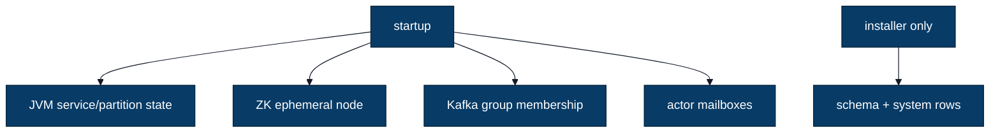
```mermaid
%%{init: {"theme":"base","themeVariables":{"primaryColor":"#083B66","primaryTextColor":"#FFFFFF","primaryBorderColor":"#001F33","lineColor":"#111827","secondaryColor":"#9A3412","tertiaryColor":"#166534"}}}%%
flowchart TB
    START["startup"] --> MEM["JVM service/partition state"]
    START --> ZK["ZK ephemeral node"]
    START --> KG["Kafka group membership"]
    START --> ACT["actor mailboxes"]
    INST["installer only"] --> DB["schema + system rows"]
```

### 6.2 关闭期状态

[org.thingsboard.server.queue.discovery.ZkDiscoveryService.destroy()](../../../common/queue/src/main/java/org/thingsboard/server/queue/discovery/ZkDiscoveryService.java#L383) 先进入私有 [org.thingsboard.server.queue.discovery.ZkDiscoveryService.destroyZkClient()](../../../common/queue/src/main/java/org/thingsboard/server/queue/discovery/ZkDiscoveryService.java#L367)：置 `stopped=true`，调用 [org.thingsboard.server.queue.discovery.ZkDiscoveryService.unpublishCurrentServer()](../../../common/queue/src/main/java/org/thingsboard/server/queue/discovery/ZkDiscoveryService.java#L351) 显式执行 `client.delete().forPath(nodePath)`，再依次 quiet-close cache 与 client，最后 `shutdownNow` ZK executor。删除异常被 `destroyZkClient()` 吞掉后才退化为依靠 ephemeral session 清理节点。Kafka 的 [org.thingsboard.server.queue.kafka.TbKafkaConsumerTemplate.doUnsubscribe()](../../../common/queue/src/main/java/org/thingsboard/server/queue/kafka/TbKafkaConsumerTemplate.java#L170) 先 unsubscribe 再 close consumer。ActorSystem 清空本地 actor map。数据库中已经提交的业务数据不会因进程关闭回滚；未提交事务由连接/事务管理器结束语义处理。

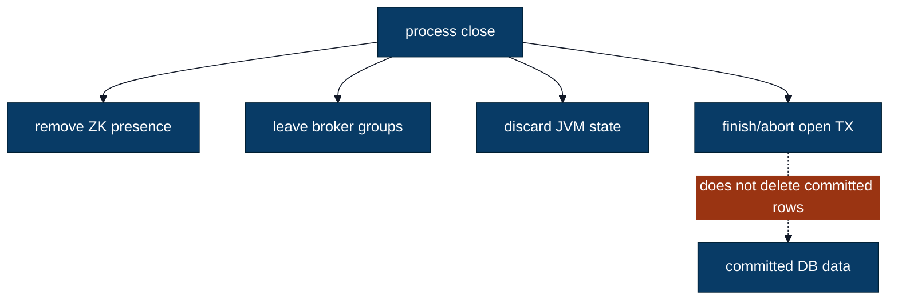
```mermaid
%%{init: {"theme":"base","themeVariables":{"primaryColor":"#083B66","primaryTextColor":"#FFFFFF","primaryBorderColor":"#001F33","lineColor":"#111827","secondaryColor":"#9A3412","tertiaryColor":"#166534"}}}%%
flowchart TB
    CLOSE["process close"] --> EP["remove ZK presence"]
    CLOSE --> LEAVE["leave broker groups"]
    CLOSE --> HEAP["discard JVM state"]
    CLOSE --> TX["finish/abort open TX"]
    TX -. "does not delete committed rows" .-> ROWS["committed DB data"]
```

---

## 七、源码分析

### 7.1 `@PostConstruct` 的局部初始化

[org.thingsboard.server.actors.ActorSystemContext.init()](../../../application/src/main/java/org/thingsboard/server/actors/ActorSystemContext.java#L763) 只设置 `localCacheType`。ActorSystem 由 `DefaultActorService` 构造；Rule Engine 的 [org.thingsboard.server.service.queue.ruleengine.TbRuleEngineConsumerContext.init()](../../../application/src/main/java/org/thingsboard/server/service/queue/ruleengine/TbRuleEngineConsumerContext.java#L133) 创建三组 executor；transport 的 [org.thingsboard.server.common.transport.service.DefaultTransportService.init()](../../../common/transport/transport-api/src/main/java/org/thingsboard/server/common/transport/service/DefaultTransportService.java#L313) 创建 producer、consumer、request template 并提前 subscribe notification topic。

这些方法之间的可证明顺序只来自注入关系。例如 MQTT service 依赖 `MqttTransportContext`，所以 context 必须可用；但不能据文件名推出 Actor 一定先于所有 queue Bean。更重要的是，`@PostConstruct` 可以创建线程、bind 端口或 subscribe，故“context 尚未 ready”不代表对外完全静默。

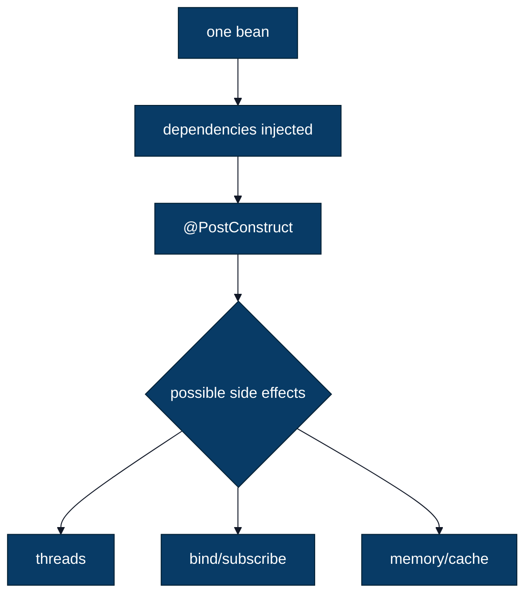
```mermaid
%%{init: {"theme":"base","themeVariables":{"primaryColor":"#083B66","primaryTextColor":"#FFFFFF","primaryBorderColor":"#001F33","lineColor":"#111827","secondaryColor":"#9A3412","tertiaryColor":"#166534"}}}%%
flowchart TB
    B["one bean"] --> INJ["dependencies injected"]
    INJ --> PC["@PostConstruct"]
    PC --> SIDE{"possible side effects"}
    SIDE --> TH["threads"]
    SIDE --> NET["bind/subscribe"]
    SIDE --> CACHE["memory/cache"]
```

### 7.2 传输服务器边界

[org.thingsboard.server.transport.mqtt.MqttTransportService.init()](../../../common/transport/mqtt/src/main/java/org/thingsboard/server/transport/mqtt/MqttTransportService.java#L128) 在 `@PostConstruct` 中同步 `bind(...).sync()`，普通端口成功后才尝试 SSL 端口；任一异常会令 Bean 创建失败并使 context refresh 失败。HTTP device API 则由 Spring Web 容器承载。协议 ingress 可先打开，而 `DefaultTransportService.start()` 的 notification consumer 等到 ready 的 transport order。

[org.thingsboard.server.transport.mqtt.MqttTransportService.shutdown()](../../../common/transport/mqtt/src/main/java/org/thingsboard/server/transport/mqtt/MqttTransportService.java#L159) 同步关 channel，但对 `workerGroup.shutdownGracefully()`/`bossGroup.shutdownGracefully()` 没有等待 future。由此不能声称所有 Netty task 在方法返回时已结束。

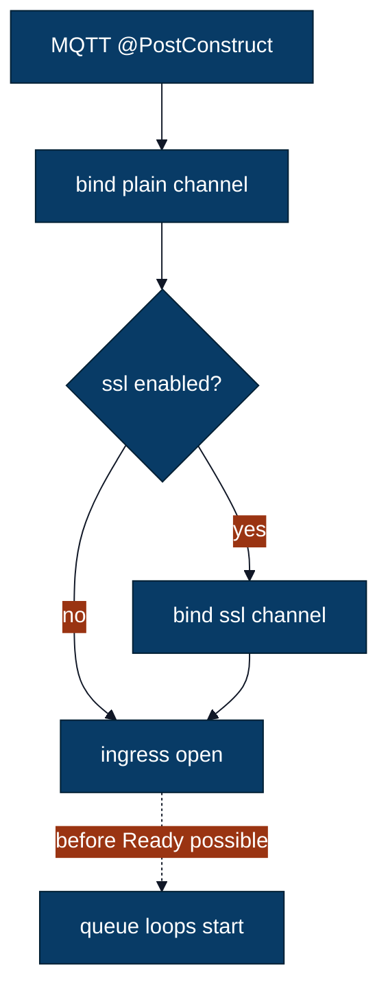
```mermaid
%%{init: {"theme":"base","themeVariables":{"primaryColor":"#083B66","primaryTextColor":"#FFFFFF","primaryBorderColor":"#001F33","lineColor":"#111827","secondaryColor":"#9A3412","tertiaryColor":"#166534"}}}%%
flowchart TB
    MPC["MQTT @PostConstruct"] --> B1["bind plain channel"]
    B1 --> SSL{"ssl enabled?"}
    SSL -->|yes| B2["bind ssl channel"]
    SSL -->|no| OPEN["ingress open"]
    B2 --> OPEN
    OPEN -. "before Ready possible" .-> READY["queue loops start"]
```

### 7.3 scheduled jobs

[org.thingsboard.server.config.SchedulingConfiguration.configureTasks(ScheduledTaskRegistrar)](../../../application/src/main/java/org/thingsboard/server/config/SchedulingConfiguration.java#L45) 将所有 Spring `@Scheduled` 工作交给按 CPU 数量配置的 `ThreadPoolTaskScheduler`；其 bean [taskScheduler()](../../../application/src/main/java/org/thingsboard/server/config/SchedulingConfiguration.java#L55) 使用 `destroyMethod="shutdown"`。例如 [org.thingsboard.server.service.ttl.EventsCleanUpService.cleanUp()](../../../application/src/main/java/org/thingsboard/server/service/ttl/EventsCleanUpService.java#L83) 带随机 initial delay 和固定 delay；`ActorSystemContext.printStats()` 只有 fixed delay。

这些任务可能并发执行，不能放进 ready order 10 的确定串行链。独立 `DefaultSchedulerComponent` 还有自己的单线程 executor，并在 `@PreDestroy` 直接 `shutdownNow()`。关闭时 scheduler 不再接收新周期，不等于正在执行的数据库清理一定完成。

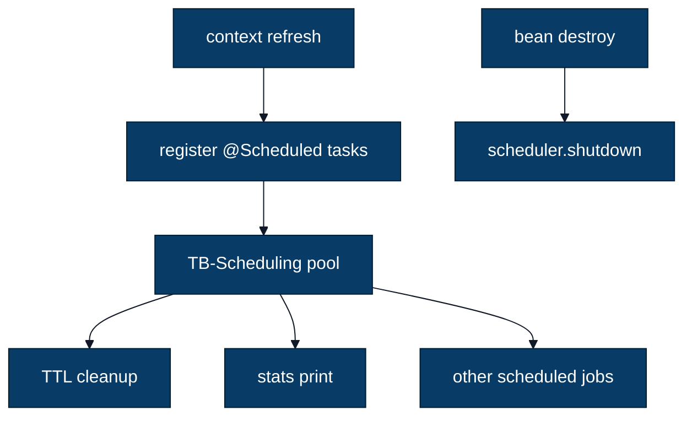
```mermaid
%%{init: {"theme":"base","themeVariables":{"primaryColor":"#083B66","primaryTextColor":"#FFFFFF","primaryBorderColor":"#001F33","lineColor":"#111827","secondaryColor":"#9A3412","tertiaryColor":"#166534"}}}%%
flowchart TB
    REF["context refresh"] --> REG["register @Scheduled tasks"]
    REG --> POOL["TB-Scheduling pool"]
    POOL --> TTL["TTL cleanup"]
    POOL --> STAT["stats print"]
    POOL --> OTHER["other scheduled jobs"]
    CLOSE["bean destroy"] --> SHUT["scheduler.shutdown"]
```

### 7.4 `@PreDestroy`、SmartLifecycle 与关闭窗口

[org.thingsboard.server.service.queue.processing.AbstractConsumerService.destroy()](../../../application/src/main/java/org/thingsboard/server/service/queue/processing/AbstractConsumerService.java#L328) 先置 `stopped`、调用子类 `stopConsumers()`、unsubscribe notification consumer，再 `shutdownNow` notification executor。Rule Engine 子类 [stopConsumers()](../../../application/src/main/java/org/thingsboard/server/service/queue/DefaultTbRuleEngineConsumerService.java#L202) 先向每个 consumer 发 stop，再逐个 [org.thingsboard.server.service.queue.ruleengine.TbRuleEngineQueueConsumerManager.awaitStop()](../../../application/src/main/java/org/thingsboard/server/service/queue/ruleengine/TbRuleEngineQueueConsumerManager.java#L294)；底层 task 对每个 future 最多等 30 秒。

相反，[org.thingsboard.server.common.transport.service.DefaultTransportService.destroy()](../../../common/transport/transport-api/src/main/java/org/thingsboard/server/common/transport/service/DefaultTransportService.java#L382) 主要是 unsubscribe/`shutdownNow`/template stop，没有 await。`DefaultActorService.stopActorSystem()` 调 [org.thingsboard.server.actors.DefaultTbActorSystem.stop()](../../../common/actor/src/main/java/org/thingsboard/server/actors/DefaultTbActorSystem.java#L357)，每个 dispatcher 最多等 3 秒后清 map。

仓库搜索不到 `SmartLifecycle` 和 `ContextClosedEvent` 实现，所以不存在 phase 值来保证“先关 ingress，再停 consumer，再停 actor/producer”。真正可依赖的是 Bean 依赖边；若两者只是都注入同一个 context，并不自动形成彼此销毁先后。部署层应先摘 readiness/流量并留出 drain 时间，不能只依赖 JVM hook。

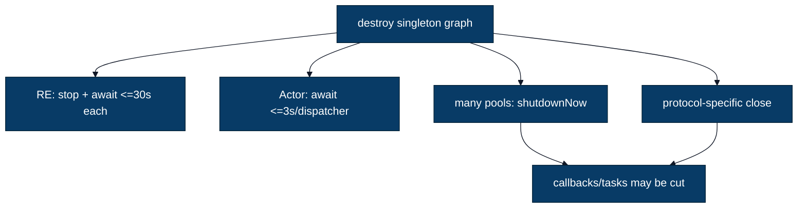
```mermaid
%%{init: {"theme":"base","themeVariables":{"primaryColor":"#083B66","primaryTextColor":"#FFFFFF","primaryBorderColor":"#001F33","lineColor":"#111827","secondaryColor":"#9A3412","tertiaryColor":"#166534"}}}%%
flowchart TB
    DES["destroy singleton graph"] --> RE["RE: stop + await <=30s each"]
    DES --> ACT["Actor: await <=3s/dispatcher"]
    DES --> FAST["many pools: shutdownNow"]
    DES --> NET["protocol-specific close"]
    FAST --> GAP["callbacks/tasks may be cut"]
    NET --> GAP
```

---

## 八、Actor 分析

### 8.1 context 不是 ActorSystem

`ActorSystemContext` 是大量服务与配置的容器。其 `@PostConstruct` 不创建 actor；[org.thingsboard.server.actors.service.DefaultActorService.initActorSystem()](../../../application/src/main/java/org/thingsboard/server/actors/service/DefaultActorService.java#L131) 才回填 `actorService`/`actorSystem`/`appActor`/`statsActor`。构造完成表示根 actor 和 dispatcher 存在，不表示所有 tenant/device/rule-chain actor 已创建。

ready order 9 的 [onApplicationEvent(ApplicationReadyEvent)](../../../application/src/main/java/org/thingsboard/server/actors/service/DefaultActorService.java#L179) 调 `appActor.tellWithHighPriority(new AppInitMsg())` 后立即返回。AppActor 异步创建或通知下层 actor，与 order 10 consumer 启动存在并发边界；消费者通过 mailbox 排队，而不是等待完整 actor 树 barrier。

```mermaid
%%{init: {"theme":"base","themeVariables":{"primaryColor":"#083B66","primaryTextColor":"#FFFFFF","primaryBorderColor":"#001F33","lineColor":"#111827","secondaryColor":"#9A3412","tertiaryColor":"#166534"}}}%%
flowchart TB
    CTX["ActorSystemContext"] --> DAS["DefaultActorService @PostConstruct"]
    DAS --> DISP["4 dispatchers"]
    DAS --> ROOT["AppActor + StatsActor"]
    READY["Ready order 9"] --> MSG["enqueue AppInitMsg"]
    MSG -. "async mailbox" .-> TREE["tenant/device/rule actors"]
```

### 8.2 Actor 关闭

[org.thingsboard.server.actors.service.DefaultActorService.stopActorSystem()](../../../application/src/main/java/org/thingsboard/server/actors/service/DefaultActorService.java#L213) 只调用整个 system 的 stop。`DefaultTbActorSystem.stop()` 先对 dispatcher executor 调 `shutdown()` 并依次等待，再 `scheduler.shutdownNow()`、`actors.clear()`。它没有遍历每个 actor 等待业务级 drain；单 actor 的 `stop(TbActorId)` 才会递归 child 并 `mailbox.destroy(null)`。

如果 queue consumer 在 ActorSystem 之后才停止，仍可能尝试 `tell`；如果 ActorSystem 后停止，mailbox 中尚未处理消息又可能被进程退出截断。源码没有全局 phase 消除此竞态，只能依赖实际 Bean 依赖图、消费重投和部署 drain。

```mermaid
%%{init: {"theme":"base","themeVariables":{"primaryColor":"#083B66","primaryTextColor":"#FFFFFF","primaryBorderColor":"#001F33","lineColor":"#111827","secondaryColor":"#9A3412","tertiaryColor":"#166534"}}}%%
flowchart TB
    STOP["ActorSystem.stop"] --> SD["dispatcher.shutdown"]
    SD --> WAIT["await 3s each"]
    WAIT --> SCH["scheduler.shutdownNow"]
    SCH --> CLEAR["actors.clear"]
    Q["queue callback"] -. "possible close race" .-> CLEAR
```

---

## 九、Kafka 分析

### 9.1 factory 与启动

[org.thingsboard.server.queue.provider.KafkaMonolithQueueFactory](../../../common/queue/src/main/java/org/thingsboard/server/queue/provider/KafkaMonolithQueueFactory.java#L71) 只在 `queue.type=kafka && service.type=monolith` 存在；tb-core、tb-rule-engine、tb-transport 各有独立 factory。factory 创建 template 不等于 consumer 已 poll。core/rule notification consumer 在 `@PostConstruct` 构造，在 `ApplicationReadyEvent` subscribe/launch；分区变化再更新 main consumer assignments。

`HashPartitionService.recalculatePartitions` 同步发布 partition events；listener 内部常把后续工作提交到 executor。因而“发现重算返回”只保证事件发布调用完成，不保证 Kafka rebalance、actor init 或 backlog 消费完成。

```mermaid
%%{init: {"theme":"base","themeVariables":{"primaryColor":"#083B66","primaryTextColor":"#FFFFFF","primaryBorderColor":"#001F33","lineColor":"#111827","secondaryColor":"#9A3412","tertiaryColor":"#166534"}}}%%
flowchart TB
    COND["queue.type + service.type"] --> FACT["Kafka factory"]
    FACT --> TEMP["producer/consumer templates"]
    TEMP --> READY["ready: subscribe + poll"]
    PART["PartitionChangeEvent"] --> ASSIGN["update assignments"]
    ASSIGN --> READY
```

### 9.2 commit 与关闭

[org.thingsboard.server.queue.kafka.TbKafkaConsumerTemplate.doCommit()](../../../common/queue/src/main/java/org/thingsboard/server/queue/kafka/TbKafkaConsumerTemplate.java#L160) 使用 `commitSync()`；`doUnsubscribe()` 随后 close consumer。若进程在业务处理完成前关闭且 offset 未提交，消息可重放；若业务副作用已提交但 offset 尚未提交，也可能重复副作用。关闭顺序不能提供 exactly-once。

仅对 Node JS Executor 的 Kafka 实现，[`KafkaTemplate.destroy()`](../../../msa/js-executor/queue/kafkaTemplate.ts#L236) 才是先 disconnect admin、再 disconnect consumer，最后尝试 flush batch response 并 disconnect producer。`sendMessagesAsBatch` 失败会把消息放回内存，但 destroy 随后仍可断开/退出，因此不能把该回放列表视作持久重试队列。其余四种 queue template 必须分别阅读各自 `destroy()`，不能泛化此顺序。

```mermaid
%%{init: {"theme":"base","themeVariables":{"primaryColor":"#083B66","primaryTextColor":"#FFFFFF","primaryBorderColor":"#001F33","lineColor":"#111827","secondaryColor":"#9A3412","tertiaryColor":"#166534"}}}%%
flowchart TB
    POLL["poll"] --> EFFECT["DB/actor side effect"]
    EFFECT --> COMMIT["commitSync offset"]
    X1["stop before effect"] --> REDO["broker redelivery"]
    X2["stop after effect before commit"] --> DUP["possible duplicate"]
    COMMIT --> DONE["next offset"]
```

---

## 十、数据库分析

### 10.1 schema installer/updater 与业务启动

[org.thingsboard.server.install.ThingsboardInstallService.performInstall()](../../../application/src/main/java/org/thingsboard/server/install/ThingsboardInstallService.java#L154) 是 schema/data 编排唯一明确入口。全新安装调用 `EntityDatabaseSchemaService.createDatabaseSchema()`、TS schema service 和 system loader。升级的共同前置是 cache cleanup；`cassandra-latest-to-postgres` 只迁移 latest timeseries，`3.6.2-images` 只更新 images，这两个特殊分支都绕过常规版本 switch 与其后的数据更新；其余版本才调用 `DatabaseEntitiesUpgradeService.upgradeDatabase(version)` 和对应 updater。它们运行在 `install` profile 的独立、窄扫描上下文中。

业务 main 不调用该服务，且 Hibernate DDL 是 `none`。所以正确发布关系是外部编排的“先 install/upgrade 成功退出，再启动/滚动业务服务”，不是同一 Spring context 内的 Bean 顺序。若两者并发运行，源码没有数据库迁移锁在本章入口层提供全局互斥保证。

```mermaid
%%{init: {"theme":"base","themeVariables":{"primaryColor":"#083B66","primaryTextColor":"#FFFFFF","primaryBorderColor":"#001F33","lineColor":"#111827","secondaryColor":"#9A3412","tertiaryColor":"#166534"}}}%%
flowchart TB
    DEPLOY["deployment orchestrator"] --> INST["install/upgrade process"]
    INST --> CODE{"exit code success?"}
    CODE -->|yes| APP["start business services"]
    CODE -->|no| HOLD["do not roll forward"]
    APP --> READ["DAO queries existing schema"]
```

### 10.2 启动期数据库依赖与关闭事务

Rule Engine consumer 的 [org.thingsboard.server.service.queue.DefaultTbRuleEngineConsumerService.init()](../../../application/src/main/java/org/thingsboard/server/service/queue/DefaultTbRuleEngineConsumerService.java#L129) 在 `@PostConstruct` 查询全部 queue 配置并创建 manager；这意味着数据库不可用或 schema 缺失可在 context refresh 阶段直接阻止 ready。其他 cache、component discovery、security Bean 也可能在初始化时读库，不能把“Web 端口已 bind”当作数据库健康证明。

关闭时 Spring 销毁数据源/EntityManagerFactory 与业务 Bean 的先后仍由依赖图决定；已提交事务保持，正在执行的事务可能回滚或失败。`shutdownNow` 只是中断 Java task，不保证 JDBC driver 立即取消 SQL。生产环境应观察连接池 active count、长事务与数据库端 session，而不是只等进程 PID 消失。

```mermaid
%%{init: {"theme":"base","themeVariables":{"primaryColor":"#083B66","primaryTextColor":"#FFFFFF","primaryBorderColor":"#001F33","lineColor":"#111827","secondaryColor":"#9A3412","tertiaryColor":"#166534"}}}%%
flowchart TB
    PC["queue bean @PostConstruct"] --> QUERY["findAllQueues"]
    QUERY -->|ok| MAN["create managers"]
    QUERY -->|DB/schema error| FAIL["refresh fails"]
    CLOSE["context close"] --> TASK["interrupt app tasks"]
    TASK -. "not equal to SQL cancel" .-> JDBC["JDBC/session state"]
```

---

## 十一、异常处理

### 11.1 refresh 阶段失败

构造器、依赖注入或 `@PostConstruct` 抛错会使 context refresh 失败；Spring 会销毁已经创建且纳入管理的 singleton。未完成构造、方法内手工创建但尚未挂入 Bean 字段的资源，仍需看局部 try/finally。MQTT bind、ZK connect、数据库查询和 queue template init 都可能成为失败点。此时不会发布 `ApplicationReadyEvent`，但此前已经 bind 的外部资源必须依赖失败回滚销毁。

```mermaid
%%{init: {"theme":"base","themeVariables":{"primaryColor":"#083B66","primaryTextColor":"#FFFFFF","primaryBorderColor":"#001F33","lineColor":"#111827","secondaryColor":"#9A3412","tertiaryColor":"#166534"}}}%%
flowchart TB
    PC["@PostConstruct"] --> ERR{"throws?"}
    ERR -->|no| NEXT["continue refresh"]
    ERR -->|yes| ABORT["abort refresh"]
    ABORT --> DEST["destroy created singletons"]
    ABORT -. "no Ready event" .-> READY["ApplicationReadyEvent"]
```

### 11.2 ready listener与工作线程失败

`@AfterStartUp` listener 本身若同步抛错，会沿 Spring 事件发布返回并可能使 `SpringApplication.run` 失败。默认 Spring event multicaster 逐个调用 listener；同 order listener 的相互次序没有合同，但 listener 回调本身不是并行执行。大多数 listener 只是启动 executor，回调返回后这些 worker 才可与后续 listener 或其他 worker 并发。poll loop 内部通常捕获异常、记录日志、sleep 后继续，因此应用仍保持 ready。`TbApplicationEventListener.onApplicationEvent(T)` 也捕获分区 listener 异常，不会回滚已发布给其他 listener 的事件。

这造成“进程 ready，但某个 consumer 已死/反复报错”的降级模式。readiness endpoint 与业务可用性不是源码自动等价，监控必须覆盖 consumer lag、线程存活、ZK presence、Actor mailbox 和 transport 错误。

```mermaid
%%{init: {"theme":"base","themeVariables":{"primaryColor":"#083B66","primaryTextColor":"#FFFFFF","primaryBorderColor":"#001F33","lineColor":"#111827","secondaryColor":"#9A3412","tertiaryColor":"#166534"}}}%%
flowchart TB
    READY["Ready listener"] --> SYNC{"sync failure?"}
    SYNC -->|yes| BOOT["run may fail"]
    SYNC -->|no| EXEC["submit worker"]
    EXEC --> WERR{"worker failure"}
    WERR -->|caught| DEG["process alive, degraded"]
    WERR -->|uncaught| DEAD["thread/process-specific result"]
```

### 11.3 关闭超时与排障顺序

Rule Engine consumer 最多等待 30 秒/consumer，Actor dispatcher 最多等待 3 秒/dispatcher；很多其他池没有 await。容器的 termination grace period 若短于这些窗口，SIGKILL 会截断剩余清理。JS Executor 的 `exit()` 也没有外部无限时间保证；broker disconnect 或 flush 卡住时仍受容器 deadline 约束。

排障应按以下顺序：先确认是否已从负载均衡摘除；再确认 ZK/service registry 是否仍发布；检查 transport port 与新 session；检查 core/rule/transport/JS consumer lag 和 group；检查 Actor executor/mailbox；检查 scheduler 与数据库长事务；最后核对进程是否被 grace deadline 强杀。不要用一条“stopped”日志替代各子系统证据。

```mermaid
%%{init: {"theme":"base","themeVariables":{"primaryColor":"#083B66","primaryTextColor":"#FFFFFF","primaryBorderColor":"#001F33","lineColor":"#111827","secondaryColor":"#9A3412","tertiaryColor":"#166534"}}}%%
flowchart TB
    DRAIN["remove readiness/traffic"] --> REG["registry presence"]
    REG --> PORT["transport ingress"]
    PORT --> LAG["queue lag/groups"]
    LAG --> ACT["actor/mailbox"]
    ACT --> DB["scheduler + DB TX"]
    DB --> KILL{"grace timeout hit?"}
```

---

## 十二、源码阅读路线

1. [org.thingsboard.server.ThingsboardServerApplication.main(String[])](../../../application/src/main/java/org/thingsboard/server/ThingsboardServerApplication.java#L53)：确认业务 main 只建 runtime context。
2. [org.thingsboard.server.ThingsboardInstallApplication.main(String[])](../../../application/src/main/java/org/thingsboard/server/ThingsboardInstallApplication.java#L62)：确认 install profile、窄扫描和同步 installer 调用。
3. [org.thingsboard.server.install.ThingsboardInstallService.performInstall()](../../../application/src/main/java/org/thingsboard/server/install/ThingsboardInstallService.java#L154)：按 install/upgrade 两条路径跟 schema、data 与 exit。
4. [`thingsboard.yml` service/type 与 JPA DDL](../../../application/src/main/resources/thingsboard.yml#L1639)：区分条件装配、数据库参数与 Spring profile。
5. [org.thingsboard.server.queue.discovery.DefaultTbServiceInfoProvider.init()](../../../common/queue/src/main/java/org/thingsboard/server/queue/discovery/DefaultTbServiceInfoProvider.java#L102)：看 monolith 到全部 service types 的映射。
6. [org.thingsboard.server.queue.util.AfterStartUp](../../../common/queue/src/main/java/org/thingsboard/server/queue/util/AfterStartUp.java#L28)：记住 ready 监听器仅有偏序。
7. [org.thingsboard.server.queue.discovery.HashPartitionService.recalculatePartitions(ServiceInfo,List&lt;ServiceInfo&gt;)](../../../common/queue/src/main/java/org/thingsboard/server/queue/discovery/HashPartitionService.java#L454)：看分区计算和事件发布。
8. [org.thingsboard.server.queue.discovery.ZkDiscoveryService.onApplicationEvent(ApplicationReadyEvent)](../../../common/queue/src/main/java/org/thingsboard/server/queue/discovery/ZkDiscoveryService.java#L213)：看服务注册、重算和刷新任务。
9. [org.thingsboard.server.actors.service.DefaultActorService.initActorSystem()](../../../application/src/main/java/org/thingsboard/server/actors/service/DefaultActorService.java#L131)：区分 ActorSystem 创建与 AppInitMsg。
10. [org.thingsboard.server.actors.service.DefaultActorService.onApplicationEvent(ApplicationReadyEvent)](../../../application/src/main/java/org/thingsboard/server/actors/service/DefaultActorService.java#L179)：确认 ready 只投递消息。
11. [org.thingsboard.server.service.queue.DefaultTbRuleEngineConsumerService.init()](../../../application/src/main/java/org/thingsboard/server/service/queue/DefaultTbRuleEngineConsumerService.java#L129)：看启动期 DB 查询和 manager 创建。
12. [org.thingsboard.server.service.queue.processing.AbstractConsumerService.onApplicationEvent(ApplicationReadyEvent)](../../../application/src/main/java/org/thingsboard/server/service/queue/processing/AbstractConsumerService.java#L153)：看 notification subscribe 与 poll loop 启动。
13. [org.thingsboard.server.common.transport.service.DefaultTransportService.init()](../../../common/transport/transport-api/src/main/java/org/thingsboard/server/common/transport/service/DefaultTransportService.java#L313)：看 producer/template/consumer 的 refresh 阶段准备。
14. [org.thingsboard.server.common.transport.service.DefaultTransportService.start()](../../../common/transport/transport-api/src/main/java/org/thingsboard/server/common/transport/service/DefaultTransportService.java#L337)：看 transport order 的消费循环。
15. [org.thingsboard.server.transport.mqtt.MqttTransportService.init()](../../../common/transport/mqtt/src/main/java/org/thingsboard/server/transport/mqtt/MqttTransportService.java#L128)：确认协议端口在 `@PostConstruct` bind。
16. [org.thingsboard.server.config.SchedulingConfiguration.taskScheduler()](../../../application/src/main/java/org/thingsboard/server/config/SchedulingConfiguration.java#L55)：看 scheduled pool 和 destroyMethod。
17. [org.thingsboard.server.service.queue.processing.AbstractConsumerService.destroy()](../../../application/src/main/java/org/thingsboard/server/service/queue/processing/AbstractConsumerService.java#L328)：看通用 consumer 关闭骨架。
18. [org.thingsboard.server.service.queue.DefaultTbRuleEngineConsumerService.stopConsumers()](../../../application/src/main/java/org/thingsboard/server/service/queue/DefaultTbRuleEngineConsumerService.java#L202)：看 Rule Engine 特有 stop/await。
19. [org.thingsboard.server.actors.DefaultTbActorSystem.stop()](../../../common/actor/src/main/java/org/thingsboard/server/actors/DefaultTbActorSystem.java#L357)：核对 3 秒 dispatcher 窗口。
20. [org.thingsboard.server.queue.discovery.ZkDiscoveryService.destroy()](../../../common/queue/src/main/java/org/thingsboard/server/queue/discovery/ZkDiscoveryService.java#L383)：看服务注册撤销的实际触发。
21. [org.thingsboard.server.queue.kafka.TbKafkaConsumerTemplate.doUnsubscribe()](../../../common/queue/src/main/java/org/thingsboard/server/queue/kafka/TbKafkaConsumerTemplate.java#L170)：看 Kafka unsubscribe/close。
22. [org.thingsboard.server.service.script.RemoteJsInvokeService.init()](../../../common/script/remote-js-client/src/main/java/org/thingsboard/server/service/script/RemoteJsInvokeService.java#L167) 与 [stop()](../../../common/script/remote-js-client/src/main/java/org/thingsboard/server/service/script/RemoteJsInvokeService.java#L179)：看 Java remote JS 客户端生命周期。
23. [`msa/js-executor/server.ts` startup IIFE](../../../msa/js-executor/server.ts#L38) 与 [`exit(status)`](../../../msa/js-executor/server.ts#L82)：看 Node 进程自己的启动/信号关闭。
24. [`KafkaTemplate.init()`](../../../msa/js-executor/queue/kafkaTemplate.ts#L62) 与 [`destroy()`](../../../msa/js-executor/queue/kafkaTemplate.ts#L236)：核对 JS Executor 的 consumer/producer 顺序。
25. 最后回到 [sequence.puml](sequence.puml) 对照 Java runtime、installer、ZK/Kafka/DB 与 Node JS Executor 的跨进程边界。

---

## 十三、常见面试题

### 1. ThingsBoard 业务服务的 Spring Boot main 做了什么？

`ThingsboardServerApplication.main(String[])` 补齐 `spring.config.name=thingsboard` 后调用 `SpringApplication.run`。它启用 async/scheduling 并扫描 server/script 包，但不调用 schema installer，也不启动 Node.js JS Executor。

### 2. `service.type` 是 Spring profile 吗？

不是。它是 `@ConditionalOnExpression` 和 `DefaultTbServiceInfoProvider` 消费的属性。真正的 profile 例子是安装入口显式添加的 `install`。

### 3. monolith 为什么会同时表现为多个服务类型？

`DefaultTbServiceInfoProvider.init()` 对 `monolith` 使用 `List.of(ServiceType.values())`；独立服务值只转成一个 enum。因此 monolith 的服务信息包含 core、rule engine、transport、JS executor、VC executor 枚举，但具体 Bean 仍受条件开关裁剪，Node JS 进程也不会因此在 JVM 内出现。

### 4. 数据库 schema 会在正常服务启动时自动升级吗？

不会。安装/升级走独立 `ThingsboardInstallApplication`，常规 JPA `ddl-auto=none`。发布系统必须先成功执行 installer/updater，再启动兼容的新业务进程。

### 5. 安装完成后为什么不会直接继续成为业务服务？

安装入口使用窄 component scan 和 `install` profile，`performInstall()` 最终调用 `SpringApplication.exit(context)`。它的职责是一次性 schema/data 任务，而不是切换同一个 context 的角色。

### 6. `@PostConstruct` 能否给出全系统启动顺序？

不能。它只保证单 Bean 在依赖注入后初始化。跨 Bean 只有构造依赖、依赖关系和 `@DependsOn` 等形成偏序；互不依赖 Bean 的源码位置不是顺序合同。

### 7. `ApplicationReadyEvent` 在 ThingsBoard 中怎样排序？

`@AfterStartUp` 组合了 event listener 与 `@Order`，依次定义 queue info、discovery、core startup、actor、regular、transport 前/中/后。它只排序监听器调用，不等待监听器提交的异步工作完成。

### 8. 同为 `REGULAR_SERVICE` 的监听器谁先执行？

源码没有给它们不同 order，因此不应宣称固定先后。即使当前运行中观察到稳定顺序，也不能把 Bean 注册细节当成跨版本合同。

### 9. ActorSystemContext 的 `init()` 会创建 ActorSystem 吗？

不会。它只计算本地 cache 类型。`DefaultActorService.initActorSystem()` 才创建 dispatcher、ActorSystem、AppActor 与 StatsActor，并回填 context。

### 10. `AppInitMsg` 发出时 actor 树是否已经全部就绪？

不能这样推断。ready order 9 只是向 AppActor 高优先级 mailbox 投递消息后返回；具体 tenant/device/rule actor 初始化异步发生，并可能与 order 10 consumer 启动交叠。

### 11. MQTT 端口何时打开？

`MqttTransportService.init()` 在 `@PostConstruct` 中同步 bind，因此可能早于 `ApplicationReadyEvent`。端口打开不证明 discovery、Actor 初始化或 queue consumer 已完成。

### 12. transport notification consumer 何时开始 poll？

`DefaultTransportService.init()` 在 refresh 期间准备并 subscribe template；`start()` 带 `AfterStartUp.TRANSPORT_SERVICE`，到 ready 的高位 order 才把 poll loop 提交给 executor。

### 13. `@Scheduled` 任务属于 ready order 10 吗？

不属于。它们由 scheduling infrastructure 注册并在线程池执行，首次运行取决于 initial/fixed delay。`@AfterStartUp` 的 order 不对 scheduled task 建立全局顺序。

### 14. Zookeeper 服务注册何时发生？

ZK client 在 `@PostConstruct` 初始化，当前 server 在 ready order 2 的 listener 中发布，随后同步重算分区，并每分钟刷新。正常销毁先显式删除 `nodePath`，再关闭 cache/client；显式删除失败或 session 异常时，才依靠 ephemeral session 消失来兜底。

### 15. Dummy discovery 做了什么？

当 `zk.enabled=false` 时，它在同一 ready order 2 用当前 service info 与空的 other-services 列表调用分区重算，不创建外部注册节点。

### 16. Kafka consumer 创建与开始消费是同一个时刻吗？

不是。factory/Bean 初始化先创建 template 和 executor；ready listener 或 partition event 才 subscribe、assignment 并启动 poll loop。对这几个阶段要分别监控。

### 17. Kafka 的 `commitSync()` 能提供 exactly-once 吗？

不能。业务副作用与 offset commit 通常不是同一事务。副作用成功但 commit 前退出会导致重投与可能重复；处理前退出也会重投。

### 18. Rule Engine consumer 如何关闭？

通用 `destroy()` 置 stopped；子类先对所有 manager 发 stop，再逐 consumer 等待 task，单个等待上限 30 秒，最后关闭 context 的 scheduler/consumer/management executors。

### 19. ActorSystem 关闭会等待多久？

`DefaultTbActorSystem.stop()` 对每个 dispatcher 调 `shutdown()` 并最多等待 3 秒，然后 `scheduler.shutdownNow()` 并清空 actor map。它不是无限 drain，也不逐 mailbox 证明业务消息处理完毕。

### 20. 项目是否用 `SmartLifecycle` phase 保证关闭顺序？

当前基线没有 `SmartLifecycle` 实现，也没有项目级 `ContextClosedEvent` listener。关闭主要依赖 Spring singleton 销毁依赖图和各 Bean 的 `@PreDestroy`/destroyMethod。

### 21. 为什么不能宣称 transport 一定先于 Actor 或 consumer 关闭？

`@AfterStartUp` 只影响启动 ready listener，不反向定义销毁 phase。若 Bean 之间没有直接依赖边，peer `@PreDestroy` 次序不是本章可证明的合同。

### 22. `shutdownNow()` 是否表示任务已经停止？

不表示。它发中断并返回尚未启动任务；任务可能忽略中断，且很多调用点没有 `awaitTermination`。JDBC/网络调用能否取消还取决于驱动和客户端。

### 23. JS Executor 与 Java `RemoteJsInvokeService` 的生命周期是否绑定？

不绑定。前者是 Node.js 独立进程，后者是 Java 队列 request-template 客户端。两边通过 broker 解耦，没有共同 `ApplicationReadyEvent` 或共同 shutdown hook。

### 24. Node JS Executor 的关闭顺序是什么？

`server.ts` 收到信号后先 await `HttpServer.stop()`，再 await queue `destroy()`。Kafka 实现先断 admin、再 consumer，随后尝试 flush response batch 并断 producer；仍受外部 termination deadline 限制。

### 25. 生产环境怎样缩小关闭丢失窗口？

先把实例从 readiness/负载均衡摘除并等待 ingress 收敛，再给 Kafka consumer、Actor、scheduler、数据库事务和 JS Executor 留足 grace period；同时观察 group/lag、ZK 节点、端口、mailbox、线程池与 DB session。源码现状不能用单一“Spring context closed”日志证明全链 drain。

---

[上一篇：39 Edge 同步流程](../39-edge-sync/README.md) | [全书目录](../../SUMMARY.md) | [详细 PlantUML 时序源文件](sequence.puml) | [架构图 SVG](../../assets/architecture/40-service-lifecycle.svg) | [下一篇：41 限流与 API Usage](../41-rate-limit-api-usage/README.md)
