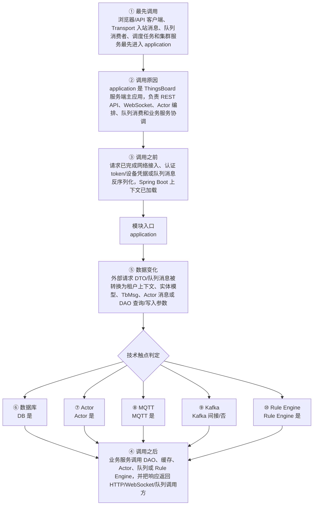

# ThingsBoard Server Application 模块调用链分析

> 生成范围：`application`  
> Maven artifact：`application`  
> packaging：`jar`  
> 分析方式：静态扫描 POM、Java 注解、入口方法、关键技术触点和类关系；不是运行时 trace。

## 完整流程图

## 十项调用链问题

| 问题 | 模块级结论 |
| --- | --- |
| ① 谁最先调用这里？ | 浏览器/API 客户端、Transport 入站消息、队列消费者、调度任务和集群服务最先进入 application |
| ② 为什么会调用？ | application 是 ThingsBoard 服务端主应用，负责 REST API、WebSocket、Actor 编排、队列消费和业务服务协调 |
| ③ 调用之前发生了什么？ | 请求已完成网络接入、认证 token/设备凭据或队列消息反序列化，Spring Boot 上下文已加载 |
| ④ 调用之后发生什么？ | 业务服务调用 DAO、缓存、Actor、队列或 Rule Engine，并把响应返回 HTTP/WebSocket/队列调用方 |
| ⑤ 数据如何变化？ | 外部请求 DTO/队列消息被转换为租户上下文、实体模型、TbMsg、Actor 消息或 DAO 查询/写入参数 |
| ⑥ 对数据库进行了哪些操作？ | 是，发现直接操作证据；直接操作证据：发现 Repository/JPA/Cassandra/JDBC/SSTable 或 DAO 模块操作模式。关键词触点 7167 处仅作为辅助线索。 |
| ⑦ 是否发送 Actor 消息？ | 是，发现直接操作证据；直接操作证据：发现 ActorRef/tell/TbActorMsg/ActorService 等操作模式。关键词触点 865 处仅作为辅助线索。 |
| ⑧ 是否发送 MQTT 消息？ | 是，发现直接操作证据；直接操作证据：发现 MQTT client/handler/publish/subscribe/writeAndFlush 等操作模式。关键词触点 7149 处仅作为辅助线索。 |
| ⑨ 是否写入 Kafka？ | 否，未发现直接操作证据；未发现直接 Kafka API 调用，但可能通过 common queue 抽象间接写入 Kafka。 |
| ⑩ 是否写入 Rule Engine？ | 是，发现直接操作证据；直接操作证据：application 中存在 Rule Engine 消息/服务调用。关键词触点 7997 处仅作为辅助线索。 |

## 入口证据

- HTTP/Web REST 控制器入口: `application/src/main/java/org/thingsboard/server/config/WebConfig.java`
- HTTP/Web REST 控制器入口: `application/src/main/java/org/thingsboard/server/controller/AdminController.java`
- HTTP/Web REST 控制器入口: `application/src/main/java/org/thingsboard/server/controller/AlarmCommentController.java`
- HTTP/Web REST 控制器入口: `application/src/main/java/org/thingsboard/server/controller/AlarmController.java`
- HTTP/Web REST 控制器入口: `application/src/main/java/org/thingsboard/server/controller/AssetController.java`
- HTTP/Web REST 控制器入口: `application/src/main/java/org/thingsboard/server/controller/AssetProfileController.java`
- HTTP/Web REST 控制器入口: `application/src/main/java/org/thingsboard/server/controller/AuditLogController.java`
- HTTP/Web REST 控制器入口: `application/src/main/java/org/thingsboard/server/controller/AuthController.java`
- HTTP/Web REST 控制器入口: 其余 45 处入口省略
- Spring Boot 应用启动入口: `application/src/main/java/org/thingsboard/server/ThingsboardInstallApplication.java`
- Spring Boot 应用启动入口: `application/src/main/java/org/thingsboard/server/ThingsboardServerApplication.java`
- Spring Component 组件入口: `application/src/main/java/org/thingsboard/server/actors/ActorSystemContext.java`
- Spring Component 组件入口: `application/src/main/java/org/thingsboard/server/config/RateLimitProcessingFilter.java`
- Spring Component 组件入口: `application/src/main/java/org/thingsboard/server/service/edge/EdgeContextComponent.java`
- Spring Component 组件入口: `application/src/main/java/org/thingsboard/server/service/edge/EdgeEventSourcingListener.java`
- Spring Component 组件入口: `application/src/main/java/org/thingsboard/server/service/edge/rpc/EdgeEventStorageSettings.java`
- Spring Component 组件入口: `application/src/main/java/org/thingsboard/server/service/edge/rpc/constructor/BaseMsgConstructorFactory.java`
- Spring Component 组件入口: `application/src/main/java/org/thingsboard/server/service/edge/rpc/constructor/alarm/AlarmMsgConstructorFactory.java`
- Spring Component 组件入口: `application/src/main/java/org/thingsboard/server/service/edge/rpc/constructor/alarm/AlarmMsgConstructorV1.java`
- Spring Component 组件入口: 其余 140 处入口省略
- Spring Service 业务服务入口: `application/src/main/java/org/thingsboard/server/actors/service/DefaultActorService.java`
- Spring Service 业务服务入口: `application/src/main/java/org/thingsboard/server/config/CustomOAuth2AuthorizationRequestResolver.java`
- Spring Service 业务服务入口: `application/src/main/java/org/thingsboard/server/controller/plugin/TbWebSocketHandler.java`
- Spring Service 业务服务入口: `application/src/main/java/org/thingsboard/server/controller/plugin/TbWebSocketHandler.java`
- Spring Service 业务服务入口: `application/src/main/java/org/thingsboard/server/install/ThingsboardInstallService.java`
- Spring Service 业务服务入口: `application/src/main/java/org/thingsboard/server/service/action/EntityActionService.java`
- Spring Service 业务服务入口: `application/src/main/java/org/thingsboard/server/service/apiusage/DefaultTbApiUsageStateService.java`
- Spring Service 业务服务入口: `application/src/main/java/org/thingsboard/server/service/apiusage/DefaultTbApiUsageStateService.java`
- Spring Service 业务服务入口: 其余 185 处入口省略
- 命令行或进程启动入口: `application/src/main/java/org/thingsboard/server/ThingsboardInstallApplication.java`
- 命令行或进程启动入口: `application/src/main/java/org/thingsboard/server/ThingsboardServerApplication.java`
- 定时任务入口: `application/src/main/java/org/thingsboard/server/actors/ActorSystemContext.java`
- 定时任务入口: `application/src/main/java/org/thingsboard/server/service/mail/RefreshTokenExpCheckService.java`
- 定时任务入口: `application/src/main/java/org/thingsboard/server/service/queue/DefaultTbClusterService.java`
- 定时任务入口: `application/src/main/java/org/thingsboard/server/service/queue/DefaultTbCoreConsumerService.java`
- 定时任务入口: `application/src/main/java/org/thingsboard/server/service/queue/DefaultTbCoreConsumerService.java`
- 定时任务入口: `application/src/main/java/org/thingsboard/server/service/queue/DefaultTbCoreConsumerService.java`
- 定时任务入口: `application/src/main/java/org/thingsboard/server/service/queue/DefaultTbRuleEngineConsumerService.java`
- 定时任务入口: `application/src/main/java/org/thingsboard/server/service/subscription/DefaultTbEntityDataSubscriptionService.java`
- 定时任务入口: 其余 7 处入口省略
- 其余 9 项已省略；完整源码证据可通过本模块 Java 文件继续追踪。

## 静态关键词统计（不等同于实际发送/写入）

- database: 7167 处静态触点；直接操作证据：发现 Repository/JPA/Cassandra/JDBC/SSTable 或 DAO 模块操作模式。关键词触点 7167 处仅作为辅助线索。
- actor: 865 处静态触点；直接操作证据：发现 ActorRef/tell/TbActorMsg/ActorService 等操作模式。关键词触点 865 处仅作为辅助线索。
- mqtt: 7149 处静态触点；直接操作证据：发现 MQTT client/handler/publish/subscribe/writeAndFlush 等操作模式。关键词触点 7149 处仅作为辅助线索。
- kafka: 8 处静态触点；未发现直接 Kafka API 调用，但可能通过 common queue 抽象间接写入 Kafka。
- rule_engine: 7997 处静态触点；直接操作证据：application 中存在 Rule Engine 消息/服务调用。关键词触点 7997 处仅作为辅助线索。
- cache: 1155 处静态触点；直接操作证据：发现静态关键词触点。关键词触点 1155 处仅作为辅助线索。
- queue: 7679 处静态触点；直接操作证据：发现静态关键词触点。关键词触点 7679 处仅作为辅助线索。
- rest: 904 处静态触点；直接操作证据：发现静态关键词触点。关键词触点 904 处仅作为辅助线索。
- websocket: 8870 处静态触点；直接操作证据：发现静态关键词触点。关键词触点 8870 处仅作为辅助线索。
- transport: 4282 处静态触点；直接操作证据：发现静态关键词触点。关键词触点 4282 处仅作为辅助线索。

## 调用前后数据流

1. 调用前：请求已完成网络接入、认证 token/设备凭据或队列消息反序列化，Spring Boot 上下文已加载
2. 模块入口：`application` 通过入口类、依赖 API、构建聚合或子模块暴露能力。
3. 模块内转换：外部请求 DTO/队列消息被转换为租户上下文、实体模型、TbMsg、Actor 消息或 DAO 查询/写入参数
4. 调用后：业务服务调用 DAO、缓存、Actor、队列或 Rule Engine，并把响应返回 HTTP/WebSocket/队列调用方
5. 数据库/Actor/MQTT/Kafka/Rule Engine 这些动作若没有直接触点，通常发生在依赖的 `application`、`dao`、`common/queue`、`common/transport` 或 `rule-engine` 模块中。

## 子模块与依赖

### 子模块

- 无子模块。

### 主要依赖

- `io.netty:netty-transport-native-epoll`
- `org.thingsboard.common:actor`
- `org.thingsboard.common:util`
- `org.thingsboard.rule-engine:rule-engine-api`
- `org.thingsboard.common:cluster-api`
- `org.thingsboard.common:version-control`
- `org.thingsboard.rule-engine:rule-engine-components`
- `org.thingsboard.common.transport:transport-api`
- `org.thingsboard.common.transport:mqtt`
- `org.thingsboard.common.transport:http`
- `org.thingsboard.common.transport:coap`
- `org.thingsboard.common.transport:lwm2m`
- `org.thingsboard.common.transport:snmp`
- `org.thingsboard:dao`
- `org.thingsboard.common:queue`
- `org.thingsboard.common.script:script-api`
- `org.thingsboard.common.script:remote-js-client`
- `org.thingsboard.common:stats`
- `org.thingsboard.common:edge-api`
- `org.thingsboard:dao`
- `io.takari.junit:takari-cpsuite`
- `org.eclipse.paho:org.eclipse.paho.client.mqttv3`
- `org.eclipse.paho:org.eclipse.paho.mqttv5.client`
- `org.thingsboard:ui-ngx`
- `org.springframework.integration:spring-integration-redis`
- `org.springframework.boot:spring-boot-starter-security`
- `org.springframework.boot:spring-boot-starter-web`
- `org.springframework.boot:spring-boot-starter-websocket`
- `org.springframework.security:spring-security-oauth2-client`
- `org.springframework.security:spring-security-oauth2-jose`
- `io.jsonwebtoken:jjwt`
- `org.freemarker:freemarker`
- `commons-io:commons-io`
- `org.apache.commons:commons-csv`
- `org.springframework:spring-context-support`
- `org.slf4j:slf4j-api`
- `org.slf4j:log4j-over-slf4j`
- `ch.qos.logback:logback-core`
- `ch.qos.logback:logback-classic`
- `com.sun.mail:javax.mail`

## 关键类型样本

- `NetworkReceive` (class, `application/src/main/java/org/apache/kafka/common/network/NetworkReceive.java`)
- `ThingsboardInstallApplication` (class, `application/src/main/java/org/thingsboard/server/ThingsboardInstallApplication.java`)
- `ThingsboardServerApplication` (class, `application/src/main/java/org/thingsboard/server/ThingsboardServerApplication.java`)
- `ActorSystemContext` (class, `application/src/main/java/org/thingsboard/server/actors/ActorSystemContext.java`)
- `TbEntityTypeActorIdPredicate` (class, `application/src/main/java/org/thingsboard/server/actors/TbEntityTypeActorIdPredicate.java`)
- `AppActor` (class, `application/src/main/java/org/thingsboard/server/actors/app/AppActor.java`)
- `ActorCreator` (class, `application/src/main/java/org/thingsboard/server/actors/app/AppActor.java`)
- `AppInitMsg` (class, `application/src/main/java/org/thingsboard/server/actors/app/AppInitMsg.java`)
- `DeviceActor` (class, `application/src/main/java/org/thingsboard/server/actors/device/DeviceActor.java`)
- `DeviceActorCreator` (class, `application/src/main/java/org/thingsboard/server/actors/device/DeviceActorCreator.java`)
- `DeviceActorMessageProcessor` (class, `application/src/main/java/org/thingsboard/server/actors/device/DeviceActorMessageProcessor.java`)
- `SessionInfo` (class, `application/src/main/java/org/thingsboard/server/actors/device/SessionInfo.java`)
- `SessionInfoMetaData` (class, `application/src/main/java/org/thingsboard/server/actors/device/SessionInfoMetaData.java`)
- `SessionTimeoutCheckMsg` (class, `application/src/main/java/org/thingsboard/server/actors/device/SessionTimeoutCheckMsg.java`)
- `ToDeviceRpcRequestMetadata` (class, `application/src/main/java/org/thingsboard/server/actors/device/ToDeviceRpcRequestMetadata.java`)
- `ToServerRpcRequestMetadata` (class, `application/src/main/java/org/thingsboard/server/actors/device/ToServerRpcRequestMetadata.java`)
- `DefaultTbContext` (class, `application/src/main/java/org/thingsboard/server/actors/ruleChain/DefaultTbContext.java`)
- `RuleChainActor` (class, `application/src/main/java/org/thingsboard/server/actors/ruleChain/RuleChainActor.java`)
- `ActorCreator` (class, `application/src/main/java/org/thingsboard/server/actors/ruleChain/RuleChainActor.java`)
- `RuleChainActorMessageProcessor` (class, `application/src/main/java/org/thingsboard/server/actors/ruleChain/RuleChainActorMessageProcessor.java`)
- `RuleChainInputMsg` (class, `application/src/main/java/org/thingsboard/server/actors/ruleChain/RuleChainInputMsg.java`)
- `RuleChainManagerActor` (class, `application/src/main/java/org/thingsboard/server/actors/ruleChain/RuleChainManagerActor.java`)
- `RuleChainOutputMsg` (class, `application/src/main/java/org/thingsboard/server/actors/ruleChain/RuleChainOutputMsg.java`)
- `RuleChainToRuleChainMsg` (class, `application/src/main/java/org/thingsboard/server/actors/ruleChain/RuleChainToRuleChainMsg.java`)
- `RuleChainToRuleNodeMsg` (class, `application/src/main/java/org/thingsboard/server/actors/ruleChain/RuleChainToRuleNodeMsg.java`)
- `RuleEngineComponentActor` (class, `application/src/main/java/org/thingsboard/server/actors/ruleChain/RuleEngineComponentActor.java`)
- `RuleNodeActor` (class, `application/src/main/java/org/thingsboard/server/actors/ruleChain/RuleNodeActor.java`)
- `ActorCreator` (class, `application/src/main/java/org/thingsboard/server/actors/ruleChain/RuleNodeActor.java`)
- `RuleNodeActorMessageProcessor` (class, `application/src/main/java/org/thingsboard/server/actors/ruleChain/RuleNodeActorMessageProcessor.java`)
- `RuleNodeCtx` (class, `application/src/main/java/org/thingsboard/server/actors/ruleChain/RuleNodeCtx.java`)
- `RuleNodeRelation` (class, `application/src/main/java/org/thingsboard/server/actors/ruleChain/RuleNodeRelation.java`)
- `RuleNodeToRuleChainTellNextMsg` (class, `application/src/main/java/org/thingsboard/server/actors/ruleChain/RuleNodeToRuleChainTellNextMsg.java`)
- `RuleNodeToSelfMsg` (class, `application/src/main/java/org/thingsboard/server/actors/ruleChain/RuleNodeToSelfMsg.java`)
- `TbToRuleChainActorMsg` (class, `application/src/main/java/org/thingsboard/server/actors/ruleChain/TbToRuleChainActorMsg.java`)
- `TbToRuleNodeActorMsg` (class, `application/src/main/java/org/thingsboard/server/actors/ruleChain/TbToRuleNodeActorMsg.java`)
- `ActorService` (interface, `application/src/main/java/org/thingsboard/server/actors/service/ActorService.java`)
- `ComponentActor` (class, `application/src/main/java/org/thingsboard/server/actors/service/ComponentActor.java`)
- `ContextAwareActor` (class, `application/src/main/java/org/thingsboard/server/actors/service/ContextAwareActor.java`)
- `ContextBasedCreator` (class, `application/src/main/java/org/thingsboard/server/actors/service/ContextBasedCreator.java`)
- `DefaultActorService` (class, `application/src/main/java/org/thingsboard/server/actors/service/DefaultActorService.java`)
- 其余 20 项已省略；完整源码证据可通过本模块 Java 文件继续追踪。

## 阅读建议

- 先看“完整流程图”确认模块在全链路中的位置。
- 再看入口证据判断调用来源是 HTTP、MQTT/Transport、Actor、Kafka、Rule Engine、DAO、测试还是构建聚合。
- 最后用触点统计区分直接行为和下游间接行为，避免把依赖模块的数据库写入误认为本模块直接写入。
