# Thingsboard Actor system 模块继承体系分析

> 生成范围：`common/actor`  
> Maven artifact：`actor`  
> Java 类型数量：30  
> 分析方式：静态扫描 `class/interface/enum/record` 的 `extends`、`implements`、方法签名和源码触点。

## 完整继承树

```text
Exception
├── TbActorException
Object/外部框架
├── AbstractTbActor
├── ├── TestRootActor
├── ├── ├── FailedToInitActor
├── ├── ├── SlowCreateActor
├── ├── ├── SlowInitActor
├── ActorSystemTest
├── ActorTestCtx
├── DefaultTbActorSystem
├── Dispatcher
├── FailedToInitActorCreator
├── InitFailureStrategy
├── IntTbActorMsg
├── ProcessFailureStrategy
├── SlowCreateActorCreator
├── SlowInitActorCreator
├── TbActorMailbox
├── TbActorSystemSettings
├── TbEntityActorId
├── TbStringActorId
├── TestRootActorCreator
RuntimeException
├── TbActorNotRegisteredException
├── TbRuleNodeUpdateException
TbActor
├── «implements» AbstractTbActor
├── «implements» ├── TestRootActor
├── «implements» ├── ├── FailedToInitActor
├── «implements» ├── ├── SlowCreateActor
├── «implements» ├── ├── SlowInitActor
TbActorCreator
├── «implements» FailedToInitActorCreator
├── «implements» SlowCreateActorCreator
├── «implements» SlowInitActorCreator
├── «implements» TestRootActorCreator
TbActorId
├── «implements» TbEntityActorId
├── «implements» TbStringActorId
TbActorMsg
├── «implements» IntTbActorMsg
TbActorRef
├── TbActorCtx
├── ├── «implements» TbActorMailbox
TbActorSystem
├── «implements» DefaultTbActorSystem
```

## 继承图

```mermaid
flowchart TD
    Object______p0["Object/外部框架"] -->|extends| AbstractTbActor_c0["AbstractTbActor"]
    TbActor_p1["TbActor"] -->|implements| AbstractTbActor_c1["AbstractTbActor"]
    Object______p2["Object/外部框架"] -->|extends| DefaultTbActorSystem_c2["DefaultTbActorSystem"]
    TbActorSystem_p3["TbActorSystem"] -->|implements| DefaultTbActorSystem_c3["DefaultTbActorSystem"]
    Object______p4["Object/外部框架"] -->|extends| Dispatcher_c4["Dispatcher"]
    Object______p5["Object/外部框架"] -->|extends| InitFailureStrategy_c5["InitFailureStrategy"]
    Object______p6["Object/外部框架"] -->|extends| ProcessFailureStrategy_c6["ProcessFailureStrategy"]
    TbActorRef_p7["TbActorRef"] -->|extends| TbActorCtx_c7["TbActorCtx"]
    Exception_p8["Exception"] -->|extends| TbActorException_c8["TbActorException"]
    Object______p9["Object/外部框架"] -->|extends| TbActorMailbox_c9["TbActorMailbox"]
    TbActorCtx_p10["TbActorCtx"] -->|implements| TbActorMailbox_c10["TbActorMailbox"]
    RuntimeException_p11["RuntimeException"] -->|extends| TbActorNotRegisteredException_c11["TbActorNotRegisteredException"]
    Object______p12["Object/外部框架"] -->|extends| TbActorSystemSettings_c12["TbActorSystemSettings"]
    Object______p13["Object/外部框架"] -->|extends| TbEntityActorId_c13["TbEntityActorId"]
    TbActorId_p14["TbActorId"] -->|implements| TbEntityActorId_c14["TbEntityActorId"]
    RuntimeException_p15["RuntimeException"] -->|extends| TbRuleNodeUpdateException_c15["TbRuleNodeUpdateException"]
    Object______p16["Object/外部框架"] -->|extends| TbStringActorId_c16["TbStringActorId"]
    TbActorId_p17["TbActorId"] -->|implements| TbStringActorId_c17["TbStringActorId"]
    Object______p18["Object/外部框架"] -->|extends| ActorSystemTest_c18["ActorSystemTest"]
    Object______p19["Object/外部框架"] -->|extends| ActorTestCtx_c19["ActorTestCtx"]
    TestRootActor_p20["TestRootActor"] -->|extends| FailedToInitActor_c20["FailedToInitActor"]
    Object______p21["Object/外部框架"] -->|extends| FailedToInitActorCreator_c21["FailedToInitActorCreator"]
    TbActorCreator_p22["TbActorCreator"] -->|implements| FailedToInitActorCreator_c22["FailedToInitActorCreator"]
    Object______p23["Object/外部框架"] -->|extends| IntTbActorMsg_c23["IntTbActorMsg"]
    TbActorMsg_p24["TbActorMsg"] -->|implements| IntTbActorMsg_c24["IntTbActorMsg"]
    TestRootActor_p25["TestRootActor"] -->|extends| SlowCreateActor_c25["SlowCreateActor"]
    Object______p26["Object/外部框架"] -->|extends| SlowCreateActorCreator_c26["SlowCreateActorCreator"]
    TbActorCreator_p27["TbActorCreator"] -->|implements| SlowCreateActorCreator_c27["SlowCreateActorCreator"]
    TestRootActor_p28["TestRootActor"] -->|extends| SlowInitActor_c28["SlowInitActor"]
    Object______p29["Object/外部框架"] -->|extends| SlowInitActorCreator_c29["SlowInitActorCreator"]
    TbActorCreator_p30["TbActorCreator"] -->|implements| SlowInitActorCreator_c30["SlowInitActorCreator"]
    AbstractTbActor_p31["AbstractTbActor"] -->|extends| TestRootActor_c31["TestRootActor"]
    Object______p32["Object/外部框架"] -->|extends| TestRootActorCreator_c32["TestRootActorCreator"]
    TbActorCreator_p33["TbActorCreator"] -->|implements| TestRootActorCreator_c33["TestRootActorCreator"]
```




## 每一层为什么存在

- 外部/上层父类或接口层：提供框架生命周期、Java 标准契约、Spring/Netty/DAO/Rule Engine 等扩展点。
- 接口层：定义跨模块契约，让调用方依赖稳定 API，而不是具体实现。
- 抽象类层：沉淀公共状态、校验、模板流程和默认实现，把变化点留给子类。
- 具体类层：完成协议、DAO、Controller、Rule Node、工具或测试场景中的最终业务动作。

## 抽象了什么

- 父类/接口抽象公共生命周期、输入输出契约、错误处理、协议适配、DAO 查询形态、消息处理模板或测试夹具。
- 子类保留具体协议、实体类型、规则节点行为、数据库实现、页面/测试步骤或命令参数差异。
- 对聚合或无 Java 模块，抽象体现在 Maven 子模块划分和构建生命周期，而不是 Java 继承。

## 父类负责什么

- 提供稳定方法签名、共享字段、默认流程、通用校验、资源释放和框架回调入口。
- 在 Spring、Netty、DAO、Rule Engine、Transport 等框架中，父类还负责让运行时可以通过统一类型调度不同实现。

## 子类负责什么

- 实现具体业务差异，例如协议解析、实体 DAO、规则节点处理、Controller API、客户端命令或测试用例。
- 覆盖父类预留的扩展点，把模块特有数据转换、数据库查询、消息发送或外部调用补进去。

## 为什么不用组合

- 继承用于框架生命周期和模板方法：运行时需要把子类当作父类处理，例如 Spring Bean、Netty Handler、DAO Repository、Rule Node 或测试基类。
- 组合适合注入协作者，本模块中仍然通过字段依赖使用组合；但当需要统一回调签名、共享模板流程或多态派发时，单纯组合不能替代继承。

## 为什么不用接口

- 接口只能表达契约，不能集中保存公共状态、默认校验、资源关闭和模板流程。
- 当模块只需要契约时会使用接口；当多个实现还需要共享代码、默认行为或受保护扩展点时使用抽象类。

## 模板方法

- `AbstractTbActor.getActorRef()` (public, `common/actor/src/main/java/org/thingsboard/server/actors/AbstractTbActor.java`)
- `JsInvokeStats.incrementRequests()` (package, `common/actor/src/main/java/org/thingsboard/server/actors/JsInvokeStats.java`)
- `JsInvokeStats.incrementRequests()` (package, `common/actor/src/main/java/org/thingsboard/server/actors/JsInvokeStats.java`)
- `JsInvokeStats.incrementResponses()` (package, `common/actor/src/main/java/org/thingsboard/server/actors/JsInvokeStats.java`)
- `JsInvokeStats.incrementResponses()` (package, `common/actor/src/main/java/org/thingsboard/server/actors/JsInvokeStats.java`)
- `JsInvokeStats.incrementFailures()` (package, `common/actor/src/main/java/org/thingsboard/server/actors/JsInvokeStats.java`)
- `JsInvokeStats.incrementFailures()` (package, `common/actor/src/main/java/org/thingsboard/server/actors/JsInvokeStats.java`)
- `JsInvokeStats.getRequests()` (package, `common/actor/src/main/java/org/thingsboard/server/actors/JsInvokeStats.java`)
- `JsInvokeStats.getResponses()` (package, `common/actor/src/main/java/org/thingsboard/server/actors/JsInvokeStats.java`)
- `JsInvokeStats.getFailures()` (package, `common/actor/src/main/java/org/thingsboard/server/actors/JsInvokeStats.java`)
- `JsInvokeStats.reset()` (package, `common/actor/src/main/java/org/thingsboard/server/actors/JsInvokeStats.java`)
- `TbActor.process()` (package, `common/actor/src/main/java/org/thingsboard/server/actors/TbActor.java`)
- `TbActor.getActorRef()` (package, `common/actor/src/main/java/org/thingsboard/server/actors/TbActor.java`)
- `TbActor.onInitFailure()` (package, `common/actor/src/main/java/org/thingsboard/server/actors/TbActor.java`)
- `TbActor.onProcessFailure()` (package, `common/actor/src/main/java/org/thingsboard/server/actors/TbActor.java`)
- `TbActorCreator.createActorId()` (package, `common/actor/src/main/java/org/thingsboard/server/actors/TbActorCreator.java`)
- `TbActorCreator.createActor()` (package, `common/actor/src/main/java/org/thingsboard/server/actors/TbActorCreator.java`)
- `TbActorCtx.getSelf()` (package, `common/actor/src/main/java/org/thingsboard/server/actors/TbActorCtx.java`)
- `TbActorCtx.getParentRef()` (package, `common/actor/src/main/java/org/thingsboard/server/actors/TbActorCtx.java`)
- `TbActorCtx.tell()` (package, `common/actor/src/main/java/org/thingsboard/server/actors/TbActorCtx.java`)
- `TbActorCtx.stop()` (package, `common/actor/src/main/java/org/thingsboard/server/actors/TbActorCtx.java`)
- `TbActorCtx.getOrCreateChildActor()` (package, `common/actor/src/main/java/org/thingsboard/server/actors/TbActorCtx.java`)
- `TbActorCtx.broadcastToChildren()` (package, `common/actor/src/main/java/org/thingsboard/server/actors/TbActorCtx.java`)
- `TbActorCtx.broadcastToChildren()` (package, `common/actor/src/main/java/org/thingsboard/server/actors/TbActorCtx.java`)
- `TbActorCtx.broadcastToChildrenByType()` (package, `common/actor/src/main/java/org/thingsboard/server/actors/TbActorCtx.java`)
- `TbActorCtx.broadcastToChildren()` (package, `common/actor/src/main/java/org/thingsboard/server/actors/TbActorCtx.java`)
- `TbActorCtx.filterChildren()` (package, `common/actor/src/main/java/org/thingsboard/server/actors/TbActorCtx.java`)
- `TbActorId.getEntityType()` (package, `common/actor/src/main/java/org/thingsboard/server/actors/TbActorId.java`)
- `TbActorRef.getActorId()` (package, `common/actor/src/main/java/org/thingsboard/server/actors/TbActorRef.java`)
- `TbActorRef.tell()` (package, `common/actor/src/main/java/org/thingsboard/server/actors/TbActorRef.java`)
- `TbActorRef.tellWithHighPriority()` (package, `common/actor/src/main/java/org/thingsboard/server/actors/TbActorRef.java`)
- `TbActorSystem.getScheduler()` (package, `common/actor/src/main/java/org/thingsboard/server/actors/TbActorSystem.java`)
- `TbActorSystem.createDispatcher()` (package, `common/actor/src/main/java/org/thingsboard/server/actors/TbActorSystem.java`)
- `TbActorSystem.destroyDispatcher()` (package, `common/actor/src/main/java/org/thingsboard/server/actors/TbActorSystem.java`)
- `TbActorSystem.getActor()` (package, `common/actor/src/main/java/org/thingsboard/server/actors/TbActorSystem.java`)
- `TbActorSystem.createRootActor()` (package, `common/actor/src/main/java/org/thingsboard/server/actors/TbActorSystem.java`)
- `TbActorSystem.createChildActor()` (package, `common/actor/src/main/java/org/thingsboard/server/actors/TbActorSystem.java`)
- `TbActorSystem.tell()` (package, `common/actor/src/main/java/org/thingsboard/server/actors/TbActorSystem.java`)
- `TbActorSystem.tellWithHighPriority()` (package, `common/actor/src/main/java/org/thingsboard/server/actors/TbActorSystem.java`)
- `TbActorSystem.stop()` (package, `common/actor/src/main/java/org/thingsboard/server/actors/TbActorSystem.java`)


## 哪些方法可以重写

- `AbstractTbActor.getActorRef()` (public, `common/actor/src/main/java/org/thingsboard/server/actors/AbstractTbActor.java`)
- `DefaultTbActorSystem.createDispatcher()` (public, `common/actor/src/main/java/org/thingsboard/server/actors/DefaultTbActorSystem.java`)
- `DefaultTbActorSystem.Dispatcher()` (package, `common/actor/src/main/java/org/thingsboard/server/actors/DefaultTbActorSystem.java`)
- `DefaultTbActorSystem.RuntimeException()` (package, `common/actor/src/main/java/org/thingsboard/server/actors/DefaultTbActorSystem.java`)
- `DefaultTbActorSystem.destroyDispatcher()` (public, `common/actor/src/main/java/org/thingsboard/server/actors/DefaultTbActorSystem.java`)
- `DefaultTbActorSystem.RuntimeException()` (package, `common/actor/src/main/java/org/thingsboard/server/actors/DefaultTbActorSystem.java`)
- `DefaultTbActorSystem.getActor()` (public, `common/actor/src/main/java/org/thingsboard/server/actors/DefaultTbActorSystem.java`)
- `DefaultTbActorSystem.createRootActor()` (public, `common/actor/src/main/java/org/thingsboard/server/actors/DefaultTbActorSystem.java`)
- `DefaultTbActorSystem.createActor()` (package, `common/actor/src/main/java/org/thingsboard/server/actors/DefaultTbActorSystem.java`)
- `DefaultTbActorSystem.createChildActor()` (public, `common/actor/src/main/java/org/thingsboard/server/actors/DefaultTbActorSystem.java`)
- `DefaultTbActorSystem.createActor()` (package, `common/actor/src/main/java/org/thingsboard/server/actors/DefaultTbActorSystem.java`)
- `DefaultTbActorSystem.RuntimeException()` (package, `common/actor/src/main/java/org/thingsboard/server/actors/DefaultTbActorSystem.java`)
- `DefaultTbActorSystem.ReentrantLock()` (package, `common/actor/src/main/java/org/thingsboard/server/actors/DefaultTbActorSystem.java`)
- `DefaultTbActorSystem.TbActorNotRegisteredException()` (package, `common/actor/src/main/java/org/thingsboard/server/actors/DefaultTbActorSystem.java`)
- `DefaultTbActorSystem.TbActorMailbox()` (package, `common/actor/src/main/java/org/thingsboard/server/actors/DefaultTbActorSystem.java`)
- `DefaultTbActorSystem.tellWithHighPriority()` (public, `common/actor/src/main/java/org/thingsboard/server/actors/DefaultTbActorSystem.java`)
- `DefaultTbActorSystem.tell()` (public, `common/actor/src/main/java/org/thingsboard/server/actors/DefaultTbActorSystem.java`)
- `DefaultTbActorSystem.TbActorNotRegisteredException()` (package, `common/actor/src/main/java/org/thingsboard/server/actors/DefaultTbActorSystem.java`)
- `DefaultTbActorSystem.broadcastToChildren()` (public, `common/actor/src/main/java/org/thingsboard/server/actors/DefaultTbActorSystem.java`)
- `DefaultTbActorSystem.broadcastToChildren()` (public, `common/actor/src/main/java/org/thingsboard/server/actors/DefaultTbActorSystem.java`)
- `DefaultTbActorSystem.broadcastToChildren()` (public, `common/actor/src/main/java/org/thingsboard/server/actors/DefaultTbActorSystem.java`)
- `DefaultTbActorSystem.filterChildren()` (public, `common/actor/src/main/java/org/thingsboard/server/actors/DefaultTbActorSystem.java`)
- `DefaultTbActorSystem.stop()` (public, `common/actor/src/main/java/org/thingsboard/server/actors/DefaultTbActorSystem.java`)
- `DefaultTbActorSystem.stop()` (public, `common/actor/src/main/java/org/thingsboard/server/actors/DefaultTbActorSystem.java`)
- `DefaultTbActorSystem.stop()` (public, `common/actor/src/main/java/org/thingsboard/server/actors/DefaultTbActorSystem.java`)
- `JsInvokeStats.incrementRequests()` (package, `common/actor/src/main/java/org/thingsboard/server/actors/JsInvokeStats.java`)
- `JsInvokeStats.incrementRequests()` (package, `common/actor/src/main/java/org/thingsboard/server/actors/JsInvokeStats.java`)
- `JsInvokeStats.incrementResponses()` (package, `common/actor/src/main/java/org/thingsboard/server/actors/JsInvokeStats.java`)
- `JsInvokeStats.incrementResponses()` (package, `common/actor/src/main/java/org/thingsboard/server/actors/JsInvokeStats.java`)
- `JsInvokeStats.incrementFailures()` (package, `common/actor/src/main/java/org/thingsboard/server/actors/JsInvokeStats.java`)
- `JsInvokeStats.incrementFailures()` (package, `common/actor/src/main/java/org/thingsboard/server/actors/JsInvokeStats.java`)
- `JsInvokeStats.getRequests()` (package, `common/actor/src/main/java/org/thingsboard/server/actors/JsInvokeStats.java`)
- `JsInvokeStats.getResponses()` (package, `common/actor/src/main/java/org/thingsboard/server/actors/JsInvokeStats.java`)
- `JsInvokeStats.getFailures()` (package, `common/actor/src/main/java/org/thingsboard/server/actors/JsInvokeStats.java`)
- `JsInvokeStats.reset()` (package, `common/actor/src/main/java/org/thingsboard/server/actors/JsInvokeStats.java`)
- `TbActor.process()` (package, `common/actor/src/main/java/org/thingsboard/server/actors/TbActor.java`)
- `TbActor.getActorRef()` (package, `common/actor/src/main/java/org/thingsboard/server/actors/TbActor.java`)
- `TbActor.onInitFailure()` (package, `common/actor/src/main/java/org/thingsboard/server/actors/TbActor.java`)
- `TbActor.onProcessFailure()` (package, `common/actor/src/main/java/org/thingsboard/server/actors/TbActor.java`)
- `TbActorCreator.createActorId()` (package, `common/actor/src/main/java/org/thingsboard/server/actors/TbActorCreator.java`)


## 哪些方法必须重写

- `DefaultTbActorSystem.Dispatcher()` (package, `common/actor/src/main/java/org/thingsboard/server/actors/DefaultTbActorSystem.java`)
- `DefaultTbActorSystem.RuntimeException()` (package, `common/actor/src/main/java/org/thingsboard/server/actors/DefaultTbActorSystem.java`)
- `DefaultTbActorSystem.RuntimeException()` (package, `common/actor/src/main/java/org/thingsboard/server/actors/DefaultTbActorSystem.java`)
- `DefaultTbActorSystem.createActor()` (package, `common/actor/src/main/java/org/thingsboard/server/actors/DefaultTbActorSystem.java`)
- `DefaultTbActorSystem.createActor()` (package, `common/actor/src/main/java/org/thingsboard/server/actors/DefaultTbActorSystem.java`)
- `DefaultTbActorSystem.RuntimeException()` (package, `common/actor/src/main/java/org/thingsboard/server/actors/DefaultTbActorSystem.java`)
- `DefaultTbActorSystem.ReentrantLock()` (package, `common/actor/src/main/java/org/thingsboard/server/actors/DefaultTbActorSystem.java`)
- `DefaultTbActorSystem.TbActorNotRegisteredException()` (package, `common/actor/src/main/java/org/thingsboard/server/actors/DefaultTbActorSystem.java`)
- `DefaultTbActorSystem.TbActorMailbox()` (package, `common/actor/src/main/java/org/thingsboard/server/actors/DefaultTbActorSystem.java`)
- `DefaultTbActorSystem.TbActorNotRegisteredException()` (package, `common/actor/src/main/java/org/thingsboard/server/actors/DefaultTbActorSystem.java`)
- `JsInvokeStats.incrementRequests()` (package, `common/actor/src/main/java/org/thingsboard/server/actors/JsInvokeStats.java`)
- `JsInvokeStats.incrementRequests()` (package, `common/actor/src/main/java/org/thingsboard/server/actors/JsInvokeStats.java`)
- `JsInvokeStats.incrementResponses()` (package, `common/actor/src/main/java/org/thingsboard/server/actors/JsInvokeStats.java`)
- `JsInvokeStats.incrementResponses()` (package, `common/actor/src/main/java/org/thingsboard/server/actors/JsInvokeStats.java`)
- `JsInvokeStats.incrementFailures()` (package, `common/actor/src/main/java/org/thingsboard/server/actors/JsInvokeStats.java`)
- `JsInvokeStats.incrementFailures()` (package, `common/actor/src/main/java/org/thingsboard/server/actors/JsInvokeStats.java`)
- `JsInvokeStats.getRequests()` (package, `common/actor/src/main/java/org/thingsboard/server/actors/JsInvokeStats.java`)
- `JsInvokeStats.getResponses()` (package, `common/actor/src/main/java/org/thingsboard/server/actors/JsInvokeStats.java`)
- `JsInvokeStats.getFailures()` (package, `common/actor/src/main/java/org/thingsboard/server/actors/JsInvokeStats.java`)
- `JsInvokeStats.reset()` (package, `common/actor/src/main/java/org/thingsboard/server/actors/JsInvokeStats.java`)
- `TbActor.process()` (package, `common/actor/src/main/java/org/thingsboard/server/actors/TbActor.java`)
- `TbActor.getActorRef()` (package, `common/actor/src/main/java/org/thingsboard/server/actors/TbActor.java`)
- `TbActor.onInitFailure()` (package, `common/actor/src/main/java/org/thingsboard/server/actors/TbActor.java`)
- `TbActor.onProcessFailure()` (package, `common/actor/src/main/java/org/thingsboard/server/actors/TbActor.java`)
- `TbActorCreator.createActorId()` (package, `common/actor/src/main/java/org/thingsboard/server/actors/TbActorCreator.java`)
- `TbActorCreator.createActor()` (package, `common/actor/src/main/java/org/thingsboard/server/actors/TbActorCreator.java`)
- `TbActorCtx.getSelf()` (package, `common/actor/src/main/java/org/thingsboard/server/actors/TbActorCtx.java`)
- `TbActorCtx.getParentRef()` (package, `common/actor/src/main/java/org/thingsboard/server/actors/TbActorCtx.java`)
- `TbActorCtx.tell()` (package, `common/actor/src/main/java/org/thingsboard/server/actors/TbActorCtx.java`)
- `TbActorCtx.stop()` (package, `common/actor/src/main/java/org/thingsboard/server/actors/TbActorCtx.java`)
- `TbActorCtx.getOrCreateChildActor()` (package, `common/actor/src/main/java/org/thingsboard/server/actors/TbActorCtx.java`)
- `TbActorCtx.broadcastToChildren()` (package, `common/actor/src/main/java/org/thingsboard/server/actors/TbActorCtx.java`)
- `TbActorCtx.broadcastToChildren()` (package, `common/actor/src/main/java/org/thingsboard/server/actors/TbActorCtx.java`)
- `TbActorCtx.broadcastToChildrenByType()` (package, `common/actor/src/main/java/org/thingsboard/server/actors/TbActorCtx.java`)
- `TbActorCtx.broadcastToChildren()` (package, `common/actor/src/main/java/org/thingsboard/server/actors/TbActorCtx.java`)
- `TbActorCtx.filterChildren()` (package, `common/actor/src/main/java/org/thingsboard/server/actors/TbActorCtx.java`)
- `TbActorId.getEntityType()` (package, `common/actor/src/main/java/org/thingsboard/server/actors/TbActorId.java`)
- `TbActorMailbox.AtomicBoolean()` (package, `common/actor/src/main/java/org/thingsboard/server/actors/TbActorMailbox.java`)
- `TbActorMailbox.AtomicBoolean()` (package, `common/actor/src/main/java/org/thingsboard/server/actors/TbActorMailbox.java`)
- `TbActorMailbox.AtomicBoolean()` (package, `common/actor/src/main/java/org/thingsboard/server/actors/TbActorMailbox.java`)


## 哪些地方使用了多态

- `Object/外部框架` -> `AbstractTbActor` (extends)
- `TbActor` -> `AbstractTbActor` (implements)
- `Object/外部框架` -> `DefaultTbActorSystem` (extends)
- `TbActorSystem` -> `DefaultTbActorSystem` (implements)
- `Object/外部框架` -> `Dispatcher` (extends)
- `Object/外部框架` -> `InitFailureStrategy` (extends)
- `Object/外部框架` -> `ProcessFailureStrategy` (extends)
- `TbActorRef` -> `TbActorCtx` (extends)
- `Exception` -> `TbActorException` (extends)
- `Object/外部框架` -> `TbActorMailbox` (extends)
- `TbActorCtx` -> `TbActorMailbox` (implements)
- `RuntimeException` -> `TbActorNotRegisteredException` (extends)
- `Object/外部框架` -> `TbActorSystemSettings` (extends)
- `Object/外部框架` -> `TbEntityActorId` (extends)
- `TbActorId` -> `TbEntityActorId` (implements)
- `RuntimeException` -> `TbRuleNodeUpdateException` (extends)
- `Object/外部框架` -> `TbStringActorId` (extends)
- `TbActorId` -> `TbStringActorId` (implements)
- `Object/外部框架` -> `ActorSystemTest` (extends)
- `Object/外部框架` -> `ActorTestCtx` (extends)
- `TestRootActor` -> `FailedToInitActor` (extends)
- `Object/外部框架` -> `FailedToInitActorCreator` (extends)
- `TbActorCreator` -> `FailedToInitActorCreator` (implements)
- `Object/外部框架` -> `IntTbActorMsg` (extends)
- `TbActorMsg` -> `IntTbActorMsg` (implements)
- `TestRootActor` -> `SlowCreateActor` (extends)
- `Object/外部框架` -> `SlowCreateActorCreator` (extends)
- `TbActorCreator` -> `SlowCreateActorCreator` (implements)
- `TestRootActor` -> `SlowInitActor` (extends)
- `Object/外部框架` -> `SlowInitActorCreator` (extends)
- `TbActorCreator` -> `SlowInitActorCreator` (implements)
- `AbstractTbActor` -> `TestRootActor` (extends)
- `Object/外部框架` -> `TestRootActorCreator` (extends)
- `TbActorCreator` -> `TestRootActorCreator` (implements)


## 外部父类/接口

- `Exception`
- `Object/外部框架`
- `RuntimeException`
- `TbActorMsg`


## 整个继承体系解决了什么问题

该继承体系把“稳定生命周期/契约”和“模块特定行为”分开：父类或接口负责统一入口、共享流程和多态调度，子类负责差异化协议、实体、规则、DAO、测试或工具行为。这样可以让上游模块通过父类型调用下游实现，同时保持每个实现只关注自己的变化点。
