# Thingsboard Server Common Cache 模块继承体系分析

> 生成范围：`common/cache`  
> Maven artifact：`cache`  
> Java 类型数量：35  
> 分析方式：静态扫描 `class/interface/enum/record` 的 `extends`、`implements`、方法签名和源码触点。

## 完整继承树

```text
Object/外部框架
├── CacheSpecs
├── CacheSpecsMap
├── CacheSpecsMapTest
├── CaffeineOtaPackageCache
├── CaffeineTbCacheTransaction
├── CaffeineTbTransactionalCache
├── ├── DeviceCaffeineCache
├── ├── ResourceInfoCaffeineCache
├── ├── UsersSessionInvalidationCaffeineCache
├── DefaultRateLimitService
├── DeviceCacheEvictEvent
├── DeviceCacheKey
├── RateLimitKey
├── RedisOtaPackageDataCache
├── RedisTbCacheTransaction
├── RedisTbTransactionalCache
├── ├── DeviceRedisCache
├── ├── ResourceInfoRedisCache
├── ├── UsersSessionInvalidationRedisCache
├── ResourceInfoCacheKey
├── ResourceInfoEvictEvent
├── SimpleTbCacheValueWrapper
├── TBRedisCacheConfiguration
├── ├── TBRedisClusterConfiguration
├── ├── TBRedisSentinelConfiguration
├── ├── TBRedisStandaloneConfiguration
├── TbCaffeineCacheConfiguration
├── TbFSTRedisSerializer
OtaPackageDataCache
├── «implements» CaffeineOtaPackageCache
├── «implements» RedisOtaPackageDataCache
RateLimitService
├── «implements» DefaultRateLimitService
Serializable
├── «implements» DeviceCacheKey
├── «implements» ResourceInfoCacheKey
```

## 继承图

```mermaid
flowchart TD
    Object______p0["Object/外部框架"] -->|extends| CacheSpecs_c0["CacheSpecs"]
    Object______p1["Object/外部框架"] -->|extends| CacheSpecsMap_c1["CacheSpecsMap"]
    Object______p2["Object/外部框架"] -->|extends| CaffeineTbCacheTransaction_c2["CaffeineTbCacheTransaction"]
    Object______p3["Object/外部框架"] -->|extends| CaffeineTbTransactionalCache_c3["CaffeineTbTransactionalCache"]
    Object______p4["Object/外部框架"] -->|extends| RedisTbCacheTransaction_c4["RedisTbCacheTransaction"]
    Object______p5["Object/外部框架"] -->|extends| RedisTbTransactionalCache_c5["RedisTbTransactionalCache"]
    Object______p6["Object/外部框架"] -->|extends| SimpleTbCacheValueWrapper_c6["SimpleTbCacheValueWrapper"]
    Object______p7["Object/外部框架"] -->|extends| TBRedisCacheConfiguration_c7["TBRedisCacheConfiguration"]
    TBRedisCacheConfiguration_p8["TBRedisCacheConfiguration"] -->|extends| TBRedisClusterConfiguration_c8["TBRedisClusterConfiguration"]
    TBRedisCacheConfiguration_p9["TBRedisCacheConfiguration"] -->|extends| TBRedisSentinelConfiguration_c9["TBRedisSentinelConfiguration"]
    TBRedisCacheConfiguration_p10["TBRedisCacheConfiguration"] -->|extends| TBRedisStandaloneConfiguration_c10["TBRedisStandaloneConfiguration"]
    Object______p11["Object/外部框架"] -->|extends| TbCaffeineCacheConfiguration_c11["TbCaffeineCacheConfiguration"]
    Object______p12["Object/外部框架"] -->|extends| TbFSTRedisSerializer_c12["TbFSTRedisSerializer"]
    Object______p13["Object/外部框架"] -->|extends| DeviceCacheEvictEvent_c13["DeviceCacheEvictEvent"]
    Object______p14["Object/外部框架"] -->|extends| DeviceCacheKey_c14["DeviceCacheKey"]
    Serializable_p15["Serializable"] -->|implements| DeviceCacheKey_c15["DeviceCacheKey"]
    CaffeineTbTransactionalCache_p16["CaffeineTbTransactionalCache"] -->|extends| DeviceCaffeineCache_c16["DeviceCaffeineCache"]
    RedisTbTransactionalCache_p17["RedisTbTransactionalCache"] -->|extends| DeviceRedisCache_c17["DeviceRedisCache"]
    Object______p18["Object/外部框架"] -->|extends| DefaultRateLimitService_c18["DefaultRateLimitService"]
    RateLimitService_p19["RateLimitService"] -->|implements| DefaultRateLimitService_c19["DefaultRateLimitService"]
    Object______p20["Object/外部框架"] -->|extends| RateLimitKey_c20["RateLimitKey"]
    Object______p21["Object/外部框架"] -->|extends| CaffeineOtaPackageCache_c21["CaffeineOtaPackageCache"]
    OtaPackageDataCache_p22["OtaPackageDataCache"] -->|implements| CaffeineOtaPackageCache_c22["CaffeineOtaPackageCache"]
    Object______p23["Object/外部框架"] -->|extends| RedisOtaPackageDataCache_c23["RedisOtaPackageDataCache"]
    OtaPackageDataCache_p24["OtaPackageDataCache"] -->|implements| RedisOtaPackageDataCache_c24["RedisOtaPackageDataCache"]
    Object______p25["Object/外部框架"] -->|extends| ResourceInfoCacheKey_c25["ResourceInfoCacheKey"]
    Serializable_p26["Serializable"] -->|implements| ResourceInfoCacheKey_c26["ResourceInfoCacheKey"]
    CaffeineTbTransactionalCache_p27["CaffeineTbTransactionalCache"] -->|extends| ResourceInfoCaffeineCache_c27["ResourceInfoCaffeineCache"]
    Object______p28["Object/外部框架"] -->|extends| ResourceInfoEvictEvent_c28["ResourceInfoEvictEvent"]
    RedisTbTransactionalCache_p29["RedisTbTransactionalCache"] -->|extends| ResourceInfoRedisCache_c29["ResourceInfoRedisCache"]
    CaffeineTbTransactionalCache_p30["CaffeineTbTransactionalCache"] -->|extends| UsersSessionInvalidationCaffeineCache_c30["UsersSessionInvalidationCaffeineCache"]
    RedisTbTransactionalCache_p31["RedisTbTransactionalCache"] -->|extends| UsersSessionInvalidationRedisCache_c31["UsersSessionInvalidationRedisCache"]
    Object______p32["Object/外部框架"] -->|extends| CacheSpecsMapTest_c32["CacheSpecsMapTest"]
```




## 每一层为什么存在

- 外部/上层父类或接口层：提供框架生命周期、Java 标准契约、Spring/Netty/DAO/Rule Engine 等扩展点。
- 接口层：定义跨模块契约，让调用方依赖稳定 API，而不是具体实现。
- 抽象类层：沉淀公共状态、校验、模板流程和默认实现，把变化点留给子类。
- 具体类层：完成协议、DAO、Controller、Rule Node、工具或测试场景中的最终业务动作。

## 抽象了什么

- 父类/接口抽象公共生命周期、输入输出契约、错误处理、协议适配、DAO 查询形态、消息处理模板或测试夹具。
- 子类保留具体协议、实体类型、规则节点行为、数据库实现、页面/测试步骤或命令参数差异。
- 对聚合或无 Java 模块，抽象体现在 Maven 子模块划分和构建生命周期，而不是 Java 继承。

## 父类负责什么

- 提供稳定方法签名、共享字段、默认流程、通用校验、资源释放和框架回调入口。
- 在 Spring、Netty、DAO、Rule Engine、Transport 等框架中，父类还负责让运行时可以通过统一类型调度不同实现。

## 子类负责什么

- 实现具体业务差异，例如协议解析、实体 DAO、规则节点处理、Controller API、客户端命令或测试用例。
- 覆盖父类预留的扩展点，把模块特有数据转换、数据库查询、消息发送或外部调用补进去。

## 为什么不用组合

- 继承用于框架生命周期和模板方法：运行时需要把子类当作父类处理，例如 Spring Bean、Netty Handler、DAO Repository、Rule Node 或测试基类。
- 组合适合注入协作者，本模块中仍然通过字段依赖使用组合；但当需要统一回调签名、共享模板流程或多态派发时，单纯组合不能替代继承。

## 为什么不用接口

- 接口只能表达契约，不能集中保存公共状态、默认校验、资源关闭和模板流程。
- 当模块只需要契约时会使用接口；当多个实现还需要共享代码、默认行为或受保护扩展点时使用抽象类。

## 模板方法

- `CaffeineTbTransactionalCache.ReentrantLock()` (package, `common/cache/src/main/java/org/thingsboard/server/cache/CaffeineTbTransactionalCache.java`)
- `CaffeineTbTransactionalCache.get()` (public, `common/cache/src/main/java/org/thingsboard/server/cache/CaffeineTbTransactionalCache.java`)
- `CaffeineTbTransactionalCache.put()` (public, `common/cache/src/main/java/org/thingsboard/server/cache/CaffeineTbTransactionalCache.java`)
- `CaffeineTbTransactionalCache.putIfAbsent()` (public, `common/cache/src/main/java/org/thingsboard/server/cache/CaffeineTbTransactionalCache.java`)
- `CaffeineTbTransactionalCache.evict()` (public, `common/cache/src/main/java/org/thingsboard/server/cache/CaffeineTbTransactionalCache.java`)
- `CaffeineTbTransactionalCache.evict()` (public, `common/cache/src/main/java/org/thingsboard/server/cache/CaffeineTbTransactionalCache.java`)
- `CaffeineTbTransactionalCache.evictOrPut()` (public, `common/cache/src/main/java/org/thingsboard/server/cache/CaffeineTbTransactionalCache.java`)
- `CaffeineTbTransactionalCache.newTransactionForKey()` (public, `common/cache/src/main/java/org/thingsboard/server/cache/CaffeineTbTransactionalCache.java`)
- `CaffeineTbTransactionalCache.newTransaction()` (package, `common/cache/src/main/java/org/thingsboard/server/cache/CaffeineTbTransactionalCache.java`)
- `CaffeineTbTransactionalCache.newTransactionForKeys()` (public, `common/cache/src/main/java/org/thingsboard/server/cache/CaffeineTbTransactionalCache.java`)
- `CaffeineTbTransactionalCache.newTransaction()` (package, `common/cache/src/main/java/org/thingsboard/server/cache/CaffeineTbTransactionalCache.java`)
- `CaffeineTbTransactionalCache.doPutIfAbsent()` (package, `common/cache/src/main/java/org/thingsboard/server/cache/CaffeineTbTransactionalCache.java`)
- `CaffeineTbTransactionalCache.doEvict()` (package, `common/cache/src/main/java/org/thingsboard/server/cache/CaffeineTbTransactionalCache.java`)
- `CaffeineTbTransactionalCache.newTransaction()` (package, `common/cache/src/main/java/org/thingsboard/server/cache/CaffeineTbTransactionalCache.java`)
- `CaffeineTbTransactionalCache.commit()` (public, `common/cache/src/main/java/org/thingsboard/server/cache/CaffeineTbTransactionalCache.java`)
- `CaffeineTbTransactionalCache.rollback()` (package, `common/cache/src/main/java/org/thingsboard/server/cache/CaffeineTbTransactionalCache.java`)
- `RedisTbTransactionalCache.JedisPool()` (package, `common/cache/src/main/java/org/thingsboard/server/cache/RedisTbTransactionalCache.java`)
- `RedisTbTransactionalCache.get()` (public, `common/cache/src/main/java/org/thingsboard/server/cache/RedisTbTransactionalCache.java`)
- `RedisTbTransactionalCache.put()` (public, `common/cache/src/main/java/org/thingsboard/server/cache/RedisTbTransactionalCache.java`)
- `RedisTbTransactionalCache.putIfAbsent()` (public, `common/cache/src/main/java/org/thingsboard/server/cache/RedisTbTransactionalCache.java`)
- `RedisTbTransactionalCache.evict()` (public, `common/cache/src/main/java/org/thingsboard/server/cache/RedisTbTransactionalCache.java`)
- `RedisTbTransactionalCache.evict()` (public, `common/cache/src/main/java/org/thingsboard/server/cache/RedisTbTransactionalCache.java`)
- `RedisTbTransactionalCache.evictOrPut()` (public, `common/cache/src/main/java/org/thingsboard/server/cache/RedisTbTransactionalCache.java`)
- `RedisTbTransactionalCache.getRawValue()` (package, `common/cache/src/main/java/org/thingsboard/server/cache/RedisTbTransactionalCache.java`)
- `RedisTbTransactionalCache.newTransactionForKey()` (public, `common/cache/src/main/java/org/thingsboard/server/cache/RedisTbTransactionalCache.java`)
- `RedisTbTransactionalCache.newTransactionForKeys()` (public, `common/cache/src/main/java/org/thingsboard/server/cache/RedisTbTransactionalCache.java`)
- `RedisTbTransactionalCache.JedisConnection()` (package, `common/cache/src/main/java/org/thingsboard/server/cache/RedisTbTransactionalCache.java`)
- `RedisTbTransactionalCache.RuntimeException()` (package, `common/cache/src/main/java/org/thingsboard/server/cache/RedisTbTransactionalCache.java`)
- `RedisTbTransactionalCache.IllegalArgumentException()` (package, `common/cache/src/main/java/org/thingsboard/server/cache/RedisTbTransactionalCache.java`)
- `RedisTbTransactionalCache.RuntimeException()` (package, `common/cache/src/main/java/org/thingsboard/server/cache/RedisTbTransactionalCache.java`)
- `RedisTbTransactionalCache.put()` (public, `common/cache/src/main/java/org/thingsboard/server/cache/RedisTbTransactionalCache.java`)
- `TBRedisCacheConfiguration.redisConnectionFactory()` (public, `common/cache/src/main/java/org/thingsboard/server/cache/TBRedisCacheConfiguration.java`)
- `TBRedisCacheConfiguration.loadFactory()` (package, `common/cache/src/main/java/org/thingsboard/server/cache/TBRedisCacheConfiguration.java`)
- `TBRedisCacheConfiguration.loadFactory()` (package, `common/cache/src/main/java/org/thingsboard/server/cache/TBRedisCacheConfiguration.java`)
- `TBRedisCacheConfiguration.cacheManager()` (public, `common/cache/src/main/java/org/thingsboard/server/cache/TBRedisCacheConfiguration.java`)
- `TBRedisCacheConfiguration.DefaultFormattingConversionService()` (package, `common/cache/src/main/java/org/thingsboard/server/cache/TBRedisCacheConfiguration.java`)
- `TBRedisCacheConfiguration.redisTemplate()` (public, `common/cache/src/main/java/org/thingsboard/server/cache/TBRedisCacheConfiguration.java`)
- `TBRedisCacheConfiguration.buildPoolConfig()` (protected, `common/cache/src/main/java/org/thingsboard/server/cache/TBRedisCacheConfiguration.java`)
- `TBRedisCacheConfiguration.JedisPoolConfig()` (package, `common/cache/src/main/java/org/thingsboard/server/cache/TBRedisCacheConfiguration.java`)
- `TBRedisCacheConfiguration.getNodes()` (protected, `common/cache/src/main/java/org/thingsboard/server/cache/TBRedisCacheConfiguration.java`)


## 哪些方法可以重写

- `CacheSpecsMap.replaceTheJWTTokenRefreshExpTime()` (public, `common/cache/src/main/java/org/thingsboard/server/cache/CacheSpecsMap.java`)
- `CaffeineTbCacheTransaction.putIfAbsent()` (public, `common/cache/src/main/java/org/thingsboard/server/cache/CaffeineTbCacheTransaction.java`)
- `CaffeineTbCacheTransaction.commit()` (public, `common/cache/src/main/java/org/thingsboard/server/cache/CaffeineTbCacheTransaction.java`)
- `CaffeineTbCacheTransaction.rollback()` (public, `common/cache/src/main/java/org/thingsboard/server/cache/CaffeineTbCacheTransaction.java`)
- `CaffeineTbTransactionalCache.ReentrantLock()` (package, `common/cache/src/main/java/org/thingsboard/server/cache/CaffeineTbTransactionalCache.java`)
- `CaffeineTbTransactionalCache.get()` (public, `common/cache/src/main/java/org/thingsboard/server/cache/CaffeineTbTransactionalCache.java`)
- `CaffeineTbTransactionalCache.put()` (public, `common/cache/src/main/java/org/thingsboard/server/cache/CaffeineTbTransactionalCache.java`)
- `CaffeineTbTransactionalCache.putIfAbsent()` (public, `common/cache/src/main/java/org/thingsboard/server/cache/CaffeineTbTransactionalCache.java`)
- `CaffeineTbTransactionalCache.evict()` (public, `common/cache/src/main/java/org/thingsboard/server/cache/CaffeineTbTransactionalCache.java`)
- `CaffeineTbTransactionalCache.evict()` (public, `common/cache/src/main/java/org/thingsboard/server/cache/CaffeineTbTransactionalCache.java`)
- `CaffeineTbTransactionalCache.evictOrPut()` (public, `common/cache/src/main/java/org/thingsboard/server/cache/CaffeineTbTransactionalCache.java`)
- `CaffeineTbTransactionalCache.newTransactionForKey()` (public, `common/cache/src/main/java/org/thingsboard/server/cache/CaffeineTbTransactionalCache.java`)
- `CaffeineTbTransactionalCache.newTransaction()` (package, `common/cache/src/main/java/org/thingsboard/server/cache/CaffeineTbTransactionalCache.java`)
- `CaffeineTbTransactionalCache.newTransactionForKeys()` (public, `common/cache/src/main/java/org/thingsboard/server/cache/CaffeineTbTransactionalCache.java`)
- `CaffeineTbTransactionalCache.newTransaction()` (package, `common/cache/src/main/java/org/thingsboard/server/cache/CaffeineTbTransactionalCache.java`)
- `CaffeineTbTransactionalCache.doPutIfAbsent()` (package, `common/cache/src/main/java/org/thingsboard/server/cache/CaffeineTbTransactionalCache.java`)
- `CaffeineTbTransactionalCache.doEvict()` (package, `common/cache/src/main/java/org/thingsboard/server/cache/CaffeineTbTransactionalCache.java`)
- `CaffeineTbTransactionalCache.newTransaction()` (package, `common/cache/src/main/java/org/thingsboard/server/cache/CaffeineTbTransactionalCache.java`)
- `CaffeineTbTransactionalCache.commit()` (public, `common/cache/src/main/java/org/thingsboard/server/cache/CaffeineTbTransactionalCache.java`)
- `CaffeineTbTransactionalCache.rollback()` (package, `common/cache/src/main/java/org/thingsboard/server/cache/CaffeineTbTransactionalCache.java`)
- `RedisTbCacheTransaction.putIfAbsent()` (public, `common/cache/src/main/java/org/thingsboard/server/cache/RedisTbCacheTransaction.java`)
- `RedisTbCacheTransaction.commit()` (public, `common/cache/src/main/java/org/thingsboard/server/cache/RedisTbCacheTransaction.java`)
- `RedisTbCacheTransaction.rollback()` (public, `common/cache/src/main/java/org/thingsboard/server/cache/RedisTbCacheTransaction.java`)
- `RedisTbTransactionalCache.JedisPool()` (package, `common/cache/src/main/java/org/thingsboard/server/cache/RedisTbTransactionalCache.java`)
- `RedisTbTransactionalCache.get()` (public, `common/cache/src/main/java/org/thingsboard/server/cache/RedisTbTransactionalCache.java`)
- `RedisTbTransactionalCache.put()` (public, `common/cache/src/main/java/org/thingsboard/server/cache/RedisTbTransactionalCache.java`)
- `RedisTbTransactionalCache.putIfAbsent()` (public, `common/cache/src/main/java/org/thingsboard/server/cache/RedisTbTransactionalCache.java`)
- `RedisTbTransactionalCache.evict()` (public, `common/cache/src/main/java/org/thingsboard/server/cache/RedisTbTransactionalCache.java`)
- `RedisTbTransactionalCache.evict()` (public, `common/cache/src/main/java/org/thingsboard/server/cache/RedisTbTransactionalCache.java`)
- `RedisTbTransactionalCache.evictOrPut()` (public, `common/cache/src/main/java/org/thingsboard/server/cache/RedisTbTransactionalCache.java`)
- `RedisTbTransactionalCache.getRawValue()` (package, `common/cache/src/main/java/org/thingsboard/server/cache/RedisTbTransactionalCache.java`)
- `RedisTbTransactionalCache.newTransactionForKey()` (public, `common/cache/src/main/java/org/thingsboard/server/cache/RedisTbTransactionalCache.java`)
- `RedisTbTransactionalCache.newTransactionForKeys()` (public, `common/cache/src/main/java/org/thingsboard/server/cache/RedisTbTransactionalCache.java`)
- `RedisTbTransactionalCache.JedisConnection()` (package, `common/cache/src/main/java/org/thingsboard/server/cache/RedisTbTransactionalCache.java`)
- `RedisTbTransactionalCache.RuntimeException()` (package, `common/cache/src/main/java/org/thingsboard/server/cache/RedisTbTransactionalCache.java`)
- `RedisTbTransactionalCache.IllegalArgumentException()` (package, `common/cache/src/main/java/org/thingsboard/server/cache/RedisTbTransactionalCache.java`)
- `RedisTbTransactionalCache.RuntimeException()` (package, `common/cache/src/main/java/org/thingsboard/server/cache/RedisTbTransactionalCache.java`)
- `RedisTbTransactionalCache.put()` (public, `common/cache/src/main/java/org/thingsboard/server/cache/RedisTbTransactionalCache.java`)
- `SimpleTbCacheValueWrapper.get()` (public, `common/cache/src/main/java/org/thingsboard/server/cache/SimpleTbCacheValueWrapper.java`)
- `TBRedisCacheConfiguration.redisConnectionFactory()` (public, `common/cache/src/main/java/org/thingsboard/server/cache/TBRedisCacheConfiguration.java`)


## 哪些方法必须重写

- `CaffeineTbTransactionalCache.ReentrantLock()` (package, `common/cache/src/main/java/org/thingsboard/server/cache/CaffeineTbTransactionalCache.java`)
- `CaffeineTbTransactionalCache.newTransaction()` (package, `common/cache/src/main/java/org/thingsboard/server/cache/CaffeineTbTransactionalCache.java`)
- `CaffeineTbTransactionalCache.newTransaction()` (package, `common/cache/src/main/java/org/thingsboard/server/cache/CaffeineTbTransactionalCache.java`)
- `RedisTbTransactionalCache.JedisPool()` (package, `common/cache/src/main/java/org/thingsboard/server/cache/RedisTbTransactionalCache.java`)
- `RedisTbTransactionalCache.getRawValue()` (package, `common/cache/src/main/java/org/thingsboard/server/cache/RedisTbTransactionalCache.java`)
- `RedisTbTransactionalCache.JedisConnection()` (package, `common/cache/src/main/java/org/thingsboard/server/cache/RedisTbTransactionalCache.java`)
- `RedisTbTransactionalCache.RuntimeException()` (package, `common/cache/src/main/java/org/thingsboard/server/cache/RedisTbTransactionalCache.java`)
- `RedisTbTransactionalCache.IllegalArgumentException()` (package, `common/cache/src/main/java/org/thingsboard/server/cache/RedisTbTransactionalCache.java`)
- `RedisTbTransactionalCache.RuntimeException()` (package, `common/cache/src/main/java/org/thingsboard/server/cache/RedisTbTransactionalCache.java`)
- `TBRedisCacheConfiguration.loadFactory()` (package, `common/cache/src/main/java/org/thingsboard/server/cache/TBRedisCacheConfiguration.java`)
- `TBRedisCacheConfiguration.loadFactory()` (package, `common/cache/src/main/java/org/thingsboard/server/cache/TBRedisCacheConfiguration.java`)
- `TBRedisCacheConfiguration.DefaultFormattingConversionService()` (package, `common/cache/src/main/java/org/thingsboard/server/cache/TBRedisCacheConfiguration.java`)
- `TBRedisCacheConfiguration.JedisPoolConfig()` (package, `common/cache/src/main/java/org/thingsboard/server/cache/TBRedisCacheConfiguration.java`)
- `TBRedisCacheConfiguration.RedisNode()` (package, `common/cache/src/main/java/org/thingsboard/server/cache/TBRedisCacheConfiguration.java`)
- `TBRedisClusterConfiguration.RedisClusterConfiguration()` (package, `common/cache/src/main/java/org/thingsboard/server/cache/TBRedisClusterConfiguration.java`)
- `TBRedisClusterConfiguration.JedisConnectionFactory()` (package, `common/cache/src/main/java/org/thingsboard/server/cache/TBRedisClusterConfiguration.java`)
- `TBRedisClusterConfiguration.JedisConnectionFactory()` (package, `common/cache/src/main/java/org/thingsboard/server/cache/TBRedisClusterConfiguration.java`)
- `TBRedisSentinelConfiguration.RedisSentinelConfiguration()` (package, `common/cache/src/main/java/org/thingsboard/server/cache/TBRedisSentinelConfiguration.java`)
- `TBRedisSentinelConfiguration.JedisConnectionFactory()` (package, `common/cache/src/main/java/org/thingsboard/server/cache/TBRedisSentinelConfiguration.java`)
- `TBRedisSentinelConfiguration.JedisConnectionFactory()` (package, `common/cache/src/main/java/org/thingsboard/server/cache/TBRedisSentinelConfiguration.java`)
- `TBRedisStandaloneConfiguration.RedisStandaloneConfiguration()` (package, `common/cache/src/main/java/org/thingsboard/server/cache/TBRedisStandaloneConfiguration.java`)
- `TBRedisStandaloneConfiguration.JedisConnectionFactory()` (package, `common/cache/src/main/java/org/thingsboard/server/cache/TBRedisStandaloneConfiguration.java`)
- `TBRedisStandaloneConfiguration.JedisConnectionFactory()` (package, `common/cache/src/main/java/org/thingsboard/server/cache/TBRedisStandaloneConfiguration.java`)
- `TbCacheTransaction.putIfAbsent()` (package, `common/cache/src/main/java/org/thingsboard/server/cache/TbCacheTransaction.java`)
- `TbCacheTransaction.commit()` (package, `common/cache/src/main/java/org/thingsboard/server/cache/TbCacheTransaction.java`)
- `TbCacheTransaction.rollback()` (package, `common/cache/src/main/java/org/thingsboard/server/cache/TbCacheTransaction.java`)
- `TbCacheValueWrapper.get()` (package, `common/cache/src/main/java/org/thingsboard/server/cache/TbCacheValueWrapper.java`)
- `TbCaffeineCacheConfiguration.SimpleCacheManager()` (package, `common/cache/src/main/java/org/thingsboard/server/cache/TbCaffeineCacheConfiguration.java`)
- `TbCaffeineCacheConfiguration.CaffeineCache()` (package, `common/cache/src/main/java/org/thingsboard/server/cache/TbCaffeineCacheConfiguration.java`)
- `TbTransactionalCache.getCacheName()` (package, `common/cache/src/main/java/org/thingsboard/server/cache/TbTransactionalCache.java`)
- `TbTransactionalCache.get()` (package, `common/cache/src/main/java/org/thingsboard/server/cache/TbTransactionalCache.java`)
- `TbTransactionalCache.put()` (package, `common/cache/src/main/java/org/thingsboard/server/cache/TbTransactionalCache.java`)
- `TbTransactionalCache.putIfAbsent()` (package, `common/cache/src/main/java/org/thingsboard/server/cache/TbTransactionalCache.java`)
- `TbTransactionalCache.evict()` (package, `common/cache/src/main/java/org/thingsboard/server/cache/TbTransactionalCache.java`)
- `TbTransactionalCache.evict()` (package, `common/cache/src/main/java/org/thingsboard/server/cache/TbTransactionalCache.java`)
- `TbTransactionalCache.evictOrPut()` (package, `common/cache/src/main/java/org/thingsboard/server/cache/TbTransactionalCache.java`)
- `TbTransactionalCache.newTransactionForKey()` (package, `common/cache/src/main/java/org/thingsboard/server/cache/TbTransactionalCache.java`)
- `TbTransactionalCache.newTransactionForKeys()` (package, `common/cache/src/main/java/org/thingsboard/server/cache/TbTransactionalCache.java`)
- `TbTransactionalCache.getOrFetchFromDB()` (package, `common/cache/src/main/java/org/thingsboard/server/cache/TbTransactionalCache.java`)
- `TbTransactionalCache.getAndPutInTransaction()` (package, `common/cache/src/main/java/org/thingsboard/server/cache/TbTransactionalCache.java`)


## 哪些地方使用了多态

- `Object/外部框架` -> `CacheSpecs` (extends)
- `Object/外部框架` -> `CacheSpecsMap` (extends)
- `Object/外部框架` -> `CaffeineTbCacheTransaction` (extends)
- `Object/外部框架` -> `CaffeineTbTransactionalCache` (extends)
- `Object/外部框架` -> `RedisTbCacheTransaction` (extends)
- `Object/外部框架` -> `RedisTbTransactionalCache` (extends)
- `Object/外部框架` -> `SimpleTbCacheValueWrapper` (extends)
- `Object/外部框架` -> `TBRedisCacheConfiguration` (extends)
- `TBRedisCacheConfiguration` -> `TBRedisClusterConfiguration` (extends)
- `TBRedisCacheConfiguration` -> `TBRedisSentinelConfiguration` (extends)
- `TBRedisCacheConfiguration` -> `TBRedisStandaloneConfiguration` (extends)
- `Object/外部框架` -> `TbCaffeineCacheConfiguration` (extends)
- `Object/外部框架` -> `TbFSTRedisSerializer` (extends)
- `Object/外部框架` -> `DeviceCacheEvictEvent` (extends)
- `Object/外部框架` -> `DeviceCacheKey` (extends)
- `Serializable` -> `DeviceCacheKey` (implements)
- `CaffeineTbTransactionalCache` -> `DeviceCaffeineCache` (extends)
- `RedisTbTransactionalCache` -> `DeviceRedisCache` (extends)
- `Object/外部框架` -> `DefaultRateLimitService` (extends)
- `RateLimitService` -> `DefaultRateLimitService` (implements)
- `Object/外部框架` -> `RateLimitKey` (extends)
- `Object/外部框架` -> `CaffeineOtaPackageCache` (extends)
- `OtaPackageDataCache` -> `CaffeineOtaPackageCache` (implements)
- `Object/外部框架` -> `RedisOtaPackageDataCache` (extends)
- `OtaPackageDataCache` -> `RedisOtaPackageDataCache` (implements)
- `Object/外部框架` -> `ResourceInfoCacheKey` (extends)
- `Serializable` -> `ResourceInfoCacheKey` (implements)
- `CaffeineTbTransactionalCache` -> `ResourceInfoCaffeineCache` (extends)
- `Object/外部框架` -> `ResourceInfoEvictEvent` (extends)
- `RedisTbTransactionalCache` -> `ResourceInfoRedisCache` (extends)
- `CaffeineTbTransactionalCache` -> `UsersSessionInvalidationCaffeineCache` (extends)
- `RedisTbTransactionalCache` -> `UsersSessionInvalidationRedisCache` (extends)
- `Object/外部框架` -> `CacheSpecsMapTest` (extends)


## 外部父类/接口

- `Object/外部框架`
- `Serializable`


## 整个继承体系解决了什么问题

该继承体系把“稳定生命周期/契约”和“模块特定行为”分开：父类或接口负责统一入口、共享流程和多态调度，子类负责差异化协议、实体、规则、DAO、测试或工具行为。这样可以让上游模块通过父类型调用下游实现，同时保持每个实现只关注自己的变化点。
