# Thingsboard Server Common DAO API 模块继承体系分析

> 生成范围：`common/dao-api`  
> Maven artifact：`dao-api`  
> Java 类型数量：93  
> 分析方式：静态扫描 `class/interface/enum/record` 的 `extends`、`implements`、方法签名和源码触点。

## 完整继承树

```text
AsyncResultSet
├── «implements» TbResultSet
AsyncTask
├── «implements» CassandraStatementTask
CountingIterator
├── RowIterator
DbTypeInfoComponent
├── «implements» DefaultDbTypeInfoComponent
DefaultDriverContext
├── GuavaDriverContext
EntityDaoService
├── AlarmService
├── ApiUsageStateService
├── AssetProfileService
├── AssetService
├── CustomerService
├── DashboardService
├── DeviceProfileService
├── DeviceService
├── EdgeService
├── EntityViewService
├── OtaPackageService
├── QueueService
├── ResourceService
├── RpcService
├── RuleChainService
├── TenantProfileService
├── TenantService
├── UserService
├── WidgetTypeService
├── WidgetsBundleService
ListenableFuture
├── «implements» TbResultSetFuture
Object/外部框架
├── AbstractCassandraCluster
├── ├── CassandraCluster
├── ├── CassandraInstallCluster
├── CassandraDriverOptions
├── CassandraStatementTask
├── ClaimData
├── ClaimResult
├── DefaultDbTypeInfoComponent
├── GuavaMultiPageResultSet
├── GuavaRequestAsyncProcessor
├── GuavaSessionUtils
├── OAuth2User
├── ProvisionRequest
├── ProvisionResponse
├── ReclaimResult
├── TbResultSet
├── TbResultSetFuture
ResultSet
├── «implements» GuavaMultiPageResultSet
RuntimeException
├── ProvisionFailedException
Serializable
├── «implements» ClaimData
Session
├── GuavaSession
├── ├── «implements» DefaultGuavaSession
SessionBuilder
├── GuavaSessionBuilder
SessionWrapper
├── DefaultGuavaSession
SyncCqlSession
├── GuavaSession
├── ├── «implements» DefaultGuavaSession
```

## 继承图

```mermaid
flowchart TD
    EntityDaoService_p0["EntityDaoService"] -->|extends| AlarmService_c0["AlarmService"]
    EntityDaoService_p1["EntityDaoService"] -->|extends| AssetProfileService_c1["AssetProfileService"]
    EntityDaoService_p2["EntityDaoService"] -->|extends| AssetService_c2["AssetService"]
    Object______p3["Object/外部框架"] -->|extends| AbstractCassandraCluster_c3["AbstractCassandraCluster"]
    AbstractCassandraCluster_p4["AbstractCassandraCluster"] -->|extends| CassandraCluster_c4["CassandraCluster"]
    Object______p5["Object/外部框架"] -->|extends| CassandraDriverOptions_c5["CassandraDriverOptions"]
    AbstractCassandraCluster_p6["AbstractCassandraCluster"] -->|extends| CassandraInstallCluster_c6["CassandraInstallCluster"]
    SessionWrapper_p7["SessionWrapper"] -->|extends| DefaultGuavaSession_c7["DefaultGuavaSession"]
    GuavaSession_p8["GuavaSession"] -->|implements| DefaultGuavaSession_c8["DefaultGuavaSession"]
    DefaultDriverContext_p9["DefaultDriverContext"] -->|extends| GuavaDriverContext_c9["GuavaDriverContext"]
    Object______p10["Object/外部框架"] -->|extends| GuavaMultiPageResultSet_c10["GuavaMultiPageResultSet"]
    ResultSet_p11["ResultSet"] -->|implements| GuavaMultiPageResultSet_c11["GuavaMultiPageResultSet"]
    CountingIterator_p12["CountingIterator"] -->|extends| RowIterator_c12["RowIterator"]
    Object______p13["Object/外部框架"] -->|extends| GuavaRequestAsyncProcessor_c13["GuavaRequestAsyncProcessor"]
    Session_p14["Session"] -->|extends| GuavaSession_c14["GuavaSession"]
    SyncCqlSession_p15["SyncCqlSession"] -->|extends| GuavaSession_c15["GuavaSession"]
    SessionBuilder_p16["SessionBuilder"] -->|extends| GuavaSessionBuilder_c16["GuavaSessionBuilder"]
    Object______p17["Object/外部框架"] -->|extends| GuavaSessionUtils_c17["GuavaSessionUtils"]
    EntityDaoService_p18["EntityDaoService"] -->|extends| CustomerService_c18["CustomerService"]
    EntityDaoService_p19["EntityDaoService"] -->|extends| DashboardService_c19["DashboardService"]
    EntityDaoService_p20["EntityDaoService"] -->|extends| DeviceProfileService_c20["DeviceProfileService"]
    EntityDaoService_p21["EntityDaoService"] -->|extends| DeviceService_c21["DeviceService"]
    Object______p22["Object/外部框架"] -->|extends| ClaimData_c22["ClaimData"]
    Serializable_p23["Serializable"] -->|implements| ClaimData_c23["ClaimData"]
    Object______p24["Object/外部框架"] -->|extends| ClaimResult_c24["ClaimResult"]
    Object______p25["Object/外部框架"] -->|extends| ReclaimResult_c25["ReclaimResult"]
    RuntimeException_p26["RuntimeException"] -->|extends| ProvisionFailedException_c26["ProvisionFailedException"]
    Object______p27["Object/外部框架"] -->|extends| ProvisionRequest_c27["ProvisionRequest"]
    Object______p28["Object/外部框架"] -->|extends| ProvisionResponse_c28["ProvisionResponse"]
    EntityDaoService_p29["EntityDaoService"] -->|extends| EdgeService_c29["EdgeService"]
    EntityDaoService_p30["EntityDaoService"] -->|extends| EntityViewService_c30["EntityViewService"]
    Object______p31["Object/外部框架"] -->|extends| CassandraStatementTask_c31["CassandraStatementTask"]
    AsyncTask_p32["AsyncTask"] -->|implements| CassandraStatementTask_c32["CassandraStatementTask"]
    Object______p33["Object/外部框架"] -->|extends| TbResultSet_c33["TbResultSet"]
    AsyncResultSet_p34["AsyncResultSet"] -->|implements| TbResultSet_c34["TbResultSet"]
    Object______p35["Object/外部框架"] -->|extends| TbResultSetFuture_c35["TbResultSetFuture"]
    ListenableFuture_p36["ListenableFuture"] -->|implements| TbResultSetFuture_c36["TbResultSetFuture"]
    Object______p37["Object/外部框架"] -->|extends| OAuth2User_c37["OAuth2User"]
    EntityDaoService_p38["EntityDaoService"] -->|extends| OtaPackageService_c38["OtaPackageService"]
    EntityDaoService_p39["EntityDaoService"] -->|extends| QueueService_c39["QueueService"]
    EntityDaoService_p40["EntityDaoService"] -->|extends| ResourceService_c40["ResourceService"]
    EntityDaoService_p41["EntityDaoService"] -->|extends| RpcService_c41["RpcService"]
    EntityDaoService_p42["EntityDaoService"] -->|extends| RuleChainService_c42["RuleChainService"]
    EntityDaoService_p43["EntityDaoService"] -->|extends| TenantProfileService_c43["TenantProfileService"]
    EntityDaoService_p44["EntityDaoService"] -->|extends| TenantService_c44["TenantService"]
    EntityDaoService_p45["EntityDaoService"] -->|extends| ApiUsageStateService_c45["ApiUsageStateService"]
    EntityDaoService_p46["EntityDaoService"] -->|extends| UserService_c46["UserService"]
    Object______p47["Object/外部框架"] -->|extends| DefaultDbTypeInfoComponent_c47["DefaultDbTypeInfoComponent"]
    DbTypeInfoComponent_p48["DbTypeInfoComponent"] -->|implements| DefaultDbTypeInfoComponent_c48["DefaultDbTypeInfoComponent"]
    EntityDaoService_p49["EntityDaoService"] -->|extends| WidgetTypeService_c49["WidgetTypeService"]
    EntityDaoService_p50["EntityDaoService"] -->|extends| WidgetsBundleService_c50["WidgetsBundleService"]
```




## 每一层为什么存在

- 外部/上层父类或接口层：提供框架生命周期、Java 标准契约、Spring/Netty/DAO/Rule Engine 等扩展点。
- 接口层：定义跨模块契约，让调用方依赖稳定 API，而不是具体实现。
- 抽象类层：沉淀公共状态、校验、模板流程和默认实现，把变化点留给子类。
- 具体类层：完成协议、DAO、Controller、Rule Node、工具或测试场景中的最终业务动作。

## 抽象了什么

- 父类/接口抽象公共生命周期、输入输出契约、错误处理、协议适配、DAO 查询形态、消息处理模板或测试夹具。
- 子类保留具体协议、实体类型、规则节点行为、数据库实现、页面/测试步骤或命令参数差异。
- 对聚合或无 Java 模块，抽象体现在 Maven 子模块划分和构建生命周期，而不是 Java 继承。

## 父类负责什么

- 提供稳定方法签名、共享字段、默认流程、通用校验、资源释放和框架回调入口。
- 在 Spring、Netty、DAO、Rule Engine、Transport 等框架中，父类还负责让运行时可以通过统一类型调度不同实现。

## 子类负责什么

- 实现具体业务差异，例如协议解析、实体 DAO、规则节点处理、Controller API、客户端命令或测试用例。
- 覆盖父类预留的扩展点，把模块特有数据转换、数据库查询、消息发送或外部调用补进去。

## 为什么不用组合

- 继承用于框架生命周期和模板方法：运行时需要把子类当作父类处理，例如 Spring Bean、Netty Handler、DAO Repository、Rule Node 或测试基类。
- 组合适合注入协作者，本模块中仍然通过字段依赖使用组合；但当需要统一回调签名、共享模板流程或多态派发时，单纯组合不能替代继承。

## 为什么不用接口

- 接口只能表达契约，不能集中保存公共状态、默认校验、资源关闭和模板流程。
- 当模块只需要契约时会使用接口；当多个实现还需要共享代码、默认行为或受保护扩展点时使用抽象类。

## 模板方法

- `AlarmCommentService.createOrUpdateAlarmComment()` (package, `common/dao-api/src/main/java/org/thingsboard/server/dao/alarm/AlarmCommentService.java`)
- `AlarmCommentService.saveAlarmComment()` (package, `common/dao-api/src/main/java/org/thingsboard/server/dao/alarm/AlarmCommentService.java`)
- `AlarmCommentService.findAlarmComments()` (package, `common/dao-api/src/main/java/org/thingsboard/server/dao/alarm/AlarmCommentService.java`)
- `AlarmCommentService.findAlarmCommentByIdAsync()` (package, `common/dao-api/src/main/java/org/thingsboard/server/dao/alarm/AlarmCommentService.java`)
- `AlarmCommentService.findAlarmCommentById()` (package, `common/dao-api/src/main/java/org/thingsboard/server/dao/alarm/AlarmCommentService.java`)
- `AlarmService.createAlarm()` (package, `common/dao-api/src/main/java/org/thingsboard/server/dao/alarm/AlarmService.java`)
- `AlarmService.createAlarm()` (package, `common/dao-api/src/main/java/org/thingsboard/server/dao/alarm/AlarmService.java`)
- `AlarmService.updateAlarm()` (package, `common/dao-api/src/main/java/org/thingsboard/server/dao/alarm/AlarmService.java`)
- `AlarmService.acknowledgeAlarm()` (package, `common/dao-api/src/main/java/org/thingsboard/server/dao/alarm/AlarmService.java`)
- `AlarmService.clearAlarm()` (package, `common/dao-api/src/main/java/org/thingsboard/server/dao/alarm/AlarmService.java`)
- `AlarmService.assignAlarm()` (package, `common/dao-api/src/main/java/org/thingsboard/server/dao/alarm/AlarmService.java`)
- `AlarmService.unassignAlarm()` (package, `common/dao-api/src/main/java/org/thingsboard/server/dao/alarm/AlarmService.java`)
- `AlarmService.delAlarm()` (package, `common/dao-api/src/main/java/org/thingsboard/server/dao/alarm/AlarmService.java`)
- `AlarmService.delAlarm()` (package, `common/dao-api/src/main/java/org/thingsboard/server/dao/alarm/AlarmService.java`)
- `AlarmService.delAlarmTypes()` (package, `common/dao-api/src/main/java/org/thingsboard/server/dao/alarm/AlarmService.java`)
- `AlarmService.findAlarmById()` (package, `common/dao-api/src/main/java/org/thingsboard/server/dao/alarm/AlarmService.java`)
- `AlarmService.findAlarmByIdAsync()` (package, `common/dao-api/src/main/java/org/thingsboard/server/dao/alarm/AlarmService.java`)
- `AlarmService.findAlarmInfoById()` (package, `common/dao-api/src/main/java/org/thingsboard/server/dao/alarm/AlarmService.java`)
- `AlarmService.findAlarms()` (package, `common/dao-api/src/main/java/org/thingsboard/server/dao/alarm/AlarmService.java`)
- `AlarmService.findCustomerAlarms()` (package, `common/dao-api/src/main/java/org/thingsboard/server/dao/alarm/AlarmService.java`)
- `AlarmService.findAlarmsV2()` (package, `common/dao-api/src/main/java/org/thingsboard/server/dao/alarm/AlarmService.java`)
- `AlarmService.findCustomerAlarmsV2()` (package, `common/dao-api/src/main/java/org/thingsboard/server/dao/alarm/AlarmService.java`)
- `AlarmService.findHighestAlarmSeverity()` (package, `common/dao-api/src/main/java/org/thingsboard/server/dao/alarm/AlarmService.java`)
- `AlarmService.findLatestActiveByOriginatorAndType()` (package, `common/dao-api/src/main/java/org/thingsboard/server/dao/alarm/AlarmService.java`)
- `AlarmService.findAlarmDataByQueryForEntities()` (package, `common/dao-api/src/main/java/org/thingsboard/server/dao/alarm/AlarmService.java`)
- `AlarmService.findAlarmIdsByAssigneeId()` (package, `common/dao-api/src/main/java/org/thingsboard/server/dao/alarm/AlarmService.java`)
- `AlarmService.findAlarmIdsByOriginatorId()` (package, `common/dao-api/src/main/java/org/thingsboard/server/dao/alarm/AlarmService.java`)
- `AlarmService.deleteEntityAlarmRelations()` (package, `common/dao-api/src/main/java/org/thingsboard/server/dao/alarm/AlarmService.java`)
- `AlarmService.deleteEntityAlarmRecordsByTenantId()` (package, `common/dao-api/src/main/java/org/thingsboard/server/dao/alarm/AlarmService.java`)
- `AlarmService.countAlarmsByQuery()` (package, `common/dao-api/src/main/java/org/thingsboard/server/dao/alarm/AlarmService.java`)
- `AlarmService.findAlarmTypesByTenantId()` (package, `common/dao-api/src/main/java/org/thingsboard/server/dao/alarm/AlarmService.java`)
- `AssetProfileService.findAssetProfileById()` (package, `common/dao-api/src/main/java/org/thingsboard/server/dao/asset/AssetProfileService.java`)
- `AssetProfileService.findAssetProfileById()` (package, `common/dao-api/src/main/java/org/thingsboard/server/dao/asset/AssetProfileService.java`)
- `AssetProfileService.findAssetProfileByName()` (package, `common/dao-api/src/main/java/org/thingsboard/server/dao/asset/AssetProfileService.java`)
- `AssetProfileService.findAssetProfileByName()` (package, `common/dao-api/src/main/java/org/thingsboard/server/dao/asset/AssetProfileService.java`)
- `AssetProfileService.findAssetProfileInfoById()` (package, `common/dao-api/src/main/java/org/thingsboard/server/dao/asset/AssetProfileService.java`)
- `AssetProfileService.saveAssetProfile()` (package, `common/dao-api/src/main/java/org/thingsboard/server/dao/asset/AssetProfileService.java`)
- `AssetProfileService.saveAssetProfile()` (package, `common/dao-api/src/main/java/org/thingsboard/server/dao/asset/AssetProfileService.java`)
- `AssetProfileService.deleteAssetProfile()` (package, `common/dao-api/src/main/java/org/thingsboard/server/dao/asset/AssetProfileService.java`)
- `AssetProfileService.findAssetProfiles()` (package, `common/dao-api/src/main/java/org/thingsboard/server/dao/asset/AssetProfileService.java`)


## 哪些方法可以重写

- `AlarmCommentService.createOrUpdateAlarmComment()` (package, `common/dao-api/src/main/java/org/thingsboard/server/dao/alarm/AlarmCommentService.java`)
- `AlarmCommentService.saveAlarmComment()` (package, `common/dao-api/src/main/java/org/thingsboard/server/dao/alarm/AlarmCommentService.java`)
- `AlarmCommentService.findAlarmComments()` (package, `common/dao-api/src/main/java/org/thingsboard/server/dao/alarm/AlarmCommentService.java`)
- `AlarmCommentService.findAlarmCommentByIdAsync()` (package, `common/dao-api/src/main/java/org/thingsboard/server/dao/alarm/AlarmCommentService.java`)
- `AlarmCommentService.findAlarmCommentById()` (package, `common/dao-api/src/main/java/org/thingsboard/server/dao/alarm/AlarmCommentService.java`)
- `AlarmService.createAlarm()` (package, `common/dao-api/src/main/java/org/thingsboard/server/dao/alarm/AlarmService.java`)
- `AlarmService.createAlarm()` (package, `common/dao-api/src/main/java/org/thingsboard/server/dao/alarm/AlarmService.java`)
- `AlarmService.updateAlarm()` (package, `common/dao-api/src/main/java/org/thingsboard/server/dao/alarm/AlarmService.java`)
- `AlarmService.acknowledgeAlarm()` (package, `common/dao-api/src/main/java/org/thingsboard/server/dao/alarm/AlarmService.java`)
- `AlarmService.clearAlarm()` (package, `common/dao-api/src/main/java/org/thingsboard/server/dao/alarm/AlarmService.java`)
- `AlarmService.assignAlarm()` (package, `common/dao-api/src/main/java/org/thingsboard/server/dao/alarm/AlarmService.java`)
- `AlarmService.unassignAlarm()` (package, `common/dao-api/src/main/java/org/thingsboard/server/dao/alarm/AlarmService.java`)
- `AlarmService.delAlarm()` (package, `common/dao-api/src/main/java/org/thingsboard/server/dao/alarm/AlarmService.java`)
- `AlarmService.delAlarm()` (package, `common/dao-api/src/main/java/org/thingsboard/server/dao/alarm/AlarmService.java`)
- `AlarmService.delAlarmTypes()` (package, `common/dao-api/src/main/java/org/thingsboard/server/dao/alarm/AlarmService.java`)
- `AlarmService.findAlarmById()` (package, `common/dao-api/src/main/java/org/thingsboard/server/dao/alarm/AlarmService.java`)
- `AlarmService.findAlarmByIdAsync()` (package, `common/dao-api/src/main/java/org/thingsboard/server/dao/alarm/AlarmService.java`)
- `AlarmService.findAlarmInfoById()` (package, `common/dao-api/src/main/java/org/thingsboard/server/dao/alarm/AlarmService.java`)
- `AlarmService.findAlarms()` (package, `common/dao-api/src/main/java/org/thingsboard/server/dao/alarm/AlarmService.java`)
- `AlarmService.findCustomerAlarms()` (package, `common/dao-api/src/main/java/org/thingsboard/server/dao/alarm/AlarmService.java`)
- `AlarmService.findAlarmsV2()` (package, `common/dao-api/src/main/java/org/thingsboard/server/dao/alarm/AlarmService.java`)
- `AlarmService.findCustomerAlarmsV2()` (package, `common/dao-api/src/main/java/org/thingsboard/server/dao/alarm/AlarmService.java`)
- `AlarmService.findHighestAlarmSeverity()` (package, `common/dao-api/src/main/java/org/thingsboard/server/dao/alarm/AlarmService.java`)
- `AlarmService.findLatestActiveByOriginatorAndType()` (package, `common/dao-api/src/main/java/org/thingsboard/server/dao/alarm/AlarmService.java`)
- `AlarmService.findAlarmDataByQueryForEntities()` (package, `common/dao-api/src/main/java/org/thingsboard/server/dao/alarm/AlarmService.java`)
- `AlarmService.findAlarmIdsByAssigneeId()` (package, `common/dao-api/src/main/java/org/thingsboard/server/dao/alarm/AlarmService.java`)
- `AlarmService.findAlarmIdsByOriginatorId()` (package, `common/dao-api/src/main/java/org/thingsboard/server/dao/alarm/AlarmService.java`)
- `AlarmService.deleteEntityAlarmRelations()` (package, `common/dao-api/src/main/java/org/thingsboard/server/dao/alarm/AlarmService.java`)
- `AlarmService.deleteEntityAlarmRecordsByTenantId()` (package, `common/dao-api/src/main/java/org/thingsboard/server/dao/alarm/AlarmService.java`)
- `AlarmService.countAlarmsByQuery()` (package, `common/dao-api/src/main/java/org/thingsboard/server/dao/alarm/AlarmService.java`)
- `AlarmService.findAlarmTypesByTenantId()` (package, `common/dao-api/src/main/java/org/thingsboard/server/dao/alarm/AlarmService.java`)
- `AssetProfileService.findAssetProfileById()` (package, `common/dao-api/src/main/java/org/thingsboard/server/dao/asset/AssetProfileService.java`)
- `AssetProfileService.findAssetProfileById()` (package, `common/dao-api/src/main/java/org/thingsboard/server/dao/asset/AssetProfileService.java`)
- `AssetProfileService.findAssetProfileByName()` (package, `common/dao-api/src/main/java/org/thingsboard/server/dao/asset/AssetProfileService.java`)
- `AssetProfileService.findAssetProfileByName()` (package, `common/dao-api/src/main/java/org/thingsboard/server/dao/asset/AssetProfileService.java`)
- `AssetProfileService.findAssetProfileInfoById()` (package, `common/dao-api/src/main/java/org/thingsboard/server/dao/asset/AssetProfileService.java`)
- `AssetProfileService.saveAssetProfile()` (package, `common/dao-api/src/main/java/org/thingsboard/server/dao/asset/AssetProfileService.java`)
- `AssetProfileService.saveAssetProfile()` (package, `common/dao-api/src/main/java/org/thingsboard/server/dao/asset/AssetProfileService.java`)
- `AssetProfileService.deleteAssetProfile()` (package, `common/dao-api/src/main/java/org/thingsboard/server/dao/asset/AssetProfileService.java`)
- `AssetProfileService.findAssetProfiles()` (package, `common/dao-api/src/main/java/org/thingsboard/server/dao/asset/AssetProfileService.java`)


## 哪些方法必须重写

- `AlarmCommentService.createOrUpdateAlarmComment()` (package, `common/dao-api/src/main/java/org/thingsboard/server/dao/alarm/AlarmCommentService.java`)
- `AlarmCommentService.saveAlarmComment()` (package, `common/dao-api/src/main/java/org/thingsboard/server/dao/alarm/AlarmCommentService.java`)
- `AlarmCommentService.findAlarmComments()` (package, `common/dao-api/src/main/java/org/thingsboard/server/dao/alarm/AlarmCommentService.java`)
- `AlarmCommentService.findAlarmCommentByIdAsync()` (package, `common/dao-api/src/main/java/org/thingsboard/server/dao/alarm/AlarmCommentService.java`)
- `AlarmCommentService.findAlarmCommentById()` (package, `common/dao-api/src/main/java/org/thingsboard/server/dao/alarm/AlarmCommentService.java`)
- `AlarmService.createAlarm()` (package, `common/dao-api/src/main/java/org/thingsboard/server/dao/alarm/AlarmService.java`)
- `AlarmService.createAlarm()` (package, `common/dao-api/src/main/java/org/thingsboard/server/dao/alarm/AlarmService.java`)
- `AlarmService.updateAlarm()` (package, `common/dao-api/src/main/java/org/thingsboard/server/dao/alarm/AlarmService.java`)
- `AlarmService.acknowledgeAlarm()` (package, `common/dao-api/src/main/java/org/thingsboard/server/dao/alarm/AlarmService.java`)
- `AlarmService.clearAlarm()` (package, `common/dao-api/src/main/java/org/thingsboard/server/dao/alarm/AlarmService.java`)
- `AlarmService.assignAlarm()` (package, `common/dao-api/src/main/java/org/thingsboard/server/dao/alarm/AlarmService.java`)
- `AlarmService.unassignAlarm()` (package, `common/dao-api/src/main/java/org/thingsboard/server/dao/alarm/AlarmService.java`)
- `AlarmService.delAlarm()` (package, `common/dao-api/src/main/java/org/thingsboard/server/dao/alarm/AlarmService.java`)
- `AlarmService.delAlarm()` (package, `common/dao-api/src/main/java/org/thingsboard/server/dao/alarm/AlarmService.java`)
- `AlarmService.delAlarmTypes()` (package, `common/dao-api/src/main/java/org/thingsboard/server/dao/alarm/AlarmService.java`)
- `AlarmService.findAlarmById()` (package, `common/dao-api/src/main/java/org/thingsboard/server/dao/alarm/AlarmService.java`)
- `AlarmService.findAlarmByIdAsync()` (package, `common/dao-api/src/main/java/org/thingsboard/server/dao/alarm/AlarmService.java`)
- `AlarmService.findAlarmInfoById()` (package, `common/dao-api/src/main/java/org/thingsboard/server/dao/alarm/AlarmService.java`)
- `AlarmService.findAlarms()` (package, `common/dao-api/src/main/java/org/thingsboard/server/dao/alarm/AlarmService.java`)
- `AlarmService.findCustomerAlarms()` (package, `common/dao-api/src/main/java/org/thingsboard/server/dao/alarm/AlarmService.java`)
- `AlarmService.findAlarmsV2()` (package, `common/dao-api/src/main/java/org/thingsboard/server/dao/alarm/AlarmService.java`)
- `AlarmService.findCustomerAlarmsV2()` (package, `common/dao-api/src/main/java/org/thingsboard/server/dao/alarm/AlarmService.java`)
- `AlarmService.findHighestAlarmSeverity()` (package, `common/dao-api/src/main/java/org/thingsboard/server/dao/alarm/AlarmService.java`)
- `AlarmService.findLatestActiveByOriginatorAndType()` (package, `common/dao-api/src/main/java/org/thingsboard/server/dao/alarm/AlarmService.java`)
- `AlarmService.findAlarmDataByQueryForEntities()` (package, `common/dao-api/src/main/java/org/thingsboard/server/dao/alarm/AlarmService.java`)
- `AlarmService.findAlarmIdsByAssigneeId()` (package, `common/dao-api/src/main/java/org/thingsboard/server/dao/alarm/AlarmService.java`)
- `AlarmService.findAlarmIdsByOriginatorId()` (package, `common/dao-api/src/main/java/org/thingsboard/server/dao/alarm/AlarmService.java`)
- `AlarmService.deleteEntityAlarmRelations()` (package, `common/dao-api/src/main/java/org/thingsboard/server/dao/alarm/AlarmService.java`)
- `AlarmService.deleteEntityAlarmRecordsByTenantId()` (package, `common/dao-api/src/main/java/org/thingsboard/server/dao/alarm/AlarmService.java`)
- `AlarmService.countAlarmsByQuery()` (package, `common/dao-api/src/main/java/org/thingsboard/server/dao/alarm/AlarmService.java`)
- `AlarmService.findAlarmTypesByTenantId()` (package, `common/dao-api/src/main/java/org/thingsboard/server/dao/alarm/AlarmService.java`)
- `AssetProfileService.findAssetProfileById()` (package, `common/dao-api/src/main/java/org/thingsboard/server/dao/asset/AssetProfileService.java`)
- `AssetProfileService.findAssetProfileById()` (package, `common/dao-api/src/main/java/org/thingsboard/server/dao/asset/AssetProfileService.java`)
- `AssetProfileService.findAssetProfileByName()` (package, `common/dao-api/src/main/java/org/thingsboard/server/dao/asset/AssetProfileService.java`)
- `AssetProfileService.findAssetProfileByName()` (package, `common/dao-api/src/main/java/org/thingsboard/server/dao/asset/AssetProfileService.java`)
- `AssetProfileService.findAssetProfileInfoById()` (package, `common/dao-api/src/main/java/org/thingsboard/server/dao/asset/AssetProfileService.java`)
- `AssetProfileService.saveAssetProfile()` (package, `common/dao-api/src/main/java/org/thingsboard/server/dao/asset/AssetProfileService.java`)
- `AssetProfileService.saveAssetProfile()` (package, `common/dao-api/src/main/java/org/thingsboard/server/dao/asset/AssetProfileService.java`)
- `AssetProfileService.deleteAssetProfile()` (package, `common/dao-api/src/main/java/org/thingsboard/server/dao/asset/AssetProfileService.java`)
- `AssetProfileService.findAssetProfiles()` (package, `common/dao-api/src/main/java/org/thingsboard/server/dao/asset/AssetProfileService.java`)


## 哪些地方使用了多态

- `EntityDaoService` -> `AlarmService` (extends)
- `EntityDaoService` -> `AssetProfileService` (extends)
- `EntityDaoService` -> `AssetService` (extends)
- `Object/外部框架` -> `AbstractCassandraCluster` (extends)
- `AbstractCassandraCluster` -> `CassandraCluster` (extends)
- `Object/外部框架` -> `CassandraDriverOptions` (extends)
- `AbstractCassandraCluster` -> `CassandraInstallCluster` (extends)
- `SessionWrapper` -> `DefaultGuavaSession` (extends)
- `GuavaSession` -> `DefaultGuavaSession` (implements)
- `DefaultDriverContext` -> `GuavaDriverContext` (extends)
- `Object/外部框架` -> `GuavaMultiPageResultSet` (extends)
- `ResultSet` -> `GuavaMultiPageResultSet` (implements)
- `CountingIterator` -> `RowIterator` (extends)
- `Object/外部框架` -> `GuavaRequestAsyncProcessor` (extends)
- `Session` -> `GuavaSession` (extends)
- `SyncCqlSession` -> `GuavaSession` (extends)
- `SessionBuilder` -> `GuavaSessionBuilder` (extends)
- `Object/外部框架` -> `GuavaSessionUtils` (extends)
- `EntityDaoService` -> `CustomerService` (extends)
- `EntityDaoService` -> `DashboardService` (extends)
- `EntityDaoService` -> `DeviceProfileService` (extends)
- `EntityDaoService` -> `DeviceService` (extends)
- `Object/外部框架` -> `ClaimData` (extends)
- `Serializable` -> `ClaimData` (implements)
- `Object/外部框架` -> `ClaimResult` (extends)
- `Object/外部框架` -> `ReclaimResult` (extends)
- `RuntimeException` -> `ProvisionFailedException` (extends)
- `Object/外部框架` -> `ProvisionRequest` (extends)
- `Object/外部框架` -> `ProvisionResponse` (extends)
- `EntityDaoService` -> `EdgeService` (extends)
- `EntityDaoService` -> `EntityViewService` (extends)
- `Object/外部框架` -> `CassandraStatementTask` (extends)
- `AsyncTask` -> `CassandraStatementTask` (implements)
- `Object/外部框架` -> `TbResultSet` (extends)
- `AsyncResultSet` -> `TbResultSet` (implements)
- `Object/外部框架` -> `TbResultSetFuture` (extends)
- `ListenableFuture` -> `TbResultSetFuture` (implements)
- `Object/外部框架` -> `OAuth2User` (extends)
- `EntityDaoService` -> `OtaPackageService` (extends)
- `EntityDaoService` -> `QueueService` (extends)
- 其余 11 项已省略；完整源码证据可通过本模块 Java 文件继续追踪。


## 外部父类/接口

- `AsyncResultSet`
- `CountingIterator`
- `DefaultDriverContext`
- `ListenableFuture`
- `Object/外部框架`
- `ResultSet`
- `RuntimeException`
- `Serializable`
- `Session`
- `SessionBuilder`
- `SessionWrapper`
- `SyncCqlSession`


## 整个继承体系解决了什么问题

该继承体系把“稳定生命周期/契约”和“模块特定行为”分开：父类或接口负责统一入口、共享流程和多态调度，子类负责差异化协议、实体、规则、DAO、测试或工具行为。这样可以让上游模块通过父类型调用下游实现，同时保持每个实现只关注自己的变化点。
