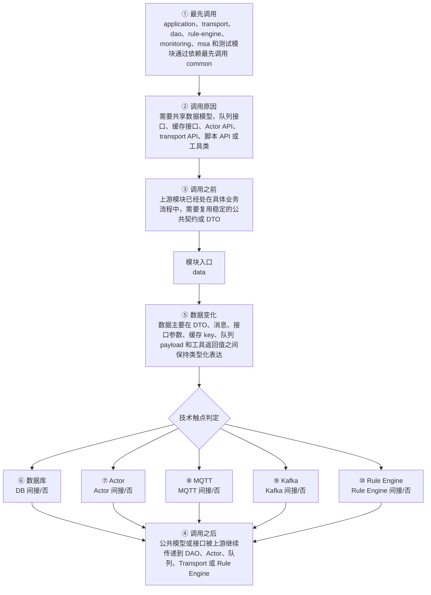

# Thingsboard Server Common Data 模块调用链分析

> 生成范围：`common/data`  
> Maven artifact：`data`  
> packaging：`jar`  
> 分析方式：静态扫描 POM、Java 注解、入口方法、关键技术触点和类关系；不是运行时 trace。

## 完整流程图

## 十项调用链问题

| 问题 | 模块级结论 |
| --- | --- |
| ① 谁最先调用这里？ | application、transport、dao、rule-engine、monitoring、msa 和测试模块通过依赖最先调用 common |
| ② 为什么会调用？ | 需要共享数据模型、队列接口、缓存接口、Actor API、transport API、脚本 API 或工具类 |
| ③ 调用之前发生了什么？ | 上游模块已经处在具体业务流程中，需要复用稳定的公共契约或 DTO |
| ④ 调用之后发生什么？ | 公共模型或接口被上游继续传递到 DAO、Actor、队列、Transport 或 Rule Engine |
| ⑤ 数据如何变化？ | 数据主要在 DTO、消息、接口参数、缓存 key、队列 payload 和工具返回值之间保持类型化表达 |
| ⑥ 对数据库进行了哪些操作？ | 否，未发现直接操作证据；未发现直接源码证据；若发生，通常在依赖的下游模块中完成。 |
| ⑦ 是否发送 Actor 消息？ | 否，未发现直接操作证据；未发现直接源码证据；若发生，通常在依赖的下游模块中完成。 |
| ⑧ 是否发送 MQTT 消息？ | 否，未发现直接操作证据；未发现直接源码证据；若发生，通常在依赖的下游模块中完成。 |
| ⑨ 是否写入 Kafka？ | 否，未发现直接操作证据；未发现直接源码证据；若发生，通常在依赖的下游模块中完成。 |
| ⑩ 是否写入 Rule Engine？ | 否，未发现直接操作证据；未发现直接源码证据；若发生，通常在依赖的下游模块中完成。 |

## 入口证据

- 测试框架入口: `common/data/src/test/java/org/thingsboard/server/common/data/DynamicProtoUtilsTest.java`
- 测试框架入口: `common/data/src/test/java/org/thingsboard/server/common/data/EntityTypeTest.java`
- 测试框架入口: `common/data/src/test/java/org/thingsboard/server/common/data/StringUtilsTest.java`
- 测试框架入口: `common/data/src/test/java/org/thingsboard/server/common/data/UUIDConverterTest.java`
- 测试框架入口: `common/data/src/test/java/org/thingsboard/server/common/data/audit/ActionTypeTest.java`
- 测试框架入口: `common/data/src/test/java/org/thingsboard/server/common/data/id/EntityIdTest.java`
- 测试框架入口: `common/data/src/test/java/org/thingsboard/server/common/data/msg/TbMsgTypeTest.java`
- 测试框架入口: `common/data/src/test/java/org/thingsboard/server/common/data/rpc/RpcStatusTest.java`

## 静态关键词统计（不等同于实际发送/写入）

- database: 73 处静态触点；未发现直接源码证据；若发生，通常在依赖的下游模块中完成。
- actor: 0 处静态触点；未发现直接源码证据；若发生，通常在依赖的下游模块中完成。
- mqtt: 61 处静态触点；未发现直接源码证据；若发生，通常在依赖的下游模块中完成。
- kafka: 4 处静态触点；未发现直接源码证据；若发生，通常在依赖的下游模块中完成。
- rule_engine: 324 处静态触点；未发现直接源码证据；若发生，通常在依赖的下游模块中完成。
- cache: 30 处静态触点；直接操作证据：发现静态关键词触点。关键词触点 30 处仅作为辅助线索。
- queue: 112 处静态触点；直接操作证据：发现静态关键词触点。关键词触点 112 处仅作为辅助线索。
- rest: 0 处静态触点；未发现直接源码证据；若发生，通常在依赖的下游模块中完成。
- websocket: 86 处静态触点；直接操作证据：发现静态关键词触点。关键词触点 86 处仅作为辅助线索。
- transport: 215 处静态触点；直接操作证据：发现静态关键词触点。关键词触点 215 处仅作为辅助线索。

## 调用前后数据流

1. 调用前：上游模块已经处在具体业务流程中，需要复用稳定的公共契约或 DTO
2. 模块入口：`data` 通过入口类、依赖 API、构建聚合或子模块暴露能力。
3. 模块内转换：数据主要在 DTO、消息、接口参数、缓存 key、队列 payload 和工具返回值之间保持类型化表达
4. 调用后：公共模型或接口被上游继续传递到 DAO、Actor、队列、Transport 或 Rule Engine
5. 数据库/Actor/MQTT/Kafka/Rule Engine 这些动作若没有直接触点，通常发生在依赖的 `application`、`dao`、`common/queue`、`common/transport` 或 `rule-engine` 模块中。

## 子模块与依赖

### 子模块

- 无子模块。

### 主要依赖

- `javax.validation:validation-api`
- `org.owasp.antisamy:antisamy`
- `org.slf4j:slf4j-api`
- `org.slf4j:log4j-over-slf4j`
- `ch.qos.logback:logback-core`
- `ch.qos.logback:logback-classic`
- `com.fasterxml.jackson.core:jackson-databind`
- `org.springframework.data:spring-data-commons`
- `org.springframework.boot:spring-boot-starter-test`
- `org.junit.vintage:junit-vintage-engine`
- `org.awaitility:awaitility`
- `com.datastax.oss:java-driver-core`
- `com.squareup.wire:wire-schema`
- `org.thingsboard:protobuf-dynamic`
- `org.apache.commons:commons-lang3`
- `commons-codec:commons-codec`
- `io.swagger:swagger-annotations`
- `de.ruedigermoeller:fst`
- `com.google.protobuf:protobuf-java-util`
- `org.eclipse.leshan:leshan-core`

## 关键类型样本

- `AdminSettings` (class, `common/data/src/main/java/org/thingsboard/server/common/data/AdminSettings.java`)
- `ApiFeature` (enum, `common/data/src/main/java/org/thingsboard/server/common/data/ApiFeature.java`)
- `ApiUsageRecordKey` (enum, `common/data/src/main/java/org/thingsboard/server/common/data/ApiUsageRecordKey.java`)
- `ApiUsageRecordState` (class, `common/data/src/main/java/org/thingsboard/server/common/data/ApiUsageRecordState.java`)
- `ApiUsageState` (class, `common/data/src/main/java/org/thingsboard/server/common/data/ApiUsageState.java`)
- `ApiUsageStateValue` (enum, `common/data/src/main/java/org/thingsboard/server/common/data/ApiUsageStateValue.java`)
- `BaseData` (class, `common/data/src/main/java/org/thingsboard/server/common/data/BaseData.java`)
- `BaseDataWithAdditionalInfo` (class, `common/data/src/main/java/org/thingsboard/server/common/data/BaseDataWithAdditionalInfo.java`)
- `CacheConstants` (class, `common/data/src/main/java/org/thingsboard/server/common/data/CacheConstants.java`)
- `ClaimRequest` (class, `common/data/src/main/java/org/thingsboard/server/common/data/ClaimRequest.java`)
- `CoapDeviceType` (enum, `common/data/src/main/java/org/thingsboard/server/common/data/CoapDeviceType.java`)
- `ContactBased` (class, `common/data/src/main/java/org/thingsboard/server/common/data/ContactBased.java`)
- `Customer` (class, `common/data/src/main/java/org/thingsboard/server/common/data/Customer.java`)
- `Dashboard` (class, `common/data/src/main/java/org/thingsboard/server/common/data/Dashboard.java`)
- `DashboardInfo` (class, `common/data/src/main/java/org/thingsboard/server/common/data/DashboardInfo.java`)
- `DataConstants` (class, `common/data/src/main/java/org/thingsboard/server/common/data/DataConstants.java`)
- `Device` (class, `common/data/src/main/java/org/thingsboard/server/common/data/Device.java`)
- `DeviceIdInfo` (class, `common/data/src/main/java/org/thingsboard/server/common/data/DeviceIdInfo.java`)
- `DeviceInfo` (class, `common/data/src/main/java/org/thingsboard/server/common/data/DeviceInfo.java`)
- `DeviceInfoFilter` (class, `common/data/src/main/java/org/thingsboard/server/common/data/DeviceInfoFilter.java`)
- `DeviceProfile` (class, `common/data/src/main/java/org/thingsboard/server/common/data/DeviceProfile.java`)
- `DeviceProfileInfo` (class, `common/data/src/main/java/org/thingsboard/server/common/data/DeviceProfileInfo.java`)
- `DeviceProfileProvisionType` (enum, `common/data/src/main/java/org/thingsboard/server/common/data/DeviceProfileProvisionType.java`)
- `DeviceProfileType` (enum, `common/data/src/main/java/org/thingsboard/server/common/data/DeviceProfileType.java`)
- `DeviceTransportType` (enum, `common/data/src/main/java/org/thingsboard/server/common/data/DeviceTransportType.java`)
- `DynamicProtoUtils` (class, `common/data/src/main/java/org/thingsboard/server/common/data/DynamicProtoUtils.java`)
- `EdgeUpgradeInfo` (class, `common/data/src/main/java/org/thingsboard/server/common/data/EdgeUpgradeInfo.java`)
- `EdgeUpgradeMessage` (class, `common/data/src/main/java/org/thingsboard/server/common/data/EdgeUpgradeMessage.java`)
- `EdgeUtils` (class, `common/data/src/main/java/org/thingsboard/server/common/data/EdgeUtils.java`)
- `EntityFieldsData` (class, `common/data/src/main/java/org/thingsboard/server/common/data/EntityFieldsData.java`)
- `EntityIdFieldSerializer` (class, `common/data/src/main/java/org/thingsboard/server/common/data/EntityFieldsData.java`)
- `EntityInfo` (class, `common/data/src/main/java/org/thingsboard/server/common/data/EntityInfo.java`)
- `EntitySubtype` (class, `common/data/src/main/java/org/thingsboard/server/common/data/EntitySubtype.java`)
- `EntityType` (enum, `common/data/src/main/java/org/thingsboard/server/common/data/EntityType.java`)
- `EntityView` (class, `common/data/src/main/java/org/thingsboard/server/common/data/EntityView.java`)
- `EntityViewInfo` (class, `common/data/src/main/java/org/thingsboard/server/common/data/EntityViewInfo.java`)
- `EventInfo` (class, `common/data/src/main/java/org/thingsboard/server/common/data/EventInfo.java`)
- `ExportableEntity` (interface, `common/data/src/main/java/org/thingsboard/server/common/data/ExportableEntity.java`)
- `FSTUtils` (class, `common/data/src/main/java/org/thingsboard/server/common/data/FSTUtils.java`)
- `FeaturesInfo` (class, `common/data/src/main/java/org/thingsboard/server/common/data/FeaturesInfo.java`)
- 其余 20 项已省略；完整源码证据可通过本模块 Java 文件继续追踪。

## 阅读建议

- 先看“完整流程图”确认模块在全链路中的位置。
- 再看入口证据判断调用来源是 HTTP、MQTT/Transport、Actor、Kafka、Rule Engine、DAO、测试还是构建聚合。
- 最后用触点统计区分直接行为和下游间接行为，避免把依赖模块的数据库写入误认为本模块直接写入。
