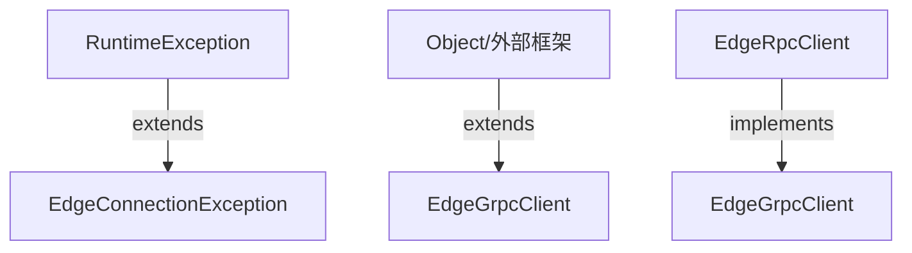

# Thingsboard Server Remote Edge wrapper 模块继承体系分析

> 生成范围：`common/edge-api`  
> Maven artifact：`edge-api`  
> Java 类型数量：3  
> 分析方式：静态扫描 `class/interface/enum/record` 的 `extends`、`implements`、方法签名和源码触点。

## 完整继承树

```text
EdgeRpcClient
├── «implements» EdgeGrpcClient
Object/外部框架
├── EdgeGrpcClient
RuntimeException
├── EdgeConnectionException
```

## 继承图




## 每一层为什么存在

- 外部/上层父类或接口层：提供框架生命周期、Java 标准契约、Spring/Netty/DAO/Rule Engine 等扩展点。
- 接口层：定义跨模块契约，让调用方依赖稳定 API，而不是具体实现。
- 抽象类层：沉淀公共状态、校验、模板流程和默认实现，把变化点留给子类。
- 具体类层：完成协议、DAO、Controller、Rule Node、工具或测试场景中的最终业务动作。

## 抽象了什么

- 父类/接口抽象公共生命周期、输入输出契约、错误处理、协议适配、DAO 查询形态、消息处理模板或测试夹具。
- 子类保留具体协议、实体类型、规则节点行为、数据库实现、页面/测试步骤或命令参数差异。
- 对聚合或无 Java 模块，抽象体现在 Maven 子模块划分和构建生命周期，而不是 Java 继承。

## 父类负责什么

- 提供稳定方法签名、共享字段、默认流程、通用校验、资源释放和框架回调入口。
- 在 Spring、Netty、DAO、Rule Engine、Transport 等框架中，父类还负责让运行时可以通过统一类型调度不同实现。

## 子类负责什么

- 实现具体业务差异，例如协议解析、实体 DAO、规则节点处理、Controller API、客户端命令或测试用例。
- 覆盖父类预留的扩展点，把模块特有数据转换、数据库查询、消息发送或外部调用补进去。

## 为什么不用组合

- 继承用于框架生命周期和模板方法：运行时需要把子类当作父类处理，例如 Spring Bean、Netty Handler、DAO Repository、Rule Node 或测试基类。
- 组合适合注入协作者，本模块中仍然通过字段依赖使用组合；但当需要统一回调签名、共享模板流程或多态派发时，单纯组合不能替代继承。

## 为什么不用接口

- 接口只能表达契约，不能集中保存公共状态、默认校验、资源关闭和模板流程。
- 当模块只需要契约时会使用接口；当多个实现还需要共享代码、默认行为或受保护扩展点时使用抽象类。

## 模板方法

- `EdgeRpcClient.connect()` (package, `common/edge-api/src/main/java/org/thingsboard/edge/rpc/EdgeRpcClient.java`)
- `EdgeRpcClient.sendSyncRequestMsg()` (package, `common/edge-api/src/main/java/org/thingsboard/edge/rpc/EdgeRpcClient.java`)
- `EdgeRpcClient.sendUplinkMsg()` (package, `common/edge-api/src/main/java/org/thingsboard/edge/rpc/EdgeRpcClient.java`)
- `EdgeRpcClient.sendDownlinkResponseMsg()` (package, `common/edge-api/src/main/java/org/thingsboard/edge/rpc/EdgeRpcClient.java`)
- `EdgeRpcClient.getServerMaxInboundMessageSize()` (package, `common/edge-api/src/main/java/org/thingsboard/edge/rpc/EdgeRpcClient.java`)


## 哪些方法可以重写

- `EdgeGrpcClient.ReentrantLock()` (package, `common/edge-api/src/main/java/org/thingsboard/edge/rpc/EdgeGrpcClient.java`)
- `EdgeGrpcClient.connect()` (public, `common/edge-api/src/main/java/org/thingsboard/edge/rpc/EdgeGrpcClient.java`)
- `EdgeGrpcClient.RuntimeException()` (package, `common/edge-api/src/main/java/org/thingsboard/edge/rpc/EdgeGrpcClient.java`)
- `EdgeGrpcClient.onNext()` (public, `common/edge-api/src/main/java/org/thingsboard/edge/rpc/EdgeGrpcClient.java`)
- `EdgeGrpcClient.EdgeConnectionException()` (package, `common/edge-api/src/main/java/org/thingsboard/edge/rpc/EdgeGrpcClient.java`)
- `EdgeGrpcClient.onError()` (public, `common/edge-api/src/main/java/org/thingsboard/edge/rpc/EdgeGrpcClient.java`)
- `EdgeGrpcClient.RuntimeException()` (package, `common/edge-api/src/main/java/org/thingsboard/edge/rpc/EdgeGrpcClient.java`)
- `EdgeGrpcClient.onCompleted()` (public, `common/edge-api/src/main/java/org/thingsboard/edge/rpc/EdgeGrpcClient.java`)
- `EdgeGrpcClient.sendUplinkMsg()` (public, `common/edge-api/src/main/java/org/thingsboard/edge/rpc/EdgeGrpcClient.java`)
- `EdgeGrpcClient.sendSyncRequestMsg()` (public, `common/edge-api/src/main/java/org/thingsboard/edge/rpc/EdgeGrpcClient.java`)
- `EdgeGrpcClient.sendDownlinkResponseMsg()` (public, `common/edge-api/src/main/java/org/thingsboard/edge/rpc/EdgeGrpcClient.java`)
- `EdgeRpcClient.connect()` (package, `common/edge-api/src/main/java/org/thingsboard/edge/rpc/EdgeRpcClient.java`)
- `EdgeRpcClient.sendSyncRequestMsg()` (package, `common/edge-api/src/main/java/org/thingsboard/edge/rpc/EdgeRpcClient.java`)
- `EdgeRpcClient.sendUplinkMsg()` (package, `common/edge-api/src/main/java/org/thingsboard/edge/rpc/EdgeRpcClient.java`)
- `EdgeRpcClient.sendDownlinkResponseMsg()` (package, `common/edge-api/src/main/java/org/thingsboard/edge/rpc/EdgeRpcClient.java`)
- `EdgeRpcClient.getServerMaxInboundMessageSize()` (package, `common/edge-api/src/main/java/org/thingsboard/edge/rpc/EdgeRpcClient.java`)


## 哪些方法必须重写

- `EdgeGrpcClient.ReentrantLock()` (package, `common/edge-api/src/main/java/org/thingsboard/edge/rpc/EdgeGrpcClient.java`)
- `EdgeGrpcClient.RuntimeException()` (package, `common/edge-api/src/main/java/org/thingsboard/edge/rpc/EdgeGrpcClient.java`)
- `EdgeGrpcClient.EdgeConnectionException()` (package, `common/edge-api/src/main/java/org/thingsboard/edge/rpc/EdgeGrpcClient.java`)
- `EdgeGrpcClient.RuntimeException()` (package, `common/edge-api/src/main/java/org/thingsboard/edge/rpc/EdgeGrpcClient.java`)
- `EdgeRpcClient.connect()` (package, `common/edge-api/src/main/java/org/thingsboard/edge/rpc/EdgeRpcClient.java`)
- `EdgeRpcClient.sendSyncRequestMsg()` (package, `common/edge-api/src/main/java/org/thingsboard/edge/rpc/EdgeRpcClient.java`)
- `EdgeRpcClient.sendUplinkMsg()` (package, `common/edge-api/src/main/java/org/thingsboard/edge/rpc/EdgeRpcClient.java`)
- `EdgeRpcClient.sendDownlinkResponseMsg()` (package, `common/edge-api/src/main/java/org/thingsboard/edge/rpc/EdgeRpcClient.java`)
- `EdgeRpcClient.getServerMaxInboundMessageSize()` (package, `common/edge-api/src/main/java/org/thingsboard/edge/rpc/EdgeRpcClient.java`)


## 哪些地方使用了多态

- `RuntimeException` -> `EdgeConnectionException` (extends)
- `Object/外部框架` -> `EdgeGrpcClient` (extends)
- `EdgeRpcClient` -> `EdgeGrpcClient` (implements)


## 外部父类/接口

- `Object/外部框架`
- `RuntimeException`


## 整个继承体系解决了什么问题

该继承体系把“稳定生命周期/契约”和“模块特定行为”分开：父类或接口负责统一入口、共享流程和多态调度，子类负责差异化协议、实体、规则、DAO、测试或工具行为。这样可以让上游模块通过父类型调用下游实现，同时保持每个实现只关注自己的变化点。
