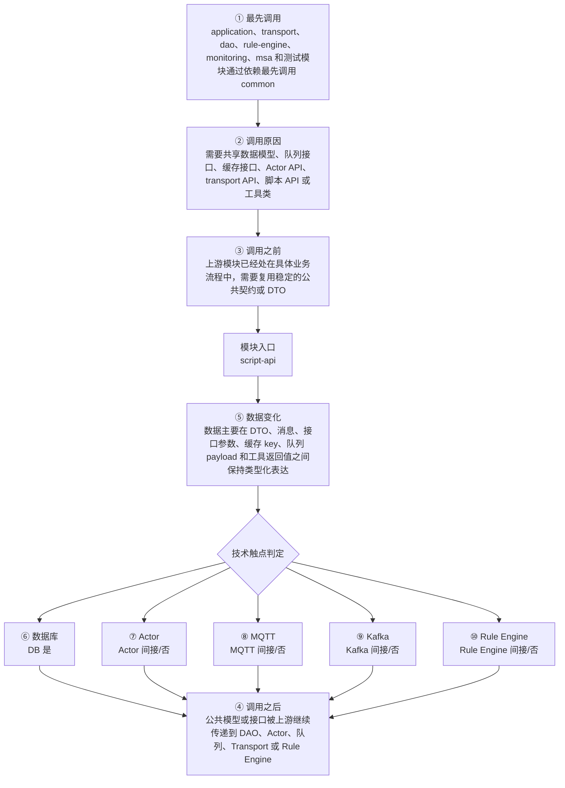

# Thingsboard Server Script invoke API 模块调用链分析

> 生成范围：`common/script/script-api`  
> Maven artifact：`script-api`  
> packaging：`jar`  
> 分析方式：静态扫描 POM、Java 注解、入口方法、关键技术触点和类关系；不是运行时 trace。

## 完整流程图

## 十项调用链问题

| 问题 | 模块级结论 |
| --- | --- |
| ① 谁最先调用这里？ | application、transport、dao、rule-engine、monitoring、msa 和测试模块通过依赖最先调用 common |
| ② 为什么会调用？ | 需要共享数据模型、队列接口、缓存接口、Actor API、transport API、脚本 API 或工具类 |
| ③ 调用之前发生了什么？ | 上游模块已经处在具体业务流程中，需要复用稳定的公共契约或 DTO |
| ④ 调用之后发生什么？ | 公共模型或接口被上游继续传递到 DAO、Actor、队列、Transport 或 Rule Engine |
| ⑤ 数据如何变化？ | 数据主要在 DTO、消息、接口参数、缓存 key、队列 payload 和工具返回值之间保持类型化表达 |
| ⑥ 对数据库进行了哪些操作？ | 是，发现直接操作证据；直接操作证据：发现 Repository/JPA/Cassandra/JDBC/SSTable 或 DAO 模块操作模式。关键词触点 1 处仅作为辅助线索。 |
| ⑦ 是否发送 Actor 消息？ | 否，未发现直接操作证据；未发现直接源码证据；若发生，通常在依赖的下游模块中完成。 |
| ⑧ 是否发送 MQTT 消息？ | 否，未发现直接操作证据；未发现直接源码证据；若发生，通常在依赖的下游模块中完成。 |
| ⑨ 是否写入 Kafka？ | 否，未发现直接操作证据；未发现直接源码证据；若发生，通常在依赖的下游模块中完成。 |
| ⑩ 是否写入 Rule Engine？ | 否，未发现直接操作证据；未发现直接源码证据；若发生，通常在依赖的下游模块中完成。 |

## 入口证据

- Spring Service 业务服务入口: `common/script/script-api/src/main/java/org/thingsboard/script/api/js/NashornJsInvokeService.java`
- Spring Service 业务服务入口: `common/script/script-api/src/main/java/org/thingsboard/script/api/tbel/DefaultTbelInvokeService.java`
- 定时任务入口: `common/script/script-api/src/main/java/org/thingsboard/script/api/js/NashornJsInvokeService.java`
- 定时任务入口: `common/script/script-api/src/main/java/org/thingsboard/script/api/tbel/DefaultTbelInvokeService.java`
- 测试框架入口: `common/script/script-api/src/test/java/org/thingsboard/script/api/tbel/TbDateConstructorTest.java`
- 测试框架入口: `common/script/script-api/src/test/java/org/thingsboard/script/api/tbel/TbDateTest.java`
- 测试框架入口: `common/script/script-api/src/test/java/org/thingsboard/script/api/tbel/TbUtilsTest.java`

## 静态关键词统计（不等同于实际发送/写入）

- database: 1 处静态触点；直接操作证据：发现 Repository/JPA/Cassandra/JDBC/SSTable 或 DAO 模块操作模式。关键词触点 1 处仅作为辅助线索。
- actor: 0 处静态触点；未发现直接源码证据；若发生，通常在依赖的下游模块中完成。
- mqtt: 0 处静态触点；未发现直接源码证据；若发生，通常在依赖的下游模块中完成。
- kafka: 0 处静态触点；未发现直接源码证据；若发生，通常在依赖的下游模块中完成。
- rule_engine: 6 处静态触点；未发现直接源码证据；若发生，通常在依赖的下游模块中完成。
- cache: 16 处静态触点；直接操作证据：发现静态关键词触点。关键词触点 16 处仅作为辅助线索。
- queue: 0 处静态触点；未发现直接源码证据；若发生，通常在依赖的下游模块中完成。
- rest: 0 处静态触点；未发现直接源码证据；若发生，通常在依赖的下游模块中完成。
- websocket: 46 处静态触点；直接操作证据：发现静态关键词触点。关键词触点 46 处仅作为辅助线索。
- transport: 0 处静态触点；未发现直接源码证据；若发生，通常在依赖的下游模块中完成。

## 调用前后数据流

1. 调用前：上游模块已经处在具体业务流程中，需要复用稳定的公共契约或 DTO
2. 模块入口：`script-api` 通过入口类、依赖 API、构建聚合或子模块暴露能力。
3. 模块内转换：数据主要在 DTO、消息、接口参数、缓存 key、队列 payload 和工具返回值之间保持类型化表达
4. 调用后：公共模型或接口被上游继续传递到 DAO、Actor、队列、Transport 或 Rule Engine
5. 数据库/Actor/MQTT/Kafka/Rule Engine 这些动作若没有直接触点，通常发生在依赖的 `application`、`dao`、`common/queue`、`common/transport` 或 `rule-engine` 模块中。

## 子模块与依赖

### 子模块

- 无子模块。

### 主要依赖

- `org.thingsboard.common:data`
- `org.thingsboard.common:stats`
- `org.thingsboard.common:util`
- `org.javadelight:delight-nashorn-sandbox`
- `com.google.code.gson:gson`
- `com.github.ben-manes.caffeine:caffeine`
- `org.slf4j:slf4j-api`
- `org.slf4j:log4j-over-slf4j`
- `ch.qos.logback:logback-core`
- `ch.qos.logback:logback-classic`
- `org.springframework:spring-context`
- `com.google.guava:guava`
- `org.apache.commons:commons-lang3`
- `org.thingsboard:tbel`
- `org.springframework.boot:spring-boot-starter-web`
- `org.springframework.boot:spring-boot-starter-test`
- `org.junit.vintage:junit-vintage-engine`
- `org.awaitility:awaitility`

## 关键类型样本

- `AbstractScriptInvokeService` (class, `common/script/script-api/src/main/java/org/thingsboard/script/api/AbstractScriptInvokeService.java`)
- `BlockedScriptInfo` (class, `common/script/script-api/src/main/java/org/thingsboard/script/api/BlockedScriptInfo.java`)
- `RuleNodeScriptFactory` (class, `common/script/script-api/src/main/java/org/thingsboard/script/api/RuleNodeScriptFactory.java`)
- `ScriptInvokeService` (interface, `common/script/script-api/src/main/java/org/thingsboard/script/api/ScriptInvokeService.java`)
- `ScriptStatCallback` (class, `common/script/script-api/src/main/java/org/thingsboard/script/api/ScriptStatCallback.java`)
- `ScriptType` (enum, `common/script/script-api/src/main/java/org/thingsboard/script/api/ScriptType.java`)
- `TbScriptException` (class, `common/script/script-api/src/main/java/org/thingsboard/script/api/TbScriptException.java`)
- `ErrorCode` (enum, `common/script/script-api/src/main/java/org/thingsboard/script/api/TbScriptException.java`)
- `TbScriptExecutionTask` (class, `common/script/script-api/src/main/java/org/thingsboard/script/api/TbScriptExecutionTask.java`)
- `AbstractJsInvokeService` (class, `common/script/script-api/src/main/java/org/thingsboard/script/api/js/AbstractJsInvokeService.java`)
- `JsInvokeService` (interface, `common/script/script-api/src/main/java/org/thingsboard/script/api/js/JsInvokeService.java`)
- `JsScriptExecutionTask` (class, `common/script/script-api/src/main/java/org/thingsboard/script/api/js/JsScriptExecutionTask.java`)
- `JsScriptInfo` (class, `common/script/script-api/src/main/java/org/thingsboard/script/api/js/JsScriptInfo.java`)
- `NashornJsInvokeService` (class, `common/script/script-api/src/main/java/org/thingsboard/script/api/js/NashornJsInvokeService.java`)
- `DateTimeFormatOptions` (class, `common/script/script-api/src/main/java/org/thingsboard/script/api/tbel/DateTimeFormatOptions.java`)
- `DefaultTbelInvokeService` (class, `common/script/script-api/src/main/java/org/thingsboard/script/api/tbel/DefaultTbelInvokeService.java`)
- `TbDate` (class, `common/script/script-api/src/main/java/org/thingsboard/script/api/tbel/TbDate.java`)
- `TbJson` (class, `common/script/script-api/src/main/java/org/thingsboard/script/api/tbel/TbJson.java`)
- `TbUtils` (class, `common/script/script-api/src/main/java/org/thingsboard/script/api/tbel/TbUtils.java`)
- `TbelInvokeService` (interface, `common/script/script-api/src/main/java/org/thingsboard/script/api/tbel/TbelInvokeService.java`)
- `TbelScript` (class, `common/script/script-api/src/main/java/org/thingsboard/script/api/tbel/TbelScript.java`)
- `TbelScriptExecutionTask` (class, `common/script/script-api/src/main/java/org/thingsboard/script/api/tbel/TbelScriptExecutionTask.java`)
- `TbDateConstructorTest` (class, `common/script/script-api/src/test/java/org/thingsboard/script/api/tbel/TbDateConstructorTest.java`)
- `TbDateTest` (class, `common/script/script-api/src/test/java/org/thingsboard/script/api/tbel/TbDateTest.java`)
- `TbDateTestEntity` (class, `common/script/script-api/src/test/java/org/thingsboard/script/api/tbel/TbDateTestEntity.java`)
- `TbUtilsTest` (class, `common/script/script-api/src/test/java/org/thingsboard/script/api/tbel/TbUtilsTest.java`)

## 阅读建议

- 先看“完整流程图”确认模块在全链路中的位置。
- 再看入口证据判断调用来源是 HTTP、MQTT/Transport、Actor、Kafka、Rule Engine、DAO、测试还是构建聚合。
- 最后用触点统计区分直接行为和下游间接行为，避免把依赖模块的数据库写入误认为本模块直接写入。
