# Thingsboard Server Script invoke API 模块继承体系分析

> 生成范围：`common/script/script-api`  
> Maven artifact：`script-api`  
> Java 类型数量：26  
> 分析方式：静态扫描 `class/interface/enum/record` 的 `extends`、`implements`、方法签名和源码触点。

## 完整继承树

```text
Cloneable
├── «implements» TbDate
Object/外部框架
├── AbstractScriptInvokeService
├── ├── AbstractJsInvokeService
├── ├── ├── NashornJsInvokeService
├── ├── DefaultTbelInvokeService
├── BlockedScriptInfo
├── DateTimeFormatOptions
├── JsScriptInfo
├── RuleNodeScriptFactory
├── ScriptStatCallback
├── TbDate
├── TbDateConstructorTest
├── TbDateTest
├── TbDateTestEntity
├── TbJson
├── TbScriptExecutionTask
├── ├── JsScriptExecutionTask
├── ├── TbelScriptExecutionTask
├── TbUtils
├── TbUtilsTest
├── TbelScript
RuntimeException
├── TbScriptException
ScriptInvokeService
├── «implements» AbstractScriptInvokeService
├── «implements» ├── AbstractJsInvokeService
├── «implements» ├── ├── NashornJsInvokeService
├── «implements» ├── DefaultTbelInvokeService
├── JsInvokeService
├── ├── «implements» AbstractJsInvokeService
├── ├── «implements» ├── NashornJsInvokeService
├── TbelInvokeService
├── ├── «implements» DefaultTbelInvokeService
Serializable
├── «implements» TbDate
```

## 继承图

```mermaid
flowchart TD
    Object______p0["Object/外部框架"] -->|extends| AbstractScriptInvokeService_c0["AbstractScriptInvokeService"]
    ScriptInvokeService_p1["ScriptInvokeService"] -->|implements| AbstractScriptInvokeService_c1["AbstractScriptInvokeService"]
    Object______p2["Object/外部框架"] -->|extends| BlockedScriptInfo_c2["BlockedScriptInfo"]
    Object______p3["Object/外部框架"] -->|extends| RuleNodeScriptFactory_c3["RuleNodeScriptFactory"]
    Object______p4["Object/外部框架"] -->|extends| ScriptStatCallback_c4["ScriptStatCallback"]
    RuntimeException_p5["RuntimeException"] -->|extends| TbScriptException_c5["TbScriptException"]
    Object______p6["Object/外部框架"] -->|extends| TbScriptExecutionTask_c6["TbScriptExecutionTask"]
    AbstractScriptInvokeService_p7["AbstractScriptInvokeService"] -->|extends| AbstractJsInvokeService_c7["AbstractJsInvokeService"]
    JsInvokeService_p8["JsInvokeService"] -->|implements| AbstractJsInvokeService_c8["AbstractJsInvokeService"]
    ScriptInvokeService_p9["ScriptInvokeService"] -->|extends| JsInvokeService_c9["JsInvokeService"]
    TbScriptExecutionTask_p10["TbScriptExecutionTask"] -->|extends| JsScriptExecutionTask_c10["JsScriptExecutionTask"]
    Object______p11["Object/外部框架"] -->|extends| JsScriptInfo_c11["JsScriptInfo"]
    AbstractJsInvokeService_p12["AbstractJsInvokeService"] -->|extends| NashornJsInvokeService_c12["NashornJsInvokeService"]
    Object______p13["Object/外部框架"] -->|extends| DateTimeFormatOptions_c13["DateTimeFormatOptions"]
    AbstractScriptInvokeService_p14["AbstractScriptInvokeService"] -->|extends| DefaultTbelInvokeService_c14["DefaultTbelInvokeService"]
    TbelInvokeService_p15["TbelInvokeService"] -->|implements| DefaultTbelInvokeService_c15["DefaultTbelInvokeService"]
    Object______p16["Object/外部框架"] -->|extends| TbDate_c16["TbDate"]
    Serializable_p17["Serializable"] -->|implements| TbDate_c17["TbDate"]
    Cloneable_p18["Cloneable"] -->|implements| TbDate_c18["TbDate"]
    Object______p19["Object/外部框架"] -->|extends| TbJson_c19["TbJson"]
    Object______p20["Object/外部框架"] -->|extends| TbUtils_c20["TbUtils"]
    ScriptInvokeService_p21["ScriptInvokeService"] -->|extends| TbelInvokeService_c21["TbelInvokeService"]
    Object______p22["Object/外部框架"] -->|extends| TbelScript_c22["TbelScript"]
    TbScriptExecutionTask_p23["TbScriptExecutionTask"] -->|extends| TbelScriptExecutionTask_c23["TbelScriptExecutionTask"]
    Object______p24["Object/外部框架"] -->|extends| TbDateConstructorTest_c24["TbDateConstructorTest"]
    Object______p25["Object/外部框架"] -->|extends| TbDateTest_c25["TbDateTest"]
    Object______p26["Object/外部框架"] -->|extends| TbDateTestEntity_c26["TbDateTestEntity"]
    Object______p27["Object/外部框架"] -->|extends| TbUtilsTest_c27["TbUtilsTest"]
```




## 每一层为什么存在

- 外部/上层父类或接口层：提供框架生命周期、Java 标准契约、Spring/Netty/DAO/Rule Engine 等扩展点。
- 接口层：定义跨模块契约，让调用方依赖稳定 API，而不是具体实现。
- 抽象类层：沉淀公共状态、校验、模板流程和默认实现，把变化点留给子类。
- 具体类层：完成协议、DAO、Controller、Rule Node、工具或测试场景中的最终业务动作。

## 抽象了什么

- 父类/接口抽象公共生命周期、输入输出契约、错误处理、协议适配、DAO 查询形态、消息处理模板或测试夹具。
- 子类保留具体协议、实体类型、规则节点行为、数据库实现、页面/测试步骤或命令参数差异。
- 对聚合或无 Java 模块，抽象体现在 Maven 子模块划分和构建生命周期，而不是 Java 继承。

## 父类负责什么

- 提供稳定方法签名、共享字段、默认流程、通用校验、资源释放和框架回调入口。
- 在 Spring、Netty、DAO、Rule Engine、Transport 等框架中，父类还负责让运行时可以通过统一类型调度不同实现。

## 子类负责什么

- 实现具体业务差异，例如协议解析、实体 DAO、规则节点处理、Controller API、客户端命令或测试用例。
- 覆盖父类预留的扩展点，把模块特有数据转换、数据库查询、消息发送或外部调用补进去。

## 为什么不用组合

- 继承用于框架生命周期和模板方法：运行时需要把子类当作父类处理，例如 Spring Bean、Netty Handler、DAO Repository、Rule Node 或测试基类。
- 组合适合注入协作者，本模块中仍然通过字段依赖使用组合；但当需要统一回调签名、共享模板流程或多态派发时，单纯组合不能替代继承。

## 为什么不用接口

- 接口只能表达契约，不能集中保存公共状态、默认校验、资源关闭和模板流程。
- 当模块只需要契约时会使用接口；当多个实现还需要共享代码、默认行为或受保护扩展点时使用抽象类。

## 模板方法

- `AbstractScriptInvokeService.AtomicInteger()` (package, `common/script/script-api/src/main/java/org/thingsboard/script/api/AbstractScriptInvokeService.java`)
- `AbstractScriptInvokeService.AtomicInteger()` (package, `common/script/script-api/src/main/java/org/thingsboard/script/api/AbstractScriptInvokeService.java`)
- `AbstractScriptInvokeService.AtomicInteger()` (package, `common/script/script-api/src/main/java/org/thingsboard/script/api/AbstractScriptInvokeService.java`)
- `AbstractScriptInvokeService.AtomicInteger()` (package, `common/script/script-api/src/main/java/org/thingsboard/script/api/AbstractScriptInvokeService.java`)
- `AbstractScriptInvokeService.AtomicInteger()` (package, `common/script/script-api/src/main/java/org/thingsboard/script/api/AbstractScriptInvokeService.java`)
- `AbstractScriptInvokeService.getMaxEvalRequestsTimeout()` (protected, `common/script/script-api/src/main/java/org/thingsboard/script/api/AbstractScriptInvokeService.java`)
- `AbstractScriptInvokeService.getMaxInvokeRequestsTimeout()` (package, `common/script/script-api/src/main/java/org/thingsboard/script/api/AbstractScriptInvokeService.java`)
- `AbstractScriptInvokeService.getMaxInvokeRequestsTimeout()` (package, `common/script/script-api/src/main/java/org/thingsboard/script/api/AbstractScriptInvokeService.java`)
- `AbstractScriptInvokeService.getMaxScriptBodySize()` (package, `common/script/script-api/src/main/java/org/thingsboard/script/api/AbstractScriptInvokeService.java`)
- `AbstractScriptInvokeService.getMaxTotalArgsSize()` (package, `common/script/script-api/src/main/java/org/thingsboard/script/api/AbstractScriptInvokeService.java`)
- `AbstractScriptInvokeService.getMaxResultSize()` (package, `common/script/script-api/src/main/java/org/thingsboard/script/api/AbstractScriptInvokeService.java`)
- `AbstractScriptInvokeService.getMaxBlackListDurationSec()` (package, `common/script/script-api/src/main/java/org/thingsboard/script/api/AbstractScriptInvokeService.java`)
- `AbstractScriptInvokeService.getMaxErrors()` (package, `common/script/script-api/src/main/java/org/thingsboard/script/api/AbstractScriptInvokeService.java`)
- `AbstractScriptInvokeService.isStatsEnabled()` (package, `common/script/script-api/src/main/java/org/thingsboard/script/api/AbstractScriptInvokeService.java`)
- `AbstractScriptInvokeService.getStatsName()` (package, `common/script/script-api/src/main/java/org/thingsboard/script/api/AbstractScriptInvokeService.java`)
- `AbstractScriptInvokeService.getCallbackExecutor()` (package, `common/script/script-api/src/main/java/org/thingsboard/script/api/AbstractScriptInvokeService.java`)
- `AbstractScriptInvokeService.isScriptPresent()` (package, `common/script/script-api/src/main/java/org/thingsboard/script/api/AbstractScriptInvokeService.java`)
- `AbstractScriptInvokeService.isExecEnabled()` (package, `common/script/script-api/src/main/java/org/thingsboard/script/api/AbstractScriptInvokeService.java`)
- `AbstractScriptInvokeService.reportExecution()` (package, `common/script/script-api/src/main/java/org/thingsboard/script/api/AbstractScriptInvokeService.java`)
- `AbstractScriptInvokeService.doEvalScript()` (package, `common/script/script-api/src/main/java/org/thingsboard/script/api/AbstractScriptInvokeService.java`)
- `AbstractScriptInvokeService.doInvokeFunction()` (package, `common/script/script-api/src/main/java/org/thingsboard/script/api/AbstractScriptInvokeService.java`)
- `AbstractScriptInvokeService.init()` (public, `common/script/script-api/src/main/java/org/thingsboard/script/api/AbstractScriptInvokeService.java`)
- `AbstractScriptInvokeService.stop()` (public, `common/script/script-api/src/main/java/org/thingsboard/script/api/AbstractScriptInvokeService.java`)
- `AbstractScriptInvokeService.printStats()` (public, `common/script/script-api/src/main/java/org/thingsboard/script/api/AbstractScriptInvokeService.java`)
- `AbstractScriptInvokeService.eval()` (public, `common/script/script-api/src/main/java/org/thingsboard/script/api/AbstractScriptInvokeService.java`)
- `AbstractScriptInvokeService.error()` (package, `common/script/script-api/src/main/java/org/thingsboard/script/api/AbstractScriptInvokeService.java`)
- `AbstractScriptInvokeService.withTimeoutAndStatsCallback()` (package, `common/script/script-api/src/main/java/org/thingsboard/script/api/AbstractScriptInvokeService.java`)
- `AbstractScriptInvokeService.error()` (package, `common/script/script-api/src/main/java/org/thingsboard/script/api/AbstractScriptInvokeService.java`)
- `AbstractScriptInvokeService.invokeScript()` (public, `common/script/script-api/src/main/java/org/thingsboard/script/api/AbstractScriptInvokeService.java`)
- `AbstractScriptInvokeService.error()` (package, `common/script/script-api/src/main/java/org/thingsboard/script/api/AbstractScriptInvokeService.java`)
- `AbstractScriptInvokeService.TbScriptException()` (package, `common/script/script-api/src/main/java/org/thingsboard/script/api/AbstractScriptInvokeService.java`)
- `AbstractScriptInvokeService.getMaxInvokeRequestsTimeout()` (package, `common/script/script-api/src/main/java/org/thingsboard/script/api/AbstractScriptInvokeService.java`)
- `AbstractScriptInvokeService.TbScriptException()` (package, `common/script/script-api/src/main/java/org/thingsboard/script/api/AbstractScriptInvokeService.java`)
- `AbstractScriptInvokeService.withTimeoutAndStatsCallback()` (package, `common/script/script-api/src/main/java/org/thingsboard/script/api/AbstractScriptInvokeService.java`)
- `AbstractScriptInvokeService.error()` (package, `common/script/script-api/src/main/java/org/thingsboard/script/api/AbstractScriptInvokeService.java`)
- `AbstractScriptInvokeService.error()` (package, `common/script/script-api/src/main/java/org/thingsboard/script/api/AbstractScriptInvokeService.java`)
- `AbstractScriptInvokeService.getCallbackExecutor()` (package, `common/script/script-api/src/main/java/org/thingsboard/script/api/AbstractScriptInvokeService.java`)
- `AbstractScriptInvokeService.BlockedScriptInfo()` (package, `common/script/script-api/src/main/java/org/thingsboard/script/api/AbstractScriptInvokeService.java`)
- `AbstractScriptInvokeService.TimeoutException()` (package, `common/script/script-api/src/main/java/org/thingsboard/script/api/AbstractScriptInvokeService.java`)
- `AbstractScriptInvokeService.release()` (public, `common/script/script-api/src/main/java/org/thingsboard/script/api/AbstractScriptInvokeService.java`)


## 哪些方法可以重写

- `AbstractScriptInvokeService.AtomicInteger()` (package, `common/script/script-api/src/main/java/org/thingsboard/script/api/AbstractScriptInvokeService.java`)
- `AbstractScriptInvokeService.AtomicInteger()` (package, `common/script/script-api/src/main/java/org/thingsboard/script/api/AbstractScriptInvokeService.java`)
- `AbstractScriptInvokeService.AtomicInteger()` (package, `common/script/script-api/src/main/java/org/thingsboard/script/api/AbstractScriptInvokeService.java`)
- `AbstractScriptInvokeService.AtomicInteger()` (package, `common/script/script-api/src/main/java/org/thingsboard/script/api/AbstractScriptInvokeService.java`)
- `AbstractScriptInvokeService.AtomicInteger()` (package, `common/script/script-api/src/main/java/org/thingsboard/script/api/AbstractScriptInvokeService.java`)
- `AbstractScriptInvokeService.getMaxEvalRequestsTimeout()` (protected, `common/script/script-api/src/main/java/org/thingsboard/script/api/AbstractScriptInvokeService.java`)
- `AbstractScriptInvokeService.getMaxInvokeRequestsTimeout()` (package, `common/script/script-api/src/main/java/org/thingsboard/script/api/AbstractScriptInvokeService.java`)
- `AbstractScriptInvokeService.getMaxInvokeRequestsTimeout()` (package, `common/script/script-api/src/main/java/org/thingsboard/script/api/AbstractScriptInvokeService.java`)
- `AbstractScriptInvokeService.getMaxScriptBodySize()` (package, `common/script/script-api/src/main/java/org/thingsboard/script/api/AbstractScriptInvokeService.java`)
- `AbstractScriptInvokeService.getMaxTotalArgsSize()` (package, `common/script/script-api/src/main/java/org/thingsboard/script/api/AbstractScriptInvokeService.java`)
- `AbstractScriptInvokeService.getMaxResultSize()` (package, `common/script/script-api/src/main/java/org/thingsboard/script/api/AbstractScriptInvokeService.java`)
- `AbstractScriptInvokeService.getMaxBlackListDurationSec()` (package, `common/script/script-api/src/main/java/org/thingsboard/script/api/AbstractScriptInvokeService.java`)
- `AbstractScriptInvokeService.getMaxErrors()` (package, `common/script/script-api/src/main/java/org/thingsboard/script/api/AbstractScriptInvokeService.java`)
- `AbstractScriptInvokeService.isStatsEnabled()` (package, `common/script/script-api/src/main/java/org/thingsboard/script/api/AbstractScriptInvokeService.java`)
- `AbstractScriptInvokeService.getStatsName()` (package, `common/script/script-api/src/main/java/org/thingsboard/script/api/AbstractScriptInvokeService.java`)
- `AbstractScriptInvokeService.getCallbackExecutor()` (package, `common/script/script-api/src/main/java/org/thingsboard/script/api/AbstractScriptInvokeService.java`)
- `AbstractScriptInvokeService.isScriptPresent()` (package, `common/script/script-api/src/main/java/org/thingsboard/script/api/AbstractScriptInvokeService.java`)
- `AbstractScriptInvokeService.isExecEnabled()` (package, `common/script/script-api/src/main/java/org/thingsboard/script/api/AbstractScriptInvokeService.java`)
- `AbstractScriptInvokeService.reportExecution()` (package, `common/script/script-api/src/main/java/org/thingsboard/script/api/AbstractScriptInvokeService.java`)
- `AbstractScriptInvokeService.doEvalScript()` (package, `common/script/script-api/src/main/java/org/thingsboard/script/api/AbstractScriptInvokeService.java`)
- `AbstractScriptInvokeService.doInvokeFunction()` (package, `common/script/script-api/src/main/java/org/thingsboard/script/api/AbstractScriptInvokeService.java`)
- `AbstractScriptInvokeService.init()` (public, `common/script/script-api/src/main/java/org/thingsboard/script/api/AbstractScriptInvokeService.java`)
- `AbstractScriptInvokeService.stop()` (public, `common/script/script-api/src/main/java/org/thingsboard/script/api/AbstractScriptInvokeService.java`)
- `AbstractScriptInvokeService.printStats()` (public, `common/script/script-api/src/main/java/org/thingsboard/script/api/AbstractScriptInvokeService.java`)
- `AbstractScriptInvokeService.eval()` (public, `common/script/script-api/src/main/java/org/thingsboard/script/api/AbstractScriptInvokeService.java`)
- `AbstractScriptInvokeService.error()` (package, `common/script/script-api/src/main/java/org/thingsboard/script/api/AbstractScriptInvokeService.java`)
- `AbstractScriptInvokeService.withTimeoutAndStatsCallback()` (package, `common/script/script-api/src/main/java/org/thingsboard/script/api/AbstractScriptInvokeService.java`)
- `AbstractScriptInvokeService.error()` (package, `common/script/script-api/src/main/java/org/thingsboard/script/api/AbstractScriptInvokeService.java`)
- `AbstractScriptInvokeService.invokeScript()` (public, `common/script/script-api/src/main/java/org/thingsboard/script/api/AbstractScriptInvokeService.java`)
- `AbstractScriptInvokeService.error()` (package, `common/script/script-api/src/main/java/org/thingsboard/script/api/AbstractScriptInvokeService.java`)
- `AbstractScriptInvokeService.TbScriptException()` (package, `common/script/script-api/src/main/java/org/thingsboard/script/api/AbstractScriptInvokeService.java`)
- `AbstractScriptInvokeService.getMaxInvokeRequestsTimeout()` (package, `common/script/script-api/src/main/java/org/thingsboard/script/api/AbstractScriptInvokeService.java`)
- `AbstractScriptInvokeService.TbScriptException()` (package, `common/script/script-api/src/main/java/org/thingsboard/script/api/AbstractScriptInvokeService.java`)
- `AbstractScriptInvokeService.withTimeoutAndStatsCallback()` (package, `common/script/script-api/src/main/java/org/thingsboard/script/api/AbstractScriptInvokeService.java`)
- `AbstractScriptInvokeService.error()` (package, `common/script/script-api/src/main/java/org/thingsboard/script/api/AbstractScriptInvokeService.java`)
- `AbstractScriptInvokeService.error()` (package, `common/script/script-api/src/main/java/org/thingsboard/script/api/AbstractScriptInvokeService.java`)
- `AbstractScriptInvokeService.getCallbackExecutor()` (package, `common/script/script-api/src/main/java/org/thingsboard/script/api/AbstractScriptInvokeService.java`)
- `AbstractScriptInvokeService.BlockedScriptInfo()` (package, `common/script/script-api/src/main/java/org/thingsboard/script/api/AbstractScriptInvokeService.java`)
- `AbstractScriptInvokeService.TimeoutException()` (package, `common/script/script-api/src/main/java/org/thingsboard/script/api/AbstractScriptInvokeService.java`)
- `AbstractScriptInvokeService.release()` (public, `common/script/script-api/src/main/java/org/thingsboard/script/api/AbstractScriptInvokeService.java`)


## 哪些方法必须重写

- `AbstractScriptInvokeService.AtomicInteger()` (package, `common/script/script-api/src/main/java/org/thingsboard/script/api/AbstractScriptInvokeService.java`)
- `AbstractScriptInvokeService.AtomicInteger()` (package, `common/script/script-api/src/main/java/org/thingsboard/script/api/AbstractScriptInvokeService.java`)
- `AbstractScriptInvokeService.AtomicInteger()` (package, `common/script/script-api/src/main/java/org/thingsboard/script/api/AbstractScriptInvokeService.java`)
- `AbstractScriptInvokeService.AtomicInteger()` (package, `common/script/script-api/src/main/java/org/thingsboard/script/api/AbstractScriptInvokeService.java`)
- `AbstractScriptInvokeService.AtomicInteger()` (package, `common/script/script-api/src/main/java/org/thingsboard/script/api/AbstractScriptInvokeService.java`)
- `AbstractScriptInvokeService.getMaxInvokeRequestsTimeout()` (package, `common/script/script-api/src/main/java/org/thingsboard/script/api/AbstractScriptInvokeService.java`)
- `AbstractScriptInvokeService.getMaxInvokeRequestsTimeout()` (package, `common/script/script-api/src/main/java/org/thingsboard/script/api/AbstractScriptInvokeService.java`)
- `AbstractScriptInvokeService.getMaxScriptBodySize()` (package, `common/script/script-api/src/main/java/org/thingsboard/script/api/AbstractScriptInvokeService.java`)
- `AbstractScriptInvokeService.getMaxTotalArgsSize()` (package, `common/script/script-api/src/main/java/org/thingsboard/script/api/AbstractScriptInvokeService.java`)
- `AbstractScriptInvokeService.getMaxResultSize()` (package, `common/script/script-api/src/main/java/org/thingsboard/script/api/AbstractScriptInvokeService.java`)
- `AbstractScriptInvokeService.getMaxBlackListDurationSec()` (package, `common/script/script-api/src/main/java/org/thingsboard/script/api/AbstractScriptInvokeService.java`)
- `AbstractScriptInvokeService.getMaxErrors()` (package, `common/script/script-api/src/main/java/org/thingsboard/script/api/AbstractScriptInvokeService.java`)
- `AbstractScriptInvokeService.isStatsEnabled()` (package, `common/script/script-api/src/main/java/org/thingsboard/script/api/AbstractScriptInvokeService.java`)
- `AbstractScriptInvokeService.getStatsName()` (package, `common/script/script-api/src/main/java/org/thingsboard/script/api/AbstractScriptInvokeService.java`)
- `AbstractScriptInvokeService.getCallbackExecutor()` (package, `common/script/script-api/src/main/java/org/thingsboard/script/api/AbstractScriptInvokeService.java`)
- `AbstractScriptInvokeService.isScriptPresent()` (package, `common/script/script-api/src/main/java/org/thingsboard/script/api/AbstractScriptInvokeService.java`)
- `AbstractScriptInvokeService.isExecEnabled()` (package, `common/script/script-api/src/main/java/org/thingsboard/script/api/AbstractScriptInvokeService.java`)
- `AbstractScriptInvokeService.reportExecution()` (package, `common/script/script-api/src/main/java/org/thingsboard/script/api/AbstractScriptInvokeService.java`)
- `AbstractScriptInvokeService.doEvalScript()` (package, `common/script/script-api/src/main/java/org/thingsboard/script/api/AbstractScriptInvokeService.java`)
- `AbstractScriptInvokeService.doInvokeFunction()` (package, `common/script/script-api/src/main/java/org/thingsboard/script/api/AbstractScriptInvokeService.java`)
- `AbstractScriptInvokeService.error()` (package, `common/script/script-api/src/main/java/org/thingsboard/script/api/AbstractScriptInvokeService.java`)
- `AbstractScriptInvokeService.withTimeoutAndStatsCallback()` (package, `common/script/script-api/src/main/java/org/thingsboard/script/api/AbstractScriptInvokeService.java`)
- `AbstractScriptInvokeService.error()` (package, `common/script/script-api/src/main/java/org/thingsboard/script/api/AbstractScriptInvokeService.java`)
- `AbstractScriptInvokeService.error()` (package, `common/script/script-api/src/main/java/org/thingsboard/script/api/AbstractScriptInvokeService.java`)
- `AbstractScriptInvokeService.TbScriptException()` (package, `common/script/script-api/src/main/java/org/thingsboard/script/api/AbstractScriptInvokeService.java`)
- `AbstractScriptInvokeService.getMaxInvokeRequestsTimeout()` (package, `common/script/script-api/src/main/java/org/thingsboard/script/api/AbstractScriptInvokeService.java`)
- `AbstractScriptInvokeService.TbScriptException()` (package, `common/script/script-api/src/main/java/org/thingsboard/script/api/AbstractScriptInvokeService.java`)
- `AbstractScriptInvokeService.withTimeoutAndStatsCallback()` (package, `common/script/script-api/src/main/java/org/thingsboard/script/api/AbstractScriptInvokeService.java`)
- `AbstractScriptInvokeService.error()` (package, `common/script/script-api/src/main/java/org/thingsboard/script/api/AbstractScriptInvokeService.java`)
- `AbstractScriptInvokeService.error()` (package, `common/script/script-api/src/main/java/org/thingsboard/script/api/AbstractScriptInvokeService.java`)
- `AbstractScriptInvokeService.getCallbackExecutor()` (package, `common/script/script-api/src/main/java/org/thingsboard/script/api/AbstractScriptInvokeService.java`)
- `AbstractScriptInvokeService.BlockedScriptInfo()` (package, `common/script/script-api/src/main/java/org/thingsboard/script/api/AbstractScriptInvokeService.java`)
- `AbstractScriptInvokeService.TimeoutException()` (package, `common/script/script-api/src/main/java/org/thingsboard/script/api/AbstractScriptInvokeService.java`)
- `AbstractScriptInvokeService.getMaxTotalArgsSize()` (package, `common/script/script-api/src/main/java/org/thingsboard/script/api/AbstractScriptInvokeService.java`)
- `AbstractScriptInvokeService.RuntimeException()` (package, `common/script/script-api/src/main/java/org/thingsboard/script/api/AbstractScriptInvokeService.java`)
- `BlockedScriptInfo.AtomicInteger()` (package, `common/script/script-api/src/main/java/org/thingsboard/script/api/BlockedScriptInfo.java`)
- `ScriptInvokeService.eval()` (package, `common/script/script-api/src/main/java/org/thingsboard/script/api/ScriptInvokeService.java`)
- `ScriptInvokeService.invokeScript()` (package, `common/script/script-api/src/main/java/org/thingsboard/script/api/ScriptInvokeService.java`)
- `ScriptInvokeService.release()` (package, `common/script/script-api/src/main/java/org/thingsboard/script/api/ScriptInvokeService.java`)
- `ScriptInvokeService.getLanguage()` (package, `common/script/script-api/src/main/java/org/thingsboard/script/api/ScriptInvokeService.java`)


## 哪些地方使用了多态

- `Object/外部框架` -> `AbstractScriptInvokeService` (extends)
- `ScriptInvokeService` -> `AbstractScriptInvokeService` (implements)
- `Object/外部框架` -> `BlockedScriptInfo` (extends)
- `Object/外部框架` -> `RuleNodeScriptFactory` (extends)
- `Object/外部框架` -> `ScriptStatCallback` (extends)
- `RuntimeException` -> `TbScriptException` (extends)
- `Object/外部框架` -> `TbScriptExecutionTask` (extends)
- `AbstractScriptInvokeService` -> `AbstractJsInvokeService` (extends)
- `JsInvokeService` -> `AbstractJsInvokeService` (implements)
- `ScriptInvokeService` -> `JsInvokeService` (extends)
- `TbScriptExecutionTask` -> `JsScriptExecutionTask` (extends)
- `Object/外部框架` -> `JsScriptInfo` (extends)
- `AbstractJsInvokeService` -> `NashornJsInvokeService` (extends)
- `Object/外部框架` -> `DateTimeFormatOptions` (extends)
- `AbstractScriptInvokeService` -> `DefaultTbelInvokeService` (extends)
- `TbelInvokeService` -> `DefaultTbelInvokeService` (implements)
- `Object/外部框架` -> `TbDate` (extends)
- `Serializable` -> `TbDate` (implements)
- `Cloneable` -> `TbDate` (implements)
- `Object/外部框架` -> `TbJson` (extends)
- `Object/外部框架` -> `TbUtils` (extends)
- `ScriptInvokeService` -> `TbelInvokeService` (extends)
- `Object/外部框架` -> `TbelScript` (extends)
- `TbScriptExecutionTask` -> `TbelScriptExecutionTask` (extends)
- `Object/外部框架` -> `TbDateConstructorTest` (extends)
- `Object/外部框架` -> `TbDateTest` (extends)
- `Object/外部框架` -> `TbDateTestEntity` (extends)
- `Object/外部框架` -> `TbUtilsTest` (extends)


## 外部父类/接口

- `Cloneable`
- `Object/外部框架`
- `RuntimeException`
- `Serializable`


## 整个继承体系解决了什么问题

该继承体系把“稳定生命周期/契约”和“模块特定行为”分开：父类或接口负责统一入口、共享流程和多态调度，子类负责差异化协议、实体、规则、DAO、测试或工具行为。这样可以让上游模块通过父类型调用下游实现，同时保持每个实现只关注自己的变化点。
