# Thingsboard Server Stats 模块继承体系分析

> 生成范围：`common/stats`  
> Maven artifact：`stats`  
> Java 类型数量：11  
> 分析方式：静态扫描 `class/interface/enum/record` 的 `extends`、`implements`、方法签名和源码触点。

## 完整继承树

```text
Counter
├── «implements» StubCounter
FstStatsService
├── «implements» FstStatsServiceImpl
MessagesStats
├── «implements» DefaultMessagesStats
Object/外部框架
├── DefaultCounter
├── ├── StatsCounter
├── DefaultMessagesStats
├── DefaultStatsFactory
├── FstStatsServiceImpl
├── StubCounter
StatsFactory
├── «implements» DefaultStatsFactory
```

## 继承图

```mermaid
flowchart TD
    Object______p0["Object/外部框架"] -->|extends| DefaultCounter_c0["DefaultCounter"]
    Object______p1["Object/外部框架"] -->|extends| DefaultMessagesStats_c1["DefaultMessagesStats"]
    MessagesStats_p2["MessagesStats"] -->|implements| DefaultMessagesStats_c2["DefaultMessagesStats"]
    Object______p3["Object/外部框架"] -->|extends| DefaultStatsFactory_c3["DefaultStatsFactory"]
    StatsFactory_p4["StatsFactory"] -->|implements| DefaultStatsFactory_c4["DefaultStatsFactory"]
    Object______p5["Object/外部框架"] -->|extends| StubCounter_c5["StubCounter"]
    Counter_p6["Counter"] -->|implements| StubCounter_c6["StubCounter"]
    Object______p7["Object/外部框架"] -->|extends| FstStatsServiceImpl_c7["FstStatsServiceImpl"]
    FstStatsService_p8["FstStatsService"] -->|implements| FstStatsServiceImpl_c8["FstStatsServiceImpl"]
    DefaultCounter_p9["DefaultCounter"] -->|extends| StatsCounter_c9["StatsCounter"]
```




## 每一层为什么存在

- 外部/上层父类或接口层：提供框架生命周期、Java 标准契约、Spring/Netty/DAO/Rule Engine 等扩展点。
- 接口层：定义跨模块契约，让调用方依赖稳定 API，而不是具体实现。
- 抽象类层：沉淀公共状态、校验、模板流程和默认实现，把变化点留给子类。
- 具体类层：完成协议、DAO、Controller、Rule Node、工具或测试场景中的最终业务动作。

## 抽象了什么

- 父类/接口抽象公共生命周期、输入输出契约、错误处理、协议适配、DAO 查询形态、消息处理模板或测试夹具。
- 子类保留具体协议、实体类型、规则节点行为、数据库实现、页面/测试步骤或命令参数差异。
- 对聚合或无 Java 模块，抽象体现在 Maven 子模块划分和构建生命周期，而不是 Java 继承。

## 父类负责什么

- 提供稳定方法签名、共享字段、默认流程、通用校验、资源释放和框架回调入口。
- 在 Spring、Netty、DAO、Rule Engine、Transport 等框架中，父类还负责让运行时可以通过统一类型调度不同实现。

## 子类负责什么

- 实现具体业务差异，例如协议解析、实体 DAO、规则节点处理、Controller API、客户端命令或测试用例。
- 覆盖父类预留的扩展点，把模块特有数据转换、数据库查询、消息发送或外部调用补进去。

## 为什么不用组合

- 继承用于框架生命周期和模板方法：运行时需要把子类当作父类处理，例如 Spring Bean、Netty Handler、DAO Repository、Rule Node 或测试基类。
- 组合适合注入协作者，本模块中仍然通过字段依赖使用组合；但当需要统一回调签名、共享模板流程或多态派发时，单纯组合不能替代继承。

## 为什么不用接口

- 接口只能表达契约，不能集中保存公共状态、默认校验、资源关闭和模板流程。
- 当模块只需要契约时会使用接口；当多个实现还需要共享代码、默认行为或受保护扩展点时使用抽象类。

## 模板方法

- `MessagesStats.incrementTotal()` (package, `common/stats/src/main/java/org/thingsboard/server/common/stats/MessagesStats.java`)
- `MessagesStats.incrementTotal()` (package, `common/stats/src/main/java/org/thingsboard/server/common/stats/MessagesStats.java`)
- `MessagesStats.incrementSuccessful()` (package, `common/stats/src/main/java/org/thingsboard/server/common/stats/MessagesStats.java`)
- `MessagesStats.incrementSuccessful()` (package, `common/stats/src/main/java/org/thingsboard/server/common/stats/MessagesStats.java`)
- `MessagesStats.incrementFailed()` (package, `common/stats/src/main/java/org/thingsboard/server/common/stats/MessagesStats.java`)
- `MessagesStats.incrementFailed()` (package, `common/stats/src/main/java/org/thingsboard/server/common/stats/MessagesStats.java`)
- `MessagesStats.getTotal()` (package, `common/stats/src/main/java/org/thingsboard/server/common/stats/MessagesStats.java`)
- `MessagesStats.getSuccessful()` (package, `common/stats/src/main/java/org/thingsboard/server/common/stats/MessagesStats.java`)
- `MessagesStats.getFailed()` (package, `common/stats/src/main/java/org/thingsboard/server/common/stats/MessagesStats.java`)
- `MessagesStats.reset()` (package, `common/stats/src/main/java/org/thingsboard/server/common/stats/MessagesStats.java`)
- `StatsFactory.createStatsCounter()` (package, `common/stats/src/main/java/org/thingsboard/server/common/stats/StatsFactory.java`)
- `StatsFactory.createDefaultCounter()` (package, `common/stats/src/main/java/org/thingsboard/server/common/stats/StatsFactory.java`)
- `StatsFactory.createGauge()` (package, `common/stats/src/main/java/org/thingsboard/server/common/stats/StatsFactory.java`)
- `StatsFactory.createMessagesStats()` (package, `common/stats/src/main/java/org/thingsboard/server/common/stats/StatsFactory.java`)
- `StatsFactory.createTimer()` (package, `common/stats/src/main/java/org/thingsboard/server/common/stats/StatsFactory.java`)
- `TbApiUsageReportClient.report()` (package, `common/stats/src/main/java/org/thingsboard/server/common/stats/TbApiUsageReportClient.java`)
- `TbApiUsageReportClient.report()` (package, `common/stats/src/main/java/org/thingsboard/server/common/stats/TbApiUsageReportClient.java`)
- `TbApiUsageStateClient.getApiUsageState()` (package, `common/stats/src/main/java/org/thingsboard/server/common/stats/TbApiUsageStateClient.java`)


## 哪些方法可以重写

- `DefaultCounter.increment()` (public, `common/stats/src/main/java/org/thingsboard/server/common/stats/DefaultCounter.java`)
- `DefaultCounter.clear()` (public, `common/stats/src/main/java/org/thingsboard/server/common/stats/DefaultCounter.java`)
- `DefaultCounter.get()` (public, `common/stats/src/main/java/org/thingsboard/server/common/stats/DefaultCounter.java`)
- `DefaultCounter.add()` (public, `common/stats/src/main/java/org/thingsboard/server/common/stats/DefaultCounter.java`)
- `DefaultMessagesStats.incrementTotal()` (public, `common/stats/src/main/java/org/thingsboard/server/common/stats/DefaultMessagesStats.java`)
- `DefaultMessagesStats.incrementSuccessful()` (public, `common/stats/src/main/java/org/thingsboard/server/common/stats/DefaultMessagesStats.java`)
- `DefaultMessagesStats.incrementFailed()` (public, `common/stats/src/main/java/org/thingsboard/server/common/stats/DefaultMessagesStats.java`)
- `DefaultMessagesStats.getTotal()` (public, `common/stats/src/main/java/org/thingsboard/server/common/stats/DefaultMessagesStats.java`)
- `DefaultMessagesStats.getSuccessful()` (public, `common/stats/src/main/java/org/thingsboard/server/common/stats/DefaultMessagesStats.java`)
- `DefaultMessagesStats.getFailed()` (public, `common/stats/src/main/java/org/thingsboard/server/common/stats/DefaultMessagesStats.java`)
- `DefaultMessagesStats.reset()` (public, `common/stats/src/main/java/org/thingsboard/server/common/stats/DefaultMessagesStats.java`)
- `DefaultStatsFactory.StubCounter()` (package, `common/stats/src/main/java/org/thingsboard/server/common/stats/DefaultStatsFactory.java`)
- `DefaultStatsFactory.init()` (public, `common/stats/src/main/java/org/thingsboard/server/common/stats/DefaultStatsFactory.java`)
- `DefaultStatsFactory.createStatsCounter()` (public, `common/stats/src/main/java/org/thingsboard/server/common/stats/DefaultStatsFactory.java`)
- `DefaultStatsFactory.IllegalArgumentException()` (package, `common/stats/src/main/java/org/thingsboard/server/common/stats/DefaultStatsFactory.java`)
- `DefaultStatsFactory.StatsCounter()` (package, `common/stats/src/main/java/org/thingsboard/server/common/stats/DefaultStatsFactory.java`)
- `DefaultStatsFactory.createDefaultCounter()` (public, `common/stats/src/main/java/org/thingsboard/server/common/stats/DefaultStatsFactory.java`)
- `DefaultStatsFactory.DefaultCounter()` (package, `common/stats/src/main/java/org/thingsboard/server/common/stats/DefaultStatsFactory.java`)
- `DefaultStatsFactory.createGauge()` (public, `common/stats/src/main/java/org/thingsboard/server/common/stats/DefaultStatsFactory.java`)
- `DefaultStatsFactory.createMessagesStats()` (public, `common/stats/src/main/java/org/thingsboard/server/common/stats/DefaultStatsFactory.java`)
- `DefaultStatsFactory.DefaultMessagesStats()` (package, `common/stats/src/main/java/org/thingsboard/server/common/stats/DefaultStatsFactory.java`)
- `DefaultStatsFactory.createTimer()` (public, `common/stats/src/main/java/org/thingsboard/server/common/stats/DefaultStatsFactory.java`)
- `DefaultStatsFactory.increment()` (public, `common/stats/src/main/java/org/thingsboard/server/common/stats/DefaultStatsFactory.java`)
- `DefaultStatsFactory.count()` (public, `common/stats/src/main/java/org/thingsboard/server/common/stats/DefaultStatsFactory.java`)
- `DefaultStatsFactory.getId()` (public, `common/stats/src/main/java/org/thingsboard/server/common/stats/DefaultStatsFactory.java`)
- `StubCounter.init()` (public, `common/stats/src/main/java/org/thingsboard/server/common/stats/DefaultStatsFactory.java`)
- `StubCounter.createStatsCounter()` (public, `common/stats/src/main/java/org/thingsboard/server/common/stats/DefaultStatsFactory.java`)
- `StubCounter.IllegalArgumentException()` (package, `common/stats/src/main/java/org/thingsboard/server/common/stats/DefaultStatsFactory.java`)
- `StubCounter.StatsCounter()` (package, `common/stats/src/main/java/org/thingsboard/server/common/stats/DefaultStatsFactory.java`)
- `StubCounter.createDefaultCounter()` (public, `common/stats/src/main/java/org/thingsboard/server/common/stats/DefaultStatsFactory.java`)
- `StubCounter.DefaultCounter()` (package, `common/stats/src/main/java/org/thingsboard/server/common/stats/DefaultStatsFactory.java`)
- `StubCounter.createGauge()` (public, `common/stats/src/main/java/org/thingsboard/server/common/stats/DefaultStatsFactory.java`)
- `StubCounter.createMessagesStats()` (public, `common/stats/src/main/java/org/thingsboard/server/common/stats/DefaultStatsFactory.java`)
- `StubCounter.DefaultMessagesStats()` (package, `common/stats/src/main/java/org/thingsboard/server/common/stats/DefaultStatsFactory.java`)
- `StubCounter.createTimer()` (public, `common/stats/src/main/java/org/thingsboard/server/common/stats/DefaultStatsFactory.java`)
- `StubCounter.increment()` (public, `common/stats/src/main/java/org/thingsboard/server/common/stats/DefaultStatsFactory.java`)
- `StubCounter.count()` (public, `common/stats/src/main/java/org/thingsboard/server/common/stats/DefaultStatsFactory.java`)
- `StubCounter.getId()` (public, `common/stats/src/main/java/org/thingsboard/server/common/stats/DefaultStatsFactory.java`)
- `FstStatsServiceImpl.incrementEncode()` (public, `common/stats/src/main/java/org/thingsboard/server/common/stats/FstStatsServiceImpl.java`)
- `FstStatsServiceImpl.incrementDecode()` (public, `common/stats/src/main/java/org/thingsboard/server/common/stats/FstStatsServiceImpl.java`)


## 哪些方法必须重写

- `DefaultStatsFactory.StubCounter()` (package, `common/stats/src/main/java/org/thingsboard/server/common/stats/DefaultStatsFactory.java`)
- `DefaultStatsFactory.IllegalArgumentException()` (package, `common/stats/src/main/java/org/thingsboard/server/common/stats/DefaultStatsFactory.java`)
- `DefaultStatsFactory.StatsCounter()` (package, `common/stats/src/main/java/org/thingsboard/server/common/stats/DefaultStatsFactory.java`)
- `DefaultStatsFactory.DefaultCounter()` (package, `common/stats/src/main/java/org/thingsboard/server/common/stats/DefaultStatsFactory.java`)
- `DefaultStatsFactory.DefaultMessagesStats()` (package, `common/stats/src/main/java/org/thingsboard/server/common/stats/DefaultStatsFactory.java`)
- `StubCounter.IllegalArgumentException()` (package, `common/stats/src/main/java/org/thingsboard/server/common/stats/DefaultStatsFactory.java`)
- `StubCounter.StatsCounter()` (package, `common/stats/src/main/java/org/thingsboard/server/common/stats/DefaultStatsFactory.java`)
- `StubCounter.DefaultCounter()` (package, `common/stats/src/main/java/org/thingsboard/server/common/stats/DefaultStatsFactory.java`)
- `StubCounter.DefaultMessagesStats()` (package, `common/stats/src/main/java/org/thingsboard/server/common/stats/DefaultStatsFactory.java`)
- `MessagesStats.incrementTotal()` (package, `common/stats/src/main/java/org/thingsboard/server/common/stats/MessagesStats.java`)
- `MessagesStats.incrementTotal()` (package, `common/stats/src/main/java/org/thingsboard/server/common/stats/MessagesStats.java`)
- `MessagesStats.incrementSuccessful()` (package, `common/stats/src/main/java/org/thingsboard/server/common/stats/MessagesStats.java`)
- `MessagesStats.incrementSuccessful()` (package, `common/stats/src/main/java/org/thingsboard/server/common/stats/MessagesStats.java`)
- `MessagesStats.incrementFailed()` (package, `common/stats/src/main/java/org/thingsboard/server/common/stats/MessagesStats.java`)
- `MessagesStats.incrementFailed()` (package, `common/stats/src/main/java/org/thingsboard/server/common/stats/MessagesStats.java`)
- `MessagesStats.getTotal()` (package, `common/stats/src/main/java/org/thingsboard/server/common/stats/MessagesStats.java`)
- `MessagesStats.getSuccessful()` (package, `common/stats/src/main/java/org/thingsboard/server/common/stats/MessagesStats.java`)
- `MessagesStats.getFailed()` (package, `common/stats/src/main/java/org/thingsboard/server/common/stats/MessagesStats.java`)
- `MessagesStats.reset()` (package, `common/stats/src/main/java/org/thingsboard/server/common/stats/MessagesStats.java`)
- `StatsFactory.createStatsCounter()` (package, `common/stats/src/main/java/org/thingsboard/server/common/stats/StatsFactory.java`)
- `StatsFactory.createDefaultCounter()` (package, `common/stats/src/main/java/org/thingsboard/server/common/stats/StatsFactory.java`)
- `StatsFactory.createGauge()` (package, `common/stats/src/main/java/org/thingsboard/server/common/stats/StatsFactory.java`)
- `StatsFactory.createMessagesStats()` (package, `common/stats/src/main/java/org/thingsboard/server/common/stats/StatsFactory.java`)
- `StatsFactory.createTimer()` (package, `common/stats/src/main/java/org/thingsboard/server/common/stats/StatsFactory.java`)
- `TbApiUsageReportClient.report()` (package, `common/stats/src/main/java/org/thingsboard/server/common/stats/TbApiUsageReportClient.java`)
- `TbApiUsageReportClient.report()` (package, `common/stats/src/main/java/org/thingsboard/server/common/stats/TbApiUsageReportClient.java`)
- `TbApiUsageStateClient.getApiUsageState()` (package, `common/stats/src/main/java/org/thingsboard/server/common/stats/TbApiUsageStateClient.java`)


## 哪些地方使用了多态

- `Object/外部框架` -> `DefaultCounter` (extends)
- `Object/外部框架` -> `DefaultMessagesStats` (extends)
- `MessagesStats` -> `DefaultMessagesStats` (implements)
- `Object/外部框架` -> `DefaultStatsFactory` (extends)
- `StatsFactory` -> `DefaultStatsFactory` (implements)
- `Object/外部框架` -> `StubCounter` (extends)
- `Counter` -> `StubCounter` (implements)
- `Object/外部框架` -> `FstStatsServiceImpl` (extends)
- `FstStatsService` -> `FstStatsServiceImpl` (implements)
- `DefaultCounter` -> `StatsCounter` (extends)


## 外部父类/接口

- `Counter`
- `FstStatsService`
- `Object/外部框架`


## 整个继承体系解决了什么问题

该继承体系把“稳定生命周期/契约”和“模块特定行为”分开：父类或接口负责统一入口、共享流程和多态调度，子类负责差异化协议、实体、规则、DAO、测试或工具行为。这样可以让上游模块通过父类型调用下游实现，同时保持每个实现只关注自己的变化点。
