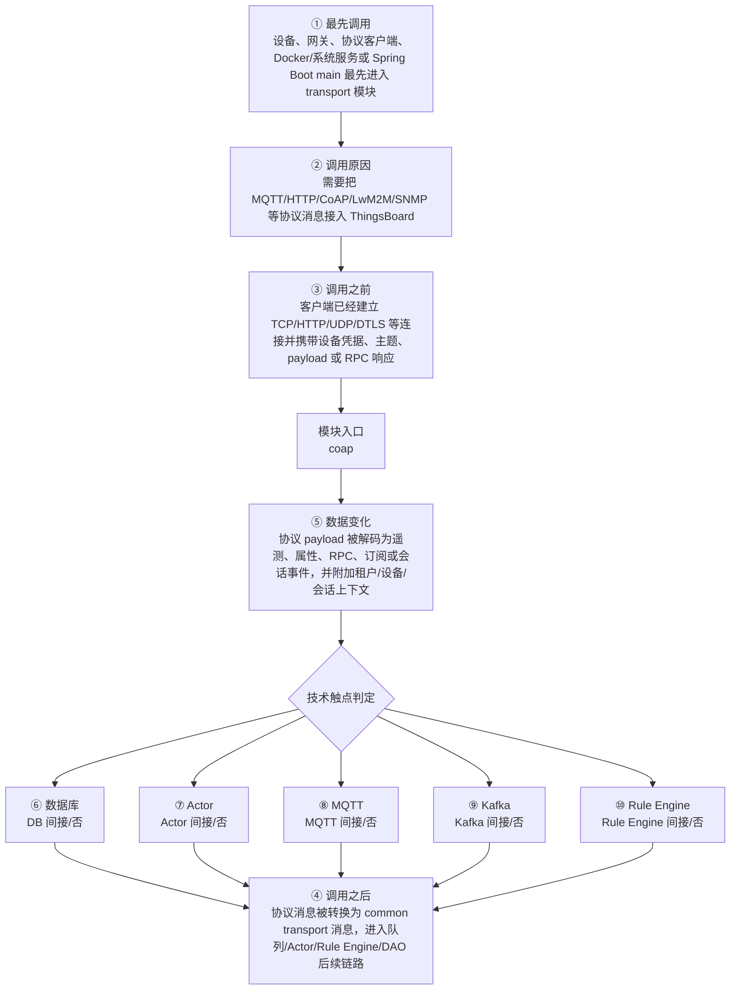

# Thingsboard CoAP Transport Common 模块调用链分析

> 生成范围：`common/transport/coap`  
> Maven artifact：`coap`  
> packaging：`jar`  
> 分析方式：静态扫描 POM、Java 注解、入口方法、关键技术触点和类关系；不是运行时 trace。

## 完整流程图

## 十项调用链问题

| 问题 | 模块级结论 |
| --- | --- |
| ① 谁最先调用这里？ | 设备、网关、协议客户端、Docker/系统服务或 Spring Boot main 最先进入 transport 模块 |
| ② 为什么会调用？ | 需要把 MQTT/HTTP/CoAP/LwM2M/SNMP 等协议消息接入 ThingsBoard |
| ③ 调用之前发生了什么？ | 客户端已经建立 TCP/HTTP/UDP/DTLS 等连接并携带设备凭据、主题、payload 或 RPC 响应 |
| ④ 调用之后发生什么？ | 协议消息被转换为 common transport 消息，进入队列/Actor/Rule Engine/DAO 后续链路 |
| ⑤ 数据如何变化？ | 协议 payload 被解码为遥测、属性、RPC、订阅或会话事件，并附加租户/设备/会话上下文 |
| ⑥ 对数据库进行了哪些操作？ | 否，未发现直接操作证据；未发现直接源码证据；若发生，通常在依赖的下游模块中完成。 |
| ⑦ 是否发送 Actor 消息？ | 否，未发现直接操作证据；未发现直接源码证据；若发生，通常在依赖的下游模块中完成。 |
| ⑧ 是否发送 MQTT 消息？ | 否，未发现直接操作证据；未发现直接源码证据；若发生，通常在依赖的下游模块中完成。 |
| ⑨ 是否写入 Kafka？ | 否，未发现直接操作证据；未发现直接源码证据；若发生，通常在依赖的下游模块中完成。 |
| ⑩ 是否写入 Rule Engine？ | 否，未发现直接操作证据；未发现直接 Rule Engine 写入，但消息可能在下游规则链中继续处理。 |

## 入口证据

- Spring Component 组件入口: `common/transport/coap/src/main/java/org/thingsboard/server/transport/coap/CoapTransportContext.java`
- Spring Component 组件入口: `common/transport/coap/src/main/java/org/thingsboard/server/transport/coap/adaptors/JsonCoapAdaptor.java`
- Spring Component 组件入口: `common/transport/coap/src/main/java/org/thingsboard/server/transport/coap/adaptors/ProtoCoapAdaptor.java`
- Spring Component 组件入口: `common/transport/coap/src/main/java/org/thingsboard/server/transport/coap/efento/adaptor/EfentoCoapAdaptor.java`
- Spring Service 业务服务入口: `common/transport/coap/src/main/java/org/thingsboard/server/transport/coap/CoapTransportService.java`
- Spring Service 业务服务入口: `common/transport/coap/src/main/java/org/thingsboard/server/transport/coap/client/DefaultCoapClientContext.java`
- Spring Service 业务服务入口: `common/transport/coap/src/main/java/org/thingsboard/server/transport/coap/client/DefaultCoapClientContext.java`
- 命令行或进程启动入口: `common/transport/coap/src/main/java/org/thingsboard/server/transport/coap/client/NoSecClient.java`
- 命令行或进程启动入口: `common/transport/coap/src/main/java/org/thingsboard/server/transport/coap/client/NoSecObserveClient.java`
- 命令行或进程启动入口: `common/transport/coap/src/main/java/org/thingsboard/server/transport/coap/client/SecureClientNoAuth.java`
- 命令行或进程启动入口: `common/transport/coap/src/main/java/org/thingsboard/server/transport/coap/client/SecureClientX509.java`

## 静态关键词统计（不等同于实际发送/写入）

- database: 3 处静态触点；未发现直接源码证据；若发生，通常在依赖的下游模块中完成。
- actor: 0 处静态触点；未发现直接源码证据；若发生，通常在依赖的下游模块中完成。
- mqtt: 0 处静态触点；未发现直接源码证据；若发生，通常在依赖的下游模块中完成。
- kafka: 0 处静态触点；未发现直接源码证据；若发生，通常在依赖的下游模块中完成。
- rule_engine: 0 处静态触点；未发现直接 Rule Engine 写入，但消息可能在下游规则链中继续处理。
- cache: 18 处静态触点；直接操作证据：发现静态关键词触点。关键词触点 18 处仅作为辅助线索。
- queue: 16 处静态触点；直接操作证据：发现静态关键词触点。关键词触点 16 处仅作为辅助线索。
- rest: 0 处静态触点；未发现直接源码证据；若发生，通常在依赖的下游模块中完成。
- websocket: 777 处静态触点；直接操作证据：发现静态关键词触点。关键词触点 777 处仅作为辅助线索。
- transport: 1149 处静态触点；直接操作证据：发现静态关键词触点。关键词触点 1149 处仅作为辅助线索。

## 调用前后数据流

1. 调用前：客户端已经建立 TCP/HTTP/UDP/DTLS 等连接并携带设备凭据、主题、payload 或 RPC 响应
2. 模块入口：`coap` 通过入口类、依赖 API、构建聚合或子模块暴露能力。
3. 模块内转换：协议 payload 被解码为遥测、属性、RPC、订阅或会话事件，并附加租户/设备/会话上下文
4. 调用后：协议消息被转换为 common transport 消息，进入队列/Actor/Rule Engine/DAO 后续链路
5. 数据库/Actor/MQTT/Kafka/Rule Engine 这些动作若没有直接触点，通常发生在依赖的 `application`、`dao`、`common/queue`、`common/transport` 或 `rule-engine` 模块中。

## 子模块与依赖

### 子模块

- 无子模块。

### 主要依赖

- `org.thingsboard.common.transport:transport-api`
- `org.thingsboard.common:coap-server`
- `org.eclipse.californium:californium-core`
- `org.eclipse.californium:scandium`
- `org.springframework:spring-context-support`
- `org.springframework:spring-context`
- `org.slf4j:slf4j-api`
- `org.slf4j:log4j-over-slf4j`
- `ch.qos.logback:logback-core`
- `ch.qos.logback:logback-classic`
- `org.springframework.boot:spring-boot-starter-test`
- `org.junit.vintage:junit-vintage-engine`
- `org.awaitility:awaitility`
- `com.google.protobuf:protobuf-java`

## 关键类型样本

- `AbstractCoapTransportResource` (class, `common/transport/coap/src/main/java/org/thingsboard/server/transport/coap/AbstractCoapTransportResource.java`)
- `CoapSessionMsgType` (enum, `common/transport/coap/src/main/java/org/thingsboard/server/transport/coap/CoapSessionMsgType.java`)
- `CoapTransportContext` (class, `common/transport/coap/src/main/java/org/thingsboard/server/transport/coap/CoapTransportContext.java`)
- `CoapTransportResource` (class, `common/transport/coap/src/main/java/org/thingsboard/server/transport/coap/CoapTransportResource.java`)
- `DeviceProvisionCallback` (class, `common/transport/coap/src/main/java/org/thingsboard/server/transport/coap/CoapTransportResource.java`)
- `CoapResourceObserver` (class, `common/transport/coap/src/main/java/org/thingsboard/server/transport/coap/CoapTransportResource.java`)
- `CoapTransportService` (class, `common/transport/coap/src/main/java/org/thingsboard/server/transport/coap/CoapTransportService.java`)
- `OtaPackageTransportResource` (class, `common/transport/coap/src/main/java/org/thingsboard/server/transport/coap/OtaPackageTransportResource.java`)
- `OtaPackageCallback` (class, `common/transport/coap/src/main/java/org/thingsboard/server/transport/coap/OtaPackageTransportResource.java`)
- `TbCoapMessageObserver` (class, `common/transport/coap/src/main/java/org/thingsboard/server/transport/coap/TbCoapMessageObserver.java`)
- `TransportConfigurationContainer` (class, `common/transport/coap/src/main/java/org/thingsboard/server/transport/coap/TransportConfigurationContainer.java`)
- `CoapAdaptorUtils` (class, `common/transport/coap/src/main/java/org/thingsboard/server/transport/coap/adaptors/CoapAdaptorUtils.java`)
- `CoapTransportAdaptor` (interface, `common/transport/coap/src/main/java/org/thingsboard/server/transport/coap/adaptors/CoapTransportAdaptor.java`)
- `JsonCoapAdaptor` (class, `common/transport/coap/src/main/java/org/thingsboard/server/transport/coap/adaptors/JsonCoapAdaptor.java`)
- `ProtoCoapAdaptor` (class, `common/transport/coap/src/main/java/org/thingsboard/server/transport/coap/adaptors/ProtoCoapAdaptor.java`)
- `AbstractSyncSessionCallback` (class, `common/transport/coap/src/main/java/org/thingsboard/server/transport/coap/callback/AbstractSyncSessionCallback.java`)
- `CoapDeviceAuthCallback` (class, `common/transport/coap/src/main/java/org/thingsboard/server/transport/coap/callback/CoapDeviceAuthCallback.java`)
- `CoapEfentoCallback` (class, `common/transport/coap/src/main/java/org/thingsboard/server/transport/coap/callback/CoapEfentoCallback.java`)
- `CoapNoOpCallback` (class, `common/transport/coap/src/main/java/org/thingsboard/server/transport/coap/callback/CoapNoOpCallback.java`)
- `CoapOkCallback` (class, `common/transport/coap/src/main/java/org/thingsboard/server/transport/coap/callback/CoapOkCallback.java`)
- `GetAttributesSyncSessionCallback` (class, `common/transport/coap/src/main/java/org/thingsboard/server/transport/coap/callback/GetAttributesSyncSessionCallback.java`)
- `ToServerRpcSyncSessionCallback` (class, `common/transport/coap/src/main/java/org/thingsboard/server/transport/coap/callback/ToServerRpcSyncSessionCallback.java`)
- `CoapClientContext` (interface, `common/transport/coap/src/main/java/org/thingsboard/server/transport/coap/client/CoapClientContext.java`)
- `DefaultCoapClientContext` (class, `common/transport/coap/src/main/java/org/thingsboard/server/transport/coap/client/DefaultCoapClientContext.java`)
- `CoapSessionListener` (class, `common/transport/coap/src/main/java/org/thingsboard/server/transport/coap/client/DefaultCoapClientContext.java`)
- `NoSecClient` (class, `common/transport/coap/src/main/java/org/thingsboard/server/transport/coap/client/NoSecClient.java`)
- `NoSecObserveClient` (class, `common/transport/coap/src/main/java/org/thingsboard/server/transport/coap/client/NoSecObserveClient.java`)
- `SecureClientNoAuth` (class, `common/transport/coap/src/main/java/org/thingsboard/server/transport/coap/client/SecureClientNoAuth.java`)
- `SecureClientX509` (class, `common/transport/coap/src/main/java/org/thingsboard/server/transport/coap/client/SecureClientX509.java`)
- `TbCoapClientState` (class, `common/transport/coap/src/main/java/org/thingsboard/server/transport/coap/client/TbCoapClientState.java`)
- `TbCoapContentFormatUtil` (class, `common/transport/coap/src/main/java/org/thingsboard/server/transport/coap/client/TbCoapContentFormatUtil.java`)
- `TbCoapObservationState` (class, `common/transport/coap/src/main/java/org/thingsboard/server/transport/coap/client/TbCoapObservationState.java`)
- `CoapEfentoTransportResource` (class, `common/transport/coap/src/main/java/org/thingsboard/server/transport/coap/efento/CoapEfentoTransportResource.java`)
- `EfentoTelemetry` (class, `common/transport/coap/src/main/java/org/thingsboard/server/transport/coap/efento/CoapEfentoTransportResource.java`)
- `EfentoCoapAdaptor` (class, `common/transport/coap/src/main/java/org/thingsboard/server/transport/coap/efento/adaptor/EfentoCoapAdaptor.java`)
- `CoapEfentoUtils` (class, `common/transport/coap/src/main/java/org/thingsboard/server/transport/coap/efento/utils/CoapEfentoUtils.java`)
- `CoapTransportResourceTest` (class, `common/transport/coap/src/test/java/org/thingsboard/server/transport/coap/CoapTransportResourceTest.java`)

## 阅读建议

- 先看“完整流程图”确认模块在全链路中的位置。
- 再看入口证据判断调用来源是 HTTP、MQTT/Transport、Actor、Kafka、Rule Engine、DAO、测试还是构建聚合。
- 最后用触点统计区分直接行为和下游间接行为，避免把依赖模块的数据库写入误认为本模块直接写入。
