# Thingsboard CoAP Transport Common 模块继承体系分析

> 生成范围：`common/transport/coap`  
> Maven artifact：`coap`  
> Java 类型数量：37  
> 分析方式：静态扫描 `class/interface/enum/record` 的 `extends`、`implements`、方法签名和源码触点。

## 完整继承树

```text
CoapClientContext
├── «implements» DefaultCoapClientContext
CoapResource
├── AbstractCoapTransportResource
├── ├── CoapEfentoTransportResource
├── ├── CoapTransportResource
├── ├── OtaPackageTransportResource
CoapTransportAdaptor
├── «implements» JsonCoapAdaptor
├── «implements» ProtoCoapAdaptor
MessageObserver
├── «implements» TbCoapMessageObserver
Object/外部框架
├── AbstractSyncSessionCallback
├── ├── GetAttributesSyncSessionCallback
├── ├── ToServerRpcSyncSessionCallback
├── CoapAdaptorUtils
├── CoapDeviceAuthCallback
├── CoapEfentoCallback
├── CoapEfentoUtils
├── CoapNoOpCallback
├── CoapOkCallback
├── CoapResourceObserver
├── CoapSessionListener
├── CoapTransportResourceTest
├── CoapTransportService
├── DefaultCoapClientContext
├── DeviceProvisionCallback
├── EfentoCoapAdaptor
├── EfentoTelemetry
├── JsonCoapAdaptor
├── NoSecClient
├── NoSecObserveClient
├── OtaPackageCallback
├── ProtoCoapAdaptor
├── SecureClientNoAuth
├── SecureClientX509
├── TbCoapClientState
├── TbCoapContentFormatUtil
├── TbCoapMessageObserver
├── TbCoapObservationState
├── TransportConfigurationContainer
ResourceObserver
├── «implements» CoapResourceObserver
SessionMsgListener
├── «implements» AbstractSyncSessionCallback
├── «implements» ├── GetAttributesSyncSessionCallback
├── «implements» ├── ToServerRpcSyncSessionCallback
├── «implements» CoapSessionListener
TbTransportService
├── «implements» CoapTransportService
TransportContext
├── CoapTransportContext
TransportServiceCallback
├── «implements» CoapDeviceAuthCallback
├── «implements» CoapEfentoCallback
├── «implements» CoapNoOpCallback
├── «implements» CoapOkCallback
├── «implements» DeviceProvisionCallback
├── «implements» OtaPackageCallback
```

## 继承图

```mermaid
flowchart TD
    CoapResource_p0["CoapResource"] -->|extends| AbstractCoapTransportResource_c0["AbstractCoapTransportResource"]
    TransportContext_p1["TransportContext"] -->|extends| CoapTransportContext_c1["CoapTransportContext"]
    AbstractCoapTransportResource_p2["AbstractCoapTransportResource"] -->|extends| CoapTransportResource_c2["CoapTransportResource"]
    Object______p3["Object/外部框架"] -->|extends| DeviceProvisionCallback_c3["DeviceProvisionCallback"]
    TransportServiceCallback_p4["TransportServiceCallback"] -->|implements| DeviceProvisionCallback_c4["DeviceProvisionCallback"]
    Object______p5["Object/外部框架"] -->|extends| CoapResourceObserver_c5["CoapResourceObserver"]
    ResourceObserver_p6["ResourceObserver"] -->|implements| CoapResourceObserver_c6["CoapResourceObserver"]
    Object______p7["Object/外部框架"] -->|extends| CoapTransportService_c7["CoapTransportService"]
    TbTransportService_p8["TbTransportService"] -->|implements| CoapTransportService_c8["CoapTransportService"]
    AbstractCoapTransportResource_p9["AbstractCoapTransportResource"] -->|extends| OtaPackageTransportResource_c9["OtaPackageTransportResource"]
    Object______p10["Object/外部框架"] -->|extends| OtaPackageCallback_c10["OtaPackageCallback"]
    TransportServiceCallback_p11["TransportServiceCallback"] -->|implements| OtaPackageCallback_c11["OtaPackageCallback"]
    Object______p12["Object/外部框架"] -->|extends| TbCoapMessageObserver_c12["TbCoapMessageObserver"]
    MessageObserver_p13["MessageObserver"] -->|implements| TbCoapMessageObserver_c13["TbCoapMessageObserver"]
    Object______p14["Object/外部框架"] -->|extends| TransportConfigurationContainer_c14["TransportConfigurationContainer"]
    Object______p15["Object/外部框架"] -->|extends| CoapAdaptorUtils_c15["CoapAdaptorUtils"]
    Object______p16["Object/外部框架"] -->|extends| JsonCoapAdaptor_c16["JsonCoapAdaptor"]
    CoapTransportAdaptor_p17["CoapTransportAdaptor"] -->|implements| JsonCoapAdaptor_c17["JsonCoapAdaptor"]
    Object______p18["Object/外部框架"] -->|extends| ProtoCoapAdaptor_c18["ProtoCoapAdaptor"]
    CoapTransportAdaptor_p19["CoapTransportAdaptor"] -->|implements| ProtoCoapAdaptor_c19["ProtoCoapAdaptor"]
    Object______p20["Object/外部框架"] -->|extends| AbstractSyncSessionCallback_c20["AbstractSyncSessionCallback"]
    SessionMsgListener_p21["SessionMsgListener"] -->|implements| AbstractSyncSessionCallback_c21["AbstractSyncSessionCallback"]
    Object______p22["Object/外部框架"] -->|extends| CoapDeviceAuthCallback_c22["CoapDeviceAuthCallback"]
    TransportServiceCallback_p23["TransportServiceCallback"] -->|implements| CoapDeviceAuthCallback_c23["CoapDeviceAuthCallback"]
    Object______p24["Object/外部框架"] -->|extends| CoapEfentoCallback_c24["CoapEfentoCallback"]
    TransportServiceCallback_p25["TransportServiceCallback"] -->|implements| CoapEfentoCallback_c25["CoapEfentoCallback"]
    Object______p26["Object/外部框架"] -->|extends| CoapNoOpCallback_c26["CoapNoOpCallback"]
    TransportServiceCallback_p27["TransportServiceCallback"] -->|implements| CoapNoOpCallback_c27["CoapNoOpCallback"]
    Object______p28["Object/外部框架"] -->|extends| CoapOkCallback_c28["CoapOkCallback"]
    TransportServiceCallback_p29["TransportServiceCallback"] -->|implements| CoapOkCallback_c29["CoapOkCallback"]
    AbstractSyncSessionCallback_p30["AbstractSyncSessionCallback"] -->|extends| GetAttributesSyncSessionCallback_c30["GetAttributesSyncSessionCallback"]
    AbstractSyncSessionCallback_p31["AbstractSyncSessionCallback"] -->|extends| ToServerRpcSyncSessionCallback_c31["ToServerRpcSyncSessionCallback"]
    Object______p32["Object/外部框架"] -->|extends| DefaultCoapClientContext_c32["DefaultCoapClientContext"]
    CoapClientContext_p33["CoapClientContext"] -->|implements| DefaultCoapClientContext_c33["DefaultCoapClientContext"]
    Object______p34["Object/外部框架"] -->|extends| CoapSessionListener_c34["CoapSessionListener"]
    SessionMsgListener_p35["SessionMsgListener"] -->|implements| CoapSessionListener_c35["CoapSessionListener"]
    Object______p36["Object/外部框架"] -->|extends| NoSecClient_c36["NoSecClient"]
    Object______p37["Object/外部框架"] -->|extends| NoSecObserveClient_c37["NoSecObserveClient"]
    Object______p38["Object/外部框架"] -->|extends| SecureClientNoAuth_c38["SecureClientNoAuth"]
    Object______p39["Object/外部框架"] -->|extends| SecureClientX509_c39["SecureClientX509"]
    Object______p40["Object/外部框架"] -->|extends| TbCoapClientState_c40["TbCoapClientState"]
    Object______p41["Object/外部框架"] -->|extends| TbCoapContentFormatUtil_c41["TbCoapContentFormatUtil"]
    Object______p42["Object/外部框架"] -->|extends| TbCoapObservationState_c42["TbCoapObservationState"]
    AbstractCoapTransportResource_p43["AbstractCoapTransportResource"] -->|extends| CoapEfentoTransportResource_c43["CoapEfentoTransportResource"]
    Object______p44["Object/外部框架"] -->|extends| EfentoTelemetry_c44["EfentoTelemetry"]
    Object______p45["Object/外部框架"] -->|extends| EfentoCoapAdaptor_c45["EfentoCoapAdaptor"]
    Object______p46["Object/外部框架"] -->|extends| CoapEfentoUtils_c46["CoapEfentoUtils"]
    Object______p47["Object/外部框架"] -->|extends| CoapTransportResourceTest_c47["CoapTransportResourceTest"]
```




## 每一层为什么存在

- 外部/上层父类或接口层：提供框架生命周期、Java 标准契约、Spring/Netty/DAO/Rule Engine 等扩展点。
- 接口层：定义跨模块契约，让调用方依赖稳定 API，而不是具体实现。
- 抽象类层：沉淀公共状态、校验、模板流程和默认实现，把变化点留给子类。
- 具体类层：完成协议、DAO、Controller、Rule Node、工具或测试场景中的最终业务动作。

## 抽象了什么

- 父类/接口抽象公共生命周期、输入输出契约、错误处理、协议适配、DAO 查询形态、消息处理模板或测试夹具。
- 子类保留具体协议、实体类型、规则节点行为、数据库实现、页面/测试步骤或命令参数差异。
- 对聚合或无 Java 模块，抽象体现在 Maven 子模块划分和构建生命周期，而不是 Java 继承。

## 父类负责什么

- 提供稳定方法签名、共享字段、默认流程、通用校验、资源释放和框架回调入口。
- 在 Spring、Netty、DAO、Rule Engine、Transport 等框架中，父类还负责让运行时可以通过统一类型调度不同实现。

## 子类负责什么

- 实现具体业务差异，例如协议解析、实体 DAO、规则节点处理、Controller API、客户端命令或测试用例。
- 覆盖父类预留的扩展点，把模块特有数据转换、数据库查询、消息发送或外部调用补进去。

## 为什么不用组合

- 继承用于框架生命周期和模板方法：运行时需要把子类当作父类处理，例如 Spring Bean、Netty Handler、DAO Repository、Rule Node 或测试基类。
- 组合适合注入协作者，本模块中仍然通过字段依赖使用组合；但当需要统一回调签名、共享模板流程或多态派发时，单纯组合不能替代继承。

## 为什么不用接口

- 接口只能表达契约，不能集中保存公共状态、默认校验、资源关闭和模板流程。
- 当模块只需要契约时会使用接口；当多个实现还需要共享代码、默认行为或受保护扩展点时使用抽象类。

## 模板方法

- `AbstractCoapTransportResource.handleGET()` (public, `common/transport/coap/src/main/java/org/thingsboard/server/transport/coap/AbstractCoapTransportResource.java`)
- `AbstractCoapTransportResource.handlePOST()` (public, `common/transport/coap/src/main/java/org/thingsboard/server/transport/coap/AbstractCoapTransportResource.java`)
- `AbstractCoapTransportResource.processHandleGet()` (package, `common/transport/coap/src/main/java/org/thingsboard/server/transport/coap/AbstractCoapTransportResource.java`)
- `AbstractCoapTransportResource.processHandlePost()` (package, `common/transport/coap/src/main/java/org/thingsboard/server/transport/coap/AbstractCoapTransportResource.java`)
- `AbstractCoapTransportResource.reportSubscriptionInfo()` (protected, `common/transport/coap/src/main/java/org/thingsboard/server/transport/coap/AbstractCoapTransportResource.java`)
- `CoapTransportAdaptor.getContentFormat()` (package, `common/transport/coap/src/main/java/org/thingsboard/server/transport/coap/adaptors/CoapTransportAdaptor.java`)
- `AbstractSyncSessionCallback.onGetAttributesResponse()` (public, `common/transport/coap/src/main/java/org/thingsboard/server/transport/coap/callback/AbstractSyncSessionCallback.java`)
- `AbstractSyncSessionCallback.onAttributeUpdate()` (public, `common/transport/coap/src/main/java/org/thingsboard/server/transport/coap/callback/AbstractSyncSessionCallback.java`)
- `AbstractSyncSessionCallback.onRemoteSessionCloseCommand()` (public, `common/transport/coap/src/main/java/org/thingsboard/server/transport/coap/callback/AbstractSyncSessionCallback.java`)
- `AbstractSyncSessionCallback.onDeviceDeleted()` (public, `common/transport/coap/src/main/java/org/thingsboard/server/transport/coap/callback/AbstractSyncSessionCallback.java`)
- `AbstractSyncSessionCallback.onToDeviceRpcRequest()` (public, `common/transport/coap/src/main/java/org/thingsboard/server/transport/coap/callback/AbstractSyncSessionCallback.java`)
- `AbstractSyncSessionCallback.onToServerRpcResponse()` (public, `common/transport/coap/src/main/java/org/thingsboard/server/transport/coap/callback/AbstractSyncSessionCallback.java`)
- `AbstractSyncSessionCallback.respond()` (protected, `common/transport/coap/src/main/java/org/thingsboard/server/transport/coap/callback/AbstractSyncSessionCallback.java`)
- `CoapClientContext.registerAttributeObservation()` (package, `common/transport/coap/src/main/java/org/thingsboard/server/transport/coap/client/CoapClientContext.java`)
- `CoapClientContext.registerRpcObservation()` (package, `common/transport/coap/src/main/java/org/thingsboard/server/transport/coap/client/CoapClientContext.java`)
- `CoapClientContext.getNotificationCounterByToken()` (package, `common/transport/coap/src/main/java/org/thingsboard/server/transport/coap/client/CoapClientContext.java`)
- `CoapClientContext.getNewSyncSession()` (package, `common/transport/coap/src/main/java/org/thingsboard/server/transport/coap/client/CoapClientContext.java`)
- `CoapClientContext.deregisterAttributeObservation()` (package, `common/transport/coap/src/main/java/org/thingsboard/server/transport/coap/client/CoapClientContext.java`)
- `CoapClientContext.deregisterRpcObservation()` (package, `common/transport/coap/src/main/java/org/thingsboard/server/transport/coap/client/CoapClientContext.java`)
- `CoapClientContext.reportActivity()` (package, `common/transport/coap/src/main/java/org/thingsboard/server/transport/coap/client/CoapClientContext.java`)
- `CoapClientContext.registerObserveRelation()` (package, `common/transport/coap/src/main/java/org/thingsboard/server/transport/coap/client/CoapClientContext.java`)
- `CoapClientContext.deregisterObserveRelation()` (package, `common/transport/coap/src/main/java/org/thingsboard/server/transport/coap/client/CoapClientContext.java`)
- `CoapClientContext.awake()` (package, `common/transport/coap/src/main/java/org/thingsboard/server/transport/coap/client/CoapClientContext.java`)


## 哪些方法可以重写

- `AbstractCoapTransportResource.handleGET()` (public, `common/transport/coap/src/main/java/org/thingsboard/server/transport/coap/AbstractCoapTransportResource.java`)
- `AbstractCoapTransportResource.handlePOST()` (public, `common/transport/coap/src/main/java/org/thingsboard/server/transport/coap/AbstractCoapTransportResource.java`)
- `AbstractCoapTransportResource.processHandleGet()` (package, `common/transport/coap/src/main/java/org/thingsboard/server/transport/coap/AbstractCoapTransportResource.java`)
- `AbstractCoapTransportResource.processHandlePost()` (package, `common/transport/coap/src/main/java/org/thingsboard/server/transport/coap/AbstractCoapTransportResource.java`)
- `AbstractCoapTransportResource.reportSubscriptionInfo()` (protected, `common/transport/coap/src/main/java/org/thingsboard/server/transport/coap/AbstractCoapTransportResource.java`)
- `CoapTransportResource.CoapResourceObserver()` (package, `common/transport/coap/src/main/java/org/thingsboard/server/transport/coap/CoapTransportResource.java`)
- `CoapTransportResource.Random()` (package, `common/transport/coap/src/main/java/org/thingsboard/server/transport/coap/CoapTransportResource.java`)
- `CoapTransportResource.checkObserveRelation()` (public, `common/transport/coap/src/main/java/org/thingsboard/server/transport/coap/CoapTransportResource.java`)
- `CoapTransportResource.processHandleGet()` (protected, `common/transport/coap/src/main/java/org/thingsboard/server/transport/coap/CoapTransportResource.java`)
- `CoapTransportResource.processHandlePost()` (protected, `common/transport/coap/src/main/java/org/thingsboard/server/transport/coap/CoapTransportResource.java`)
- `CoapTransportResource.AdaptorException()` (package, `common/transport/coap/src/main/java/org/thingsboard/server/transport/coap/CoapTransportResource.java`)
- `CoapTransportResource.DeviceProvisionCallback()` (package, `common/transport/coap/src/main/java/org/thingsboard/server/transport/coap/CoapTransportResource.java`)
- `CoapTransportResource.CoapDeviceAuthCallback()` (package, `common/transport/coap/src/main/java/org/thingsboard/server/transport/coap/CoapTransportResource.java`)
- `CoapTransportResource.CoapOkCallback()` (package, `common/transport/coap/src/main/java/org/thingsboard/server/transport/coap/CoapTransportResource.java`)
- `CoapTransportResource.CoapOkCallback()` (package, `common/transport/coap/src/main/java/org/thingsboard/server/transport/coap/CoapTransportResource.java`)
- `CoapTransportResource.CoapOkCallback()` (package, `common/transport/coap/src/main/java/org/thingsboard/server/transport/coap/CoapTransportResource.java`)
- `CoapTransportResource.getTokenFromRequest()` (package, `common/transport/coap/src/main/java/org/thingsboard/server/transport/coap/CoapTransportResource.java`)
- `CoapTransportResource.getTokenFromRequest()` (package, `common/transport/coap/src/main/java/org/thingsboard/server/transport/coap/CoapTransportResource.java`)
- `CoapTransportResource.CoapOkCallback()` (package, `common/transport/coap/src/main/java/org/thingsboard/server/transport/coap/CoapTransportResource.java`)
- `CoapTransportResource.GetAttributesSyncSessionCallback()` (package, `common/transport/coap/src/main/java/org/thingsboard/server/transport/coap/CoapTransportResource.java`)
- `CoapTransportResource.CoapNoOpCallback()` (package, `common/transport/coap/src/main/java/org/thingsboard/server/transport/coap/CoapTransportResource.java`)
- `CoapTransportResource.ToServerRpcSyncSessionCallback()` (package, `common/transport/coap/src/main/java/org/thingsboard/server/transport/coap/CoapTransportResource.java`)
- `CoapTransportResource.CoapNoOpCallback()` (package, `common/transport/coap/src/main/java/org/thingsboard/server/transport/coap/CoapTransportResource.java`)
- `CoapTransportResource.UUID()` (package, `common/transport/coap/src/main/java/org/thingsboard/server/transport/coap/CoapTransportResource.java`)
- `CoapTransportResource.DeviceTokenCredentials()` (package, `common/transport/coap/src/main/java/org/thingsboard/server/transport/coap/CoapTransportResource.java`)
- `CoapTransportResource.getFeatureType()` (protected, `common/transport/coap/src/main/java/org/thingsboard/server/transport/coap/CoapTransportResource.java`)
- `CoapTransportResource.getChild()` (public, `common/transport/coap/src/main/java/org/thingsboard/server/transport/coap/CoapTransportResource.java`)
- `CoapTransportResource.onSuccess()` (public, `common/transport/coap/src/main/java/org/thingsboard/server/transport/coap/CoapTransportResource.java`)
- `CoapTransportResource.onError()` (public, `common/transport/coap/src/main/java/org/thingsboard/server/transport/coap/CoapTransportResource.java`)
- `CoapTransportResource.changedName()` (public, `common/transport/coap/src/main/java/org/thingsboard/server/transport/coap/CoapTransportResource.java`)
- `CoapTransportResource.changedPath()` (public, `common/transport/coap/src/main/java/org/thingsboard/server/transport/coap/CoapTransportResource.java`)
- `CoapTransportResource.addedChild()` (public, `common/transport/coap/src/main/java/org/thingsboard/server/transport/coap/CoapTransportResource.java`)
- `CoapTransportResource.removedChild()` (public, `common/transport/coap/src/main/java/org/thingsboard/server/transport/coap/CoapTransportResource.java`)
- `CoapTransportResource.addedObserveRelation()` (public, `common/transport/coap/src/main/java/org/thingsboard/server/transport/coap/CoapTransportResource.java`)
- `CoapTransportResource.removedObserveRelation()` (public, `common/transport/coap/src/main/java/org/thingsboard/server/transport/coap/CoapTransportResource.java`)
- `DeviceProvisionCallback.CoapTransportResource()` (package, `common/transport/coap/src/main/java/org/thingsboard/server/transport/coap/CoapTransportResource.java`)
- `DeviceProvisionCallback.CoapResourceObserver()` (package, `common/transport/coap/src/main/java/org/thingsboard/server/transport/coap/CoapTransportResource.java`)
- `DeviceProvisionCallback.Random()` (package, `common/transport/coap/src/main/java/org/thingsboard/server/transport/coap/CoapTransportResource.java`)
- `DeviceProvisionCallback.checkObserveRelation()` (public, `common/transport/coap/src/main/java/org/thingsboard/server/transport/coap/CoapTransportResource.java`)
- `DeviceProvisionCallback.processHandleGet()` (protected, `common/transport/coap/src/main/java/org/thingsboard/server/transport/coap/CoapTransportResource.java`)


## 哪些方法必须重写

- `AbstractCoapTransportResource.processHandleGet()` (package, `common/transport/coap/src/main/java/org/thingsboard/server/transport/coap/AbstractCoapTransportResource.java`)
- `AbstractCoapTransportResource.processHandlePost()` (package, `common/transport/coap/src/main/java/org/thingsboard/server/transport/coap/AbstractCoapTransportResource.java`)
- `CoapTransportResource.CoapResourceObserver()` (package, `common/transport/coap/src/main/java/org/thingsboard/server/transport/coap/CoapTransportResource.java`)
- `CoapTransportResource.Random()` (package, `common/transport/coap/src/main/java/org/thingsboard/server/transport/coap/CoapTransportResource.java`)
- `CoapTransportResource.AdaptorException()` (package, `common/transport/coap/src/main/java/org/thingsboard/server/transport/coap/CoapTransportResource.java`)
- `CoapTransportResource.DeviceProvisionCallback()` (package, `common/transport/coap/src/main/java/org/thingsboard/server/transport/coap/CoapTransportResource.java`)
- `CoapTransportResource.CoapDeviceAuthCallback()` (package, `common/transport/coap/src/main/java/org/thingsboard/server/transport/coap/CoapTransportResource.java`)
- `CoapTransportResource.CoapOkCallback()` (package, `common/transport/coap/src/main/java/org/thingsboard/server/transport/coap/CoapTransportResource.java`)
- `CoapTransportResource.CoapOkCallback()` (package, `common/transport/coap/src/main/java/org/thingsboard/server/transport/coap/CoapTransportResource.java`)
- `CoapTransportResource.CoapOkCallback()` (package, `common/transport/coap/src/main/java/org/thingsboard/server/transport/coap/CoapTransportResource.java`)
- `CoapTransportResource.getTokenFromRequest()` (package, `common/transport/coap/src/main/java/org/thingsboard/server/transport/coap/CoapTransportResource.java`)
- `CoapTransportResource.getTokenFromRequest()` (package, `common/transport/coap/src/main/java/org/thingsboard/server/transport/coap/CoapTransportResource.java`)
- `CoapTransportResource.CoapOkCallback()` (package, `common/transport/coap/src/main/java/org/thingsboard/server/transport/coap/CoapTransportResource.java`)
- `CoapTransportResource.GetAttributesSyncSessionCallback()` (package, `common/transport/coap/src/main/java/org/thingsboard/server/transport/coap/CoapTransportResource.java`)
- `CoapTransportResource.CoapNoOpCallback()` (package, `common/transport/coap/src/main/java/org/thingsboard/server/transport/coap/CoapTransportResource.java`)
- `CoapTransportResource.ToServerRpcSyncSessionCallback()` (package, `common/transport/coap/src/main/java/org/thingsboard/server/transport/coap/CoapTransportResource.java`)
- `CoapTransportResource.CoapNoOpCallback()` (package, `common/transport/coap/src/main/java/org/thingsboard/server/transport/coap/CoapTransportResource.java`)
- `CoapTransportResource.UUID()` (package, `common/transport/coap/src/main/java/org/thingsboard/server/transport/coap/CoapTransportResource.java`)
- `CoapTransportResource.DeviceTokenCredentials()` (package, `common/transport/coap/src/main/java/org/thingsboard/server/transport/coap/CoapTransportResource.java`)
- `DeviceProvisionCallback.CoapResourceObserver()` (package, `common/transport/coap/src/main/java/org/thingsboard/server/transport/coap/CoapTransportResource.java`)
- `DeviceProvisionCallback.Random()` (package, `common/transport/coap/src/main/java/org/thingsboard/server/transport/coap/CoapTransportResource.java`)
- `DeviceProvisionCallback.AdaptorException()` (package, `common/transport/coap/src/main/java/org/thingsboard/server/transport/coap/CoapTransportResource.java`)
- `DeviceProvisionCallback.CoapDeviceAuthCallback()` (package, `common/transport/coap/src/main/java/org/thingsboard/server/transport/coap/CoapTransportResource.java`)
- `DeviceProvisionCallback.CoapOkCallback()` (package, `common/transport/coap/src/main/java/org/thingsboard/server/transport/coap/CoapTransportResource.java`)
- `DeviceProvisionCallback.CoapOkCallback()` (package, `common/transport/coap/src/main/java/org/thingsboard/server/transport/coap/CoapTransportResource.java`)
- `DeviceProvisionCallback.CoapOkCallback()` (package, `common/transport/coap/src/main/java/org/thingsboard/server/transport/coap/CoapTransportResource.java`)
- `DeviceProvisionCallback.getTokenFromRequest()` (package, `common/transport/coap/src/main/java/org/thingsboard/server/transport/coap/CoapTransportResource.java`)
- `DeviceProvisionCallback.getTokenFromRequest()` (package, `common/transport/coap/src/main/java/org/thingsboard/server/transport/coap/CoapTransportResource.java`)
- `DeviceProvisionCallback.CoapOkCallback()` (package, `common/transport/coap/src/main/java/org/thingsboard/server/transport/coap/CoapTransportResource.java`)
- `DeviceProvisionCallback.GetAttributesSyncSessionCallback()` (package, `common/transport/coap/src/main/java/org/thingsboard/server/transport/coap/CoapTransportResource.java`)
- `DeviceProvisionCallback.CoapNoOpCallback()` (package, `common/transport/coap/src/main/java/org/thingsboard/server/transport/coap/CoapTransportResource.java`)
- `DeviceProvisionCallback.ToServerRpcSyncSessionCallback()` (package, `common/transport/coap/src/main/java/org/thingsboard/server/transport/coap/CoapTransportResource.java`)
- `DeviceProvisionCallback.CoapNoOpCallback()` (package, `common/transport/coap/src/main/java/org/thingsboard/server/transport/coap/CoapTransportResource.java`)
- `DeviceProvisionCallback.UUID()` (package, `common/transport/coap/src/main/java/org/thingsboard/server/transport/coap/CoapTransportResource.java`)
- `DeviceProvisionCallback.DeviceTokenCredentials()` (package, `common/transport/coap/src/main/java/org/thingsboard/server/transport/coap/CoapTransportResource.java`)
- `CoapResourceObserver.Random()` (package, `common/transport/coap/src/main/java/org/thingsboard/server/transport/coap/CoapTransportResource.java`)
- `CoapResourceObserver.AdaptorException()` (package, `common/transport/coap/src/main/java/org/thingsboard/server/transport/coap/CoapTransportResource.java`)
- `CoapResourceObserver.DeviceProvisionCallback()` (package, `common/transport/coap/src/main/java/org/thingsboard/server/transport/coap/CoapTransportResource.java`)
- `CoapResourceObserver.CoapDeviceAuthCallback()` (package, `common/transport/coap/src/main/java/org/thingsboard/server/transport/coap/CoapTransportResource.java`)
- `CoapResourceObserver.CoapOkCallback()` (package, `common/transport/coap/src/main/java/org/thingsboard/server/transport/coap/CoapTransportResource.java`)


## 哪些地方使用了多态

- `CoapResource` -> `AbstractCoapTransportResource` (extends)
- `TransportContext` -> `CoapTransportContext` (extends)
- `AbstractCoapTransportResource` -> `CoapTransportResource` (extends)
- `Object/外部框架` -> `DeviceProvisionCallback` (extends)
- `TransportServiceCallback` -> `DeviceProvisionCallback` (implements)
- `Object/外部框架` -> `CoapResourceObserver` (extends)
- `ResourceObserver` -> `CoapResourceObserver` (implements)
- `Object/外部框架` -> `CoapTransportService` (extends)
- `TbTransportService` -> `CoapTransportService` (implements)
- `AbstractCoapTransportResource` -> `OtaPackageTransportResource` (extends)
- `Object/外部框架` -> `OtaPackageCallback` (extends)
- `TransportServiceCallback` -> `OtaPackageCallback` (implements)
- `Object/外部框架` -> `TbCoapMessageObserver` (extends)
- `MessageObserver` -> `TbCoapMessageObserver` (implements)
- `Object/外部框架` -> `TransportConfigurationContainer` (extends)
- `Object/外部框架` -> `CoapAdaptorUtils` (extends)
- `Object/外部框架` -> `JsonCoapAdaptor` (extends)
- `CoapTransportAdaptor` -> `JsonCoapAdaptor` (implements)
- `Object/外部框架` -> `ProtoCoapAdaptor` (extends)
- `CoapTransportAdaptor` -> `ProtoCoapAdaptor` (implements)
- `Object/外部框架` -> `AbstractSyncSessionCallback` (extends)
- `SessionMsgListener` -> `AbstractSyncSessionCallback` (implements)
- `Object/外部框架` -> `CoapDeviceAuthCallback` (extends)
- `TransportServiceCallback` -> `CoapDeviceAuthCallback` (implements)
- `Object/外部框架` -> `CoapEfentoCallback` (extends)
- `TransportServiceCallback` -> `CoapEfentoCallback` (implements)
- `Object/外部框架` -> `CoapNoOpCallback` (extends)
- `TransportServiceCallback` -> `CoapNoOpCallback` (implements)
- `Object/外部框架` -> `CoapOkCallback` (extends)
- `TransportServiceCallback` -> `CoapOkCallback` (implements)
- `AbstractSyncSessionCallback` -> `GetAttributesSyncSessionCallback` (extends)
- `AbstractSyncSessionCallback` -> `ToServerRpcSyncSessionCallback` (extends)
- `Object/外部框架` -> `DefaultCoapClientContext` (extends)
- `CoapClientContext` -> `DefaultCoapClientContext` (implements)
- `Object/外部框架` -> `CoapSessionListener` (extends)
- `SessionMsgListener` -> `CoapSessionListener` (implements)
- `Object/外部框架` -> `NoSecClient` (extends)
- `Object/外部框架` -> `NoSecObserveClient` (extends)
- `Object/外部框架` -> `SecureClientNoAuth` (extends)
- `Object/外部框架` -> `SecureClientX509` (extends)
- 其余 8 项已省略；完整源码证据可通过本模块 Java 文件继续追踪。


## 外部父类/接口

- `CoapResource`
- `MessageObserver`
- `Object/外部框架`
- `ResourceObserver`
- `SessionMsgListener`
- `TbTransportService`
- `TransportContext`
- `TransportServiceCallback`


## 整个继承体系解决了什么问题

该继承体系把“稳定生命周期/契约”和“模块特定行为”分开：父类或接口负责统一入口、共享流程和多态调度，子类负责差异化协议、实体、规则、DAO、测试或工具行为。这样可以让上游模块通过父类型调用下游实现，同时保持每个实现只关注自己的变化点。
