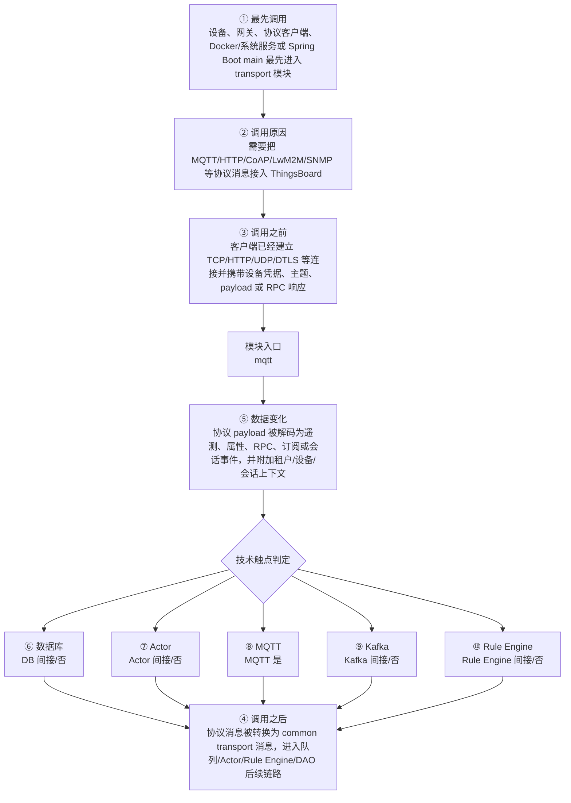

# Thingsboard MQTT Transport Common 模块调用链分析

> 生成范围：`common/transport/mqtt`  
> Maven artifact：`mqtt`  
> packaging：`jar`  
> 分析方式：静态扫描 POM、Java 注解、入口方法、关键技术触点和类关系；不是运行时 trace。

## 完整流程图

## 十项调用链问题

| 问题 | 模块级结论 |
| --- | --- |
| ① 谁最先调用这里？ | 设备、网关、协议客户端、Docker/系统服务或 Spring Boot main 最先进入 transport 模块 |
| ② 为什么会调用？ | 需要把 MQTT/HTTP/CoAP/LwM2M/SNMP 等协议消息接入 ThingsBoard |
| ③ 调用之前发生了什么？ | 客户端已经建立 TCP/HTTP/UDP/DTLS 等连接并携带设备凭据、主题、payload 或 RPC 响应 |
| ④ 调用之后发生什么？ | 协议消息被转换为 common transport 消息，进入队列/Actor/Rule Engine/DAO 后续链路 |
| ⑤ 数据如何变化？ | 协议 payload 被解码为遥测、属性、RPC、订阅或会话事件，并附加租户/设备/会话上下文 |
| ⑥ 对数据库进行了哪些操作？ | 否，未发现直接操作证据；未发现直接源码证据；若发生，通常在依赖的下游模块中完成。 |
| ⑦ 是否发送 Actor 消息？ | 否，未发现直接操作证据；未发现直接源码证据；若发生，通常在依赖的下游模块中完成。 |
| ⑧ 是否发送 MQTT 消息？ | 是，发现直接操作证据；直接操作证据：发现 MQTT client/handler/publish/subscribe/writeAndFlush 等操作模式。关键词触点 4433 处仅作为辅助线索。 |
| ⑨ 是否写入 Kafka？ | 否，未发现直接操作证据；未发现直接源码证据；若发生，通常在依赖的下游模块中完成。 |
| ⑩ 是否写入 Rule Engine？ | 否，未发现直接操作证据；未发现直接 Rule Engine 写入，但消息可能在下游规则链中继续处理。 |

## 入口证据

- Netty pipeline 入口: `common/transport/mqtt/src/main/java/org/thingsboard/server/transport/mqtt/MqttTransportHandler.java`
- Netty pipeline 入口: `common/transport/mqtt/src/main/java/org/thingsboard/server/transport/mqtt/MqttTransportHandler.java`
- Netty pipeline 入口: `common/transport/mqtt/src/main/java/org/thingsboard/server/transport/mqtt/MqttTransportHandler.java`
- Netty pipeline 入口: `common/transport/mqtt/src/main/java/org/thingsboard/server/transport/mqtt/limits/IpFilter.java`
- Netty pipeline 入口: `common/transport/mqtt/src/main/java/org/thingsboard/server/transport/mqtt/limits/ProxyIpFilter.java`
- Netty pipeline 入口: `common/transport/mqtt/src/main/java/org/thingsboard/server/transport/mqtt/session/AbstractGatewaySessionHandler.java`
- Netty pipeline 入口: `common/transport/mqtt/src/main/java/org/thingsboard/server/transport/mqtt/session/DeviceSessionCtx.java`
- Netty pipeline 入口: `common/transport/mqtt/src/test/java/org/thingsboard/server/transport/mqtt/MqttTransportHandlerTest.java`
- Spring Component 组件入口: `common/transport/mqtt/src/main/java/org/thingsboard/server/transport/mqtt/MqttSslHandlerProvider.java`
- Spring Component 组件入口: `common/transport/mqtt/src/main/java/org/thingsboard/server/transport/mqtt/MqttSslHandlerProvider.java`
- Spring Component 组件入口: `common/transport/mqtt/src/main/java/org/thingsboard/server/transport/mqtt/MqttTransportContext.java`
- Spring Component 组件入口: `common/transport/mqtt/src/main/java/org/thingsboard/server/transport/mqtt/adaptors/JsonMqttAdaptor.java`
- Spring Component 组件入口: `common/transport/mqtt/src/main/java/org/thingsboard/server/transport/mqtt/adaptors/ProtoMqttAdaptor.java`
- Spring Service 业务服务入口: `common/transport/mqtt/src/main/java/org/thingsboard/server/transport/mqtt/MqttTransportService.java`
- 测试框架入口: `common/transport/mqtt/src/test/java/org/thingsboard/server/transport/mqtt/MqttTransportHandlerTest.java`
- 测试框架入口: `common/transport/mqtt/src/test/java/org/thingsboard/server/transport/mqtt/session/GatewaySessionHandlerTest.java`
- 测试框架入口: `common/transport/mqtt/src/test/java/org/thingsboard/server/transport/mqtt/util/MqttTopicFilterFactoryTest.java`

## 静态关键词统计（不等同于实际发送/写入）

- database: 77 处静态触点；未发现直接源码证据；若发生，通常在依赖的下游模块中完成。
- actor: 0 处静态触点；未发现直接源码证据；若发生，通常在依赖的下游模块中完成。
- mqtt: 4433 处静态触点；直接操作证据：发现 MQTT client/handler/publish/subscribe/writeAndFlush 等操作模式。关键词触点 4433 处仅作为辅助线索。
- kafka: 0 处静态触点；未发现直接源码证据；若发生，通常在依赖的下游模块中完成。
- rule_engine: 15 处静态触点；未发现直接 Rule Engine 写入，但消息可能在下游规则链中继续处理。
- cache: 7 处静态触点；直接操作证据：发现静态关键词触点。关键词触点 7 处仅作为辅助线索。
- queue: 130 处静态触点；直接操作证据：发现静态关键词触点。关键词触点 130 处仅作为辅助线索。
- rest: 0 处静态触点；未发现直接源码证据；若发生，通常在依赖的下游模块中完成。
- websocket: 1805 处静态触点；直接操作证据：发现静态关键词触点。关键词触点 1805 处仅作为辅助线索。
- transport: 1556 处静态触点；直接操作证据：发现静态关键词触点。关键词触点 1556 处仅作为辅助线索。

## 调用前后数据流

1. 调用前：客户端已经建立 TCP/HTTP/UDP/DTLS 等连接并携带设备凭据、主题、payload 或 RPC 响应
2. 模块入口：`mqtt` 通过入口类、依赖 API、构建聚合或子模块暴露能力。
3. 模块内转换：协议 payload 被解码为遥测、属性、RPC、订阅或会话事件，并附加租户/设备/会话上下文
4. 调用后：协议消息被转换为 common transport 消息，进入队列/Actor/Rule Engine/DAO 后续链路
5. 数据库/Actor/MQTT/Kafka/Rule Engine 这些动作若没有直接触点，通常发生在依赖的 `application`、`dao`、`common/queue`、`common/transport` 或 `rule-engine` 模块中。

## 子模块与依赖

### 子模块

- 无子模块。

### 主要依赖

- `org.thingsboard.common.transport:transport-api`
- `io.netty:netty-all`
- `io.netty:netty-tcnative-boringssl-static`
- `org.springframework:spring-context-support`
- `org.springframework:spring-context`
- `org.slf4j:slf4j-api`
- `org.slf4j:log4j-over-slf4j`
- `ch.qos.logback:logback-core`
- `ch.qos.logback:logback-classic`
- `com.google.guava:guava`
- `com.google.code.findbugs:jsr305`
- `org.springframework.boot:spring-boot-starter-test`
- `org.junit.vintage:junit-vintage-engine`
- `org.awaitility:awaitility`
- `com.google.protobuf:protobuf-java`

## 关键类型样本

- `MqttSslHandlerProvider` (class, `common/transport/mqtt/src/main/java/org/thingsboard/server/transport/mqtt/MqttSslHandlerProvider.java`)
- `ThingsboardMqttX509TrustManager` (class, `common/transport/mqtt/src/main/java/org/thingsboard/server/transport/mqtt/MqttSslHandlerProvider.java`)
- `MqttTransportContext` (class, `common/transport/mqtt/src/main/java/org/thingsboard/server/transport/mqtt/MqttTransportContext.java`)
- `MqttTransportHandler` (class, `common/transport/mqtt/src/main/java/org/thingsboard/server/transport/mqtt/MqttTransportHandler.java`)
- `DeviceProvisionCallback` (class, `common/transport/mqtt/src/main/java/org/thingsboard/server/transport/mqtt/MqttTransportHandler.java`)
- `OtaPackageCallback` (class, `common/transport/mqtt/src/main/java/org/thingsboard/server/transport/mqtt/MqttTransportHandler.java`)
- `MqttTransportServerInitializer` (class, `common/transport/mqtt/src/main/java/org/thingsboard/server/transport/mqtt/MqttTransportServerInitializer.java`)
- `MqttTransportService` (class, `common/transport/mqtt/src/main/java/org/thingsboard/server/transport/mqtt/MqttTransportService.java`)
- `TopicType` (enum, `common/transport/mqtt/src/main/java/org/thingsboard/server/transport/mqtt/TopicType.java`)
- `BackwardCompatibilityAdaptor` (class, `common/transport/mqtt/src/main/java/org/thingsboard/server/transport/mqtt/adaptors/BackwardCompatibilityAdaptor.java`)
- `JsonMqttAdaptor` (class, `common/transport/mqtt/src/main/java/org/thingsboard/server/transport/mqtt/adaptors/JsonMqttAdaptor.java`)
- `MqttTransportAdaptor` (interface, `common/transport/mqtt/src/main/java/org/thingsboard/server/transport/mqtt/adaptors/MqttTransportAdaptor.java`)
- `ProtoMqttAdaptor` (class, `common/transport/mqtt/src/main/java/org/thingsboard/server/transport/mqtt/adaptors/ProtoMqttAdaptor.java`)
- `IpFilter` (class, `common/transport/mqtt/src/main/java/org/thingsboard/server/transport/mqtt/limits/IpFilter.java`)
- `ProxyIpFilter` (class, `common/transport/mqtt/src/main/java/org/thingsboard/server/transport/mqtt/limits/ProxyIpFilter.java`)
- `AbstractGatewayDeviceSessionContext` (class, `common/transport/mqtt/src/main/java/org/thingsboard/server/transport/mqtt/session/AbstractGatewayDeviceSessionContext.java`)
- `AbstractGatewaySessionHandler` (class, `common/transport/mqtt/src/main/java/org/thingsboard/server/transport/mqtt/session/AbstractGatewaySessionHandler.java`)
- `DeviceSessionCtx` (class, `common/transport/mqtt/src/main/java/org/thingsboard/server/transport/mqtt/session/DeviceSessionCtx.java`)
- `GatewayDeviceSessionContext` (class, `common/transport/mqtt/src/main/java/org/thingsboard/server/transport/mqtt/session/GatewayDeviceSessionContext.java`)
- `GatewaySessionHandler` (class, `common/transport/mqtt/src/main/java/org/thingsboard/server/transport/mqtt/session/GatewaySessionHandler.java`)
- `MqttDeviceAwareSessionContext` (class, `common/transport/mqtt/src/main/java/org/thingsboard/server/transport/mqtt/session/MqttDeviceAwareSessionContext.java`)
- `MqttTopicMatcher` (class, `common/transport/mqtt/src/main/java/org/thingsboard/server/transport/mqtt/session/MqttTopicMatcher.java`)
- `SparkplugDeviceSessionContext` (class, `common/transport/mqtt/src/main/java/org/thingsboard/server/transport/mqtt/session/SparkplugDeviceSessionContext.java`)
- `SparkplugNodeSessionHandler` (class, `common/transport/mqtt/src/main/java/org/thingsboard/server/transport/mqtt/session/SparkplugNodeSessionHandler.java`)
- `AlwaysTrueTopicFilter` (class, `common/transport/mqtt/src/main/java/org/thingsboard/server/transport/mqtt/util/AlwaysTrueTopicFilter.java`)
- `EqualsTopicFilter` (class, `common/transport/mqtt/src/main/java/org/thingsboard/server/transport/mqtt/util/EqualsTopicFilter.java`)
- `MqttTopicFilter` (interface, `common/transport/mqtt/src/main/java/org/thingsboard/server/transport/mqtt/util/MqttTopicFilter.java`)
- `MqttTopicFilterFactory` (class, `common/transport/mqtt/src/main/java/org/thingsboard/server/transport/mqtt/util/MqttTopicFilterFactory.java`)
- `RegexTopicFilter` (class, `common/transport/mqtt/src/main/java/org/thingsboard/server/transport/mqtt/util/RegexTopicFilter.java`)
- `ReturnCode` (enum, `common/transport/mqtt/src/main/java/org/thingsboard/server/transport/mqtt/util/ReturnCode.java`)
- `ReturnCodeResolver` (class, `common/transport/mqtt/src/main/java/org/thingsboard/server/transport/mqtt/util/ReturnCodeResolver.java`)
- `MetricDataType` (enum, `common/transport/mqtt/src/main/java/org/thingsboard/server/transport/mqtt/util/sparkplug/MetricDataType.java`)
- `SparkplugConnectionState` (enum, `common/transport/mqtt/src/main/java/org/thingsboard/server/transport/mqtt/util/sparkplug/SparkplugConnectionState.java`)
- `SparkplugMessageType` (enum, `common/transport/mqtt/src/main/java/org/thingsboard/server/transport/mqtt/util/sparkplug/SparkplugMessageType.java`)
- `SparkplugMetricUtil` (class, `common/transport/mqtt/src/main/java/org/thingsboard/server/transport/mqtt/util/sparkplug/SparkplugMetricUtil.java`)
- `File` (class, `common/transport/mqtt/src/main/java/org/thingsboard/server/transport/mqtt/util/sparkplug/SparkplugMetricUtil.java`)
- `SparkplugRpcRequestHeader` (class, `common/transport/mqtt/src/main/java/org/thingsboard/server/transport/mqtt/util/sparkplug/SparkplugRpcRequestHeader.java`)
- `SparkplugRpcResponseBody` (class, `common/transport/mqtt/src/main/java/org/thingsboard/server/transport/mqtt/util/sparkplug/SparkplugRpcResponseBody.java`)
- `SparkplugTopic` (class, `common/transport/mqtt/src/main/java/org/thingsboard/server/transport/mqtt/util/sparkplug/SparkplugTopic.java`)
- `SparkplugTopicUtil` (class, `common/transport/mqtt/src/main/java/org/thingsboard/server/transport/mqtt/util/sparkplug/SparkplugTopicUtil.java`)
- 其余 3 项已省略；完整源码证据可通过本模块 Java 文件继续追踪。

## 阅读建议

- 先看“完整流程图”确认模块在全链路中的位置。
- 再看入口证据判断调用来源是 HTTP、MQTT/Transport、Actor、Kafka、Rule Engine、DAO、测试还是构建聚合。
- 最后用触点统计区分直接行为和下游间接行为，避免把依赖模块的数据库写入误认为本模块直接写入。
