# Thingsboard SNMP Transport Common 模块继承体系分析

> 生成范围：`common/transport/snmp`  
> Maven artifact：`snmp`  
> Java 类型数量：18  
> 分析方式：静态扫描 `class/interface/enum/record` 的 `extends`、`implements`、方法签名和源码触点。

## 完整继承树

```text
BaseAgent
├── SnmpDeviceSimulatorV2
├── SnmpDeviceSimulatorV3
CommandResponder
├── «implements» SnmpTransportService
DeviceAwareSessionContext
├── DeviceSessionContext
Object/外部框架
├── PduService
├── ProtoTransportEntityService
├── RequestContext
├── ScheduledTask
├── SnmpAuthService
├── SnmpTestV2
├── SnmpTestV3
├── SnmpTransportBalancingService
├── SnmpTransportService
ResponseListener
├── «implements» DeviceSessionContext
SessionMsgListener
├── «implements» DeviceSessionContext
TbApplicationEvent
├── SnmpTransportListChangedEvent
TbApplicationEventListener
├── ServiceListChangedEventListener
├── SnmpTransportListChangedEventListener
TbTransportService
├── «implements» SnmpTransportService
TransportContext
├── SnmpTransportContext
```

## 继承图

```mermaid
flowchart TD
    TransportContext_p0["TransportContext"] -->|extends| SnmpTransportContext_c0["SnmpTransportContext"]
    TbApplicationEventListener_p1["TbApplicationEventListener"] -->|extends| ServiceListChangedEventListener_c1["ServiceListChangedEventListener"]
    TbApplicationEvent_p2["TbApplicationEvent"] -->|extends| SnmpTransportListChangedEvent_c2["SnmpTransportListChangedEvent"]
    TbApplicationEventListener_p3["TbApplicationEventListener"] -->|extends| SnmpTransportListChangedEventListener_c3["SnmpTransportListChangedEventListener"]
    Object______p4["Object/外部框架"] -->|extends| PduService_c4["PduService"]
    Object______p5["Object/外部框架"] -->|extends| ProtoTransportEntityService_c5["ProtoTransportEntityService"]
    Object______p6["Object/外部框架"] -->|extends| SnmpAuthService_c6["SnmpAuthService"]
    Object______p7["Object/外部框架"] -->|extends| SnmpTransportBalancingService_c7["SnmpTransportBalancingService"]
    Object______p8["Object/外部框架"] -->|extends| SnmpTransportService_c8["SnmpTransportService"]
    TbTransportService_p9["TbTransportService"] -->|implements| SnmpTransportService_c9["SnmpTransportService"]
    CommandResponder_p10["CommandResponder"] -->|implements| SnmpTransportService_c10["SnmpTransportService"]
    Object______p11["Object/外部框架"] -->|extends| RequestContext_c11["RequestContext"]
    DeviceAwareSessionContext_p12["DeviceAwareSessionContext"] -->|extends| DeviceSessionContext_c12["DeviceSessionContext"]
    SessionMsgListener_p13["SessionMsgListener"] -->|implements| DeviceSessionContext_c13["DeviceSessionContext"]
    ResponseListener_p14["ResponseListener"] -->|implements| DeviceSessionContext_c14["DeviceSessionContext"]
    Object______p15["Object/外部框架"] -->|extends| ScheduledTask_c15["ScheduledTask"]
    BaseAgent_p16["BaseAgent"] -->|extends| SnmpDeviceSimulatorV2_c16["SnmpDeviceSimulatorV2"]
    BaseAgent_p17["BaseAgent"] -->|extends| SnmpDeviceSimulatorV3_c17["SnmpDeviceSimulatorV3"]
    Object______p18["Object/外部框架"] -->|extends| SnmpTestV2_c18["SnmpTestV2"]
    Object______p19["Object/外部框架"] -->|extends| SnmpTestV3_c19["SnmpTestV3"]
```




## 每一层为什么存在

- 外部/上层父类或接口层：提供框架生命周期、Java 标准契约、Spring/Netty/DAO/Rule Engine 等扩展点。
- 接口层：定义跨模块契约，让调用方依赖稳定 API，而不是具体实现。
- 抽象类层：沉淀公共状态、校验、模板流程和默认实现，把变化点留给子类。
- 具体类层：完成协议、DAO、Controller、Rule Node、工具或测试场景中的最终业务动作。

## 抽象了什么

- 父类/接口抽象公共生命周期、输入输出契约、错误处理、协议适配、DAO 查询形态、消息处理模板或测试夹具。
- 子类保留具体协议、实体类型、规则节点行为、数据库实现、页面/测试步骤或命令参数差异。
- 对聚合或无 Java 模块，抽象体现在 Maven 子模块划分和构建生命周期，而不是 Java 继承。

## 父类负责什么

- 提供稳定方法签名、共享字段、默认流程、通用校验、资源释放和框架回调入口。
- 在 Spring、Netty、DAO、Rule Engine、Transport 等框架中，父类还负责让运行时可以通过统一类型调度不同实现。

## 子类负责什么

- 实现具体业务差异，例如协议解析、实体 DAO、规则节点处理、Controller API、客户端命令或测试用例。
- 覆盖父类预留的扩展点，把模块特有数据转换、数据库查询、消息发送或外部调用补进去。

## 为什么不用组合

- 继承用于框架生命周期和模板方法：运行时需要把子类当作父类处理，例如 Spring Bean、Netty Handler、DAO Repository、Rule Node 或测试基类。
- 组合适合注入协作者，本模块中仍然通过字段依赖使用组合；但当需要统一回调签名、共享模板流程或多态派发时，单纯组合不能替代继承。

## 为什么不用接口

- 接口只能表达契约，不能集中保存公共状态、默认校验、资源关闭和模板流程。
- 当模块只需要契约时会使用接口；当多个实现还需要共享代码、默认行为或受保护扩展点时使用抽象类。

## 模板方法

- `ResponseDataMapper.stop()` (public, `common/transport/snmp/src/main/java/org/thingsboard/server/transport/snmp/service/SnmpTransportService.java`)
- `ResponseDataMapper.DefaultUdpTransportMapping()` (package, `common/transport/snmp/src/main/java/org/thingsboard/server/transport/snmp/service/SnmpTransportService.java`)
- `ResponseDataMapper.DefaultTcpTransportMapping()` (package, `common/transport/snmp/src/main/java/org/thingsboard/server/transport/snmp/service/SnmpTransportService.java`)
- `ResponseDataMapper.IllegalArgumentException()` (package, `common/transport/snmp/src/main/java/org/thingsboard/server/transport/snmp/service/SnmpTransportService.java`)
- `ResponseDataMapper.Snmp()` (package, `common/transport/snmp/src/main/java/org/thingsboard/server/transport/snmp/service/SnmpTransportService.java`)
- `ResponseDataMapper.USM()` (package, `common/transport/snmp/src/main/java/org/thingsboard/server/transport/snmp/service/SnmpTransportService.java`)
- `ResponseDataMapper.createQueryingTasks()` (public, `common/transport/snmp/src/main/java/org/thingsboard/server/transport/snmp/service/SnmpTransportService.java`)
- `ResponseDataMapper.ScheduledTask()` (package, `common/transport/snmp/src/main/java/org/thingsboard/server/transport/snmp/service/SnmpTransportService.java`)
- `ResponseDataMapper.sendRequest()` (package, `common/transport/snmp/src/main/java/org/thingsboard/server/transport/snmp/service/SnmpTransportService.java`)
- `ResponseDataMapper.cancelQueryingTasks()` (public, `common/transport/snmp/src/main/java/org/thingsboard/server/transport/snmp/service/SnmpTransportService.java`)
- `ResponseDataMapper.sendRequest()` (package, `common/transport/snmp/src/main/java/org/thingsboard/server/transport/snmp/service/SnmpTransportService.java`)
- `ResponseDataMapper.sendRequest()` (package, `common/transport/snmp/src/main/java/org/thingsboard/server/transport/snmp/service/SnmpTransportService.java`)
- `ResponseDataMapper.onAttributeUpdate()` (public, `common/transport/snmp/src/main/java/org/thingsboard/server/transport/snmp/service/SnmpTransportService.java`)
- `ResponseDataMapper.onToDeviceRpcRequest()` (public, `common/transport/snmp/src/main/java/org/thingsboard/server/transport/snmp/service/SnmpTransportService.java`)
- `ResponseDataMapper.IllegalArgumentException()` (package, `common/transport/snmp/src/main/java/org/thingsboard/server/transport/snmp/service/SnmpTransportService.java`)
- `ResponseDataMapper.IllegalArgumentException()` (package, `common/transport/snmp/src/main/java/org/thingsboard/server/transport/snmp/service/SnmpTransportService.java`)
- `ResponseDataMapper.IllegalArgumentException()` (package, `common/transport/snmp/src/main/java/org/thingsboard/server/transport/snmp/service/SnmpTransportService.java`)
- `ResponseDataMapper.processResponseEvent()` (public, `common/transport/snmp/src/main/java/org/thingsboard/server/transport/snmp/service/SnmpTransportService.java`)
- `ResponseDataMapper.RuntimeException()` (package, `common/transport/snmp/src/main/java/org/thingsboard/server/transport/snmp/service/SnmpTransportService.java`)
- `ResponseDataMapper.RuntimeException()` (package, `common/transport/snmp/src/main/java/org/thingsboard/server/transport/snmp/service/SnmpTransportService.java`)
- `ResponseDataMapper.processPdu()` (public, `common/transport/snmp/src/main/java/org/thingsboard/server/transport/snmp/service/SnmpTransportService.java`)
- `ResponseDataMapper.IllegalStateException()` (package, `common/transport/snmp/src/main/java/org/thingsboard/server/transport/snmp/service/SnmpTransportService.java`)
- `ResponseDataMapper.IllegalArgumentException()` (package, `common/transport/snmp/src/main/java/org/thingsboard/server/transport/snmp/service/SnmpTransportService.java`)
- `ResponseDataMapper.IllegalArgumentException()` (package, `common/transport/snmp/src/main/java/org/thingsboard/server/transport/snmp/service/SnmpTransportService.java`)
- `ResponseDataMapper.IllegalArgumentException()` (package, `common/transport/snmp/src/main/java/org/thingsboard/server/transport/snmp/service/SnmpTransportService.java`)
- `ResponseDataMapper.JsonObject()` (package, `common/transport/snmp/src/main/java/org/thingsboard/server/transport/snmp/service/SnmpTransportService.java`)
- `ResponseDataMapper.getName()` (public, `common/transport/snmp/src/main/java/org/thingsboard/server/transport/snmp/service/SnmpTransportService.java`)
- `ResponseDataMapper.shutdown()` (public, `common/transport/snmp/src/main/java/org/thingsboard/server/transport/snmp/service/SnmpTransportService.java`)
- `ResponseDataMapper.RequestContext()` (package, `common/transport/snmp/src/main/java/org/thingsboard/server/transport/snmp/service/SnmpTransportService.java`)
- `ResponseDataMapper.map()` (package, `common/transport/snmp/src/main/java/org/thingsboard/server/transport/snmp/service/SnmpTransportService.java`)
- `ResponseDataMapper.process()` (package, `common/transport/snmp/src/main/java/org/thingsboard/server/transport/snmp/service/SnmpTransportService.java`)
- `ResponseProcessor.stop()` (public, `common/transport/snmp/src/main/java/org/thingsboard/server/transport/snmp/service/SnmpTransportService.java`)
- `ResponseProcessor.DefaultUdpTransportMapping()` (package, `common/transport/snmp/src/main/java/org/thingsboard/server/transport/snmp/service/SnmpTransportService.java`)
- `ResponseProcessor.DefaultTcpTransportMapping()` (package, `common/transport/snmp/src/main/java/org/thingsboard/server/transport/snmp/service/SnmpTransportService.java`)
- `ResponseProcessor.IllegalArgumentException()` (package, `common/transport/snmp/src/main/java/org/thingsboard/server/transport/snmp/service/SnmpTransportService.java`)
- `ResponseProcessor.Snmp()` (package, `common/transport/snmp/src/main/java/org/thingsboard/server/transport/snmp/service/SnmpTransportService.java`)
- `ResponseProcessor.USM()` (package, `common/transport/snmp/src/main/java/org/thingsboard/server/transport/snmp/service/SnmpTransportService.java`)
- `ResponseProcessor.createQueryingTasks()` (public, `common/transport/snmp/src/main/java/org/thingsboard/server/transport/snmp/service/SnmpTransportService.java`)
- `ResponseProcessor.ScheduledTask()` (package, `common/transport/snmp/src/main/java/org/thingsboard/server/transport/snmp/service/SnmpTransportService.java`)
- `ResponseProcessor.sendRequest()` (package, `common/transport/snmp/src/main/java/org/thingsboard/server/transport/snmp/service/SnmpTransportService.java`)


## 哪些方法可以重写

- `SnmpTransportContext.fetchDevicesAndEstablishSessions()` (public, `common/transport/snmp/src/main/java/org/thingsboard/server/transport/snmp/SnmpTransportContext.java`)
- `SnmpTransportContext.DeviceId()` (package, `common/transport/snmp/src/main/java/org/thingsboard/server/transport/snmp/SnmpTransportContext.java`)
- `SnmpTransportContext.onSuccess()` (public, `common/transport/snmp/src/main/java/org/thingsboard/server/transport/snmp/SnmpTransportContext.java`)
- `SnmpTransportContext.onError()` (public, `common/transport/snmp/src/main/java/org/thingsboard/server/transport/snmp/SnmpTransportContext.java`)
- `SnmpTransportContext.onDeviceUpdatedOrCreated()` (public, `common/transport/snmp/src/main/java/org/thingsboard/server/transport/snmp/SnmpTransportContext.java`)
- `SnmpTransportContext.onDeviceDeleted()` (public, `common/transport/snmp/src/main/java/org/thingsboard/server/transport/snmp/SnmpTransportContext.java`)
- `SnmpTransportContext.onDeviceProfileUpdated()` (public, `common/transport/snmp/src/main/java/org/thingsboard/server/transport/snmp/SnmpTransportContext.java`)
- `SnmpTransportContext.onSnmpTransportListChanged()` (public, `common/transport/snmp/src/main/java/org/thingsboard/server/transport/snmp/SnmpTransportContext.java`)
- `SnmpTransportContext.getSessions()` (public, `common/transport/snmp/src/main/java/org/thingsboard/server/transport/snmp/SnmpTransportContext.java`)
- `ServiceListChangedEventListener.onTbApplicationEvent()` (protected, `common/transport/snmp/src/main/java/org/thingsboard/server/transport/snmp/event/ServiceListChangedEventListener.java`)
- `SnmpTransportListChangedEvent.Object()` (package, `common/transport/snmp/src/main/java/org/thingsboard/server/transport/snmp/event/SnmpTransportListChangedEvent.java`)
- `SnmpTransportListChangedEventListener.onTbApplicationEvent()` (protected, `common/transport/snmp/src/main/java/org/thingsboard/server/transport/snmp/event/SnmpTransportListChangedEventListener.java`)
- `PduService.createPdus()` (public, `common/transport/snmp/src/main/java/org/thingsboard/server/transport/snmp/service/PduService.java`)
- `PduService.VariableBinding()` (package, `common/transport/snmp/src/main/java/org/thingsboard/server/transport/snmp/service/PduService.java`)
- `PduService.VariableBinding()` (package, `common/transport/snmp/src/main/java/org/thingsboard/server/transport/snmp/service/PduService.java`)
- `PduService.createSingleVariablePdu()` (public, `common/transport/snmp/src/main/java/org/thingsboard/server/transport/snmp/service/PduService.java`)
- `PduService.VariableBinding()` (package, `common/transport/snmp/src/main/java/org/thingsboard/server/transport/snmp/service/PduService.java`)
- `PduService.Integer32()` (package, `common/transport/snmp/src/main/java/org/thingsboard/server/transport/snmp/service/PduService.java`)
- `PduService.OctetString()` (package, `common/transport/snmp/src/main/java/org/thingsboard/server/transport/snmp/service/PduService.java`)
- `PduService.PDU()` (package, `common/transport/snmp/src/main/java/org/thingsboard/server/transport/snmp/service/PduService.java`)
- `PduService.ScopedPDU()` (package, `common/transport/snmp/src/main/java/org/thingsboard/server/transport/snmp/service/PduService.java`)
- `PduService.OctetString()` (package, `common/transport/snmp/src/main/java/org/thingsboard/server/transport/snmp/service/PduService.java`)
- `PduService.OctetString()` (package, `common/transport/snmp/src/main/java/org/thingsboard/server/transport/snmp/service/PduService.java`)
- `PduService.UnsupportedOperationException()` (package, `common/transport/snmp/src/main/java/org/thingsboard/server/transport/snmp/service/PduService.java`)
- `PduService.processPdus()` (public, `common/transport/snmp/src/main/java/org/thingsboard/server/transport/snmp/service/PduService.java`)
- `PduService.OID()` (package, `common/transport/snmp/src/main/java/org/thingsboard/server/transport/snmp/service/PduService.java`)
- `PduService.JsonObject()` (package, `common/transport/snmp/src/main/java/org/thingsboard/server/transport/snmp/service/PduService.java`)
- `PduService.processPdus()` (public, `common/transport/snmp/src/main/java/org/thingsboard/server/transport/snmp/service/PduService.java`)
- `PduService.processValue()` (public, `common/transport/snmp/src/main/java/org/thingsboard/server/transport/snmp/service/PduService.java`)
- `PduService.IllegalArgumentException()` (package, `common/transport/snmp/src/main/java/org/thingsboard/server/transport/snmp/service/PduService.java`)
- `ProtoTransportEntityService.getDeviceById()` (public, `common/transport/snmp/src/main/java/org/thingsboard/server/transport/snmp/service/ProtoTransportEntityService.java`)
- `ProtoTransportEntityService.DeviceProfileId()` (package, `common/transport/snmp/src/main/java/org/thingsboard/server/transport/snmp/service/ProtoTransportEntityService.java`)
- `ProtoTransportEntityService.Device()` (package, `common/transport/snmp/src/main/java/org/thingsboard/server/transport/snmp/service/ProtoTransportEntityService.java`)
- `ProtoTransportEntityService.IllegalStateException()` (package, `common/transport/snmp/src/main/java/org/thingsboard/server/transport/snmp/service/ProtoTransportEntityService.java`)
- `ProtoTransportEntityService.DeviceData()` (package, `common/transport/snmp/src/main/java/org/thingsboard/server/transport/snmp/service/ProtoTransportEntityService.java`)
- `ProtoTransportEntityService.getDeviceCredentialsByDeviceId()` (public, `common/transport/snmp/src/main/java/org/thingsboard/server/transport/snmp/service/ProtoTransportEntityService.java`)
- `ProtoTransportEntityService.IllegalArgumentException()` (package, `common/transport/snmp/src/main/java/org/thingsboard/server/transport/snmp/service/ProtoTransportEntityService.java`)
- `ProtoTransportEntityService.getSnmpDevicesIds()` (public, `common/transport/snmp/src/main/java/org/thingsboard/server/transport/snmp/service/ProtoTransportEntityService.java`)
- `SnmpAuthService.setUpSnmpTarget()` (public, `common/transport/snmp/src/main/java/org/thingsboard/server/transport/snmp/service/SnmpAuthService.java`)
- `SnmpAuthService.CommunityTarget()` (package, `common/transport/snmp/src/main/java/org/thingsboard/server/transport/snmp/service/SnmpAuthService.java`)


## 哪些方法必须重写

- `SnmpTransportContext.DeviceId()` (package, `common/transport/snmp/src/main/java/org/thingsboard/server/transport/snmp/SnmpTransportContext.java`)
- `SnmpTransportListChangedEvent.Object()` (package, `common/transport/snmp/src/main/java/org/thingsboard/server/transport/snmp/event/SnmpTransportListChangedEvent.java`)
- `PduService.VariableBinding()` (package, `common/transport/snmp/src/main/java/org/thingsboard/server/transport/snmp/service/PduService.java`)
- `PduService.VariableBinding()` (package, `common/transport/snmp/src/main/java/org/thingsboard/server/transport/snmp/service/PduService.java`)
- `PduService.VariableBinding()` (package, `common/transport/snmp/src/main/java/org/thingsboard/server/transport/snmp/service/PduService.java`)
- `PduService.Integer32()` (package, `common/transport/snmp/src/main/java/org/thingsboard/server/transport/snmp/service/PduService.java`)
- `PduService.OctetString()` (package, `common/transport/snmp/src/main/java/org/thingsboard/server/transport/snmp/service/PduService.java`)
- `PduService.PDU()` (package, `common/transport/snmp/src/main/java/org/thingsboard/server/transport/snmp/service/PduService.java`)
- `PduService.ScopedPDU()` (package, `common/transport/snmp/src/main/java/org/thingsboard/server/transport/snmp/service/PduService.java`)
- `PduService.OctetString()` (package, `common/transport/snmp/src/main/java/org/thingsboard/server/transport/snmp/service/PduService.java`)
- `PduService.OctetString()` (package, `common/transport/snmp/src/main/java/org/thingsboard/server/transport/snmp/service/PduService.java`)
- `PduService.UnsupportedOperationException()` (package, `common/transport/snmp/src/main/java/org/thingsboard/server/transport/snmp/service/PduService.java`)
- `PduService.OID()` (package, `common/transport/snmp/src/main/java/org/thingsboard/server/transport/snmp/service/PduService.java`)
- `PduService.JsonObject()` (package, `common/transport/snmp/src/main/java/org/thingsboard/server/transport/snmp/service/PduService.java`)
- `PduService.IllegalArgumentException()` (package, `common/transport/snmp/src/main/java/org/thingsboard/server/transport/snmp/service/PduService.java`)
- `ProtoTransportEntityService.DeviceProfileId()` (package, `common/transport/snmp/src/main/java/org/thingsboard/server/transport/snmp/service/ProtoTransportEntityService.java`)
- `ProtoTransportEntityService.Device()` (package, `common/transport/snmp/src/main/java/org/thingsboard/server/transport/snmp/service/ProtoTransportEntityService.java`)
- `ProtoTransportEntityService.IllegalStateException()` (package, `common/transport/snmp/src/main/java/org/thingsboard/server/transport/snmp/service/ProtoTransportEntityService.java`)
- `ProtoTransportEntityService.DeviceData()` (package, `common/transport/snmp/src/main/java/org/thingsboard/server/transport/snmp/service/ProtoTransportEntityService.java`)
- `ProtoTransportEntityService.IllegalArgumentException()` (package, `common/transport/snmp/src/main/java/org/thingsboard/server/transport/snmp/service/ProtoTransportEntityService.java`)
- `SnmpAuthService.CommunityTarget()` (package, `common/transport/snmp/src/main/java/org/thingsboard/server/transport/snmp/service/SnmpAuthService.java`)
- `SnmpAuthService.OctetString()` (package, `common/transport/snmp/src/main/java/org/thingsboard/server/transport/snmp/service/SnmpAuthService.java`)
- `SnmpAuthService.CommunityTarget()` (package, `common/transport/snmp/src/main/java/org/thingsboard/server/transport/snmp/service/SnmpAuthService.java`)
- `SnmpAuthService.OctetString()` (package, `common/transport/snmp/src/main/java/org/thingsboard/server/transport/snmp/service/SnmpAuthService.java`)
- `SnmpAuthService.OctetString()` (package, `common/transport/snmp/src/main/java/org/thingsboard/server/transport/snmp/service/SnmpAuthService.java`)
- `SnmpAuthService.OctetString()` (package, `common/transport/snmp/src/main/java/org/thingsboard/server/transport/snmp/service/SnmpAuthService.java`)
- `SnmpAuthService.OctetString()` (package, `common/transport/snmp/src/main/java/org/thingsboard/server/transport/snmp/service/SnmpAuthService.java`)
- `SnmpAuthService.OID()` (package, `common/transport/snmp/src/main/java/org/thingsboard/server/transport/snmp/service/SnmpAuthService.java`)
- `SnmpAuthService.OID()` (package, `common/transport/snmp/src/main/java/org/thingsboard/server/transport/snmp/service/SnmpAuthService.java`)
- `SnmpAuthService.OctetString()` (package, `common/transport/snmp/src/main/java/org/thingsboard/server/transport/snmp/service/SnmpAuthService.java`)
- `SnmpAuthService.OctetString()` (package, `common/transport/snmp/src/main/java/org/thingsboard/server/transport/snmp/service/SnmpAuthService.java`)
- `SnmpAuthService.OctetString()` (package, `common/transport/snmp/src/main/java/org/thingsboard/server/transport/snmp/service/SnmpAuthService.java`)
- `SnmpAuthService.OctetString()` (package, `common/transport/snmp/src/main/java/org/thingsboard/server/transport/snmp/service/SnmpAuthService.java`)
- `SnmpAuthService.UserTarget()` (package, `common/transport/snmp/src/main/java/org/thingsboard/server/transport/snmp/service/SnmpAuthService.java`)
- `SnmpAuthService.UnsupportedOperationException()` (package, `common/transport/snmp/src/main/java/org/thingsboard/server/transport/snmp/service/SnmpAuthService.java`)
- `SnmpAuthService.IllegalArgumentException()` (package, `common/transport/snmp/src/main/java/org/thingsboard/server/transport/snmp/service/SnmpAuthService.java`)
- `SnmpAuthService.OctetString()` (package, `common/transport/snmp/src/main/java/org/thingsboard/server/transport/snmp/service/SnmpAuthService.java`)
- `SnmpAuthService.OctetString()` (package, `common/transport/snmp/src/main/java/org/thingsboard/server/transport/snmp/service/SnmpAuthService.java`)
- `SnmpTransportBalancingService.SnmpTransportListChangedEvent()` (package, `common/transport/snmp/src/main/java/org/thingsboard/server/transport/snmp/service/SnmpTransportBalancingService.java`)
- `SnmpTransportService.DefaultUdpTransportMapping()` (package, `common/transport/snmp/src/main/java/org/thingsboard/server/transport/snmp/service/SnmpTransportService.java`)


## 哪些地方使用了多态

- `TransportContext` -> `SnmpTransportContext` (extends)
- `TbApplicationEventListener` -> `ServiceListChangedEventListener` (extends)
- `TbApplicationEvent` -> `SnmpTransportListChangedEvent` (extends)
- `TbApplicationEventListener` -> `SnmpTransportListChangedEventListener` (extends)
- `Object/外部框架` -> `PduService` (extends)
- `Object/外部框架` -> `ProtoTransportEntityService` (extends)
- `Object/外部框架` -> `SnmpAuthService` (extends)
- `Object/外部框架` -> `SnmpTransportBalancingService` (extends)
- `Object/外部框架` -> `SnmpTransportService` (extends)
- `TbTransportService` -> `SnmpTransportService` (implements)
- `CommandResponder` -> `SnmpTransportService` (implements)
- `Object/外部框架` -> `RequestContext` (extends)
- `DeviceAwareSessionContext` -> `DeviceSessionContext` (extends)
- `SessionMsgListener` -> `DeviceSessionContext` (implements)
- `ResponseListener` -> `DeviceSessionContext` (implements)
- `Object/外部框架` -> `ScheduledTask` (extends)
- `BaseAgent` -> `SnmpDeviceSimulatorV2` (extends)
- `BaseAgent` -> `SnmpDeviceSimulatorV3` (extends)
- `Object/外部框架` -> `SnmpTestV2` (extends)
- `Object/外部框架` -> `SnmpTestV3` (extends)


## 外部父类/接口

- `BaseAgent`
- `CommandResponder`
- `DeviceAwareSessionContext`
- `Object/外部框架`
- `ResponseListener`
- `SessionMsgListener`
- `TbApplicationEvent`
- `TbApplicationEventListener`
- `TbTransportService`
- `TransportContext`


## 整个继承体系解决了什么问题

该继承体系把“稳定生命周期/契约”和“模块特定行为”分开：父类或接口负责统一入口、共享流程和多态调度，子类负责差异化协议、实体、规则、DAO、测试或工具行为。这样可以让上游模块通过父类型调用下游实现，同时保持每个实现只关注自己的变化点。
