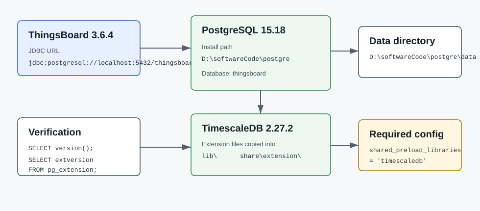

# Windows 安装 PostgreSQL 15 和 TimescaleDB

本文记录本机为 ThingsBoard 3.6.4 安装 PostgreSQL 与 TimescaleDB 的过程。安装目标是让 ThingsBoard 使用本地 PostgreSQL 数据库，并可选择启用 TimescaleDB 存储历史遥测数据。



## 版本选择

仓库中的 Docker 配置使用 PostgreSQL 15：

```yaml
postgres:
  image: "postgres:15"
```

本次安装选择：

| 组件 | 版本 | 说明 |
| --- | --- | --- |
| PostgreSQL | 15.18 | 与项目 `postgres:15` 主版本一致 |
| TimescaleDB | 2.27.2 | 使用对应 PostgreSQL 15 的 Windows 包 |
| 安装目录 | `D:\softwareCode\postgre` | PostgreSQL 程序、扩展、数据目录都放在这里 |
| 数据库 | `thingsboard` | 与 ThingsBoard 默认 JDBC 配置一致 |
| 用户/密码 | `postgres` / `postgres` | 与项目默认配置一致 |
| 端口 | `5432` | PostgreSQL 默认端口 |

官方下载地址：

- PostgreSQL Windows binaries: `https://get.enterprisedb.com/postgresql/postgresql-15.18-1-windows-x64-binaries.zip`
- TimescaleDB PG15 Windows package: `https://github.com/timescale/timescaledb/releases/latest/download/timescaledb-postgresql-15-windows-amd64.zip`

## 下载

```powershell
$downloadDir = 'D:\softwareCode\downloads\postgres-timescale'
New-Item -ItemType Directory -Force -Path $downloadDir | Out-Null

$pgUrl = 'https://get.enterprisedb.com/postgresql/postgresql-15.18-1-windows-x64-binaries.zip'
$tsUrl = 'https://github.com/timescale/timescaledb/releases/latest/download/timescaledb-postgresql-15-windows-amd64.zip'

Invoke-WebRequest -Uri $pgUrl -OutFile "$downloadDir\postgresql-15.18-1-windows-x64-binaries.zip" -UseBasicParsing
Invoke-WebRequest -Uri $tsUrl -OutFile "$downloadDir\timescaledb-postgresql-15-windows-amd64.zip" -UseBasicParsing
```

## 解压 PostgreSQL

PostgreSQL zip 顶层目录是 `pgsql`，解压后重命名为目标目录：

```powershell
$target = 'D:\softwareCode\postgre'
$downloadDir = 'D:\softwareCode\downloads\postgres-timescale'
$extractRoot = "$downloadDir\pg-extract"

Expand-Archive -LiteralPath "$downloadDir\postgresql-15.18-1-windows-x64-binaries.zip" -DestinationPath $extractRoot -Force
Move-Item -LiteralPath "$extractRoot\pgsql" -Destination $target
```

验证 PostgreSQL 版本：

```powershell
D:\softwareCode\postgre\bin\postgres.exe --version
```

期望输出：

```text
postgres (PostgreSQL) 15.18
```

## 安装 TimescaleDB 文件

先解压 TimescaleDB：

```powershell
$downloadDir = 'D:\softwareCode\downloads\postgres-timescale'
$tsExtract = "$downloadDir\timescaledb-extract"

Expand-Archive -LiteralPath "$downloadDir\timescaledb-postgresql-15-windows-amd64.zip" -DestinationPath $tsExtract -Force
```

复制扩展文件到 PostgreSQL 安装目录：

```powershell
$pgHome = 'D:\softwareCode\postgre'
$tsDir = 'D:\softwareCode\downloads\postgres-timescale\timescaledb-extract\timescaledb'

Get-ChildItem -LiteralPath $tsDir -Filter 'timescaledb*.dll' |
  Copy-Item -Destination "$pgHome\lib" -Force

Get-ChildItem -LiteralPath $tsDir -Filter 'timescaledb*.sql' |
  Copy-Item -Destination "$pgHome\share\extension" -Force

Copy-Item -LiteralPath "$tsDir\timescaledb.control" -Destination "$pgHome\share\extension" -Force
Copy-Item -LiteralPath "$tsDir\timescaledb-tune.exe" -Destination "$pgHome\bin" -Force
```

关键文件：

```text
D:\softwareCode\postgre\lib\timescaledb.dll
D:\softwareCode\postgre\lib\timescaledb-2.27.2.dll
D:\softwareCode\postgre\share\extension\timescaledb.control
D:\softwareCode\postgre\bin\timescaledb-tune.exe
```

## 初始化数据库目录

本次数据目录放在：

```text
D:\softwareCode\postgre\data
```

初始化命令：

```powershell
$pgHome = 'D:\softwareCode\postgre'
$dataDir = "$pgHome\data"
$pwFile = "$pgHome\postgres-password.txt"

Set-Content -LiteralPath $pwFile -Value 'postgres' -NoNewline -Encoding ASCII

& "$pgHome\bin\initdb.exe" `
  -D $dataDir `
  -U postgres `
  -A scram-sha-256 `
  --pwfile=$pwFile `
  -E UTF8 `
  --locale=C
```

## 配置 TimescaleDB 预加载

TimescaleDB 必须通过 `shared_preload_libraries` 预加载，否则 `CREATE EXTENSION timescaledb` 可能失败或后台 worker 无法启动。

向 `D:\softwareCode\postgre\data\postgresql.conf` 追加：

```conf
shared_preload_libraries = 'timescaledb'
listen_addresses = 'localhost'
port = 5432
```

PowerShell 命令：

```powershell
Add-Content -LiteralPath 'D:\softwareCode\postgre\data\postgresql.conf' -Value "
# TimescaleDB
shared_preload_libraries = 'timescaledb'
listen_addresses = 'localhost'
port = 5432
"
```

## 启动 PostgreSQL

```powershell
$pgHome = 'D:\softwareCode\postgre'
New-Item -ItemType Directory -Force -Path "$pgHome\logs" | Out-Null

& "$pgHome\bin\pg_ctl.exe" `
  -D "$pgHome\data" `
  -l "$pgHome\logs\postgresql.log" `
  start
```

检查服务是否可连接：

```powershell
D:\softwareCode\postgre\bin\pg_isready.exe -h localhost -p 5432 -U postgres
```

## 创建 ThingsBoard 数据库和 TimescaleDB 扩展

```powershell
$env:PGPASSWORD = 'postgres'
$pgHome = 'D:\softwareCode\postgre'

& "$pgHome\bin\createdb.exe" -h localhost -p 5432 -U postgres thingsboard

& "$pgHome\bin\psql.exe" `
  -h localhost `
  -p 5432 `
  -U postgres `
  -d thingsboard `
  -c "CREATE EXTENSION IF NOT EXISTS timescaledb CASCADE;"
```

验证扩展版本：

```powershell
$env:PGPASSWORD = 'postgres'

D:\softwareCode\postgre\bin\psql.exe `
  -h localhost `
  -p 5432 `
  -U postgres `
  -d thingsboard `
  -c "SELECT extname, extversion FROM pg_extension WHERE extname='timescaledb';"
```

期望输出：

```text
   extname   | extversion
-------------+------------
 timescaledb | 2.27.2
```

日志中应能看到 TimescaleDB worker 已加载：

```text
TimescaleDB background worker launcher connected to shared catalogs
```

## 启动和停止命令

启动：

```powershell
D:\softwareCode\postgre\bin\pg_ctl.exe -D D:\softwareCode\postgre\data -l D:\softwareCode\postgre\logs\postgresql.log start
```

停止：

```powershell
D:\softwareCode\postgre\bin\pg_ctl.exe -D D:\softwareCode\postgre\data stop
```

查看日志：

```powershell
Get-Content D:\softwareCode\postgre\logs\postgresql.log -Tail 80
```

## 注册 Windows 服务

当前普通 PowerShell 没有权限注册服务，执行时报：

```text
pg_ctl: could not open service manager
```

如需注册为 Windows 服务，请使用管理员 PowerShell：

```powershell
D:\softwareCode\postgre\bin\pg_ctl.exe register `
  -N postgresql-x64-15-thingsboard `
  -D D:\softwareCode\postgre\data `
  -l D:\softwareCode\postgre\logs\postgresql.log `
  -S auto
```

注册后可用服务命令管理：

```powershell
Start-Service postgresql-x64-15-thingsboard
Stop-Service postgresql-x64-15-thingsboard
Get-Service postgresql-x64-15-thingsboard
```

## ThingsBoard 连接配置

ThingsBoard 默认配置已经匹配这次安装：

```yaml
spring:
  datasource:
    driverClassName: org.postgresql.Driver
    url: jdbc:postgresql://localhost:5432/thingsboard
    username: postgres
    password: postgres
```

如需启用 TimescaleDB 作为历史遥测存储，设置：

```yaml
database:
  ts:
    type: timescale
```

环境变量方式：

```powershell
$env:DATABASE_TS_TYPE = 'timescale'
```

## 关键注意点

1. PostgreSQL 和 TimescaleDB 必须匹配 PostgreSQL 主版本。本次是 PostgreSQL 15，所以 TimescaleDB 必须使用 PG15 Windows 包。
2. `shared_preload_libraries = 'timescaledb'` 修改后必须重启 PostgreSQL。
3. `CREATE EXTENSION timescaledb` 要在业务数据库 `thingsboard` 中执行，不是只在 `postgres` 默认库里执行。
4. 端口 `5432` 如被占用，需要先停掉其他 PostgreSQL 实例，或修改 `postgresql.conf` 中的 `port`。
5. 当前安装是 zip 二进制安装，不是 EDB 图形安装器，因此不会自动注册 Windows 服务。
6. 密码文件 `D:\softwareCode\postgre\postgres-password.txt` 只用于初始化，正式环境建议删除或妥善保存。
7. 如果更改 `postgres` 密码，也要同步更新 ThingsBoard 的 `SPRING_DATASOURCE_PASSWORD`。
8. TimescaleDB 主要优化历史遥测表；ThingsBoard 的实体、关系、属性、最新值等仍然使用 PostgreSQL 普通表。

