# ThingsBoard 数据库实现视角讲 TimescaleDB

面向对象：Java 开发、Spring Boot 开发、MySQL 开发。

目标不是把你培养成 PostgreSQL DBA，而是让你能看懂 ThingsBoard 里这些模块的数据落库方案：

- Telemetry
- Attribute
- Alarm
- Device
- Rule Engine

本文基于当前工作区 `D:\projectSelf\thingsboard` 的代码和 SQL。注意这个版本里的关键事实：

- 历史遥测表是 `ts_kv`
- 最新遥测表是 `ts_kv_latest`
- 遥测 key 字典表是 `ts_kv_dictionary`
- 属性表 `attribute_kv.attribute_key` 是字符串，不是字典 ID
- TimescaleDB 只把 `ts_kv` 转成 hypertable
- `ts_kv_latest` 仍是普通 PostgreSQL 表
- TimescaleDB 写入 DAO 是 `TimescaleTimeseriesDao` + `TimescaleInsertTsRepository`

---

## 总览：ThingsBoard 整体架构图

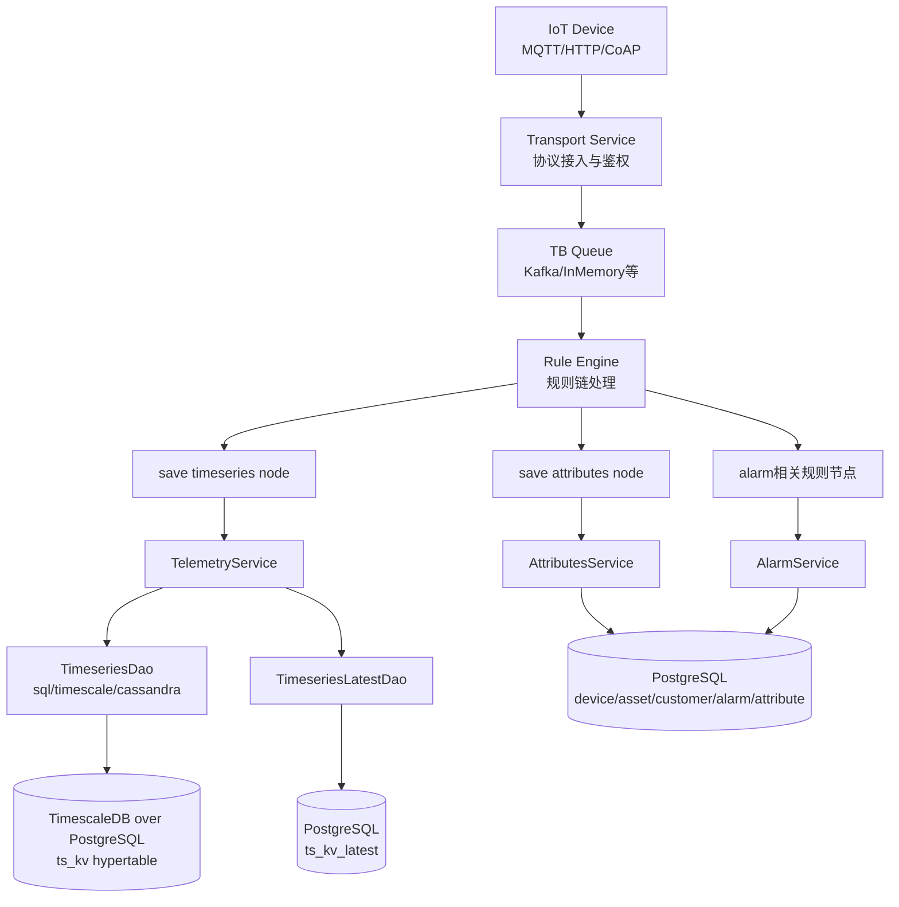

Java 开发视角看，ThingsBoard 的数据库层不是一个“大 SQL 文件”，而是一组 service/DAO 抽象：

- `TimeseriesService`：业务层看遥测读写。
- `TimeseriesDao`：历史遥测写入和查询，启用 TimescaleDB 时由 `TimescaleTimeseriesDao` 实现。
- `TimeseriesLatestDao`：最新遥测读写，落 `ts_kv_latest`。
- `AttributesService`：属性读写，落 `attribute_kv`。
- `AlarmService`：告警读写，落 `alarm` 和 `entity_alarm`。

---

# 阶段1：PostgreSQL 必备知识

只讲 ThingsBoard 会用到的部分。

## 1. PostgreSQL 在 ThingsBoard 里扮演什么角色

ThingsBoard 的数据库分两类数据：

| 数据类型 | 例子 | 表 | 访问特点 |
|---|---|---|---|
| 关系型元数据 | tenant、customer、device、asset、rule_chain、dashboard | `device`、`asset`、`customer` 等 | 按 ID、租户、名称查询，强事务，低中频写 |
| KV 属性 | 设备静态属性、服务端属性、共享属性 | `attribute_kv` | 按实体 + scope + key 查询，更新频率中等 |
| 历史遥测 | 温度、湿度、电压、电流曲线 | `ts_kv` | 写入量极大，按实体/key/时间范围查 |
| 最新遥测 | 最新温度、最新在线状态 | `ts_kv_latest` | 高频 upsert，按实体/key 快速读取 |
| 告警 | 高温告警、离线告警 | `alarm`、`entity_alarm` | 状态流转、列表检索、按实体关联 |

MySQL 开发容易用“业务表 + 明细表”的思路理解。ThingsBoard 更像：

- `device` 是设备档案。
- `attribute_kv` 是设备的配置/属性 KV。
- `ts_kv_latest` 是设备最新状态缓存表。
- `ts_kv` 是设备历史曲线明细表。
- `alarm` 是告警主表。
- `entity_alarm` 是实体到告警的关联表，用于快速查某个设备/资产有哪些告警。

## 2. PostgreSQL 和 MySQL 对开发最相关的差异

### 差异一：UUID 是一等类型

ThingsBoard 大量主键是 `uuid`：

```sql
CREATE TABLE IF NOT EXISTS device (
    id uuid NOT NULL CONSTRAINT device_pkey PRIMARY KEY,
    tenant_id uuid,
    customer_id uuid,
    device_profile_id uuid NOT NULL,
    name varchar(255),
    ...
);
```

Java 里对应 `java.util.UUID`。不要把它当 `varchar(36)` 使用。JPA/JdbcTemplate 会直接传 UUID。

### 差异二：JSON/JSONB 常用于扩展字段

当前表中：

- `device.device_data jsonb`
- `device_profile.profile_data jsonb`
- `ts_kv.json_v json`
- `attribute_kv.json_v json`

理解方式：

- `jsonb` 更适合要查询内部字段、索引、结构化配置的场景。
- `json` 更多只是保存原始 JSON 值。

ThingsBoard 的遥测 JSON 值通常不是拿来复杂检索的，检索主路径仍是 `entity_id + key + ts`。

### 差异三：`ON CONFLICT` 就是 PostgreSQL 的 upsert

对应 MySQL 的 `INSERT ... ON DUPLICATE KEY UPDATE`。

ThingsBoard 历史遥测写入：

```sql
INSERT INTO ts_kv (entity_id, key, ts, bool_v, str_v, long_v, dbl_v, json_v)
VALUES (?, ?, ?, ?, ?, ?, ?, cast(? AS json))
ON CONFLICT (entity_id, key, ts)
DO UPDATE SET bool_v = ?, str_v = ?, long_v = ?, dbl_v = ?, json_v = cast(? AS json);
```

含义：

- 同一个设备、同一个 key、同一个时间戳只能有一条值。
- 重复上报时覆盖值。
- 对 MQTT 重试、网络重复投递、规则链重复处理更友好。

### 差异四：批量写很重要

ThingsBoard 不会每来一个遥测点就同步执行一次 insert。它通过 `TbSqlBlockingQueueWrapper` 聚合批量写：

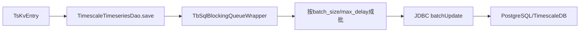

相关配置：

```yaml
sql:
  ts:
    batch_size: 10000
    batch_max_delay: 100
  ts_latest:
    batch_size: 1000
    batch_max_delay: 50
  timescale:
    chunk_time_interval: 604800000
    batch_threads: 3
```

开发理解即可：

- `batch_size` 越大，吞吐越好，但单批延迟和数据库瞬时压力更大。
- `batch_max_delay` 越小，延迟越低，但批量收益下降。
- `ts_kv` 和 `ts_kv_latest` 是两条写入链路。

### 差异五：连接池不是可选项

PostgreSQL 一个连接通常对应一个后端进程，比 MySQL 线程模型更重。ThingsBoard 默认：

```yaml
spring:
  datasource:
    hikari:
      maximumPoolSize: 16
```

如果你部署 10 个 ThingsBoard 节点，总连接数可能就是 `10 * 16`。百万设备场景里，不是连接越多越好，而是靠队列、批量、异步回调把数据库写入做平。

---

# 阶段2：TimescaleDB 核心知识

只讲 ThingsBoard 相关的 5 个概念。

## 1. Hypertable

Hypertable 是 TimescaleDB 对外暴露的“逻辑大表”。应用仍然写：

```sql
INSERT INTO ts_kv ...
SELECT ... FROM ts_kv ...
```

但 TimescaleDB 内部会把 `ts_kv` 拆成很多 chunk。

ThingsBoard 安装 TimescaleDB schema 时执行：

```java
executeQuery(
  "SELECT create_hypertable('ts_kv', 'ts', " +
  "chunk_time_interval => " + chunkTimeInterval + ", " +
  "if_not_exists => true);"
);
```

来自：

```text
application/src/main/java/org/thingsboard/server/service/install/TimescaleTsDatabaseSchemaService.java
```

## 2. Chunk

Chunk 是 hypertable 的真实分片表。ThingsBoard 的时间列是 `ts`，单位是毫秒。

默认配置：

```yaml
sql:
  timescale:
    chunk_time_interval: 604800000
```

`604800000 ms = 7 天`。

也就是说，默认情况下 TimescaleDB 会大致按 7 天一个时间段切 chunk。

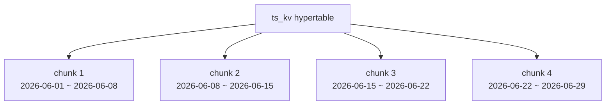

开发视角理解：

- 你写的是 `ts_kv`。
- TimescaleDB 自动判断这条数据的 `ts` 属于哪个 chunk。
- 查询最近 24 小时，只扫最近相关 chunk。
- 删除 90 天前数据，可以直接丢旧 chunk，比 `DELETE` 快得多。

## 3. Continuous Aggregate

Continuous Aggregate 是“持续维护的物化聚合”。

例如原始数据每秒一条，但仪表盘只看每小时平均温度：

```sql
SELECT time_bucket(3600000, ts) AS bucket,
       avg(dbl_v)
FROM ts_kv
WHERE ...
GROUP BY bucket;
```

如果每次都扫原始 `ts_kv`，数据量大时会慢。Continuous Aggregate 可以提前把“每小时平均值”算好。

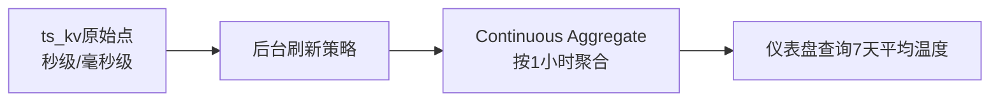

当前 ThingsBoard 仓库没有直接创建 Continuous Aggregate。你可以把它理解成生产二次优化手段：

- ThingsBoard 默认用 `time_bucket` 即时聚合。
- 当最近 7 天、30 天、90 天聚合报表很重时，可以为固定粒度建立 continuous aggregate。

## 4. Compression

Compression 是把历史 chunk 压缩。对 IoT 来说，最近数据热、历史数据冷：

- 最近 1 天：频繁写、频繁查，不能压缩。
- 7 天前：基本不更新，只做报表查询，可以压缩。

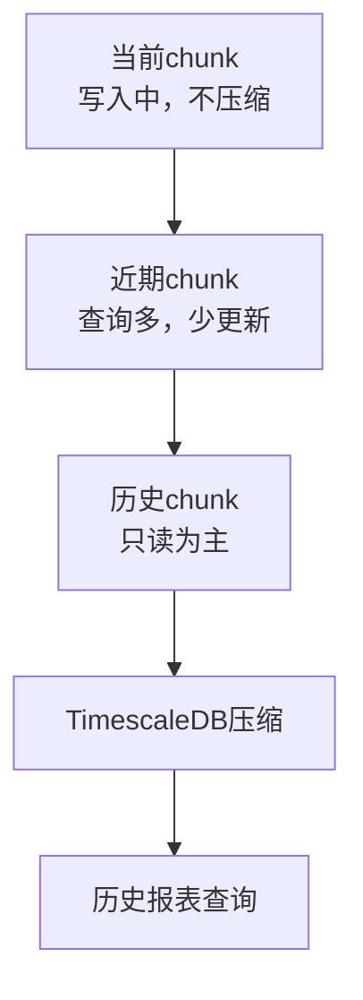

开发视角理解：

- 压缩不是为了当前写入更快。
- 压缩是为了历史数据更省磁盘，历史聚合读更少 IO。
- 被压缩的 chunk 不适合频繁更新/删除。

## 5. Retention

Retention 是数据保留策略，比如只保留 90 天遥测。

MySQL 思维常见写法：

```sql
DELETE FROM ts_kv WHERE ts < 某个时间;
```

大规模时序数据里，这会非常痛苦，因为它是逐行删除。

TimescaleDB 推荐：

```sql
SELECT add_retention_policy('ts_kv', INTERVAL '90 days');
```

底层效果是：旧 chunk 到期后直接 drop。

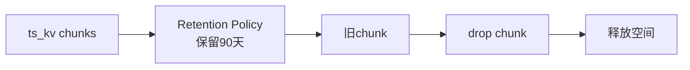

当前 ThingsBoard schema 里还保留了 `cleanup_timeseries_by_ttl` 存储过程，会按租户/客户 TTL 去 `DELETE ts_kv`。百万设备场景下，建议优先让业务 TTL 与 chunk retention 对齐，尽量减少逐行 delete。

---

# 阶段3：ThingsBoard 数据模型

## 1. Device 表

表结构核心：

```sql
CREATE TABLE IF NOT EXISTS device (
    id uuid NOT NULL CONSTRAINT device_pkey PRIMARY KEY,
    created_time bigint NOT NULL,
    additional_info varchar,
    customer_id uuid,
    device_profile_id uuid NOT NULL,
    device_data jsonb,
    type varchar(255),
    name varchar(255),
    label varchar(255),
    tenant_id uuid,
    firmware_id uuid,
    software_id uuid,
    external_id uuid,
    CONSTRAINT device_name_unq_key UNIQUE (tenant_id, name),
    CONSTRAINT fk_device_profile FOREIGN KEY (device_profile_id) REFERENCES device_profile(id)
);
```

设计思想：

- `id` 是设备全局 ID，也是遥测表里的 `entity_id`。
- `tenant_id + name` 唯一，说明设备名在租户下唯一。
- `customer_id` 表示设备分配给哪个客户。
- `device_profile_id` 决定设备协议、规则、默认队列、告警规则等 profile 行为。
- `device_data jsonb` 保存扩展结构，不频繁作为主查询条件。

和 MySQL 项目类比：

- `device` 类似设备主表。
- 不把温度、湿度、电压列放进 `device`。
- 当前状态放 `ts_kv_latest`。
- 历史曲线放 `ts_kv`。

## 2. Asset 表

```sql
CREATE TABLE IF NOT EXISTS asset (
    id uuid NOT NULL CONSTRAINT asset_pkey PRIMARY KEY,
    created_time bigint NOT NULL,
    additional_info varchar,
    customer_id uuid,
    asset_profile_id uuid NOT NULL,
    name varchar(255),
    label varchar(255),
    tenant_id uuid,
    type varchar(255),
    external_id uuid,
    CONSTRAINT asset_name_unq_key UNIQUE (tenant_id, name)
);
```

Asset 是资产、区域、产线、楼宇、机房等业务对象。

设计思想：

- Device 是真实接入数据的设备。
- Asset 是业务建模对象，可以和 Device 建关系。
- Asset 也可以有遥测，遥测仍写 `ts_kv`，只是 `entity_id = asset.id`。

## 3. Customer 表

```sql
CREATE TABLE IF NOT EXISTS customer (
    id uuid NOT NULL CONSTRAINT customer_pkey PRIMARY KEY,
    created_time bigint NOT NULL,
    tenant_id uuid,
    title varchar(255),
    email varchar(255),
    phone varchar(255),
    ...
);
```

Customer 是租户下的客户/组织，用于隔离设备和仪表盘访问。

设备表和资产表都有：

```sql
customer_id uuid
```

查询某客户下设备列表时，主路径是：

```sql
SELECT *
FROM device
WHERE tenant_id = ?
  AND customer_id = ?;
```

## 4. ts_kv：历史遥测表

TimescaleDB schema：

```sql
CREATE TABLE IF NOT EXISTS ts_kv (
    entity_id uuid NOT NULL,
    key int NOT NULL,
    ts bigint NOT NULL,
    bool_v boolean,
    str_v varchar(10000000),
    long_v bigint,
    dbl_v double precision,
    json_v json,
    CONSTRAINT ts_kv_pkey PRIMARY KEY (entity_id, key, ts)
);
```

设计思想：

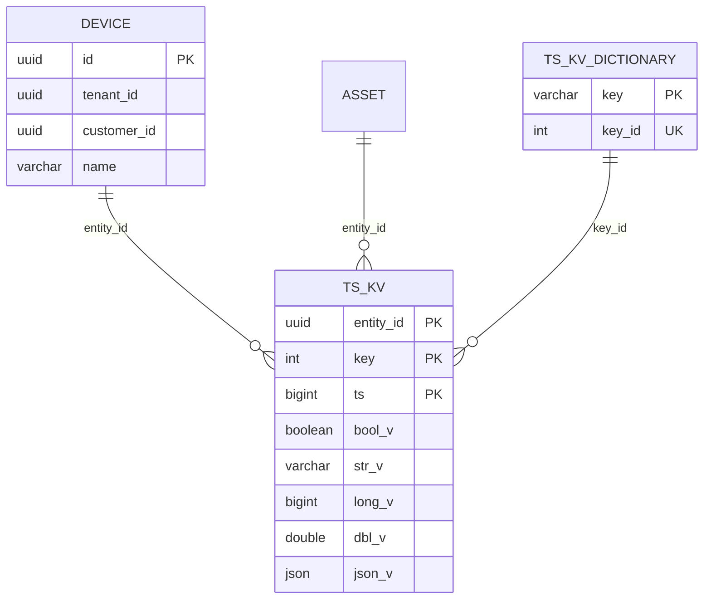

为什么这样设计：

- 一个遥测点只会有一种值类型，所以拆成 `bool_v/str_v/long_v/dbl_v/json_v`。
- `key` 用 int 而不是字符串，减少历史表体积和索引体积。
- 主键 `(entity_id, key, ts)` 非常适合 ThingsBoard 最常见查询：某设备、某指标、某时间范围。
- `ts` 是 TimescaleDB 分 chunk 的时间列。

例子：

设备 A 上报：

```json
{
  "temperature": 26.5,
  "humidity": 61
}
```

落库会变成两行：

| entity_id | key | ts | dbl_v | long_v |
|---|---:|---:|---:|---:|
| deviceA | temperature 的 key_id | 1710000000000 | 26.5 | null |
| deviceA | humidity 的 key_id | 1710000000000 | null | 61 |

## 5. ts_kv_dictionary：遥测 key 字典

```sql
CREATE TABLE IF NOT EXISTS ts_kv_dictionary (
    key varchar(255) NOT NULL,
    key_id serial UNIQUE,
    CONSTRAINT ts_key_id_pkey PRIMARY KEY (key)
);
```

用途：

- `temperature`、`humidity`、`battery` 这种字符串只存一次。
- `ts_kv.key` 存 int。
- 历史大表更小，索引更小。

在 DAO 中，写入前会调用类似 `getOrSaveKeyId(strKey)` 的逻辑。

## 6. ts_kv_latest：最新遥测表

```sql
CREATE TABLE IF NOT EXISTS ts_kv_latest (
    entity_id uuid NOT NULL,
    key int NOT NULL,
    ts bigint NOT NULL,
    bool_v boolean,
    str_v varchar(10000000),
    long_v bigint,
    dbl_v double precision,
    json_v json,
    CONSTRAINT ts_kv_latest_pkey PRIMARY KEY (entity_id, key)
);
```

设计思想：

- `ts_kv` 是历史曲线。
- `ts_kv_latest` 是最新状态缓存。
- 查“设备当前温度”不要扫 `ts_kv order by ts desc limit 1`，而是直接查 `ts_kv_latest`。

写入 SQL 逻辑：

```sql
INSERT INTO ts_kv_latest (...)
VALUES (...)
ON CONFLICT (entity_id, key)
DO UPDATE SET ...
WHERE ts_kv_latest.ts <= ?;
```

含义：

- 同一个设备同一个 key 只有一条最新值。
- 如果新数据时间戳比旧数据还老，则不覆盖最新值。
- 对乱序设备上报很重要。

## 7. attribute_kv：属性表

```sql
CREATE TABLE IF NOT EXISTS attribute_kv (
  entity_type varchar(255),
  entity_id uuid,
  attribute_type varchar(255),
  attribute_key varchar(255),
  bool_v boolean,
  str_v varchar(10000000),
  long_v bigint,
  dbl_v double precision,
  json_v json,
  last_update_ts bigint,
  CONSTRAINT attribute_kv_pkey PRIMARY KEY (entity_type, entity_id, attribute_type, attribute_key)
);
```

Attribute 和 Telemetry 的区别：

| 类型 | 表 | 例子 | 特点 |
|---|---|---|---|
| Telemetry | `ts_kv` / `ts_kv_latest` | 温度、电压、转速 | 按时间持续产生 |
| Attribute | `attribute_kv` | 固件版本、阈值、位置、配置 | 当前配置或相对稳定状态 |

`attribute_type` 表示属性作用域，例如：

- server attributes
- client attributes
- shared attributes

Java 开发理解：

- Telemetry 像“时间序列日志”。
- Attribute 像“设备配置 KV 表”。

## 8. alarm 与 entity_alarm

告警主表：

```sql
CREATE TABLE IF NOT EXISTS alarm (
    id uuid NOT NULL CONSTRAINT alarm_pkey PRIMARY KEY,
    created_time bigint NOT NULL,
    ack_ts bigint,
    clear_ts bigint,
    additional_info varchar,
    end_ts bigint,
    originator_id uuid,
    originator_type integer,
    severity varchar(255),
    start_ts bigint,
    tenant_id uuid,
    customer_id uuid,
    type varchar(255),
    acknowledged boolean,
    cleared boolean
);
```

实体告警关联表：

```sql
CREATE TABLE IF NOT EXISTS entity_alarm (
    tenant_id uuid NOT NULL,
    entity_type varchar(32),
    entity_id uuid NOT NULL,
    created_time bigint NOT NULL,
    alarm_type varchar(255) NOT NULL,
    customer_id uuid,
    alarm_id uuid,
    CONSTRAINT entity_alarm_pkey PRIMARY KEY (entity_id, alarm_id),
    CONSTRAINT fk_entity_alarm_id FOREIGN KEY (alarm_id) REFERENCES alarm(id) ON DELETE CASCADE
);
```

设计思想：

- `alarm` 存告警本体：类型、严重级别、开始/结束、确认/清除状态。
- `entity_alarm` 存“哪个实体关联了哪个告警”，方便按设备/资产查告警列表。
- 告警可能传播到 owner、tenant 或关联实体，所以需要单独关联表。

---

# 阶段4：设备数据上报全过程

路径：

```text
MQTT 设备
↓
ThingsBoard Transport
↓
Queue
↓
Rule Engine
↓
save timeseries node
↓
TelemetryService
↓
TimescaleTimeseriesDao
↓
TimescaleDB ts_kv
```

## MQTT 消息处理流程图

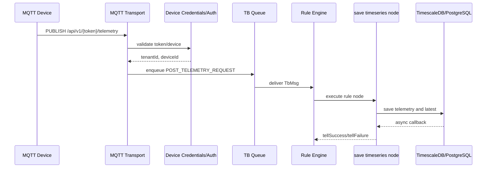

## Rule Engine save timeseries 节点做了什么

代码：

```text
rule-engine/rule-engine-components/src/main/java/org/thingsboard/rule/engine/telemetry/TbMsgTimeseriesNode.java
```

核心逻辑：

1. 只接受 `POST_TELEMETRY_REQUEST`。
2. 从 metadata 或服务器时间计算 `ts`。
3. 把 JSON 消息转成 `Map<Long, List<KvEntry>>`。
4. 转成 `List<TsKvEntry>`。
5. 读取 TTL。
6. 根据 `skipLatestPersistence` 决定是否写 `ts_kv_latest`。
7. 调用 `ctx.getTelemetryService().saveAndNotify(...)` 或 `saveWithoutLatestAndNotify(...)`。

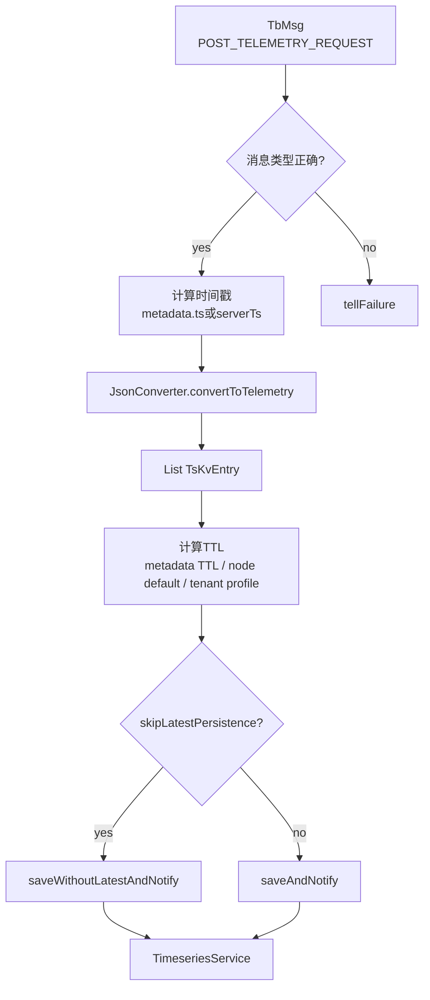

## Telemetry 存储流程图

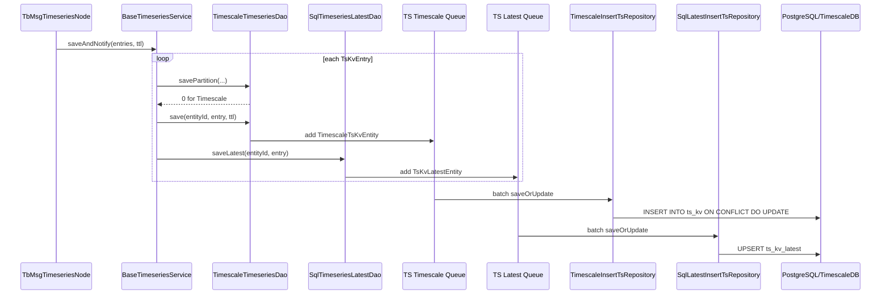

TimescaleDB 存储结构图：

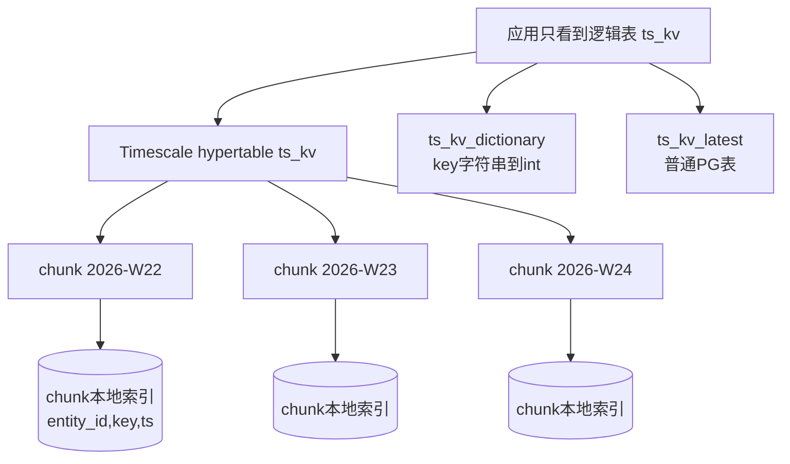

---

# 阶段5：典型查询

下面 SQL 是帮助你理解数据库结构的“等价 SQL”。ThingsBoard 实际代码可能通过 JPA NamedQuery、Repository、Service 封装执行。

## 1. 查询设备最新温度

业务目标：

```text
deviceId = ?
key = temperature
```

SQL：

```sql
SELECT l.entity_id,
       d.key AS telemetry_key,
       l.ts,
       l.dbl_v AS temperature
FROM ts_kv_latest l
JOIN ts_kv_dictionary d ON l.key = d.key_id
WHERE l.entity_id = :device_id
  AND d.key = 'temperature';
```

为什么查 `ts_kv_latest`：

- 主键是 `(entity_id, key)`。
- 一次索引定位即可拿最新值。
- 不需要从历史表 `ts_kv` 排序。

## 2. 查询设备最近 24 小时温度曲线

```sql
SELECT t.ts,
       t.dbl_v AS temperature
FROM ts_kv t
JOIN ts_kv_dictionary d ON t.key = d.key_id
WHERE t.entity_id = :device_id
  AND d.key = 'temperature'
  AND t.ts >= :now_ms - 24 * 60 * 60 * 1000
  AND t.ts < :now_ms
ORDER BY t.ts ASC;
```

ThingsBoard 的 repository 主路径更接近：

```sql
SELECT *
FROM ts_kv
WHERE entity_id = :entityId
  AND key = :entityKey
  AND ts >= :startTs
  AND ts < :endTs
ORDER BY ts ASC
LIMIT :limit;
```

`entityKey` 是先从 `ts_kv_dictionary` 找到的 int。

## 3. 查询设备最近 7 天平均温度

如果按小时聚合：

```sql
SELECT time_bucket(3600000, t.ts, :start_ts) AS bucket_ts,
       avg(t.dbl_v) AS avg_temperature
FROM ts_kv t
JOIN ts_kv_dictionary d ON t.key = d.key_id
WHERE t.entity_id = :device_id
  AND d.key = 'temperature'
  AND t.ts >= :start_ts
  AND t.ts < :end_ts
  AND t.dbl_v IS NOT NULL
GROUP BY bucket_ts
ORDER BY bucket_ts;
```

当前代码里的 `AggregationRepository` 会使用 `time_bucket(:timeBucket, tskv.ts, :startTs)`，并对 `long_v`、`dbl_v` 分别聚合。

Java 开发理解：

- `time_bucket` 类似按时间窗口 `group by`。
- `3600000` 表示 1 小时，单位跟 `ts` 一致，也就是毫秒。
- TimescaleDB 会先做 chunk pruning，再在相关 chunk 上聚合。

## 4. 查询告警设备列表

查某租户下未清除严重告警，并关联设备：

```sql
SELECT d.id AS device_id,
       d.name AS device_name,
       a.id AS alarm_id,
       a.type AS alarm_type,
       a.severity,
       a.start_ts,
       a.acknowledged,
       a.cleared
FROM entity_alarm ea
JOIN alarm a ON ea.alarm_id = a.id
JOIN device d ON ea.entity_id = d.id
WHERE ea.tenant_id = :tenant_id
  AND ea.entity_type = 'DEVICE'
  AND a.cleared = false
ORDER BY a.start_ts DESC
LIMIT 100;
```

为什么有 `entity_alarm`：

- 告警不一定只属于 originator。
- 告警可能传播到关联资产、客户、租户。
- 用关联表可以快速查“某实体有哪些告警”。

---

# 阶段6：性能优化：百万设备，每天 10 亿条遥测数据

先量化：

```text
10 亿条/天
= 11,574 条/秒平均
如果有高峰 5 倍，就是 5~6 万条/秒
如果每条 MQTT 消息包含 10 个 key，消息数约为点数的 1/10
```

TimescaleDB 能支撑的前提不是“装上扩展就行”，而是 ThingsBoard、队列、批量写、表设计、chunk、索引、retention 一起配合。

## 1. 写入链路优化

核心链路：

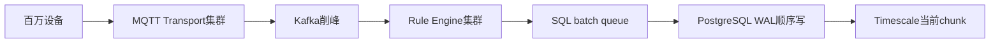

关键点：

- MQTT 接入层要横向扩展。
- Rule Engine 要通过队列削峰。
- SQL 写入必须 batch。
- `ts_kv` 写入要尽量追加，不要大量更新历史。
- `ts_kv_latest` 是高频 upsert 表，可能比历史表更容易成为锁/膨胀热点。

## 2. Chunk 设计

默认 7 天一个 chunk。如果每天 10 亿条：

```text
7 天 chunk = 70 亿行级别
```

这通常太大。更合理的方向：

- 1 天一个 chunk，甚至更短。
- 让单 chunk 的数据量、索引大小、压缩、retention 都可控。
- chunk 太小也不行，会让 chunk 数过多，查询规划成本上升。

Chunk 分区示意图：

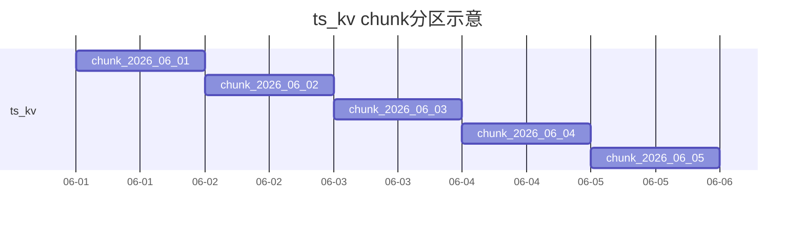

## 3. 索引策略

`ts_kv` 主键：

```sql
PRIMARY KEY (entity_id, key, ts)
```

适合：

- 单设备
- 单 key
- 时间范围

不适合：

- 查询所有设备的 temperature
- 查询某租户下所有设备最近 1 小时平均值

如果业务有全局聚合需求，要谨慎新增索引或设计汇总表。每加一个索引，10 亿/天的写入都会多维护一次索引。

## 4. 最新值表优化

`ts_kv_latest` 是普通 PostgreSQL 表，高频 upsert：

```sql
PRIMARY KEY (entity_id, key)
```

风险：

- 同一设备同一 key 高频更新，会不断产生旧版本。
- PostgreSQL 需要 autovacuum 清理。
- 表和索引可能膨胀。

开发侧建议：

- 不需要最新值的场景启用 `skipLatestPersistence`。
- 对纯历史数据导入，使用 `saveWithoutLatest` 类路径。
- 避免同一设备同一 key 毫秒级疯狂更新最新表。

## 5. Retention 优先 drop chunk

每天 10 亿条时，不建议靠：

```sql
DELETE FROM ts_kv WHERE ts < ...
```

优先：

```sql
SELECT add_retention_policy('ts_kv', INTERVAL '90 days');
```

如果不同租户 TTL 完全不同，才考虑应用层/存储过程删除，但要接受 vacuum 成本。

## 6. Continuous Aggregate 支撑报表

最近 7 天平均温度，如果每次都扫原始点：

```text
7天 * 10亿/天 = 70亿行候选数据
```

即使按设备/key过滤后少很多，海量仪表盘同时查询也会打爆数据库。

Continuous Aggregate 工作流程图：

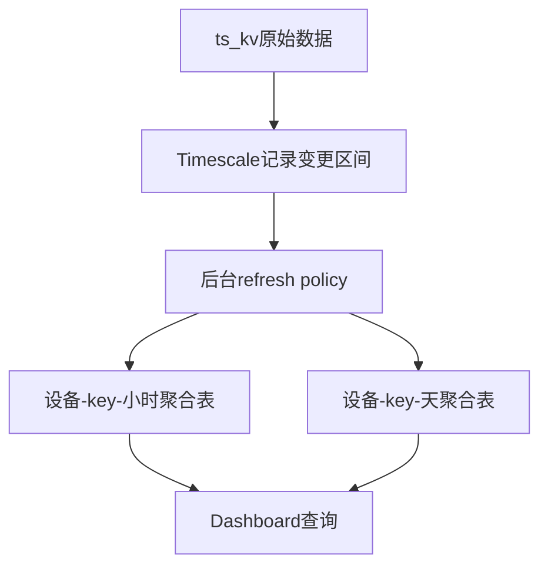

建议：

- 实时曲线查原始 `ts_kv`。
- 7 天、30 天报表查 continuous aggregate。
- 仪表盘默认粒度要限制，不允许无限小 interval 查询超长时间范围。

## 7. Compression 降低历史成本

策略：

- 当前 chunk 不压缩。
- 1~7 天内按业务需要不压缩。
- 7 天前 chunk 压缩。
- 90 天后 retention drop。

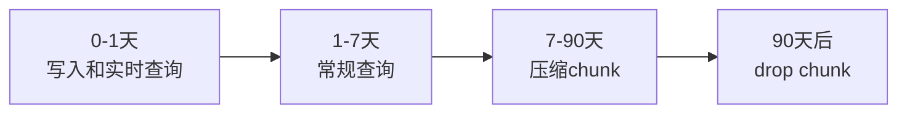

## 8. 大规模部署建议

| 层 | 优化方向 |
|---|---|
| MQTT Transport | 多节点，连接分散，限流 |
| Queue | Kafka 削峰，监控 lag |
| Rule Engine | 多节点，多队列，避免慢规则阻塞 |
| SQL Batch | 调整 `sql.ts.batch_size`、`batch_max_delay`、`timescale.batch_threads` |
| PostgreSQL/TimescaleDB | NVMe、足够 WAL 空间、合理 chunk、retention、compression |
| 查询层 | 最新值查 `ts_kv_latest`，曲线查 `ts_kv`，报表查 continuous aggregate |

---

# 最后：六张核心 Mermaid 图汇总

## 1. ThingsBoard 整体架构图

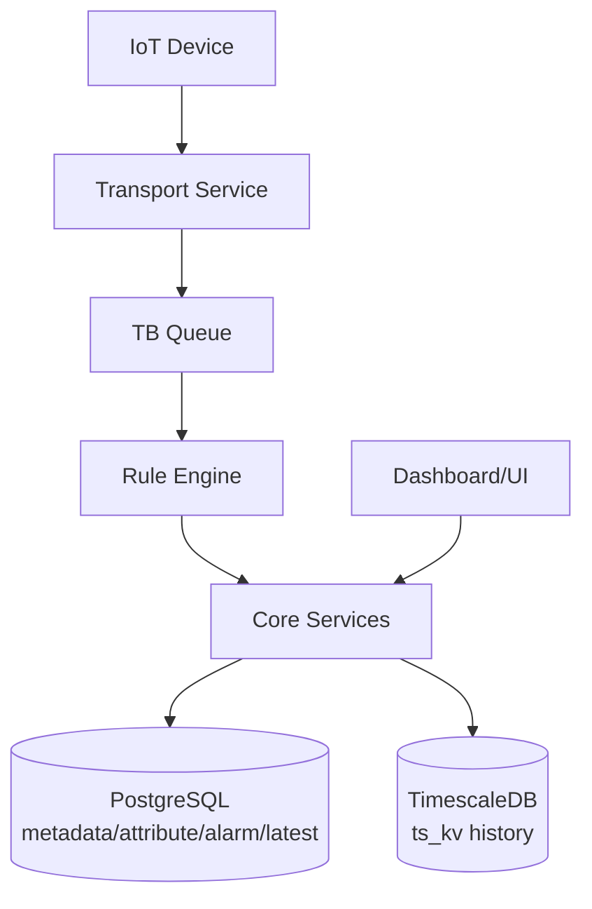

## 2. MQTT 消息处理流程图

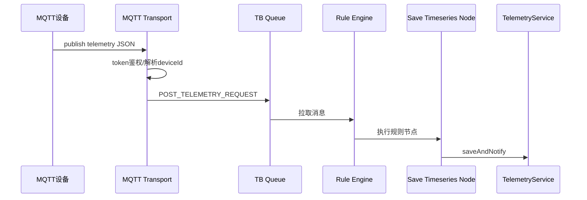

## 3. Telemetry 存储流程图

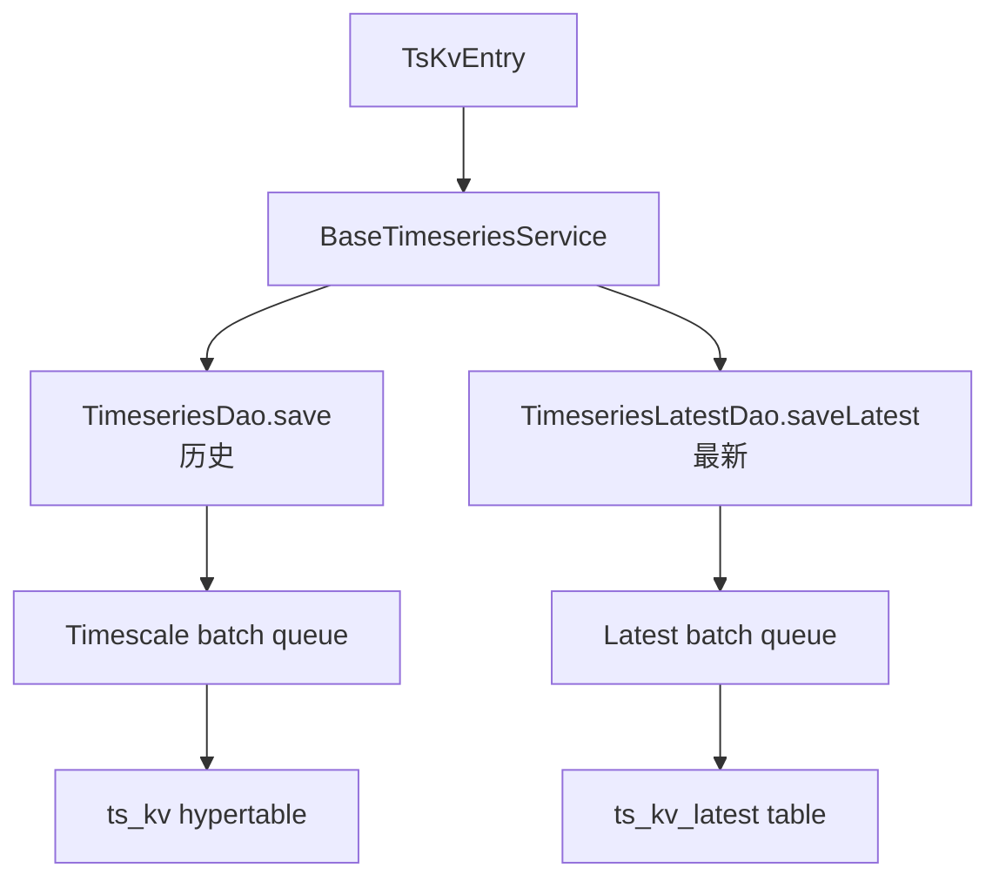

## 4. TimescaleDB 存储结构图

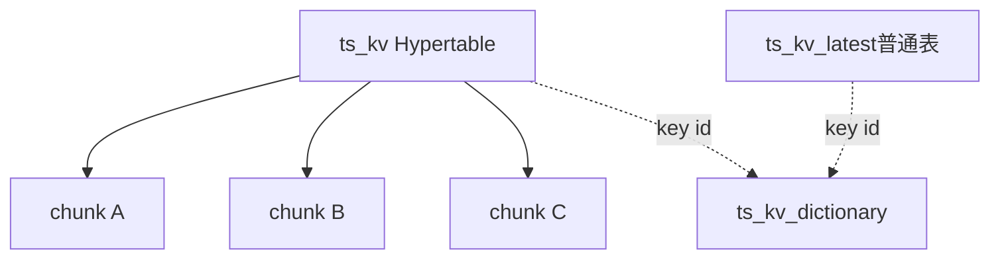

## 5. Continuous Aggregate 工作流程图

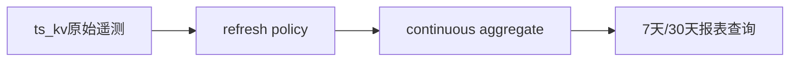

## 6. Chunk 分区示意图

```mermaid
flowchart LR
  D1[Day 1 Chunk]
  D2[Day 2 Chunk]
  D3[Day 3 Chunk]
  D4[Day 4 Chunk]
  Query[查询最近24小时]

  D1 --> D2 --> D3 --> D4
  Query --> D4
```

