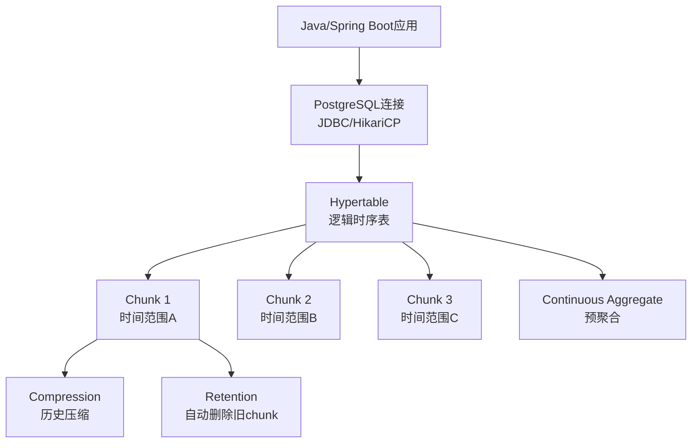
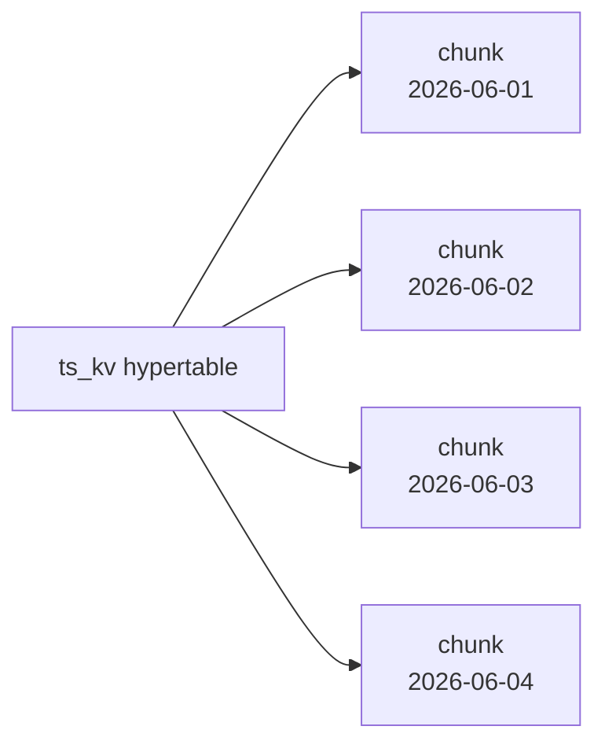
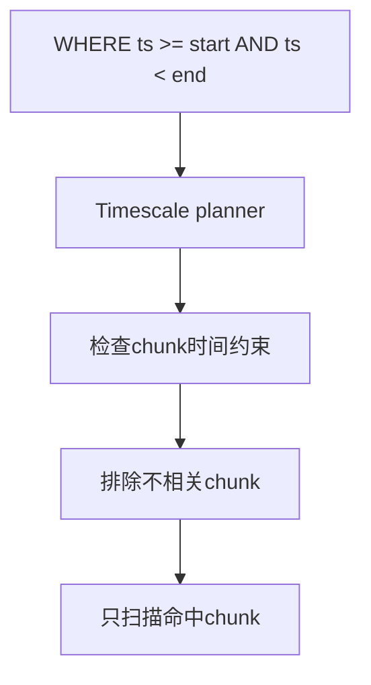
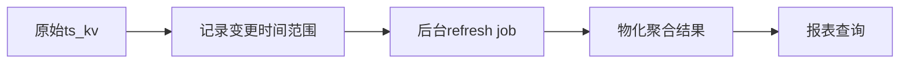
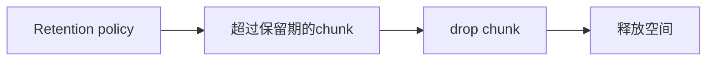

# TimescaleDB 快速入门：给 Java / Spring Boot / MySQL 开发者

这份文档只讲你在 ThingsBoard 或 IoT 项目里马上会用到的 TimescaleDB。

你可以把 TimescaleDB 理解成：

```text
PostgreSQL + 时序表自动分片 + 时序函数 + 历史压缩 + 自动清理 + 持续聚合
```

它不是替代 PostgreSQL 的独立数据库。Java 代码仍然用 JDBC、JPA、JdbcTemplate、HikariCP 连 PostgreSQL。

---

## 1. 什么时候需要 TimescaleDB

适合：

- 设备遥测
- 指标监控
- 能耗曲线
- 温度/湿度/电压/电流
- 日志型时间数据中的结构化数值
- 高频写入 + 时间范围查询

不适合只靠 TimescaleDB 解决：

- 全文搜索
- 复杂倒排检索
- 任意标签组合高维分析
- 没有时间列的普通业务表
- 大量随机更新的 OLTP 主表

在 ThingsBoard 里，TimescaleDB 主要服务 `ts_kv` 历史遥测表。

---

## 2. 核心概念一张图



---

## 3. 安装扩展

数据库里启用：

```sql
CREATE EXTENSION IF NOT EXISTS timescaledb CASCADE;
```

Java 应用不需要特殊驱动，仍然使用 PostgreSQL JDBC：

```yaml
spring:
  datasource:
    driverClassName: org.postgresql.Driver
    url: jdbc:postgresql://localhost:5432/thingsboard
```

---

## 4. 创建普通表

先创建 PostgreSQL 普通表：

```sql
CREATE TABLE ts_kv (
  entity_id uuid NOT NULL,
  key int NOT NULL,
  ts bigint NOT NULL,
  bool_v boolean,
  str_v varchar(10000000),
  long_v bigint,
  dbl_v double precision,
  json_v json,
  PRIMARY KEY (entity_id, key, ts)
);
```

这里 `ts` 是时间列。ThingsBoard 使用毫秒时间戳 `bigint`。

---

## 5. 转成 Hypertable

```sql
SELECT create_hypertable(
  'ts_kv',
  'ts',
  chunk_time_interval => 86400000,
  if_not_exists => true
);
```

含义：

- 表名：`ts_kv`
- 时间列：`ts`
- chunk 间隔：`86400000 ms = 1 天`

ThingsBoard 当前配置默认：

```yaml
sql:
  timescale:
    chunk_time_interval: 604800000
```

也就是 7 天。

---

## 6. Chunk 是什么

Chunk 是 TimescaleDB 自动创建的真实分片表。



你不需要手工 insert 到 chunk。

应用仍然写：

```sql
INSERT INTO ts_kv (...)
VALUES (...);
```

TimescaleDB 会根据 `ts` 路由到对应 chunk。

---

## 7. 写入数据

```sql
INSERT INTO ts_kv(entity_id, key, ts, dbl_v)
VALUES ('018f0d3c-7f00-7000-9000-000000000001', 1, 1710000000000, 26.5)
ON CONFLICT (entity_id, key, ts)
DO UPDATE SET dbl_v = EXCLUDED.dbl_v;
```

MySQL 对照：

```sql
INSERT ... ON DUPLICATE KEY UPDATE ...
```

PostgreSQL/TimescaleDB 对照：

```sql
INSERT ... ON CONFLICT (...) DO UPDATE ...
```

---

## 8. 查询最近 24 小时曲线

```sql
SELECT ts, dbl_v
FROM ts_kv
WHERE entity_id = '018f0d3c-7f00-7000-9000-000000000001'
  AND key = 1
  AND ts >= 1710000000000
  AND ts < 1710086400000
ORDER BY ts ASC;
```

重要规则：

一定要带时间范围。

这样 TimescaleDB 才能排除无关 chunk。



---

## 9. 使用 time_bucket 聚合

按小时平均：

```sql
SELECT time_bucket(3600000, ts) AS bucket,
       avg(dbl_v) AS avg_value
FROM ts_kv
WHERE entity_id = '018f0d3c-7f00-7000-9000-000000000001'
  AND key = 1
  AND ts >= 1710000000000
  AND ts < 1710604800000
GROUP BY bucket
ORDER BY bucket;
```

开发理解：

```text
time_bucket = 按固定时间窗口 group by
```

如果你的时间列是 `timestamptz`，会写成：

```sql
SELECT time_bucket('1 hour', time_column), avg(value)
FROM metrics
GROUP BY 1;
```

ThingsBoard 的 `ts` 是 bigint 毫秒，所以它用数值 bucket。

---

## 10. Continuous Aggregate

适用场景：

- 最近 7 天平均值
- 最近 30 天趋势
- 每小时/每天统计
- 仪表盘频繁重复查询

示例：

```sql
CREATE MATERIALIZED VIEW ts_kv_hourly_avg
WITH (timescaledb.continuous) AS
SELECT entity_id,
       key,
       time_bucket(3600000, ts) AS bucket,
       avg(dbl_v) AS avg_dbl_v,
       max(ts) AS max_ts
FROM ts_kv
WHERE dbl_v IS NOT NULL
GROUP BY entity_id, key, bucket;
```

添加刷新策略：

```sql
SELECT add_continuous_aggregate_policy(
  'ts_kv_hourly_avg',
  start_offset => 7 * 86400000,
  end_offset => 60000,
  schedule_interval => 60000
);
```

说明：

- `start_offset`：刷新最近多长时间内的数据。
- `end_offset`：避开最新还在乱序到达的数据。
- `schedule_interval`：后台多久刷新一次。

工作流程：



---

## 11. Compression

启用压缩的一般思路：

```sql
ALTER TABLE ts_kv SET (
  timescaledb.compress,
  timescaledb.compress_segmentby = 'entity_id,key',
  timescaledb.compress_orderby = 'ts DESC'
);
```

添加压缩策略：

```sql
SELECT add_compression_policy('ts_kv', 7 * 86400000);
```

含义：

- 7 天前的 chunk 自动压缩。
- 按 `entity_id,key` 分段。
- 每段内部按 `ts DESC` 排列。

注意：

- 压缩适合历史冷数据。
- 当前正在写入的 chunk 不要压缩。
- 压缩后更新/删除成本更高。

---

## 12. Retention

保留 90 天：

```sql
SELECT add_retention_policy('ts_kv', 90 * 86400000);
```

如果使用 `timestamptz` 时间列：

```sql
SELECT add_retention_policy('metrics', INTERVAL '90 days');
```

工作方式：



为什么比 DELETE 好：

| 方式 | 行为 | 大数据量影响 |
|---|---|---|
| `DELETE WHERE ts < ...` | 逐行删除 | 慢，产生大量 dead tuple |
| `drop_chunks` / retention | 删除整块 chunk | 快，空间释放直接 |

---

## 13. Java/Spring Boot 使用方式

没有特殊 API。

JdbcTemplate：

```java
jdbcTemplate.batchUpdate(
    "INSERT INTO ts_kv(entity_id, key, ts, dbl_v) VALUES (?, ?, ?, ?) " +
    "ON CONFLICT (entity_id, key, ts) DO UPDATE SET dbl_v = EXCLUDED.dbl_v",
    batchPreparedStatementSetter
);
```

JPA：

- 普通实体映射可以用。
- 高频批量写建议优先 JdbcTemplate batch。
- 不要对海量遥测逐条 `repository.save()`。

HikariCP：

- 控制连接数。
- 用批量写提高吞吐。
- 不靠无限加连接提升性能。

---

## 14. 和 MySQL 分区表的区别

| 维度 | MySQL 分区表 | TimescaleDB Hypertable |
|---|---|---|
| 创建分区 | 多数需要手工规划 | 自动创建 chunk |
| 查询裁剪 | 依赖分区条件 | Timescale planner 自动 chunk pruning |
| 时序函数 | 普通 SQL 函数有限 | `time_bucket`、continuous aggregate |
| Retention | 常手工 drop partition | retention policy 自动 drop chunk |
| 压缩 | 依赖存储/版本能力 | chunk 级压缩策略 |

---

## 15. ThingsBoard 中怎么启用 TimescaleDB

概念上需要：

```yaml
database:
  ts:
    type: timescale
```

历史遥测 DAO 会切到：

```text
TimescaleTimeseriesDao
```

安装 schema 时会：

```sql
CREATE EXTENSION IF NOT EXISTS timescaledb CASCADE;
SELECT create_hypertable('ts_kv', 'ts', chunk_time_interval => ...);
```

最新遥测仍然是：

```text
ts_kv_latest
```

这点很重要：TimescaleDB 主要优化历史曲线，不是替代所有表。

---

## 16. 常见错误

### 错误一：没有时间范围

不推荐：

```sql
SELECT *
FROM ts_kv
WHERE entity_id = ?
  AND key = ?;
```

推荐：

```sql
SELECT *
FROM ts_kv
WHERE entity_id = ?
  AND key = ?
  AND ts >= ?
  AND ts < ?;
```

### 错误二：chunk 太大

每天 10 亿条数据时，7 天一个 chunk 可能过大。

应该按数据量重新计算 chunk interval。

### 错误三：用 DELETE 做海量 TTL

尽量用 retention/drop chunk。

### 错误四：给历史表加太多索引

每个索引都会影响写入。10 亿条/天时，一个额外索引就是 10 亿次额外索引维护。

### 错误五：把 latest 查询打到历史表

当前值查 `ts_kv_latest`，不要查 `ts_kv ORDER BY ts DESC LIMIT 1`。

---

## 17. 最小学习路径

1. 会创建 extension。
2. 会把普通表转 hypertable。
3. 理解 chunk 是按时间自动分片。
4. 查询一定带时间范围。
5. 会用 `time_bucket`。
6. 知道 continuous aggregate 用于报表预聚合。
7. 知道 compression 用于历史冷数据。
8. 知道 retention/drop chunk 替代海量 DELETE。
9. 在 Java 里用 JdbcTemplate batch 写入。
10. 在 ThingsBoard 里知道 `ts_kv` 是历史，`ts_kv_latest` 是最新。

