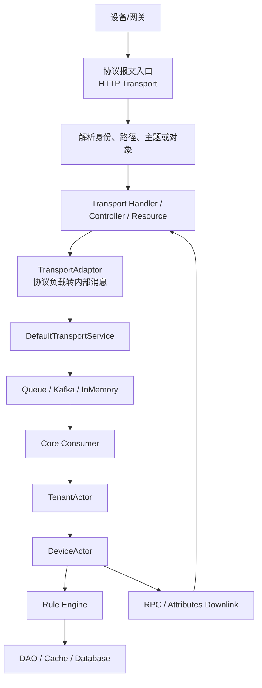
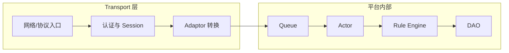

# 第 05 章：HTTP Transport

## 本章定位

**学习目标：** 能完整解释 HTTP 设备遥测、属性、RPC 请求如何进入 ThingsBoard。

**为什么学习：** HTTP Transport 没有复杂连接状态，是理解设备数据入口、认证和写入链路的最佳第一站。

**与下一章节关系：** 下一章进入 MQTT，在 HTTP 的数据入口基础上加入长连接、订阅、QoS 和下行。

这章的学习方式不是背概念，而是把协议、源码、抓包和数据库结果连成一条链。阅读时建议同时打开源码、Wireshark 和数据库客户端。

## 必须掌握的知识

- 设备 Access Token 路径认证
- 遥测上报
- 属性上报
- 属性查询
- HTTP RPC 轮询
- Controller 到 TransportService
- 错误码设计
- 请求幂等性和重试

## ThingsBoard 相关模块

- `common/transport/http`
- `transport/http`
- `application`
- `dao`

## 建议阅读源码

- `common/transport/http/src/main/java/org/thingsboard/server/transport/http/DeviceApiController.java`
- `common/transport/http/src/main/java/org/thingsboard/server/transport/http/HttpTransportContext.java`
- `transport/http/src/main/java/org/thingsboard/server/http/ThingsboardHttpTransportApplication.java`

## 核心流程图



## 源码分层示意图



## 学习路线

1. 先用最小客户端或命令行工具构造一条合法报文。
2. 再用 Wireshark 抓到这条报文，确认端口、协议字段、身份字段和负载。
3. 回到源码入口，找到协议解析、认证、Session 和 `TransportService` 调用点。
4. 跟踪队列、Actor、Rule Engine 和 DAO，确认数据如何变化。
5. 最后制造失败场景，观察抓包、日志和数据库之间的差异。

## 示例代码

```bash
curl -v -X POST "http://localhost:8080/api/v1/$ACCESS_TOKEN/telemetry" \
  -H "Content-Type: application/json" \
  -d '{"temperature":36.6,"humidity":42}'

curl -v "http://localhost:8080/api/v1/$ACCESS_TOKEN/attributes?clientKeys=fwVersion"
```

## 抓包分析

### Wireshark 使用目标

本章抓包不是为了记住协议名，而是为了把“线上看到的报文”映射到 ThingsBoard 源码链路。每次抓包都要回答四个问题：

- 设备到底有没有把报文发到服务端端口。
- 服务端是否完成协议层确认。
- 报文中的身份、路径、主题或对象 ID 是否能映射到 ThingsBoard 设备。
- 报文进入平台后应该对应哪个 Handler、Actor 和数据库写入。

### 过滤条件

- `http && tcp.port == 8080`：HTTP 明文设备 API。
- `http.request.uri contains "/api/v1/"`：只看设备 Transport API。
- `tls && tcp.port == 8443`：HTTPS 场景只能看到 TLS 记录，需配置密钥日志才能解密。
- `tcp.analysis.retransmission && tcp.port == 8080`：HTTP 上报重传。

### 抓包内容

- POST `/api/v1/{token}/telemetry`。
- POST `/api/v1/{token}/attributes`。
- GET `/api/v1/{token}/attributes?...`。
- GET `/api/v1/{token}/rpc` 或 RPC 响应请求。

### 报文字段逐项解释

| 层级 | 字段 | 分析意义 |
|---|---|---|
| HTTP Request Line | `method/path/version` | 方法、设备 Token 所在路径、HTTP 版本。 |
| HTTP Header | `Host/Content-Type/Content-Length/Connection` | 目标主机、负载类型、长度和连接复用。 |
| HTTP Body | `JSON key/value` | 遥测、属性、RPC 响应数据。 |
| TCP | `seq/ack/window/retransmission` | 请求是否完整送达和响应是否丢失。 |
| TLS | `SNI/certificate/cipher` | HTTPS 证书和加密协商。 |

### 对应源码、Netty、Handler、Actor、数据库

| 维度 | 对应位置 |
|---|---|
| 源码 | `common/transport/http/src/main/java/org/thingsboard/server/transport/http/DeviceApiController.java` |
| 源码 | `common/transport/http/src/main/java/org/thingsboard/server/transport/http/HttpTransportContext.java` |
| 源码 | `transport/http/src/main/java/org/thingsboard/server/http/ThingsboardHttpTransportApplication.java` |
| Netty | 本仓库 HTTP Transport 入口是 Spring MVC Controller；默认不经过 `MqttTransportHandler` 这类 Netty Handler。 |
| Handler | 外部报文首先进入对应 Transport Handler、Controller、Resource 或协议 Service，再调用 `TransportService`。 |
| Actor | 正常上行会经过 Core Consumer，随后进入 `TenantActor`、`DeviceActor`，需要规则处理时进入 `RuleChainActor`、`RuleNodeActor`。 |
| 数据库 | 认证读取 `device_credentials`；设备和配置读取 `device`、`device_profile`；遥测写 `ts_kv_latest` 和 `ts_kv`；属性写 `attribute_kv`；RPC 写 `rpc`；告警写 `alarm`；事件写 `event`。 |

### 抓包到源码的定位步骤

1. 先用过滤条件确认报文是否到达服务端。
2. 根据端口和协议定位 Transport 模块。
3. 根据 topic、URI、OID、NodeId、ObjectId 或寄存器地址定位协议解析代码。
4. 确认身份字段是否能查到设备凭据。
5. 找到 `TransportService` 调用点，确认是否写入队列。
6. 继续追踪 Core Consumer、Actor、Rule Engine 和 DAO 日志。
7. 如果 Wireshark 有请求但数据库没有变化，优先检查认证失败、限流、队列积压、规则链失败和事务异常。

## 关键源码阅读方法

- 入口类先看生命周期：什么时候启动、监听哪个端口、由哪个 Spring Profile 或配置启用。
- Handler/Controller/Resource 先看认证：设备身份从哪里来，认证失败如何返回。
- Adaptor 先看数据转换：外部 payload 如何变成 Protobuf 或 `TbMsg`。
- Service 先看异步边界：哪里开始回调，哪里开始写队列，哪里可能丢异常。
- Actor 先看消息类型：同一个设备的消息是否保持顺序，是否会跨线程并发修改状态。
- DAO 先看写入语义：是写最新值、历史值、属性、事件、RPC 还是告警。

## 常见故障与定位

| 现象 | 优先检查 | 典型原因 |
|---|---|---|
| 设备连接不上 | 端口、TLS、认证字段、服务是否启动 | 防火墙、证书不匹配、Token 错误、Transport 未启用 |
| 报文到达但无数据 | Handler 日志、`TransportService`、Queue | Payload 格式错、限流、转换失败、队列异常 |
| 数据入库但页面无显示 | `ts_kv_latest`、WebSocket、时间窗口 | 时间戳异常、订阅实体错、前端时间范围错 |
| RPC 下发失败 | 设备在线状态、订阅、请求超时 | 设备未订阅、Session 失效、Actor 找不到会话 |
| 高并发延迟 | Kafka lag、Actor mailbox、DB 写入耗时 | 分区不足、消费者慢、规则链阻塞、数据库瓶颈 |

## 工程实践任务

1. 在本地启动或模拟本章涉及的入口协议，至少完成一次正常上报。
2. 使用 Wireshark 保存一次 `.pcapng` 文件，并记录关键过滤条件。
3. 对照源码定位入口类、转换类、队列投递点、Actor 处理点和 DAO 写入点。
4. 人为制造一个错误：错误 Token、错误 Topic、错误路径、错误证书、错误寄存器地址或错误 NodeId。
5. 写出排障报告：现象、抓包证据、源码定位、数据库结果、修复方式。

## 本章验收标准

- 能不用搜索引擎讲清本章协议或模块在 ThingsBoard 中的位置。
- 能从一条抓包记录说出它最终应该进入哪个源码类。
- 能解释是否经过 Netty、是否进入 Actor、是否写数据库、是否进入 Rule Engine。
- 能写一个最小客户端或模拟器触发本章核心链路。
- 能回答本章面试题，并给出源码路径作为依据。

## 面试题

1. HTTP Transport 在 ThingsBoard 通信链路中解决什么问题？

**参考答案：**
HTTP Transport 在 ThingsBoard 通信链路中的作用是：HTTP Transport 解决短连接设备通过 REST 风格接口上报遥测、属性和轮询 RPC 的问题。 面试时可以按“入口、转换、投递、处理、落库”五步回答。第一步，设备或网关先通过对应协议把数据送到服务端；第二步，入口层完成协议字段解析和身份识别；第三步，Transport 层把外部协议负载转换成 ThingsBoard 内部消息；第四步，消息通过 Queue/Core/Actor/Rule Engine 处理；第五步，最终由 DAO 写入遥测、属性、事件、告警或 RPC 状态。

**示例说法：**
“我理解的 HTTP Transport 不是一个孤立协议点，而是 ThingsBoard 设备接入链路的一段。设备调用 `/api/v1/{accessToken}/telemetry`、`/attributes` 或 RPC 接口，Spring MVC Controller 接收请求。 进入平台后，不能直接写业务表，而要先收敛到 Transport 抽象，再进入队列、Actor 和 Rule Engine。这样 HTTP、MQTT、CoAP、LwM2M、SNMP 或工业网关数据最终都能复用同一套设备状态、规则链和存储能力。”

2. 设备身份从报文哪个字段进入平台，最终如何映射到 DeviceId？

**参考答案：**
设备身份首先来自协议或网关映射层。设备身份来自 URL 中的 `{accessToken}`，服务端用它查询 `device_credentials`，映射到 DeviceId 和 TenantId。 ThingsBoard 不会只凭 IP 判断设备，因为 IP 可能经过 NAT、网关或负载均衡，不能稳定代表设备。身份字段经过认证服务后，会映射成 TenantId、DeviceId、DeviceProfileId、SessionId 等内部上下文。这些字段后续会进入 Queue 消息、Actor 路由、Rule Engine 的 `TbMsg` metadata，以及 DAO 查询和写入条件。

**示例说法：**
“我会先看抓包里的身份字段，再看源码里认证发生在哪里。比如 MQTT 是 CONNECT username/access token，HTTP 是 URL path token，LwM2M 是 endpoint/PSK identity。认证成功后，平台拿到 DeviceId，后续队列分区、DeviceActor 路由、规则链 originator 和数据库 entity_id 都围绕这个 DeviceId 展开。”

3. 什么情况下报文已经到达端口，但不会写入数据库？

**参考答案：**
报文到达端口但不写数据库，通常说明问题发生在网络之后、DAO 之前。常见原因包括：身份认证失败、协议路径或 topic 不匹配、payload 格式无法转换、设备 Profile 或 Transport 配置不允许该消息、限流拒绝、TransportService 投递队列失败、Kafka/内存队列积压、Core Consumer 没消费、Actor mailbox 堆积、Rule Engine 节点失败、规则链没有保存节点、时间戳异常导致页面看不到，或者 DAO 事务/数据库写入失败。

**示例说法：**
“我不会看到 Wireshark 有包就认为平台应该有数据。抓包只能证明报文到了服务端端口。接下来要看 Handler 是否接受、认证是否成功、是否调用 TransportService、队列是否有消息、DeviceActor 是否处理、Rule Engine 是否执行、最后才看 `ts_kv_latest` 或 `attribute_kv` 是否更新。”

4. 该链路是否经过 Netty？如果不经过，实际入口框架是什么？

**参考答案：**
是否经过 Netty 要看入口协议。HTTP 默认不经过 MQTT 的 Netty Handler，入口是 `DeviceApiController`，然后调用 `HttpTransportContext` 和 TransportService。 面试时要避免把所有协议都说成 Netty。Netty 适合 TCP 长连接和自定义二进制协议，但 ThingsBoard 中 HTTP、CoAP、LwM2M、SNMP 等入口可能分别由 Spring MVC、Californium/Leshan、SNMP4J 等框架承接。关键不是框架名字，而是找到“外部报文第一次进入业务代码”的入口类。

**示例说法：**
“如果是 MQTT，我会直接看 `MqttTransportServerInitializer` 和 `MqttTransportHandler`；如果是 HTTP，我会看 `DeviceApiController`；如果是 LwM2M，我会看 Leshan listener 和上下行 handler。它们入口不同，但最终都会收敛到 TransportService 或平台内部服务。”

5. 该链路是否进入 Actor？进入哪个 Actor？

**参考答案：**
正常业务链路会进入 Actor，但不是网络包一到就直接进 Actor。HTTP 上行成功后经队列进入 Core Consumer，再进入 TenantActor、DeviceActor；HTTP 请求线程本身不直接承载 Actor 逻辑。 Actor 的价值是把设备、租户、规则链等有状态对象串行化处理，降低锁竞争，并保证同一设备或同一规则节点相关状态的一致性。通常路径是：Transport 解析并投递队列，Core Consumer 消费后进入 TenantActor，再路由到 DeviceActor；需要规则处理时进入 RuleChainActor 和 RuleNodeActor。

**示例说法：**
“我会把 Actor 看成网络层之后的平台状态处理层。比如 MQTT PUBLISH 先由 Netty Handler 解析，再经 TransportService 写队列，Core Consumer 消费后才进入 DeviceActor。这样网络线程不会承担复杂业务，设备状态也不会被多个线程随意修改。”

6. 该链路是否进入 Rule Engine？哪些消息类型会进入？

**参考答案：**
是否进入 Rule Engine 取决于消息类型。遥测和属性上报会进入 Rule Engine；属性查询和 RPC 轮询更多走 Core/DeviceActor 状态和服务逻辑。 一般来说，遥测上报、属性上报、连接事件、部分 RPC 或生命周期事件可以进入规则链；纯协议握手、订阅请求、ACK、心跳、底层重传通常不会作为业务消息进入 Rule Engine。Rule Engine 处理的是平台标准消息，而不是原始 TCP/UDP/MQTT/CoAP 字节。

**示例说法：**
“例如 MQTT CONNECT 主要用于认证和 Session 建立，不等于一条业务遥测；PUBLISH 到 telemetry topic 才会转换为遥测消息进入 Rule Engine。进入规则链后，它会成为 `TbMsg`，带有 originator、type、metadata 和 data，规则节点再决定过滤、转换、告警或写库。”

7. 该链路涉及哪些数据库表或缓存？

**参考答案：**
这条链路涉及的数据库和缓存要按阶段区分。认证读 `device_credentials`；遥测写 `ts_kv_latest`/`ts_kv`；属性写 `attribute_kv`；RPC 可能读写 `rpc`。 另外，ThingsBoard 为了减少高频查询，会使用本地 Caffeine 缓存、Redis 缓存或专门的 Transport 缓存保存设备凭据、设备 Profile、租户 Profile、实体关系、属性和限流状态。回答时不要只说“写数据库”，而要说明读什么、写什么、何时写。

**示例说法：**
“认证阶段通常读 `device_credentials`；设备上下文会读 `device` 和 `device_profile`；遥测成功后写 `ts_kv_latest` 和历史 `ts_kv`；属性写 `attribute_kv`；RPC 下行可能写 `rpc`；规则链创建告警会写 `alarm`。如果页面没有数据，我会先查 `ts_kv_latest` 是否更新。”

8. 如果生产环境出现延迟，应优先检查哪些指标？

**参考答案：**
生产延迟要分层定位，不能只看 JVM CPU。优先看 HTTP 状态码、Controller 日志、请求体大小、线程池、数据库写入、队列发送耗时和 Rule Engine 消费延迟。 一般我会按顺序看：网络 RTT 和重传、协议确认耗时、入口线程或 EventLoop、认证和缓存命中率、Transport 限流、队列发送耗时、Kafka lag、Consumer 处理速率、Actor mailbox、Rule Engine 节点耗时、DAO 慢查询、数据库连接池、WebSocket 推送延迟。这样可以把“设备慢”“平台慢”“规则慢”“数据库慢”区分开。

**示例说法：**
“如果设备侧显示上报成功但平台 30 秒后才显示，我会先看 Kafka lag。如果 lag 高，说明入口没问题但消费慢；如果 lag 低，再看 Rule Engine 节点耗时和数据库写入；如果数据库已有数据但页面慢，再看 WebSocket 订阅和前端时间窗口。”

## 本章总结

本章要达到的程度是：看到一条网络报文，能够判断它是否能进入 ThingsBoard；看到一段 ThingsBoard Transport 源码，能够判断它对应哪个协议字段；看到数据库结果，能够反推设备报文经过了哪些处理阶段。
