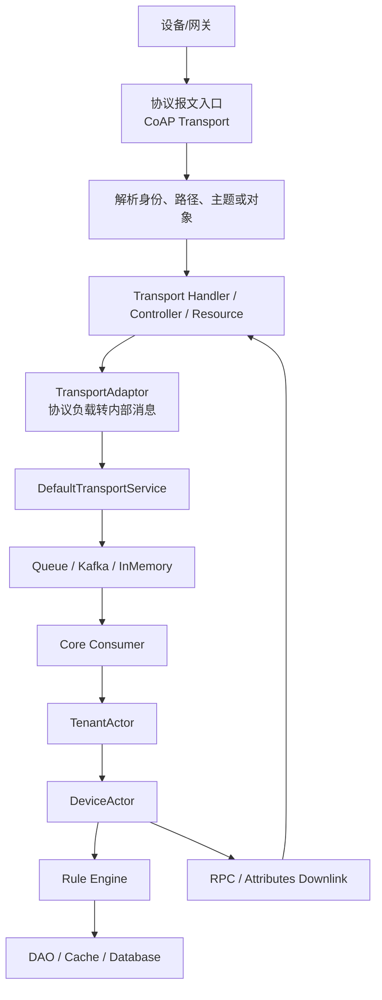
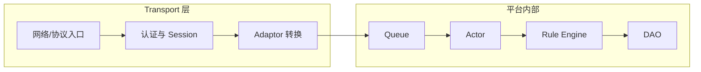

# 第 08 章：CoAP Transport

## 本章定位

**学习目标：** 掌握 CoAP 资源、Confirmable、Observe、DTLS 和 ThingsBoard CoAP 数据入口。

**为什么学习：** CoAP 适合低功耗和受限网络，通信模型与 MQTT 长连接完全不同。

**与下一章节关系：** 下一章学习建立在 CoAP/DTLS 上的 LwM2M 设备管理协议。

这章的学习方式不是背概念，而是把协议、源码、抓包和数据库结果连成一条链。阅读时建议同时打开源码、Wireshark 和数据库客户端。

## 必须掌握的知识

- CoAP Method/Code
- Confirmable/Non-confirmable
- Message ID
- Token
- Uri-Path/Uri-Query
- Content-Format
- Observe
- Block-wise
- DTLS
- CoAP Resource 到 TransportService

## ThingsBoard 相关模块

- `common/transport/coap`
- `transport/coap`
- `common/transport/transport-api`

## 建议阅读源码

- `common/transport/coap/src/main/java/org/thingsboard/server/transport/coap/CoapTransportService.java`
- `common/transport/coap/src/main/java/org/thingsboard/server/transport/coap/CoapTransportResource.java`
- `common/transport/coap/src/main/java/org/thingsboard/server/transport/coap/AbstractCoapTransportResource.java`
- `common/transport/coap/src/main/java/org/thingsboard/server/transport/coap/adaptors/JsonCoapAdaptor.java`
- `common/transport/coap/src/main/java/org/thingsboard/server/transport/coap/adaptors/ProtoCoapAdaptor.java`

## 核心流程图



## 源码分层示意图



## 学习路线

1. 先用最小客户端或命令行工具构造一条合法报文。
2. 再用 Wireshark 抓到这条报文，确认端口、协议字段、身份字段和负载。
3. 回到源码入口，找到协议解析、认证、Session 和 `TransportService` 调用点。
4. 跟踪队列、Actor、Rule Engine 和 DAO，确认数据如何变化。
5. 最后制造失败场景，观察抓包、日志和数据库之间的差异。

## 示例代码

```bash
coap-client -m post \
  -e '{"temperature":36.6}' \
  "coap://localhost/api/v1/$ACCESS_TOKEN/telemetry"

coap-client -m get \
  "coap://localhost/api/v1/$ACCESS_TOKEN/attributes?clientKeys=fwVersion"
```

## 抓包分析

### Wireshark 使用目标

本章抓包不是为了记住协议名，而是为了把“线上看到的报文”映射到 ThingsBoard 源码链路。每次抓包都要回答四个问题：

- 设备到底有没有把报文发到服务端端口。
- 服务端是否完成协议层确认。
- 报文中的身份、路径、主题或对象 ID 是否能映射到 ThingsBoard 设备。
- 报文进入平台后应该对应哪个 Handler、Actor 和数据库写入。

### 过滤条件

- `coap`：CoAP 明文。
- `udp.port == 5683 && coap`：默认 CoAP。
- `dtls || udp.port == 5684`：CoAPS/DTLS。
- `coap.code == 2.05`：Content 响应。
- `coap.opt.uri_path contains "telemetry"`：遥测资源。

### 抓包内容

- POST `/api/v1/{token}/telemetry`。
- POST `/api/v1/{token}/attributes`。
- GET `/api/v1/{token}/attributes`。
- Observe 注册和 Notify。
- Confirmable 消息与 ACK。

### 报文字段逐项解释

| 层级 | 字段 | 分析意义 |
|---|---|---|
| CoAP Header | `version/type/token length/code/message id` | 版本、确认模式、方法/响应码和消息匹配。 |
| Token | `opaque bytes` | 请求响应匹配。 |
| Options | `Uri-Path/Uri-Query/Content-Format/Observe/Block` | 资源路径、查询参数、内容类型和分块。 |
| Payload Marker | `0xff` | 选项和负载分界。 |
| Payload | `JSON/Protobuf bytes` | 遥测、属性、RPC 请求或响应。 |
| UDP | `srcport/dstport/length/checksum` | 丢包、乱序和 NAT 路径分析。 |

### 对应源码、Netty、Handler、Actor、数据库

| 维度 | 对应位置 |
|---|---|
| 源码 | `common/transport/coap/src/main/java/org/thingsboard/server/transport/coap/CoapTransportService.java` |
| 源码 | `common/transport/coap/src/main/java/org/thingsboard/server/transport/coap/CoapTransportResource.java` |
| 源码 | `common/transport/coap/src/main/java/org/thingsboard/server/transport/coap/AbstractCoapTransportResource.java` |
| 源码 | `common/transport/coap/src/main/java/org/thingsboard/server/transport/coap/adaptors/JsonCoapAdaptor.java` |
| 源码 | `common/transport/coap/src/main/java/org/thingsboard/server/transport/coap/adaptors/ProtoCoapAdaptor.java` |
| Netty | CoAP Transport 使用 Californium/CoAP 资源模型，不走 MQTT 的 Netty Handler。 |
| Handler | 外部报文首先进入对应 Transport Handler、Controller、Resource 或协议 Service，再调用 `TransportService`。 |
| Actor | 正常上行会经过 Core Consumer，随后进入 `TenantActor`、`DeviceActor`，需要规则处理时进入 `RuleChainActor`、`RuleNodeActor`。 |
| 数据库 | 认证读取 `device_credentials`；设备和配置读取 `device`、`device_profile`；遥测写 `ts_kv_latest` 和 `ts_kv`；属性写 `attribute_kv`；RPC 写 `rpc`；告警写 `alarm`；事件写 `event`。 |

### 抓包到源码的定位步骤

1. 先用过滤条件确认报文是否到达服务端。
2. 根据端口和协议定位 Transport 模块。
3. 根据 topic、URI、OID、NodeId、ObjectId 或寄存器地址定位协议解析代码。
4. 确认身份字段是否能查到设备凭据。
5. 找到 `TransportService` 调用点，确认是否写入队列。
6. 继续追踪 Core Consumer、Actor、Rule Engine 和 DAO 日志。
7. 如果 Wireshark 有请求但数据库没有变化，优先检查认证失败、限流、队列积压、规则链失败和事务异常。

## 关键源码阅读方法

- 入口类先看生命周期：什么时候启动、监听哪个端口、由哪个 Spring Profile 或配置启用。
- Handler/Controller/Resource 先看认证：设备身份从哪里来，认证失败如何返回。
- Adaptor 先看数据转换：外部 payload 如何变成 Protobuf 或 `TbMsg`。
- Service 先看异步边界：哪里开始回调，哪里开始写队列，哪里可能丢异常。
- Actor 先看消息类型：同一个设备的消息是否保持顺序，是否会跨线程并发修改状态。
- DAO 先看写入语义：是写最新值、历史值、属性、事件、RPC 还是告警。

## 常见故障与定位

| 现象 | 优先检查 | 典型原因 |
|---|---|---|
| 设备连接不上 | 端口、TLS、认证字段、服务是否启动 | 防火墙、证书不匹配、Token 错误、Transport 未启用 |
| 报文到达但无数据 | Handler 日志、`TransportService`、Queue | Payload 格式错、限流、转换失败、队列异常 |
| 数据入库但页面无显示 | `ts_kv_latest`、WebSocket、时间窗口 | 时间戳异常、订阅实体错、前端时间范围错 |
| RPC 下发失败 | 设备在线状态、订阅、请求超时 | 设备未订阅、Session 失效、Actor 找不到会话 |
| 高并发延迟 | Kafka lag、Actor mailbox、DB 写入耗时 | 分区不足、消费者慢、规则链阻塞、数据库瓶颈 |

## 工程实践任务

1. 在本地启动或模拟本章涉及的入口协议，至少完成一次正常上报。
2. 使用 Wireshark 保存一次 `.pcapng` 文件，并记录关键过滤条件。
3. 对照源码定位入口类、转换类、队列投递点、Actor 处理点和 DAO 写入点。
4. 人为制造一个错误：错误 Token、错误 Topic、错误路径、错误证书、错误寄存器地址或错误 NodeId。
5. 写出排障报告：现象、抓包证据、源码定位、数据库结果、修复方式。

## 本章验收标准

- 能不用搜索引擎讲清本章协议或模块在 ThingsBoard 中的位置。
- 能从一条抓包记录说出它最终应该进入哪个源码类。
- 能解释是否经过 Netty、是否进入 Actor、是否写数据库、是否进入 Rule Engine。
- 能写一个最小客户端或模拟器触发本章核心链路。
- 能回答本章面试题，并给出源码路径作为依据。

## 面试题

1. CoAP Transport 在 ThingsBoard 通信链路中解决什么问题？
2. 设备身份从报文哪个字段进入平台，最终如何映射到 DeviceId？
3. 什么情况下报文已经到达端口，但不会写入数据库？
4. 该链路是否经过 Netty？如果不经过，实际入口框架是什么？
5. 该链路是否进入 Actor？进入哪个 Actor？
6. 该链路是否进入 Rule Engine？哪些消息类型会进入？
7. 该链路涉及哪些数据库表或缓存？
8. 如果生产环境出现延迟，应优先检查哪些指标？

## 本章总结

本章要达到的程度是：看到一条网络报文，能够判断它是否能进入 ThingsBoard；看到一段 ThingsBoard Transport 源码，能够判断它对应哪个协议字段；看到数据库结果，能够反推设备报文经过了哪些处理阶段。
