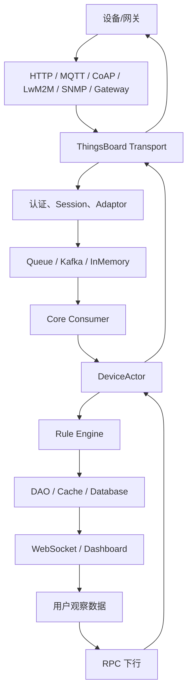

# ThingsBoard IoT 通信协议、源码架构与工程实践课程

这组文档按真实项目开发顺序组织，目标是达到：

- 能独立开发 ThingsBoard Transport。
- 能阅读 ThingsBoard 源码。
- 能分析网络通信问题。
- 能独立开发物联网项目。
- 能通过高级 Java / IoT / ThingsBoard 面试。

## 使用方式

1. 每章先读“本章定位”和“核心流程图”。
2. 再打开“建议阅读源码”中的类，按入口、认证、Session、Adaptor、Service、Queue、Actor、DAO 的顺序阅读。
3. 每个协议章节必须做一次抓包，把 Wireshark 字段和源码处理点对应起来。
4. 每章至少完成一个失败场景排障，不要只跑成功案例。
5. 学到第 21 章时，选择一个私有协议或工业协议做自定义 Transport 项目。

## 总体链路

## 章节目录

| 编号 | 章节 | 目标 |
|---|---|---|
| 01 | [网络基础与 Java IO](01-network-java-io.md) | 建立分析 IoT 通信链路的底层能力，能从 Socket、端口、连接状态和字节流解释设备接入问题。 |
| 02 | [TCP、UDP、TLS、DTLS](02-tcp-udp-tls-dtls.md) | 能解释可靠流、无连接报文、加密握手和 DTLS 重传对 IoT 设备在线率的影响。 |
| 03 | [Netty 服务端开发](03-netty-server-development.md) | 掌握基于 Netty 的高并发连接处理，能阅读 MQTT Transport 的 Pipeline、Handler 和 ByteBuf 处理。 |
| 04 | [ThingsBoard Transport 抽象](04-thingsboard-transport-abstraction.md) | 理解协议无关的 Transport 模型，能判断新协议应该复用哪些接口、扩展哪些类。 |
| 05 | [HTTP Transport](05-http-transport.md) | 能完整解释 HTTP 设备遥测、属性、RPC 请求如何进入 ThingsBoard。 |
| 06 | [MQTT Transport](06-mqtt-transport.md) | 能分析 MQTT 设备上线、认证、发布、订阅、RPC、属性更新和断线全过程。 |
| 07 | [MQTT Gateway 与 Sparkplug](07-mqtt-gateway-sparkplug.md) | 理解网关连接、子设备映射、Sparkplug 主题和指标模型，能开发工业网关接入方案。 |
| 08 | [CoAP Transport](08-coap-transport.md) | 掌握 CoAP 资源、Confirmable、Observe、DTLS 和 ThingsBoard CoAP 数据入口。 |
| 09 | [LwM2M Transport](09-lwm2m-transport.md) | 能分析 LwM2M 注册、Bootstrap、Observe、Read/Write/Execute、OTA 和 RPC 映射。 |
| 10 | [SNMP Transport](10-snmp-transport.md) | 理解轮询型设备接入、OID 映射、Trap 和 SNMPv3 安全模型。 |
| 11 | [Modbus TCP 工业网关接入](11-modbus-tcp-gateway.md) | 能开发 Modbus TCP 网关采集器，并把 PLC/仪表寄存器转换成 ThingsBoard 标准遥测和属性。 |
| 12 | [OPC UA 工业网关接入](12-opcua-gateway.md) | 掌握 OPC UA 地址空间、会话、安全通道、订阅和数据映射到 ThingsBoard 的工程方案。 |
| 13 | [Transport 消息模型与 Protobuf](13-transport-message-protobuf.md) | 理解外部协议报文如何被转换成 ThingsBoard 内部 Protobuf 消息，并进入 Core/Rule Engine。 |
| 14 | [Queue / Kafka / Partition / Consumer](14-queue-kafka-partition-consumer.md) | 掌握 Transport、Core、Rule Engine 之间的队列通信、分区路由、消费确认和背压。 |
| 15 | [ThingsBoard Actor 系统](15-thingsboard-actor-system.md) | 理解 ThingsBoard 为什么用 Actor 管理租户、设备、规则链和节点执行。 |
| 16 | [DeviceActor 与设备状态](16-device-actor-state.md) | 掌握设备消息、在线离线、Session、RPC、属性订阅在 DeviceActor 中的处理方式。 |
| 17 | [Rule Engine 消息流](17-rule-engine-message-flow.md) | 能从 TbMsg 角度解释规则链、规则节点、关系类型、异步回调和失败处理。 |
| 18 | [DAO、缓存、遥测和属性存储](18-dao-cache-telemetry-attributes.md) | 掌握设备、凭据、属性、遥测、告警、关系、RPC 的持久化和缓存结构。 |
| 19 | [RPC 与设备下行控制](19-rpc-downlink-control.md) | 能分析服务端下发 RPC 到设备，以及设备响应、超时、离线和持久化状态。 |
| 20 | [设备上线完整源码链路](20-device-online-full-source-chain.md) | 能从设备连接到页面看到数据，完整讲清 ThingsBoard 源码调用链。 |
| 21 | [自定义 Transport 开发实战](21-custom-transport-development.md) | 能从 0 到 1 开发一个私有 TCP/二进制协议 Transport，并接入 ThingsBoard 内部链路。 |
| 22 | [通信问题排障方法论](22-communication-troubleshooting.md) | 形成从网络、协议、认证、Session、队列、Actor、Rule Engine、DAO 到页面的系统排障方法。 |
| 23 | [高并发 IoT 架构设计](23-high-concurrency-iot-architecture.md) | 能设计百万设备级接入架构，解释连接、队列、Actor、Rule Engine、数据库的扩展策略。 |
| 24 | [高级 Java / IoT / ThingsBoard 面试专题](24-advanced-java-iot-thingsboard-interview.md) | 把源码、协议和工程实践转化为高级 Java 与 IoT 面试中的结构化表达。 |

## 推荐学习节奏

- 第 1-4 章：建立网络、Netty 和 Transport 抽象基础。
- 第 5-10 章：掌握 ThingsBoard 已有协议 Transport。
- 第 11-12 章：理解工业网关协议如何转换接入。
- 第 13-18 章：进入内部消息、队列、Actor、Rule Engine 和 DAO。
- 第 19-21 章：掌握下行控制、完整链路和自定义 Transport。
- 第 22-24 章：形成排障、架构设计和面试表达能力。

## 数据库关注点

常见链路最终会涉及 `device`、`device_credentials`、`attribute_kv`、`ts_kv_latest`、`ts_kv`、`rpc`、`event`、`alarm`、`relation`。如果抓包显示设备已经上报，但这些表没有变化，应沿着认证、转换、队列、Actor、Rule Engine 和 DAO 顺序排查。
