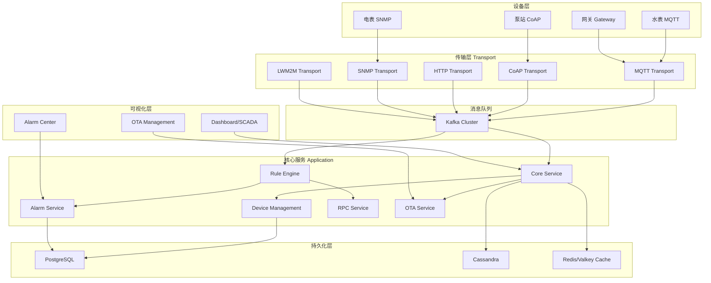
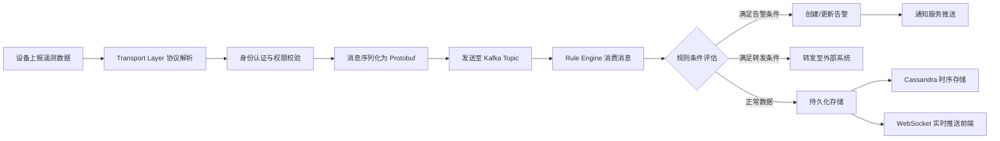
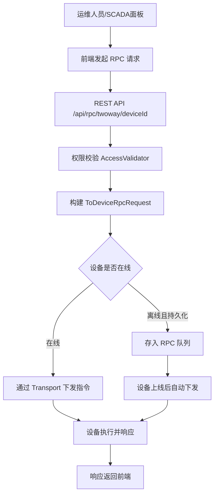
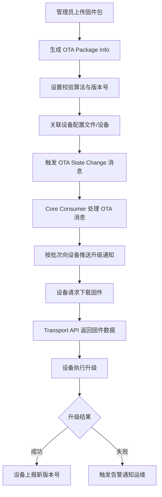
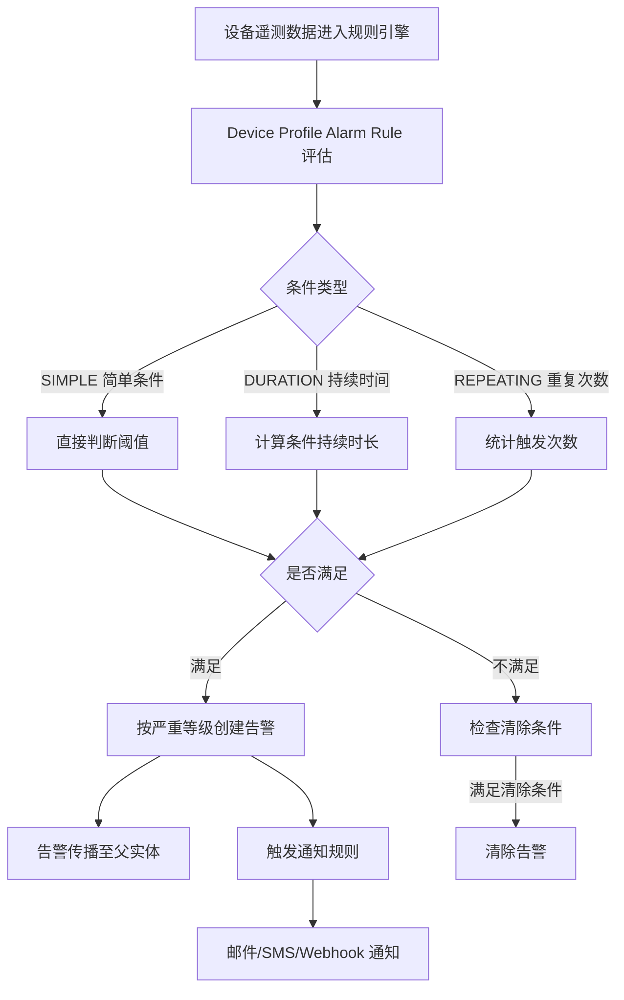

# 工业物联网平台 - 简历亮点与学习指南

> 基于 ThingsBoard 开源物联网平台，面向工厂设备（水表、电表、泵站等）实现实时监测、远程控制、告警管理和 OTA 升级。

---

## 一、项目简述（简历话术）

**项目名称**：工业物联网设备监测管控平台

**项目描述**：
基于 ThingsBoard 构建的企业级工业物联网平台，采用 Java 17 + Spring Boot 3.x 微服务架构，支持百万级设备并发接入。通过 MQTT/CoAP/SNMP 等多协议适配层实现水表、电表、泵站等工厂设备的实时数据采集；利用可视化规则引擎驱动异常告警与自动化联动控制；基于 Kafka 高吞吐消息队列 + Cassandra 时序数据库实现海量遥测数据的实时处理与持久化存储；支持 OTA 固件远程升级及工业级 SCADA 可视化大屏。

---

## 二、核心简历亮点

### 亮点 1：多协议设备接入层（百万级设备并发）

**简历话术**：
> 设计并实现支持 MQTT/CoAP/LWM2M/SNMP 等多协议的设备接入层，基于 Netty 高性能网络框架实现百万级设备并发连接，支持 JSON/Protobuf 双格式数据解析，设备认证采用 Token/X.509 证书/LWM2M 凭证等多种方式。

**关联模块**：
```
transport/              # 传输层微服务入口
├── mqtt/              # MQTT 传输服务（基于 Netty）
├── coap/              # CoAP 传输服务
├── http/              # HTTP 传输服务
├── lwm2m/             # LWM2M 传输服务（适用于低功耗设备）
└── snmp/              # SNMP 传输服务（适用于工业仪表）

common/transport/
├── transport-api/     # 传输层抽象 API（核心接口定义）
├── mqtt/              # MQTT 协议实现
├── coap/              # CoAP 协议实现
├── lwm2m/             # LWM2M 协议实现
└── snmp/              # SNMP 协议实现
```

**学习路径**：
1. 阅读 `common/transport/transport-api/` 了解传输层统一抽象接口
2. 阅读 `common/transport/mqtt/` 中的 MQTT Session/Handler 理解设备连接生命周期
3. 阅读 `transport/mqtt/src/main/resources/tb-mqtt-transport.yml` 了解配置参数
4. 查看 `common/data/src/main/java/.../DeviceTransportType.java` 了解支持的传输类型枚举
5. 查看 `common/data/src/main/java/.../MqttDeviceProfileTransportConfiguration.java` 了解 Topic 配置

**工厂场景映射**：
- 水表/电表 → MQTT 协议上报用量数据
- 泵站 PLC → SNMP/Modbus 网关接入
- 低功耗传感器 → CoAP/LWM2M 协议接入

---

### 亮点 2：规则引擎驱动的实时告警与联动控制

**简历话术**：
> 基于可视化规则引擎实现设备异常检测与多级告警机制，支持持续时间/重复次数等复合条件触发，告警自动升级与多渠道通知（邮件/SMS/Webhook）；通过规则链编排实现跨设备联动控制逻辑，如水压异常自动启停泵站。

**关联模块**：
```
rule-engine/
├── rule-engine-api/          # 规则引擎 API 定义
│   └── src/main/java/.../    # TbContext、RuleNode 等核心接口
└── rule-engine-components/   # 内置规则节点实现
    └── src/main/java/
        ├── profile/          # 设备配置告警规则（AlarmState、AlarmRuleState）
        ├── action/           # 动作节点（创建告警、发送RPC等）
        ├── filter/           # 过滤节点（消息类型、脚本过滤等）
        ├── transform/        # 转换节点（数据格式转换）
        ├── rpc/              # RPC 节点（TbSendRPCRequestNode）
        └── metadata/         # 元数据节点（获取遥测/属性）
```

**学习路径**：
1. 从 `rule-engine/rule-engine-api/` 了解 `TbNode`、`TbContext` 核心接口
2. 阅读 `rule-engine-components/.../profile/AlarmState.java` 理解告警状态机
3. 阅读 `rule-engine-components/.../profile/AlarmRuleState.java` 理解告警条件评估
4. 阅读 `rule-engine-components/.../action/TbCreateAlarmNode` 理解告警创建流程
5. 查看 `common/data/.../notification/rule/` 了解通知规则触发类型

**工厂场景映射**：
- 电表功率超过阈值 → 触发过载告警 → 通知运维人员
- 水表流量持续为零 → 触发管道故障告警
- 泵站压力异常 → 自动触发 RPC 停泵指令

---

### 亮点 3：设备远程 RPC 控制与双向通信

**简历话术**：
> 实现基于 Server-Side RPC 的设备远程控制机制，支持单向/双向 RPC 调用，具备持久化 RPC 指令队列、超时重试、离线设备指令缓存等企业级特性；前端 SCADA 面板通过 Widget 控件直接下发控制指令。

**关联模块**：
```
application/src/main/java/.../controller/
├── RpcV1Controller.java           # RPC v1 接口
├── RpcV2Controller.java           # RPC v2 接口（推荐）
└── AbstractRpcController.java     # RPC 公共逻辑（超时、持久化、重试）

rule-engine/rule-engine-components/.../rpc/
└── TbSendRPCRequestNode.java      # 规则引擎 RPC 发送节点

ui-ngx/src/app/
├── core/http/device.service.ts    # 前端 RPC API 调用
└── modules/home/components/widget/lib/rpc/
    ├── switch.component.ts        # 开关控件（单向 RPC）
    └── round-switch.component.ts  # 圆形开关（双向 RPC）
```

**学习路径**：
1. 阅读 `AbstractRpcController.java` 了解 RPC 请求构建（timeout/persistent/retries）
2. 阅读 `RpcV2Controller.java` 了解 REST API 入口
3. 阅读 `TbSendRPCRequestNode.java` 了解规则引擎内 RPC 触发
4. 查看前端 `switch.component.ts` 了解 Widget 如何调用 `controlApi.sendOneWayCommand`
5. 查看 `command-button-widget.models.ts` 了解 RPC 按钮配置

**工厂场景映射**：
- 远程开/关泵站 → 单向 RPC `{"method": "setPumpState", "params": {"state": true}}`
- 查询电表当前读数 → 双向 RPC `{"method": "getMeterReading"}`
- 设备离线时下发指令 → 持久化 RPC 队列，设备上线后自动下发

---

### 亮点 4：OTA 固件远程升级管理

**简历话术**：
> 设计并实现设备固件/软件 OTA 远程升级系统，支持版本管理、校验算法（MD5/SHA256/CRC32）、分批推送策略、升级状态跟踪；支持 URL 分发与二进制直传两种模式，适配 LWM2M 设备的 FOTA/SOTA 升级流程。

**关联模块**：
```
application/src/main/java/.../service/queue/
└── DefaultTbCoreConsumerService.java  # OTA 消息消费与处理

common/data/src/main/java/.../
├── Device.java                        # firmwareId/softwareId 字段
└── ota/                               # OTA 相关数据模型

ui-ngx/src/app/
├── core/http/ota-package.service.ts   # OTA API 服务
├── shared/models/ota-package.models.ts # OTA 数据模型
└── modules/home/pages/ota-update/     # OTA 管理页面
    ├── ota-update.component.ts
    └── ota-update.module.ts

application/src/main/java/.../controller/
└── OtaPackageController.java          # OTA REST API
```

**学习路径**：
1. 查看 `ota-package.models.ts` 了解 OTA 类型（FIRMWARE/SOFTWARE）和校验算法
2. 阅读 `ota-package.service.ts` 了解 OTA 包上传/分发流程
3. 阅读 `DefaultTbCoreConsumerService.processFirmwareMsgs()` 了解后端 OTA 推送策略
4. 查看 `DefaultTransportApiService` 中的 OTA 包获取逻辑
5. 了解 LWM2M 组件中的 OTA 升级策略配置

**工厂场景映射**：
- 水表固件批量升级 → 按设备组分批推送，实时跟踪升级进度
- 泵站控制器 Bug 修复 → 上传新固件 + SHA256 校验 + 远程分发
- 电表计量算法更新 → 支持回滚机制，升级失败自动告警

---

### 亮点 5：海量时序数据存储与实时处理

**简历话术**：
> 基于 Kafka 消息队列实现设备遥测数据的高吞吐异步处理（单节点万级 TPS），采用 Cassandra 时序数据库按月/日分区存储，支持 TTL 自动过期策略；引入 EDQS（Entity Data Query Service）实现海量实体数据的快速检索与聚合分析。

**关联模块**：
```
common/queue/                    # 消息队列抽象层
├── src/main/java/.../queue/    # Kafka Producer/Consumer 封装

dao/                             # 数据持久化层
├── src/main/java/.../dao/
│   ├── timeseries/             # 时序数据 DAO
│   ├── attributes/             # 属性数据 DAO
│   └── model/                  # JPA 实体模型

common/edqs/                     # 实体数据查询服务
edqs/                            # EDQS 微服务

application/src/main/resources/
└── thingsboard.yml              # Cassandra 分区策略、TTL 配置
```

**学习路径**：
1. 阅读 `thingsboard.yml` 中 `cassandra` 配置段了解分区策略
2. 阅读 `common/queue/` 了解 Kafka 消息队列抽象（TbQueueProducer/Consumer）
3. 查看 `dao/` 中时序数据存储实现
4. 了解 EDQS 模块如何优化大规模实体查询
5. 查看 Kafka Topic 配置了解消息路由策略

**工厂场景映射**：
- 千台电表每秒上报用电量 → Kafka 异步消费 → Cassandra 按月分区存储
- 水表历史用量分析 → 聚合查询（AVG/SUM/MAX）
- 泵站振动数据 → 高频采集（100Hz）→ 海量数据 TTL 自动清理

---

### 亮点 6：工业 SCADA 可视化大屏

**简历话术**：
> 基于 Angular 17 构建工业级 SCADA 可视化看板系统，支持 SVG 符号化编辑器自定义工艺流程图，通过 WebSocket 实时订阅设备状态变化；支持多仪表盘布局（网格/SCADA/分隔）、客户级数据隔离与共享看板。

**关联模块**：
```
ui-ngx/src/app/modules/home/
├── components/widget/lib/scada/
│   ├── scada-symbol-widget.component.ts    # SCADA 符号组件
│   ├── scada-symbol-widget.models.ts       # SCADA 模型定义
│   └── scada-symbol.models.ts              # 符号 API 定义
├── pages/scada-symbol/
│   ├── scada-symbol.component.ts           # SCADA 编辑器页面
│   └── metadata-components/                # 符号元数据编辑
├── components/dashboard-page/              # 仪表盘核心组件
└── components/widget/lib/rpc/              # RPC 控件组件

ui-ngx/src/app/shared/models/
├── dashboard.models.ts                     # LayoutType（default/scada/divider）
└── widget.models.ts                        # Widget 类型定义（scada 标记）
```

**学习路径**：
1. 了解 `dashboard.models.ts` 中的 `LayoutType.scada` 布局模式
2. 阅读 `scada-symbol-widget.component.ts` 了解 SCADA 符号渲染流程
3. 查看 `scada-symbol.component.ts` 了解 SVG 编辑器实现
4. 了解 Widget 与设备数据绑定机制（ValueGetter/ValueSetter）
5. 查看 WebSocket 实时订阅机制（TelemetrySubscriber）

**工厂场景映射**：
- 泵站工艺流程 SCADA 看板 → SVG 符号实时反映泵运行状态
- 水表管网拓扑可视化 → 流量/压力实时渲染
- 电表配电间一览 → 实时用电负荷热力图

---

### 亮点 7：多租户 SaaS 架构与数据隔离

**简历话术**：
> 实现多租户 SaaS 架构，支持租户级规则引擎隔离（独立 Kafka 消费组）、设备数据完全隔离、可配置的资源配额限制（设备数/API 调用次数/消息数）；支持系统管理员、租户管理员、客户用户三级权限体系。

**关联模块**：
```
application/src/main/java/.../service/entitiy/tenant/
└── DefaultTbTenantService.java           # 租户管理服务

common/data/src/main/java/.../
├── Tenant.java                           # 租户实体
├── TenantProfile.java                    # 租户配置文件
└── security/                             # 权限与安全

application/src/main/java/.../controller/
└── TenantController.java                 # 租户 REST API

dao/src/main/java/.../dao/tenant/         # 租户数据访问层
```

**学习路径**：
1. 了解 `TenantProfile` 中的隔离配置（`isolatedTbRuleEngine`）
2. 阅读 `DefaultTbTenantService` 了解租户创建与队列分配
3. 查看权限校验机制（SYS_ADMIN/TENANT_ADMIN/CUSTOMER_USER）
4. 了解 Kafka Topic 的租户级隔离策略
5. 查看 API 使用量限制与通知触发

**工厂场景映射**：
- 集团公司下属多个工厂 → 每个工厂一个租户，数据完全隔离
- 设备供应商作为系统管理员 → 管理所有工厂租户
- 工厂运维人员 → 租户管理员角色，管理本厂设备

---

### 亮点 8：边缘计算与网关管理

**简历话术**：
> 支持 Edge 边缘节点部署，实现云-边协同架构；边缘节点独立运行规则引擎，网络恢复后自动同步数据至云端；支持 IoT Gateway 网关接入，将非 IP 设备（Modbus/BACnet）统一转换为平台标准协议。

**关联模块**：
```
common/edge-api/                  # 边缘节点 API 定义
application/src/main/java/.../service/edge/
├── rpc/processor/                # 边缘节点消息处理器
│   └── device/DeviceEdgeProcessor.java
└── ...

ui-ngx/src/app/core/services/menu.models.ts  # Edge 管理菜单
ui-ngx/src/app/core/http/device.service.ts   # 设备-边缘关联 API
```

**学习路径**：
1. 了解 `common/edge-api/` 中的边缘通信协议定义
2. 阅读 `DeviceEdgeProcessor.java` 了解设备消息在边缘的处理流程
3. 查看 UI 中 Edge 管理功能（分配设备到边缘）
4. 了解 Gateway 网关设备的特殊处理逻辑
5. 查看 `docker/` 中 Edge 部署配置

**工厂场景映射**：
- 偏远泵站网络不稳定 → 部署 Edge 节点本地决策，断网续传
- 老旧水表仅支持 Modbus → 通过 Gateway 网关统一接入
- 工厂车间级边缘 → 低延迟本地告警，关键指令不依赖云端

---

## 三、系统架构原理图



---

## 四、设备数据采集流程图



---

## 五、设备 RPC 控制流程图



---

## 六、OTA 升级流程图



---

## 七、告警处理原理图



---

## 八、项目整体模块结构

```
thingsboard/
├── application/          # 主服务（Spring Boot 启动类、Controller、Service）
├── common/
│   ├── data/            # 公共数据模型（Device、Alarm、OTA 等实体）
│   ├── transport/       # 传输层协议实现（MQTT/CoAP/SNMP/LWM2M）
│   ├── queue/           # 消息队列抽象（Kafka Producer/Consumer）
│   ├── message/         # 内部消息模型（TbMsg）
│   ├── edge-api/        # 边缘计算 API
│   ├── actor/           # Actor 模型并发框架
│   ├── cache/           # 缓存层（Redis/Valkey）
│   └── stats/           # 统计指标
├── dao/                 # 数据访问层（JPA + Cassandra DAO）
├── rule-engine/
│   ├── rule-engine-api/        # 规则引擎核心接口
│   └── rule-engine-components/ # 内置规则节点实现
├── transport/           # 传输层微服务（独立部署）
│   ├── mqtt/
│   ├── coap/
│   ├── http/
│   ├── lwm2m/
│   └── snmp/
├── ui-ngx/              # 前端（Angular 17 + Material）
│   └── src/app/
│       ├── core/        # 核心服务（HTTP API、WebSocket）
│       ├── shared/      # 公共模型与组件
│       └── modules/home/# 业务页面（设备、仪表盘、SCADA、OTA）
├── edqs/                # 实体数据查询微服务
├── msa/                 # 微服务部署配置
└── docker/              # Docker 编排文件
```

---

## 九、技术栈总结

| 层次 | 技术选型 | 说明 |
|------|---------|------|
| 后端框架 | Java 17 + Spring Boot 3.4 | 主服务框架 |
| 网络通信 | Netty 4.1 + gRPC 1.76 | 高并发设备连接 |
| 消息队列 | Kafka 3.9 | 高吞吐异步处理 |
| 时序存储 | Cassandra | 海量遥测数据 |
| 关系存储 | PostgreSQL | 实体关系数据 |
| 缓存 | Redis/Valkey | 热点数据缓存 |
| 前端 | Angular 17 + Material | SPA 应用 |
| 协议支持 | MQTT/CoAP/HTTP/LWM2M/SNMP | 多协议接入 |
| 部署 | Docker + K8s | 微服务编排 |

---

## 十、简历项目经验参考模板

```
项目名称：工业物联网设备监测管控平台
项目角色：后端开发工程师
项目时间：20XX.XX - 至今
技术栈：Java 17 / Spring Boot 3.x / Kafka / Cassandra / PostgreSQL / 
        MQTT / Netty / Angular / Docker

项目描述：
面向工厂水表、电表、泵站等设备的物联网监测管控平台，支持百万级设备接入、
实时数据采集、异常告警、远程控制及 OTA 固件升级。

核心职责：
1. 负责设备多协议接入层开发，基于 Netty 实现 MQTT Broker，
   支持 10 万+ 设备并发长连接，消息吞吐量达 5 万 TPS
2. 设计并实现基于规则引擎的多级告警系统，支持持续时间/重复次数等
   复合条件触发，告警响应时间 < 500ms
3. 实现设备远程 RPC 控制模块，支持持久化指令队列与离线设备缓存投递，
   指令送达率 99.9%
4. 负责 OTA 固件升级模块，支持分批推送、断点续传、校验回滚，
   管理 5000+ 设备的固件版本
5. 基于 Kafka + Cassandra 实现遥测数据流处理管道，
   日均处理 5 亿条时序数据点，查询延迟 P99 < 100ms
6. 开发工业 SCADA 可视化大屏，基于 SVG 符号编辑器实现工艺流程
   实时监控，支持 WebSocket 实时数据推送
```
