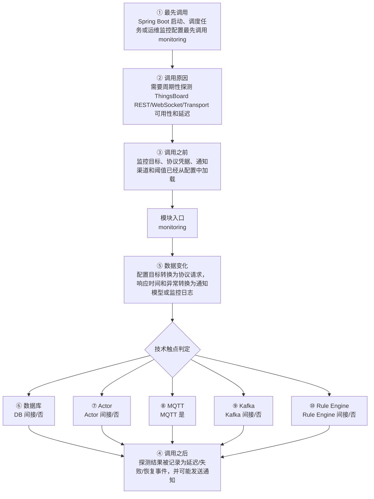

# ThingsBoard Monitoring Service 模块调用链分析

> 生成范围：`monitoring`  
> Maven artifact：`monitoring`  
> packaging：`jar`  
> 分析方式：静态扫描 POM、Java 注解、入口方法、关键技术触点和类关系；不是运行时 trace。

## 完整流程图

## 十项调用链问题

| 问题 | 模块级结论 |
| --- | --- |
| ① 谁最先调用这里？ | Spring Boot 启动、调度任务或运维监控配置最先调用 monitoring |
| ② 为什么会调用？ | 需要周期性探测 ThingsBoard REST/WebSocket/Transport 可用性和延迟 |
| ③ 调用之前发生了什么？ | 监控目标、协议凭据、通知渠道和阈值已经从配置中加载 |
| ④ 调用之后发生什么？ | 探测结果被记录为延迟/失败/恢复事件，并可能发送通知 |
| ⑤ 数据如何变化？ | 配置目标转换为协议请求，响应时间和异常转换为通知模型或监控日志 |
| ⑥ 对数据库进行了哪些操作？ | 否，未发现直接操作证据；未发现直接源码证据；若发生，通常在依赖的下游模块中完成。 |
| ⑦ 是否发送 Actor 消息？ | 否，未发现直接操作证据；未发现直接源码证据；若发生，通常在依赖的下游模块中完成。 |
| ⑧ 是否发送 MQTT 消息？ | 是，发现直接操作证据；直接操作证据：发现 MQTT client/handler/publish/subscribe/writeAndFlush 等操作模式。关键词触点 109 处仅作为辅助线索。 |
| ⑨ 是否写入 Kafka？ | 否，未发现直接操作证据；未发现直接源码证据；若发生，通常在依赖的下游模块中完成。 |
| ⑩ 是否写入 Rule Engine？ | 否，未发现直接操作证据；未发现直接源码证据；若发生，通常在依赖的下游模块中完成。 |

## 入口证据

- Spring Boot 应用启动入口: `monitoring/src/main/java/org/thingsboard/monitoring/ThingsboardMonitoringApplication.java`
- Spring Component 组件入口: `monitoring/src/main/java/org/thingsboard/monitoring/client/TbClient.java`
- Spring Component 组件入口: `monitoring/src/main/java/org/thingsboard/monitoring/client/WsClientFactory.java`
- Spring Component 组件入口: `monitoring/src/main/java/org/thingsboard/monitoring/config/transport/CoapTransportMonitoringConfig.java`
- Spring Component 组件入口: `monitoring/src/main/java/org/thingsboard/monitoring/config/transport/HttpTransportMonitoringConfig.java`
- Spring Component 组件入口: `monitoring/src/main/java/org/thingsboard/monitoring/config/transport/Lwm2mTransportMonitoringConfig.java`
- Spring Component 组件入口: `monitoring/src/main/java/org/thingsboard/monitoring/config/transport/MqttTransportMonitoringConfig.java`
- Spring Component 组件入口: `monitoring/src/main/java/org/thingsboard/monitoring/notification/NotificationService.java`
- Spring Component 组件入口: `monitoring/src/main/java/org/thingsboard/monitoring/notification/channels/impl/SlackNotificationChannel.java`
- Spring Component 组件入口: 其余 5 处入口省略
- Spring Service 业务服务入口: `monitoring/src/main/java/org/thingsboard/monitoring/service/transport/TransportsMonitoringService.java`
- Spring Service 业务服务入口: `monitoring/src/main/java/org/thingsboard/monitoring/service/transport/impl/Lwm2mTransportHealthChecker.java`
- 命令行或进程启动入口: `monitoring/src/main/java/org/thingsboard/monitoring/ThingsboardMonitoringApplication.java`

## 静态关键词统计（不等同于实际发送/写入）

- database: 0 处静态触点；未发现直接源码证据；若发生，通常在依赖的下游模块中完成。
- actor: 0 处静态触点；未发现直接源码证据；若发生，通常在依赖的下游模块中完成。
- mqtt: 109 处静态触点；直接操作证据：发现 MQTT client/handler/publish/subscribe/writeAndFlush 等操作模式。关键词触点 109 处仅作为辅助线索。
- kafka: 0 处静态触点；未发现直接源码证据；若发生，通常在依赖的下游模块中完成。
- rule_engine: 0 处静态触点；未发现直接源码证据；若发生，通常在依赖的下游模块中完成。
- cache: 0 处静态触点；未发现直接源码证据；若发生，通常在依赖的下游模块中完成。
- queue: 14 处静态触点；直接操作证据：发现静态关键词触点。关键词触点 14 处仅作为辅助线索。
- rest: 17 处静态触点；直接操作证据：发现静态关键词触点。关键词触点 17 处仅作为辅助线索。
- websocket: 90 处静态触点；直接操作证据：发现静态关键词触点。关键词触点 90 处仅作为辅助线索。
- transport: 224 处静态触点；直接操作证据：发现静态关键词触点。关键词触点 224 处仅作为辅助线索。

## 调用前后数据流

1. 调用前：监控目标、协议凭据、通知渠道和阈值已经从配置中加载
2. 模块入口：`monitoring` 通过入口类、依赖 API、构建聚合或子模块暴露能力。
3. 模块内转换：配置目标转换为协议请求，响应时间和异常转换为通知模型或监控日志
4. 调用后：探测结果被记录为延迟/失败/恢复事件，并可能发送通知
5. 数据库/Actor/MQTT/Kafka/Rule Engine 这些动作若没有直接触点，通常发生在依赖的 `application`、`dao`、`common/queue`、`common/transport` 或 `rule-engine` 模块中。

## 子模块与依赖

### 子模块

- 无子模块。

### 主要依赖

- `org.thingsboard.common:data`
- `org.thingsboard.common:util`
- `org.thingsboard:rest-client`
- `org.springframework.boot:spring-boot-starter`
- `org.eclipse.californium:californium-core`
- `org.eclipse.californium:scandium`
- `org.eclipse.paho:org.eclipse.paho.client.mqttv3`
- `org.apache.httpcomponents:httpclient`
- `org.eclipse.leshan:leshan-client-cf`
- `org.eclipse.leshan:leshan-core`
- `org.java-websocket:Java-WebSocket`
- `com.google.guava:guava`
- `org.apache.commons:commons-lang3`
- `org.slf4j:slf4j-api`
- `org.slf4j:log4j-over-slf4j`
- `ch.qos.logback:logback-core`
- `ch.qos.logback:logback-classic`

## 关键类型样本

- `ThingsboardMonitoringApplication` (class, `monitoring/src/main/java/org/thingsboard/monitoring/ThingsboardMonitoringApplication.java`)
- `Lwm2mClient` (class, `monitoring/src/main/java/org/thingsboard/monitoring/client/Lwm2mClient.java`)
- `TbClient` (class, `monitoring/src/main/java/org/thingsboard/monitoring/client/TbClient.java`)
- `WsClient` (class, `monitoring/src/main/java/org/thingsboard/monitoring/client/WsClient.java`)
- `WsClientFactory` (class, `monitoring/src/main/java/org/thingsboard/monitoring/client/WsClientFactory.java`)
- `MonitoringConfig` (interface, `monitoring/src/main/java/org/thingsboard/monitoring/config/MonitoringConfig.java`)
- `MonitoringTarget` (interface, `monitoring/src/main/java/org/thingsboard/monitoring/config/MonitoringTarget.java`)
- `CoapTransportMonitoringConfig` (class, `monitoring/src/main/java/org/thingsboard/monitoring/config/transport/CoapTransportMonitoringConfig.java`)
- `DeviceConfig` (class, `monitoring/src/main/java/org/thingsboard/monitoring/config/transport/DeviceConfig.java`)
- `HttpTransportMonitoringConfig` (class, `monitoring/src/main/java/org/thingsboard/monitoring/config/transport/HttpTransportMonitoringConfig.java`)
- `Lwm2mTransportMonitoringConfig` (class, `monitoring/src/main/java/org/thingsboard/monitoring/config/transport/Lwm2mTransportMonitoringConfig.java`)
- `MqttTransportMonitoringConfig` (class, `monitoring/src/main/java/org/thingsboard/monitoring/config/transport/MqttTransportMonitoringConfig.java`)
- `TransportInfo` (class, `monitoring/src/main/java/org/thingsboard/monitoring/config/transport/TransportInfo.java`)
- `TransportMonitoringConfig` (class, `monitoring/src/main/java/org/thingsboard/monitoring/config/transport/TransportMonitoringConfig.java`)
- `TransportMonitoringTarget` (class, `monitoring/src/main/java/org/thingsboard/monitoring/config/transport/TransportMonitoringTarget.java`)
- `TransportType` (enum, `monitoring/src/main/java/org/thingsboard/monitoring/config/transport/TransportType.java`)
- `Latencies` (class, `monitoring/src/main/java/org/thingsboard/monitoring/data/Latencies.java`)
- `Latency` (class, `monitoring/src/main/java/org/thingsboard/monitoring/data/Latency.java`)
- `MonitoredServiceKey` (class, `monitoring/src/main/java/org/thingsboard/monitoring/data/MonitoredServiceKey.java`)
- `ServiceFailureException` (class, `monitoring/src/main/java/org/thingsboard/monitoring/data/ServiceFailureException.java`)
- `CmdsWrapper` (class, `monitoring/src/main/java/org/thingsboard/monitoring/data/cmd/CmdsWrapper.java`)
- `EntityDataCmd` (class, `monitoring/src/main/java/org/thingsboard/monitoring/data/cmd/EntityDataCmd.java`)
- `EntityDataUpdate` (class, `monitoring/src/main/java/org/thingsboard/monitoring/data/cmd/EntityDataUpdate.java`)
- `LatestValueCmd` (class, `monitoring/src/main/java/org/thingsboard/monitoring/data/cmd/LatestValueCmd.java`)
- `HighLatencyNotification` (class, `monitoring/src/main/java/org/thingsboard/monitoring/data/notification/HighLatencyNotification.java`)
- `Notification` (interface, `monitoring/src/main/java/org/thingsboard/monitoring/data/notification/Notification.java`)
- `ServiceFailureNotification` (class, `monitoring/src/main/java/org/thingsboard/monitoring/data/notification/ServiceFailureNotification.java`)
- `ServiceRecoveryNotification` (class, `monitoring/src/main/java/org/thingsboard/monitoring/data/notification/ServiceRecoveryNotification.java`)
- `NotificationService` (class, `monitoring/src/main/java/org/thingsboard/monitoring/notification/NotificationService.java`)
- `NotificationChannel` (interface, `monitoring/src/main/java/org/thingsboard/monitoring/notification/channels/NotificationChannel.java`)
- `SlackNotificationChannel` (class, `monitoring/src/main/java/org/thingsboard/monitoring/notification/channels/impl/SlackNotificationChannel.java`)
- `BaseHealthChecker` (class, `monitoring/src/main/java/org/thingsboard/monitoring/service/BaseHealthChecker.java`)
- `BaseMonitoringService` (class, `monitoring/src/main/java/org/thingsboard/monitoring/service/BaseMonitoringService.java`)
- `MonitoringReporter` (class, `monitoring/src/main/java/org/thingsboard/monitoring/service/MonitoringReporter.java`)
- `TransportHealthChecker` (class, `monitoring/src/main/java/org/thingsboard/monitoring/service/transport/TransportHealthChecker.java`)
- `TransportsMonitoringService` (class, `monitoring/src/main/java/org/thingsboard/monitoring/service/transport/TransportsMonitoringService.java`)
- `CoapTransportHealthChecker` (class, `monitoring/src/main/java/org/thingsboard/monitoring/service/transport/impl/CoapTransportHealthChecker.java`)
- `HttpTransportHealthChecker` (class, `monitoring/src/main/java/org/thingsboard/monitoring/service/transport/impl/HttpTransportHealthChecker.java`)
- `Lwm2mTransportHealthChecker` (class, `monitoring/src/main/java/org/thingsboard/monitoring/service/transport/impl/Lwm2mTransportHealthChecker.java`)
- `MqttTransportHealthChecker` (class, `monitoring/src/main/java/org/thingsboard/monitoring/service/transport/impl/MqttTransportHealthChecker.java`)
- 其余 2 项已省略；完整源码证据可通过本模块 Java 文件继续追踪。

## 阅读建议

- 先看“完整流程图”确认模块在全链路中的位置。
- 再看入口证据判断调用来源是 HTTP、MQTT/Transport、Actor、Kafka、Rule Engine、DAO、测试还是构建聚合。
- 最后用触点统计区分直接行为和下游间接行为，避免把依赖模块的数据库写入误认为本模块直接写入。
