# ThingsBoard Monitoring Service 模块继承体系分析

> 生成范围：`monitoring`  
> Maven artifact：`monitoring`  
> Java 类型数量：42  
> 分析方式：静态扫描 `class/interface/enum/record` 的 `extends`、`implements`、方法签名和源码触点。

## 完整继承树

```text
AutoCloseable
├── «implements» WsClient
BaseInstanceEnabler
├── Lwm2mClient
Destroyable
├── «implements» Lwm2mClient
MonitoringConfig
├── «implements» TransportMonitoringConfig
├── «implements» ├── CoapTransportMonitoringConfig
├── «implements» ├── HttpTransportMonitoringConfig
├── «implements» ├── Lwm2mTransportMonitoringConfig
├── «implements» ├── MqttTransportMonitoringConfig
MonitoringTarget
├── «implements» TransportMonitoringTarget
Notification
├── «implements» HighLatencyNotification
├── «implements» ServiceFailureNotification
├── «implements» ServiceRecoveryNotification
NotificationChannel
├── «implements» SlackNotificationChannel
Object/外部框架
├── BaseHealthChecker
├── BaseMonitoringService
├── ├── TransportsMonitoringService
├── CmdsWrapper
├── DeviceConfig
├── EntityDataCmd
├── EntityDataUpdate
├── HighLatencyNotification
├── Latencies
├── Latency
├── LatestValueCmd
├── MonitoredServiceKey
├── MonitoringReporter
├── NotificationService
├── ResourceUtils
├── ServiceFailureNotification
├── ServiceRecoveryNotification
├── SlackNotificationChannel
├── TbStopWatch
├── ThingsboardMonitoringApplication
├── TransportHealthChecker
├── ├── CoapTransportHealthChecker
├── ├── HttpTransportHealthChecker
├── ├── Lwm2mTransportHealthChecker
├── ├── MqttTransportHealthChecker
├── TransportInfo
├── TransportMonitoringConfig
├── ├── CoapTransportMonitoringConfig
├── ├── HttpTransportMonitoringConfig
├── ├── Lwm2mTransportMonitoringConfig
├── ├── MqttTransportMonitoringConfig
├── TransportMonitoringTarget
├── WsClientFactory
RestClient
├── TbClient
RuntimeException
├── ServiceFailureException
WebSocketClient
├── WsClient
```

## 继承图

```mermaid
flowchart TD
    Object______p0["Object/外部框架"] -->|extends| ThingsboardMonitoringApplication_c0["ThingsboardMonitoringApplication"]
    BaseInstanceEnabler_p1["BaseInstanceEnabler"] -->|extends| Lwm2mClient_c1["Lwm2mClient"]
    Destroyable_p2["Destroyable"] -->|implements| Lwm2mClient_c2["Lwm2mClient"]
    RestClient_p3["RestClient"] -->|extends| TbClient_c3["TbClient"]
    WebSocketClient_p4["WebSocketClient"] -->|extends| WsClient_c4["WsClient"]
    AutoCloseable_p5["AutoCloseable"] -->|implements| WsClient_c5["WsClient"]
    Object______p6["Object/外部框架"] -->|extends| WsClientFactory_c6["WsClientFactory"]
    TransportMonitoringConfig_p7["TransportMonitoringConfig"] -->|extends| CoapTransportMonitoringConfig_c7["CoapTransportMonitoringConfig"]
    Object______p8["Object/外部框架"] -->|extends| DeviceConfig_c8["DeviceConfig"]
    TransportMonitoringConfig_p9["TransportMonitoringConfig"] -->|extends| HttpTransportMonitoringConfig_c9["HttpTransportMonitoringConfig"]
    TransportMonitoringConfig_p10["TransportMonitoringConfig"] -->|extends| Lwm2mTransportMonitoringConfig_c10["Lwm2mTransportMonitoringConfig"]
    TransportMonitoringConfig_p11["TransportMonitoringConfig"] -->|extends| MqttTransportMonitoringConfig_c11["MqttTransportMonitoringConfig"]
    Object______p12["Object/外部框架"] -->|extends| TransportInfo_c12["TransportInfo"]
    Object______p13["Object/外部框架"] -->|extends| TransportMonitoringConfig_c13["TransportMonitoringConfig"]
    MonitoringConfig_p14["MonitoringConfig"] -->|implements| TransportMonitoringConfig_c14["TransportMonitoringConfig"]
    Object______p15["Object/外部框架"] -->|extends| TransportMonitoringTarget_c15["TransportMonitoringTarget"]
    MonitoringTarget_p16["MonitoringTarget"] -->|implements| TransportMonitoringTarget_c16["TransportMonitoringTarget"]
    Object______p17["Object/外部框架"] -->|extends| Latencies_c17["Latencies"]
    Object______p18["Object/外部框架"] -->|extends| Latency_c18["Latency"]
    Object______p19["Object/外部框架"] -->|extends| MonitoredServiceKey_c19["MonitoredServiceKey"]
    RuntimeException_p20["RuntimeException"] -->|extends| ServiceFailureException_c20["ServiceFailureException"]
    Object______p21["Object/外部框架"] -->|extends| CmdsWrapper_c21["CmdsWrapper"]
    Object______p22["Object/外部框架"] -->|extends| EntityDataCmd_c22["EntityDataCmd"]
    Object______p23["Object/外部框架"] -->|extends| EntityDataUpdate_c23["EntityDataUpdate"]
    Object______p24["Object/外部框架"] -->|extends| LatestValueCmd_c24["LatestValueCmd"]
    Object______p25["Object/外部框架"] -->|extends| HighLatencyNotification_c25["HighLatencyNotification"]
    Notification_p26["Notification"] -->|implements| HighLatencyNotification_c26["HighLatencyNotification"]
    Object______p27["Object/外部框架"] -->|extends| ServiceFailureNotification_c27["ServiceFailureNotification"]
    Notification_p28["Notification"] -->|implements| ServiceFailureNotification_c28["ServiceFailureNotification"]
    Object______p29["Object/外部框架"] -->|extends| ServiceRecoveryNotification_c29["ServiceRecoveryNotification"]
    Notification_p30["Notification"] -->|implements| ServiceRecoveryNotification_c30["ServiceRecoveryNotification"]
    Object______p31["Object/外部框架"] -->|extends| NotificationService_c31["NotificationService"]
    Object______p32["Object/外部框架"] -->|extends| SlackNotificationChannel_c32["SlackNotificationChannel"]
    NotificationChannel_p33["NotificationChannel"] -->|implements| SlackNotificationChannel_c33["SlackNotificationChannel"]
    Object______p34["Object/外部框架"] -->|extends| BaseHealthChecker_c34["BaseHealthChecker"]
    Object______p35["Object/外部框架"] -->|extends| BaseMonitoringService_c35["BaseMonitoringService"]
    Object______p36["Object/外部框架"] -->|extends| MonitoringReporter_c36["MonitoringReporter"]
    Object______p37["Object/外部框架"] -->|extends| TransportHealthChecker_c37["TransportHealthChecker"]
    BaseMonitoringService_p38["BaseMonitoringService"] -->|extends| TransportsMonitoringService_c38["TransportsMonitoringService"]
    TransportHealthChecker_p39["TransportHealthChecker"] -->|extends| CoapTransportHealthChecker_c39["CoapTransportHealthChecker"]
    TransportHealthChecker_p40["TransportHealthChecker"] -->|extends| HttpTransportHealthChecker_c40["HttpTransportHealthChecker"]
    TransportHealthChecker_p41["TransportHealthChecker"] -->|extends| Lwm2mTransportHealthChecker_c41["Lwm2mTransportHealthChecker"]
    TransportHealthChecker_p42["TransportHealthChecker"] -->|extends| MqttTransportHealthChecker_c42["MqttTransportHealthChecker"]
    Object______p43["Object/外部框架"] -->|extends| ResourceUtils_c43["ResourceUtils"]
    Object______p44["Object/外部框架"] -->|extends| TbStopWatch_c44["TbStopWatch"]
```




## 每一层为什么存在

- 外部/上层父类或接口层：提供框架生命周期、Java 标准契约、Spring/Netty/DAO/Rule Engine 等扩展点。
- 接口层：定义跨模块契约，让调用方依赖稳定 API，而不是具体实现。
- 抽象类层：沉淀公共状态、校验、模板流程和默认实现，把变化点留给子类。
- 具体类层：完成协议、DAO、Controller、Rule Node、工具或测试场景中的最终业务动作。

## 抽象了什么

- 父类/接口抽象公共生命周期、输入输出契约、错误处理、协议适配、DAO 查询形态、消息处理模板或测试夹具。
- 子类保留具体协议、实体类型、规则节点行为、数据库实现、页面/测试步骤或命令参数差异。
- 对聚合或无 Java 模块，抽象体现在 Maven 子模块划分和构建生命周期，而不是 Java 继承。

## 父类负责什么

- 提供稳定方法签名、共享字段、默认流程、通用校验、资源释放和框架回调入口。
- 在 Spring、Netty、DAO、Rule Engine、Transport 等框架中，父类还负责让运行时可以通过统一类型调度不同实现。

## 子类负责什么

- 实现具体业务差异，例如协议解析、实体 DAO、规则节点处理、Controller API、客户端命令或测试用例。
- 覆盖父类预留的扩展点，把模块特有数据转换、数据库查询、消息发送或外部调用补进去。

## 为什么不用组合

- 继承用于框架生命周期和模板方法：运行时需要把子类当作父类处理，例如 Spring Bean、Netty Handler、DAO Repository、Rule Node 或测试基类。
- 组合适合注入协作者，本模块中仍然通过字段依赖使用组合；但当需要统一回调签名、共享模板流程或多态派发时，单纯组合不能替代继承。

## 为什么不用接口

- 接口只能表达契约，不能集中保存公共状态、默认校验、资源关闭和模板流程。
- 当模块只需要契约时会使用接口；当多个实现还需要共享代码、默认行为或受保护扩展点时使用抽象类。

## 模板方法

- `MonitoringConfig.getTargets()` (package, `monitoring/src/main/java/org/thingsboard/monitoring/config/MonitoringConfig.java`)
- `MonitoringTarget.getDeviceId()` (package, `monitoring/src/main/java/org/thingsboard/monitoring/config/MonitoringTarget.java`)
- `MonitoringTarget.getBaseUrl()` (package, `monitoring/src/main/java/org/thingsboard/monitoring/config/MonitoringTarget.java`)
- `MonitoringTarget.getQueue()` (package, `monitoring/src/main/java/org/thingsboard/monitoring/config/MonitoringTarget.java`)
- `MonitoringTarget.isCheckDomainIps()` (package, `monitoring/src/main/java/org/thingsboard/monitoring/config/MonitoringTarget.java`)
- `TransportMonitoringConfig.getTransportType()` (package, `monitoring/src/main/java/org/thingsboard/monitoring/config/transport/TransportMonitoringConfig.java`)
- `Notification.getText()` (package, `monitoring/src/main/java/org/thingsboard/monitoring/data/notification/Notification.java`)
- `NotificationChannel.sendNotification()` (package, `monitoring/src/main/java/org/thingsboard/monitoring/notification/channels/NotificationChannel.java`)
- `BaseHealthChecker.initialize()` (package, `monitoring/src/main/java/org/thingsboard/monitoring/service/BaseHealthChecker.java`)
- `BaseHealthChecker.ServiceFailureException()` (package, `monitoring/src/main/java/org/thingsboard/monitoring/service/BaseHealthChecker.java`)
- `BaseHealthChecker.ServiceFailureException()` (package, `monitoring/src/main/java/org/thingsboard/monitoring/service/BaseHealthChecker.java`)
- `BaseHealthChecker.ServiceFailureException()` (package, `monitoring/src/main/java/org/thingsboard/monitoring/service/BaseHealthChecker.java`)
- `BaseHealthChecker.createTestPayload()` (package, `monitoring/src/main/java/org/thingsboard/monitoring/service/BaseHealthChecker.java`)
- `BaseHealthChecker.getInfo()` (package, `monitoring/src/main/java/org/thingsboard/monitoring/service/BaseHealthChecker.java`)
- `BaseHealthChecker.getKey()` (package, `monitoring/src/main/java/org/thingsboard/monitoring/service/BaseHealthChecker.java`)
- `BaseMonitoringService.initHealthChecker()` (package, `monitoring/src/main/java/org/thingsboard/monitoring/service/BaseMonitoringService.java`)
- `BaseMonitoringService.URI()` (package, `monitoring/src/main/java/org/thingsboard/monitoring/service/BaseMonitoringService.java`)
- `BaseMonitoringService.URI()` (package, `monitoring/src/main/java/org/thingsboard/monitoring/service/BaseMonitoringService.java`)
- `BaseMonitoringService.RuntimeException()` (package, `monitoring/src/main/java/org/thingsboard/monitoring/service/BaseMonitoringService.java`)
- `BaseMonitoringService.createHealthChecker()` (package, `monitoring/src/main/java/org/thingsboard/monitoring/service/BaseMonitoringService.java`)
- `BaseMonitoringService.createTarget()` (package, `monitoring/src/main/java/org/thingsboard/monitoring/service/BaseMonitoringService.java`)
- `BaseMonitoringService.getName()` (package, `monitoring/src/main/java/org/thingsboard/monitoring/service/BaseMonitoringService.java`)
- `TransportHealthChecker.initialize()` (protected, `monitoring/src/main/java/org/thingsboard/monitoring/service/transport/TransportHealthChecker.java`)
- `TransportHealthChecker.IllegalArgumentException()` (package, `monitoring/src/main/java/org/thingsboard/monitoring/service/transport/TransportHealthChecker.java`)
- `TransportHealthChecker.DeviceConfig()` (package, `monitoring/src/main/java/org/thingsboard/monitoring/service/transport/TransportHealthChecker.java`)
- `TransportHealthChecker.createTestPayload()` (protected, `monitoring/src/main/java/org/thingsboard/monitoring/service/transport/TransportHealthChecker.java`)
- `TransportHealthChecker.TextNode()` (package, `monitoring/src/main/java/org/thingsboard/monitoring/service/transport/TransportHealthChecker.java`)
- `TransportHealthChecker.getInfo()` (protected, `monitoring/src/main/java/org/thingsboard/monitoring/service/transport/TransportHealthChecker.java`)
- `TransportHealthChecker.TransportInfo()` (package, `monitoring/src/main/java/org/thingsboard/monitoring/service/transport/TransportHealthChecker.java`)
- `TransportHealthChecker.getKey()` (protected, `monitoring/src/main/java/org/thingsboard/monitoring/service/transport/TransportHealthChecker.java`)
- `TransportHealthChecker.getTransportType()` (package, `monitoring/src/main/java/org/thingsboard/monitoring/service/transport/TransportHealthChecker.java`)
- `TransportHealthChecker.Device()` (package, `monitoring/src/main/java/org/thingsboard/monitoring/service/transport/TransportHealthChecker.java`)
- `TransportHealthChecker.DeviceCredentials()` (package, `monitoring/src/main/java/org/thingsboard/monitoring/service/transport/TransportHealthChecker.java`)
- `TransportHealthChecker.DeviceData()` (package, `monitoring/src/main/java/org/thingsboard/monitoring/service/transport/TransportHealthChecker.java`)
- `TransportHealthChecker.DefaultDeviceConfiguration()` (package, `monitoring/src/main/java/org/thingsboard/monitoring/service/transport/TransportHealthChecker.java`)
- `TransportHealthChecker.DefaultDeviceTransportConfiguration()` (package, `monitoring/src/main/java/org/thingsboard/monitoring/service/transport/TransportHealthChecker.java`)
- `TransportHealthChecker.Lwm2mDeviceTransportConfiguration()` (package, `monitoring/src/main/java/org/thingsboard/monitoring/service/transport/TransportHealthChecker.java`)
- `TransportHealthChecker.LwM2MDeviceCredentials()` (package, `monitoring/src/main/java/org/thingsboard/monitoring/service/transport/TransportHealthChecker.java`)
- `TransportHealthChecker.NoSecClientCredential()` (package, `monitoring/src/main/java/org/thingsboard/monitoring/service/transport/TransportHealthChecker.java`)
- `TransportHealthChecker.LwM2MBootstrapClientCredentials()` (package, `monitoring/src/main/java/org/thingsboard/monitoring/service/transport/TransportHealthChecker.java`)


## 哪些方法可以重写

- `ThingsboardMonitoringApplication.SpringApplicationBuilder()` (package, `monitoring/src/main/java/org/thingsboard/monitoring/ThingsboardMonitoringApplication.java`)
- `ThingsboardMonitoringApplication.startMonitoring()` (public, `monitoring/src/main/java/org/thingsboard/monitoring/ThingsboardMonitoringApplication.java`)
- `Lwm2mClient.NetworkConfig()` (package, `monitoring/src/main/java/org/thingsboard/monitoring/client/Lwm2mClient.java`)
- `Lwm2mClient.StaticModel()` (package, `monitoring/src/main/java/org/thingsboard/monitoring/client/Lwm2mClient.java`)
- `Lwm2mClient.ObjectsInitializer()` (package, `monitoring/src/main/java/org/thingsboard/monitoring/client/Lwm2mClient.java`)
- `Lwm2mClient.Server()` (package, `monitoring/src/main/java/org/thingsboard/monitoring/client/Lwm2mClient.java`)
- `Lwm2mClient.DefaultRegistrationEngineFactory()` (package, `monitoring/src/main/java/org/thingsboard/monitoring/client/Lwm2mClient.java`)
- `Lwm2mClient.EndpointFactory()` (package, `monitoring/src/main/java/org/thingsboard/monitoring/client/Lwm2mClient.java`)
- `Lwm2mClient.createUnsecuredEndpoint()` (public, `monitoring/src/main/java/org/thingsboard/monitoring/client/Lwm2mClient.java`)
- `Lwm2mClient.createSecuredEndpoint()` (public, `monitoring/src/main/java/org/thingsboard/monitoring/client/Lwm2mClient.java`)
- `Lwm2mClient.DTLSConnector()` (package, `monitoring/src/main/java/org/thingsboard/monitoring/client/Lwm2mClient.java`)
- `Lwm2mClient.LeshanClientBuilder()` (package, `monitoring/src/main/java/org/thingsboard/monitoring/client/Lwm2mClient.java`)
- `Lwm2mClient.DefaultLwM2mDecoder()` (package, `monitoring/src/main/java/org/thingsboard/monitoring/client/Lwm2mClient.java`)
- `Lwm2mClient.DefaultLwM2mEncoder()` (package, `monitoring/src/main/java/org/thingsboard/monitoring/client/Lwm2mClient.java`)
- `Lwm2mClient.getAvailableResourceIds()` (public, `monitoring/src/main/java/org/thingsboard/monitoring/client/Lwm2mClient.java`)
- `Lwm2mClient.read()` (public, `monitoring/src/main/java/org/thingsboard/monitoring/client/Lwm2mClient.java`)
- `Lwm2mClient.send()` (public, `monitoring/src/main/java/org/thingsboard/monitoring/client/Lwm2mClient.java`)
- `Lwm2mClient.destroy()` (public, `monitoring/src/main/java/org/thingsboard/monitoring/client/Lwm2mClient.java`)
- `TbClient.RestTemplateBuilder()` (package, `monitoring/src/main/java/org/thingsboard/monitoring/client/TbClient.java`)
- `TbClient.logIn()` (public, `monitoring/src/main/java/org/thingsboard/monitoring/client/TbClient.java`)
- `TbClient.getToken()` (package, `monitoring/src/main/java/org/thingsboard/monitoring/client/TbClient.java`)
- `WsClient.ReentrantLock()` (package, `monitoring/src/main/java/org/thingsboard/monitoring/client/WsClient.java`)
- `WsClient.onOpen()` (public, `monitoring/src/main/java/org/thingsboard/monitoring/client/WsClient.java`)
- `WsClient.onMessage()` (public, `monitoring/src/main/java/org/thingsboard/monitoring/client/WsClient.java`)
- `WsClient.onClose()` (public, `monitoring/src/main/java/org/thingsboard/monitoring/client/WsClient.java`)
- `WsClient.onError()` (public, `monitoring/src/main/java/org/thingsboard/monitoring/client/WsClient.java`)
- `WsClient.registerWaitForUpdate()` (public, `monitoring/src/main/java/org/thingsboard/monitoring/client/WsClient.java`)
- `WsClient.CountDownLatch()` (package, `monitoring/src/main/java/org/thingsboard/monitoring/client/WsClient.java`)
- `WsClient.CountDownLatch()` (package, `monitoring/src/main/java/org/thingsboard/monitoring/client/WsClient.java`)
- `WsClient.subscribeForTelemetry()` (public, `monitoring/src/main/java/org/thingsboard/monitoring/client/WsClient.java`)
- `WsClient.EntityDataCmd()` (package, `monitoring/src/main/java/org/thingsboard/monitoring/client/WsClient.java`)
- `WsClient.EntityListFilter()` (package, `monitoring/src/main/java/org/thingsboard/monitoring/client/WsClient.java`)
- `WsClient.EntityDataPageLink()` (package, `monitoring/src/main/java/org/thingsboard/monitoring/client/WsClient.java`)
- `WsClient.EntityDataQuery()` (package, `monitoring/src/main/java/org/thingsboard/monitoring/client/WsClient.java`)
- `WsClient.LatestValueCmd()` (package, `monitoring/src/main/java/org/thingsboard/monitoring/client/WsClient.java`)
- `WsClient.EntityKey()` (package, `monitoring/src/main/java/org/thingsboard/monitoring/client/WsClient.java`)
- `WsClient.CmdsWrapper()` (package, `monitoring/src/main/java/org/thingsboard/monitoring/client/WsClient.java`)
- `WsClient.waitForUpdate()` (public, `monitoring/src/main/java/org/thingsboard/monitoring/client/WsClient.java`)
- `WsClient.getLastMsg()` (package, `monitoring/src/main/java/org/thingsboard/monitoring/client/WsClient.java`)
- `WsClient.waitForReply()` (public, `monitoring/src/main/java/org/thingsboard/monitoring/client/WsClient.java`)


## 哪些方法必须重写

- `ThingsboardMonitoringApplication.SpringApplicationBuilder()` (package, `monitoring/src/main/java/org/thingsboard/monitoring/ThingsboardMonitoringApplication.java`)
- `Lwm2mClient.NetworkConfig()` (package, `monitoring/src/main/java/org/thingsboard/monitoring/client/Lwm2mClient.java`)
- `Lwm2mClient.StaticModel()` (package, `monitoring/src/main/java/org/thingsboard/monitoring/client/Lwm2mClient.java`)
- `Lwm2mClient.ObjectsInitializer()` (package, `monitoring/src/main/java/org/thingsboard/monitoring/client/Lwm2mClient.java`)
- `Lwm2mClient.Server()` (package, `monitoring/src/main/java/org/thingsboard/monitoring/client/Lwm2mClient.java`)
- `Lwm2mClient.DefaultRegistrationEngineFactory()` (package, `monitoring/src/main/java/org/thingsboard/monitoring/client/Lwm2mClient.java`)
- `Lwm2mClient.DTLSConnector()` (package, `monitoring/src/main/java/org/thingsboard/monitoring/client/Lwm2mClient.java`)
- `Lwm2mClient.LeshanClientBuilder()` (package, `monitoring/src/main/java/org/thingsboard/monitoring/client/Lwm2mClient.java`)
- `Lwm2mClient.DefaultLwM2mDecoder()` (package, `monitoring/src/main/java/org/thingsboard/monitoring/client/Lwm2mClient.java`)
- `Lwm2mClient.DefaultLwM2mEncoder()` (package, `monitoring/src/main/java/org/thingsboard/monitoring/client/Lwm2mClient.java`)
- `TbClient.RestTemplateBuilder()` (package, `monitoring/src/main/java/org/thingsboard/monitoring/client/TbClient.java`)
- `TbClient.getToken()` (package, `monitoring/src/main/java/org/thingsboard/monitoring/client/TbClient.java`)
- `WsClient.ReentrantLock()` (package, `monitoring/src/main/java/org/thingsboard/monitoring/client/WsClient.java`)
- `WsClient.CountDownLatch()` (package, `monitoring/src/main/java/org/thingsboard/monitoring/client/WsClient.java`)
- `WsClient.CountDownLatch()` (package, `monitoring/src/main/java/org/thingsboard/monitoring/client/WsClient.java`)
- `WsClient.EntityDataCmd()` (package, `monitoring/src/main/java/org/thingsboard/monitoring/client/WsClient.java`)
- `WsClient.EntityListFilter()` (package, `monitoring/src/main/java/org/thingsboard/monitoring/client/WsClient.java`)
- `WsClient.EntityDataPageLink()` (package, `monitoring/src/main/java/org/thingsboard/monitoring/client/WsClient.java`)
- `WsClient.EntityDataQuery()` (package, `monitoring/src/main/java/org/thingsboard/monitoring/client/WsClient.java`)
- `WsClient.LatestValueCmd()` (package, `monitoring/src/main/java/org/thingsboard/monitoring/client/WsClient.java`)
- `WsClient.EntityKey()` (package, `monitoring/src/main/java/org/thingsboard/monitoring/client/WsClient.java`)
- `WsClient.CmdsWrapper()` (package, `monitoring/src/main/java/org/thingsboard/monitoring/client/WsClient.java`)
- `WsClient.getLastMsg()` (package, `monitoring/src/main/java/org/thingsboard/monitoring/client/WsClient.java`)
- `WsClient.getLastMsg()` (package, `monitoring/src/main/java/org/thingsboard/monitoring/client/WsClient.java`)
- `WsClient.IllegalStateException()` (package, `monitoring/src/main/java/org/thingsboard/monitoring/client/WsClient.java`)
- `WsClient.RuntimeException()` (package, `monitoring/src/main/java/org/thingsboard/monitoring/client/WsClient.java`)
- `WsClientFactory.URI()` (package, `monitoring/src/main/java/org/thingsboard/monitoring/client/WsClientFactory.java`)
- `WsClientFactory.WsClient()` (package, `monitoring/src/main/java/org/thingsboard/monitoring/client/WsClientFactory.java`)
- `WsClientFactory.IllegalStateException()` (package, `monitoring/src/main/java/org/thingsboard/monitoring/client/WsClientFactory.java`)
- `MonitoringConfig.getTargets()` (package, `monitoring/src/main/java/org/thingsboard/monitoring/config/MonitoringConfig.java`)
- `MonitoringTarget.getDeviceId()` (package, `monitoring/src/main/java/org/thingsboard/monitoring/config/MonitoringTarget.java`)
- `MonitoringTarget.getBaseUrl()` (package, `monitoring/src/main/java/org/thingsboard/monitoring/config/MonitoringTarget.java`)
- `MonitoringTarget.getQueue()` (package, `monitoring/src/main/java/org/thingsboard/monitoring/config/MonitoringTarget.java`)
- `MonitoringTarget.isCheckDomainIps()` (package, `monitoring/src/main/java/org/thingsboard/monitoring/config/MonitoringTarget.java`)
- `TransportMonitoringConfig.getTransportType()` (package, `monitoring/src/main/java/org/thingsboard/monitoring/config/transport/TransportMonitoringConfig.java`)
- `HighLatencyNotification.StringBuilder()` (package, `monitoring/src/main/java/org/thingsboard/monitoring/data/notification/HighLatencyNotification.java`)
- `Notification.getText()` (package, `monitoring/src/main/java/org/thingsboard/monitoring/data/notification/Notification.java`)
- `NotificationChannel.sendNotification()` (package, `monitoring/src/main/java/org/thingsboard/monitoring/notification/channels/NotificationChannel.java`)
- `SlackNotificationChannel.RestTemplateBuilder()` (package, `monitoring/src/main/java/org/thingsboard/monitoring/notification/channels/impl/SlackNotificationChannel.java`)
- `BaseHealthChecker.initialize()` (package, `monitoring/src/main/java/org/thingsboard/monitoring/service/BaseHealthChecker.java`)


## 哪些地方使用了多态

- `Object/外部框架` -> `ThingsboardMonitoringApplication` (extends)
- `BaseInstanceEnabler` -> `Lwm2mClient` (extends)
- `Destroyable` -> `Lwm2mClient` (implements)
- `RestClient` -> `TbClient` (extends)
- `WebSocketClient` -> `WsClient` (extends)
- `AutoCloseable` -> `WsClient` (implements)
- `Object/外部框架` -> `WsClientFactory` (extends)
- `TransportMonitoringConfig` -> `CoapTransportMonitoringConfig` (extends)
- `Object/外部框架` -> `DeviceConfig` (extends)
- `TransportMonitoringConfig` -> `HttpTransportMonitoringConfig` (extends)
- `TransportMonitoringConfig` -> `Lwm2mTransportMonitoringConfig` (extends)
- `TransportMonitoringConfig` -> `MqttTransportMonitoringConfig` (extends)
- `Object/外部框架` -> `TransportInfo` (extends)
- `Object/外部框架` -> `TransportMonitoringConfig` (extends)
- `MonitoringConfig` -> `TransportMonitoringConfig` (implements)
- `Object/外部框架` -> `TransportMonitoringTarget` (extends)
- `MonitoringTarget` -> `TransportMonitoringTarget` (implements)
- `Object/外部框架` -> `Latencies` (extends)
- `Object/外部框架` -> `Latency` (extends)
- `Object/外部框架` -> `MonitoredServiceKey` (extends)
- `RuntimeException` -> `ServiceFailureException` (extends)
- `Object/外部框架` -> `CmdsWrapper` (extends)
- `Object/外部框架` -> `EntityDataCmd` (extends)
- `Object/外部框架` -> `EntityDataUpdate` (extends)
- `Object/外部框架` -> `LatestValueCmd` (extends)
- `Object/外部框架` -> `HighLatencyNotification` (extends)
- `Notification` -> `HighLatencyNotification` (implements)
- `Object/外部框架` -> `ServiceFailureNotification` (extends)
- `Notification` -> `ServiceFailureNotification` (implements)
- `Object/外部框架` -> `ServiceRecoveryNotification` (extends)
- `Notification` -> `ServiceRecoveryNotification` (implements)
- `Object/外部框架` -> `NotificationService` (extends)
- `Object/外部框架` -> `SlackNotificationChannel` (extends)
- `NotificationChannel` -> `SlackNotificationChannel` (implements)
- `Object/外部框架` -> `BaseHealthChecker` (extends)
- `Object/外部框架` -> `BaseMonitoringService` (extends)
- `Object/外部框架` -> `MonitoringReporter` (extends)
- `Object/外部框架` -> `TransportHealthChecker` (extends)
- `BaseMonitoringService` -> `TransportsMonitoringService` (extends)
- `TransportHealthChecker` -> `CoapTransportHealthChecker` (extends)
- 其余 5 项已省略；完整源码证据可通过本模块 Java 文件继续追踪。


## 外部父类/接口

- `AutoCloseable`
- `BaseInstanceEnabler`
- `Destroyable`
- `Object/外部框架`
- `RestClient`
- `RuntimeException`
- `WebSocketClient`


## 整个继承体系解决了什么问题

该继承体系把“稳定生命周期/契约”和“模块特定行为”分开：父类或接口负责统一入口、共享流程和多态调度，子类负责差异化协议、实体、规则、DAO、测试或工具行为。这样可以让上游模块通过父类型调用下游实现，同时保持每个实现只关注自己的变化点。
