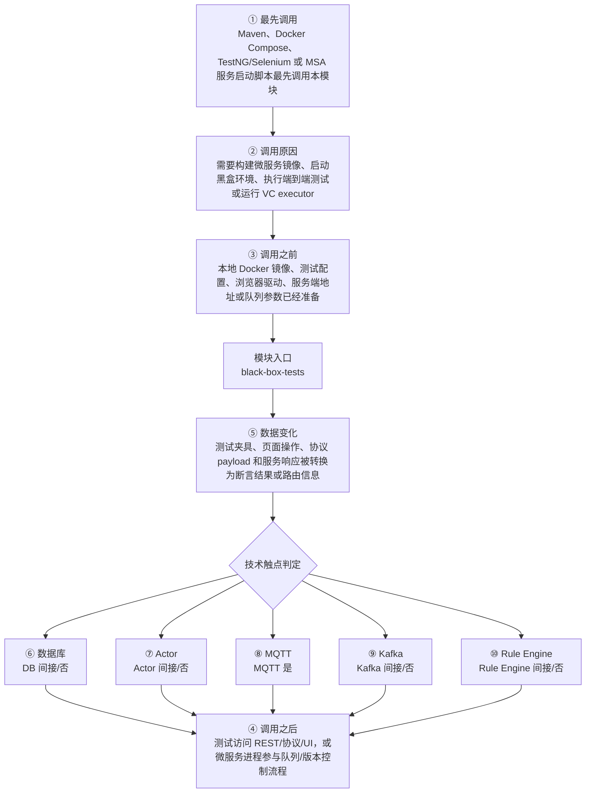

# ThingsBoard Black Box Tests 模块调用链分析

> 生成范围：`msa/black-box-tests`  
> Maven artifact：`black-box-tests`  
> packaging：`jar`  
> 分析方式：静态扫描 POM、Java 注解、入口方法、关键技术触点和类关系；不是运行时 trace。

## 完整流程图

## 十项调用链问题

| 问题 | 模块级结论 |
| --- | --- |
| ① 谁最先调用这里？ | Maven、Docker Compose、TestNG/Selenium 或 MSA 服务启动脚本最先调用本模块 |
| ② 为什么会调用？ | 需要构建微服务镜像、启动黑盒环境、执行端到端测试或运行 VC executor |
| ③ 调用之前发生了什么？ | 本地 Docker 镜像、测试配置、浏览器驱动、服务端地址或队列参数已经准备 |
| ④ 调用之后发生什么？ | 测试访问 REST/协议/UI，或微服务进程参与队列/版本控制流程 |
| ⑤ 数据如何变化？ | 测试夹具、页面操作、协议 payload 和服务响应被转换为断言结果或路由信息 |
| ⑥ 对数据库进行了哪些操作？ | 否，未发现直接操作证据；未发现直接源码证据；若发生，通常在依赖的下游模块中完成。 |
| ⑦ 是否发送 Actor 消息？ | 否，未发现直接操作证据；未发现直接 Actor API 调用，但可能通过服务端消息模型间接进入 Actor。 |
| ⑧ 是否发送 MQTT 消息？ | 是，发现直接操作证据；直接操作证据：发现 MQTT client/handler/publish/subscribe/writeAndFlush 等操作模式。关键词触点 1608 处仅作为辅助线索。 |
| ⑨ 是否写入 Kafka？ | 否，未发现直接操作证据；未发现直接源码证据；若发生，通常在依赖的下游模块中完成。 |
| ⑩ 是否写入 Rule Engine？ | 否，未发现直接操作证据；未发现直接 Rule Engine 写入，但消息可能在下游规则链中继续处理。 |

## 入口证据

- 测试框架入口: `msa/black-box-tests/src/test/java/org/thingsboard/server/msa/SeleniumRemoteWebDriverTest.java`
- 测试框架入口: `msa/black-box-tests/src/test/java/org/thingsboard/server/msa/connectivity/CoapClientTest.java`
- 测试框架入口: `msa/black-box-tests/src/test/java/org/thingsboard/server/msa/connectivity/HttpClientTest.java`
- 测试框架入口: `msa/black-box-tests/src/test/java/org/thingsboard/server/msa/connectivity/MqttClientTest.java`
- 测试框架入口: `msa/black-box-tests/src/test/java/org/thingsboard/server/msa/connectivity/MqttClientTest.java`
- 测试框架入口: `msa/black-box-tests/src/test/java/org/thingsboard/server/msa/connectivity/MqttClientTest.java`
- 测试框架入口: `msa/black-box-tests/src/test/java/org/thingsboard/server/msa/connectivity/MqttGatewayClientTest.java`
- 测试框架入口: `msa/black-box-tests/src/test/java/org/thingsboard/server/msa/connectivity/MqttGatewayClientTest.java`
- 测试框架入口: 其余 56 处入口省略

## 静态关键词统计（不等同于实际发送/写入）

- database: 42 处静态触点；未发现直接源码证据；若发生，通常在依赖的下游模块中完成。
- actor: 0 处静态触点；未发现直接 Actor API 调用，但可能通过服务端消息模型间接进入 Actor。
- mqtt: 1608 处静态触点；直接操作证据：发现 MQTT client/handler/publish/subscribe/writeAndFlush 等操作模式。关键词触点 1608 处仅作为辅助线索。
- kafka: 20 处静态触点；未发现直接源码证据；若发生，通常在依赖的下游模块中完成。
- rule_engine: 1112 处静态触点；未发现直接 Rule Engine 写入，但消息可能在下游规则链中继续处理。
- cache: 114 处静态触点；直接操作证据：发现静态关键词触点。关键词触点 114 处仅作为辅助线索。
- queue: 111 处静态触点；直接操作证据：发现静态关键词触点。关键词触点 111 处仅作为辅助线索。
- rest: 0 处静态触点；未发现直接源码证据；若发生，通常在依赖的下游模块中完成。
- websocket: 436 处静态触点；直接操作证据：发现静态关键词触点。关键词触点 436 处仅作为辅助线索。
- transport: 109 处静态触点；直接操作证据：发现静态关键词触点。关键词触点 109 处仅作为辅助线索。

## 调用前后数据流

1. 调用前：本地 Docker 镜像、测试配置、浏览器驱动、服务端地址或队列参数已经准备
2. 模块入口：`black-box-tests` 通过入口类、依赖 API、构建聚合或子模块暴露能力。
3. 模块内转换：测试夹具、页面操作、协议 payload 和服务响应被转换为断言结果或路由信息
4. 调用后：测试访问 REST/协议/UI，或微服务进程参与队列/版本控制流程
5. 数据库/Actor/MQTT/Kafka/Rule Engine 这些动作若没有直接触点，通常发生在依赖的 `application`、`dao`、`common/queue`、`common/transport` 或 `rule-engine` 模块中。

## 子模块与依赖

### 子模块

- 无子模块。

### 主要依赖

- `org.testcontainers:testcontainers`
- `org.zeroturnaround:zt-exec`
- `org.java-websocket:Java-WebSocket`
- `org.apache.httpcomponents:httpclient`
- `org.springframework.boot:spring-boot-starter-test`
- `org.junit.vintage:junit-vintage-engine`
- `org.testng:testng`
- `org.assertj:assertj-core`
- `io.rest-assured:rest-assured`
- `org.hamcrest:hamcrest-all`
- `org.awaitility:awaitility`
- `org.eclipse.californium:californium-core`
- `ch.qos.logback:logback-classic`
- `com.google.code.gson:gson`
- `org.apache.commons:commons-lang3`
- `com.google.guava:guava`
- `org.thingsboard:netty-mqtt`
- `org.thingsboard:tools`
- `org.thingsboard:rest-client`
- `org.thingsboard.msa:js-executor`
- `org.thingsboard.msa:web-ui`
- `org.thingsboard.msa:tb-node`
- `org.thingsboard.msa.transport:coap`
- `org.thingsboard.msa.transport:http`
- `org.thingsboard.msa.transport:mqtt`
- `org.thingsboard.msa.transport:lwm2m`
- `org.thingsboard.msa.transport:snmp`
- `org.thingsboard.common:message`
- `org.seleniumhq.selenium:selenium-java`
- `io.github.bonigarcia:webdrivermanager`
- `io.qameta.allure:allure-testng`

## 关键类型样本

- `AbstractContainerTest` (class, `msa/black-box-tests/src/test/java/org/thingsboard/server/msa/AbstractContainerTest.java`)
- `CmdsType` (enum, `msa/black-box-tests/src/test/java/org/thingsboard/server/msa/AbstractContainerTest.java`)
- `ContainerTestSuite` (class, `msa/black-box-tests/src/test/java/org/thingsboard/server/msa/ContainerTestSuite.java`)
- `DockerComposeContainerImpl` (class, `msa/black-box-tests/src/test/java/org/thingsboard/server/msa/ContainerTestSuite.java`)
- `DisableUIListeners` (interface, `msa/black-box-tests/src/test/java/org/thingsboard/server/msa/DisableUIListeners.java`)
- `DockerComposeExecutor` (class, `msa/black-box-tests/src/test/java/org/thingsboard/server/msa/DockerComposeExecutor.java`)
- `SeleniumRemoteWebDriverTest` (class, `msa/black-box-tests/src/test/java/org/thingsboard/server/msa/SeleniumRemoteWebDriverTest.java`)
- `TestCoapClient` (class, `msa/black-box-tests/src/test/java/org/thingsboard/server/msa/TestCoapClient.java`)
- `TestCoapClientCallback` (class, `msa/black-box-tests/src/test/java/org/thingsboard/server/msa/TestCoapClientCallback.java`)
- `TestListener` (class, `msa/black-box-tests/src/test/java/org/thingsboard/server/msa/TestListener.java`)
- `TestProperties` (class, `msa/black-box-tests/src/test/java/org/thingsboard/server/msa/TestProperties.java`)
- `TestRestClient` (class, `msa/black-box-tests/src/test/java/org/thingsboard/server/msa/TestRestClient.java`)
- `ThingsBoardDbInstaller` (class, `msa/black-box-tests/src/test/java/org/thingsboard/server/msa/ThingsBoardDbInstaller.java`)
- `WsClient` (class, `msa/black-box-tests/src/test/java/org/thingsboard/server/msa/WsClient.java`)
- `CoapClientTest` (class, `msa/black-box-tests/src/test/java/org/thingsboard/server/msa/connectivity/CoapClientTest.java`)
- `HttpClientTest` (class, `msa/black-box-tests/src/test/java/org/thingsboard/server/msa/connectivity/HttpClientTest.java`)
- `MqttClientTest` (class, `msa/black-box-tests/src/test/java/org/thingsboard/server/msa/connectivity/MqttClientTest.java`)
- `MqttMessageListener` (class, `msa/black-box-tests/src/test/java/org/thingsboard/server/msa/connectivity/MqttClientTest.java`)
- `MqttEvent` (class, `msa/black-box-tests/src/test/java/org/thingsboard/server/msa/connectivity/MqttClientTest.java`)
- `MqttGatewayClientTest` (class, `msa/black-box-tests/src/test/java/org/thingsboard/server/msa/connectivity/MqttGatewayClientTest.java`)
- `MqttMessageListener` (class, `msa/black-box-tests/src/test/java/org/thingsboard/server/msa/connectivity/MqttGatewayClientTest.java`)
- `MqttEvent` (class, `msa/black-box-tests/src/test/java/org/thingsboard/server/msa/connectivity/MqttGatewayClientTest.java`)
- `AttributesResponse` (class, `msa/black-box-tests/src/test/java/org/thingsboard/server/msa/mapper/AttributesResponse.java`)
- `WsTelemetryResponse` (class, `msa/black-box-tests/src/test/java/org/thingsboard/server/msa/mapper/WsTelemetryResponse.java`)
- `DevicePrototypes` (class, `msa/black-box-tests/src/test/java/org/thingsboard/server/msa/prototypes/DevicePrototypes.java`)
- `MqttNodeTest` (class, `msa/black-box-tests/src/test/java/org/thingsboard/server/msa/rule/node/MqttNodeTest.java`)
- `MqttMessageListener` (class, `msa/black-box-tests/src/test/java/org/thingsboard/server/msa/rule/node/MqttNodeTest.java`)
- `MqttEvent` (class, `msa/black-box-tests/src/test/java/org/thingsboard/server/msa/rule/node/MqttNodeTest.java`)
- `AbstractBasePage` (class, `msa/black-box-tests/src/test/java/org/thingsboard/server/msa/ui/base/AbstractBasePage.java`)
- `AbstractDriverBaseTest` (class, `msa/black-box-tests/src/test/java/org/thingsboard/server/msa/ui/base/AbstractDriverBaseTest.java`)
- `RetryAnalyzer` (class, `msa/black-box-tests/src/test/java/org/thingsboard/server/msa/ui/listeners/RetryAnalyzer.java`)
- `RetryTestListener` (class, `msa/black-box-tests/src/test/java/org/thingsboard/server/msa/ui/listeners/RetryTestListener.java`)
- `AlarmDetailsEntityTabElements` (class, `msa/black-box-tests/src/test/java/org/thingsboard/server/msa/ui/pages/AlarmDetailsEntityTabElements.java`)
- `AlarmDetailsEntityTabHelper` (class, `msa/black-box-tests/src/test/java/org/thingsboard/server/msa/ui/pages/AlarmDetailsEntityTabHelper.java`)
- `AlarmDetailsViewElements` (class, `msa/black-box-tests/src/test/java/org/thingsboard/server/msa/ui/pages/AlarmDetailsViewElements.java`)
- `AlarmDetailsViewHelper` (class, `msa/black-box-tests/src/test/java/org/thingsboard/server/msa/ui/pages/AlarmDetailsViewHelper.java`)
- `AlarmWidgetElements` (class, `msa/black-box-tests/src/test/java/org/thingsboard/server/msa/ui/pages/AlarmWidgetElements.java`)
- `AssetPageElements` (class, `msa/black-box-tests/src/test/java/org/thingsboard/server/msa/ui/pages/AssetPageElements.java`)
- `AssetPageHelper` (class, `msa/black-box-tests/src/test/java/org/thingsboard/server/msa/ui/pages/AssetPageHelper.java`)
- `CreateWidgetPopupElements` (class, `msa/black-box-tests/src/test/java/org/thingsboard/server/msa/ui/pages/CreateWidgetPopupElements.java`)
- 其余 20 项已省略；完整源码证据可通过本模块 Java 文件继续追踪。

## 阅读建议

- 先看“完整流程图”确认模块在全链路中的位置。
- 再看入口证据判断调用来源是 HTTP、MQTT/Transport、Actor、Kafka、Rule Engine、DAO、测试还是构建聚合。
- 最后用触点统计区分直接行为和下游间接行为，避免把依赖模块的数据库写入误认为本模块直接写入。
