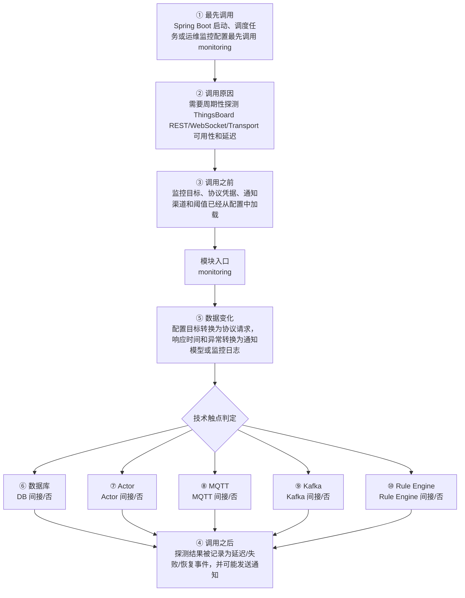

# ThingsBoard Monitoring Microservice 模块调用链分析

> 生成范围：`msa/monitoring`  
> Maven artifact：`monitoring`  
> packaging：`pom`  
> 分析方式：静态扫描 POM、Java 注解、入口方法、关键技术触点和类关系；不是运行时 trace。

## 完整流程图

## 十项调用链问题

| 问题 | 模块级结论 |
| --- | --- |
| ① 谁最先调用这里？ | Spring Boot 启动、调度任务或运维监控配置最先调用 monitoring |
| ② 为什么会调用？ | 需要周期性探测 ThingsBoard REST/WebSocket/Transport 可用性和延迟 |
| ③ 调用之前发生了什么？ | 监控目标、协议凭据、通知渠道和阈值已经从配置中加载 |
| ④ 调用之后发生什么？ | 探测结果被记录为延迟/失败/恢复事件，并可能发送通知 |
| ⑤ 数据如何变化？ | 配置目标转换为协议请求，响应时间和异常转换为通知模型或监控日志 |
| ⑥ 对数据库进行了哪些操作？ | 否，未发现直接操作证据；未发现直接源码证据；若发生，通常在依赖的下游模块中完成。 |
| ⑦ 是否发送 Actor 消息？ | 否，未发现直接操作证据；未发现直接源码证据；若发生，通常在依赖的下游模块中完成。 |
| ⑧ 是否发送 MQTT 消息？ | 否，未发现直接操作证据；未发现直接源码证据；若发生，通常在依赖的下游模块中完成。 |
| ⑨ 是否写入 Kafka？ | 否，未发现直接操作证据；未发现直接源码证据；若发生，通常在依赖的下游模块中完成。 |
| ⑩ 是否写入 Rule Engine？ | 否，未发现直接操作证据；未发现直接源码证据；若发生，通常在依赖的下游模块中完成。 |

## 入口证据

- 未发现 main、Spring 注解、Controller、Service、Repository、KafkaListener 或测试入口；本模块可能主要提供模型、接口、聚合或资源。

## 静态关键词统计（不等同于实际发送/写入）

- database: 0 处静态触点；未发现直接源码证据；若发生，通常在依赖的下游模块中完成。
- actor: 0 处静态触点；未发现直接源码证据；若发生，通常在依赖的下游模块中完成。
- mqtt: 0 处静态触点；未发现直接源码证据；若发生，通常在依赖的下游模块中完成。
- kafka: 0 处静态触点；未发现直接源码证据；若发生，通常在依赖的下游模块中完成。
- rule_engine: 0 处静态触点；未发现直接源码证据；若发生，通常在依赖的下游模块中完成。
- cache: 0 处静态触点；未发现直接源码证据；若发生，通常在依赖的下游模块中完成。
- queue: 0 处静态触点；未发现直接源码证据；若发生，通常在依赖的下游模块中完成。
- rest: 0 处静态触点；未发现直接源码证据；若发生，通常在依赖的下游模块中完成。
- websocket: 0 处静态触点；未发现直接源码证据；若发生，通常在依赖的下游模块中完成。
- transport: 0 处静态触点；未发现直接源码证据；若发生，通常在依赖的下游模块中完成。

## 调用前后数据流

1. 调用前：监控目标、协议凭据、通知渠道和阈值已经从配置中加载
2. 模块入口：`monitoring` 通过入口类、依赖 API、构建聚合或子模块暴露能力。
3. 模块内转换：配置目标转换为协议请求，响应时间和异常转换为通知模型或监控日志
4. 调用后：探测结果被记录为延迟/失败/恢复事件，并可能发送通知
5. 数据库/Actor/MQTT/Kafka/Rule Engine 这些动作若没有直接触点，通常发生在依赖的 `application`、`dao`、`common/queue`、`common/transport` 或 `rule-engine` 模块中。

## 子模块与依赖

### 子模块

- 无子模块。

### 主要依赖

- `org.thingsboard:monitoring`

## 关键类型样本

- 本模块没有直接 Java 类型。

## 阅读建议

- 先看“完整流程图”确认模块在全链路中的位置。
- 再看入口证据判断调用来源是 HTTP、MQTT/Transport、Actor、Kafka、Rule Engine、DAO、测试还是构建聚合。
- 最后用触点统计区分直接行为和下游间接行为，避免把依赖模块的数据库写入误认为本模块直接写入。
