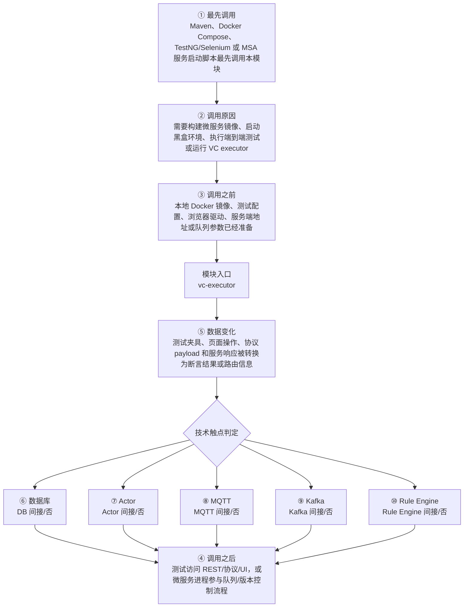

# ThingsBoard Version Control Executor 模块调用链分析

> 生成范围：`msa/vc-executor`  
> Maven artifact：`vc-executor`  
> packaging：`jar`  
> 分析方式：静态扫描 POM、Java 注解、入口方法、关键技术触点和类关系；不是运行时 trace。

## 完整流程图

## 十项调用链问题

| 问题 | 模块级结论 |
| --- | --- |
| ① 谁最先调用这里？ | Maven、Docker Compose、TestNG/Selenium 或 MSA 服务启动脚本最先调用本模块 |
| ② 为什么会调用？ | 需要构建微服务镜像、启动黑盒环境、执行端到端测试或运行 VC executor |
| ③ 调用之前发生了什么？ | 本地 Docker 镜像、测试配置、浏览器驱动、服务端地址或队列参数已经准备 |
| ④ 调用之后发生什么？ | 测试访问 REST/协议/UI，或微服务进程参与队列/版本控制流程 |
| ⑤ 数据如何变化？ | 测试夹具、页面操作、协议 payload 和服务响应被转换为断言结果或路由信息 |
| ⑥ 对数据库进行了哪些操作？ | 否，未发现直接操作证据；未发现直接源码证据；若发生，通常在依赖的下游模块中完成。 |
| ⑦ 是否发送 Actor 消息？ | 否，未发现直接操作证据；未发现直接源码证据；若发生，通常在依赖的下游模块中完成。 |
| ⑧ 是否发送 MQTT 消息？ | 否，未发现直接操作证据；未发现直接源码证据；若发生，通常在依赖的下游模块中完成。 |
| ⑨ 是否写入 Kafka？ | 否，未发现直接操作证据；未发现直接 Kafka API 调用，但可能通过 common queue 抽象间接写入 Kafka。 |
| ⑩ 是否写入 Rule Engine？ | 否，未发现直接操作证据；未发现直接源码证据；若发生，通常在依赖的下游模块中完成。 |

## 入口证据

- Spring Boot 应用启动入口: `msa/vc-executor/src/main/java/org/thingsboard/server/vc/ThingsboardVersionControlExecutorApplication.java`
- Spring Service 业务服务入口: `msa/vc-executor/src/main/java/org/thingsboard/server/vc/service/VersionControlQueueRoutingInfoService.java`
- Spring Service 业务服务入口: `msa/vc-executor/src/main/java/org/thingsboard/server/vc/service/VersionControlTenantRoutingInfoService.java`
- 命令行或进程启动入口: `msa/vc-executor/src/main/java/org/thingsboard/server/vc/ThingsboardVersionControlExecutorApplication.java`

## 静态关键词统计（不等同于实际发送/写入）

- database: 0 处静态触点；未发现直接源码证据；若发生，通常在依赖的下游模块中完成。
- actor: 0 处静态触点；未发现直接源码证据；若发生，通常在依赖的下游模块中完成。
- mqtt: 0 处静态触点；未发现直接源码证据；若发生，通常在依赖的下游模块中完成。
- kafka: 0 处静态触点；未发现直接 Kafka API 调用，但可能通过 common queue 抽象间接写入 Kafka。
- rule_engine: 0 处静态触点；未发现直接源码证据；若发生，通常在依赖的下游模块中完成。
- cache: 0 处静态触点；未发现直接源码证据；若发生，通常在依赖的下游模块中完成。
- queue: 10 处静态触点；直接操作证据：发现静态关键词触点。关键词触点 10 处仅作为辅助线索。
- rest: 0 处静态触点；未发现直接源码证据；若发生，通常在依赖的下游模块中完成。
- websocket: 0 处静态触点；未发现直接源码证据；若发生，通常在依赖的下游模块中完成。
- transport: 0 处静态触点；未发现直接源码证据；若发生，通常在依赖的下游模块中完成。

## 调用前后数据流

1. 调用前：本地 Docker 镜像、测试配置、浏览器驱动、服务端地址或队列参数已经准备
2. 模块入口：`vc-executor` 通过入口类、依赖 API、构建聚合或子模块暴露能力。
3. 模块内转换：测试夹具、页面操作、协议 payload 和服务响应被转换为断言结果或路由信息
4. 调用后：测试访问 REST/协议/UI，或微服务进程参与队列/版本控制流程
5. 数据库/Actor/MQTT/Kafka/Rule Engine 这些动作若没有直接触点，通常发生在依赖的 `application`、`dao`、`common/queue`、`common/transport` 或 `rule-engine` 模块中。

## 子模块与依赖

### 子模块

- 无子模块。

### 主要依赖

- `org.thingsboard.common:queue`
- `org.thingsboard.common:version-control`
- `org.springframework.boot:spring-boot-starter-web`
- `io.grpc:grpc-netty-shaded`
- `io.grpc:grpc-protobuf`
- `io.grpc:grpc-stub`
- `org.springframework.boot:spring-boot-starter-test`
- `org.junit.vintage:junit-vintage-engine`
- `org.awaitility:awaitility`

## 关键类型样本

- `ThingsboardVersionControlExecutorApplication` (class, `msa/vc-executor/src/main/java/org/thingsboard/server/vc/ThingsboardVersionControlExecutorApplication.java`)
- `VersionControlQueueRoutingInfoService` (class, `msa/vc-executor/src/main/java/org/thingsboard/server/vc/service/VersionControlQueueRoutingInfoService.java`)
- `VersionControlTenantRoutingInfoService` (class, `msa/vc-executor/src/main/java/org/thingsboard/server/vc/service/VersionControlTenantRoutingInfoService.java`)

## 阅读建议

- 先看“完整流程图”确认模块在全链路中的位置。
- 再看入口证据判断调用来源是 HTTP、MQTT/Transport、Actor、Kafka、Rule Engine、DAO、测试还是构建聚合。
- 最后用触点统计区分直接行为和下游间接行为，避免把依赖模块的数据库写入误认为本模块直接写入。
