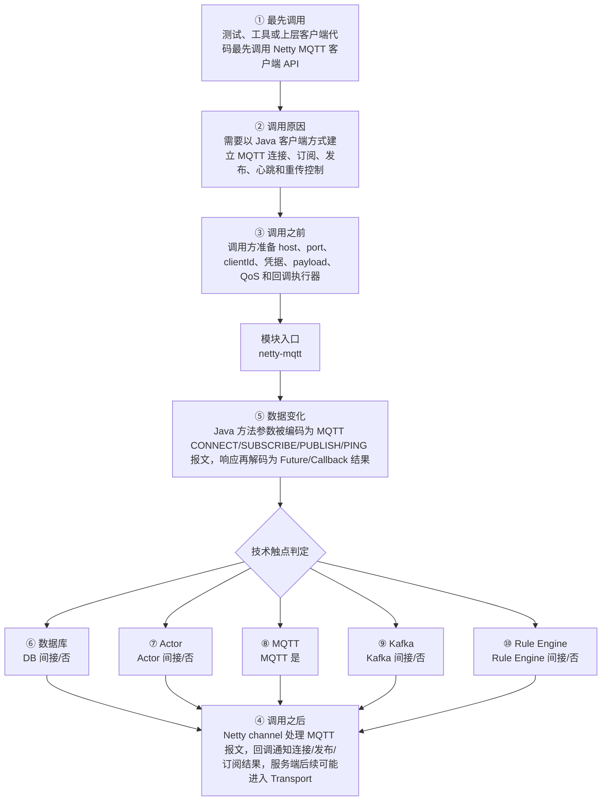

# Netty MQTT Client 模块调用链分析

> 生成范围：`netty-mqtt`  
> Maven artifact：`netty-mqtt`  
> packaging：`jar`  
> 分析方式：静态扫描 POM、Java 注解、入口方法、关键技术触点和类关系；不是运行时 trace。

## 完整流程图

## 十项调用链问题

| 问题 | 模块级结论 |
| --- | --- |
| ① 谁最先调用这里？ | 测试、工具或上层客户端代码最先调用 Netty MQTT 客户端 API |
| ② 为什么会调用？ | 需要以 Java 客户端方式建立 MQTT 连接、订阅、发布、心跳和重传控制 |
| ③ 调用之前发生了什么？ | 调用方准备 host、port、clientId、凭据、payload、QoS 和回调执行器 |
| ④ 调用之后发生什么？ | Netty channel 处理 MQTT 报文，回调通知连接/发布/订阅结果，服务端后续可能进入 Transport |
| ⑤ 数据如何变化？ | Java 方法参数被编码为 MQTT CONNECT/SUBSCRIBE/PUBLISH/PING 报文，响应再解码为 Future/Callback 结果 |
| ⑥ 对数据库进行了哪些操作？ | 否，未发现直接操作证据；未发现直接源码证据；若发生，通常在依赖的下游模块中完成。 |
| ⑦ 是否发送 Actor 消息？ | 否，未发现直接操作证据；未发现直接源码证据；若发生，通常在依赖的下游模块中完成。 |
| ⑧ 是否发送 MQTT 消息？ | 是，发现直接操作证据；直接操作证据：发现 MQTT client/handler/publish/subscribe/writeAndFlush 等操作模式。关键词触点 1819 处仅作为辅助线索。 |
| ⑨ 是否写入 Kafka？ | 否，未发现直接操作证据；未发现直接源码证据；若发生，通常在依赖的下游模块中完成。 |
| ⑩ 是否写入 Rule Engine？ | 否，未发现直接操作证据；未发现直接源码证据；若发生，通常在依赖的下游模块中完成。 |

## 入口证据

- Netty pipeline 入口: `netty-mqtt/src/main/java/org/thingsboard/mqtt/MqttChannelHandler.java`
- Netty pipeline 入口: `netty-mqtt/src/main/java/org/thingsboard/mqtt/MqttClientImpl.java`
- Netty pipeline 入口: `netty-mqtt/src/main/java/org/thingsboard/mqtt/MqttClientImpl.java`
- Netty pipeline 入口: `netty-mqtt/src/main/java/org/thingsboard/mqtt/MqttPingHandler.java`
- Netty pipeline 入口: `netty-mqtt/src/test/java/org/thingsboard/mqtt/MqttPingHandlerTest.java`
- Netty pipeline 入口: `netty-mqtt/src/test/java/org/thingsboard/mqtt/integration/server/MqttTransportHandler.java`
- 测试框架入口: `netty-mqtt/src/test/java/org/thingsboard/mqtt/MqttPingHandlerTest.java`
- 测试框架入口: `netty-mqtt/src/test/java/org/thingsboard/mqtt/integration/MqttIntegrationTest.java`

## 静态关键词统计（不等同于实际发送/写入）

- database: 0 处静态触点；未发现直接源码证据；若发生，通常在依赖的下游模块中完成。
- actor: 0 处静态触点；未发现直接源码证据；若发生，通常在依赖的下游模块中完成。
- mqtt: 1819 处静态触点；直接操作证据：发现 MQTT client/handler/publish/subscribe/writeAndFlush 等操作模式。关键词触点 1819 处仅作为辅助线索。
- kafka: 0 处静态触点；未发现直接源码证据；若发生，通常在依赖的下游模块中完成。
- rule_engine: 0 处静态触点；未发现直接源码证据；若发生，通常在依赖的下游模块中完成。
- cache: 0 处静态触点；未发现直接源码证据；若发生，通常在依赖的下游模块中完成。
- queue: 12 处静态触点；直接操作证据：发现静态关键词触点。关键词触点 12 处仅作为辅助线索。
- rest: 0 处静态触点；未发现直接源码证据；若发生，通常在依赖的下游模块中完成。
- websocket: 33 处静态触点；直接操作证据：发现静态关键词触点。关键词触点 33 处仅作为辅助线索。
- transport: 11 处静态触点；直接操作证据：发现静态关键词触点。关键词触点 11 处仅作为辅助线索。

## 调用前后数据流

1. 调用前：调用方准备 host、port、clientId、凭据、payload、QoS 和回调执行器
2. 模块入口：`netty-mqtt` 通过入口类、依赖 API、构建聚合或子模块暴露能力。
3. 模块内转换：Java 方法参数被编码为 MQTT CONNECT/SUBSCRIBE/PUBLISH/PING 报文，响应再解码为 Future/Callback 结果
4. 调用后：Netty channel 处理 MQTT 报文，回调通知连接/发布/订阅结果，服务端后续可能进入 Transport
5. 数据库/Actor/MQTT/Kafka/Rule Engine 这些动作若没有直接触点，通常发生在依赖的 `application`、`dao`、`common/queue`、`common/transport` 或 `rule-engine` 模块中。

## 子模块与依赖

### 子模块

- 无子模块。

### 主要依赖

- `org.thingsboard.common:util`
- `io.netty:netty-codec-mqtt`
- `io.netty:netty-handler`
- `com.google.code.findbugs:jsr305`
- `com.google.guava:guava`
- `org.slf4j:slf4j-api`
- `org.slf4j:log4j-over-slf4j`
- `ch.qos.logback:logback-core`
- `ch.qos.logback:logback-classic`
- `org.springframework.boot:spring-boot-starter-test`
- `org.junit.vintage:junit-vintage-engine`
- `org.awaitility:awaitility`
- `io.takari.junit:takari-cpsuite`

## 关键类型样本

- `ChannelClosedException` (class, `netty-mqtt/src/main/java/org/thingsboard/mqtt/ChannelClosedException.java`)
- `MqttChannelHandler` (class, `netty-mqtt/src/main/java/org/thingsboard/mqtt/MqttChannelHandler.java`)
- `MqttClient` (interface, `netty-mqtt/src/main/java/org/thingsboard/mqtt/MqttClient.java`)
- `MqttClientCallback` (interface, `netty-mqtt/src/main/java/org/thingsboard/mqtt/MqttClientCallback.java`)
- `MqttClientConfig` (class, `netty-mqtt/src/main/java/org/thingsboard/mqtt/MqttClientConfig.java`)
- `MqttClientImpl` (class, `netty-mqtt/src/main/java/org/thingsboard/mqtt/MqttClientImpl.java`)
- `MqttChannelInitializer` (class, `netty-mqtt/src/main/java/org/thingsboard/mqtt/MqttClientImpl.java`)
- `MqttConnectResult` (class, `netty-mqtt/src/main/java/org/thingsboard/mqtt/MqttConnectResult.java`)
- `MqttHandler` (interface, `netty-mqtt/src/main/java/org/thingsboard/mqtt/MqttHandler.java`)
- `MqttIncomingQos2Publish` (class, `netty-mqtt/src/main/java/org/thingsboard/mqtt/MqttIncomingQos2Publish.java`)
- `MqttLastWill` (class, `netty-mqtt/src/main/java/org/thingsboard/mqtt/MqttLastWill.java`)
- `Builder` (class, `netty-mqtt/src/main/java/org/thingsboard/mqtt/MqttLastWill.java`)
- `MqttPendingPublish` (class, `netty-mqtt/src/main/java/org/thingsboard/mqtt/MqttPendingPublish.java`)
- `MqttPendingSubscription` (class, `netty-mqtt/src/main/java/org/thingsboard/mqtt/MqttPendingSubscription.java`)
- `MqttPendingHandler` (class, `netty-mqtt/src/main/java/org/thingsboard/mqtt/MqttPendingSubscription.java`)
- `MqttPendingUnsubscription` (class, `netty-mqtt/src/main/java/org/thingsboard/mqtt/MqttPendingUnsubscription.java`)
- `MqttPingHandler` (class, `netty-mqtt/src/main/java/org/thingsboard/mqtt/MqttPingHandler.java`)
- `MqttSubscription` (class, `netty-mqtt/src/main/java/org/thingsboard/mqtt/MqttSubscription.java`)
- `PendingOperation` (interface, `netty-mqtt/src/main/java/org/thingsboard/mqtt/PendingOperation.java`)
- `RetransmissionHandler` (class, `netty-mqtt/src/main/java/org/thingsboard/mqtt/RetransmissionHandler.java`)
- `MqttPingHandlerTest` (class, `netty-mqtt/src/test/java/org/thingsboard/mqtt/MqttPingHandlerTest.java`)
- `IntegrationTestSuite` (class, `netty-mqtt/src/test/java/org/thingsboard/mqtt/integration/IntegrationTestSuite.java`)
- `MqttIntegrationTest` (class, `netty-mqtt/src/test/java/org/thingsboard/mqtt/integration/MqttIntegrationTest.java`)
- `MqttServer` (class, `netty-mqtt/src/test/java/org/thingsboard/mqtt/integration/server/MqttServer.java`)
- `MqttTransportHandler` (class, `netty-mqtt/src/test/java/org/thingsboard/mqtt/integration/server/MqttTransportHandler.java`)

## 阅读建议

- 先看“完整流程图”确认模块在全链路中的位置。
- 再看入口证据判断调用来源是 HTTP、MQTT/Transport、Actor、Kafka、Rule Engine、DAO、测试还是构建聚合。
- 最后用触点统计区分直接行为和下游间接行为，避免把依赖模块的数据库写入误认为本模块直接写入。
