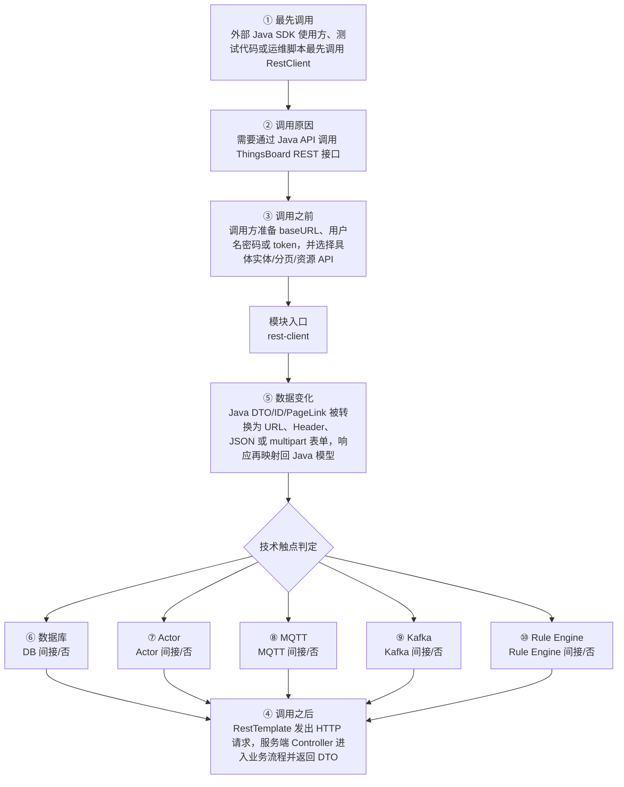

# Thingsboard Rest Client 模块调用链分析

> 生成范围：`rest-client`  
> Maven artifact：`rest-client`  
> packaging：`jar`  
> 分析方式：静态扫描 POM、Java 注解、入口方法、关键技术触点和类关系；不是运行时 trace。

## 完整流程图

## 十项调用链问题

| 问题 | 模块级结论 |
| --- | --- |
| ① 谁最先调用这里？ | 外部 Java SDK 使用方、测试代码或运维脚本最先调用 RestClient |
| ② 为什么会调用？ | 需要通过 Java API 调用 ThingsBoard REST 接口 |
| ③ 调用之前发生了什么？ | 调用方准备 baseURL、用户名密码或 token，并选择具体实体/分页/资源 API |
| ④ 调用之后发生什么？ | RestTemplate 发出 HTTP 请求，服务端 Controller 进入业务流程并返回 DTO |
| ⑤ 数据如何变化？ | Java DTO/ID/PageLink 被转换为 URL、Header、JSON 或 multipart 表单，响应再映射回 Java 模型 |
| ⑥ 对数据库进行了哪些操作？ | 否，未发现直接操作证据；未发现直接源码证据；若发生，通常在依赖的下游模块中完成。 |
| ⑦ 是否发送 Actor 消息？ | 否，未发现直接操作证据；未发现直接源码证据；若发生，通常在依赖的下游模块中完成。 |
| ⑧ 是否发送 MQTT 消息？ | 否，未发现直接操作证据；未发现直接源码证据；若发生，通常在依赖的下游模块中完成。 |
| ⑨ 是否写入 Kafka？ | 否，未发现直接操作证据；未发现直接源码证据；若发生，通常在依赖的下游模块中完成。 |
| ⑩ 是否写入 Rule Engine？ | 否，未发现直接操作证据；未发现直接源码证据；若发生，通常在依赖的下游模块中完成。 |

## 入口证据

- 未发现 main、Spring 注解、Controller、Service、Repository、KafkaListener 或测试入口；本模块可能主要提供模型、接口、聚合或资源。

## 静态关键词统计（不等同于实际发送/写入）

- database: 70 处静态触点；未发现直接源码证据；若发生，通常在依赖的下游模块中完成。
- actor: 0 处静态触点；未发现直接源码证据；若发生，通常在依赖的下游模块中完成。
- mqtt: 0 处静态触点；未发现直接源码证据；若发生，通常在依赖的下游模块中完成。
- kafka: 0 处静态触点；未发现直接源码证据；若发生，通常在依赖的下游模块中完成。
- rule_engine: 177 处静态触点；未发现直接源码证据；若发生，通常在依赖的下游模块中完成。
- cache: 0 处静态触点；未发现直接源码证据；若发生，通常在依赖的下游模块中完成。
- queue: 26 处静态触点；直接操作证据：发现静态关键词触点。关键词触点 26 处仅作为辅助线索。
- rest: 629 处静态触点；直接操作证据：发现静态关键词触点。关键词触点 629 处仅作为辅助线索。
- websocket: 14 处静态触点；直接操作证据：发现静态关键词触点。关键词触点 14 处仅作为辅助线索。
- transport: 8 处静态触点；直接操作证据：发现静态关键词触点。关键词触点 8 处仅作为辅助线索。

## 调用前后数据流

1. 调用前：调用方准备 baseURL、用户名密码或 token，并选择具体实体/分页/资源 API
2. 模块入口：`rest-client` 通过入口类、依赖 API、构建聚合或子模块暴露能力。
3. 模块内转换：Java DTO/ID/PageLink 被转换为 URL、Header、JSON 或 multipart 表单，响应再映射回 Java 模型
4. 调用后：RestTemplate 发出 HTTP 请求，服务端 Controller 进入业务流程并返回 DTO
5. 数据库/Actor/MQTT/Kafka/Rule Engine 这些动作若没有直接触点，通常发生在依赖的 `application`、`dao`、`common/queue`、`common/transport` 或 `rule-engine` 模块中。

## 子模块与依赖

### 子模块

- 无子模块。

### 主要依赖

- `org.thingsboard.common:data`
- `org.springframework:spring-web`
- `org.thingsboard.common:util`
- `com.auth0:java-jwt`

## 关键类型样本

- `RestClient` (class, `rest-client/src/main/java/org/thingsboard/rest/client/RestClient.java`)
- `RestJsonConverter` (class, `rest-client/src/main/java/org/thingsboard/rest/client/utils/RestJsonConverter.java`)

## 阅读建议

- 先看“完整流程图”确认模块在全链路中的位置。
- 再看入口证据判断调用来源是 HTTP、MQTT/Transport、Actor、Kafka、Rule Engine、DAO、测试还是构建聚合。
- 最后用触点统计区分直接行为和下游间接行为，避免把依赖模块的数据库写入误认为本模块直接写入。
