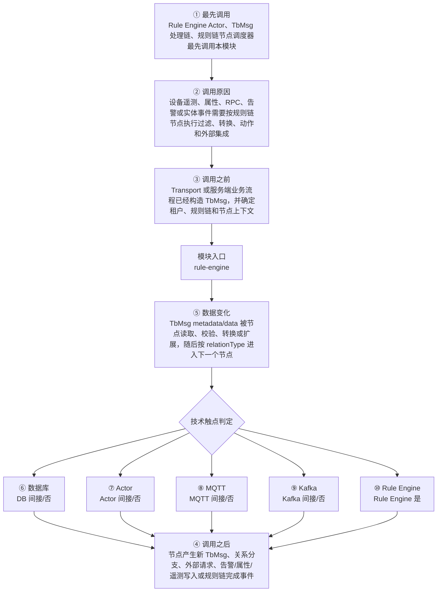

# Thingsboard Extensions 模块调用链分析

> 生成范围：`rule-engine`  
> Maven artifact：`rule-engine`  
> packaging：`pom`  
> 分析方式：静态扫描 POM、Java 注解、入口方法、关键技术触点和类关系；不是运行时 trace。

## 完整流程图

## 十项调用链问题

| 问题 | 模块级结论 |
| --- | --- |
| ① 谁最先调用这里？ | Rule Engine Actor、TbMsg 处理链、规则链节点调度器最先调用本模块 |
| ② 为什么会调用？ | 设备遥测、属性、RPC、告警或实体事件需要按规则链节点执行过滤、转换、动作和外部集成 |
| ③ 调用之前发生了什么？ | Transport 或服务端业务流程已经构造 TbMsg，并确定租户、规则链和节点上下文 |
| ④ 调用之后发生什么？ | 节点产生新 TbMsg、关系分支、外部请求、告警/属性/遥测写入或规则链完成事件 |
| ⑤ 数据如何变化？ | TbMsg metadata/data 被节点读取、校验、转换或扩展，随后按 relationType 进入下一个节点 |
| ⑥ 对数据库进行了哪些操作？ | 否，未发现直接操作证据；未发现直接源码证据；若发生，通常在依赖的下游模块中完成。 |
| ⑦ 是否发送 Actor 消息？ | 否，未发现直接操作证据；未发现直接源码证据；若发生，通常在依赖的下游模块中完成。 |
| ⑧ 是否发送 MQTT 消息？ | 否，未发现直接操作证据；未发现直接源码证据；若发生，通常在依赖的下游模块中完成。 |
| ⑨ 是否写入 Kafka？ | 否，未发现直接操作证据；未发现直接源码证据；若发生，通常在依赖的下游模块中完成。 |
| ⑩ 是否写入 Rule Engine？ | 是，发现直接操作证据；直接操作证据：模块位于 rule-engine 路径，直接承载规则节点或规则引擎 API。关键词触点 0 处仅作为辅助线索。 |

## 入口证据

- 未发现 main、Spring 注解、Controller、Service、Repository、KafkaListener 或测试入口；本模块可能主要提供模型、接口、聚合或资源。

## 静态关键词统计（不等同于实际发送/写入）

- database: 0 处静态触点；未发现直接源码证据；若发生，通常在依赖的下游模块中完成。
- actor: 0 处静态触点；未发现直接源码证据；若发生，通常在依赖的下游模块中完成。
- mqtt: 0 处静态触点；未发现直接源码证据；若发生，通常在依赖的下游模块中完成。
- kafka: 0 处静态触点；未发现直接源码证据；若发生，通常在依赖的下游模块中完成。
- rule_engine: 0 处静态触点；直接操作证据：模块位于 rule-engine 路径，直接承载规则节点或规则引擎 API。关键词触点 0 处仅作为辅助线索。
- cache: 0 处静态触点；未发现直接源码证据；若发生，通常在依赖的下游模块中完成。
- queue: 0 处静态触点；未发现直接源码证据；若发生，通常在依赖的下游模块中完成。
- rest: 0 处静态触点；未发现直接源码证据；若发生，通常在依赖的下游模块中完成。
- websocket: 0 处静态触点；未发现直接源码证据；若发生，通常在依赖的下游模块中完成。
- transport: 0 处静态触点；未发现直接源码证据；若发生，通常在依赖的下游模块中完成。

## 调用前后数据流

1. 调用前：Transport 或服务端业务流程已经构造 TbMsg，并确定租户、规则链和节点上下文
2. 模块入口：`rule-engine` 通过入口类、依赖 API、构建聚合或子模块暴露能力。
3. 模块内转换：TbMsg metadata/data 被节点读取、校验、转换或扩展，随后按 relationType 进入下一个节点
4. 调用后：节点产生新 TbMsg、关系分支、外部请求、告警/属性/遥测写入或规则链完成事件
5. 数据库/Actor/MQTT/Kafka/Rule Engine 这些动作若没有直接触点，通常发生在依赖的 `application`、`dao`、`common/queue`、`common/transport` 或 `rule-engine` 模块中。

## 子模块与依赖

### 子模块

- `rule-engine-api`
- `rule-engine-components`

### 主要依赖

- POM 中未声明直接依赖或依赖由父 POM 管理。

## 关键类型样本

- 本模块没有直接 Java 类型。

## 阅读建议

- 先看“完整流程图”确认模块在全链路中的位置。
- 再看入口证据判断调用来源是 HTTP、MQTT/Transport、Actor、Kafka、Rule Engine、DAO、测试还是构建聚合。
- 最后用触点统计区分直接行为和下游间接行为，避免把依赖模块的数据库写入误认为本模块直接写入。
