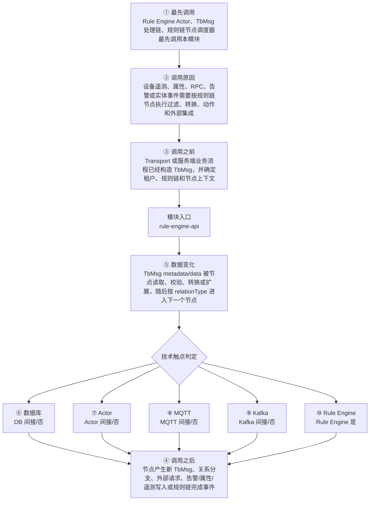

# Thingsboard Rule Engine API 模块调用链分析

> 生成范围：`rule-engine/rule-engine-api`  
> Maven artifact：`rule-engine-api`  
> packaging：`jar`  
> 分析方式：静态扫描 POM、Java 注解、入口方法、关键技术触点和类关系；不是运行时 trace。

## 完整流程图

## 十项调用链问题

| 问题 | 模块级结论 |
| --- | --- |
| ① 谁最先调用这里？ | Rule Engine Actor、TbMsg 处理链、规则链节点调度器最先调用本模块 |
| ② 为什么会调用？ | 设备遥测、属性、RPC、告警或实体事件需要按规则链节点执行过滤、转换、动作和外部集成 |
| ③ 调用之前发生了什么？ | Transport 或服务端业务流程已经构造 TbMsg，并确定租户、规则链和节点上下文 |
| ④ 调用之后发生什么？ | 节点产生新 TbMsg、关系分支、外部请求、告警/属性/遥测写入或规则链完成事件 |
| ⑤ 数据如何变化？ | TbMsg metadata/data 被节点读取、校验、转换或扩展，随后按 relationType 进入下一个节点 |
| ⑥ 对数据库进行了哪些操作？ | 否，未发现直接操作证据；未在本模块源码中直接写库，但 POM 依赖显示可能通过 DAO/数据库组件间接发生。 |
| ⑦ 是否发送 Actor 消息？ | 否，未发现直接操作证据；未发现直接 Actor API 调用，但可能通过服务端消息模型间接进入 Actor。 |
| ⑧ 是否发送 MQTT 消息？ | 否，未发现直接操作证据；未发现直接源码证据；若发生，通常在依赖的下游模块中完成。 |
| ⑨ 是否写入 Kafka？ | 否，未发现直接操作证据；未发现直接源码证据；若发生，通常在依赖的下游模块中完成。 |
| ⑩ 是否写入 Rule Engine？ | 是，发现直接操作证据；直接操作证据：模块位于 rule-engine 路径，直接承载规则节点或规则引擎 API。关键词触点 214 处仅作为辅助线索。 |

## 入口证据

- 测试框架入口: `rule-engine/rule-engine-api/src/test/java/org/thingsboard/rule/engine/api/util/TbNodeUtilsTest.java`

## 静态关键词统计（不等同于实际发送/写入）

- database: 87 处静态触点；未在本模块源码中直接写库，但 POM 依赖显示可能通过 DAO/数据库组件间接发生。
- actor: 2 处静态触点；未发现直接 Actor API 调用，但可能通过服务端消息模型间接进入 Actor。
- mqtt: 0 处静态触点；未发现直接源码证据；若发生，通常在依赖的下游模块中完成。
- kafka: 0 处静态触点；未发现直接源码证据；若发生，通常在依赖的下游模块中完成。
- rule_engine: 214 处静态触点；直接操作证据：模块位于 rule-engine 路径，直接承载规则节点或规则引擎 API。关键词触点 214 处仅作为辅助线索。
- cache: 6 处静态触点；直接操作证据：发现静态关键词触点。关键词触点 6 处仅作为辅助线索。
- queue: 49 处静态触点；直接操作证据：发现静态关键词触点。关键词触点 49 处仅作为辅助线索。
- rest: 0 处静态触点；未发现直接源码证据；若发生，通常在依赖的下游模块中完成。
- websocket: 25 处静态触点；直接操作证据：发现静态关键词触点。关键词触点 25 处仅作为辅助线索。
- transport: 0 处静态触点；未发现直接源码证据；若发生，通常在依赖的下游模块中完成。

## 调用前后数据流

1. 调用前：Transport 或服务端业务流程已经构造 TbMsg，并确定租户、规则链和节点上下文
2. 模块入口：`rule-engine-api` 通过入口类、依赖 API、构建聚合或子模块暴露能力。
3. 模块内转换：TbMsg metadata/data 被节点读取、校验、转换或扩展，随后按 relationType 进入下一个节点
4. 调用后：节点产生新 TbMsg、关系分支、外部请求、告警/属性/遥测写入或规则链完成事件
5. 数据库/Actor/MQTT/Kafka/Rule Engine 这些动作若没有直接触点，通常发生在依赖的 `application`、`dao`、`common/queue`、`common/transport` 或 `rule-engine` 模块中。

## 子模块与依赖

### 子模块

- 无子模块。

### 主要依赖

- `org.thingsboard.common:message`
- `org.thingsboard.common:dao-api`
- `org.thingsboard.common:cluster-api`
- `org.thingsboard.common:util`
- `io.netty:netty-all`
- `io.netty:netty-tcnative-boringssl-static`
- `com.google.guava:guava`
- `ch.qos.logback:logback-core`
- `ch.qos.logback:logback-classic`
- `com.datastax.oss:java-driver-core`
- `org.springframework.data:spring-data-redis`
- `com.sun.mail:javax.mail`
- `org.springframework.boot:spring-boot-starter-test`
- `org.junit.vintage:junit-vintage-engine`
- `org.awaitility:awaitility`

## 关键类型样本

- `EmptyNodeConfiguration` (class, `rule-engine/rule-engine-api/src/main/java/org/thingsboard/rule/engine/api/EmptyNodeConfiguration.java`)
- `MailService` (interface, `rule-engine/rule-engine-api/src/main/java/org/thingsboard/rule/engine/api/MailService.java`)
- `NodeConfiguration` (interface, `rule-engine/rule-engine-api/src/main/java/org/thingsboard/rule/engine/api/NodeConfiguration.java`)
- `NodeDefinition` (class, `rule-engine/rule-engine-api/src/main/java/org/thingsboard/rule/engine/api/NodeDefinition.java`)
- `NotificationCenter` (interface, `rule-engine/rule-engine-api/src/main/java/org/thingsboard/rule/engine/api/NotificationCenter.java`)
- `RuleEngineAlarmService` (interface, `rule-engine/rule-engine-api/src/main/java/org/thingsboard/rule/engine/api/RuleEngineAlarmService.java`)
- `RuleEngineApiUsageStateService` (interface, `rule-engine/rule-engine-api/src/main/java/org/thingsboard/rule/engine/api/RuleEngineApiUsageStateService.java`)
- `RuleEngineAssetProfileCache` (interface, `rule-engine/rule-engine-api/src/main/java/org/thingsboard/rule/engine/api/RuleEngineAssetProfileCache.java`)
- `RuleEngineDeviceProfileCache` (interface, `rule-engine/rule-engine-api/src/main/java/org/thingsboard/rule/engine/api/RuleEngineDeviceProfileCache.java`)
- `RuleEngineDeviceRpcRequest` (class, `rule-engine/rule-engine-api/src/main/java/org/thingsboard/rule/engine/api/RuleEngineDeviceRpcRequest.java`)
- `RuleEngineDeviceRpcResponse` (class, `rule-engine/rule-engine-api/src/main/java/org/thingsboard/rule/engine/api/RuleEngineDeviceRpcResponse.java`)
- `RuleEngineDeviceStateManager` (interface, `rule-engine/rule-engine-api/src/main/java/org/thingsboard/rule/engine/api/RuleEngineDeviceStateManager.java`)
- `RuleEngineRpcService` (interface, `rule-engine/rule-engine-api/src/main/java/org/thingsboard/rule/engine/api/RuleEngineRpcService.java`)
- `RuleEngineTelemetryService` (interface, `rule-engine/rule-engine-api/src/main/java/org/thingsboard/rule/engine/api/RuleEngineTelemetryService.java`)
- `RuleNode` (interface, `rule-engine/rule-engine-api/src/main/java/org/thingsboard/rule/engine/api/RuleNode.java`)
- `ScriptEngine` (interface, `rule-engine/rule-engine-api/src/main/java/org/thingsboard/rule/engine/api/ScriptEngine.java`)
- `SmsService` (interface, `rule-engine/rule-engine-api/src/main/java/org/thingsboard/rule/engine/api/SmsService.java`)
- `TbContext` (interface, `rule-engine/rule-engine-api/src/main/java/org/thingsboard/rule/engine/api/TbContext.java`)
- `TbEmail` (class, `rule-engine/rule-engine-api/src/main/java/org/thingsboard/rule/engine/api/TbEmail.java`)
- `TbNode` (interface, `rule-engine/rule-engine-api/src/main/java/org/thingsboard/rule/engine/api/TbNode.java`)
- `TbNodeConfiguration` (class, `rule-engine/rule-engine-api/src/main/java/org/thingsboard/rule/engine/api/TbNodeConfiguration.java`)
- `TbNodeException` (class, `rule-engine/rule-engine-api/src/main/java/org/thingsboard/rule/engine/api/TbNodeException.java`)
- `TbNodeState` (class, `rule-engine/rule-engine-api/src/main/java/org/thingsboard/rule/engine/api/TbNodeState.java`)
- `FirebaseService` (interface, `rule-engine/rule-engine-api/src/main/java/org/thingsboard/rule/engine/api/notification/FirebaseService.java`)
- `SlackService` (interface, `rule-engine/rule-engine-api/src/main/java/org/thingsboard/rule/engine/api/notification/SlackService.java`)
- `SmsSender` (interface, `rule-engine/rule-engine-api/src/main/java/org/thingsboard/rule/engine/api/sms/SmsSender.java`)
- `SmsSenderFactory` (interface, `rule-engine/rule-engine-api/src/main/java/org/thingsboard/rule/engine/api/sms/SmsSenderFactory.java`)
- `SmsException` (class, `rule-engine/rule-engine-api/src/main/java/org/thingsboard/rule/engine/api/sms/exception/SmsException.java`)
- `SmsParseException` (class, `rule-engine/rule-engine-api/src/main/java/org/thingsboard/rule/engine/api/sms/exception/SmsParseException.java`)
- `SmsSendException` (class, `rule-engine/rule-engine-api/src/main/java/org/thingsboard/rule/engine/api/sms/exception/SmsSendException.java`)
- `TbNodeUtils` (class, `rule-engine/rule-engine-api/src/main/java/org/thingsboard/rule/engine/api/util/TbNodeUtils.java`)
- `TbNodeUtilsTest` (class, `rule-engine/rule-engine-api/src/test/java/org/thingsboard/rule/engine/api/util/TbNodeUtilsTest.java`)

## 阅读建议

- 先看“完整流程图”确认模块在全链路中的位置。
- 再看入口证据判断调用来源是 HTTP、MQTT/Transport、Actor、Kafka、Rule Engine、DAO、测试还是构建聚合。
- 最后用触点统计区分直接行为和下游间接行为，避免把依赖模块的数据库写入误认为本模块直接写入。
