# Thingsboard Rule Engine API 模块继承体系分析

> 生成范围：`rule-engine/rule-engine-api`  
> Maven artifact：`rule-engine-api`  
> Java 类型数量：32  
> 分析方式：静态扫描 `class/interface/enum/record` 的 `extends`、`implements`、方法签名和源码触点。

## 完整继承树

```text
Exception
├── TbNodeException
NodeConfiguration
├── «implements» EmptyNodeConfiguration
Object/外部框架
├── EmptyNodeConfiguration
├── NodeDefinition
├── RuleEngineDeviceRpcRequest
├── RuleEngineDeviceRpcResponse
├── TbEmail
├── TbNodeConfiguration
├── TbNodeState
├── TbNodeUtils
├── TbNodeUtilsTest
RuntimeException
├── SmsException
├── ├── SmsParseException
├── ├── SmsSendException
TbActorError
├── «implements» TbNodeException
```

## 继承图

```mermaid
flowchart TD
    Object______p0["Object/外部框架"] -->|extends| EmptyNodeConfiguration_c0["EmptyNodeConfiguration"]
    NodeConfiguration_p1["NodeConfiguration"] -->|implements| EmptyNodeConfiguration_c1["EmptyNodeConfiguration"]
    Object______p2["Object/外部框架"] -->|extends| NodeDefinition_c2["NodeDefinition"]
    Object______p3["Object/外部框架"] -->|extends| RuleEngineDeviceRpcRequest_c3["RuleEngineDeviceRpcRequest"]
    Object______p4["Object/外部框架"] -->|extends| RuleEngineDeviceRpcResponse_c4["RuleEngineDeviceRpcResponse"]
    Object______p5["Object/外部框架"] -->|extends| TbEmail_c5["TbEmail"]
    Object______p6["Object/外部框架"] -->|extends| TbNodeConfiguration_c6["TbNodeConfiguration"]
    Exception_p7["Exception"] -->|extends| TbNodeException_c7["TbNodeException"]
    TbActorError_p8["TbActorError"] -->|implements| TbNodeException_c8["TbNodeException"]
    Object______p9["Object/外部框架"] -->|extends| TbNodeState_c9["TbNodeState"]
    RuntimeException_p10["RuntimeException"] -->|extends| SmsException_c10["SmsException"]
    SmsException_p11["SmsException"] -->|extends| SmsParseException_c11["SmsParseException"]
    SmsException_p12["SmsException"] -->|extends| SmsSendException_c12["SmsSendException"]
    Object______p13["Object/外部框架"] -->|extends| TbNodeUtils_c13["TbNodeUtils"]
    Object______p14["Object/外部框架"] -->|extends| TbNodeUtilsTest_c14["TbNodeUtilsTest"]
```




## 每一层为什么存在

- 外部/上层父类或接口层：提供框架生命周期、Java 标准契约、Spring/Netty/DAO/Rule Engine 等扩展点。
- 接口层：定义跨模块契约，让调用方依赖稳定 API，而不是具体实现。
- 抽象类层：沉淀公共状态、校验、模板流程和默认实现，把变化点留给子类。
- 具体类层：完成协议、DAO、Controller、Rule Node、工具或测试场景中的最终业务动作。

## 抽象了什么

- 父类/接口抽象公共生命周期、输入输出契约、错误处理、协议适配、DAO 查询形态、消息处理模板或测试夹具。
- 子类保留具体协议、实体类型、规则节点行为、数据库实现、页面/测试步骤或命令参数差异。
- 对聚合或无 Java 模块，抽象体现在 Maven 子模块划分和构建生命周期，而不是 Java 继承。

## 父类负责什么

- 提供稳定方法签名、共享字段、默认流程、通用校验、资源释放和框架回调入口。
- 在 Spring、Netty、DAO、Rule Engine、Transport 等框架中，父类还负责让运行时可以通过统一类型调度不同实现。

## 子类负责什么

- 实现具体业务差异，例如协议解析、实体 DAO、规则节点处理、Controller API、客户端命令或测试用例。
- 覆盖父类预留的扩展点，把模块特有数据转换、数据库查询、消息发送或外部调用补进去。

## 为什么不用组合

- 继承用于框架生命周期和模板方法：运行时需要把子类当作父类处理，例如 Spring Bean、Netty Handler、DAO Repository、Rule Node 或测试基类。
- 组合适合注入协作者，本模块中仍然通过字段依赖使用组合；但当需要统一回调签名、共享模板流程或多态派发时，单纯组合不能替代继承。

## 为什么不用接口

- 接口只能表达契约，不能集中保存公共状态、默认校验、资源关闭和模板流程。
- 当模块只需要契约时会使用接口；当多个实现还需要共享代码、默认行为或受保护扩展点时使用抽象类。

## 模板方法

- `MailService.updateMailConfiguration()` (package, `rule-engine/rule-engine-api/src/main/java/org/thingsboard/rule/engine/api/MailService.java`)
- `MailService.sendResetPasswordEmailAsync()` (package, `rule-engine/rule-engine-api/src/main/java/org/thingsboard/rule/engine/api/MailService.java`)
- `MailService.isConfigured()` (package, `rule-engine/rule-engine-api/src/main/java/org/thingsboard/rule/engine/api/MailService.java`)
- `NodeConfiguration.defaultConfiguration()` (package, `rule-engine/rule-engine-api/src/main/java/org/thingsboard/rule/engine/api/NodeConfiguration.java`)
- `NotificationCenter.processNotificationRequest()` (package, `rule-engine/rule-engine-api/src/main/java/org/thingsboard/rule/engine/api/NotificationCenter.java`)
- `NotificationCenter.sendGeneralWebNotification()` (package, `rule-engine/rule-engine-api/src/main/java/org/thingsboard/rule/engine/api/NotificationCenter.java`)
- `NotificationCenter.deleteNotificationRequest()` (package, `rule-engine/rule-engine-api/src/main/java/org/thingsboard/rule/engine/api/NotificationCenter.java`)
- `NotificationCenter.markNotificationAsRead()` (package, `rule-engine/rule-engine-api/src/main/java/org/thingsboard/rule/engine/api/NotificationCenter.java`)
- `NotificationCenter.markAllNotificationsAsRead()` (package, `rule-engine/rule-engine-api/src/main/java/org/thingsboard/rule/engine/api/NotificationCenter.java`)
- `NotificationCenter.deleteNotification()` (package, `rule-engine/rule-engine-api/src/main/java/org/thingsboard/rule/engine/api/NotificationCenter.java`)
- `NotificationCenter.getAvailableDeliveryMethods()` (package, `rule-engine/rule-engine-api/src/main/java/org/thingsboard/rule/engine/api/NotificationCenter.java`)
- `RuleEngineAlarmService.createAlarm()` (package, `rule-engine/rule-engine-api/src/main/java/org/thingsboard/rule/engine/api/RuleEngineAlarmService.java`)
- `RuleEngineAlarmService.updateAlarm()` (package, `rule-engine/rule-engine-api/src/main/java/org/thingsboard/rule/engine/api/RuleEngineAlarmService.java`)
- `RuleEngineAlarmService.acknowledgeAlarm()` (package, `rule-engine/rule-engine-api/src/main/java/org/thingsboard/rule/engine/api/RuleEngineAlarmService.java`)
- `RuleEngineAlarmService.clearAlarm()` (package, `rule-engine/rule-engine-api/src/main/java/org/thingsboard/rule/engine/api/RuleEngineAlarmService.java`)
- `RuleEngineAlarmService.assignAlarm()` (package, `rule-engine/rule-engine-api/src/main/java/org/thingsboard/rule/engine/api/RuleEngineAlarmService.java`)
- `RuleEngineAlarmService.unassignAlarm()` (package, `rule-engine/rule-engine-api/src/main/java/org/thingsboard/rule/engine/api/RuleEngineAlarmService.java`)
- `RuleEngineAlarmService.deleteAlarm()` (package, `rule-engine/rule-engine-api/src/main/java/org/thingsboard/rule/engine/api/RuleEngineAlarmService.java`)
- `RuleEngineAlarmService.findAlarmByIdAsync()` (package, `rule-engine/rule-engine-api/src/main/java/org/thingsboard/rule/engine/api/RuleEngineAlarmService.java`)
- `RuleEngineAlarmService.findAlarmById()` (package, `rule-engine/rule-engine-api/src/main/java/org/thingsboard/rule/engine/api/RuleEngineAlarmService.java`)
- `RuleEngineAlarmService.findLatestActiveByOriginatorAndType()` (package, `rule-engine/rule-engine-api/src/main/java/org/thingsboard/rule/engine/api/RuleEngineAlarmService.java`)
- `RuleEngineAlarmService.findLatestByOriginatorAndType()` (package, `rule-engine/rule-engine-api/src/main/java/org/thingsboard/rule/engine/api/RuleEngineAlarmService.java`)
- `RuleEngineAlarmService.findAlarmInfoById()` (package, `rule-engine/rule-engine-api/src/main/java/org/thingsboard/rule/engine/api/RuleEngineAlarmService.java`)
- `RuleEngineAlarmService.findAlarmInfoByIdAsync()` (package, `rule-engine/rule-engine-api/src/main/java/org/thingsboard/rule/engine/api/RuleEngineAlarmService.java`)
- `RuleEngineAlarmService.findAlarms()` (package, `rule-engine/rule-engine-api/src/main/java/org/thingsboard/rule/engine/api/RuleEngineAlarmService.java`)
- `RuleEngineAlarmService.findCustomerAlarms()` (package, `rule-engine/rule-engine-api/src/main/java/org/thingsboard/rule/engine/api/RuleEngineAlarmService.java`)
- `RuleEngineAlarmService.findAlarmsV2()` (package, `rule-engine/rule-engine-api/src/main/java/org/thingsboard/rule/engine/api/RuleEngineAlarmService.java`)
- `RuleEngineAlarmService.findCustomerAlarmsV2()` (package, `rule-engine/rule-engine-api/src/main/java/org/thingsboard/rule/engine/api/RuleEngineAlarmService.java`)
- `RuleEngineAlarmService.findHighestAlarmSeverity()` (package, `rule-engine/rule-engine-api/src/main/java/org/thingsboard/rule/engine/api/RuleEngineAlarmService.java`)
- `RuleEngineAlarmService.findAlarmDataByQueryForEntities()` (package, `rule-engine/rule-engine-api/src/main/java/org/thingsboard/rule/engine/api/RuleEngineAlarmService.java`)
- `RuleEngineAlarmService.findAlarmTypesByTenantId()` (package, `rule-engine/rule-engine-api/src/main/java/org/thingsboard/rule/engine/api/RuleEngineAlarmService.java`)
- `RuleEngineApiUsageStateService.findApiUsageStateById()` (package, `rule-engine/rule-engine-api/src/main/java/org/thingsboard/rule/engine/api/RuleEngineApiUsageStateService.java`)
- `RuleEngineAssetProfileCache.get()` (package, `rule-engine/rule-engine-api/src/main/java/org/thingsboard/rule/engine/api/RuleEngineAssetProfileCache.java`)
- `RuleEngineAssetProfileCache.get()` (package, `rule-engine/rule-engine-api/src/main/java/org/thingsboard/rule/engine/api/RuleEngineAssetProfileCache.java`)
- `RuleEngineAssetProfileCache.addListener()` (package, `rule-engine/rule-engine-api/src/main/java/org/thingsboard/rule/engine/api/RuleEngineAssetProfileCache.java`)
- `RuleEngineAssetProfileCache.removeListener()` (package, `rule-engine/rule-engine-api/src/main/java/org/thingsboard/rule/engine/api/RuleEngineAssetProfileCache.java`)
- `RuleEngineDeviceProfileCache.get()` (package, `rule-engine/rule-engine-api/src/main/java/org/thingsboard/rule/engine/api/RuleEngineDeviceProfileCache.java`)
- `RuleEngineDeviceProfileCache.get()` (package, `rule-engine/rule-engine-api/src/main/java/org/thingsboard/rule/engine/api/RuleEngineDeviceProfileCache.java`)
- `RuleEngineDeviceProfileCache.addListener()` (package, `rule-engine/rule-engine-api/src/main/java/org/thingsboard/rule/engine/api/RuleEngineDeviceProfileCache.java`)
- `RuleEngineDeviceProfileCache.removeListener()` (package, `rule-engine/rule-engine-api/src/main/java/org/thingsboard/rule/engine/api/RuleEngineDeviceProfileCache.java`)


## 哪些方法可以重写

- `EmptyNodeConfiguration.defaultConfiguration()` (public, `rule-engine/rule-engine-api/src/main/java/org/thingsboard/rule/engine/api/EmptyNodeConfiguration.java`)
- `MailService.updateMailConfiguration()` (package, `rule-engine/rule-engine-api/src/main/java/org/thingsboard/rule/engine/api/MailService.java`)
- `MailService.sendResetPasswordEmailAsync()` (package, `rule-engine/rule-engine-api/src/main/java/org/thingsboard/rule/engine/api/MailService.java`)
- `MailService.isConfigured()` (package, `rule-engine/rule-engine-api/src/main/java/org/thingsboard/rule/engine/api/MailService.java`)
- `NodeConfiguration.defaultConfiguration()` (package, `rule-engine/rule-engine-api/src/main/java/org/thingsboard/rule/engine/api/NodeConfiguration.java`)
- `NotificationCenter.processNotificationRequest()` (package, `rule-engine/rule-engine-api/src/main/java/org/thingsboard/rule/engine/api/NotificationCenter.java`)
- `NotificationCenter.sendGeneralWebNotification()` (package, `rule-engine/rule-engine-api/src/main/java/org/thingsboard/rule/engine/api/NotificationCenter.java`)
- `NotificationCenter.deleteNotificationRequest()` (package, `rule-engine/rule-engine-api/src/main/java/org/thingsboard/rule/engine/api/NotificationCenter.java`)
- `NotificationCenter.markNotificationAsRead()` (package, `rule-engine/rule-engine-api/src/main/java/org/thingsboard/rule/engine/api/NotificationCenter.java`)
- `NotificationCenter.markAllNotificationsAsRead()` (package, `rule-engine/rule-engine-api/src/main/java/org/thingsboard/rule/engine/api/NotificationCenter.java`)
- `NotificationCenter.deleteNotification()` (package, `rule-engine/rule-engine-api/src/main/java/org/thingsboard/rule/engine/api/NotificationCenter.java`)
- `NotificationCenter.getAvailableDeliveryMethods()` (package, `rule-engine/rule-engine-api/src/main/java/org/thingsboard/rule/engine/api/NotificationCenter.java`)
- `RuleEngineAlarmService.createAlarm()` (package, `rule-engine/rule-engine-api/src/main/java/org/thingsboard/rule/engine/api/RuleEngineAlarmService.java`)
- `RuleEngineAlarmService.updateAlarm()` (package, `rule-engine/rule-engine-api/src/main/java/org/thingsboard/rule/engine/api/RuleEngineAlarmService.java`)
- `RuleEngineAlarmService.acknowledgeAlarm()` (package, `rule-engine/rule-engine-api/src/main/java/org/thingsboard/rule/engine/api/RuleEngineAlarmService.java`)
- `RuleEngineAlarmService.clearAlarm()` (package, `rule-engine/rule-engine-api/src/main/java/org/thingsboard/rule/engine/api/RuleEngineAlarmService.java`)
- `RuleEngineAlarmService.assignAlarm()` (package, `rule-engine/rule-engine-api/src/main/java/org/thingsboard/rule/engine/api/RuleEngineAlarmService.java`)
- `RuleEngineAlarmService.unassignAlarm()` (package, `rule-engine/rule-engine-api/src/main/java/org/thingsboard/rule/engine/api/RuleEngineAlarmService.java`)
- `RuleEngineAlarmService.deleteAlarm()` (package, `rule-engine/rule-engine-api/src/main/java/org/thingsboard/rule/engine/api/RuleEngineAlarmService.java`)
- `RuleEngineAlarmService.findAlarmByIdAsync()` (package, `rule-engine/rule-engine-api/src/main/java/org/thingsboard/rule/engine/api/RuleEngineAlarmService.java`)
- `RuleEngineAlarmService.findAlarmById()` (package, `rule-engine/rule-engine-api/src/main/java/org/thingsboard/rule/engine/api/RuleEngineAlarmService.java`)
- `RuleEngineAlarmService.findLatestActiveByOriginatorAndType()` (package, `rule-engine/rule-engine-api/src/main/java/org/thingsboard/rule/engine/api/RuleEngineAlarmService.java`)
- `RuleEngineAlarmService.findLatestByOriginatorAndType()` (package, `rule-engine/rule-engine-api/src/main/java/org/thingsboard/rule/engine/api/RuleEngineAlarmService.java`)
- `RuleEngineAlarmService.findAlarmInfoById()` (package, `rule-engine/rule-engine-api/src/main/java/org/thingsboard/rule/engine/api/RuleEngineAlarmService.java`)
- `RuleEngineAlarmService.findAlarmInfoByIdAsync()` (package, `rule-engine/rule-engine-api/src/main/java/org/thingsboard/rule/engine/api/RuleEngineAlarmService.java`)
- `RuleEngineAlarmService.findAlarms()` (package, `rule-engine/rule-engine-api/src/main/java/org/thingsboard/rule/engine/api/RuleEngineAlarmService.java`)
- `RuleEngineAlarmService.findCustomerAlarms()` (package, `rule-engine/rule-engine-api/src/main/java/org/thingsboard/rule/engine/api/RuleEngineAlarmService.java`)
- `RuleEngineAlarmService.findAlarmsV2()` (package, `rule-engine/rule-engine-api/src/main/java/org/thingsboard/rule/engine/api/RuleEngineAlarmService.java`)
- `RuleEngineAlarmService.findCustomerAlarmsV2()` (package, `rule-engine/rule-engine-api/src/main/java/org/thingsboard/rule/engine/api/RuleEngineAlarmService.java`)
- `RuleEngineAlarmService.findHighestAlarmSeverity()` (package, `rule-engine/rule-engine-api/src/main/java/org/thingsboard/rule/engine/api/RuleEngineAlarmService.java`)
- `RuleEngineAlarmService.findAlarmDataByQueryForEntities()` (package, `rule-engine/rule-engine-api/src/main/java/org/thingsboard/rule/engine/api/RuleEngineAlarmService.java`)
- `RuleEngineAlarmService.findAlarmTypesByTenantId()` (package, `rule-engine/rule-engine-api/src/main/java/org/thingsboard/rule/engine/api/RuleEngineAlarmService.java`)
- `RuleEngineApiUsageStateService.findApiUsageStateById()` (package, `rule-engine/rule-engine-api/src/main/java/org/thingsboard/rule/engine/api/RuleEngineApiUsageStateService.java`)
- `RuleEngineAssetProfileCache.get()` (package, `rule-engine/rule-engine-api/src/main/java/org/thingsboard/rule/engine/api/RuleEngineAssetProfileCache.java`)
- `RuleEngineAssetProfileCache.get()` (package, `rule-engine/rule-engine-api/src/main/java/org/thingsboard/rule/engine/api/RuleEngineAssetProfileCache.java`)
- `RuleEngineAssetProfileCache.addListener()` (package, `rule-engine/rule-engine-api/src/main/java/org/thingsboard/rule/engine/api/RuleEngineAssetProfileCache.java`)
- `RuleEngineAssetProfileCache.removeListener()` (package, `rule-engine/rule-engine-api/src/main/java/org/thingsboard/rule/engine/api/RuleEngineAssetProfileCache.java`)
- `RuleEngineDeviceProfileCache.get()` (package, `rule-engine/rule-engine-api/src/main/java/org/thingsboard/rule/engine/api/RuleEngineDeviceProfileCache.java`)
- `RuleEngineDeviceProfileCache.get()` (package, `rule-engine/rule-engine-api/src/main/java/org/thingsboard/rule/engine/api/RuleEngineDeviceProfileCache.java`)
- `RuleEngineDeviceProfileCache.addListener()` (package, `rule-engine/rule-engine-api/src/main/java/org/thingsboard/rule/engine/api/RuleEngineDeviceProfileCache.java`)


## 哪些方法必须重写

- `MailService.updateMailConfiguration()` (package, `rule-engine/rule-engine-api/src/main/java/org/thingsboard/rule/engine/api/MailService.java`)
- `MailService.sendResetPasswordEmailAsync()` (package, `rule-engine/rule-engine-api/src/main/java/org/thingsboard/rule/engine/api/MailService.java`)
- `MailService.isConfigured()` (package, `rule-engine/rule-engine-api/src/main/java/org/thingsboard/rule/engine/api/MailService.java`)
- `NodeConfiguration.defaultConfiguration()` (package, `rule-engine/rule-engine-api/src/main/java/org/thingsboard/rule/engine/api/NodeConfiguration.java`)
- `NotificationCenter.processNotificationRequest()` (package, `rule-engine/rule-engine-api/src/main/java/org/thingsboard/rule/engine/api/NotificationCenter.java`)
- `NotificationCenter.sendGeneralWebNotification()` (package, `rule-engine/rule-engine-api/src/main/java/org/thingsboard/rule/engine/api/NotificationCenter.java`)
- `NotificationCenter.deleteNotificationRequest()` (package, `rule-engine/rule-engine-api/src/main/java/org/thingsboard/rule/engine/api/NotificationCenter.java`)
- `NotificationCenter.markNotificationAsRead()` (package, `rule-engine/rule-engine-api/src/main/java/org/thingsboard/rule/engine/api/NotificationCenter.java`)
- `NotificationCenter.markAllNotificationsAsRead()` (package, `rule-engine/rule-engine-api/src/main/java/org/thingsboard/rule/engine/api/NotificationCenter.java`)
- `NotificationCenter.deleteNotification()` (package, `rule-engine/rule-engine-api/src/main/java/org/thingsboard/rule/engine/api/NotificationCenter.java`)
- `NotificationCenter.getAvailableDeliveryMethods()` (package, `rule-engine/rule-engine-api/src/main/java/org/thingsboard/rule/engine/api/NotificationCenter.java`)
- `RuleEngineAlarmService.createAlarm()` (package, `rule-engine/rule-engine-api/src/main/java/org/thingsboard/rule/engine/api/RuleEngineAlarmService.java`)
- `RuleEngineAlarmService.updateAlarm()` (package, `rule-engine/rule-engine-api/src/main/java/org/thingsboard/rule/engine/api/RuleEngineAlarmService.java`)
- `RuleEngineAlarmService.acknowledgeAlarm()` (package, `rule-engine/rule-engine-api/src/main/java/org/thingsboard/rule/engine/api/RuleEngineAlarmService.java`)
- `RuleEngineAlarmService.clearAlarm()` (package, `rule-engine/rule-engine-api/src/main/java/org/thingsboard/rule/engine/api/RuleEngineAlarmService.java`)
- `RuleEngineAlarmService.assignAlarm()` (package, `rule-engine/rule-engine-api/src/main/java/org/thingsboard/rule/engine/api/RuleEngineAlarmService.java`)
- `RuleEngineAlarmService.unassignAlarm()` (package, `rule-engine/rule-engine-api/src/main/java/org/thingsboard/rule/engine/api/RuleEngineAlarmService.java`)
- `RuleEngineAlarmService.deleteAlarm()` (package, `rule-engine/rule-engine-api/src/main/java/org/thingsboard/rule/engine/api/RuleEngineAlarmService.java`)
- `RuleEngineAlarmService.findAlarmByIdAsync()` (package, `rule-engine/rule-engine-api/src/main/java/org/thingsboard/rule/engine/api/RuleEngineAlarmService.java`)
- `RuleEngineAlarmService.findAlarmById()` (package, `rule-engine/rule-engine-api/src/main/java/org/thingsboard/rule/engine/api/RuleEngineAlarmService.java`)
- `RuleEngineAlarmService.findLatestActiveByOriginatorAndType()` (package, `rule-engine/rule-engine-api/src/main/java/org/thingsboard/rule/engine/api/RuleEngineAlarmService.java`)
- `RuleEngineAlarmService.findLatestByOriginatorAndType()` (package, `rule-engine/rule-engine-api/src/main/java/org/thingsboard/rule/engine/api/RuleEngineAlarmService.java`)
- `RuleEngineAlarmService.findAlarmInfoById()` (package, `rule-engine/rule-engine-api/src/main/java/org/thingsboard/rule/engine/api/RuleEngineAlarmService.java`)
- `RuleEngineAlarmService.findAlarmInfoByIdAsync()` (package, `rule-engine/rule-engine-api/src/main/java/org/thingsboard/rule/engine/api/RuleEngineAlarmService.java`)
- `RuleEngineAlarmService.findAlarms()` (package, `rule-engine/rule-engine-api/src/main/java/org/thingsboard/rule/engine/api/RuleEngineAlarmService.java`)
- `RuleEngineAlarmService.findCustomerAlarms()` (package, `rule-engine/rule-engine-api/src/main/java/org/thingsboard/rule/engine/api/RuleEngineAlarmService.java`)
- `RuleEngineAlarmService.findAlarmsV2()` (package, `rule-engine/rule-engine-api/src/main/java/org/thingsboard/rule/engine/api/RuleEngineAlarmService.java`)
- `RuleEngineAlarmService.findCustomerAlarmsV2()` (package, `rule-engine/rule-engine-api/src/main/java/org/thingsboard/rule/engine/api/RuleEngineAlarmService.java`)
- `RuleEngineAlarmService.findHighestAlarmSeverity()` (package, `rule-engine/rule-engine-api/src/main/java/org/thingsboard/rule/engine/api/RuleEngineAlarmService.java`)
- `RuleEngineAlarmService.findAlarmDataByQueryForEntities()` (package, `rule-engine/rule-engine-api/src/main/java/org/thingsboard/rule/engine/api/RuleEngineAlarmService.java`)
- `RuleEngineAlarmService.findAlarmTypesByTenantId()` (package, `rule-engine/rule-engine-api/src/main/java/org/thingsboard/rule/engine/api/RuleEngineAlarmService.java`)
- `RuleEngineApiUsageStateService.findApiUsageStateById()` (package, `rule-engine/rule-engine-api/src/main/java/org/thingsboard/rule/engine/api/RuleEngineApiUsageStateService.java`)
- `RuleEngineAssetProfileCache.get()` (package, `rule-engine/rule-engine-api/src/main/java/org/thingsboard/rule/engine/api/RuleEngineAssetProfileCache.java`)
- `RuleEngineAssetProfileCache.get()` (package, `rule-engine/rule-engine-api/src/main/java/org/thingsboard/rule/engine/api/RuleEngineAssetProfileCache.java`)
- `RuleEngineAssetProfileCache.addListener()` (package, `rule-engine/rule-engine-api/src/main/java/org/thingsboard/rule/engine/api/RuleEngineAssetProfileCache.java`)
- `RuleEngineAssetProfileCache.removeListener()` (package, `rule-engine/rule-engine-api/src/main/java/org/thingsboard/rule/engine/api/RuleEngineAssetProfileCache.java`)
- `RuleEngineDeviceProfileCache.get()` (package, `rule-engine/rule-engine-api/src/main/java/org/thingsboard/rule/engine/api/RuleEngineDeviceProfileCache.java`)
- `RuleEngineDeviceProfileCache.get()` (package, `rule-engine/rule-engine-api/src/main/java/org/thingsboard/rule/engine/api/RuleEngineDeviceProfileCache.java`)
- `RuleEngineDeviceProfileCache.addListener()` (package, `rule-engine/rule-engine-api/src/main/java/org/thingsboard/rule/engine/api/RuleEngineDeviceProfileCache.java`)
- `RuleEngineDeviceProfileCache.removeListener()` (package, `rule-engine/rule-engine-api/src/main/java/org/thingsboard/rule/engine/api/RuleEngineDeviceProfileCache.java`)


## 哪些地方使用了多态

- `Object/外部框架` -> `EmptyNodeConfiguration` (extends)
- `NodeConfiguration` -> `EmptyNodeConfiguration` (implements)
- `Object/外部框架` -> `NodeDefinition` (extends)
- `Object/外部框架` -> `RuleEngineDeviceRpcRequest` (extends)
- `Object/外部框架` -> `RuleEngineDeviceRpcResponse` (extends)
- `Object/外部框架` -> `TbEmail` (extends)
- `Object/外部框架` -> `TbNodeConfiguration` (extends)
- `Exception` -> `TbNodeException` (extends)
- `TbActorError` -> `TbNodeException` (implements)
- `Object/外部框架` -> `TbNodeState` (extends)
- `RuntimeException` -> `SmsException` (extends)
- `SmsException` -> `SmsParseException` (extends)
- `SmsException` -> `SmsSendException` (extends)
- `Object/外部框架` -> `TbNodeUtils` (extends)
- `Object/外部框架` -> `TbNodeUtilsTest` (extends)


## 外部父类/接口

- `Exception`
- `Object/外部框架`
- `RuntimeException`
- `TbActorError`


## 整个继承体系解决了什么问题

该继承体系把“稳定生命周期/契约”和“模块特定行为”分开：父类或接口负责统一入口、共享流程和多态调度，子类负责差异化协议、实体、规则、DAO、测试或工具行为。这样可以让上游模块通过父类型调用下游实现，同时保持每个实现只关注自己的变化点。
