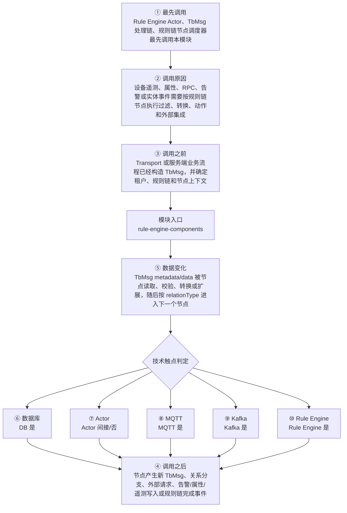

# Thingsboard Rule Engine Components 模块调用链分析

> 生成范围：`rule-engine/rule-engine-components`  
> Maven artifact：`rule-engine-components`  
> packaging：`jar`  
> 分析方式：静态扫描 POM、Java 注解、入口方法、关键技术触点和类关系；不是运行时 trace。

## 完整流程图

## 十项调用链问题

| 问题 | 模块级结论 |
| --- | --- |
| ① 谁最先调用这里？ | Rule Engine Actor、TbMsg 处理链、规则链节点调度器最先调用本模块 |
| ② 为什么会调用？ | 设备遥测、属性、RPC、告警或实体事件需要按规则链节点执行过滤、转换、动作和外部集成 |
| ③ 调用之前发生了什么？ | Transport 或服务端业务流程已经构造 TbMsg，并确定租户、规则链和节点上下文 |
| ④ 调用之后发生什么？ | 节点产生新 TbMsg、关系分支、外部请求、告警/属性/遥测写入或规则链完成事件 |
| ⑤ 数据如何变化？ | TbMsg metadata/data 被节点读取、校验、转换或扩展，随后按 relationType 进入下一个节点 |
| ⑥ 对数据库进行了哪些操作？ | 是，发现直接操作证据；直接操作证据：发现 Repository/JPA/Cassandra/JDBC/SSTable 或 DAO 模块操作模式。关键词触点 582 处仅作为辅助线索。 |
| ⑦ 是否发送 Actor 消息？ | 否，未发现直接操作证据；未发现直接源码证据；若发生，通常在依赖的下游模块中完成。 |
| ⑧ 是否发送 MQTT 消息？ | 是，发现直接操作证据；直接操作证据：发现 MQTT client/handler/publish/subscribe/writeAndFlush 等操作模式。关键词触点 185 处仅作为辅助线索。 |
| ⑨ 是否写入 Kafka？ | 是，发现直接操作证据；直接操作证据：发现 Kafka producer/template/listener/queue producer 操作模式。关键词触点 166 处仅作为辅助线索。 |
| ⑩ 是否写入 Rule Engine？ | 是，发现直接操作证据；直接操作证据：模块位于 rule-engine 路径，直接承载规则节点或规则引擎 API。关键词触点 6685 处仅作为辅助线索。 |

## 入口证据

- 测试框架入口: `rule-engine/rule-engine-components/src/test/java/org/thingsboard/rule/engine/action/TbAlarmNodeTest.java`
- 测试框架入口: `rule-engine/rule-engine-components/src/test/java/org/thingsboard/rule/engine/action/TbCreateRelationNodeTest.java`
- 测试框架入口: `rule-engine/rule-engine-components/src/test/java/org/thingsboard/rule/engine/action/TbDeviceStateNodeTest.java`
- 测试框架入口: `rule-engine/rule-engine-components/src/test/java/org/thingsboard/rule/engine/action/TbLogNodeTest.java`
- 测试框架入口: `rule-engine/rule-engine-components/src/test/java/org/thingsboard/rule/engine/credentials/CertPemCredentialsTest.java`
- 测试框架入口: `rule-engine/rule-engine-components/src/test/java/org/thingsboard/rule/engine/edge/TbMsgPushToEdgeNodeTest.java`
- 测试框架入口: `rule-engine/rule-engine-components/src/test/java/org/thingsboard/rule/engine/filter/TbAssetTypeSwitchNodeTest.java`
- 测试框架入口: `rule-engine/rule-engine-components/src/test/java/org/thingsboard/rule/engine/filter/TbCheckAlarmStatusNodeTest.java`
- 测试框架入口: 其余 55 处入口省略

## 静态关键词统计（不等同于实际发送/写入）

- database: 582 处静态触点；直接操作证据：发现 Repository/JPA/Cassandra/JDBC/SSTable 或 DAO 模块操作模式。关键词触点 582 处仅作为辅助线索。
- actor: 9 处静态触点；未发现直接源码证据；若发生，通常在依赖的下游模块中完成。
- mqtt: 185 处静态触点；直接操作证据：发现 MQTT client/handler/publish/subscribe/writeAndFlush 等操作模式。关键词触点 185 处仅作为辅助线索。
- kafka: 166 处静态触点；直接操作证据：发现 Kafka producer/template/listener/queue producer 操作模式。关键词触点 166 处仅作为辅助线索。
- rule_engine: 6685 处静态触点；直接操作证据：模块位于 rule-engine 路径，直接承载规则节点或规则引擎 API。关键词触点 6685 处仅作为辅助线索。
- cache: 304 处静态触点；直接操作证据：发现静态关键词触点。关键词触点 304 处仅作为辅助线索。
- queue: 430 处静态触点；直接操作证据：发现静态关键词触点。关键词触点 430 处仅作为辅助线索。
- rest: 25 处静态触点；直接操作证据：发现静态关键词触点。关键词触点 25 处仅作为辅助线索。
- websocket: 644 处静态触点；直接操作证据：发现静态关键词触点。关键词触点 644 处仅作为辅助线索。
- transport: 4 处静态触点；直接操作证据：发现静态关键词触点。关键词触点 4 处仅作为辅助线索。

## 调用前后数据流

1. 调用前：Transport 或服务端业务流程已经构造 TbMsg，并确定租户、规则链和节点上下文
2. 模块入口：`rule-engine-components` 通过入口类、依赖 API、构建聚合或子模块暴露能力。
3. 模块内转换：TbMsg metadata/data 被节点读取、校验、转换或扩展，随后按 relationType 进入下一个节点
4. 调用后：节点产生新 TbMsg、关系分支、外部请求、告警/属性/遥测写入或规则链完成事件
5. 数据库/Actor/MQTT/Kafka/Rule Engine 这些动作若没有直接触点，通常发生在依赖的 `application`、`dao`、`common/queue`、`common/transport` 或 `rule-engine` 模块中。

## 子模块与依赖

### 子模块

- 无子模块。

### 主要依赖

- `org.thingsboard.common:util`
- `org.thingsboard:dao`
- `org.thingsboard.common.transport:transport-api`
- `ch.qos.logback:logback-core`
- `ch.qos.logback:logback-classic`
- `org.thingsboard.rule-engine:rule-engine-api`
- `org.thingsboard:netty-mqtt`
- `com.google.guava:guava`
- `com.google.code.gson:gson`
- `org.springframework:spring-web`
- `org.apache.kafka:kafka-clients`
- `com.amazonaws:aws-java-sdk-sns`
- `com.google.cloud:google-cloud-pubsub`
- `com.google.api.grpc:proto-google-common-protos`
- `com.rabbitmq:amqp-client`
- `org.bouncycastle:bcpkix-jdk15on`
- `org.locationtech.spatial4j:spatial4j`
- `org.locationtech.jts:jts-core`
- `com.sun.mail:javax.mail`
- `net.objecthunter:exp4j`
- `org.springframework.boot:spring-boot-starter-test`
- `org.junit.vintage:junit-vintage-engine`
- `org.awaitility:awaitility`
- `org.mock-server:mockserver-netty`
- `org.mock-server:mockserver-client-java`
- `com.jayway.jsonpath:json-path`

## 关键类型样本

- `TbAbstractAlarmNode` (class, `rule-engine/rule-engine-components/src/main/java/org/thingsboard/rule/engine/action/TbAbstractAlarmNode.java`)
- `TbAbstractAlarmNodeConfiguration` (class, `rule-engine/rule-engine-components/src/main/java/org/thingsboard/rule/engine/action/TbAbstractAlarmNodeConfiguration.java`)
- `TbAbstractCustomerActionNode` (class, `rule-engine/rule-engine-components/src/main/java/org/thingsboard/rule/engine/action/TbAbstractCustomerActionNode.java`)
- `CustomerKey` (class, `rule-engine/rule-engine-components/src/main/java/org/thingsboard/rule/engine/action/TbAbstractCustomerActionNode.java`)
- `CustomerCacheLoader` (class, `rule-engine/rule-engine-components/src/main/java/org/thingsboard/rule/engine/action/TbAbstractCustomerActionNode.java`)
- `TbAbstractCustomerActionNodeConfiguration` (class, `rule-engine/rule-engine-components/src/main/java/org/thingsboard/rule/engine/action/TbAbstractCustomerActionNodeConfiguration.java`)
- `TbAbstractRelationActionNode` (class, `rule-engine/rule-engine-components/src/main/java/org/thingsboard/rule/engine/action/TbAbstractRelationActionNode.java`)
- `EntityKey` (class, `rule-engine/rule-engine-components/src/main/java/org/thingsboard/rule/engine/action/TbAbstractRelationActionNode.java`)
- `SearchDirectionIds` (class, `rule-engine/rule-engine-components/src/main/java/org/thingsboard/rule/engine/action/TbAbstractRelationActionNode.java`)
- `EntityCacheLoader` (class, `rule-engine/rule-engine-components/src/main/java/org/thingsboard/rule/engine/action/TbAbstractRelationActionNode.java`)
- `RelationContainer` (class, `rule-engine/rule-engine-components/src/main/java/org/thingsboard/rule/engine/action/TbAbstractRelationActionNode.java`)
- `TbAbstractRelationActionNodeConfiguration` (class, `rule-engine/rule-engine-components/src/main/java/org/thingsboard/rule/engine/action/TbAbstractRelationActionNodeConfiguration.java`)
- `TbAlarmResult` (class, `rule-engine/rule-engine-components/src/main/java/org/thingsboard/rule/engine/action/TbAlarmResult.java`)
- `TbAssignToCustomerNode` (class, `rule-engine/rule-engine-components/src/main/java/org/thingsboard/rule/engine/action/TbAssignToCustomerNode.java`)
- `TbAssignToCustomerNodeConfiguration` (class, `rule-engine/rule-engine-components/src/main/java/org/thingsboard/rule/engine/action/TbAssignToCustomerNodeConfiguration.java`)
- `TbClearAlarmNode` (class, `rule-engine/rule-engine-components/src/main/java/org/thingsboard/rule/engine/action/TbClearAlarmNode.java`)
- `TbClearAlarmNodeConfiguration` (class, `rule-engine/rule-engine-components/src/main/java/org/thingsboard/rule/engine/action/TbClearAlarmNodeConfiguration.java`)
- `TbCopyAttributesToEntityViewNode` (class, `rule-engine/rule-engine-components/src/main/java/org/thingsboard/rule/engine/action/TbCopyAttributesToEntityViewNode.java`)
- `TbCreateAlarmNode` (class, `rule-engine/rule-engine-components/src/main/java/org/thingsboard/rule/engine/action/TbCreateAlarmNode.java`)
- `TbCreateAlarmNodeConfiguration` (class, `rule-engine/rule-engine-components/src/main/java/org/thingsboard/rule/engine/action/TbCreateAlarmNodeConfiguration.java`)
- `TbCreateRelationNode` (class, `rule-engine/rule-engine-components/src/main/java/org/thingsboard/rule/engine/action/TbCreateRelationNode.java`)
- `TbCreateRelationNodeConfiguration` (class, `rule-engine/rule-engine-components/src/main/java/org/thingsboard/rule/engine/action/TbCreateRelationNodeConfiguration.java`)
- `TbDeleteRelationNode` (class, `rule-engine/rule-engine-components/src/main/java/org/thingsboard/rule/engine/action/TbDeleteRelationNode.java`)
- `TbDeleteRelationNodeConfiguration` (class, `rule-engine/rule-engine-components/src/main/java/org/thingsboard/rule/engine/action/TbDeleteRelationNodeConfiguration.java`)
- `TbDeviceStateNode` (class, `rule-engine/rule-engine-components/src/main/java/org/thingsboard/rule/engine/action/TbDeviceStateNode.java`)
- `TbDeviceStateNodeConfiguration` (class, `rule-engine/rule-engine-components/src/main/java/org/thingsboard/rule/engine/action/TbDeviceStateNodeConfiguration.java`)
- `TbLogNode` (class, `rule-engine/rule-engine-components/src/main/java/org/thingsboard/rule/engine/action/TbLogNode.java`)
- `TbLogNodeConfiguration` (class, `rule-engine/rule-engine-components/src/main/java/org/thingsboard/rule/engine/action/TbLogNodeConfiguration.java`)
- `TbMsgCountNode` (class, `rule-engine/rule-engine-components/src/main/java/org/thingsboard/rule/engine/action/TbMsgCountNode.java`)
- `TbMsgCountNodeConfiguration` (class, `rule-engine/rule-engine-components/src/main/java/org/thingsboard/rule/engine/action/TbMsgCountNodeConfiguration.java`)
- `TbSaveToCustomCassandraTableNode` (class, `rule-engine/rule-engine-components/src/main/java/org/thingsboard/rule/engine/action/TbSaveToCustomCassandraTableNode.java`)
- `TbSaveToCustomCassandraTableNodeConfiguration` (class, `rule-engine/rule-engine-components/src/main/java/org/thingsboard/rule/engine/action/TbSaveToCustomCassandraTableNodeConfiguration.java`)
- `TbUnassignFromCustomerNode` (class, `rule-engine/rule-engine-components/src/main/java/org/thingsboard/rule/engine/action/TbUnassignFromCustomerNode.java`)
- `TbUnassignFromCustomerNodeConfiguration` (class, `rule-engine/rule-engine-components/src/main/java/org/thingsboard/rule/engine/action/TbUnassignFromCustomerNodeConfiguration.java`)
- `TbSnsNode` (class, `rule-engine/rule-engine-components/src/main/java/org/thingsboard/rule/engine/aws/sns/TbSnsNode.java`)
- `TbSnsNodeConfiguration` (class, `rule-engine/rule-engine-components/src/main/java/org/thingsboard/rule/engine/aws/sns/TbSnsNodeConfiguration.java`)
- `TbSqsNode` (class, `rule-engine/rule-engine-components/src/main/java/org/thingsboard/rule/engine/aws/sqs/TbSqsNode.java`)
- `TbSqsNodeConfiguration` (class, `rule-engine/rule-engine-components/src/main/java/org/thingsboard/rule/engine/aws/sqs/TbSqsNodeConfiguration.java`)
- `QueueType` (enum, `rule-engine/rule-engine-components/src/main/java/org/thingsboard/rule/engine/aws/sqs/TbSqsNodeConfiguration.java`)
- `AnonymousCredentials` (class, `rule-engine/rule-engine-components/src/main/java/org/thingsboard/rule/engine/credentials/AnonymousCredentials.java`)
- 其余 20 项已省略；完整源码证据可通过本模块 Java 文件继续追踪。

## 阅读建议

- 先看“完整流程图”确认模块在全链路中的位置。
- 再看入口证据判断调用来源是 HTTP、MQTT/Transport、Actor、Kafka、Rule Engine、DAO、测试还是构建聚合。
- 最后用触点统计区分直接行为和下游间接行为，避免把依赖模块的数据库写入误认为本模块直接写入。
